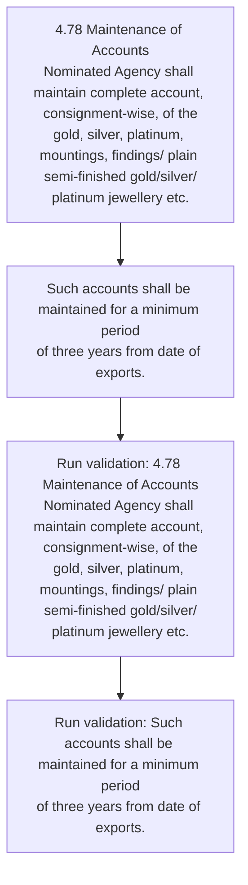

# Chapter 4 / Section 4.78: Maintenance of Accounts

**Chapter Title:** Duty Exemption / Remission Schemes

**Pages:** 46

**Purpose:** 4.78 Maintenance of Accounts
Nominated Agency shall maintain complete account, consignment-wise, of the
gold, silver, platinum, mountings, findings/ plain semi-finished gold/silver/
platinum jewellery etc.

**Purpose Thanglish:** Indha Maintenance of Accounts section-la, 4.78 Maintenance of Accounts
Nominated Agency kandippa maintain complete account, consignment-wise, of the
gold, silver, platinum, mountings, findings/ plain semi-finished gold/silver/
platinum jewellery etc.

**Summary:** 4.78 Maintenance of Accounts
Nominated Agency shall maintain complete account, consignment-wise, of the
gold, silver, platinum, mountings, findings/ plain semi-finished gold/silver/
platinum jewellery etc. imported for execution of each export order, exports
effected and quantity of gold, silver, platinum mountings, findings etc. released
against such exports.

**Business Meaning:** Maintenance of Accounts governs how DGFT business controls should be applied, validated, and enforced.

**Business Explanation:** Maintenance of Accounts explains the operating rule set that DEKAI should enforce. Key control points include 4.78 Maintenance of Accounts
Nominated Agency shall maintain complete account, consignment-wise, of the
gold, silver, platinum, mountings, findings/ plain semi-finished gold/silver/
platinum jewellery etc. The section also drives actions such as 4.78 Maintenance of Accounts
Nominated Agency shall maintain complete account, consignment-wise, of the
gold, silver, platinum, mountings, findings/ plain semi-finished gold/silver/
platinum jewellery etc..

**Business Explanation Thanglish:** Indha Maintenance of Accounts section-la, Maintenance of Accounts explains the operating rule set that DEKAI should enforce. Key control points include 4.78 Maintenance of Accounts
Nominated Agency kandippa maintain complete account, consignment-wise, of the
gold, silver, platinum, mountings, findings/ plain semi-finished gold/silver/
platinum jewellery etc. The section also drives actions such as 4.78 Maintenance of Accounts
Nominated Agency kandippa maintain complete account, consignment-wise, of the
gold, silver, platinum, mountings, findings/ plain semi-finished gold/silver/
platinum jewellery etc..

## Business Logic
- 4.78 Maintenance of Accounts
Nominated Agency shall maintain complete account, consignment-wise, of the
gold, silver, platinum, mountings, findings/ plain semi-finished gold/silver/
platinum jewellery etc.
- Such accounts shall be maintained for a minimum period
of three years from date of exports.

## Business Rules
- rule_id=CH4-SEC4_78-R001, rule_description=4.78 Maintenance of Accounts
Nominated Agency shall maintain complete account, consignment-wise, of the
gold, silver, platinum, mountings, findings/ plain semi-finished gold/silver/
platinum jewellery etc., trigger=Maintenance of Accounts, condition=Section 4.78 is applicable, validation=4.78 Maintenance of Accounts
Nominated Agency shall maintain complete account, consignment-wise, of the
gold, silver, platinum, mountings, findings/ plain semi-finished gold/silver/
platinum jewellery etc., action=4.78 Maintenance of Accounts
Nominated Agency shall maintain complete account, consignment-wise, of the
gold, silver, platinum, mountings, findings/ plain semi-finished gold/silver/
platinum jewellery etc., exception=No explicit exception found in uploaded documents., output=DEKAI should produce a compliance decision for 4.78 - Maintenance of Accounts.
- rule_id=CH4-SEC4_78-R002, rule_description=Such accounts shall be maintained for a minimum period
of three years from date of exports., trigger=Maintenance of Accounts, condition=Section 4.78 is applicable, validation=Such accounts shall be maintained for a minimum period
of three years from date of exports., action=Such accounts shall be maintained for a minimum period
of three years from date of exports., exception=No explicit exception found in uploaded documents., output=DEKAI should produce a compliance decision for 4.78 - Maintenance of Accounts.

## Conditions
- None identified

## Condition Logic
- id=4.4.78.1, if=Section 4.78 is applicable, then=4.78 Maintenance of Accounts
Nominated Agency shall maintain complete account, consignment-wise, of the
gold, silver, platinum, mountings, findings/ plain semi-finished gold/silver/
platinum jewellery etc., source=Derived from uploaded documents

## Validations
- 4.78 Maintenance of Accounts
Nominated Agency shall maintain complete account, consignment-wise, of the
gold, silver, platinum, mountings, findings/ plain semi-finished gold/silver/
platinum jewellery etc.
- Such accounts shall be maintained for a minimum period
of three years from date of exports.

## Exceptions
- None identified

## Dependencies
- 4

## Authorities
- None identified

## Required Documents
- None identified

## Timelines
- Such accounts shall be maintained for a minimum period
of three years from date of exports.

## Actions
- 4.78 Maintenance of Accounts
Nominated Agency shall maintain complete account, consignment-wise, of the
gold, silver, platinum, mountings, findings/ plain semi-finished gold/silver/
platinum jewellery etc.
- Such accounts shall be maintained for a minimum period
of three years from date of exports.

## Workflow
- 4.78 Maintenance of Accounts
Nominated Agency shall maintain complete account, consignment-wise, of the
gold, silver, platinum, mountings, findings/ plain semi-finished gold/silver/
platinum jewellery etc.
- Such accounts shall be maintained for a minimum period
of three years from date of exports.
- Run validation: 4.78 Maintenance of Accounts
Nominated Agency shall maintain complete account, consignment-wise, of the
gold, silver, platinum, mountings, findings/ plain semi-finished gold/silver/
platinum jewellery etc.
- Run validation: Such accounts shall be maintained for a minimum period
of three years from date of exports.

## Workflow ASCII
```text
Maintenance of Accounts
4.78 Maintenance of Accounts
Nominated Agency shall maintain complete account, consignment-wise, of the
gold, silver, platinum, mountings, findings/ plain semi-finished gold/silver/
platinum jewellery etc.
   |
   v
Such accounts shall be maintained for a minimum period
of three years from date of exports.
   |
   v
Run validation: 4.78 Maintenance of Accounts
Nominated Agency shall maintain complete account, consignment-wise, of the
gold, silver, platinum, mountings, findings/ plain semi-finished gold/silver/
platinum jewellery etc.
   |
   v
Run validation: Such accounts shall be maintained for a minimum period
of three years from date of exports.
```

## Decision Tree
- IF section 4.78 applies THEN 4.78 Maintenance of Accounts
Nominated Agency shall maintain complete account, consignment-wise, of the
gold, silver, platinum, mountings, findings/ plain semi-finished gold/silver/
platinum jewellery etc.

## Decision Tree ASCII
```text
Maintenance of Accounts Decision
IF section 4.78 applies THEN 4.78 Maintenance of Accounts
Nominated Agency shall maintain complete account, consignment-wise, of the
gold, silver, platinum, mountings, findings/ plain semi-finished gold/silver/
platinum jewellery etc.
```

## Examples
- User asks to process Maintenance of Accounts; the platform checks conditions, validations, and documents before action.

**Real-world Example:** Example: an importer or exporter invokes Maintenance of Accounts, submits the prescribed DGFT records, and DEKAI uses the extracted rules to 4.78 maintenance of accounts
nominated agency shall maintain complete account, consignment-wise, of the
gold, silver, platinum, mountings, findings/ plain semi-finished gold/silver/
platinum jewellery etc..

**Real-world Example Thanglish:** Indha Maintenance of Accounts section-la, Example: an importer or exporter invokes Maintenance of Accounts, submits the prescribed DGFT records, and DEKAI uses the extracted rules to 4.78 maintenance of accounts
nominated agency kandippa maintain complete account, consignment-wise, of the
gold, silver, platinum, mountings, findings/ plain semi-finished gold/silver/
platinum jewellery etc..

## AI Rules
- IF detected context matches section rule THEN enforce: 4.78 Maintenance of Accounts
Nominated Agency shall maintain complete account, consignment-wise, of the
gold, silver, platinum, mountings, findings/ plain semi-finished gold/silver/
platinum jewellery etc.
- IF detected context matches section rule THEN enforce: Such accounts shall be maintained for a minimum period
of three years from date of exports.
- IF validations pass THEN recommend action: 4.78 Maintenance of Accounts
Nominated Agency shall maintain complete account, consignment-wise, of the
gold, silver, platinum, mountings, findings/ plain semi-finished gold/silver/
platinum jewellery etc.

## Database Fields
- name=section_code, type=string, required=True, source=parsed_section_heading
- name=section_title, type=string, required=True, source=parsed_section_heading
- name=the_flag, type=boolean, required=False, source=keyword:the
- name=etc_flag, type=boolean, required=False, source=keyword:etc
- name=for_flag, type=boolean, required=False, source=keyword:for
- name=and_flag, type=boolean, required=False, source=keyword:and
- name=gold_flag, type=boolean, required=False, source=keyword:gold
- name=each_flag, type=boolean, required=False, source=keyword:each
- name=such_flag, type=boolean, required=False, source=keyword:such
- name=from_flag, type=boolean, required=False, source=keyword:from

## API Requirements
- method=GET, path=/api/dgft/sections/4.78, purpose=Retrieve knowledge payload for section 4.78, query_params=['include=workflow,decision_tree,validations'], response_fields=['section', 'title', 'summary', 'conditions', 'validations', 'exceptions', 'workflow', 'decision_tree']
- method=POST, path=/api/dgft/Maintenance-of-Accounts/validate, purpose=Validate inputs and documents for Maintenance of Accounts, request_fields=['section_code', 'section_title'], response_fields=['status', 'errors', 'warnings', 'next_actions']
- method=POST, path=/api/dgft/Maintenance-of-Accounts/execute, purpose=Trigger business action for 4.78 Maintenance of Accounts
Nominated Agency shall maintain complete account, consignment-wise, of the
gold, silver, platinum, mountings, findings/ plain semi-finished gold/silver/
platinum jewellery etc., request_fields=['section_code', 'section_title'], response_fields=['reference_id', 'status', 'authority', 'timeline']

## UI Screens
- screen_id=Maintenance_of_Accounts_overview, name=Maintenance of Accounts Overview, purpose=Show section summary, authority, timeline, and eligibility cues., widgets=['summary_card', 'conditions_table', 'authority_badges', 'timeline_panel']
- screen_id=Maintenance_of_Accounts_submission, name=Maintenance of Accounts Submission, purpose=Capture applicant data and supporting documents., widgets=['dynamic_form', 'document_uploader', 'validation_panel', 'next_action_footer'], fields=['section_code', 'section_title', 'the_flag', 'etc_flag', 'for_flag', 'and_flag', 'gold_flag', 'each_flag']

## Error Messages
- Validation failed because the section requirements were not fully met.

## FAQ
- question_en=What is the purpose of section 4.78?, answer_en=Maintenance of Accounts explains the operating rule set that DEKAI should enforce. Key control points include 4.78 Maintenance of Accounts
Nominated Agency shall maintain complete account, consignment-wise, of the
gold, silver, platinum, mountings, findings/ plain semi-finished gold/silver/
platinum jewellery etc. The section also drives actions such as 4.78 Maintenance of Accounts
Nominated Agency shall maintain complete account, consignment-wise, of the
gold, silver, platinum, mountings, findings/ plain semi-finished gold/silver/
platinum jewellery etc.., question_thanglish=Indha Maintenance of Accounts section-la, What is the purpose of section 4.78?, answer_thanglish=Indha Maintenance of Accounts section-la, Maintenance of Accounts explains the operating rule set that DEKAI should enforce. Key control points include 4.78 Maintenance of Accounts
Nominated Agency kandippa maintain complete account, consignment-wise, of the
gold, silver, platinum, mountings, findings/ plain semi-finished gold/silver/
platinum jewellery etc. The section also drives actions such as 4.78 Maintenance of Accounts
Nominated Agency kandippa maintain complete account, consignment-wise, of the
gold, silver, platinum, mountings, findings/ plain semi-finished gold/silver/
platinum jewellery etc..
- question_en=What documents are required under Maintenance of Accounts?, answer_en=Not explicitly covered in uploaded documents., question_thanglish=Indha Maintenance of Accounts section-la, What documents are required under Maintenance of Accounts?, answer_thanglish=Indha Maintenance of Accounts section-la, Not explicitly covered in uploaded documents.
- question_en=Which authority handles Maintenance of Accounts?, answer_en=Not explicitly covered in uploaded documents., question_thanglish=Indha Maintenance of Accounts section-la, Which authority handles Maintenance of Accounts?, answer_thanglish=Indha Maintenance of Accounts section-la, Not explicitly covered in uploaded documents.

## Questions Users May Ask
- What does Maintenance of Accounts require?
- Which documents are needed for Maintenance of Accounts?
- How does DEKAI validate Maintenance of Accounts requests?
- What action should be taken for Maintenance of Accounts?

## Expected AI Answers
- Maintenance of Accounts requires the platform to interpret the section text, apply the extracted business rules, and present the correct next action.
- Required documents are inferred from the section text: no explicit documents were detected.
- DEKAI validates Maintenance of Accounts by checking conditions, required documents, authority references, and exception clauses before recommending an outcome.
- The primary extracted action is: 4.78 Maintenance of Accounts
Nominated Agency shall maintain complete account, consignment-wise, of the
gold, silver, platinum, mountings, findings/ plain semi-finished gold/silver/
platinum jewellery etc.

## AI Q&A Examples
- question_en=User asks: How do I comply with Maintenance of Accounts?, answer_en=AI answers: DEKAI should evaluate section 4.78, apply the extracted rules, and guide the user through 4.78 Maintenance of Accounts
Nominated Agency shall maintain complete account, consignment-wise, of the
gold, silver, platinum, mountings, findings/ plain semi-finished gold/silver/
platinum jewellery etc.., question_thanglish=Indha Maintenance of Accounts section-la, User asks: How do I comply with Maintenance of Accounts?, answer_thanglish=Indha Maintenance of Accounts section-la, AI answers: DEKAI should evaluate section 4.78, apply the extracted rules, and guide the user through 4.78 Maintenance of Accounts
Nominated Agency kandippa maintain complete account, consignment-wise, of the
gold, silver, platinum, mountings, findings/ plain semi-finished gold/silver/
platinum jewellery etc..
- question_en=User asks: Which validations apply to Maintenance of Accounts?, answer_en=AI answers: Applicable validations are 4.78 Maintenance of Accounts
Nominated Agency shall maintain complete account, consignment-wise, of the
gold, silver, platinum, mountings, findings/ plain semi-finished gold/silver/
platinum jewellery etc., Such accounts shall be maintained for a minimum period
of three years from date of exports., question_thanglish=Indha Maintenance of Accounts section-la, User asks: Which validations apply to Maintenance of Accounts?, answer_thanglish=Indha Maintenance of Accounts section-la, AI answers: Applicable validations are 4.78 Maintenance of Accounts
Nominated Agency kandippa maintain complete account, consignment-wise, of the
gold, silver, platinum, mountings, findings/ plain semi-finished gold/silver/
platinum jewellery etc., Such accounts kandippa be maintained for a minimum period
of three years from date of exports.

## DEKAI AI Implementation Notes
- Capture chapter 4, section 4.78, title, and page references as immutable knowledge metadata.
- Bind validations for Maintenance of Accounts into a rule engine keyed by the rule IDs extracted for this section.
- Show contextual links to related sections: 4.

## DEKAI AI Implementation Notes Thanglish
- Indha Maintenance of Accounts section-la, Capture chapter 4, section 4.78, title, and page references as immutable knowledge metadata.
- Indha Maintenance of Accounts section-la, Bind validations for Maintenance of Accounts into a rule engine keyed by the rule IDs extracted for this section.
- Indha Maintenance of Accounts section-la, Show contextual links to related sections: 4.

## AI Metadata
- Keywords: the, etc, for, and, gold, each, such, from, date, shall, plain, order, three, years, Agency, silver, export, period, account, exports
- Search Keywords: the, etc, for, and, gold, each, such, from, date, shall, plain, order, three, years, Agency, silver, export, period, account, exports
- Intent: Support Maintenance of Accounts processing and compliance validation.
- Tags: 4.78, Maintenance of Accounts, business-rule, dgft
- Related Sections: 4
- Related Chapters: 
- Related Rules: 4.78 Maintenance of Accounts
Nominated Agency shall maintain complete account, consignment-wise, of the
gold, silver, platinum, mountings, findings/ plain semi-finished gold/silver/
platinum jewellery etc., Such accounts shall be maintained for a minimum period
of three years from date of exports.

## Mermaid


## PlantUML
```plantuml
@startuml
start
:4.78 Maintenance of Accounts
Nominated Agency shall maintain complete account, consignment-wise, of the
gold, silver, platinum, mountings, findings/ plain semi-finished gold/silver/
platinum jewellery etc.;
:Such accounts shall be maintained for a minimum period
of three years from date of exports.;
:Run validation\: 4.78 Maintenance of Accounts
Nominated Agency shall maintain complete account, consignment-wise, of the
gold, silver, platinum, mountings, findings/ plain semi-finished gold/silver/
platinum jewellery etc.;
:Run validation\: Such accounts shall be maintained for a minimum period
of three years from date of exports.;
stop
@enduml
```
