# Chapter 4 / Section 4.79: Export through Exhibitions/Export Promotion Tours/ Export of

**Chapter Title:** Duty Exemption / Remission Schemes

**Pages:** 46, 47, 48

**Purpose:** 4.79 Export through Exhibitions/Export Promotion Tours/ Export of
Branded Jewellery
(a) Nominated Agencies shall produce to Customs Authorities letter in
original or its certified copy, containing Government’s approval for
holding exhibition/export of branded jewellery.

**Purpose Thanglish:** Indha Export through Exhibitions/Export Promotion Tours/ Export of section-la, 4.79 export through Exhibitions/export Promotion Tours/ export of
Branded Jewellery
(a) Nominated Agencies kandippa produce to Customs Authorities letter in
original or its certified copy, containing Government’s approval for
holding exhibition/export of branded jewellery.

**Summary:** 4.79 Export through Exhibitions/Export Promotion Tours/ Export of
Branded Jewellery
(a) Nominated Agencies shall produce to Customs Authorities letter in
original or its certified copy, containing Government’s approval for
holding exhibition/export of branded jewellery. Any other person shall
produce to the Asst. Commissioner, customs letter in original or its
certified copy containing GJEPC’s approval for holding exhibitions/
export promotion tour/export of branded jewellery.

**Business Meaning:** Export through Exhibitions/Export Promotion Tours/ Export of governs how DGFT business controls should be applied, validated, and enforced.

**Business Explanation:** Export through Exhibitions/Export Promotion Tours/ Export of explains the operating rule set that DEKAI should enforce. Key control points include 4.79 Export through Exhibitions/Export Promotion Tours/ Export of
Branded Jewellery
(a) Nominated Agencies shall produce to Customs Authorities letter in
original or its certified copy, containing Government’s approval for
holding exhibition/export of branded jewellery. The section also drives actions such as (g)
In case of exports through nominated agency, exporter shall submit
proof of exports to nominated agency within 15 days of exports, who
shall, after verifying documents, release admissible quantity of the gold/
silver/ platinum etc..

**Business Explanation Thanglish:** Indha Export through Exhibitions/Export Promotion Tours/ Export of section-la, export through Exhibitions/export Promotion Tours/ export of explains the operating rule set that DEKAI should enforce. Key control points include 4.79 export through Exhibitions/export Promotion Tours/ export of
Branded Jewellery
(a) Nominated Agencies kandippa produce to Customs Authorities letter in
original or its certified copy, containing Government’s approval for
holding exhibition/export of branded jewellery. The section also drives actions such as (g)
In case of exports through nominated agency, exporter kandippa submit
proof of exports to nominated agency within 15 days of exports, who
kandippa, after verifying documents, release admissible quantity of the gold/
silver/ platinum etc..

## Business Logic
- 4.79 Export through Exhibitions/Export Promotion Tours/ Export of
Branded Jewellery
(a) Nominated Agencies shall produce to Customs Authorities letter in
original or its certified copy, containing Government’s approval for
holding exhibition/export of branded jewellery.
- Any other person shall
produce to the Asst.
- 121
(f)
Customs authorities shall return two copies of shipping bill and
connected invoice duly attested.
- One copy shall be sent to person who
presented documents and the other copy shall be sent by Customs to
office of nominated agency /exporter.
- (g)
In case of exports through nominated agency, exporter shall submit
proof of exports to nominated agency within 15 days of exports, who
shall, after verifying documents, release admissible quantity of the gold/
silver/ platinum etc.
- Integrated Goods and Services tax and Compensation Cess leviable
under Section 3(7) AND 3(9) of Customs Tariff Act shall be payable
separately on imports.
- BG /LUT shall be redeemed only when the
exporter has furnished proof of exports to nominated agency and
accounted for the use of items supplied in advance in export product.
- (i)
For redemption of bond/ BG /LUT executed with Customs, Nominated
Agency /exporter shall furnish a statement indicating items, its quantity
and value supplied by foreign buyer, corresponding Bill of Entry number
and date, number of each of shipping bills against which corresponding
exports was made.
- 4.79 Export through Exhibitions/Export Promotion Tours/ Export of
Branded Jewellery
(a)
Nominated Agencies shall produce to Customs Authorities letter in
original or its certified copy, containing Government’s approval for
holding exhibition/export of branded jewellery.
- (b) In case of re-import, such items, on arrival, shall be verified along with
export documents before clearance.
- (c) Exports under this scheme shall be subject to following conditions for
following modes of export:
(i) Export of Gems and Jewellery for holding/participating in
overseas exhibition.
- (a) Items not sold abroad shall be re- imported within 60 days of
close of exhibition.
- However, in case exporter is participating in
more than one exhibition within 45 days of close of first
exhibition, then 60 days shall be counted from date of close of
last exhibition.
- In case of exhibition in USA, the time period shall
be 90 days instead of 60 days mentioned above.
- In case of
personal carriage of gems and jewellery for holding
/participating in overseas exhibitions, value of such gems and
jewellery shall not exceed US $ 5 million.
- However, as a one-time relaxation, in cases
where the re-import period is expiring on or between
01.03.2026 and 31.05.2026, such re-import period shall stand
automatically extended by 30 days from the date of its expiry.xvii
(b) Exporter shall take replenishment from nominated agency
within 120 days from the close of the exhibition gold /silver /
platinum for replenishment content against items sold abroad in
exhibition.
- Personal carriage/export through airfreight/post parcel route
of gold/silver/ platinum jewellery, cut and polished diamonds, precious,
semi-precious stones, beads and articles as samples upto US $ 1 Million
for export promotion tours/photo shoots/fashion shows and temporary
display/ sale abroad is also permitted with approval of Gem & Jewellery
EPC subject to the condition that promoter would bring back jewellery
/ goods or repatriate sale proceeds within 45 days from date of
departure through normal banking channel.
- In case of personal carriage
for export promotion tours, exporter shall declare personal carriage of
such samples to Customs while leaving country and obtain necessary
endorsement on Export Certificate issued by Jewellery Appraiser of
Customs.
- In such cases exporter shall book with nominated agency,
within 120 days after export promotion tour or expiry of stipulated
period of 45 days, whichever is earlier, gold/silver/ platinum for
replenishment content against items sold abroad.
- 122
(b)
In case of re-import, such items, on arrival, shall be verified along with
export documents before clearance.
- (c)
Exports under this scheme shall be subject to following conditions for
following modes of export:
(i)
Export of Gems and Jewellery for holding/participating in
overseas exhibition.
- Items not sold abroad
within 365 days shall be re-imported.
- Exporter shall book with
nominated agency within 120 days after the end of stipulated
period of 365 days, gold/silver/platinum for replenishment
content against items sold abroad.
- (ii) Following documents shall be submitted for claiming such
replenishment:
(a) LEO copy of Shipping Bill with Tax invoice for export supplies;
(b) Copy of the approval letter issued by Government/GJEPC;
(c) Certificate from Nominated Agency / GJEPC as in Appendix 4-
O.
- In case of exhibitions organised by nominated agencies,
gold/silver/ platinum shall be imported as replenishment by
nominated agencies within 60 days from close of exhibition.
- (f) Nominated Agencies shall maintain a complete account of exports made,
goods sold abroad, goods re-imported, and metals purchased abroad
and imported into India.
- Such account shall be maintained for a
minimum period of three years from date of close of exhibition.

## Business Rules
- rule_id=CH4-SEC4_79-R001, rule_description=4.79 Export through Exhibitions/Export Promotion Tours/ Export of
Branded Jewellery
(a) Nominated Agencies shall produce to Customs Authorities letter in
original or its certified copy, containing Government’s approval for
holding exhibition/export of branded jewellery., trigger=Export through Exhibitions/Export Promotion Tours/ Export of, condition=4.79 Export through Exhibitions/Export Promotion Tours/ Export of
Branded Jewellery
(a) Nominated Agencies shall produce to Customs Authorities letter in
original or its certified copy, containing Government’s approval for
holding exhibition/export of branded jewellery., validation=4.79 Export through Exhibitions/Export Promotion Tours/ Export of
Branded Jewellery
(a) Nominated Agencies shall produce to Customs Authorities letter in
original or its certified copy, containing Government’s approval for
holding exhibition/export of branded jewellery., action=(g)
In case of exports through nominated agency, exporter shall submit
proof of exports to nominated agency within 15 days of exports, who
shall, after verifying documents, release admissible quantity of the gold/
silver/ platinum etc., exception=However, in case exporter is participating in
more than one exhibition within 45 days of close of first
exhibition, then 60 days shall be counted from date of close of
last exhibition., output=DEKAI should produce a compliance decision for 4.79 - Export through Exhibitions/Export Promotion Tours/ Export of.
- rule_id=CH4-SEC4_79-R002, rule_description=Any other person shall
produce to the Asst., trigger=Export through Exhibitions/Export Promotion Tours/ Export of, condition=Commissioner, customs letter in original or its
certified copy containing GJEPC’s approval for holding exhibitions/
export promotion tour/export of branded jewellery., validation=Any other person shall
produce to the Asst., action=(h)
Exporter may also obtain, in advance, gold/ silver/ platinum etc., exception=However, as a one-time relaxation, in cases
where the re-import period is expiring on or between
01.03.2026 and 31.05.2026, such re-import period shall stand
automatically extended by 30 days from the date of its expiry.xvii
(b) Exporter shall take replenishment from nominated agency
within 120 days from the close of the exhibition gold /silver /
platinum for replenishment content against items sold abroad in
exhibition., output=DEKAI should produce a compliance decision for 4.79 - Export through Exhibitions/Export Promotion Tours/ Export of.
- rule_id=CH4-SEC4_79-R003, rule_description=121
(f)
Customs authorities shall return two copies of shipping bill and
connected invoice duly attested., trigger=Export through Exhibitions/Export Promotion Tours/ Export of, condition=(g)
In case of exports through nominated agency, exporter shall submit
proof of exports to nominated agency within 15 days of exports, who
shall, after verifying documents, release admissible quantity of the gold/
silver/ platinum etc., validation=121
(f)
Customs authorities shall return two copies of shipping bill and
connected invoice duly attested., action=supplied by foreign buyer by furnishing a BG /LUT for an amount equal
to international price of such items plus customs duty payable thereon., exception=(i) Export of branded jewellery is also permitted with approval of Gem
& Jewellery EPC for display/sale in permitted shops setup abroad
or in showroom of their distributors/ agents., output=DEKAI should produce a compliance decision for 4.79 - Export through Exhibitions/Export Promotion Tours/ Export of.
- rule_id=CH4-SEC4_79-R004, rule_description=One copy shall be sent to person who
presented documents and the other copy shall be sent by Customs to
office of nominated agency /exporter., trigger=Export through Exhibitions/Export Promotion Tours/ Export of, condition=Integrated Goods and Services tax and Compensation Cess leviable
under Section 3(7) AND 3(9) of Customs Tariff Act shall be payable
separately on imports., validation=One copy shall be sent to person who
presented documents and the other copy shall be sent by Customs to
office of nominated agency /exporter., action=Integrated Goods and Services tax and Compensation Cess leviable
under Section 3(7) AND 3(9) of Customs Tariff Act shall be payable
separately on imports., exception=(i) Export of branded jewellery is also permitted with approval of Gem
& Jewellery EPC for display/sale in permitted shops setup abroad
or in showroom of their distributors/ agents., output=DEKAI should produce a compliance decision for 4.79 - Export through Exhibitions/Export Promotion Tours/ Export of.
- rule_id=CH4-SEC4_79-R005, rule_description=(g)
In case of exports through nominated agency, exporter shall submit
proof of exports to nominated agency within 15 days of exports, who
shall, after verifying documents, release admissible quantity of the gold/
silver/ platinum etc., trigger=Export through Exhibitions/Export Promotion Tours/ Export of, condition=BG /LUT shall be redeemed only when the
exporter has furnished proof of exports to nominated agency and
accounted for the use of items supplied in advance in export product., validation=(g)
In case of exports through nominated agency, exporter shall submit
proof of exports to nominated agency within 15 days of exports, who
shall, after verifying documents, release admissible quantity of the gold/
silver/ platinum etc., action=BG /LUT shall be redeemed only when the
exporter has furnished proof of exports to nominated agency and
accounted for the use of items supplied in advance in export product., exception=(i) Export of branded jewellery is also permitted with approval of Gem
& Jewellery EPC for display/sale in permitted shops setup abroad
or in showroom of their distributors/ agents., output=DEKAI should produce a compliance decision for 4.79 - Export through Exhibitions/Export Promotion Tours/ Export of.
- rule_id=CH4-SEC4_79-R006, rule_description=Integrated Goods and Services tax and Compensation Cess leviable
under Section 3(7) AND 3(9) of Customs Tariff Act shall be payable
separately on imports., trigger=Export through Exhibitions/Export Promotion Tours/ Export of, condition=4.79 Export through Exhibitions/Export Promotion Tours/ Export of
Branded Jewellery
(a)
Nominated Agencies shall produce to Customs Authorities letter in
original or its certified copy, containing Government’s approval for
holding exhibition/export of branded jewellery., validation=Integrated Goods and Services tax and Compensation Cess leviable
under Section 3(7) AND 3(9) of Customs Tariff Act shall be payable
separately on imports., action=(i)
For redemption of bond/ BG /LUT executed with Customs, Nominated
Agency /exporter shall furnish a statement indicating items, its quantity
and value supplied by foreign buyer, corresponding Bill of Entry number
and date, number of each of shipping bills against which corresponding
exports was made., exception=(i) Export of branded jewellery is also permitted with approval of Gem
& Jewellery EPC for display/sale in permitted shops setup abroad
or in showroom of their distributors/ agents., output=DEKAI should produce a compliance decision for 4.79 - Export through Exhibitions/Export Promotion Tours/ Export of.
- rule_id=CH4-SEC4_79-R007, rule_description=BG /LUT shall be redeemed only when the
exporter has furnished proof of exports to nominated agency and
accounted for the use of items supplied in advance in export product., trigger=Export through Exhibitions/Export Promotion Tours/ Export of, condition=(b) In case of re-import, such items, on arrival, shall be verified along with
export documents before clearance., validation=BG /LUT shall be redeemed only when the
exporter has furnished proof of exports to nominated agency and
accounted for the use of items supplied in advance in export product., action=In case of personal carriage
for export promotion tours, exporter shall declare personal carriage of
such samples to Customs while leaving country and obtain necessary
endorsement on Export Certificate issued by Jewellery Appraiser of
Customs., exception=(i) Export of branded jewellery is also permitted with approval of Gem
& Jewellery EPC for display/sale in permitted shops setup abroad
or in showroom of their distributors/ agents., output=DEKAI should produce a compliance decision for 4.79 - Export through Exhibitions/Export Promotion Tours/ Export of.
- rule_id=CH4-SEC4_79-R008, rule_description=(i)
For redemption of bond/ BG /LUT executed with Customs, Nominated
Agency /exporter shall furnish a statement indicating items, its quantity
and value supplied by foreign buyer, corresponding Bill of Entry number
and date, number of each of shipping bills against which corresponding
exports was made., trigger=Export through Exhibitions/Export Promotion Tours/ Export of, condition=(c) Exports under this scheme shall be subject to following conditions for
following modes of export:
(i) Export of Gems and Jewellery for holding/participating in
overseas exhibition., validation=(i)
For redemption of bond/ BG /LUT executed with Customs, Nominated
Agency /exporter shall furnish a statement indicating items, its quantity
and value supplied by foreign buyer, corresponding Bill of Entry number
and date, number of each of shipping bills against which corresponding
exports was made., action=(ii) Following documents shall be submitted for claiming such
replenishment:
(a) LEO copy of Shipping Bill with Tax invoice for export supplies;
(b) Copy of the approval letter issued by Government/GJEPC;
(c) Certificate from Nominated Agency / GJEPC as in Appendix 4-
O., exception=(i) Export of branded jewellery is also permitted with approval of Gem
& Jewellery EPC for display/sale in permitted shops setup abroad
or in showroom of their distributors/ agents., output=DEKAI should produce a compliance decision for 4.79 - Export through Exhibitions/Export Promotion Tours/ Export of.
- rule_id=CH4-SEC4_79-R009, rule_description=4.79 Export through Exhibitions/Export Promotion Tours/ Export of
Branded Jewellery
(a)
Nominated Agencies shall produce to Customs Authorities letter in
original or its certified copy, containing Government’s approval for
holding exhibition/export of branded jewellery., trigger=Export through Exhibitions/Export Promotion Tours/ Export of, condition=However, in case exporter is participating in
more than one exhibition within 45 days of close of first
exhibition, then 60 days shall be counted from date of close of
last exhibition., validation=4.79 Export through Exhibitions/Export Promotion Tours/ Export of
Branded Jewellery
(a)
Nominated Agencies shall produce to Customs Authorities letter in
original or its certified copy, containing Government’s approval for
holding exhibition/export of branded jewellery., action=(f) Nominated Agencies shall maintain a complete account of exports made,
goods sold abroad, goods re-imported, and metals purchased abroad
and imported into India., exception=(i) Export of branded jewellery is also permitted with approval of Gem
& Jewellery EPC for display/sale in permitted shops setup abroad
or in showroom of their distributors/ agents., output=DEKAI should produce a compliance decision for 4.79 - Export through Exhibitions/Export Promotion Tours/ Export of.
- rule_id=CH4-SEC4_79-R010, rule_description=(b) In case of re-import, such items, on arrival, shall be verified along with
export documents before clearance., trigger=Export through Exhibitions/Export Promotion Tours/ Export of, condition=In case of exhibition in USA, the time period shall
be 90 days instead of 60 days mentioned above., validation=(b) In case of re-import, such items, on arrival, shall be verified along with
export documents before clearance., action=Such account shall be maintained for a
minimum period of three years from date of close of exhibition., exception=(i) Export of branded jewellery is also permitted with approval of Gem
& Jewellery EPC for display/sale in permitted shops setup abroad
or in showroom of their distributors/ agents., output=DEKAI should produce a compliance decision for 4.79 - Export through Exhibitions/Export Promotion Tours/ Export of.
- rule_id=CH4-SEC4_79-R011, rule_description=(c) Exports under this scheme shall be subject to following conditions for
following modes of export:
(i) Export of Gems and Jewellery for holding/participating in
overseas exhibition., trigger=Export through Exhibitions/Export Promotion Tours/ Export of, condition=In case of
personal carriage of gems and jewellery for holding
/participating in overseas exhibitions, value of such gems and
jewellery shall not exceed US $ 5 million., validation=(c) Exports under this scheme shall be subject to following conditions for
following modes of export:
(i) Export of Gems and Jewellery for holding/participating in
overseas exhibition., action=Such account shall be maintained for a
minimum period of three years from date of close of exhibition., exception=(i) Export of branded jewellery is also permitted with approval of Gem
& Jewellery EPC for display/sale in permitted shops setup abroad
or in showroom of their distributors/ agents., output=DEKAI should produce a compliance decision for 4.79 - Export through Exhibitions/Export Promotion Tours/ Export of.
- rule_id=CH4-SEC4_79-R012, rule_description=(a) Items not sold abroad shall be re- imported within 60 days of
close of exhibition., trigger=Export through Exhibitions/Export Promotion Tours/ Export of, condition=However, as a one-time relaxation, in cases
where the re-import period is expiring on or between
01.03.2026 and 31.05.2026, such re-import period shall stand
automatically extended by 30 days from the date of its expiry.xvii
(b) Exporter shall take replenishment from nominated agency
within 120 days from the close of the exhibition gold /silver /
platinum for replenishment content against items sold abroad in
exhibition., validation=(a) Items not sold abroad shall be re- imported within 60 days of
close of exhibition., action=Such account shall be maintained for a
minimum period of three years from date of close of exhibition., exception=(i) Export of branded jewellery is also permitted with approval of Gem
& Jewellery EPC for display/sale in permitted shops setup abroad
or in showroom of their distributors/ agents., output=DEKAI should produce a compliance decision for 4.79 - Export through Exhibitions/Export Promotion Tours/ Export of.
- rule_id=CH4-SEC4_79-R013, rule_description=However, in case exporter is participating in
more than one exhibition within 45 days of close of first
exhibition, then 60 days shall be counted from date of close of
last exhibition., trigger=Export through Exhibitions/Export Promotion Tours/ Export of, condition=Personal carriage/export through airfreight/post parcel route
of gold/silver/ platinum jewellery, cut and polished diamonds, precious,
semi-precious stones, beads and articles as samples upto US $ 1 Million
for export promotion tours/photo shoots/fashion shows and temporary
display/ sale abroad is also permitted with approval of Gem & Jewellery
EPC subject to the condition that promoter would bring back jewellery
/ goods or repatriate sale proceeds within 45 days from date of
departure through normal banking channel., validation=However, in case exporter is participating in
more than one exhibition within 45 days of close of first
exhibition, then 60 days shall be counted from date of close of
last exhibition., action=Such account shall be maintained for a
minimum period of three years from date of close of exhibition., exception=(i) Export of branded jewellery is also permitted with approval of Gem
& Jewellery EPC for display/sale in permitted shops setup abroad
or in showroom of their distributors/ agents., output=DEKAI should produce a compliance decision for 4.79 - Export through Exhibitions/Export Promotion Tours/ Export of.
- rule_id=CH4-SEC4_79-R014, rule_description=In case of exhibition in USA, the time period shall
be 90 days instead of 60 days mentioned above., trigger=Export through Exhibitions/Export Promotion Tours/ Export of, condition=In case of personal carriage
for export promotion tours, exporter shall declare personal carriage of
such samples to Customs while leaving country and obtain necessary
endorsement on Export Certificate issued by Jewellery Appraiser of
Customs., validation=In case of exhibition in USA, the time period shall
be 90 days instead of 60 days mentioned above., action=Such account shall be maintained for a
minimum period of three years from date of close of exhibition., exception=(i) Export of branded jewellery is also permitted with approval of Gem
& Jewellery EPC for display/sale in permitted shops setup abroad
or in showroom of their distributors/ agents., output=DEKAI should produce a compliance decision for 4.79 - Export through Exhibitions/Export Promotion Tours/ Export of.
- rule_id=CH4-SEC4_79-R015, rule_description=In case of
personal carriage of gems and jewellery for holding
/participating in overseas exhibitions, value of such gems and
jewellery shall not exceed US $ 5 million., trigger=Export through Exhibitions/Export Promotion Tours/ Export of, condition=In such cases exporter shall book with nominated agency,
within 120 days after export promotion tour or expiry of stipulated
period of 45 days, whichever is earlier, gold/silver/ platinum for
replenishment content against items sold abroad., validation=In case of
personal carriage of gems and jewellery for holding
/participating in overseas exhibitions, value of such gems and
jewellery shall not exceed US $ 5 million., action=Such account shall be maintained for a
minimum period of three years from date of close of exhibition., exception=(i) Export of branded jewellery is also permitted with approval of Gem
& Jewellery EPC for display/sale in permitted shops setup abroad
or in showroom of their distributors/ agents., output=DEKAI should produce a compliance decision for 4.79 - Export through Exhibitions/Export Promotion Tours/ Export of.
- rule_id=CH4-SEC4_79-R016, rule_description=However, as a one-time relaxation, in cases
where the re-import period is expiring on or between
01.03.2026 and 31.05.2026, such re-import period shall stand
automatically extended by 30 days from the date of its expiry.xvii
(b) Exporter shall take replenishment from nominated agency
within 120 days from the close of the exhibition gold /silver /
platinum for replenishment content against items sold abroad in
exhibition., trigger=Export through Exhibitions/Export Promotion Tours/ Export of, condition=122
(b)
In case of re-import, such items, on arrival, shall be verified along with
export documents before clearance., validation=However, as a one-time relaxation, in cases
where the re-import period is expiring on or between
01.03.2026 and 31.05.2026, such re-import period shall stand
automatically extended by 30 days from the date of its expiry.xvii
(b) Exporter shall take replenishment from nominated agency
within 120 days from the close of the exhibition gold /silver /
platinum for replenishment content against items sold abroad in
exhibition., action=Such account shall be maintained for a
minimum period of three years from date of close of exhibition., exception=(i) Export of branded jewellery is also permitted with approval of Gem
& Jewellery EPC for display/sale in permitted shops setup abroad
or in showroom of their distributors/ agents., output=DEKAI should produce a compliance decision for 4.79 - Export through Exhibitions/Export Promotion Tours/ Export of.
- rule_id=CH4-SEC4_79-R017, rule_description=Personal carriage/export through airfreight/post parcel route
of gold/silver/ platinum jewellery, cut and polished diamonds, precious,
semi-precious stones, beads and articles as samples upto US $ 1 Million
for export promotion tours/photo shoots/fashion shows and temporary
display/ sale abroad is also permitted with approval of Gem & Jewellery
EPC subject to the condition that promoter would bring back jewellery
/ goods or repatriate sale proceeds within 45 days from date of
departure through normal banking channel., trigger=Export through Exhibitions/Export Promotion Tours/ Export of, condition=(c)
Exports under this scheme shall be subject to following conditions for
following modes of export:
(i)
Export of Gems and Jewellery for holding/participating in
overseas exhibition., validation=In case of personal carriage
for export promotion tours, exporter shall declare personal carriage of
such samples to Customs while leaving country and obtain necessary
endorsement on Export Certificate issued by Jewellery Appraiser of
Customs., action=Such account shall be maintained for a
minimum period of three years from date of close of exhibition., exception=(i) Export of branded jewellery is also permitted with approval of Gem
& Jewellery EPC for display/sale in permitted shops setup abroad
or in showroom of their distributors/ agents., output=DEKAI should produce a compliance decision for 4.79 - Export through Exhibitions/Export Promotion Tours/ Export of.
- rule_id=CH4-SEC4_79-R018, rule_description=In case of personal carriage
for export promotion tours, exporter shall declare personal carriage of
such samples to Customs while leaving country and obtain necessary
endorsement on Export Certificate issued by Jewellery Appraiser of
Customs., trigger=Export through Exhibitions/Export Promotion Tours/ Export of, condition=Exporter shall book with
nominated agency within 120 days after the end of stipulated
period of 365 days, gold/silver/platinum for replenishment
content against items sold abroad., validation=In such cases exporter shall book with nominated agency,
within 120 days after export promotion tour or expiry of stipulated
period of 45 days, whichever is earlier, gold/silver/ platinum for
replenishment content against items sold abroad., action=Such account shall be maintained for a
minimum period of three years from date of close of exhibition., exception=(i) Export of branded jewellery is also permitted with approval of Gem
& Jewellery EPC for display/sale in permitted shops setup abroad
or in showroom of their distributors/ agents., output=DEKAI should produce a compliance decision for 4.79 - Export through Exhibitions/Export Promotion Tours/ Export of.
- rule_id=CH4-SEC4_79-R019, rule_description=In such cases exporter shall book with nominated agency,
within 120 days after export promotion tour or expiry of stipulated
period of 45 days, whichever is earlier, gold/silver/ platinum for
replenishment content against items sold abroad., trigger=Export through Exhibitions/Export Promotion Tours/ Export of, condition=(ii) Following documents shall be submitted for claiming such
replenishment:
(a) LEO copy of Shipping Bill with Tax invoice for export supplies;
(b) Copy of the approval letter issued by Government/GJEPC;
(c) Certificate from Nominated Agency / GJEPC as in Appendix 4-
O., validation=122
(b)
In case of re-import, such items, on arrival, shall be verified along with
export documents before clearance., action=Such account shall be maintained for a
minimum period of three years from date of close of exhibition., exception=(i) Export of branded jewellery is also permitted with approval of Gem
& Jewellery EPC for display/sale in permitted shops setup abroad
or in showroom of their distributors/ agents., output=DEKAI should produce a compliance decision for 4.79 - Export through Exhibitions/Export Promotion Tours/ Export of.
- rule_id=CH4-SEC4_79-R020, rule_description=122
(b)
In case of re-import, such items, on arrival, shall be verified along with
export documents before clearance., trigger=Export through Exhibitions/Export Promotion Tours/ Export of, condition=In case of exhibitions organised by nominated agencies,
gold/silver/ platinum shall be imported as replenishment by
nominated agencies within 60 days from close of exhibition., validation=(c)
Exports under this scheme shall be subject to following conditions for
following modes of export:
(i)
Export of Gems and Jewellery for holding/participating in
overseas exhibition., action=Such account shall be maintained for a
minimum period of three years from date of close of exhibition., exception=(i) Export of branded jewellery is also permitted with approval of Gem
& Jewellery EPC for display/sale in permitted shops setup abroad
or in showroom of their distributors/ agents., output=DEKAI should produce a compliance decision for 4.79 - Export through Exhibitions/Export Promotion Tours/ Export of.
- rule_id=CH4-SEC4_79-R021, rule_description=(c)
Exports under this scheme shall be subject to following conditions for
following modes of export:
(i)
Export of Gems and Jewellery for holding/participating in
overseas exhibition., trigger=Export through Exhibitions/Export Promotion Tours/ Export of, condition=In case of exhibitions organised by nominated agencies,
gold/silver/ platinum shall be imported as replenishment by
nominated agencies within 60 days from close of exhibition., validation=Items not sold abroad
within 365 days shall be re-imported., action=Such account shall be maintained for a
minimum period of three years from date of close of exhibition., exception=(i) Export of branded jewellery is also permitted with approval of Gem
& Jewellery EPC for display/sale in permitted shops setup abroad
or in showroom of their distributors/ agents., output=DEKAI should produce a compliance decision for 4.79 - Export through Exhibitions/Export Promotion Tours/ Export of.
- rule_id=CH4-SEC4_79-R022, rule_description=Items not sold abroad
within 365 days shall be re-imported., trigger=Export through Exhibitions/Export Promotion Tours/ Export of, condition=In case of exhibitions organised by nominated agencies,
gold/silver/ platinum shall be imported as replenishment by
nominated agencies within 60 days from close of exhibition., validation=Exporter shall book with
nominated agency within 120 days after the end of stipulated
period of 365 days, gold/silver/platinum for replenishment
content against items sold abroad., action=Such account shall be maintained for a
minimum period of three years from date of close of exhibition., exception=(i) Export of branded jewellery is also permitted with approval of Gem
& Jewellery EPC for display/sale in permitted shops setup abroad
or in showroom of their distributors/ agents., output=DEKAI should produce a compliance decision for 4.79 - Export through Exhibitions/Export Promotion Tours/ Export of.
- rule_id=CH4-SEC4_79-R023, rule_description=Exporter shall book with
nominated agency within 120 days after the end of stipulated
period of 365 days, gold/silver/platinum for replenishment
content against items sold abroad., trigger=Export through Exhibitions/Export Promotion Tours/ Export of, condition=In case of exhibitions organised by nominated agencies,
gold/silver/ platinum shall be imported as replenishment by
nominated agencies within 60 days from close of exhibition., validation=(ii) Following documents shall be submitted for claiming such
replenishment:
(a) LEO copy of Shipping Bill with Tax invoice for export supplies;
(b) Copy of the approval letter issued by Government/GJEPC;
(c) Certificate from Nominated Agency / GJEPC as in Appendix 4-
O., action=Such account shall be maintained for a
minimum period of three years from date of close of exhibition., exception=(i) Export of branded jewellery is also permitted with approval of Gem
& Jewellery EPC for display/sale in permitted shops setup abroad
or in showroom of their distributors/ agents., output=DEKAI should produce a compliance decision for 4.79 - Export through Exhibitions/Export Promotion Tours/ Export of.
- rule_id=CH4-SEC4_79-R024, rule_description=(ii) Following documents shall be submitted for claiming such
replenishment:
(a) LEO copy of Shipping Bill with Tax invoice for export supplies;
(b) Copy of the approval letter issued by Government/GJEPC;
(c) Certificate from Nominated Agency / GJEPC as in Appendix 4-
O., trigger=Export through Exhibitions/Export Promotion Tours/ Export of, condition=In case of exhibitions organised by nominated agencies,
gold/silver/ platinum shall be imported as replenishment by
nominated agencies within 60 days from close of exhibition., validation=In case of exhibitions organised by nominated agencies,
gold/silver/ platinum shall be imported as replenishment by
nominated agencies within 60 days from close of exhibition., action=Such account shall be maintained for a
minimum period of three years from date of close of exhibition., exception=(i) Export of branded jewellery is also permitted with approval of Gem
& Jewellery EPC for display/sale in permitted shops setup abroad
or in showroom of their distributors/ agents., output=DEKAI should produce a compliance decision for 4.79 - Export through Exhibitions/Export Promotion Tours/ Export of.
- rule_id=CH4-SEC4_79-R025, rule_description=In case of exhibitions organised by nominated agencies,
gold/silver/ platinum shall be imported as replenishment by
nominated agencies within 60 days from close of exhibition., trigger=Export through Exhibitions/Export Promotion Tours/ Export of, condition=In case of exhibitions organised by nominated agencies,
gold/silver/ platinum shall be imported as replenishment by
nominated agencies within 60 days from close of exhibition., validation=(f) Nominated Agencies shall maintain a complete account of exports made,
goods sold abroad, goods re-imported, and metals purchased abroad
and imported into India., action=Such account shall be maintained for a
minimum period of three years from date of close of exhibition., exception=(i) Export of branded jewellery is also permitted with approval of Gem
& Jewellery EPC for display/sale in permitted shops setup abroad
or in showroom of their distributors/ agents., output=DEKAI should produce a compliance decision for 4.79 - Export through Exhibitions/Export Promotion Tours/ Export of.
- rule_id=CH4-SEC4_79-R026, rule_description=(f) Nominated Agencies shall maintain a complete account of exports made,
goods sold abroad, goods re-imported, and metals purchased abroad
and imported into India., trigger=Export through Exhibitions/Export Promotion Tours/ Export of, condition=In case of exhibitions organised by nominated agencies,
gold/silver/ platinum shall be imported as replenishment by
nominated agencies within 60 days from close of exhibition., validation=Such account shall be maintained for a
minimum period of three years from date of close of exhibition., action=Such account shall be maintained for a
minimum period of three years from date of close of exhibition., exception=(i) Export of branded jewellery is also permitted with approval of Gem
& Jewellery EPC for display/sale in permitted shops setup abroad
or in showroom of their distributors/ agents., output=DEKAI should produce a compliance decision for 4.79 - Export through Exhibitions/Export Promotion Tours/ Export of.
- rule_id=CH4-SEC4_79-R027, rule_description=Such account shall be maintained for a
minimum period of three years from date of close of exhibition., trigger=Export through Exhibitions/Export Promotion Tours/ Export of, condition=In case of exhibitions organised by nominated agencies,
gold/silver/ platinum shall be imported as replenishment by
nominated agencies within 60 days from close of exhibition., validation=Such account shall be maintained for a
minimum period of three years from date of close of exhibition., action=Such account shall be maintained for a
minimum period of three years from date of close of exhibition., exception=(i) Export of branded jewellery is also permitted with approval of Gem
& Jewellery EPC for display/sale in permitted shops setup abroad
or in showroom of their distributors/ agents., output=DEKAI should produce a compliance decision for 4.79 - Export through Exhibitions/Export Promotion Tours/ Export of.

## Conditions
- 4.79 Export through Exhibitions/Export Promotion Tours/ Export of
Branded Jewellery
(a) Nominated Agencies shall produce to Customs Authorities letter in
original or its certified copy, containing Government’s approval for
holding exhibition/export of branded jewellery.
- Commissioner, customs letter in original or its
certified copy containing GJEPC’s approval for holding exhibitions/
export promotion tour/export of branded jewellery.
- (g)
In case of exports through nominated agency, exporter shall submit
proof of exports to nominated agency within 15 days of exports, who
shall, after verifying documents, release admissible quantity of the gold/
silver/ platinum etc.
- Integrated Goods and Services tax and Compensation Cess leviable
under Section 3(7) AND 3(9) of Customs Tariff Act shall be payable
separately on imports.
- BG /LUT shall be redeemed only when the
exporter has furnished proof of exports to nominated agency and
accounted for the use of items supplied in advance in export product.
- 4.79 Export through Exhibitions/Export Promotion Tours/ Export of
Branded Jewellery
(a)
Nominated Agencies shall produce to Customs Authorities letter in
original or its certified copy, containing Government’s approval for
holding exhibition/export of branded jewellery.
- (b) In case of re-import, such items, on arrival, shall be verified along with
export documents before clearance.
- (c) Exports under this scheme shall be subject to following conditions for
following modes of export:
(i) Export of Gems and Jewellery for holding/participating in
overseas exhibition.
- However, in case exporter is participating in
more than one exhibition within 45 days of close of first
exhibition, then 60 days shall be counted from date of close of
last exhibition.
- In case of exhibition in USA, the time period shall
be 90 days instead of 60 days mentioned above.
- In case of
personal carriage of gems and jewellery for holding
/participating in overseas exhibitions, value of such gems and
jewellery shall not exceed US $ 5 million.
- However, as a one-time relaxation, in cases
where the re-import period is expiring on or between
01.03.2026 and 31.05.2026, such re-import period shall stand
automatically extended by 30 days from the date of its expiry.xvii
(b) Exporter shall take replenishment from nominated agency
within 120 days from the close of the exhibition gold /silver /
platinum for replenishment content against items sold abroad in
exhibition.
- Personal carriage/export through airfreight/post parcel route
of gold/silver/ platinum jewellery, cut and polished diamonds, precious,
semi-precious stones, beads and articles as samples upto US $ 1 Million
for export promotion tours/photo shoots/fashion shows and temporary
display/ sale abroad is also permitted with approval of Gem & Jewellery
EPC subject to the condition that promoter would bring back jewellery
/ goods or repatriate sale proceeds within 45 days from date of
departure through normal banking channel.
- In case of personal carriage
for export promotion tours, exporter shall declare personal carriage of
such samples to Customs while leaving country and obtain necessary
endorsement on Export Certificate issued by Jewellery Appraiser of
Customs.
- In such cases exporter shall book with nominated agency,
within 120 days after export promotion tour or expiry of stipulated
period of 45 days, whichever is earlier, gold/silver/ platinum for
replenishment content against items sold abroad.
- 122
(b)
In case of re-import, such items, on arrival, shall be verified along with
export documents before clearance.
- (c)
Exports under this scheme shall be subject to following conditions for
following modes of export:
(i)
Export of Gems and Jewellery for holding/participating in
overseas exhibition.
- Exporter shall book with
nominated agency within 120 days after the end of stipulated
period of 365 days, gold/silver/platinum for replenishment
content against items sold abroad.
- (ii) Following documents shall be submitted for claiming such
replenishment:
(a) LEO copy of Shipping Bill with Tax invoice for export supplies;
(b) Copy of the approval letter issued by Government/GJEPC;
(c) Certificate from Nominated Agency / GJEPC as in Appendix 4-
O.
- In case of exhibitions organised by nominated agencies,
gold/silver/ platinum shall be imported as replenishment by
nominated agencies within 60 days from close of exhibition.

## Condition Logic
- id=4.4.79.1, if=4.79 Export through Exhibitions/Export Promotion Tours/ Export of
Branded Jewellery
(a) Nominated Agencies shall produce to Customs Authorities letter in
original or its certified copy, containing Government’s approval for
holding exhibition/export of branded jewellery., then=(g)
In case of exports through nominated agency, exporter shall submit
proof of exports to nominated agency within 15 days of exports, who
shall, after verifying documents, release admissible quantity of the gold/
silver/ platinum etc., source=4.79 Export through Exhibitions/Export Promotion Tours/ Export of
Branded Jewellery
(a) Nominated Agencies shall produce to Customs Authorities letter in
original or its certified copy, containing Government’s approval for
holding exhibition/export of branded jewellery.
- id=4.4.79.2, if=Commissioner, customs letter in original or its
certified copy containing GJEPC’s approval for holding exhibitions/
export promotion tour/export of branded jewellery., then=(g)
In case of exports through nominated agency, exporter shall submit
proof of exports to nominated agency within 15 days of exports, who
shall, after verifying documents, release admissible quantity of the gold/
silver/ platinum etc., source=Commissioner, customs letter in original or its
certified copy containing GJEPC’s approval for holding exhibitions/
export promotion tour/export of branded jewellery.
- id=4.4.79.3, if=(g)
In case of exports through nominated agency, exporter shall submit
proof of exports to nominated agency within 15 days of exports, who
shall, after verifying documents, release admissible quantity of the gold/
silver/ platinum etc., then=(g)
In case of exports through nominated agency, exporter shall submit
proof of exports to nominated agency within 15 days of exports, who
shall, after verifying documents, release admissible quantity of the gold/
silver/ platinum etc., source=(g)
In case of exports through nominated agency, exporter shall submit
proof of exports to nominated agency within 15 days of exports, who
shall, after verifying documents, release admissible quantity of the gold/
silver/ platinum etc.
- id=4.4.79.4, if=Integrated Goods and Services tax and Compensation Cess leviable
under Section 3(7) AND 3(9) of Customs Tariff Act shall be payable
separately on imports., then=(g)
In case of exports through nominated agency, exporter shall submit
proof of exports to nominated agency within 15 days of exports, who
shall, after verifying documents, release admissible quantity of the gold/
silver/ platinum etc., source=Integrated Goods and Services tax and Compensation Cess leviable
under Section 3(7) AND 3(9) of Customs Tariff Act shall be payable
separately on imports.
- id=4.4.79.5, if=BG /LUT shall be redeemed only when the
exporter has furnished proof of exports to nominated agency and
accounted for the use of items supplied in advance in export product., then=(g)
In case of exports through nominated agency, exporter shall submit
proof of exports to nominated agency within 15 days of exports, who
shall, after verifying documents, release admissible quantity of the gold/
silver/ platinum etc., source=BG /LUT shall be redeemed only when the
exporter has furnished proof of exports to nominated agency and
accounted for the use of items supplied in advance in export product.
- id=4.4.79.6, if=4.79 Export through Exhibitions/Export Promotion Tours/ Export of
Branded Jewellery
(a)
Nominated Agencies shall produce to Customs Authorities letter in
original or its certified copy, containing Government’s approval for
holding exhibition/export of branded jewellery., then=(g)
In case of exports through nominated agency, exporter shall submit
proof of exports to nominated agency within 15 days of exports, who
shall, after verifying documents, release admissible quantity of the gold/
silver/ platinum etc., source=4.79 Export through Exhibitions/Export Promotion Tours/ Export of
Branded Jewellery
(a)
Nominated Agencies shall produce to Customs Authorities letter in
original or its certified copy, containing Government’s approval for
holding exhibition/export of branded jewellery.
- id=4.4.79.7, if=(b) In case of re-import, such items, on arrival, shall be verified along with
export documents before clearance., then=(g)
In case of exports through nominated agency, exporter shall submit
proof of exports to nominated agency within 15 days of exports, who
shall, after verifying documents, release admissible quantity of the gold/
silver/ platinum etc., source=(b) In case of re-import, such items, on arrival, shall be verified along with
export documents before clearance.
- id=4.4.79.8, if=(c) Exports under this scheme shall be subject to following conditions for
following modes of export:
(i) Export of Gems and Jewellery for holding/participating in
overseas exhibition., then=(g)
In case of exports through nominated agency, exporter shall submit
proof of exports to nominated agency within 15 days of exports, who
shall, after verifying documents, release admissible quantity of the gold/
silver/ platinum etc., source=(c) Exports under this scheme shall be subject to following conditions for
following modes of export:
(i) Export of Gems and Jewellery for holding/participating in
overseas exhibition.
- id=4.4.79.9, if=However, in case exporter is participating in
more than one exhibition within 45 days of close of first
exhibition, then 60 days shall be counted from date of close of
last exhibition., then=(g)
In case of exports through nominated agency, exporter shall submit
proof of exports to nominated agency within 15 days of exports, who
shall, after verifying documents, release admissible quantity of the gold/
silver/ platinum etc., source=However, in case exporter is participating in
more than one exhibition within 45 days of close of first
exhibition, then 60 days shall be counted from date of close of
last exhibition.
- id=4.4.79.10, if=In case of exhibition in USA, the time period shall
be 90 days instead of 60 days mentioned above., then=(g)
In case of exports through nominated agency, exporter shall submit
proof of exports to nominated agency within 15 days of exports, who
shall, after verifying documents, release admissible quantity of the gold/
silver/ platinum etc., source=In case of exhibition in USA, the time period shall
be 90 days instead of 60 days mentioned above.
- id=4.4.79.11, if=In case of
personal carriage of gems and jewellery for holding
/participating in overseas exhibitions, value of such gems and
jewellery shall not exceed US $ 5 million., then=(g)
In case of exports through nominated agency, exporter shall submit
proof of exports to nominated agency within 15 days of exports, who
shall, after verifying documents, release admissible quantity of the gold/
silver/ platinum etc., source=In case of
personal carriage of gems and jewellery for holding
/participating in overseas exhibitions, value of such gems and
jewellery shall not exceed US $ 5 million.
- id=4.4.79.12, if=However, as a one-time relaxation, in cases
where the re-import period is expiring on or between
01.03.2026 and 31.05.2026, such re-import period shall stand
automatically extended by 30 days from the date of its expiry.xvii
(b) Exporter shall take replenishment from nominated agency
within 120 days from the close of the exhibition gold /silver /
platinum for replenishment content against items sold abroad in
exhibition., then=(g)
In case of exports through nominated agency, exporter shall submit
proof of exports to nominated agency within 15 days of exports, who
shall, after verifying documents, release admissible quantity of the gold/
silver/ platinum etc., source=However, as a one-time relaxation, in cases
where the re-import period is expiring on or between
01.03.2026 and 31.05.2026, such re-import period shall stand
automatically extended by 30 days from the date of its expiry.xvii
(b) Exporter shall take replenishment from nominated agency
within 120 days from the close of the exhibition gold /silver /
platinum for replenishment content against items sold abroad in
exhibition.
- id=4.4.79.13, if=Personal carriage/export through airfreight/post parcel route
of gold/silver/ platinum jewellery, cut and polished diamonds, precious,
semi-precious stones, beads and articles as samples upto US $ 1 Million
for export promotion tours/photo shoots/fashion shows and temporary
display/ sale abroad is also permitted with approval of Gem & Jewellery
EPC subject to the condition that promoter would bring back jewellery
/ goods or repatriate sale proceeds within 45 days from date of
departure through normal banking channel., then=(g)
In case of exports through nominated agency, exporter shall submit
proof of exports to nominated agency within 15 days of exports, who
shall, after verifying documents, release admissible quantity of the gold/
silver/ platinum etc., source=Personal carriage/export through airfreight/post parcel route
of gold/silver/ platinum jewellery, cut and polished diamonds, precious,
semi-precious stones, beads and articles as samples upto US $ 1 Million
for export promotion tours/photo shoots/fashion shows and temporary
display/ sale abroad is also permitted with approval of Gem & Jewellery
EPC subject to the condition that promoter would bring back jewellery
/ goods or repatriate sale proceeds within 45 days from date of
departure through normal banking channel.
- id=4.4.79.14, if=In case of personal carriage
for export promotion tours, exporter shall declare personal carriage of
such samples to Customs while leaving country and obtain necessary
endorsement on Export Certificate issued by Jewellery Appraiser of
Customs., then=(g)
In case of exports through nominated agency, exporter shall submit
proof of exports to nominated agency within 15 days of exports, who
shall, after verifying documents, release admissible quantity of the gold/
silver/ platinum etc., source=In case of personal carriage
for export promotion tours, exporter shall declare personal carriage of
such samples to Customs while leaving country and obtain necessary
endorsement on Export Certificate issued by Jewellery Appraiser of
Customs.
- id=4.4.79.15, if=In such cases exporter shall book with nominated agency,
within 120 days after export promotion tour or expiry of stipulated
period of 45 days, whichever is earlier, gold/silver/ platinum for
replenishment content against items sold abroad., then=(g)
In case of exports through nominated agency, exporter shall submit
proof of exports to nominated agency within 15 days of exports, who
shall, after verifying documents, release admissible quantity of the gold/
silver/ platinum etc., source=In such cases exporter shall book with nominated agency,
within 120 days after export promotion tour or expiry of stipulated
period of 45 days, whichever is earlier, gold/silver/ platinum for
replenishment content against items sold abroad.
- id=4.4.79.16, if=122
(b)
In case of re-import, such items, on arrival, shall be verified along with
export documents before clearance., then=(g)
In case of exports through nominated agency, exporter shall submit
proof of exports to nominated agency within 15 days of exports, who
shall, after verifying documents, release admissible quantity of the gold/
silver/ platinum etc., source=122
(b)
In case of re-import, such items, on arrival, shall be verified along with
export documents before clearance.
- id=4.4.79.17, if=(c)
Exports under this scheme shall be subject to following conditions for
following modes of export:
(i)
Export of Gems and Jewellery for holding/participating in
overseas exhibition., then=(g)
In case of exports through nominated agency, exporter shall submit
proof of exports to nominated agency within 15 days of exports, who
shall, after verifying documents, release admissible quantity of the gold/
silver/ platinum etc., source=(c)
Exports under this scheme shall be subject to following conditions for
following modes of export:
(i)
Export of Gems and Jewellery for holding/participating in
overseas exhibition.
- id=4.4.79.18, if=Exporter shall book with
nominated agency within 120 days after the end of stipulated
period of 365 days, gold/silver/platinum for replenishment
content against items sold abroad., then=(g)
In case of exports through nominated agency, exporter shall submit
proof of exports to nominated agency within 15 days of exports, who
shall, after verifying documents, release admissible quantity of the gold/
silver/ platinum etc., source=Exporter shall book with
nominated agency within 120 days after the end of stipulated
period of 365 days, gold/silver/platinum for replenishment
content against items sold abroad.
- id=4.4.79.19, if=(ii) Following documents shall be submitted for claiming such
replenishment:
(a) LEO copy of Shipping Bill with Tax invoice for export supplies;
(b) Copy of the approval letter issued by Government/GJEPC;
(c) Certificate from Nominated Agency / GJEPC as in Appendix 4-
O., then=(g)
In case of exports through nominated agency, exporter shall submit
proof of exports to nominated agency within 15 days of exports, who
shall, after verifying documents, release admissible quantity of the gold/
silver/ platinum etc., source=(ii) Following documents shall be submitted for claiming such
replenishment:
(a) LEO copy of Shipping Bill with Tax invoice for export supplies;
(b) Copy of the approval letter issued by Government/GJEPC;
(c) Certificate from Nominated Agency / GJEPC as in Appendix 4-
O.
- id=4.4.79.20, if=In case of exhibitions organised by nominated agencies,
gold/silver/ platinum shall be imported as replenishment by
nominated agencies within 60 days from close of exhibition., then=(g)
In case of exports through nominated agency, exporter shall submit
proof of exports to nominated agency within 15 days of exports, who
shall, after verifying documents, release admissible quantity of the gold/
silver/ platinum etc., source=In case of exhibitions organised by nominated agencies,
gold/silver/ platinum shall be imported as replenishment by
nominated agencies within 60 days from close of exhibition.

## Validations
- 4.79 Export through Exhibitions/Export Promotion Tours/ Export of
Branded Jewellery
(a) Nominated Agencies shall produce to Customs Authorities letter in
original or its certified copy, containing Government’s approval for
holding exhibition/export of branded jewellery.
- Any other person shall
produce to the Asst.
- 121
(f)
Customs authorities shall return two copies of shipping bill and
connected invoice duly attested.
- One copy shall be sent to person who
presented documents and the other copy shall be sent by Customs to
office of nominated agency /exporter.
- (g)
In case of exports through nominated agency, exporter shall submit
proof of exports to nominated agency within 15 days of exports, who
shall, after verifying documents, release admissible quantity of the gold/
silver/ platinum etc.
- Integrated Goods and Services tax and Compensation Cess leviable
under Section 3(7) AND 3(9) of Customs Tariff Act shall be payable
separately on imports.
- BG /LUT shall be redeemed only when the
exporter has furnished proof of exports to nominated agency and
accounted for the use of items supplied in advance in export product.
- (i)
For redemption of bond/ BG /LUT executed with Customs, Nominated
Agency /exporter shall furnish a statement indicating items, its quantity
and value supplied by foreign buyer, corresponding Bill of Entry number
and date, number of each of shipping bills against which corresponding
exports was made.
- 4.79 Export through Exhibitions/Export Promotion Tours/ Export of
Branded Jewellery
(a)
Nominated Agencies shall produce to Customs Authorities letter in
original or its certified copy, containing Government’s approval for
holding exhibition/export of branded jewellery.
- (b) In case of re-import, such items, on arrival, shall be verified along with
export documents before clearance.
- (c) Exports under this scheme shall be subject to following conditions for
following modes of export:
(i) Export of Gems and Jewellery for holding/participating in
overseas exhibition.
- (a) Items not sold abroad shall be re- imported within 60 days of
close of exhibition.
- However, in case exporter is participating in
more than one exhibition within 45 days of close of first
exhibition, then 60 days shall be counted from date of close of
last exhibition.
- In case of exhibition in USA, the time period shall
be 90 days instead of 60 days mentioned above.
- In case of
personal carriage of gems and jewellery for holding
/participating in overseas exhibitions, value of such gems and
jewellery shall not exceed US $ 5 million.
- However, as a one-time relaxation, in cases
where the re-import period is expiring on or between
01.03.2026 and 31.05.2026, such re-import period shall stand
automatically extended by 30 days from the date of its expiry.xvii
(b) Exporter shall take replenishment from nominated agency
within 120 days from the close of the exhibition gold /silver /
platinum for replenishment content against items sold abroad in
exhibition.
- In case of personal carriage
for export promotion tours, exporter shall declare personal carriage of
such samples to Customs while leaving country and obtain necessary
endorsement on Export Certificate issued by Jewellery Appraiser of
Customs.
- In such cases exporter shall book with nominated agency,
within 120 days after export promotion tour or expiry of stipulated
period of 45 days, whichever is earlier, gold/silver/ platinum for
replenishment content against items sold abroad.
- 122
(b)
In case of re-import, such items, on arrival, shall be verified along with
export documents before clearance.
- (c)
Exports under this scheme shall be subject to following conditions for
following modes of export:
(i)
Export of Gems and Jewellery for holding/participating in
overseas exhibition.
- Items not sold abroad
within 365 days shall be re-imported.
- Exporter shall book with
nominated agency within 120 days after the end of stipulated
period of 365 days, gold/silver/platinum for replenishment
content against items sold abroad.
- (ii) Following documents shall be submitted for claiming such
replenishment:
(a) LEO copy of Shipping Bill with Tax invoice for export supplies;
(b) Copy of the approval letter issued by Government/GJEPC;
(c) Certificate from Nominated Agency / GJEPC as in Appendix 4-
O.
- In case of exhibitions organised by nominated agencies,
gold/silver/ platinum shall be imported as replenishment by
nominated agencies within 60 days from close of exhibition.
- (f) Nominated Agencies shall maintain a complete account of exports made,
goods sold abroad, goods re-imported, and metals purchased abroad
and imported into India.
- Such account shall be maintained for a
minimum period of three years from date of close of exhibition.

## Exceptions
- However, in case exporter is participating in
more than one exhibition within 45 days of close of first
exhibition, then 60 days shall be counted from date of close of
last exhibition.
- However, as a one-time relaxation, in cases
where the re-import period is expiring on or between
01.03.2026 and 31.05.2026, such re-import period shall stand
automatically extended by 30 days from the date of its expiry.xvii
(b) Exporter shall take replenishment from nominated agency
within 120 days from the close of the exhibition gold /silver /
platinum for replenishment content against items sold abroad in
exhibition.
- (i) Export of branded jewellery is also permitted with approval of Gem
& Jewellery EPC for display/sale in permitted shops setup abroad
or in showroom of their distributors/ agents.

## Dependencies
- 3
- 1
- 2
- 4
- 5
- 6

## Authorities
- Customs
- Nominated Agencies shall produce to Customs Authorities
- For redemption of bond/ BG /LUT executed with Customs
- Copy of the approval letter issued by Government

## Required Documents
- 4.79 Export through Exhibitions/Export Promotion Tours/ Export of
Branded Jewellery
(a) Nominated Agencies shall produce to Customs Authorities letter in
original or its certified copy, containing Government’s approval for
holding exhibition/export of branded jewellery.
- Commissioner, customs letter in original or its
certified copy containing GJEPC’s approval for holding exhibitions/
export promotion tour/export of branded jewellery.
- 121
(f)
Customs authorities shall return two copies of shipping bill and
connected invoice duly attested.
- One copy shall be sent to person who
presented documents and the other copy shall be sent by Customs to
office of nominated agency /exporter.
- (g)
In case of exports through nominated agency, exporter shall submit
proof of exports to nominated agency within 15 days of exports, who
shall, after verifying documents, release admissible quantity of the gold/
silver/ platinum etc.
- BG /LUT shall be redeemed only when the
exporter has furnished proof of exports to nominated agency and
accounted for the use of items supplied in advance in export product.
- (i)
For redemption of bond/ BG /LUT executed with Customs, Nominated
Agency /exporter shall furnish a statement indicating items, its quantity
and value supplied by foreign buyer, corresponding Bill of Entry number
and date, number of each of shipping bills against which corresponding
exports was made.
- 4.79 Export through Exhibitions/Export Promotion Tours/ Export of
Branded Jewellery
(a)
Nominated Agencies shall produce to Customs Authorities letter in
original or its certified copy, containing Government’s approval for
holding exhibition/export of branded jewellery.
- (b) In case of re-import, such items, on arrival, shall be verified along with
export documents before clearance.
- Export Certificate
- 122
(b)
In case of re-import, such items, on arrival, shall be verified along with
export documents before clearance.
- LEO copy of Shipping Bill

## Timelines
- (g)
In case of exports through nominated agency, exporter shall submit
proof of exports to nominated agency within 15 days of exports, who
shall, after verifying documents, release admissible quantity of the gold/
silver/ platinum etc.
- (b) In case of re-import, such items, on arrival, shall be verified along with
export documents before clearance.
- (a) Items not sold abroad shall be re- imported within 60 days of
close of exhibition.
- However, in case exporter is participating in
more than one exhibition within 45 days of close of first
exhibition, then 60 days shall be counted from date of close of
last exhibition.
- In case of exhibition in USA, the time period shall
be 90 days instead of 60 days mentioned above.
- However, as a one-time relaxation, in cases
where the re-import period is expiring on or between
01.03.2026 and 31.05.2026, such re-import period shall stand
automatically extended by 30 days from the date of its expiry.xvii
(b) Exporter shall take replenishment from nominated agency
within 120 days from the close of the exhibition gold /silver /
platinum for replenishment content against items sold abroad in
exhibition.
- Personal carriage/export through airfreight/post parcel route
of gold/silver/ platinum jewellery, cut and polished diamonds, precious,
semi-precious stones, beads and articles as samples upto US $ 1 Million
for export promotion tours/photo shoots/fashion shows and temporary
display/ sale abroad is also permitted with approval of Gem & Jewellery
EPC subject to the condition that promoter would bring back jewellery
/ goods or repatriate sale proceeds within 45 days from date of
departure through normal banking channel.
- In such cases exporter shall book with nominated agency,
within 120 days after export promotion tour or expiry of stipulated
period of 45 days, whichever is earlier, gold/silver/ platinum for
replenishment content against items sold abroad.
- 122
(b)
In case of re-import, such items, on arrival, shall be verified along with
export documents before clearance.
- Items not sold abroad
within 365 days shall be re-imported.
- Exporter shall book with
nominated agency within 120 days after the end of stipulated
period of 365 days, gold/silver/platinum for replenishment
content against items sold abroad.
- In case of exhibitions organised by nominated agencies,
gold/silver/ platinum shall be imported as replenishment by
nominated agencies within 60 days from close of exhibition.
- Such account shall be maintained for a
minimum period of three years from date of close of exhibition.

## Actions
- (g)
In case of exports through nominated agency, exporter shall submit
proof of exports to nominated agency within 15 days of exports, who
shall, after verifying documents, release admissible quantity of the gold/
silver/ platinum etc.
- (h)
Exporter may also obtain, in advance, gold/ silver/ platinum etc.
- supplied by foreign buyer by furnishing a BG /LUT for an amount equal
to international price of such items plus customs duty payable thereon.
- Integrated Goods and Services tax and Compensation Cess leviable
under Section 3(7) AND 3(9) of Customs Tariff Act shall be payable
separately on imports.
- BG /LUT shall be redeemed only when the
exporter has furnished proof of exports to nominated agency and
accounted for the use of items supplied in advance in export product.
- (i)
For redemption of bond/ BG /LUT executed with Customs, Nominated
Agency /exporter shall furnish a statement indicating items, its quantity
and value supplied by foreign buyer, corresponding Bill of Entry number
and date, number of each of shipping bills against which corresponding
exports was made.
- In case of personal carriage
for export promotion tours, exporter shall declare personal carriage of
such samples to Customs while leaving country and obtain necessary
endorsement on Export Certificate issued by Jewellery Appraiser of
Customs.
- (ii) Following documents shall be submitted for claiming such
replenishment:
(a) LEO copy of Shipping Bill with Tax invoice for export supplies;
(b) Copy of the approval letter issued by Government/GJEPC;
(c) Certificate from Nominated Agency / GJEPC as in Appendix 4-
O.
- (f) Nominated Agencies shall maintain a complete account of exports made,
goods sold abroad, goods re-imported, and metals purchased abroad
and imported into India.
- Such account shall be maintained for a
minimum period of three years from date of close of exhibition.

## Workflow
- Evaluate condition: 4.79 Export through Exhibitions/Export Promotion Tours/ Export of
Branded Jewellery
(a) Nominated Agencies shall produce to Customs Authorities letter in
original or its certified copy, containing Government’s approval for
holding exhibition/export of branded jewellery.
- Evaluate condition: Commissioner, customs letter in original or its
certified copy containing GJEPC’s approval for holding exhibitions/
export promotion tour/export of branded jewellery.
- Evaluate condition: (g)
In case of exports through nominated agency, exporter shall submit
proof of exports to nominated agency within 15 days of exports, who
shall, after verifying documents, release admissible quantity of the gold/
silver/ platinum etc.
- (g)
In case of exports through nominated agency, exporter shall submit
proof of exports to nominated agency within 15 days of exports, who
shall, after verifying documents, release admissible quantity of the gold/
silver/ platinum etc.
- (h)
Exporter may also obtain, in advance, gold/ silver/ platinum etc.
- supplied by foreign buyer by furnishing a BG /LUT for an amount equal
to international price of such items plus customs duty payable thereon.
- Integrated Goods and Services tax and Compensation Cess leviable
under Section 3(7) AND 3(9) of Customs Tariff Act shall be payable
separately on imports.
- BG /LUT shall be redeemed only when the
exporter has furnished proof of exports to nominated agency and
accounted for the use of items supplied in advance in export product.
- (i)
For redemption of bond/ BG /LUT executed with Customs, Nominated
Agency /exporter shall furnish a statement indicating items, its quantity
and value supplied by foreign buyer, corresponding Bill of Entry number
and date, number of each of shipping bills against which corresponding
exports was made.
- Run validation: 4.79 Export through Exhibitions/Export Promotion Tours/ Export of
Branded Jewellery
(a) Nominated Agencies shall produce to Customs Authorities letter in
original or its certified copy, containing Government’s approval for
holding exhibition/export of branded jewellery.
- Run validation: Any other person shall
produce to the Asst.
- Run validation: 121
(f)
Customs authorities shall return two copies of shipping bill and
connected invoice duly attested.
- Handle exception: However, in case exporter is participating in
more than one exhibition within 45 days of close of first
exhibition, then 60 days shall be counted from date of close of
last exhibition.

## Workflow ASCII
```text
Export through Exhibitions/Export Promotion Tours/ Export of
Evaluate condition: 4.79 Export through Exhibitions/Export Promotion Tours/ Export of
Branded Jewellery
(a) Nominated Agencies shall produce to Customs Authorities letter in
original or its certified copy, containing Government’s approval for
holding exhibition/export of branded jewellery.
   |
   v
Evaluate condition: Commissioner, customs letter in original or its
certified copy containing GJEPC’s approval for holding exhibitions/
export promotion tour/export of branded jewellery.
   |
   v
Evaluate condition: (g)
In case of exports through nominated agency, exporter shall submit
proof of exports to nominated agency within 15 days of exports, who
shall, after verifying documents, release admissible quantity of the gold/
silver/ platinum etc.
   |
   v
(g)
In case of exports through nominated agency, exporter shall submit
proof of exports to nominated agency within 15 days of exports, who
shall, after verifying documents, release admissible quantity of the gold/
silver/ platinum etc.
   |
   v
(h)
Exporter may also obtain, in advance, gold/ silver/ platinum etc.
   |
   v
supplied by foreign buyer by furnishing a BG /LUT for an amount equal
to international price of such items plus customs duty payable thereon.
   |
   v
Integrated Goods and Services tax and Compensation Cess leviable
under Section 3(7) AND 3(9) of Customs Tariff Act shall be payable
separately on imports.
   |
   v
BG /LUT shall be redeemed only when the
exporter has furnished proof of exports to nominated agency and
accounted for the use of items supplied in advance in export product.
   |
   v
(i)
For redemption of bond/ BG /LUT executed with Customs, Nominated
Agency /exporter shall furnish a statement indicating items, its quantity
and value supplied by foreign buyer, corresponding Bill of Entry number
and date, number of each of shipping bills against which corresponding
exports was made.
   |
   v
Run validation: 4.79 Export through Exhibitions/Export Promotion Tours/ Export of
Branded Jewellery
(a) Nominated Agencies shall produce to Customs Authorities letter in
original or its certified copy, containing Government’s approval for
holding exhibition/export of branded jewellery.
   |
   v
Run validation: Any other person shall
produce to the Asst.
   |
   v
Run validation: 121
(f)
Customs authorities shall return two copies of shipping bill and
connected invoice duly attested.
   |
   v
Handle exception: However, in case exporter is participating in
more than one exhibition within 45 days of close of first
exhibition, then 60 days shall be counted from date of close of
last exhibition.
```

## Decision Tree
- IF 4.79 Export through Exhibitions/Export Promotion Tours/ Export of
Branded Jewellery
(a) Nominated Agencies shall produce to Customs Authorities letter in
original or its certified copy, containing Government’s approval for
holding exhibition/export of branded jewellery. THEN (g)
In case of exports through nominated agency, exporter shall submit
proof of exports to nominated agency within 15 days of exports, who
shall, after verifying documents, release admissible quantity of the gold/
silver/ platinum etc.
- IF Commissioner, customs letter in original or its
certified copy containing GJEPC’s approval for holding exhibitions/
export promotion tour/export of branded jewellery. THEN (g)
In case of exports through nominated agency, exporter shall submit
proof of exports to nominated agency within 15 days of exports, who
shall, after verifying documents, release admissible quantity of the gold/
silver/ platinum etc.
- IF (g)
In case of exports through nominated agency, exporter shall submit
proof of exports to nominated agency within 15 days of exports, who
shall, after verifying documents, release admissible quantity of the gold/
silver/ platinum etc. THEN (g)
In case of exports through nominated agency, exporter shall submit
proof of exports to nominated agency within 15 days of exports, who
shall, after verifying documents, release admissible quantity of the gold/
silver/ platinum etc.
- IF Integrated Goods and Services tax and Compensation Cess leviable
under Section 3(7) AND 3(9) of Customs Tariff Act shall be payable
separately on imports. THEN (g)
In case of exports through nominated agency, exporter shall submit
proof of exports to nominated agency within 15 days of exports, who
shall, after verifying documents, release admissible quantity of the gold/
silver/ platinum etc.
- IF BG /LUT shall be redeemed only when the
exporter has furnished proof of exports to nominated agency and
accounted for the use of items supplied in advance in export product. THEN (g)
In case of exports through nominated agency, exporter shall submit
proof of exports to nominated agency within 15 days of exports, who
shall, after verifying documents, release admissible quantity of the gold/
silver/ platinum etc.
- IF exception applies (However, in case exporter is participating in
more than one exhibition within 45 days of close of first
exhibition, then 60 days shall be counted from date of close of
last exhibition.) THEN route to manual review
- IF exception applies (However, as a one-time relaxation, in cases
where the re-import period is expiring on or between
01.03.2026 and 31.05.2026, such re-import period shall stand
automatically extended by 30 days from the date of its expiry.xvii
(b) Exporter shall take replenishment from nominated agency
within 120 days from the close of the exhibition gold /silver /
platinum for replenishment content against items sold abroad in
exhibition.) THEN route to manual review
- IF exception applies ((i) Export of branded jewellery is also permitted with approval of Gem
& Jewellery EPC for display/sale in permitted shops setup abroad
or in showroom of their distributors/ agents.) THEN route to manual review

## Decision Tree ASCII
```text
Export through Exhibitions/Export Promotion Tours/ Export of Decision
IF 4.79 Export through Exhibitions/Export Promotion Tours/ Export of
Branded Jewellery
(a) Nominated Agencies shall produce to Customs Authorities letter in
original or its certified copy, containing Government’s approval for
holding exhibition/export of branded jewellery. THEN (g)
In case of exports through nominated agency, exporter shall submit
proof of exports to nominated agency within 15 days of exports, who
shall, after verifying documents, release admissible quantity of the gold/
silver/ platinum etc.
   |
   v
IF Commissioner, customs letter in original or its
certified copy containing GJEPC’s approval for holding exhibitions/
export promotion tour/export of branded jewellery. THEN (g)
In case of exports through nominated agency, exporter shall submit
proof of exports to nominated agency within 15 days of exports, who
shall, after verifying documents, release admissible quantity of the gold/
silver/ platinum etc.
   |
   v
IF (g)
In case of exports through nominated agency, exporter shall submit
proof of exports to nominated agency within 15 days of exports, who
shall, after verifying documents, release admissible quantity of the gold/
silver/ platinum etc. THEN (g)
In case of exports through nominated agency, exporter shall submit
proof of exports to nominated agency within 15 days of exports, who
shall, after verifying documents, release admissible quantity of the gold/
silver/ platinum etc.
   |
   v
IF Integrated Goods and Services tax and Compensation Cess leviable
under Section 3(7) AND 3(9) of Customs Tariff Act shall be payable
separately on imports. THEN (g)
In case of exports through nominated agency, exporter shall submit
proof of exports to nominated agency within 15 days of exports, who
shall, after verifying documents, release admissible quantity of the gold/
silver/ platinum etc.
   |
   v
IF BG /LUT shall be redeemed only when the
exporter has furnished proof of exports to nominated agency and
accounted for the use of items supplied in advance in export product. THEN (g)
In case of exports through nominated agency, exporter shall submit
proof of exports to nominated agency within 15 days of exports, who
shall, after verifying documents, release admissible quantity of the gold/
silver/ platinum etc.
   |
   v
IF exception applies (However, in case exporter is participating in
more than one exhibition within 45 days of close of first
exhibition, then 60 days shall be counted from date of close of
last exhibition.) THEN route to manual review
   |
   v
IF exception applies (However, as a one-time relaxation, in cases
where the re-import period is expiring on or between
01.03.2026 and 31.05.2026, such re-import period shall stand
automatically extended by 30 days from the date of its expiry.xvii
(b) Exporter shall take replenishment from nominated agency
within 120 days from the close of the exhibition gold /silver /
platinum for replenishment content against items sold abroad in
exhibition.) THEN route to manual review
   |
   v
IF exception applies ((i) Export of branded jewellery is also permitted with approval of Gem
& Jewellery EPC for display/sale in permitted shops setup abroad
or in showroom of their distributors/ agents.) THEN route to manual review
```

## Examples
- User asks to process Export through Exhibitions/Export Promotion Tours/ Export of; the platform checks conditions, validations, and documents before action.

**Real-world Example:** Example: an importer or exporter invokes Export through Exhibitions/Export Promotion Tours/ Export of, submits 4.79 Export through Exhibitions/Export Promotion Tours/ Export of
Branded Jewellery
(a) Nominated Agencies shall produce to Customs Authorities letter in
original or its certified copy, containing Government’s approval for
holding exhibition/export of branded jewellery., Commissioner, customs letter in original or its
certified copy containing GJEPC’s approval for holding exhibitions/
export promotion tour/export of branded jewellery., 121
(f)
Customs authorities shall return two copies of shipping bill and
connected invoice duly attested., and DEKAI uses the extracted rules to (g)
in case of exports through nominated agency, exporter shall submit
proof of exports to nominated agency within 15 days of exports, who
shall, after verifying documents, release admissible quantity of the gold/
silver/ platinum etc..

**Real-world Example Thanglish:** Indha Export through Exhibitions/Export Promotion Tours/ Export of section-la, Example: an importer or exporter invokes export through Exhibitions/export Promotion Tours/ export of, submits 4.79 export through Exhibitions/export Promotion Tours/ export of
Branded Jewellery
(a) Nominated Agencies kandippa produce to Customs Authorities letter in
original or its certified copy, containing Government’s approval for
holding exhibition/export of branded jewellery., Commissioner, customs letter in original or its
certified copy containing GJEPC’s approval for holding exhibitions/
export promotion tour/export of branded jewellery., 121
(f)
Customs authorities kandippa return two copies of shipping bill and
connected invoice duly attested., and DEKAI uses the extracted rules to (g)
in case of exports through nominated agency, exporter kandippa submit
proof of exports to nominated agency within 15 days of exports, who
kandippa, after verifying documents, release admissible quantity of the gold/
silver/ platinum etc..

## AI Rules
- IF detected context matches section rule THEN enforce: 4.79 Export through Exhibitions/Export Promotion Tours/ Export of
Branded Jewellery
(a) Nominated Agencies shall produce to Customs Authorities letter in
original or its certified copy, containing Government’s approval for
holding exhibition/export of branded jewellery.
- IF detected context matches section rule THEN enforce: Any other person shall
produce to the Asst.
- IF detected context matches section rule THEN enforce: 121
(f)
Customs authorities shall return two copies of shipping bill and
connected invoice duly attested.
- IF detected context matches section rule THEN enforce: One copy shall be sent to person who
presented documents and the other copy shall be sent by Customs to
office of nominated agency /exporter.
- IF detected context matches section rule THEN enforce: (g)
In case of exports through nominated agency, exporter shall submit
proof of exports to nominated agency within 15 days of exports, who
shall, after verifying documents, release admissible quantity of the gold/
silver/ platinum etc.
- IF detected context matches section rule THEN enforce: Integrated Goods and Services tax and Compensation Cess leviable
under Section 3(7) AND 3(9) of Customs Tariff Act shall be payable
separately on imports.
- IF validations pass THEN recommend action: (g)
In case of exports through nominated agency, exporter shall submit
proof of exports to nominated agency within 15 days of exports, who
shall, after verifying documents, release admissible quantity of the gold/
silver/ platinum etc.

## Database Fields
- name=section_code, type=string, required=True, source=parsed_section_heading
- name=section_title, type=string, required=True, source=parsed_section_heading
- name=its_flag, type=boolean, required=False, source=keyword:its
- name=for_flag, type=boolean, required=False, source=keyword:for
- name=any_flag, type=boolean, required=False, source=keyword:Any
- name=the_flag, type=boolean, required=False, source=keyword:the
- name=two_flag, type=boolean, required=False, source=keyword:two
- name=and_flag, type=boolean, required=False, source=keyword:and
- name=one_flag, type=boolean, required=False, source=keyword:One
- name=who_flag, type=boolean, required=False, source=keyword:who
- name=document_1_submitted, type=boolean, required=True, source=4.79 Export through Exhibitions/Export Promotion Tours/ Export of
Branded Jewellery
(a) Nominated Agencies shall produce to Customs Authorities letter in
original or its certified copy, containing Government’s approval for
holding exhibition/export of branded jewellery.
- name=document_2_submitted, type=boolean, required=True, source=Commissioner, customs letter in original or its
certified copy containing GJEPC’s approval for holding exhibitions/
export promotion tour/export of branded jewellery.
- name=document_3_submitted, type=boolean, required=True, source=121
(f)
Customs authorities shall return two copies of shipping bill and
connected invoice duly attested.
- name=document_4_submitted, type=boolean, required=True, source=One copy shall be sent to person who
presented documents and the other copy shall be sent by Customs to
office of nominated agency /exporter.
- name=document_5_submitted, type=boolean, required=True, source=(g)
In case of exports through nominated agency, exporter shall submit
proof of exports to nominated agency within 15 days of exports, who
shall, after verifying documents, release admissible quantity of the gold/
silver/ platinum etc.
- name=document_6_submitted, type=boolean, required=True, source=BG /LUT shall be redeemed only when the
exporter has furnished proof of exports to nominated agency and
accounted for the use of items supplied in advance in export product.

## API Requirements
- method=GET, path=/api/dgft/sections/4.79, purpose=Retrieve knowledge payload for section 4.79, query_params=['include=workflow,decision_tree,validations'], response_fields=['section', 'title', 'summary', 'conditions', 'validations', 'exceptions', 'workflow', 'decision_tree']
- method=POST, path=/api/dgft/Export-through-Exhibitions-Export-Promotion-Tours-Export-of/validate, purpose=Validate inputs and documents for Export through Exhibitions/Export Promotion Tours/ Export of, request_fields=['section_code', 'section_title', 'document_1_submitted', 'document_2_submitted', 'document_3_submitted', 'document_4_submitted', 'document_5_submitted', 'document_6_submitted'], response_fields=['status', 'errors', 'warnings', 'next_actions']
- method=POST, path=/api/dgft/Export-through-Exhibitions-Export-Promotion-Tours-Export-of/execute, purpose=Trigger business action for (g)
In case of exports through nominated agency, exporter shall submit
proof of exports to nominated agency within 15 days of exports, who
shall, after verifying documents, release admissible quantity of the gold/
silver/ platinum etc., request_fields=['section_code', 'section_title', 'document_1_submitted', 'document_2_submitted', 'document_3_submitted', 'document_4_submitted', 'document_5_submitted', 'document_6_submitted'], response_fields=['reference_id', 'status', 'authority', 'timeline']

## UI Screens
- screen_id=Export_through_Exhibitions_Export_Promotion_Tours_Export_of_overview, name=Export through Exhibitions/Export Promotion Tours/ Export of Overview, purpose=Show section summary, authority, timeline, and eligibility cues., widgets=['summary_card', 'conditions_table', 'authority_badges', 'timeline_panel']
- screen_id=Export_through_Exhibitions_Export_Promotion_Tours_Export_of_submission, name=Export through Exhibitions/Export Promotion Tours/ Export of Submission, purpose=Capture applicant data and supporting documents., widgets=['dynamic_form', 'document_uploader', 'validation_panel', 'next_action_footer'], fields=['section_code', 'section_title', 'its_flag', 'for_flag', 'any_flag', 'the_flag', 'two_flag', 'and_flag']
- screen_id=Export_through_Exhibitions_Export_Promotion_Tours_Export_of_exceptions, name=Export through Exhibitions/Export Promotion Tours/ Export of Exception Review, purpose=Explain exception handling and manual review triggers., widgets=['exception_banner', 'decision_tree', 'case_notes']

## Error Messages
- Validation failed because the section requirements were not fully met.

## FAQ
- question_en=What is the purpose of section 4.79?, answer_en=Export through Exhibitions/Export Promotion Tours/ Export of explains the operating rule set that DEKAI should enforce. Key control points include 4.79 Export through Exhibitions/Export Promotion Tours/ Export of
Branded Jewellery
(a) Nominated Agencies shall produce to Customs Authorities letter in
original or its certified copy, containing Government’s approval for
holding exhibition/export of branded jewellery. The section also drives actions such as (g)
In case of exports through nominated agency, exporter shall submit
proof of exports to nominated agency within 15 days of exports, who
shall, after verifying documents, release admissible quantity of the gold/
silver/ platinum etc.., question_thanglish=Indha Export through Exhibitions/Export Promotion Tours/ Export of section-la, What is the purpose of section 4.79?, answer_thanglish=Indha Export through Exhibitions/Export Promotion Tours/ Export of section-la, export through Exhibitions/export Promotion Tours/ export of explains the operating rule set that DEKAI should enforce. Key control points include 4.79 export through Exhibitions/export Promotion Tours/ export of
Branded Jewellery
(a) Nominated Agencies kandippa produce to Customs Authorities letter in
original or its certified copy, containing Government’s approval for
holding exhibition/export of branded jewellery. The section also drives actions such as (g)
In case of exports through nominated agency, exporter kandippa submit
proof of exports to nominated agency within 15 days of exports, who
kandippa, after verifying documents, release admissible quantity of the gold/
silver/ platinum etc..
- question_en=What documents are required under Export through Exhibitions/Export Promotion Tours/ Export of?, answer_en=4.79 Export through Exhibitions/Export Promotion Tours/ Export of
Branded Jewellery
(a) Nominated Agencies shall produce to Customs Authorities letter in
original or its certified copy, containing Government’s approval for
holding exhibition/export of branded jewellery., Commissioner, customs letter in original or its
certified copy containing GJEPC’s approval for holding exhibitions/
export promotion tour/export of branded jewellery., 121
(f)
Customs authorities shall return two copies of shipping bill and
connected invoice duly attested., One copy shall be sent to person who
presented documents and the other copy shall be sent by Customs to
office of nominated agency /exporter., (g)
In case of exports through nominated agency, exporter shall submit
proof of exports to nominated agency within 15 days of exports, who
shall, after verifying documents, release admissible quantity of the gold/
silver/ platinum etc., BG /LUT shall be redeemed only when the
exporter has furnished proof of exports to nominated agency and
accounted for the use of items supplied in advance in export product., (i)
For redemption of bond/ BG /LUT executed with Customs, Nominated
Agency /exporter shall furnish a statement indicating items, its quantity
and value supplied by foreign buyer, corresponding Bill of Entry number
and date, number of each of shipping bills against which corresponding
exports was made., 4.79 Export through Exhibitions/Export Promotion Tours/ Export of
Branded Jewellery
(a)
Nominated Agencies shall produce to Customs Authorities letter in
original or its certified copy, containing Government’s approval for
holding exhibition/export of branded jewellery., (b) In case of re-import, such items, on arrival, shall be verified along with
export documents before clearance., Export Certificate, 122
(b)
In case of re-import, such items, on arrival, shall be verified along with
export documents before clearance., LEO copy of Shipping Bill, question_thanglish=Indha Export through Exhibitions/Export Promotion Tours/ Export of section-la, What documents are required under export through Exhibitions/export Promotion Tours/ export of?, answer_thanglish=Indha Export through Exhibitions/Export Promotion Tours/ Export of section-la, 4.79 export through Exhibitions/export Promotion Tours/ export of
Branded Jewellery
(a) Nominated Agencies kandippa produce to Customs Authorities letter in
original or its certified copy, containing Government’s approval for
holding exhibition/export of branded jewellery., Commissioner, customs letter in original or its
certified copy containing GJEPC’s approval for holding exhibitions/
export promotion tour/export of branded jewellery., 121
(f)
Customs authorities kandippa return two copies of shipping bill and
connected invoice duly attested., One copy kandippa be sent to person who
presented documents and the other copy kandippa be sent by Customs to
office of nominated agency /exporter., (g)
In case of exports through nominated agency, exporter kandippa submit
proof of exports to nominated agency within 15 days of exports, who
kandippa, after verifying documents, release admissible quantity of the gold/
silver/ platinum etc., BG /LUT kandippa be redeemed only when the
exporter has furnished proof of exports to nominated agency and
accounted for the use of items supplied in advance in export product., (i)
For redemption of bond/ BG /LUT executed with Customs, Nominated
Agency /exporter kandippa furnish a statement indicating items, its quantity
and value supplied by foreign buyer, corresponding Bill of Entry number
and date, number of each of shipping bills against which corresponding
exports was made., 4.79 export through Exhibitions/export Promotion Tours/ export of
Branded Jewellery
(a)
Nominated Agencies kandippa produce to Customs Authorities letter in
original or its certified copy, containing Government’s approval for
holding exhibition/export of branded jewellery., (b) In case of re-import, such items, on arrival, kandippa be verified along with
export documents before clearance., export Certificate, 122
(b)
In case of re-import, such items, on arrival, kandippa be verified along with
export documents before clearance., LEO copy of Shipping Bill
- question_en=Which authority handles Export through Exhibitions/Export Promotion Tours/ Export of?, answer_en=Customs, Nominated Agencies shall produce to Customs Authorities, For redemption of bond/ BG /LUT executed with Customs, Copy of the approval letter issued by Government, question_thanglish=Indha Export through Exhibitions/Export Promotion Tours/ Export of section-la, Which authority handles export through Exhibitions/export Promotion Tours/ export of?, answer_thanglish=Indha Export through Exhibitions/Export Promotion Tours/ Export of section-la, Customs, Nominated Agencies kandippa produce to Customs Authorities, For redemption of bond/ BG /LUT executed with Customs, Copy of the approval letter issued by Government

## Questions Users May Ask
- What does Export through Exhibitions/Export Promotion Tours/ Export of require?
- Which documents are needed for Export through Exhibitions/Export Promotion Tours/ Export of?
- How does DEKAI validate Export through Exhibitions/Export Promotion Tours/ Export of requests?
- What action should be taken for Export through Exhibitions/Export Promotion Tours/ Export of?

## Expected AI Answers
- Export through Exhibitions/Export Promotion Tours/ Export of requires the platform to interpret the section text, apply the extracted business rules, and present the correct next action.
- Required documents are inferred from the section text: 4.79 Export through Exhibitions/Export Promotion Tours/ Export of
Branded Jewellery
(a) Nominated Agencies shall produce to Customs Authorities letter in
original or its certified copy, containing Government’s approval for
holding exhibition/export of branded jewellery., Commissioner, customs letter in original or its
certified copy containing GJEPC’s approval for holding exhibitions/
export promotion tour/export of branded jewellery., 121
(f)
Customs authorities shall return two copies of shipping bill and
connected invoice duly attested., One copy shall be sent to person who
presented documents and the other copy shall be sent by Customs to
office of nominated agency /exporter., (g)
In case of exports through nominated agency, exporter shall submit
proof of exports to nominated agency within 15 days of exports, who
shall, after verifying documents, release admissible quantity of the gold/
silver/ platinum etc.
- DEKAI validates Export through Exhibitions/Export Promotion Tours/ Export of by checking conditions, required documents, authority references, and exception clauses before recommending an outcome.
- The primary extracted action is: (g)
In case of exports through nominated agency, exporter shall submit
proof of exports to nominated agency within 15 days of exports, who
shall, after verifying documents, release admissible quantity of the gold/
silver/ platinum etc.

## AI Q&A Examples
- question_en=User asks: How do I comply with Export through Exhibitions/Export Promotion Tours/ Export of?, answer_en=AI answers: DEKAI should evaluate section 4.79, apply the extracted rules, and guide the user through Evaluate condition: 4.79 Export through Exhibitions/Export Promotion Tours/ Export of
Branded Jewellery
(a) Nominated Agencies shall produce to Customs Authorities letter in
original or its certified copy, containing Government’s approval for
holding exhibition/export of branded jewellery.., question_thanglish=Indha Export through Exhibitions/Export Promotion Tours/ Export of section-la, User asks: How do I comply with export through Exhibitions/export Promotion Tours/ export of?, answer_thanglish=Indha Export through Exhibitions/Export Promotion Tours/ Export of section-la, AI answers: DEKAI should evaluate section 4.79, apply the extracted rules, and guide the user through Evaluate condition: 4.79 export through Exhibitions/export Promotion Tours/ export of
Branded Jewellery
(a) Nominated Agencies kandippa produce to Customs Authorities letter in
original or its certified copy, containing Government’s approval for
holding exhibition/export of branded jewellery..
- question_en=User asks: Which validations apply to Export through Exhibitions/Export Promotion Tours/ Export of?, answer_en=AI answers: Applicable validations are 4.79 Export through Exhibitions/Export Promotion Tours/ Export of
Branded Jewellery
(a) Nominated Agencies shall produce to Customs Authorities letter in
original or its certified copy, containing Government’s approval for
holding exhibition/export of branded jewellery., Any other person shall
produce to the Asst., 121
(f)
Customs authorities shall return two copies of shipping bill and
connected invoice duly attested., question_thanglish=Indha Export through Exhibitions/Export Promotion Tours/ Export of section-la, User asks: Which validations apply to export through Exhibitions/export Promotion Tours/ export of?, answer_thanglish=Indha Export through Exhibitions/Export Promotion Tours/ Export of section-la, AI answers: Applicable validations are 4.79 export through Exhibitions/export Promotion Tours/ export of
Branded Jewellery
(a) Nominated Agencies kandippa produce to Customs Authorities letter in
original or its certified copy, containing Government’s approval for
holding exhibition/export of branded jewellery., Any other person kandippa
produce to the Asst., 121
(f)
Customs authorities kandippa return two copies of shipping bill and
connected invoice duly attested.

## DEKAI AI Implementation Notes
- Capture chapter 4, section 4.79, title, and page references as immutable knowledge metadata.
- Bind validations for Export through Exhibitions/Export Promotion Tours/ Export of into a rule engine keyed by the rule IDs extracted for this section.
- Expose document upload controls for: 4.79 Export through Exhibitions/Export Promotion Tours/ Export of
Branded Jewellery
(a) Nominated Agencies shall produce to Customs Authorities letter in
original or its certified copy, containing Government’s approval for
holding exhibition/export of branded jewellery., Commissioner, customs letter in original or its
certified copy containing GJEPC’s approval for holding exhibitions/
export promotion tour/export of branded jewellery., 121
(f)
Customs authorities shall return two copies of shipping bill and
connected invoice duly attested., One copy shall be sent to person who
presented documents and the other copy shall be sent by Customs to
office of nominated agency /exporter., (g)
In case of exports through nominated agency, exporter shall submit
proof of exports to nominated agency within 15 days of exports, who
shall, after verifying documents, release admissible quantity of the gold/
silver/ platinum etc., BG /LUT shall be redeemed only when the
exporter has furnished proof of exports to nominated agency and
accounted for the use of items supplied in advance in export product..
- Route escalations or approvals to: Customs, Nominated Agencies shall produce to Customs Authorities, For redemption of bond/ BG /LUT executed with Customs, Copy of the approval letter issued by Government.
- Trigger manual review when exception clauses are detected.
- Show contextual links to related sections: 1, 2, 3, 4, 5, 6.

## DEKAI AI Implementation Notes Thanglish
- Indha Export through Exhibitions/Export Promotion Tours/ Export of section-la, Capture chapter 4, section 4.79, title, and page references as immutable knowledge metadata.
- Indha Export through Exhibitions/Export Promotion Tours/ Export of section-la, Bind validations for export through Exhibitions/export Promotion Tours/ export of into a rule engine keyed by the rule IDs extracted for this section.
- Indha Export through Exhibitions/Export Promotion Tours/ Export of section-la, Expose document upload controls for: 4.79 export through Exhibitions/export Promotion Tours/ export of
Branded Jewellery
(a) Nominated Agencies kandippa produce to Customs Authorities letter in
original or its certified copy, containing Government’s approval for
holding exhibition/export of branded jewellery., Commissioner, customs letter in original or its
certified copy containing GJEPC’s approval for holding exhibitions/
export promotion tour/export of branded jewellery., 121
(f)
Customs authorities kandippa return two copies of shipping bill and
connected invoice duly attested., One copy kandippa be sent to person who
presented documents and the other copy kandippa be sent by Customs to
office of nominated agency /exporter., (g)
In case of exports through nominated agency, exporter kandippa submit
proof of exports to nominated agency within 15 days of exports, who
kandippa, after verifying documents, release admissible quantity of the gold/
silver/ platinum etc., BG /LUT kandippa be redeemed only when the
exporter has furnished proof of exports to nominated agency and
accounted for the use of items supplied in advance in export product..
- Indha Export through Exhibitions/Export Promotion Tours/ Export of section-la, Route escalations or approvals to: Customs, Nominated Agencies kandippa produce to Customs Authorities, For redemption of bond/ BG /LUT executed with Customs, Copy of the approval letter issued by Government.
- Indha Export through Exhibitions/Export Promotion Tours/ Export of section-la, Trigger manual review when exception clauses are detected.
- Indha Export through Exhibitions/Export Promotion Tours/ Export of section-la, Show contextual links to related sections: 1, 2, 3, 4, 5, 6.

## AI Metadata
- Keywords: its, for, Any, the, two, and, One, who, etc, may, LUT, tax, Act, has, use, was, not, USA, cut, Gem
- Search Keywords: its, for, Any, the, two, and, One, who, etc, may, LUT, tax, Act, has, use, was, not, USA, cut, Gem
- Intent: Support Export through Exhibitions/Export Promotion Tours/ Export of processing and compliance validation.
- Tags: 4.79, Export through Exhibitions/Export Promotion Tours/ Export of, business-rule, document-driven, dgft
- Related Sections: 1, 2, 3, 4, 5, 6
- Related Chapters: 
- Related Rules: 4.79 Export through Exhibitions/Export Promotion Tours/ Export of
Branded Jewellery
(a) Nominated Agencies shall produce to Customs Authorities letter in
original or its certified copy, containing Government’s approval for
holding exhibition/export of branded jewellery., Any other person shall
produce to the Asst., 121
(f)
Customs authorities shall return two copies of shipping bill and
connected invoice duly attested., One copy shall be sent to person who
presented documents and the other copy shall be sent by Customs to
office of nominated agency /exporter., (g)
In case of exports through nominated agency, exporter shall submit
proof of exports to nominated agency within 15 days of exports, who
shall, after verifying documents, release admissible quantity of the gold/
silver/ platinum etc.

## Mermaid

```mermaid
flowchart TD
    S1["Evaluate condition: 4.79 Export through Exhibitions/Export Promotion Tours/ Export of
Branded Jewellery
(a) Nominated Agencies shall produce to Customs Authorities letter in
original or its certified copy, containing Government’s approval for
holding exhibition/export of branded jewellery."]
    S2["Evaluate condition: Commissioner, customs letter in original or its
certified copy containing GJEPC’s approval for holding exhibitions/
export promotion tour/export of branded jewellery."]
    S1 --> S2
    S3["Evaluate condition: (g)
In case of exports through nominated agency, exporter shall submit
proof of exports to nominated agency within 15 days of exports, who
shall, after verifying documents, release admissible quantity of the gold/
silver/ platinum etc."]
    S2 --> S3
    S4["(g)
In case of exports through nominated agency, exporter shall submit
proof of exports to nominated agency within 15 days of exports, who
shall, after verifying documents, release admissible quantity of the gold/
silver/ platinum etc."]
    S3 --> S4
    S5["(h)
Exporter may also obtain, in advance, gold/ silver/ platinum etc."]
    S4 --> S5
    S6["supplied by foreign buyer by furnishing a BG /LUT for an amount equal
to international price of such items plus customs duty payable thereon."]
    S5 --> S6
    S7["Integrated Goods and Services tax and Compensation Cess leviable
under Section 3(7) AND 3(9) of Customs Tariff Act shall be payable
separately on imports."]
    S6 --> S7
    S8["BG /LUT shall be redeemed only when the
exporter has furnished proof of exports to nominated agency and
accounted for the use of items supplied in advance in export product."]
    S7 --> S8
    S9["(i)
For redemption of bond/ BG /LUT executed with Customs, Nominated
Agency /exporter shall furnish a statement indicating items, its quantity
and value supplied by foreign buyer, corresponding Bill of Entry number
and date, number of each of shipping bills against which corresponding
exports was made."]
    S8 --> S9
    S10["Run validation: 4.79 Export through Exhibitions/Export Promotion Tours/ Export of
Branded Jewellery
(a) Nominated Agencies shall produce to Customs Authorities letter in
original or its certified copy, containing Government’s approval for
holding exhibition/export of branded jewellery."]
    S9 --> S10
    S11["Run validation: Any other person shall
produce to the Asst."]
    S10 --> S11
    S12["Run validation: 121
(f)
Customs authorities shall return two copies of shipping bill and
connected invoice duly attested."]
    S11 --> S12
    S13["Handle exception: However, in case exporter is participating in
more than one exhibition within 45 days of close of first
exhibition, then 60 days shall be counted from date of close of
last exhibition."]
    S12 --> S13
```


## PlantUML
```plantuml
@startuml
start
:Evaluate condition\: 4.79 Export through Exhibitions/Export Promotion Tours/ Export of
Branded Jewellery
(a) Nominated Agencies shall produce to Customs Authorities letter in
original or its certified copy, containing Government’s approval for
holding exhibition/export of branded jewellery.;
:Evaluate condition\: Commissioner, customs letter in original or its
certified copy containing GJEPC’s approval for holding exhibitions/
export promotion tour/export of branded jewellery.;
:Evaluate condition\: (g)
In case of exports through nominated agency, exporter shall submit
proof of exports to nominated agency within 15 days of exports, who
shall, after verifying documents, release admissible quantity of the gold/
silver/ platinum etc.;
:(g)
In case of exports through nominated agency, exporter shall submit
proof of exports to nominated agency within 15 days of exports, who
shall, after verifying documents, release admissible quantity of the gold/
silver/ platinum etc.;
:(h)
Exporter may also obtain, in advance, gold/ silver/ platinum etc.;
:supplied by foreign buyer by furnishing a BG /LUT for an amount equal
to international price of such items plus customs duty payable thereon.;
:Integrated Goods and Services tax and Compensation Cess leviable
under Section 3(7) AND 3(9) of Customs Tariff Act shall be payable
separately on imports.;
:BG /LUT shall be redeemed only when the
exporter has furnished proof of exports to nominated agency and
accounted for the use of items supplied in advance in export product.;
:(i)
For redemption of bond/ BG /LUT executed with Customs, Nominated
Agency /exporter shall furnish a statement indicating items, its quantity
and value supplied by foreign buyer, corresponding Bill of Entry number
and date, number of each of shipping bills against which corresponding
exports was made.;
:Run validation\: 4.79 Export through Exhibitions/Export Promotion Tours/ Export of
Branded Jewellery
(a) Nominated Agencies shall produce to Customs Authorities letter in
original or its certified copy, containing Government’s approval for
holding exhibition/export of branded jewellery.;
:Run validation\: Any other person shall
produce to the Asst.;
:Run validation\: 121
(f)
Customs authorities shall return two copies of shipping bill and
connected invoice duly attested.;
:Handle exception\: However, in case exporter is participating in
more than one exhibition within 45 days of close of first
exhibition, then 60 days shall be counted from date of close of
last exhibition.;
stop
@enduml
```
