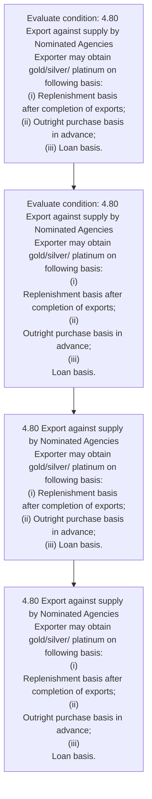

# Chapter 4 / Section 4.80: Export against supply by Nominated Agencies

**Chapter Title:** Duty Exemption / Remission Schemes

**Pages:** 48

**Purpose:** Defines the operational requirements for Export against supply by Nominated Agencies.

**Purpose Thanglish:** Indha Export against supply by Nominated Agencies section-la, Defines the operational requirements for export against supply by Nominated Agencies.

**Summary:** 4.80 Export against supply by Nominated Agencies
Exporter may obtain gold/silver/ platinum on following basis:
(i) Replenishment basis after completion of exports;
(ii) Outright purchase basis in advance;
(iii) Loan basis. 4.80 Export against supply by Nominated Agencies
Exporter may obtain gold/silver/ platinum on following basis:
(i)
Replenishment basis after completion of exports;
(ii)
Outright purchase basis in advance;
(iii)
Loan basis.

**Business Meaning:** 4.80 Export against supply by Nominated Agencies
Exporter may obtain gold/silver/ platinum on following basis:
(i) Replenishment basis after completion of exports;
(ii) Outright purchase basis in advance;
(iii) Loan basis.

**Business Explanation:** 4.80 Export against supply by Nominated Agencies
Exporter may obtain gold/silver/ platinum on following basis:
(i) Replenishment basis after completion of exports;
(ii) Outright purchase basis in advance;
(iii) Loan basis. 4.80 Export against supply by Nominated Agencies
Exporter may obtain gold/silver/ platinum on following basis:
(i)
Replenishment basis after completion of exports;
(ii)
Outright purchase basis in advance;
(iii)
Loan basis.

**Business Explanation Thanglish:** Indha Export against supply by Nominated Agencies section-la, 4.80 export against supply by Nominated Agencies
Exporter may obtain gold/silver/ platinum on following basis:
(i) Replenishment basis after completion of exports;
(ii) Outright purchase basis in advance;
(iii) Loan basis. 4.80 export against supply by Nominated Agencies
Exporter may obtain gold/silver/ platinum on following basis:
(i)
Replenishment basis after completion of exports;
(ii)
Outright purchase basis in advance;
(iii)
Loan basis.

## Business Logic
- None identified

## Business Rules
- rule_id=CH4-SEC4_80-R001, rule_description=IF validations pass THEN recommend action: 4.80 Export against supply by Nominated Agencies
Exporter may obtain gold/silver/ platinum on following basis:
(i) Replenishment basis after completion of exports;
(ii) Outright purchase basis in advance;
(iii) Loan basis., trigger=Export against supply by Nominated Agencies, condition=4.80 Export against supply by Nominated Agencies
Exporter may obtain gold/silver/ platinum on following basis:
(i) Replenishment basis after completion of exports;
(ii) Outright purchase basis in advance;
(iii) Loan basis., validation=Not explicitly covered in uploaded documents., action=4.80 Export against supply by Nominated Agencies
Exporter may obtain gold/silver/ platinum on following basis:
(i) Replenishment basis after completion of exports;
(ii) Outright purchase basis in advance;
(iii) Loan basis., exception=No explicit exception found in uploaded documents., output=DEKAI should produce a compliance decision for 4.80 - Export against supply by Nominated Agencies.

## Conditions
- 4.80 Export against supply by Nominated Agencies
Exporter may obtain gold/silver/ platinum on following basis:
(i) Replenishment basis after completion of exports;
(ii) Outright purchase basis in advance;
(iii) Loan basis.
- 4.80 Export against supply by Nominated Agencies
Exporter may obtain gold/silver/ platinum on following basis:
(i)
Replenishment basis after completion of exports;
(ii)
Outright purchase basis in advance;
(iii)
Loan basis.

## Condition Logic
- id=4.4.80.1, if=4.80 Export against supply by Nominated Agencies
Exporter may obtain gold/silver/ platinum on following basis:
(i) Replenishment basis after completion of exports;
(ii) Outright purchase basis in advance;
(iii) Loan basis., then=4.80 Export against supply by Nominated Agencies
Exporter may obtain gold/silver/ platinum on following basis:
(i) Replenishment basis after completion of exports;
(ii) Outright purchase basis in advance;
(iii) Loan basis., source=4.80 Export against supply by Nominated Agencies
Exporter may obtain gold/silver/ platinum on following basis:
(i) Replenishment basis after completion of exports;
(ii) Outright purchase basis in advance;
(iii) Loan basis.
- id=4.4.80.2, if=4.80 Export against supply by Nominated Agencies
Exporter may obtain gold/silver/ platinum on following basis:
(i)
Replenishment basis after completion of exports;
(ii)
Outright purchase basis in advance;
(iii)
Loan basis., then=4.80 Export against supply by Nominated Agencies
Exporter may obtain gold/silver/ platinum on following basis:
(i) Replenishment basis after completion of exports;
(ii) Outright purchase basis in advance;
(iii) Loan basis., source=4.80 Export against supply by Nominated Agencies
Exporter may obtain gold/silver/ platinum on following basis:
(i)
Replenishment basis after completion of exports;
(ii)
Outright purchase basis in advance;
(iii)
Loan basis.

## Validations
- None identified

## Exceptions
- None identified

## Dependencies
- None identified

## Authorities
- None identified

## Required Documents
- None identified

## Timelines
- 4.80 Export against supply by Nominated Agencies
Exporter may obtain gold/silver/ platinum on following basis:
(i) Replenishment basis after completion of exports;
(ii) Outright purchase basis in advance;
(iii) Loan basis.
- 4.80 Export against supply by Nominated Agencies
Exporter may obtain gold/silver/ platinum on following basis:
(i)
Replenishment basis after completion of exports;
(ii)
Outright purchase basis in advance;
(iii)
Loan basis.

## Actions
- 4.80 Export against supply by Nominated Agencies
Exporter may obtain gold/silver/ platinum on following basis:
(i) Replenishment basis after completion of exports;
(ii) Outright purchase basis in advance;
(iii) Loan basis.
- 4.80 Export against supply by Nominated Agencies
Exporter may obtain gold/silver/ platinum on following basis:
(i)
Replenishment basis after completion of exports;
(ii)
Outright purchase basis in advance;
(iii)
Loan basis.

## Workflow
- Evaluate condition: 4.80 Export against supply by Nominated Agencies
Exporter may obtain gold/silver/ platinum on following basis:
(i) Replenishment basis after completion of exports;
(ii) Outright purchase basis in advance;
(iii) Loan basis.
- Evaluate condition: 4.80 Export against supply by Nominated Agencies
Exporter may obtain gold/silver/ platinum on following basis:
(i)
Replenishment basis after completion of exports;
(ii)
Outright purchase basis in advance;
(iii)
Loan basis.
- 4.80 Export against supply by Nominated Agencies
Exporter may obtain gold/silver/ platinum on following basis:
(i) Replenishment basis after completion of exports;
(ii) Outright purchase basis in advance;
(iii) Loan basis.
- 4.80 Export against supply by Nominated Agencies
Exporter may obtain gold/silver/ platinum on following basis:
(i)
Replenishment basis after completion of exports;
(ii)
Outright purchase basis in advance;
(iii)
Loan basis.

## Workflow ASCII
```text
Export against supply by Nominated Agencies
Evaluate condition: 4.80 Export against supply by Nominated Agencies
Exporter may obtain gold/silver/ platinum on following basis:
(i) Replenishment basis after completion of exports;
(ii) Outright purchase basis in advance;
(iii) Loan basis.
   |
   v
Evaluate condition: 4.80 Export against supply by Nominated Agencies
Exporter may obtain gold/silver/ platinum on following basis:
(i)
Replenishment basis after completion of exports;
(ii)
Outright purchase basis in advance;
(iii)
Loan basis.
   |
   v
4.80 Export against supply by Nominated Agencies
Exporter may obtain gold/silver/ platinum on following basis:
(i) Replenishment basis after completion of exports;
(ii) Outright purchase basis in advance;
(iii) Loan basis.
   |
   v
4.80 Export against supply by Nominated Agencies
Exporter may obtain gold/silver/ platinum on following basis:
(i)
Replenishment basis after completion of exports;
(ii)
Outright purchase basis in advance;
(iii)
Loan basis.
```

## Decision Tree
- IF 4.80 Export against supply by Nominated Agencies
Exporter may obtain gold/silver/ platinum on following basis:
(i) Replenishment basis after completion of exports;
(ii) Outright purchase basis in advance;
(iii) Loan basis. THEN 4.80 Export against supply by Nominated Agencies
Exporter may obtain gold/silver/ platinum on following basis:
(i) Replenishment basis after completion of exports;
(ii) Outright purchase basis in advance;
(iii) Loan basis.
- IF 4.80 Export against supply by Nominated Agencies
Exporter may obtain gold/silver/ platinum on following basis:
(i)
Replenishment basis after completion of exports;
(ii)
Outright purchase basis in advance;
(iii)
Loan basis. THEN 4.80 Export against supply by Nominated Agencies
Exporter may obtain gold/silver/ platinum on following basis:
(i) Replenishment basis after completion of exports;
(ii) Outright purchase basis in advance;
(iii) Loan basis.

## Decision Tree ASCII
```text
Export against supply by Nominated Agencies Decision
IF 4.80 Export against supply by Nominated Agencies
Exporter may obtain gold/silver/ platinum on following basis:
(i) Replenishment basis after completion of exports;
(ii) Outright purchase basis in advance;
(iii) Loan basis. THEN 4.80 Export against supply by Nominated Agencies
Exporter may obtain gold/silver/ platinum on following basis:
(i) Replenishment basis after completion of exports;
(ii) Outright purchase basis in advance;
(iii) Loan basis.
   |
   v
IF 4.80 Export against supply by Nominated Agencies
Exporter may obtain gold/silver/ platinum on following basis:
(i)
Replenishment basis after completion of exports;
(ii)
Outright purchase basis in advance;
(iii)
Loan basis. THEN 4.80 Export against supply by Nominated Agencies
Exporter may obtain gold/silver/ platinum on following basis:
(i) Replenishment basis after completion of exports;
(ii) Outright purchase basis in advance;
(iii) Loan basis.
```

## Examples
- User asks to process Export against supply by Nominated Agencies; the platform checks conditions, validations, and documents before action.

**Real-world Example:** Example: an importer or exporter invokes Export against supply by Nominated Agencies, submits the prescribed DGFT records, and DEKAI uses the extracted rules to 4.80 export against supply by nominated agencies
exporter may obtain gold/silver/ platinum on following basis:
(i) replenishment basis after completion of exports;
(ii) outright purchase basis in advance;
(iii) loan basis..

**Real-world Example Thanglish:** Indha Export against supply by Nominated Agencies section-la, Example: an importer or exporter invokes export against supply by Nominated Agencies, submits the prescribed DGFT records, and DEKAI uses the extracted rules to 4.80 export against supply by nominated agencies
exporter may obtain gold/silver/ platinum on following basis:
(i) replenishment basis after completion of exports;
(ii) outright purchase basis in advance;
(iii) loan basis..

## AI Rules
- IF validations pass THEN recommend action: 4.80 Export against supply by Nominated Agencies
Exporter may obtain gold/silver/ platinum on following basis:
(i) Replenishment basis after completion of exports;
(ii) Outright purchase basis in advance;
(iii) Loan basis.

## Database Fields
- name=section_code, type=string, required=True, source=parsed_section_heading
- name=section_title, type=string, required=True, source=parsed_section_heading
- name=may_flag, type=boolean, required=False, source=keyword:may
- name=iii_flag, type=boolean, required=False, source=keyword:iii
- name=loan_flag, type=boolean, required=False, source=keyword:Loan
- name=basis_flag, type=boolean, required=False, source=keyword:basis
- name=after_flag, type=boolean, required=False, source=keyword:after
- name=export_flag, type=boolean, required=False, source=keyword:Export
- name=supply_flag, type=boolean, required=False, source=keyword:supply
- name=obtain_flag, type=boolean, required=False, source=keyword:obtain

## API Requirements
- method=GET, path=/api/dgft/sections/4.80, purpose=Retrieve knowledge payload for section 4.80, query_params=['include=workflow,decision_tree,validations'], response_fields=['section', 'title', 'summary', 'conditions', 'validations', 'exceptions', 'workflow', 'decision_tree']
- method=POST, path=/api/dgft/Export-against-supply-by-Nominated-Agencies/validate, purpose=Validate inputs and documents for Export against supply by Nominated Agencies, request_fields=['section_code', 'section_title'], response_fields=['status', 'errors', 'warnings', 'next_actions']
- method=POST, path=/api/dgft/Export-against-supply-by-Nominated-Agencies/execute, purpose=Trigger business action for 4.80 Export against supply by Nominated Agencies
Exporter may obtain gold/silver/ platinum on following basis:
(i) Replenishment basis after completion of exports;
(ii) Outright purchase basis in advance;
(iii) Loan basis., request_fields=['section_code', 'section_title'], response_fields=['reference_id', 'status', 'authority', 'timeline']

## UI Screens
- screen_id=Export_against_supply_by_Nominated_Agencies_overview, name=Export against supply by Nominated Agencies Overview, purpose=Show section summary, authority, timeline, and eligibility cues., widgets=['summary_card', 'conditions_table', 'authority_badges', 'timeline_panel']
- screen_id=Export_against_supply_by_Nominated_Agencies_submission, name=Export against supply by Nominated Agencies Submission, purpose=Capture applicant data and supporting documents., widgets=['dynamic_form', 'document_uploader', 'validation_panel', 'next_action_footer'], fields=['section_code', 'section_title', 'may_flag', 'iii_flag', 'loan_flag', 'basis_flag', 'after_flag', 'export_flag']

## Error Messages
- Validation failed because the section requirements were not fully met.

## FAQ
- question_en=What is the purpose of section 4.80?, answer_en=4.80 Export against supply by Nominated Agencies
Exporter may obtain gold/silver/ platinum on following basis:
(i) Replenishment basis after completion of exports;
(ii) Outright purchase basis in advance;
(iii) Loan basis. 4.80 Export against supply by Nominated Agencies
Exporter may obtain gold/silver/ platinum on following basis:
(i)
Replenishment basis after completion of exports;
(ii)
Outright purchase basis in advance;
(iii)
Loan basis., question_thanglish=Indha Export against supply by Nominated Agencies section-la, What is the purpose of section 4.80?, answer_thanglish=Indha Export against supply by Nominated Agencies section-la, 4.80 export against supply by Nominated Agencies
Exporter may obtain gold/silver/ platinum on following basis:
(i) Replenishment basis after completion of exports;
(ii) Outright purchase basis in advance;
(iii) Loan basis. 4.80 export against supply by Nominated Agencies
Exporter may obtain gold/silver/ platinum on following basis:
(i)
Replenishment basis after completion of exports;
(ii)
Outright purchase basis in advance;
(iii)
Loan basis.
- question_en=What documents are required under Export against supply by Nominated Agencies?, answer_en=Not explicitly covered in uploaded documents., question_thanglish=Indha Export against supply by Nominated Agencies section-la, What documents are required under export against supply by Nominated Agencies?, answer_thanglish=Indha Export against supply by Nominated Agencies section-la, Not explicitly covered in uploaded documents.
- question_en=Which authority handles Export against supply by Nominated Agencies?, answer_en=Not explicitly covered in uploaded documents., question_thanglish=Indha Export against supply by Nominated Agencies section-la, Which authority handles export against supply by Nominated Agencies?, answer_thanglish=Indha Export against supply by Nominated Agencies section-la, Not explicitly covered in uploaded documents.

## Questions Users May Ask
- What does Export against supply by Nominated Agencies require?
- Which documents are needed for Export against supply by Nominated Agencies?
- How does DEKAI validate Export against supply by Nominated Agencies requests?
- What action should be taken for Export against supply by Nominated Agencies?

## Expected AI Answers
- Export against supply by Nominated Agencies requires the platform to interpret the section text, apply the extracted business rules, and present the correct next action.
- Required documents are inferred from the section text: no explicit documents were detected.
- DEKAI validates Export against supply by Nominated Agencies by checking conditions, required documents, authority references, and exception clauses before recommending an outcome.
- The primary extracted action is: 4.80 Export against supply by Nominated Agencies
Exporter may obtain gold/silver/ platinum on following basis:
(i) Replenishment basis after completion of exports;
(ii) Outright purchase basis in advance;
(iii) Loan basis.

## AI Q&A Examples
- question_en=User asks: How do I comply with Export against supply by Nominated Agencies?, answer_en=AI answers: DEKAI should evaluate section 4.80, apply the extracted rules, and guide the user through Evaluate condition: 4.80 Export against supply by Nominated Agencies
Exporter may obtain gold/silver/ platinum on following basis:
(i) Replenishment basis after completion of exports;
(ii) Outright purchase basis in advance;
(iii) Loan basis.., question_thanglish=Indha Export against supply by Nominated Agencies section-la, User asks: How do I comply with export against supply by Nominated Agencies?, answer_thanglish=Indha Export against supply by Nominated Agencies section-la, AI answers: DEKAI should evaluate section 4.80, apply the extracted rules, and guide the user through Evaluate condition: 4.80 export against supply by Nominated Agencies
Exporter may obtain gold/silver/ platinum on following basis:
(i) Replenishment basis after completion of exports;
(ii) Outright purchase basis in advance;
(iii) Loan basis..
- question_en=User asks: Which validations apply to Export against supply by Nominated Agencies?, answer_en=AI answers: Applicable validations are not explicitly covered in the uploaded documents., question_thanglish=Indha Export against supply by Nominated Agencies section-la, User asks: Which validations apply to export against supply by Nominated Agencies?, answer_thanglish=Indha Export against supply by Nominated Agencies section-la, AI answers: Applicable validations are not explicitly covered in the uploaded documents.

## DEKAI AI Implementation Notes
- Capture chapter 4, section 4.80, title, and page references as immutable knowledge metadata.
- Bind validations for Export against supply by Nominated Agencies into a rule engine keyed by the rule IDs extracted for this section.

## DEKAI AI Implementation Notes Thanglish
- Indha Export against supply by Nominated Agencies section-la, Capture chapter 4, section 4.80, title, and page references as immutable knowledge metadata.
- Indha Export against supply by Nominated Agencies section-la, Bind validations for export against supply by Nominated Agencies into a rule engine keyed by the rule IDs extracted for this section.

## AI Metadata
- Keywords: may, iii, Loan, basis, after, Export, supply, obtain, against, exports, advance, Agencies, Exporter, platinum, Outright, purchase, Nominated, following, completion, gold/silver
- Search Keywords: may, iii, Loan, basis, after, Export, supply, obtain, against, exports, advance, Agencies, Exporter, platinum, Outright, purchase, Nominated, following, completion, gold/silver
- Intent: Support Export against supply by Nominated Agencies processing and compliance validation.
- Tags: 4.80, Export against supply by Nominated Agencies, dgft
- Related Sections: 
- Related Chapters: 
- Related Rules: 

## Mermaid


## PlantUML
```plantuml
@startuml
start
:Evaluate condition\: 4.80 Export against supply by Nominated Agencies
Exporter may obtain gold/silver/ platinum on following basis\:
(i) Replenishment basis after completion of exports;
(ii) Outright purchase basis in advance;
(iii) Loan basis.;
:Evaluate condition\: 4.80 Export against supply by Nominated Agencies
Exporter may obtain gold/silver/ platinum on following basis\:
(i)
Replenishment basis after completion of exports;
(ii)
Outright purchase basis in advance;
(iii)
Loan basis.;
:4.80 Export against supply by Nominated Agencies
Exporter may obtain gold/silver/ platinum on following basis\:
(i) Replenishment basis after completion of exports;
(ii) Outright purchase basis in advance;
(iii) Loan basis.;
:4.80 Export against supply by Nominated Agencies
Exporter may obtain gold/silver/ platinum on following basis\:
(i)
Replenishment basis after completion of exports;
(ii)
Outright purchase basis in advance;
(iii)
Loan basis.;
stop
@enduml
```
