# Chapter 4 / Section 4.81: Replenishment Basis

**Chapter Title:** Duty Exemption / Remission Schemes

**Pages:** 48, 49

**Purpose:** 4.81 Replenishment Basis
(a) Exporter may apply to Nominated Agency for booking of precious metal
gold/silver/platinum.

**Purpose Thanglish:** Indha Replenishment Basis section-la, 4.81 Replenishment Basis
(a) Exporter may apply to Nominated Agency for booking of precious metal
gold/silver/platinum.

**Summary:** 4.81 Replenishment Basis
(a) Exporter may apply to Nominated Agency for booking of precious metal
gold/silver/platinum. Quantity of precious metal booked with
nominated agency shall be equivalent to precious metal content in the
export product and admissible wastage. (b) Applicant shall at the time of booking deposit an earnest money for a
minimum amount of 20% of notional price of precious metal, which shall
be adjusted at actual sale.

**Business Meaning:** Replenishment Basis governs how DGFT business controls should be applied, validated, and enforced.

**Business Explanation:** Replenishment Basis explains the operating rule set that DEKAI should enforce. Key control points include Quantity of precious metal booked with
nominated agency shall be equivalent to precious metal content in the
export product and admissible wastage. The section also drives actions such as 4.81 Replenishment Basis
(a) Exporter may apply to Nominated Agency for booking of precious metal
gold/silver/platinum..

**Business Explanation Thanglish:** Indha Replenishment Basis section-la, Replenishment Basis explains the operating rule set that DEKAI should enforce. Key control points include Quantity of precious metal booked with
nominated agency kandippa be equivalent to precious metal content in the
export product and admissible wastage. The section also drives actions such as 4.81 Replenishment Basis
(a) Exporter may apply to Nominated Agency for booking of precious metal
gold/silver/platinum..

## Business Logic
- Quantity of precious metal booked with
nominated agency shall be equivalent to precious metal content in the
export product and admissible wastage.
- (b) Applicant shall at the time of booking deposit an earnest money for a
minimum amount of 20% of notional price of precious metal, which shall
be adjusted at actual sale.
- Exports shall be effected within a period of
120 days from date of booking and drawal of precious metal shall be
completed within a period of 150 days from date of booking or within
pg.
- Items not sold abroad
within 365 days shall be re-imported.
- Exporter shall book with
nominated agency within 120 days after the end of stipulated
period of 365 days, gold/silver/platinum for replenishment
content against items sold abroad.
- (ii) Following documents shall be submitted for claiming such
replenishment:
(a) LEO copy of Shipping Bill with Tax invoice for export supplies;
(b) Copy of the approval letter issued by Government/GJEPC;
(c) Certificate from Nominated Agency / GJEPC as in Appendix 4-
O.
- In case of exhibitions organised by nominated agencies,
gold/silver/ platinum shall be imported as replenishment by
nominated agencies within 60 days from close of exhibition.
- (f)
Nominated Agencies shall maintain a complete account of exports made,
goods sold abroad, goods re-imported, and metals purchased abroad
and imported into India.
- Such account shall be maintained for a
minimum period of three years from date of close of exhibition.
- (b)
Applicant shall at the time of booking deposit an earnest money for a
minimum amount of 20% of notional price of precious metal, which shall
be adjusted at actual sale.
- Exports shall be effected within a period of
120 days from date of booking and drawal of precious metal shall be
completed within a period of 150 days from date of booking or within
30 days from date of export whichever is later.
- However, as a one-time
relaxation, in cases where the export period is expiring on or between
01.03.2026 and 31.05.2026, such export period shall stand
automatically extended by 30 days from the date of its expiry.xvii
(c) Exporter may also export jewellery on a notional rate based on
certificate provided by Bank.
- Exporter must fix price within credit terms
allowed to buyer and realise proceeds within the due date of the credit
terms or 180 days, whichever is earlier.
- Exporter exporting on a notional
basis under Replenishment Scheme must book the same quantity of gold
with Nominated Agency on same rate that he may have booked with
buyer.
- Nominated agencies shall purchase precious metal on behalf of
exporter at the rate so fixed and thereafter issue a purchase certificate
bearing a serial number to exporter indicating quantity of
gold/silver/platinum and CIF value, in dollars including the Rupee
equivalent.
- Price shall be actual price at which gold/silver/platinum is
purchased by nominated agencies plus permitted service charges levied
by nominated agencies shall be included with the price of gold/ silver/
platinum for value addition.
- Duplicate and triplicate copies of exporter’s
application together with copies of purchase certificate for exporter
shall be sent by nominated agencies to concerned Custom House as well
as to the negotiating bank who will confirm realization at which gold has
been purchased.

## Business Rules
- rule_id=CH4-SEC4_81-R001, rule_description=Quantity of precious metal booked with
nominated agency shall be equivalent to precious metal content in the
export product and admissible wastage., trigger=Replenishment Basis, condition=Exporter shall book with
nominated agency within 120 days after the end of stipulated
period of 365 days, gold/silver/platinum for replenishment
content against items sold abroad., validation=Quantity of precious metal booked with
nominated agency shall be equivalent to precious metal content in the
export product and admissible wastage., action=4.81 Replenishment Basis
(a) Exporter may apply to Nominated Agency for booking of precious metal
gold/silver/platinum., exception=(i)
Export of branded jewellery is also permitted with approval of Gem
& Jewellery EPC for display/sale in permitted shops setup abroad
or in showroom of their distributors/ agents., output=DEKAI should produce a compliance decision for 4.81 - Replenishment Basis.
- rule_id=CH4-SEC4_81-R002, rule_description=(b) Applicant shall at the time of booking deposit an earnest money for a
minimum amount of 20% of notional price of precious metal, which shall
be adjusted at actual sale., trigger=Replenishment Basis, condition=(ii) Following documents shall be submitted for claiming such
replenishment:
(a) LEO copy of Shipping Bill with Tax invoice for export supplies;
(b) Copy of the approval letter issued by Government/GJEPC;
(c) Certificate from Nominated Agency / GJEPC as in Appendix 4-
O., validation=(b) Applicant shall at the time of booking deposit an earnest money for a
minimum amount of 20% of notional price of precious metal, which shall
be adjusted at actual sale., action=(ii) Following documents shall be submitted for claiming such
replenishment:
(a) LEO copy of Shipping Bill with Tax invoice for export supplies;
(b) Copy of the approval letter issued by Government/GJEPC;
(c) Certificate from Nominated Agency / GJEPC as in Appendix 4-
O., exception=However, as a one-time
relaxation, in cases where the export period is expiring on or between
01.03.2026 and 31.05.2026, such export period shall stand
automatically extended by 30 days from the date of its expiry.xvii
(c) Exporter may also export jewellery on a notional rate based on
certificate provided by Bank., output=DEKAI should produce a compliance decision for 4.81 - Replenishment Basis.
- rule_id=CH4-SEC4_81-R003, rule_description=Exports shall be effected within a period of
120 days from date of booking and drawal of precious metal shall be
completed within a period of 150 days from date of booking or within
pg., trigger=Replenishment Basis, condition=In case of exhibitions organised by nominated agencies,
gold/silver/ platinum shall be imported as replenishment by
nominated agencies within 60 days from close of exhibition., validation=Exports shall be effected within a period of
120 days from date of booking and drawal of precious metal shall be
completed within a period of 150 days from date of booking or within
pg., action=(f)
Nominated Agencies shall maintain a complete account of exports made,
goods sold abroad, goods re-imported, and metals purchased abroad
and imported into India., exception=However, as a one-time
relaxation, in cases where the export period is expiring on or between
01.03.2026 and 31.05.2026, such export period shall stand
automatically extended by 30 days from the date of its expiry.xvii
(c) Exporter may also export jewellery on a notional rate based on
certificate provided by Bank., output=DEKAI should produce a compliance decision for 4.81 - Replenishment Basis.
- rule_id=CH4-SEC4_81-R004, rule_description=Items not sold abroad
within 365 days shall be re-imported., trigger=Replenishment Basis, condition=However, as a one-time
relaxation, in cases where the export period is expiring on or between
01.03.2026 and 31.05.2026, such export period shall stand
automatically extended by 30 days from the date of its expiry.xvii
(c) Exporter may also export jewellery on a notional rate based on
certificate provided by Bank., validation=Items not sold abroad
within 365 days shall be re-imported., action=Such account shall be maintained for a
minimum period of three years from date of close of exhibition., exception=However, as a one-time
relaxation, in cases where the export period is expiring on or between
01.03.2026 and 31.05.2026, such export period shall stand
automatically extended by 30 days from the date of its expiry.xvii
(c) Exporter may also export jewellery on a notional rate based on
certificate provided by Bank., output=DEKAI should produce a compliance decision for 4.81 - Replenishment Basis.
- rule_id=CH4-SEC4_81-R005, rule_description=Exporter shall book with
nominated agency within 120 days after the end of stipulated
period of 365 days, gold/silver/platinum for replenishment
content against items sold abroad., trigger=Replenishment Basis, condition=Nominated agencies shall purchase precious metal on behalf of
exporter at the rate so fixed and thereafter issue a purchase certificate
bearing a serial number to exporter indicating quantity of
gold/silver/platinum and CIF value, in dollars including the Rupee
equivalent., validation=Exporter shall book with
nominated agency within 120 days after the end of stipulated
period of 365 days, gold/silver/platinum for replenishment
content against items sold abroad., action=4.81 Replenishment Basis
(a)
Exporter may apply to Nominated Agency for booking of precious metal
gold/silver/platinum., exception=However, as a one-time
relaxation, in cases where the export period is expiring on or between
01.03.2026 and 31.05.2026, such export period shall stand
automatically extended by 30 days from the date of its expiry.xvii
(c) Exporter may also export jewellery on a notional rate based on
certificate provided by Bank., output=DEKAI should produce a compliance decision for 4.81 - Replenishment Basis.
- rule_id=CH4-SEC4_81-R006, rule_description=(ii) Following documents shall be submitted for claiming such
replenishment:
(a) LEO copy of Shipping Bill with Tax invoice for export supplies;
(b) Copy of the approval letter issued by Government/GJEPC;
(c) Certificate from Nominated Agency / GJEPC as in Appendix 4-
O., trigger=Replenishment Basis, condition=Duplicate and triplicate copies of exporter’s
application together with copies of purchase certificate for exporter
shall be sent by nominated agencies to concerned Custom House as well
as to the negotiating bank who will confirm realization at which gold has
been purchased., validation=(ii) Following documents shall be submitted for claiming such
replenishment:
(a) LEO copy of Shipping Bill with Tax invoice for export supplies;
(b) Copy of the approval letter issued by Government/GJEPC;
(c) Certificate from Nominated Agency / GJEPC as in Appendix 4-
O., action=Nominated agencies shall purchase precious metal on behalf of
exporter at the rate so fixed and thereafter issue a purchase certificate
bearing a serial number to exporter indicating quantity of
gold/silver/platinum and CIF value, in dollars including the Rupee
equivalent., exception=However, as a one-time
relaxation, in cases where the export period is expiring on or between
01.03.2026 and 31.05.2026, such export period shall stand
automatically extended by 30 days from the date of its expiry.xvii
(c) Exporter may also export jewellery on a notional rate based on
certificate provided by Bank., output=DEKAI should produce a compliance decision for 4.81 - Replenishment Basis.
- rule_id=CH4-SEC4_81-R007, rule_description=In case of exhibitions organised by nominated agencies,
gold/silver/ platinum shall be imported as replenishment by
nominated agencies within 60 days from close of exhibition., trigger=Replenishment Basis, condition=Exporter exporting under notional rate will get
replenishment only after proceeds are realised., validation=In case of exhibitions organised by nominated agencies,
gold/silver/ platinum shall be imported as replenishment by
nominated agencies within 60 days from close of exhibition., action=Nominated agencies shall purchase precious metal on behalf of
exporter at the rate so fixed and thereafter issue a purchase certificate
bearing a serial number to exporter indicating quantity of
gold/silver/platinum and CIF value, in dollars including the Rupee
equivalent., exception=However, as a one-time
relaxation, in cases where the export period is expiring on or between
01.03.2026 and 31.05.2026, such export period shall stand
automatically extended by 30 days from the date of its expiry.xvii
(c) Exporter may also export jewellery on a notional rate based on
certificate provided by Bank., output=DEKAI should produce a compliance decision for 4.81 - Replenishment Basis.
- rule_id=CH4-SEC4_81-R008, rule_description=(f)
Nominated Agencies shall maintain a complete account of exports made,
goods sold abroad, goods re-imported, and metals purchased abroad
and imported into India., trigger=Replenishment Basis, condition=Exporter exporting under notional rate will get
replenishment only after proceeds are realised., validation=(f)
Nominated Agencies shall maintain a complete account of exports made,
goods sold abroad, goods re-imported, and metals purchased abroad
and imported into India., action=Nominated agencies shall purchase precious metal on behalf of
exporter at the rate so fixed and thereafter issue a purchase certificate
bearing a serial number to exporter indicating quantity of
gold/silver/platinum and CIF value, in dollars including the Rupee
equivalent., exception=However, as a one-time
relaxation, in cases where the export period is expiring on or between
01.03.2026 and 31.05.2026, such export period shall stand
automatically extended by 30 days from the date of its expiry.xvii
(c) Exporter may also export jewellery on a notional rate based on
certificate provided by Bank., output=DEKAI should produce a compliance decision for 4.81 - Replenishment Basis.
- rule_id=CH4-SEC4_81-R009, rule_description=Such account shall be maintained for a
minimum period of three years from date of close of exhibition., trigger=Replenishment Basis, condition=Exporter exporting under notional rate will get
replenishment only after proceeds are realised., validation=Such account shall be maintained for a
minimum period of three years from date of close of exhibition., action=Nominated agencies shall purchase precious metal on behalf of
exporter at the rate so fixed and thereafter issue a purchase certificate
bearing a serial number to exporter indicating quantity of
gold/silver/platinum and CIF value, in dollars including the Rupee
equivalent., exception=However, as a one-time
relaxation, in cases where the export period is expiring on or between
01.03.2026 and 31.05.2026, such export period shall stand
automatically extended by 30 days from the date of its expiry.xvii
(c) Exporter may also export jewellery on a notional rate based on
certificate provided by Bank., output=DEKAI should produce a compliance decision for 4.81 - Replenishment Basis.
- rule_id=CH4-SEC4_81-R010, rule_description=(b)
Applicant shall at the time of booking deposit an earnest money for a
minimum amount of 20% of notional price of precious metal, which shall
be adjusted at actual sale., trigger=Replenishment Basis, condition=Exporter exporting under notional rate will get
replenishment only after proceeds are realised., validation=(b)
Applicant shall at the time of booking deposit an earnest money for a
minimum amount of 20% of notional price of precious metal, which shall
be adjusted at actual sale., action=Nominated agencies shall purchase precious metal on behalf of
exporter at the rate so fixed and thereafter issue a purchase certificate
bearing a serial number to exporter indicating quantity of
gold/silver/platinum and CIF value, in dollars including the Rupee
equivalent., exception=However, as a one-time
relaxation, in cases where the export period is expiring on or between
01.03.2026 and 31.05.2026, such export period shall stand
automatically extended by 30 days from the date of its expiry.xvii
(c) Exporter may also export jewellery on a notional rate based on
certificate provided by Bank., output=DEKAI should produce a compliance decision for 4.81 - Replenishment Basis.
- rule_id=CH4-SEC4_81-R011, rule_description=Exports shall be effected within a period of
120 days from date of booking and drawal of precious metal shall be
completed within a period of 150 days from date of booking or within
30 days from date of export whichever is later., trigger=Replenishment Basis, condition=Exporter exporting under notional rate will get
replenishment only after proceeds are realised., validation=Exports shall be effected within a period of
120 days from date of booking and drawal of precious metal shall be
completed within a period of 150 days from date of booking or within
30 days from date of export whichever is later., action=Nominated agencies shall purchase precious metal on behalf of
exporter at the rate so fixed and thereafter issue a purchase certificate
bearing a serial number to exporter indicating quantity of
gold/silver/platinum and CIF value, in dollars including the Rupee
equivalent., exception=However, as a one-time
relaxation, in cases where the export period is expiring on or between
01.03.2026 and 31.05.2026, such export period shall stand
automatically extended by 30 days from the date of its expiry.xvii
(c) Exporter may also export jewellery on a notional rate based on
certificate provided by Bank., output=DEKAI should produce a compliance decision for 4.81 - Replenishment Basis.
- rule_id=CH4-SEC4_81-R012, rule_description=However, as a one-time
relaxation, in cases where the export period is expiring on or between
01.03.2026 and 31.05.2026, such export period shall stand
automatically extended by 30 days from the date of its expiry.xvii
(c) Exporter may also export jewellery on a notional rate based on
certificate provided by Bank., trigger=Replenishment Basis, condition=Exporter exporting under notional rate will get
replenishment only after proceeds are realised., validation=However, as a one-time
relaxation, in cases where the export period is expiring on or between
01.03.2026 and 31.05.2026, such export period shall stand
automatically extended by 30 days from the date of its expiry.xvii
(c) Exporter may also export jewellery on a notional rate based on
certificate provided by Bank., action=Nominated agencies shall purchase precious metal on behalf of
exporter at the rate so fixed and thereafter issue a purchase certificate
bearing a serial number to exporter indicating quantity of
gold/silver/platinum and CIF value, in dollars including the Rupee
equivalent., exception=However, as a one-time
relaxation, in cases where the export period is expiring on or between
01.03.2026 and 31.05.2026, such export period shall stand
automatically extended by 30 days from the date of its expiry.xvii
(c) Exporter may also export jewellery on a notional rate based on
certificate provided by Bank., output=DEKAI should produce a compliance decision for 4.81 - Replenishment Basis.
- rule_id=CH4-SEC4_81-R013, rule_description=Exporter must fix price within credit terms
allowed to buyer and realise proceeds within the due date of the credit
terms or 180 days, whichever is earlier., trigger=Replenishment Basis, condition=Exporter exporting under notional rate will get
replenishment only after proceeds are realised., validation=Exporter must fix price within credit terms
allowed to buyer and realise proceeds within the due date of the credit
terms or 180 days, whichever is earlier., action=Nominated agencies shall purchase precious metal on behalf of
exporter at the rate so fixed and thereafter issue a purchase certificate
bearing a serial number to exporter indicating quantity of
gold/silver/platinum and CIF value, in dollars including the Rupee
equivalent., exception=However, as a one-time
relaxation, in cases where the export period is expiring on or between
01.03.2026 and 31.05.2026, such export period shall stand
automatically extended by 30 days from the date of its expiry.xvii
(c) Exporter may also export jewellery on a notional rate based on
certificate provided by Bank., output=DEKAI should produce a compliance decision for 4.81 - Replenishment Basis.
- rule_id=CH4-SEC4_81-R014, rule_description=Exporter exporting on a notional
basis under Replenishment Scheme must book the same quantity of gold
with Nominated Agency on same rate that he may have booked with
buyer., trigger=Replenishment Basis, condition=Exporter exporting under notional rate will get
replenishment only after proceeds are realised., validation=Exporter exporting on a notional
basis under Replenishment Scheme must book the same quantity of gold
with Nominated Agency on same rate that he may have booked with
buyer., action=Nominated agencies shall purchase precious metal on behalf of
exporter at the rate so fixed and thereafter issue a purchase certificate
bearing a serial number to exporter indicating quantity of
gold/silver/platinum and CIF value, in dollars including the Rupee
equivalent., exception=However, as a one-time
relaxation, in cases where the export period is expiring on or between
01.03.2026 and 31.05.2026, such export period shall stand
automatically extended by 30 days from the date of its expiry.xvii
(c) Exporter may also export jewellery on a notional rate based on
certificate provided by Bank., output=DEKAI should produce a compliance decision for 4.81 - Replenishment Basis.
- rule_id=CH4-SEC4_81-R015, rule_description=Nominated agencies shall purchase precious metal on behalf of
exporter at the rate so fixed and thereafter issue a purchase certificate
bearing a serial number to exporter indicating quantity of
gold/silver/platinum and CIF value, in dollars including the Rupee
equivalent., trigger=Replenishment Basis, condition=Exporter exporting under notional rate will get
replenishment only after proceeds are realised., validation=Nominated agencies shall purchase precious metal on behalf of
exporter at the rate so fixed and thereafter issue a purchase certificate
bearing a serial number to exporter indicating quantity of
gold/silver/platinum and CIF value, in dollars including the Rupee
equivalent., action=Nominated agencies shall purchase precious metal on behalf of
exporter at the rate so fixed and thereafter issue a purchase certificate
bearing a serial number to exporter indicating quantity of
gold/silver/platinum and CIF value, in dollars including the Rupee
equivalent., exception=However, as a one-time
relaxation, in cases where the export period is expiring on or between
01.03.2026 and 31.05.2026, such export period shall stand
automatically extended by 30 days from the date of its expiry.xvii
(c) Exporter may also export jewellery on a notional rate based on
certificate provided by Bank., output=DEKAI should produce a compliance decision for 4.81 - Replenishment Basis.
- rule_id=CH4-SEC4_81-R016, rule_description=Price shall be actual price at which gold/silver/platinum is
purchased by nominated agencies plus permitted service charges levied
by nominated agencies shall be included with the price of gold/ silver/
platinum for value addition., trigger=Replenishment Basis, condition=Exporter exporting under notional rate will get
replenishment only after proceeds are realised., validation=Price shall be actual price at which gold/silver/platinum is
purchased by nominated agencies plus permitted service charges levied
by nominated agencies shall be included with the price of gold/ silver/
platinum for value addition., action=Nominated agencies shall purchase precious metal on behalf of
exporter at the rate so fixed and thereafter issue a purchase certificate
bearing a serial number to exporter indicating quantity of
gold/silver/platinum and CIF value, in dollars including the Rupee
equivalent., exception=However, as a one-time
relaxation, in cases where the export period is expiring on or between
01.03.2026 and 31.05.2026, such export period shall stand
automatically extended by 30 days from the date of its expiry.xvii
(c) Exporter may also export jewellery on a notional rate based on
certificate provided by Bank., output=DEKAI should produce a compliance decision for 4.81 - Replenishment Basis.
- rule_id=CH4-SEC4_81-R017, rule_description=Duplicate and triplicate copies of exporter’s
application together with copies of purchase certificate for exporter
shall be sent by nominated agencies to concerned Custom House as well
as to the negotiating bank who will confirm realization at which gold has
been purchased., trigger=Replenishment Basis, condition=Exporter exporting under notional rate will get
replenishment only after proceeds are realised., validation=Duplicate and triplicate copies of exporter’s
application together with copies of purchase certificate for exporter
shall be sent by nominated agencies to concerned Custom House as well
as to the negotiating bank who will confirm realization at which gold has
been purchased., action=Nominated agencies shall purchase precious metal on behalf of
exporter at the rate so fixed and thereafter issue a purchase certificate
bearing a serial number to exporter indicating quantity of
gold/silver/platinum and CIF value, in dollars including the Rupee
equivalent., exception=However, as a one-time
relaxation, in cases where the export period is expiring on or between
01.03.2026 and 31.05.2026, such export period shall stand
automatically extended by 30 days from the date of its expiry.xvii
(c) Exporter may also export jewellery on a notional rate based on
certificate provided by Bank., output=DEKAI should produce a compliance decision for 4.81 - Replenishment Basis.

## Conditions
- Exporter shall book with
nominated agency within 120 days after the end of stipulated
period of 365 days, gold/silver/platinum for replenishment
content against items sold abroad.
- (ii) Following documents shall be submitted for claiming such
replenishment:
(a) LEO copy of Shipping Bill with Tax invoice for export supplies;
(b) Copy of the approval letter issued by Government/GJEPC;
(c) Certificate from Nominated Agency / GJEPC as in Appendix 4-
O.
- In case of exhibitions organised by nominated agencies,
gold/silver/ platinum shall be imported as replenishment by
nominated agencies within 60 days from close of exhibition.
- However, as a one-time
relaxation, in cases where the export period is expiring on or between
01.03.2026 and 31.05.2026, such export period shall stand
automatically extended by 30 days from the date of its expiry.xvii
(c) Exporter may also export jewellery on a notional rate based on
certificate provided by Bank.
- Nominated agencies shall purchase precious metal on behalf of
exporter at the rate so fixed and thereafter issue a purchase certificate
bearing a serial number to exporter indicating quantity of
gold/silver/platinum and CIF value, in dollars including the Rupee
equivalent.
- Duplicate and triplicate copies of exporter’s
application together with copies of purchase certificate for exporter
shall be sent by nominated agencies to concerned Custom House as well
as to the negotiating bank who will confirm realization at which gold has
been purchased.
- Exporter exporting under notional rate will get
replenishment only after proceeds are realised.

## Condition Logic
- id=4.4.81.1, if=Exporter shall book with
nominated agency within 120 days after the end of stipulated
period of 365 days, gold/silver/platinum for replenishment
content against items sold abroad., then=4.81 Replenishment Basis
(a) Exporter may apply to Nominated Agency for booking of precious metal
gold/silver/platinum., source=Exporter shall book with
nominated agency within 120 days after the end of stipulated
period of 365 days, gold/silver/platinum for replenishment
content against items sold abroad.
- id=4.4.81.2, if=(ii) Following documents shall be submitted for claiming such
replenishment:
(a) LEO copy of Shipping Bill with Tax invoice for export supplies;
(b) Copy of the approval letter issued by Government/GJEPC;
(c) Certificate from Nominated Agency / GJEPC as in Appendix 4-
O., then=4.81 Replenishment Basis
(a) Exporter may apply to Nominated Agency for booking of precious metal
gold/silver/platinum., source=(ii) Following documents shall be submitted for claiming such
replenishment:
(a) LEO copy of Shipping Bill with Tax invoice for export supplies;
(b) Copy of the approval letter issued by Government/GJEPC;
(c) Certificate from Nominated Agency / GJEPC as in Appendix 4-
O.
- id=4.4.81.3, if=In case of exhibitions organised by nominated agencies,
gold/silver/ platinum shall be imported as replenishment by
nominated agencies within 60 days from close of exhibition., then=4.81 Replenishment Basis
(a) Exporter may apply to Nominated Agency for booking of precious metal
gold/silver/platinum., source=In case of exhibitions organised by nominated agencies,
gold/silver/ platinum shall be imported as replenishment by
nominated agencies within 60 days from close of exhibition.
- id=4.4.81.4, if=However, as a one-time
relaxation, in cases where the export period is expiring on or between
01.03.2026 and 31.05.2026, such export period shall stand
automatically extended by 30 days from the date of its expiry.xvii
(c) Exporter may also export jewellery on a notional rate based on
certificate provided by Bank., then=4.81 Replenishment Basis
(a) Exporter may apply to Nominated Agency for booking of precious metal
gold/silver/platinum., source=However, as a one-time
relaxation, in cases where the export period is expiring on or between
01.03.2026 and 31.05.2026, such export period shall stand
automatically extended by 30 days from the date of its expiry.xvii
(c) Exporter may also export jewellery on a notional rate based on
certificate provided by Bank.
- id=4.4.81.5, if=Nominated agencies shall purchase precious metal on behalf of
exporter at the rate so fixed and thereafter issue a purchase certificate
bearing a serial number to exporter indicating quantity of
gold/silver/platinum and CIF value, in dollars including the Rupee
equivalent., then=4.81 Replenishment Basis
(a) Exporter may apply to Nominated Agency for booking of precious metal
gold/silver/platinum., source=Nominated agencies shall purchase precious metal on behalf of
exporter at the rate so fixed and thereafter issue a purchase certificate
bearing a serial number to exporter indicating quantity of
gold/silver/platinum and CIF value, in dollars including the Rupee
equivalent.
- id=4.4.81.6, if=Duplicate and triplicate copies of exporter’s
application together with copies of purchase certificate for exporter
shall be sent by nominated agencies to concerned Custom House as well
as to the negotiating bank who will confirm realization at which gold has
been purchased., then=4.81 Replenishment Basis
(a) Exporter may apply to Nominated Agency for booking of precious metal
gold/silver/platinum., source=Duplicate and triplicate copies of exporter’s
application together with copies of purchase certificate for exporter
shall be sent by nominated agencies to concerned Custom House as well
as to the negotiating bank who will confirm realization at which gold has
been purchased.
- id=4.4.81.7, if=Exporter exporting under notional rate will get
replenishment only after proceeds are realised., then=4.81 Replenishment Basis
(a) Exporter may apply to Nominated Agency for booking of precious metal
gold/silver/platinum., source=Exporter exporting under notional rate will get
replenishment only after proceeds are realised.

## Validations
- Quantity of precious metal booked with
nominated agency shall be equivalent to precious metal content in the
export product and admissible wastage.
- (b) Applicant shall at the time of booking deposit an earnest money for a
minimum amount of 20% of notional price of precious metal, which shall
be adjusted at actual sale.
- Exports shall be effected within a period of
120 days from date of booking and drawal of precious metal shall be
completed within a period of 150 days from date of booking or within
pg.
- Items not sold abroad
within 365 days shall be re-imported.
- Exporter shall book with
nominated agency within 120 days after the end of stipulated
period of 365 days, gold/silver/platinum for replenishment
content against items sold abroad.
- (ii) Following documents shall be submitted for claiming such
replenishment:
(a) LEO copy of Shipping Bill with Tax invoice for export supplies;
(b) Copy of the approval letter issued by Government/GJEPC;
(c) Certificate from Nominated Agency / GJEPC as in Appendix 4-
O.
- In case of exhibitions organised by nominated agencies,
gold/silver/ platinum shall be imported as replenishment by
nominated agencies within 60 days from close of exhibition.
- (f)
Nominated Agencies shall maintain a complete account of exports made,
goods sold abroad, goods re-imported, and metals purchased abroad
and imported into India.
- Such account shall be maintained for a
minimum period of three years from date of close of exhibition.
- (b)
Applicant shall at the time of booking deposit an earnest money for a
minimum amount of 20% of notional price of precious metal, which shall
be adjusted at actual sale.
- Exports shall be effected within a period of
120 days from date of booking and drawal of precious metal shall be
completed within a period of 150 days from date of booking or within
30 days from date of export whichever is later.
- However, as a one-time
relaxation, in cases where the export period is expiring on or between
01.03.2026 and 31.05.2026, such export period shall stand
automatically extended by 30 days from the date of its expiry.xvii
(c) Exporter may also export jewellery on a notional rate based on
certificate provided by Bank.
- Exporter must fix price within credit terms
allowed to buyer and realise proceeds within the due date of the credit
terms or 180 days, whichever is earlier.
- Exporter exporting on a notional
basis under Replenishment Scheme must book the same quantity of gold
with Nominated Agency on same rate that he may have booked with
buyer.
- Nominated agencies shall purchase precious metal on behalf of
exporter at the rate so fixed and thereafter issue a purchase certificate
bearing a serial number to exporter indicating quantity of
gold/silver/platinum and CIF value, in dollars including the Rupee
equivalent.
- Price shall be actual price at which gold/silver/platinum is
purchased by nominated agencies plus permitted service charges levied
by nominated agencies shall be included with the price of gold/ silver/
platinum for value addition.
- Duplicate and triplicate copies of exporter’s
application together with copies of purchase certificate for exporter
shall be sent by nominated agencies to concerned Custom House as well
as to the negotiating bank who will confirm realization at which gold has
been purchased.

## Exceptions
- (i)
Export of branded jewellery is also permitted with approval of Gem
& Jewellery EPC for display/sale in permitted shops setup abroad
or in showroom of their distributors/ agents.
- However, as a one-time
relaxation, in cases where the export period is expiring on or between
01.03.2026 and 31.05.2026, such export period shall stand
automatically extended by 30 days from the date of its expiry.xvii
(c) Exporter may also export jewellery on a notional rate based on
certificate provided by Bank.

## Dependencies
- 1
- 2
- 3
- 4
- 5
- 6

## Authorities
- Copy of the approval letter issued by Government

## Required Documents
- LEO copy of Shipping Bill
- However, as a one-time
relaxation, in cases where the export period is expiring on or between
01.03.2026 and 31.05.2026, such export period shall stand
automatically extended by 30 days from the date of its expiry.xvii
(c) Exporter may also export jewellery on a notional rate based on
certificate provided by Bank.
- Nominated agencies shall purchase precious metal on behalf of
exporter at the rate so fixed and thereafter issue a purchase certificate
bearing a serial number to exporter indicating quantity of
gold/silver/platinum and CIF value, in dollars including the Rupee
equivalent.
- Duplicate and triplicate copies of exporter’s
application together with copies of purchase certificate for exporter
shall be sent by nominated agencies to concerned Custom House as well
as to the negotiating bank who will confirm realization at which gold has
been purchased.

## Timelines
- Exports shall be effected within a period of
120 days from date of booking and drawal of precious metal shall be
completed within a period of 150 days from date of booking or within
pg.
- Items not sold abroad
within 365 days shall be re-imported.
- Exporter shall book with
nominated agency within 120 days after the end of stipulated
period of 365 days, gold/silver/platinum for replenishment
content against items sold abroad.
- In case of exhibitions organised by nominated agencies,
gold/silver/ platinum shall be imported as replenishment by
nominated agencies within 60 days from close of exhibition.
- Such account shall be maintained for a
minimum period of three years from date of close of exhibition.
- Exports shall be effected within a period of
120 days from date of booking and drawal of precious metal shall be
completed within a period of 150 days from date of booking or within
30 days from date of export whichever is later.
- However, as a one-time
relaxation, in cases where the export period is expiring on or between
01.03.2026 and 31.05.2026, such export period shall stand
automatically extended by 30 days from the date of its expiry.xvii
(c) Exporter may also export jewellery on a notional rate based on
certificate provided by Bank.
- Exporter must fix price within credit terms
allowed to buyer and realise proceeds within the due date of the credit
terms or 180 days, whichever is earlier.
- Nominated agencies shall purchase precious metal on behalf of
exporter at the rate so fixed and thereafter issue a purchase certificate
bearing a serial number to exporter indicating quantity of
gold/silver/platinum and CIF value, in dollars including the Rupee
equivalent.
- Exporter exporting under notional rate will get
replenishment only after proceeds are realised.

## Actions
- 4.81 Replenishment Basis
(a) Exporter may apply to Nominated Agency for booking of precious metal
gold/silver/platinum.
- (ii) Following documents shall be submitted for claiming such
replenishment:
(a) LEO copy of Shipping Bill with Tax invoice for export supplies;
(b) Copy of the approval letter issued by Government/GJEPC;
(c) Certificate from Nominated Agency / GJEPC as in Appendix 4-
O.
- (f)
Nominated Agencies shall maintain a complete account of exports made,
goods sold abroad, goods re-imported, and metals purchased abroad
and imported into India.
- Such account shall be maintained for a
minimum period of three years from date of close of exhibition.
- 4.81 Replenishment Basis
(a)
Exporter may apply to Nominated Agency for booking of precious metal
gold/silver/platinum.
- Nominated agencies shall purchase precious metal on behalf of
exporter at the rate so fixed and thereafter issue a purchase certificate
bearing a serial number to exporter indicating quantity of
gold/silver/platinum and CIF value, in dollars including the Rupee
equivalent.

## Workflow
- Evaluate condition: Exporter shall book with
nominated agency within 120 days after the end of stipulated
period of 365 days, gold/silver/platinum for replenishment
content against items sold abroad.
- Evaluate condition: (ii) Following documents shall be submitted for claiming such
replenishment:
(a) LEO copy of Shipping Bill with Tax invoice for export supplies;
(b) Copy of the approval letter issued by Government/GJEPC;
(c) Certificate from Nominated Agency / GJEPC as in Appendix 4-
O.
- Evaluate condition: In case of exhibitions organised by nominated agencies,
gold/silver/ platinum shall be imported as replenishment by
nominated agencies within 60 days from close of exhibition.
- 4.81 Replenishment Basis
(a) Exporter may apply to Nominated Agency for booking of precious metal
gold/silver/platinum.
- (ii) Following documents shall be submitted for claiming such
replenishment:
(a) LEO copy of Shipping Bill with Tax invoice for export supplies;
(b) Copy of the approval letter issued by Government/GJEPC;
(c) Certificate from Nominated Agency / GJEPC as in Appendix 4-
O.
- (f)
Nominated Agencies shall maintain a complete account of exports made,
goods sold abroad, goods re-imported, and metals purchased abroad
and imported into India.
- Such account shall be maintained for a
minimum period of three years from date of close of exhibition.
- 4.81 Replenishment Basis
(a)
Exporter may apply to Nominated Agency for booking of precious metal
gold/silver/platinum.
- Nominated agencies shall purchase precious metal on behalf of
exporter at the rate so fixed and thereafter issue a purchase certificate
bearing a serial number to exporter indicating quantity of
gold/silver/platinum and CIF value, in dollars including the Rupee
equivalent.
- Run validation: Quantity of precious metal booked with
nominated agency shall be equivalent to precious metal content in the
export product and admissible wastage.
- Run validation: (b) Applicant shall at the time of booking deposit an earnest money for a
minimum amount of 20% of notional price of precious metal, which shall
be adjusted at actual sale.
- Run validation: Exports shall be effected within a period of
120 days from date of booking and drawal of precious metal shall be
completed within a period of 150 days from date of booking or within
pg.
- Handle exception: (i)
Export of branded jewellery is also permitted with approval of Gem
& Jewellery EPC for display/sale in permitted shops setup abroad
or in showroom of their distributors/ agents.

## Workflow ASCII
```text
Replenishment Basis
Evaluate condition: Exporter shall book with
nominated agency within 120 days after the end of stipulated
period of 365 days, gold/silver/platinum for replenishment
content against items sold abroad.
   |
   v
Evaluate condition: (ii) Following documents shall be submitted for claiming such
replenishment:
(a) LEO copy of Shipping Bill with Tax invoice for export supplies;
(b) Copy of the approval letter issued by Government/GJEPC;
(c) Certificate from Nominated Agency / GJEPC as in Appendix 4-
O.
   |
   v
Evaluate condition: In case of exhibitions organised by nominated agencies,
gold/silver/ platinum shall be imported as replenishment by
nominated agencies within 60 days from close of exhibition.
   |
   v
4.81 Replenishment Basis
(a) Exporter may apply to Nominated Agency for booking of precious metal
gold/silver/platinum.
   |
   v
(ii) Following documents shall be submitted for claiming such
replenishment:
(a) LEO copy of Shipping Bill with Tax invoice for export supplies;
(b) Copy of the approval letter issued by Government/GJEPC;
(c) Certificate from Nominated Agency / GJEPC as in Appendix 4-
O.
   |
   v
(f)
Nominated Agencies shall maintain a complete account of exports made,
goods sold abroad, goods re-imported, and metals purchased abroad
and imported into India.
   |
   v
Such account shall be maintained for a
minimum period of three years from date of close of exhibition.
   |
   v
4.81 Replenishment Basis
(a)
Exporter may apply to Nominated Agency for booking of precious metal
gold/silver/platinum.
   |
   v
Nominated agencies shall purchase precious metal on behalf of
exporter at the rate so fixed and thereafter issue a purchase certificate
bearing a serial number to exporter indicating quantity of
gold/silver/platinum and CIF value, in dollars including the Rupee
equivalent.
   |
   v
Run validation: Quantity of precious metal booked with
nominated agency shall be equivalent to precious metal content in the
export product and admissible wastage.
   |
   v
Run validation: (b) Applicant shall at the time of booking deposit an earnest money for a
minimum amount of 20% of notional price of precious metal, which shall
be adjusted at actual sale.
   |
   v
Run validation: Exports shall be effected within a period of
120 days from date of booking and drawal of precious metal shall be
completed within a period of 150 days from date of booking or within
pg.
   |
   v
Handle exception: (i)
Export of branded jewellery is also permitted with approval of Gem
& Jewellery EPC for display/sale in permitted shops setup abroad
or in showroom of their distributors/ agents.
```

## Decision Tree
- IF Exporter shall book with
nominated agency within 120 days after the end of stipulated
period of 365 days, gold/silver/platinum for replenishment
content against items sold abroad. THEN 4.81 Replenishment Basis
(a) Exporter may apply to Nominated Agency for booking of precious metal
gold/silver/platinum.
- IF (ii) Following documents shall be submitted for claiming such
replenishment:
(a) LEO copy of Shipping Bill with Tax invoice for export supplies;
(b) Copy of the approval letter issued by Government/GJEPC;
(c) Certificate from Nominated Agency / GJEPC as in Appendix 4-
O. THEN 4.81 Replenishment Basis
(a) Exporter may apply to Nominated Agency for booking of precious metal
gold/silver/platinum.
- IF In case of exhibitions organised by nominated agencies,
gold/silver/ platinum shall be imported as replenishment by
nominated agencies within 60 days from close of exhibition. THEN 4.81 Replenishment Basis
(a) Exporter may apply to Nominated Agency for booking of precious metal
gold/silver/platinum.
- IF However, as a one-time
relaxation, in cases where the export period is expiring on or between
01.03.2026 and 31.05.2026, such export period shall stand
automatically extended by 30 days from the date of its expiry.xvii
(c) Exporter may also export jewellery on a notional rate based on
certificate provided by Bank. THEN 4.81 Replenishment Basis
(a) Exporter may apply to Nominated Agency for booking of precious metal
gold/silver/platinum.
- IF Nominated agencies shall purchase precious metal on behalf of
exporter at the rate so fixed and thereafter issue a purchase certificate
bearing a serial number to exporter indicating quantity of
gold/silver/platinum and CIF value, in dollars including the Rupee
equivalent. THEN 4.81 Replenishment Basis
(a) Exporter may apply to Nominated Agency for booking of precious metal
gold/silver/platinum.
- IF exception applies ((i)
Export of branded jewellery is also permitted with approval of Gem
& Jewellery EPC for display/sale in permitted shops setup abroad
or in showroom of their distributors/ agents.) THEN route to manual review
- IF exception applies (However, as a one-time
relaxation, in cases where the export period is expiring on or between
01.03.2026 and 31.05.2026, such export period shall stand
automatically extended by 30 days from the date of its expiry.xvii
(c) Exporter may also export jewellery on a notional rate based on
certificate provided by Bank.) THEN route to manual review

## Decision Tree ASCII
```text
Replenishment Basis Decision
IF Exporter shall book with
nominated agency within 120 days after the end of stipulated
period of 365 days, gold/silver/platinum for replenishment
content against items sold abroad. THEN 4.81 Replenishment Basis
(a) Exporter may apply to Nominated Agency for booking of precious metal
gold/silver/platinum.
   |
   v
IF (ii) Following documents shall be submitted for claiming such
replenishment:
(a) LEO copy of Shipping Bill with Tax invoice for export supplies;
(b) Copy of the approval letter issued by Government/GJEPC;
(c) Certificate from Nominated Agency / GJEPC as in Appendix 4-
O. THEN 4.81 Replenishment Basis
(a) Exporter may apply to Nominated Agency for booking of precious metal
gold/silver/platinum.
   |
   v
IF In case of exhibitions organised by nominated agencies,
gold/silver/ platinum shall be imported as replenishment by
nominated agencies within 60 days from close of exhibition. THEN 4.81 Replenishment Basis
(a) Exporter may apply to Nominated Agency for booking of precious metal
gold/silver/platinum.
   |
   v
IF However, as a one-time
relaxation, in cases where the export period is expiring on or between
01.03.2026 and 31.05.2026, such export period shall stand
automatically extended by 30 days from the date of its expiry.xvii
(c) Exporter may also export jewellery on a notional rate based on
certificate provided by Bank. THEN 4.81 Replenishment Basis
(a) Exporter may apply to Nominated Agency for booking of precious metal
gold/silver/platinum.
   |
   v
IF Nominated agencies shall purchase precious metal on behalf of
exporter at the rate so fixed and thereafter issue a purchase certificate
bearing a serial number to exporter indicating quantity of
gold/silver/platinum and CIF value, in dollars including the Rupee
equivalent. THEN 4.81 Replenishment Basis
(a) Exporter may apply to Nominated Agency for booking of precious metal
gold/silver/platinum.
   |
   v
IF exception applies ((i)
Export of branded jewellery is also permitted with approval of Gem
& Jewellery EPC for display/sale in permitted shops setup abroad
or in showroom of their distributors/ agents.) THEN route to manual review
   |
   v
IF exception applies (However, as a one-time
relaxation, in cases where the export period is expiring on or between
01.03.2026 and 31.05.2026, such export period shall stand
automatically extended by 30 days from the date of its expiry.xvii
(c) Exporter may also export jewellery on a notional rate based on
certificate provided by Bank.) THEN route to manual review
```

## Examples
- User asks to process Replenishment Basis; the platform checks conditions, validations, and documents before action.

**Real-world Example:** Example: an importer or exporter invokes Replenishment Basis, submits LEO copy of Shipping Bill, However, as a one-time
relaxation, in cases where the export period is expiring on or between
01.03.2026 and 31.05.2026, such export period shall stand
automatically extended by 30 days from the date of its expiry.xvii
(c) Exporter may also export jewellery on a notional rate based on
certificate provided by Bank., Nominated agencies shall purchase precious metal on behalf of
exporter at the rate so fixed and thereafter issue a purchase certificate
bearing a serial number to exporter indicating quantity of
gold/silver/platinum and CIF value, in dollars including the Rupee
equivalent., and DEKAI uses the extracted rules to 4.81 replenishment basis
(a) exporter may apply to nominated agency for booking of precious metal
gold/silver/platinum..

**Real-world Example Thanglish:** Indha Replenishment Basis section-la, Example: an importer or exporter invokes Replenishment Basis, submits LEO copy of Shipping Bill, However, as a one-time
relaxation, in cases where the export period is expiring on or between
01.03.2026 and 31.05.2026, such export period kandippa stand
automatically extended by 30 days from the date of its expiry.xvii
(c) Exporter may also export jewellery on a notional rate based on
certificate provided by Bank., Nominated agencies kandippa purchase precious metal on behalf of
exporter at the rate so fixed and thereafter issue a purchase certificate
bearing a serial number to exporter indicating quantity of
gold/silver/platinum and CIF value, in dollars including the Rupee
equivalent., and DEKAI uses the extracted rules to 4.81 replenishment basis
(a) exporter may apply to nominated agency for booking of precious metal
gold/silver/platinum..

## AI Rules
- IF detected context matches section rule THEN enforce: Quantity of precious metal booked with
nominated agency shall be equivalent to precious metal content in the
export product and admissible wastage.
- IF detected context matches section rule THEN enforce: (b) Applicant shall at the time of booking deposit an earnest money for a
minimum amount of 20% of notional price of precious metal, which shall
be adjusted at actual sale.
- IF detected context matches section rule THEN enforce: Exports shall be effected within a period of
120 days from date of booking and drawal of precious metal shall be
completed within a period of 150 days from date of booking or within
pg.
- IF detected context matches section rule THEN enforce: Items not sold abroad
within 365 days shall be re-imported.
- IF detected context matches section rule THEN enforce: Exporter shall book with
nominated agency within 120 days after the end of stipulated
period of 365 days, gold/silver/platinum for replenishment
content against items sold abroad.
- IF detected context matches section rule THEN enforce: (ii) Following documents shall be submitted for claiming such
replenishment:
(a) LEO copy of Shipping Bill with Tax invoice for export supplies;
(b) Copy of the approval letter issued by Government/GJEPC;
(c) Certificate from Nominated Agency / GJEPC as in Appendix 4-
O.
- IF validations pass THEN recommend action: 4.81 Replenishment Basis
(a) Exporter may apply to Nominated Agency for booking of precious metal
gold/silver/platinum.

## Database Fields
- name=section_code, type=string, required=True, source=parsed_section_heading
- name=section_title, type=string, required=True, source=parsed_section_heading
- name=may_flag, type=boolean, required=False, source=keyword:may
- name=for_flag, type=boolean, required=False, source=keyword:for
- name=the_flag, type=boolean, required=False, source=keyword:the
- name=and_flag, type=boolean, required=False, source=keyword:and
- name=gem_flag, type=boolean, required=False, source=keyword:Gem
- name=epc_flag, type=boolean, required=False, source=keyword:EPC
- name=not_flag, type=boolean, required=False, source=keyword:not
- name=end_flag, type=boolean, required=False, source=keyword:end
- name=document_1_submitted, type=boolean, required=True, source=LEO copy of Shipping Bill
- name=document_2_submitted, type=boolean, required=True, source=However, as a one-time
relaxation, in cases where the export period is expiring on or between
01.03.2026 and 31.05.2026, such export period shall stand
automatically extended by 30 days from the date of its expiry.xvii
(c) Exporter may also export jewellery on a notional rate based on
certificate provided by Bank.
- name=document_3_submitted, type=boolean, required=True, source=Nominated agencies shall purchase precious metal on behalf of
exporter at the rate so fixed and thereafter issue a purchase certificate
bearing a serial number to exporter indicating quantity of
gold/silver/platinum and CIF value, in dollars including the Rupee
equivalent.
- name=document_4_submitted, type=boolean, required=True, source=Duplicate and triplicate copies of exporter’s
application together with copies of purchase certificate for exporter
shall be sent by nominated agencies to concerned Custom House as well
as to the negotiating bank who will confirm realization at which gold has
been purchased.

## API Requirements
- method=GET, path=/api/dgft/sections/4.81, purpose=Retrieve knowledge payload for section 4.81, query_params=['include=workflow,decision_tree,validations'], response_fields=['section', 'title', 'summary', 'conditions', 'validations', 'exceptions', 'workflow', 'decision_tree']
- method=POST, path=/api/dgft/Replenishment-Basis/validate, purpose=Validate inputs and documents for Replenishment Basis, request_fields=['section_code', 'section_title', 'document_1_submitted', 'document_2_submitted', 'document_3_submitted', 'document_4_submitted'], response_fields=['status', 'errors', 'warnings', 'next_actions']
- method=POST, path=/api/dgft/Replenishment-Basis/execute, purpose=Trigger business action for 4.81 Replenishment Basis
(a) Exporter may apply to Nominated Agency for booking of precious metal
gold/silver/platinum., request_fields=['section_code', 'section_title', 'document_1_submitted', 'document_2_submitted', 'document_3_submitted', 'document_4_submitted'], response_fields=['reference_id', 'status', 'authority', 'timeline']

## UI Screens
- screen_id=Replenishment_Basis_overview, name=Replenishment Basis Overview, purpose=Show section summary, authority, timeline, and eligibility cues., widgets=['summary_card', 'conditions_table', 'authority_badges', 'timeline_panel']
- screen_id=Replenishment_Basis_submission, name=Replenishment Basis Submission, purpose=Capture applicant data and supporting documents., widgets=['dynamic_form', 'document_uploader', 'validation_panel', 'next_action_footer'], fields=['section_code', 'section_title', 'may_flag', 'for_flag', 'the_flag', 'and_flag', 'gem_flag', 'epc_flag']
- screen_id=Replenishment_Basis_exceptions, name=Replenishment Basis Exception Review, purpose=Explain exception handling and manual review triggers., widgets=['exception_banner', 'decision_tree', 'case_notes']

## Error Messages
- Validation failed because the section requirements were not fully met.

## FAQ
- question_en=What is the purpose of section 4.81?, answer_en=Replenishment Basis explains the operating rule set that DEKAI should enforce. Key control points include Quantity of precious metal booked with
nominated agency shall be equivalent to precious metal content in the
export product and admissible wastage. The section also drives actions such as 4.81 Replenishment Basis
(a) Exporter may apply to Nominated Agency for booking of precious metal
gold/silver/platinum.., question_thanglish=Indha Replenishment Basis section-la, What is the purpose of section 4.81?, answer_thanglish=Indha Replenishment Basis section-la, Replenishment Basis explains the operating rule set that DEKAI should enforce. Key control points include Quantity of precious metal booked with
nominated agency kandippa be equivalent to precious metal content in the
export product and admissible wastage. The section also drives actions such as 4.81 Replenishment Basis
(a) Exporter may apply to Nominated Agency for booking of precious metal
gold/silver/platinum..
- question_en=What documents are required under Replenishment Basis?, answer_en=LEO copy of Shipping Bill, However, as a one-time
relaxation, in cases where the export period is expiring on or between
01.03.2026 and 31.05.2026, such export period shall stand
automatically extended by 30 days from the date of its expiry.xvii
(c) Exporter may also export jewellery on a notional rate based on
certificate provided by Bank., Nominated agencies shall purchase precious metal on behalf of
exporter at the rate so fixed and thereafter issue a purchase certificate
bearing a serial number to exporter indicating quantity of
gold/silver/platinum and CIF value, in dollars including the Rupee
equivalent., Duplicate and triplicate copies of exporter’s
application together with copies of purchase certificate for exporter
shall be sent by nominated agencies to concerned Custom House as well
as to the negotiating bank who will confirm realization at which gold has
been purchased., question_thanglish=Indha Replenishment Basis section-la, What documents are required under Replenishment Basis?, answer_thanglish=Indha Replenishment Basis section-la, LEO copy of Shipping Bill, However, as a one-time
relaxation, in cases where the export period is expiring on or between
01.03.2026 and 31.05.2026, such export period kandippa stand
automatically extended by 30 days from the date of its expiry.xvii
(c) Exporter may also export jewellery on a notional rate based on
certificate provided by Bank., Nominated agencies kandippa purchase precious metal on behalf of
exporter at the rate so fixed and thereafter issue a purchase certificate
bearing a serial number to exporter indicating quantity of
gold/silver/platinum and CIF value, in dollars including the Rupee
equivalent., Duplicate and triplicate copies of exporter’s
application together with copies of purchase certificate for exporter
kandippa be sent by nominated agencies to concerned Custom House as well
as to the negotiating bank who will confirm realization at which gold has
been purchased.
- question_en=Which authority handles Replenishment Basis?, answer_en=Copy of the approval letter issued by Government, question_thanglish=Indha Replenishment Basis section-la, Which authority handles Replenishment Basis?, answer_thanglish=Indha Replenishment Basis section-la, Copy of the approval letter issued by Government

## Questions Users May Ask
- What does Replenishment Basis require?
- Which documents are needed for Replenishment Basis?
- How does DEKAI validate Replenishment Basis requests?
- What action should be taken for Replenishment Basis?

## Expected AI Answers
- Replenishment Basis requires the platform to interpret the section text, apply the extracted business rules, and present the correct next action.
- Required documents are inferred from the section text: LEO copy of Shipping Bill, However, as a one-time
relaxation, in cases where the export period is expiring on or between
01.03.2026 and 31.05.2026, such export period shall stand
automatically extended by 30 days from the date of its expiry.xvii
(c) Exporter may also export jewellery on a notional rate based on
certificate provided by Bank., Nominated agencies shall purchase precious metal on behalf of
exporter at the rate so fixed and thereafter issue a purchase certificate
bearing a serial number to exporter indicating quantity of
gold/silver/platinum and CIF value, in dollars including the Rupee
equivalent., Duplicate and triplicate copies of exporter’s
application together with copies of purchase certificate for exporter
shall be sent by nominated agencies to concerned Custom House as well
as to the negotiating bank who will confirm realization at which gold has
been purchased.
- DEKAI validates Replenishment Basis by checking conditions, required documents, authority references, and exception clauses before recommending an outcome.
- The primary extracted action is: 4.81 Replenishment Basis
(a) Exporter may apply to Nominated Agency for booking of precious metal
gold/silver/platinum.

## AI Q&A Examples
- question_en=User asks: How do I comply with Replenishment Basis?, answer_en=AI answers: DEKAI should evaluate section 4.81, apply the extracted rules, and guide the user through Evaluate condition: Exporter shall book with
nominated agency within 120 days after the end of stipulated
period of 365 days, gold/silver/platinum for replenishment
content against items sold abroad.., question_thanglish=Indha Replenishment Basis section-la, User asks: How do I comply with Replenishment Basis?, answer_thanglish=Indha Replenishment Basis section-la, AI answers: DEKAI should evaluate section 4.81, apply the extracted rules, and guide the user through Evaluate condition: Exporter kandippa book with
nominated agency within 120 days after the end of stipulated
period of 365 days, gold/silver/platinum for replenishment
content against items sold abroad..
- question_en=User asks: Which validations apply to Replenishment Basis?, answer_en=AI answers: Applicable validations are Quantity of precious metal booked with
nominated agency shall be equivalent to precious metal content in the
export product and admissible wastage., (b) Applicant shall at the time of booking deposit an earnest money for a
minimum amount of 20% of notional price of precious metal, which shall
be adjusted at actual sale., Exports shall be effected within a period of
120 days from date of booking and drawal of precious metal shall be
completed within a period of 150 days from date of booking or within
pg., question_thanglish=Indha Replenishment Basis section-la, User asks: Which validations apply to Replenishment Basis?, answer_thanglish=Indha Replenishment Basis section-la, AI answers: Applicable validations are Quantity of precious metal booked with
nominated agency kandippa be equivalent to precious metal content in the
export product and admissible wastage., (b) Applicant kandippa at the time of booking deposit an earnest money for a
minimum amount of 20% of notional price of precious metal, which kandippa
be adjusted at actual sale., Exports kandippa be effected within a period of
120 days from date of booking and drawal of precious metal kandippa be
completed within a period of 150 days from date of booking or within
pg.

## DEKAI AI Implementation Notes
- Capture chapter 4, section 4.81, title, and page references as immutable knowledge metadata.
- Bind validations for Replenishment Basis into a rule engine keyed by the rule IDs extracted for this section.
- Expose document upload controls for: LEO copy of Shipping Bill, However, as a one-time
relaxation, in cases where the export period is expiring on or between
01.03.2026 and 31.05.2026, such export period shall stand
automatically extended by 30 days from the date of its expiry.xvii
(c) Exporter may also export jewellery on a notional rate based on
certificate provided by Bank., Nominated agencies shall purchase precious metal on behalf of
exporter at the rate so fixed and thereafter issue a purchase certificate
bearing a serial number to exporter indicating quantity of
gold/silver/platinum and CIF value, in dollars including the Rupee
equivalent., Duplicate and triplicate copies of exporter’s
application together with copies of purchase certificate for exporter
shall be sent by nominated agencies to concerned Custom House as well
as to the negotiating bank who will confirm realization at which gold has
been purchased..
- Route escalations or approvals to: Copy of the approval letter issued by Government.
- Trigger manual review when exception clauses are detected.
- Show contextual links to related sections: 1, 2, 3, 4, 5, 6.

## DEKAI AI Implementation Notes Thanglish
- Indha Replenishment Basis section-la, Capture chapter 4, section 4.81, title, and page references as immutable knowledge metadata.
- Indha Replenishment Basis section-la, Bind validations for Replenishment Basis into a rule engine keyed by the rule IDs extracted for this section.
- Indha Replenishment Basis section-la, Expose document upload controls for: LEO copy of Shipping Bill, However, as a one-time
relaxation, in cases where the export period is expiring on or between
01.03.2026 and 31.05.2026, such export period kandippa stand
automatically extended by 30 days from the date of its expiry.xvii
(c) Exporter may also export jewellery on a notional rate based on
certificate provided by Bank., Nominated agencies kandippa purchase precious metal on behalf of
exporter at the rate so fixed and thereafter issue a purchase certificate
bearing a serial number to exporter indicating quantity of
gold/silver/platinum and CIF value, in dollars including the Rupee
equivalent., Duplicate and triplicate copies of exporter’s
application together with copies of purchase certificate for exporter
kandippa be sent by nominated agencies to concerned Custom House as well
as to the negotiating bank who will confirm realization at which gold has
been purchased..
- Indha Replenishment Basis section-la, Route escalations or approvals to: Copy of the approval letter issued by Government.
- Indha Replenishment Basis section-la, Trigger manual review when exception clauses are detected.
- Indha Replenishment Basis section-la, Show contextual links to related sections: 1, 2, 3, 4, 5, 6.

## AI Metadata
- Keywords: may, for, the, and, Gem, EPC, not, end, LEO, Tax, its, fix, due, CIF, who, has, get, are, with, time
- Search Keywords: may, for, the, and, Gem, EPC, not, end, LEO, Tax, its, fix, due, CIF, who, has, get, are, with, time
- Intent: Support Replenishment Basis processing and compliance validation.
- Tags: 4.81, Replenishment Basis, business-rule, document-driven, dgft
- Related Sections: 1, 2, 3, 4, 5, 6
- Related Chapters: 
- Related Rules: Quantity of precious metal booked with
nominated agency shall be equivalent to precious metal content in the
export product and admissible wastage., (b) Applicant shall at the time of booking deposit an earnest money for a
minimum amount of 20% of notional price of precious metal, which shall
be adjusted at actual sale., Exports shall be effected within a period of
120 days from date of booking and drawal of precious metal shall be
completed within a period of 150 days from date of booking or within
pg., Items not sold abroad
within 365 days shall be re-imported., Exporter shall book with
nominated agency within 120 days after the end of stipulated
period of 365 days, gold/silver/platinum for replenishment
content against items sold abroad.

## Mermaid

```mermaid
flowchart TD
    S1["Evaluate condition: Exporter shall book with
nominated agency within 120 days after the end of stipulated
period of 365 days, gold/silver/platinum for replenishment
content against items sold abroad."]
    S2["Evaluate condition: (ii) Following documents shall be submitted for claiming such
replenishment:
(a) LEO copy of Shipping Bill with Tax invoice for export supplies;
(b) Copy of the approval letter issued by Government/GJEPC;
(c) Certificate from Nominated Agency / GJEPC as in Appendix 4-
O."]
    S1 --> S2
    S3["Evaluate condition: In case of exhibitions organised by nominated agencies,
gold/silver/ platinum shall be imported as replenishment by
nominated agencies within 60 days from close of exhibition."]
    S2 --> S3
    S4["4.81 Replenishment Basis
(a) Exporter may apply to Nominated Agency for booking of precious metal
gold/silver/platinum."]
    S3 --> S4
    S5["(ii) Following documents shall be submitted for claiming such
replenishment:
(a) LEO copy of Shipping Bill with Tax invoice for export supplies;
(b) Copy of the approval letter issued by Government/GJEPC;
(c) Certificate from Nominated Agency / GJEPC as in Appendix 4-
O."]
    S4 --> S5
    S6["(f)
Nominated Agencies shall maintain a complete account of exports made,
goods sold abroad, goods re-imported, and metals purchased abroad
and imported into India."]
    S5 --> S6
    S7["Such account shall be maintained for a
minimum period of three years from date of close of exhibition."]
    S6 --> S7
    S8["4.81 Replenishment Basis
(a)
Exporter may apply to Nominated Agency for booking of precious metal
gold/silver/platinum."]
    S7 --> S8
    S9["Nominated agencies shall purchase precious metal on behalf of
exporter at the rate so fixed and thereafter issue a purchase certificate
bearing a serial number to exporter indicating quantity of
gold/silver/platinum and CIF value, in dollars including the Rupee
equivalent."]
    S8 --> S9
    S10["Run validation: Quantity of precious metal booked with
nominated agency shall be equivalent to precious metal content in the
export product and admissible wastage."]
    S9 --> S10
    S11["Run validation: (b) Applicant shall at the time of booking deposit an earnest money for a
minimum amount of 20% of notional price of precious metal, which shall
be adjusted at actual sale."]
    S10 --> S11
    S12["Run validation: Exports shall be effected within a period of
120 days from date of booking and drawal of precious metal shall be
completed within a period of 150 days from date of booking or within
pg."]
    S11 --> S12
    S13["Handle exception: (i)
Export of branded jewellery is also permitted with approval of Gem
& Jewellery EPC for display/sale in permitted shops setup abroad
or in showroom of their distributors/ agents."]
    S12 --> S13
```


## PlantUML
```plantuml
@startuml
start
:Evaluate condition\: Exporter shall book with
nominated agency within 120 days after the end of stipulated
period of 365 days, gold/silver/platinum for replenishment
content against items sold abroad.;
:Evaluate condition\: (ii) Following documents shall be submitted for claiming such
replenishment\:
(a) LEO copy of Shipping Bill with Tax invoice for export supplies;
(b) Copy of the approval letter issued by Government/GJEPC;
(c) Certificate from Nominated Agency / GJEPC as in Appendix 4-
O.;
:Evaluate condition\: In case of exhibitions organised by nominated agencies,
gold/silver/ platinum shall be imported as replenishment by
nominated agencies within 60 days from close of exhibition.;
:4.81 Replenishment Basis
(a) Exporter may apply to Nominated Agency for booking of precious metal
gold/silver/platinum.;
:(ii) Following documents shall be submitted for claiming such
replenishment\:
(a) LEO copy of Shipping Bill with Tax invoice for export supplies;
(b) Copy of the approval letter issued by Government/GJEPC;
(c) Certificate from Nominated Agency / GJEPC as in Appendix 4-
O.;
:(f)
Nominated Agencies shall maintain a complete account of exports made,
goods sold abroad, goods re-imported, and metals purchased abroad
and imported into India.;
:Such account shall be maintained for a
minimum period of three years from date of close of exhibition.;
:4.81 Replenishment Basis
(a)
Exporter may apply to Nominated Agency for booking of precious metal
gold/silver/platinum.;
:Nominated agencies shall purchase precious metal on behalf of
exporter at the rate so fixed and thereafter issue a purchase certificate
bearing a serial number to exporter indicating quantity of
gold/silver/platinum and CIF value, in dollars including the Rupee
equivalent.;
:Run validation\: Quantity of precious metal booked with
nominated agency shall be equivalent to precious metal content in the
export product and admissible wastage.;
:Run validation\: (b) Applicant shall at the time of booking deposit an earnest money for a
minimum amount of 20% of notional price of precious metal, which shall
be adjusted at actual sale.;
:Run validation\: Exports shall be effected within a period of
120 days from date of booking and drawal of precious metal shall be
completed within a period of 150 days from date of booking or within
pg.;
:Handle exception\: (i)
Export of branded jewellery is also permitted with approval of Gem
& Jewellery EPC for display/sale in permitted shops setup abroad
or in showroom of their distributors/ agents.;
stop
@enduml
```
