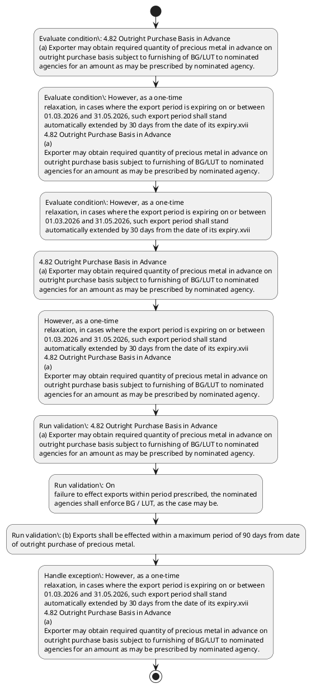

# Chapter 4 / Section 4.82: Outright Purchase Basis in Advance

**Chapter Title:** Duty Exemption / Remission Schemes

**Pages:** 49

**Purpose:** 4.82 Outright Purchase Basis in Advance
(a) Exporter may obtain required quantity of precious metal in advance on
outright purchase basis subject to furnishing of BG/LUT to nominated
agencies for an amount as may be prescribed by nominated agency.

**Purpose Thanglish:** Indha Outright Purchase Basis in Advance section-la, 4.82 Outright Purchase Basis in Advance
(a) Exporter may obtain required quantity of precious metal in advance on
outright purchase basis subject to furnishing of BG/LUT to nominated
agencies for an amount as may be prescribed by nominated agency.

**Summary:** 4.82 Outright Purchase Basis in Advance
(a) Exporter may obtain required quantity of precious metal in advance on
outright purchase basis subject to furnishing of BG/LUT to nominated
agencies for an amount as may be prescribed by nominated agency. On
failure to effect exports within period prescribed, the nominated
agencies shall enforce BG / LUT, as the case may be. (b) Exports shall be effected within a maximum period of 90 days from date
of outright purchase of precious metal.

**Business Meaning:** Outright Purchase Basis in Advance governs how DGFT business controls should be applied, validated, and enforced.

**Business Explanation:** Outright Purchase Basis in Advance explains the operating rule set that DEKAI should enforce. Key control points include 4.82 Outright Purchase Basis in Advance
(a) Exporter may obtain required quantity of precious metal in advance on
outright purchase basis subject to furnishing of BG/LUT to nominated
agencies for an amount as may be prescribed by nominated agency. The section also drives actions such as 4.82 Outright Purchase Basis in Advance
(a) Exporter may obtain required quantity of precious metal in advance on
outright purchase basis subject to furnishing of BG/LUT to nominated
agencies for an amount as may be prescribed by nominated agency..

**Business Explanation Thanglish:** Indha Outright Purchase Basis in Advance section-la, Outright Purchase Basis in Advance explains the operating rule set that DEKAI should enforce. Key control points include 4.82 Outright Purchase Basis in Advance
(a) Exporter may obtain required quantity of precious metal in advance on
outright purchase basis subject to furnishing of BG/LUT to nominated
agencies for an amount as may be prescribed by nominated agency. The section also drives actions such as 4.82 Outright Purchase Basis in Advance
(a) Exporter may obtain required quantity of precious metal in advance on
outright purchase basis subject to furnishing of BG/LUT to nominated
agencies for an amount as may be prescribed by nominated agency..

## Business Logic
- 4.82 Outright Purchase Basis in Advance
(a) Exporter may obtain required quantity of precious metal in advance on
outright purchase basis subject to furnishing of BG/LUT to nominated
agencies for an amount as may be prescribed by nominated agency.
- On
failure to effect exports within period prescribed, the nominated
agencies shall enforce BG / LUT, as the case may be.
- (b) Exports shall be effected within a maximum period of 90 days from date
of outright purchase of precious metal.
- However, as a one-time
relaxation, in cases where the export period is expiring on or between
01.03.2026 and 31.05.2026, such export period shall stand
automatically extended by 30 days from the date of its expiry.xvii
4.82 Outright Purchase Basis in Advance
(a)
Exporter may obtain required quantity of precious metal in advance on
outright purchase basis subject to furnishing of BG/LUT to nominated
agencies for an amount as may be prescribed by nominated agency.
- (b)
Exports shall be effected within a maximum period of 90 days from date
of outright purchase of precious metal.
- However, as a one-time
relaxation, in cases where the export period is expiring on or between
01.03.2026 and 31.05.2026, such export period shall stand
automatically extended by 30 days from the date of its expiry.xvii

## Business Rules
- rule_id=CH4-SEC4_82-R001, rule_description=4.82 Outright Purchase Basis in Advance
(a) Exporter may obtain required quantity of precious metal in advance on
outright purchase basis subject to furnishing of BG/LUT to nominated
agencies for an amount as may be prescribed by nominated agency., trigger=Outright Purchase Basis in Advance, condition=4.82 Outright Purchase Basis in Advance
(a) Exporter may obtain required quantity of precious metal in advance on
outright purchase basis subject to furnishing of BG/LUT to nominated
agencies for an amount as may be prescribed by nominated agency., validation=4.82 Outright Purchase Basis in Advance
(a) Exporter may obtain required quantity of precious metal in advance on
outright purchase basis subject to furnishing of BG/LUT to nominated
agencies for an amount as may be prescribed by nominated agency., action=4.82 Outright Purchase Basis in Advance
(a) Exporter may obtain required quantity of precious metal in advance on
outright purchase basis subject to furnishing of BG/LUT to nominated
agencies for an amount as may be prescribed by nominated agency., exception=However, as a one-time
relaxation, in cases where the export period is expiring on or between
01.03.2026 and 31.05.2026, such export period shall stand
automatically extended by 30 days from the date of its expiry.xvii
4.82 Outright Purchase Basis in Advance
(a)
Exporter may obtain required quantity of precious metal in advance on
outright purchase basis subject to furnishing of BG/LUT to nominated
agencies for an amount as may be prescribed by nominated agency., output=DEKAI should produce a compliance decision for 4.82 - Outright Purchase Basis in Advance.
- rule_id=CH4-SEC4_82-R002, rule_description=On
failure to effect exports within period prescribed, the nominated
agencies shall enforce BG / LUT, as the case may be., trigger=Outright Purchase Basis in Advance, condition=However, as a one-time
relaxation, in cases where the export period is expiring on or between
01.03.2026 and 31.05.2026, such export period shall stand
automatically extended by 30 days from the date of its expiry.xvii
4.82 Outright Purchase Basis in Advance
(a)
Exporter may obtain required quantity of precious metal in advance on
outright purchase basis subject to furnishing of BG/LUT to nominated
agencies for an amount as may be prescribed by nominated agency., validation=On
failure to effect exports within period prescribed, the nominated
agencies shall enforce BG / LUT, as the case may be., action=However, as a one-time
relaxation, in cases where the export period is expiring on or between
01.03.2026 and 31.05.2026, such export period shall stand
automatically extended by 30 days from the date of its expiry.xvii
4.82 Outright Purchase Basis in Advance
(a)
Exporter may obtain required quantity of precious metal in advance on
outright purchase basis subject to furnishing of BG/LUT to nominated
agencies for an amount as may be prescribed by nominated agency., exception=However, as a one-time
relaxation, in cases where the export period is expiring on or between
01.03.2026 and 31.05.2026, such export period shall stand
automatically extended by 30 days from the date of its expiry.xvii, output=DEKAI should produce a compliance decision for 4.82 - Outright Purchase Basis in Advance.
- rule_id=CH4-SEC4_82-R003, rule_description=(b) Exports shall be effected within a maximum period of 90 days from date
of outright purchase of precious metal., trigger=Outright Purchase Basis in Advance, condition=However, as a one-time
relaxation, in cases where the export period is expiring on or between
01.03.2026 and 31.05.2026, such export period shall stand
automatically extended by 30 days from the date of its expiry.xvii, validation=(b) Exports shall be effected within a maximum period of 90 days from date
of outright purchase of precious metal., action=However, as a one-time
relaxation, in cases where the export period is expiring on or between
01.03.2026 and 31.05.2026, such export period shall stand
automatically extended by 30 days from the date of its expiry.xvii
4.82 Outright Purchase Basis in Advance
(a)
Exporter may obtain required quantity of precious metal in advance on
outright purchase basis subject to furnishing of BG/LUT to nominated
agencies for an amount as may be prescribed by nominated agency., exception=However, as a one-time
relaxation, in cases where the export period is expiring on or between
01.03.2026 and 31.05.2026, such export period shall stand
automatically extended by 30 days from the date of its expiry.xvii, output=DEKAI should produce a compliance decision for 4.82 - Outright Purchase Basis in Advance.
- rule_id=CH4-SEC4_82-R004, rule_description=However, as a one-time
relaxation, in cases where the export period is expiring on or between
01.03.2026 and 31.05.2026, such export period shall stand
automatically extended by 30 days from the date of its expiry.xvii
4.82 Outright Purchase Basis in Advance
(a)
Exporter may obtain required quantity of precious metal in advance on
outright purchase basis subject to furnishing of BG/LUT to nominated
agencies for an amount as may be prescribed by nominated agency., trigger=Outright Purchase Basis in Advance, condition=However, as a one-time
relaxation, in cases where the export period is expiring on or between
01.03.2026 and 31.05.2026, such export period shall stand
automatically extended by 30 days from the date of its expiry.xvii, validation=However, as a one-time
relaxation, in cases where the export period is expiring on or between
01.03.2026 and 31.05.2026, such export period shall stand
automatically extended by 30 days from the date of its expiry.xvii
4.82 Outright Purchase Basis in Advance
(a)
Exporter may obtain required quantity of precious metal in advance on
outright purchase basis subject to furnishing of BG/LUT to nominated
agencies for an amount as may be prescribed by nominated agency., action=However, as a one-time
relaxation, in cases where the export period is expiring on or between
01.03.2026 and 31.05.2026, such export period shall stand
automatically extended by 30 days from the date of its expiry.xvii
4.82 Outright Purchase Basis in Advance
(a)
Exporter may obtain required quantity of precious metal in advance on
outright purchase basis subject to furnishing of BG/LUT to nominated
agencies for an amount as may be prescribed by nominated agency., exception=However, as a one-time
relaxation, in cases where the export period is expiring on or between
01.03.2026 and 31.05.2026, such export period shall stand
automatically extended by 30 days from the date of its expiry.xvii, output=DEKAI should produce a compliance decision for 4.82 - Outright Purchase Basis in Advance.
- rule_id=CH4-SEC4_82-R005, rule_description=(b)
Exports shall be effected within a maximum period of 90 days from date
of outright purchase of precious metal., trigger=Outright Purchase Basis in Advance, condition=However, as a one-time
relaxation, in cases where the export period is expiring on or between
01.03.2026 and 31.05.2026, such export period shall stand
automatically extended by 30 days from the date of its expiry.xvii, validation=(b)
Exports shall be effected within a maximum period of 90 days from date
of outright purchase of precious metal., action=However, as a one-time
relaxation, in cases where the export period is expiring on or between
01.03.2026 and 31.05.2026, such export period shall stand
automatically extended by 30 days from the date of its expiry.xvii
4.82 Outright Purchase Basis in Advance
(a)
Exporter may obtain required quantity of precious metal in advance on
outright purchase basis subject to furnishing of BG/LUT to nominated
agencies for an amount as may be prescribed by nominated agency., exception=However, as a one-time
relaxation, in cases where the export period is expiring on or between
01.03.2026 and 31.05.2026, such export period shall stand
automatically extended by 30 days from the date of its expiry.xvii, output=DEKAI should produce a compliance decision for 4.82 - Outright Purchase Basis in Advance.
- rule_id=CH4-SEC4_82-R006, rule_description=However, as a one-time
relaxation, in cases where the export period is expiring on or between
01.03.2026 and 31.05.2026, such export period shall stand
automatically extended by 30 days from the date of its expiry.xvii, trigger=Outright Purchase Basis in Advance, condition=However, as a one-time
relaxation, in cases where the export period is expiring on or between
01.03.2026 and 31.05.2026, such export period shall stand
automatically extended by 30 days from the date of its expiry.xvii, validation=However, as a one-time
relaxation, in cases where the export period is expiring on or between
01.03.2026 and 31.05.2026, such export period shall stand
automatically extended by 30 days from the date of its expiry.xvii, action=However, as a one-time
relaxation, in cases where the export period is expiring on or between
01.03.2026 and 31.05.2026, such export period shall stand
automatically extended by 30 days from the date of its expiry.xvii
4.82 Outright Purchase Basis in Advance
(a)
Exporter may obtain required quantity of precious metal in advance on
outright purchase basis subject to furnishing of BG/LUT to nominated
agencies for an amount as may be prescribed by nominated agency., exception=However, as a one-time
relaxation, in cases where the export period is expiring on or between
01.03.2026 and 31.05.2026, such export period shall stand
automatically extended by 30 days from the date of its expiry.xvii, output=DEKAI should produce a compliance decision for 4.82 - Outright Purchase Basis in Advance.

## Conditions
- 4.82 Outright Purchase Basis in Advance
(a) Exporter may obtain required quantity of precious metal in advance on
outright purchase basis subject to furnishing of BG/LUT to nominated
agencies for an amount as may be prescribed by nominated agency.
- However, as a one-time
relaxation, in cases where the export period is expiring on or between
01.03.2026 and 31.05.2026, such export period shall stand
automatically extended by 30 days from the date of its expiry.xvii
4.82 Outright Purchase Basis in Advance
(a)
Exporter may obtain required quantity of precious metal in advance on
outright purchase basis subject to furnishing of BG/LUT to nominated
agencies for an amount as may be prescribed by nominated agency.
- However, as a one-time
relaxation, in cases where the export period is expiring on or between
01.03.2026 and 31.05.2026, such export period shall stand
automatically extended by 30 days from the date of its expiry.xvii

## Condition Logic
- id=4.4.82.1, if=4.82 Outright Purchase Basis in Advance
(a) Exporter may obtain required quantity of precious metal in advance on
outright purchase basis subject to furnishing of BG/LUT to nominated
agencies for an amount as may be prescribed by nominated agency., then=4.82 Outright Purchase Basis in Advance
(a) Exporter may obtain required quantity of precious metal in advance on
outright purchase basis subject to furnishing of BG/LUT to nominated
agencies for an amount as may be prescribed by nominated agency., source=4.82 Outright Purchase Basis in Advance
(a) Exporter may obtain required quantity of precious metal in advance on
outright purchase basis subject to furnishing of BG/LUT to nominated
agencies for an amount as may be prescribed by nominated agency.
- id=4.4.82.2, if=However, as a one-time
relaxation, in cases where the export period is expiring on or between
01.03.2026 and 31.05.2026, such export period shall stand
automatically extended by 30 days from the date of its expiry.xvii
4.82 Outright Purchase Basis in Advance
(a)
Exporter may obtain required quantity of precious metal in advance on
outright purchase basis subject to furnishing of BG/LUT to nominated
agencies for an amount as may be prescribed by nominated agency., then=4.82 Outright Purchase Basis in Advance
(a) Exporter may obtain required quantity of precious metal in advance on
outright purchase basis subject to furnishing of BG/LUT to nominated
agencies for an amount as may be prescribed by nominated agency., source=However, as a one-time
relaxation, in cases where the export period is expiring on or between
01.03.2026 and 31.05.2026, such export period shall stand
automatically extended by 30 days from the date of its expiry.xvii
4.82 Outright Purchase Basis in Advance
(a)
Exporter may obtain required quantity of precious metal in advance on
outright purchase basis subject to furnishing of BG/LUT to nominated
agencies for an amount as may be prescribed by nominated agency.
- id=4.4.82.3, if=However, as a one-time
relaxation, in cases where the export period is expiring on or between
01.03.2026 and 31.05.2026, such export period shall stand
automatically extended by 30 days from the date of its expiry.xvii, then=4.82 Outright Purchase Basis in Advance
(a) Exporter may obtain required quantity of precious metal in advance on
outright purchase basis subject to furnishing of BG/LUT to nominated
agencies for an amount as may be prescribed by nominated agency., source=However, as a one-time
relaxation, in cases where the export period is expiring on or between
01.03.2026 and 31.05.2026, such export period shall stand
automatically extended by 30 days from the date of its expiry.xvii

## Validations
- 4.82 Outright Purchase Basis in Advance
(a) Exporter may obtain required quantity of precious metal in advance on
outright purchase basis subject to furnishing of BG/LUT to nominated
agencies for an amount as may be prescribed by nominated agency.
- On
failure to effect exports within period prescribed, the nominated
agencies shall enforce BG / LUT, as the case may be.
- (b) Exports shall be effected within a maximum period of 90 days from date
of outright purchase of precious metal.
- However, as a one-time
relaxation, in cases where the export period is expiring on or between
01.03.2026 and 31.05.2026, such export period shall stand
automatically extended by 30 days from the date of its expiry.xvii
4.82 Outright Purchase Basis in Advance
(a)
Exporter may obtain required quantity of precious metal in advance on
outright purchase basis subject to furnishing of BG/LUT to nominated
agencies for an amount as may be prescribed by nominated agency.
- (b)
Exports shall be effected within a maximum period of 90 days from date
of outright purchase of precious metal.
- However, as a one-time
relaxation, in cases where the export period is expiring on or between
01.03.2026 and 31.05.2026, such export period shall stand
automatically extended by 30 days from the date of its expiry.xvii

## Exceptions
- However, as a one-time
relaxation, in cases where the export period is expiring on or between
01.03.2026 and 31.05.2026, such export period shall stand
automatically extended by 30 days from the date of its expiry.xvii
4.82 Outright Purchase Basis in Advance
(a)
Exporter may obtain required quantity of precious metal in advance on
outright purchase basis subject to furnishing of BG/LUT to nominated
agencies for an amount as may be prescribed by nominated agency.
- However, as a one-time
relaxation, in cases where the export period is expiring on or between
01.03.2026 and 31.05.2026, such export period shall stand
automatically extended by 30 days from the date of its expiry.xvii

## Dependencies
- None identified

## Authorities
- None identified

## Required Documents
- None identified

## Timelines
- On
failure to effect exports within period prescribed, the nominated
agencies shall enforce BG / LUT, as the case may be.
- (b) Exports shall be effected within a maximum period of 90 days from date
of outright purchase of precious metal.
- However, as a one-time
relaxation, in cases where the export period is expiring on or between
01.03.2026 and 31.05.2026, such export period shall stand
automatically extended by 30 days from the date of its expiry.xvii
4.82 Outright Purchase Basis in Advance
(a)
Exporter may obtain required quantity of precious metal in advance on
outright purchase basis subject to furnishing of BG/LUT to nominated
agencies for an amount as may be prescribed by nominated agency.
- (b)
Exports shall be effected within a maximum period of 90 days from date
of outright purchase of precious metal.
- However, as a one-time
relaxation, in cases where the export period is expiring on or between
01.03.2026 and 31.05.2026, such export period shall stand
automatically extended by 30 days from the date of its expiry.xvii

## Actions
- 4.82 Outright Purchase Basis in Advance
(a) Exporter may obtain required quantity of precious metal in advance on
outright purchase basis subject to furnishing of BG/LUT to nominated
agencies for an amount as may be prescribed by nominated agency.
- However, as a one-time
relaxation, in cases where the export period is expiring on or between
01.03.2026 and 31.05.2026, such export period shall stand
automatically extended by 30 days from the date of its expiry.xvii
4.82 Outright Purchase Basis in Advance
(a)
Exporter may obtain required quantity of precious metal in advance on
outright purchase basis subject to furnishing of BG/LUT to nominated
agencies for an amount as may be prescribed by nominated agency.

## Workflow
- Evaluate condition: 4.82 Outright Purchase Basis in Advance
(a) Exporter may obtain required quantity of precious metal in advance on
outright purchase basis subject to furnishing of BG/LUT to nominated
agencies for an amount as may be prescribed by nominated agency.
- Evaluate condition: However, as a one-time
relaxation, in cases where the export period is expiring on or between
01.03.2026 and 31.05.2026, such export period shall stand
automatically extended by 30 days from the date of its expiry.xvii
4.82 Outright Purchase Basis in Advance
(a)
Exporter may obtain required quantity of precious metal in advance on
outright purchase basis subject to furnishing of BG/LUT to nominated
agencies for an amount as may be prescribed by nominated agency.
- Evaluate condition: However, as a one-time
relaxation, in cases where the export period is expiring on or between
01.03.2026 and 31.05.2026, such export period shall stand
automatically extended by 30 days from the date of its expiry.xvii
- 4.82 Outright Purchase Basis in Advance
(a) Exporter may obtain required quantity of precious metal in advance on
outright purchase basis subject to furnishing of BG/LUT to nominated
agencies for an amount as may be prescribed by nominated agency.
- However, as a one-time
relaxation, in cases where the export period is expiring on or between
01.03.2026 and 31.05.2026, such export period shall stand
automatically extended by 30 days from the date of its expiry.xvii
4.82 Outright Purchase Basis in Advance
(a)
Exporter may obtain required quantity of precious metal in advance on
outright purchase basis subject to furnishing of BG/LUT to nominated
agencies for an amount as may be prescribed by nominated agency.
- Run validation: 4.82 Outright Purchase Basis in Advance
(a) Exporter may obtain required quantity of precious metal in advance on
outright purchase basis subject to furnishing of BG/LUT to nominated
agencies for an amount as may be prescribed by nominated agency.
- Run validation: On
failure to effect exports within period prescribed, the nominated
agencies shall enforce BG / LUT, as the case may be.
- Run validation: (b) Exports shall be effected within a maximum period of 90 days from date
of outright purchase of precious metal.
- Handle exception: However, as a one-time
relaxation, in cases where the export period is expiring on or between
01.03.2026 and 31.05.2026, such export period shall stand
automatically extended by 30 days from the date of its expiry.xvii
4.82 Outright Purchase Basis in Advance
(a)
Exporter may obtain required quantity of precious metal in advance on
outright purchase basis subject to furnishing of BG/LUT to nominated
agencies for an amount as may be prescribed by nominated agency.

## Workflow ASCII
```text
Outright Purchase Basis in Advance
Evaluate condition: 4.82 Outright Purchase Basis in Advance
(a) Exporter may obtain required quantity of precious metal in advance on
outright purchase basis subject to furnishing of BG/LUT to nominated
agencies for an amount as may be prescribed by nominated agency.
   |
   v
Evaluate condition: However, as a one-time
relaxation, in cases where the export period is expiring on or between
01.03.2026 and 31.05.2026, such export period shall stand
automatically extended by 30 days from the date of its expiry.xvii
4.82 Outright Purchase Basis in Advance
(a)
Exporter may obtain required quantity of precious metal in advance on
outright purchase basis subject to furnishing of BG/LUT to nominated
agencies for an amount as may be prescribed by nominated agency.
   |
   v
Evaluate condition: However, as a one-time
relaxation, in cases where the export period is expiring on or between
01.03.2026 and 31.05.2026, such export period shall stand
automatically extended by 30 days from the date of its expiry.xvii
   |
   v
4.82 Outright Purchase Basis in Advance
(a) Exporter may obtain required quantity of precious metal in advance on
outright purchase basis subject to furnishing of BG/LUT to nominated
agencies for an amount as may be prescribed by nominated agency.
   |
   v
However, as a one-time
relaxation, in cases where the export period is expiring on or between
01.03.2026 and 31.05.2026, such export period shall stand
automatically extended by 30 days from the date of its expiry.xvii
4.82 Outright Purchase Basis in Advance
(a)
Exporter may obtain required quantity of precious metal in advance on
outright purchase basis subject to furnishing of BG/LUT to nominated
agencies for an amount as may be prescribed by nominated agency.
   |
   v
Run validation: 4.82 Outright Purchase Basis in Advance
(a) Exporter may obtain required quantity of precious metal in advance on
outright purchase basis subject to furnishing of BG/LUT to nominated
agencies for an amount as may be prescribed by nominated agency.
   |
   v
Run validation: On
failure to effect exports within period prescribed, the nominated
agencies shall enforce BG / LUT, as the case may be.
   |
   v
Run validation: (b) Exports shall be effected within a maximum period of 90 days from date
of outright purchase of precious metal.
   |
   v
Handle exception: However, as a one-time
relaxation, in cases where the export period is expiring on or between
01.03.2026 and 31.05.2026, such export period shall stand
automatically extended by 30 days from the date of its expiry.xvii
4.82 Outright Purchase Basis in Advance
(a)
Exporter may obtain required quantity of precious metal in advance on
outright purchase basis subject to furnishing of BG/LUT to nominated
agencies for an amount as may be prescribed by nominated agency.
```

## Decision Tree
- IF 4.82 Outright Purchase Basis in Advance
(a) Exporter may obtain required quantity of precious metal in advance on
outright purchase basis subject to furnishing of BG/LUT to nominated
agencies for an amount as may be prescribed by nominated agency. THEN 4.82 Outright Purchase Basis in Advance
(a) Exporter may obtain required quantity of precious metal in advance on
outright purchase basis subject to furnishing of BG/LUT to nominated
agencies for an amount as may be prescribed by nominated agency.
- IF However, as a one-time
relaxation, in cases where the export period is expiring on or between
01.03.2026 and 31.05.2026, such export period shall stand
automatically extended by 30 days from the date of its expiry.xvii
4.82 Outright Purchase Basis in Advance
(a)
Exporter may obtain required quantity of precious metal in advance on
outright purchase basis subject to furnishing of BG/LUT to nominated
agencies for an amount as may be prescribed by nominated agency. THEN 4.82 Outright Purchase Basis in Advance
(a) Exporter may obtain required quantity of precious metal in advance on
outright purchase basis subject to furnishing of BG/LUT to nominated
agencies for an amount as may be prescribed by nominated agency.
- IF However, as a one-time
relaxation, in cases where the export period is expiring on or between
01.03.2026 and 31.05.2026, such export period shall stand
automatically extended by 30 days from the date of its expiry.xvii THEN 4.82 Outright Purchase Basis in Advance
(a) Exporter may obtain required quantity of precious metal in advance on
outright purchase basis subject to furnishing of BG/LUT to nominated
agencies for an amount as may be prescribed by nominated agency.
- IF exception applies (However, as a one-time
relaxation, in cases where the export period is expiring on or between
01.03.2026 and 31.05.2026, such export period shall stand
automatically extended by 30 days from the date of its expiry.xvii
4.82 Outright Purchase Basis in Advance
(a)
Exporter may obtain required quantity of precious metal in advance on
outright purchase basis subject to furnishing of BG/LUT to nominated
agencies for an amount as may be prescribed by nominated agency.) THEN route to manual review
- IF exception applies (However, as a one-time
relaxation, in cases where the export period is expiring on or between
01.03.2026 and 31.05.2026, such export period shall stand
automatically extended by 30 days from the date of its expiry.xvii) THEN route to manual review

## Decision Tree ASCII
```text
Outright Purchase Basis in Advance Decision
IF 4.82 Outright Purchase Basis in Advance
(a) Exporter may obtain required quantity of precious metal in advance on
outright purchase basis subject to furnishing of BG/LUT to nominated
agencies for an amount as may be prescribed by nominated agency. THEN 4.82 Outright Purchase Basis in Advance
(a) Exporter may obtain required quantity of precious metal in advance on
outright purchase basis subject to furnishing of BG/LUT to nominated
agencies for an amount as may be prescribed by nominated agency.
   |
   v
IF However, as a one-time
relaxation, in cases where the export period is expiring on or between
01.03.2026 and 31.05.2026, such export period shall stand
automatically extended by 30 days from the date of its expiry.xvii
4.82 Outright Purchase Basis in Advance
(a)
Exporter may obtain required quantity of precious metal in advance on
outright purchase basis subject to furnishing of BG/LUT to nominated
agencies for an amount as may be prescribed by nominated agency. THEN 4.82 Outright Purchase Basis in Advance
(a) Exporter may obtain required quantity of precious metal in advance on
outright purchase basis subject to furnishing of BG/LUT to nominated
agencies for an amount as may be prescribed by nominated agency.
   |
   v
IF However, as a one-time
relaxation, in cases where the export period is expiring on or between
01.03.2026 and 31.05.2026, such export period shall stand
automatically extended by 30 days from the date of its expiry.xvii THEN 4.82 Outright Purchase Basis in Advance
(a) Exporter may obtain required quantity of precious metal in advance on
outright purchase basis subject to furnishing of BG/LUT to nominated
agencies for an amount as may be prescribed by nominated agency.
   |
   v
IF exception applies (However, as a one-time
relaxation, in cases where the export period is expiring on or between
01.03.2026 and 31.05.2026, such export period shall stand
automatically extended by 30 days from the date of its expiry.xvii
4.82 Outright Purchase Basis in Advance
(a)
Exporter may obtain required quantity of precious metal in advance on
outright purchase basis subject to furnishing of BG/LUT to nominated
agencies for an amount as may be prescribed by nominated agency.) THEN route to manual review
   |
   v
IF exception applies (However, as a one-time
relaxation, in cases where the export period is expiring on or between
01.03.2026 and 31.05.2026, such export period shall stand
automatically extended by 30 days from the date of its expiry.xvii) THEN route to manual review
```

## Examples
- User asks to process Outright Purchase Basis in Advance; the platform checks conditions, validations, and documents before action.

**Real-world Example:** Example: an importer or exporter invokes Outright Purchase Basis in Advance, submits the prescribed DGFT records, and DEKAI uses the extracted rules to 4.82 outright purchase basis in advance
(a) exporter may obtain required quantity of precious metal in advance on
outright purchase basis subject to furnishing of bg/lut to nominated
agencies for an amount as may be prescribed by nominated agency..

**Real-world Example Thanglish:** Indha Outright Purchase Basis in Advance section-la, Example: an importer or exporter invokes Outright Purchase Basis in Advance, submits the prescribed DGFT records, and DEKAI uses the extracted rules to 4.82 outright purchase basis in advance
(a) exporter may obtain required quantity of precious metal in advance on
outright purchase basis subject to furnishing of bg/lut to nominated
agencies for an amount as may be prescribed by nominated agency..

## AI Rules
- IF detected context matches section rule THEN enforce: 4.82 Outright Purchase Basis in Advance
(a) Exporter may obtain required quantity of precious metal in advance on
outright purchase basis subject to furnishing of BG/LUT to nominated
agencies for an amount as may be prescribed by nominated agency.
- IF detected context matches section rule THEN enforce: On
failure to effect exports within period prescribed, the nominated
agencies shall enforce BG / LUT, as the case may be.
- IF detected context matches section rule THEN enforce: (b) Exports shall be effected within a maximum period of 90 days from date
of outright purchase of precious metal.
- IF detected context matches section rule THEN enforce: However, as a one-time
relaxation, in cases where the export period is expiring on or between
01.03.2026 and 31.05.2026, such export period shall stand
automatically extended by 30 days from the date of its expiry.xvii
4.82 Outright Purchase Basis in Advance
(a)
Exporter may obtain required quantity of precious metal in advance on
outright purchase basis subject to furnishing of BG/LUT to nominated
agencies for an amount as may be prescribed by nominated agency.
- IF detected context matches section rule THEN enforce: (b)
Exports shall be effected within a maximum period of 90 days from date
of outright purchase of precious metal.
- IF detected context matches section rule THEN enforce: However, as a one-time
relaxation, in cases where the export period is expiring on or between
01.03.2026 and 31.05.2026, such export period shall stand
automatically extended by 30 days from the date of its expiry.xvii
- IF validations pass THEN recommend action: 4.82 Outright Purchase Basis in Advance
(a) Exporter may obtain required quantity of precious metal in advance on
outright purchase basis subject to furnishing of BG/LUT to nominated
agencies for an amount as may be prescribed by nominated agency.

## Database Fields
- name=section_code, type=string, required=True, source=parsed_section_heading
- name=section_title, type=string, required=True, source=parsed_section_heading
- name=may_flag, type=boolean, required=False, source=keyword:may
- name=for_flag, type=boolean, required=False, source=keyword:for
- name=the_flag, type=boolean, required=False, source=keyword:the
- name=lut_flag, type=boolean, required=False, source=keyword:LUT
- name=and_flag, type=boolean, required=False, source=keyword:and
- name=its_flag, type=boolean, required=False, source=keyword:its
- name=case_flag, type=boolean, required=False, source=keyword:case
- name=days_flag, type=boolean, required=False, source=keyword:days

## API Requirements
- method=GET, path=/api/dgft/sections/4.82, purpose=Retrieve knowledge payload for section 4.82, query_params=['include=workflow,decision_tree,validations'], response_fields=['section', 'title', 'summary', 'conditions', 'validations', 'exceptions', 'workflow', 'decision_tree']
- method=POST, path=/api/dgft/Outright-Purchase-Basis-in-Advance/validate, purpose=Validate inputs and documents for Outright Purchase Basis in Advance, request_fields=['section_code', 'section_title'], response_fields=['status', 'errors', 'warnings', 'next_actions']
- method=POST, path=/api/dgft/Outright-Purchase-Basis-in-Advance/execute, purpose=Trigger business action for 4.82 Outright Purchase Basis in Advance
(a) Exporter may obtain required quantity of precious metal in advance on
outright purchase basis subject to furnishing of BG/LUT to nominated
agencies for an amount as may be prescribed by nominated agency., request_fields=['section_code', 'section_title'], response_fields=['reference_id', 'status', 'authority', 'timeline']

## UI Screens
- screen_id=Outright_Purchase_Basis_in_Advance_overview, name=Outright Purchase Basis in Advance Overview, purpose=Show section summary, authority, timeline, and eligibility cues., widgets=['summary_card', 'conditions_table', 'authority_badges', 'timeline_panel']
- screen_id=Outright_Purchase_Basis_in_Advance_submission, name=Outright Purchase Basis in Advance Submission, purpose=Capture applicant data and supporting documents., widgets=['dynamic_form', 'document_uploader', 'validation_panel', 'next_action_footer'], fields=['section_code', 'section_title', 'may_flag', 'for_flag', 'the_flag', 'lut_flag', 'and_flag', 'its_flag']
- screen_id=Outright_Purchase_Basis_in_Advance_exceptions, name=Outright Purchase Basis in Advance Exception Review, purpose=Explain exception handling and manual review triggers., widgets=['exception_banner', 'decision_tree', 'case_notes']

## Error Messages
- Validation failed because the section requirements were not fully met.

## FAQ
- question_en=What is the purpose of section 4.82?, answer_en=Outright Purchase Basis in Advance explains the operating rule set that DEKAI should enforce. Key control points include 4.82 Outright Purchase Basis in Advance
(a) Exporter may obtain required quantity of precious metal in advance on
outright purchase basis subject to furnishing of BG/LUT to nominated
agencies for an amount as may be prescribed by nominated agency. The section also drives actions such as 4.82 Outright Purchase Basis in Advance
(a) Exporter may obtain required quantity of precious metal in advance on
outright purchase basis subject to furnishing of BG/LUT to nominated
agencies for an amount as may be prescribed by nominated agency.., question_thanglish=Indha Outright Purchase Basis in Advance section-la, What is the purpose of section 4.82?, answer_thanglish=Indha Outright Purchase Basis in Advance section-la, Outright Purchase Basis in Advance explains the operating rule set that DEKAI should enforce. Key control points include 4.82 Outright Purchase Basis in Advance
(a) Exporter may obtain required quantity of precious metal in advance on
outright purchase basis subject to furnishing of BG/LUT to nominated
agencies for an amount as may be prescribed by nominated agency. The section also drives actions such as 4.82 Outright Purchase Basis in Advance
(a) Exporter may obtain required quantity of precious metal in advance on
outright purchase basis subject to furnishing of BG/LUT to nominated
agencies for an amount as may be prescribed by nominated agency..
- question_en=What documents are required under Outright Purchase Basis in Advance?, answer_en=Not explicitly covered in uploaded documents., question_thanglish=Indha Outright Purchase Basis in Advance section-la, What documents are required under Outright Purchase Basis in Advance?, answer_thanglish=Indha Outright Purchase Basis in Advance section-la, Not explicitly covered in uploaded documents.
- question_en=Which authority handles Outright Purchase Basis in Advance?, answer_en=Not explicitly covered in uploaded documents., question_thanglish=Indha Outright Purchase Basis in Advance section-la, Which authority handles Outright Purchase Basis in Advance?, answer_thanglish=Indha Outright Purchase Basis in Advance section-la, Not explicitly covered in uploaded documents.

## Questions Users May Ask
- What does Outright Purchase Basis in Advance require?
- Which documents are needed for Outright Purchase Basis in Advance?
- How does DEKAI validate Outright Purchase Basis in Advance requests?
- What action should be taken for Outright Purchase Basis in Advance?

## Expected AI Answers
- Outright Purchase Basis in Advance requires the platform to interpret the section text, apply the extracted business rules, and present the correct next action.
- Required documents are inferred from the section text: no explicit documents were detected.
- DEKAI validates Outright Purchase Basis in Advance by checking conditions, required documents, authority references, and exception clauses before recommending an outcome.
- The primary extracted action is: 4.82 Outright Purchase Basis in Advance
(a) Exporter may obtain required quantity of precious metal in advance on
outright purchase basis subject to furnishing of BG/LUT to nominated
agencies for an amount as may be prescribed by nominated agency.

## AI Q&A Examples
- question_en=User asks: How do I comply with Outright Purchase Basis in Advance?, answer_en=AI answers: DEKAI should evaluate section 4.82, apply the extracted rules, and guide the user through Evaluate condition: 4.82 Outright Purchase Basis in Advance
(a) Exporter may obtain required quantity of precious metal in advance on
outright purchase basis subject to furnishing of BG/LUT to nominated
agencies for an amount as may be prescribed by nominated agency.., question_thanglish=Indha Outright Purchase Basis in Advance section-la, User asks: How do I comply with Outright Purchase Basis in Advance?, answer_thanglish=Indha Outright Purchase Basis in Advance section-la, AI answers: DEKAI should evaluate section 4.82, apply the extracted rules, and guide the user through Evaluate condition: 4.82 Outright Purchase Basis in Advance
(a) Exporter may obtain required quantity of precious metal in advance on
outright purchase basis subject to furnishing of BG/LUT to nominated
agencies for an amount as may be prescribed by nominated agency..
- question_en=User asks: Which validations apply to Outright Purchase Basis in Advance?, answer_en=AI answers: Applicable validations are 4.82 Outright Purchase Basis in Advance
(a) Exporter may obtain required quantity of precious metal in advance on
outright purchase basis subject to furnishing of BG/LUT to nominated
agencies for an amount as may be prescribed by nominated agency., On
failure to effect exports within period prescribed, the nominated
agencies shall enforce BG / LUT, as the case may be., (b) Exports shall be effected within a maximum period of 90 days from date
of outright purchase of precious metal., question_thanglish=Indha Outright Purchase Basis in Advance section-la, User asks: Which validations apply to Outright Purchase Basis in Advance?, answer_thanglish=Indha Outright Purchase Basis in Advance section-la, AI answers: Applicable validations are 4.82 Outright Purchase Basis in Advance
(a) Exporter may obtain required quantity of precious metal in advance on
outright purchase basis subject to furnishing of BG/LUT to nominated
agencies for an amount as may be prescribed by nominated agency., On
failure to effect exports within period prescribed, the nominated
agencies kandippa enforce BG / LUT, as the case may be., (b) Exports kandippa be effected within a maximum period of 90 days from date
of outright purchase of precious metal.

## DEKAI AI Implementation Notes
- Capture chapter 4, section 4.82, title, and page references as immutable knowledge metadata.
- Bind validations for Outright Purchase Basis in Advance into a rule engine keyed by the rule IDs extracted for this section.
- Trigger manual review when exception clauses are detected.

## DEKAI AI Implementation Notes Thanglish
- Indha Outright Purchase Basis in Advance section-la, Capture chapter 4, section 4.82, title, and page references as immutable knowledge metadata.
- Indha Outright Purchase Basis in Advance section-la, Bind validations for Outright Purchase Basis in Advance into a rule engine keyed by the rule IDs extracted for this section.
- Indha Outright Purchase Basis in Advance section-la, Trigger manual review when exception clauses are detected.

## AI Metadata
- Keywords: may, for, the, LUT, and, its, case, days, from, date, such, xvii, Basis, metal, shall, cases, where, stand, obtain, BG/LUT
- Search Keywords: may, for, the, LUT, and, its, case, days, from, date, such, xvii, Basis, metal, shall, cases, where, stand, obtain, BG/LUT
- Intent: Support Outright Purchase Basis in Advance processing and compliance validation.
- Tags: 4.82, Outright Purchase Basis in Advance, business-rule, dgft
- Related Sections: 
- Related Chapters: 
- Related Rules: 4.82 Outright Purchase Basis in Advance
(a) Exporter may obtain required quantity of precious metal in advance on
outright purchase basis subject to furnishing of BG/LUT to nominated
agencies for an amount as may be prescribed by nominated agency., On
failure to effect exports within period prescribed, the nominated
agencies shall enforce BG / LUT, as the case may be., (b) Exports shall be effected within a maximum period of 90 days from date
of outright purchase of precious metal., However, as a one-time
relaxation, in cases where the export period is expiring on or between
01.03.2026 and 31.05.2026, such export period shall stand
automatically extended by 30 days from the date of its expiry.xvii
4.82 Outright Purchase Basis in Advance
(a)
Exporter may obtain required quantity of precious metal in advance on
outright purchase basis subject to furnishing of BG/LUT to nominated
agencies for an amount as may be prescribed by nominated agency., (b)
Exports shall be effected within a maximum period of 90 days from date
of outright purchase of precious metal.

## Mermaid

```mermaid
flowchart TD
    S1["Evaluate condition: 4.82 Outright Purchase Basis in Advance
(a) Exporter may obtain required quantity of precious metal in advance on
outright purchase basis subject to furnishing of BG/LUT to nominated
agencies for an amount as may be prescribed by nominated agency."]
    S2["Evaluate condition: However, as a one-time
relaxation, in cases where the export period is expiring on or between
01.03.2026 and 31.05.2026, such export period shall stand
automatically extended by 30 days from the date of its expiry.xvii
4.82 Outright Purchase Basis in Advance
(a)
Exporter may obtain required quantity of precious metal in advance on
outright purchase basis subject to furnishing of BG/LUT to nominated
agencies for an amount as may be prescribed by nominated agency."]
    S1 --> S2
    S3["Evaluate condition: However, as a one-time
relaxation, in cases where the export period is expiring on or between
01.03.2026 and 31.05.2026, such export period shall stand
automatically extended by 30 days from the date of its expiry.xvii"]
    S2 --> S3
    S4["4.82 Outright Purchase Basis in Advance
(a) Exporter may obtain required quantity of precious metal in advance on
outright purchase basis subject to furnishing of BG/LUT to nominated
agencies for an amount as may be prescribed by nominated agency."]
    S3 --> S4
    S5["However, as a one-time
relaxation, in cases where the export period is expiring on or between
01.03.2026 and 31.05.2026, such export period shall stand
automatically extended by 30 days from the date of its expiry.xvii
4.82 Outright Purchase Basis in Advance
(a)
Exporter may obtain required quantity of precious metal in advance on
outright purchase basis subject to furnishing of BG/LUT to nominated
agencies for an amount as may be prescribed by nominated agency."]
    S4 --> S5
    S6["Run validation: 4.82 Outright Purchase Basis in Advance
(a) Exporter may obtain required quantity of precious metal in advance on
outright purchase basis subject to furnishing of BG/LUT to nominated
agencies for an amount as may be prescribed by nominated agency."]
    S5 --> S6
    S7["Run validation: On
failure to effect exports within period prescribed, the nominated
agencies shall enforce BG / LUT, as the case may be."]
    S6 --> S7
    S8["Run validation: (b) Exports shall be effected within a maximum period of 90 days from date
of outright purchase of precious metal."]
    S7 --> S8
    S9["Handle exception: However, as a one-time
relaxation, in cases where the export period is expiring on or between
01.03.2026 and 31.05.2026, such export period shall stand
automatically extended by 30 days from the date of its expiry.xvii
4.82 Outright Purchase Basis in Advance
(a)
Exporter may obtain required quantity of precious metal in advance on
outright purchase basis subject to furnishing of BG/LUT to nominated
agencies for an amount as may be prescribed by nominated agency."]
    S8 --> S9
```


## PlantUML

