# Chapter 4 / Section 4.83: Loan Basis

**Chapter Title:** Duty Exemption / Remission Schemes

**Pages:** 49, 50

**Purpose:** 4.83 Loan Basis
(a) Exporter may obtain required quantity of precious metal on loan basis
subject to furnishing of BG / LUT, for customs duty to nominated
agencies for an amount as may be prescribed by nominated agencies.

**Purpose Thanglish:** Indha Loan Basis section-la, 4.83 Loan Basis
(a) Exporter may obtain required quantity of precious metal on loan basis
subject to furnishing of BG / LUT, for customs duty to nominated
agencies for an amount as may be prescribed by nominated agencies.

**Summary:** 4.83 Loan Basis
(a) Exporter may obtain required quantity of precious metal on loan basis
subject to furnishing of BG / LUT, for customs duty to nominated
agencies for an amount as may be prescribed by nominated agencies. Integrated Goods and Services tax and Compensation Cess leviable
pg. 124
pg.

**Business Meaning:** Loan Basis governs how DGFT business controls should be applied, validated, and enforced.

**Business Explanation:** Loan Basis explains the operating rule set that DEKAI should enforce. Key control points include 4.83 Loan Basis
(a) Exporter may obtain required quantity of precious metal on loan basis
subject to furnishing of BG / LUT, for customs duty to nominated
agencies for an amount as may be prescribed by nominated agencies. The section also drives actions such as 4.83 Loan Basis
(a) Exporter may obtain required quantity of precious metal on loan basis
subject to furnishing of BG / LUT, for customs duty to nominated
agencies for an amount as may be prescribed by nominated agencies..

**Business Explanation Thanglish:** Indha Loan Basis section-la, Loan Basis explains the operating rule set that DEKAI should enforce. Key control points include 4.83 Loan Basis
(a) Exporter may obtain required quantity of precious metal on loan basis
subject to furnishing of BG / LUT, for customs duty to nominated
agencies for an amount as may be prescribed by nominated agencies. The section also drives actions such as 4.83 Loan Basis
(a) Exporter may obtain required quantity of precious metal on loan basis
subject to furnishing of BG / LUT, for customs duty to nominated
agencies for an amount as may be prescribed by nominated agencies..

## Business Logic
- 4.83 Loan Basis
(a) Exporter may obtain required quantity of precious metal on loan basis
subject to furnishing of BG / LUT, for customs duty to nominated
agencies for an amount as may be prescribed by nominated agencies.
- However, as a one-time
relaxation, in cases where the export period is expiring on or between
01.03.2026 and 31.05.2026, such export period shall stand
automatically extended by 30 days from the date of its expiry.xvii
(c)
Exporter may also export jewellery on a notional rate based on
certificate provided by Bank.
- Exporter must fix price within credit terms
allowed to buyer and realise proceeds within the due date of the credit
terms or 180 days, whichever is earlier.
- Exporter exporting on a notional
basis under Replenishment Scheme must book the same quantity of gold
with Nominated Agency on same rate that he may have booked with
buyer.
- Nominated agencies shall purchase precious metal on behalf of
exporter at the rate so fixed and thereafter issue a purchase certificate
bearing a serial number to exporter indicating quantity of
gold/silver/platinum and CIF value, in dollars including the Rupee
equivalent.
- Price shall be actual price at which gold/silver/platinum is
purchased by nominated agencies plus permitted service charges levied
by nominated agencies shall be included with the price of gold/ silver/
platinum for value addition.
- Duplicate and triplicate copies of exporter’s
application together with copies of purchase certificate for exporter
shall be sent by nominated agencies to concerned Custom House as well
as to the negotiating bank who will confirm realization at which gold has
been purchased.
- 4.83 Loan Basis
(a)
Exporter may obtain required quantity of precious metal on loan basis
subject to furnishing of BG / LUT, for customs duty to nominated
agencies for an amount as may be prescribed by nominated agencies.
- Integrated Goods and Services tax and Compensation Cess leviable
under Section 3(7) AND 3(9) of Customs Tariff Act shall be payable
separately on imports.
- On failure to effect exports within the period
prescribed, the nominated agencies shall enforce the BG /LUT.
- No extension for fulfilment of EO
shall be allowed.
- However, as a one-time relaxation, in cases where the
export period is expiring on or between 01.03.2026 and 31.05.2026,
such export period shall stand automatically extended by 30 days from
the date of its expiry.xvii
(d) (i) Exporter shall be permitted to export jewellery on the basis of a
notional rate certificate to be issued by nominated agency/ GJEPC.
- Certificate issued by nominated
agency/GJEPC should not be older than 7 working days of date of
shipment.
- (iii) Exporter shall have flexibility to fix the price and repay Gold Loan
within 180 days from date of export.
- This price shall be
communicated to nominated agencies who will issue a certificate
showing final confirmation of the rate to the bank negotiating
documents, to ensure export proceeds are realized at this rate.

## Business Rules
- rule_id=CH4-SEC4_83-R001, rule_description=4.83 Loan Basis
(a) Exporter may obtain required quantity of precious metal on loan basis
subject to furnishing of BG / LUT, for customs duty to nominated
agencies for an amount as may be prescribed by nominated agencies., trigger=Loan Basis, condition=4.83 Loan Basis
(a) Exporter may obtain required quantity of precious metal on loan basis
subject to furnishing of BG / LUT, for customs duty to nominated
agencies for an amount as may be prescribed by nominated agencies., validation=4.83 Loan Basis
(a) Exporter may obtain required quantity of precious metal on loan basis
subject to furnishing of BG / LUT, for customs duty to nominated
agencies for an amount as may be prescribed by nominated agencies., action=4.83 Loan Basis
(a) Exporter may obtain required quantity of precious metal on loan basis
subject to furnishing of BG / LUT, for customs duty to nominated
agencies for an amount as may be prescribed by nominated agencies., exception=However, as a one-time
relaxation, in cases where the export period is expiring on or between
01.03.2026 and 31.05.2026, such export period shall stand
automatically extended by 30 days from the date of its expiry.xvii
(c)
Exporter may also export jewellery on a notional rate based on
certificate provided by Bank., output=DEKAI should produce a compliance decision for 4.83 - Loan Basis.
- rule_id=CH4-SEC4_83-R002, rule_description=However, as a one-time
relaxation, in cases where the export period is expiring on or between
01.03.2026 and 31.05.2026, such export period shall stand
automatically extended by 30 days from the date of its expiry.xvii
(c)
Exporter may also export jewellery on a notional rate based on
certificate provided by Bank., trigger=Loan Basis, condition=However, as a one-time
relaxation, in cases where the export period is expiring on or between
01.03.2026 and 31.05.2026, such export period shall stand
automatically extended by 30 days from the date of its expiry.xvii
(c)
Exporter may also export jewellery on a notional rate based on
certificate provided by Bank., validation=However, as a one-time
relaxation, in cases where the export period is expiring on or between
01.03.2026 and 31.05.2026, such export period shall stand
automatically extended by 30 days from the date of its expiry.xvii
(c)
Exporter may also export jewellery on a notional rate based on
certificate provided by Bank., action=Nominated agencies shall purchase precious metal on behalf of
exporter at the rate so fixed and thereafter issue a purchase certificate
bearing a serial number to exporter indicating quantity of
gold/silver/platinum and CIF value, in dollars including the Rupee
equivalent., exception=However, as a one-time relaxation, in cases where the
export period is expiring on or between 01.03.2026 and 31.05.2026,
such export period shall stand automatically extended by 30 days from
the date of its expiry.xvii
(d) (i) Exporter shall be permitted to export jewellery on the basis of a
notional rate certificate to be issued by nominated agency/ GJEPC., output=DEKAI should produce a compliance decision for 4.83 - Loan Basis.
- rule_id=CH4-SEC4_83-R003, rule_description=Exporter must fix price within credit terms
allowed to buyer and realise proceeds within the due date of the credit
terms or 180 days, whichever is earlier., trigger=Loan Basis, condition=Nominated agencies shall purchase precious metal on behalf of
exporter at the rate so fixed and thereafter issue a purchase certificate
bearing a serial number to exporter indicating quantity of
gold/silver/platinum and CIF value, in dollars including the Rupee
equivalent., validation=Exporter must fix price within credit terms
allowed to buyer and realise proceeds within the due date of the credit
terms or 180 days, whichever is earlier., action=4.83 Loan Basis
(a)
Exporter may obtain required quantity of precious metal on loan basis
subject to furnishing of BG / LUT, for customs duty to nominated
agencies for an amount as may be prescribed by nominated agencies., exception=However, as a one-time relaxation, in cases where the
export period is expiring on or between 01.03.2026 and 31.05.2026,
such export period shall stand automatically extended by 30 days from
the date of its expiry.xvii
(d) (i) Exporter shall be permitted to export jewellery on the basis of a
notional rate certificate to be issued by nominated agency/ GJEPC., output=DEKAI should produce a compliance decision for 4.83 - Loan Basis.
- rule_id=CH4-SEC4_83-R004, rule_description=Exporter exporting on a notional
basis under Replenishment Scheme must book the same quantity of gold
with Nominated Agency on same rate that he may have booked with
buyer., trigger=Loan Basis, condition=Duplicate and triplicate copies of exporter’s
application together with copies of purchase certificate for exporter
shall be sent by nominated agencies to concerned Custom House as well
as to the negotiating bank who will confirm realization at which gold has
been purchased., validation=Exporter exporting on a notional
basis under Replenishment Scheme must book the same quantity of gold
with Nominated Agency on same rate that he may have booked with
buyer., action=Integrated Goods and Services tax and Compensation Cess leviable
under Section 3(7) AND 3(9) of Customs Tariff Act shall be payable
separately on imports., exception=However, as a one-time relaxation, in cases where the
export period is expiring on or between 01.03.2026 and 31.05.2026,
such export period shall stand automatically extended by 30 days from
the date of its expiry.xvii
(d) (i) Exporter shall be permitted to export jewellery on the basis of a
notional rate certificate to be issued by nominated agency/ GJEPC., output=DEKAI should produce a compliance decision for 4.83 - Loan Basis.
- rule_id=CH4-SEC4_83-R005, rule_description=Nominated agencies shall purchase precious metal on behalf of
exporter at the rate so fixed and thereafter issue a purchase certificate
bearing a serial number to exporter indicating quantity of
gold/silver/platinum and CIF value, in dollars including the Rupee
equivalent., trigger=Loan Basis, condition=Exporter exporting under notional rate will get
replenishment only after proceeds are realised., validation=Nominated agencies shall purchase precious metal on behalf of
exporter at the rate so fixed and thereafter issue a purchase certificate
bearing a serial number to exporter indicating quantity of
gold/silver/platinum and CIF value, in dollars including the Rupee
equivalent., action=(b) Exporter has to pay interest as notified by Do R on gold taken on loan
basis at the rate as may be specified., exception=However, as a one-time relaxation, in cases where the
export period is expiring on or between 01.03.2026 and 31.05.2026,
such export period shall stand automatically extended by 30 days from
the date of its expiry.xvii
(d) (i) Exporter shall be permitted to export jewellery on the basis of a
notional rate certificate to be issued by nominated agency/ GJEPC., output=DEKAI should produce a compliance decision for 4.83 - Loan Basis.
- rule_id=CH4-SEC4_83-R006, rule_description=Price shall be actual price at which gold/silver/platinum is
purchased by nominated agencies plus permitted service charges levied
by nominated agencies shall be included with the price of gold/ silver/
platinum for value addition., trigger=Loan Basis, condition=4.83 Loan Basis
(a)
Exporter may obtain required quantity of precious metal on loan basis
subject to furnishing of BG / LUT, for customs duty to nominated
agencies for an amount as may be prescribed by nominated agencies., validation=Price shall be actual price at which gold/silver/platinum is
purchased by nominated agencies plus permitted service charges levied
by nominated agencies shall be included with the price of gold/ silver/
platinum for value addition., action=However, as a one-time relaxation, in cases where the
export period is expiring on or between 01.03.2026 and 31.05.2026,
such export period shall stand automatically extended by 30 days from
the date of its expiry.xvii
(d) (i) Exporter shall be permitted to export jewellery on the basis of a
notional rate certificate to be issued by nominated agency/ GJEPC., exception=However, as a one-time relaxation, in cases where the
export period is expiring on or between 01.03.2026 and 31.05.2026,
such export period shall stand automatically extended by 30 days from
the date of its expiry.xvii
(d) (i) Exporter shall be permitted to export jewellery on the basis of a
notional rate certificate to be issued by nominated agency/ GJEPC., output=DEKAI should produce a compliance decision for 4.83 - Loan Basis.
- rule_id=CH4-SEC4_83-R007, rule_description=Duplicate and triplicate copies of exporter’s
application together with copies of purchase certificate for exporter
shall be sent by nominated agencies to concerned Custom House as well
as to the negotiating bank who will confirm realization at which gold has
been purchased., trigger=Loan Basis, condition=Integrated Goods and Services tax and Compensation Cess leviable
under Section 3(7) AND 3(9) of Customs Tariff Act shall be payable
separately on imports., validation=Duplicate and triplicate copies of exporter’s
application together with copies of purchase certificate for exporter
shall be sent by nominated agencies to concerned Custom House as well
as to the negotiating bank who will confirm realization at which gold has
been purchased., action=Certificate issued by nominated
agency/GJEPC should not be older than 7 working days of date of
shipment., exception=However, as a one-time relaxation, in cases where the
export period is expiring on or between 01.03.2026 and 31.05.2026,
such export period shall stand automatically extended by 30 days from
the date of its expiry.xvii
(d) (i) Exporter shall be permitted to export jewellery on the basis of a
notional rate certificate to be issued by nominated agency/ GJEPC., output=DEKAI should produce a compliance decision for 4.83 - Loan Basis.
- rule_id=CH4-SEC4_83-R008, rule_description=4.83 Loan Basis
(a)
Exporter may obtain required quantity of precious metal on loan basis
subject to furnishing of BG / LUT, for customs duty to nominated
agencies for an amount as may be prescribed by nominated agencies., trigger=Loan Basis, condition=(b) Exporter has to pay interest as notified by Do R on gold taken on loan
basis at the rate as may be specified., validation=4.83 Loan Basis
(a)
Exporter may obtain required quantity of precious metal on loan basis
subject to furnishing of BG / LUT, for customs duty to nominated
agencies for an amount as may be prescribed by nominated agencies., action=(iii) Exporter shall have flexibility to fix the price and repay Gold Loan
within 180 days from date of export., exception=However, as a one-time relaxation, in cases where the
export period is expiring on or between 01.03.2026 and 31.05.2026,
such export period shall stand automatically extended by 30 days from
the date of its expiry.xvii
(d) (i) Exporter shall be permitted to export jewellery on the basis of a
notional rate certificate to be issued by nominated agency/ GJEPC., output=DEKAI should produce a compliance decision for 4.83 - Loan Basis.
- rule_id=CH4-SEC4_83-R009, rule_description=Integrated Goods and Services tax and Compensation Cess leviable
under Section 3(7) AND 3(9) of Customs Tariff Act shall be payable
separately on imports., trigger=Loan Basis, condition=However, as a one-time relaxation, in cases where the
export period is expiring on or between 01.03.2026 and 31.05.2026,
such export period shall stand automatically extended by 30 days from
the date of its expiry.xvii
(d) (i) Exporter shall be permitted to export jewellery on the basis of a
notional rate certificate to be issued by nominated agency/ GJEPC., validation=Integrated Goods and Services tax and Compensation Cess leviable
under Section 3(7) AND 3(9) of Customs Tariff Act shall be payable
separately on imports., action=This price shall be
communicated to nominated agencies who will issue a certificate
showing final confirmation of the rate to the bank negotiating
documents, to ensure export proceeds are realized at this rate., exception=However, as a one-time relaxation, in cases where the
export period is expiring on or between 01.03.2026 and 31.05.2026,
such export period shall stand automatically extended by 30 days from
the date of its expiry.xvii
(d) (i) Exporter shall be permitted to export jewellery on the basis of a
notional rate certificate to be issued by nominated agency/ GJEPC., output=DEKAI should produce a compliance decision for 4.83 - Loan Basis.
- rule_id=CH4-SEC4_83-R010, rule_description=On failure to effect exports within the period
prescribed, the nominated agencies shall enforce the BG /LUT., trigger=Loan Basis, condition=This rate will be based on prevailing Gold /US$ rate and the US$/INR
rate in notional rate certificate., validation=On failure to effect exports within the period
prescribed, the nominated agencies shall enforce the BG /LUT., action=(e) Nominated agencies may accept payment in dollars towards cost of
import of precious metal from EEFC account of exporter., exception=However, as a one-time relaxation, in cases where the
export period is expiring on or between 01.03.2026 and 31.05.2026,
such export period shall stand automatically extended by 30 days from
the date of its expiry.xvii
(d) (i) Exporter shall be permitted to export jewellery on the basis of a
notional rate certificate to be issued by nominated agency/ GJEPC., output=DEKAI should produce a compliance decision for 4.83 - Loan Basis.
- rule_id=CH4-SEC4_83-R011, rule_description=No extension for fulfilment of EO
shall be allowed., trigger=Loan Basis, condition=Certificate issued by nominated
agency/GJEPC should not be older than 7 working days of date of
shipment., validation=(c) Export has to be completed within a maximum period of 90 days from
date of release of gold on loan basis., action=(e) Nominated agencies may accept payment in dollars towards cost of
import of precious metal from EEFC account of exporter., exception=However, as a one-time relaxation, in cases where the
export period is expiring on or between 01.03.2026 and 31.05.2026,
such export period shall stand automatically extended by 30 days from
the date of its expiry.xvii
(d) (i) Exporter shall be permitted to export jewellery on the basis of a
notional rate certificate to be issued by nominated agency/ GJEPC., output=DEKAI should produce a compliance decision for 4.83 - Loan Basis.
- rule_id=CH4-SEC4_83-R012, rule_description=However, as a one-time relaxation, in cases where the
export period is expiring on or between 01.03.2026 and 31.05.2026,
such export period shall stand automatically extended by 30 days from
the date of its expiry.xvii
(d) (i) Exporter shall be permitted to export jewellery on the basis of a
notional rate certificate to be issued by nominated agency/ GJEPC., trigger=Loan Basis, condition=This price shall be
communicated to nominated agencies who will issue a certificate
showing final confirmation of the rate to the bank negotiating
documents, to ensure export proceeds are realized at this rate., validation=No extension for fulfilment of EO
shall be allowed., action=(e) Nominated agencies may accept payment in dollars towards cost of
import of precious metal from EEFC account of exporter., exception=However, as a one-time relaxation, in cases where the
export period is expiring on or between 01.03.2026 and 31.05.2026,
such export period shall stand automatically extended by 30 days from
the date of its expiry.xvii
(d) (i) Exporter shall be permitted to export jewellery on the basis of a
notional rate certificate to be issued by nominated agency/ GJEPC., output=DEKAI should produce a compliance decision for 4.83 - Loan Basis.
- rule_id=CH4-SEC4_83-R013, rule_description=Certificate issued by nominated
agency/GJEPC should not be older than 7 working days of date of
shipment., trigger=Loan Basis, condition=This price shall be
communicated to nominated agencies who will issue a certificate
showing final confirmation of the rate to the bank negotiating
documents, to ensure export proceeds are realized at this rate., validation=However, as a one-time relaxation, in cases where the
export period is expiring on or between 01.03.2026 and 31.05.2026,
such export period shall stand automatically extended by 30 days from
the date of its expiry.xvii
(d) (i) Exporter shall be permitted to export jewellery on the basis of a
notional rate certificate to be issued by nominated agency/ GJEPC., action=(e) Nominated agencies may accept payment in dollars towards cost of
import of precious metal from EEFC account of exporter., exception=However, as a one-time relaxation, in cases where the
export period is expiring on or between 01.03.2026 and 31.05.2026,
such export period shall stand automatically extended by 30 days from
the date of its expiry.xvii
(d) (i) Exporter shall be permitted to export jewellery on the basis of a
notional rate certificate to be issued by nominated agency/ GJEPC., output=DEKAI should produce a compliance decision for 4.83 - Loan Basis.
- rule_id=CH4-SEC4_83-R014, rule_description=(iii) Exporter shall have flexibility to fix the price and repay Gold Loan
within 180 days from date of export., trigger=Loan Basis, condition=This price shall be
communicated to nominated agencies who will issue a certificate
showing final confirmation of the rate to the bank negotiating
documents, to ensure export proceeds are realized at this rate., validation=(iii) Exporter shall have flexibility to fix the price and repay Gold Loan
within 180 days from date of export., action=(e) Nominated agencies may accept payment in dollars towards cost of
import of precious metal from EEFC account of exporter., exception=However, as a one-time relaxation, in cases where the
export period is expiring on or between 01.03.2026 and 31.05.2026,
such export period shall stand automatically extended by 30 days from
the date of its expiry.xvii
(d) (i) Exporter shall be permitted to export jewellery on the basis of a
notional rate certificate to be issued by nominated agency/ GJEPC., output=DEKAI should produce a compliance decision for 4.83 - Loan Basis.
- rule_id=CH4-SEC4_83-R015, rule_description=This price shall be
communicated to nominated agencies who will issue a certificate
showing final confirmation of the rate to the bank negotiating
documents, to ensure export proceeds are realized at this rate., trigger=Loan Basis, condition=This price shall be
communicated to nominated agencies who will issue a certificate
showing final confirmation of the rate to the bank negotiating
documents, to ensure export proceeds are realized at this rate., validation=This price shall be
communicated to nominated agencies who will issue a certificate
showing final confirmation of the rate to the bank negotiating
documents, to ensure export proceeds are realized at this rate., action=(e) Nominated agencies may accept payment in dollars towards cost of
import of precious metal from EEFC account of exporter., exception=However, as a one-time relaxation, in cases where the
export period is expiring on or between 01.03.2026 and 31.05.2026,
such export period shall stand automatically extended by 30 days from
the date of its expiry.xvii
(d) (i) Exporter shall be permitted to export jewellery on the basis of a
notional rate certificate to be issued by nominated agency/ GJEPC., output=DEKAI should produce a compliance decision for 4.83 - Loan Basis.

## Conditions
- 4.83 Loan Basis
(a) Exporter may obtain required quantity of precious metal on loan basis
subject to furnishing of BG / LUT, for customs duty to nominated
agencies for an amount as may be prescribed by nominated agencies.
- However, as a one-time
relaxation, in cases where the export period is expiring on or between
01.03.2026 and 31.05.2026, such export period shall stand
automatically extended by 30 days from the date of its expiry.xvii
(c)
Exporter may also export jewellery on a notional rate based on
certificate provided by Bank.
- Nominated agencies shall purchase precious metal on behalf of
exporter at the rate so fixed and thereafter issue a purchase certificate
bearing a serial number to exporter indicating quantity of
gold/silver/platinum and CIF value, in dollars including the Rupee
equivalent.
- Duplicate and triplicate copies of exporter’s
application together with copies of purchase certificate for exporter
shall be sent by nominated agencies to concerned Custom House as well
as to the negotiating bank who will confirm realization at which gold has
been purchased.
- Exporter exporting under notional rate will get
replenishment only after proceeds are realised.
- 4.83 Loan Basis
(a)
Exporter may obtain required quantity of precious metal on loan basis
subject to furnishing of BG / LUT, for customs duty to nominated
agencies for an amount as may be prescribed by nominated agencies.
- Integrated Goods and Services tax and Compensation Cess leviable
under Section 3(7) AND 3(9) of Customs Tariff Act shall be payable
separately on imports.
- (b) Exporter has to pay interest as notified by Do R on gold taken on loan
basis at the rate as may be specified.
- However, as a one-time relaxation, in cases where the
export period is expiring on or between 01.03.2026 and 31.05.2026,
such export period shall stand automatically extended by 30 days from
the date of its expiry.xvii
(d) (i) Exporter shall be permitted to export jewellery on the basis of a
notional rate certificate to be issued by nominated agency/ GJEPC.
- This rate will be based on prevailing Gold /US$ rate and the US$/INR
rate in notional rate certificate.
- Certificate issued by nominated
agency/GJEPC should not be older than 7 working days of date of
shipment.
- This price shall be
communicated to nominated agencies who will issue a certificate
showing final confirmation of the rate to the bank negotiating
documents, to ensure export proceeds are realized at this rate.

## Condition Logic
- id=4.4.83.1, if=4.83 Loan Basis
(a) Exporter may obtain required quantity of precious metal on loan basis
subject to furnishing of BG / LUT, for customs duty to nominated
agencies for an amount as may be prescribed by nominated agencies., then=4.83 Loan Basis
(a) Exporter may obtain required quantity of precious metal on loan basis
subject to furnishing of BG / LUT, for customs duty to nominated
agencies for an amount as may be prescribed by nominated agencies., source=4.83 Loan Basis
(a) Exporter may obtain required quantity of precious metal on loan basis
subject to furnishing of BG / LUT, for customs duty to nominated
agencies for an amount as may be prescribed by nominated agencies.
- id=4.4.83.2, if=However, as a one-time
relaxation, in cases where the export period is expiring on or between
01.03.2026 and 31.05.2026, such export period shall stand
automatically extended by 30 days from the date of its expiry.xvii
(c)
Exporter may also export jewellery on a notional rate based on
certificate provided by Bank., then=4.83 Loan Basis
(a) Exporter may obtain required quantity of precious metal on loan basis
subject to furnishing of BG / LUT, for customs duty to nominated
agencies for an amount as may be prescribed by nominated agencies., source=However, as a one-time
relaxation, in cases where the export period is expiring on or between
01.03.2026 and 31.05.2026, such export period shall stand
automatically extended by 30 days from the date of its expiry.xvii
(c)
Exporter may also export jewellery on a notional rate based on
certificate provided by Bank.
- id=4.4.83.3, if=Nominated agencies shall purchase precious metal on behalf of
exporter at the rate so fixed and thereafter issue a purchase certificate
bearing a serial number to exporter indicating quantity of
gold/silver/platinum and CIF value, in dollars including the Rupee
equivalent., then=4.83 Loan Basis
(a) Exporter may obtain required quantity of precious metal on loan basis
subject to furnishing of BG / LUT, for customs duty to nominated
agencies for an amount as may be prescribed by nominated agencies., source=Nominated agencies shall purchase precious metal on behalf of
exporter at the rate so fixed and thereafter issue a purchase certificate
bearing a serial number to exporter indicating quantity of
gold/silver/platinum and CIF value, in dollars including the Rupee
equivalent.
- id=4.4.83.4, if=Duplicate and triplicate copies of exporter’s
application together with copies of purchase certificate for exporter
shall be sent by nominated agencies to concerned Custom House as well
as to the negotiating bank who will confirm realization at which gold has
been purchased., then=4.83 Loan Basis
(a) Exporter may obtain required quantity of precious metal on loan basis
subject to furnishing of BG / LUT, for customs duty to nominated
agencies for an amount as may be prescribed by nominated agencies., source=Duplicate and triplicate copies of exporter’s
application together with copies of purchase certificate for exporter
shall be sent by nominated agencies to concerned Custom House as well
as to the negotiating bank who will confirm realization at which gold has
been purchased.
- id=4.4.83.5, if=Exporter exporting under notional rate will get
replenishment only after proceeds are realised., then=4.83 Loan Basis
(a) Exporter may obtain required quantity of precious metal on loan basis
subject to furnishing of BG / LUT, for customs duty to nominated
agencies for an amount as may be prescribed by nominated agencies., source=Exporter exporting under notional rate will get
replenishment only after proceeds are realised.
- id=4.4.83.6, if=4.83 Loan Basis
(a)
Exporter may obtain required quantity of precious metal on loan basis
subject to furnishing of BG / LUT, for customs duty to nominated
agencies for an amount as may be prescribed by nominated agencies., then=4.83 Loan Basis
(a) Exporter may obtain required quantity of precious metal on loan basis
subject to furnishing of BG / LUT, for customs duty to nominated
agencies for an amount as may be prescribed by nominated agencies., source=4.83 Loan Basis
(a)
Exporter may obtain required quantity of precious metal on loan basis
subject to furnishing of BG / LUT, for customs duty to nominated
agencies for an amount as may be prescribed by nominated agencies.
- id=4.4.83.7, if=Integrated Goods and Services tax and Compensation Cess leviable
under Section 3(7) AND 3(9) of Customs Tariff Act shall be payable
separately on imports., then=4.83 Loan Basis
(a) Exporter may obtain required quantity of precious metal on loan basis
subject to furnishing of BG / LUT, for customs duty to nominated
agencies for an amount as may be prescribed by nominated agencies., source=Integrated Goods and Services tax and Compensation Cess leviable
under Section 3(7) AND 3(9) of Customs Tariff Act shall be payable
separately on imports.
- id=4.4.83.8, if=(b) Exporter has to pay interest as notified by Do R on gold taken on loan
basis at the rate as may be specified., then=4.83 Loan Basis
(a) Exporter may obtain required quantity of precious metal on loan basis
subject to furnishing of BG / LUT, for customs duty to nominated
agencies for an amount as may be prescribed by nominated agencies., source=(b) Exporter has to pay interest as notified by Do R on gold taken on loan
basis at the rate as may be specified.
- id=4.4.83.9, if=However, as a one-time relaxation, in cases where the
export period is expiring on or between 01.03.2026 and 31.05.2026,
such export period shall stand automatically extended by 30 days from
the date of its expiry.xvii
(d) (i) Exporter shall be permitted to export jewellery on the basis of a
notional rate certificate to be issued by nominated agency/ GJEPC., then=4.83 Loan Basis
(a) Exporter may obtain required quantity of precious metal on loan basis
subject to furnishing of BG / LUT, for customs duty to nominated
agencies for an amount as may be prescribed by nominated agencies., source=However, as a one-time relaxation, in cases where the
export period is expiring on or between 01.03.2026 and 31.05.2026,
such export period shall stand automatically extended by 30 days from
the date of its expiry.xvii
(d) (i) Exporter shall be permitted to export jewellery on the basis of a
notional rate certificate to be issued by nominated agency/ GJEPC.
- id=4.4.83.10, if=This rate will be based on prevailing Gold /US$ rate and the US$/INR
rate in notional rate certificate., then=4.83 Loan Basis
(a) Exporter may obtain required quantity of precious metal on loan basis
subject to furnishing of BG / LUT, for customs duty to nominated
agencies for an amount as may be prescribed by nominated agencies., source=This rate will be based on prevailing Gold /US$ rate and the US$/INR
rate in notional rate certificate.
- id=4.4.83.11, if=Certificate issued by nominated
agency/GJEPC should not be older than 7 working days of date of
shipment., then=4.83 Loan Basis
(a) Exporter may obtain required quantity of precious metal on loan basis
subject to furnishing of BG / LUT, for customs duty to nominated
agencies for an amount as may be prescribed by nominated agencies., source=Certificate issued by nominated
agency/GJEPC should not be older than 7 working days of date of
shipment.
- id=4.4.83.12, if=This price shall be
communicated to nominated agencies who will issue a certificate
showing final confirmation of the rate to the bank negotiating
documents, to ensure export proceeds are realized at this rate., then=4.83 Loan Basis
(a) Exporter may obtain required quantity of precious metal on loan basis
subject to furnishing of BG / LUT, for customs duty to nominated
agencies for an amount as may be prescribed by nominated agencies., source=This price shall be
communicated to nominated agencies who will issue a certificate
showing final confirmation of the rate to the bank negotiating
documents, to ensure export proceeds are realized at this rate.

## Validations
- 4.83 Loan Basis
(a) Exporter may obtain required quantity of precious metal on loan basis
subject to furnishing of BG / LUT, for customs duty to nominated
agencies for an amount as may be prescribed by nominated agencies.
- However, as a one-time
relaxation, in cases where the export period is expiring on or between
01.03.2026 and 31.05.2026, such export period shall stand
automatically extended by 30 days from the date of its expiry.xvii
(c)
Exporter may also export jewellery on a notional rate based on
certificate provided by Bank.
- Exporter must fix price within credit terms
allowed to buyer and realise proceeds within the due date of the credit
terms or 180 days, whichever is earlier.
- Exporter exporting on a notional
basis under Replenishment Scheme must book the same quantity of gold
with Nominated Agency on same rate that he may have booked with
buyer.
- Nominated agencies shall purchase precious metal on behalf of
exporter at the rate so fixed and thereafter issue a purchase certificate
bearing a serial number to exporter indicating quantity of
gold/silver/platinum and CIF value, in dollars including the Rupee
equivalent.
- Price shall be actual price at which gold/silver/platinum is
purchased by nominated agencies plus permitted service charges levied
by nominated agencies shall be included with the price of gold/ silver/
platinum for value addition.
- Duplicate and triplicate copies of exporter’s
application together with copies of purchase certificate for exporter
shall be sent by nominated agencies to concerned Custom House as well
as to the negotiating bank who will confirm realization at which gold has
been purchased.
- 4.83 Loan Basis
(a)
Exporter may obtain required quantity of precious metal on loan basis
subject to furnishing of BG / LUT, for customs duty to nominated
agencies for an amount as may be prescribed by nominated agencies.
- Integrated Goods and Services tax and Compensation Cess leviable
under Section 3(7) AND 3(9) of Customs Tariff Act shall be payable
separately on imports.
- On failure to effect exports within the period
prescribed, the nominated agencies shall enforce the BG /LUT.
- (c) Export has to be completed within a maximum period of 90 days from
date of release of gold on loan basis.
- No extension for fulfilment of EO
shall be allowed.
- However, as a one-time relaxation, in cases where the
export period is expiring on or between 01.03.2026 and 31.05.2026,
such export period shall stand automatically extended by 30 days from
the date of its expiry.xvii
(d) (i) Exporter shall be permitted to export jewellery on the basis of a
notional rate certificate to be issued by nominated agency/ GJEPC.
- (iii) Exporter shall have flexibility to fix the price and repay Gold Loan
within 180 days from date of export.
- This price shall be
communicated to nominated agencies who will issue a certificate
showing final confirmation of the rate to the bank negotiating
documents, to ensure export proceeds are realized at this rate.

## Exceptions
- However, as a one-time
relaxation, in cases where the export period is expiring on or between
01.03.2026 and 31.05.2026, such export period shall stand
automatically extended by 30 days from the date of its expiry.xvii
(c)
Exporter may also export jewellery on a notional rate based on
certificate provided by Bank.
- However, as a one-time relaxation, in cases where the
export period is expiring on or between 01.03.2026 and 31.05.2026,
such export period shall stand automatically extended by 30 days from
the date of its expiry.xvii
(d) (i) Exporter shall be permitted to export jewellery on the basis of a
notional rate certificate to be issued by nominated agency/ GJEPC.

## Dependencies
- 3

## Authorities
- customs

## Required Documents
- However, as a one-time
relaxation, in cases where the export period is expiring on or between
01.03.2026 and 31.05.2026, such export period shall stand
automatically extended by 30 days from the date of its expiry.xvii
(c)
Exporter may also export jewellery on a notional rate based on
certificate provided by Bank.
- Nominated agencies shall purchase precious metal on behalf of
exporter at the rate so fixed and thereafter issue a purchase certificate
bearing a serial number to exporter indicating quantity of
gold/silver/platinum and CIF value, in dollars including the Rupee
equivalent.
- Duplicate and triplicate copies of exporter’s
application together with copies of purchase certificate for exporter
shall be sent by nominated agencies to concerned Custom House as well
as to the negotiating bank who will confirm realization at which gold has
been purchased.
- However, as a one-time relaxation, in cases where the
export period is expiring on or between 01.03.2026 and 31.05.2026,
such export period shall stand automatically extended by 30 days from
the date of its expiry.xvii
(d) (i) Exporter shall be permitted to export jewellery on the basis of a
notional rate certificate to be issued by nominated agency/ GJEPC.
- This rate will be based on prevailing Gold /US$ rate and the US$/INR
rate in notional rate certificate.
- Certificate issued by nominated
agency/GJEPC should not be older than 7 working days of date of
shipment.
- This price shall be
communicated to nominated agencies who will issue a certificate
showing final confirmation of the rate to the bank negotiating
documents, to ensure export proceeds are realized at this rate.

## Timelines
- 124
30 days from date of export whichever is later.
- However, as a one-time
relaxation, in cases where the export period is expiring on or between
01.03.2026 and 31.05.2026, such export period shall stand
automatically extended by 30 days from the date of its expiry.xvii
(c)
Exporter may also export jewellery on a notional rate based on
certificate provided by Bank.
- Exporter must fix price within credit terms
allowed to buyer and realise proceeds within the due date of the credit
terms or 180 days, whichever is earlier.
- Nominated agencies shall purchase precious metal on behalf of
exporter at the rate so fixed and thereafter issue a purchase certificate
bearing a serial number to exporter indicating quantity of
gold/silver/platinum and CIF value, in dollars including the Rupee
equivalent.
- Exporter exporting under notional rate will get
replenishment only after proceeds are realised.
- On failure to effect exports within the period
prescribed, the nominated agencies shall enforce the BG /LUT.
- (c) Export has to be completed within a maximum period of 90 days from
date of release of gold on loan basis.
- However, as a one-time relaxation, in cases where the
export period is expiring on or between 01.03.2026 and 31.05.2026,
such export period shall stand automatically extended by 30 days from
the date of its expiry.xvii
(d) (i) Exporter shall be permitted to export jewellery on the basis of a
notional rate certificate to be issued by nominated agency/ GJEPC.
- Certificate issued by nominated
agency/GJEPC should not be older than 7 working days of date of
shipment.
- (iii) Exporter shall have flexibility to fix the price and repay Gold Loan
within 180 days from date of export.

## Actions
- 4.83 Loan Basis
(a) Exporter may obtain required quantity of precious metal on loan basis
subject to furnishing of BG / LUT, for customs duty to nominated
agencies for an amount as may be prescribed by nominated agencies.
- Nominated agencies shall purchase precious metal on behalf of
exporter at the rate so fixed and thereafter issue a purchase certificate
bearing a serial number to exporter indicating quantity of
gold/silver/platinum and CIF value, in dollars including the Rupee
equivalent.
- 4.83 Loan Basis
(a)
Exporter may obtain required quantity of precious metal on loan basis
subject to furnishing of BG / LUT, for customs duty to nominated
agencies for an amount as may be prescribed by nominated agencies.
- Integrated Goods and Services tax and Compensation Cess leviable
under Section 3(7) AND 3(9) of Customs Tariff Act shall be payable
separately on imports.
- (b) Exporter has to pay interest as notified by Do R on gold taken on loan
basis at the rate as may be specified.
- However, as a one-time relaxation, in cases where the
export period is expiring on or between 01.03.2026 and 31.05.2026,
such export period shall stand automatically extended by 30 days from
the date of its expiry.xvii
(d) (i) Exporter shall be permitted to export jewellery on the basis of a
notional rate certificate to be issued by nominated agency/ GJEPC.
- Certificate issued by nominated
agency/GJEPC should not be older than 7 working days of date of
shipment.
- (iii) Exporter shall have flexibility to fix the price and repay Gold Loan
within 180 days from date of export.
- This price shall be
communicated to nominated agencies who will issue a certificate
showing final confirmation of the rate to the bank negotiating
documents, to ensure export proceeds are realized at this rate.
- (e) Nominated agencies may accept payment in dollars towards cost of
import of precious metal from EEFC account of exporter.

## Workflow
- Evaluate condition: 4.83 Loan Basis
(a) Exporter may obtain required quantity of precious metal on loan basis
subject to furnishing of BG / LUT, for customs duty to nominated
agencies for an amount as may be prescribed by nominated agencies.
- Evaluate condition: However, as a one-time
relaxation, in cases where the export period is expiring on or between
01.03.2026 and 31.05.2026, such export period shall stand
automatically extended by 30 days from the date of its expiry.xvii
(c)
Exporter may also export jewellery on a notional rate based on
certificate provided by Bank.
- Evaluate condition: Nominated agencies shall purchase precious metal on behalf of
exporter at the rate so fixed and thereafter issue a purchase certificate
bearing a serial number to exporter indicating quantity of
gold/silver/platinum and CIF value, in dollars including the Rupee
equivalent.
- 4.83 Loan Basis
(a) Exporter may obtain required quantity of precious metal on loan basis
subject to furnishing of BG / LUT, for customs duty to nominated
agencies for an amount as may be prescribed by nominated agencies.
- Nominated agencies shall purchase precious metal on behalf of
exporter at the rate so fixed and thereafter issue a purchase certificate
bearing a serial number to exporter indicating quantity of
gold/silver/platinum and CIF value, in dollars including the Rupee
equivalent.
- 4.83 Loan Basis
(a)
Exporter may obtain required quantity of precious metal on loan basis
subject to furnishing of BG / LUT, for customs duty to nominated
agencies for an amount as may be prescribed by nominated agencies.
- Integrated Goods and Services tax and Compensation Cess leviable
under Section 3(7) AND 3(9) of Customs Tariff Act shall be payable
separately on imports.
- (b) Exporter has to pay interest as notified by Do R on gold taken on loan
basis at the rate as may be specified.
- However, as a one-time relaxation, in cases where the
export period is expiring on or between 01.03.2026 and 31.05.2026,
such export period shall stand automatically extended by 30 days from
the date of its expiry.xvii
(d) (i) Exporter shall be permitted to export jewellery on the basis of a
notional rate certificate to be issued by nominated agency/ GJEPC.
- Run validation: 4.83 Loan Basis
(a) Exporter may obtain required quantity of precious metal on loan basis
subject to furnishing of BG / LUT, for customs duty to nominated
agencies for an amount as may be prescribed by nominated agencies.
- Run validation: However, as a one-time
relaxation, in cases where the export period is expiring on or between
01.03.2026 and 31.05.2026, such export period shall stand
automatically extended by 30 days from the date of its expiry.xvii
(c)
Exporter may also export jewellery on a notional rate based on
certificate provided by Bank.
- Run validation: Exporter must fix price within credit terms
allowed to buyer and realise proceeds within the due date of the credit
terms or 180 days, whichever is earlier.
- Handle exception: However, as a one-time
relaxation, in cases where the export period is expiring on or between
01.03.2026 and 31.05.2026, such export period shall stand
automatically extended by 30 days from the date of its expiry.xvii
(c)
Exporter may also export jewellery on a notional rate based on
certificate provided by Bank.

## Workflow ASCII
```text
Loan Basis
Evaluate condition: 4.83 Loan Basis
(a) Exporter may obtain required quantity of precious metal on loan basis
subject to furnishing of BG / LUT, for customs duty to nominated
agencies for an amount as may be prescribed by nominated agencies.
   |
   v
Evaluate condition: However, as a one-time
relaxation, in cases where the export period is expiring on or between
01.03.2026 and 31.05.2026, such export period shall stand
automatically extended by 30 days from the date of its expiry.xvii
(c)
Exporter may also export jewellery on a notional rate based on
certificate provided by Bank.
   |
   v
Evaluate condition: Nominated agencies shall purchase precious metal on behalf of
exporter at the rate so fixed and thereafter issue a purchase certificate
bearing a serial number to exporter indicating quantity of
gold/silver/platinum and CIF value, in dollars including the Rupee
equivalent.
   |
   v
4.83 Loan Basis
(a) Exporter may obtain required quantity of precious metal on loan basis
subject to furnishing of BG / LUT, for customs duty to nominated
agencies for an amount as may be prescribed by nominated agencies.
   |
   v
Nominated agencies shall purchase precious metal on behalf of
exporter at the rate so fixed and thereafter issue a purchase certificate
bearing a serial number to exporter indicating quantity of
gold/silver/platinum and CIF value, in dollars including the Rupee
equivalent.
   |
   v
4.83 Loan Basis
(a)
Exporter may obtain required quantity of precious metal on loan basis
subject to furnishing of BG / LUT, for customs duty to nominated
agencies for an amount as may be prescribed by nominated agencies.
   |
   v
Integrated Goods and Services tax and Compensation Cess leviable
under Section 3(7) AND 3(9) of Customs Tariff Act shall be payable
separately on imports.
   |
   v
(b) Exporter has to pay interest as notified by Do R on gold taken on loan
basis at the rate as may be specified.
   |
   v
However, as a one-time relaxation, in cases where the
export period is expiring on or between 01.03.2026 and 31.05.2026,
such export period shall stand automatically extended by 30 days from
the date of its expiry.xvii
(d) (i) Exporter shall be permitted to export jewellery on the basis of a
notional rate certificate to be issued by nominated agency/ GJEPC.
   |
   v
Run validation: 4.83 Loan Basis
(a) Exporter may obtain required quantity of precious metal on loan basis
subject to furnishing of BG / LUT, for customs duty to nominated
agencies for an amount as may be prescribed by nominated agencies.
   |
   v
Run validation: However, as a one-time
relaxation, in cases where the export period is expiring on or between
01.03.2026 and 31.05.2026, such export period shall stand
automatically extended by 30 days from the date of its expiry.xvii
(c)
Exporter may also export jewellery on a notional rate based on
certificate provided by Bank.
   |
   v
Run validation: Exporter must fix price within credit terms
allowed to buyer and realise proceeds within the due date of the credit
terms or 180 days, whichever is earlier.
   |
   v
Handle exception: However, as a one-time
relaxation, in cases where the export period is expiring on or between
01.03.2026 and 31.05.2026, such export period shall stand
automatically extended by 30 days from the date of its expiry.xvii
(c)
Exporter may also export jewellery on a notional rate based on
certificate provided by Bank.
```

## Decision Tree
- IF 4.83 Loan Basis
(a) Exporter may obtain required quantity of precious metal on loan basis
subject to furnishing of BG / LUT, for customs duty to nominated
agencies for an amount as may be prescribed by nominated agencies. THEN 4.83 Loan Basis
(a) Exporter may obtain required quantity of precious metal on loan basis
subject to furnishing of BG / LUT, for customs duty to nominated
agencies for an amount as may be prescribed by nominated agencies.
- IF However, as a one-time
relaxation, in cases where the export period is expiring on or between
01.03.2026 and 31.05.2026, such export period shall stand
automatically extended by 30 days from the date of its expiry.xvii
(c)
Exporter may also export jewellery on a notional rate based on
certificate provided by Bank. THEN 4.83 Loan Basis
(a) Exporter may obtain required quantity of precious metal on loan basis
subject to furnishing of BG / LUT, for customs duty to nominated
agencies for an amount as may be prescribed by nominated agencies.
- IF Nominated agencies shall purchase precious metal on behalf of
exporter at the rate so fixed and thereafter issue a purchase certificate
bearing a serial number to exporter indicating quantity of
gold/silver/platinum and CIF value, in dollars including the Rupee
equivalent. THEN 4.83 Loan Basis
(a) Exporter may obtain required quantity of precious metal on loan basis
subject to furnishing of BG / LUT, for customs duty to nominated
agencies for an amount as may be prescribed by nominated agencies.
- IF Duplicate and triplicate copies of exporter’s
application together with copies of purchase certificate for exporter
shall be sent by nominated agencies to concerned Custom House as well
as to the negotiating bank who will confirm realization at which gold has
been purchased. THEN 4.83 Loan Basis
(a) Exporter may obtain required quantity of precious metal on loan basis
subject to furnishing of BG / LUT, for customs duty to nominated
agencies for an amount as may be prescribed by nominated agencies.
- IF Exporter exporting under notional rate will get
replenishment only after proceeds are realised. THEN 4.83 Loan Basis
(a) Exporter may obtain required quantity of precious metal on loan basis
subject to furnishing of BG / LUT, for customs duty to nominated
agencies for an amount as may be prescribed by nominated agencies.
- IF exception applies (However, as a one-time
relaxation, in cases where the export period is expiring on or between
01.03.2026 and 31.05.2026, such export period shall stand
automatically extended by 30 days from the date of its expiry.xvii
(c)
Exporter may also export jewellery on a notional rate based on
certificate provided by Bank.) THEN route to manual review
- IF exception applies (However, as a one-time relaxation, in cases where the
export period is expiring on or between 01.03.2026 and 31.05.2026,
such export period shall stand automatically extended by 30 days from
the date of its expiry.xvii
(d) (i) Exporter shall be permitted to export jewellery on the basis of a
notional rate certificate to be issued by nominated agency/ GJEPC.) THEN route to manual review

## Decision Tree ASCII
```text
Loan Basis Decision
IF 4.83 Loan Basis
(a) Exporter may obtain required quantity of precious metal on loan basis
subject to furnishing of BG / LUT, for customs duty to nominated
agencies for an amount as may be prescribed by nominated agencies. THEN 4.83 Loan Basis
(a) Exporter may obtain required quantity of precious metal on loan basis
subject to furnishing of BG / LUT, for customs duty to nominated
agencies for an amount as may be prescribed by nominated agencies.
   |
   v
IF However, as a one-time
relaxation, in cases where the export period is expiring on or between
01.03.2026 and 31.05.2026, such export period shall stand
automatically extended by 30 days from the date of its expiry.xvii
(c)
Exporter may also export jewellery on a notional rate based on
certificate provided by Bank. THEN 4.83 Loan Basis
(a) Exporter may obtain required quantity of precious metal on loan basis
subject to furnishing of BG / LUT, for customs duty to nominated
agencies for an amount as may be prescribed by nominated agencies.
   |
   v
IF Nominated agencies shall purchase precious metal on behalf of
exporter at the rate so fixed and thereafter issue a purchase certificate
bearing a serial number to exporter indicating quantity of
gold/silver/platinum and CIF value, in dollars including the Rupee
equivalent. THEN 4.83 Loan Basis
(a) Exporter may obtain required quantity of precious metal on loan basis
subject to furnishing of BG / LUT, for customs duty to nominated
agencies for an amount as may be prescribed by nominated agencies.
   |
   v
IF Duplicate and triplicate copies of exporter’s
application together with copies of purchase certificate for exporter
shall be sent by nominated agencies to concerned Custom House as well
as to the negotiating bank who will confirm realization at which gold has
been purchased. THEN 4.83 Loan Basis
(a) Exporter may obtain required quantity of precious metal on loan basis
subject to furnishing of BG / LUT, for customs duty to nominated
agencies for an amount as may be prescribed by nominated agencies.
   |
   v
IF Exporter exporting under notional rate will get
replenishment only after proceeds are realised. THEN 4.83 Loan Basis
(a) Exporter may obtain required quantity of precious metal on loan basis
subject to furnishing of BG / LUT, for customs duty to nominated
agencies for an amount as may be prescribed by nominated agencies.
   |
   v
IF exception applies (However, as a one-time
relaxation, in cases where the export period is expiring on or between
01.03.2026 and 31.05.2026, such export period shall stand
automatically extended by 30 days from the date of its expiry.xvii
(c)
Exporter may also export jewellery on a notional rate based on
certificate provided by Bank.) THEN route to manual review
   |
   v
IF exception applies (However, as a one-time relaxation, in cases where the
export period is expiring on or between 01.03.2026 and 31.05.2026,
such export period shall stand automatically extended by 30 days from
the date of its expiry.xvii
(d) (i) Exporter shall be permitted to export jewellery on the basis of a
notional rate certificate to be issued by nominated agency/ GJEPC.) THEN route to manual review
```

## Examples
- User asks to process Loan Basis; the platform checks conditions, validations, and documents before action.

**Real-world Example:** Example: an importer or exporter invokes Loan Basis, submits However, as a one-time
relaxation, in cases where the export period is expiring on or between
01.03.2026 and 31.05.2026, such export period shall stand
automatically extended by 30 days from the date of its expiry.xvii
(c)
Exporter may also export jewellery on a notional rate based on
certificate provided by Bank., Nominated agencies shall purchase precious metal on behalf of
exporter at the rate so fixed and thereafter issue a purchase certificate
bearing a serial number to exporter indicating quantity of
gold/silver/platinum and CIF value, in dollars including the Rupee
equivalent., Duplicate and triplicate copies of exporter’s
application together with copies of purchase certificate for exporter
shall be sent by nominated agencies to concerned Custom House as well
as to the negotiating bank who will confirm realization at which gold has
been purchased., and DEKAI uses the extracted rules to 4.83 loan basis
(a) exporter may obtain required quantity of precious metal on loan basis
subject to furnishing of bg / lut, for customs duty to nominated
agencies for an amount as may be prescribed by nominated agencies..

**Real-world Example Thanglish:** Indha Loan Basis section-la, Example: an importer or exporter invokes Loan Basis, submits However, as a one-time
relaxation, in cases where the export period is expiring on or between
01.03.2026 and 31.05.2026, such export period kandippa stand
automatically extended by 30 days from the date of its expiry.xvii
(c)
Exporter may also export jewellery on a notional rate based on
certificate provided by Bank., Nominated agencies kandippa purchase precious metal on behalf of
exporter at the rate so fixed and thereafter issue a purchase certificate
bearing a serial number to exporter indicating quantity of
gold/silver/platinum and CIF value, in dollars including the Rupee
equivalent., Duplicate and triplicate copies of exporter’s
application together with copies of purchase certificate for exporter
kandippa be sent by nominated agencies to concerned Custom House as well
as to the negotiating bank who will confirm realization at which gold has
been purchased., and DEKAI uses the extracted rules to 4.83 loan basis
(a) exporter may obtain required quantity of precious metal on loan basis
subject to furnishing of bg / lut, for customs duty to nominated
agencies for an amount as may be prescribed by nominated agencies..

## AI Rules
- IF detected context matches section rule THEN enforce: 4.83 Loan Basis
(a) Exporter may obtain required quantity of precious metal on loan basis
subject to furnishing of BG / LUT, for customs duty to nominated
agencies for an amount as may be prescribed by nominated agencies.
- IF detected context matches section rule THEN enforce: However, as a one-time
relaxation, in cases where the export period is expiring on or between
01.03.2026 and 31.05.2026, such export period shall stand
automatically extended by 30 days from the date of its expiry.xvii
(c)
Exporter may also export jewellery on a notional rate based on
certificate provided by Bank.
- IF detected context matches section rule THEN enforce: Exporter must fix price within credit terms
allowed to buyer and realise proceeds within the due date of the credit
terms or 180 days, whichever is earlier.
- IF detected context matches section rule THEN enforce: Exporter exporting on a notional
basis under Replenishment Scheme must book the same quantity of gold
with Nominated Agency on same rate that he may have booked with
buyer.
- IF detected context matches section rule THEN enforce: Nominated agencies shall purchase precious metal on behalf of
exporter at the rate so fixed and thereafter issue a purchase certificate
bearing a serial number to exporter indicating quantity of
gold/silver/platinum and CIF value, in dollars including the Rupee
equivalent.
- IF detected context matches section rule THEN enforce: Price shall be actual price at which gold/silver/platinum is
purchased by nominated agencies plus permitted service charges levied
by nominated agencies shall be included with the price of gold/ silver/
platinum for value addition.
- IF validations pass THEN recommend action: 4.83 Loan Basis
(a) Exporter may obtain required quantity of precious metal on loan basis
subject to furnishing of BG / LUT, for customs duty to nominated
agencies for an amount as may be prescribed by nominated agencies.

## Database Fields
- name=section_code, type=string, required=True, source=parsed_section_heading
- name=section_title, type=string, required=True, source=parsed_section_heading
- name=may_flag, type=boolean, required=False, source=keyword:may
- name=lut_flag, type=boolean, required=False, source=keyword:LUT
- name=for_flag, type=boolean, required=False, source=keyword:for
- name=and_flag, type=boolean, required=False, source=keyword:and
- name=tax_flag, type=boolean, required=False, source=keyword:tax
- name=the_flag, type=boolean, required=False, source=keyword:the
- name=its_flag, type=boolean, required=False, source=keyword:its
- name=fix_flag, type=boolean, required=False, source=keyword:fix
- name=document_1_submitted, type=boolean, required=True, source=However, as a one-time
relaxation, in cases where the export period is expiring on or between
01.03.2026 and 31.05.2026, such export period shall stand
automatically extended by 30 days from the date of its expiry.xvii
(c)
Exporter may also export jewellery on a notional rate based on
certificate provided by Bank.
- name=document_2_submitted, type=boolean, required=True, source=Nominated agencies shall purchase precious metal on behalf of
exporter at the rate so fixed and thereafter issue a purchase certificate
bearing a serial number to exporter indicating quantity of
gold/silver/platinum and CIF value, in dollars including the Rupee
equivalent.
- name=document_3_submitted, type=boolean, required=True, source=Duplicate and triplicate copies of exporter’s
application together with copies of purchase certificate for exporter
shall be sent by nominated agencies to concerned Custom House as well
as to the negotiating bank who will confirm realization at which gold has
been purchased.
- name=document_4_submitted, type=boolean, required=True, source=However, as a one-time relaxation, in cases where the
export period is expiring on or between 01.03.2026 and 31.05.2026,
such export period shall stand automatically extended by 30 days from
the date of its expiry.xvii
(d) (i) Exporter shall be permitted to export jewellery on the basis of a
notional rate certificate to be issued by nominated agency/ GJEPC.
- name=document_5_submitted, type=boolean, required=True, source=This rate will be based on prevailing Gold /US$ rate and the US$/INR
rate in notional rate certificate.
- name=document_6_submitted, type=boolean, required=True, source=Certificate issued by nominated
agency/GJEPC should not be older than 7 working days of date of
shipment.

## API Requirements
- method=GET, path=/api/dgft/sections/4.83, purpose=Retrieve knowledge payload for section 4.83, query_params=['include=workflow,decision_tree,validations'], response_fields=['section', 'title', 'summary', 'conditions', 'validations', 'exceptions', 'workflow', 'decision_tree']
- method=POST, path=/api/dgft/Loan-Basis/validate, purpose=Validate inputs and documents for Loan Basis, request_fields=['section_code', 'section_title', 'document_1_submitted', 'document_2_submitted', 'document_3_submitted', 'document_4_submitted', 'document_5_submitted', 'document_6_submitted'], response_fields=['status', 'errors', 'warnings', 'next_actions']
- method=POST, path=/api/dgft/Loan-Basis/execute, purpose=Trigger business action for 4.83 Loan Basis
(a) Exporter may obtain required quantity of precious metal on loan basis
subject to furnishing of BG / LUT, for customs duty to nominated
agencies for an amount as may be prescribed by nominated agencies., request_fields=['section_code', 'section_title', 'document_1_submitted', 'document_2_submitted', 'document_3_submitted', 'document_4_submitted', 'document_5_submitted', 'document_6_submitted'], response_fields=['reference_id', 'status', 'authority', 'timeline']

## UI Screens
- screen_id=Loan_Basis_overview, name=Loan Basis Overview, purpose=Show section summary, authority, timeline, and eligibility cues., widgets=['summary_card', 'conditions_table', 'authority_badges', 'timeline_panel']
- screen_id=Loan_Basis_submission, name=Loan Basis Submission, purpose=Capture applicant data and supporting documents., widgets=['dynamic_form', 'document_uploader', 'validation_panel', 'next_action_footer'], fields=['section_code', 'section_title', 'may_flag', 'lut_flag', 'for_flag', 'and_flag', 'tax_flag', 'the_flag']
- screen_id=Loan_Basis_exceptions, name=Loan Basis Exception Review, purpose=Explain exception handling and manual review triggers., widgets=['exception_banner', 'decision_tree', 'case_notes']

## Error Messages
- Validation failed because the section requirements were not fully met.

## FAQ
- question_en=What is the purpose of section 4.83?, answer_en=Loan Basis explains the operating rule set that DEKAI should enforce. Key control points include 4.83 Loan Basis
(a) Exporter may obtain required quantity of precious metal on loan basis
subject to furnishing of BG / LUT, for customs duty to nominated
agencies for an amount as may be prescribed by nominated agencies. The section also drives actions such as 4.83 Loan Basis
(a) Exporter may obtain required quantity of precious metal on loan basis
subject to furnishing of BG / LUT, for customs duty to nominated
agencies for an amount as may be prescribed by nominated agencies.., question_thanglish=Indha Loan Basis section-la, What is the purpose of section 4.83?, answer_thanglish=Indha Loan Basis section-la, Loan Basis explains the operating rule set that DEKAI should enforce. Key control points include 4.83 Loan Basis
(a) Exporter may obtain required quantity of precious metal on loan basis
subject to furnishing of BG / LUT, for customs duty to nominated
agencies for an amount as may be prescribed by nominated agencies. The section also drives actions such as 4.83 Loan Basis
(a) Exporter may obtain required quantity of precious metal on loan basis
subject to furnishing of BG / LUT, for customs duty to nominated
agencies for an amount as may be prescribed by nominated agencies..
- question_en=What documents are required under Loan Basis?, answer_en=However, as a one-time
relaxation, in cases where the export period is expiring on or between
01.03.2026 and 31.05.2026, such export period shall stand
automatically extended by 30 days from the date of its expiry.xvii
(c)
Exporter may also export jewellery on a notional rate based on
certificate provided by Bank., Nominated agencies shall purchase precious metal on behalf of
exporter at the rate so fixed and thereafter issue a purchase certificate
bearing a serial number to exporter indicating quantity of
gold/silver/platinum and CIF value, in dollars including the Rupee
equivalent., Duplicate and triplicate copies of exporter’s
application together with copies of purchase certificate for exporter
shall be sent by nominated agencies to concerned Custom House as well
as to the negotiating bank who will confirm realization at which gold has
been purchased., However, as a one-time relaxation, in cases where the
export period is expiring on or between 01.03.2026 and 31.05.2026,
such export period shall stand automatically extended by 30 days from
the date of its expiry.xvii
(d) (i) Exporter shall be permitted to export jewellery on the basis of a
notional rate certificate to be issued by nominated agency/ GJEPC., This rate will be based on prevailing Gold /US$ rate and the US$/INR
rate in notional rate certificate., Certificate issued by nominated
agency/GJEPC should not be older than 7 working days of date of
shipment., This price shall be
communicated to nominated agencies who will issue a certificate
showing final confirmation of the rate to the bank negotiating
documents, to ensure export proceeds are realized at this rate., question_thanglish=Indha Loan Basis section-la, What documents are required under Loan Basis?, answer_thanglish=Indha Loan Basis section-la, However, as a one-time
relaxation, in cases where the export period is expiring on or between
01.03.2026 and 31.05.2026, such export period kandippa stand
automatically extended by 30 days from the date of its expiry.xvii
(c)
Exporter may also export jewellery on a notional rate based on
certificate provided by Bank., Nominated agencies kandippa purchase precious metal on behalf of
exporter at the rate so fixed and thereafter issue a purchase certificate
bearing a serial number to exporter indicating quantity of
gold/silver/platinum and CIF value, in dollars including the Rupee
equivalent., Duplicate and triplicate copies of exporter’s
application together with copies of purchase certificate for exporter
kandippa be sent by nominated agencies to concerned Custom House as well
as to the negotiating bank who will confirm realization at which gold has
been purchased., However, as a one-time relaxation, in cases where the
export period is expiring on or between 01.03.2026 and 31.05.2026,
such export period kandippa stand automatically extended by 30 days from
the date of its expiry.xvii
(d) (i) Exporter kandippa be permitted to export jewellery on the basis of a
notional rate certificate to be issued by nominated agency/ GJEPC., This rate will be based on prevailing Gold /US$ rate and the US$/INR
rate in notional rate certificate., Certificate issued by nominated
agency/GJEPC should not be older than 7 working days of date of
shipment., This price kandippa be
communicated to nominated agencies who will issue a certificate
showing final confirmation of the rate to the bank negotiating
documents, to ensure export proceeds are realized at this rate.
- question_en=Which authority handles Loan Basis?, answer_en=customs, question_thanglish=Indha Loan Basis section-la, Which authority handles Loan Basis?, answer_thanglish=Indha Loan Basis section-la, customs

## Questions Users May Ask
- What does Loan Basis require?
- Which documents are needed for Loan Basis?
- How does DEKAI validate Loan Basis requests?
- What action should be taken for Loan Basis?

## Expected AI Answers
- Loan Basis requires the platform to interpret the section text, apply the extracted business rules, and present the correct next action.
- Required documents are inferred from the section text: However, as a one-time
relaxation, in cases where the export period is expiring on or between
01.03.2026 and 31.05.2026, such export period shall stand
automatically extended by 30 days from the date of its expiry.xvii
(c)
Exporter may also export jewellery on a notional rate based on
certificate provided by Bank., Nominated agencies shall purchase precious metal on behalf of
exporter at the rate so fixed and thereafter issue a purchase certificate
bearing a serial number to exporter indicating quantity of
gold/silver/platinum and CIF value, in dollars including the Rupee
equivalent., Duplicate and triplicate copies of exporter’s
application together with copies of purchase certificate for exporter
shall be sent by nominated agencies to concerned Custom House as well
as to the negotiating bank who will confirm realization at which gold has
been purchased., However, as a one-time relaxation, in cases where the
export period is expiring on or between 01.03.2026 and 31.05.2026,
such export period shall stand automatically extended by 30 days from
the date of its expiry.xvii
(d) (i) Exporter shall be permitted to export jewellery on the basis of a
notional rate certificate to be issued by nominated agency/ GJEPC., This rate will be based on prevailing Gold /US$ rate and the US$/INR
rate in notional rate certificate.
- DEKAI validates Loan Basis by checking conditions, required documents, authority references, and exception clauses before recommending an outcome.
- The primary extracted action is: 4.83 Loan Basis
(a) Exporter may obtain required quantity of precious metal on loan basis
subject to furnishing of BG / LUT, for customs duty to nominated
agencies for an amount as may be prescribed by nominated agencies.

## AI Q&A Examples
- question_en=User asks: How do I comply with Loan Basis?, answer_en=AI answers: DEKAI should evaluate section 4.83, apply the extracted rules, and guide the user through Evaluate condition: 4.83 Loan Basis
(a) Exporter may obtain required quantity of precious metal on loan basis
subject to furnishing of BG / LUT, for customs duty to nominated
agencies for an amount as may be prescribed by nominated agencies.., question_thanglish=Indha Loan Basis section-la, User asks: How do I comply with Loan Basis?, answer_thanglish=Indha Loan Basis section-la, AI answers: DEKAI should evaluate section 4.83, apply the extracted rules, and guide the user through Evaluate condition: 4.83 Loan Basis
(a) Exporter may obtain required quantity of precious metal on loan basis
subject to furnishing of BG / LUT, for customs duty to nominated
agencies for an amount as may be prescribed by nominated agencies..
- question_en=User asks: Which validations apply to Loan Basis?, answer_en=AI answers: Applicable validations are 4.83 Loan Basis
(a) Exporter may obtain required quantity of precious metal on loan basis
subject to furnishing of BG / LUT, for customs duty to nominated
agencies for an amount as may be prescribed by nominated agencies., However, as a one-time
relaxation, in cases where the export period is expiring on or between
01.03.2026 and 31.05.2026, such export period shall stand
automatically extended by 30 days from the date of its expiry.xvii
(c)
Exporter may also export jewellery on a notional rate based on
certificate provided by Bank., Exporter must fix price within credit terms
allowed to buyer and realise proceeds within the due date of the credit
terms or 180 days, whichever is earlier., question_thanglish=Indha Loan Basis section-la, User asks: Which validations apply to Loan Basis?, answer_thanglish=Indha Loan Basis section-la, AI answers: Applicable validations are 4.83 Loan Basis
(a) Exporter may obtain required quantity of precious metal on loan basis
subject to furnishing of BG / LUT, for customs duty to nominated
agencies for an amount as may be prescribed by nominated agencies., However, as a one-time
relaxation, in cases where the export period is expiring on or between
01.03.2026 and 31.05.2026, such export period kandippa stand
automatically extended by 30 days from the date of its expiry.xvii
(c)
Exporter may also export jewellery on a notional rate based on
certificate provided by Bank., Exporter must fix price within credit terms
allowed to buyer and realise proceeds within the due date of the credit
terms or 180 days, whichever is earlier.

## DEKAI AI Implementation Notes
- Capture chapter 4, section 4.83, title, and page references as immutable knowledge metadata.
- Bind validations for Loan Basis into a rule engine keyed by the rule IDs extracted for this section.
- Expose document upload controls for: However, as a one-time
relaxation, in cases where the export period is expiring on or between
01.03.2026 and 31.05.2026, such export period shall stand
automatically extended by 30 days from the date of its expiry.xvii
(c)
Exporter may also export jewellery on a notional rate based on
certificate provided by Bank., Nominated agencies shall purchase precious metal on behalf of
exporter at the rate so fixed and thereafter issue a purchase certificate
bearing a serial number to exporter indicating quantity of
gold/silver/platinum and CIF value, in dollars including the Rupee
equivalent., Duplicate and triplicate copies of exporter’s
application together with copies of purchase certificate for exporter
shall be sent by nominated agencies to concerned Custom House as well
as to the negotiating bank who will confirm realization at which gold has
been purchased., However, as a one-time relaxation, in cases where the
export period is expiring on or between 01.03.2026 and 31.05.2026,
such export period shall stand automatically extended by 30 days from
the date of its expiry.xvii
(d) (i) Exporter shall be permitted to export jewellery on the basis of a
notional rate certificate to be issued by nominated agency/ GJEPC., This rate will be based on prevailing Gold /US$ rate and the US$/INR
rate in notional rate certificate., Certificate issued by nominated
agency/GJEPC should not be older than 7 working days of date of
shipment..
- Route escalations or approvals to: customs.
- Trigger manual review when exception clauses are detected.

## DEKAI AI Implementation Notes Thanglish
- Indha Loan Basis section-la, Capture chapter 4, section 4.83, title, and page references as immutable knowledge metadata.
- Indha Loan Basis section-la, Bind validations for Loan Basis into a rule engine keyed by the rule IDs extracted for this section.
- Indha Loan Basis section-la, Expose document upload controls for: However, as a one-time
relaxation, in cases where the export period is expiring on or between
01.03.2026 and 31.05.2026, such export period kandippa stand
automatically extended by 30 days from the date of its expiry.xvii
(c)
Exporter may also export jewellery on a notional rate based on
certificate provided by Bank., Nominated agencies kandippa purchase precious metal on behalf of
exporter at the rate so fixed and thereafter issue a purchase certificate
bearing a serial number to exporter indicating quantity of
gold/silver/platinum and CIF value, in dollars including the Rupee
equivalent., Duplicate and triplicate copies of exporter’s
application together with copies of purchase certificate for exporter
kandippa be sent by nominated agencies to concerned Custom House as well
as to the negotiating bank who will confirm realization at which gold has
been purchased., However, as a one-time relaxation, in cases where the
export period is expiring on or between 01.03.2026 and 31.05.2026,
such export period kandippa stand automatically extended by 30 days from
the date of its expiry.xvii
(d) (i) Exporter kandippa be permitted to export jewellery on the basis of a
notional rate certificate to be issued by nominated agency/ GJEPC., This rate will be based on prevailing Gold /US$ rate and the US$/INR
rate in notional rate certificate., Certificate issued by nominated
agency/GJEPC should not be older than 7 working days of date of
shipment..
- Indha Loan Basis section-la, Route escalations or approvals to: customs.
- Indha Loan Basis section-la, Trigger manual review when exception clauses are detected.

## AI Metadata
- Keywords: may, LUT, for, and, tax, the, its, fix, due, CIF, who, has, get, are, Act, pay, INR, not, got, iii
- Search Keywords: may, LUT, for, and, tax, the, its, fix, due, CIF, who, has, get, are, Act, pay, INR, not, got, iii
- Intent: Support Loan Basis processing and compliance validation.
- Tags: 4.83, Loan Basis, business-rule, document-driven, dgft
- Related Sections: 
- Related Chapters: 
- Related Rules: 4.83 Loan Basis
(a) Exporter may obtain required quantity of precious metal on loan basis
subject to furnishing of BG / LUT, for customs duty to nominated
agencies for an amount as may be prescribed by nominated agencies., However, as a one-time
relaxation, in cases where the export period is expiring on or between
01.03.2026 and 31.05.2026, such export period shall stand
automatically extended by 30 days from the date of its expiry.xvii
(c)
Exporter may also export jewellery on a notional rate based on
certificate provided by Bank., Exporter must fix price within credit terms
allowed to buyer and realise proceeds within the due date of the credit
terms or 180 days, whichever is earlier., Exporter exporting on a notional
basis under Replenishment Scheme must book the same quantity of gold
with Nominated Agency on same rate that he may have booked with
buyer., Nominated agencies shall purchase precious metal on behalf of
exporter at the rate so fixed and thereafter issue a purchase certificate
bearing a serial number to exporter indicating quantity of
gold/silver/platinum and CIF value, in dollars including the Rupee
equivalent.

## Mermaid

```mermaid
flowchart TD
    S1["Evaluate condition: 4.83 Loan Basis
(a) Exporter may obtain required quantity of precious metal on loan basis
subject to furnishing of BG / LUT, for customs duty to nominated
agencies for an amount as may be prescribed by nominated agencies."]
    S2["Evaluate condition: However, as a one-time
relaxation, in cases where the export period is expiring on or between
01.03.2026 and 31.05.2026, such export period shall stand
automatically extended by 30 days from the date of its expiry.xvii
(c)
Exporter may also export jewellery on a notional rate based on
certificate provided by Bank."]
    S1 --> S2
    S3["Evaluate condition: Nominated agencies shall purchase precious metal on behalf of
exporter at the rate so fixed and thereafter issue a purchase certificate
bearing a serial number to exporter indicating quantity of
gold/silver/platinum and CIF value, in dollars including the Rupee
equivalent."]
    S2 --> S3
    S4["4.83 Loan Basis
(a) Exporter may obtain required quantity of precious metal on loan basis
subject to furnishing of BG / LUT, for customs duty to nominated
agencies for an amount as may be prescribed by nominated agencies."]
    S3 --> S4
    S5["Nominated agencies shall purchase precious metal on behalf of
exporter at the rate so fixed and thereafter issue a purchase certificate
bearing a serial number to exporter indicating quantity of
gold/silver/platinum and CIF value, in dollars including the Rupee
equivalent."]
    S4 --> S5
    S6["4.83 Loan Basis
(a)
Exporter may obtain required quantity of precious metal on loan basis
subject to furnishing of BG / LUT, for customs duty to nominated
agencies for an amount as may be prescribed by nominated agencies."]
    S5 --> S6
    S7["Integrated Goods and Services tax and Compensation Cess leviable
under Section 3(7) AND 3(9) of Customs Tariff Act shall be payable
separately on imports."]
    S6 --> S7
    S8["(b) Exporter has to pay interest as notified by Do R on gold taken on loan
basis at the rate as may be specified."]
    S7 --> S8
    S9["However, as a one-time relaxation, in cases where the
export period is expiring on or between 01.03.2026 and 31.05.2026,
such export period shall stand automatically extended by 30 days from
the date of its expiry.xvii
(d) (i) Exporter shall be permitted to export jewellery on the basis of a
notional rate certificate to be issued by nominated agency/ GJEPC."]
    S8 --> S9
    S10["Run validation: 4.83 Loan Basis
(a) Exporter may obtain required quantity of precious metal on loan basis
subject to furnishing of BG / LUT, for customs duty to nominated
agencies for an amount as may be prescribed by nominated agencies."]
    S9 --> S10
    S11["Run validation: However, as a one-time
relaxation, in cases where the export period is expiring on or between
01.03.2026 and 31.05.2026, such export period shall stand
automatically extended by 30 days from the date of its expiry.xvii
(c)
Exporter may also export jewellery on a notional rate based on
certificate provided by Bank."]
    S10 --> S11
    S12["Run validation: Exporter must fix price within credit terms
allowed to buyer and realise proceeds within the due date of the credit
terms or 180 days, whichever is earlier."]
    S11 --> S12
    S13["Handle exception: However, as a one-time
relaxation, in cases where the export period is expiring on or between
01.03.2026 and 31.05.2026, such export period shall stand
automatically extended by 30 days from the date of its expiry.xvii
(c)
Exporter may also export jewellery on a notional rate based on
certificate provided by Bank."]
    S12 --> S13
```


## PlantUML

```plantuml
@startuml
start
:Evaluate condition\: 4.83 Loan Basis
(a) Exporter may obtain required quantity of precious metal on loan basis
subject to furnishing of BG / LUT, for customs duty to nominated
agencies for an amount as may be prescribed by nominated agencies.;
:Evaluate condition\: However, as a one-time
relaxation, in cases where the export period is expiring on or between
01.03.2026 and 31.05.2026, such export period shall stand
automatically extended by 30 days from the date of its expiry.xvii
(c)
Exporter may also export jewellery on a notional rate based on
certificate provided by Bank.;
:Evaluate condition\: Nominated agencies shall purchase precious metal on behalf of
exporter at the rate so fixed and thereafter issue a purchase certificate
bearing a serial number to exporter indicating quantity of
gold/silver/platinum and CIF value, in dollars including the Rupee
equivalent.;
:4.83 Loan Basis
(a) Exporter may obtain required quantity of precious metal on loan basis
subject to furnishing of BG / LUT, for customs duty to nominated
agencies for an amount as may be prescribed by nominated agencies.;
:Nominated agencies shall purchase precious metal on behalf of
exporter at the rate so fixed and thereafter issue a purchase certificate
bearing a serial number to exporter indicating quantity of
gold/silver/platinum and CIF value, in dollars including the Rupee
equivalent.;
:4.83 Loan Basis
(a)
Exporter may obtain required quantity of precious metal on loan basis
subject to furnishing of BG / LUT, for customs duty to nominated
agencies for an amount as may be prescribed by nominated agencies.;
:Integrated Goods and Services tax and Compensation Cess leviable
under Section 3(7) AND 3(9) of Customs Tariff Act shall be payable
separately on imports.;
:(b) Exporter has to pay interest as notified by Do R on gold taken on loan
basis at the rate as may be specified.;
:However, as a one-time relaxation, in cases where the
export period is expiring on or between 01.03.2026 and 31.05.2026,
such export period shall stand automatically extended by 30 days from
the date of its expiry.xvii
(d) (i) Exporter shall be permitted to export jewellery on the basis of a
notional rate certificate to be issued by nominated agency/ GJEPC.;
:Run validation\: 4.83 Loan Basis
(a) Exporter may obtain required quantity of precious metal on loan basis
subject to furnishing of BG / LUT, for customs duty to nominated
agencies for an amount as may be prescribed by nominated agencies.;
:Run validation\: However, as a one-time
relaxation, in cases where the export period is expiring on or between
01.03.2026 and 31.05.2026, such export period shall stand
automatically extended by 30 days from the date of its expiry.xvii
(c)
Exporter may also export jewellery on a notional rate based on
certificate provided by Bank.;
:Run validation\: Exporter must fix price within credit terms
allowed to buyer and realise proceeds within the due date of the credit
terms or 180 days, whichever is earlier.;
:Handle exception\: However, as a one-time
relaxation, in cases where the export period is expiring on or between
01.03.2026 and 31.05.2026, such export period shall stand
automatically extended by 30 days from the date of its expiry.xvii
(c)
Exporter may also export jewellery on a notional rate based on
certificate provided by Bank.;
stop
@enduml
```

