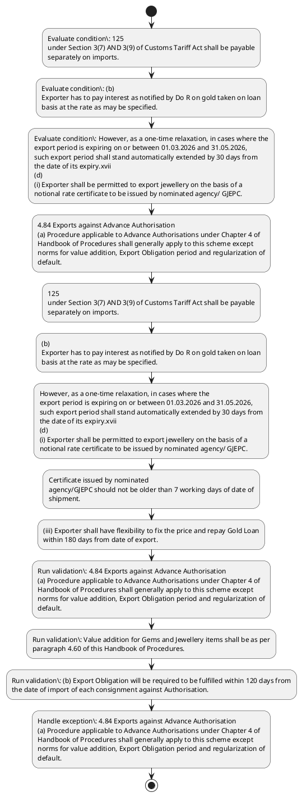

# Chapter 4 / Section 4.84: Exports against Advance Authorisation

**Chapter Title:** Duty Exemption / Remission Schemes

**Pages:** 50, 51, 52

**Purpose:** 4.84 Exports against Advance Authorisation
(a) Procedure applicable to Advance Authorisations under Chapter 4 of
Handbook of Procedures shall generally apply to this scheme except
norms for value addition, Export Obligation period and regularization of
default.

**Purpose Thanglish:** Indha Exports against Advance Authorisation section-la, 4.84 Exports against Advance Authorisation
(a) Procedure applicable to Advance Authorisations under Chapter 4 of
Handbook of Procedures kandippa generally apply to this scheme except
norms for value addition, export Obligation period and regularization of
default.

**Summary:** 4.84 Exports against Advance Authorisation
(a) Procedure applicable to Advance Authorisations under Chapter 4 of
Handbook of Procedures shall generally apply to this scheme except
norms for value addition, Export Obligation period and regularization of
default. Value addition for Gems and Jewellery items shall be as per
paragraph 4.60 of this Handbook of Procedures. (b) Export Obligation will be required to be fulfilled within 120 days from
the date of import of each consignment against Authorisation.

**Business Meaning:** Exports against Advance Authorisation governs how DGFT business controls should be applied, validated, and enforced.

**Business Explanation:** Exports against Advance Authorisation explains the operating rule set that DEKAI should enforce. Key control points include 4.84 Exports against Advance Authorisation
(a) Procedure applicable to Advance Authorisations under Chapter 4 of
Handbook of Procedures shall generally apply to this scheme except
norms for value addition, Export Obligation period and regularization of
default. The section also drives actions such as 4.84 Exports against Advance Authorisation
(a) Procedure applicable to Advance Authorisations under Chapter 4 of
Handbook of Procedures shall generally apply to this scheme except
norms for value addition, Export Obligation period and regularization of
default..

**Business Explanation Thanglish:** Indha Exports against Advance Authorisation section-la, Exports against Advance Authorisation explains the operating rule set that DEKAI should enforce. Key control points include 4.84 Exports against Advance Authorisation
(a) Procedure applicable to Advance Authorisations under Chapter 4 of
Handbook of Procedures kandippa generally apply to this scheme except
norms for value addition, export Obligation period and regularization of
default. The section also drives actions such as 4.84 Exports against Advance Authorisation
(a) Procedure applicable to Advance Authorisations under Chapter 4 of
Handbook of Procedures kandippa generally apply to this scheme except
norms for value addition, export Obligation period and regularization of
default..

## Business Logic
- 4.84 Exports against Advance Authorisation
(a) Procedure applicable to Advance Authorisations under Chapter 4 of
Handbook of Procedures shall generally apply to this scheme except
norms for value addition, Export Obligation period and regularization of
default.
- Value addition for Gems and Jewellery items shall be as per
paragraph 4.60 of this Handbook of Procedures.
- (b) Export Obligation will be required to be fulfilled within 120 days from
the date of import of each consignment against Authorisation.
- However,
Export Obligation period shall be 180 days from the date of import of
findings, mountings made of gold, platinum and silver and to export of
jewellery.
- 125
under Section 3(7) AND 3(9) of Customs Tariff Act shall be payable
separately on imports.
- On failure to effect exports within the period
prescribed, the nominated agencies shall enforce the BG /LUT.
- No extension for fulfilment of EO
shall be allowed.
- However, as a one-time relaxation, in cases where the
export period is expiring on or between 01.03.2026 and 31.05.2026,
such export period shall stand automatically extended by 30 days from
the date of its expiry.xvii
(d)
(i) Exporter shall be permitted to export jewellery on the basis of a
notional rate certificate to be issued by nominated agency/ GJEPC.
- Certificate issued by nominated
agency/GJEPC should not be older than 7 working days of date of
shipment.
- (iii) Exporter shall have flexibility to fix the price and repay Gold Loan
within 180 days from date of export.
- This price shall be
communicated to nominated agencies who will issue a certificate
showing final confirmation of the rate to the bank negotiating
documents, to ensure export proceeds are realized at this rate.
- 4.84 Exports against Advance Authorisation
(a)
Procedure applicable to Advance Authorisations under Chapter 4 of
Handbook of Procedures shall generally apply to this scheme except
norms for value addition, Export Obligation period and regularization of
default.
- (b)
Export Obligation will be required to be fulfilled within 120 days from
the date of import of each consignment against Authorisation.
- In such a case, Export
Obligation will be required to be fulfilled within 90 days from date of
supply of Gold/Silver/Platinum by nominated agency and the
nominated agency shall also make, both exchange control copy and
customs purpose copy of Authorisation invalid for direct imports.

## Business Rules
- rule_id=CH4-SEC4_84-R001, rule_description=4.84 Exports against Advance Authorisation
(a) Procedure applicable to Advance Authorisations under Chapter 4 of
Handbook of Procedures shall generally apply to this scheme except
norms for value addition, Export Obligation period and regularization of
default., trigger=Exports against Advance Authorisation, condition=125
under Section 3(7) AND 3(9) of Customs Tariff Act shall be payable
separately on imports., validation=4.84 Exports against Advance Authorisation
(a) Procedure applicable to Advance Authorisations under Chapter 4 of
Handbook of Procedures shall generally apply to this scheme except
norms for value addition, Export Obligation period and regularization of
default., action=4.84 Exports against Advance Authorisation
(a) Procedure applicable to Advance Authorisations under Chapter 4 of
Handbook of Procedures shall generally apply to this scheme except
norms for value addition, Export Obligation period and regularization of
default., exception=4.84 Exports against Advance Authorisation
(a) Procedure applicable to Advance Authorisations under Chapter 4 of
Handbook of Procedures shall generally apply to this scheme except
norms for value addition, Export Obligation period and regularization of
default., output=DEKAI should produce a compliance decision for 4.84 - Exports against Advance Authorisation.
- rule_id=CH4-SEC4_84-R002, rule_description=Value addition for Gems and Jewellery items shall be as per
paragraph 4.60 of this Handbook of Procedures., trigger=Exports against Advance Authorisation, condition=(b)
Exporter has to pay interest as notified by Do R on gold taken on loan
basis at the rate as may be specified., validation=Value addition for Gems and Jewellery items shall be as per
paragraph 4.60 of this Handbook of Procedures., action=125
under Section 3(7) AND 3(9) of Customs Tariff Act shall be payable
separately on imports., exception=However,
Export Obligation period shall be 180 days from the date of import of
findings, mountings made of gold, platinum and silver and to export of
jewellery., output=DEKAI should produce a compliance decision for 4.84 - Exports against Advance Authorisation.
- rule_id=CH4-SEC4_84-R003, rule_description=(b) Export Obligation will be required to be fulfilled within 120 days from
the date of import of each consignment against Authorisation., trigger=Exports against Advance Authorisation, condition=However, as a one-time relaxation, in cases where the
export period is expiring on or between 01.03.2026 and 31.05.2026,
such export period shall stand automatically extended by 30 days from
the date of its expiry.xvii
(d)
(i) Exporter shall be permitted to export jewellery on the basis of a
notional rate certificate to be issued by nominated agency/ GJEPC., validation=(b) Export Obligation will be required to be fulfilled within 120 days from
the date of import of each consignment against Authorisation., action=(b)
Exporter has to pay interest as notified by Do R on gold taken on loan
basis at the rate as may be specified., exception=However, as a one-time relaxation, in cases where the
export period is expiring on or between 01.03.2026 and 31.05.2026,
such export period shall stand automatically extended by 30 days from
the date of its expiry.xvii
(d)
(i) Exporter shall be permitted to export jewellery on the basis of a
notional rate certificate to be issued by nominated agency/ GJEPC., output=DEKAI should produce a compliance decision for 4.84 - Exports against Advance Authorisation.
- rule_id=CH4-SEC4_84-R004, rule_description=However,
Export Obligation period shall be 180 days from the date of import of
findings, mountings made of gold, platinum and silver and to export of
jewellery., trigger=Exports against Advance Authorisation, condition=This rate will be based on prevailing Gold /US$ rate and the US$/INR
rate in notional rate certificate., validation=However,
Export Obligation period shall be 180 days from the date of import of
findings, mountings made of gold, platinum and silver and to export of
jewellery., action=However, as a one-time relaxation, in cases where the
export period is expiring on or between 01.03.2026 and 31.05.2026,
such export period shall stand automatically extended by 30 days from
the date of its expiry.xvii
(d)
(i) Exporter shall be permitted to export jewellery on the basis of a
notional rate certificate to be issued by nominated agency/ GJEPC., exception=4.84 Exports against Advance Authorisation
(a)
Procedure applicable to Advance Authorisations under Chapter 4 of
Handbook of Procedures shall generally apply to this scheme except
norms for value addition, Export Obligation period and regularization of
default., output=DEKAI should produce a compliance decision for 4.84 - Exports against Advance Authorisation.
- rule_id=CH4-SEC4_84-R005, rule_description=125
under Section 3(7) AND 3(9) of Customs Tariff Act shall be payable
separately on imports., trigger=Exports against Advance Authorisation, condition=Certificate issued by nominated
agency/GJEPC should not be older than 7 working days of date of
shipment., validation=125
under Section 3(7) AND 3(9) of Customs Tariff Act shall be payable
separately on imports., action=Certificate issued by nominated
agency/GJEPC should not be older than 7 working days of date of
shipment., exception=However, relaxation in the period for
repatriation/forex realization would be equal to the period as allowed plus six
months, or as per RBI guidelines, whichever is less., output=DEKAI should produce a compliance decision for 4.84 - Exports against Advance Authorisation.
- rule_id=CH4-SEC4_84-R006, rule_description=On failure to effect exports within the period
prescribed, the nominated agencies shall enforce the BG /LUT., trigger=Exports against Advance Authorisation, condition=This price shall be
communicated to nominated agencies who will issue a certificate
showing final confirmation of the rate to the bank negotiating
documents, to ensure export proceeds are realized at this rate., validation=On failure to effect exports within the period
prescribed, the nominated agencies shall enforce the BG /LUT., action=(iii) Exporter shall have flexibility to fix the price and repay Gold Loan
within 180 days from date of export., exception=However,
relaxation in the period for repatriation/forex realization would be equal to the
period as allowed plus six months, or as per RBI guidelines, whichever is less., output=DEKAI should produce a compliance decision for 4.84 - Exports against Advance Authorisation.
- rule_id=CH4-SEC4_84-R007, rule_description=No extension for fulfilment of EO
shall be allowed., trigger=Exports against Advance Authorisation, condition=4.84 A
For those cases, where the last date for exports/ replenishment/ imports/
drawal of precious metal as calculated under various sub-paras of para 4.82,
4.83, 4.84 and Para 4.85, expires between 01.02.2020 and 31.07.2020, such last
date stands extended by six months., validation=(c)
Export has to be completed within a maximum period of 90 days from
date of release of gold on loan basis., action=This price shall be
communicated to nominated agencies who will issue a certificate
showing final confirmation of the rate to the bank negotiating
documents, to ensure export proceeds are realized at this rate., exception=However,
relaxation in the period for repatriation/forex realization would be equal to the
period as allowed plus six months, or as per RBI guidelines, whichever is less., output=DEKAI should produce a compliance decision for 4.84 - Exports against Advance Authorisation.
- rule_id=CH4-SEC4_84-R008, rule_description=However, as a one-time relaxation, in cases where the
export period is expiring on or between 01.03.2026 and 31.05.2026,
such export period shall stand automatically extended by 30 days from
the date of its expiry.xvii
(d)
(i) Exporter shall be permitted to export jewellery on the basis of a
notional rate certificate to be issued by nominated agency/ GJEPC., trigger=Exports against Advance Authorisation, condition=4.84 B
For those cases, where the last date for exports/ replenishment/ imports/
drawal of precious metal as calculated under various sub-paras of para 4.82,
4.83, 4.84 of Handbook of Procedures, 2015-20 expires between 01.02.2021
and 30.06.2021, such last date stands extended by six months., validation=No extension for fulfilment of EO
shall be allowed., action=(e)
Nominated agencies may accept payment in dollars towards cost of
import of precious metal from EEFC account of exporter., exception=However,
relaxation in the period for repatriation/forex realization would be equal to the
period as allowed plus six months, or as per RBI guidelines, whichever is less., output=DEKAI should produce a compliance decision for 4.84 - Exports against Advance Authorisation.
- rule_id=CH4-SEC4_84-R009, rule_description=Certificate issued by nominated
agency/GJEPC should not be older than 7 working days of date of
shipment., trigger=Exports against Advance Authorisation, condition=4.84 B
For those cases, where the last date for exports/ replenishment/ imports/
drawal of precious metal as calculated under various sub-paras of para 4.82,
4.83, 4.84 of Handbook of Procedures, 2015-20 expires between 01.02.2021
and 30.06.2021, such last date stands extended by six months., validation=However, as a one-time relaxation, in cases where the
export period is expiring on or between 01.03.2026 and 31.05.2026,
such export period shall stand automatically extended by 30 days from
the date of its expiry.xvii
(d)
(i) Exporter shall be permitted to export jewellery on the basis of a
notional rate certificate to be issued by nominated agency/ GJEPC., action=4.84 Exports against Advance Authorisation
(a)
Procedure applicable to Advance Authorisations under Chapter 4 of
Handbook of Procedures shall generally apply to this scheme except
norms for value addition, Export Obligation period and regularization of
default., exception=However,
relaxation in the period for repatriation/forex realization would be equal to the
period as allowed plus six months, or as per RBI guidelines, whichever is less., output=DEKAI should produce a compliance decision for 4.84 - Exports against Advance Authorisation.
- rule_id=CH4-SEC4_84-R010, rule_description=(iii) Exporter shall have flexibility to fix the price and repay Gold Loan
within 180 days from date of export., trigger=Exports against Advance Authorisation, condition=4.84 B
For those cases, where the last date for exports/ replenishment/ imports/
drawal of precious metal as calculated under various sub-paras of para 4.82,
4.83, 4.84 of Handbook of Procedures, 2015-20 expires between 01.02.2021
and 30.06.2021, such last date stands extended by six months., validation=(iii) Exporter shall have flexibility to fix the price and repay Gold Loan
within 180 days from date of export., action=No further extension in Export Obligation period will be
allowed.xvi
(c) Advance Authorisation holder may obtain gold /silver / platinum from
nominated agencies in lieu of direct imports., exception=However,
relaxation in the period for repatriation/forex realization would be equal to the
period as allowed plus six months, or as per RBI guidelines, whichever is less., output=DEKAI should produce a compliance decision for 4.84 - Exports against Advance Authorisation.
- rule_id=CH4-SEC4_84-R011, rule_description=This price shall be
communicated to nominated agencies who will issue a certificate
showing final confirmation of the rate to the bank negotiating
documents, to ensure export proceeds are realized at this rate., trigger=Exports against Advance Authorisation, condition=4.84 B
For those cases, where the last date for exports/ replenishment/ imports/
drawal of precious metal as calculated under various sub-paras of para 4.82,
4.83, 4.84 of Handbook of Procedures, 2015-20 expires between 01.02.2021
and 30.06.2021, such last date stands extended by six months., validation=This price shall be
communicated to nominated agencies who will issue a certificate
showing final confirmation of the rate to the bank negotiating
documents, to ensure export proceeds are realized at this rate., action=126
allowed.xvi
(c)
Advance Authorisation holder may obtain gold /silver / platinum from
nominated agencies in lieu of direct imports., exception=However,
relaxation in the period for repatriation/forex realization would be equal to the
period as allowed plus six months, or as per RBI guidelines, whichever is less., output=DEKAI should produce a compliance decision for 4.84 - Exports against Advance Authorisation.
- rule_id=CH4-SEC4_84-R012, rule_description=4.84 Exports against Advance Authorisation
(a)
Procedure applicable to Advance Authorisations under Chapter 4 of
Handbook of Procedures shall generally apply to this scheme except
norms for value addition, Export Obligation period and regularization of
default., trigger=Exports against Advance Authorisation, condition=4.84 B
For those cases, where the last date for exports/ replenishment/ imports/
drawal of precious metal as calculated under various sub-paras of para 4.82,
4.83, 4.84 of Handbook of Procedures, 2015-20 expires between 01.02.2021
and 30.06.2021, such last date stands extended by six months., validation=4.84 Exports against Advance Authorisation
(a)
Procedure applicable to Advance Authorisations under Chapter 4 of
Handbook of Procedures shall generally apply to this scheme except
norms for value addition, Export Obligation period and regularization of
default., action=126
allowed.xvi
(c)
Advance Authorisation holder may obtain gold /silver / platinum from
nominated agencies in lieu of direct imports., exception=However,
relaxation in the period for repatriation/forex realization would be equal to the
period as allowed plus six months, or as per RBI guidelines, whichever is less., output=DEKAI should produce a compliance decision for 4.84 - Exports against Advance Authorisation.
- rule_id=CH4-SEC4_84-R013, rule_description=(b)
Export Obligation will be required to be fulfilled within 120 days from
the date of import of each consignment against Authorisation., trigger=Exports against Advance Authorisation, condition=4.84 B
For those cases, where the last date for exports/ replenishment/ imports/
drawal of precious metal as calculated under various sub-paras of para 4.82,
4.83, 4.84 of Handbook of Procedures, 2015-20 expires between 01.02.2021
and 30.06.2021, such last date stands extended by six months., validation=(b)
Export Obligation will be required to be fulfilled within 120 days from
the date of import of each consignment against Authorisation., action=126
allowed.xvi
(c)
Advance Authorisation holder may obtain gold /silver / platinum from
nominated agencies in lieu of direct imports., exception=However,
relaxation in the period for repatriation/forex realization would be equal to the
period as allowed plus six months, or as per RBI guidelines, whichever is less., output=DEKAI should produce a compliance decision for 4.84 - Exports against Advance Authorisation.
- rule_id=CH4-SEC4_84-R014, rule_description=In such a case, Export
Obligation will be required to be fulfilled within 90 days from date of
supply of Gold/Silver/Platinum by nominated agency and the
nominated agency shall also make, both exchange control copy and
customs purpose copy of Authorisation invalid for direct imports., trigger=Exports against Advance Authorisation, condition=4.84 B
For those cases, where the last date for exports/ replenishment/ imports/
drawal of precious metal as calculated under various sub-paras of para 4.82,
4.83, 4.84 of Handbook of Procedures, 2015-20 expires between 01.02.2021
and 30.06.2021, such last date stands extended by six months., validation=In such a case, Export
Obligation will be required to be fulfilled within 90 days from date of
supply of Gold/Silver/Platinum by nominated agency and the
nominated agency shall also make, both exchange control copy and
customs purpose copy of Authorisation invalid for direct imports., action=126
allowed.xvi
(c)
Advance Authorisation holder may obtain gold /silver / platinum from
nominated agencies in lieu of direct imports., exception=However,
relaxation in the period for repatriation/forex realization would be equal to the
period as allowed plus six months, or as per RBI guidelines, whichever is less., output=DEKAI should produce a compliance decision for 4.84 - Exports against Advance Authorisation.

## Conditions
- 125
under Section 3(7) AND 3(9) of Customs Tariff Act shall be payable
separately on imports.
- (b)
Exporter has to pay interest as notified by Do R on gold taken on loan
basis at the rate as may be specified.
- However, as a one-time relaxation, in cases where the
export period is expiring on or between 01.03.2026 and 31.05.2026,
such export period shall stand automatically extended by 30 days from
the date of its expiry.xvii
(d)
(i) Exporter shall be permitted to export jewellery on the basis of a
notional rate certificate to be issued by nominated agency/ GJEPC.
- This rate will be based on prevailing Gold /US$ rate and the US$/INR
rate in notional rate certificate.
- Certificate issued by nominated
agency/GJEPC should not be older than 7 working days of date of
shipment.
- This price shall be
communicated to nominated agencies who will issue a certificate
showing final confirmation of the rate to the bank negotiating
documents, to ensure export proceeds are realized at this rate.
- 4.84 A
For those cases, where the last date for exports/ replenishment/ imports/
drawal of precious metal as calculated under various sub-paras of para 4.82,
4.83, 4.84 and Para 4.85, expires between 01.02.2020 and 31.07.2020, such last
date stands extended by six months.
- 4.84 B
For those cases, where the last date for exports/ replenishment/ imports/
drawal of precious metal as calculated under various sub-paras of para 4.82,
4.83, 4.84 of Handbook of Procedures, 2015-20 expires between 01.02.2021
and 30.06.2021, such last date stands extended by six months.

## Condition Logic
- id=4.4.84.1, if=125
under Section 3(7) AND 3(9) of Customs Tariff Act shall be payable
separately on imports., then=4.84 Exports against Advance Authorisation
(a) Procedure applicable to Advance Authorisations under Chapter 4 of
Handbook of Procedures shall generally apply to this scheme except
norms for value addition, Export Obligation period and regularization of
default., source=125
under Section 3(7) AND 3(9) of Customs Tariff Act shall be payable
separately on imports.
- id=4.4.84.2, if=(b)
Exporter has to pay interest as notified by Do R on gold taken on loan
basis at the rate as may be specified., then=4.84 Exports against Advance Authorisation
(a) Procedure applicable to Advance Authorisations under Chapter 4 of
Handbook of Procedures shall generally apply to this scheme except
norms for value addition, Export Obligation period and regularization of
default., source=(b)
Exporter has to pay interest as notified by Do R on gold taken on loan
basis at the rate as may be specified.
- id=4.4.84.3, if=However, as a one-time relaxation, in cases where the
export period is expiring on or between 01.03.2026 and 31.05.2026,
such export period shall stand automatically extended by 30 days from
the date of its expiry.xvii
(d)
(i) Exporter shall be permitted to export jewellery on the basis of a
notional rate certificate to be issued by nominated agency/ GJEPC., then=4.84 Exports against Advance Authorisation
(a) Procedure applicable to Advance Authorisations under Chapter 4 of
Handbook of Procedures shall generally apply to this scheme except
norms for value addition, Export Obligation period and regularization of
default., source=However, as a one-time relaxation, in cases where the
export period is expiring on or between 01.03.2026 and 31.05.2026,
such export period shall stand automatically extended by 30 days from
the date of its expiry.xvii
(d)
(i) Exporter shall be permitted to export jewellery on the basis of a
notional rate certificate to be issued by nominated agency/ GJEPC.
- id=4.4.84.4, if=This rate will be based on prevailing Gold /US$ rate and the US$/INR
rate in notional rate certificate., then=4.84 Exports against Advance Authorisation
(a) Procedure applicable to Advance Authorisations under Chapter 4 of
Handbook of Procedures shall generally apply to this scheme except
norms for value addition, Export Obligation period and regularization of
default., source=This rate will be based on prevailing Gold /US$ rate and the US$/INR
rate in notional rate certificate.
- id=4.4.84.5, if=Certificate issued by nominated
agency/GJEPC should not be older than 7 working days of date of
shipment., then=4.84 Exports against Advance Authorisation
(a) Procedure applicable to Advance Authorisations under Chapter 4 of
Handbook of Procedures shall generally apply to this scheme except
norms for value addition, Export Obligation period and regularization of
default., source=Certificate issued by nominated
agency/GJEPC should not be older than 7 working days of date of
shipment.
- id=4.4.84.6, if=This price shall be
communicated to nominated agencies who will issue a certificate
showing final confirmation of the rate to the bank negotiating
documents, to ensure export proceeds are realized at this rate., then=4.84 Exports against Advance Authorisation
(a) Procedure applicable to Advance Authorisations under Chapter 4 of
Handbook of Procedures shall generally apply to this scheme except
norms for value addition, Export Obligation period and regularization of
default., source=This price shall be
communicated to nominated agencies who will issue a certificate
showing final confirmation of the rate to the bank negotiating
documents, to ensure export proceeds are realized at this rate.
- id=4.4.84.7, if=4.84 A
For those cases, where the last date for exports/ replenishment/ imports/
drawal of precious metal as calculated under various sub-paras of para 4.82,
4.83, 4.84 and Para 4.85, expires between 01.02.2020 and 31.07.2020, such last
date stands extended by six months., then=4.84 Exports against Advance Authorisation
(a) Procedure applicable to Advance Authorisations under Chapter 4 of
Handbook of Procedures shall generally apply to this scheme except
norms for value addition, Export Obligation period and regularization of
default., source=4.84 A
For those cases, where the last date for exports/ replenishment/ imports/
drawal of precious metal as calculated under various sub-paras of para 4.82,
4.83, 4.84 and Para 4.85, expires between 01.02.2020 and 31.07.2020, such last
date stands extended by six months.
- id=4.4.84.8, if=4.84 B
For those cases, where the last date for exports/ replenishment/ imports/
drawal of precious metal as calculated under various sub-paras of para 4.82,
4.83, 4.84 of Handbook of Procedures, 2015-20 expires between 01.02.2021
and 30.06.2021, such last date stands extended by six months., then=4.84 Exports against Advance Authorisation
(a) Procedure applicable to Advance Authorisations under Chapter 4 of
Handbook of Procedures shall generally apply to this scheme except
norms for value addition, Export Obligation period and regularization of
default., source=4.84 B
For those cases, where the last date for exports/ replenishment/ imports/
drawal of precious metal as calculated under various sub-paras of para 4.82,
4.83, 4.84 of Handbook of Procedures, 2015-20 expires between 01.02.2021
and 30.06.2021, such last date stands extended by six months.

## Validations
- 4.84 Exports against Advance Authorisation
(a) Procedure applicable to Advance Authorisations under Chapter 4 of
Handbook of Procedures shall generally apply to this scheme except
norms for value addition, Export Obligation period and regularization of
default.
- Value addition for Gems and Jewellery items shall be as per
paragraph 4.60 of this Handbook of Procedures.
- (b) Export Obligation will be required to be fulfilled within 120 days from
the date of import of each consignment against Authorisation.
- However,
Export Obligation period shall be 180 days from the date of import of
findings, mountings made of gold, platinum and silver and to export of
jewellery.
- 125
under Section 3(7) AND 3(9) of Customs Tariff Act shall be payable
separately on imports.
- On failure to effect exports within the period
prescribed, the nominated agencies shall enforce the BG /LUT.
- (c)
Export has to be completed within a maximum period of 90 days from
date of release of gold on loan basis.
- No extension for fulfilment of EO
shall be allowed.
- However, as a one-time relaxation, in cases where the
export period is expiring on or between 01.03.2026 and 31.05.2026,
such export period shall stand automatically extended by 30 days from
the date of its expiry.xvii
(d)
(i) Exporter shall be permitted to export jewellery on the basis of a
notional rate certificate to be issued by nominated agency/ GJEPC.
- (iii) Exporter shall have flexibility to fix the price and repay Gold Loan
within 180 days from date of export.
- This price shall be
communicated to nominated agencies who will issue a certificate
showing final confirmation of the rate to the bank negotiating
documents, to ensure export proceeds are realized at this rate.
- 4.84 Exports against Advance Authorisation
(a)
Procedure applicable to Advance Authorisations under Chapter 4 of
Handbook of Procedures shall generally apply to this scheme except
norms for value addition, Export Obligation period and regularization of
default.
- (b)
Export Obligation will be required to be fulfilled within 120 days from
the date of import of each consignment against Authorisation.
- In such a case, Export
Obligation will be required to be fulfilled within 90 days from date of
supply of Gold/Silver/Platinum by nominated agency and the
nominated agency shall also make, both exchange control copy and
customs purpose copy of Authorisation invalid for direct imports.

## Exceptions
- 4.84 Exports against Advance Authorisation
(a) Procedure applicable to Advance Authorisations under Chapter 4 of
Handbook of Procedures shall generally apply to this scheme except
norms for value addition, Export Obligation period and regularization of
default.
- However,
Export Obligation period shall be 180 days from the date of import of
findings, mountings made of gold, platinum and silver and to export of
jewellery.
- However, as a one-time relaxation, in cases where the
export period is expiring on or between 01.03.2026 and 31.05.2026,
such export period shall stand automatically extended by 30 days from
the date of its expiry.xvii
(d)
(i) Exporter shall be permitted to export jewellery on the basis of a
notional rate certificate to be issued by nominated agency/ GJEPC.
- 4.84 Exports against Advance Authorisation
(a)
Procedure applicable to Advance Authorisations under Chapter 4 of
Handbook of Procedures shall generally apply to this scheme except
norms for value addition, Export Obligation period and regularization of
default.
- However, relaxation in the period for
repatriation/forex realization would be equal to the period as allowed plus six
months, or as per RBI guidelines, whichever is less.
- However,
relaxation in the period for repatriation/forex realization would be equal to the
period as allowed plus six months, or as per RBI guidelines, whichever is less.

## Dependencies
- 4
- 4.60
- 3
- 4.82
- 4.85
- 4.83

## Authorities
- Customs

## Required Documents
- However, as a one-time relaxation, in cases where the
export period is expiring on or between 01.03.2026 and 31.05.2026,
such export period shall stand automatically extended by 30 days from
the date of its expiry.xvii
(d)
(i) Exporter shall be permitted to export jewellery on the basis of a
notional rate certificate to be issued by nominated agency/ GJEPC.
- This rate will be based on prevailing Gold /US$ rate and the US$/INR
rate in notional rate certificate.
- Certificate issued by nominated
agency/GJEPC should not be older than 7 working days of date of
shipment.
- This price shall be
communicated to nominated agencies who will issue a certificate
showing final confirmation of the rate to the bank negotiating
documents, to ensure export proceeds are realized at this rate.
- In such a case, Export
Obligation will be required to be fulfilled within 90 days from date of
supply of Gold/Silver/Platinum by nominated agency and the
nominated agency shall also make, both exchange control copy and
customs purpose copy of Authorisation invalid for direct imports.

## Timelines
- (b) Export Obligation will be required to be fulfilled within 120 days from
the date of import of each consignment against Authorisation.
- However,
Export Obligation period shall be 180 days from the date of import of
findings, mountings made of gold, platinum and silver and to export of
jewellery.
- On failure to effect exports within the period
prescribed, the nominated agencies shall enforce the BG /LUT.
- (c)
Export has to be completed within a maximum period of 90 days from
date of release of gold on loan basis.
- However, as a one-time relaxation, in cases where the
export period is expiring on or between 01.03.2026 and 31.05.2026,
such export period shall stand automatically extended by 30 days from
the date of its expiry.xvii
(d)
(i) Exporter shall be permitted to export jewellery on the basis of a
notional rate certificate to be issued by nominated agency/ GJEPC.
- Certificate issued by nominated
agency/GJEPC should not be older than 7 working days of date of
shipment.
- (iii) Exporter shall have flexibility to fix the price and repay Gold Loan
within 180 days from date of export.
- (b)
Export Obligation will be required to be fulfilled within 120 days from
the date of import of each consignment against Authorisation.
- In such a case, Export
Obligation will be required to be fulfilled within 90 days from date of
supply of Gold/Silver/Platinum by nominated agency and the
nominated agency shall also make, both exchange control copy and
customs purpose copy of Authorisation invalid for direct imports.
- 4.84 A
For those cases, where the last date for exports/ replenishment/ imports/
drawal of precious metal as calculated under various sub-paras of para 4.82,
4.83, 4.84 and Para 4.85, expires between 01.02.2020 and 31.07.2020, such last
date stands extended by six months.
- However, relaxation in the period for
repatriation/forex realization would be equal to the period as allowed plus six
months, or as per RBI guidelines, whichever is less.
- 4.84 B
For those cases, where the last date for exports/ replenishment/ imports/
drawal of precious metal as calculated under various sub-paras of para 4.82,
4.83, 4.84 of Handbook of Procedures, 2015-20 expires between 01.02.2021
and 30.06.2021, such last date stands extended by six months.
- However,
relaxation in the period for repatriation/forex realization would be equal to the
period as allowed plus six months, or as per RBI guidelines, whichever is less.

## Actions
- 4.84 Exports against Advance Authorisation
(a) Procedure applicable to Advance Authorisations under Chapter 4 of
Handbook of Procedures shall generally apply to this scheme except
norms for value addition, Export Obligation period and regularization of
default.
- 125
under Section 3(7) AND 3(9) of Customs Tariff Act shall be payable
separately on imports.
- (b)
Exporter has to pay interest as notified by Do R on gold taken on loan
basis at the rate as may be specified.
- However, as a one-time relaxation, in cases where the
export period is expiring on or between 01.03.2026 and 31.05.2026,
such export period shall stand automatically extended by 30 days from
the date of its expiry.xvii
(d)
(i) Exporter shall be permitted to export jewellery on the basis of a
notional rate certificate to be issued by nominated agency/ GJEPC.
- Certificate issued by nominated
agency/GJEPC should not be older than 7 working days of date of
shipment.
- (iii) Exporter shall have flexibility to fix the price and repay Gold Loan
within 180 days from date of export.
- This price shall be
communicated to nominated agencies who will issue a certificate
showing final confirmation of the rate to the bank negotiating
documents, to ensure export proceeds are realized at this rate.
- (e)
Nominated agencies may accept payment in dollars towards cost of
import of precious metal from EEFC account of exporter.
- 4.84 Exports against Advance Authorisation
(a)
Procedure applicable to Advance Authorisations under Chapter 4 of
Handbook of Procedures shall generally apply to this scheme except
norms for value addition, Export Obligation period and regularization of
default.
- No further extension in Export Obligation period will be
allowed.xvi
(c) Advance Authorisation holder may obtain gold /silver / platinum from
nominated agencies in lieu of direct imports.
- 126
allowed.xvi
(c)
Advance Authorisation holder may obtain gold /silver / platinum from
nominated agencies in lieu of direct imports.

## Workflow
- Evaluate condition: 125
under Section 3(7) AND 3(9) of Customs Tariff Act shall be payable
separately on imports.
- Evaluate condition: (b)
Exporter has to pay interest as notified by Do R on gold taken on loan
basis at the rate as may be specified.
- Evaluate condition: However, as a one-time relaxation, in cases where the
export period is expiring on or between 01.03.2026 and 31.05.2026,
such export period shall stand automatically extended by 30 days from
the date of its expiry.xvii
(d)
(i) Exporter shall be permitted to export jewellery on the basis of a
notional rate certificate to be issued by nominated agency/ GJEPC.
- 4.84 Exports against Advance Authorisation
(a) Procedure applicable to Advance Authorisations under Chapter 4 of
Handbook of Procedures shall generally apply to this scheme except
norms for value addition, Export Obligation period and regularization of
default.
- 125
under Section 3(7) AND 3(9) of Customs Tariff Act shall be payable
separately on imports.
- (b)
Exporter has to pay interest as notified by Do R on gold taken on loan
basis at the rate as may be specified.
- However, as a one-time relaxation, in cases where the
export period is expiring on or between 01.03.2026 and 31.05.2026,
such export period shall stand automatically extended by 30 days from
the date of its expiry.xvii
(d)
(i) Exporter shall be permitted to export jewellery on the basis of a
notional rate certificate to be issued by nominated agency/ GJEPC.
- Certificate issued by nominated
agency/GJEPC should not be older than 7 working days of date of
shipment.
- (iii) Exporter shall have flexibility to fix the price and repay Gold Loan
within 180 days from date of export.
- Run validation: 4.84 Exports against Advance Authorisation
(a) Procedure applicable to Advance Authorisations under Chapter 4 of
Handbook of Procedures shall generally apply to this scheme except
norms for value addition, Export Obligation period and regularization of
default.
- Run validation: Value addition for Gems and Jewellery items shall be as per
paragraph 4.60 of this Handbook of Procedures.
- Run validation: (b) Export Obligation will be required to be fulfilled within 120 days from
the date of import of each consignment against Authorisation.
- Handle exception: 4.84 Exports against Advance Authorisation
(a) Procedure applicable to Advance Authorisations under Chapter 4 of
Handbook of Procedures shall generally apply to this scheme except
norms for value addition, Export Obligation period and regularization of
default.

## Workflow ASCII
```text
Exports against Advance Authorisation
Evaluate condition: 125
under Section 3(7) AND 3(9) of Customs Tariff Act shall be payable
separately on imports.
   |
   v
Evaluate condition: (b)
Exporter has to pay interest as notified by Do R on gold taken on loan
basis at the rate as may be specified.
   |
   v
Evaluate condition: However, as a one-time relaxation, in cases where the
export period is expiring on or between 01.03.2026 and 31.05.2026,
such export period shall stand automatically extended by 30 days from
the date of its expiry.xvii
(d)
(i) Exporter shall be permitted to export jewellery on the basis of a
notional rate certificate to be issued by nominated agency/ GJEPC.
   |
   v
4.84 Exports against Advance Authorisation
(a) Procedure applicable to Advance Authorisations under Chapter 4 of
Handbook of Procedures shall generally apply to this scheme except
norms for value addition, Export Obligation period and regularization of
default.
   |
   v
125
under Section 3(7) AND 3(9) of Customs Tariff Act shall be payable
separately on imports.
   |
   v
(b)
Exporter has to pay interest as notified by Do R on gold taken on loan
basis at the rate as may be specified.
   |
   v
However, as a one-time relaxation, in cases where the
export period is expiring on or between 01.03.2026 and 31.05.2026,
such export period shall stand automatically extended by 30 days from
the date of its expiry.xvii
(d)
(i) Exporter shall be permitted to export jewellery on the basis of a
notional rate certificate to be issued by nominated agency/ GJEPC.
   |
   v
Certificate issued by nominated
agency/GJEPC should not be older than 7 working days of date of
shipment.
   |
   v
(iii) Exporter shall have flexibility to fix the price and repay Gold Loan
within 180 days from date of export.
   |
   v
Run validation: 4.84 Exports against Advance Authorisation
(a) Procedure applicable to Advance Authorisations under Chapter 4 of
Handbook of Procedures shall generally apply to this scheme except
norms for value addition, Export Obligation period and regularization of
default.
   |
   v
Run validation: Value addition for Gems and Jewellery items shall be as per
paragraph 4.60 of this Handbook of Procedures.
   |
   v
Run validation: (b) Export Obligation will be required to be fulfilled within 120 days from
the date of import of each consignment against Authorisation.
   |
   v
Handle exception: 4.84 Exports against Advance Authorisation
(a) Procedure applicable to Advance Authorisations under Chapter 4 of
Handbook of Procedures shall generally apply to this scheme except
norms for value addition, Export Obligation period and regularization of
default.
```

## Decision Tree
- IF 125
under Section 3(7) AND 3(9) of Customs Tariff Act shall be payable
separately on imports. THEN 4.84 Exports against Advance Authorisation
(a) Procedure applicable to Advance Authorisations under Chapter 4 of
Handbook of Procedures shall generally apply to this scheme except
norms for value addition, Export Obligation period and regularization of
default.
- IF (b)
Exporter has to pay interest as notified by Do R on gold taken on loan
basis at the rate as may be specified. THEN 4.84 Exports against Advance Authorisation
(a) Procedure applicable to Advance Authorisations under Chapter 4 of
Handbook of Procedures shall generally apply to this scheme except
norms for value addition, Export Obligation period and regularization of
default.
- IF However, as a one-time relaxation, in cases where the
export period is expiring on or between 01.03.2026 and 31.05.2026,
such export period shall stand automatically extended by 30 days from
the date of its expiry.xvii
(d)
(i) Exporter shall be permitted to export jewellery on the basis of a
notional rate certificate to be issued by nominated agency/ GJEPC. THEN 4.84 Exports against Advance Authorisation
(a) Procedure applicable to Advance Authorisations under Chapter 4 of
Handbook of Procedures shall generally apply to this scheme except
norms for value addition, Export Obligation period and regularization of
default.
- IF This rate will be based on prevailing Gold /US$ rate and the US$/INR
rate in notional rate certificate. THEN 4.84 Exports against Advance Authorisation
(a) Procedure applicable to Advance Authorisations under Chapter 4 of
Handbook of Procedures shall generally apply to this scheme except
norms for value addition, Export Obligation period and regularization of
default.
- IF Certificate issued by nominated
agency/GJEPC should not be older than 7 working days of date of
shipment. THEN 4.84 Exports against Advance Authorisation
(a) Procedure applicable to Advance Authorisations under Chapter 4 of
Handbook of Procedures shall generally apply to this scheme except
norms for value addition, Export Obligation period and regularization of
default.
- IF exception applies (4.84 Exports against Advance Authorisation
(a) Procedure applicable to Advance Authorisations under Chapter 4 of
Handbook of Procedures shall generally apply to this scheme except
norms for value addition, Export Obligation period and regularization of
default.) THEN route to manual review
- IF exception applies (However,
Export Obligation period shall be 180 days from the date of import of
findings, mountings made of gold, platinum and silver and to export of
jewellery.) THEN route to manual review
- IF exception applies (However, as a one-time relaxation, in cases where the
export period is expiring on or between 01.03.2026 and 31.05.2026,
such export period shall stand automatically extended by 30 days from
the date of its expiry.xvii
(d)
(i) Exporter shall be permitted to export jewellery on the basis of a
notional rate certificate to be issued by nominated agency/ GJEPC.) THEN route to manual review

## Decision Tree ASCII
```text
Exports against Advance Authorisation Decision
IF 125
under Section 3(7) AND 3(9) of Customs Tariff Act shall be payable
separately on imports. THEN 4.84 Exports against Advance Authorisation
(a) Procedure applicable to Advance Authorisations under Chapter 4 of
Handbook of Procedures shall generally apply to this scheme except
norms for value addition, Export Obligation period and regularization of
default.
   |
   v
IF (b)
Exporter has to pay interest as notified by Do R on gold taken on loan
basis at the rate as may be specified. THEN 4.84 Exports against Advance Authorisation
(a) Procedure applicable to Advance Authorisations under Chapter 4 of
Handbook of Procedures shall generally apply to this scheme except
norms for value addition, Export Obligation period and regularization of
default.
   |
   v
IF However, as a one-time relaxation, in cases where the
export period is expiring on or between 01.03.2026 and 31.05.2026,
such export period shall stand automatically extended by 30 days from
the date of its expiry.xvii
(d)
(i) Exporter shall be permitted to export jewellery on the basis of a
notional rate certificate to be issued by nominated agency/ GJEPC. THEN 4.84 Exports against Advance Authorisation
(a) Procedure applicable to Advance Authorisations under Chapter 4 of
Handbook of Procedures shall generally apply to this scheme except
norms for value addition, Export Obligation period and regularization of
default.
   |
   v
IF This rate will be based on prevailing Gold /US$ rate and the US$/INR
rate in notional rate certificate. THEN 4.84 Exports against Advance Authorisation
(a) Procedure applicable to Advance Authorisations under Chapter 4 of
Handbook of Procedures shall generally apply to this scheme except
norms for value addition, Export Obligation period and regularization of
default.
   |
   v
IF Certificate issued by nominated
agency/GJEPC should not be older than 7 working days of date of
shipment. THEN 4.84 Exports against Advance Authorisation
(a) Procedure applicable to Advance Authorisations under Chapter 4 of
Handbook of Procedures shall generally apply to this scheme except
norms for value addition, Export Obligation period and regularization of
default.
   |
   v
IF exception applies (4.84 Exports against Advance Authorisation
(a) Procedure applicable to Advance Authorisations under Chapter 4 of
Handbook of Procedures shall generally apply to this scheme except
norms for value addition, Export Obligation period and regularization of
default.) THEN route to manual review
   |
   v
IF exception applies (However,
Export Obligation period shall be 180 days from the date of import of
findings, mountings made of gold, platinum and silver and to export of
jewellery.) THEN route to manual review
   |
   v
IF exception applies (However, as a one-time relaxation, in cases where the
export period is expiring on or between 01.03.2026 and 31.05.2026,
such export period shall stand automatically extended by 30 days from
the date of its expiry.xvii
(d)
(i) Exporter shall be permitted to export jewellery on the basis of a
notional rate certificate to be issued by nominated agency/ GJEPC.) THEN route to manual review
```

## Examples
- User asks to process Exports against Advance Authorisation; the platform checks conditions, validations, and documents before action.

**Real-world Example:** Example: an importer or exporter invokes Exports against Advance Authorisation, submits However, as a one-time relaxation, in cases where the
export period is expiring on or between 01.03.2026 and 31.05.2026,
such export period shall stand automatically extended by 30 days from
the date of its expiry.xvii
(d)
(i) Exporter shall be permitted to export jewellery on the basis of a
notional rate certificate to be issued by nominated agency/ GJEPC., This rate will be based on prevailing Gold /US$ rate and the US$/INR
rate in notional rate certificate., Certificate issued by nominated
agency/GJEPC should not be older than 7 working days of date of
shipment., and DEKAI uses the extracted rules to 4.84 exports against advance authorisation
(a) procedure applicable to advance authorisations under chapter 4 of
handbook of procedures shall generally apply to this scheme except
norms for value addition, export obligation period and regularization of
default..

**Real-world Example Thanglish:** Indha Exports against Advance Authorisation section-la, Example: an importer or exporter invokes Exports against Advance Authorisation, submits However, as a one-time relaxation, in cases where the
export period is expiring on or between 01.03.2026 and 31.05.2026,
such export period kandippa stand automatically extended by 30 days from
the date of its expiry.xvii
(d)
(i) Exporter kandippa be permitted to export jewellery on the basis of a
notional rate certificate to be issued by nominated agency/ GJEPC., This rate will be based on prevailing Gold /US$ rate and the US$/INR
rate in notional rate certificate., Certificate issued by nominated
agency/GJEPC should not be older than 7 working days of date of
shipment., and DEKAI uses the extracted rules to 4.84 exports against advance authorisation
(a) procedure applicable to advance authorisations under chapter 4 of
handbook of procedures kandippa generally apply to this scheme except
norms for value addition, export obligation period and regularization of
default..

## AI Rules
- IF detected context matches section rule THEN enforce: 4.84 Exports against Advance Authorisation
(a) Procedure applicable to Advance Authorisations under Chapter 4 of
Handbook of Procedures shall generally apply to this scheme except
norms for value addition, Export Obligation period and regularization of
default.
- IF detected context matches section rule THEN enforce: Value addition for Gems and Jewellery items shall be as per
paragraph 4.60 of this Handbook of Procedures.
- IF detected context matches section rule THEN enforce: (b) Export Obligation will be required to be fulfilled within 120 days from
the date of import of each consignment against Authorisation.
- IF detected context matches section rule THEN enforce: However,
Export Obligation period shall be 180 days from the date of import of
findings, mountings made of gold, platinum and silver and to export of
jewellery.
- IF detected context matches section rule THEN enforce: 125
under Section 3(7) AND 3(9) of Customs Tariff Act shall be payable
separately on imports.
- IF detected context matches section rule THEN enforce: On failure to effect exports within the period
prescribed, the nominated agencies shall enforce the BG /LUT.
- IF validations pass THEN recommend action: 4.84 Exports against Advance Authorisation
(a) Procedure applicable to Advance Authorisations under Chapter 4 of
Handbook of Procedures shall generally apply to this scheme except
norms for value addition, Export Obligation period and regularization of
default.

## Database Fields
- name=section_code, type=string, required=True, source=parsed_section_heading
- name=section_title, type=string, required=True, source=parsed_section_heading
- name=for_flag, type=boolean, required=False, source=keyword:for
- name=and_flag, type=boolean, required=False, source=keyword:and
- name=per_flag, type=boolean, required=False, source=keyword:per
- name=the_flag, type=boolean, required=False, source=keyword:the
- name=act_flag, type=boolean, required=False, source=keyword:Act
- name=lut_flag, type=boolean, required=False, source=keyword:LUT
- name=has_flag, type=boolean, required=False, source=keyword:has
- name=pay_flag, type=boolean, required=False, source=keyword:pay
- name=document_1_submitted, type=boolean, required=True, source=However, as a one-time relaxation, in cases where the
export period is expiring on or between 01.03.2026 and 31.05.2026,
such export period shall stand automatically extended by 30 days from
the date of its expiry.xvii
(d)
(i) Exporter shall be permitted to export jewellery on the basis of a
notional rate certificate to be issued by nominated agency/ GJEPC.
- name=document_2_submitted, type=boolean, required=True, source=This rate will be based on prevailing Gold /US$ rate and the US$/INR
rate in notional rate certificate.
- name=document_3_submitted, type=boolean, required=True, source=Certificate issued by nominated
agency/GJEPC should not be older than 7 working days of date of
shipment.
- name=document_4_submitted, type=boolean, required=True, source=This price shall be
communicated to nominated agencies who will issue a certificate
showing final confirmation of the rate to the bank negotiating
documents, to ensure export proceeds are realized at this rate.
- name=document_5_submitted, type=boolean, required=True, source=In such a case, Export
Obligation will be required to be fulfilled within 90 days from date of
supply of Gold/Silver/Platinum by nominated agency and the
nominated agency shall also make, both exchange control copy and
customs purpose copy of Authorisation invalid for direct imports.

## API Requirements
- method=GET, path=/api/dgft/sections/4.84, purpose=Retrieve knowledge payload for section 4.84, query_params=['include=workflow,decision_tree,validations'], response_fields=['section', 'title', 'summary', 'conditions', 'validations', 'exceptions', 'workflow', 'decision_tree']
- method=POST, path=/api/dgft/Exports-against-Advance-Authorisation/validate, purpose=Validate inputs and documents for Exports against Advance Authorisation, request_fields=['section_code', 'section_title', 'document_1_submitted', 'document_2_submitted', 'document_3_submitted', 'document_4_submitted', 'document_5_submitted'], response_fields=['status', 'errors', 'warnings', 'next_actions']
- method=POST, path=/api/dgft/Exports-against-Advance-Authorisation/execute, purpose=Trigger business action for 4.84 Exports against Advance Authorisation
(a) Procedure applicable to Advance Authorisations under Chapter 4 of
Handbook of Procedures shall generally apply to this scheme except
norms for value addition, Export Obligation period and regularization of
default., request_fields=['section_code', 'section_title', 'document_1_submitted', 'document_2_submitted', 'document_3_submitted', 'document_4_submitted', 'document_5_submitted'], response_fields=['reference_id', 'status', 'authority', 'timeline']

## UI Screens
- screen_id=Exports_against_Advance_Authorisation_overview, name=Exports against Advance Authorisation Overview, purpose=Show section summary, authority, timeline, and eligibility cues., widgets=['summary_card', 'conditions_table', 'authority_badges', 'timeline_panel']
- screen_id=Exports_against_Advance_Authorisation_submission, name=Exports against Advance Authorisation Submission, purpose=Capture applicant data and supporting documents., widgets=['dynamic_form', 'document_uploader', 'validation_panel', 'next_action_footer'], fields=['section_code', 'section_title', 'for_flag', 'and_flag', 'per_flag', 'the_flag', 'act_flag', 'lut_flag']
- screen_id=Exports_against_Advance_Authorisation_exceptions, name=Exports against Advance Authorisation Exception Review, purpose=Explain exception handling and manual review triggers., widgets=['exception_banner', 'decision_tree', 'case_notes']

## Error Messages
- In such a case, Export
Obligation will be required to be fulfilled within 90 days from date of
supply of Gold/Silver/Platinum by nominated agency and the
nominated agency shall also make, both exchange control copy and
customs purpose copy of Authorisation invalid for direct imports.

## FAQ
- question_en=What is the purpose of section 4.84?, answer_en=Exports against Advance Authorisation explains the operating rule set that DEKAI should enforce. Key control points include 4.84 Exports against Advance Authorisation
(a) Procedure applicable to Advance Authorisations under Chapter 4 of
Handbook of Procedures shall generally apply to this scheme except
norms for value addition, Export Obligation period and regularization of
default. The section also drives actions such as 4.84 Exports against Advance Authorisation
(a) Procedure applicable to Advance Authorisations under Chapter 4 of
Handbook of Procedures shall generally apply to this scheme except
norms for value addition, Export Obligation period and regularization of
default.., question_thanglish=Indha Exports against Advance Authorisation section-la, What is the purpose of section 4.84?, answer_thanglish=Indha Exports against Advance Authorisation section-la, Exports against Advance Authorisation explains the operating rule set that DEKAI should enforce. Key control points include 4.84 Exports against Advance Authorisation
(a) Procedure applicable to Advance Authorisations under Chapter 4 of
Handbook of Procedures kandippa generally apply to this scheme except
norms for value addition, export Obligation period and regularization of
default. The section also drives actions such as 4.84 Exports against Advance Authorisation
(a) Procedure applicable to Advance Authorisations under Chapter 4 of
Handbook of Procedures kandippa generally apply to this scheme except
norms for value addition, export Obligation period and regularization of
default..
- question_en=What documents are required under Exports against Advance Authorisation?, answer_en=However, as a one-time relaxation, in cases where the
export period is expiring on or between 01.03.2026 and 31.05.2026,
such export period shall stand automatically extended by 30 days from
the date of its expiry.xvii
(d)
(i) Exporter shall be permitted to export jewellery on the basis of a
notional rate certificate to be issued by nominated agency/ GJEPC., This rate will be based on prevailing Gold /US$ rate and the US$/INR
rate in notional rate certificate., Certificate issued by nominated
agency/GJEPC should not be older than 7 working days of date of
shipment., This price shall be
communicated to nominated agencies who will issue a certificate
showing final confirmation of the rate to the bank negotiating
documents, to ensure export proceeds are realized at this rate., In such a case, Export
Obligation will be required to be fulfilled within 90 days from date of
supply of Gold/Silver/Platinum by nominated agency and the
nominated agency shall also make, both exchange control copy and
customs purpose copy of Authorisation invalid for direct imports., question_thanglish=Indha Exports against Advance Authorisation section-la, What documents are required under Exports against Advance Authorisation?, answer_thanglish=Indha Exports against Advance Authorisation section-la, However, as a one-time relaxation, in cases where the
export period is expiring on or between 01.03.2026 and 31.05.2026,
such export period kandippa stand automatically extended by 30 days from
the date of its expiry.xvii
(d)
(i) Exporter kandippa be permitted to export jewellery on the basis of a
notional rate certificate to be issued by nominated agency/ GJEPC., This rate will be based on prevailing Gold /US$ rate and the US$/INR
rate in notional rate certificate., Certificate issued by nominated
agency/GJEPC should not be older than 7 working days of date of
shipment., This price kandippa be
communicated to nominated agencies who will issue a certificate
showing final confirmation of the rate to the bank negotiating
documents, to ensure export proceeds are realized at this rate., In such a case, export
Obligation will be required to be fulfilled within 90 days from date of
supply of Gold/Silver/Platinum by nominated agency and the
nominated agency kandippa also make, both exchange control copy and
customs purpose copy of Authorisation invalid for direct imports.
- question_en=Which authority handles Exports against Advance Authorisation?, answer_en=Customs, question_thanglish=Indha Exports against Advance Authorisation section-la, Which authority handles Exports against Advance Authorisation?, answer_thanglish=Indha Exports against Advance Authorisation section-la, Customs

## Questions Users May Ask
- What does Exports against Advance Authorisation require?
- Which documents are needed for Exports against Advance Authorisation?
- How does DEKAI validate Exports against Advance Authorisation requests?
- What action should be taken for Exports against Advance Authorisation?

## Expected AI Answers
- Exports against Advance Authorisation requires the platform to interpret the section text, apply the extracted business rules, and present the correct next action.
- Required documents are inferred from the section text: However, as a one-time relaxation, in cases where the
export period is expiring on or between 01.03.2026 and 31.05.2026,
such export period shall stand automatically extended by 30 days from
the date of its expiry.xvii
(d)
(i) Exporter shall be permitted to export jewellery on the basis of a
notional rate certificate to be issued by nominated agency/ GJEPC., This rate will be based on prevailing Gold /US$ rate and the US$/INR
rate in notional rate certificate., Certificate issued by nominated
agency/GJEPC should not be older than 7 working days of date of
shipment., This price shall be
communicated to nominated agencies who will issue a certificate
showing final confirmation of the rate to the bank negotiating
documents, to ensure export proceeds are realized at this rate., In such a case, Export
Obligation will be required to be fulfilled within 90 days from date of
supply of Gold/Silver/Platinum by nominated agency and the
nominated agency shall also make, both exchange control copy and
customs purpose copy of Authorisation invalid for direct imports.
- DEKAI validates Exports against Advance Authorisation by checking conditions, required documents, authority references, and exception clauses before recommending an outcome.
- The primary extracted action is: 4.84 Exports against Advance Authorisation
(a) Procedure applicable to Advance Authorisations under Chapter 4 of
Handbook of Procedures shall generally apply to this scheme except
norms for value addition, Export Obligation period and regularization of
default.

## AI Q&A Examples
- question_en=User asks: How do I comply with Exports against Advance Authorisation?, answer_en=AI answers: DEKAI should evaluate section 4.84, apply the extracted rules, and guide the user through Evaluate condition: 125
under Section 3(7) AND 3(9) of Customs Tariff Act shall be payable
separately on imports.., question_thanglish=Indha Exports against Advance Authorisation section-la, User asks: How do I comply with Exports against Advance Authorisation?, answer_thanglish=Indha Exports against Advance Authorisation section-la, AI answers: DEKAI should evaluate section 4.84, apply the extracted rules, and guide the user through Evaluate condition: 125
under Section 3(7) AND 3(9) of Customs Tariff Act kandippa be payable
separately on imports..
- question_en=User asks: Which validations apply to Exports against Advance Authorisation?, answer_en=AI answers: Applicable validations are 4.84 Exports against Advance Authorisation
(a) Procedure applicable to Advance Authorisations under Chapter 4 of
Handbook of Procedures shall generally apply to this scheme except
norms for value addition, Export Obligation period and regularization of
default., Value addition for Gems and Jewellery items shall be as per
paragraph 4.60 of this Handbook of Procedures., (b) Export Obligation will be required to be fulfilled within 120 days from
the date of import of each consignment against Authorisation., question_thanglish=Indha Exports against Advance Authorisation section-la, User asks: Which validations apply to Exports against Advance Authorisation?, answer_thanglish=Indha Exports against Advance Authorisation section-la, AI answers: Applicable validations are 4.84 Exports against Advance Authorisation
(a) Procedure applicable to Advance Authorisations under Chapter 4 of
Handbook of Procedures kandippa generally apply to this scheme except
norms for value addition, export Obligation period and regularization of
default., Value addition for Gems and Jewellery items kandippa be as per
paragraph 4.60 of this Handbook of Procedures., (b) export Obligation will be required to be fulfilled within 120 days from
the date of import of each consignment against Authorisation.

## DEKAI AI Implementation Notes
- Capture chapter 4, section 4.84, title, and page references as immutable knowledge metadata.
- Bind validations for Exports against Advance Authorisation into a rule engine keyed by the rule IDs extracted for this section.
- Expose document upload controls for: However, as a one-time relaxation, in cases where the
export period is expiring on or between 01.03.2026 and 31.05.2026,
such export period shall stand automatically extended by 30 days from
the date of its expiry.xvii
(d)
(i) Exporter shall be permitted to export jewellery on the basis of a
notional rate certificate to be issued by nominated agency/ GJEPC., This rate will be based on prevailing Gold /US$ rate and the US$/INR
rate in notional rate certificate., Certificate issued by nominated
agency/GJEPC should not be older than 7 working days of date of
shipment., This price shall be
communicated to nominated agencies who will issue a certificate
showing final confirmation of the rate to the bank negotiating
documents, to ensure export proceeds are realized at this rate., In such a case, Export
Obligation will be required to be fulfilled within 90 days from date of
supply of Gold/Silver/Platinum by nominated agency and the
nominated agency shall also make, both exchange control copy and
customs purpose copy of Authorisation invalid for direct imports..
- Route escalations or approvals to: Customs.
- Trigger manual review when exception clauses are detected.
- Show contextual links to related sections: 4.60, 4.82, 4.83, 4.85.

## DEKAI AI Implementation Notes Thanglish
- Indha Exports against Advance Authorisation section-la, Capture chapter 4, section 4.84, title, and page references as immutable knowledge metadata.
- Indha Exports against Advance Authorisation section-la, Bind validations for Exports against Advance Authorisation into a rule engine keyed by the rule IDs extracted for this section.
- Indha Exports against Advance Authorisation section-la, Expose document upload controls for: However, as a one-time relaxation, in cases where the
export period is expiring on or between 01.03.2026 and 31.05.2026,
such export period kandippa stand automatically extended by 30 days from
the date of its expiry.xvii
(d)
(i) Exporter kandippa be permitted to export jewellery on the basis of a
notional rate certificate to be issued by nominated agency/ GJEPC., This rate will be based on prevailing Gold /US$ rate and the US$/INR
rate in notional rate certificate., Certificate issued by nominated
agency/GJEPC should not be older than 7 working days of date of
shipment., This price kandippa be
communicated to nominated agencies who will issue a certificate
showing final confirmation of the rate to the bank negotiating
documents, to ensure export proceeds are realized at this rate., In such a case, export
Obligation will be required to be fulfilled within 90 days from date of
supply of Gold/Silver/Platinum by nominated agency and the
nominated agency kandippa also make, both exchange control copy and
customs purpose copy of Authorisation invalid for direct imports..
- Indha Exports against Advance Authorisation section-la, Route escalations or approvals to: Customs.
- Indha Exports against Advance Authorisation section-la, Trigger manual review when exception clauses are detected.
- Indha Exports against Advance Authorisation section-la, Show contextual links to related sections: 4.60, 4.82, 4.83, 4.85.

## AI Metadata
- Keywords: for, and, per, the, Act, LUT, has, pay, may, its, INR, not, got, iii, fix, who, are, xvi, six, RBI
- Search Keywords: for, and, per, the, Act, LUT, has, pay, may, its, INR, not, got, iii, fix, who, are, xvi, six, RBI
- Intent: Support Exports against Advance Authorisation processing and compliance validation.
- Tags: 4.84, Exports against Advance Authorisation, business-rule, document-driven, dgft
- Related Sections: 4.60, 4.82, 4.83, 4.85
- Related Chapters: 
- Related Rules: 4.84 Exports against Advance Authorisation
(a) Procedure applicable to Advance Authorisations under Chapter 4 of
Handbook of Procedures shall generally apply to this scheme except
norms for value addition, Export Obligation period and regularization of
default., Value addition for Gems and Jewellery items shall be as per
paragraph 4.60 of this Handbook of Procedures., (b) Export Obligation will be required to be fulfilled within 120 days from
the date of import of each consignment against Authorisation., However,
Export Obligation period shall be 180 days from the date of import of
findings, mountings made of gold, platinum and silver and to export of
jewellery., 125
under Section 3(7) AND 3(9) of Customs Tariff Act shall be payable
separately on imports.

## Mermaid

```mermaid
flowchart TD
    S1["Evaluate condition: 125
under Section 3(7) AND 3(9) of Customs Tariff Act shall be payable
separately on imports."]
    S2["Evaluate condition: (b)
Exporter has to pay interest as notified by Do R on gold taken on loan
basis at the rate as may be specified."]
    S1 --> S2
    S3["Evaluate condition: However, as a one-time relaxation, in cases where the
export period is expiring on or between 01.03.2026 and 31.05.2026,
such export period shall stand automatically extended by 30 days from
the date of its expiry.xvii
(d)
(i) Exporter shall be permitted to export jewellery on the basis of a
notional rate certificate to be issued by nominated agency/ GJEPC."]
    S2 --> S3
    S4["4.84 Exports against Advance Authorisation
(a) Procedure applicable to Advance Authorisations under Chapter 4 of
Handbook of Procedures shall generally apply to this scheme except
norms for value addition, Export Obligation period and regularization of
default."]
    S3 --> S4
    S5["125
under Section 3(7) AND 3(9) of Customs Tariff Act shall be payable
separately on imports."]
    S4 --> S5
    S6["(b)
Exporter has to pay interest as notified by Do R on gold taken on loan
basis at the rate as may be specified."]
    S5 --> S6
    S7["However, as a one-time relaxation, in cases where the
export period is expiring on or between 01.03.2026 and 31.05.2026,
such export period shall stand automatically extended by 30 days from
the date of its expiry.xvii
(d)
(i) Exporter shall be permitted to export jewellery on the basis of a
notional rate certificate to be issued by nominated agency/ GJEPC."]
    S6 --> S7
    S8["Certificate issued by nominated
agency/GJEPC should not be older than 7 working days of date of
shipment."]
    S7 --> S8
    S9["(iii) Exporter shall have flexibility to fix the price and repay Gold Loan
within 180 days from date of export."]
    S8 --> S9
    S10["Run validation: 4.84 Exports against Advance Authorisation
(a) Procedure applicable to Advance Authorisations under Chapter 4 of
Handbook of Procedures shall generally apply to this scheme except
norms for value addition, Export Obligation period and regularization of
default."]
    S9 --> S10
    S11["Run validation: Value addition for Gems and Jewellery items shall be as per
paragraph 4.60 of this Handbook of Procedures."]
    S10 --> S11
    S12["Run validation: (b) Export Obligation will be required to be fulfilled within 120 days from
the date of import of each consignment against Authorisation."]
    S11 --> S12
    S13["Handle exception: 4.84 Exports against Advance Authorisation
(a) Procedure applicable to Advance Authorisations under Chapter 4 of
Handbook of Procedures shall generally apply to this scheme except
norms for value addition, Export Obligation period and regularization of
default."]
    S12 --> S13
```


## PlantUML

