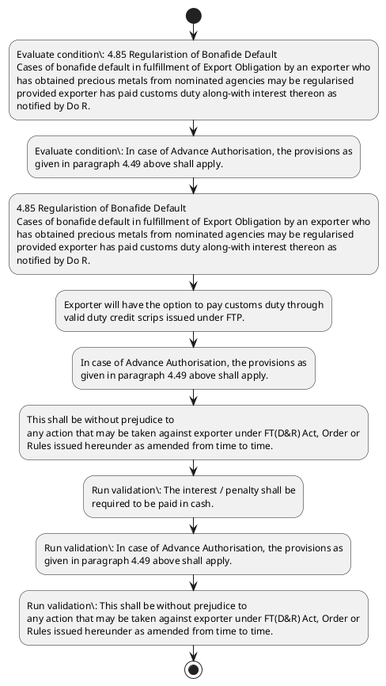

# Chapter 4 / Section 4.85: Regularistion of Bonafide Default

**Chapter Title:** Duty Exemption / Remission Schemes

**Pages:** 52

**Purpose:** Exporter will have the option to pay customs duty through
valid duty credit scrips issued under FTP.

**Purpose Thanglish:** Indha Regularistion of Bonafide Default section-la, Exporter will have the option to pay customs duty through
valid duty credit scrips issued under FTP.

**Summary:** 4.85 Regularistion of Bonafide Default
Cases of bonafide default in fulfillment of Export Obligation by an exporter who
has obtained precious metals from nominated agencies may be regularised
provided exporter has paid customs duty along-with interest thereon as
notified by Do R. Exporter will have the option to pay customs duty through
valid duty credit scrips issued under FTP. The interest / penalty shall be
required to be paid in cash.

**Business Meaning:** Regularistion of Bonafide Default governs how DGFT business controls should be applied, validated, and enforced.

**Business Explanation:** Regularistion of Bonafide Default explains the operating rule set that DEKAI should enforce. Key control points include The interest / penalty shall be
required to be paid in cash. The section also drives actions such as 4.85 Regularistion of Bonafide Default
Cases of bonafide default in fulfillment of Export Obligation by an exporter who
has obtained precious metals from nominated agencies may be regularised
provided exporter has paid customs duty along-with interest thereon as
notified by Do R..

**Business Explanation Thanglish:** Indha Regularistion of Bonafide Default section-la, Regularistion of Bonafide Default explains the operating rule set that DEKAI should enforce. Key control points include The interest / penalty kandippa be
required to be paid in cash. The section also drives actions such as 4.85 Regularistion of Bonafide Default
Cases of bonafide default in fulfillment of export Obligation by an exporter who
has obtained precious metals from nominated agencies may be regularised
provided exporter has paid customs duty along-with interest thereon as
notified by Do R..

## Business Logic
- The interest / penalty shall be
required to be paid in cash.
- In case of Advance Authorisation, the provisions as
given in paragraph 4.49 above shall apply.
- This shall be without prejudice to
any action that may be taken against exporter under FT(D&R) Act, Order or
Rules issued hereunder as amended from time to time.

## Business Rules
- rule_id=CH4-SEC4_85-R001, rule_description=The interest / penalty shall be
required to be paid in cash., trigger=Regularistion of Bonafide Default, condition=4.85 Regularistion of Bonafide Default
Cases of bonafide default in fulfillment of Export Obligation by an exporter who
has obtained precious metals from nominated agencies may be regularised
provided exporter has paid customs duty along-with interest thereon as
notified by Do R., validation=The interest / penalty shall be
required to be paid in cash., action=4.85 Regularistion of Bonafide Default
Cases of bonafide default in fulfillment of Export Obligation by an exporter who
has obtained precious metals from nominated agencies may be regularised
provided exporter has paid customs duty along-with interest thereon as
notified by Do R., exception=No explicit exception found in uploaded documents., output=DEKAI should produce a compliance decision for 4.85 - Regularistion of Bonafide Default.
- rule_id=CH4-SEC4_85-R002, rule_description=In case of Advance Authorisation, the provisions as
given in paragraph 4.49 above shall apply., trigger=Regularistion of Bonafide Default, condition=In case of Advance Authorisation, the provisions as
given in paragraph 4.49 above shall apply., validation=In case of Advance Authorisation, the provisions as
given in paragraph 4.49 above shall apply., action=Exporter will have the option to pay customs duty through
valid duty credit scrips issued under FTP., exception=No explicit exception found in uploaded documents., output=DEKAI should produce a compliance decision for 4.85 - Regularistion of Bonafide Default.
- rule_id=CH4-SEC4_85-R003, rule_description=This shall be without prejudice to
any action that may be taken against exporter under FT(D&R) Act, Order or
Rules issued hereunder as amended from time to time., trigger=Regularistion of Bonafide Default, condition=In case of Advance Authorisation, the provisions as
given in paragraph 4.49 above shall apply., validation=This shall be without prejudice to
any action that may be taken against exporter under FT(D&R) Act, Order or
Rules issued hereunder as amended from time to time., action=In case of Advance Authorisation, the provisions as
given in paragraph 4.49 above shall apply., exception=No explicit exception found in uploaded documents., output=DEKAI should produce a compliance decision for 4.85 - Regularistion of Bonafide Default.

## Conditions
- 4.85 Regularistion of Bonafide Default
Cases of bonafide default in fulfillment of Export Obligation by an exporter who
has obtained precious metals from nominated agencies may be regularised
provided exporter has paid customs duty along-with interest thereon as
notified by Do R.
- In case of Advance Authorisation, the provisions as
given in paragraph 4.49 above shall apply.

## Condition Logic
- id=4.4.85.1, if=4.85 Regularistion of Bonafide Default
Cases of bonafide default in fulfillment of Export Obligation by an exporter who
has obtained precious metals from nominated agencies may be regularised
provided exporter has paid customs duty along-with interest thereon as
notified by Do R., then=4.85 Regularistion of Bonafide Default
Cases of bonafide default in fulfillment of Export Obligation by an exporter who
has obtained precious metals from nominated agencies may be regularised
provided exporter has paid customs duty along-with interest thereon as
notified by Do R., source=4.85 Regularistion of Bonafide Default
Cases of bonafide default in fulfillment of Export Obligation by an exporter who
has obtained precious metals from nominated agencies may be regularised
provided exporter has paid customs duty along-with interest thereon as
notified by Do R.
- id=4.4.85.2, if=In case of Advance Authorisation, the provisions as
given in paragraph 4.49 above shall apply., then=4.85 Regularistion of Bonafide Default
Cases of bonafide default in fulfillment of Export Obligation by an exporter who
has obtained precious metals from nominated agencies may be regularised
provided exporter has paid customs duty along-with interest thereon as
notified by Do R., source=In case of Advance Authorisation, the provisions as
given in paragraph 4.49 above shall apply.

## Validations
- The interest / penalty shall be
required to be paid in cash.
- In case of Advance Authorisation, the provisions as
given in paragraph 4.49 above shall apply.
- This shall be without prejudice to
any action that may be taken against exporter under FT(D&R) Act, Order or
Rules issued hereunder as amended from time to time.

## Exceptions
- None identified

## Dependencies
- 4.49

## Authorities
- customs

## Required Documents
- None identified

## Timelines
- None identified

## Actions
- 4.85 Regularistion of Bonafide Default
Cases of bonafide default in fulfillment of Export Obligation by an exporter who
has obtained precious metals from nominated agencies may be regularised
provided exporter has paid customs duty along-with interest thereon as
notified by Do R.
- Exporter will have the option to pay customs duty through
valid duty credit scrips issued under FTP.
- In case of Advance Authorisation, the provisions as
given in paragraph 4.49 above shall apply.
- This shall be without prejudice to
any action that may be taken against exporter under FT(D&R) Act, Order or
Rules issued hereunder as amended from time to time.

## Workflow
- Evaluate condition: 4.85 Regularistion of Bonafide Default
Cases of bonafide default in fulfillment of Export Obligation by an exporter who
has obtained precious metals from nominated agencies may be regularised
provided exporter has paid customs duty along-with interest thereon as
notified by Do R.
- Evaluate condition: In case of Advance Authorisation, the provisions as
given in paragraph 4.49 above shall apply.
- 4.85 Regularistion of Bonafide Default
Cases of bonafide default in fulfillment of Export Obligation by an exporter who
has obtained precious metals from nominated agencies may be regularised
provided exporter has paid customs duty along-with interest thereon as
notified by Do R.
- Exporter will have the option to pay customs duty through
valid duty credit scrips issued under FTP.
- In case of Advance Authorisation, the provisions as
given in paragraph 4.49 above shall apply.
- This shall be without prejudice to
any action that may be taken against exporter under FT(D&R) Act, Order or
Rules issued hereunder as amended from time to time.
- Run validation: The interest / penalty shall be
required to be paid in cash.
- Run validation: In case of Advance Authorisation, the provisions as
given in paragraph 4.49 above shall apply.
- Run validation: This shall be without prejudice to
any action that may be taken against exporter under FT(D&R) Act, Order or
Rules issued hereunder as amended from time to time.

## Workflow ASCII
```text
Regularistion of Bonafide Default
Evaluate condition: 4.85 Regularistion of Bonafide Default
Cases of bonafide default in fulfillment of Export Obligation by an exporter who
has obtained precious metals from nominated agencies may be regularised
provided exporter has paid customs duty along-with interest thereon as
notified by Do R.
   |
   v
Evaluate condition: In case of Advance Authorisation, the provisions as
given in paragraph 4.49 above shall apply.
   |
   v
4.85 Regularistion of Bonafide Default
Cases of bonafide default in fulfillment of Export Obligation by an exporter who
has obtained precious metals from nominated agencies may be regularised
provided exporter has paid customs duty along-with interest thereon as
notified by Do R.
   |
   v
Exporter will have the option to pay customs duty through
valid duty credit scrips issued under FTP.
   |
   v
In case of Advance Authorisation, the provisions as
given in paragraph 4.49 above shall apply.
   |
   v
This shall be without prejudice to
any action that may be taken against exporter under FT(D&R) Act, Order or
Rules issued hereunder as amended from time to time.
   |
   v
Run validation: The interest / penalty shall be
required to be paid in cash.
   |
   v
Run validation: In case of Advance Authorisation, the provisions as
given in paragraph 4.49 above shall apply.
   |
   v
Run validation: This shall be without prejudice to
any action that may be taken against exporter under FT(D&R) Act, Order or
Rules issued hereunder as amended from time to time.
```

## Decision Tree
- IF 4.85 Regularistion of Bonafide Default
Cases of bonafide default in fulfillment of Export Obligation by an exporter who
has obtained precious metals from nominated agencies may be regularised
provided exporter has paid customs duty along-with interest thereon as
notified by Do R. THEN 4.85 Regularistion of Bonafide Default
Cases of bonafide default in fulfillment of Export Obligation by an exporter who
has obtained precious metals from nominated agencies may be regularised
provided exporter has paid customs duty along-with interest thereon as
notified by Do R.
- IF In case of Advance Authorisation, the provisions as
given in paragraph 4.49 above shall apply. THEN 4.85 Regularistion of Bonafide Default
Cases of bonafide default in fulfillment of Export Obligation by an exporter who
has obtained precious metals from nominated agencies may be regularised
provided exporter has paid customs duty along-with interest thereon as
notified by Do R.

## Decision Tree ASCII
```text
Regularistion of Bonafide Default Decision
IF 4.85 Regularistion of Bonafide Default
Cases of bonafide default in fulfillment of Export Obligation by an exporter who
has obtained precious metals from nominated agencies may be regularised
provided exporter has paid customs duty along-with interest thereon as
notified by Do R. THEN 4.85 Regularistion of Bonafide Default
Cases of bonafide default in fulfillment of Export Obligation by an exporter who
has obtained precious metals from nominated agencies may be regularised
provided exporter has paid customs duty along-with interest thereon as
notified by Do R.
   |
   v
IF In case of Advance Authorisation, the provisions as
given in paragraph 4.49 above shall apply. THEN 4.85 Regularistion of Bonafide Default
Cases of bonafide default in fulfillment of Export Obligation by an exporter who
has obtained precious metals from nominated agencies may be regularised
provided exporter has paid customs duty along-with interest thereon as
notified by Do R.
```

## Examples
- User asks to process Regularistion of Bonafide Default; the platform checks conditions, validations, and documents before action.

**Real-world Example:** Example: an importer or exporter invokes Regularistion of Bonafide Default, submits the prescribed DGFT records, and DEKAI uses the extracted rules to 4.85 regularistion of bonafide default
cases of bonafide default in fulfillment of export obligation by an exporter who
has obtained precious metals from nominated agencies may be regularised
provided exporter has paid customs duty along-with interest thereon as
notified by do r..

**Real-world Example Thanglish:** Indha Regularistion of Bonafide Default section-la, Example: an importer or exporter invokes Regularistion of Bonafide Default, submits the prescribed DGFT records, and DEKAI uses the extracted rules to 4.85 regularistion of bonafide default
cases of bonafide default in fulfillment of export obligation by an exporter who
has obtained precious metals from nominated agencies may be regularised
provided exporter has paid customs duty along-with interest thereon as
notified by do r..

## AI Rules
- IF detected context matches section rule THEN enforce: The interest / penalty shall be
required to be paid in cash.
- IF detected context matches section rule THEN enforce: In case of Advance Authorisation, the provisions as
given in paragraph 4.49 above shall apply.
- IF detected context matches section rule THEN enforce: This shall be without prejudice to
any action that may be taken against exporter under FT(D&R) Act, Order or
Rules issued hereunder as amended from time to time.
- IF validations pass THEN recommend action: 4.85 Regularistion of Bonafide Default
Cases of bonafide default in fulfillment of Export Obligation by an exporter who
has obtained precious metals from nominated agencies may be regularised
provided exporter has paid customs duty along-with interest thereon as
notified by Do R.

## Database Fields
- name=section_code, type=string, required=True, source=parsed_section_heading
- name=section_title, type=string, required=True, source=parsed_section_heading
- name=who_flag, type=boolean, required=False, source=keyword:who
- name=has_flag, type=boolean, required=False, source=keyword:has
- name=may_flag, type=boolean, required=False, source=keyword:may
- name=the_flag, type=boolean, required=False, source=keyword:the
- name=pay_flag, type=boolean, required=False, source=keyword:pay
- name=ftp_flag, type=boolean, required=False, source=keyword:FTP
- name=any_flag, type=boolean, required=False, source=keyword:any
- name=d&r_flag, type=boolean, required=False, source=keyword:D&R

## API Requirements
- method=GET, path=/api/dgft/sections/4.85, purpose=Retrieve knowledge payload for section 4.85, query_params=['include=workflow,decision_tree,validations'], response_fields=['section', 'title', 'summary', 'conditions', 'validations', 'exceptions', 'workflow', 'decision_tree']
- method=POST, path=/api/dgft/Regularistion-of-Bonafide-Default/validate, purpose=Validate inputs and documents for Regularistion of Bonafide Default, request_fields=['section_code', 'section_title'], response_fields=['status', 'errors', 'warnings', 'next_actions']
- method=POST, path=/api/dgft/Regularistion-of-Bonafide-Default/execute, purpose=Trigger business action for 4.85 Regularistion of Bonafide Default
Cases of bonafide default in fulfillment of Export Obligation by an exporter who
has obtained precious metals from nominated agencies may be regularised
provided exporter has paid customs duty along-with interest thereon as
notified by Do R., request_fields=['section_code', 'section_title'], response_fields=['reference_id', 'status', 'authority', 'timeline']

## UI Screens
- screen_id=Regularistion_of_Bonafide_Default_overview, name=Regularistion of Bonafide Default Overview, purpose=Show section summary, authority, timeline, and eligibility cues., widgets=['summary_card', 'conditions_table', 'authority_badges', 'timeline_panel']
- screen_id=Regularistion_of_Bonafide_Default_submission, name=Regularistion of Bonafide Default Submission, purpose=Capture applicant data and supporting documents., widgets=['dynamic_form', 'document_uploader', 'validation_panel', 'next_action_footer'], fields=['section_code', 'section_title', 'who_flag', 'has_flag', 'may_flag', 'the_flag', 'pay_flag', 'ftp_flag']

## Error Messages
- Validation failed because the section requirements were not fully met.

## FAQ
- question_en=What is the purpose of section 4.85?, answer_en=Regularistion of Bonafide Default explains the operating rule set that DEKAI should enforce. Key control points include The interest / penalty shall be
required to be paid in cash. The section also drives actions such as 4.85 Regularistion of Bonafide Default
Cases of bonafide default in fulfillment of Export Obligation by an exporter who
has obtained precious metals from nominated agencies may be regularised
provided exporter has paid customs duty along-with interest thereon as
notified by Do R.., question_thanglish=Indha Regularistion of Bonafide Default section-la, What is the purpose of section 4.85?, answer_thanglish=Indha Regularistion of Bonafide Default section-la, Regularistion of Bonafide Default explains the operating rule set that DEKAI should enforce. Key control points include The interest / penalty kandippa be
required to be paid in cash. The section also drives actions such as 4.85 Regularistion of Bonafide Default
Cases of bonafide default in fulfillment of export Obligation by an exporter who
has obtained precious metals from nominated agencies may be regularised
provided exporter has paid customs duty along-with interest thereon as
notified by Do R..
- question_en=What documents are required under Regularistion of Bonafide Default?, answer_en=Not explicitly covered in uploaded documents., question_thanglish=Indha Regularistion of Bonafide Default section-la, What documents are required under Regularistion of Bonafide Default?, answer_thanglish=Indha Regularistion of Bonafide Default section-la, Not explicitly covered in uploaded documents.
- question_en=Which authority handles Regularistion of Bonafide Default?, answer_en=customs, question_thanglish=Indha Regularistion of Bonafide Default section-la, Which authority handles Regularistion of Bonafide Default?, answer_thanglish=Indha Regularistion of Bonafide Default section-la, customs

## Questions Users May Ask
- What does Regularistion of Bonafide Default require?
- Which documents are needed for Regularistion of Bonafide Default?
- How does DEKAI validate Regularistion of Bonafide Default requests?
- What action should be taken for Regularistion of Bonafide Default?

## Expected AI Answers
- Regularistion of Bonafide Default requires the platform to interpret the section text, apply the extracted business rules, and present the correct next action.
- Required documents are inferred from the section text: no explicit documents were detected.
- DEKAI validates Regularistion of Bonafide Default by checking conditions, required documents, authority references, and exception clauses before recommending an outcome.
- The primary extracted action is: 4.85 Regularistion of Bonafide Default
Cases of bonafide default in fulfillment of Export Obligation by an exporter who
has obtained precious metals from nominated agencies may be regularised
provided exporter has paid customs duty along-with interest thereon as
notified by Do R.

## AI Q&A Examples
- question_en=User asks: How do I comply with Regularistion of Bonafide Default?, answer_en=AI answers: DEKAI should evaluate section 4.85, apply the extracted rules, and guide the user through Evaluate condition: 4.85 Regularistion of Bonafide Default
Cases of bonafide default in fulfillment of Export Obligation by an exporter who
has obtained precious metals from nominated agencies may be regularised
provided exporter has paid customs duty along-with interest thereon as
notified by Do R.., question_thanglish=Indha Regularistion of Bonafide Default section-la, User asks: How do I comply with Regularistion of Bonafide Default?, answer_thanglish=Indha Regularistion of Bonafide Default section-la, AI answers: DEKAI should evaluate section 4.85, apply the extracted rules, and guide the user through Evaluate condition: 4.85 Regularistion of Bonafide Default
Cases of bonafide default in fulfillment of export Obligation by an exporter who
has obtained precious metals from nominated agencies may be regularised
provided exporter has paid customs duty along-with interest thereon as
notified by Do R..
- question_en=User asks: Which validations apply to Regularistion of Bonafide Default?, answer_en=AI answers: Applicable validations are The interest / penalty shall be
required to be paid in cash., In case of Advance Authorisation, the provisions as
given in paragraph 4.49 above shall apply., This shall be without prejudice to
any action that may be taken against exporter under FT(D&R) Act, Order or
Rules issued hereunder as amended from time to time., question_thanglish=Indha Regularistion of Bonafide Default section-la, User asks: Which validations apply to Regularistion of Bonafide Default?, answer_thanglish=Indha Regularistion of Bonafide Default section-la, AI answers: Applicable validations are The interest / penalty kandippa be
required to be paid in cash., In case of Advance Authorisation, the provisions as
given in paragraph 4.49 above kandippa apply., This kandippa be without prejudice to
any action that may be taken against exporter under FT(D&R) Act, Order or
Rules issued hereunder as amended from time to time.

## DEKAI AI Implementation Notes
- Capture chapter 4, section 4.85, title, and page references as immutable knowledge metadata.
- Bind validations for Regularistion of Bonafide Default into a rule engine keyed by the rule IDs extracted for this section.
- Route escalations or approvals to: customs.
- Show contextual links to related sections: 4.49.

## DEKAI AI Implementation Notes Thanglish
- Indha Regularistion of Bonafide Default section-la, Capture chapter 4, section 4.85, title, and page references as immutable knowledge metadata.
- Indha Regularistion of Bonafide Default section-la, Bind validations for Regularistion of Bonafide Default into a rule engine keyed by the rule IDs extracted for this section.
- Indha Regularistion of Bonafide Default section-la, Route escalations or approvals to: customs.
- Indha Regularistion of Bonafide Default section-la, Show contextual links to related sections: 4.49.

## AI Metadata
- Keywords: who, has, may, the, pay, FTP, any, D&R, Act, from, paid, duty, will, have, cash, case, This, that, time, Cases
- Search Keywords: who, has, may, the, pay, FTP, any, D&R, Act, from, paid, duty, will, have, cash, case, This, that, time, Cases
- Intent: Support Regularistion of Bonafide Default processing and compliance validation.
- Tags: 4.85, Regularistion of Bonafide Default, business-rule, dgft
- Related Sections: 4.49
- Related Chapters: 
- Related Rules: The interest / penalty shall be
required to be paid in cash., In case of Advance Authorisation, the provisions as
given in paragraph 4.49 above shall apply., This shall be without prejudice to
any action that may be taken against exporter under FT(D&R) Act, Order or
Rules issued hereunder as amended from time to time.

## Mermaid

```mermaid
flowchart TD
    S1["Evaluate condition: 4.85 Regularistion of Bonafide Default
Cases of bonafide default in fulfillment of Export Obligation by an exporter who
has obtained precious metals from nominated agencies may be regularised
provided exporter has paid customs duty along-with interest thereon as
notified by Do R."]
    S2["Evaluate condition: In case of Advance Authorisation, the provisions as
given in paragraph 4.49 above shall apply."]
    S1 --> S2
    S3["4.85 Regularistion of Bonafide Default
Cases of bonafide default in fulfillment of Export Obligation by an exporter who
has obtained precious metals from nominated agencies may be regularised
provided exporter has paid customs duty along-with interest thereon as
notified by Do R."]
    S2 --> S3
    S4["Exporter will have the option to pay customs duty through
valid duty credit scrips issued under FTP."]
    S3 --> S4
    S5["In case of Advance Authorisation, the provisions as
given in paragraph 4.49 above shall apply."]
    S4 --> S5
    S6["This shall be without prejudice to
any action that may be taken against exporter under FT(D&R) Act, Order or
Rules issued hereunder as amended from time to time."]
    S5 --> S6
    S7["Run validation: The interest / penalty shall be
required to be paid in cash."]
    S6 --> S7
    S8["Run validation: In case of Advance Authorisation, the provisions as
given in paragraph 4.49 above shall apply."]
    S7 --> S8
    S9["Run validation: This shall be without prejudice to
any action that may be taken against exporter under FT(D&R) Act, Order or
Rules issued hereunder as amended from time to time."]
    S8 --> S9
```


## PlantUML

