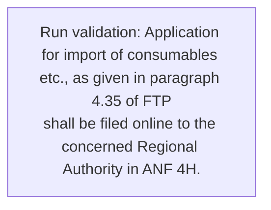
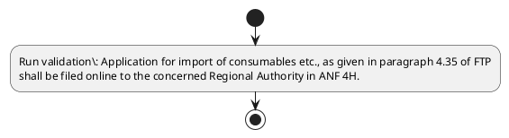

# Chapter 4 / Section 4.86: Replenishment Authorisation for Import of Consumables etc.

**Chapter Title:** Duty Exemption / Remission Schemes

**Pages:** 52

**Purpose:** 4.86 Replenishment Authorisation for Import of Consumables etc.

**Purpose Thanglish:** Indha Replenishment Authorisation for Import of Consumables etc. section-la, 4.86 Replenishment Authorisation for import of Consumables etc.

**Summary:** 4.86 Replenishment Authorisation for Import of Consumables etc. Application for import of consumables etc., as given in paragraph 4.35 of FTP
shall be filed online to the concerned Regional Authority in ANF 4H.

**Business Meaning:** Replenishment Authorisation for Import of Consumables etc. governs how DGFT business controls should be applied, validated, and enforced.

**Business Explanation:** Replenishment Authorisation for Import of Consumables etc. explains the operating rule set that DEKAI should enforce. Key control points include Application for import of consumables etc., as given in paragraph 4.35 of FTP
shall be filed online to the concerned Regional Authority in ANF 4H.

**Business Explanation Thanglish:** Indha Replenishment Authorisation for Import of Consumables etc. section-la, Replenishment Authorisation for import of Consumables etc. explains the operating rule set that DEKAI should enforce. Key control points include application for import of consumables etc., as given in paragraph 4.35 of FTP
kandippa be filed online to the concerned Regional authority in ANF 4H.

## Business Logic
- Application for import of consumables etc., as given in paragraph 4.35 of FTP
shall be filed online to the concerned Regional Authority in ANF 4H.

## Business Rules
- rule_id=CH4-SEC4_86-R001, rule_description=Application for import of consumables etc., as given in paragraph 4.35 of FTP
shall be filed online to the concerned Regional Authority in ANF 4H., trigger=Replenishment Authorisation for Import of Consumables etc., condition=Not explicitly covered in uploaded documents., validation=Application for import of consumables etc., as given in paragraph 4.35 of FTP
shall be filed online to the concerned Regional Authority in ANF 4H., action=Manual review required., exception=No explicit exception found in uploaded documents., output=DEKAI should produce a compliance decision for 4.86 - Replenishment Authorisation for Import of Consumables etc..

## Conditions
- None identified

## Condition Logic
- None identified

## Validations
- Application for import of consumables etc., as given in paragraph 4.35 of FTP
shall be filed online to the concerned Regional Authority in ANF 4H.

## Exceptions
- None identified

## Dependencies
- 4.35

## Authorities
- Regional Authority

## Required Documents
- Application for import of consumables etc., as given in paragraph 4.35 of FTP
shall be filed online to the concerned Regional Authority in ANF 4H.

## Timelines
- None identified

## Actions
- None identified

## Workflow
- Run validation: Application for import of consumables etc., as given in paragraph 4.35 of FTP
shall be filed online to the concerned Regional Authority in ANF 4H.

## Workflow ASCII
```text
Replenishment Authorisation for Import of Consumables etc.
Run validation: Application for import of consumables etc., as given in paragraph 4.35 of FTP
shall be filed online to the concerned Regional Authority in ANF 4H.
```

## Decision Tree
- IF section 4.86 applies THEN proceed with standard DGFT workflow

## Decision Tree ASCII
```text
Replenishment Authorisation for Import of Consumables etc. Decision
IF section 4.86 applies THEN proceed with standard DGFT workflow
```

## Examples
- User asks to process Replenishment Authorisation for Import of Consumables etc.; the platform checks conditions, validations, and documents before action.

**Real-world Example:** Example: an importer or exporter invokes Replenishment Authorisation for Import of Consumables etc., submits Application for import of consumables etc., as given in paragraph 4.35 of FTP
shall be filed online to the concerned Regional Authority in ANF 4H., and DEKAI uses the extracted rules to follow the replenishment authorisation for import of consumables etc. process.

**Real-world Example Thanglish:** Indha Replenishment Authorisation for Import of Consumables etc. section-la, Example: an importer or exporter invokes Replenishment Authorisation for import of Consumables etc., submits application for import of consumables etc., as given in paragraph 4.35 of FTP
kandippa be filed online to the concerned Regional authority in ANF 4H., and DEKAI uses the extracted rules to follow the replenishment authorisation for import of consumables etc. process.

## AI Rules
- IF detected context matches section rule THEN enforce: Application for import of consumables etc., as given in paragraph 4.35 of FTP
shall be filed online to the concerned Regional Authority in ANF 4H.

## Database Fields
- name=section_code, type=string, required=True, source=parsed_section_heading
- name=section_title, type=string, required=True, source=parsed_section_heading
- name=for_flag, type=boolean, required=False, source=keyword:for
- name=etc_flag, type=boolean, required=False, source=keyword:etc
- name=ftp_flag, type=boolean, required=False, source=keyword:FTP
- name=the_flag, type=boolean, required=False, source=keyword:the
- name=anf_flag, type=boolean, required=False, source=keyword:ANF
- name=given_flag, type=boolean, required=False, source=keyword:given
- name=shall_flag, type=boolean, required=False, source=keyword:shall
- name=filed_flag, type=boolean, required=False, source=keyword:filed
- name=document_1_submitted, type=boolean, required=True, source=Application for import of consumables etc., as given in paragraph 4.35 of FTP
shall be filed online to the concerned Regional Authority in ANF 4H.

## API Requirements
- method=GET, path=/api/dgft/sections/4.86, purpose=Retrieve knowledge payload for section 4.86, query_params=['include=workflow,decision_tree,validations'], response_fields=['section', 'title', 'summary', 'conditions', 'validations', 'exceptions', 'workflow', 'decision_tree']
- method=POST, path=/api/dgft/Replenishment-Authorisation-for-Import-of-Consumables-etc/validate, purpose=Validate inputs and documents for Replenishment Authorisation for Import of Consumables etc., request_fields=['section_code', 'section_title', 'document_1_submitted'], response_fields=['status', 'errors', 'warnings', 'next_actions']

## UI Screens
- screen_id=Replenishment_Authorisation_for_Import_of_Consumables_etc_overview, name=Replenishment Authorisation for Import of Consumables etc. Overview, purpose=Show section summary, authority, timeline, and eligibility cues., widgets=['summary_card', 'conditions_table', 'authority_badges', 'timeline_panel']
- screen_id=Replenishment_Authorisation_for_Import_of_Consumables_etc_submission, name=Replenishment Authorisation for Import of Consumables etc. Submission, purpose=Capture applicant data and supporting documents., widgets=['dynamic_form', 'document_uploader', 'validation_panel', 'next_action_footer'], fields=['section_code', 'section_title', 'for_flag', 'etc_flag', 'ftp_flag', 'the_flag', 'anf_flag', 'given_flag']

## Error Messages
- Validation failed because the section requirements were not fully met.

## FAQ
- question_en=What is the purpose of section 4.86?, answer_en=Replenishment Authorisation for Import of Consumables etc. explains the operating rule set that DEKAI should enforce. Key control points include Application for import of consumables etc., as given in paragraph 4.35 of FTP
shall be filed online to the concerned Regional Authority in ANF 4H., question_thanglish=Indha Replenishment Authorisation for Import of Consumables etc. section-la, What is the purpose of section 4.86?, answer_thanglish=Indha Replenishment Authorisation for Import of Consumables etc. section-la, Replenishment Authorisation for import of Consumables etc. explains the operating rule set that DEKAI should enforce. Key control points include application for import of consumables etc., as given in paragraph 4.35 of FTP
kandippa be filed online to the concerned Regional authority in ANF 4H.
- question_en=What documents are required under Replenishment Authorisation for Import of Consumables etc.?, answer_en=Application for import of consumables etc., as given in paragraph 4.35 of FTP
shall be filed online to the concerned Regional Authority in ANF 4H., question_thanglish=Indha Replenishment Authorisation for Import of Consumables etc. section-la, What documents are required under Replenishment Authorisation for import of Consumables etc.?, answer_thanglish=Indha Replenishment Authorisation for Import of Consumables etc. section-la, application for import of consumables etc., as given in paragraph 4.35 of FTP
kandippa be filed online to the concerned Regional authority in ANF 4H.
- question_en=Which authority handles Replenishment Authorisation for Import of Consumables etc.?, answer_en=Regional Authority, question_thanglish=Indha Replenishment Authorisation for Import of Consumables etc. section-la, Which authority handles Replenishment Authorisation for import of Consumables etc.?, answer_thanglish=Indha Replenishment Authorisation for Import of Consumables etc. section-la, Regional authority

## Questions Users May Ask
- What does Replenishment Authorisation for Import of Consumables etc. require?
- Which documents are needed for Replenishment Authorisation for Import of Consumables etc.?
- How does DEKAI validate Replenishment Authorisation for Import of Consumables etc. requests?

## Expected AI Answers
- Replenishment Authorisation for Import of Consumables etc. requires the platform to interpret the section text, apply the extracted business rules, and present the correct next action.
- Required documents are inferred from the section text: Application for import of consumables etc., as given in paragraph 4.35 of FTP
shall be filed online to the concerned Regional Authority in ANF 4H.
- DEKAI validates Replenishment Authorisation for Import of Consumables etc. by checking conditions, required documents, authority references, and exception clauses before recommending an outcome.

## AI Q&A Examples
- question_en=User asks: How do I comply with Replenishment Authorisation for Import of Consumables etc.?, answer_en=AI answers: DEKAI should evaluate section 4.86, apply the extracted rules, and guide the user through Run validation: Application for import of consumables etc., as given in paragraph 4.35 of FTP
shall be filed online to the concerned Regional Authority in ANF 4H.., question_thanglish=Indha Replenishment Authorisation for Import of Consumables etc. section-la, User asks: How do I comply with Replenishment Authorisation for import of Consumables etc.?, answer_thanglish=Indha Replenishment Authorisation for Import of Consumables etc. section-la, AI answers: DEKAI should evaluate section 4.86, apply the extracted rules, and guide the user through Run validation: application for import of consumables etc., as given in paragraph 4.35 of FTP
kandippa be filed online to the concerned Regional authority in ANF 4H..
- question_en=User asks: Which validations apply to Replenishment Authorisation for Import of Consumables etc.?, answer_en=AI answers: Applicable validations are Application for import of consumables etc., as given in paragraph 4.35 of FTP
shall be filed online to the concerned Regional Authority in ANF 4H., question_thanglish=Indha Replenishment Authorisation for Import of Consumables etc. section-la, User asks: Which validations apply to Replenishment Authorisation for import of Consumables etc.?, answer_thanglish=Indha Replenishment Authorisation for Import of Consumables etc. section-la, AI answers: Applicable validations are application for import of consumables etc., as given in paragraph 4.35 of FTP
kandippa be filed online to the concerned Regional authority in ANF 4H.

## DEKAI AI Implementation Notes
- Capture chapter 4, section 4.86, title, and page references as immutable knowledge metadata.
- Bind validations for Replenishment Authorisation for Import of Consumables etc. into a rule engine keyed by the rule IDs extracted for this section.
- Expose document upload controls for: Application for import of consumables etc., as given in paragraph 4.35 of FTP
shall be filed online to the concerned Regional Authority in ANF 4H..
- Route escalations or approvals to: Regional Authority.
- Show contextual links to related sections: 4.35.

## DEKAI AI Implementation Notes Thanglish
- Indha Replenishment Authorisation for Import of Consumables etc. section-la, Capture chapter 4, section 4.86, title, and page references as immutable knowledge metadata.
- Indha Replenishment Authorisation for Import of Consumables etc. section-la, Bind validations for Replenishment Authorisation for import of Consumables etc. into a rule engine keyed by the rule IDs extracted for this section.
- Indha Replenishment Authorisation for Import of Consumables etc. section-la, Expose document upload controls for: application for import of consumables etc., as given in paragraph 4.35 of FTP
kandippa be filed online to the concerned Regional authority in ANF 4H..
- Indha Replenishment Authorisation for Import of Consumables etc. section-la, Route escalations or approvals to: Regional authority.
- Indha Replenishment Authorisation for Import of Consumables etc. section-la, Show contextual links to related sections: 4.35.

## AI Metadata
- Keywords: for, etc, FTP, the, ANF, given, shall, filed, Import, online, Regional, paragraph, concerned, Authority, Consumables, Application, Replenishment, Authorisation
- Search Keywords: for, etc, FTP, the, ANF, given, shall, filed, Import, online, Regional, paragraph, concerned, Authority, Consumables, Application, Replenishment, Authorisation
- Intent: Provide knowledge guidance for Replenishment Authorisation for Import of Consumables etc..
- Tags: 4.86, Replenishment Authorisation for Import of Consumables etc., business-rule, document-driven, dgft
- Related Sections: 4.35
- Related Chapters: 
- Related Rules: Application for import of consumables etc., as given in paragraph 4.35 of FTP
shall be filed online to the concerned Regional Authority in ANF 4H.

## Mermaid


## PlantUML

