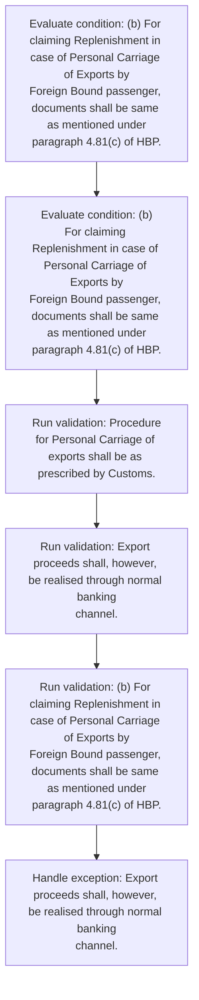
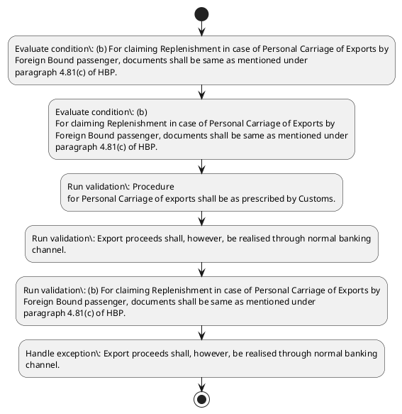

# Chapter 4 / Section 4.87: Personal Carriage of Gems & Jewellery Export Parcels

**Chapter Title:** Duty Exemption / Remission Schemes

**Pages:** 52

**Purpose:** Procedure
for Personal Carriage of exports shall be as prescribed by Customs.

**Purpose Thanglish:** Indha Personal Carriage of Gems & Jewellery Export Parcels section-la, Procedure
for Personal Carriage of exports kandippa be as prescribed by Customs.

**Summary:** 4.87 Personal Carriage of Gems & Jewellery Export Parcels
(a) Personal Carriage of gems & jewellery parcels by Foreign Bound
Passengers from all EOU/SEZ units and all firms in DTA through
Airports in Delhi, Mumbai, Kolkata, Chennai, Kochi, Coimbatore,
Bangalore, Hyderabad, Jaipur and Ahmedabad is permitted. Procedure
for Personal Carriage of exports shall be as prescribed by Customs. Export proceeds shall, however, be realised through normal banking
channel.

**Business Meaning:** Personal Carriage of Gems & Jewellery Export Parcels governs how DGFT business controls should be applied, validated, and enforced.

**Business Explanation:** Personal Carriage of Gems & Jewellery Export Parcels explains the operating rule set that DEKAI should enforce. Key control points include Procedure
for Personal Carriage of exports shall be as prescribed by Customs.

**Business Explanation Thanglish:** Indha Personal Carriage of Gems & Jewellery Export Parcels section-la, Personal Carriage of Gems & Jewellery export Parcels explains the operating rule set that DEKAI should enforce. Key control points include Procedure
for Personal Carriage of exports kandippa be as prescribed by Customs.

## Business Logic
- Procedure
for Personal Carriage of exports shall be as prescribed by Customs.
- Export proceeds shall, however, be realised through normal banking
channel.
- (b) For claiming Replenishment in case of Personal Carriage of Exports by
Foreign Bound passenger, documents shall be same as mentioned under
paragraph 4.81(c) of HBP.
- (b)
For claiming Replenishment in case of Personal Carriage of Exports by
Foreign Bound passenger, documents shall be same as mentioned under
paragraph 4.81(c) of HBP.

## Business Rules
- rule_id=CH4-SEC4_87-R001, rule_description=Procedure
for Personal Carriage of exports shall be as prescribed by Customs., trigger=Personal Carriage of Gems & Jewellery Export Parcels, condition=(b) For claiming Replenishment in case of Personal Carriage of Exports by
Foreign Bound passenger, documents shall be same as mentioned under
paragraph 4.81(c) of HBP., validation=Procedure
for Personal Carriage of exports shall be as prescribed by Customs., action=Manual review required., exception=Export proceeds shall, however, be realised through normal banking
channel., output=DEKAI should produce a compliance decision for 4.87 - Personal Carriage of Gems & Jewellery Export Parcels.
- rule_id=CH4-SEC4_87-R002, rule_description=Export proceeds shall, however, be realised through normal banking
channel., trigger=Personal Carriage of Gems & Jewellery Export Parcels, condition=(b)
For claiming Replenishment in case of Personal Carriage of Exports by
Foreign Bound passenger, documents shall be same as mentioned under
paragraph 4.81(c) of HBP., validation=Export proceeds shall, however, be realised through normal banking
channel., action=Manual review required., exception=Export proceeds shall, however, be realised through normal banking
channel., output=DEKAI should produce a compliance decision for 4.87 - Personal Carriage of Gems & Jewellery Export Parcels.
- rule_id=CH4-SEC4_87-R003, rule_description=(b) For claiming Replenishment in case of Personal Carriage of Exports by
Foreign Bound passenger, documents shall be same as mentioned under
paragraph 4.81(c) of HBP., trigger=Personal Carriage of Gems & Jewellery Export Parcels, condition=(b)
For claiming Replenishment in case of Personal Carriage of Exports by
Foreign Bound passenger, documents shall be same as mentioned under
paragraph 4.81(c) of HBP., validation=(b) For claiming Replenishment in case of Personal Carriage of Exports by
Foreign Bound passenger, documents shall be same as mentioned under
paragraph 4.81(c) of HBP., action=Manual review required., exception=Export proceeds shall, however, be realised through normal banking
channel., output=DEKAI should produce a compliance decision for 4.87 - Personal Carriage of Gems & Jewellery Export Parcels.
- rule_id=CH4-SEC4_87-R004, rule_description=(b)
For claiming Replenishment in case of Personal Carriage of Exports by
Foreign Bound passenger, documents shall be same as mentioned under
paragraph 4.81(c) of HBP., trigger=Personal Carriage of Gems & Jewellery Export Parcels, condition=(b)
For claiming Replenishment in case of Personal Carriage of Exports by
Foreign Bound passenger, documents shall be same as mentioned under
paragraph 4.81(c) of HBP., validation=(b)
For claiming Replenishment in case of Personal Carriage of Exports by
Foreign Bound passenger, documents shall be same as mentioned under
paragraph 4.81(c) of HBP., action=Manual review required., exception=Export proceeds shall, however, be realised through normal banking
channel., output=DEKAI should produce a compliance decision for 4.87 - Personal Carriage of Gems & Jewellery Export Parcels.

## Conditions
- (b) For claiming Replenishment in case of Personal Carriage of Exports by
Foreign Bound passenger, documents shall be same as mentioned under
paragraph 4.81(c) of HBP.
- (b)
For claiming Replenishment in case of Personal Carriage of Exports by
Foreign Bound passenger, documents shall be same as mentioned under
paragraph 4.81(c) of HBP.

## Condition Logic
- id=4.4.87.1, if=(b) For claiming Replenishment in case of Personal Carriage of Exports by
Foreign Bound passenger, documents shall be same as mentioned under
paragraph 4.81(c) of HBP., then=Route for review, source=(b) For claiming Replenishment in case of Personal Carriage of Exports by
Foreign Bound passenger, documents shall be same as mentioned under
paragraph 4.81(c) of HBP.
- id=4.4.87.2, if=(b)
For claiming Replenishment in case of Personal Carriage of Exports by
Foreign Bound passenger, documents shall be same as mentioned under
paragraph 4.81(c) of HBP., then=Route for review, source=(b)
For claiming Replenishment in case of Personal Carriage of Exports by
Foreign Bound passenger, documents shall be same as mentioned under
paragraph 4.81(c) of HBP.

## Validations
- Procedure
for Personal Carriage of exports shall be as prescribed by Customs.
- Export proceeds shall, however, be realised through normal banking
channel.
- (b) For claiming Replenishment in case of Personal Carriage of Exports by
Foreign Bound passenger, documents shall be same as mentioned under
paragraph 4.81(c) of HBP.
- (b)
For claiming Replenishment in case of Personal Carriage of Exports by
Foreign Bound passenger, documents shall be same as mentioned under
paragraph 4.81(c) of HBP.

## Exceptions
- Export proceeds shall, however, be realised through normal banking
channel.

## Dependencies
- 4.81
- 1
- 4

## Authorities
- Customs
- Personal Carriage of exports shall be as prescribed by Customs

## Required Documents
- (b) For claiming Replenishment in case of Personal Carriage of Exports by
Foreign Bound passenger, documents shall be same as mentioned under
paragraph 4.81(c) of HBP.
- (b)
For claiming Replenishment in case of Personal Carriage of Exports by
Foreign Bound passenger, documents shall be same as mentioned under
paragraph 4.81(c) of HBP.

## Timelines
- None identified

## Actions
- None identified

## Workflow
- Evaluate condition: (b) For claiming Replenishment in case of Personal Carriage of Exports by
Foreign Bound passenger, documents shall be same as mentioned under
paragraph 4.81(c) of HBP.
- Evaluate condition: (b)
For claiming Replenishment in case of Personal Carriage of Exports by
Foreign Bound passenger, documents shall be same as mentioned under
paragraph 4.81(c) of HBP.
- Run validation: Procedure
for Personal Carriage of exports shall be as prescribed by Customs.
- Run validation: Export proceeds shall, however, be realised through normal banking
channel.
- Run validation: (b) For claiming Replenishment in case of Personal Carriage of Exports by
Foreign Bound passenger, documents shall be same as mentioned under
paragraph 4.81(c) of HBP.
- Handle exception: Export proceeds shall, however, be realised through normal banking
channel.

## Workflow ASCII
```text
Personal Carriage of Gems & Jewellery Export Parcels
Evaluate condition: (b) For claiming Replenishment in case of Personal Carriage of Exports by
Foreign Bound passenger, documents shall be same as mentioned under
paragraph 4.81(c) of HBP.
   |
   v
Evaluate condition: (b)
For claiming Replenishment in case of Personal Carriage of Exports by
Foreign Bound passenger, documents shall be same as mentioned under
paragraph 4.81(c) of HBP.
   |
   v
Run validation: Procedure
for Personal Carriage of exports shall be as prescribed by Customs.
   |
   v
Run validation: Export proceeds shall, however, be realised through normal banking
channel.
   |
   v
Run validation: (b) For claiming Replenishment in case of Personal Carriage of Exports by
Foreign Bound passenger, documents shall be same as mentioned under
paragraph 4.81(c) of HBP.
   |
   v
Handle exception: Export proceeds shall, however, be realised through normal banking
channel.
```

## Decision Tree
- IF exception applies (Export proceeds shall, however, be realised through normal banking
channel.) THEN route to manual review

## Decision Tree ASCII
```text
Personal Carriage of Gems & Jewellery Export Parcels Decision
IF exception applies (Export proceeds shall, however, be realised through normal banking
channel.) THEN route to manual review
```

## Examples
- User asks to process Personal Carriage of Gems & Jewellery Export Parcels; the platform checks conditions, validations, and documents before action.

**Real-world Example:** Example: an importer or exporter invokes Personal Carriage of Gems & Jewellery Export Parcels, submits (b) For claiming Replenishment in case of Personal Carriage of Exports by
Foreign Bound passenger, documents shall be same as mentioned under
paragraph 4.81(c) of HBP., (b)
For claiming Replenishment in case of Personal Carriage of Exports by
Foreign Bound passenger, documents shall be same as mentioned under
paragraph 4.81(c) of HBP., and DEKAI uses the extracted rules to follow the personal carriage of gems & jewellery export parcels process.

**Real-world Example Thanglish:** Indha Personal Carriage of Gems & Jewellery Export Parcels section-la, Example: an importer or exporter invokes Personal Carriage of Gems & Jewellery export Parcels, submits (b) For claiming Replenishment in case of Personal Carriage of Exports by
Foreign Bound passenger, documents kandippa be same as mentioned under
paragraph 4.81(c) of HBP., (b)
For claiming Replenishment in case of Personal Carriage of Exports by
Foreign Bound passenger, documents kandippa be same as mentioned under
paragraph 4.81(c) of HBP., and DEKAI uses the extracted rules to follow the personal carriage of gems & jewellery export parcels process.

## AI Rules
- IF detected context matches section rule THEN enforce: Procedure
for Personal Carriage of exports shall be as prescribed by Customs.
- IF detected context matches section rule THEN enforce: Export proceeds shall, however, be realised through normal banking
channel.
- IF detected context matches section rule THEN enforce: (b) For claiming Replenishment in case of Personal Carriage of Exports by
Foreign Bound passenger, documents shall be same as mentioned under
paragraph 4.81(c) of HBP.
- IF detected context matches section rule THEN enforce: (b)
For claiming Replenishment in case of Personal Carriage of Exports by
Foreign Bound passenger, documents shall be same as mentioned under
paragraph 4.81(c) of HBP.

## Database Fields
- name=section_code, type=string, required=True, source=parsed_section_heading
- name=section_title, type=string, required=True, source=parsed_section_heading
- name=all_flag, type=boolean, required=False, source=keyword:all
- name=and_flag, type=boolean, required=False, source=keyword:and
- name=dta_flag, type=boolean, required=False, source=keyword:DTA
- name=for_flag, type=boolean, required=False, source=keyword:for
- name=hbp_flag, type=boolean, required=False, source=keyword:HBP
- name=are_flag, type=boolean, required=False, source=keyword:are
- name=the_flag, type=boolean, required=False, source=keyword:the
- name=gems_flag, type=boolean, required=False, source=keyword:Gems
- name=document_1_submitted, type=boolean, required=True, source=(b) For claiming Replenishment in case of Personal Carriage of Exports by
Foreign Bound passenger, documents shall be same as mentioned under
paragraph 4.81(c) of HBP.
- name=document_2_submitted, type=boolean, required=True, source=(b)
For claiming Replenishment in case of Personal Carriage of Exports by
Foreign Bound passenger, documents shall be same as mentioned under
paragraph 4.81(c) of HBP.

## API Requirements
- method=GET, path=/api/dgft/sections/4.87, purpose=Retrieve knowledge payload for section 4.87, query_params=['include=workflow,decision_tree,validations'], response_fields=['section', 'title', 'summary', 'conditions', 'validations', 'exceptions', 'workflow', 'decision_tree']
- method=POST, path=/api/dgft/Personal-Carriage-of-Gems-Jewellery-Export-Parcels/validate, purpose=Validate inputs and documents for Personal Carriage of Gems & Jewellery Export Parcels, request_fields=['section_code', 'section_title', 'document_1_submitted', 'document_2_submitted'], response_fields=['status', 'errors', 'warnings', 'next_actions']

## UI Screens
- screen_id=Personal_Carriage_of_Gems_Jewellery_Export_Parcels_overview, name=Personal Carriage of Gems & Jewellery Export Parcels Overview, purpose=Show section summary, authority, timeline, and eligibility cues., widgets=['summary_card', 'conditions_table', 'authority_badges', 'timeline_panel']
- screen_id=Personal_Carriage_of_Gems_Jewellery_Export_Parcels_submission, name=Personal Carriage of Gems & Jewellery Export Parcels Submission, purpose=Capture applicant data and supporting documents., widgets=['dynamic_form', 'document_uploader', 'validation_panel', 'next_action_footer'], fields=['section_code', 'section_title', 'all_flag', 'and_flag', 'dta_flag', 'for_flag', 'hbp_flag', 'are_flag']
- screen_id=Personal_Carriage_of_Gems_Jewellery_Export_Parcels_exceptions, name=Personal Carriage of Gems & Jewellery Export Parcels Exception Review, purpose=Explain exception handling and manual review triggers., widgets=['exception_banner', 'decision_tree', 'case_notes']

## Error Messages
- Validation failed because the section requirements were not fully met.

## FAQ
- question_en=What is the purpose of section 4.87?, answer_en=Personal Carriage of Gems & Jewellery Export Parcels explains the operating rule set that DEKAI should enforce. Key control points include Procedure
for Personal Carriage of exports shall be as prescribed by Customs., question_thanglish=Indha Personal Carriage of Gems & Jewellery Export Parcels section-la, What is the purpose of section 4.87?, answer_thanglish=Indha Personal Carriage of Gems & Jewellery Export Parcels section-la, Personal Carriage of Gems & Jewellery export Parcels explains the operating rule set that DEKAI should enforce. Key control points include Procedure
for Personal Carriage of exports kandippa be as prescribed by Customs.
- question_en=What documents are required under Personal Carriage of Gems & Jewellery Export Parcels?, answer_en=(b) For claiming Replenishment in case of Personal Carriage of Exports by
Foreign Bound passenger, documents shall be same as mentioned under
paragraph 4.81(c) of HBP., (b)
For claiming Replenishment in case of Personal Carriage of Exports by
Foreign Bound passenger, documents shall be same as mentioned under
paragraph 4.81(c) of HBP., question_thanglish=Indha Personal Carriage of Gems & Jewellery Export Parcels section-la, What documents are required under Personal Carriage of Gems & Jewellery export Parcels?, answer_thanglish=Indha Personal Carriage of Gems & Jewellery Export Parcels section-la, (b) For claiming Replenishment in case of Personal Carriage of Exports by
Foreign Bound passenger, documents kandippa be same as mentioned under
paragraph 4.81(c) of HBP., (b)
For claiming Replenishment in case of Personal Carriage of Exports by
Foreign Bound passenger, documents kandippa be same as mentioned under
paragraph 4.81(c) of HBP.
- question_en=Which authority handles Personal Carriage of Gems & Jewellery Export Parcels?, answer_en=Customs, Personal Carriage of exports shall be as prescribed by Customs, question_thanglish=Indha Personal Carriage of Gems & Jewellery Export Parcels section-la, Which authority handles Personal Carriage of Gems & Jewellery export Parcels?, answer_thanglish=Indha Personal Carriage of Gems & Jewellery Export Parcels section-la, Customs, Personal Carriage of exports kandippa be as prescribed by Customs

## Questions Users May Ask
- What does Personal Carriage of Gems & Jewellery Export Parcels require?
- Which documents are needed for Personal Carriage of Gems & Jewellery Export Parcels?
- How does DEKAI validate Personal Carriage of Gems & Jewellery Export Parcels requests?

## Expected AI Answers
- Personal Carriage of Gems & Jewellery Export Parcels requires the platform to interpret the section text, apply the extracted business rules, and present the correct next action.
- Required documents are inferred from the section text: (b) For claiming Replenishment in case of Personal Carriage of Exports by
Foreign Bound passenger, documents shall be same as mentioned under
paragraph 4.81(c) of HBP., (b)
For claiming Replenishment in case of Personal Carriage of Exports by
Foreign Bound passenger, documents shall be same as mentioned under
paragraph 4.81(c) of HBP.
- DEKAI validates Personal Carriage of Gems & Jewellery Export Parcels by checking conditions, required documents, authority references, and exception clauses before recommending an outcome.

## AI Q&A Examples
- question_en=User asks: How do I comply with Personal Carriage of Gems & Jewellery Export Parcels?, answer_en=AI answers: DEKAI should evaluate section 4.87, apply the extracted rules, and guide the user through Evaluate condition: (b) For claiming Replenishment in case of Personal Carriage of Exports by
Foreign Bound passenger, documents shall be same as mentioned under
paragraph 4.81(c) of HBP.., question_thanglish=Indha Personal Carriage of Gems & Jewellery Export Parcels section-la, User asks: How do I comply with Personal Carriage of Gems & Jewellery export Parcels?, answer_thanglish=Indha Personal Carriage of Gems & Jewellery Export Parcels section-la, AI answers: DEKAI should evaluate section 4.87, apply the extracted rules, and guide the user through Evaluate condition: (b) For claiming Replenishment in case of Personal Carriage of Exports by
Foreign Bound passenger, documents kandippa be same as mentioned under
paragraph 4.81(c) of HBP..
- question_en=User asks: Which validations apply to Personal Carriage of Gems & Jewellery Export Parcels?, answer_en=AI answers: Applicable validations are Procedure
for Personal Carriage of exports shall be as prescribed by Customs., Export proceeds shall, however, be realised through normal banking
channel., (b) For claiming Replenishment in case of Personal Carriage of Exports by
Foreign Bound passenger, documents shall be same as mentioned under
paragraph 4.81(c) of HBP., question_thanglish=Indha Personal Carriage of Gems & Jewellery Export Parcels section-la, User asks: Which validations apply to Personal Carriage of Gems & Jewellery export Parcels?, answer_thanglish=Indha Personal Carriage of Gems & Jewellery Export Parcels section-la, AI answers: Applicable validations are Procedure
for Personal Carriage of exports kandippa be as prescribed by Customs., export proceeds kandippa, however, be realised through normal banking
channel., (b) For claiming Replenishment in case of Personal Carriage of Exports by
Foreign Bound passenger, documents kandippa be same as mentioned under
paragraph 4.81(c) of HBP.

## DEKAI AI Implementation Notes
- Capture chapter 4, section 4.87, title, and page references as immutable knowledge metadata.
- Bind validations for Personal Carriage of Gems & Jewellery Export Parcels into a rule engine keyed by the rule IDs extracted for this section.
- Expose document upload controls for: (b) For claiming Replenishment in case of Personal Carriage of Exports by
Foreign Bound passenger, documents shall be same as mentioned under
paragraph 4.81(c) of HBP., (b)
For claiming Replenishment in case of Personal Carriage of Exports by
Foreign Bound passenger, documents shall be same as mentioned under
paragraph 4.81(c) of HBP..
- Route escalations or approvals to: Customs, Personal Carriage of exports shall be as prescribed by Customs.
- Trigger manual review when exception clauses are detected.
- Show contextual links to related sections: 4.81, 1, 4.

## DEKAI AI Implementation Notes Thanglish
- Indha Personal Carriage of Gems & Jewellery Export Parcels section-la, Capture chapter 4, section 4.87, title, and page references as immutable knowledge metadata.
- Indha Personal Carriage of Gems & Jewellery Export Parcels section-la, Bind validations for Personal Carriage of Gems & Jewellery export Parcels into a rule engine keyed by the rule IDs extracted for this section.
- Indha Personal Carriage of Gems & Jewellery Export Parcels section-la, Expose document upload controls for: (b) For claiming Replenishment in case of Personal Carriage of Exports by
Foreign Bound passenger, documents kandippa be same as mentioned under
paragraph 4.81(c) of HBP., (b)
For claiming Replenishment in case of Personal Carriage of Exports by
Foreign Bound passenger, documents kandippa be same as mentioned under
paragraph 4.81(c) of HBP..
- Indha Personal Carriage of Gems & Jewellery Export Parcels section-la, Route escalations or approvals to: Customs, Personal Carriage of exports kandippa be as prescribed by Customs.
- Indha Personal Carriage of Gems & Jewellery Export Parcels section-la, Trigger manual review when exception clauses are detected.
- Indha Personal Carriage of Gems & Jewellery Export Parcels section-la, Show contextual links to related sections: 4.81, 1, 4.

## AI Metadata
- Keywords: all, and, DTA, for, HBP, are, the, Gems, from, case, same, also, Bound, units, firms, Delhi, Kochi, shall, under, above
- Search Keywords: all, and, DTA, for, HBP, are, the, Gems, from, case, same, also, Bound, units, firms, Delhi, Kochi, shall, under, above
- Intent: Provide knowledge guidance for Personal Carriage of Gems & Jewellery Export Parcels.
- Tags: 4.87, Personal Carriage of Gems & Jewellery Export Parcels, business-rule, document-driven, dgft
- Related Sections: 4.81, 1, 4
- Related Chapters: 
- Related Rules: Procedure
for Personal Carriage of exports shall be as prescribed by Customs., Export proceeds shall, however, be realised through normal banking
channel., (b) For claiming Replenishment in case of Personal Carriage of Exports by
Foreign Bound passenger, documents shall be same as mentioned under
paragraph 4.81(c) of HBP., (b)
For claiming Replenishment in case of Personal Carriage of Exports by
Foreign Bound passenger, documents shall be same as mentioned under
paragraph 4.81(c) of HBP.

## Mermaid


## PlantUML

