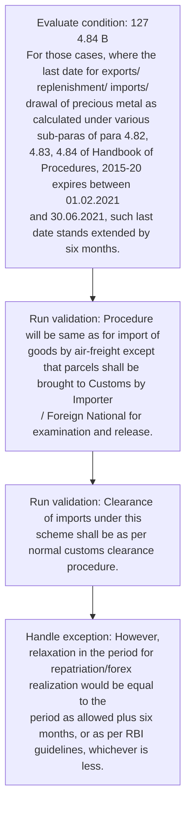

# Chapter 4 / Section 4.88: Personal Carriage of Gems & Jewellery Import Parcels

**Chapter Title:** Duty Exemption / Remission Schemes

**Pages:** 52, 53

**Purpose:** 127
4.84 B
For those cases, where the last date for exports/ replenishment/ imports/
drawal of precious metal as calculated under various sub-paras of para 4.82,
4.83, 4.84 of Handbook of Procedures, 2015-20 expires between 01.02.2021
and 30.06.2021, such last date stands extended by six months.

**Purpose Thanglish:** Indha Personal Carriage of Gems & Jewellery Import Parcels section-la, 127
4.84 B
For those cases, where the last date for exports/ replenishment/ imports/
drawal of precious metal as calculated under various sub-paras of para 4.82,
4.83, 4.84 of Handbook of Procedures, 2015-20 expires between 01.02.2021
and 30.06.2021, such last date stands extended by six months.

**Summary:** 4.88 Personal Carriage of Gems & Jewellery Import Parcels
pg. 127
pg. 127
4.84 B
For those cases, where the last date for exports/ replenishment/ imports/
drawal of precious metal as calculated under various sub-paras of para 4.82,
4.83, 4.84 of Handbook of Procedures, 2015-20 expires between 01.02.2021
and 30.06.2021, such last date stands extended by six months.

**Business Meaning:** Personal Carriage of Gems & Jewellery Import Parcels governs how DGFT business controls should be applied, validated, and enforced.

**Business Explanation:** Personal Carriage of Gems & Jewellery Import Parcels explains the operating rule set that DEKAI should enforce. Key control points include Procedure will be same as for import of
goods by air-freight except that parcels shall be brought to Customs by Importer
/ Foreign National for examination and release.

**Business Explanation Thanglish:** Indha Personal Carriage of Gems & Jewellery Import Parcels section-la, Personal Carriage of Gems & Jewellery import Parcels explains the operating rule set that DEKAI should enforce. Key control points include Procedure will be same as for import of
goods by air-freight except that parcels kandippa be brought to Customs by Importer
/ Foreign National for examination and release.

## Business Logic
- Procedure will be same as for import of
goods by air-freight except that parcels shall be brought to Customs by Importer
/ Foreign National for examination and release.
- Clearance of imports under this
scheme shall be as per normal customs clearance procedure.

## Business Rules
- rule_id=CH4-SEC4_88-R001, rule_description=Procedure will be same as for import of
goods by air-freight except that parcels shall be brought to Customs by Importer
/ Foreign National for examination and release., trigger=Personal Carriage of Gems & Jewellery Import Parcels, condition=127
4.84 B
For those cases, where the last date for exports/ replenishment/ imports/
drawal of precious metal as calculated under various sub-paras of para 4.82,
4.83, 4.84 of Handbook of Procedures, 2015-20 expires between 01.02.2021
and 30.06.2021, such last date stands extended by six months., validation=Procedure will be same as for import of
goods by air-freight except that parcels shall be brought to Customs by Importer
/ Foreign National for examination and release., action=Manual review required., exception=However,
relaxation in the period for repatriation/forex realization would be equal to the
period as allowed plus six months, or as per RBI guidelines, whichever is less., output=DEKAI should produce a compliance decision for 4.88 - Personal Carriage of Gems & Jewellery Import Parcels.
- rule_id=CH4-SEC4_88-R002, rule_description=Clearance of imports under this
scheme shall be as per normal customs clearance procedure., trigger=Personal Carriage of Gems & Jewellery Import Parcels, condition=127
4.84 B
For those cases, where the last date for exports/ replenishment/ imports/
drawal of precious metal as calculated under various sub-paras of para 4.82,
4.83, 4.84 of Handbook of Procedures, 2015-20 expires between 01.02.2021
and 30.06.2021, such last date stands extended by six months., validation=Clearance of imports under this
scheme shall be as per normal customs clearance procedure., action=Manual review required., exception=Procedure will be same as for import of
goods by air-freight except that parcels shall be brought to Customs by Importer
/ Foreign National for examination and release., output=DEKAI should produce a compliance decision for 4.88 - Personal Carriage of Gems & Jewellery Import Parcels.

## Conditions
- 127
4.84 B
For those cases, where the last date for exports/ replenishment/ imports/
drawal of precious metal as calculated under various sub-paras of para 4.82,
4.83, 4.84 of Handbook of Procedures, 2015-20 expires between 01.02.2021
and 30.06.2021, such last date stands extended by six months.

## Condition Logic
- id=4.4.88.1, if=127
4.84 B
For those cases, where the last date for exports/ replenishment/ imports/
drawal of precious metal as calculated under various sub-paras of para 4.82,
4.83, 4.84 of Handbook of Procedures, 2015-20 expires between 01.02.2021
and 30.06.2021, such last date stands extended by six months., then=Route for review, source=127
4.84 B
For those cases, where the last date for exports/ replenishment/ imports/
drawal of precious metal as calculated under various sub-paras of para 4.82,
4.83, 4.84 of Handbook of Procedures, 2015-20 expires between 01.02.2021
and 30.06.2021, such last date stands extended by six months.

## Validations
- Procedure will be same as for import of
goods by air-freight except that parcels shall be brought to Customs by Importer
/ Foreign National for examination and release.
- Clearance of imports under this
scheme shall be as per normal customs clearance procedure.

## Exceptions
- However,
relaxation in the period for repatriation/forex realization would be equal to the
period as allowed plus six months, or as per RBI guidelines, whichever is less.
- Procedure will be same as for import of
goods by air-freight except that parcels shall be brought to Customs by Importer
/ Foreign National for examination and release.

## Dependencies
- 4.82
- 4.83
- 4.84

## Authorities
- Customs

## Required Documents
- None identified

## Timelines
- 127
4.84 B
For those cases, where the last date for exports/ replenishment/ imports/
drawal of precious metal as calculated under various sub-paras of para 4.82,
4.83, 4.84 of Handbook of Procedures, 2015-20 expires between 01.02.2021
and 30.06.2021, such last date stands extended by six months.
- However,
relaxation in the period for repatriation/forex realization would be equal to the
period as allowed plus six months, or as per RBI guidelines, whichever is less.

## Actions
- None identified

## Workflow
- Evaluate condition: 127
4.84 B
For those cases, where the last date for exports/ replenishment/ imports/
drawal of precious metal as calculated under various sub-paras of para 4.82,
4.83, 4.84 of Handbook of Procedures, 2015-20 expires between 01.02.2021
and 30.06.2021, such last date stands extended by six months.
- Run validation: Procedure will be same as for import of
goods by air-freight except that parcels shall be brought to Customs by Importer
/ Foreign National for examination and release.
- Run validation: Clearance of imports under this
scheme shall be as per normal customs clearance procedure.
- Handle exception: However,
relaxation in the period for repatriation/forex realization would be equal to the
period as allowed plus six months, or as per RBI guidelines, whichever is less.

## Workflow ASCII
```text
Personal Carriage of Gems & Jewellery Import Parcels
Evaluate condition: 127
4.84 B
For those cases, where the last date for exports/ replenishment/ imports/
drawal of precious metal as calculated under various sub-paras of para 4.82,
4.83, 4.84 of Handbook of Procedures, 2015-20 expires between 01.02.2021
and 30.06.2021, such last date stands extended by six months.
   |
   v
Run validation: Procedure will be same as for import of
goods by air-freight except that parcels shall be brought to Customs by Importer
/ Foreign National for examination and release.
   |
   v
Run validation: Clearance of imports under this
scheme shall be as per normal customs clearance procedure.
   |
   v
Handle exception: However,
relaxation in the period for repatriation/forex realization would be equal to the
period as allowed plus six months, or as per RBI guidelines, whichever is less.
```

## Decision Tree
- IF exception applies (However,
relaxation in the period for repatriation/forex realization would be equal to the
period as allowed plus six months, or as per RBI guidelines, whichever is less.) THEN route to manual review
- IF exception applies (Procedure will be same as for import of
goods by air-freight except that parcels shall be brought to Customs by Importer
/ Foreign National for examination and release.) THEN route to manual review

## Decision Tree ASCII
```text
Personal Carriage of Gems & Jewellery Import Parcels Decision
IF exception applies (However,
relaxation in the period for repatriation/forex realization would be equal to the
period as allowed plus six months, or as per RBI guidelines, whichever is less.) THEN route to manual review
   |
   v
IF exception applies (Procedure will be same as for import of
goods by air-freight except that parcels shall be brought to Customs by Importer
/ Foreign National for examination and release.) THEN route to manual review
```

## Examples
- User asks to process Personal Carriage of Gems & Jewellery Import Parcels; the platform checks conditions, validations, and documents before action.

**Real-world Example:** Example: an importer or exporter invokes Personal Carriage of Gems & Jewellery Import Parcels, submits the prescribed DGFT records, and DEKAI uses the extracted rules to follow the personal carriage of gems & jewellery import parcels process.

**Real-world Example Thanglish:** Indha Personal Carriage of Gems & Jewellery Import Parcels section-la, Example: an importer or exporter invokes Personal Carriage of Gems & Jewellery import Parcels, submits the prescribed DGFT records, and DEKAI uses the extracted rules to follow the personal carriage of gems & jewellery import parcels process.

## AI Rules
- IF detected context matches section rule THEN enforce: Procedure will be same as for import of
goods by air-freight except that parcels shall be brought to Customs by Importer
/ Foreign National for examination and release.
- IF detected context matches section rule THEN enforce: Clearance of imports under this
scheme shall be as per normal customs clearance procedure.

## Database Fields
- name=section_code, type=string, required=True, source=parsed_section_heading
- name=section_title, type=string, required=True, source=parsed_section_heading
- name=for_flag, type=boolean, required=False, source=keyword:For
- name=the_flag, type=boolean, required=False, source=keyword:the
- name=and_flag, type=boolean, required=False, source=keyword:and
- name=six_flag, type=boolean, required=False, source=keyword:six
- name=per_flag, type=boolean, required=False, source=keyword:per
- name=rbi_flag, type=boolean, required=False, source=keyword:RBI
- name=may_flag, type=boolean, required=False, source=keyword:may
- name=all_flag, type=boolean, required=False, source=keyword:all

## API Requirements
- method=GET, path=/api/dgft/sections/4.88, purpose=Retrieve knowledge payload for section 4.88, query_params=['include=workflow,decision_tree,validations'], response_fields=['section', 'title', 'summary', 'conditions', 'validations', 'exceptions', 'workflow', 'decision_tree']
- method=POST, path=/api/dgft/Personal-Carriage-of-Gems-Jewellery-Import-Parcels/validate, purpose=Validate inputs and documents for Personal Carriage of Gems & Jewellery Import Parcels, request_fields=['section_code', 'section_title'], response_fields=['status', 'errors', 'warnings', 'next_actions']

## UI Screens
- screen_id=Personal_Carriage_of_Gems_Jewellery_Import_Parcels_overview, name=Personal Carriage of Gems & Jewellery Import Parcels Overview, purpose=Show section summary, authority, timeline, and eligibility cues., widgets=['summary_card', 'conditions_table', 'authority_badges', 'timeline_panel']
- screen_id=Personal_Carriage_of_Gems_Jewellery_Import_Parcels_submission, name=Personal Carriage of Gems & Jewellery Import Parcels Submission, purpose=Capture applicant data and supporting documents., widgets=['dynamic_form', 'document_uploader', 'validation_panel', 'next_action_footer'], fields=['section_code', 'section_title', 'for_flag', 'the_flag', 'and_flag', 'six_flag', 'per_flag', 'rbi_flag']
- screen_id=Personal_Carriage_of_Gems_Jewellery_Import_Parcels_exceptions, name=Personal Carriage of Gems & Jewellery Import Parcels Exception Review, purpose=Explain exception handling and manual review triggers., widgets=['exception_banner', 'decision_tree', 'case_notes']

## Error Messages
- Validation failed because the section requirements were not fully met.

## FAQ
- question_en=What is the purpose of section 4.88?, answer_en=Personal Carriage of Gems & Jewellery Import Parcels explains the operating rule set that DEKAI should enforce. Key control points include Procedure will be same as for import of
goods by air-freight except that parcels shall be brought to Customs by Importer
/ Foreign National for examination and release., question_thanglish=Indha Personal Carriage of Gems & Jewellery Import Parcels section-la, What is the purpose of section 4.88?, answer_thanglish=Indha Personal Carriage of Gems & Jewellery Import Parcels section-la, Personal Carriage of Gems & Jewellery import Parcels explains the operating rule set that DEKAI should enforce. Key control points include Procedure will be same as for import of
goods by air-freight except that parcels kandippa be brought to Customs by Importer
/ Foreign National for examination and release.
- question_en=What documents are required under Personal Carriage of Gems & Jewellery Import Parcels?, answer_en=Not explicitly covered in uploaded documents., question_thanglish=Indha Personal Carriage of Gems & Jewellery Import Parcels section-la, What documents are required under Personal Carriage of Gems & Jewellery import Parcels?, answer_thanglish=Indha Personal Carriage of Gems & Jewellery Import Parcels section-la, Not explicitly covered in uploaded documents.
- question_en=Which authority handles Personal Carriage of Gems & Jewellery Import Parcels?, answer_en=Customs, question_thanglish=Indha Personal Carriage of Gems & Jewellery Import Parcels section-la, Which authority handles Personal Carriage of Gems & Jewellery import Parcels?, answer_thanglish=Indha Personal Carriage of Gems & Jewellery Import Parcels section-la, Customs

## Questions Users May Ask
- What does Personal Carriage of Gems & Jewellery Import Parcels require?
- Which documents are needed for Personal Carriage of Gems & Jewellery Import Parcels?
- How does DEKAI validate Personal Carriage of Gems & Jewellery Import Parcels requests?

## Expected AI Answers
- Personal Carriage of Gems & Jewellery Import Parcels requires the platform to interpret the section text, apply the extracted business rules, and present the correct next action.
- Required documents are inferred from the section text: no explicit documents were detected.
- DEKAI validates Personal Carriage of Gems & Jewellery Import Parcels by checking conditions, required documents, authority references, and exception clauses before recommending an outcome.

## AI Q&A Examples
- question_en=User asks: How do I comply with Personal Carriage of Gems & Jewellery Import Parcels?, answer_en=AI answers: DEKAI should evaluate section 4.88, apply the extracted rules, and guide the user through Evaluate condition: 127
4.84 B
For those cases, where the last date for exports/ replenishment/ imports/
drawal of precious metal as calculated under various sub-paras of para 4.82,
4.83, 4.84 of Handbook of Procedures, 2015-20 expires between 01.02.2021
and 30.06.2021, such last date stands extended by six months.., question_thanglish=Indha Personal Carriage of Gems & Jewellery Import Parcels section-la, User asks: How do I comply with Personal Carriage of Gems & Jewellery import Parcels?, answer_thanglish=Indha Personal Carriage of Gems & Jewellery Import Parcels section-la, AI answers: DEKAI should evaluate section 4.88, apply the extracted rules, and guide the user through Evaluate condition: 127
4.84 B
For those cases, where the last date for exports/ replenishment/ imports/
drawal of precious metal as calculated under various sub-paras of para 4.82,
4.83, 4.84 of Handbook of Procedures, 2015-20 expires between 01.02.2021
and 30.06.2021, such last date stands extended by six months..
- question_en=User asks: Which validations apply to Personal Carriage of Gems & Jewellery Import Parcels?, answer_en=AI answers: Applicable validations are Procedure will be same as for import of
goods by air-freight except that parcels shall be brought to Customs by Importer
/ Foreign National for examination and release., Clearance of imports under this
scheme shall be as per normal customs clearance procedure., question_thanglish=Indha Personal Carriage of Gems & Jewellery Import Parcels section-la, User asks: Which validations apply to Personal Carriage of Gems & Jewellery import Parcels?, answer_thanglish=Indha Personal Carriage of Gems & Jewellery Import Parcels section-la, AI answers: Applicable validations are Procedure will be same as for import of
goods by air-freight except that parcels kandippa be brought to Customs by Importer
/ Foreign National for examination and release., Clearance of imports under this
scheme kandippa be as per normal customs clearance procedure.

## DEKAI AI Implementation Notes
- Capture chapter 4, section 4.88, title, and page references as immutable knowledge metadata.
- Bind validations for Personal Carriage of Gems & Jewellery Import Parcels into a rule engine keyed by the rule IDs extracted for this section.
- Route escalations or approvals to: Customs.
- Trigger manual review when exception clauses are detected.
- Show contextual links to related sections: 4.82, 4.83, 4.84.

## DEKAI AI Implementation Notes Thanglish
- Indha Personal Carriage of Gems & Jewellery Import Parcels section-la, Capture chapter 4, section 4.88, title, and page references as immutable knowledge metadata.
- Indha Personal Carriage of Gems & Jewellery Import Parcels section-la, Bind validations for Personal Carriage of Gems & Jewellery import Parcels into a rule engine keyed by the rule IDs extracted for this section.
- Indha Personal Carriage of Gems & Jewellery Import Parcels section-la, Route escalations or approvals to: Customs.
- Indha Personal Carriage of Gems & Jewellery Import Parcels section-la, Trigger manual review when exception clauses are detected.
- Indha Personal Carriage of Gems & Jewellery Import Parcels section-la, Show contextual links to related sections: 4.82, 4.83, 4.84.

## AI Metadata
- Keywords: For, the, and, six, per, RBI, may, all, DTA, Gems, last, date, para, such, plus, less, into, will, same, that
- Search Keywords: For, the, and, six, per, RBI, may, all, DTA, Gems, last, date, para, such, plus, less, into, will, same, that
- Intent: Provide knowledge guidance for Personal Carriage of Gems & Jewellery Import Parcels.
- Tags: 4.88, Personal Carriage of Gems & Jewellery Import Parcels, business-rule, dgft
- Related Sections: 4.82, 4.83, 4.84
- Related Chapters: 
- Related Rules: Procedure will be same as for import of
goods by air-freight except that parcels shall be brought to Customs by Importer
/ Foreign National for examination and release., Clearance of imports under this
scheme shall be as per normal customs clearance procedure.

## Mermaid


## PlantUML
```plantuml
@startuml
start
:Evaluate condition\: 127
4.84 B
For those cases, where the last date for exports/ replenishment/ imports/
drawal of precious metal as calculated under various sub-paras of para 4.82,
4.83, 4.84 of Handbook of Procedures, 2015-20 expires between 01.02.2021
and 30.06.2021, such last date stands extended by six months.;
:Run validation\: Procedure will be same as for import of
goods by air-freight except that parcels shall be brought to Customs by Importer
/ Foreign National for examination and release.;
:Run validation\: Clearance of imports under this
scheme shall be as per normal customs clearance procedure.;
:Handle exception\: However,
relaxation in the period for repatriation/forex realization would be equal to the
period as allowed plus six months, or as per RBI guidelines, whichever is less.;
stop
@enduml
```
