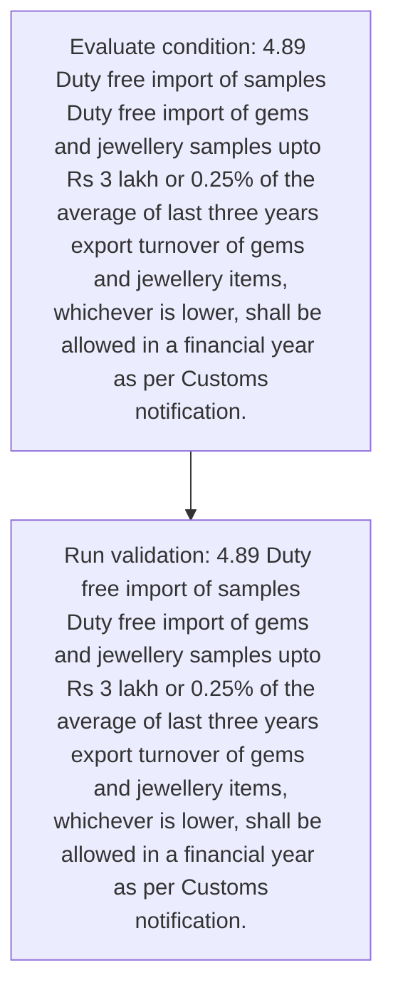
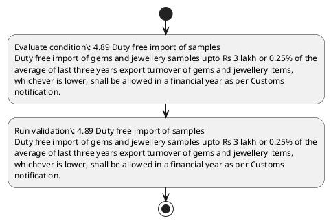

# Chapter 4 / Section 4.89: Duty free import of samples

**Chapter Title:** Duty Exemption / Remission Schemes

**Pages:** 53

**Purpose:** 4.89 Duty free import of samples
Duty free import of gems and jewellery samples upto Rs 3 lakh or 0.25% of the
average of last three years export turnover of gems and jewellery items,
whichever is lower, shall be allowed in a financial year as per Customs
notification.

**Purpose Thanglish:** Indha Duty free import of samples section-la, 4.89 Duty free import of samples
Duty free import of gems and jewellery samples upto Rs 3 lakh or 0.25% of the
average of last three years export turnover of gems and jewellery items,
whichever is lower, kandippa be allowed in a financial year as per Customs
notification.

**Summary:** 4.89 Duty free import of samples
Duty free import of gems and jewellery samples upto Rs 3 lakh or 0.25% of the
average of last three years export turnover of gems and jewellery items,
whichever is lower, shall be allowed in a financial year as per Customs
notification.

**Business Meaning:** Duty free import of samples governs how DGFT business controls should be applied, validated, and enforced.

**Business Explanation:** Duty free import of samples explains the operating rule set that DEKAI should enforce. Key control points include 4.89 Duty free import of samples
Duty free import of gems and jewellery samples upto Rs 3 lakh or 0.25% of the
average of last three years export turnover of gems and jewellery items,
whichever is lower, shall be allowed in a financial year as per Customs
notification.

**Business Explanation Thanglish:** Indha Duty free import of samples section-la, Duty free import of samples explains the operating rule set that DEKAI should enforce. Key control points include 4.89 Duty free import of samples
Duty free import of gems and jewellery samples upto Rs 3 lakh or 0.25% of the
average of last three years export turnover of gems and jewellery items,
whichever is lower, kandippa be allowed in a financial year as per Customs
notification.

## Business Logic
- 4.89 Duty free import of samples
Duty free import of gems and jewellery samples upto Rs 3 lakh or 0.25% of the
average of last three years export turnover of gems and jewellery items,
whichever is lower, shall be allowed in a financial year as per Customs
notification.

## Business Rules
- rule_id=CH4-SEC4_89-R001, rule_description=4.89 Duty free import of samples
Duty free import of gems and jewellery samples upto Rs 3 lakh or 0.25% of the
average of last three years export turnover of gems and jewellery items,
whichever is lower, shall be allowed in a financial year as per Customs
notification., trigger=Duty free import of samples, condition=4.89 Duty free import of samples
Duty free import of gems and jewellery samples upto Rs 3 lakh or 0.25% of the
average of last three years export turnover of gems and jewellery items,
whichever is lower, shall be allowed in a financial year as per Customs
notification., validation=4.89 Duty free import of samples
Duty free import of gems and jewellery samples upto Rs 3 lakh or 0.25% of the
average of last three years export turnover of gems and jewellery items,
whichever is lower, shall be allowed in a financial year as per Customs
notification., action=Manual review required., exception=No explicit exception found in uploaded documents., output=DEKAI should produce a compliance decision for 4.89 - Duty free import of samples.

## Conditions
- 4.89 Duty free import of samples
Duty free import of gems and jewellery samples upto Rs 3 lakh or 0.25% of the
average of last three years export turnover of gems and jewellery items,
whichever is lower, shall be allowed in a financial year as per Customs
notification.

## Condition Logic
- id=4.4.89.1, if=4.89 Duty free import of samples
Duty free import of gems and jewellery samples upto Rs 3 lakh or 0.25% of the
average of last three years export turnover of gems and jewellery items,
whichever is lower, shall be allowed in a financial year as per Customs
notification., then=Route for review, source=4.89 Duty free import of samples
Duty free import of gems and jewellery samples upto Rs 3 lakh or 0.25% of the
average of last three years export turnover of gems and jewellery items,
whichever is lower, shall be allowed in a financial year as per Customs
notification.

## Validations
- 4.89 Duty free import of samples
Duty free import of gems and jewellery samples upto Rs 3 lakh or 0.25% of the
average of last three years export turnover of gems and jewellery items,
whichever is lower, shall be allowed in a financial year as per Customs
notification.

## Exceptions
- None identified

## Dependencies
- 2
- 3
- 4
- 5

## Authorities
- Customs

## Required Documents
- None identified

## Timelines
- 4.89 Duty free import of samples
Duty free import of gems and jewellery samples upto Rs 3 lakh or 0.25% of the
average of last three years export turnover of gems and jewellery items,
whichever is lower, shall be allowed in a financial year as per Customs
notification.

## Actions
- None identified

## Workflow
- Evaluate condition: 4.89 Duty free import of samples
Duty free import of gems and jewellery samples upto Rs 3 lakh or 0.25% of the
average of last three years export turnover of gems and jewellery items,
whichever is lower, shall be allowed in a financial year as per Customs
notification.
- Run validation: 4.89 Duty free import of samples
Duty free import of gems and jewellery samples upto Rs 3 lakh or 0.25% of the
average of last three years export turnover of gems and jewellery items,
whichever is lower, shall be allowed in a financial year as per Customs
notification.

## Workflow ASCII
```text
Duty free import of samples
Evaluate condition: 4.89 Duty free import of samples
Duty free import of gems and jewellery samples upto Rs 3 lakh or 0.25% of the
average of last three years export turnover of gems and jewellery items,
whichever is lower, shall be allowed in a financial year as per Customs
notification.
   |
   v
Run validation: 4.89 Duty free import of samples
Duty free import of gems and jewellery samples upto Rs 3 lakh or 0.25% of the
average of last three years export turnover of gems and jewellery items,
whichever is lower, shall be allowed in a financial year as per Customs
notification.
```

## Decision Tree
- IF section 4.89 applies THEN proceed with standard DGFT workflow

## Decision Tree ASCII
```text
Duty free import of samples Decision
IF section 4.89 applies THEN proceed with standard DGFT workflow
```

## Examples
- User asks to process Duty free import of samples; the platform checks conditions, validations, and documents before action.

**Real-world Example:** Example: an importer or exporter invokes Duty free import of samples, submits the prescribed DGFT records, and DEKAI uses the extracted rules to follow the duty free import of samples process.

**Real-world Example Thanglish:** Indha Duty free import of samples section-la, Example: an importer or exporter invokes Duty free import of samples, submits the prescribed DGFT records, and DEKAI uses the extracted rules to follow the duty free import of samples process.

## AI Rules
- IF detected context matches section rule THEN enforce: 4.89 Duty free import of samples
Duty free import of gems and jewellery samples upto Rs 3 lakh or 0.25% of the
average of last three years export turnover of gems and jewellery items,
whichever is lower, shall be allowed in a financial year as per Customs
notification.

## Database Fields
- name=section_code, type=string, required=True, source=parsed_section_heading
- name=section_title, type=string, required=True, source=parsed_section_heading
- name=and_flag, type=boolean, required=False, source=keyword:and
- name=the_flag, type=boolean, required=False, source=keyword:the
- name=per_flag, type=boolean, required=False, source=keyword:per
- name=duty_flag, type=boolean, required=False, source=keyword:Duty
- name=free_flag, type=boolean, required=False, source=keyword:free
- name=gems_flag, type=boolean, required=False, source=keyword:gems
- name=upto_flag, type=boolean, required=False, source=keyword:upto
- name=lakh_flag, type=boolean, required=False, source=keyword:lakh

## API Requirements
- method=GET, path=/api/dgft/sections/4.89, purpose=Retrieve knowledge payload for section 4.89, query_params=['include=workflow,decision_tree,validations'], response_fields=['section', 'title', 'summary', 'conditions', 'validations', 'exceptions', 'workflow', 'decision_tree']
- method=POST, path=/api/dgft/Duty-free-import-of-samples/validate, purpose=Validate inputs and documents for Duty free import of samples, request_fields=['section_code', 'section_title'], response_fields=['status', 'errors', 'warnings', 'next_actions']

## UI Screens
- screen_id=Duty_free_import_of_samples_overview, name=Duty free import of samples Overview, purpose=Show section summary, authority, timeline, and eligibility cues., widgets=['summary_card', 'conditions_table', 'authority_badges', 'timeline_panel']
- screen_id=Duty_free_import_of_samples_submission, name=Duty free import of samples Submission, purpose=Capture applicant data and supporting documents., widgets=['dynamic_form', 'document_uploader', 'validation_panel', 'next_action_footer'], fields=['section_code', 'section_title', 'and_flag', 'the_flag', 'per_flag', 'duty_flag', 'free_flag', 'gems_flag']

## Error Messages
- Validation failed because the section requirements were not fully met.

## FAQ
- question_en=What is the purpose of section 4.89?, answer_en=Duty free import of samples explains the operating rule set that DEKAI should enforce. Key control points include 4.89 Duty free import of samples
Duty free import of gems and jewellery samples upto Rs 3 lakh or 0.25% of the
average of last three years export turnover of gems and jewellery items,
whichever is lower, shall be allowed in a financial year as per Customs
notification., question_thanglish=Indha Duty free import of samples section-la, What is the purpose of section 4.89?, answer_thanglish=Indha Duty free import of samples section-la, Duty free import of samples explains the operating rule set that DEKAI should enforce. Key control points include 4.89 Duty free import of samples
Duty free import of gems and jewellery samples upto Rs 3 lakh or 0.25% of the
average of last three years export turnover of gems and jewellery items,
whichever is lower, kandippa be allowed in a financial year as per Customs
notification.
- question_en=What documents are required under Duty free import of samples?, answer_en=Not explicitly covered in uploaded documents., question_thanglish=Indha Duty free import of samples section-la, What documents are required under Duty free import of samples?, answer_thanglish=Indha Duty free import of samples section-la, Not explicitly covered in uploaded documents.
- question_en=Which authority handles Duty free import of samples?, answer_en=Customs, question_thanglish=Indha Duty free import of samples section-la, Which authority handles Duty free import of samples?, answer_thanglish=Indha Duty free import of samples section-la, Customs

## Questions Users May Ask
- What does Duty free import of samples require?
- Which documents are needed for Duty free import of samples?
- How does DEKAI validate Duty free import of samples requests?

## Expected AI Answers
- Duty free import of samples requires the platform to interpret the section text, apply the extracted business rules, and present the correct next action.
- Required documents are inferred from the section text: no explicit documents were detected.
- DEKAI validates Duty free import of samples by checking conditions, required documents, authority references, and exception clauses before recommending an outcome.

## AI Q&A Examples
- question_en=User asks: How do I comply with Duty free import of samples?, answer_en=AI answers: DEKAI should evaluate section 4.89, apply the extracted rules, and guide the user through Evaluate condition: 4.89 Duty free import of samples
Duty free import of gems and jewellery samples upto Rs 3 lakh or 0.25% of the
average of last three years export turnover of gems and jewellery items,
whichever is lower, shall be allowed in a financial year as per Customs
notification.., question_thanglish=Indha Duty free import of samples section-la, User asks: How do I comply with Duty free import of samples?, answer_thanglish=Indha Duty free import of samples section-la, AI answers: DEKAI should evaluate section 4.89, apply the extracted rules, and guide the user through Evaluate condition: 4.89 Duty free import of samples
Duty free import of gems and jewellery samples upto Rs 3 lakh or 0.25% of the
average of last three years export turnover of gems and jewellery items,
whichever is lower, kandippa be allowed in a financial year as per Customs
notification..
- question_en=User asks: Which validations apply to Duty free import of samples?, answer_en=AI answers: Applicable validations are 4.89 Duty free import of samples
Duty free import of gems and jewellery samples upto Rs 3 lakh or 0.25% of the
average of last three years export turnover of gems and jewellery items,
whichever is lower, shall be allowed in a financial year as per Customs
notification., question_thanglish=Indha Duty free import of samples section-la, User asks: Which validations apply to Duty free import of samples?, answer_thanglish=Indha Duty free import of samples section-la, AI answers: Applicable validations are 4.89 Duty free import of samples
Duty free import of gems and jewellery samples upto Rs 3 lakh or 0.25% of the
average of last three years export turnover of gems and jewellery items,
whichever is lower, kandippa be allowed in a financial year as per Customs
notification.

## DEKAI AI Implementation Notes
- Capture chapter 4, section 4.89, title, and page references as immutable knowledge metadata.
- Bind validations for Duty free import of samples into a rule engine keyed by the rule IDs extracted for this section.
- Route escalations or approvals to: Customs.
- Show contextual links to related sections: 2, 3, 4, 5.

## DEKAI AI Implementation Notes Thanglish
- Indha Duty free import of samples section-la, Capture chapter 4, section 4.89, title, and page references as immutable knowledge metadata.
- Indha Duty free import of samples section-la, Bind validations for Duty free import of samples into a rule engine keyed by the rule IDs extracted for this section.
- Indha Duty free import of samples section-la, Route escalations or approvals to: Customs.
- Indha Duty free import of samples section-la, Show contextual links to related sections: 2, 3, 4, 5.

## AI Metadata
- Keywords: and, the, per, Duty, free, gems, upto, lakh, last, year, three, years, items, lower, shall, import, export, samples, average, allowed
- Search Keywords: and, the, per, Duty, free, gems, upto, lakh, last, year, three, years, items, lower, shall, import, export, samples, average, allowed
- Intent: Provide knowledge guidance for Duty free import of samples.
- Tags: 4.89, Duty free import of samples, business-rule, dgft
- Related Sections: 2, 3, 4, 5
- Related Chapters: 
- Related Rules: 4.89 Duty free import of samples
Duty free import of gems and jewellery samples upto Rs 3 lakh or 0.25% of the
average of last three years export turnover of gems and jewellery items,
whichever is lower, shall be allowed in a financial year as per Customs
notification.

## Mermaid


## PlantUML

