# Chapter 4 / Section 4.90: Re-import of rejected jewellery

**Chapter Title:** Duty Exemption / Remission Schemes

**Pages:** 53

**Purpose:** 4.90 Re-import of rejected jewellery
An exporter of plain/ studded precious metal jewellery shall be allowed to re-
import duty free jewellery rejected and returned by buyer up to 2% of FOB
value of exports in preceding licencing year (based on CA certified copy of
export of preceding year) with refund of any duty
exemption/refund/replenishment benefit availed on inputs used as per
customs rules and regulations.

**Purpose Thanglish:** Indha Re-import of rejected jewellery section-la, 4.90 Re-import of rejected jewellery
An exporter of plain/ studded precious metal jewellery kandippa be allowed to re-
import duty free jewellery rejected and returned by buyer up to 2% of FOB
value of exports in preceding licencing year (based on CA certified copy of
export of preceding year) with refund of any duty
exemption/refund/replenishment benefit availed on inputs used as per
customs rules and regulations.

**Summary:** 4.90 Re-import of rejected jewellery
An exporter of plain/ studded precious metal jewellery shall be allowed to re-
import duty free jewellery rejected and returned by buyer up to 2% of FOB
value of exports in preceding licencing year (based on CA certified copy of
export of preceding year) with refund of any duty
exemption/refund/replenishment benefit availed on inputs used as per
customs rules and regulations. 4.90 Re-import of rejected jewellery
An exporter of plain/ studded precious metal jewellery shall be allowed to re-
import duty free jewellery rejected and returned by buyer up to 2% of FOB
value of exports in preceding licencing year (based on CA certified copy of
export
of
preceding
year)
with
refund
of
any
duty
exemption/refund/replenishment benefit availed on inputs used as per
customs rules and regulations.

**Business Meaning:** Re-import of rejected jewellery governs how DGFT business controls should be applied, validated, and enforced.

**Business Explanation:** Re-import of rejected jewellery explains the operating rule set that DEKAI should enforce. Key control points include 4.90 Re-import of rejected jewellery
An exporter of plain/ studded precious metal jewellery shall be allowed to re-
import duty free jewellery rejected and returned by buyer up to 2% of FOB
value of exports in preceding licencing year (based on CA certified copy of
export of preceding year) with refund of any duty
exemption/refund/replenishment benefit availed on inputs used as per
customs rules and regulations. The section also drives actions such as 4.90 Re-import of rejected jewellery
An exporter of plain/ studded precious metal jewellery shall be allowed to re-
import duty free jewellery rejected and returned by buyer up to 2% of FOB
value of exports in preceding licencing year (based on CA certified copy of
export of preceding year) with refund of any duty
exemption/refund/replenishment benefit availed on inputs used as per
customs rules and regulations..

**Business Explanation Thanglish:** Indha Re-import of rejected jewellery section-la, Re-import of rejected jewellery explains the operating rule set that DEKAI should enforce. Key control points include 4.90 Re-import of rejected jewellery
An exporter of plain/ studded precious metal jewellery kandippa be allowed to re-
import duty free jewellery rejected and returned by buyer up to 2% of FOB
value of exports in preceding licencing year (based on CA certified copy of
export of preceding year) with refund of any duty
exemption/refund/replenishment benefit availed on inputs used as per
customs rules and regulations. The section also drives actions such as 4.90 Re-import of rejected jewellery
An exporter of plain/ studded precious metal jewellery kandippa be allowed to re-
import duty free jewellery rejected and returned by buyer up to 2% of FOB
value of exports in preceding licencing year (based on CA certified copy of
export of preceding year) with refund of any duty
exemption/refund/replenishment benefit availed on inputs used as per
customs rules and regulations..

## Business Logic
- 4.90 Re-import of rejected jewellery
An exporter of plain/ studded precious metal jewellery shall be allowed to re-
import duty free jewellery rejected and returned by buyer up to 2% of FOB
value of exports in preceding licencing year (based on CA certified copy of
export of preceding year) with refund of any duty
exemption/refund/replenishment benefit availed on inputs used as per
customs rules and regulations.
- 4.90 Re-import of rejected jewellery
An exporter of plain/ studded precious metal jewellery shall be allowed to re-
import duty free jewellery rejected and returned by buyer up to 2% of FOB
value of exports in preceding licencing year (based on CA certified copy of
export
of
preceding
year)
with
refund
of
any
duty
exemption/refund/replenishment benefit availed on inputs used as per
customs rules and regulations.

## Business Rules
- rule_id=CH4-SEC4_90-R001, rule_description=4.90 Re-import of rejected jewellery
An exporter of plain/ studded precious metal jewellery shall be allowed to re-
import duty free jewellery rejected and returned by buyer up to 2% of FOB
value of exports in preceding licencing year (based on CA certified copy of
export of preceding year) with refund of any duty
exemption/refund/replenishment benefit availed on inputs used as per
customs rules and regulations., trigger=Re-import of rejected jewellery, condition=4.90 Re-import of rejected jewellery
An exporter of plain/ studded precious metal jewellery shall be allowed to re-
import duty free jewellery rejected and returned by buyer up to 2% of FOB
value of exports in preceding licencing year (based on CA certified copy of
export of preceding year) with refund of any duty
exemption/refund/replenishment benefit availed on inputs used as per
customs rules and regulations., validation=4.90 Re-import of rejected jewellery
An exporter of plain/ studded precious metal jewellery shall be allowed to re-
import duty free jewellery rejected and returned by buyer up to 2% of FOB
value of exports in preceding licencing year (based on CA certified copy of
export of preceding year) with refund of any duty
exemption/refund/replenishment benefit availed on inputs used as per
customs rules and regulations., action=4.90 Re-import of rejected jewellery
An exporter of plain/ studded precious metal jewellery shall be allowed to re-
import duty free jewellery rejected and returned by buyer up to 2% of FOB
value of exports in preceding licencing year (based on CA certified copy of
export of preceding year) with refund of any duty
exemption/refund/replenishment benefit availed on inputs used as per
customs rules and regulations., exception=4.90 Re-import of rejected jewellery
An exporter of plain/ studded precious metal jewellery shall be allowed to re-
import duty free jewellery rejected and returned by buyer up to 2% of FOB
value of exports in preceding licencing year (based on CA certified copy of
export of preceding year) with refund of any duty
exemption/refund/replenishment benefit availed on inputs used as per
customs rules and regulations., output=DEKAI should produce a compliance decision for 4.90 - Re-import of rejected jewellery.
- rule_id=CH4-SEC4_90-R002, rule_description=4.90 Re-import of rejected jewellery
An exporter of plain/ studded precious metal jewellery shall be allowed to re-
import duty free jewellery rejected and returned by buyer up to 2% of FOB
value of exports in preceding licencing year (based on CA certified copy of
export
of
preceding
year)
with
refund
of
any
duty
exemption/refund/replenishment benefit availed on inputs used as per
customs rules and regulations., trigger=Re-import of rejected jewellery, condition=4.90 Re-import of rejected jewellery
An exporter of plain/ studded precious metal jewellery shall be allowed to re-
import duty free jewellery rejected and returned by buyer up to 2% of FOB
value of exports in preceding licencing year (based on CA certified copy of
export
of
preceding
year)
with
refund
of
any
duty
exemption/refund/replenishment benefit availed on inputs used as per
customs rules and regulations., validation=4.90 Re-import of rejected jewellery
An exporter of plain/ studded precious metal jewellery shall be allowed to re-
import duty free jewellery rejected and returned by buyer up to 2% of FOB
value of exports in preceding licencing year (based on CA certified copy of
export
of
preceding
year)
with
refund
of
any
duty
exemption/refund/replenishment benefit availed on inputs used as per
customs rules and regulations., action=4.90 Re-import of rejected jewellery
An exporter of plain/ studded precious metal jewellery shall be allowed to re-
import duty free jewellery rejected and returned by buyer up to 2% of FOB
value of exports in preceding licencing year (based on CA certified copy of
export
of
preceding
year)
with
refund
of
any
duty
exemption/refund/replenishment benefit availed on inputs used as per
customs rules and regulations., exception=4.90 Re-import of rejected jewellery
An exporter of plain/ studded precious metal jewellery shall be allowed to re-
import duty free jewellery rejected and returned by buyer up to 2% of FOB
value of exports in preceding licencing year (based on CA certified copy of
export
of
preceding
year)
with
refund
of
any
duty
exemption/refund/replenishment benefit availed on inputs used as per
customs rules and regulations., output=DEKAI should produce a compliance decision for 4.90 - Re-import of rejected jewellery.

## Conditions
- 4.90 Re-import of rejected jewellery
An exporter of plain/ studded precious metal jewellery shall be allowed to re-
import duty free jewellery rejected and returned by buyer up to 2% of FOB
value of exports in preceding licencing year (based on CA certified copy of
export of preceding year) with refund of any duty
exemption/refund/replenishment benefit availed on inputs used as per
customs rules and regulations.
- 4.90 Re-import of rejected jewellery
An exporter of plain/ studded precious metal jewellery shall be allowed to re-
import duty free jewellery rejected and returned by buyer up to 2% of FOB
value of exports in preceding licencing year (based on CA certified copy of
export
of
preceding
year)
with
refund
of
any
duty
exemption/refund/replenishment benefit availed on inputs used as per
customs rules and regulations.

## Condition Logic
- id=4.4.90.1, if=4.90 Re-import of rejected jewellery
An exporter of plain/ studded precious metal jewellery shall be allowed to re-
import duty free jewellery rejected and returned by buyer up to 2% of FOB
value of exports in preceding licencing year (based on CA certified copy of
export of preceding year) with refund of any duty
exemption/refund/replenishment benefit availed on inputs used as per
customs rules and regulations., then=4.90 Re-import of rejected jewellery
An exporter of plain/ studded precious metal jewellery shall be allowed to re-
import duty free jewellery rejected and returned by buyer up to 2% of FOB
value of exports in preceding licencing year (based on CA certified copy of
export of preceding year) with refund of any duty
exemption/refund/replenishment benefit availed on inputs used as per
customs rules and regulations., source=4.90 Re-import of rejected jewellery
An exporter of plain/ studded precious metal jewellery shall be allowed to re-
import duty free jewellery rejected and returned by buyer up to 2% of FOB
value of exports in preceding licencing year (based on CA certified copy of
export of preceding year) with refund of any duty
exemption/refund/replenishment benefit availed on inputs used as per
customs rules and regulations.
- id=4.4.90.2, if=4.90 Re-import of rejected jewellery
An exporter of plain/ studded precious metal jewellery shall be allowed to re-
import duty free jewellery rejected and returned by buyer up to 2% of FOB
value of exports in preceding licencing year (based on CA certified copy of
export
of
preceding
year)
with
refund
of
any
duty
exemption/refund/replenishment benefit availed on inputs used as per
customs rules and regulations., then=4.90 Re-import of rejected jewellery
An exporter of plain/ studded precious metal jewellery shall be allowed to re-
import duty free jewellery rejected and returned by buyer up to 2% of FOB
value of exports in preceding licencing year (based on CA certified copy of
export of preceding year) with refund of any duty
exemption/refund/replenishment benefit availed on inputs used as per
customs rules and regulations., source=4.90 Re-import of rejected jewellery
An exporter of plain/ studded precious metal jewellery shall be allowed to re-
import duty free jewellery rejected and returned by buyer up to 2% of FOB
value of exports in preceding licencing year (based on CA certified copy of
export
of
preceding
year)
with
refund
of
any
duty
exemption/refund/replenishment benefit availed on inputs used as per
customs rules and regulations.

## Validations
- 4.90 Re-import of rejected jewellery
An exporter of plain/ studded precious metal jewellery shall be allowed to re-
import duty free jewellery rejected and returned by buyer up to 2% of FOB
value of exports in preceding licencing year (based on CA certified copy of
export of preceding year) with refund of any duty
exemption/refund/replenishment benefit availed on inputs used as per
customs rules and regulations.
- 4.90 Re-import of rejected jewellery
An exporter of plain/ studded precious metal jewellery shall be allowed to re-
import duty free jewellery rejected and returned by buyer up to 2% of FOB
value of exports in preceding licencing year (based on CA certified copy of
export
of
preceding
year)
with
refund
of
any
duty
exemption/refund/replenishment benefit availed on inputs used as per
customs rules and regulations.

## Exceptions
- 4.90 Re-import of rejected jewellery
An exporter of plain/ studded precious metal jewellery shall be allowed to re-
import duty free jewellery rejected and returned by buyer up to 2% of FOB
value of exports in preceding licencing year (based on CA certified copy of
export of preceding year) with refund of any duty
exemption/refund/replenishment benefit availed on inputs used as per
customs rules and regulations.
- 4.90 Re-import of rejected jewellery
An exporter of plain/ studded precious metal jewellery shall be allowed to re-
import duty free jewellery rejected and returned by buyer up to 2% of FOB
value of exports in preceding licencing year (based on CA certified copy of
export
of
preceding
year)
with
refund
of
any
duty
exemption/refund/replenishment benefit availed on inputs used as per
customs rules and regulations.

## Dependencies
- 2
- 4

## Authorities
- customs

## Required Documents
- 4.90 Re-import of rejected jewellery
An exporter of plain/ studded precious metal jewellery shall be allowed to re-
import duty free jewellery rejected and returned by buyer up to 2% of FOB
value of exports in preceding licencing year (based on CA certified copy of
export of preceding year) with refund of any duty
exemption/refund/replenishment benefit availed on inputs used as per
customs rules and regulations.
- 4.90 Re-import of rejected jewellery
An exporter of plain/ studded precious metal jewellery shall be allowed to re-
import duty free jewellery rejected and returned by buyer up to 2% of FOB
value of exports in preceding licencing year (based on CA certified copy of
export
of
preceding
year)
with
refund
of
any
duty
exemption/refund/replenishment benefit availed on inputs used as per
customs rules and regulations.

## Timelines
- None identified

## Actions
- 4.90 Re-import of rejected jewellery
An exporter of plain/ studded precious metal jewellery shall be allowed to re-
import duty free jewellery rejected and returned by buyer up to 2% of FOB
value of exports in preceding licencing year (based on CA certified copy of
export of preceding year) with refund of any duty
exemption/refund/replenishment benefit availed on inputs used as per
customs rules and regulations.
- 4.90 Re-import of rejected jewellery
An exporter of plain/ studded precious metal jewellery shall be allowed to re-
import duty free jewellery rejected and returned by buyer up to 2% of FOB
value of exports in preceding licencing year (based on CA certified copy of
export
of
preceding
year)
with
refund
of
any
duty
exemption/refund/replenishment benefit availed on inputs used as per
customs rules and regulations.

## Workflow
- Evaluate condition: 4.90 Re-import of rejected jewellery
An exporter of plain/ studded precious metal jewellery shall be allowed to re-
import duty free jewellery rejected and returned by buyer up to 2% of FOB
value of exports in preceding licencing year (based on CA certified copy of
export of preceding year) with refund of any duty
exemption/refund/replenishment benefit availed on inputs used as per
customs rules and regulations.
- Evaluate condition: 4.90 Re-import of rejected jewellery
An exporter of plain/ studded precious metal jewellery shall be allowed to re-
import duty free jewellery rejected and returned by buyer up to 2% of FOB
value of exports in preceding licencing year (based on CA certified copy of
export
of
preceding
year)
with
refund
of
any
duty
exemption/refund/replenishment benefit availed on inputs used as per
customs rules and regulations.
- 4.90 Re-import of rejected jewellery
An exporter of plain/ studded precious metal jewellery shall be allowed to re-
import duty free jewellery rejected and returned by buyer up to 2% of FOB
value of exports in preceding licencing year (based on CA certified copy of
export of preceding year) with refund of any duty
exemption/refund/replenishment benefit availed on inputs used as per
customs rules and regulations.
- 4.90 Re-import of rejected jewellery
An exporter of plain/ studded precious metal jewellery shall be allowed to re-
import duty free jewellery rejected and returned by buyer up to 2% of FOB
value of exports in preceding licencing year (based on CA certified copy of
export
of
preceding
year)
with
refund
of
any
duty
exemption/refund/replenishment benefit availed on inputs used as per
customs rules and regulations.
- Run validation: 4.90 Re-import of rejected jewellery
An exporter of plain/ studded precious metal jewellery shall be allowed to re-
import duty free jewellery rejected and returned by buyer up to 2% of FOB
value of exports in preceding licencing year (based on CA certified copy of
export of preceding year) with refund of any duty
exemption/refund/replenishment benefit availed on inputs used as per
customs rules and regulations.
- Run validation: 4.90 Re-import of rejected jewellery
An exporter of plain/ studded precious metal jewellery shall be allowed to re-
import duty free jewellery rejected and returned by buyer up to 2% of FOB
value of exports in preceding licencing year (based on CA certified copy of
export
of
preceding
year)
with
refund
of
any
duty
exemption/refund/replenishment benefit availed on inputs used as per
customs rules and regulations.
- Handle exception: 4.90 Re-import of rejected jewellery
An exporter of plain/ studded precious metal jewellery shall be allowed to re-
import duty free jewellery rejected and returned by buyer up to 2% of FOB
value of exports in preceding licencing year (based on CA certified copy of
export of preceding year) with refund of any duty
exemption/refund/replenishment benefit availed on inputs used as per
customs rules and regulations.

## Workflow ASCII
```text
Re-import of rejected jewellery
Evaluate condition: 4.90 Re-import of rejected jewellery
An exporter of plain/ studded precious metal jewellery shall be allowed to re-
import duty free jewellery rejected and returned by buyer up to 2% of FOB
value of exports in preceding licencing year (based on CA certified copy of
export of preceding year) with refund of any duty
exemption/refund/replenishment benefit availed on inputs used as per
customs rules and regulations.
   |
   v
Evaluate condition: 4.90 Re-import of rejected jewellery
An exporter of plain/ studded precious metal jewellery shall be allowed to re-
import duty free jewellery rejected and returned by buyer up to 2% of FOB
value of exports in preceding licencing year (based on CA certified copy of
export
of
preceding
year)
with
refund
of
any
duty
exemption/refund/replenishment benefit availed on inputs used as per
customs rules and regulations.
   |
   v
4.90 Re-import of rejected jewellery
An exporter of plain/ studded precious metal jewellery shall be allowed to re-
import duty free jewellery rejected and returned by buyer up to 2% of FOB
value of exports in preceding licencing year (based on CA certified copy of
export of preceding year) with refund of any duty
exemption/refund/replenishment benefit availed on inputs used as per
customs rules and regulations.
   |
   v
4.90 Re-import of rejected jewellery
An exporter of plain/ studded precious metal jewellery shall be allowed to re-
import duty free jewellery rejected and returned by buyer up to 2% of FOB
value of exports in preceding licencing year (based on CA certified copy of
export
of
preceding
year)
with
refund
of
any
duty
exemption/refund/replenishment benefit availed on inputs used as per
customs rules and regulations.
   |
   v
Run validation: 4.90 Re-import of rejected jewellery
An exporter of plain/ studded precious metal jewellery shall be allowed to re-
import duty free jewellery rejected and returned by buyer up to 2% of FOB
value of exports in preceding licencing year (based on CA certified copy of
export of preceding year) with refund of any duty
exemption/refund/replenishment benefit availed on inputs used as per
customs rules and regulations.
   |
   v
Run validation: 4.90 Re-import of rejected jewellery
An exporter of plain/ studded precious metal jewellery shall be allowed to re-
import duty free jewellery rejected and returned by buyer up to 2% of FOB
value of exports in preceding licencing year (based on CA certified copy of
export
of
preceding
year)
with
refund
of
any
duty
exemption/refund/replenishment benefit availed on inputs used as per
customs rules and regulations.
   |
   v
Handle exception: 4.90 Re-import of rejected jewellery
An exporter of plain/ studded precious metal jewellery shall be allowed to re-
import duty free jewellery rejected and returned by buyer up to 2% of FOB
value of exports in preceding licencing year (based on CA certified copy of
export of preceding year) with refund of any duty
exemption/refund/replenishment benefit availed on inputs used as per
customs rules and regulations.
```

## Decision Tree
- IF 4.90 Re-import of rejected jewellery
An exporter of plain/ studded precious metal jewellery shall be allowed to re-
import duty free jewellery rejected and returned by buyer up to 2% of FOB
value of exports in preceding licencing year (based on CA certified copy of
export of preceding year) with refund of any duty
exemption/refund/replenishment benefit availed on inputs used as per
customs rules and regulations. THEN 4.90 Re-import of rejected jewellery
An exporter of plain/ studded precious metal jewellery shall be allowed to re-
import duty free jewellery rejected and returned by buyer up to 2% of FOB
value of exports in preceding licencing year (based on CA certified copy of
export of preceding year) with refund of any duty
exemption/refund/replenishment benefit availed on inputs used as per
customs rules and regulations.
- IF 4.90 Re-import of rejected jewellery
An exporter of plain/ studded precious metal jewellery shall be allowed to re-
import duty free jewellery rejected and returned by buyer up to 2% of FOB
value of exports in preceding licencing year (based on CA certified copy of
export
of
preceding
year)
with
refund
of
any
duty
exemption/refund/replenishment benefit availed on inputs used as per
customs rules and regulations. THEN 4.90 Re-import of rejected jewellery
An exporter of plain/ studded precious metal jewellery shall be allowed to re-
import duty free jewellery rejected and returned by buyer up to 2% of FOB
value of exports in preceding licencing year (based on CA certified copy of
export of preceding year) with refund of any duty
exemption/refund/replenishment benefit availed on inputs used as per
customs rules and regulations.
- IF exception applies (4.90 Re-import of rejected jewellery
An exporter of plain/ studded precious metal jewellery shall be allowed to re-
import duty free jewellery rejected and returned by buyer up to 2% of FOB
value of exports in preceding licencing year (based on CA certified copy of
export of preceding year) with refund of any duty
exemption/refund/replenishment benefit availed on inputs used as per
customs rules and regulations.) THEN route to manual review
- IF exception applies (4.90 Re-import of rejected jewellery
An exporter of plain/ studded precious metal jewellery shall be allowed to re-
import duty free jewellery rejected and returned by buyer up to 2% of FOB
value of exports in preceding licencing year (based on CA certified copy of
export
of
preceding
year)
with
refund
of
any
duty
exemption/refund/replenishment benefit availed on inputs used as per
customs rules and regulations.) THEN route to manual review

## Decision Tree ASCII
```text
Re-import of rejected jewellery Decision
IF 4.90 Re-import of rejected jewellery
An exporter of plain/ studded precious metal jewellery shall be allowed to re-
import duty free jewellery rejected and returned by buyer up to 2% of FOB
value of exports in preceding licencing year (based on CA certified copy of
export of preceding year) with refund of any duty
exemption/refund/replenishment benefit availed on inputs used as per
customs rules and regulations. THEN 4.90 Re-import of rejected jewellery
An exporter of plain/ studded precious metal jewellery shall be allowed to re-
import duty free jewellery rejected and returned by buyer up to 2% of FOB
value of exports in preceding licencing year (based on CA certified copy of
export of preceding year) with refund of any duty
exemption/refund/replenishment benefit availed on inputs used as per
customs rules and regulations.
   |
   v
IF 4.90 Re-import of rejected jewellery
An exporter of plain/ studded precious metal jewellery shall be allowed to re-
import duty free jewellery rejected and returned by buyer up to 2% of FOB
value of exports in preceding licencing year (based on CA certified copy of
export
of
preceding
year)
with
refund
of
any
duty
exemption/refund/replenishment benefit availed on inputs used as per
customs rules and regulations. THEN 4.90 Re-import of rejected jewellery
An exporter of plain/ studded precious metal jewellery shall be allowed to re-
import duty free jewellery rejected and returned by buyer up to 2% of FOB
value of exports in preceding licencing year (based on CA certified copy of
export of preceding year) with refund of any duty
exemption/refund/replenishment benefit availed on inputs used as per
customs rules and regulations.
   |
   v
IF exception applies (4.90 Re-import of rejected jewellery
An exporter of plain/ studded precious metal jewellery shall be allowed to re-
import duty free jewellery rejected and returned by buyer up to 2% of FOB
value of exports in preceding licencing year (based on CA certified copy of
export of preceding year) with refund of any duty
exemption/refund/replenishment benefit availed on inputs used as per
customs rules and regulations.) THEN route to manual review
   |
   v
IF exception applies (4.90 Re-import of rejected jewellery
An exporter of plain/ studded precious metal jewellery shall be allowed to re-
import duty free jewellery rejected and returned by buyer up to 2% of FOB
value of exports in preceding licencing year (based on CA certified copy of
export
of
preceding
year)
with
refund
of
any
duty
exemption/refund/replenishment benefit availed on inputs used as per
customs rules and regulations.) THEN route to manual review
```

## Examples
- User asks to process Re-import of rejected jewellery; the platform checks conditions, validations, and documents before action.

**Real-world Example:** Example: an importer or exporter invokes Re-import of rejected jewellery, submits 4.90 Re-import of rejected jewellery
An exporter of plain/ studded precious metal jewellery shall be allowed to re-
import duty free jewellery rejected and returned by buyer up to 2% of FOB
value of exports in preceding licencing year (based on CA certified copy of
export of preceding year) with refund of any duty
exemption/refund/replenishment benefit availed on inputs used as per
customs rules and regulations., 4.90 Re-import of rejected jewellery
An exporter of plain/ studded precious metal jewellery shall be allowed to re-
import duty free jewellery rejected and returned by buyer up to 2% of FOB
value of exports in preceding licencing year (based on CA certified copy of
export
of
preceding
year)
with
refund
of
any
duty
exemption/refund/replenishment benefit availed on inputs used as per
customs rules and regulations., and DEKAI uses the extracted rules to 4.90 re-import of rejected jewellery
an exporter of plain/ studded precious metal jewellery shall be allowed to re-
import duty free jewellery rejected and returned by buyer up to 2% of fob
value of exports in preceding licencing year (based on ca certified copy of
export of preceding year) with refund of any duty
exemption/refund/replenishment benefit availed on inputs used as per
customs rules and regulations..

**Real-world Example Thanglish:** Indha Re-import of rejected jewellery section-la, Example: an importer or exporter invokes Re-import of rejected jewellery, submits 4.90 Re-import of rejected jewellery
An exporter of plain/ studded precious metal jewellery kandippa be allowed to re-
import duty free jewellery rejected and returned by buyer up to 2% of FOB
value of exports in preceding licencing year (based on CA certified copy of
export of preceding year) with refund of any duty
exemption/refund/replenishment benefit availed on inputs used as per
customs rules and regulations., 4.90 Re-import of rejected jewellery
An exporter of plain/ studded precious metal jewellery kandippa be allowed to re-
import duty free jewellery rejected and returned by buyer up to 2% of FOB
value of exports in preceding licencing year (based on CA certified copy of
export
of
preceding
year)
with
refund
of
any
duty
exemption/refund/replenishment benefit availed on inputs used as per
customs rules and regulations., and DEKAI uses the extracted rules to 4.90 re-import of rejected jewellery
an exporter of plain/ studded precious metal jewellery kandippa be allowed to re-
import duty free jewellery rejected and returned by buyer up to 2% of fob
value of exports in preceding licencing year (based on ca certified copy of
export of preceding year) with refund of any duty
exemption/refund/replenishment benefit availed on inputs used as per
customs rules and regulations..

## AI Rules
- IF detected context matches section rule THEN enforce: 4.90 Re-import of rejected jewellery
An exporter of plain/ studded precious metal jewellery shall be allowed to re-
import duty free jewellery rejected and returned by buyer up to 2% of FOB
value of exports in preceding licencing year (based on CA certified copy of
export of preceding year) with refund of any duty
exemption/refund/replenishment benefit availed on inputs used as per
customs rules and regulations.
- IF detected context matches section rule THEN enforce: 4.90 Re-import of rejected jewellery
An exporter of plain/ studded precious metal jewellery shall be allowed to re-
import duty free jewellery rejected and returned by buyer up to 2% of FOB
value of exports in preceding licencing year (based on CA certified copy of
export
of
preceding
year)
with
refund
of
any
duty
exemption/refund/replenishment benefit availed on inputs used as per
customs rules and regulations.
- IF validations pass THEN recommend action: 4.90 Re-import of rejected jewellery
An exporter of plain/ studded precious metal jewellery shall be allowed to re-
import duty free jewellery rejected and returned by buyer up to 2% of FOB
value of exports in preceding licencing year (based on CA certified copy of
export of preceding year) with refund of any duty
exemption/refund/replenishment benefit availed on inputs used as per
customs rules and regulations.

## Database Fields
- name=section_code, type=string, required=True, source=parsed_section_heading
- name=section_title, type=string, required=True, source=parsed_section_heading
- name=and_flag, type=boolean, required=False, source=keyword:and
- name=fob_flag, type=boolean, required=False, source=keyword:FOB
- name=any_flag, type=boolean, required=False, source=keyword:any
- name=per_flag, type=boolean, required=False, source=keyword:per
- name=duty_flag, type=boolean, required=False, source=keyword:duty
- name=free_flag, type=boolean, required=False, source=keyword:free
- name=year_flag, type=boolean, required=False, source=keyword:year
- name=copy_flag, type=boolean, required=False, source=keyword:copy
- name=document_1_submitted, type=boolean, required=True, source=4.90 Re-import of rejected jewellery
An exporter of plain/ studded precious metal jewellery shall be allowed to re-
import duty free jewellery rejected and returned by buyer up to 2% of FOB
value of exports in preceding licencing year (based on CA certified copy of
export of preceding year) with refund of any duty
exemption/refund/replenishment benefit availed on inputs used as per
customs rules and regulations.
- name=document_2_submitted, type=boolean, required=True, source=4.90 Re-import of rejected jewellery
An exporter of plain/ studded precious metal jewellery shall be allowed to re-
import duty free jewellery rejected and returned by buyer up to 2% of FOB
value of exports in preceding licencing year (based on CA certified copy of
export
of
preceding
year)
with
refund
of
any
duty
exemption/refund/replenishment benefit availed on inputs used as per
customs rules and regulations.

## API Requirements
- method=GET, path=/api/dgft/sections/4.90, purpose=Retrieve knowledge payload for section 4.90, query_params=['include=workflow,decision_tree,validations'], response_fields=['section', 'title', 'summary', 'conditions', 'validations', 'exceptions', 'workflow', 'decision_tree']
- method=POST, path=/api/dgft/Re-import-of-rejected-jewellery/validate, purpose=Validate inputs and documents for Re-import of rejected jewellery, request_fields=['section_code', 'section_title', 'document_1_submitted', 'document_2_submitted'], response_fields=['status', 'errors', 'warnings', 'next_actions']
- method=POST, path=/api/dgft/Re-import-of-rejected-jewellery/execute, purpose=Trigger business action for 4.90 Re-import of rejected jewellery
An exporter of plain/ studded precious metal jewellery shall be allowed to re-
import duty free jewellery rejected and returned by buyer up to 2% of FOB
value of exports in preceding licencing year (based on CA certified copy of
export of preceding year) with refund of any duty
exemption/refund/replenishment benefit availed on inputs used as per
customs rules and regulations., request_fields=['section_code', 'section_title', 'document_1_submitted', 'document_2_submitted'], response_fields=['reference_id', 'status', 'authority', 'timeline']

## UI Screens
- screen_id=Re_import_of_rejected_jewellery_overview, name=Re-import of rejected jewellery Overview, purpose=Show section summary, authority, timeline, and eligibility cues., widgets=['summary_card', 'conditions_table', 'authority_badges', 'timeline_panel']
- screen_id=Re_import_of_rejected_jewellery_submission, name=Re-import of rejected jewellery Submission, purpose=Capture applicant data and supporting documents., widgets=['dynamic_form', 'document_uploader', 'validation_panel', 'next_action_footer'], fields=['section_code', 'section_title', 'and_flag', 'fob_flag', 'any_flag', 'per_flag', 'duty_flag', 'free_flag']
- screen_id=Re_import_of_rejected_jewellery_exceptions, name=Re-import of rejected jewellery Exception Review, purpose=Explain exception handling and manual review triggers., widgets=['exception_banner', 'decision_tree', 'case_notes']

## Error Messages
- Validation failed because the section requirements were not fully met.

## FAQ
- question_en=What is the purpose of section 4.90?, answer_en=Re-import of rejected jewellery explains the operating rule set that DEKAI should enforce. Key control points include 4.90 Re-import of rejected jewellery
An exporter of plain/ studded precious metal jewellery shall be allowed to re-
import duty free jewellery rejected and returned by buyer up to 2% of FOB
value of exports in preceding licencing year (based on CA certified copy of
export of preceding year) with refund of any duty
exemption/refund/replenishment benefit availed on inputs used as per
customs rules and regulations. The section also drives actions such as 4.90 Re-import of rejected jewellery
An exporter of plain/ studded precious metal jewellery shall be allowed to re-
import duty free jewellery rejected and returned by buyer up to 2% of FOB
value of exports in preceding licencing year (based on CA certified copy of
export of preceding year) with refund of any duty
exemption/refund/replenishment benefit availed on inputs used as per
customs rules and regulations.., question_thanglish=Indha Re-import of rejected jewellery section-la, What is the purpose of section 4.90?, answer_thanglish=Indha Re-import of rejected jewellery section-la, Re-import of rejected jewellery explains the operating rule set that DEKAI should enforce. Key control points include 4.90 Re-import of rejected jewellery
An exporter of plain/ studded precious metal jewellery kandippa be allowed to re-
import duty free jewellery rejected and returned by buyer up to 2% of FOB
value of exports in preceding licencing year (based on CA certified copy of
export of preceding year) with refund of any duty
exemption/refund/replenishment benefit availed on inputs used as per
customs rules and regulations. The section also drives actions such as 4.90 Re-import of rejected jewellery
An exporter of plain/ studded precious metal jewellery kandippa be allowed to re-
import duty free jewellery rejected and returned by buyer up to 2% of FOB
value of exports in preceding licencing year (based on CA certified copy of
export of preceding year) with refund of any duty
exemption/refund/replenishment benefit availed on inputs used as per
customs rules and regulations..
- question_en=What documents are required under Re-import of rejected jewellery?, answer_en=4.90 Re-import of rejected jewellery
An exporter of plain/ studded precious metal jewellery shall be allowed to re-
import duty free jewellery rejected and returned by buyer up to 2% of FOB
value of exports in preceding licencing year (based on CA certified copy of
export of preceding year) with refund of any duty
exemption/refund/replenishment benefit availed on inputs used as per
customs rules and regulations., 4.90 Re-import of rejected jewellery
An exporter of plain/ studded precious metal jewellery shall be allowed to re-
import duty free jewellery rejected and returned by buyer up to 2% of FOB
value of exports in preceding licencing year (based on CA certified copy of
export
of
preceding
year)
with
refund
of
any
duty
exemption/refund/replenishment benefit availed on inputs used as per
customs rules and regulations., question_thanglish=Indha Re-import of rejected jewellery section-la, What documents are required under Re-import of rejected jewellery?, answer_thanglish=Indha Re-import of rejected jewellery section-la, 4.90 Re-import of rejected jewellery
An exporter of plain/ studded precious metal jewellery kandippa be allowed to re-
import duty free jewellery rejected and returned by buyer up to 2% of FOB
value of exports in preceding licencing year (based on CA certified copy of
export of preceding year) with refund of any duty
exemption/refund/replenishment benefit availed on inputs used as per
customs rules and regulations., 4.90 Re-import of rejected jewellery
An exporter of plain/ studded precious metal jewellery kandippa be allowed to re-
import duty free jewellery rejected and returned by buyer up to 2% of FOB
value of exports in preceding licencing year (based on CA certified copy of
export
of
preceding
year)
with
refund
of
any
duty
exemption/refund/replenishment benefit availed on inputs used as per
customs rules and regulations.
- question_en=Which authority handles Re-import of rejected jewellery?, answer_en=customs, question_thanglish=Indha Re-import of rejected jewellery section-la, Which authority handles Re-import of rejected jewellery?, answer_thanglish=Indha Re-import of rejected jewellery section-la, customs

## Questions Users May Ask
- What does Re-import of rejected jewellery require?
- Which documents are needed for Re-import of rejected jewellery?
- How does DEKAI validate Re-import of rejected jewellery requests?
- What action should be taken for Re-import of rejected jewellery?

## Expected AI Answers
- Re-import of rejected jewellery requires the platform to interpret the section text, apply the extracted business rules, and present the correct next action.
- Required documents are inferred from the section text: 4.90 Re-import of rejected jewellery
An exporter of plain/ studded precious metal jewellery shall be allowed to re-
import duty free jewellery rejected and returned by buyer up to 2% of FOB
value of exports in preceding licencing year (based on CA certified copy of
export of preceding year) with refund of any duty
exemption/refund/replenishment benefit availed on inputs used as per
customs rules and regulations., 4.90 Re-import of rejected jewellery
An exporter of plain/ studded precious metal jewellery shall be allowed to re-
import duty free jewellery rejected and returned by buyer up to 2% of FOB
value of exports in preceding licencing year (based on CA certified copy of
export
of
preceding
year)
with
refund
of
any
duty
exemption/refund/replenishment benefit availed on inputs used as per
customs rules and regulations.
- DEKAI validates Re-import of rejected jewellery by checking conditions, required documents, authority references, and exception clauses before recommending an outcome.
- The primary extracted action is: 4.90 Re-import of rejected jewellery
An exporter of plain/ studded precious metal jewellery shall be allowed to re-
import duty free jewellery rejected and returned by buyer up to 2% of FOB
value of exports in preceding licencing year (based on CA certified copy of
export of preceding year) with refund of any duty
exemption/refund/replenishment benefit availed on inputs used as per
customs rules and regulations.

## AI Q&A Examples
- question_en=User asks: How do I comply with Re-import of rejected jewellery?, answer_en=AI answers: DEKAI should evaluate section 4.90, apply the extracted rules, and guide the user through Evaluate condition: 4.90 Re-import of rejected jewellery
An exporter of plain/ studded precious metal jewellery shall be allowed to re-
import duty free jewellery rejected and returned by buyer up to 2% of FOB
value of exports in preceding licencing year (based on CA certified copy of
export of preceding year) with refund of any duty
exemption/refund/replenishment benefit availed on inputs used as per
customs rules and regulations.., question_thanglish=Indha Re-import of rejected jewellery section-la, User asks: How do I comply with Re-import of rejected jewellery?, answer_thanglish=Indha Re-import of rejected jewellery section-la, AI answers: DEKAI should evaluate section 4.90, apply the extracted rules, and guide the user through Evaluate condition: 4.90 Re-import of rejected jewellery
An exporter of plain/ studded precious metal jewellery kandippa be allowed to re-
import duty free jewellery rejected and returned by buyer up to 2% of FOB
value of exports in preceding licencing year (based on CA certified copy of
export of preceding year) with refund of any duty
exemption/refund/replenishment benefit availed on inputs used as per
customs rules and regulations..
- question_en=User asks: Which validations apply to Re-import of rejected jewellery?, answer_en=AI answers: Applicable validations are 4.90 Re-import of rejected jewellery
An exporter of plain/ studded precious metal jewellery shall be allowed to re-
import duty free jewellery rejected and returned by buyer up to 2% of FOB
value of exports in preceding licencing year (based on CA certified copy of
export of preceding year) with refund of any duty
exemption/refund/replenishment benefit availed on inputs used as per
customs rules and regulations., 4.90 Re-import of rejected jewellery
An exporter of plain/ studded precious metal jewellery shall be allowed to re-
import duty free jewellery rejected and returned by buyer up to 2% of FOB
value of exports in preceding licencing year (based on CA certified copy of
export
of
preceding
year)
with
refund
of
any
duty
exemption/refund/replenishment benefit availed on inputs used as per
customs rules and regulations., question_thanglish=Indha Re-import of rejected jewellery section-la, User asks: Which validations apply to Re-import of rejected jewellery?, answer_thanglish=Indha Re-import of rejected jewellery section-la, AI answers: Applicable validations are 4.90 Re-import of rejected jewellery
An exporter of plain/ studded precious metal jewellery kandippa be allowed to re-
import duty free jewellery rejected and returned by buyer up to 2% of FOB
value of exports in preceding licencing year (based on CA certified copy of
export of preceding year) with refund of any duty
exemption/refund/replenishment benefit availed on inputs used as per
customs rules and regulations., 4.90 Re-import of rejected jewellery
An exporter of plain/ studded precious metal jewellery kandippa be allowed to re-
import duty free jewellery rejected and returned by buyer up to 2% of FOB
value of exports in preceding licencing year (based on CA certified copy of
export
of
preceding
year)
with
refund
of
any
duty
exemption/refund/replenishment benefit availed on inputs used as per
customs rules and regulations.

## DEKAI AI Implementation Notes
- Capture chapter 4, section 4.90, title, and page references as immutable knowledge metadata.
- Bind validations for Re-import of rejected jewellery into a rule engine keyed by the rule IDs extracted for this section.
- Expose document upload controls for: 4.90 Re-import of rejected jewellery
An exporter of plain/ studded precious metal jewellery shall be allowed to re-
import duty free jewellery rejected and returned by buyer up to 2% of FOB
value of exports in preceding licencing year (based on CA certified copy of
export of preceding year) with refund of any duty
exemption/refund/replenishment benefit availed on inputs used as per
customs rules and regulations., 4.90 Re-import of rejected jewellery
An exporter of plain/ studded precious metal jewellery shall be allowed to re-
import duty free jewellery rejected and returned by buyer up to 2% of FOB
value of exports in preceding licencing year (based on CA certified copy of
export
of
preceding
year)
with
refund
of
any
duty
exemption/refund/replenishment benefit availed on inputs used as per
customs rules and regulations..
- Route escalations or approvals to: customs.
- Trigger manual review when exception clauses are detected.
- Show contextual links to related sections: 2, 4.

## DEKAI AI Implementation Notes Thanglish
- Indha Re-import of rejected jewellery section-la, Capture chapter 4, section 4.90, title, and page references as immutable knowledge metadata.
- Indha Re-import of rejected jewellery section-la, Bind validations for Re-import of rejected jewellery into a rule engine keyed by the rule IDs extracted for this section.
- Indha Re-import of rejected jewellery section-la, Expose document upload controls for: 4.90 Re-import of rejected jewellery
An exporter of plain/ studded precious metal jewellery kandippa be allowed to re-
import duty free jewellery rejected and returned by buyer up to 2% of FOB
value of exports in preceding licencing year (based on CA certified copy of
export of preceding year) with refund of any duty
exemption/refund/replenishment benefit availed on inputs used as per
customs rules and regulations., 4.90 Re-import of rejected jewellery
An exporter of plain/ studded precious metal jewellery kandippa be allowed to re-
import duty free jewellery rejected and returned by buyer up to 2% of FOB
value of exports in preceding licencing year (based on CA certified copy of
export
of
preceding
year)
with
refund
of
any
duty
exemption/refund/replenishment benefit availed on inputs used as per
customs rules and regulations..
- Indha Re-import of rejected jewellery section-la, Route escalations or approvals to: customs.
- Indha Re-import of rejected jewellery section-la, Trigger manual review when exception clauses are detected.
- Indha Re-import of rejected jewellery section-la, Show contextual links to related sections: 2, 4.

## AI Metadata
- Keywords: and, FOB, any, per, duty, free, year, copy, with, used, plain, metal, shall, buyer, value, based, rules, import, export, refund
- Search Keywords: and, FOB, any, per, duty, free, year, copy, with, used, plain, metal, shall, buyer, value, based, rules, import, export, refund
- Intent: Support Re-import of rejected jewellery processing and compliance validation.
- Tags: 4.90, Re-import of rejected jewellery, business-rule, document-driven, dgft
- Related Sections: 2, 4
- Related Chapters: 
- Related Rules: 4.90 Re-import of rejected jewellery
An exporter of plain/ studded precious metal jewellery shall be allowed to re-
import duty free jewellery rejected and returned by buyer up to 2% of FOB
value of exports in preceding licencing year (based on CA certified copy of
export of preceding year) with refund of any duty
exemption/refund/replenishment benefit availed on inputs used as per
customs rules and regulations., 4.90 Re-import of rejected jewellery
An exporter of plain/ studded precious metal jewellery shall be allowed to re-
import duty free jewellery rejected and returned by buyer up to 2% of FOB
value of exports in preceding licencing year (based on CA certified copy of
export
of
preceding
year)
with
refund
of
any
duty
exemption/refund/replenishment benefit availed on inputs used as per
customs rules and regulations.

## Mermaid

```mermaid
flowchart TD
    S1["Evaluate condition: 4.90 Re-import of rejected jewellery
An exporter of plain/ studded precious metal jewellery shall be allowed to re-
import duty free jewellery rejected and returned by buyer up to 2% of FOB
value of exports in preceding licencing year (based on CA certified copy of
export of preceding year) with refund of any duty
exemption/refund/replenishment benefit availed on inputs used as per
customs rules and regulations."]
    S2["Evaluate condition: 4.90 Re-import of rejected jewellery
An exporter of plain/ studded precious metal jewellery shall be allowed to re-
import duty free jewellery rejected and returned by buyer up to 2% of FOB
value of exports in preceding licencing year (based on CA certified copy of
export
of
preceding
year)
with
refund
of
any
duty
exemption/refund/replenishment benefit availed on inputs used as per
customs rules and regulations."]
    S1 --> S2
    S3["4.90 Re-import of rejected jewellery
An exporter of plain/ studded precious metal jewellery shall be allowed to re-
import duty free jewellery rejected and returned by buyer up to 2% of FOB
value of exports in preceding licencing year (based on CA certified copy of
export of preceding year) with refund of any duty
exemption/refund/replenishment benefit availed on inputs used as per
customs rules and regulations."]
    S2 --> S3
    S4["4.90 Re-import of rejected jewellery
An exporter of plain/ studded precious metal jewellery shall be allowed to re-
import duty free jewellery rejected and returned by buyer up to 2% of FOB
value of exports in preceding licencing year (based on CA certified copy of
export
of
preceding
year)
with
refund
of
any
duty
exemption/refund/replenishment benefit availed on inputs used as per
customs rules and regulations."]
    S3 --> S4
    S5["Run validation: 4.90 Re-import of rejected jewellery
An exporter of plain/ studded precious metal jewellery shall be allowed to re-
import duty free jewellery rejected and returned by buyer up to 2% of FOB
value of exports in preceding licencing year (based on CA certified copy of
export of preceding year) with refund of any duty
exemption/refund/replenishment benefit availed on inputs used as per
customs rules and regulations."]
    S4 --> S5
    S6["Run validation: 4.90 Re-import of rejected jewellery
An exporter of plain/ studded precious metal jewellery shall be allowed to re-
import duty free jewellery rejected and returned by buyer up to 2% of FOB
value of exports in preceding licencing year (based on CA certified copy of
export
of
preceding
year)
with
refund
of
any
duty
exemption/refund/replenishment benefit availed on inputs used as per
customs rules and regulations."]
    S5 --> S6
    S7["Handle exception: 4.90 Re-import of rejected jewellery
An exporter of plain/ studded precious metal jewellery shall be allowed to re-
import duty free jewellery rejected and returned by buyer up to 2% of FOB
value of exports in preceding licencing year (based on CA certified copy of
export of preceding year) with refund of any duty
exemption/refund/replenishment benefit availed on inputs used as per
customs rules and regulations."]
    S6 --> S7
```


## PlantUML

```plantuml
@startuml
start
:Evaluate condition\: 4.90 Re-import of rejected jewellery
An exporter of plain/ studded precious metal jewellery shall be allowed to re-
import duty free jewellery rejected and returned by buyer up to 2% of FOB
value of exports in preceding licencing year (based on CA certified copy of
export of preceding year) with refund of any duty
exemption/refund/replenishment benefit availed on inputs used as per
customs rules and regulations.;
:Evaluate condition\: 4.90 Re-import of rejected jewellery
An exporter of plain/ studded precious metal jewellery shall be allowed to re-
import duty free jewellery rejected and returned by buyer up to 2% of FOB
value of exports in preceding licencing year (based on CA certified copy of
export
of
preceding
year)
with
refund
of
any
duty
exemption/refund/replenishment benefit availed on inputs used as per
customs rules and regulations.;
:4.90 Re-import of rejected jewellery
An exporter of plain/ studded precious metal jewellery shall be allowed to re-
import duty free jewellery rejected and returned by buyer up to 2% of FOB
value of exports in preceding licencing year (based on CA certified copy of
export of preceding year) with refund of any duty
exemption/refund/replenishment benefit availed on inputs used as per
customs rules and regulations.;
:4.90 Re-import of rejected jewellery
An exporter of plain/ studded precious metal jewellery shall be allowed to re-
import duty free jewellery rejected and returned by buyer up to 2% of FOB
value of exports in preceding licencing year (based on CA certified copy of
export
of
preceding
year)
with
refund
of
any
duty
exemption/refund/replenishment benefit availed on inputs used as per
customs rules and regulations.;
:Run validation\: 4.90 Re-import of rejected jewellery
An exporter of plain/ studded precious metal jewellery shall be allowed to re-
import duty free jewellery rejected and returned by buyer up to 2% of FOB
value of exports in preceding licencing year (based on CA certified copy of
export of preceding year) with refund of any duty
exemption/refund/replenishment benefit availed on inputs used as per
customs rules and regulations.;
:Run validation\: 4.90 Re-import of rejected jewellery
An exporter of plain/ studded precious metal jewellery shall be allowed to re-
import duty free jewellery rejected and returned by buyer up to 2% of FOB
value of exports in preceding licencing year (based on CA certified copy of
export
of
preceding
year)
with
refund
of
any
duty
exemption/refund/replenishment benefit availed on inputs used as per
customs rules and regulations.;
:Handle exception\: 4.90 Re-import of rejected jewellery
An exporter of plain/ studded precious metal jewellery shall be allowed to re-
import duty free jewellery rejected and returned by buyer up to 2% of FOB
value of exports in preceding licencing year (based on CA certified copy of
export of preceding year) with refund of any duty
exemption/refund/replenishment benefit availed on inputs used as per
customs rules and regulations.;
stop
@enduml
```

