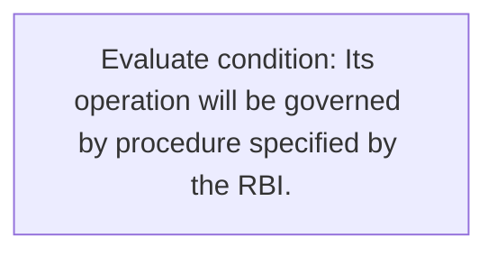
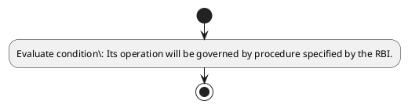

# Chapter 4 / Section 4.91: Diamond & Jewellery Dollar Accounts

**Chapter Title:** Duty Exemption / Remission Schemes

**Pages:** 53

**Purpose:** 4.91 Diamond & Jewellery Dollar Accounts
Policy for Diamond and Jewellery Dollar Accounts is given in paragraph 4.50
of FTP.

**Purpose Thanglish:** Indha Diamond & Jewellery Dollar Accounts section-la, 4.91 Diamond & Jewellery Dollar Accounts
Policy for Diamond and Jewellery Dollar Accounts is given in paragraph 4.50
of FTP.

**Summary:** 4.91 Diamond & Jewellery Dollar Accounts
Policy for Diamond and Jewellery Dollar Accounts is given in paragraph 4.50
of FTP. Its operation will be governed by procedure specified by the RBI.

**Business Meaning:** 4.91 Diamond & Jewellery Dollar Accounts
Policy for Diamond and Jewellery Dollar Accounts is given in paragraph 4.50
of FTP.

**Business Explanation:** 4.91 Diamond & Jewellery Dollar Accounts
Policy for Diamond and Jewellery Dollar Accounts is given in paragraph 4.50
of FTP. Its operation will be governed by procedure specified by the RBI.

**Business Explanation Thanglish:** Indha Diamond & Jewellery Dollar Accounts section-la, 4.91 Diamond & Jewellery Dollar Accounts
Policy for Diamond and Jewellery Dollar Accounts is given in paragraph 4.50
of FTP. Its operation will be governed by procedure specified by the RBI.

## Business Logic
- None identified

## Business Rules
- rule_id=CH4-SEC4_91-R001, rule_description=4.91 Diamond & Jewellery Dollar Accounts
Policy for Diamond and Jewellery Dollar Accounts is given in paragraph 4.50
of FTP. Its operation will be governed by procedure specified by the RBI., trigger=Diamond & Jewellery Dollar Accounts, condition=Its operation will be governed by procedure specified by the RBI., validation=Not explicitly covered in uploaded documents., action=Manual review required., exception=No explicit exception found in uploaded documents., output=DEKAI should produce a compliance decision for 4.91 - Diamond & Jewellery Dollar Accounts.

## Conditions
- Its operation will be governed by procedure specified by the RBI.

## Condition Logic
- id=4.4.91.1, if=Its operation will be governed by procedure specified by the RBI., then=Route for review, source=Its operation will be governed by procedure specified by the RBI.

## Validations
- None identified

## Exceptions
- None identified

## Dependencies
- 4.50

## Authorities
- None identified

## Required Documents
- None identified

## Timelines
- None identified

## Actions
- None identified

## Workflow
- Evaluate condition: Its operation will be governed by procedure specified by the RBI.

## Workflow ASCII
```text
Diamond & Jewellery Dollar Accounts
Evaluate condition: Its operation will be governed by procedure specified by the RBI.
```

## Decision Tree
- IF section 4.91 applies THEN proceed with standard DGFT workflow

## Decision Tree ASCII
```text
Diamond & Jewellery Dollar Accounts Decision
IF section 4.91 applies THEN proceed with standard DGFT workflow
```

## Examples
- User asks to process Diamond & Jewellery Dollar Accounts; the platform checks conditions, validations, and documents before action.

**Real-world Example:** Example: an importer or exporter invokes Diamond & Jewellery Dollar Accounts, submits the prescribed DGFT records, and DEKAI uses the extracted rules to follow the diamond & jewellery dollar accounts process.

**Real-world Example Thanglish:** Indha Diamond & Jewellery Dollar Accounts section-la, Example: an importer or exporter invokes Diamond & Jewellery Dollar Accounts, submits the prescribed DGFT records, and DEKAI uses the extracted rules to follow the diamond & jewellery dollar accounts process.

## AI Rules
- None identified

## Database Fields
- name=section_code, type=string, required=True, source=parsed_section_heading
- name=section_title, type=string, required=True, source=parsed_section_heading
- name=for_flag, type=boolean, required=False, source=keyword:for
- name=and_flag, type=boolean, required=False, source=keyword:and
- name=ftp_flag, type=boolean, required=False, source=keyword:FTP
- name=its_flag, type=boolean, required=False, source=keyword:Its
- name=the_flag, type=boolean, required=False, source=keyword:the
- name=rbi_flag, type=boolean, required=False, source=keyword:RBI
- name=will_flag, type=boolean, required=False, source=keyword:will
- name=given_flag, type=boolean, required=False, source=keyword:given

## API Requirements
- method=GET, path=/api/dgft/sections/4.91, purpose=Retrieve knowledge payload for section 4.91, query_params=['include=workflow,decision_tree,validations'], response_fields=['section', 'title', 'summary', 'conditions', 'validations', 'exceptions', 'workflow', 'decision_tree']
- method=POST, path=/api/dgft/Diamond-Jewellery-Dollar-Accounts/validate, purpose=Validate inputs and documents for Diamond & Jewellery Dollar Accounts, request_fields=['section_code', 'section_title'], response_fields=['status', 'errors', 'warnings', 'next_actions']

## UI Screens
- screen_id=Diamond_Jewellery_Dollar_Accounts_overview, name=Diamond & Jewellery Dollar Accounts Overview, purpose=Show section summary, authority, timeline, and eligibility cues., widgets=['summary_card', 'conditions_table', 'authority_badges', 'timeline_panel']
- screen_id=Diamond_Jewellery_Dollar_Accounts_submission, name=Diamond & Jewellery Dollar Accounts Submission, purpose=Capture applicant data and supporting documents., widgets=['dynamic_form', 'document_uploader', 'validation_panel', 'next_action_footer'], fields=['section_code', 'section_title', 'for_flag', 'and_flag', 'ftp_flag', 'its_flag', 'the_flag', 'rbi_flag']

## Error Messages
- Validation failed because the section requirements were not fully met.

## FAQ
- question_en=What is the purpose of section 4.91?, answer_en=4.91 Diamond & Jewellery Dollar Accounts
Policy for Diamond and Jewellery Dollar Accounts is given in paragraph 4.50
of FTP. Its operation will be governed by procedure specified by the RBI., question_thanglish=Indha Diamond & Jewellery Dollar Accounts section-la, What is the purpose of section 4.91?, answer_thanglish=Indha Diamond & Jewellery Dollar Accounts section-la, 4.91 Diamond & Jewellery Dollar Accounts
Policy for Diamond and Jewellery Dollar Accounts is given in paragraph 4.50
of FTP. Its operation will be governed by procedure specified by the RBI.
- question_en=What documents are required under Diamond & Jewellery Dollar Accounts?, answer_en=Not explicitly covered in uploaded documents., question_thanglish=Indha Diamond & Jewellery Dollar Accounts section-la, What documents are required under Diamond & Jewellery Dollar Accounts?, answer_thanglish=Indha Diamond & Jewellery Dollar Accounts section-la, Not explicitly covered in uploaded documents.
- question_en=Which authority handles Diamond & Jewellery Dollar Accounts?, answer_en=Not explicitly covered in uploaded documents., question_thanglish=Indha Diamond & Jewellery Dollar Accounts section-la, Which authority handles Diamond & Jewellery Dollar Accounts?, answer_thanglish=Indha Diamond & Jewellery Dollar Accounts section-la, Not explicitly covered in uploaded documents.

## Questions Users May Ask
- What does Diamond & Jewellery Dollar Accounts require?
- Which documents are needed for Diamond & Jewellery Dollar Accounts?
- How does DEKAI validate Diamond & Jewellery Dollar Accounts requests?

## Expected AI Answers
- Diamond & Jewellery Dollar Accounts requires the platform to interpret the section text, apply the extracted business rules, and present the correct next action.
- Required documents are inferred from the section text: no explicit documents were detected.
- DEKAI validates Diamond & Jewellery Dollar Accounts by checking conditions, required documents, authority references, and exception clauses before recommending an outcome.

## AI Q&A Examples
- question_en=User asks: How do I comply with Diamond & Jewellery Dollar Accounts?, answer_en=AI answers: DEKAI should evaluate section 4.91, apply the extracted rules, and guide the user through Evaluate condition: Its operation will be governed by procedure specified by the RBI.., question_thanglish=Indha Diamond & Jewellery Dollar Accounts section-la, User asks: How do I comply with Diamond & Jewellery Dollar Accounts?, answer_thanglish=Indha Diamond & Jewellery Dollar Accounts section-la, AI answers: DEKAI should evaluate section 4.91, apply the extracted rules, and guide the user through Evaluate condition: Its operation will be governed by procedure specified by the RBI..
- question_en=User asks: Which validations apply to Diamond & Jewellery Dollar Accounts?, answer_en=AI answers: Applicable validations are not explicitly covered in the uploaded documents., question_thanglish=Indha Diamond & Jewellery Dollar Accounts section-la, User asks: Which validations apply to Diamond & Jewellery Dollar Accounts?, answer_thanglish=Indha Diamond & Jewellery Dollar Accounts section-la, AI answers: Applicable validations are not explicitly covered in the uploaded documents.

## DEKAI AI Implementation Notes
- Capture chapter 4, section 4.91, title, and page references as immutable knowledge metadata.
- Bind validations for Diamond & Jewellery Dollar Accounts into a rule engine keyed by the rule IDs extracted for this section.
- Show contextual links to related sections: 4.50.

## DEKAI AI Implementation Notes Thanglish
- Indha Diamond & Jewellery Dollar Accounts section-la, Capture chapter 4, section 4.91, title, and page references as immutable knowledge metadata.
- Indha Diamond & Jewellery Dollar Accounts section-la, Bind validations for Diamond & Jewellery Dollar Accounts into a rule engine keyed by the rule IDs extracted for this section.
- Indha Diamond & Jewellery Dollar Accounts section-la, Show contextual links to related sections: 4.50.

## AI Metadata
- Keywords: for, and, FTP, Its, the, RBI, will, given, Dollar, Policy, Diamond, Accounts, governed, Jewellery, paragraph, operation, procedure, specified
- Search Keywords: for, and, FTP, Its, the, RBI, will, given, Dollar, Policy, Diamond, Accounts, governed, Jewellery, paragraph, operation, procedure, specified
- Intent: Provide knowledge guidance for Diamond & Jewellery Dollar Accounts.
- Tags: 4.91, Diamond & Jewellery Dollar Accounts, dgft
- Related Sections: 4.50
- Related Chapters: 
- Related Rules: 

## Mermaid


## PlantUML

