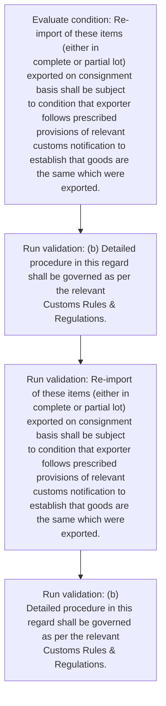
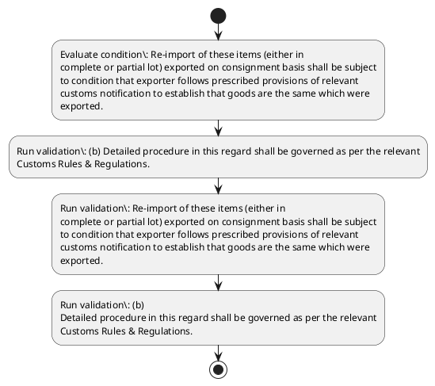

# Chapter 4 / Section 4.92: Export and import of Diamond, Gemstone & Jewellery on

**Chapter Title:** Duty Exemption / Remission Schemes

**Pages:** 53

**Purpose:** 4.92 Export and import of Diamond, Gemstone & Jewellery on
consignment basis
(a) Policy for export and import of diamond, gemstone and jewellery on
consignment basis is given in paragraph 4.53 of FTP.

**Purpose Thanglish:** Indha Export and import of Diamond, Gemstone & Jewellery on section-la, 4.92 export and import of Diamond, Gemstone & Jewellery on
consignment basis
(a) Policy for export and import of diamond, gemstone and jewellery on
consignment basis is given in paragraph 4.53 of FTP.

**Summary:** 4.92 Export and import of Diamond, Gemstone & Jewellery on
consignment basis
(a) Policy for export and import of diamond, gemstone and jewellery on
consignment basis is given in paragraph 4.53 of FTP. (b) Detailed procedure in this regard shall be governed as per the relevant
Customs Rules & Regulations. Re-import of these items (either in
complete or partial lot) exported on consignment basis shall be subject
to condition that exporter follows prescribed provisions of relevant
customs notification to establish that goods are the same which were
exported.

**Business Meaning:** Export and import of Diamond, Gemstone & Jewellery on governs how DGFT business controls should be applied, validated, and enforced.

**Business Explanation:** Export and import of Diamond, Gemstone & Jewellery on explains the operating rule set that DEKAI should enforce. Key control points include (b) Detailed procedure in this regard shall be governed as per the relevant
Customs Rules & Regulations.

**Business Explanation Thanglish:** Indha Export and import of Diamond, Gemstone & Jewellery on section-la, export and import of Diamond, Gemstone & Jewellery on explains the operating rule set that DEKAI should enforce. Key control points include (b) Detailed procedure in this regard kandippa be governed as per the relevant
Customs Rules & Regulations.

## Business Logic
- (b) Detailed procedure in this regard shall be governed as per the relevant
Customs Rules & Regulations.
- Re-import of these items (either in
complete or partial lot) exported on consignment basis shall be subject
to condition that exporter follows prescribed provisions of relevant
customs notification to establish that goods are the same which were
exported.
- (b)
Detailed procedure in this regard shall be governed as per the relevant
Customs Rules & Regulations.

## Business Rules
- rule_id=CH4-SEC4_92-R001, rule_description=(b) Detailed procedure in this regard shall be governed as per the relevant
Customs Rules & Regulations., trigger=Export and import of Diamond, Gemstone & Jewellery on, condition=Re-import of these items (either in
complete or partial lot) exported on consignment basis shall be subject
to condition that exporter follows prescribed provisions of relevant
customs notification to establish that goods are the same which were
exported., validation=(b) Detailed procedure in this regard shall be governed as per the relevant
Customs Rules & Regulations., action=Manual review required., exception=No explicit exception found in uploaded documents., output=DEKAI should produce a compliance decision for 4.92 - Export and import of Diamond, Gemstone & Jewellery on.
- rule_id=CH4-SEC4_92-R002, rule_description=Re-import of these items (either in
complete or partial lot) exported on consignment basis shall be subject
to condition that exporter follows prescribed provisions of relevant
customs notification to establish that goods are the same which were
exported., trigger=Export and import of Diamond, Gemstone & Jewellery on, condition=Re-import of these items (either in
complete or partial lot) exported on consignment basis shall be subject
to condition that exporter follows prescribed provisions of relevant
customs notification to establish that goods are the same which were
exported., validation=Re-import of these items (either in
complete or partial lot) exported on consignment basis shall be subject
to condition that exporter follows prescribed provisions of relevant
customs notification to establish that goods are the same which were
exported., action=Manual review required., exception=No explicit exception found in uploaded documents., output=DEKAI should produce a compliance decision for 4.92 - Export and import of Diamond, Gemstone & Jewellery on.
- rule_id=CH4-SEC4_92-R003, rule_description=(b)
Detailed procedure in this regard shall be governed as per the relevant
Customs Rules & Regulations., trigger=Export and import of Diamond, Gemstone & Jewellery on, condition=Re-import of these items (either in
complete or partial lot) exported on consignment basis shall be subject
to condition that exporter follows prescribed provisions of relevant
customs notification to establish that goods are the same which were
exported., validation=(b)
Detailed procedure in this regard shall be governed as per the relevant
Customs Rules & Regulations., action=Manual review required., exception=No explicit exception found in uploaded documents., output=DEKAI should produce a compliance decision for 4.92 - Export and import of Diamond, Gemstone & Jewellery on.

## Conditions
- Re-import of these items (either in
complete or partial lot) exported on consignment basis shall be subject
to condition that exporter follows prescribed provisions of relevant
customs notification to establish that goods are the same which were
exported.

## Condition Logic
- id=4.4.92.1, if=Re-import of these items (either in
complete or partial lot) exported on consignment basis shall be subject
to condition that exporter follows prescribed provisions of relevant
customs notification to establish that goods are the same which were
exported., then=Route for review, source=Re-import of these items (either in
complete or partial lot) exported on consignment basis shall be subject
to condition that exporter follows prescribed provisions of relevant
customs notification to establish that goods are the same which were
exported.

## Validations
- (b) Detailed procedure in this regard shall be governed as per the relevant
Customs Rules & Regulations.
- Re-import of these items (either in
complete or partial lot) exported on consignment basis shall be subject
to condition that exporter follows prescribed provisions of relevant
customs notification to establish that goods are the same which were
exported.
- (b)
Detailed procedure in this regard shall be governed as per the relevant
Customs Rules & Regulations.

## Exceptions
- None identified

## Dependencies
- 4.53
- 2
- 3
- 4
- 5

## Authorities
- Customs

## Required Documents
- None identified

## Timelines
- None identified

## Actions
- None identified

## Workflow
- Evaluate condition: Re-import of these items (either in
complete or partial lot) exported on consignment basis shall be subject
to condition that exporter follows prescribed provisions of relevant
customs notification to establish that goods are the same which were
exported.
- Run validation: (b) Detailed procedure in this regard shall be governed as per the relevant
Customs Rules & Regulations.
- Run validation: Re-import of these items (either in
complete or partial lot) exported on consignment basis shall be subject
to condition that exporter follows prescribed provisions of relevant
customs notification to establish that goods are the same which were
exported.
- Run validation: (b)
Detailed procedure in this regard shall be governed as per the relevant
Customs Rules & Regulations.

## Workflow ASCII
```text
Export and import of Diamond, Gemstone & Jewellery on
Evaluate condition: Re-import of these items (either in
complete or partial lot) exported on consignment basis shall be subject
to condition that exporter follows prescribed provisions of relevant
customs notification to establish that goods are the same which were
exported.
   |
   v
Run validation: (b) Detailed procedure in this regard shall be governed as per the relevant
Customs Rules & Regulations.
   |
   v
Run validation: Re-import of these items (either in
complete or partial lot) exported on consignment basis shall be subject
to condition that exporter follows prescribed provisions of relevant
customs notification to establish that goods are the same which were
exported.
   |
   v
Run validation: (b)
Detailed procedure in this regard shall be governed as per the relevant
Customs Rules & Regulations.
```

## Decision Tree
- IF section 4.92 applies THEN proceed with standard DGFT workflow

## Decision Tree ASCII
```text
Export and import of Diamond, Gemstone & Jewellery on Decision
IF section 4.92 applies THEN proceed with standard DGFT workflow
```

## Examples
- User asks to process Export and import of Diamond, Gemstone & Jewellery on; the platform checks conditions, validations, and documents before action.

**Real-world Example:** Example: an importer or exporter invokes Export and import of Diamond, Gemstone & Jewellery on, submits the prescribed DGFT records, and DEKAI uses the extracted rules to follow the export and import of diamond, gemstone & jewellery on process.

**Real-world Example Thanglish:** Indha Export and import of Diamond, Gemstone & Jewellery on section-la, Example: an importer or exporter invokes export and import of Diamond, Gemstone & Jewellery on, submits the prescribed DGFT records, and DEKAI uses the extracted rules to follow the export and import of diamond, gemstone & jewellery on process.

## AI Rules
- IF detected context matches section rule THEN enforce: (b) Detailed procedure in this regard shall be governed as per the relevant
Customs Rules & Regulations.
- IF detected context matches section rule THEN enforce: Re-import of these items (either in
complete or partial lot) exported on consignment basis shall be subject
to condition that exporter follows prescribed provisions of relevant
customs notification to establish that goods are the same which were
exported.
- IF detected context matches section rule THEN enforce: (b)
Detailed procedure in this regard shall be governed as per the relevant
Customs Rules & Regulations.

## Database Fields
- name=section_code, type=string, required=True, source=parsed_section_heading
- name=section_title, type=string, required=True, source=parsed_section_heading
- name=and_flag, type=boolean, required=False, source=keyword:and
- name=for_flag, type=boolean, required=False, source=keyword:for
- name=ftp_flag, type=boolean, required=False, source=keyword:FTP
- name=per_flag, type=boolean, required=False, source=keyword:per
- name=the_flag, type=boolean, required=False, source=keyword:the
- name=lot_flag, type=boolean, required=False, source=keyword:lot
- name=are_flag, type=boolean, required=False, source=keyword:are
- name=this_flag, type=boolean, required=False, source=keyword:this

## API Requirements
- method=GET, path=/api/dgft/sections/4.92, purpose=Retrieve knowledge payload for section 4.92, query_params=['include=workflow,decision_tree,validations'], response_fields=['section', 'title', 'summary', 'conditions', 'validations', 'exceptions', 'workflow', 'decision_tree']
- method=POST, path=/api/dgft/Export-and-import-of-Diamond-Gemstone-Jewellery-on/validate, purpose=Validate inputs and documents for Export and import of Diamond, Gemstone & Jewellery on, request_fields=['section_code', 'section_title'], response_fields=['status', 'errors', 'warnings', 'next_actions']

## UI Screens
- screen_id=Export_and_import_of_Diamond_Gemstone_Jewellery_on_overview, name=Export and import of Diamond, Gemstone & Jewellery on Overview, purpose=Show section summary, authority, timeline, and eligibility cues., widgets=['summary_card', 'conditions_table', 'authority_badges', 'timeline_panel']
- screen_id=Export_and_import_of_Diamond_Gemstone_Jewellery_on_submission, name=Export and import of Diamond, Gemstone & Jewellery on Submission, purpose=Capture applicant data and supporting documents., widgets=['dynamic_form', 'document_uploader', 'validation_panel', 'next_action_footer'], fields=['section_code', 'section_title', 'and_flag', 'for_flag', 'ftp_flag', 'per_flag', 'the_flag', 'lot_flag']

## Error Messages
- Validation failed because the section requirements were not fully met.

## FAQ
- question_en=What is the purpose of section 4.92?, answer_en=Export and import of Diamond, Gemstone & Jewellery on explains the operating rule set that DEKAI should enforce. Key control points include (b) Detailed procedure in this regard shall be governed as per the relevant
Customs Rules & Regulations., question_thanglish=Indha Export and import of Diamond, Gemstone & Jewellery on section-la, What is the purpose of section 4.92?, answer_thanglish=Indha Export and import of Diamond, Gemstone & Jewellery on section-la, export and import of Diamond, Gemstone & Jewellery on explains the operating rule set that DEKAI should enforce. Key control points include (b) Detailed procedure in this regard kandippa be governed as per the relevant
Customs Rules & Regulations.
- question_en=What documents are required under Export and import of Diamond, Gemstone & Jewellery on?, answer_en=Not explicitly covered in uploaded documents., question_thanglish=Indha Export and import of Diamond, Gemstone & Jewellery on section-la, What documents are required under export and import of Diamond, Gemstone & Jewellery on?, answer_thanglish=Indha Export and import of Diamond, Gemstone & Jewellery on section-la, Not explicitly covered in uploaded documents.
- question_en=Which authority handles Export and import of Diamond, Gemstone & Jewellery on?, answer_en=Customs, question_thanglish=Indha Export and import of Diamond, Gemstone & Jewellery on section-la, Which authority handles export and import of Diamond, Gemstone & Jewellery on?, answer_thanglish=Indha Export and import of Diamond, Gemstone & Jewellery on section-la, Customs

## Questions Users May Ask
- What does Export and import of Diamond, Gemstone & Jewellery on require?
- Which documents are needed for Export and import of Diamond, Gemstone & Jewellery on?
- How does DEKAI validate Export and import of Diamond, Gemstone & Jewellery on requests?

## Expected AI Answers
- Export and import of Diamond, Gemstone & Jewellery on requires the platform to interpret the section text, apply the extracted business rules, and present the correct next action.
- Required documents are inferred from the section text: no explicit documents were detected.
- DEKAI validates Export and import of Diamond, Gemstone & Jewellery on by checking conditions, required documents, authority references, and exception clauses before recommending an outcome.

## AI Q&A Examples
- question_en=User asks: How do I comply with Export and import of Diamond, Gemstone & Jewellery on?, answer_en=AI answers: DEKAI should evaluate section 4.92, apply the extracted rules, and guide the user through Evaluate condition: Re-import of these items (either in
complete or partial lot) exported on consignment basis shall be subject
to condition that exporter follows prescribed provisions of relevant
customs notification to establish that goods are the same which were
exported.., question_thanglish=Indha Export and import of Diamond, Gemstone & Jewellery on section-la, User asks: How do I comply with export and import of Diamond, Gemstone & Jewellery on?, answer_thanglish=Indha Export and import of Diamond, Gemstone & Jewellery on section-la, AI answers: DEKAI should evaluate section 4.92, apply the extracted rules, and guide the user through Evaluate condition: Re-import of these items (either in
complete or partial lot) exported on consignment basis kandippa be subject
to condition that exporter follows prescribed provisions of relevant
customs notification to establish that goods are the same which were
exported..
- question_en=User asks: Which validations apply to Export and import of Diamond, Gemstone & Jewellery on?, answer_en=AI answers: Applicable validations are (b) Detailed procedure in this regard shall be governed as per the relevant
Customs Rules & Regulations., Re-import of these items (either in
complete or partial lot) exported on consignment basis shall be subject
to condition that exporter follows prescribed provisions of relevant
customs notification to establish that goods are the same which were
exported., (b)
Detailed procedure in this regard shall be governed as per the relevant
Customs Rules & Regulations., question_thanglish=Indha Export and import of Diamond, Gemstone & Jewellery on section-la, User asks: Which validations apply to export and import of Diamond, Gemstone & Jewellery on?, answer_thanglish=Indha Export and import of Diamond, Gemstone & Jewellery on section-la, AI answers: Applicable validations are (b) Detailed procedure in this regard kandippa be governed as per the relevant
Customs Rules & Regulations., Re-import of these items (either in
complete or partial lot) exported on consignment basis kandippa be subject
to condition that exporter follows prescribed provisions of relevant
customs notification to establish that goods are the same which were
exported., (b)
Detailed procedure in this regard kandippa be governed as per the relevant
Customs Rules & Regulations.

## DEKAI AI Implementation Notes
- Capture chapter 4, section 4.92, title, and page references as immutable knowledge metadata.
- Bind validations for Export and import of Diamond, Gemstone & Jewellery on into a rule engine keyed by the rule IDs extracted for this section.
- Route escalations or approvals to: Customs.
- Show contextual links to related sections: 4.53, 2, 3, 4, 5.

## DEKAI AI Implementation Notes Thanglish
- Indha Export and import of Diamond, Gemstone & Jewellery on section-la, Capture chapter 4, section 4.92, title, and page references as immutable knowledge metadata.
- Indha Export and import of Diamond, Gemstone & Jewellery on section-la, Bind validations for export and import of Diamond, Gemstone & Jewellery on into a rule engine keyed by the rule IDs extracted for this section.
- Indha Export and import of Diamond, Gemstone & Jewellery on section-la, Route escalations or approvals to: Customs.
- Indha Export and import of Diamond, Gemstone & Jewellery on section-la, Show contextual links to related sections: 4.53, 2, 3, 4, 5.

## AI Metadata
- Keywords: and, for, FTP, per, the, lot, are, this, that, same, were, basis, given, shall, Rules, these, items, goods, which, Export
- Search Keywords: and, for, FTP, per, the, lot, are, this, that, same, were, basis, given, shall, Rules, these, items, goods, which, Export
- Intent: Provide knowledge guidance for Export and import of Diamond, Gemstone & Jewellery on.
- Tags: 4.92, Export and import of Diamond, Gemstone & Jewellery on, business-rule, dgft
- Related Sections: 4.53, 2, 3, 4, 5
- Related Chapters: 
- Related Rules: (b) Detailed procedure in this regard shall be governed as per the relevant
Customs Rules & Regulations., Re-import of these items (either in
complete or partial lot) exported on consignment basis shall be subject
to condition that exporter follows prescribed provisions of relevant
customs notification to establish that goods are the same which were
exported., (b)
Detailed procedure in this regard shall be governed as per the relevant
Customs Rules & Regulations.

## Mermaid


## PlantUML

