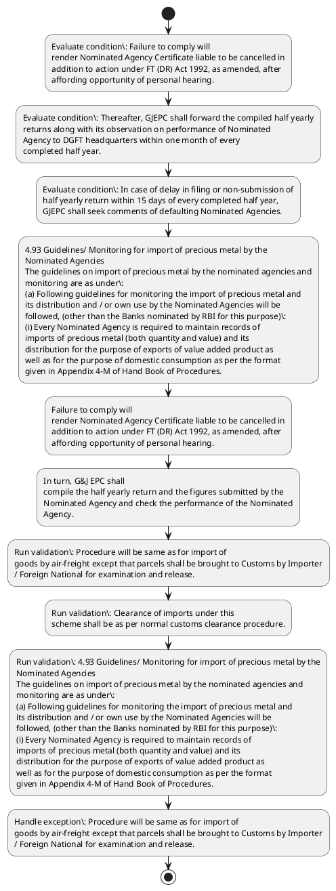

# Chapter 4 / Section 4.93: Guidelines/ Monitoring for import of precious metal by the

**Chapter Title:** Duty Exemption / Remission Schemes

**Pages:** 53, 54

**Purpose:** 4.93 Guidelines/ Monitoring for import of precious metal by the
pg.

**Purpose Thanglish:** Indha Guidelines/ Monitoring for import of precious metal by the section-la, 4.93 Guidelines/ Monitoring for import of precious metal by the
pg.

**Summary:** 4.93 Guidelines/ Monitoring for import of precious metal by the
pg. 128
pg. 128
Personal carriage of gems & jewellery import parcels by an Indian
importer/Foreign National may be permitted into all EOUs/SEZ units and all
firms in DTA through airports in Delhi, Mumbai, Kolkata, Chennai, Bangalore,
Hyderabad, Jaipur and Ahmedabad.

**Business Meaning:** Guidelines/ Monitoring for import of precious metal by the governs how DGFT business controls should be applied, validated, and enforced.

**Business Explanation:** Guidelines/ Monitoring for import of precious metal by the explains the operating rule set that DEKAI should enforce. Key control points include Procedure will be same as for import of
goods by air-freight except that parcels shall be brought to Customs by Importer
/ Foreign National for examination and release. The section also drives actions such as 4.93 Guidelines/ Monitoring for import of precious metal by the
Nominated Agencies
The guidelines on import of precious metal by the nominated agencies and
monitoring are as under:
(a) Following guidelines for monitoring the import of precious metal and
its distribution and / or own use by the Nominated Agencies will be
followed, (other than the Banks nominated by RBI for this purpose):
(i) Every Nominated Agency is required to maintain records of
imports of precious metal (both quantity and value) and its
distribution for the purpose of exports of value added product as
well as for the purpose of domestic consumption as per the format
given in Appendix 4-M of Hand Book of Procedures..

**Business Explanation Thanglish:** Indha Guidelines/ Monitoring for import of precious metal by the section-la, Guidelines/ Monitoring for import of precious metal by the explains the operating rule set that DEKAI should enforce. Key control points include Procedure will be same as for import of
goods by air-freight except that parcels kandippa be brought to Customs by Importer
/ Foreign National for examination and release. The section also drives actions such as 4.93 Guidelines/ Monitoring for import of precious metal by the
Nominated Agencies
The guidelines on import of precious metal by the nominated agencies and
monitoring are as under:
(a) Following guidelines for monitoring the import of precious metal and
its distribution and / or own use by the Nominated Agencies will be
followed, (other than the Banks nominated by RBI for this purpose):
(i) Every Nominated Agency is required to maintain records of
imports of precious metal (both quantity and value) and its
distribution for the purpose of exports of value added product as
well as for the purpose of domestic consumption as per the format
given in Appendix 4-M of Hand Book of Procedures..

## Business Logic
- Procedure will be same as for import of
goods by air-freight except that parcels shall be brought to Customs by Importer
/ Foreign National for examination and release.
- Clearance of imports under this
scheme shall be as per normal customs clearance procedure.
- 4.93 Guidelines/ Monitoring for import of precious metal by the
Nominated Agencies
The guidelines on import of precious metal by the nominated agencies and
monitoring are as under:
(a) Following guidelines for monitoring the import of precious metal and
its distribution and / or own use by the Nominated Agencies will be
followed, (other than the Banks nominated by RBI for this purpose):
(i) Every Nominated Agency is required to maintain records of
imports of precious metal (both quantity and value) and its
distribution for the purpose of exports of value added product as
well as for the purpose of domestic consumption as per the format
given in Appendix 4-M of Hand Book of Procedures.
- Nominated Agencies shall file half yearly return as per
format given in Appendix 4-M of Handbook of Procedures, to the
Gems & Jewellery Export Promotion Council (GJEPC), Mumbai
within 15 days of every completed half year.
- In turn, G&J EPC shall
compile the half yearly return and the figures submitted by the
Nominated Agency and check the performance of the Nominated
Agency.
- Thereafter, GJEPC shall forward the compiled half yearly
returns along with its observation on performance of Nominated
Agency to DGFT headquarters within one month of every
completed half year.
- In case of delay in filing or non-submission of
half yearly return within 15 days of every completed half year,
GJEPC shall seek comments of defaulting Nominated Agencies.

## Business Rules
- rule_id=CH4-SEC4_93-R001, rule_description=Procedure will be same as for import of
goods by air-freight except that parcels shall be brought to Customs by Importer
/ Foreign National for examination and release., trigger=Guidelines/ Monitoring for import of precious metal by the, condition=Failure to comply will
render Nominated Agency Certificate liable to be cancelled in
addition to action under FT (DR) Act 1992, as amended, after
affording opportunity of personal hearing., validation=Procedure will be same as for import of
goods by air-freight except that parcels shall be brought to Customs by Importer
/ Foreign National for examination and release., action=4.93 Guidelines/ Monitoring for import of precious metal by the
Nominated Agencies
The guidelines on import of precious metal by the nominated agencies and
monitoring are as under:
(a) Following guidelines for monitoring the import of precious metal and
its distribution and / or own use by the Nominated Agencies will be
followed, (other than the Banks nominated by RBI for this purpose):
(i) Every Nominated Agency is required to maintain records of
imports of precious metal (both quantity and value) and its
distribution for the purpose of exports of value added product as
well as for the purpose of domestic consumption as per the format
given in Appendix 4-M of Hand Book of Procedures., exception=Procedure will be same as for import of
goods by air-freight except that parcels shall be brought to Customs by Importer
/ Foreign National for examination and release., output=DEKAI should produce a compliance decision for 4.93 - Guidelines/ Monitoring for import of precious metal by the.
- rule_id=CH4-SEC4_93-R002, rule_description=Clearance of imports under this
scheme shall be as per normal customs clearance procedure., trigger=Guidelines/ Monitoring for import of precious metal by the, condition=Thereafter, GJEPC shall forward the compiled half yearly
returns along with its observation on performance of Nominated
Agency to DGFT headquarters within one month of every
completed half year., validation=Clearance of imports under this
scheme shall be as per normal customs clearance procedure., action=Failure to comply will
render Nominated Agency Certificate liable to be cancelled in
addition to action under FT (DR) Act 1992, as amended, after
affording opportunity of personal hearing., exception=4.93 Guidelines/ Monitoring for import of precious metal by the
Nominated Agencies
The guidelines on import of precious metal by the nominated agencies and
monitoring are as under:
(a) Following guidelines for monitoring the import of precious metal and
its distribution and / or own use by the Nominated Agencies will be
followed, (other than the Banks nominated by RBI for this purpose):
(i) Every Nominated Agency is required to maintain records of
imports of precious metal (both quantity and value) and its
distribution for the purpose of exports of value added product as
well as for the purpose of domestic consumption as per the format
given in Appendix 4-M of Hand Book of Procedures., output=DEKAI should produce a compliance decision for 4.93 - Guidelines/ Monitoring for import of precious metal by the.
- rule_id=CH4-SEC4_93-R003, rule_description=4.93 Guidelines/ Monitoring for import of precious metal by the
Nominated Agencies
The guidelines on import of precious metal by the nominated agencies and
monitoring are as under:
(a) Following guidelines for monitoring the import of precious metal and
its distribution and / or own use by the Nominated Agencies will be
followed, (other than the Banks nominated by RBI for this purpose):
(i) Every Nominated Agency is required to maintain records of
imports of precious metal (both quantity and value) and its
distribution for the purpose of exports of value added product as
well as for the purpose of domestic consumption as per the format
given in Appendix 4-M of Hand Book of Procedures., trigger=Guidelines/ Monitoring for import of precious metal by the, condition=In case of delay in filing or non-submission of
half yearly return within 15 days of every completed half year,
GJEPC shall seek comments of defaulting Nominated Agencies., validation=4.93 Guidelines/ Monitoring for import of precious metal by the
Nominated Agencies
The guidelines on import of precious metal by the nominated agencies and
monitoring are as under:
(a) Following guidelines for monitoring the import of precious metal and
its distribution and / or own use by the Nominated Agencies will be
followed, (other than the Banks nominated by RBI for this purpose):
(i) Every Nominated Agency is required to maintain records of
imports of precious metal (both quantity and value) and its
distribution for the purpose of exports of value added product as
well as for the purpose of domestic consumption as per the format
given in Appendix 4-M of Hand Book of Procedures., action=In turn, G&J EPC shall
compile the half yearly return and the figures submitted by the
Nominated Agency and check the performance of the Nominated
Agency., exception=4.93 Guidelines/ Monitoring for import of precious metal by the
Nominated Agencies
The guidelines on import of precious metal by the nominated agencies and
monitoring are as under:
(a) Following guidelines for monitoring the import of precious metal and
its distribution and / or own use by the Nominated Agencies will be
followed, (other than the Banks nominated by RBI for this purpose):
(i) Every Nominated Agency is required to maintain records of
imports of precious metal (both quantity and value) and its
distribution for the purpose of exports of value added product as
well as for the purpose of domestic consumption as per the format
given in Appendix 4-M of Hand Book of Procedures., output=DEKAI should produce a compliance decision for 4.93 - Guidelines/ Monitoring for import of precious metal by the.
- rule_id=CH4-SEC4_93-R004, rule_description=Nominated Agencies shall file half yearly return as per
format given in Appendix 4-M of Handbook of Procedures, to the
Gems & Jewellery Export Promotion Council (GJEPC), Mumbai
within 15 days of every completed half year., trigger=Guidelines/ Monitoring for import of precious metal by the, condition=In case of delay in filing or non-submission of
half yearly return within 15 days of every completed half year,
GJEPC shall seek comments of defaulting Nominated Agencies., validation=Nominated Agencies shall file half yearly return as per
format given in Appendix 4-M of Handbook of Procedures, to the
Gems & Jewellery Export Promotion Council (GJEPC), Mumbai
within 15 days of every completed half year., action=In turn, G&J EPC shall
compile the half yearly return and the figures submitted by the
Nominated Agency and check the performance of the Nominated
Agency., exception=4.93 Guidelines/ Monitoring for import of precious metal by the
Nominated Agencies
The guidelines on import of precious metal by the nominated agencies and
monitoring are as under:
(a) Following guidelines for monitoring the import of precious metal and
its distribution and / or own use by the Nominated Agencies will be
followed, (other than the Banks nominated by RBI for this purpose):
(i) Every Nominated Agency is required to maintain records of
imports of precious metal (both quantity and value) and its
distribution for the purpose of exports of value added product as
well as for the purpose of domestic consumption as per the format
given in Appendix 4-M of Hand Book of Procedures., output=DEKAI should produce a compliance decision for 4.93 - Guidelines/ Monitoring for import of precious metal by the.
- rule_id=CH4-SEC4_93-R005, rule_description=In turn, G&J EPC shall
compile the half yearly return and the figures submitted by the
Nominated Agency and check the performance of the Nominated
Agency., trigger=Guidelines/ Monitoring for import of precious metal by the, condition=In case of delay in filing or non-submission of
half yearly return within 15 days of every completed half year,
GJEPC shall seek comments of defaulting Nominated Agencies., validation=In turn, G&J EPC shall
compile the half yearly return and the figures submitted by the
Nominated Agency and check the performance of the Nominated
Agency., action=In turn, G&J EPC shall
compile the half yearly return and the figures submitted by the
Nominated Agency and check the performance of the Nominated
Agency., exception=4.93 Guidelines/ Monitoring for import of precious metal by the
Nominated Agencies
The guidelines on import of precious metal by the nominated agencies and
monitoring are as under:
(a) Following guidelines for monitoring the import of precious metal and
its distribution and / or own use by the Nominated Agencies will be
followed, (other than the Banks nominated by RBI for this purpose):
(i) Every Nominated Agency is required to maintain records of
imports of precious metal (both quantity and value) and its
distribution for the purpose of exports of value added product as
well as for the purpose of domestic consumption as per the format
given in Appendix 4-M of Hand Book of Procedures., output=DEKAI should produce a compliance decision for 4.93 - Guidelines/ Monitoring for import of precious metal by the.
- rule_id=CH4-SEC4_93-R006, rule_description=Thereafter, GJEPC shall forward the compiled half yearly
returns along with its observation on performance of Nominated
Agency to DGFT headquarters within one month of every
completed half year., trigger=Guidelines/ Monitoring for import of precious metal by the, condition=In case of delay in filing or non-submission of
half yearly return within 15 days of every completed half year,
GJEPC shall seek comments of defaulting Nominated Agencies., validation=Thereafter, GJEPC shall forward the compiled half yearly
returns along with its observation on performance of Nominated
Agency to DGFT headquarters within one month of every
completed half year., action=In turn, G&J EPC shall
compile the half yearly return and the figures submitted by the
Nominated Agency and check the performance of the Nominated
Agency., exception=4.93 Guidelines/ Monitoring for import of precious metal by the
Nominated Agencies
The guidelines on import of precious metal by the nominated agencies and
monitoring are as under:
(a) Following guidelines for monitoring the import of precious metal and
its distribution and / or own use by the Nominated Agencies will be
followed, (other than the Banks nominated by RBI for this purpose):
(i) Every Nominated Agency is required to maintain records of
imports of precious metal (both quantity and value) and its
distribution for the purpose of exports of value added product as
well as for the purpose of domestic consumption as per the format
given in Appendix 4-M of Hand Book of Procedures., output=DEKAI should produce a compliance decision for 4.93 - Guidelines/ Monitoring for import of precious metal by the.
- rule_id=CH4-SEC4_93-R007, rule_description=In case of delay in filing or non-submission of
half yearly return within 15 days of every completed half year,
GJEPC shall seek comments of defaulting Nominated Agencies., trigger=Guidelines/ Monitoring for import of precious metal by the, condition=In case of delay in filing or non-submission of
half yearly return within 15 days of every completed half year,
GJEPC shall seek comments of defaulting Nominated Agencies., validation=In case of delay in filing or non-submission of
half yearly return within 15 days of every completed half year,
GJEPC shall seek comments of defaulting Nominated Agencies., action=In turn, G&J EPC shall
compile the half yearly return and the figures submitted by the
Nominated Agency and check the performance of the Nominated
Agency., exception=4.93 Guidelines/ Monitoring for import of precious metal by the
Nominated Agencies
The guidelines on import of precious metal by the nominated agencies and
monitoring are as under:
(a) Following guidelines for monitoring the import of precious metal and
its distribution and / or own use by the Nominated Agencies will be
followed, (other than the Banks nominated by RBI for this purpose):
(i) Every Nominated Agency is required to maintain records of
imports of precious metal (both quantity and value) and its
distribution for the purpose of exports of value added product as
well as for the purpose of domestic consumption as per the format
given in Appendix 4-M of Hand Book of Procedures., output=DEKAI should produce a compliance decision for 4.93 - Guidelines/ Monitoring for import of precious metal by the.

## Conditions
- Failure to comply will
render Nominated Agency Certificate liable to be cancelled in
addition to action under FT (DR) Act 1992, as amended, after
affording opportunity of personal hearing.
- Thereafter, GJEPC shall forward the compiled half yearly
returns along with its observation on performance of Nominated
Agency to DGFT headquarters within one month of every
completed half year.
- In case of delay in filing or non-submission of
half yearly return within 15 days of every completed half year,
GJEPC shall seek comments of defaulting Nominated Agencies.

## Condition Logic
- id=4.4.93.1, if=Failure to comply will
render Nominated Agency Certificate liable to be cancelled in
addition to action under FT (DR) Act 1992, as amended, after
affording opportunity of personal hearing., then=4.93 Guidelines/ Monitoring for import of precious metal by the
Nominated Agencies
The guidelines on import of precious metal by the nominated agencies and
monitoring are as under:
(a) Following guidelines for monitoring the import of precious metal and
its distribution and / or own use by the Nominated Agencies will be
followed, (other than the Banks nominated by RBI for this purpose):
(i) Every Nominated Agency is required to maintain records of
imports of precious metal (both quantity and value) and its
distribution for the purpose of exports of value added product as
well as for the purpose of domestic consumption as per the format
given in Appendix 4-M of Hand Book of Procedures., source=Failure to comply will
render Nominated Agency Certificate liable to be cancelled in
addition to action under FT (DR) Act 1992, as amended, after
affording opportunity of personal hearing.
- id=4.4.93.2, if=Thereafter, GJEPC shall forward the compiled half yearly
returns along with its observation on performance of Nominated
Agency to DGFT headquarters within one month of every
completed half year., then=4.93 Guidelines/ Monitoring for import of precious metal by the
Nominated Agencies
The guidelines on import of precious metal by the nominated agencies and
monitoring are as under:
(a) Following guidelines for monitoring the import of precious metal and
its distribution and / or own use by the Nominated Agencies will be
followed, (other than the Banks nominated by RBI for this purpose):
(i) Every Nominated Agency is required to maintain records of
imports of precious metal (both quantity and value) and its
distribution for the purpose of exports of value added product as
well as for the purpose of domestic consumption as per the format
given in Appendix 4-M of Hand Book of Procedures., source=Thereafter, GJEPC shall forward the compiled half yearly
returns along with its observation on performance of Nominated
Agency to DGFT headquarters within one month of every
completed half year.
- id=4.4.93.3, if=In case of delay in filing or non-submission of
half yearly return within 15 days of every completed half year,
GJEPC shall seek comments of defaulting Nominated Agencies., then=4.93 Guidelines/ Monitoring for import of precious metal by the
Nominated Agencies
The guidelines on import of precious metal by the nominated agencies and
monitoring are as under:
(a) Following guidelines for monitoring the import of precious metal and
its distribution and / or own use by the Nominated Agencies will be
followed, (other than the Banks nominated by RBI for this purpose):
(i) Every Nominated Agency is required to maintain records of
imports of precious metal (both quantity and value) and its
distribution for the purpose of exports of value added product as
well as for the purpose of domestic consumption as per the format
given in Appendix 4-M of Hand Book of Procedures., source=In case of delay in filing or non-submission of
half yearly return within 15 days of every completed half year,
GJEPC shall seek comments of defaulting Nominated Agencies.

## Validations
- Procedure will be same as for import of
goods by air-freight except that parcels shall be brought to Customs by Importer
/ Foreign National for examination and release.
- Clearance of imports under this
scheme shall be as per normal customs clearance procedure.
- 4.93 Guidelines/ Monitoring for import of precious metal by the
Nominated Agencies
The guidelines on import of precious metal by the nominated agencies and
monitoring are as under:
(a) Following guidelines for monitoring the import of precious metal and
its distribution and / or own use by the Nominated Agencies will be
followed, (other than the Banks nominated by RBI for this purpose):
(i) Every Nominated Agency is required to maintain records of
imports of precious metal (both quantity and value) and its
distribution for the purpose of exports of value added product as
well as for the purpose of domestic consumption as per the format
given in Appendix 4-M of Hand Book of Procedures.
- Nominated Agencies shall file half yearly return as per
format given in Appendix 4-M of Handbook of Procedures, to the
Gems & Jewellery Export Promotion Council (GJEPC), Mumbai
within 15 days of every completed half year.
- In turn, G&J EPC shall
compile the half yearly return and the figures submitted by the
Nominated Agency and check the performance of the Nominated
Agency.
- Thereafter, GJEPC shall forward the compiled half yearly
returns along with its observation on performance of Nominated
Agency to DGFT headquarters within one month of every
completed half year.
- In case of delay in filing or non-submission of
half yearly return within 15 days of every completed half year,
GJEPC shall seek comments of defaulting Nominated Agencies.

## Exceptions
- Procedure will be same as for import of
goods by air-freight except that parcels shall be brought to Customs by Importer
/ Foreign National for examination and release.
- 4.93 Guidelines/ Monitoring for import of precious metal by the
Nominated Agencies
The guidelines on import of precious metal by the nominated agencies and
monitoring are as under:
(a) Following guidelines for monitoring the import of precious metal and
its distribution and / or own use by the Nominated Agencies will be
followed, (other than the Banks nominated by RBI for this purpose):
(i) Every Nominated Agency is required to maintain records of
imports of precious metal (both quantity and value) and its
distribution for the purpose of exports of value added product as
well as for the purpose of domestic consumption as per the format
given in Appendix 4-M of Hand Book of Procedures.

## Dependencies
- None identified

## Authorities
- Customs
- DGFT
- RBI and DGFT
- Agency to DGFT

## Required Documents
- Nominated Agency Certificate

## Timelines
- Failure to comply will
render Nominated Agency Certificate liable to be cancelled in
addition to action under FT (DR) Act 1992, as amended, after
affording opportunity of personal hearing.
- Nominated Agencies shall file half yearly return as per
format given in Appendix 4-M of Handbook of Procedures, to the
Gems & Jewellery Export Promotion Council (GJEPC), Mumbai
within 15 days of every completed half year.
- Thereafter, GJEPC shall forward the compiled half yearly
returns along with its observation on performance of Nominated
Agency to DGFT headquarters within one month of every
completed half year.
- In case of delay in filing or non-submission of
half yearly return within 15 days of every completed half year,
GJEPC shall seek comments of defaulting Nominated Agencies.

## Actions
- 4.93 Guidelines/ Monitoring for import of precious metal by the
Nominated Agencies
The guidelines on import of precious metal by the nominated agencies and
monitoring are as under:
(a) Following guidelines for monitoring the import of precious metal and
its distribution and / or own use by the Nominated Agencies will be
followed, (other than the Banks nominated by RBI for this purpose):
(i) Every Nominated Agency is required to maintain records of
imports of precious metal (both quantity and value) and its
distribution for the purpose of exports of value added product as
well as for the purpose of domestic consumption as per the format
given in Appendix 4-M of Hand Book of Procedures.
- Failure to comply will
render Nominated Agency Certificate liable to be cancelled in
addition to action under FT (DR) Act 1992, as amended, after
affording opportunity of personal hearing.
- In turn, G&J EPC shall
compile the half yearly return and the figures submitted by the
Nominated Agency and check the performance of the Nominated
Agency.

## Workflow
- Evaluate condition: Failure to comply will
render Nominated Agency Certificate liable to be cancelled in
addition to action under FT (DR) Act 1992, as amended, after
affording opportunity of personal hearing.
- Evaluate condition: Thereafter, GJEPC shall forward the compiled half yearly
returns along with its observation on performance of Nominated
Agency to DGFT headquarters within one month of every
completed half year.
- Evaluate condition: In case of delay in filing or non-submission of
half yearly return within 15 days of every completed half year,
GJEPC shall seek comments of defaulting Nominated Agencies.
- 4.93 Guidelines/ Monitoring for import of precious metal by the
Nominated Agencies
The guidelines on import of precious metal by the nominated agencies and
monitoring are as under:
(a) Following guidelines for monitoring the import of precious metal and
its distribution and / or own use by the Nominated Agencies will be
followed, (other than the Banks nominated by RBI for this purpose):
(i) Every Nominated Agency is required to maintain records of
imports of precious metal (both quantity and value) and its
distribution for the purpose of exports of value added product as
well as for the purpose of domestic consumption as per the format
given in Appendix 4-M of Hand Book of Procedures.
- Failure to comply will
render Nominated Agency Certificate liable to be cancelled in
addition to action under FT (DR) Act 1992, as amended, after
affording opportunity of personal hearing.
- In turn, G&J EPC shall
compile the half yearly return and the figures submitted by the
Nominated Agency and check the performance of the Nominated
Agency.
- Run validation: Procedure will be same as for import of
goods by air-freight except that parcels shall be brought to Customs by Importer
/ Foreign National for examination and release.
- Run validation: Clearance of imports under this
scheme shall be as per normal customs clearance procedure.
- Run validation: 4.93 Guidelines/ Monitoring for import of precious metal by the
Nominated Agencies
The guidelines on import of precious metal by the nominated agencies and
monitoring are as under:
(a) Following guidelines for monitoring the import of precious metal and
its distribution and / or own use by the Nominated Agencies will be
followed, (other than the Banks nominated by RBI for this purpose):
(i) Every Nominated Agency is required to maintain records of
imports of precious metal (both quantity and value) and its
distribution for the purpose of exports of value added product as
well as for the purpose of domestic consumption as per the format
given in Appendix 4-M of Hand Book of Procedures.
- Handle exception: Procedure will be same as for import of
goods by air-freight except that parcels shall be brought to Customs by Importer
/ Foreign National for examination and release.

## Workflow ASCII
```text
Guidelines/ Monitoring for import of precious metal by the
Evaluate condition: Failure to comply will
render Nominated Agency Certificate liable to be cancelled in
addition to action under FT (DR) Act 1992, as amended, after
affording opportunity of personal hearing.
   |
   v
Evaluate condition: Thereafter, GJEPC shall forward the compiled half yearly
returns along with its observation on performance of Nominated
Agency to DGFT headquarters within one month of every
completed half year.
   |
   v
Evaluate condition: In case of delay in filing or non-submission of
half yearly return within 15 days of every completed half year,
GJEPC shall seek comments of defaulting Nominated Agencies.
   |
   v
4.93 Guidelines/ Monitoring for import of precious metal by the
Nominated Agencies
The guidelines on import of precious metal by the nominated agencies and
monitoring are as under:
(a) Following guidelines for monitoring the import of precious metal and
its distribution and / or own use by the Nominated Agencies will be
followed, (other than the Banks nominated by RBI for this purpose):
(i) Every Nominated Agency is required to maintain records of
imports of precious metal (both quantity and value) and its
distribution for the purpose of exports of value added product as
well as for the purpose of domestic consumption as per the format
given in Appendix 4-M of Hand Book of Procedures.
   |
   v
Failure to comply will
render Nominated Agency Certificate liable to be cancelled in
addition to action under FT (DR) Act 1992, as amended, after
affording opportunity of personal hearing.
   |
   v
In turn, G&J EPC shall
compile the half yearly return and the figures submitted by the
Nominated Agency and check the performance of the Nominated
Agency.
   |
   v
Run validation: Procedure will be same as for import of
goods by air-freight except that parcels shall be brought to Customs by Importer
/ Foreign National for examination and release.
   |
   v
Run validation: Clearance of imports under this
scheme shall be as per normal customs clearance procedure.
   |
   v
Run validation: 4.93 Guidelines/ Monitoring for import of precious metal by the
Nominated Agencies
The guidelines on import of precious metal by the nominated agencies and
monitoring are as under:
(a) Following guidelines for monitoring the import of precious metal and
its distribution and / or own use by the Nominated Agencies will be
followed, (other than the Banks nominated by RBI for this purpose):
(i) Every Nominated Agency is required to maintain records of
imports of precious metal (both quantity and value) and its
distribution for the purpose of exports of value added product as
well as for the purpose of domestic consumption as per the format
given in Appendix 4-M of Hand Book of Procedures.
   |
   v
Handle exception: Procedure will be same as for import of
goods by air-freight except that parcels shall be brought to Customs by Importer
/ Foreign National for examination and release.
```

## Decision Tree
- IF Failure to comply will
render Nominated Agency Certificate liable to be cancelled in
addition to action under FT (DR) Act 1992, as amended, after
affording opportunity of personal hearing. THEN 4.93 Guidelines/ Monitoring for import of precious metal by the
Nominated Agencies
The guidelines on import of precious metal by the nominated agencies and
monitoring are as under:
(a) Following guidelines for monitoring the import of precious metal and
its distribution and / or own use by the Nominated Agencies will be
followed, (other than the Banks nominated by RBI for this purpose):
(i) Every Nominated Agency is required to maintain records of
imports of precious metal (both quantity and value) and its
distribution for the purpose of exports of value added product as
well as for the purpose of domestic consumption as per the format
given in Appendix 4-M of Hand Book of Procedures.
- IF Thereafter, GJEPC shall forward the compiled half yearly
returns along with its observation on performance of Nominated
Agency to DGFT headquarters within one month of every
completed half year. THEN 4.93 Guidelines/ Monitoring for import of precious metal by the
Nominated Agencies
The guidelines on import of precious metal by the nominated agencies and
monitoring are as under:
(a) Following guidelines for monitoring the import of precious metal and
its distribution and / or own use by the Nominated Agencies will be
followed, (other than the Banks nominated by RBI for this purpose):
(i) Every Nominated Agency is required to maintain records of
imports of precious metal (both quantity and value) and its
distribution for the purpose of exports of value added product as
well as for the purpose of domestic consumption as per the format
given in Appendix 4-M of Hand Book of Procedures.
- IF In case of delay in filing or non-submission of
half yearly return within 15 days of every completed half year,
GJEPC shall seek comments of defaulting Nominated Agencies. THEN 4.93 Guidelines/ Monitoring for import of precious metal by the
Nominated Agencies
The guidelines on import of precious metal by the nominated agencies and
monitoring are as under:
(a) Following guidelines for monitoring the import of precious metal and
its distribution and / or own use by the Nominated Agencies will be
followed, (other than the Banks nominated by RBI for this purpose):
(i) Every Nominated Agency is required to maintain records of
imports of precious metal (both quantity and value) and its
distribution for the purpose of exports of value added product as
well as for the purpose of domestic consumption as per the format
given in Appendix 4-M of Hand Book of Procedures.
- IF exception applies (Procedure will be same as for import of
goods by air-freight except that parcels shall be brought to Customs by Importer
/ Foreign National for examination and release.) THEN route to manual review
- IF exception applies (4.93 Guidelines/ Monitoring for import of precious metal by the
Nominated Agencies
The guidelines on import of precious metal by the nominated agencies and
monitoring are as under:
(a) Following guidelines for monitoring the import of precious metal and
its distribution and / or own use by the Nominated Agencies will be
followed, (other than the Banks nominated by RBI for this purpose):
(i) Every Nominated Agency is required to maintain records of
imports of precious metal (both quantity and value) and its
distribution for the purpose of exports of value added product as
well as for the purpose of domestic consumption as per the format
given in Appendix 4-M of Hand Book of Procedures.) THEN route to manual review

## Decision Tree ASCII
```text
Guidelines/ Monitoring for import of precious metal by the Decision
IF Failure to comply will
render Nominated Agency Certificate liable to be cancelled in
addition to action under FT (DR) Act 1992, as amended, after
affording opportunity of personal hearing. THEN 4.93 Guidelines/ Monitoring for import of precious metal by the
Nominated Agencies
The guidelines on import of precious metal by the nominated agencies and
monitoring are as under:
(a) Following guidelines for monitoring the import of precious metal and
its distribution and / or own use by the Nominated Agencies will be
followed, (other than the Banks nominated by RBI for this purpose):
(i) Every Nominated Agency is required to maintain records of
imports of precious metal (both quantity and value) and its
distribution for the purpose of exports of value added product as
well as for the purpose of domestic consumption as per the format
given in Appendix 4-M of Hand Book of Procedures.
   |
   v
IF Thereafter, GJEPC shall forward the compiled half yearly
returns along with its observation on performance of Nominated
Agency to DGFT headquarters within one month of every
completed half year. THEN 4.93 Guidelines/ Monitoring for import of precious metal by the
Nominated Agencies
The guidelines on import of precious metal by the nominated agencies and
monitoring are as under:
(a) Following guidelines for monitoring the import of precious metal and
its distribution and / or own use by the Nominated Agencies will be
followed, (other than the Banks nominated by RBI for this purpose):
(i) Every Nominated Agency is required to maintain records of
imports of precious metal (both quantity and value) and its
distribution for the purpose of exports of value added product as
well as for the purpose of domestic consumption as per the format
given in Appendix 4-M of Hand Book of Procedures.
   |
   v
IF In case of delay in filing or non-submission of
half yearly return within 15 days of every completed half year,
GJEPC shall seek comments of defaulting Nominated Agencies. THEN 4.93 Guidelines/ Monitoring for import of precious metal by the
Nominated Agencies
The guidelines on import of precious metal by the nominated agencies and
monitoring are as under:
(a) Following guidelines for monitoring the import of precious metal and
its distribution and / or own use by the Nominated Agencies will be
followed, (other than the Banks nominated by RBI for this purpose):
(i) Every Nominated Agency is required to maintain records of
imports of precious metal (both quantity and value) and its
distribution for the purpose of exports of value added product as
well as for the purpose of domestic consumption as per the format
given in Appendix 4-M of Hand Book of Procedures.
   |
   v
IF exception applies (Procedure will be same as for import of
goods by air-freight except that parcels shall be brought to Customs by Importer
/ Foreign National for examination and release.) THEN route to manual review
   |
   v
IF exception applies (4.93 Guidelines/ Monitoring for import of precious metal by the
Nominated Agencies
The guidelines on import of precious metal by the nominated agencies and
monitoring are as under:
(a) Following guidelines for monitoring the import of precious metal and
its distribution and / or own use by the Nominated Agencies will be
followed, (other than the Banks nominated by RBI for this purpose):
(i) Every Nominated Agency is required to maintain records of
imports of precious metal (both quantity and value) and its
distribution for the purpose of exports of value added product as
well as for the purpose of domestic consumption as per the format
given in Appendix 4-M of Hand Book of Procedures.) THEN route to manual review
```

## Examples
- User asks to process Guidelines/ Monitoring for import of precious metal by the; the platform checks conditions, validations, and documents before action.

**Real-world Example:** Example: an importer or exporter invokes Guidelines/ Monitoring for import of precious metal by the, submits Nominated Agency Certificate, and DEKAI uses the extracted rules to 4.93 guidelines/ monitoring for import of precious metal by the
nominated agencies
the guidelines on import of precious metal by the nominated agencies and
monitoring are as under:
(a) following guidelines for monitoring the import of precious metal and
its distribution and / or own use by the nominated agencies will be
followed, (other than the banks nominated by rbi for this purpose):
(i) every nominated agency is required to maintain records of
imports of precious metal (both quantity and value) and its
distribution for the purpose of exports of value added product as
well as for the purpose of domestic consumption as per the format
given in appendix 4-m of hand book of procedures..

**Real-world Example Thanglish:** Indha Guidelines/ Monitoring for import of precious metal by the section-la, Example: an importer or exporter invokes Guidelines/ Monitoring for import of precious metal by the, submits Nominated Agency Certificate, and DEKAI uses the extracted rules to 4.93 guidelines/ monitoring for import of precious metal by the
nominated agencies
the guidelines on import of precious metal by the nominated agencies and
monitoring are as under:
(a) following guidelines for monitoring the import of precious metal and
its distribution and / or own use by the nominated agencies will be
followed, (other than the banks nominated by rbi for this purpose):
(i) every nominated agency is required to maintain records of
imports of precious metal (both quantity and value) and its
distribution for the purpose of exports of value added product as
well as for the purpose of domestic consumption as per the format
given in appendix 4-m of hand book of procedures..

## AI Rules
- IF detected context matches section rule THEN enforce: Procedure will be same as for import of
goods by air-freight except that parcels shall be brought to Customs by Importer
/ Foreign National for examination and release.
- IF detected context matches section rule THEN enforce: Clearance of imports under this
scheme shall be as per normal customs clearance procedure.
- IF detected context matches section rule THEN enforce: 4.93 Guidelines/ Monitoring for import of precious metal by the
Nominated Agencies
The guidelines on import of precious metal by the nominated agencies and
monitoring are as under:
(a) Following guidelines for monitoring the import of precious metal and
its distribution and / or own use by the Nominated Agencies will be
followed, (other than the Banks nominated by RBI for this purpose):
(i) Every Nominated Agency is required to maintain records of
imports of precious metal (both quantity and value) and its
distribution for the purpose of exports of value added product as
well as for the purpose of domestic consumption as per the format
given in Appendix 4-M of Hand Book of Procedures.
- IF detected context matches section rule THEN enforce: Nominated Agencies shall file half yearly return as per
format given in Appendix 4-M of Handbook of Procedures, to the
Gems & Jewellery Export Promotion Council (GJEPC), Mumbai
within 15 days of every completed half year.
- IF detected context matches section rule THEN enforce: In turn, G&J EPC shall
compile the half yearly return and the figures submitted by the
Nominated Agency and check the performance of the Nominated
Agency.
- IF detected context matches section rule THEN enforce: Thereafter, GJEPC shall forward the compiled half yearly
returns along with its observation on performance of Nominated
Agency to DGFT headquarters within one month of every
completed half year.
- IF validations pass THEN recommend action: 4.93 Guidelines/ Monitoring for import of precious metal by the
Nominated Agencies
The guidelines on import of precious metal by the nominated agencies and
monitoring are as under:
(a) Following guidelines for monitoring the import of precious metal and
its distribution and / or own use by the Nominated Agencies will be
followed, (other than the Banks nominated by RBI for this purpose):
(i) Every Nominated Agency is required to maintain records of
imports of precious metal (both quantity and value) and its
distribution for the purpose of exports of value added product as
well as for the purpose of domestic consumption as per the format
given in Appendix 4-M of Hand Book of Procedures.

## Database Fields
- name=section_code, type=string, required=True, source=parsed_section_heading
- name=section_title, type=string, required=True, source=parsed_section_heading
- name=for_flag, type=boolean, required=False, source=keyword:for
- name=the_flag, type=boolean, required=False, source=keyword:the
- name=may_flag, type=boolean, required=False, source=keyword:may
- name=all_flag, type=boolean, required=False, source=keyword:all
- name=and_flag, type=boolean, required=False, source=keyword:and
- name=dta_flag, type=boolean, required=False, source=keyword:DTA
- name=per_flag, type=boolean, required=False, source=keyword:per
- name=are_flag, type=boolean, required=False, source=keyword:are
- name=document_1_submitted, type=boolean, required=True, source=Nominated Agency Certificate

## API Requirements
- method=GET, path=/api/dgft/sections/4.93, purpose=Retrieve knowledge payload for section 4.93, query_params=['include=workflow,decision_tree,validations'], response_fields=['section', 'title', 'summary', 'conditions', 'validations', 'exceptions', 'workflow', 'decision_tree']
- method=POST, path=/api/dgft/Guidelines-Monitoring-for-import-of-precious-metal-by-the/validate, purpose=Validate inputs and documents for Guidelines/ Monitoring for import of precious metal by the, request_fields=['section_code', 'section_title', 'document_1_submitted'], response_fields=['status', 'errors', 'warnings', 'next_actions']
- method=POST, path=/api/dgft/Guidelines-Monitoring-for-import-of-precious-metal-by-the/execute, purpose=Trigger business action for 4.93 Guidelines/ Monitoring for import of precious metal by the
Nominated Agencies
The guidelines on import of precious metal by the nominated agencies and
monitoring are as under:
(a) Following guidelines for monitoring the import of precious metal and
its distribution and / or own use by the Nominated Agencies will be
followed, (other than the Banks nominated by RBI for this purpose):
(i) Every Nominated Agency is required to maintain records of
imports of precious metal (both quantity and value) and its
distribution for the purpose of exports of value added product as
well as for the purpose of domestic consumption as per the format
given in Appendix 4-M of Hand Book of Procedures., request_fields=['section_code', 'section_title', 'document_1_submitted'], response_fields=['reference_id', 'status', 'authority', 'timeline']

## UI Screens
- screen_id=Guidelines_Monitoring_for_import_of_precious_metal_by_the_overview, name=Guidelines/ Monitoring for import of precious metal by the Overview, purpose=Show section summary, authority, timeline, and eligibility cues., widgets=['summary_card', 'conditions_table', 'authority_badges', 'timeline_panel']
- screen_id=Guidelines_Monitoring_for_import_of_precious_metal_by_the_submission, name=Guidelines/ Monitoring for import of precious metal by the Submission, purpose=Capture applicant data and supporting documents., widgets=['dynamic_form', 'document_uploader', 'validation_panel', 'next_action_footer'], fields=['section_code', 'section_title', 'for_flag', 'the_flag', 'may_flag', 'all_flag', 'and_flag', 'dta_flag']
- screen_id=Guidelines_Monitoring_for_import_of_precious_metal_by_the_exceptions, name=Guidelines/ Monitoring for import of precious metal by the Exception Review, purpose=Explain exception handling and manual review triggers., widgets=['exception_banner', 'decision_tree', 'case_notes']

## Error Messages
- Validation failed because the section requirements were not fully met.

## FAQ
- question_en=What is the purpose of section 4.93?, answer_en=Guidelines/ Monitoring for import of precious metal by the explains the operating rule set that DEKAI should enforce. Key control points include Procedure will be same as for import of
goods by air-freight except that parcels shall be brought to Customs by Importer
/ Foreign National for examination and release. The section also drives actions such as 4.93 Guidelines/ Monitoring for import of precious metal by the
Nominated Agencies
The guidelines on import of precious metal by the nominated agencies and
monitoring are as under:
(a) Following guidelines for monitoring the import of precious metal and
its distribution and / or own use by the Nominated Agencies will be
followed, (other than the Banks nominated by RBI for this purpose):
(i) Every Nominated Agency is required to maintain records of
imports of precious metal (both quantity and value) and its
distribution for the purpose of exports of value added product as
well as for the purpose of domestic consumption as per the format
given in Appendix 4-M of Hand Book of Procedures.., question_thanglish=Indha Guidelines/ Monitoring for import of precious metal by the section-la, What is the purpose of section 4.93?, answer_thanglish=Indha Guidelines/ Monitoring for import of precious metal by the section-la, Guidelines/ Monitoring for import of precious metal by the explains the operating rule set that DEKAI should enforce. Key control points include Procedure will be same as for import of
goods by air-freight except that parcels kandippa be brought to Customs by Importer
/ Foreign National for examination and release. The section also drives actions such as 4.93 Guidelines/ Monitoring for import of precious metal by the
Nominated Agencies
The guidelines on import of precious metal by the nominated agencies and
monitoring are as under:
(a) Following guidelines for monitoring the import of precious metal and
its distribution and / or own use by the Nominated Agencies will be
followed, (other than the Banks nominated by RBI for this purpose):
(i) Every Nominated Agency is required to maintain records of
imports of precious metal (both quantity and value) and its
distribution for the purpose of exports of value added product as
well as for the purpose of domestic consumption as per the format
given in Appendix 4-M of Hand Book of Procedures..
- question_en=What documents are required under Guidelines/ Monitoring for import of precious metal by the?, answer_en=Nominated Agency Certificate, question_thanglish=Indha Guidelines/ Monitoring for import of precious metal by the section-la, What documents are required under Guidelines/ Monitoring for import of precious metal by the?, answer_thanglish=Indha Guidelines/ Monitoring for import of precious metal by the section-la, Nominated Agency Certificate
- question_en=Which authority handles Guidelines/ Monitoring for import of precious metal by the?, answer_en=Customs, DGFT, RBI and DGFT, Agency to DGFT, question_thanglish=Indha Guidelines/ Monitoring for import of precious metal by the section-la, Which authority handles Guidelines/ Monitoring for import of precious metal by the?, answer_thanglish=Indha Guidelines/ Monitoring for import of precious metal by the section-la, Customs, DGFT, RBI and DGFT, Agency to DGFT

## Questions Users May Ask
- What does Guidelines/ Monitoring for import of precious metal by the require?
- Which documents are needed for Guidelines/ Monitoring for import of precious metal by the?
- How does DEKAI validate Guidelines/ Monitoring for import of precious metal by the requests?
- What action should be taken for Guidelines/ Monitoring for import of precious metal by the?

## Expected AI Answers
- Guidelines/ Monitoring for import of precious metal by the requires the platform to interpret the section text, apply the extracted business rules, and present the correct next action.
- Required documents are inferred from the section text: Nominated Agency Certificate
- DEKAI validates Guidelines/ Monitoring for import of precious metal by the by checking conditions, required documents, authority references, and exception clauses before recommending an outcome.
- The primary extracted action is: 4.93 Guidelines/ Monitoring for import of precious metal by the
Nominated Agencies
The guidelines on import of precious metal by the nominated agencies and
monitoring are as under:
(a) Following guidelines for monitoring the import of precious metal and
its distribution and / or own use by the Nominated Agencies will be
followed, (other than the Banks nominated by RBI for this purpose):
(i) Every Nominated Agency is required to maintain records of
imports of precious metal (both quantity and value) and its
distribution for the purpose of exports of value added product as
well as for the purpose of domestic consumption as per the format
given in Appendix 4-M of Hand Book of Procedures.

## AI Q&A Examples
- question_en=User asks: How do I comply with Guidelines/ Monitoring for import of precious metal by the?, answer_en=AI answers: DEKAI should evaluate section 4.93, apply the extracted rules, and guide the user through Evaluate condition: Failure to comply will
render Nominated Agency Certificate liable to be cancelled in
addition to action under FT (DR) Act 1992, as amended, after
affording opportunity of personal hearing.., question_thanglish=Indha Guidelines/ Monitoring for import of precious metal by the section-la, User asks: How do I comply with Guidelines/ Monitoring for import of precious metal by the?, answer_thanglish=Indha Guidelines/ Monitoring for import of precious metal by the section-la, AI answers: DEKAI should evaluate section 4.93, apply the extracted rules, and guide the user through Evaluate condition: Failure to comply will
render Nominated Agency Certificate liable to be cancelled in
addition to action under FT (DR) Act 1992, as amended, after
affording opportunity of personal hearing..
- question_en=User asks: Which validations apply to Guidelines/ Monitoring for import of precious metal by the?, answer_en=AI answers: Applicable validations are Procedure will be same as for import of
goods by air-freight except that parcels shall be brought to Customs by Importer
/ Foreign National for examination and release., Clearance of imports under this
scheme shall be as per normal customs clearance procedure., 4.93 Guidelines/ Monitoring for import of precious metal by the
Nominated Agencies
The guidelines on import of precious metal by the nominated agencies and
monitoring are as under:
(a) Following guidelines for monitoring the import of precious metal and
its distribution and / or own use by the Nominated Agencies will be
followed, (other than the Banks nominated by RBI for this purpose):
(i) Every Nominated Agency is required to maintain records of
imports of precious metal (both quantity and value) and its
distribution for the purpose of exports of value added product as
well as for the purpose of domestic consumption as per the format
given in Appendix 4-M of Hand Book of Procedures., question_thanglish=Indha Guidelines/ Monitoring for import of precious metal by the section-la, User asks: Which validations apply to Guidelines/ Monitoring for import of precious metal by the?, answer_thanglish=Indha Guidelines/ Monitoring for import of precious metal by the section-la, AI answers: Applicable validations are Procedure will be same as for import of
goods by air-freight except that parcels kandippa be brought to Customs by Importer
/ Foreign National for examination and release., Clearance of imports under this
scheme kandippa be as per normal customs clearance procedure., 4.93 Guidelines/ Monitoring for import of precious metal by the
Nominated Agencies
The guidelines on import of precious metal by the nominated agencies and
monitoring are as under:
(a) Following guidelines for monitoring the import of precious metal and
its distribution and / or own use by the Nominated Agencies will be
followed, (other than the Banks nominated by RBI for this purpose):
(i) Every Nominated Agency is required to maintain records of
imports of precious metal (both quantity and value) and its
distribution for the purpose of exports of value added product as
well as for the purpose of domestic consumption as per the format
given in Appendix 4-M of Hand Book of Procedures.

## DEKAI AI Implementation Notes
- Capture chapter 4, section 4.93, title, and page references as immutable knowledge metadata.
- Bind validations for Guidelines/ Monitoring for import of precious metal by the into a rule engine keyed by the rule IDs extracted for this section.
- Expose document upload controls for: Nominated Agency Certificate.
- Route escalations or approvals to: Customs, DGFT, RBI and DGFT, Agency to DGFT.
- Trigger manual review when exception clauses are detected.

## DEKAI AI Implementation Notes Thanglish
- Indha Guidelines/ Monitoring for import of precious metal by the section-la, Capture chapter 4, section 4.93, title, and page references as immutable knowledge metadata.
- Indha Guidelines/ Monitoring for import of precious metal by the section-la, Bind validations for Guidelines/ Monitoring for import of precious metal by the into a rule engine keyed by the rule IDs extracted for this section.
- Indha Guidelines/ Monitoring for import of precious metal by the section-la, Expose document upload controls for: Nominated Agency Certificate.
- Indha Guidelines/ Monitoring for import of precious metal by the section-la, Route escalations or approvals to: Customs, DGFT, RBI and DGFT, Agency to DGFT.
- Indha Guidelines/ Monitoring for import of precious metal by the section-la, Trigger manual review when exception clauses are detected.

## AI Metadata
- Keywords: for, the, may, all, and, DTA, per, are, its, own, use, RBI, Act, Ltd, G&J, EPC, one, gems, into, will
- Search Keywords: for, the, may, all, and, DTA, per, are, its, own, use, RBI, Act, Ltd, G&J, EPC, one, gems, into, will
- Intent: Support Guidelines/ Monitoring for import of precious metal by the processing and compliance validation.
- Tags: 4.93, Guidelines/ Monitoring for import of precious metal by the, business-rule, document-driven, dgft
- Related Sections: 
- Related Chapters: 
- Related Rules: Procedure will be same as for import of
goods by air-freight except that parcels shall be brought to Customs by Importer
/ Foreign National for examination and release., Clearance of imports under this
scheme shall be as per normal customs clearance procedure., 4.93 Guidelines/ Monitoring for import of precious metal by the
Nominated Agencies
The guidelines on import of precious metal by the nominated agencies and
monitoring are as under:
(a) Following guidelines for monitoring the import of precious metal and
its distribution and / or own use by the Nominated Agencies will be
followed, (other than the Banks nominated by RBI for this purpose):
(i) Every Nominated Agency is required to maintain records of
imports of precious metal (both quantity and value) and its
distribution for the purpose of exports of value added product as
well as for the purpose of domestic consumption as per the format
given in Appendix 4-M of Hand Book of Procedures., Nominated Agencies shall file half yearly return as per
format given in Appendix 4-M of Handbook of Procedures, to the
Gems & Jewellery Export Promotion Council (GJEPC), Mumbai
within 15 days of every completed half year., In turn, G&J EPC shall
compile the half yearly return and the figures submitted by the
Nominated Agency and check the performance of the Nominated
Agency.

## Mermaid

```mermaid
flowchart TD
    S1["Evaluate condition: Failure to comply will
render Nominated Agency Certificate liable to be cancelled in
addition to action under FT (DR) Act 1992, as amended, after
affording opportunity of personal hearing."]
    S2["Evaluate condition: Thereafter, GJEPC shall forward the compiled half yearly
returns along with its observation on performance of Nominated
Agency to DGFT headquarters within one month of every
completed half year."]
    S1 --> S2
    S3["Evaluate condition: In case of delay in filing or non-submission of
half yearly return within 15 days of every completed half year,
GJEPC shall seek comments of defaulting Nominated Agencies."]
    S2 --> S3
    S4["4.93 Guidelines/ Monitoring for import of precious metal by the
Nominated Agencies
The guidelines on import of precious metal by the nominated agencies and
monitoring are as under:
(a) Following guidelines for monitoring the import of precious metal and
its distribution and / or own use by the Nominated Agencies will be
followed, (other than the Banks nominated by RBI for this purpose):
(i) Every Nominated Agency is required to maintain records of
imports of precious metal (both quantity and value) and its
distribution for the purpose of exports of value added product as
well as for the purpose of domestic consumption as per the format
given in Appendix 4-M of Hand Book of Procedures."]
    S3 --> S4
    S5["Failure to comply will
render Nominated Agency Certificate liable to be cancelled in
addition to action under FT (DR) Act 1992, as amended, after
affording opportunity of personal hearing."]
    S4 --> S5
    S6["In turn, G&J EPC shall
compile the half yearly return and the figures submitted by the
Nominated Agency and check the performance of the Nominated
Agency."]
    S5 --> S6
    S7["Run validation: Procedure will be same as for import of
goods by air-freight except that parcels shall be brought to Customs by Importer
/ Foreign National for examination and release."]
    S6 --> S7
    S8["Run validation: Clearance of imports under this
scheme shall be as per normal customs clearance procedure."]
    S7 --> S8
    S9["Run validation: 4.93 Guidelines/ Monitoring for import of precious metal by the
Nominated Agencies
The guidelines on import of precious metal by the nominated agencies and
monitoring are as under:
(a) Following guidelines for monitoring the import of precious metal and
its distribution and / or own use by the Nominated Agencies will be
followed, (other than the Banks nominated by RBI for this purpose):
(i) Every Nominated Agency is required to maintain records of
imports of precious metal (both quantity and value) and its
distribution for the purpose of exports of value added product as
well as for the purpose of domestic consumption as per the format
given in Appendix 4-M of Hand Book of Procedures."]
    S8 --> S9
    S10["Handle exception: Procedure will be same as for import of
goods by air-freight except that parcels shall be brought to Customs by Importer
/ Foreign National for examination and release."]
    S9 --> S10
```


## PlantUML

