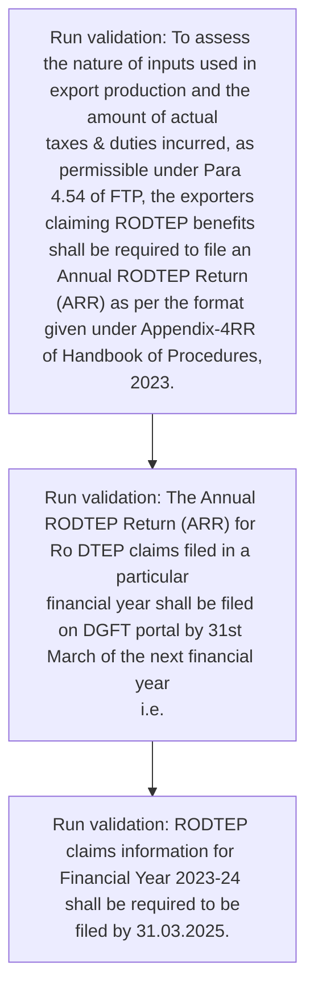
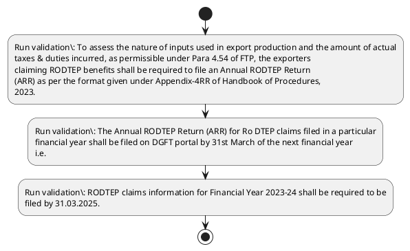

# Chapter 4 / Section 4.94: Filing of Annual RODTEP Return (ARR)

**Chapter Title:** Duty Exemption / Remission Schemes

**Pages:** 54, 55

**Purpose:** To assess the nature of inputs used in export production and the amount of actual
taxes & duties incurred, as permissible under Para 4.54 of FTP, the exporters
claiming RODTEP benefits shall be required to file an Annual RODTEP Return
(ARR) as per the format given under Appendix-4RR of Handbook of Procedures,
2023.

**Purpose Thanglish:** Indha Filing of Annual RODTEP Return (ARR) section-la, To assess the nature of inputs used in export production and the amount of actual
taxes & duties incurred, as permissible under Para 4.54 of FTP, the exporters
claiming RODTEP benefits kandippa be required to file an Annual RODTEP Return
(ARR) as per the format given under Appendix-4RR of Handbook of Procedures,
2023.

**Summary:** 4.94 Filing of Annual RODTEP Return (ARR)
4.94 Filing of Annual RODTEP Return (ARR)
1. To assess the nature of inputs used in export production and the amount of actual
taxes & duties incurred, as permissible under Para 4.54 of FTP, the exporters
claiming RODTEP benefits shall be required to file an Annual RODTEP Return
(ARR) as per the format given under Appendix-4RR of Handbook of Procedures,
2023. The Annual RODTEP Return (ARR) for Ro DTEP claims filed in a particular
financial year shall be filed on DGFT portal by 31st March of the next financial year
i.e.

**Business Meaning:** Filing of Annual RODTEP Return (ARR) governs how DGFT business controls should be applied, validated, and enforced.

**Business Explanation:** Filing of Annual RODTEP Return (ARR) explains the operating rule set that DEKAI should enforce. Key control points include To assess the nature of inputs used in export production and the amount of actual
taxes & duties incurred, as permissible under Para 4.54 of FTP, the exporters
claiming RODTEP benefits shall be required to file an Annual RODTEP Return
(ARR) as per the format given under Appendix-4RR of Handbook of Procedures,
2023.

**Business Explanation Thanglish:** Indha Filing of Annual RODTEP Return (ARR) section-la, Filing of Annual RODTEP Return (ARR) explains the operating rule set that DEKAI should enforce. Key control points include To assess the nature of inputs used in export production and the amount of actual
taxes & duties incurred, as permissible under Para 4.54 of FTP, the exporters
claiming RODTEP benefits kandippa be required to file an Annual RODTEP Return
(ARR) as per the format given under Appendix-4RR of Handbook of Procedures,
2023.

## Business Logic
- To assess the nature of inputs used in export production and the amount of actual
taxes & duties incurred, as permissible under Para 4.54 of FTP, the exporters
claiming RODTEP benefits shall be required to file an Annual RODTEP Return
(ARR) as per the format given under Appendix-4RR of Handbook of Procedures,
2023.
- The Annual RODTEP Return (ARR) for Ro DTEP claims filed in a particular
financial year shall be filed on DGFT portal by 31st March of the next financial year
i.e.
- RODTEP claims information for Financial Year 2023-24 shall be required to be
filed by 31.03.2025.

## Business Rules
- rule_id=CH4-SEC4_94-R001, rule_description=To assess the nature of inputs used in export production and the amount of actual
taxes & duties incurred, as permissible under Para 4.54 of FTP, the exporters
claiming RODTEP benefits shall be required to file an Annual RODTEP Return
(ARR) as per the format given under Appendix-4RR of Handbook of Procedures,
2023., trigger=Filing of Annual RODTEP Return (ARR), condition=Not explicitly covered in uploaded documents., validation=To assess the nature of inputs used in export production and the amount of actual
taxes & duties incurred, as permissible under Para 4.54 of FTP, the exporters
claiming RODTEP benefits shall be required to file an Annual RODTEP Return
(ARR) as per the format given under Appendix-4RR of Handbook of Procedures,
2023., action=Manual review required., exception=No explicit exception found in uploaded documents., output=DEKAI should produce a compliance decision for 4.94 - Filing of Annual RODTEP Return (ARR).
- rule_id=CH4-SEC4_94-R002, rule_description=The Annual RODTEP Return (ARR) for Ro DTEP claims filed in a particular
financial year shall be filed on DGFT portal by 31st March of the next financial year
i.e., trigger=Filing of Annual RODTEP Return (ARR), condition=Not explicitly covered in uploaded documents., validation=The Annual RODTEP Return (ARR) for Ro DTEP claims filed in a particular
financial year shall be filed on DGFT portal by 31st March of the next financial year
i.e., action=Manual review required., exception=No explicit exception found in uploaded documents., output=DEKAI should produce a compliance decision for 4.94 - Filing of Annual RODTEP Return (ARR).
- rule_id=CH4-SEC4_94-R003, rule_description=RODTEP claims information for Financial Year 2023-24 shall be required to be
filed by 31.03.2025., trigger=Filing of Annual RODTEP Return (ARR), condition=Not explicitly covered in uploaded documents., validation=RODTEP claims information for Financial Year 2023-24 shall be required to be
filed by 31.03.2025., action=Manual review required., exception=No explicit exception found in uploaded documents., output=DEKAI should produce a compliance decision for 4.94 - Filing of Annual RODTEP Return (ARR).

## Conditions
- None identified

## Condition Logic
- None identified

## Validations
- To assess the nature of inputs used in export production and the amount of actual
taxes & duties incurred, as permissible under Para 4.54 of FTP, the exporters
claiming RODTEP benefits shall be required to file an Annual RODTEP Return
(ARR) as per the format given under Appendix-4RR of Handbook of Procedures,
2023.
- The Annual RODTEP Return (ARR) for Ro DTEP claims filed in a particular
financial year shall be filed on DGFT portal by 31st March of the next financial year
i.e.
- RODTEP claims information for Financial Year 2023-24 shall be required to be
filed by 31.03.2025.

## Exceptions
- None identified

## Dependencies
- 4.54
- 1
- 2
- 3
- 4
- 5

## Authorities
- DGFT

## Required Documents
- None identified

## Timelines
- None identified

## Actions
- None identified

## Workflow
- Run validation: To assess the nature of inputs used in export production and the amount of actual
taxes & duties incurred, as permissible under Para 4.54 of FTP, the exporters
claiming RODTEP benefits shall be required to file an Annual RODTEP Return
(ARR) as per the format given under Appendix-4RR of Handbook of Procedures,
2023.
- Run validation: The Annual RODTEP Return (ARR) for Ro DTEP claims filed in a particular
financial year shall be filed on DGFT portal by 31st March of the next financial year
i.e.
- Run validation: RODTEP claims information for Financial Year 2023-24 shall be required to be
filed by 31.03.2025.

## Workflow ASCII
```text
Filing of Annual RODTEP Return (ARR)
Run validation: To assess the nature of inputs used in export production and the amount of actual
taxes & duties incurred, as permissible under Para 4.54 of FTP, the exporters
claiming RODTEP benefits shall be required to file an Annual RODTEP Return
(ARR) as per the format given under Appendix-4RR of Handbook of Procedures,
2023.
   |
   v
Run validation: The Annual RODTEP Return (ARR) for Ro DTEP claims filed in a particular
financial year shall be filed on DGFT portal by 31st March of the next financial year
i.e.
   |
   v
Run validation: RODTEP claims information for Financial Year 2023-24 shall be required to be
filed by 31.03.2025.
```

## Decision Tree
- IF section 4.94 applies THEN proceed with standard DGFT workflow

## Decision Tree ASCII
```text
Filing of Annual RODTEP Return (ARR) Decision
IF section 4.94 applies THEN proceed with standard DGFT workflow
```

## Examples
- User asks to process Filing of Annual RODTEP Return (ARR); the platform checks conditions, validations, and documents before action.

**Real-world Example:** Example: an importer or exporter invokes Filing of Annual RODTEP Return (ARR), submits the prescribed DGFT records, and DEKAI uses the extracted rules to follow the filing of annual rodtep return (arr) process.

**Real-world Example Thanglish:** Indha Filing of Annual RODTEP Return (ARR) section-la, Example: an importer or exporter invokes Filing of Annual RODTEP Return (ARR), submits the prescribed DGFT records, and DEKAI uses the extracted rules to follow the filing of annual rodtep return (arr) process.

## AI Rules
- IF detected context matches section rule THEN enforce: To assess the nature of inputs used in export production and the amount of actual
taxes & duties incurred, as permissible under Para 4.54 of FTP, the exporters
claiming RODTEP benefits shall be required to file an Annual RODTEP Return
(ARR) as per the format given under Appendix-4RR of Handbook of Procedures,
2023.
- IF detected context matches section rule THEN enforce: The Annual RODTEP Return (ARR) for Ro DTEP claims filed in a particular
financial year shall be filed on DGFT portal by 31st March of the next financial year
i.e.
- IF detected context matches section rule THEN enforce: RODTEP claims information for Financial Year 2023-24 shall be required to be
filed by 31.03.2025.

## Database Fields
- name=section_code, type=string, required=True, source=parsed_section_heading
- name=section_title, type=string, required=True, source=parsed_section_heading
- name=arr_flag, type=boolean, required=False, source=keyword:ARR
- name=the_flag, type=boolean, required=False, source=keyword:the
- name=and_flag, type=boolean, required=False, source=keyword:and
- name=ftp_flag, type=boolean, required=False, source=keyword:FTP
- name=per_flag, type=boolean, required=False, source=keyword:per
- name=for_flag, type=boolean, required=False, source=keyword:for
- name=all_flag, type=boolean, required=False, source=keyword:all
- name=used_flag, type=boolean, required=False, source=keyword:used

## API Requirements
- method=GET, path=/api/dgft/sections/4.94, purpose=Retrieve knowledge payload for section 4.94, query_params=['include=workflow,decision_tree,validations'], response_fields=['section', 'title', 'summary', 'conditions', 'validations', 'exceptions', 'workflow', 'decision_tree']
- method=POST, path=/api/dgft/Filing-of-Annual-RODTEP-Return-ARR/validate, purpose=Validate inputs and documents for Filing of Annual RODTEP Return (ARR), request_fields=['section_code', 'section_title'], response_fields=['status', 'errors', 'warnings', 'next_actions']

## UI Screens
- screen_id=Filing_of_Annual_RODTEP_Return_ARR_overview, name=Filing of Annual RODTEP Return (ARR) Overview, purpose=Show section summary, authority, timeline, and eligibility cues., widgets=['summary_card', 'conditions_table', 'authority_badges', 'timeline_panel']
- screen_id=Filing_of_Annual_RODTEP_Return_ARR_submission, name=Filing of Annual RODTEP Return (ARR) Submission, purpose=Capture applicant data and supporting documents., widgets=['dynamic_form', 'document_uploader', 'validation_panel', 'next_action_footer'], fields=['section_code', 'section_title', 'arr_flag', 'the_flag', 'and_flag', 'ftp_flag', 'per_flag', 'for_flag']

## Error Messages
- Validation failed because the section requirements were not fully met.

## FAQ
- question_en=What is the purpose of section 4.94?, answer_en=Filing of Annual RODTEP Return (ARR) explains the operating rule set that DEKAI should enforce. Key control points include To assess the nature of inputs used in export production and the amount of actual
taxes & duties incurred, as permissible under Para 4.54 of FTP, the exporters
claiming RODTEP benefits shall be required to file an Annual RODTEP Return
(ARR) as per the format given under Appendix-4RR of Handbook of Procedures,
2023., question_thanglish=Indha Filing of Annual RODTEP Return (ARR) section-la, What is the purpose of section 4.94?, answer_thanglish=Indha Filing of Annual RODTEP Return (ARR) section-la, Filing of Annual RODTEP Return (ARR) explains the operating rule set that DEKAI should enforce. Key control points include To assess the nature of inputs used in export production and the amount of actual
taxes & duties incurred, as permissible under Para 4.54 of FTP, the exporters
claiming RODTEP benefits kandippa be required to file an Annual RODTEP Return
(ARR) as per the format given under Appendix-4RR of Handbook of Procedures,
2023.
- question_en=What documents are required under Filing of Annual RODTEP Return (ARR)?, answer_en=Not explicitly covered in uploaded documents., question_thanglish=Indha Filing of Annual RODTEP Return (ARR) section-la, What documents are required under Filing of Annual RODTEP Return (ARR)?, answer_thanglish=Indha Filing of Annual RODTEP Return (ARR) section-la, Not explicitly covered in uploaded documents.
- question_en=Which authority handles Filing of Annual RODTEP Return (ARR)?, answer_en=DGFT, question_thanglish=Indha Filing of Annual RODTEP Return (ARR) section-la, Which authority handles Filing of Annual RODTEP Return (ARR)?, answer_thanglish=Indha Filing of Annual RODTEP Return (ARR) section-la, DGFT

## Questions Users May Ask
- What does Filing of Annual RODTEP Return (ARR) require?
- Which documents are needed for Filing of Annual RODTEP Return (ARR)?
- How does DEKAI validate Filing of Annual RODTEP Return (ARR) requests?

## Expected AI Answers
- Filing of Annual RODTEP Return (ARR) requires the platform to interpret the section text, apply the extracted business rules, and present the correct next action.
- Required documents are inferred from the section text: no explicit documents were detected.
- DEKAI validates Filing of Annual RODTEP Return (ARR) by checking conditions, required documents, authority references, and exception clauses before recommending an outcome.

## AI Q&A Examples
- question_en=User asks: How do I comply with Filing of Annual RODTEP Return (ARR)?, answer_en=AI answers: DEKAI should evaluate section 4.94, apply the extracted rules, and guide the user through Run validation: To assess the nature of inputs used in export production and the amount of actual
taxes & duties incurred, as permissible under Para 4.54 of FTP, the exporters
claiming RODTEP benefits shall be required to file an Annual RODTEP Return
(ARR) as per the format given under Appendix-4RR of Handbook of Procedures,
2023.., question_thanglish=Indha Filing of Annual RODTEP Return (ARR) section-la, User asks: How do I comply with Filing of Annual RODTEP Return (ARR)?, answer_thanglish=Indha Filing of Annual RODTEP Return (ARR) section-la, AI answers: DEKAI should evaluate section 4.94, apply the extracted rules, and guide the user through Run validation: To assess the nature of inputs used in export production and the amount of actual
taxes & duties incurred, as permissible under Para 4.54 of FTP, the exporters
claiming RODTEP benefits kandippa be required to file an Annual RODTEP Return
(ARR) as per the format given under Appendix-4RR of Handbook of Procedures,
2023..
- question_en=User asks: Which validations apply to Filing of Annual RODTEP Return (ARR)?, answer_en=AI answers: Applicable validations are To assess the nature of inputs used in export production and the amount of actual
taxes & duties incurred, as permissible under Para 4.54 of FTP, the exporters
claiming RODTEP benefits shall be required to file an Annual RODTEP Return
(ARR) as per the format given under Appendix-4RR of Handbook of Procedures,
2023., The Annual RODTEP Return (ARR) for Ro DTEP claims filed in a particular
financial year shall be filed on DGFT portal by 31st March of the next financial year
i.e., RODTEP claims information for Financial Year 2023-24 shall be required to be
filed by 31.03.2025., question_thanglish=Indha Filing of Annual RODTEP Return (ARR) section-la, User asks: Which validations apply to Filing of Annual RODTEP Return (ARR)?, answer_thanglish=Indha Filing of Annual RODTEP Return (ARR) section-la, AI answers: Applicable validations are To assess the nature of inputs used in export production and the amount of actual
taxes & duties incurred, as permissible under Para 4.54 of FTP, the exporters
claiming RODTEP benefits kandippa be required to file an Annual RODTEP Return
(ARR) as per the format given under Appendix-4RR of Handbook of Procedures,
2023., The Annual RODTEP Return (ARR) for Ro DTEP claims filed in a particular
financial year kandippa be filed on DGFT portal by 31st March of the next financial year
i.e., RODTEP claims information for Financial Year 2023-24 kandippa be required to be
filed by 31.03.2025.

## DEKAI AI Implementation Notes
- Capture chapter 4, section 4.94, title, and page references as immutable knowledge metadata.
- Bind validations for Filing of Annual RODTEP Return (ARR) into a rule engine keyed by the rule IDs extracted for this section.
- Route escalations or approvals to: DGFT.
- Show contextual links to related sections: 4.54, 1, 2, 3, 4, 5.

## DEKAI AI Implementation Notes Thanglish
- Indha Filing of Annual RODTEP Return (ARR) section-la, Capture chapter 4, section 4.94, title, and page references as immutable knowledge metadata.
- Indha Filing of Annual RODTEP Return (ARR) section-la, Bind validations for Filing of Annual RODTEP Return (ARR) into a rule engine keyed by the rule IDs extracted for this section.
- Indha Filing of Annual RODTEP Return (ARR) section-la, Route escalations or approvals to: DGFT.
- Indha Filing of Annual RODTEP Return (ARR) section-la, Show contextual links to related sections: 4.54, 1, 2, 3, 4, 5.

## AI Metadata
- Keywords: ARR, the, and, FTP, per, for, all, used, Para, file, DTEP, year, DGFT, next, This, with, IECs, taxes, under, shall
- Search Keywords: ARR, the, and, FTP, per, for, all, used, Para, file, DTEP, year, DGFT, next, This, with, IECs, taxes, under, shall
- Intent: Provide knowledge guidance for Filing of Annual RODTEP Return (ARR).
- Tags: 4.94, Filing of Annual RODTEP Return (ARR), business-rule, dgft
- Related Sections: 4.54, 1, 2, 3, 4, 5
- Related Chapters: 
- Related Rules: To assess the nature of inputs used in export production and the amount of actual
taxes & duties incurred, as permissible under Para 4.54 of FTP, the exporters
claiming RODTEP benefits shall be required to file an Annual RODTEP Return
(ARR) as per the format given under Appendix-4RR of Handbook of Procedures,
2023., The Annual RODTEP Return (ARR) for Ro DTEP claims filed in a particular
financial year shall be filed on DGFT portal by 31st March of the next financial year
i.e., RODTEP claims information for Financial Year 2023-24 shall be required to be
filed by 31.03.2025.

## Mermaid


## PlantUML

