# Chapter 4 / Section 4.94: Filing of Annual RODTEP Return (ARR)

**Chapter Title:** Duty Exemption / Remission Schemes

**Pages:** 54, 55

**Purpose:** To assess the nature of inputs used in export production and the amount of actual
taxes & duties incurred, as permissible under Para 4.54 of FTP, the exporters
pg.

**Purpose Thanglish:** Indha Filing of Annual RODTEP Return (ARR) section-la, To assess the nature of inputs used in export production and the amount of actual
taxes & duties incurred, as permissible under Para 4.54 of FTP, the exporters
pg.

**Summary:** 4.94 Filing of Annual RODTEP Return (ARR)
1. To assess the nature of inputs used in export production and the amount of actual
taxes & duties incurred, as permissible under Para 4.54 of FTP, the exporters
pg. 129
pg.

**Business Meaning:** Filing of Annual RODTEP Return (ARR) governs how DGFT business controls should be applied, validated, and enforced.

**Business Explanation:** Filing of Annual RODTEP Return (ARR) explains the operating rule set that DEKAI should enforce. Key control points include 129
Nominated Agencies
The guidelines on import of precious metal by the nominated agencies and
monitoring are as under:
(a)
Following guidelines for monitoring the import of precious metal and
its distribution and / or own use by the Nominated Agencies will be
followed, (other than the Banks nominated by RBI for this purpose):
(i)
Every Nominated Agency is required to maintain records of
imports of precious metal (both quantity and value) and its
distribution for the purpose of exports of value added product as
well as for the purpose of domestic consumption as per the format
given in Appendix 4-M of Hand Book of Procedures. The section also drives actions such as 129
Nominated Agencies
The guidelines on import of precious metal by the nominated agencies and
monitoring are as under:
(a)
Following guidelines for monitoring the import of precious metal and
its distribution and / or own use by the Nominated Agencies will be
followed, (other than the Banks nominated by RBI for this purpose):
(i)
Every Nominated Agency is required to maintain records of
imports of precious metal (both quantity and value) and its
distribution for the purpose of exports of value added product as
well as for the purpose of domestic consumption as per the format
given in Appendix 4-M of Hand Book of Procedures..

**Business Explanation Thanglish:** Indha Filing of Annual RODTEP Return (ARR) section-la, Filing of Annual RODTEP Return (ARR) explains the operating rule set that DEKAI should enforce. Key control points include 129
Nominated Agencies
The guidelines on import of precious metal by the nominated agencies and
monitoring are as under:
(a)
Following guidelines for monitoring the import of precious metal and
its distribution and / or own use by the Nominated Agencies will be
followed, (other than the Banks nominated by RBI for this purpose):
(i)
Every Nominated Agency is required to maintain records of
imports of precious metal (both quantity and value) and its
distribution for the purpose of exports of value added product as
well as for the purpose of domestic consumption as per the format
given in Appendix 4-M of Hand Book of Procedures. The section also drives actions such as 129
Nominated Agencies
The guidelines on import of precious metal by the nominated agencies and
monitoring are as under:
(a)
Following guidelines for monitoring the import of precious metal and
its distribution and / or own use by the Nominated Agencies will be
followed, (other than the Banks nominated by RBI for this purpose):
(i)
Every Nominated Agency is required to maintain records of
imports of precious metal (both quantity and value) and its
distribution for the purpose of exports of value added product as
well as for the purpose of domestic consumption as per the format
given in Appendix 4-M of Hand Book of Procedures..

## Business Logic
- 129
Nominated Agencies
The guidelines on import of precious metal by the nominated agencies and
monitoring are as under:
(a)
Following guidelines for monitoring the import of precious metal and
its distribution and / or own use by the Nominated Agencies will be
followed, (other than the Banks nominated by RBI for this purpose):
(i)
Every Nominated Agency is required to maintain records of
imports of precious metal (both quantity and value) and its
distribution for the purpose of exports of value added product as
well as for the purpose of domestic consumption as per the format
given in Appendix 4-M of Hand Book of Procedures.
- Nominated Agencies shall file half yearly return as per
format given in Appendix 4-M of Handbook of Procedures, to the
Gems & Jewellery Export Promotion Council (GJEPC), Mumbai
within 15 days of every completed half year.
- In turn, G&J EPC shall
compile the half yearly return and the figures submitted by the
Nominated Agency and check the performance of the Nominated
Agency.
- Thereafter, GJEPC shall forward the compiled half yearly
returns along with its observation on performance of Nominated
Agency to DGFT headquarters within one month of every
completed half year.
- In case of delay in filing or non-submission of
half yearly return within 15 days of every completed half year,
GJEPC shall seek comments of defaulting Nominated Agencies.
- To assess the nature of inputs used in export production and the amount of actual
taxes & duties incurred, as permissible under Para 4.54 of FTP, the exporters
claiming RODTEP benefits shall be required to file an Annual RODTEP Return
(ARR) as per the format given under Appendix-4RR of Handbook of Procedures,
2023.
- The Annual RODTEP Return (ARR) for Ro DTEP claims filed in a particular
financial year shall be filed on DGFT portal by 31st March of the next financial year
i.e.
- RODTEP claims information for Financial Year 2023-24 shall be required to be
filed by 31.03.2025.
- Non-reporting of the ARR shall lead to denial of benefits under the RODTEP
scheme and no further scroll out of RODTEP claims for the SBs will be permitted
at the Customs Port of Export after the grace period of three (3) months i.e.
- The resumption of scroll out shall also
cover the Shipping Bills that were not scrolled out earlier on account of non-
compliance of ARR.
- 130
claiming RODTEP benefits shall be required to file an Annual RODTEP Return
(ARR) as per the format given under Appendix-4RR of Handbook of Procedures,
2023.

## Business Rules
- rule_id=CH4-SEC4_94-R001, rule_description=129
Nominated Agencies
The guidelines on import of precious metal by the nominated agencies and
monitoring are as under:
(a)
Following guidelines for monitoring the import of precious metal and
its distribution and / or own use by the Nominated Agencies will be
followed, (other than the Banks nominated by RBI for this purpose):
(i)
Every Nominated Agency is required to maintain records of
imports of precious metal (both quantity and value) and its
distribution for the purpose of exports of value added product as
well as for the purpose of domestic consumption as per the format
given in Appendix 4-M of Hand Book of Procedures., trigger=Filing of Annual RODTEP Return (ARR), condition=Failure to comply will
render Nominated Agency Certificate liable to be cancelled in
addition to action under FT (DR) Act 1992, as amended, after
affording opportunity of personal hearing., validation=129
Nominated Agencies
The guidelines on import of precious metal by the nominated agencies and
monitoring are as under:
(a)
Following guidelines for monitoring the import of precious metal and
its distribution and / or own use by the Nominated Agencies will be
followed, (other than the Banks nominated by RBI for this purpose):
(i)
Every Nominated Agency is required to maintain records of
imports of precious metal (both quantity and value) and its
distribution for the purpose of exports of value added product as
well as for the purpose of domestic consumption as per the format
given in Appendix 4-M of Hand Book of Procedures., action=129
Nominated Agencies
The guidelines on import of precious metal by the nominated agencies and
monitoring are as under:
(a)
Following guidelines for monitoring the import of precious metal and
its distribution and / or own use by the Nominated Agencies will be
followed, (other than the Banks nominated by RBI for this purpose):
(i)
Every Nominated Agency is required to maintain records of
imports of precious metal (both quantity and value) and its
distribution for the purpose of exports of value added product as
well as for the purpose of domestic consumption as per the format
given in Appendix 4-M of Hand Book of Procedures., exception=129
Nominated Agencies
The guidelines on import of precious metal by the nominated agencies and
monitoring are as under:
(a)
Following guidelines for monitoring the import of precious metal and
its distribution and / or own use by the Nominated Agencies will be
followed, (other than the Banks nominated by RBI for this purpose):
(i)
Every Nominated Agency is required to maintain records of
imports of precious metal (both quantity and value) and its
distribution for the purpose of exports of value added product as
well as for the purpose of domestic consumption as per the format
given in Appendix 4-M of Hand Book of Procedures., output=DEKAI should produce a compliance decision for 4.94 - Filing of Annual RODTEP Return (ARR).
- rule_id=CH4-SEC4_94-R002, rule_description=Nominated Agencies shall file half yearly return as per
format given in Appendix 4-M of Handbook of Procedures, to the
Gems & Jewellery Export Promotion Council (GJEPC), Mumbai
within 15 days of every completed half year., trigger=Filing of Annual RODTEP Return (ARR), condition=Thereafter, GJEPC shall forward the compiled half yearly
returns along with its observation on performance of Nominated
Agency to DGFT headquarters within one month of every
completed half year., validation=Nominated Agencies shall file half yearly return as per
format given in Appendix 4-M of Handbook of Procedures, to the
Gems & Jewellery Export Promotion Council (GJEPC), Mumbai
within 15 days of every completed half year., action=Failure to comply will
render Nominated Agency Certificate liable to be cancelled in
addition to action under FT (DR) Act 1992, as amended, after
affording opportunity of personal hearing., exception=129
Nominated Agencies
The guidelines on import of precious metal by the nominated agencies and
monitoring are as under:
(a)
Following guidelines for monitoring the import of precious metal and
its distribution and / or own use by the Nominated Agencies will be
followed, (other than the Banks nominated by RBI for this purpose):
(i)
Every Nominated Agency is required to maintain records of
imports of precious metal (both quantity and value) and its
distribution for the purpose of exports of value added product as
well as for the purpose of domestic consumption as per the format
given in Appendix 4-M of Hand Book of Procedures., output=DEKAI should produce a compliance decision for 4.94 - Filing of Annual RODTEP Return (ARR).
- rule_id=CH4-SEC4_94-R003, rule_description=In turn, G&J EPC shall
compile the half yearly return and the figures submitted by the
Nominated Agency and check the performance of the Nominated
Agency., trigger=Filing of Annual RODTEP Return (ARR), condition=In case of delay in filing or non-submission of
half yearly return within 15 days of every completed half year,
GJEPC shall seek comments of defaulting Nominated Agencies., validation=In turn, G&J EPC shall
compile the half yearly return and the figures submitted by the
Nominated Agency and check the performance of the Nominated
Agency., action=In turn, G&J EPC shall
compile the half yearly return and the figures submitted by the
Nominated Agency and check the performance of the Nominated
Agency., exception=129
Nominated Agencies
The guidelines on import of precious metal by the nominated agencies and
monitoring are as under:
(a)
Following guidelines for monitoring the import of precious metal and
its distribution and / or own use by the Nominated Agencies will be
followed, (other than the Banks nominated by RBI for this purpose):
(i)
Every Nominated Agency is required to maintain records of
imports of precious metal (both quantity and value) and its
distribution for the purpose of exports of value added product as
well as for the purpose of domestic consumption as per the format
given in Appendix 4-M of Hand Book of Procedures., output=DEKAI should produce a compliance decision for 4.94 - Filing of Annual RODTEP Return (ARR).
- rule_id=CH4-SEC4_94-R004, rule_description=Thereafter, GJEPC shall forward the compiled half yearly
returns along with its observation on performance of Nominated
Agency to DGFT headquarters within one month of every
completed half year., trigger=Filing of Annual RODTEP Return (ARR), condition=Non-reporting of the ARR shall lead to denial of benefits under the RODTEP
scheme and no further scroll out of RODTEP claims for the SBs will be permitted
at the Customs Port of Export after the grace period of three (3) months i.e., validation=Thereafter, GJEPC shall forward the compiled half yearly
returns along with its observation on performance of Nominated
Agency to DGFT headquarters within one month of every
completed half year., action=Non-reporting of the ARR shall lead to denial of benefits under the RODTEP
scheme and no further scroll out of RODTEP claims for the SBs will be permitted
at the Customs Port of Export after the grace period of three (3) months i.e., exception=129
Nominated Agencies
The guidelines on import of precious metal by the nominated agencies and
monitoring are as under:
(a)
Following guidelines for monitoring the import of precious metal and
its distribution and / or own use by the Nominated Agencies will be
followed, (other than the Banks nominated by RBI for this purpose):
(i)
Every Nominated Agency is required to maintain records of
imports of precious metal (both quantity and value) and its
distribution for the purpose of exports of value added product as
well as for the purpose of domestic consumption as per the format
given in Appendix 4-M of Hand Book of Procedures., output=DEKAI should produce a compliance decision for 4.94 - Filing of Annual RODTEP Return (ARR).
- rule_id=CH4-SEC4_94-R005, rule_description=In case of delay in filing or non-submission of
half yearly return within 15 days of every completed half year,
GJEPC shall seek comments of defaulting Nominated Agencies., trigger=Filing of Annual RODTEP Return (ARR), condition=after
30th June., validation=In case of delay in filing or non-submission of
half yearly return within 15 days of every completed half year,
GJEPC shall seek comments of defaulting Nominated Agencies., action=Subsequent to the payment of the applicable composition fee, the Ro DTEP scrolls
will be resumed within 45 days, till an online API based message exchange is
established between DGFT and Customs., exception=129
Nominated Agencies
The guidelines on import of precious metal by the nominated agencies and
monitoring are as under:
(a)
Following guidelines for monitoring the import of precious metal and
its distribution and / or own use by the Nominated Agencies will be
followed, (other than the Banks nominated by RBI for this purpose):
(i)
Every Nominated Agency is required to maintain records of
imports of precious metal (both quantity and value) and its
distribution for the purpose of exports of value added product as
well as for the purpose of domestic consumption as per the format
given in Appendix 4-M of Hand Book of Procedures., output=DEKAI should produce a compliance decision for 4.94 - Filing of Annual RODTEP Return (ARR).
- rule_id=CH4-SEC4_94-R006, rule_description=To assess the nature of inputs used in export production and the amount of actual
taxes & duties incurred, as permissible under Para 4.54 of FTP, the exporters
claiming RODTEP benefits shall be required to file an Annual RODTEP Return
(ARR) as per the format given under Appendix-4RR of Handbook of Procedures,
2023., trigger=Filing of Annual RODTEP Return (ARR), condition=Thereafter, a composition fees of Rs.20,000 /- will need to be paid after 30th June., validation=To assess the nature of inputs used in export production and the amount of actual
taxes & duties incurred, as permissible under Para 4.54 of FTP, the exporters
claiming RODTEP benefits shall be required to file an Annual RODTEP Return
(ARR) as per the format given under Appendix-4RR of Handbook of Procedures,
2023., action=The physical/digital records substantiating the duty remission claims, as filed in
ARR, will need to be maintained for a period of five (5) years which may be
produced before the concerned authority assessing the ARR., exception=129
Nominated Agencies
The guidelines on import of precious metal by the nominated agencies and
monitoring are as under:
(a)
Following guidelines for monitoring the import of precious metal and
its distribution and / or own use by the Nominated Agencies will be
followed, (other than the Banks nominated by RBI for this purpose):
(i)
Every Nominated Agency is required to maintain records of
imports of precious metal (both quantity and value) and its
distribution for the purpose of exports of value added product as
well as for the purpose of domestic consumption as per the format
given in Appendix 4-M of Hand Book of Procedures., output=DEKAI should produce a compliance decision for 4.94 - Filing of Annual RODTEP Return (ARR).
- rule_id=CH4-SEC4_94-R007, rule_description=The Annual RODTEP Return (ARR) for Ro DTEP claims filed in a particular
financial year shall be filed on DGFT portal by 31st March of the next financial year
i.e., trigger=Filing of Annual RODTEP Return (ARR), condition=The physical/digital records substantiating the duty remission claims, as filed in
ARR, will need to be maintained for a period of five (5) years which may be
produced before the concerned authority assessing the ARR., validation=The Annual RODTEP Return (ARR) for Ro DTEP claims filed in a particular
financial year shall be filed on DGFT portal by 31st March of the next financial year
i.e., action=The physical/digital records substantiating the duty remission claims, as filed in
ARR, will need to be maintained for a period of five (5) years which may be
produced before the concerned authority assessing the ARR., exception=129
Nominated Agencies
The guidelines on import of precious metal by the nominated agencies and
monitoring are as under:
(a)
Following guidelines for monitoring the import of precious metal and
its distribution and / or own use by the Nominated Agencies will be
followed, (other than the Banks nominated by RBI for this purpose):
(i)
Every Nominated Agency is required to maintain records of
imports of precious metal (both quantity and value) and its
distribution for the purpose of exports of value added product as
well as for the purpose of domestic consumption as per the format
given in Appendix 4-M of Hand Book of Procedures., output=DEKAI should produce a compliance decision for 4.94 - Filing of Annual RODTEP Return (ARR).
- rule_id=CH4-SEC4_94-R008, rule_description=RODTEP claims information for Financial Year 2023-24 shall be required to be
filed by 31.03.2025., trigger=Filing of Annual RODTEP Return (ARR), condition=ARR filings may also be periodically assessed for necessary due diligence and
presented before Ro DTEP Committee for suitable revision of rates including for
the consideration of higher rates wherever warranted., validation=RODTEP claims information for Financial Year 2023-24 shall be required to be
filed by 31.03.2025., action=The physical/digital records substantiating the duty remission claims, as filed in
ARR, will need to be maintained for a period of five (5) years which may be
produced before the concerned authority assessing the ARR., exception=129
Nominated Agencies
The guidelines on import of precious metal by the nominated agencies and
monitoring are as under:
(a)
Following guidelines for monitoring the import of precious metal and
its distribution and / or own use by the Nominated Agencies will be
followed, (other than the Banks nominated by RBI for this purpose):
(i)
Every Nominated Agency is required to maintain records of
imports of precious metal (both quantity and value) and its
distribution for the purpose of exports of value added product as
well as for the purpose of domestic consumption as per the format
given in Appendix 4-M of Hand Book of Procedures., output=DEKAI should produce a compliance decision for 4.94 - Filing of Annual RODTEP Return (ARR).
- rule_id=CH4-SEC4_94-R009, rule_description=Non-reporting of the ARR shall lead to denial of benefits under the RODTEP
scheme and no further scroll out of RODTEP claims for the SBs will be permitted
at the Customs Port of Export after the grace period of three (3) months i.e., trigger=Filing of Annual RODTEP Return (ARR), condition=Certain ARR cases may also be identified by the IT-assisted risk-based criteria, for
further scrutiny to assess the nature of inputs used in export production and the
amount of actual taxes & duties incurred, as permissible under Para 4.54 of FTP., validation=Non-reporting of the ARR shall lead to denial of benefits under the RODTEP
scheme and no further scroll out of RODTEP claims for the SBs will be permitted
at the Customs Port of Export after the grace period of three (3) months i.e., action=The physical/digital records substantiating the duty remission claims, as filed in
ARR, will need to be maintained for a period of five (5) years which may be
produced before the concerned authority assessing the ARR., exception=129
Nominated Agencies
The guidelines on import of precious metal by the nominated agencies and
monitoring are as under:
(a)
Following guidelines for monitoring the import of precious metal and
its distribution and / or own use by the Nominated Agencies will be
followed, (other than the Banks nominated by RBI for this purpose):
(i)
Every Nominated Agency is required to maintain records of
imports of precious metal (both quantity and value) and its
distribution for the purpose of exports of value added product as
well as for the purpose of domestic consumption as per the format
given in Appendix 4-M of Hand Book of Procedures., output=DEKAI should produce a compliance decision for 4.94 - Filing of Annual RODTEP Return (ARR).
- rule_id=CH4-SEC4_94-R010, rule_description=The resumption of scroll out shall also
cover the Shipping Bills that were not scrolled out earlier on account of non-
compliance of ARR., trigger=Filing of Annual RODTEP Return (ARR), condition=After due assessment is made by the concerned authority, who has been mandated
in this regard, the RODTEP scrip holder will be liable to refund/surrender any
excess claims based on the order passed after the scrutiny under the relevant
customs head., validation=The resumption of scroll out shall also
cover the Shipping Bills that were not scrolled out earlier on account of non-
compliance of ARR., action=The physical/digital records substantiating the duty remission claims, as filed in
ARR, will need to be maintained for a period of five (5) years which may be
produced before the concerned authority assessing the ARR., exception=129
Nominated Agencies
The guidelines on import of precious metal by the nominated agencies and
monitoring are as under:
(a)
Following guidelines for monitoring the import of precious metal and
its distribution and / or own use by the Nominated Agencies will be
followed, (other than the Banks nominated by RBI for this purpose):
(i)
Every Nominated Agency is required to maintain records of
imports of precious metal (both quantity and value) and its
distribution for the purpose of exports of value added product as
well as for the purpose of domestic consumption as per the format
given in Appendix 4-M of Hand Book of Procedures., output=DEKAI should produce a compliance decision for 4.94 - Filing of Annual RODTEP Return (ARR).
- rule_id=CH4-SEC4_94-R011, rule_description=130
claiming RODTEP benefits shall be required to file an Annual RODTEP Return
(ARR) as per the format given under Appendix-4RR of Handbook of Procedures,
2023., trigger=Filing of Annual RODTEP Return (ARR), condition=Failure to regularise the excess claims within a specified time frame
will lead to stopping of further benefits under the Scheme.x
pg., validation=130
claiming RODTEP benefits shall be required to file an Annual RODTEP Return
(ARR) as per the format given under Appendix-4RR of Handbook of Procedures,
2023., action=The physical/digital records substantiating the duty remission claims, as filed in
ARR, will need to be maintained for a period of five (5) years which may be
produced before the concerned authority assessing the ARR., exception=129
Nominated Agencies
The guidelines on import of precious metal by the nominated agencies and
monitoring are as under:
(a)
Following guidelines for monitoring the import of precious metal and
its distribution and / or own use by the Nominated Agencies will be
followed, (other than the Banks nominated by RBI for this purpose):
(i)
Every Nominated Agency is required to maintain records of
imports of precious metal (both quantity and value) and its
distribution for the purpose of exports of value added product as
well as for the purpose of domestic consumption as per the format
given in Appendix 4-M of Hand Book of Procedures., output=DEKAI should produce a compliance decision for 4.94 - Filing of Annual RODTEP Return (ARR).

## Conditions
- Failure to comply will
render Nominated Agency Certificate liable to be cancelled in
addition to action under FT (DR) Act 1992, as amended, after
affording opportunity of personal hearing.
- Thereafter, GJEPC shall forward the compiled half yearly
returns along with its observation on performance of Nominated
Agency to DGFT headquarters within one month of every
completed half year.
- In case of delay in filing or non-submission of
half yearly return within 15 days of every completed half year,
GJEPC shall seek comments of defaulting Nominated Agencies.
- Non-reporting of the ARR shall lead to denial of benefits under the RODTEP
scheme and no further scroll out of RODTEP claims for the SBs will be permitted
at the Customs Port of Export after the grace period of three (3) months i.e.
- after
30th June.
- Thereafter, a composition fees of Rs.20,000 /- will need to be paid after 30th June.
- The physical/digital records substantiating the duty remission claims, as filed in
ARR, will need to be maintained for a period of five (5) years which may be
produced before the concerned authority assessing the ARR.
- ARR filings may also be periodically assessed for necessary due diligence and
presented before Ro DTEP Committee for suitable revision of rates including for
the consideration of higher rates wherever warranted.
- Certain ARR cases may also be identified by the IT-assisted risk-based criteria, for
further scrutiny to assess the nature of inputs used in export production and the
amount of actual taxes & duties incurred, as permissible under Para 4.54 of FTP.
- After due assessment is made by the concerned authority, who has been mandated
in this regard, the RODTEP scrip holder will be liable to refund/surrender any
excess claims based on the order passed after the scrutiny under the relevant
customs head.
- Failure to regularise the excess claims within a specified time frame
will lead to stopping of further benefits under the Scheme.x
pg.
- Failure to regularise the excess claims within a specified time frame
will lead to stopping of further benefits under the Scheme.x

## Condition Logic
- id=4.4.94.1, if=Failure to comply will
render Nominated Agency Certificate liable to be cancelled in
addition to action under FT (DR) Act 1992, as amended, after
affording opportunity of personal hearing., then=129
Nominated Agencies
The guidelines on import of precious metal by the nominated agencies and
monitoring are as under:
(a)
Following guidelines for monitoring the import of precious metal and
its distribution and / or own use by the Nominated Agencies will be
followed, (other than the Banks nominated by RBI for this purpose):
(i)
Every Nominated Agency is required to maintain records of
imports of precious metal (both quantity and value) and its
distribution for the purpose of exports of value added product as
well as for the purpose of domestic consumption as per the format
given in Appendix 4-M of Hand Book of Procedures., source=Failure to comply will
render Nominated Agency Certificate liable to be cancelled in
addition to action under FT (DR) Act 1992, as amended, after
affording opportunity of personal hearing.
- id=4.4.94.2, if=Thereafter, GJEPC shall forward the compiled half yearly
returns along with its observation on performance of Nominated
Agency to DGFT headquarters within one month of every
completed half year., then=129
Nominated Agencies
The guidelines on import of precious metal by the nominated agencies and
monitoring are as under:
(a)
Following guidelines for monitoring the import of precious metal and
its distribution and / or own use by the Nominated Agencies will be
followed, (other than the Banks nominated by RBI for this purpose):
(i)
Every Nominated Agency is required to maintain records of
imports of precious metal (both quantity and value) and its
distribution for the purpose of exports of value added product as
well as for the purpose of domestic consumption as per the format
given in Appendix 4-M of Hand Book of Procedures., source=Thereafter, GJEPC shall forward the compiled half yearly
returns along with its observation on performance of Nominated
Agency to DGFT headquarters within one month of every
completed half year.
- id=4.4.94.3, if=In case of delay in filing or non-submission of
half yearly return within 15 days of every completed half year,
GJEPC shall seek comments of defaulting Nominated Agencies., then=129
Nominated Agencies
The guidelines on import of precious metal by the nominated agencies and
monitoring are as under:
(a)
Following guidelines for monitoring the import of precious metal and
its distribution and / or own use by the Nominated Agencies will be
followed, (other than the Banks nominated by RBI for this purpose):
(i)
Every Nominated Agency is required to maintain records of
imports of precious metal (both quantity and value) and its
distribution for the purpose of exports of value added product as
well as for the purpose of domestic consumption as per the format
given in Appendix 4-M of Hand Book of Procedures., source=In case of delay in filing or non-submission of
half yearly return within 15 days of every completed half year,
GJEPC shall seek comments of defaulting Nominated Agencies.
- id=4.4.94.4, if=Non-reporting of the ARR shall lead to denial of benefits under the RODTEP
scheme and no further scroll out of RODTEP claims for the SBs will be permitted
at the Customs Port of Export after the grace period of three (3) months i.e., then=129
Nominated Agencies
The guidelines on import of precious metal by the nominated agencies and
monitoring are as under:
(a)
Following guidelines for monitoring the import of precious metal and
its distribution and / or own use by the Nominated Agencies will be
followed, (other than the Banks nominated by RBI for this purpose):
(i)
Every Nominated Agency is required to maintain records of
imports of precious metal (both quantity and value) and its
distribution for the purpose of exports of value added product as
well as for the purpose of domestic consumption as per the format
given in Appendix 4-M of Hand Book of Procedures., source=Non-reporting of the ARR shall lead to denial of benefits under the RODTEP
scheme and no further scroll out of RODTEP claims for the SBs will be permitted
at the Customs Port of Export after the grace period of three (3) months i.e.
- id=4.4.94.5, if=after
30th June., then=129
Nominated Agencies
The guidelines on import of precious metal by the nominated agencies and
monitoring are as under:
(a)
Following guidelines for monitoring the import of precious metal and
its distribution and / or own use by the Nominated Agencies will be
followed, (other than the Banks nominated by RBI for this purpose):
(i)
Every Nominated Agency is required to maintain records of
imports of precious metal (both quantity and value) and its
distribution for the purpose of exports of value added product as
well as for the purpose of domestic consumption as per the format
given in Appendix 4-M of Hand Book of Procedures., source=after
30th June.
- id=4.4.94.6, if=Thereafter, a composition fees of Rs.20,000 /- will need to be paid after 30th June., then=129
Nominated Agencies
The guidelines on import of precious metal by the nominated agencies and
monitoring are as under:
(a)
Following guidelines for monitoring the import of precious metal and
its distribution and / or own use by the Nominated Agencies will be
followed, (other than the Banks nominated by RBI for this purpose):
(i)
Every Nominated Agency is required to maintain records of
imports of precious metal (both quantity and value) and its
distribution for the purpose of exports of value added product as
well as for the purpose of domestic consumption as per the format
given in Appendix 4-M of Hand Book of Procedures., source=Thereafter, a composition fees of Rs.20,000 /- will need to be paid after 30th June.
- id=4.4.94.7, if=The physical/digital records substantiating the duty remission claims, as filed in
ARR, will need to be maintained for a period of five (5) years which may be
produced before the concerned authority assessing the ARR., then=129
Nominated Agencies
The guidelines on import of precious metal by the nominated agencies and
monitoring are as under:
(a)
Following guidelines for monitoring the import of precious metal and
its distribution and / or own use by the Nominated Agencies will be
followed, (other than the Banks nominated by RBI for this purpose):
(i)
Every Nominated Agency is required to maintain records of
imports of precious metal (both quantity and value) and its
distribution for the purpose of exports of value added product as
well as for the purpose of domestic consumption as per the format
given in Appendix 4-M of Hand Book of Procedures., source=The physical/digital records substantiating the duty remission claims, as filed in
ARR, will need to be maintained for a period of five (5) years which may be
produced before the concerned authority assessing the ARR.
- id=4.4.94.8, if=ARR filings may also be periodically assessed for necessary due diligence and
presented before Ro DTEP Committee for suitable revision of rates including for
the consideration of higher rates wherever warranted., then=129
Nominated Agencies
The guidelines on import of precious metal by the nominated agencies and
monitoring are as under:
(a)
Following guidelines for monitoring the import of precious metal and
its distribution and / or own use by the Nominated Agencies will be
followed, (other than the Banks nominated by RBI for this purpose):
(i)
Every Nominated Agency is required to maintain records of
imports of precious metal (both quantity and value) and its
distribution for the purpose of exports of value added product as
well as for the purpose of domestic consumption as per the format
given in Appendix 4-M of Hand Book of Procedures., source=ARR filings may also be periodically assessed for necessary due diligence and
presented before Ro DTEP Committee for suitable revision of rates including for
the consideration of higher rates wherever warranted.
- id=4.4.94.9, if=Certain ARR cases may also be identified by the IT-assisted risk-based criteria, for
further scrutiny to assess the nature of inputs used in export production and the
amount of actual taxes & duties incurred, as permissible under Para 4.54 of FTP., then=129
Nominated Agencies
The guidelines on import of precious metal by the nominated agencies and
monitoring are as under:
(a)
Following guidelines for monitoring the import of precious metal and
its distribution and / or own use by the Nominated Agencies will be
followed, (other than the Banks nominated by RBI for this purpose):
(i)
Every Nominated Agency is required to maintain records of
imports of precious metal (both quantity and value) and its
distribution for the purpose of exports of value added product as
well as for the purpose of domestic consumption as per the format
given in Appendix 4-M of Hand Book of Procedures., source=Certain ARR cases may also be identified by the IT-assisted risk-based criteria, for
further scrutiny to assess the nature of inputs used in export production and the
amount of actual taxes & duties incurred, as permissible under Para 4.54 of FTP.
- id=4.4.94.10, if=After due assessment is made by the concerned authority, who has been mandated
in this regard, the RODTEP scrip holder will be liable to refund/surrender any
excess claims based on the order passed after the scrutiny under the relevant
customs head., then=129
Nominated Agencies
The guidelines on import of precious metal by the nominated agencies and
monitoring are as under:
(a)
Following guidelines for monitoring the import of precious metal and
its distribution and / or own use by the Nominated Agencies will be
followed, (other than the Banks nominated by RBI for this purpose):
(i)
Every Nominated Agency is required to maintain records of
imports of precious metal (both quantity and value) and its
distribution for the purpose of exports of value added product as
well as for the purpose of domestic consumption as per the format
given in Appendix 4-M of Hand Book of Procedures., source=After due assessment is made by the concerned authority, who has been mandated
in this regard, the RODTEP scrip holder will be liable to refund/surrender any
excess claims based on the order passed after the scrutiny under the relevant
customs head.
- id=4.4.94.11, if=Failure to regularise the excess claims within a specified time frame
will lead to stopping of further benefits under the Scheme.x
pg., then=129
Nominated Agencies
The guidelines on import of precious metal by the nominated agencies and
monitoring are as under:
(a)
Following guidelines for monitoring the import of precious metal and
its distribution and / or own use by the Nominated Agencies will be
followed, (other than the Banks nominated by RBI for this purpose):
(i)
Every Nominated Agency is required to maintain records of
imports of precious metal (both quantity and value) and its
distribution for the purpose of exports of value added product as
well as for the purpose of domestic consumption as per the format
given in Appendix 4-M of Hand Book of Procedures., source=Failure to regularise the excess claims within a specified time frame
will lead to stopping of further benefits under the Scheme.x
pg.
- id=4.4.94.12, if=Failure to regularise the excess claims within a specified time frame
will lead to stopping of further benefits under the Scheme.x, then=129
Nominated Agencies
The guidelines on import of precious metal by the nominated agencies and
monitoring are as under:
(a)
Following guidelines for monitoring the import of precious metal and
its distribution and / or own use by the Nominated Agencies will be
followed, (other than the Banks nominated by RBI for this purpose):
(i)
Every Nominated Agency is required to maintain records of
imports of precious metal (both quantity and value) and its
distribution for the purpose of exports of value added product as
well as for the purpose of domestic consumption as per the format
given in Appendix 4-M of Hand Book of Procedures., source=Failure to regularise the excess claims within a specified time frame
will lead to stopping of further benefits under the Scheme.x

## Validations
- 129
Nominated Agencies
The guidelines on import of precious metal by the nominated agencies and
monitoring are as under:
(a)
Following guidelines for monitoring the import of precious metal and
its distribution and / or own use by the Nominated Agencies will be
followed, (other than the Banks nominated by RBI for this purpose):
(i)
Every Nominated Agency is required to maintain records of
imports of precious metal (both quantity and value) and its
distribution for the purpose of exports of value added product as
well as for the purpose of domestic consumption as per the format
given in Appendix 4-M of Hand Book of Procedures.
- Nominated Agencies shall file half yearly return as per
format given in Appendix 4-M of Handbook of Procedures, to the
Gems & Jewellery Export Promotion Council (GJEPC), Mumbai
within 15 days of every completed half year.
- In turn, G&J EPC shall
compile the half yearly return and the figures submitted by the
Nominated Agency and check the performance of the Nominated
Agency.
- Thereafter, GJEPC shall forward the compiled half yearly
returns along with its observation on performance of Nominated
Agency to DGFT headquarters within one month of every
completed half year.
- In case of delay in filing or non-submission of
half yearly return within 15 days of every completed half year,
GJEPC shall seek comments of defaulting Nominated Agencies.
- To assess the nature of inputs used in export production and the amount of actual
taxes & duties incurred, as permissible under Para 4.54 of FTP, the exporters
claiming RODTEP benefits shall be required to file an Annual RODTEP Return
(ARR) as per the format given under Appendix-4RR of Handbook of Procedures,
2023.
- The Annual RODTEP Return (ARR) for Ro DTEP claims filed in a particular
financial year shall be filed on DGFT portal by 31st March of the next financial year
i.e.
- RODTEP claims information for Financial Year 2023-24 shall be required to be
filed by 31.03.2025.
- Non-reporting of the ARR shall lead to denial of benefits under the RODTEP
scheme and no further scroll out of RODTEP claims for the SBs will be permitted
at the Customs Port of Export after the grace period of three (3) months i.e.
- The resumption of scroll out shall also
cover the Shipping Bills that were not scrolled out earlier on account of non-
compliance of ARR.
- 130
claiming RODTEP benefits shall be required to file an Annual RODTEP Return
(ARR) as per the format given under Appendix-4RR of Handbook of Procedures,
2023.

## Exceptions
- 129
Nominated Agencies
The guidelines on import of precious metal by the nominated agencies and
monitoring are as under:
(a)
Following guidelines for monitoring the import of precious metal and
its distribution and / or own use by the Nominated Agencies will be
followed, (other than the Banks nominated by RBI for this purpose):
(i)
Every Nominated Agency is required to maintain records of
imports of precious metal (both quantity and value) and its
distribution for the purpose of exports of value added product as
well as for the purpose of domestic consumption as per the format
given in Appendix 4-M of Hand Book of Procedures.

## Dependencies
- 4.54

## Authorities
- DGFT
- RBI and DGFT
- Agency to DGFT
- Customs
- DGFT and Customs
- Ro DTEP Committee

## Required Documents
- Nominated Agency Certificate
- The resumption of scroll out shall also
cover the Shipping Bills that were not scrolled out earlier on account of non-
compliance of ARR.

## Timelines
- Failure to comply will
render Nominated Agency Certificate liable to be cancelled in
addition to action under FT (DR) Act 1992, as amended, after
affording opportunity of personal hearing.
- Nominated Agencies shall file half yearly return as per
format given in Appendix 4-M of Handbook of Procedures, to the
Gems & Jewellery Export Promotion Council (GJEPC), Mumbai
within 15 days of every completed half year.
- Thereafter, GJEPC shall forward the compiled half yearly
returns along with its observation on performance of Nominated
Agency to DGFT headquarters within one month of every
completed half year.
- In case of delay in filing or non-submission of
half yearly return within 15 days of every completed half year,
GJEPC shall seek comments of defaulting Nominated Agencies.
- Non-reporting of the ARR shall lead to denial of benefits under the RODTEP
scheme and no further scroll out of RODTEP claims for the SBs will be permitted
at the Customs Port of Export after the grace period of three (3) months i.e.
- after
30th June.
- RODTEP claims information for Financial Year 2023-24 with
composition fees can be filed within a grace period of 3 months i.e.by 30.06.2025.
- Thereafter, a composition fees of Rs.20,000 /- will need to be paid after 30th June.
- Subsequent to the payment of the applicable composition fee, the Ro DTEP scrolls
will be resumed within 45 days, till an online API based message exchange is
established between DGFT and Customs.
- The physical/digital records substantiating the duty remission claims, as filed in
ARR, will need to be maintained for a period of five (5) years which may be
produced before the concerned authority assessing the ARR.
- ARR filings may also be periodically assessed for necessary due diligence and
presented before Ro DTEP Committee for suitable revision of rates including for
the consideration of higher rates wherever warranted.
- After due assessment is made by the concerned authority, who has been mandated
in this regard, the RODTEP scrip holder will be liable to refund/surrender any
excess claims based on the order passed after the scrutiny under the relevant
customs head.
- Failure to regularise the excess claims within a specified time frame
will lead to stopping of further benefits under the Scheme.x
pg.
- Failure to regularise the excess claims within a specified time frame
will lead to stopping of further benefits under the Scheme.x

## Actions
- 129
Nominated Agencies
The guidelines on import of precious metal by the nominated agencies and
monitoring are as under:
(a)
Following guidelines for monitoring the import of precious metal and
its distribution and / or own use by the Nominated Agencies will be
followed, (other than the Banks nominated by RBI for this purpose):
(i)
Every Nominated Agency is required to maintain records of
imports of precious metal (both quantity and value) and its
distribution for the purpose of exports of value added product as
well as for the purpose of domestic consumption as per the format
given in Appendix 4-M of Hand Book of Procedures.
- Failure to comply will
render Nominated Agency Certificate liable to be cancelled in
addition to action under FT (DR) Act 1992, as amended, after
affording opportunity of personal hearing.
- In turn, G&J EPC shall
compile the half yearly return and the figures submitted by the
Nominated Agency and check the performance of the Nominated
Agency.
- Non-reporting of the ARR shall lead to denial of benefits under the RODTEP
scheme and no further scroll out of RODTEP claims for the SBs will be permitted
at the Customs Port of Export after the grace period of three (3) months i.e.
- Subsequent to the payment of the applicable composition fee, the Ro DTEP scrolls
will be resumed within 45 days, till an online API based message exchange is
established between DGFT and Customs.
- The physical/digital records substantiating the duty remission claims, as filed in
ARR, will need to be maintained for a period of five (5) years which may be
produced before the concerned authority assessing the ARR.

## Workflow
- Evaluate condition: Failure to comply will
render Nominated Agency Certificate liable to be cancelled in
addition to action under FT (DR) Act 1992, as amended, after
affording opportunity of personal hearing.
- Evaluate condition: Thereafter, GJEPC shall forward the compiled half yearly
returns along with its observation on performance of Nominated
Agency to DGFT headquarters within one month of every
completed half year.
- Evaluate condition: In case of delay in filing or non-submission of
half yearly return within 15 days of every completed half year,
GJEPC shall seek comments of defaulting Nominated Agencies.
- 129
Nominated Agencies
The guidelines on import of precious metal by the nominated agencies and
monitoring are as under:
(a)
Following guidelines for monitoring the import of precious metal and
its distribution and / or own use by the Nominated Agencies will be
followed, (other than the Banks nominated by RBI for this purpose):
(i)
Every Nominated Agency is required to maintain records of
imports of precious metal (both quantity and value) and its
distribution for the purpose of exports of value added product as
well as for the purpose of domestic consumption as per the format
given in Appendix 4-M of Hand Book of Procedures.
- Failure to comply will
render Nominated Agency Certificate liable to be cancelled in
addition to action under FT (DR) Act 1992, as amended, after
affording opportunity of personal hearing.
- In turn, G&J EPC shall
compile the half yearly return and the figures submitted by the
Nominated Agency and check the performance of the Nominated
Agency.
- Non-reporting of the ARR shall lead to denial of benefits under the RODTEP
scheme and no further scroll out of RODTEP claims for the SBs will be permitted
at the Customs Port of Export after the grace period of three (3) months i.e.
- Subsequent to the payment of the applicable composition fee, the Ro DTEP scrolls
will be resumed within 45 days, till an online API based message exchange is
established between DGFT and Customs.
- The physical/digital records substantiating the duty remission claims, as filed in
ARR, will need to be maintained for a period of five (5) years which may be
produced before the concerned authority assessing the ARR.
- Run validation: 129
Nominated Agencies
The guidelines on import of precious metal by the nominated agencies and
monitoring are as under:
(a)
Following guidelines for monitoring the import of precious metal and
its distribution and / or own use by the Nominated Agencies will be
followed, (other than the Banks nominated by RBI for this purpose):
(i)
Every Nominated Agency is required to maintain records of
imports of precious metal (both quantity and value) and its
distribution for the purpose of exports of value added product as
well as for the purpose of domestic consumption as per the format
given in Appendix 4-M of Hand Book of Procedures.
- Run validation: Nominated Agencies shall file half yearly return as per
format given in Appendix 4-M of Handbook of Procedures, to the
Gems & Jewellery Export Promotion Council (GJEPC), Mumbai
within 15 days of every completed half year.
- Run validation: In turn, G&J EPC shall
compile the half yearly return and the figures submitted by the
Nominated Agency and check the performance of the Nominated
Agency.
- Handle exception: 129
Nominated Agencies
The guidelines on import of precious metal by the nominated agencies and
monitoring are as under:
(a)
Following guidelines for monitoring the import of precious metal and
its distribution and / or own use by the Nominated Agencies will be
followed, (other than the Banks nominated by RBI for this purpose):
(i)
Every Nominated Agency is required to maintain records of
imports of precious metal (both quantity and value) and its
distribution for the purpose of exports of value added product as
well as for the purpose of domestic consumption as per the format
given in Appendix 4-M of Hand Book of Procedures.

## Workflow ASCII
```text
Filing of Annual RODTEP Return (ARR)
Evaluate condition: Failure to comply will
render Nominated Agency Certificate liable to be cancelled in
addition to action under FT (DR) Act 1992, as amended, after
affording opportunity of personal hearing.
   |
   v
Evaluate condition: Thereafter, GJEPC shall forward the compiled half yearly
returns along with its observation on performance of Nominated
Agency to DGFT headquarters within one month of every
completed half year.
   |
   v
Evaluate condition: In case of delay in filing or non-submission of
half yearly return within 15 days of every completed half year,
GJEPC shall seek comments of defaulting Nominated Agencies.
   |
   v
129
Nominated Agencies
The guidelines on import of precious metal by the nominated agencies and
monitoring are as under:
(a)
Following guidelines for monitoring the import of precious metal and
its distribution and / or own use by the Nominated Agencies will be
followed, (other than the Banks nominated by RBI for this purpose):
(i)
Every Nominated Agency is required to maintain records of
imports of precious metal (both quantity and value) and its
distribution for the purpose of exports of value added product as
well as for the purpose of domestic consumption as per the format
given in Appendix 4-M of Hand Book of Procedures.
   |
   v
Failure to comply will
render Nominated Agency Certificate liable to be cancelled in
addition to action under FT (DR) Act 1992, as amended, after
affording opportunity of personal hearing.
   |
   v
In turn, G&J EPC shall
compile the half yearly return and the figures submitted by the
Nominated Agency and check the performance of the Nominated
Agency.
   |
   v
Non-reporting of the ARR shall lead to denial of benefits under the RODTEP
scheme and no further scroll out of RODTEP claims for the SBs will be permitted
at the Customs Port of Export after the grace period of three (3) months i.e.
   |
   v
Subsequent to the payment of the applicable composition fee, the Ro DTEP scrolls
will be resumed within 45 days, till an online API based message exchange is
established between DGFT and Customs.
   |
   v
The physical/digital records substantiating the duty remission claims, as filed in
ARR, will need to be maintained for a period of five (5) years which may be
produced before the concerned authority assessing the ARR.
   |
   v
Run validation: 129
Nominated Agencies
The guidelines on import of precious metal by the nominated agencies and
monitoring are as under:
(a)
Following guidelines for monitoring the import of precious metal and
its distribution and / or own use by the Nominated Agencies will be
followed, (other than the Banks nominated by RBI for this purpose):
(i)
Every Nominated Agency is required to maintain records of
imports of precious metal (both quantity and value) and its
distribution for the purpose of exports of value added product as
well as for the purpose of domestic consumption as per the format
given in Appendix 4-M of Hand Book of Procedures.
   |
   v
Run validation: Nominated Agencies shall file half yearly return as per
format given in Appendix 4-M of Handbook of Procedures, to the
Gems & Jewellery Export Promotion Council (GJEPC), Mumbai
within 15 days of every completed half year.
   |
   v
Run validation: In turn, G&J EPC shall
compile the half yearly return and the figures submitted by the
Nominated Agency and check the performance of the Nominated
Agency.
   |
   v
Handle exception: 129
Nominated Agencies
The guidelines on import of precious metal by the nominated agencies and
monitoring are as under:
(a)
Following guidelines for monitoring the import of precious metal and
its distribution and / or own use by the Nominated Agencies will be
followed, (other than the Banks nominated by RBI for this purpose):
(i)
Every Nominated Agency is required to maintain records of
imports of precious metal (both quantity and value) and its
distribution for the purpose of exports of value added product as
well as for the purpose of domestic consumption as per the format
given in Appendix 4-M of Hand Book of Procedures.
```

## Decision Tree
- IF Failure to comply will
render Nominated Agency Certificate liable to be cancelled in
addition to action under FT (DR) Act 1992, as amended, after
affording opportunity of personal hearing. THEN 129
Nominated Agencies
The guidelines on import of precious metal by the nominated agencies and
monitoring are as under:
(a)
Following guidelines for monitoring the import of precious metal and
its distribution and / or own use by the Nominated Agencies will be
followed, (other than the Banks nominated by RBI for this purpose):
(i)
Every Nominated Agency is required to maintain records of
imports of precious metal (both quantity and value) and its
distribution for the purpose of exports of value added product as
well as for the purpose of domestic consumption as per the format
given in Appendix 4-M of Hand Book of Procedures.
- IF Thereafter, GJEPC shall forward the compiled half yearly
returns along with its observation on performance of Nominated
Agency to DGFT headquarters within one month of every
completed half year. THEN 129
Nominated Agencies
The guidelines on import of precious metal by the nominated agencies and
monitoring are as under:
(a)
Following guidelines for monitoring the import of precious metal and
its distribution and / or own use by the Nominated Agencies will be
followed, (other than the Banks nominated by RBI for this purpose):
(i)
Every Nominated Agency is required to maintain records of
imports of precious metal (both quantity and value) and its
distribution for the purpose of exports of value added product as
well as for the purpose of domestic consumption as per the format
given in Appendix 4-M of Hand Book of Procedures.
- IF In case of delay in filing or non-submission of
half yearly return within 15 days of every completed half year,
GJEPC shall seek comments of defaulting Nominated Agencies. THEN 129
Nominated Agencies
The guidelines on import of precious metal by the nominated agencies and
monitoring are as under:
(a)
Following guidelines for monitoring the import of precious metal and
its distribution and / or own use by the Nominated Agencies will be
followed, (other than the Banks nominated by RBI for this purpose):
(i)
Every Nominated Agency is required to maintain records of
imports of precious metal (both quantity and value) and its
distribution for the purpose of exports of value added product as
well as for the purpose of domestic consumption as per the format
given in Appendix 4-M of Hand Book of Procedures.
- IF Non-reporting of the ARR shall lead to denial of benefits under the RODTEP
scheme and no further scroll out of RODTEP claims for the SBs will be permitted
at the Customs Port of Export after the grace period of three (3) months i.e. THEN 129
Nominated Agencies
The guidelines on import of precious metal by the nominated agencies and
monitoring are as under:
(a)
Following guidelines for monitoring the import of precious metal and
its distribution and / or own use by the Nominated Agencies will be
followed, (other than the Banks nominated by RBI for this purpose):
(i)
Every Nominated Agency is required to maintain records of
imports of precious metal (both quantity and value) and its
distribution for the purpose of exports of value added product as
well as for the purpose of domestic consumption as per the format
given in Appendix 4-M of Hand Book of Procedures.
- IF after
30th June. THEN 129
Nominated Agencies
The guidelines on import of precious metal by the nominated agencies and
monitoring are as under:
(a)
Following guidelines for monitoring the import of precious metal and
its distribution and / or own use by the Nominated Agencies will be
followed, (other than the Banks nominated by RBI for this purpose):
(i)
Every Nominated Agency is required to maintain records of
imports of precious metal (both quantity and value) and its
distribution for the purpose of exports of value added product as
well as for the purpose of domestic consumption as per the format
given in Appendix 4-M of Hand Book of Procedures.
- IF exception applies (129
Nominated Agencies
The guidelines on import of precious metal by the nominated agencies and
monitoring are as under:
(a)
Following guidelines for monitoring the import of precious metal and
its distribution and / or own use by the Nominated Agencies will be
followed, (other than the Banks nominated by RBI for this purpose):
(i)
Every Nominated Agency is required to maintain records of
imports of precious metal (both quantity and value) and its
distribution for the purpose of exports of value added product as
well as for the purpose of domestic consumption as per the format
given in Appendix 4-M of Hand Book of Procedures.) THEN route to manual review

## Decision Tree ASCII
```text
Filing of Annual RODTEP Return (ARR) Decision
IF Failure to comply will
render Nominated Agency Certificate liable to be cancelled in
addition to action under FT (DR) Act 1992, as amended, after
affording opportunity of personal hearing. THEN 129
Nominated Agencies
The guidelines on import of precious metal by the nominated agencies and
monitoring are as under:
(a)
Following guidelines for monitoring the import of precious metal and
its distribution and / or own use by the Nominated Agencies will be
followed, (other than the Banks nominated by RBI for this purpose):
(i)
Every Nominated Agency is required to maintain records of
imports of precious metal (both quantity and value) and its
distribution for the purpose of exports of value added product as
well as for the purpose of domestic consumption as per the format
given in Appendix 4-M of Hand Book of Procedures.
   |
   v
IF Thereafter, GJEPC shall forward the compiled half yearly
returns along with its observation on performance of Nominated
Agency to DGFT headquarters within one month of every
completed half year. THEN 129
Nominated Agencies
The guidelines on import of precious metal by the nominated agencies and
monitoring are as under:
(a)
Following guidelines for monitoring the import of precious metal and
its distribution and / or own use by the Nominated Agencies will be
followed, (other than the Banks nominated by RBI for this purpose):
(i)
Every Nominated Agency is required to maintain records of
imports of precious metal (both quantity and value) and its
distribution for the purpose of exports of value added product as
well as for the purpose of domestic consumption as per the format
given in Appendix 4-M of Hand Book of Procedures.
   |
   v
IF In case of delay in filing or non-submission of
half yearly return within 15 days of every completed half year,
GJEPC shall seek comments of defaulting Nominated Agencies. THEN 129
Nominated Agencies
The guidelines on import of precious metal by the nominated agencies and
monitoring are as under:
(a)
Following guidelines for monitoring the import of precious metal and
its distribution and / or own use by the Nominated Agencies will be
followed, (other than the Banks nominated by RBI for this purpose):
(i)
Every Nominated Agency is required to maintain records of
imports of precious metal (both quantity and value) and its
distribution for the purpose of exports of value added product as
well as for the purpose of domestic consumption as per the format
given in Appendix 4-M of Hand Book of Procedures.
   |
   v
IF Non-reporting of the ARR shall lead to denial of benefits under the RODTEP
scheme and no further scroll out of RODTEP claims for the SBs will be permitted
at the Customs Port of Export after the grace period of three (3) months i.e. THEN 129
Nominated Agencies
The guidelines on import of precious metal by the nominated agencies and
monitoring are as under:
(a)
Following guidelines for monitoring the import of precious metal and
its distribution and / or own use by the Nominated Agencies will be
followed, (other than the Banks nominated by RBI for this purpose):
(i)
Every Nominated Agency is required to maintain records of
imports of precious metal (both quantity and value) and its
distribution for the purpose of exports of value added product as
well as for the purpose of domestic consumption as per the format
given in Appendix 4-M of Hand Book of Procedures.
   |
   v
IF after
30th June. THEN 129
Nominated Agencies
The guidelines on import of precious metal by the nominated agencies and
monitoring are as under:
(a)
Following guidelines for monitoring the import of precious metal and
its distribution and / or own use by the Nominated Agencies will be
followed, (other than the Banks nominated by RBI for this purpose):
(i)
Every Nominated Agency is required to maintain records of
imports of precious metal (both quantity and value) and its
distribution for the purpose of exports of value added product as
well as for the purpose of domestic consumption as per the format
given in Appendix 4-M of Hand Book of Procedures.
   |
   v
IF exception applies (129
Nominated Agencies
The guidelines on import of precious metal by the nominated agencies and
monitoring are as under:
(a)
Following guidelines for monitoring the import of precious metal and
its distribution and / or own use by the Nominated Agencies will be
followed, (other than the Banks nominated by RBI for this purpose):
(i)
Every Nominated Agency is required to maintain records of
imports of precious metal (both quantity and value) and its
distribution for the purpose of exports of value added product as
well as for the purpose of domestic consumption as per the format
given in Appendix 4-M of Hand Book of Procedures.) THEN route to manual review
```

## Examples
- User asks to process Filing of Annual RODTEP Return (ARR); the platform checks conditions, validations, and documents before action.

**Real-world Example:** Example: an importer or exporter invokes Filing of Annual RODTEP Return (ARR), submits Nominated Agency Certificate, The resumption of scroll out shall also
cover the Shipping Bills that were not scrolled out earlier on account of non-
compliance of ARR., and DEKAI uses the extracted rules to 129
nominated agencies
the guidelines on import of precious metal by the nominated agencies and
monitoring are as under:
(a)
following guidelines for monitoring the import of precious metal and
its distribution and / or own use by the nominated agencies will be
followed, (other than the banks nominated by rbi for this purpose):
(i)
every nominated agency is required to maintain records of
imports of precious metal (both quantity and value) and its
distribution for the purpose of exports of value added product as
well as for the purpose of domestic consumption as per the format
given in appendix 4-m of hand book of procedures..

**Real-world Example Thanglish:** Indha Filing of Annual RODTEP Return (ARR) section-la, Example: an importer or exporter invokes Filing of Annual RODTEP Return (ARR), submits Nominated Agency Certificate, The resumption of scroll out kandippa also
cover the Shipping Bills that were not scrolled out earlier on account of non-
compliance of ARR., and DEKAI uses the extracted rules to 129
nominated agencies
the guidelines on import of precious metal by the nominated agencies and
monitoring are as under:
(a)
following guidelines for monitoring the import of precious metal and
its distribution and / or own use by the nominated agencies will be
followed, (other than the banks nominated by rbi for this purpose):
(i)
every nominated agency is required to maintain records of
imports of precious metal (both quantity and value) and its
distribution for the purpose of exports of value added product as
well as for the purpose of domestic consumption as per the format
given in appendix 4-m of hand book of procedures..

## AI Rules
- IF detected context matches section rule THEN enforce: 129
Nominated Agencies
The guidelines on import of precious metal by the nominated agencies and
monitoring are as under:
(a)
Following guidelines for monitoring the import of precious metal and
its distribution and / or own use by the Nominated Agencies will be
followed, (other than the Banks nominated by RBI for this purpose):
(i)
Every Nominated Agency is required to maintain records of
imports of precious metal (both quantity and value) and its
distribution for the purpose of exports of value added product as
well as for the purpose of domestic consumption as per the format
given in Appendix 4-M of Hand Book of Procedures.
- IF detected context matches section rule THEN enforce: Nominated Agencies shall file half yearly return as per
format given in Appendix 4-M of Handbook of Procedures, to the
Gems & Jewellery Export Promotion Council (GJEPC), Mumbai
within 15 days of every completed half year.
- IF detected context matches section rule THEN enforce: In turn, G&J EPC shall
compile the half yearly return and the figures submitted by the
Nominated Agency and check the performance of the Nominated
Agency.
- IF detected context matches section rule THEN enforce: Thereafter, GJEPC shall forward the compiled half yearly
returns along with its observation on performance of Nominated
Agency to DGFT headquarters within one month of every
completed half year.
- IF detected context matches section rule THEN enforce: In case of delay in filing or non-submission of
half yearly return within 15 days of every completed half year,
GJEPC shall seek comments of defaulting Nominated Agencies.
- IF detected context matches section rule THEN enforce: To assess the nature of inputs used in export production and the amount of actual
taxes & duties incurred, as permissible under Para 4.54 of FTP, the exporters
claiming RODTEP benefits shall be required to file an Annual RODTEP Return
(ARR) as per the format given under Appendix-4RR of Handbook of Procedures,
2023.
- IF validations pass THEN recommend action: 129
Nominated Agencies
The guidelines on import of precious metal by the nominated agencies and
monitoring are as under:
(a)
Following guidelines for monitoring the import of precious metal and
its distribution and / or own use by the Nominated Agencies will be
followed, (other than the Banks nominated by RBI for this purpose):
(i)
Every Nominated Agency is required to maintain records of
imports of precious metal (both quantity and value) and its
distribution for the purpose of exports of value added product as
well as for the purpose of domestic consumption as per the format
given in Appendix 4-M of Hand Book of Procedures.

## Database Fields
- name=section_code, type=string, required=True, source=parsed_section_heading
- name=section_title, type=string, required=True, source=parsed_section_heading
- name=arr_flag, type=boolean, required=False, source=keyword:ARR
- name=the_flag, type=boolean, required=False, source=keyword:the
- name=and_flag, type=boolean, required=False, source=keyword:and
- name=ftp_flag, type=boolean, required=False, source=keyword:FTP
- name=are_flag, type=boolean, required=False, source=keyword:are
- name=for_flag, type=boolean, required=False, source=keyword:for
- name=its_flag, type=boolean, required=False, source=keyword:its
- name=own_flag, type=boolean, required=False, source=keyword:own
- name=document_1_submitted, type=boolean, required=True, source=Nominated Agency Certificate
- name=document_2_submitted, type=boolean, required=True, source=The resumption of scroll out shall also
cover the Shipping Bills that were not scrolled out earlier on account of non-
compliance of ARR.

## API Requirements
- method=GET, path=/api/dgft/sections/4.94, purpose=Retrieve knowledge payload for section 4.94, query_params=['include=workflow,decision_tree,validations'], response_fields=['section', 'title', 'summary', 'conditions', 'validations', 'exceptions', 'workflow', 'decision_tree']
- method=POST, path=/api/dgft/Filing-of-Annual-RODTEP-Return-ARR/validate, purpose=Validate inputs and documents for Filing of Annual RODTEP Return (ARR), request_fields=['section_code', 'section_title', 'document_1_submitted', 'document_2_submitted'], response_fields=['status', 'errors', 'warnings', 'next_actions']
- method=POST, path=/api/dgft/Filing-of-Annual-RODTEP-Return-ARR/execute, purpose=Trigger business action for 129
Nominated Agencies
The guidelines on import of precious metal by the nominated agencies and
monitoring are as under:
(a)
Following guidelines for monitoring the import of precious metal and
its distribution and / or own use by the Nominated Agencies will be
followed, (other than the Banks nominated by RBI for this purpose):
(i)
Every Nominated Agency is required to maintain records of
imports of precious metal (both quantity and value) and its
distribution for the purpose of exports of value added product as
well as for the purpose of domestic consumption as per the format
given in Appendix 4-M of Hand Book of Procedures., request_fields=['section_code', 'section_title', 'document_1_submitted', 'document_2_submitted'], response_fields=['reference_id', 'status', 'authority', 'timeline']

## UI Screens
- screen_id=Filing_of_Annual_RODTEP_Return_ARR_overview, name=Filing of Annual RODTEP Return (ARR) Overview, purpose=Show section summary, authority, timeline, and eligibility cues., widgets=['summary_card', 'conditions_table', 'authority_badges', 'timeline_panel']
- screen_id=Filing_of_Annual_RODTEP_Return_ARR_submission, name=Filing of Annual RODTEP Return (ARR) Submission, purpose=Capture applicant data and supporting documents., widgets=['dynamic_form', 'document_uploader', 'validation_panel', 'next_action_footer'], fields=['section_code', 'section_title', 'arr_flag', 'the_flag', 'and_flag', 'ftp_flag', 'are_flag', 'for_flag']
- screen_id=Filing_of_Annual_RODTEP_Return_ARR_exceptions, name=Filing of Annual RODTEP Return (ARR) Exception Review, purpose=Explain exception handling and manual review triggers., widgets=['exception_banner', 'decision_tree', 'case_notes']

## Error Messages
- Validation failed because the section requirements were not fully met.

## FAQ
- question_en=What is the purpose of section 4.94?, answer_en=Filing of Annual RODTEP Return (ARR) explains the operating rule set that DEKAI should enforce. Key control points include 129
Nominated Agencies
The guidelines on import of precious metal by the nominated agencies and
monitoring are as under:
(a)
Following guidelines for monitoring the import of precious metal and
its distribution and / or own use by the Nominated Agencies will be
followed, (other than the Banks nominated by RBI for this purpose):
(i)
Every Nominated Agency is required to maintain records of
imports of precious metal (both quantity and value) and its
distribution for the purpose of exports of value added product as
well as for the purpose of domestic consumption as per the format
given in Appendix 4-M of Hand Book of Procedures. The section also drives actions such as 129
Nominated Agencies
The guidelines on import of precious metal by the nominated agencies and
monitoring are as under:
(a)
Following guidelines for monitoring the import of precious metal and
its distribution and / or own use by the Nominated Agencies will be
followed, (other than the Banks nominated by RBI for this purpose):
(i)
Every Nominated Agency is required to maintain records of
imports of precious metal (both quantity and value) and its
distribution for the purpose of exports of value added product as
well as for the purpose of domestic consumption as per the format
given in Appendix 4-M of Hand Book of Procedures.., question_thanglish=Indha Filing of Annual RODTEP Return (ARR) section-la, What is the purpose of section 4.94?, answer_thanglish=Indha Filing of Annual RODTEP Return (ARR) section-la, Filing of Annual RODTEP Return (ARR) explains the operating rule set that DEKAI should enforce. Key control points include 129
Nominated Agencies
The guidelines on import of precious metal by the nominated agencies and
monitoring are as under:
(a)
Following guidelines for monitoring the import of precious metal and
its distribution and / or own use by the Nominated Agencies will be
followed, (other than the Banks nominated by RBI for this purpose):
(i)
Every Nominated Agency is required to maintain records of
imports of precious metal (both quantity and value) and its
distribution for the purpose of exports of value added product as
well as for the purpose of domestic consumption as per the format
given in Appendix 4-M of Hand Book of Procedures. The section also drives actions such as 129
Nominated Agencies
The guidelines on import of precious metal by the nominated agencies and
monitoring are as under:
(a)
Following guidelines for monitoring the import of precious metal and
its distribution and / or own use by the Nominated Agencies will be
followed, (other than the Banks nominated by RBI for this purpose):
(i)
Every Nominated Agency is required to maintain records of
imports of precious metal (both quantity and value) and its
distribution for the purpose of exports of value added product as
well as for the purpose of domestic consumption as per the format
given in Appendix 4-M of Hand Book of Procedures..
- question_en=What documents are required under Filing of Annual RODTEP Return (ARR)?, answer_en=Nominated Agency Certificate, The resumption of scroll out shall also
cover the Shipping Bills that were not scrolled out earlier on account of non-
compliance of ARR., question_thanglish=Indha Filing of Annual RODTEP Return (ARR) section-la, What documents are required under Filing of Annual RODTEP Return (ARR)?, answer_thanglish=Indha Filing of Annual RODTEP Return (ARR) section-la, Nominated Agency Certificate, The resumption of scroll out kandippa also
cover the Shipping Bills that were not scrolled out earlier on account of non-
compliance of ARR.
- question_en=Which authority handles Filing of Annual RODTEP Return (ARR)?, answer_en=DGFT, RBI and DGFT, Agency to DGFT, Customs, DGFT and Customs, Ro DTEP Committee, question_thanglish=Indha Filing of Annual RODTEP Return (ARR) section-la, Which authority handles Filing of Annual RODTEP Return (ARR)?, answer_thanglish=Indha Filing of Annual RODTEP Return (ARR) section-la, DGFT, RBI and DGFT, Agency to DGFT, Customs, DGFT and Customs, Ro DTEP Committee

## Questions Users May Ask
- What does Filing of Annual RODTEP Return (ARR) require?
- Which documents are needed for Filing of Annual RODTEP Return (ARR)?
- How does DEKAI validate Filing of Annual RODTEP Return (ARR) requests?
- What action should be taken for Filing of Annual RODTEP Return (ARR)?

## Expected AI Answers
- Filing of Annual RODTEP Return (ARR) requires the platform to interpret the section text, apply the extracted business rules, and present the correct next action.
- Required documents are inferred from the section text: Nominated Agency Certificate, The resumption of scroll out shall also
cover the Shipping Bills that were not scrolled out earlier on account of non-
compliance of ARR.
- DEKAI validates Filing of Annual RODTEP Return (ARR) by checking conditions, required documents, authority references, and exception clauses before recommending an outcome.
- The primary extracted action is: 129
Nominated Agencies
The guidelines on import of precious metal by the nominated agencies and
monitoring are as under:
(a)
Following guidelines for monitoring the import of precious metal and
its distribution and / or own use by the Nominated Agencies will be
followed, (other than the Banks nominated by RBI for this purpose):
(i)
Every Nominated Agency is required to maintain records of
imports of precious metal (both quantity and value) and its
distribution for the purpose of exports of value added product as
well as for the purpose of domestic consumption as per the format
given in Appendix 4-M of Hand Book of Procedures.

## AI Q&A Examples
- question_en=User asks: How do I comply with Filing of Annual RODTEP Return (ARR)?, answer_en=AI answers: DEKAI should evaluate section 4.94, apply the extracted rules, and guide the user through Evaluate condition: Failure to comply will
render Nominated Agency Certificate liable to be cancelled in
addition to action under FT (DR) Act 1992, as amended, after
affording opportunity of personal hearing.., question_thanglish=Indha Filing of Annual RODTEP Return (ARR) section-la, User asks: How do I comply with Filing of Annual RODTEP Return (ARR)?, answer_thanglish=Indha Filing of Annual RODTEP Return (ARR) section-la, AI answers: DEKAI should evaluate section 4.94, apply the extracted rules, and guide the user through Evaluate condition: Failure to comply will
render Nominated Agency Certificate liable to be cancelled in
addition to action under FT (DR) Act 1992, as amended, after
affording opportunity of personal hearing..
- question_en=User asks: Which validations apply to Filing of Annual RODTEP Return (ARR)?, answer_en=AI answers: Applicable validations are 129
Nominated Agencies
The guidelines on import of precious metal by the nominated agencies and
monitoring are as under:
(a)
Following guidelines for monitoring the import of precious metal and
its distribution and / or own use by the Nominated Agencies will be
followed, (other than the Banks nominated by RBI for this purpose):
(i)
Every Nominated Agency is required to maintain records of
imports of precious metal (both quantity and value) and its
distribution for the purpose of exports of value added product as
well as for the purpose of domestic consumption as per the format
given in Appendix 4-M of Hand Book of Procedures., Nominated Agencies shall file half yearly return as per
format given in Appendix 4-M of Handbook of Procedures, to the
Gems & Jewellery Export Promotion Council (GJEPC), Mumbai
within 15 days of every completed half year., In turn, G&J EPC shall
compile the half yearly return and the figures submitted by the
Nominated Agency and check the performance of the Nominated
Agency., question_thanglish=Indha Filing of Annual RODTEP Return (ARR) section-la, User asks: Which validations apply to Filing of Annual RODTEP Return (ARR)?, answer_thanglish=Indha Filing of Annual RODTEP Return (ARR) section-la, AI answers: Applicable validations are 129
Nominated Agencies
The guidelines on import of precious metal by the nominated agencies and
monitoring are as under:
(a)
Following guidelines for monitoring the import of precious metal and
its distribution and / or own use by the Nominated Agencies will be
followed, (other than the Banks nominated by RBI for this purpose):
(i)
Every Nominated Agency is required to maintain records of
imports of precious metal (both quantity and value) and its
distribution for the purpose of exports of value added product as
well as for the purpose of domestic consumption as per the format
given in Appendix 4-M of Hand Book of Procedures., Nominated Agencies kandippa file half yearly return as per
format given in Appendix 4-M of Handbook of Procedures, to the
Gems & Jewellery export Promotion Council (GJEPC), Mumbai
within 15 days of every completed half year., In turn, G&J EPC kandippa
compile the half yearly return and the figures submitted by the
Nominated Agency and check the performance of the Nominated
Agency.

## DEKAI AI Implementation Notes
- Capture chapter 4, section 4.94, title, and page references as immutable knowledge metadata.
- Bind validations for Filing of Annual RODTEP Return (ARR) into a rule engine keyed by the rule IDs extracted for this section.
- Expose document upload controls for: Nominated Agency Certificate, The resumption of scroll out shall also
cover the Shipping Bills that were not scrolled out earlier on account of non-
compliance of ARR..
- Route escalations or approvals to: DGFT, RBI and DGFT, Agency to DGFT, Customs.
- Trigger manual review when exception clauses are detected.
- Show contextual links to related sections: 4.54.

## DEKAI AI Implementation Notes Thanglish
- Indha Filing of Annual RODTEP Return (ARR) section-la, Capture chapter 4, section 4.94, title, and page references as immutable knowledge metadata.
- Indha Filing of Annual RODTEP Return (ARR) section-la, Bind validations for Filing of Annual RODTEP Return (ARR) into a rule engine keyed by the rule IDs extracted for this section.
- Indha Filing of Annual RODTEP Return (ARR) section-la, Expose document upload controls for: Nominated Agency Certificate, The resumption of scroll out kandippa also
cover the Shipping Bills that were not scrolled out earlier on account of non-
compliance of ARR..
- Indha Filing of Annual RODTEP Return (ARR) section-la, Route escalations or approvals to: DGFT, RBI and DGFT, Agency to DGFT, Customs.
- Indha Filing of Annual RODTEP Return (ARR) section-la, Trigger manual review when exception clauses are detected.
- Indha Filing of Annual RODTEP Return (ARR) section-la, Show contextual links to related sections: 4.54.

## AI Metadata
- Keywords: ARR, the, and, FTP, are, for, its, own, use, RBI, per, Act, Ltd, G&J, EPC, one, all, out, SBs, fee
- Search Keywords: ARR, the, and, FTP, are, for, its, own, use, RBI, per, Act, Ltd, G&J, EPC, one, all, out, SBs, fee
- Intent: Support Filing of Annual RODTEP Return (ARR) processing and compliance validation.
- Tags: 4.94, Filing of Annual RODTEP Return (ARR), business-rule, document-driven, dgft
- Related Sections: 4.54
- Related Chapters: 
- Related Rules: 129
Nominated Agencies
The guidelines on import of precious metal by the nominated agencies and
monitoring are as under:
(a)
Following guidelines for monitoring the import of precious metal and
its distribution and / or own use by the Nominated Agencies will be
followed, (other than the Banks nominated by RBI for this purpose):
(i)
Every Nominated Agency is required to maintain records of
imports of precious metal (both quantity and value) and its
distribution for the purpose of exports of value added product as
well as for the purpose of domestic consumption as per the format
given in Appendix 4-M of Hand Book of Procedures., Nominated Agencies shall file half yearly return as per
format given in Appendix 4-M of Handbook of Procedures, to the
Gems & Jewellery Export Promotion Council (GJEPC), Mumbai
within 15 days of every completed half year., In turn, G&J EPC shall
compile the half yearly return and the figures submitted by the
Nominated Agency and check the performance of the Nominated
Agency., Thereafter, GJEPC shall forward the compiled half yearly
returns along with its observation on performance of Nominated
Agency to DGFT headquarters within one month of every
completed half year., In case of delay in filing or non-submission of
half yearly return within 15 days of every completed half year,
GJEPC shall seek comments of defaulting Nominated Agencies.

## Mermaid


## PlantUML

```plantuml
@startuml
start
:Evaluate condition\: Failure to comply will
render Nominated Agency Certificate liable to be cancelled in
addition to action under FT (DR) Act 1992, as amended, after
affording opportunity of personal hearing.;
:Evaluate condition\: Thereafter, GJEPC shall forward the compiled half yearly
returns along with its observation on performance of Nominated
Agency to DGFT headquarters within one month of every
completed half year.;
:Evaluate condition\: In case of delay in filing or non-submission of
half yearly return within 15 days of every completed half year,
GJEPC shall seek comments of defaulting Nominated Agencies.;
:129
Nominated Agencies
The guidelines on import of precious metal by the nominated agencies and
monitoring are as under\:
(a)
Following guidelines for monitoring the import of precious metal and
its distribution and / or own use by the Nominated Agencies will be
followed, (other than the Banks nominated by RBI for this purpose)\:
(i)
Every Nominated Agency is required to maintain records of
imports of precious metal (both quantity and value) and its
distribution for the purpose of exports of value added product as
well as for the purpose of domestic consumption as per the format
given in Appendix 4-M of Hand Book of Procedures.;
:Failure to comply will
render Nominated Agency Certificate liable to be cancelled in
addition to action under FT (DR) Act 1992, as amended, after
affording opportunity of personal hearing.;
:In turn, G&J EPC shall
compile the half yearly return and the figures submitted by the
Nominated Agency and check the performance of the Nominated
Agency.;
:Non-reporting of the ARR shall lead to denial of benefits under the RODTEP
scheme and no further scroll out of RODTEP claims for the SBs will be permitted
at the Customs Port of Export after the grace period of three (3) months i.e.;
:Subsequent to the payment of the applicable composition fee, the Ro DTEP scrolls
will be resumed within 45 days, till an online API based message exchange is
established between DGFT and Customs.;
:The physical/digital records substantiating the duty remission claims, as filed in
ARR, will need to be maintained for a period of five (5) years which may be
produced before the concerned authority assessing the ARR.;
:Run validation\: 129
Nominated Agencies
The guidelines on import of precious metal by the nominated agencies and
monitoring are as under\:
(a)
Following guidelines for monitoring the import of precious metal and
its distribution and / or own use by the Nominated Agencies will be
followed, (other than the Banks nominated by RBI for this purpose)\:
(i)
Every Nominated Agency is required to maintain records of
imports of precious metal (both quantity and value) and its
distribution for the purpose of exports of value added product as
well as for the purpose of domestic consumption as per the format
given in Appendix 4-M of Hand Book of Procedures.;
:Run validation\: Nominated Agencies shall file half yearly return as per
format given in Appendix 4-M of Handbook of Procedures, to the
Gems & Jewellery Export Promotion Council (GJEPC), Mumbai
within 15 days of every completed half year.;
:Run validation\: In turn, G&J EPC shall
compile the half yearly return and the figures submitted by the
Nominated Agency and check the performance of the Nominated
Agency.;
:Handle exception\: 129
Nominated Agencies
The guidelines on import of precious metal by the nominated agencies and
monitoring are as under\:
(a)
Following guidelines for monitoring the import of precious metal and
its distribution and / or own use by the Nominated Agencies will be
followed, (other than the Banks nominated by RBI for this purpose)\:
(i)
Every Nominated Agency is required to maintain records of
imports of precious metal (both quantity and value) and its
distribution for the purpose of exports of value added product as
well as for the purpose of domestic consumption as per the format
given in Appendix 4-M of Hand Book of Procedures.;
stop
@enduml
```

