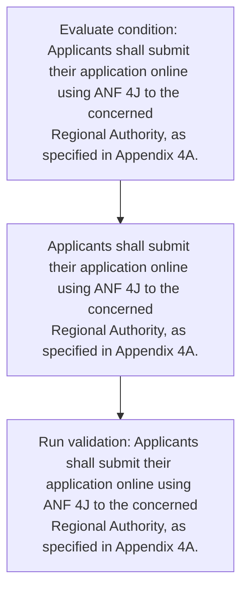
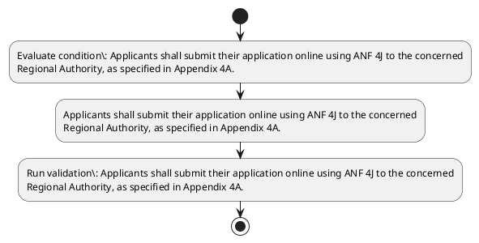

# Chapter 4 / Section 4.95: Filing of Application for Diamond Imprest Authorisation (DIA)

**Chapter Title:** Duty Exemption / Remission Schemes

**Pages:** 56

**Purpose:** 4.95 Filing of Application for Diamond Imprest Authorisation (DIA)
The policy regarding Diamond Imprest Authorisation is outlined in the FTP 2023.

**Purpose Thanglish:** Indha Filing of Application for Diamond Imprest Authorisation (DIA) section-la, 4.95 Filing of application for Diamond Imprest Authorisation (DIA)
The policy regarding Diamond Imprest Authorisation is outlined in the FTP 2023.

**Summary:** 4.95 Filing of Application for Diamond Imprest Authorisation (DIA)
The policy regarding Diamond Imprest Authorisation is outlined in the FTP 2023. Applicants shall submit their application online using ANF 4J to the concerned
Regional Authority, as specified in Appendix 4A.

**Business Meaning:** Filing of Application for Diamond Imprest Authorisation (DIA) governs how DGFT business controls should be applied, validated, and enforced.

**Business Explanation:** Filing of Application for Diamond Imprest Authorisation (DIA) explains the operating rule set that DEKAI should enforce. Key control points include Applicants shall submit their application online using ANF 4J to the concerned
Regional Authority, as specified in Appendix 4A. The section also drives actions such as Applicants shall submit their application online using ANF 4J to the concerned
Regional Authority, as specified in Appendix 4A..

**Business Explanation Thanglish:** Indha Filing of Application for Diamond Imprest Authorisation (DIA) section-la, Filing of application for Diamond Imprest Authorisation (DIA) explains the operating rule set that DEKAI should enforce. Key control points include Applicants kandippa submit their application online using ANF 4J to the concerned
Regional authority, as specified in Appendix 4A. The section also drives actions such as Applicants kandippa submit their application online using ANF 4J to the concerned
Regional authority, as specified in Appendix 4A..

## Business Logic
- Applicants shall submit their application online using ANF 4J to the concerned
Regional Authority, as specified in Appendix 4A.

## Business Rules
- rule_id=CH4-SEC4_95-R001, rule_description=Applicants shall submit their application online using ANF 4J to the concerned
Regional Authority, as specified in Appendix 4A., trigger=Filing of Application for Diamond Imprest Authorisation (DIA), condition=Applicants shall submit their application online using ANF 4J to the concerned
Regional Authority, as specified in Appendix 4A., validation=Applicants shall submit their application online using ANF 4J to the concerned
Regional Authority, as specified in Appendix 4A., action=Applicants shall submit their application online using ANF 4J to the concerned
Regional Authority, as specified in Appendix 4A., exception=No explicit exception found in uploaded documents., output=DEKAI should produce a compliance decision for 4.95 - Filing of Application for Diamond Imprest Authorisation (DIA).

## Conditions
- Applicants shall submit their application online using ANF 4J to the concerned
Regional Authority, as specified in Appendix 4A.

## Condition Logic
- id=4.4.95.1, if=Applicants shall submit their application online using ANF 4J to the concerned
Regional Authority, as specified in Appendix 4A., then=Applicants shall submit their application online using ANF 4J to the concerned
Regional Authority, as specified in Appendix 4A., source=Applicants shall submit their application online using ANF 4J to the concerned
Regional Authority, as specified in Appendix 4A.

## Validations
- Applicants shall submit their application online using ANF 4J to the concerned
Regional Authority, as specified in Appendix 4A.

## Exceptions
- None identified

## Dependencies
- 2
- 3
- 4
- 5

## Authorities
- Regional Authority

## Required Documents
- Filing of Application
- Applicants shall submit their application online using ANF 4J to the concerned
Regional Authority, as specified in Appendix 4A.

## Timelines
- None identified

## Actions
- Applicants shall submit their application online using ANF 4J to the concerned
Regional Authority, as specified in Appendix 4A.

## Workflow
- Evaluate condition: Applicants shall submit their application online using ANF 4J to the concerned
Regional Authority, as specified in Appendix 4A.
- Applicants shall submit their application online using ANF 4J to the concerned
Regional Authority, as specified in Appendix 4A.
- Run validation: Applicants shall submit their application online using ANF 4J to the concerned
Regional Authority, as specified in Appendix 4A.

## Workflow ASCII
```text
Filing of Application for Diamond Imprest Authorisation (DIA)
Evaluate condition: Applicants shall submit their application online using ANF 4J to the concerned
Regional Authority, as specified in Appendix 4A.
   |
   v
Applicants shall submit their application online using ANF 4J to the concerned
Regional Authority, as specified in Appendix 4A.
   |
   v
Run validation: Applicants shall submit their application online using ANF 4J to the concerned
Regional Authority, as specified in Appendix 4A.
```

## Decision Tree
- IF Applicants shall submit their application online using ANF 4J to the concerned
Regional Authority, as specified in Appendix 4A. THEN Applicants shall submit their application online using ANF 4J to the concerned
Regional Authority, as specified in Appendix 4A.

## Decision Tree ASCII
```text
Filing of Application for Diamond Imprest Authorisation (DIA) Decision
IF Applicants shall submit their application online using ANF 4J to the concerned
Regional Authority, as specified in Appendix 4A. THEN Applicants shall submit their application online using ANF 4J to the concerned
Regional Authority, as specified in Appendix 4A.
```

## Examples
- User asks to process Filing of Application for Diamond Imprest Authorisation (DIA); the platform checks conditions, validations, and documents before action.

**Real-world Example:** Example: an importer or exporter invokes Filing of Application for Diamond Imprest Authorisation (DIA), submits Filing of Application, Applicants shall submit their application online using ANF 4J to the concerned
Regional Authority, as specified in Appendix 4A., and DEKAI uses the extracted rules to applicants shall submit their application online using anf 4j to the concerned
regional authority, as specified in appendix 4a..

**Real-world Example Thanglish:** Indha Filing of Application for Diamond Imprest Authorisation (DIA) section-la, Example: an importer or exporter invokes Filing of application for Diamond Imprest Authorisation (DIA), submits Filing of application, Applicants kandippa submit their application online using ANF 4J to the concerned
Regional authority, as specified in Appendix 4A., and DEKAI uses the extracted rules to applicants kandippa submit their application online using anf 4j to the concerned
regional authority, as specified in appendix 4a..

## AI Rules
- IF detected context matches section rule THEN enforce: Applicants shall submit their application online using ANF 4J to the concerned
Regional Authority, as specified in Appendix 4A.
- IF validations pass THEN recommend action: Applicants shall submit their application online using ANF 4J to the concerned
Regional Authority, as specified in Appendix 4A.

## Database Fields
- name=section_code, type=string, required=True, source=parsed_section_heading
- name=section_title, type=string, required=True, source=parsed_section_heading
- name=for_flag, type=boolean, required=False, source=keyword:for
- name=dia_flag, type=boolean, required=False, source=keyword:DIA
- name=the_flag, type=boolean, required=False, source=keyword:The
- name=ftp_flag, type=boolean, required=False, source=keyword:FTP
- name=anf_flag, type=boolean, required=False, source=keyword:ANF
- name=shall_flag, type=boolean, required=False, source=keyword:shall
- name=their_flag, type=boolean, required=False, source=keyword:their
- name=using_flag, type=boolean, required=False, source=keyword:using
- name=document_1_submitted, type=boolean, required=True, source=Filing of Application
- name=document_2_submitted, type=boolean, required=True, source=Applicants shall submit their application online using ANF 4J to the concerned
Regional Authority, as specified in Appendix 4A.

## API Requirements
- method=GET, path=/api/dgft/sections/4.95, purpose=Retrieve knowledge payload for section 4.95, query_params=['include=workflow,decision_tree,validations'], response_fields=['section', 'title', 'summary', 'conditions', 'validations', 'exceptions', 'workflow', 'decision_tree']
- method=POST, path=/api/dgft/Filing-of-Application-for-Diamond-Imprest-Authorisation-DIA/validate, purpose=Validate inputs and documents for Filing of Application for Diamond Imprest Authorisation (DIA), request_fields=['section_code', 'section_title', 'document_1_submitted', 'document_2_submitted'], response_fields=['status', 'errors', 'warnings', 'next_actions']
- method=POST, path=/api/dgft/Filing-of-Application-for-Diamond-Imprest-Authorisation-DIA/execute, purpose=Trigger business action for Applicants shall submit their application online using ANF 4J to the concerned
Regional Authority, as specified in Appendix 4A., request_fields=['section_code', 'section_title', 'document_1_submitted', 'document_2_submitted'], response_fields=['reference_id', 'status', 'authority', 'timeline']

## UI Screens
- screen_id=Filing_of_Application_for_Diamond_Imprest_Authorisation_DIA_overview, name=Filing of Application for Diamond Imprest Authorisation (DIA) Overview, purpose=Show section summary, authority, timeline, and eligibility cues., widgets=['summary_card', 'conditions_table', 'authority_badges', 'timeline_panel']
- screen_id=Filing_of_Application_for_Diamond_Imprest_Authorisation_DIA_submission, name=Filing of Application for Diamond Imprest Authorisation (DIA) Submission, purpose=Capture applicant data and supporting documents., widgets=['dynamic_form', 'document_uploader', 'validation_panel', 'next_action_footer'], fields=['section_code', 'section_title', 'for_flag', 'dia_flag', 'the_flag', 'ftp_flag', 'anf_flag', 'shall_flag']

## Error Messages
- Validation failed because the section requirements were not fully met.

## FAQ
- question_en=What is the purpose of section 4.95?, answer_en=Filing of Application for Diamond Imprest Authorisation (DIA) explains the operating rule set that DEKAI should enforce. Key control points include Applicants shall submit their application online using ANF 4J to the concerned
Regional Authority, as specified in Appendix 4A. The section also drives actions such as Applicants shall submit their application online using ANF 4J to the concerned
Regional Authority, as specified in Appendix 4A.., question_thanglish=Indha Filing of Application for Diamond Imprest Authorisation (DIA) section-la, What is the purpose of section 4.95?, answer_thanglish=Indha Filing of Application for Diamond Imprest Authorisation (DIA) section-la, Filing of application for Diamond Imprest Authorisation (DIA) explains the operating rule set that DEKAI should enforce. Key control points include Applicants kandippa submit their application online using ANF 4J to the concerned
Regional authority, as specified in Appendix 4A. The section also drives actions such as Applicants kandippa submit their application online using ANF 4J to the concerned
Regional authority, as specified in Appendix 4A..
- question_en=What documents are required under Filing of Application for Diamond Imprest Authorisation (DIA)?, answer_en=Filing of Application, Applicants shall submit their application online using ANF 4J to the concerned
Regional Authority, as specified in Appendix 4A., question_thanglish=Indha Filing of Application for Diamond Imprest Authorisation (DIA) section-la, What documents are required under Filing of application for Diamond Imprest Authorisation (DIA)?, answer_thanglish=Indha Filing of Application for Diamond Imprest Authorisation (DIA) section-la, Filing of application, Applicants kandippa submit their application online using ANF 4J to the concerned
Regional authority, as specified in Appendix 4A.
- question_en=Which authority handles Filing of Application for Diamond Imprest Authorisation (DIA)?, answer_en=Regional Authority, question_thanglish=Indha Filing of Application for Diamond Imprest Authorisation (DIA) section-la, Which authority handles Filing of application for Diamond Imprest Authorisation (DIA)?, answer_thanglish=Indha Filing of Application for Diamond Imprest Authorisation (DIA) section-la, Regional authority

## Questions Users May Ask
- What does Filing of Application for Diamond Imprest Authorisation (DIA) require?
- Which documents are needed for Filing of Application for Diamond Imprest Authorisation (DIA)?
- How does DEKAI validate Filing of Application for Diamond Imprest Authorisation (DIA) requests?
- What action should be taken for Filing of Application for Diamond Imprest Authorisation (DIA)?

## Expected AI Answers
- Filing of Application for Diamond Imprest Authorisation (DIA) requires the platform to interpret the section text, apply the extracted business rules, and present the correct next action.
- Required documents are inferred from the section text: Filing of Application, Applicants shall submit their application online using ANF 4J to the concerned
Regional Authority, as specified in Appendix 4A.
- DEKAI validates Filing of Application for Diamond Imprest Authorisation (DIA) by checking conditions, required documents, authority references, and exception clauses before recommending an outcome.
- The primary extracted action is: Applicants shall submit their application online using ANF 4J to the concerned
Regional Authority, as specified in Appendix 4A.

## AI Q&A Examples
- question_en=User asks: How do I comply with Filing of Application for Diamond Imprest Authorisation (DIA)?, answer_en=AI answers: DEKAI should evaluate section 4.95, apply the extracted rules, and guide the user through Evaluate condition: Applicants shall submit their application online using ANF 4J to the concerned
Regional Authority, as specified in Appendix 4A.., question_thanglish=Indha Filing of Application for Diamond Imprest Authorisation (DIA) section-la, User asks: How do I comply with Filing of application for Diamond Imprest Authorisation (DIA)?, answer_thanglish=Indha Filing of Application for Diamond Imprest Authorisation (DIA) section-la, AI answers: DEKAI should evaluate section 4.95, apply the extracted rules, and guide the user through Evaluate condition: Applicants kandippa submit their application online using ANF 4J to the concerned
Regional authority, as specified in Appendix 4A..
- question_en=User asks: Which validations apply to Filing of Application for Diamond Imprest Authorisation (DIA)?, answer_en=AI answers: Applicable validations are Applicants shall submit their application online using ANF 4J to the concerned
Regional Authority, as specified in Appendix 4A., question_thanglish=Indha Filing of Application for Diamond Imprest Authorisation (DIA) section-la, User asks: Which validations apply to Filing of application for Diamond Imprest Authorisation (DIA)?, answer_thanglish=Indha Filing of Application for Diamond Imprest Authorisation (DIA) section-la, AI answers: Applicable validations are Applicants kandippa submit their application online using ANF 4J to the concerned
Regional authority, as specified in Appendix 4A.

## DEKAI AI Implementation Notes
- Capture chapter 4, section 4.95, title, and page references as immutable knowledge metadata.
- Bind validations for Filing of Application for Diamond Imprest Authorisation (DIA) into a rule engine keyed by the rule IDs extracted for this section.
- Expose document upload controls for: Filing of Application, Applicants shall submit their application online using ANF 4J to the concerned
Regional Authority, as specified in Appendix 4A..
- Route escalations or approvals to: Regional Authority.
- Show contextual links to related sections: 2, 3, 4, 5.

## DEKAI AI Implementation Notes Thanglish
- Indha Filing of Application for Diamond Imprest Authorisation (DIA) section-la, Capture chapter 4, section 4.95, title, and page references as immutable knowledge metadata.
- Indha Filing of Application for Diamond Imprest Authorisation (DIA) section-la, Bind validations for Filing of application for Diamond Imprest Authorisation (DIA) into a rule engine keyed by the rule IDs extracted for this section.
- Indha Filing of Application for Diamond Imprest Authorisation (DIA) section-la, Expose document upload controls for: Filing of application, Applicants kandippa submit their application online using ANF 4J to the concerned
Regional authority, as specified in Appendix 4A..
- Indha Filing of Application for Diamond Imprest Authorisation (DIA) section-la, Route escalations or approvals to: Regional authority.
- Indha Filing of Application for Diamond Imprest Authorisation (DIA) section-la, Show contextual links to related sections: 2, 3, 4, 5.

## AI Metadata
- Keywords: for, DIA, The, FTP, ANF, shall, their, using, Filing, policy, submit, online, Diamond, Imprest, outlined, Regional, Appendix, regarding, concerned, Authority
- Search Keywords: for, DIA, The, FTP, ANF, shall, their, using, Filing, policy, submit, online, Diamond, Imprest, outlined, Regional, Appendix, regarding, concerned, Authority
- Intent: Support Filing of Application for Diamond Imprest Authorisation (DIA) processing and compliance validation.
- Tags: 4.95, Filing of Application for Diamond Imprest Authorisation (DIA), business-rule, document-driven, dgft
- Related Sections: 2, 3, 4, 5
- Related Chapters: 
- Related Rules: Applicants shall submit their application online using ANF 4J to the concerned
Regional Authority, as specified in Appendix 4A.

## Mermaid


## PlantUML

