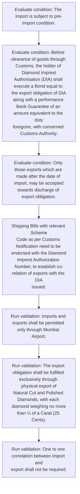
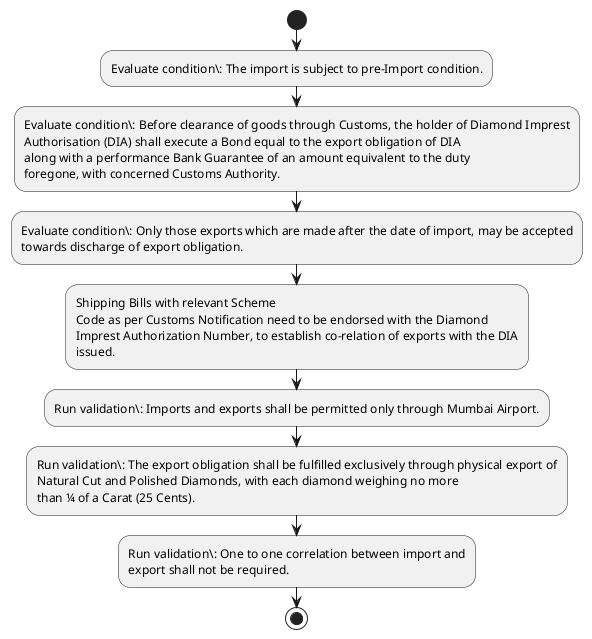

# Chapter 4 / Section 4.96: Conditions of Imports & Exports

**Chapter Title:** Duty Exemption / Remission Schemes

**Pages:** 56

**Purpose:** Imports and exports shall be permitted only through Mumbai Airport.

**Purpose Thanglish:** Indha Conditions of Imports & Exports section-la, Imports and exports kandippa be permitted only through Mumbai Airport.

**Summary:** 4.96 Conditions of Imports & Exports
i. Imports and exports shall be permitted only through Mumbai Airport. ii.

**Business Meaning:** Conditions of Imports & Exports governs how DGFT business controls should be applied, validated, and enforced.

**Business Explanation:** Conditions of Imports & Exports explains the operating rule set that DEKAI should enforce. Key control points include Imports and exports shall be permitted only through Mumbai Airport. The section also drives actions such as Shipping Bills with relevant Scheme
Code as per Customs Notification need to be endorsed with the Diamond
Imprest Authorization Number, to establish co-relation of exports with the DIA
issued..

**Business Explanation Thanglish:** Indha Conditions of Imports & Exports section-la, Conditions of Imports & Exports explains the operating rule set that DEKAI should enforce. Key control points include Imports and exports kandippa be permitted only through Mumbai Airport. The section also drives actions such as Shipping Bills with relevant Scheme
Code as per Customs Notification need to be endorsed with the Diamond
Imprest Authorization Number, to establish co-relation of exports with the DIA
issued..

## Business Logic
- Imports and exports shall be permitted only through Mumbai Airport.
- The import is subject to pre-Import condition.
- The export obligation shall be fulfilled exclusively through physical export of
Natural Cut and Polished Diamonds, with each diamond weighing no more
than ¼ of a Carat (25 Cents).
- One to one correlation between import and
export shall not be required.
- The holder of DIA must achieve a minimum value addition of 10% by realizing
in Freely Convertible Currency.
- Provision of Para 2.52 (d) of FTP 2023, shall
not be applicable to this scheme.
- Before clearance of goods through Customs, the holder of Diamond Imprest
Authorisation (DIA) shall execute a Bond equal to the export obligation of DIA
along with a performance Bank Guarantee of an amount equivalent to the duty
foregone, with concerned Customs Authority.

## Business Rules
- rule_id=CH4-SEC4_96-R001, rule_description=Imports and exports shall be permitted only through Mumbai Airport., trigger=Conditions of Imports & Exports, condition=The import is subject to pre-Import condition., validation=Imports and exports shall be permitted only through Mumbai Airport., action=Shipping Bills with relevant Scheme
Code as per Customs Notification need to be endorsed with the Diamond
Imprest Authorization Number, to establish co-relation of exports with the DIA
issued., exception=No explicit exception found in uploaded documents., output=DEKAI should produce a compliance decision for 4.96 - Conditions of Imports & Exports.
- rule_id=CH4-SEC4_96-R002, rule_description=The import is subject to pre-Import condition., trigger=Conditions of Imports & Exports, condition=Before clearance of goods through Customs, the holder of Diamond Imprest
Authorisation (DIA) shall execute a Bond equal to the export obligation of DIA
along with a performance Bank Guarantee of an amount equivalent to the duty
foregone, with concerned Customs Authority., validation=The export obligation shall be fulfilled exclusively through physical export of
Natural Cut and Polished Diamonds, with each diamond weighing no more
than ¼ of a Carat (25 Cents)., action=Shipping Bills with relevant Scheme
Code as per Customs Notification need to be endorsed with the Diamond
Imprest Authorization Number, to establish co-relation of exports with the DIA
issued., exception=No explicit exception found in uploaded documents., output=DEKAI should produce a compliance decision for 4.96 - Conditions of Imports & Exports.
- rule_id=CH4-SEC4_96-R003, rule_description=The export obligation shall be fulfilled exclusively through physical export of
Natural Cut and Polished Diamonds, with each diamond weighing no more
than ¼ of a Carat (25 Cents)., trigger=Conditions of Imports & Exports, condition=Only those exports which are made after the date of import, may be accepted
towards discharge of export obligation., validation=One to one correlation between import and
export shall not be required., action=Shipping Bills with relevant Scheme
Code as per Customs Notification need to be endorsed with the Diamond
Imprest Authorization Number, to establish co-relation of exports with the DIA
issued., exception=No explicit exception found in uploaded documents., output=DEKAI should produce a compliance decision for 4.96 - Conditions of Imports & Exports.
- rule_id=CH4-SEC4_96-R004, rule_description=One to one correlation between import and
export shall not be required., trigger=Conditions of Imports & Exports, condition=Shipping Bills with relevant Scheme
Code as per Customs Notification need to be endorsed with the Diamond
Imprest Authorization Number, to establish co-relation of exports with the DIA
issued., validation=The holder of DIA must achieve a minimum value addition of 10% by realizing
in Freely Convertible Currency., action=Shipping Bills with relevant Scheme
Code as per Customs Notification need to be endorsed with the Diamond
Imprest Authorization Number, to establish co-relation of exports with the DIA
issued., exception=No explicit exception found in uploaded documents., output=DEKAI should produce a compliance decision for 4.96 - Conditions of Imports & Exports.
- rule_id=CH4-SEC4_96-R005, rule_description=The holder of DIA must achieve a minimum value addition of 10% by realizing
in Freely Convertible Currency., trigger=Conditions of Imports & Exports, condition=Shipping Bills with relevant Scheme
Code as per Customs Notification need to be endorsed with the Diamond
Imprest Authorization Number, to establish co-relation of exports with the DIA
issued., validation=Provision of Para 2.52 (d) of FTP 2023, shall
not be applicable to this scheme., action=Shipping Bills with relevant Scheme
Code as per Customs Notification need to be endorsed with the Diamond
Imprest Authorization Number, to establish co-relation of exports with the DIA
issued., exception=No explicit exception found in uploaded documents., output=DEKAI should produce a compliance decision for 4.96 - Conditions of Imports & Exports.
- rule_id=CH4-SEC4_96-R006, rule_description=Provision of Para 2.52 (d) of FTP 2023, shall
not be applicable to this scheme., trigger=Conditions of Imports & Exports, condition=Shipping Bills with relevant Scheme
Code as per Customs Notification need to be endorsed with the Diamond
Imprest Authorization Number, to establish co-relation of exports with the DIA
issued., validation=Before clearance of goods through Customs, the holder of Diamond Imprest
Authorisation (DIA) shall execute a Bond equal to the export obligation of DIA
along with a performance Bank Guarantee of an amount equivalent to the duty
foregone, with concerned Customs Authority., action=Shipping Bills with relevant Scheme
Code as per Customs Notification need to be endorsed with the Diamond
Imprest Authorization Number, to establish co-relation of exports with the DIA
issued., exception=No explicit exception found in uploaded documents., output=DEKAI should produce a compliance decision for 4.96 - Conditions of Imports & Exports.
- rule_id=CH4-SEC4_96-R007, rule_description=Before clearance of goods through Customs, the holder of Diamond Imprest
Authorisation (DIA) shall execute a Bond equal to the export obligation of DIA
along with a performance Bank Guarantee of an amount equivalent to the duty
foregone, with concerned Customs Authority., trigger=Conditions of Imports & Exports, condition=Shipping Bills with relevant Scheme
Code as per Customs Notification need to be endorsed with the Diamond
Imprest Authorization Number, to establish co-relation of exports with the DIA
issued., validation=Only those exports which are made after the date of import, may be accepted
towards discharge of export obligation., action=Shipping Bills with relevant Scheme
Code as per Customs Notification need to be endorsed with the Diamond
Imprest Authorization Number, to establish co-relation of exports with the DIA
issued., exception=No explicit exception found in uploaded documents., output=DEKAI should produce a compliance decision for 4.96 - Conditions of Imports & Exports.

## Conditions
- The import is subject to pre-Import condition.
- Before clearance of goods through Customs, the holder of Diamond Imprest
Authorisation (DIA) shall execute a Bond equal to the export obligation of DIA
along with a performance Bank Guarantee of an amount equivalent to the duty
foregone, with concerned Customs Authority.
- Only those exports which are made after the date of import, may be accepted
towards discharge of export obligation.
- Shipping Bills with relevant Scheme
Code as per Customs Notification need to be endorsed with the Diamond
Imprest Authorization Number, to establish co-relation of exports with the DIA
issued.

## Condition Logic
- id=4.4.96.1, if=The import is subject to pre-Import condition., then=Shipping Bills with relevant Scheme
Code as per Customs Notification need to be endorsed with the Diamond
Imprest Authorization Number, to establish co-relation of exports with the DIA
issued., source=The import is subject to pre-Import condition.
- id=4.4.96.2, if=Before clearance of goods through Customs, the holder of Diamond Imprest
Authorisation (DIA) shall execute a Bond equal to the export obligation of DIA
along with a performance Bank Guarantee of an amount equivalent to the duty
foregone, with concerned Customs Authority., then=Shipping Bills with relevant Scheme
Code as per Customs Notification need to be endorsed with the Diamond
Imprest Authorization Number, to establish co-relation of exports with the DIA
issued., source=Before clearance of goods through Customs, the holder of Diamond Imprest
Authorisation (DIA) shall execute a Bond equal to the export obligation of DIA
along with a performance Bank Guarantee of an amount equivalent to the duty
foregone, with concerned Customs Authority.
- id=4.4.96.3, if=Only those exports which are made after the date of import, may be accepted
towards discharge of export obligation., then=Shipping Bills with relevant Scheme
Code as per Customs Notification need to be endorsed with the Diamond
Imprest Authorization Number, to establish co-relation of exports with the DIA
issued., source=Only those exports which are made after the date of import, may be accepted
towards discharge of export obligation.
- id=4.4.96.4, if=Shipping Bills with relevant Scheme
Code as per Customs Notification need to be endorsed with the Diamond
Imprest Authorization Number, to establish co-relation of exports with the DIA
issued., then=Shipping Bills with relevant Scheme
Code as per Customs Notification need to be endorsed with the Diamond
Imprest Authorization Number, to establish co-relation of exports with the DIA
issued., source=Shipping Bills with relevant Scheme
Code as per Customs Notification need to be endorsed with the Diamond
Imprest Authorization Number, to establish co-relation of exports with the DIA
issued.

## Validations
- Imports and exports shall be permitted only through Mumbai Airport.
- The export obligation shall be fulfilled exclusively through physical export of
Natural Cut and Polished Diamonds, with each diamond weighing no more
than ¼ of a Carat (25 Cents).
- One to one correlation between import and
export shall not be required.
- The holder of DIA must achieve a minimum value addition of 10% by realizing
in Freely Convertible Currency.
- Provision of Para 2.52 (d) of FTP 2023, shall
not be applicable to this scheme.
- Before clearance of goods through Customs, the holder of Diamond Imprest
Authorisation (DIA) shall execute a Bond equal to the export obligation of DIA
along with a performance Bank Guarantee of an amount equivalent to the duty
foregone, with concerned Customs Authority.
- Only those exports which are made after the date of import, may be accepted
towards discharge of export obligation.

## Exceptions
- None identified

## Dependencies
- 2.52

## Authorities
- Customs
- Customs Authority
- Before clearance of goods through Customs
- Code as per Customs

## Required Documents
- Shipping Bills with relevant Scheme
Code as per Customs Notification need to be endorsed with the Diamond
Imprest Authorization Number, to establish co-relation of exports with the DIA
issued.

## Timelines
- Before clearance of goods through Customs, the holder of Diamond Imprest
Authorisation (DIA) shall execute a Bond equal to the export obligation of DIA
along with a performance Bank Guarantee of an amount equivalent to the duty
foregone, with concerned Customs Authority.
- Only those exports which are made after the date of import, may be accepted
towards discharge of export obligation.

## Actions
- Shipping Bills with relevant Scheme
Code as per Customs Notification need to be endorsed with the Diamond
Imprest Authorization Number, to establish co-relation of exports with the DIA
issued.

## Workflow
- Evaluate condition: The import is subject to pre-Import condition.
- Evaluate condition: Before clearance of goods through Customs, the holder of Diamond Imprest
Authorisation (DIA) shall execute a Bond equal to the export obligation of DIA
along with a performance Bank Guarantee of an amount equivalent to the duty
foregone, with concerned Customs Authority.
- Evaluate condition: Only those exports which are made after the date of import, may be accepted
towards discharge of export obligation.
- Shipping Bills with relevant Scheme
Code as per Customs Notification need to be endorsed with the Diamond
Imprest Authorization Number, to establish co-relation of exports with the DIA
issued.
- Run validation: Imports and exports shall be permitted only through Mumbai Airport.
- Run validation: The export obligation shall be fulfilled exclusively through physical export of
Natural Cut and Polished Diamonds, with each diamond weighing no more
than ¼ of a Carat (25 Cents).
- Run validation: One to one correlation between import and
export shall not be required.

## Workflow ASCII
```text
Conditions of Imports & Exports
Evaluate condition: The import is subject to pre-Import condition.
   |
   v
Evaluate condition: Before clearance of goods through Customs, the holder of Diamond Imprest
Authorisation (DIA) shall execute a Bond equal to the export obligation of DIA
along with a performance Bank Guarantee of an amount equivalent to the duty
foregone, with concerned Customs Authority.
   |
   v
Evaluate condition: Only those exports which are made after the date of import, may be accepted
towards discharge of export obligation.
   |
   v
Shipping Bills with relevant Scheme
Code as per Customs Notification need to be endorsed with the Diamond
Imprest Authorization Number, to establish co-relation of exports with the DIA
issued.
   |
   v
Run validation: Imports and exports shall be permitted only through Mumbai Airport.
   |
   v
Run validation: The export obligation shall be fulfilled exclusively through physical export of
Natural Cut and Polished Diamonds, with each diamond weighing no more
than ¼ of a Carat (25 Cents).
   |
   v
Run validation: One to one correlation between import and
export shall not be required.
```

## Decision Tree
- IF The import is subject to pre-Import condition. THEN Shipping Bills with relevant Scheme
Code as per Customs Notification need to be endorsed with the Diamond
Imprest Authorization Number, to establish co-relation of exports with the DIA
issued.
- IF Before clearance of goods through Customs, the holder of Diamond Imprest
Authorisation (DIA) shall execute a Bond equal to the export obligation of DIA
along with a performance Bank Guarantee of an amount equivalent to the duty
foregone, with concerned Customs Authority. THEN Shipping Bills with relevant Scheme
Code as per Customs Notification need to be endorsed with the Diamond
Imprest Authorization Number, to establish co-relation of exports with the DIA
issued.
- IF Only those exports which are made after the date of import, may be accepted
towards discharge of export obligation. THEN Shipping Bills with relevant Scheme
Code as per Customs Notification need to be endorsed with the Diamond
Imprest Authorization Number, to establish co-relation of exports with the DIA
issued.
- IF Shipping Bills with relevant Scheme
Code as per Customs Notification need to be endorsed with the Diamond
Imprest Authorization Number, to establish co-relation of exports with the DIA
issued. THEN Shipping Bills with relevant Scheme
Code as per Customs Notification need to be endorsed with the Diamond
Imprest Authorization Number, to establish co-relation of exports with the DIA
issued.

## Decision Tree ASCII
```text
Conditions of Imports & Exports Decision
IF The import is subject to pre-Import condition. THEN Shipping Bills with relevant Scheme
Code as per Customs Notification need to be endorsed with the Diamond
Imprest Authorization Number, to establish co-relation of exports with the DIA
issued.
   |
   v
IF Before clearance of goods through Customs, the holder of Diamond Imprest
Authorisation (DIA) shall execute a Bond equal to the export obligation of DIA
along with a performance Bank Guarantee of an amount equivalent to the duty
foregone, with concerned Customs Authority. THEN Shipping Bills with relevant Scheme
Code as per Customs Notification need to be endorsed with the Diamond
Imprest Authorization Number, to establish co-relation of exports with the DIA
issued.
   |
   v
IF Only those exports which are made after the date of import, may be accepted
towards discharge of export obligation. THEN Shipping Bills with relevant Scheme
Code as per Customs Notification need to be endorsed with the Diamond
Imprest Authorization Number, to establish co-relation of exports with the DIA
issued.
   |
   v
IF Shipping Bills with relevant Scheme
Code as per Customs Notification need to be endorsed with the Diamond
Imprest Authorization Number, to establish co-relation of exports with the DIA
issued. THEN Shipping Bills with relevant Scheme
Code as per Customs Notification need to be endorsed with the Diamond
Imprest Authorization Number, to establish co-relation of exports with the DIA
issued.
```

## Examples
- User asks to process Conditions of Imports & Exports; the platform checks conditions, validations, and documents before action.

**Real-world Example:** Example: an importer or exporter invokes Conditions of Imports & Exports, submits Shipping Bills with relevant Scheme
Code as per Customs Notification need to be endorsed with the Diamond
Imprest Authorization Number, to establish co-relation of exports with the DIA
issued., and DEKAI uses the extracted rules to shipping bills with relevant scheme
code as per customs notification need to be endorsed with the diamond
imprest authorization number, to establish co-relation of exports with the dia
issued..

**Real-world Example Thanglish:** Indha Conditions of Imports & Exports section-la, Example: an importer or exporter invokes Conditions of Imports & Exports, submits Shipping Bills with relevant Scheme
Code as per Customs Notification need to be endorsed with the Diamond
Imprest Authorization Number, to establish co-relation of exports with the DIA
issued., and DEKAI uses the extracted rules to shipping bills with relevant scheme
code as per customs notification need to be endorsed with the diamond
imprest authorization number, to establish co-relation of exports with the dia
issued..

## AI Rules
- IF detected context matches section rule THEN enforce: Imports and exports shall be permitted only through Mumbai Airport.
- IF detected context matches section rule THEN enforce: The import is subject to pre-Import condition.
- IF detected context matches section rule THEN enforce: The export obligation shall be fulfilled exclusively through physical export of
Natural Cut and Polished Diamonds, with each diamond weighing no more
than ¼ of a Carat (25 Cents).
- IF detected context matches section rule THEN enforce: One to one correlation between import and
export shall not be required.
- IF detected context matches section rule THEN enforce: The holder of DIA must achieve a minimum value addition of 10% by realizing
in Freely Convertible Currency.
- IF detected context matches section rule THEN enforce: Provision of Para 2.52 (d) of FTP 2023, shall
not be applicable to this scheme.
- IF validations pass THEN recommend action: Shipping Bills with relevant Scheme
Code as per Customs Notification need to be endorsed with the Diamond
Imprest Authorization Number, to establish co-relation of exports with the DIA
issued.

## Database Fields
- name=section_code, type=string, required=True, source=parsed_section_heading
- name=section_title, type=string, required=True, source=parsed_section_heading
- name=and_flag, type=boolean, required=False, source=keyword:and
- name=the_flag, type=boolean, required=False, source=keyword:The
- name=iii_flag, type=boolean, required=False, source=keyword:iii
- name=cut_flag, type=boolean, required=False, source=keyword:Cut
- name=one_flag, type=boolean, required=False, source=keyword:One
- name=not_flag, type=boolean, required=False, source=keyword:not
- name=dia_flag, type=boolean, required=False, source=keyword:DIA
- name=ftp_flag, type=boolean, required=False, source=keyword:FTP
- name=document_1_submitted, type=boolean, required=True, source=Shipping Bills with relevant Scheme
Code as per Customs Notification need to be endorsed with the Diamond
Imprest Authorization Number, to establish co-relation of exports with the DIA
issued.

## API Requirements
- method=GET, path=/api/dgft/sections/4.96, purpose=Retrieve knowledge payload for section 4.96, query_params=['include=workflow,decision_tree,validations'], response_fields=['section', 'title', 'summary', 'conditions', 'validations', 'exceptions', 'workflow', 'decision_tree']
- method=POST, path=/api/dgft/Conditions-of-Imports-Exports/validate, purpose=Validate inputs and documents for Conditions of Imports & Exports, request_fields=['section_code', 'section_title', 'document_1_submitted'], response_fields=['status', 'errors', 'warnings', 'next_actions']
- method=POST, path=/api/dgft/Conditions-of-Imports-Exports/execute, purpose=Trigger business action for Shipping Bills with relevant Scheme
Code as per Customs Notification need to be endorsed with the Diamond
Imprest Authorization Number, to establish co-relation of exports with the DIA
issued., request_fields=['section_code', 'section_title', 'document_1_submitted'], response_fields=['reference_id', 'status', 'authority', 'timeline']

## UI Screens
- screen_id=Conditions_of_Imports_Exports_overview, name=Conditions of Imports & Exports Overview, purpose=Show section summary, authority, timeline, and eligibility cues., widgets=['summary_card', 'conditions_table', 'authority_badges', 'timeline_panel']
- screen_id=Conditions_of_Imports_Exports_submission, name=Conditions of Imports & Exports Submission, purpose=Capture applicant data and supporting documents., widgets=['dynamic_form', 'document_uploader', 'validation_panel', 'next_action_footer'], fields=['section_code', 'section_title', 'and_flag', 'the_flag', 'iii_flag', 'cut_flag', 'one_flag', 'not_flag']

## Error Messages
- Deemed exports are not allowed under this scheme.

## FAQ
- question_en=What is the purpose of section 4.96?, answer_en=Conditions of Imports & Exports explains the operating rule set that DEKAI should enforce. Key control points include Imports and exports shall be permitted only through Mumbai Airport. The section also drives actions such as Shipping Bills with relevant Scheme
Code as per Customs Notification need to be endorsed with the Diamond
Imprest Authorization Number, to establish co-relation of exports with the DIA
issued.., question_thanglish=Indha Conditions of Imports & Exports section-la, What is the purpose of section 4.96?, answer_thanglish=Indha Conditions of Imports & Exports section-la, Conditions of Imports & Exports explains the operating rule set that DEKAI should enforce. Key control points include Imports and exports kandippa be permitted only through Mumbai Airport. The section also drives actions such as Shipping Bills with relevant Scheme
Code as per Customs Notification need to be endorsed with the Diamond
Imprest Authorization Number, to establish co-relation of exports with the DIA
issued..
- question_en=What documents are required under Conditions of Imports & Exports?, answer_en=Shipping Bills with relevant Scheme
Code as per Customs Notification need to be endorsed with the Diamond
Imprest Authorization Number, to establish co-relation of exports with the DIA
issued., question_thanglish=Indha Conditions of Imports & Exports section-la, What documents are required under Conditions of Imports & Exports?, answer_thanglish=Indha Conditions of Imports & Exports section-la, Shipping Bills with relevant Scheme
Code as per Customs Notification need to be endorsed with the Diamond
Imprest Authorization Number, to establish co-relation of exports with the DIA
issued.
- question_en=Which authority handles Conditions of Imports & Exports?, answer_en=Customs, Customs Authority, Before clearance of goods through Customs, Code as per Customs, question_thanglish=Indha Conditions of Imports & Exports section-la, Which authority handles Conditions of Imports & Exports?, answer_thanglish=Indha Conditions of Imports & Exports section-la, Customs, Customs authority, Before clearance of goods through Customs, Code as per Customs

## Questions Users May Ask
- What does Conditions of Imports & Exports require?
- Which documents are needed for Conditions of Imports & Exports?
- How does DEKAI validate Conditions of Imports & Exports requests?
- What action should be taken for Conditions of Imports & Exports?

## Expected AI Answers
- Conditions of Imports & Exports requires the platform to interpret the section text, apply the extracted business rules, and present the correct next action.
- Required documents are inferred from the section text: Shipping Bills with relevant Scheme
Code as per Customs Notification need to be endorsed with the Diamond
Imprest Authorization Number, to establish co-relation of exports with the DIA
issued.
- DEKAI validates Conditions of Imports & Exports by checking conditions, required documents, authority references, and exception clauses before recommending an outcome.
- The primary extracted action is: Shipping Bills with relevant Scheme
Code as per Customs Notification need to be endorsed with the Diamond
Imprest Authorization Number, to establish co-relation of exports with the DIA
issued.

## AI Q&A Examples
- question_en=User asks: How do I comply with Conditions of Imports & Exports?, answer_en=AI answers: DEKAI should evaluate section 4.96, apply the extracted rules, and guide the user through Evaluate condition: The import is subject to pre-Import condition.., question_thanglish=Indha Conditions of Imports & Exports section-la, User asks: How do I comply with Conditions of Imports & Exports?, answer_thanglish=Indha Conditions of Imports & Exports section-la, AI answers: DEKAI should evaluate section 4.96, apply the extracted rules, and guide the user through Evaluate condition: The import is subject to pre-import condition..
- question_en=User asks: Which validations apply to Conditions of Imports & Exports?, answer_en=AI answers: Applicable validations are Imports and exports shall be permitted only through Mumbai Airport., The export obligation shall be fulfilled exclusively through physical export of
Natural Cut and Polished Diamonds, with each diamond weighing no more
than ¼ of a Carat (25 Cents)., One to one correlation between import and
export shall not be required., question_thanglish=Indha Conditions of Imports & Exports section-la, User asks: Which validations apply to Conditions of Imports & Exports?, answer_thanglish=Indha Conditions of Imports & Exports section-la, AI answers: Applicable validations are Imports and exports kandippa be permitted only through Mumbai Airport., The export obligation kandippa be fulfilled exclusively through physical export of
Natural Cut and Polished Diamonds, with each diamond weighing no more
than ¼ of a Carat (25 Cents)., One to one correlation between import and
export kandippa not be required.

## DEKAI AI Implementation Notes
- Capture chapter 4, section 4.96, title, and page references as immutable knowledge metadata.
- Bind validations for Conditions of Imports & Exports into a rule engine keyed by the rule IDs extracted for this section.
- Expose document upload controls for: Shipping Bills with relevant Scheme
Code as per Customs Notification need to be endorsed with the Diamond
Imprest Authorization Number, to establish co-relation of exports with the DIA
issued..
- Route escalations or approvals to: Customs, Customs Authority, Before clearance of goods through Customs, Code as per Customs.

## DEKAI AI Implementation Notes Thanglish
- Indha Conditions of Imports & Exports section-la, Capture chapter 4, section 4.96, title, and page references as immutable knowledge metadata.
- Indha Conditions of Imports & Exports section-la, Bind validations for Conditions of Imports & Exports into a rule engine keyed by the rule IDs extracted for this section.
- Indha Conditions of Imports & Exports section-la, Expose document upload controls for: Shipping Bills with relevant Scheme
Code as per Customs Notification need to be endorsed with the Diamond
Imprest Authorization Number, to establish co-relation of exports with the DIA
issued..
- Indha Conditions of Imports & Exports section-la, Route escalations or approvals to: Customs, Customs authority, Before clearance of goods through Customs, Code as per Customs.

## AI Metadata
- Keywords: and, The, iii, Cut, One, not, DIA, FTP, are, vii, may, per, only, with, each, more, than, must, Para, this
- Search Keywords: and, The, iii, Cut, One, not, DIA, FTP, are, vii, may, per, only, with, each, more, than, must, Para, this
- Intent: Support Conditions of Imports & Exports processing and compliance validation.
- Tags: 4.96, Conditions of Imports & Exports, business-rule, document-driven, dgft
- Related Sections: 
- Related Chapters: 
- Related Rules: Imports and exports shall be permitted only through Mumbai Airport., The import is subject to pre-Import condition., The export obligation shall be fulfilled exclusively through physical export of
Natural Cut and Polished Diamonds, with each diamond weighing no more
than ¼ of a Carat (25 Cents)., One to one correlation between import and
export shall not be required., The holder of DIA must achieve a minimum value addition of 10% by realizing
in Freely Convertible Currency.

## Mermaid


## PlantUML

