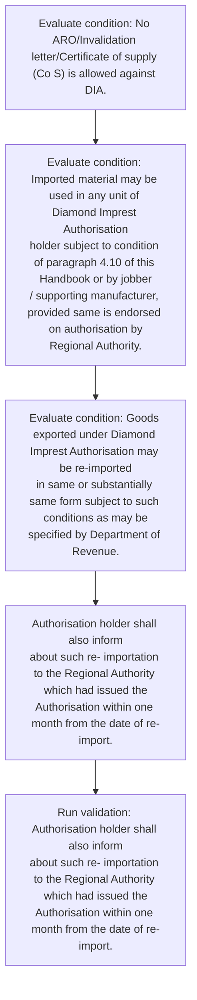
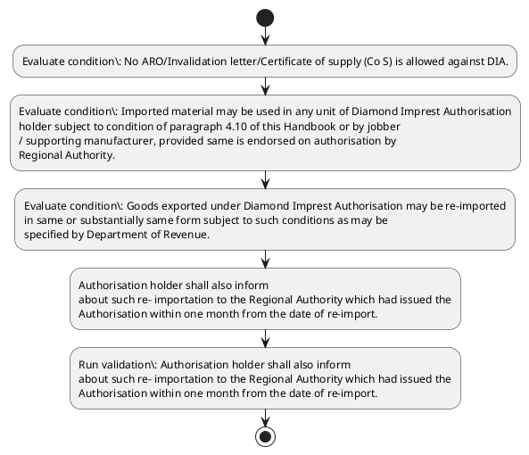

# Chapter 4 / Section 4.97: General Provision

**Chapter Title:** Duty Exemption / Remission Schemes

**Pages:** 56, 57

**Purpose:** For the purpose of import, the validity of DIA is 12 months from the date of
issuance of Authorisation.

**Purpose Thanglish:** Indha General Provision section-la, For the purpose of import, the validity of DIA is 12 months from the date of
issuance of Authorisation.

**Summary:** 4.97 General Provision
i. For the purpose of import, the validity of DIA is 12 months from the date of
issuance of Authorisation. ii.

**Business Meaning:** General Provision governs how DGFT business controls should be applied, validated, and enforced.

**Business Explanation:** General Provision explains the operating rule set that DEKAI should enforce. Key control points include Imported material may be used in any unit of Diamond Imprest Authorisation
holder subject to condition of paragraph 4.10 of this Handbook or by jobber
/ supporting manufacturer, provided same is endorsed on authorisation by
Regional Authority. The section also drives actions such as Authorisation holder shall also inform
about such re- importation to the Regional Authority which had issued the
Authorisation within one month from the date of re-import..

**Business Explanation Thanglish:** Indha General Provision section-la, General Provision explains the operating rule set that DEKAI should enforce. Key control points include Imported material may be used in any unit of Diamond Imprest Authorisation
holder subject to condition of paragraph 4.10 of this Handbook or by jobber
/ supporting manufacturer, provided same is endorsed on authorisation by
Regional authority. The section also drives actions such as Authorisation holder kandippa also inform
about such re- importation to the Regional authority which had issued the
Authorisation within one month from the date of re-import..

## Business Logic
- Imported material may be used in any unit of Diamond Imprest Authorisation
holder subject to condition of paragraph 4.10 of this Handbook or by jobber
/ supporting manufacturer, provided same is endorsed on authorisation by
Regional Authority.
- Goods exported under Diamond Imprest Authorisation may be re-imported
in same or substantially same form subject to such conditions as may be
specified by Department of Revenue.
- Authorisation holder shall also inform
about such re- importation to the Regional Authority which had issued the
Authorisation within one month from the date of re-import.

## Business Rules
- rule_id=CH4-SEC4_97-R001, rule_description=Imported material may be used in any unit of Diamond Imprest Authorisation
holder subject to condition of paragraph 4.10 of this Handbook or by jobber
/ supporting manufacturer, provided same is endorsed on authorisation by
Regional Authority., trigger=General Provision, condition=No ARO/Invalidation letter/Certificate of supply (Co S) is allowed against DIA., validation=Authorisation holder shall also inform
about such re- importation to the Regional Authority which had issued the
Authorisation within one month from the date of re-import., action=Authorisation holder shall also inform
about such re- importation to the Regional Authority which had issued the
Authorisation within one month from the date of re-import., exception=No explicit exception found in uploaded documents., output=DEKAI should produce a compliance decision for 4.97 - General Provision.
- rule_id=CH4-SEC4_97-R002, rule_description=Goods exported under Diamond Imprest Authorisation may be re-imported
in same or substantially same form subject to such conditions as may be
specified by Department of Revenue., trigger=General Provision, condition=Imported material may be used in any unit of Diamond Imprest Authorisation
holder subject to condition of paragraph 4.10 of this Handbook or by jobber
/ supporting manufacturer, provided same is endorsed on authorisation by
Regional Authority., validation=Authorisation holder shall also inform
about such re- importation to the Regional Authority which had issued the
Authorisation within one month from the date of re-import., action=Authorisation holder shall also inform
about such re- importation to the Regional Authority which had issued the
Authorisation within one month from the date of re-import., exception=No explicit exception found in uploaded documents., output=DEKAI should produce a compliance decision for 4.97 - General Provision.
- rule_id=CH4-SEC4_97-R003, rule_description=Authorisation holder shall also inform
about such re- importation to the Regional Authority which had issued the
Authorisation within one month from the date of re-import., trigger=General Provision, condition=Goods exported under Diamond Imprest Authorisation may be re-imported
in same or substantially same form subject to such conditions as may be
specified by Department of Revenue., validation=Authorisation holder shall also inform
about such re- importation to the Regional Authority which had issued the
Authorisation within one month from the date of re-import., action=Authorisation holder shall also inform
about such re- importation to the Regional Authority which had issued the
Authorisation within one month from the date of re-import., exception=No explicit exception found in uploaded documents., output=DEKAI should produce a compliance decision for 4.97 - General Provision.

## Conditions
- No ARO/Invalidation letter/Certificate of supply (Co S) is allowed against DIA.
- Imported material may be used in any unit of Diamond Imprest Authorisation
holder subject to condition of paragraph 4.10 of this Handbook or by jobber
/ supporting manufacturer, provided same is endorsed on authorisation by
Regional Authority.
- Goods exported under Diamond Imprest Authorisation may be re-imported
in same or substantially same form subject to such conditions as may be
specified by Department of Revenue.

## Condition Logic
- id=4.4.97.1, if=No ARO/Invalidation letter/Certificate of supply (Co S) is allowed against DIA., then=Authorisation holder shall also inform
about such re- importation to the Regional Authority which had issued the
Authorisation within one month from the date of re-import., source=No ARO/Invalidation letter/Certificate of supply (Co S) is allowed against DIA.
- id=4.4.97.2, if=Imported material may be used in any unit of Diamond Imprest Authorisation
holder subject to condition of paragraph 4.10 of this Handbook or by jobber
/ supporting manufacturer, provided same is endorsed on authorisation by
Regional Authority., then=Authorisation holder shall also inform
about such re- importation to the Regional Authority which had issued the
Authorisation within one month from the date of re-import., source=Imported material may be used in any unit of Diamond Imprest Authorisation
holder subject to condition of paragraph 4.10 of this Handbook or by jobber
/ supporting manufacturer, provided same is endorsed on authorisation by
Regional Authority.
- id=4.4.97.3, if=Goods exported under Diamond Imprest Authorisation may be re-imported
in same or substantially same form subject to such conditions as may be
specified by Department of Revenue., then=Authorisation holder shall also inform
about such re- importation to the Regional Authority which had issued the
Authorisation within one month from the date of re-import., source=Goods exported under Diamond Imprest Authorisation may be re-imported
in same or substantially same form subject to such conditions as may be
specified by Department of Revenue.

## Validations
- Authorisation holder shall also inform
about such re- importation to the Regional Authority which had issued the
Authorisation within one month from the date of re-import.

## Exceptions
- None identified

## Dependencies
- 4.10

## Authorities
- Regional Authority

## Required Documents
- No ARO/Invalidation letter/Certificate
- The facility of Co-licensee is not available for the DIA.

## Timelines
- For the purpose of import, the validity of DIA is 12 months from the date of
issuance of Authorisation.
- Period of fulfilment of export obligation is 18 months from the date of
issuance of Authorisation.
- Authorisation holder shall also inform
about such re- importation to the Regional Authority which had issued the
Authorisation within one month from the date of re-import.

## Actions
- Authorisation holder shall also inform
about such re- importation to the Regional Authority which had issued the
Authorisation within one month from the date of re-import.

## Workflow
- Evaluate condition: No ARO/Invalidation letter/Certificate of supply (Co S) is allowed against DIA.
- Evaluate condition: Imported material may be used in any unit of Diamond Imprest Authorisation
holder subject to condition of paragraph 4.10 of this Handbook or by jobber
/ supporting manufacturer, provided same is endorsed on authorisation by
Regional Authority.
- Evaluate condition: Goods exported under Diamond Imprest Authorisation may be re-imported
in same or substantially same form subject to such conditions as may be
specified by Department of Revenue.
- Authorisation holder shall also inform
about such re- importation to the Regional Authority which had issued the
Authorisation within one month from the date of re-import.
- Run validation: Authorisation holder shall also inform
about such re- importation to the Regional Authority which had issued the
Authorisation within one month from the date of re-import.

## Workflow ASCII
```text
General Provision
Evaluate condition: No ARO/Invalidation letter/Certificate of supply (Co S) is allowed against DIA.
   |
   v
Evaluate condition: Imported material may be used in any unit of Diamond Imprest Authorisation
holder subject to condition of paragraph 4.10 of this Handbook or by jobber
/ supporting manufacturer, provided same is endorsed on authorisation by
Regional Authority.
   |
   v
Evaluate condition: Goods exported under Diamond Imprest Authorisation may be re-imported
in same or substantially same form subject to such conditions as may be
specified by Department of Revenue.
   |
   v
Authorisation holder shall also inform
about such re- importation to the Regional Authority which had issued the
Authorisation within one month from the date of re-import.
   |
   v
Run validation: Authorisation holder shall also inform
about such re- importation to the Regional Authority which had issued the
Authorisation within one month from the date of re-import.
```

## Decision Tree
- IF No ARO/Invalidation letter/Certificate of supply (Co S) is allowed against DIA. THEN Authorisation holder shall also inform
about such re- importation to the Regional Authority which had issued the
Authorisation within one month from the date of re-import.
- IF Imported material may be used in any unit of Diamond Imprest Authorisation
holder subject to condition of paragraph 4.10 of this Handbook or by jobber
/ supporting manufacturer, provided same is endorsed on authorisation by
Regional Authority. THEN Authorisation holder shall also inform
about such re- importation to the Regional Authority which had issued the
Authorisation within one month from the date of re-import.
- IF Goods exported under Diamond Imprest Authorisation may be re-imported
in same or substantially same form subject to such conditions as may be
specified by Department of Revenue. THEN Authorisation holder shall also inform
about such re- importation to the Regional Authority which had issued the
Authorisation within one month from the date of re-import.

## Decision Tree ASCII
```text
General Provision Decision
IF No ARO/Invalidation letter/Certificate of supply (Co S) is allowed against DIA. THEN Authorisation holder shall also inform
about such re- importation to the Regional Authority which had issued the
Authorisation within one month from the date of re-import.
   |
   v
IF Imported material may be used in any unit of Diamond Imprest Authorisation
holder subject to condition of paragraph 4.10 of this Handbook or by jobber
/ supporting manufacturer, provided same is endorsed on authorisation by
Regional Authority. THEN Authorisation holder shall also inform
about such re- importation to the Regional Authority which had issued the
Authorisation within one month from the date of re-import.
   |
   v
IF Goods exported under Diamond Imprest Authorisation may be re-imported
in same or substantially same form subject to such conditions as may be
specified by Department of Revenue. THEN Authorisation holder shall also inform
about such re- importation to the Regional Authority which had issued the
Authorisation within one month from the date of re-import.
```

## Examples
- User asks to process General Provision; the platform checks conditions, validations, and documents before action.

**Real-world Example:** Example: an importer or exporter invokes General Provision, submits No ARO/Invalidation letter/Certificate, The facility of Co-licensee is not available for the DIA., and DEKAI uses the extracted rules to authorisation holder shall also inform
about such re- importation to the regional authority which had issued the
authorisation within one month from the date of re-import..

**Real-world Example Thanglish:** Indha General Provision section-la, Example: an importer or exporter invokes General Provision, submits No ARO/Invalidation letter/Certificate, The facility of Co-licensee is not available for the DIA., and DEKAI uses the extracted rules to authorisation holder kandippa also inform
about such re- importation to the regional authority which had issued the
authorisation within one month from the date of re-import..

## AI Rules
- IF detected context matches section rule THEN enforce: Imported material may be used in any unit of Diamond Imprest Authorisation
holder subject to condition of paragraph 4.10 of this Handbook or by jobber
/ supporting manufacturer, provided same is endorsed on authorisation by
Regional Authority.
- IF detected context matches section rule THEN enforce: Goods exported under Diamond Imprest Authorisation may be re-imported
in same or substantially same form subject to such conditions as may be
specified by Department of Revenue.
- IF detected context matches section rule THEN enforce: Authorisation holder shall also inform
about such re- importation to the Regional Authority which had issued the
Authorisation within one month from the date of re-import.
- IF validations pass THEN recommend action: Authorisation holder shall also inform
about such re- importation to the Regional Authority which had issued the
Authorisation within one month from the date of re-import.

## Database Fields
- name=section_code, type=string, required=True, source=parsed_section_heading
- name=section_title, type=string, required=True, source=parsed_section_heading
- name=for_flag, type=boolean, required=False, source=keyword:For
- name=the_flag, type=boolean, required=False, source=keyword:the
- name=dia_flag, type=boolean, required=False, source=keyword:DIA
- name=iii_flag, type=boolean, required=False, source=keyword:iii
- name=one_flag, type=boolean, required=False, source=keyword:one
- name=iec_flag, type=boolean, required=False, source=keyword:IEC
- name=may_flag, type=boolean, required=False, source=keyword:may
- name=any_flag, type=boolean, required=False, source=keyword:any
- name=document_1_submitted, type=boolean, required=True, source=No ARO/Invalidation letter/Certificate
- name=document_2_submitted, type=boolean, required=True, source=The facility of Co-licensee is not available for the DIA.

## API Requirements
- method=GET, path=/api/dgft/sections/4.97, purpose=Retrieve knowledge payload for section 4.97, query_params=['include=workflow,decision_tree,validations'], response_fields=['section', 'title', 'summary', 'conditions', 'validations', 'exceptions', 'workflow', 'decision_tree']
- method=POST, path=/api/dgft/General-Provision/validate, purpose=Validate inputs and documents for General Provision, request_fields=['section_code', 'section_title', 'document_1_submitted', 'document_2_submitted'], response_fields=['status', 'errors', 'warnings', 'next_actions']
- method=POST, path=/api/dgft/General-Provision/execute, purpose=Trigger business action for Authorisation holder shall also inform
about such re- importation to the Regional Authority which had issued the
Authorisation within one month from the date of re-import., request_fields=['section_code', 'section_title', 'document_1_submitted', 'document_2_submitted'], response_fields=['reference_id', 'status', 'authority', 'timeline']

## UI Screens
- screen_id=General_Provision_overview, name=General Provision Overview, purpose=Show section summary, authority, timeline, and eligibility cues., widgets=['summary_card', 'conditions_table', 'authority_badges', 'timeline_panel']
- screen_id=General_Provision_submission, name=General Provision Submission, purpose=Capture applicant data and supporting documents., widgets=['dynamic_form', 'document_uploader', 'validation_panel', 'next_action_footer'], fields=['section_code', 'section_title', 'for_flag', 'the_flag', 'dia_flag', 'iii_flag', 'one_flag', 'iec_flag']

## Error Messages
- Validation failed because the section requirements were not fully met.

## FAQ
- question_en=What is the purpose of section 4.97?, answer_en=General Provision explains the operating rule set that DEKAI should enforce. Key control points include Imported material may be used in any unit of Diamond Imprest Authorisation
holder subject to condition of paragraph 4.10 of this Handbook or by jobber
/ supporting manufacturer, provided same is endorsed on authorisation by
Regional Authority. The section also drives actions such as Authorisation holder shall also inform
about such re- importation to the Regional Authority which had issued the
Authorisation within one month from the date of re-import.., question_thanglish=Indha General Provision section-la, What is the purpose of section 4.97?, answer_thanglish=Indha General Provision section-la, General Provision explains the operating rule set that DEKAI should enforce. Key control points include Imported material may be used in any unit of Diamond Imprest Authorisation
holder subject to condition of paragraph 4.10 of this Handbook or by jobber
/ supporting manufacturer, provided same is endorsed on authorisation by
Regional authority. The section also drives actions such as Authorisation holder kandippa also inform
about such re- importation to the Regional authority which had issued the
Authorisation within one month from the date of re-import..
- question_en=What documents are required under General Provision?, answer_en=No ARO/Invalidation letter/Certificate, The facility of Co-licensee is not available for the DIA., question_thanglish=Indha General Provision section-la, What documents are required under General Provision?, answer_thanglish=Indha General Provision section-la, No ARO/Invalidation letter/Certificate, The facility of Co-licensee is not available for the DIA.
- question_en=Which authority handles General Provision?, answer_en=Regional Authority, question_thanglish=Indha General Provision section-la, Which authority handles General Provision?, answer_thanglish=Indha General Provision section-la, Regional authority

## Questions Users May Ask
- What does General Provision require?
- Which documents are needed for General Provision?
- How does DEKAI validate General Provision requests?
- What action should be taken for General Provision?

## Expected AI Answers
- General Provision requires the platform to interpret the section text, apply the extracted business rules, and present the correct next action.
- Required documents are inferred from the section text: No ARO/Invalidation letter/Certificate, The facility of Co-licensee is not available for the DIA.
- DEKAI validates General Provision by checking conditions, required documents, authority references, and exception clauses before recommending an outcome.
- The primary extracted action is: Authorisation holder shall also inform
about such re- importation to the Regional Authority which had issued the
Authorisation within one month from the date of re-import.

## AI Q&A Examples
- question_en=User asks: How do I comply with General Provision?, answer_en=AI answers: DEKAI should evaluate section 4.97, apply the extracted rules, and guide the user through Evaluate condition: No ARO/Invalidation letter/Certificate of supply (Co S) is allowed against DIA.., question_thanglish=Indha General Provision section-la, User asks: How do I comply with General Provision?, answer_thanglish=Indha General Provision section-la, AI answers: DEKAI should evaluate section 4.97, apply the extracted rules, and guide the user through Evaluate condition: No ARO/Invalidation letter/Certificate of supply (Co S) is allowed against DIA..
- question_en=User asks: Which validations apply to General Provision?, answer_en=AI answers: Applicable validations are Authorisation holder shall also inform
about such re- importation to the Regional Authority which had issued the
Authorisation within one month from the date of re-import., question_thanglish=Indha General Provision section-la, User asks: Which validations apply to General Provision?, answer_thanglish=Indha General Provision section-la, AI answers: Applicable validations are Authorisation holder kandippa also inform
about such re- importation to the Regional authority which had issued the
Authorisation within one month from the date of re-import.

## DEKAI AI Implementation Notes
- Capture chapter 4, section 4.97, title, and page references as immutable knowledge metadata.
- Bind validations for General Provision into a rule engine keyed by the rule IDs extracted for this section.
- Expose document upload controls for: No ARO/Invalidation letter/Certificate, The facility of Co-licensee is not available for the DIA..
- Route escalations or approvals to: Regional Authority.
- Show contextual links to related sections: 4.10.

## DEKAI AI Implementation Notes Thanglish
- Indha General Provision section-la, Capture chapter 4, section 4.97, title, and page references as immutable knowledge metadata.
- Indha General Provision section-la, Bind validations for General Provision into a rule engine keyed by the rule IDs extracted for this section.
- Indha General Provision section-la, Expose document upload controls for: No ARO/Invalidation letter/Certificate, The facility of Co-licensee is not available for the DIA..
- Indha General Provision section-la, Route escalations or approvals to: Regional authority.
- Indha General Provision section-la, Show contextual links to related sections: 4.10.

## AI Metadata
- Keywords: For, the, DIA, iii, one, IEC, may, any, not, had, vii, from, date, Only, year, used, unit, this, same, form
- Search Keywords: For, the, DIA, iii, one, IEC, may, any, not, had, vii, from, date, Only, year, used, unit, this, same, form
- Intent: Support General Provision processing and compliance validation.
- Tags: 4.97, General Provision, business-rule, document-driven, dgft
- Related Sections: 4.10
- Related Chapters: 
- Related Rules: Imported material may be used in any unit of Diamond Imprest Authorisation
holder subject to condition of paragraph 4.10 of this Handbook or by jobber
/ supporting manufacturer, provided same is endorsed on authorisation by
Regional Authority., Goods exported under Diamond Imprest Authorisation may be re-imported
in same or substantially same form subject to such conditions as may be
specified by Department of Revenue., Authorisation holder shall also inform
about such re- importation to the Regional Authority which had issued the
Authorisation within one month from the date of re-import.

## Mermaid


## PlantUML

