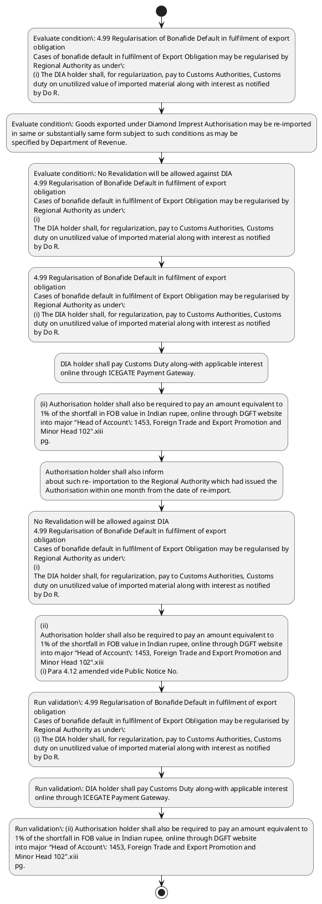

# Chapter 4 / Section 4.99: Regularisation of Bonafide Default in fulfilment of export

**Chapter Title:** Duty Exemption / Remission Schemes

**Pages:** 57, 58

**Purpose:** 4.99 Regularisation of Bonafide Default in fulfilment of export
obligation
Cases of bonafide default in fulfilment of Export Obligation may be regularised by
Regional Authority as under:
(i) The DIA holder shall, for regularization, pay to Customs Authorities, Customs
duty on unutilized value of imported material along with interest as notified
by Do R.

**Purpose Thanglish:** Indha Regularisation of Bonafide Default in fulfilment of export section-la, 4.99 Regularisation of Bonafide Default in fulfilment of export
obligation
Cases of bonafide default in fulfilment of export Obligation may be regularised by
Regional authority as under:
(i) The DIA holder kandippa, for regularization, pay to Customs Authorities, Customs
duty on unutilized value of imported material along with interest as notified
by Do R.

**Summary:** 4.99 Regularisation of Bonafide Default in fulfilment of export
obligation
Cases of bonafide default in fulfilment of Export Obligation may be regularised by
Regional Authority as under:
(i) The DIA holder shall, for regularization, pay to Customs Authorities, Customs
duty on unutilized value of imported material along with interest as notified
by Do R. DIA holder shall pay Customs Duty along-with applicable interest
online through ICEGATE Payment Gateway. (ii) Authorisation holder shall also be required to pay an amount equivalent to
1% of the shortfall in FOB value in Indian rupee, online through DGFT website
into major “Head of Account: 1453, Foreign Trade and Export Promotion and
Minor Head 102".xiii
pg.

**Business Meaning:** Regularisation of Bonafide Default in fulfilment of export governs how DGFT business controls should be applied, validated, and enforced.

**Business Explanation:** Regularisation of Bonafide Default in fulfilment of export explains the operating rule set that DEKAI should enforce. Key control points include 4.99 Regularisation of Bonafide Default in fulfilment of export
obligation
Cases of bonafide default in fulfilment of Export Obligation may be regularised by
Regional Authority as under:
(i) The DIA holder shall, for regularization, pay to Customs Authorities, Customs
duty on unutilized value of imported material along with interest as notified
by Do R. The section also drives actions such as 4.99 Regularisation of Bonafide Default in fulfilment of export
obligation
Cases of bonafide default in fulfilment of Export Obligation may be regularised by
Regional Authority as under:
(i) The DIA holder shall, for regularization, pay to Customs Authorities, Customs
duty on unutilized value of imported material along with interest as notified
by Do R..

**Business Explanation Thanglish:** Indha Regularisation of Bonafide Default in fulfilment of export section-la, Regularisation of Bonafide Default in fulfilment of export explains the operating rule set that DEKAI should enforce. Key control points include 4.99 Regularisation of Bonafide Default in fulfilment of export
obligation
Cases of bonafide default in fulfilment of export Obligation may be regularised by
Regional authority as under:
(i) The DIA holder kandippa, for regularization, pay to Customs Authorities, Customs
duty on unutilized value of imported material along with interest as notified
by Do R. The section also drives actions such as 4.99 Regularisation of Bonafide Default in fulfilment of export
obligation
Cases of bonafide default in fulfilment of export Obligation may be regularised by
Regional authority as under:
(i) The DIA holder kandippa, for regularization, pay to Customs Authorities, Customs
duty on unutilized value of imported material along with interest as notified
by Do R..

## Business Logic
- 4.99 Regularisation of Bonafide Default in fulfilment of export
obligation
Cases of bonafide default in fulfilment of Export Obligation may be regularised by
Regional Authority as under:
(i) The DIA holder shall, for regularization, pay to Customs Authorities, Customs
duty on unutilized value of imported material along with interest as notified
by Do R.
- DIA holder shall pay Customs Duty along-with applicable interest
online through ICEGATE Payment Gateway.
- (ii) Authorisation holder shall also be required to pay an amount equivalent to
1% of the shortfall in FOB value in Indian rupee, online through DGFT website
into major “Head of Account: 1453, Foreign Trade and Export Promotion and
Minor Head 102".xiii
pg.
- Goods exported under Diamond Imprest Authorisation may be re-imported
in same or substantially same form subject to such conditions as may be
specified by Department of Revenue.
- Authorisation holder shall also inform
about such re- importation to the Regional Authority which had issued the
Authorisation within one month from the date of re-import.
- No Revalidation will be allowed against DIA
4.99 Regularisation of Bonafide Default in fulfilment of export
obligation
Cases of bonafide default in fulfilment of Export Obligation may be regularised by
Regional Authority as under:
(i)
The DIA holder shall, for regularization, pay to Customs Authorities, Customs
duty on unutilized value of imported material along with interest as notified
by Do R.
- (ii)
Authorisation holder shall also be required to pay an amount equivalent to
1% of the shortfall in FOB value in Indian rupee, online through DGFT website
into major “Head of Account: 1453, Foreign Trade and Export Promotion and
Minor Head 102".xiii
(i) Para 4.12 amended vide Public Notice No.

## Business Rules
- rule_id=CH4-SEC4_99-R001, rule_description=4.99 Regularisation of Bonafide Default in fulfilment of export
obligation
Cases of bonafide default in fulfilment of Export Obligation may be regularised by
Regional Authority as under:
(i) The DIA holder shall, for regularization, pay to Customs Authorities, Customs
duty on unutilized value of imported material along with interest as notified
by Do R., trigger=Regularisation of Bonafide Default in fulfilment of export, condition=4.99 Regularisation of Bonafide Default in fulfilment of export
obligation
Cases of bonafide default in fulfilment of Export Obligation may be regularised by
Regional Authority as under:
(i) The DIA holder shall, for regularization, pay to Customs Authorities, Customs
duty on unutilized value of imported material along with interest as notified
by Do R., validation=4.99 Regularisation of Bonafide Default in fulfilment of export
obligation
Cases of bonafide default in fulfilment of Export Obligation may be regularised by
Regional Authority as under:
(i) The DIA holder shall, for regularization, pay to Customs Authorities, Customs
duty on unutilized value of imported material along with interest as notified
by Do R., action=4.99 Regularisation of Bonafide Default in fulfilment of export
obligation
Cases of bonafide default in fulfilment of Export Obligation may be regularised by
Regional Authority as under:
(i) The DIA holder shall, for regularization, pay to Customs Authorities, Customs
duty on unutilized value of imported material along with interest as notified
by Do R., exception=No explicit exception found in uploaded documents., output=DEKAI should produce a compliance decision for 4.99 - Regularisation of Bonafide Default in fulfilment of export.
- rule_id=CH4-SEC4_99-R002, rule_description=DIA holder shall pay Customs Duty along-with applicable interest
online through ICEGATE Payment Gateway., trigger=Regularisation of Bonafide Default in fulfilment of export, condition=Goods exported under Diamond Imprest Authorisation may be re-imported
in same or substantially same form subject to such conditions as may be
specified by Department of Revenue., validation=DIA holder shall pay Customs Duty along-with applicable interest
online through ICEGATE Payment Gateway., action=DIA holder shall pay Customs Duty along-with applicable interest
online through ICEGATE Payment Gateway., exception=No explicit exception found in uploaded documents., output=DEKAI should produce a compliance decision for 4.99 - Regularisation of Bonafide Default in fulfilment of export.
- rule_id=CH4-SEC4_99-R003, rule_description=(ii) Authorisation holder shall also be required to pay an amount equivalent to
1% of the shortfall in FOB value in Indian rupee, online through DGFT website
into major “Head of Account: 1453, Foreign Trade and Export Promotion and
Minor Head 102".xiii
pg., trigger=Regularisation of Bonafide Default in fulfilment of export, condition=No Revalidation will be allowed against DIA
4.99 Regularisation of Bonafide Default in fulfilment of export
obligation
Cases of bonafide default in fulfilment of Export Obligation may be regularised by
Regional Authority as under:
(i)
The DIA holder shall, for regularization, pay to Customs Authorities, Customs
duty on unutilized value of imported material along with interest as notified
by Do R., validation=(ii) Authorisation holder shall also be required to pay an amount equivalent to
1% of the shortfall in FOB value in Indian rupee, online through DGFT website
into major “Head of Account: 1453, Foreign Trade and Export Promotion and
Minor Head 102".xiii
pg., action=(ii) Authorisation holder shall also be required to pay an amount equivalent to
1% of the shortfall in FOB value in Indian rupee, online through DGFT website
into major “Head of Account: 1453, Foreign Trade and Export Promotion and
Minor Head 102".xiii
pg., exception=No explicit exception found in uploaded documents., output=DEKAI should produce a compliance decision for 4.99 - Regularisation of Bonafide Default in fulfilment of export.
- rule_id=CH4-SEC4_99-R004, rule_description=Goods exported under Diamond Imprest Authorisation may be re-imported
in same or substantially same form subject to such conditions as may be
specified by Department of Revenue., trigger=Regularisation of Bonafide Default in fulfilment of export, condition=No Revalidation will be allowed against DIA
4.99 Regularisation of Bonafide Default in fulfilment of export
obligation
Cases of bonafide default in fulfilment of Export Obligation may be regularised by
Regional Authority as under:
(i)
The DIA holder shall, for regularization, pay to Customs Authorities, Customs
duty on unutilized value of imported material along with interest as notified
by Do R., validation=Authorisation holder shall also inform
about such re- importation to the Regional Authority which had issued the
Authorisation within one month from the date of re-import., action=Authorisation holder shall also inform
about such re- importation to the Regional Authority which had issued the
Authorisation within one month from the date of re-import., exception=No explicit exception found in uploaded documents., output=DEKAI should produce a compliance decision for 4.99 - Regularisation of Bonafide Default in fulfilment of export.
- rule_id=CH4-SEC4_99-R005, rule_description=Authorisation holder shall also inform
about such re- importation to the Regional Authority which had issued the
Authorisation within one month from the date of re-import., trigger=Regularisation of Bonafide Default in fulfilment of export, condition=No Revalidation will be allowed against DIA
4.99 Regularisation of Bonafide Default in fulfilment of export
obligation
Cases of bonafide default in fulfilment of Export Obligation may be regularised by
Regional Authority as under:
(i)
The DIA holder shall, for regularization, pay to Customs Authorities, Customs
duty on unutilized value of imported material along with interest as notified
by Do R., validation=No Revalidation will be allowed against DIA
4.99 Regularisation of Bonafide Default in fulfilment of export
obligation
Cases of bonafide default in fulfilment of Export Obligation may be regularised by
Regional Authority as under:
(i)
The DIA holder shall, for regularization, pay to Customs Authorities, Customs
duty on unutilized value of imported material along with interest as notified
by Do R., action=No Revalidation will be allowed against DIA
4.99 Regularisation of Bonafide Default in fulfilment of export
obligation
Cases of bonafide default in fulfilment of Export Obligation may be regularised by
Regional Authority as under:
(i)
The DIA holder shall, for regularization, pay to Customs Authorities, Customs
duty on unutilized value of imported material along with interest as notified
by Do R., exception=No explicit exception found in uploaded documents., output=DEKAI should produce a compliance decision for 4.99 - Regularisation of Bonafide Default in fulfilment of export.
- rule_id=CH4-SEC4_99-R006, rule_description=No Revalidation will be allowed against DIA
4.99 Regularisation of Bonafide Default in fulfilment of export
obligation
Cases of bonafide default in fulfilment of Export Obligation may be regularised by
Regional Authority as under:
(i)
The DIA holder shall, for regularization, pay to Customs Authorities, Customs
duty on unutilized value of imported material along with interest as notified
by Do R., trigger=Regularisation of Bonafide Default in fulfilment of export, condition=No Revalidation will be allowed against DIA
4.99 Regularisation of Bonafide Default in fulfilment of export
obligation
Cases of bonafide default in fulfilment of Export Obligation may be regularised by
Regional Authority as under:
(i)
The DIA holder shall, for regularization, pay to Customs Authorities, Customs
duty on unutilized value of imported material along with interest as notified
by Do R., validation=(ii)
Authorisation holder shall also be required to pay an amount equivalent to
1% of the shortfall in FOB value in Indian rupee, online through DGFT website
into major “Head of Account: 1453, Foreign Trade and Export Promotion and
Minor Head 102".xiii
(i) Para 4.12 amended vide Public Notice No., action=(ii)
Authorisation holder shall also be required to pay an amount equivalent to
1% of the shortfall in FOB value in Indian rupee, online through DGFT website
into major “Head of Account: 1453, Foreign Trade and Export Promotion and
Minor Head 102".xiii
(i) Para 4.12 amended vide Public Notice No., exception=No explicit exception found in uploaded documents., output=DEKAI should produce a compliance decision for 4.99 - Regularisation of Bonafide Default in fulfilment of export.
- rule_id=CH4-SEC4_99-R007, rule_description=(ii)
Authorisation holder shall also be required to pay an amount equivalent to
1% of the shortfall in FOB value in Indian rupee, online through DGFT website
into major “Head of Account: 1453, Foreign Trade and Export Promotion and
Minor Head 102".xiii
(i) Para 4.12 amended vide Public Notice No., trigger=Regularisation of Bonafide Default in fulfilment of export, condition=No Revalidation will be allowed against DIA
4.99 Regularisation of Bonafide Default in fulfilment of export
obligation
Cases of bonafide default in fulfilment of Export Obligation may be regularised by
Regional Authority as under:
(i)
The DIA holder shall, for regularization, pay to Customs Authorities, Customs
duty on unutilized value of imported material along with interest as notified
by Do R., validation=(ii)
Authorisation holder shall also be required to pay an amount equivalent to
1% of the shortfall in FOB value in Indian rupee, online through DGFT website
into major “Head of Account: 1453, Foreign Trade and Export Promotion and
Minor Head 102".xiii
(i) Para 4.12 amended vide Public Notice No., action=(ii) Para 4.73(15) amended vide Public Notice No., exception=No explicit exception found in uploaded documents., output=DEKAI should produce a compliance decision for 4.99 - Regularisation of Bonafide Default in fulfilment of export.

## Conditions
- 4.99 Regularisation of Bonafide Default in fulfilment of export
obligation
Cases of bonafide default in fulfilment of Export Obligation may be regularised by
Regional Authority as under:
(i) The DIA holder shall, for regularization, pay to Customs Authorities, Customs
duty on unutilized value of imported material along with interest as notified
by Do R.
- Goods exported under Diamond Imprest Authorisation may be re-imported
in same or substantially same form subject to such conditions as may be
specified by Department of Revenue.
- No Revalidation will be allowed against DIA
4.99 Regularisation of Bonafide Default in fulfilment of export
obligation
Cases of bonafide default in fulfilment of Export Obligation may be regularised by
Regional Authority as under:
(i)
The DIA holder shall, for regularization, pay to Customs Authorities, Customs
duty on unutilized value of imported material along with interest as notified
by Do R.

## Condition Logic
- id=4.4.99.1, if=4.99 Regularisation of Bonafide Default in fulfilment of export
obligation
Cases of bonafide default in fulfilment of Export Obligation may be regularised by
Regional Authority as under:
(i) The DIA holder shall, for regularization, pay to Customs Authorities, Customs
duty on unutilized value of imported material along with interest as notified
by Do R., then=4.99 Regularisation of Bonafide Default in fulfilment of export
obligation
Cases of bonafide default in fulfilment of Export Obligation may be regularised by
Regional Authority as under:
(i) The DIA holder shall, for regularization, pay to Customs Authorities, Customs
duty on unutilized value of imported material along with interest as notified
by Do R., source=4.99 Regularisation of Bonafide Default in fulfilment of export
obligation
Cases of bonafide default in fulfilment of Export Obligation may be regularised by
Regional Authority as under:
(i) The DIA holder shall, for regularization, pay to Customs Authorities, Customs
duty on unutilized value of imported material along with interest as notified
by Do R.
- id=4.4.99.2, if=Goods exported under Diamond Imprest Authorisation may be re-imported
in same or substantially same form subject to such conditions as may be
specified by Department of Revenue., then=4.99 Regularisation of Bonafide Default in fulfilment of export
obligation
Cases of bonafide default in fulfilment of Export Obligation may be regularised by
Regional Authority as under:
(i) The DIA holder shall, for regularization, pay to Customs Authorities, Customs
duty on unutilized value of imported material along with interest as notified
by Do R., source=Goods exported under Diamond Imprest Authorisation may be re-imported
in same or substantially same form subject to such conditions as may be
specified by Department of Revenue.
- id=4.4.99.3, if=No Revalidation will be allowed against DIA
4.99 Regularisation of Bonafide Default in fulfilment of export
obligation
Cases of bonafide default in fulfilment of Export Obligation may be regularised by
Regional Authority as under:
(i)
The DIA holder shall, for regularization, pay to Customs Authorities, Customs
duty on unutilized value of imported material along with interest as notified
by Do R., then=4.99 Regularisation of Bonafide Default in fulfilment of export
obligation
Cases of bonafide default in fulfilment of Export Obligation may be regularised by
Regional Authority as under:
(i) The DIA holder shall, for regularization, pay to Customs Authorities, Customs
duty on unutilized value of imported material along with interest as notified
by Do R., source=No Revalidation will be allowed against DIA
4.99 Regularisation of Bonafide Default in fulfilment of export
obligation
Cases of bonafide default in fulfilment of Export Obligation may be regularised by
Regional Authority as under:
(i)
The DIA holder shall, for regularization, pay to Customs Authorities, Customs
duty on unutilized value of imported material along with interest as notified
by Do R.

## Validations
- 4.99 Regularisation of Bonafide Default in fulfilment of export
obligation
Cases of bonafide default in fulfilment of Export Obligation may be regularised by
Regional Authority as under:
(i) The DIA holder shall, for regularization, pay to Customs Authorities, Customs
duty on unutilized value of imported material along with interest as notified
by Do R.
- DIA holder shall pay Customs Duty along-with applicable interest
online through ICEGATE Payment Gateway.
- (ii) Authorisation holder shall also be required to pay an amount equivalent to
1% of the shortfall in FOB value in Indian rupee, online through DGFT website
into major “Head of Account: 1453, Foreign Trade and Export Promotion and
Minor Head 102".xiii
pg.
- Authorisation holder shall also inform
about such re- importation to the Regional Authority which had issued the
Authorisation within one month from the date of re-import.
- No Revalidation will be allowed against DIA
4.99 Regularisation of Bonafide Default in fulfilment of export
obligation
Cases of bonafide default in fulfilment of Export Obligation may be regularised by
Regional Authority as under:
(i)
The DIA holder shall, for regularization, pay to Customs Authorities, Customs
duty on unutilized value of imported material along with interest as notified
by Do R.
- (ii)
Authorisation holder shall also be required to pay an amount equivalent to
1% of the shortfall in FOB value in Indian rupee, online through DGFT website
into major “Head of Account: 1453, Foreign Trade and Export Promotion and
Minor Head 102".xiii
(i) Para 4.12 amended vide Public Notice No.

## Exceptions
- None identified

## Dependencies
- 4.12
- 4.73
- 4.10
- 4.36
- 4.06
- 4.14
- 4.59
- 4.49
- 4.94
- 4.71
- 4.87
- 4.88
- 4.53
- 4.84
- 4.40
- 4.02
- 4.03
- 4.08
- 4.20
- 4.74
- 4.76
- 4.79
- 4.81
- 4.82
- 4.83
- 1
- 2
- 3
- 4
- 5
- 6
- 4.95
- 4.98

## Authorities
- Regional Authority
- Customs
- Customs Authorities
- DIA holder shall pay Customs
- DGFT

## Required Documents
- None identified

## Timelines
- Authorisation holder shall also inform
about such re- importation to the Regional Authority which had issued the
Authorisation within one month from the date of re-import.

## Actions
- 4.99 Regularisation of Bonafide Default in fulfilment of export
obligation
Cases of bonafide default in fulfilment of Export Obligation may be regularised by
Regional Authority as under:
(i) The DIA holder shall, for regularization, pay to Customs Authorities, Customs
duty on unutilized value of imported material along with interest as notified
by Do R.
- DIA holder shall pay Customs Duty along-with applicable interest
online through ICEGATE Payment Gateway.
- (ii) Authorisation holder shall also be required to pay an amount equivalent to
1% of the shortfall in FOB value in Indian rupee, online through DGFT website
into major “Head of Account: 1453, Foreign Trade and Export Promotion and
Minor Head 102".xiii
pg.
- Authorisation holder shall also inform
about such re- importation to the Regional Authority which had issued the
Authorisation within one month from the date of re-import.
- No Revalidation will be allowed against DIA
4.99 Regularisation of Bonafide Default in fulfilment of export
obligation
Cases of bonafide default in fulfilment of Export Obligation may be regularised by
Regional Authority as under:
(i)
The DIA holder shall, for regularization, pay to Customs Authorities, Customs
duty on unutilized value of imported material along with interest as notified
by Do R.
- (ii)
Authorisation holder shall also be required to pay an amount equivalent to
1% of the shortfall in FOB value in Indian rupee, online through DGFT website
into major “Head of Account: 1453, Foreign Trade and Export Promotion and
Minor Head 102".xiii
(i) Para 4.12 amended vide Public Notice No.
- (ii) Para 4.73(15) amended vide Public Notice No.
- (iii) Para 4.10(i) amended vide Public Notice No.
- (iv) Para 4.36(vi) amended vide Public Notice No.
- (vii) Para 4.59 amended vide Public Notice No.
- (viii) Para 4.49 (b) amended vide Public Notice No.
- (ix) Para 4.49 (g) (i) and (ii) amended vide Public Notice No.
- 27 /2024-25 dated 23.10.2024
(xi) Para 4.59 amended vide Public Notice No.
- 30/2024-25 dated
01.11.2024
(xii) Para 4.71 amended vide Public Notice No.
- (xiii) Para 4.87 (a) and Para 4.88 amended vide Public Notice No.
- 33/2025-
26 dated 01.12.2025
(xiv) Para 4.73 amended vide Public Notice No.
- 26/2025-26 dated 15.10.2025)
(xvi) Para 4.59 amended vide Public Notice No.
- (xvii) Para 4.73(19) amended vide Public Notice No.
- 47/2025-26 dated
11.02.2026
(xviii) Para 4.53 (e) amended vide Public Notice No.
- (xix) Para 4.84 (b) amended vide Public Notice No.
- 133
(i)
Para 4.12 amended vide Public Notice No.
- (ii)
Para 4.73(15) amended vide Public Notice No.
- (iii)
Para 4.10(i) amended vide Public Notice No.
- (iv)
Para 4.36(vi) amended vide Public Notice No.
- (vii)
Para 4.59 amended vide Public Notice No.
- (ix)
Para 4.49 (g) (i) and (ii) amended vide Public Notice No.
- 27 /2024-25 dated 23.10.2024
(xi)
Para 4.59 amended vide Public Notice No.
- 30/2024-25 dated
01.11.2024
(xii)
Para 4.71 amended vide Public Notice No.
- 33/2025-
26 dated 01.12.2025
(xiv)
Para 4.73 amended vide Public Notice No.
- 26/2025-26 dated 15.10.2025)
(xvi)
Para 4.59 amended vide Public Notice No.
- (xix)
Para 4.84 (b) amended vide Public Notice No.

## Workflow
- Evaluate condition: 4.99 Regularisation of Bonafide Default in fulfilment of export
obligation
Cases of bonafide default in fulfilment of Export Obligation may be regularised by
Regional Authority as under:
(i) The DIA holder shall, for regularization, pay to Customs Authorities, Customs
duty on unutilized value of imported material along with interest as notified
by Do R.
- Evaluate condition: Goods exported under Diamond Imprest Authorisation may be re-imported
in same or substantially same form subject to such conditions as may be
specified by Department of Revenue.
- Evaluate condition: No Revalidation will be allowed against DIA
4.99 Regularisation of Bonafide Default in fulfilment of export
obligation
Cases of bonafide default in fulfilment of Export Obligation may be regularised by
Regional Authority as under:
(i)
The DIA holder shall, for regularization, pay to Customs Authorities, Customs
duty on unutilized value of imported material along with interest as notified
by Do R.
- 4.99 Regularisation of Bonafide Default in fulfilment of export
obligation
Cases of bonafide default in fulfilment of Export Obligation may be regularised by
Regional Authority as under:
(i) The DIA holder shall, for regularization, pay to Customs Authorities, Customs
duty on unutilized value of imported material along with interest as notified
by Do R.
- DIA holder shall pay Customs Duty along-with applicable interest
online through ICEGATE Payment Gateway.
- (ii) Authorisation holder shall also be required to pay an amount equivalent to
1% of the shortfall in FOB value in Indian rupee, online through DGFT website
into major “Head of Account: 1453, Foreign Trade and Export Promotion and
Minor Head 102".xiii
pg.
- Authorisation holder shall also inform
about such re- importation to the Regional Authority which had issued the
Authorisation within one month from the date of re-import.
- No Revalidation will be allowed against DIA
4.99 Regularisation of Bonafide Default in fulfilment of export
obligation
Cases of bonafide default in fulfilment of Export Obligation may be regularised by
Regional Authority as under:
(i)
The DIA holder shall, for regularization, pay to Customs Authorities, Customs
duty on unutilized value of imported material along with interest as notified
by Do R.
- (ii)
Authorisation holder shall also be required to pay an amount equivalent to
1% of the shortfall in FOB value in Indian rupee, online through DGFT website
into major “Head of Account: 1453, Foreign Trade and Export Promotion and
Minor Head 102".xiii
(i) Para 4.12 amended vide Public Notice No.
- Run validation: 4.99 Regularisation of Bonafide Default in fulfilment of export
obligation
Cases of bonafide default in fulfilment of Export Obligation may be regularised by
Regional Authority as under:
(i) The DIA holder shall, for regularization, pay to Customs Authorities, Customs
duty on unutilized value of imported material along with interest as notified
by Do R.
- Run validation: DIA holder shall pay Customs Duty along-with applicable interest
online through ICEGATE Payment Gateway.
- Run validation: (ii) Authorisation holder shall also be required to pay an amount equivalent to
1% of the shortfall in FOB value in Indian rupee, online through DGFT website
into major “Head of Account: 1453, Foreign Trade and Export Promotion and
Minor Head 102".xiii
pg.

## Workflow ASCII
```text
Regularisation of Bonafide Default in fulfilment of export
Evaluate condition: 4.99 Regularisation of Bonafide Default in fulfilment of export
obligation
Cases of bonafide default in fulfilment of Export Obligation may be regularised by
Regional Authority as under:
(i) The DIA holder shall, for regularization, pay to Customs Authorities, Customs
duty on unutilized value of imported material along with interest as notified
by Do R.
   |
   v
Evaluate condition: Goods exported under Diamond Imprest Authorisation may be re-imported
in same or substantially same form subject to such conditions as may be
specified by Department of Revenue.
   |
   v
Evaluate condition: No Revalidation will be allowed against DIA
4.99 Regularisation of Bonafide Default in fulfilment of export
obligation
Cases of bonafide default in fulfilment of Export Obligation may be regularised by
Regional Authority as under:
(i)
The DIA holder shall, for regularization, pay to Customs Authorities, Customs
duty on unutilized value of imported material along with interest as notified
by Do R.
   |
   v
4.99 Regularisation of Bonafide Default in fulfilment of export
obligation
Cases of bonafide default in fulfilment of Export Obligation may be regularised by
Regional Authority as under:
(i) The DIA holder shall, for regularization, pay to Customs Authorities, Customs
duty on unutilized value of imported material along with interest as notified
by Do R.
   |
   v
DIA holder shall pay Customs Duty along-with applicable interest
online through ICEGATE Payment Gateway.
   |
   v
(ii) Authorisation holder shall also be required to pay an amount equivalent to
1% of the shortfall in FOB value in Indian rupee, online through DGFT website
into major “Head of Account: 1453, Foreign Trade and Export Promotion and
Minor Head 102".xiii
pg.
   |
   v
Authorisation holder shall also inform
about such re- importation to the Regional Authority which had issued the
Authorisation within one month from the date of re-import.
   |
   v
No Revalidation will be allowed against DIA
4.99 Regularisation of Bonafide Default in fulfilment of export
obligation
Cases of bonafide default in fulfilment of Export Obligation may be regularised by
Regional Authority as under:
(i)
The DIA holder shall, for regularization, pay to Customs Authorities, Customs
duty on unutilized value of imported material along with interest as notified
by Do R.
   |
   v
(ii)
Authorisation holder shall also be required to pay an amount equivalent to
1% of the shortfall in FOB value in Indian rupee, online through DGFT website
into major “Head of Account: 1453, Foreign Trade and Export Promotion and
Minor Head 102".xiii
(i) Para 4.12 amended vide Public Notice No.
   |
   v
Run validation: 4.99 Regularisation of Bonafide Default in fulfilment of export
obligation
Cases of bonafide default in fulfilment of Export Obligation may be regularised by
Regional Authority as under:
(i) The DIA holder shall, for regularization, pay to Customs Authorities, Customs
duty on unutilized value of imported material along with interest as notified
by Do R.
   |
   v
Run validation: DIA holder shall pay Customs Duty along-with applicable interest
online through ICEGATE Payment Gateway.
   |
   v
Run validation: (ii) Authorisation holder shall also be required to pay an amount equivalent to
1% of the shortfall in FOB value in Indian rupee, online through DGFT website
into major “Head of Account: 1453, Foreign Trade and Export Promotion and
Minor Head 102".xiii
pg.
```

## Decision Tree
- IF 4.99 Regularisation of Bonafide Default in fulfilment of export
obligation
Cases of bonafide default in fulfilment of Export Obligation may be regularised by
Regional Authority as under:
(i) The DIA holder shall, for regularization, pay to Customs Authorities, Customs
duty on unutilized value of imported material along with interest as notified
by Do R. THEN 4.99 Regularisation of Bonafide Default in fulfilment of export
obligation
Cases of bonafide default in fulfilment of Export Obligation may be regularised by
Regional Authority as under:
(i) The DIA holder shall, for regularization, pay to Customs Authorities, Customs
duty on unutilized value of imported material along with interest as notified
by Do R.
- IF Goods exported under Diamond Imprest Authorisation may be re-imported
in same or substantially same form subject to such conditions as may be
specified by Department of Revenue. THEN 4.99 Regularisation of Bonafide Default in fulfilment of export
obligation
Cases of bonafide default in fulfilment of Export Obligation may be regularised by
Regional Authority as under:
(i) The DIA holder shall, for regularization, pay to Customs Authorities, Customs
duty on unutilized value of imported material along with interest as notified
by Do R.
- IF No Revalidation will be allowed against DIA
4.99 Regularisation of Bonafide Default in fulfilment of export
obligation
Cases of bonafide default in fulfilment of Export Obligation may be regularised by
Regional Authority as under:
(i)
The DIA holder shall, for regularization, pay to Customs Authorities, Customs
duty on unutilized value of imported material along with interest as notified
by Do R. THEN 4.99 Regularisation of Bonafide Default in fulfilment of export
obligation
Cases of bonafide default in fulfilment of Export Obligation may be regularised by
Regional Authority as under:
(i) The DIA holder shall, for regularization, pay to Customs Authorities, Customs
duty on unutilized value of imported material along with interest as notified
by Do R.

## Decision Tree ASCII
```text
Regularisation of Bonafide Default in fulfilment of export Decision
IF 4.99 Regularisation of Bonafide Default in fulfilment of export
obligation
Cases of bonafide default in fulfilment of Export Obligation may be regularised by
Regional Authority as under:
(i) The DIA holder shall, for regularization, pay to Customs Authorities, Customs
duty on unutilized value of imported material along with interest as notified
by Do R. THEN 4.99 Regularisation of Bonafide Default in fulfilment of export
obligation
Cases of bonafide default in fulfilment of Export Obligation may be regularised by
Regional Authority as under:
(i) The DIA holder shall, for regularization, pay to Customs Authorities, Customs
duty on unutilized value of imported material along with interest as notified
by Do R.
   |
   v
IF Goods exported under Diamond Imprest Authorisation may be re-imported
in same or substantially same form subject to such conditions as may be
specified by Department of Revenue. THEN 4.99 Regularisation of Bonafide Default in fulfilment of export
obligation
Cases of bonafide default in fulfilment of Export Obligation may be regularised by
Regional Authority as under:
(i) The DIA holder shall, for regularization, pay to Customs Authorities, Customs
duty on unutilized value of imported material along with interest as notified
by Do R.
   |
   v
IF No Revalidation will be allowed against DIA
4.99 Regularisation of Bonafide Default in fulfilment of export
obligation
Cases of bonafide default in fulfilment of Export Obligation may be regularised by
Regional Authority as under:
(i)
The DIA holder shall, for regularization, pay to Customs Authorities, Customs
duty on unutilized value of imported material along with interest as notified
by Do R. THEN 4.99 Regularisation of Bonafide Default in fulfilment of export
obligation
Cases of bonafide default in fulfilment of Export Obligation may be regularised by
Regional Authority as under:
(i) The DIA holder shall, for regularization, pay to Customs Authorities, Customs
duty on unutilized value of imported material along with interest as notified
by Do R.
```

## Examples
- User asks to process Regularisation of Bonafide Default in fulfilment of export; the platform checks conditions, validations, and documents before action.

**Real-world Example:** Example: an importer or exporter invokes Regularisation of Bonafide Default in fulfilment of export, submits the prescribed DGFT records, and DEKAI uses the extracted rules to 4.99 regularisation of bonafide default in fulfilment of export
obligation
cases of bonafide default in fulfilment of export obligation may be regularised by
regional authority as under:
(i) the dia holder shall, for regularization, pay to customs authorities, customs
duty on unutilized value of imported material along with interest as notified
by do r..

**Real-world Example Thanglish:** Indha Regularisation of Bonafide Default in fulfilment of export section-la, Example: an importer or exporter invokes Regularisation of Bonafide Default in fulfilment of export, submits the prescribed DGFT records, and DEKAI uses the extracted rules to 4.99 regularisation of bonafide default in fulfilment of export
obligation
cases of bonafide default in fulfilment of export obligation may be regularised by
regional authority as under:
(i) the dia holder kandippa, for regularization, pay to customs authorities, customs
duty on unutilized value of imported material along with interest as notified
by do r..

## AI Rules
- IF detected context matches section rule THEN enforce: 4.99 Regularisation of Bonafide Default in fulfilment of export
obligation
Cases of bonafide default in fulfilment of Export Obligation may be regularised by
Regional Authority as under:
(i) The DIA holder shall, for regularization, pay to Customs Authorities, Customs
duty on unutilized value of imported material along with interest as notified
by Do R.
- IF detected context matches section rule THEN enforce: DIA holder shall pay Customs Duty along-with applicable interest
online through ICEGATE Payment Gateway.
- IF detected context matches section rule THEN enforce: (ii) Authorisation holder shall also be required to pay an amount equivalent to
1% of the shortfall in FOB value in Indian rupee, online through DGFT website
into major “Head of Account: 1453, Foreign Trade and Export Promotion and
Minor Head 102".xiii
pg.
- IF detected context matches section rule THEN enforce: Goods exported under Diamond Imprest Authorisation may be re-imported
in same or substantially same form subject to such conditions as may be
specified by Department of Revenue.
- IF detected context matches section rule THEN enforce: Authorisation holder shall also inform
about such re- importation to the Regional Authority which had issued the
Authorisation within one month from the date of re-import.
- IF detected context matches section rule THEN enforce: No Revalidation will be allowed against DIA
4.99 Regularisation of Bonafide Default in fulfilment of export
obligation
Cases of bonafide default in fulfilment of Export Obligation may be regularised by
Regional Authority as under:
(i)
The DIA holder shall, for regularization, pay to Customs Authorities, Customs
duty on unutilized value of imported material along with interest as notified
by Do R.
- IF validations pass THEN recommend action: 4.99 Regularisation of Bonafide Default in fulfilment of export
obligation
Cases of bonafide default in fulfilment of Export Obligation may be regularised by
Regional Authority as under:
(i) The DIA holder shall, for regularization, pay to Customs Authorities, Customs
duty on unutilized value of imported material along with interest as notified
by Do R.

## Database Fields
- name=section_code, type=string, required=True, source=parsed_section_heading
- name=section_title, type=string, required=True, source=parsed_section_heading
- name=may_flag, type=boolean, required=False, source=keyword:may
- name=the_flag, type=boolean, required=False, source=keyword:The
- name=dia_flag, type=boolean, required=False, source=keyword:DIA
- name=for_flag, type=boolean, required=False, source=keyword:for
- name=pay_flag, type=boolean, required=False, source=keyword:pay
- name=fob_flag, type=boolean, required=False, source=keyword:FOB
- name=and_flag, type=boolean, required=False, source=keyword:and
- name=had_flag, type=boolean, required=False, source=keyword:had

## API Requirements
- method=GET, path=/api/dgft/sections/4.99, purpose=Retrieve knowledge payload for section 4.99, query_params=['include=workflow,decision_tree,validations'], response_fields=['section', 'title', 'summary', 'conditions', 'validations', 'exceptions', 'workflow', 'decision_tree']
- method=POST, path=/api/dgft/Regularisation-of-Bonafide-Default-in-fulfilment-of-export/validate, purpose=Validate inputs and documents for Regularisation of Bonafide Default in fulfilment of export, request_fields=['section_code', 'section_title'], response_fields=['status', 'errors', 'warnings', 'next_actions']
- method=POST, path=/api/dgft/Regularisation-of-Bonafide-Default-in-fulfilment-of-export/execute, purpose=Trigger business action for 4.99 Regularisation of Bonafide Default in fulfilment of export
obligation
Cases of bonafide default in fulfilment of Export Obligation may be regularised by
Regional Authority as under:
(i) The DIA holder shall, for regularization, pay to Customs Authorities, Customs
duty on unutilized value of imported material along with interest as notified
by Do R., request_fields=['section_code', 'section_title'], response_fields=['reference_id', 'status', 'authority', 'timeline']

## UI Screens
- screen_id=Regularisation_of_Bonafide_Default_in_fulfilment_of_export_overview, name=Regularisation of Bonafide Default in fulfilment of export Overview, purpose=Show section summary, authority, timeline, and eligibility cues., widgets=['summary_card', 'conditions_table', 'authority_badges', 'timeline_panel']
- screen_id=Regularisation_of_Bonafide_Default_in_fulfilment_of_export_submission, name=Regularisation of Bonafide Default in fulfilment of export Submission, purpose=Capture applicant data and supporting documents., widgets=['dynamic_form', 'document_uploader', 'validation_panel', 'next_action_footer'], fields=['section_code', 'section_title', 'may_flag', 'the_flag', 'dia_flag', 'for_flag', 'pay_flag', 'fob_flag']

## Error Messages
- Validation failed because the section requirements were not fully met.

## FAQ
- question_en=What is the purpose of section 4.99?, answer_en=Regularisation of Bonafide Default in fulfilment of export explains the operating rule set that DEKAI should enforce. Key control points include 4.99 Regularisation of Bonafide Default in fulfilment of export
obligation
Cases of bonafide default in fulfilment of Export Obligation may be regularised by
Regional Authority as under:
(i) The DIA holder shall, for regularization, pay to Customs Authorities, Customs
duty on unutilized value of imported material along with interest as notified
by Do R. The section also drives actions such as 4.99 Regularisation of Bonafide Default in fulfilment of export
obligation
Cases of bonafide default in fulfilment of Export Obligation may be regularised by
Regional Authority as under:
(i) The DIA holder shall, for regularization, pay to Customs Authorities, Customs
duty on unutilized value of imported material along with interest as notified
by Do R.., question_thanglish=Indha Regularisation of Bonafide Default in fulfilment of export section-la, What is the purpose of section 4.99?, answer_thanglish=Indha Regularisation of Bonafide Default in fulfilment of export section-la, Regularisation of Bonafide Default in fulfilment of export explains the operating rule set that DEKAI should enforce. Key control points include 4.99 Regularisation of Bonafide Default in fulfilment of export
obligation
Cases of bonafide default in fulfilment of export Obligation may be regularised by
Regional authority as under:
(i) The DIA holder kandippa, for regularization, pay to Customs Authorities, Customs
duty on unutilized value of imported material along with interest as notified
by Do R. The section also drives actions such as 4.99 Regularisation of Bonafide Default in fulfilment of export
obligation
Cases of bonafide default in fulfilment of export Obligation may be regularised by
Regional authority as under:
(i) The DIA holder kandippa, for regularization, pay to Customs Authorities, Customs
duty on unutilized value of imported material along with interest as notified
by Do R..
- question_en=What documents are required under Regularisation of Bonafide Default in fulfilment of export?, answer_en=Not explicitly covered in uploaded documents., question_thanglish=Indha Regularisation of Bonafide Default in fulfilment of export section-la, What documents are required under Regularisation of Bonafide Default in fulfilment of export?, answer_thanglish=Indha Regularisation of Bonafide Default in fulfilment of export section-la, Not explicitly covered in uploaded documents.
- question_en=Which authority handles Regularisation of Bonafide Default in fulfilment of export?, answer_en=Regional Authority, Customs, Customs Authorities, DIA holder shall pay Customs, DGFT, question_thanglish=Indha Regularisation of Bonafide Default in fulfilment of export section-la, Which authority handles Regularisation of Bonafide Default in fulfilment of export?, answer_thanglish=Indha Regularisation of Bonafide Default in fulfilment of export section-la, Regional authority, Customs, Customs Authorities, DIA holder kandippa pay Customs, DGFT

## Questions Users May Ask
- What does Regularisation of Bonafide Default in fulfilment of export require?
- Which documents are needed for Regularisation of Bonafide Default in fulfilment of export?
- How does DEKAI validate Regularisation of Bonafide Default in fulfilment of export requests?
- What action should be taken for Regularisation of Bonafide Default in fulfilment of export?

## Expected AI Answers
- Regularisation of Bonafide Default in fulfilment of export requires the platform to interpret the section text, apply the extracted business rules, and present the correct next action.
- Required documents are inferred from the section text: no explicit documents were detected.
- DEKAI validates Regularisation of Bonafide Default in fulfilment of export by checking conditions, required documents, authority references, and exception clauses before recommending an outcome.
- The primary extracted action is: 4.99 Regularisation of Bonafide Default in fulfilment of export
obligation
Cases of bonafide default in fulfilment of Export Obligation may be regularised by
Regional Authority as under:
(i) The DIA holder shall, for regularization, pay to Customs Authorities, Customs
duty on unutilized value of imported material along with interest as notified
by Do R.

## AI Q&A Examples
- question_en=User asks: How do I comply with Regularisation of Bonafide Default in fulfilment of export?, answer_en=AI answers: DEKAI should evaluate section 4.99, apply the extracted rules, and guide the user through Evaluate condition: 4.99 Regularisation of Bonafide Default in fulfilment of export
obligation
Cases of bonafide default in fulfilment of Export Obligation may be regularised by
Regional Authority as under:
(i) The DIA holder shall, for regularization, pay to Customs Authorities, Customs
duty on unutilized value of imported material along with interest as notified
by Do R.., question_thanglish=Indha Regularisation of Bonafide Default in fulfilment of export section-la, User asks: How do I comply with Regularisation of Bonafide Default in fulfilment of export?, answer_thanglish=Indha Regularisation of Bonafide Default in fulfilment of export section-la, AI answers: DEKAI should evaluate section 4.99, apply the extracted rules, and guide the user through Evaluate condition: 4.99 Regularisation of Bonafide Default in fulfilment of export
obligation
Cases of bonafide default in fulfilment of export Obligation may be regularised by
Regional authority as under:
(i) The DIA holder kandippa, for regularization, pay to Customs Authorities, Customs
duty on unutilized value of imported material along with interest as notified
by Do R..
- question_en=User asks: Which validations apply to Regularisation of Bonafide Default in fulfilment of export?, answer_en=AI answers: Applicable validations are 4.99 Regularisation of Bonafide Default in fulfilment of export
obligation
Cases of bonafide default in fulfilment of Export Obligation may be regularised by
Regional Authority as under:
(i) The DIA holder shall, for regularization, pay to Customs Authorities, Customs
duty on unutilized value of imported material along with interest as notified
by Do R., DIA holder shall pay Customs Duty along-with applicable interest
online through ICEGATE Payment Gateway., (ii) Authorisation holder shall also be required to pay an amount equivalent to
1% of the shortfall in FOB value in Indian rupee, online through DGFT website
into major “Head of Account: 1453, Foreign Trade and Export Promotion and
Minor Head 102".xiii
pg., question_thanglish=Indha Regularisation of Bonafide Default in fulfilment of export section-la, User asks: Which validations apply to Regularisation of Bonafide Default in fulfilment of export?, answer_thanglish=Indha Regularisation of Bonafide Default in fulfilment of export section-la, AI answers: Applicable validations are 4.99 Regularisation of Bonafide Default in fulfilment of export
obligation
Cases of bonafide default in fulfilment of export Obligation may be regularised by
Regional authority as under:
(i) The DIA holder kandippa, for regularization, pay to Customs Authorities, Customs
duty on unutilized value of imported material along with interest as notified
by Do R., DIA holder kandippa pay Customs Duty along-with applicable interest
online through ICEGATE Payment Gateway., (ii) Authorisation holder kandippa also be required to pay an amount equivalent to
1% of the shortfall in FOB value in Indian rupee, online through DGFT website
into major “Head of Account: 1453, Foreign Trade and export Promotion and
Minor Head 102".xiii
pg.

## DEKAI AI Implementation Notes
- Capture chapter 4, section 4.99, title, and page references as immutable knowledge metadata.
- Bind validations for Regularisation of Bonafide Default in fulfilment of export into a rule engine keyed by the rule IDs extracted for this section.
- Route escalations or approvals to: Regional Authority, Customs, Customs Authorities, DIA holder shall pay Customs.
- Show contextual links to related sections: 4.02, 4.03, 4.06, 4.08, 4.10, 4.12, 4.14, 4.20, 4.36, 4.40, 4.49, 4.53, 4.59, 4.71, 4.73, 4.74, 4.76, 4.79, 4.81, 4.82, 4.83, 4.84, 4.87, 4.88, 4.94, 1, 2, 3, 4, 5, 6, 4.95, 4.98.

## DEKAI AI Implementation Notes Thanglish
- Indha Regularisation of Bonafide Default in fulfilment of export section-la, Capture chapter 4, section 4.99, title, and page references as immutable knowledge metadata.
- Indha Regularisation of Bonafide Default in fulfilment of export section-la, Bind validations for Regularisation of Bonafide Default in fulfilment of export into a rule engine keyed by the rule IDs extracted for this section.
- Indha Regularisation of Bonafide Default in fulfilment of export section-la, Route escalations or approvals to: Regional authority, Customs, Customs Authorities, DIA holder kandippa pay Customs.
- Indha Regularisation of Bonafide Default in fulfilment of export section-la, Show contextual links to related sections: 4.02, 4.03, 4.06, 4.08, 4.10, 4.12, 4.14, 4.20, 4.36, 4.40, 4.49, 4.53, 4.59, 4.71, 4.73, 4.74, 4.76, 4.79, 4.81, 4.82, 4.83, 4.84, 4.87, 4.88, 4.94, 1, 2, 3, 4, 5, 6, 4.95, 4.98.

## AI Metadata
- Keywords: may, The, DIA, for, pay, FOB, and, had, one, vii, iii, xii, xiv, xvi, xix, xxi, are, end, duty, with
- Search Keywords: may, The, DIA, for, pay, FOB, and, had, one, vii, iii, xii, xiv, xvi, xix, xxi, are, end, duty, with
- Intent: Support Regularisation of Bonafide Default in fulfilment of export processing and compliance validation.
- Tags: 4.99, Regularisation of Bonafide Default in fulfilment of export, business-rule, dgft
- Related Sections: 4.02, 4.03, 4.06, 4.08, 4.10, 4.12, 4.14, 4.20, 4.36, 4.40, 4.49, 4.53, 4.59, 4.71, 4.73, 4.74, 4.76, 4.79, 4.81, 4.82, 4.83, 4.84, 4.87, 4.88, 4.94, 1, 2, 3, 4, 5, 6, 4.95, 4.98
- Related Chapters: 
- Related Rules: 4.99 Regularisation of Bonafide Default in fulfilment of export
obligation
Cases of bonafide default in fulfilment of Export Obligation may be regularised by
Regional Authority as under:
(i) The DIA holder shall, for regularization, pay to Customs Authorities, Customs
duty on unutilized value of imported material along with interest as notified
by Do R., DIA holder shall pay Customs Duty along-with applicable interest
online through ICEGATE Payment Gateway., (ii) Authorisation holder shall also be required to pay an amount equivalent to
1% of the shortfall in FOB value in Indian rupee, online through DGFT website
into major “Head of Account: 1453, Foreign Trade and Export Promotion and
Minor Head 102".xiii
pg., Goods exported under Diamond Imprest Authorisation may be re-imported
in same or substantially same form subject to such conditions as may be
specified by Department of Revenue., Authorisation holder shall also inform
about such re- importation to the Regional Authority which had issued the
Authorisation within one month from the date of re-import.

## Mermaid

```mermaid
flowchart TD
    S1["Evaluate condition: 4.99 Regularisation of Bonafide Default in fulfilment of export
obligation
Cases of bonafide default in fulfilment of Export Obligation may be regularised by
Regional Authority as under:
(i) The DIA holder shall, for regularization, pay to Customs Authorities, Customs
duty on unutilized value of imported material along with interest as notified
by Do R."]
    S2["Evaluate condition: Goods exported under Diamond Imprest Authorisation may be re-imported
in same or substantially same form subject to such conditions as may be
specified by Department of Revenue."]
    S1 --> S2
    S3["Evaluate condition: No Revalidation will be allowed against DIA
4.99 Regularisation of Bonafide Default in fulfilment of export
obligation
Cases of bonafide default in fulfilment of Export Obligation may be regularised by
Regional Authority as under:
(i)
The DIA holder shall, for regularization, pay to Customs Authorities, Customs
duty on unutilized value of imported material along with interest as notified
by Do R."]
    S2 --> S3
    S4["4.99 Regularisation of Bonafide Default in fulfilment of export
obligation
Cases of bonafide default in fulfilment of Export Obligation may be regularised by
Regional Authority as under:
(i) The DIA holder shall, for regularization, pay to Customs Authorities, Customs
duty on unutilized value of imported material along with interest as notified
by Do R."]
    S3 --> S4
    S5["DIA holder shall pay Customs Duty along-with applicable interest
online through ICEGATE Payment Gateway."]
    S4 --> S5
    S6["(ii) Authorisation holder shall also be required to pay an amount equivalent to
1% of the shortfall in FOB value in Indian rupee, online through DGFT website
into major “Head of Account: 1453, Foreign Trade and Export Promotion and
Minor Head 102'.xiii
pg."]
    S5 --> S6
    S7["Authorisation holder shall also inform
about such re- importation to the Regional Authority which had issued the
Authorisation within one month from the date of re-import."]
    S6 --> S7
    S8["No Revalidation will be allowed against DIA
4.99 Regularisation of Bonafide Default in fulfilment of export
obligation
Cases of bonafide default in fulfilment of Export Obligation may be regularised by
Regional Authority as under:
(i)
The DIA holder shall, for regularization, pay to Customs Authorities, Customs
duty on unutilized value of imported material along with interest as notified
by Do R."]
    S7 --> S8
    S9["(ii)
Authorisation holder shall also be required to pay an amount equivalent to
1% of the shortfall in FOB value in Indian rupee, online through DGFT website
into major “Head of Account: 1453, Foreign Trade and Export Promotion and
Minor Head 102'.xiii
(i) Para 4.12 amended vide Public Notice No."]
    S8 --> S9
    S10["Run validation: 4.99 Regularisation of Bonafide Default in fulfilment of export
obligation
Cases of bonafide default in fulfilment of Export Obligation may be regularised by
Regional Authority as under:
(i) The DIA holder shall, for regularization, pay to Customs Authorities, Customs
duty on unutilized value of imported material along with interest as notified
by Do R."]
    S9 --> S10
    S11["Run validation: DIA holder shall pay Customs Duty along-with applicable interest
online through ICEGATE Payment Gateway."]
    S10 --> S11
    S12["Run validation: (ii) Authorisation holder shall also be required to pay an amount equivalent to
1% of the shortfall in FOB value in Indian rupee, online through DGFT website
into major “Head of Account: 1453, Foreign Trade and Export Promotion and
Minor Head 102'.xiii
pg."]
    S11 --> S12
```


## PlantUML

