# Chapter 10 / Section 4: Action will be taken against the exporter under FT (D & R)

**Chapter Title:** SCOMET: Special Chemicals, Organisms, Materials, Equipment and Technologies

**Pages:** 29, 30

**Purpose:** Action will be taken against the exporter under FT (D & R)
Act, 1992 for any mis-declaration.

**Purpose Thanglish:** Indha Action will be taken against the exporter under FT (D & R) section-la, Action will be taken against the exporter under FT (D & R)
Act, 1992 for any mis-declaration.

**Summary:** 4. Action will be taken against the exporter under FT (D & R)
Act, 1992 for any mis-declaration. v.

**Business Meaning:** Action will be taken against the exporter under FT (D & R) governs how DGFT business controls should be applied, validated, and enforced.

**Business Explanation:** Action will be taken against the exporter under FT (D & R) explains the operating rule set that DEKAI should enforce. Key control points include Subsequent EUC
submissions for entities in the list of countries (as approved) will
be subject to post-reporting requirements as mentioned at viii
below. The section also drives actions such as Certified/Approved Internal Compliance Programme by the
Compliance Manager of the Company..

**Business Explanation Thanglish:** Indha Action will be taken against the exporter under FT (D & R) section-la, Action will be taken against the exporter under FT (D & R) explains the operating rule set that DEKAI should enforce. Key control points include Subsequent EUC
submissions for entities in the list of countries (as approved) will
be subject to post-reporting requirements as mentioned at viii
below. The section also drives actions such as Certified/Approved Internal Compliance Programme by the
Compliance Manager of the Company..

## Business Logic
- Subsequent EUC
submissions for entities in the list of countries (as approved) will
be subject to post-reporting requirements as mentioned at viii
below.
- The applicant exporter declares that the items that are
intended to be exported shall not be used for any purpose
other than the purpose(s) stated in the EUC and that such
use shall not be changed nor the items modified or
replicated without the prior consent of the Government of
India.;
3.
- The applicant exporter declares that subsequent to the
issuance of export authorization, if the licensee has been
notified in writing by DGFT or if they know or has reason to
believe that an item may be intended for military end use
or has a potential risk of use in or diversion to weapons of
mass destruction (WMD) or in delivery of their missile
system, the exporter would not be eligible for GAET for
export of that/those item(s) and would apply separately to
DGFT for a fresh authorization in terms of regular policy.
- After issuance of GAET authorization and before actual export, the
applicant exporter must ensure the following:

## Business Rules
- rule_id=CH10-SEC4-R001, rule_description=Subsequent EUC
submissions for entities in the list of countries (as approved) will
be subject to post-reporting requirements as mentioned at viii
below., trigger=Action will be taken against the exporter under FT (D & R), condition=Certified/Approved Internal Compliance Programme by the
Compliance Manager of the Company., validation=Certified/Approved Internal Compliance Programme by the
Compliance Manager of the Company., action=Certified/Approved Internal Compliance Programme by the
Compliance Manager of the Company., exception=No explicit exception found in uploaded documents., output=DEKAI should produce a compliance decision for 4 - Action will be taken against the exporter under FT (D & R).
- rule_id=CH10-SEC4-R002, rule_description=The applicant exporter declares that the items that are
intended to be exported shall not be used for any purpose
other than the purpose(s) stated in the EUC and that such
use shall not be changed nor the items modified or
replicated without the prior consent of the Government of
India.;
3., trigger=Action will be taken against the exporter under FT (D & R), condition=Authorized Economic Operator (AEO) T2 Certification of CBIC., validation=Subsequent EUC
submissions for entities in the list of countries (as approved) will
be subject to post-reporting requirements as mentioned at viii
below., action=In case of re-export of imported items, the following additional
documents have to be submitted:
(i) Proof of import of the item(s):
 Documentary proof that the item(s) originally imported, match
pg., exception=No explicit exception found in uploaded documents., output=DEKAI should produce a compliance decision for 4 - Action will be taken against the exporter under FT (D & R).
- rule_id=CH10-SEC4-R003, rule_description=The applicant exporter declares that subsequent to the
issuance of export authorization, if the licensee has been
notified in writing by DGFT or if they know or has reason to
believe that an item may be intended for military end use
or has a potential risk of use in or diversion to weapons of
mass destruction (WMD) or in delivery of their missile
system, the exporter would not be eligible for GAET for
export of that/those item(s) and would apply separately to
DGFT for a fresh authorization in terms of regular policy., trigger=Action will be taken against the exporter under FT (D & R), condition=In case of re-export of imported items, the following additional
documents have to be submitted:
(i) Proof of import of the item(s):
 Documentary proof that the item(s) originally imported, match
pg., validation=Any on-site inspection will be allowed by the applicant
exporter if required by the DGFT or authorized
representatives of the Government of India;
2., action=197
intermediary) on the letterhead (duly signed and stamped) is to
be submitted before issuance of authorization., exception=No explicit exception found in uploaded documents., output=DEKAI should produce a compliance decision for 4 - Action will be taken against the exporter under FT (D & R).
- rule_id=CH10-SEC4-R004, rule_description=After issuance of GAET authorization and before actual export, the
applicant exporter must ensure the following:, trigger=Action will be taken against the exporter under FT (D & R), condition=197
intermediary) on the letterhead (duly signed and stamped) is to
be submitted before issuance of authorization., validation=The applicant exporter declares that the items that are
intended to be exported shall not be used for any purpose
other than the purpose(s) stated in the EUC and that such
use shall not be changed nor the items modified or
replicated without the prior consent of the Government of
India.;
3., action=Subsequent EUC
submissions for entities in the list of countries (as approved) will
be subject to post-reporting requirements as mentioned at viii
below., exception=No explicit exception found in uploaded documents., output=DEKAI should produce a compliance decision for 4 - Action will be taken against the exporter under FT (D & R).

## Conditions
- Certified/Approved Internal Compliance Programme by the
Compliance Manager of the Company.
- Authorized Economic Operator (AEO) T2 Certification of CBIC.
- In case of re-export of imported items, the following additional
documents have to be submitted:
(i) Proof of import of the item(s):
 Documentary proof that the item(s) originally imported, match
pg.
- 197
intermediary) on the letterhead (duly signed and stamped) is to
be submitted before issuance of authorization.
- Subsequent EUC
submissions for entities in the list of countries (as approved) will
be subject to post-reporting requirements as mentioned at viii
below.
- The list of countries where the export is expected to be done
under GAET is to be provided by the applicant at the time of
submission of the application.
- Any on-site inspection will be allowed by the applicant
exporter if required by the DGFT or authorized
representatives of the Government of India;
2.
- The applicant exporter declares that the items that are
intended to be exported shall not be used for any purpose
other than the purpose(s) stated in the EUC and that such
use shall not be changed nor the items modified or
replicated without the prior consent of the Government of
India.;
3.
- The applicant exporter declares that subsequent to the
issuance of export authorization, if the licensee has been
notified in writing by DGFT or if they know or has reason to
believe that an item may be intended for military end use
or has a potential risk of use in or diversion to weapons of
mass destruction (WMD) or in delivery of their missile
system, the exporter would not be eligible for GAET for
export of that/those item(s) and would apply separately to
DGFT for a fresh authorization in terms of regular policy.
- In case of re-export of imported items, the following additional
documents have to be submitted:
(i) Proof of import of the item(s):
 Documentary proof that the item(s) originally imported, match
with intended item(s) of re-export;
 Bill of entry containing details of the items to be re-exported;
 Export License (if applicable) or any other documents showing that
export regulation of the country of export does not have any
restriction on re- export from India;
 In case of any such restriction, the exporter will provide a letter of
explanation detailing the list of countries/entities, to which re-
export/return is restricted / regulated;
 Purchase order
viii.
- After issuance of GAET authorization and before actual export, the
applicant exporter must ensure the following:

## Condition Logic
- id=10.4.1, if=Certified/Approved Internal Compliance Programme by the
Compliance Manager of the Company., then=Certified/Approved Internal Compliance Programme by the
Compliance Manager of the Company., source=Certified/Approved Internal Compliance Programme by the
Compliance Manager of the Company.
- id=10.4.2, if=Authorized Economic Operator (AEO) T2 Certification of CBIC., then=Certified/Approved Internal Compliance Programme by the
Compliance Manager of the Company., source=Authorized Economic Operator (AEO) T2 Certification of CBIC.
- id=10.4.3, if=In case of re-export of imported items, the following additional
documents have to be submitted:
(i) Proof of import of the item(s):
 Documentary proof that the item(s) originally imported, match
pg., then=Certified/Approved Internal Compliance Programme by the
Compliance Manager of the Company., source=In case of re-export of imported items, the following additional
documents have to be submitted:
(i) Proof of import of the item(s):
 Documentary proof that the item(s) originally imported, match
pg.
- id=10.4.4, if=197
intermediary) on the letterhead (duly signed and stamped) is to
be submitted before issuance of authorization., then=Certified/Approved Internal Compliance Programme by the
Compliance Manager of the Company., source=197
intermediary) on the letterhead (duly signed and stamped) is to
be submitted before issuance of authorization.
- id=10.4.5, if=Subsequent EUC
submissions for entities in the list of countries (as approved) will
be subject to post-reporting requirements as mentioned at viii
below., then=Certified/Approved Internal Compliance Programme by the
Compliance Manager of the Company., source=Subsequent EUC
submissions for entities in the list of countries (as approved) will
be subject to post-reporting requirements as mentioned at viii
below.
- id=10.4.6, if=The list of countries where the export is expected to be done
under GAET is to be provided by the applicant at the time of
submission of the application., then=Certified/Approved Internal Compliance Programme by the
Compliance Manager of the Company., source=The list of countries where the export is expected to be done
under GAET is to be provided by the applicant at the time of
submission of the application.
- id=10.4.7, if=Any on-site inspection will be allowed by the applicant
exporter if required by the DGFT or authorized
representatives of the Government of India;
2., then=Certified/Approved Internal Compliance Programme by the
Compliance Manager of the Company., source=Any on-site inspection will be allowed by the applicant
exporter if required by the DGFT or authorized
representatives of the Government of India;
2.
- id=10.4.8, if=The applicant exporter declares that the items that are
intended to be exported shall not be used for any purpose
other than the purpose(s) stated in the EUC and that such
use shall not be changed nor the items modified or
replicated without the prior consent of the Government of
India.;
3., then=Certified/Approved Internal Compliance Programme by the
Compliance Manager of the Company., source=The applicant exporter declares that the items that are
intended to be exported shall not be used for any purpose
other than the purpose(s) stated in the EUC and that such
use shall not be changed nor the items modified or
replicated without the prior consent of the Government of
India.;
3.
- id=10.4.9, if=The applicant exporter declares that subsequent to the
issuance of export authorization, if the licensee has been
notified in writing by DGFT or if they know or has reason to
believe that an item may be intended for military end use
or has a potential risk of use in or diversion to weapons of
mass destruction (WMD) or in delivery of their missile
system, the exporter would not be eligible for GAET for
export of that/those item(s) and would apply separately to
DGFT for a fresh authorization in terms of regular policy., then=Certified/Approved Internal Compliance Programme by the
Compliance Manager of the Company., source=The applicant exporter declares that subsequent to the
issuance of export authorization, if the licensee has been
notified in writing by DGFT or if they know or has reason to
believe that an item may be intended for military end use
or has a potential risk of use in or diversion to weapons of
mass destruction (WMD) or in delivery of their missile
system, the exporter would not be eligible for GAET for
export of that/those item(s) and would apply separately to
DGFT for a fresh authorization in terms of regular policy.
- id=10.4.10, if=In case of re-export of imported items, the following additional
documents have to be submitted:
(i) Proof of import of the item(s):
 Documentary proof that the item(s) originally imported, match
with intended item(s) of re-export;
 Bill of entry containing details of the items to be re-exported;
 Export License (if applicable) or any other documents showing that
export regulation of the country of export does not have any
restriction on re- export from India;
 In case of any such restriction, the exporter will provide a letter of
explanation detailing the list of countries/entities, to which re-
export/return is restricted / regulated;
 Purchase order
viii., then=Certified/Approved Internal Compliance Programme by the
Compliance Manager of the Company., source=In case of re-export of imported items, the following additional
documents have to be submitted:
(i) Proof of import of the item(s):
 Documentary proof that the item(s) originally imported, match
with intended item(s) of re-export;
 Bill of entry containing details of the items to be re-exported;
 Export License (if applicable) or any other documents showing that
export regulation of the country of export does not have any
restriction on re- export from India;
 In case of any such restriction, the exporter will provide a letter of
explanation detailing the list of countries/entities, to which re-
export/return is restricted / regulated;
 Purchase order
viii.
- id=10.4.11, if=After issuance of GAET authorization and before actual export, the
applicant exporter must ensure the following:, then=Certified/Approved Internal Compliance Programme by the
Compliance Manager of the Company., source=After issuance of GAET authorization and before actual export, the
applicant exporter must ensure the following:

## Validations
- Certified/Approved Internal Compliance Programme by the
Compliance Manager of the Company.
- Subsequent EUC
submissions for entities in the list of countries (as approved) will
be subject to post-reporting requirements as mentioned at viii
below.
- Any on-site inspection will be allowed by the applicant
exporter if required by the DGFT or authorized
representatives of the Government of India;
2.
- The applicant exporter declares that the items that are
intended to be exported shall not be used for any purpose
other than the purpose(s) stated in the EUC and that such
use shall not be changed nor the items modified or
replicated without the prior consent of the Government of
India.;
3.
- The applicant exporter declares that subsequent to the
issuance of export authorization, if the licensee has been
notified in writing by DGFT or if they know or has reason to
believe that an item may be intended for military end use
or has a potential risk of use in or diversion to weapons of
mass destruction (WMD) or in delivery of their missile
system, the exporter would not be eligible for GAET for
export of that/those item(s) and would apply separately to
DGFT for a fresh authorization in terms of regular policy.
- After issuance of GAET authorization and before actual export, the
applicant exporter must ensure the following:

## Exceptions
- None identified

## Dependencies
- 1
- 2
- 3
- 7

## Authorities
- CBIC
- DGFT

## Required Documents
- Action will be taken against the exporter under FT (D & R)
Act, 1992 for any mis-declaration.
- In case of re-export of imported items, the following additional
documents have to be submitted:
(i) Proof of import of the item(s):
 Documentary proof that the item(s) originally imported, match
pg.
- The list of countries where the export is expected to be done
under GAET is to be provided by the applicant at the time of
submission of the application.
- Undertaking on the letterhead of the firm duly signed and
stamped by the authorized signatory stating the following:
1.
- The applicant exporter declares that subsequent to the
issuance of export authorization, if the licensee has been
notified in writing by DGFT or if they know or has reason to
believe that an item may be intended for military end use
or has a potential risk of use in or diversion to weapons of
mass destruction (WMD) or in delivery of their missile
system, the exporter would not be eligible for GAET for
export of that/those item(s) and would apply separately to
DGFT for a fresh authorization in terms of regular policy.
- Export License

## Timelines
- 197
intermediary) on the letterhead (duly signed and stamped) is to
be submitted before issuance of authorization.
- After issuance of GAET authorization and before actual export, the
applicant exporter must ensure the following:

## Actions
- Certified/Approved Internal Compliance Programme by the
Compliance Manager of the Company.
- In case of re-export of imported items, the following additional
documents have to be submitted:
(i) Proof of import of the item(s):
 Documentary proof that the item(s) originally imported, match
pg.
- 197
intermediary) on the letterhead (duly signed and stamped) is to
be submitted before issuance of authorization.
- Subsequent EUC
submissions for entities in the list of countries (as approved) will
be subject to post-reporting requirements as mentioned at viii
below.
- The applicant exporter declares that subsequent to the
issuance of export authorization, if the licensee has been
notified in writing by DGFT or if they know or has reason to
believe that an item may be intended for military end use
or has a potential risk of use in or diversion to weapons of
mass destruction (WMD) or in delivery of their missile
system, the exporter would not be eligible for GAET for
export of that/those item(s) and would apply separately to
DGFT for a fresh authorization in terms of regular policy.
- In case of re-export of imported items, the following additional
documents have to be submitted:
(i) Proof of import of the item(s):
 Documentary proof that the item(s) originally imported, match
with intended item(s) of re-export;
 Bill of entry containing details of the items to be re-exported;
 Export License (if applicable) or any other documents showing that
export regulation of the country of export does not have any
restriction on re- export from India;
 In case of any such restriction, the exporter will provide a letter of
explanation detailing the list of countries/entities, to which re-
export/return is restricted / regulated;
 Purchase order
viii.

## Workflow
- Evaluate condition: Certified/Approved Internal Compliance Programme by the
Compliance Manager of the Company.
- Evaluate condition: Authorized Economic Operator (AEO) T2 Certification of CBIC.
- Evaluate condition: In case of re-export of imported items, the following additional
documents have to be submitted:
(i) Proof of import of the item(s):
 Documentary proof that the item(s) originally imported, match
pg.
- Certified/Approved Internal Compliance Programme by the
Compliance Manager of the Company.
- In case of re-export of imported items, the following additional
documents have to be submitted:
(i) Proof of import of the item(s):
 Documentary proof that the item(s) originally imported, match
pg.
- 197
intermediary) on the letterhead (duly signed and stamped) is to
be submitted before issuance of authorization.
- Subsequent EUC
submissions for entities in the list of countries (as approved) will
be subject to post-reporting requirements as mentioned at viii
below.
- The applicant exporter declares that subsequent to the
issuance of export authorization, if the licensee has been
notified in writing by DGFT or if they know or has reason to
believe that an item may be intended for military end use
or has a potential risk of use in or diversion to weapons of
mass destruction (WMD) or in delivery of their missile
system, the exporter would not be eligible for GAET for
export of that/those item(s) and would apply separately to
DGFT for a fresh authorization in terms of regular policy.
- In case of re-export of imported items, the following additional
documents have to be submitted:
(i) Proof of import of the item(s):
 Documentary proof that the item(s) originally imported, match
with intended item(s) of re-export;
 Bill of entry containing details of the items to be re-exported;
 Export License (if applicable) or any other documents showing that
export regulation of the country of export does not have any
restriction on re- export from India;
 In case of any such restriction, the exporter will provide a letter of
explanation detailing the list of countries/entities, to which re-
export/return is restricted / regulated;
 Purchase order
viii.
- Run validation: Certified/Approved Internal Compliance Programme by the
Compliance Manager of the Company.
- Run validation: Subsequent EUC
submissions for entities in the list of countries (as approved) will
be subject to post-reporting requirements as mentioned at viii
below.
- Run validation: Any on-site inspection will be allowed by the applicant
exporter if required by the DGFT or authorized
representatives of the Government of India;
2.

## Workflow ASCII
```text
Action will be taken against the exporter under FT (D & R)
Evaluate condition: Certified/Approved Internal Compliance Programme by the
Compliance Manager of the Company.
   |
   v
Evaluate condition: Authorized Economic Operator (AEO) T2 Certification of CBIC.
   |
   v
Evaluate condition: In case of re-export of imported items, the following additional
documents have to be submitted:
(i) Proof of import of the item(s):
 Documentary proof that the item(s) originally imported, match
pg.
   |
   v
Certified/Approved Internal Compliance Programme by the
Compliance Manager of the Company.
   |
   v
In case of re-export of imported items, the following additional
documents have to be submitted:
(i) Proof of import of the item(s):
 Documentary proof that the item(s) originally imported, match
pg.
   |
   v
197
intermediary) on the letterhead (duly signed and stamped) is to
be submitted before issuance of authorization.
   |
   v
Subsequent EUC
submissions for entities in the list of countries (as approved) will
be subject to post-reporting requirements as mentioned at viii
below.
   |
   v
The applicant exporter declares that subsequent to the
issuance of export authorization, if the licensee has been
notified in writing by DGFT or if they know or has reason to
believe that an item may be intended for military end use
or has a potential risk of use in or diversion to weapons of
mass destruction (WMD) or in delivery of their missile
system, the exporter would not be eligible for GAET for
export of that/those item(s) and would apply separately to
DGFT for a fresh authorization in terms of regular policy.
   |
   v
In case of re-export of imported items, the following additional
documents have to be submitted:
(i) Proof of import of the item(s):
 Documentary proof that the item(s) originally imported, match
with intended item(s) of re-export;
 Bill of entry containing details of the items to be re-exported;
 Export License (if applicable) or any other documents showing that
export regulation of the country of export does not have any
restriction on re- export from India;
 In case of any such restriction, the exporter will provide a letter of
explanation detailing the list of countries/entities, to which re-
export/return is restricted / regulated;
 Purchase order
viii.
   |
   v
Run validation: Certified/Approved Internal Compliance Programme by the
Compliance Manager of the Company.
   |
   v
Run validation: Subsequent EUC
submissions for entities in the list of countries (as approved) will
be subject to post-reporting requirements as mentioned at viii
below.
   |
   v
Run validation: Any on-site inspection will be allowed by the applicant
exporter if required by the DGFT or authorized
representatives of the Government of India;
2.
```

## Decision Tree
- IF Certified/Approved Internal Compliance Programme by the
Compliance Manager of the Company. THEN Certified/Approved Internal Compliance Programme by the
Compliance Manager of the Company.
- IF Authorized Economic Operator (AEO) T2 Certification of CBIC. THEN Certified/Approved Internal Compliance Programme by the
Compliance Manager of the Company.
- IF In case of re-export of imported items, the following additional
documents have to be submitted:
(i) Proof of import of the item(s):
 Documentary proof that the item(s) originally imported, match
pg. THEN Certified/Approved Internal Compliance Programme by the
Compliance Manager of the Company.
- IF 197
intermediary) on the letterhead (duly signed and stamped) is to
be submitted before issuance of authorization. THEN Certified/Approved Internal Compliance Programme by the
Compliance Manager of the Company.
- IF Subsequent EUC
submissions for entities in the list of countries (as approved) will
be subject to post-reporting requirements as mentioned at viii
below. THEN Certified/Approved Internal Compliance Programme by the
Compliance Manager of the Company.

## Decision Tree ASCII
```text
Action will be taken against the exporter under FT (D & R) Decision
IF Certified/Approved Internal Compliance Programme by the
Compliance Manager of the Company. THEN Certified/Approved Internal Compliance Programme by the
Compliance Manager of the Company.
   |
   v
IF Authorized Economic Operator (AEO) T2 Certification of CBIC. THEN Certified/Approved Internal Compliance Programme by the
Compliance Manager of the Company.
   |
   v
IF In case of re-export of imported items, the following additional
documents have to be submitted:
(i) Proof of import of the item(s):
 Documentary proof that the item(s) originally imported, match
pg. THEN Certified/Approved Internal Compliance Programme by the
Compliance Manager of the Company.
   |
   v
IF 197
intermediary) on the letterhead (duly signed and stamped) is to
be submitted before issuance of authorization. THEN Certified/Approved Internal Compliance Programme by the
Compliance Manager of the Company.
   |
   v
IF Subsequent EUC
submissions for entities in the list of countries (as approved) will
be subject to post-reporting requirements as mentioned at viii
below. THEN Certified/Approved Internal Compliance Programme by the
Compliance Manager of the Company.
```

## Examples
- User asks to process Action will be taken against the exporter under FT (D & R); the platform checks conditions, validations, and documents before action.

**Real-world Example:** Example: an importer or exporter invokes Action will be taken against the exporter under FT (D & R), submits Action will be taken against the exporter under FT (D & R)
Act, 1992 for any mis-declaration., In case of re-export of imported items, the following additional
documents have to be submitted:
(i) Proof of import of the item(s):
 Documentary proof that the item(s) originally imported, match
pg., The list of countries where the export is expected to be done
under GAET is to be provided by the applicant at the time of
submission of the application., and DEKAI uses the extracted rules to certified/approved internal compliance programme by the
compliance manager of the company..

**Real-world Example Thanglish:** Indha Action will be taken against the exporter under FT (D & R) section-la, Example: an importer or exporter invokes Action will be taken against the exporter under FT (D & R), submits Action will be taken against the exporter under FT (D & R)
Act, 1992 for any mis-declaration., In case of re-export of imported items, the following additional
documents have to be submitted:
(i) Proof of import of the item(s):
 Documentary proof that the item(s) originally imported, match
pg., The list of countries where the export is expected to be done
under GAET is to be provided by the applicant at the time of
submission of the application., and DEKAI uses the extracted rules to certified/approved internal compliance programme by the
compliance manager of the company..

## AI Rules
- IF detected context matches section rule THEN enforce: Subsequent EUC
submissions for entities in the list of countries (as approved) will
be subject to post-reporting requirements as mentioned at viii
below.
- IF detected context matches section rule THEN enforce: The applicant exporter declares that the items that are
intended to be exported shall not be used for any purpose
other than the purpose(s) stated in the EUC and that such
use shall not be changed nor the items modified or
replicated without the prior consent of the Government of
India.;
3.
- IF detected context matches section rule THEN enforce: The applicant exporter declares that subsequent to the
issuance of export authorization, if the licensee has been
notified in writing by DGFT or if they know or has reason to
believe that an item may be intended for military end use
or has a potential risk of use in or diversion to weapons of
mass destruction (WMD) or in delivery of their missile
system, the exporter would not be eligible for GAET for
export of that/those item(s) and would apply separately to
DGFT for a fresh authorization in terms of regular policy.
- IF detected context matches section rule THEN enforce: After issuance of GAET authorization and before actual export, the
applicant exporter must ensure the following:
- IF validations pass THEN recommend action: Certified/Approved Internal Compliance Programme by the
Compliance Manager of the Company.

## Database Fields
- name=section_code, type=string, required=True, source=parsed_section_heading
- name=section_title, type=string, required=True, source=parsed_section_heading
- name=the_flag, type=boolean, required=False, source=keyword:the
- name=act_flag, type=boolean, required=False, source=keyword:Act
- name=for_flag, type=boolean, required=False, source=keyword:for
- name=any_flag, type=boolean, required=False, source=keyword:any
- name=aeo_flag, type=boolean, required=False, source=keyword:AEO
- name=vii_flag, type=boolean, required=False, source=keyword:vii
- name=and_flag, type=boolean, required=False, source=keyword:and
- name=euc_flag, type=boolean, required=False, source=keyword:EUC
- name=document_1_submitted, type=boolean, required=True, source=Action will be taken against the exporter under FT (D & R)
Act, 1992 for any mis-declaration.
- name=document_2_submitted, type=boolean, required=True, source=In case of re-export of imported items, the following additional
documents have to be submitted:
(i) Proof of import of the item(s):
 Documentary proof that the item(s) originally imported, match
pg.
- name=document_3_submitted, type=boolean, required=True, source=The list of countries where the export is expected to be done
under GAET is to be provided by the applicant at the time of
submission of the application.
- name=document_4_submitted, type=boolean, required=True, source=Undertaking on the letterhead of the firm duly signed and
stamped by the authorized signatory stating the following:
1.
- name=document_5_submitted, type=boolean, required=True, source=The applicant exporter declares that subsequent to the
issuance of export authorization, if the licensee has been
notified in writing by DGFT or if they know or has reason to
believe that an item may be intended for military end use
or has a potential risk of use in or diversion to weapons of
mass destruction (WMD) or in delivery of their missile
system, the exporter would not be eligible for GAET for
export of that/those item(s) and would apply separately to
DGFT for a fresh authorization in terms of regular policy.
- name=document_6_submitted, type=boolean, required=True, source=Export License

## API Requirements
- method=GET, path=/api/dgft/sections/4, purpose=Retrieve knowledge payload for section 4, query_params=['include=workflow,decision_tree,validations'], response_fields=['section', 'title', 'summary', 'conditions', 'validations', 'exceptions', 'workflow', 'decision_tree']
- method=POST, path=/api/dgft/Action-will-be-taken-against-the-exporter-under-FT-D-R/validate, purpose=Validate inputs and documents for Action will be taken against the exporter under FT (D & R), request_fields=['section_code', 'section_title', 'document_1_submitted', 'document_2_submitted', 'document_3_submitted', 'document_4_submitted', 'document_5_submitted', 'document_6_submitted'], response_fields=['status', 'errors', 'warnings', 'next_actions']
- method=POST, path=/api/dgft/Action-will-be-taken-against-the-exporter-under-FT-D-R/execute, purpose=Trigger business action for Certified/Approved Internal Compliance Programme by the
Compliance Manager of the Company., request_fields=['section_code', 'section_title', 'document_1_submitted', 'document_2_submitted', 'document_3_submitted', 'document_4_submitted', 'document_5_submitted', 'document_6_submitted'], response_fields=['reference_id', 'status', 'authority', 'timeline']

## UI Screens
- screen_id=Action_will_be_taken_against_the_exporter_under_FT_D_R_overview, name=Action will be taken against the exporter under FT (D & R) Overview, purpose=Show section summary, authority, timeline, and eligibility cues., widgets=['summary_card', 'conditions_table', 'authority_badges', 'timeline_panel']
- screen_id=Action_will_be_taken_against_the_exporter_under_FT_D_R_submission, name=Action will be taken against the exporter under FT (D & R) Submission, purpose=Capture applicant data and supporting documents., widgets=['dynamic_form', 'document_uploader', 'validation_panel', 'next_action_footer'], fields=['section_code', 'section_title', 'the_flag', 'act_flag', 'for_flag', 'any_flag', 'aeo_flag', 'vii_flag']

## Error Messages
- Validation failed because the section requirements were not fully met.

## FAQ
- question_en=What is the purpose of section 4?, answer_en=Action will be taken against the exporter under FT (D & R) explains the operating rule set that DEKAI should enforce. Key control points include Subsequent EUC
submissions for entities in the list of countries (as approved) will
be subject to post-reporting requirements as mentioned at viii
below. The section also drives actions such as Certified/Approved Internal Compliance Programme by the
Compliance Manager of the Company.., question_thanglish=Indha Action will be taken against the exporter under FT (D & R) section-la, What is the purpose of section 4?, answer_thanglish=Indha Action will be taken against the exporter under FT (D & R) section-la, Action will be taken against the exporter under FT (D & R) explains the operating rule set that DEKAI should enforce. Key control points include Subsequent EUC
submissions for entities in the list of countries (as approved) will
be subject to post-reporting requirements as mentioned at viii
below. The section also drives actions such as Certified/Approved Internal Compliance Programme by the
Compliance Manager of the Company..
- question_en=What documents are required under Action will be taken against the exporter under FT (D & R)?, answer_en=Action will be taken against the exporter under FT (D & R)
Act, 1992 for any mis-declaration., In case of re-export of imported items, the following additional
documents have to be submitted:
(i) Proof of import of the item(s):
 Documentary proof that the item(s) originally imported, match
pg., The list of countries where the export is expected to be done
under GAET is to be provided by the applicant at the time of
submission of the application., Undertaking on the letterhead of the firm duly signed and
stamped by the authorized signatory stating the following:
1., The applicant exporter declares that subsequent to the
issuance of export authorization, if the licensee has been
notified in writing by DGFT or if they know or has reason to
believe that an item may be intended for military end use
or has a potential risk of use in or diversion to weapons of
mass destruction (WMD) or in delivery of their missile
system, the exporter would not be eligible for GAET for
export of that/those item(s) and would apply separately to
DGFT for a fresh authorization in terms of regular policy., Export License, question_thanglish=Indha Action will be taken against the exporter under FT (D & R) section-la, What documents are required under Action will be taken against the exporter under FT (D & R)?, answer_thanglish=Indha Action will be taken against the exporter under FT (D & R) section-la, Action will be taken against the exporter under FT (D & R)
Act, 1992 for any mis-declaration., In case of re-export of imported items, the following additional
documents have to be submitted:
(i) Proof of import of the item(s):
 Documentary proof that the item(s) originally imported, match
pg., The list of countries where the export is expected to be done
under GAET is to be provided by the applicant at the time of
submission of the application., Undertaking on the letterhead of the firm duly signed and
stamped by the authorized signatory stating the following:
1., The applicant exporter declares that subsequent to the
issuance of export authorization, if the licensee has been
notified in writing by DGFT or if they know or has reason to
believe that an item may be intended for military end use
or has a potential risk of use in or diversion to weapons of
mass destruction (WMD) or in delivery of their missile
system, the exporter would not be eligible for GAET for
export of that/those item(s) and would apply separately to
DGFT for a fresh authorization in terms of regular policy., export license
- question_en=Which authority handles Action will be taken against the exporter under FT (D & R)?, answer_en=CBIC, DGFT, question_thanglish=Indha Action will be taken against the exporter under FT (D & R) section-la, Which authority handles Action will be taken against the exporter under FT (D & R)?, answer_thanglish=Indha Action will be taken against the exporter under FT (D & R) section-la, CBIC, DGFT

## Questions Users May Ask
- What does Action will be taken against the exporter under FT (D & R) require?
- Which documents are needed for Action will be taken against the exporter under FT (D & R)?
- How does DEKAI validate Action will be taken against the exporter under FT (D & R) requests?
- What action should be taken for Action will be taken against the exporter under FT (D & R)?

## Expected AI Answers
- Action will be taken against the exporter under FT (D & R) requires the platform to interpret the section text, apply the extracted business rules, and present the correct next action.
- Required documents are inferred from the section text: Action will be taken against the exporter under FT (D & R)
Act, 1992 for any mis-declaration., In case of re-export of imported items, the following additional
documents have to be submitted:
(i) Proof of import of the item(s):
 Documentary proof that the item(s) originally imported, match
pg., The list of countries where the export is expected to be done
under GAET is to be provided by the applicant at the time of
submission of the application., Undertaking on the letterhead of the firm duly signed and
stamped by the authorized signatory stating the following:
1., The applicant exporter declares that subsequent to the
issuance of export authorization, if the licensee has been
notified in writing by DGFT or if they know or has reason to
believe that an item may be intended for military end use
or has a potential risk of use in or diversion to weapons of
mass destruction (WMD) or in delivery of their missile
system, the exporter would not be eligible for GAET for
export of that/those item(s) and would apply separately to
DGFT for a fresh authorization in terms of regular policy.
- DEKAI validates Action will be taken against the exporter under FT (D & R) by checking conditions, required documents, authority references, and exception clauses before recommending an outcome.
- The primary extracted action is: Certified/Approved Internal Compliance Programme by the
Compliance Manager of the Company.

## AI Q&A Examples
- question_en=User asks: How do I comply with Action will be taken against the exporter under FT (D & R)?, answer_en=AI answers: DEKAI should evaluate section 4, apply the extracted rules, and guide the user through Evaluate condition: Certified/Approved Internal Compliance Programme by the
Compliance Manager of the Company.., question_thanglish=Indha Action will be taken against the exporter under FT (D & R) section-la, User asks: How do I comply with Action will be taken against the exporter under FT (D & R)?, answer_thanglish=Indha Action will be taken against the exporter under FT (D & R) section-la, AI answers: DEKAI should evaluate section 4, apply the extracted rules, and guide the user through Evaluate condition: Certified/Approved Internal Compliance Programme by the
Compliance Manager of the Company..
- question_en=User asks: Which validations apply to Action will be taken against the exporter under FT (D & R)?, answer_en=AI answers: Applicable validations are Certified/Approved Internal Compliance Programme by the
Compliance Manager of the Company., Subsequent EUC
submissions for entities in the list of countries (as approved) will
be subject to post-reporting requirements as mentioned at viii
below., Any on-site inspection will be allowed by the applicant
exporter if required by the DGFT or authorized
representatives of the Government of India;
2., question_thanglish=Indha Action will be taken against the exporter under FT (D & R) section-la, User asks: Which validations apply to Action will be taken against the exporter under FT (D & R)?, answer_thanglish=Indha Action will be taken against the exporter under FT (D & R) section-la, AI answers: Applicable validations are Certified/Approved Internal Compliance Programme by the
Compliance Manager of the Company., Subsequent EUC
submissions for entities in the list of countries (as approved) will
be subject to post-reporting requirements as mentioned at viii
below., Any on-site inspection will be allowed by the applicant
exporter if required by the DGFT or authorized
representatives of the Government of India;
2.

## DEKAI AI Implementation Notes
- Capture chapter 10, section 4, title, and page references as immutable knowledge metadata.
- Bind validations for Action will be taken against the exporter under FT (D & R) into a rule engine keyed by the rule IDs extracted for this section.
- Expose document upload controls for: Action will be taken against the exporter under FT (D & R)
Act, 1992 for any mis-declaration., In case of re-export of imported items, the following additional
documents have to be submitted:
(i) Proof of import of the item(s):
 Documentary proof that the item(s) originally imported, match
pg., The list of countries where the export is expected to be done
under GAET is to be provided by the applicant at the time of
submission of the application., Undertaking on the letterhead of the firm duly signed and
stamped by the authorized signatory stating the following:
1., The applicant exporter declares that subsequent to the
issuance of export authorization, if the licensee has been
notified in writing by DGFT or if they know or has reason to
believe that an item may be intended for military end use
or has a potential risk of use in or diversion to weapons of
mass destruction (WMD) or in delivery of their missile
system, the exporter would not be eligible for GAET for
export of that/those item(s) and would apply separately to
DGFT for a fresh authorization in terms of regular policy., Export License.
- Route escalations or approvals to: CBIC, DGFT.
- Show contextual links to related sections: 1, 2, 3, 7.

## DEKAI AI Implementation Notes Thanglish
- Indha Action will be taken against the exporter under FT (D & R) section-la, Capture chapter 10, section 4, title, and page references as immutable knowledge metadata.
- Indha Action will be taken against the exporter under FT (D & R) section-la, Bind validations for Action will be taken against the exporter under FT (D & R) into a rule engine keyed by the rule IDs extracted for this section.
- Indha Action will be taken against the exporter under FT (D & R) section-la, Expose document upload controls for: Action will be taken against the exporter under FT (D & R)
Act, 1992 for any mis-declaration., In case of re-export of imported items, the following additional
documents have to be submitted:
(i) Proof of import of the item(s):
 Documentary proof that the item(s) originally imported, match
pg., The list of countries where the export is expected to be done
under GAET is to be provided by the applicant at the time of
submission of the application., Undertaking on the letterhead of the firm duly signed and
stamped by the authorized signatory stating the following:
1., The applicant exporter declares that subsequent to the
issuance of export authorization, if the licensee has been
notified in writing by DGFT or if they know or has reason to
believe that an item may be intended for military end use
or has a potential risk of use in or diversion to weapons of
mass destruction (WMD) or in delivery of their missile
system, the exporter would not be eligible for GAET for
export of that/those item(s) and would apply separately to
DGFT for a fresh authorization in terms of regular policy., export license.
- Indha Action will be taken against the exporter under FT (D & R) section-la, Route escalations or approvals to: CBIC, DGFT.
- Indha Action will be taken against the exporter under FT (D & R) section-la, Show contextual links to related sections: 1, 2, 3, 7.

## AI Metadata
- Keywords: the, Act, for, any, AEO, vii, and, EUC, iii, are, not, use, nor, has, may, end, WMD, will, CBIC, case
- Search Keywords: the, Act, for, any, AEO, vii, and, EUC, iii, are, not, use, nor, has, may, end, WMD, will, CBIC, case
- Intent: Support Action will be taken against the exporter under FT (D & R) processing and compliance validation.
- Tags: 4, Action will be taken against the exporter under FT (D & R), business-rule, document-driven, dgft
- Related Sections: 1, 2, 3, 7
- Related Chapters: 
- Related Rules: Subsequent EUC
submissions for entities in the list of countries (as approved) will
be subject to post-reporting requirements as mentioned at viii
below., The applicant exporter declares that the items that are
intended to be exported shall not be used for any purpose
other than the purpose(s) stated in the EUC and that such
use shall not be changed nor the items modified or
replicated without the prior consent of the Government of
India.;
3., The applicant exporter declares that subsequent to the
issuance of export authorization, if the licensee has been
notified in writing by DGFT or if they know or has reason to
believe that an item may be intended for military end use
or has a potential risk of use in or diversion to weapons of
mass destruction (WMD) or in delivery of their missile
system, the exporter would not be eligible for GAET for
export of that/those item(s) and would apply separately to
DGFT for a fresh authorization in terms of regular policy., After issuance of GAET authorization and before actual export, the
applicant exporter must ensure the following:

## Mermaid

```mermaid
flowchart TD
    S1["Evaluate condition: Certified/Approved Internal Compliance Programme by the
Compliance Manager of the Company."]
    S2["Evaluate condition: Authorized Economic Operator (AEO) T2 Certification of CBIC."]
    S1 --> S2
    S3["Evaluate condition: In case of re-export of imported items, the following additional
documents have to be submitted:
(i) Proof of import of the item(s):
 Documentary proof that the item(s) originally imported, match
pg."]
    S2 --> S3
    S4["Certified/Approved Internal Compliance Programme by the
Compliance Manager of the Company."]
    S3 --> S4
    S5["In case of re-export of imported items, the following additional
documents have to be submitted:
(i) Proof of import of the item(s):
 Documentary proof that the item(s) originally imported, match
pg."]
    S4 --> S5
    S6["197
intermediary) on the letterhead (duly signed and stamped) is to
be submitted before issuance of authorization."]
    S5 --> S6
    S7["Subsequent EUC
submissions for entities in the list of countries (as approved) will
be subject to post-reporting requirements as mentioned at viii
below."]
    S6 --> S7
    S8["The applicant exporter declares that subsequent to the
issuance of export authorization, if the licensee has been
notified in writing by DGFT or if they know or has reason to
believe that an item may be intended for military end use
or has a potential risk of use in or diversion to weapons of
mass destruction (WMD) or in delivery of their missile
system, the exporter would not be eligible for GAET for
export of that/those item(s) and would apply separately to
DGFT for a fresh authorization in terms of regular policy."]
    S7 --> S8
    S9["In case of re-export of imported items, the following additional
documents have to be submitted:
(i) Proof of import of the item(s):
 Documentary proof that the item(s) originally imported, match
with intended item(s) of re-export;
 Bill of entry containing details of the items to be re-exported;
 Export License (if applicable) or any other documents showing that
export regulation of the country of export does not have any
restriction on re- export from India;
 In case of any such restriction, the exporter will provide a letter of
explanation detailing the list of countries/entities, to which re-
export/return is restricted / regulated;
 Purchase order
viii."]
    S8 --> S9
    S10["Run validation: Certified/Approved Internal Compliance Programme by the
Compliance Manager of the Company."]
    S9 --> S10
    S11["Run validation: Subsequent EUC
submissions for entities in the list of countries (as approved) will
be subject to post-reporting requirements as mentioned at viii
below."]
    S10 --> S11
    S12["Run validation: Any on-site inspection will be allowed by the applicant
exporter if required by the DGFT or authorized
representatives of the Government of India;
2."]
    S11 --> S12
```


## PlantUML
```plantuml
@startuml
start
:Evaluate condition\: Certified/Approved Internal Compliance Programme by the
Compliance Manager of the Company.;
:Evaluate condition\: Authorized Economic Operator (AEO) T2 Certification of CBIC.;
:Evaluate condition\: In case of re-export of imported items, the following additional
documents have to be submitted\:
(i) Proof of import of the item(s)\:
 Documentary proof that the item(s) originally imported, match
pg.;
:Certified/Approved Internal Compliance Programme by the
Compliance Manager of the Company.;
:In case of re-export of imported items, the following additional
documents have to be submitted\:
(i) Proof of import of the item(s)\:
 Documentary proof that the item(s) originally imported, match
pg.;
:197
intermediary) on the letterhead (duly signed and stamped) is to
be submitted before issuance of authorization.;
:Subsequent EUC
submissions for entities in the list of countries (as approved) will
be subject to post-reporting requirements as mentioned at viii
below.;
:The applicant exporter declares that subsequent to the
issuance of export authorization, if the licensee has been
notified in writing by DGFT or if they know or has reason to
believe that an item may be intended for military end use
or has a potential risk of use in or diversion to weapons of
mass destruction (WMD) or in delivery of their missile
system, the exporter would not be eligible for GAET for
export of that/those item(s) and would apply separately to
DGFT for a fresh authorization in terms of regular policy.;
:In case of re-export of imported items, the following additional
documents have to be submitted\:
(i) Proof of import of the item(s)\:
 Documentary proof that the item(s) originally imported, match
with intended item(s) of re-export;
 Bill of entry containing details of the items to be re-exported;
 Export License (if applicable) or any other documents showing that
export regulation of the country of export does not have any
restriction on re- export from India;
 In case of any such restriction, the exporter will provide a letter of
explanation detailing the list of countries/entities, to which re-
export/return is restricted / regulated;
 Purchase order
viii.;
:Run validation\: Certified/Approved Internal Compliance Programme by the
Compliance Manager of the Company.;
:Run validation\: Subsequent EUC
submissions for entities in the list of countries (as approved) will
be subject to post-reporting requirements as mentioned at viii
below.;
:Run validation\: Any on-site inspection will be allowed by the applicant
exporter if required by the DGFT or authorized
representatives of the Government of India;
2.;
stop
@enduml
```
