# Chapter 10 / Section 4: Action will be taken against the exporter under FT (D & R) Act, 1992 for any

**Chapter Title:** SCOMET: Special Chemicals, Organisms, Materials, Equipment and Technologies

**Pages:** 33

**Purpose:** Action will be taken against the exporter under FT (D & R) Act, 1992 for any
mis-declaration.

**Purpose Thanglish:** Indha Action will be taken against the exporter under FT (D & R) Act, 1992 for any section-la, Action will be taken against the exporter under FT (D & R) Act, 1992 for any
mis-declaration.

**Summary:** 4. Action will be taken against the exporter under FT (D & R) Act, 1992 for any
mis-declaration. v.

**Business Meaning:** Action will be taken against the exporter under FT (D & R) Act, 1992 for any governs how DGFT business controls should be applied, validated, and enforced.

**Business Explanation:** Action will be taken against the exporter under FT (D & R) Act, 1992 for any explains the operating rule set that DEKAI should enforce. Key control points include After issuance of GAEIS authorization and before actual export, the applicant
exporter must ensure the following:
4. The section also drives actions such as Certified/Approved Internal Compliance Programme by the Compliance
Manager of the Company..

**Business Explanation Thanglish:** Indha Action will be taken against the exporter under FT (D & R) Act, 1992 for any section-la, Action will be taken against the exporter under FT (D & R) Act, 1992 for any explains the operating rule set that DEKAI should enforce. Key control points include After issuance of GAEIS authorization and before actual export, the applicant
exporter must ensure the following:
4. The section also drives actions such as Certified/Approved Internal Compliance Programme by the Compliance
Manager of the Company..

## Business Logic
- After issuance of GAEIS authorization and before actual export, the applicant
exporter must ensure the following:
4.
- After issuance of GAEIS authorization and before actual export, the applicant
exporter must ensure the following:

## Business Rules
- rule_id=CH10-SEC4-R001, rule_description=After issuance of GAEIS authorization and before actual export, the applicant
exporter must ensure the following:
4., trigger=Action will be taken against the exporter under FT (D & R) Act, 1992 for any, condition=Certified/Approved Internal Compliance Programme by the Compliance
Manager of the Company., validation=Certified/Approved Internal Compliance Programme by the Compliance
Manager of the Company., action=Certified/Approved Internal Compliance Programme by the Compliance
Manager of the Company., exception=No explicit exception found in uploaded documents., output=DEKAI should produce a compliance decision for 4 - Action will be taken against the exporter under FT (D & R) Act, 1992 for any.
- rule_id=CH10-SEC4-R002, rule_description=After issuance of GAEIS authorization and before actual export, the applicant
exporter must ensure the following:, trigger=Action will be taken against the exporter under FT (D & R) Act, 1992 for any, condition=Authorized Economic Operator (AEO) T2 Certification of CBIC., validation=After issuance of GAEIS authorization and before actual export, the applicant
exporter must ensure the following:
4., action=In case of re-export of imported items, the following additional documents have
to be submitted:
(i) Proof of import of the item(s):
 Documentary proof that the item(s) originally imported, match with
intended item(s) of re-export;
 Bill of entry containing details of the items to be re-exported;
 Export License (if applicable) or any other documents showing that
export regulation of the country of export does not have any
restriction on re- export from India;
 In case of any such restriction, the exporter will provide a letter of
explanation detailing the list of countries/entities, to which re-
export/return is restricted / regulated;
 Purchase order
viii., exception=No explicit exception found in uploaded documents., output=DEKAI should produce a compliance decision for 4 - Action will be taken against the exporter under FT (D & R) Act, 1992 for any.

## Conditions
- Certified/Approved Internal Compliance Programme by the Compliance
Manager of the Company.
- Authorized Economic Operator (AEO) T2 Certification of CBIC.
- In case of re-export of imported items, the following additional documents have
to be submitted:
(i) Proof of import of the item(s):
 Documentary proof that the item(s) originally imported, match with
intended item(s) of re-export;
 Bill of entry containing details of the items to be re-exported;
 Export License (if applicable) or any other documents showing that
export regulation of the country of export does not have any
restriction on re- export from India;
 In case of any such restriction, the exporter will provide a letter of
explanation detailing the list of countries/entities, to which re-
export/return is restricted / regulated;
 Purchase order
viii.
- After issuance of GAEIS authorization and before actual export, the applicant
exporter must ensure the following:
4.
- In case of re-export of imported items, the following additional documents have
to be submitted:
(i) Proof of import of the item(s):

Documentary proof that the item(s) originally imported, match with
intended item(s) of re-export;

Bill of entry containing details of the items to be re-exported;

Export License (if applicable) or any other documents showing that
export regulation of the country of export does not have any
restriction on re- export from India;

In case of any such restriction, the exporter will provide a letter of
explanation detailing the list of countries/entities, to which re-
export/return is restricted / regulated;

Purchase order
viii.
- After issuance of GAEIS authorization and before actual export, the applicant
exporter must ensure the following:

## Condition Logic
- id=10.4.1, if=Certified/Approved Internal Compliance Programme by the Compliance
Manager of the Company., then=Certified/Approved Internal Compliance Programme by the Compliance
Manager of the Company., source=Certified/Approved Internal Compliance Programme by the Compliance
Manager of the Company.
- id=10.4.2, if=Authorized Economic Operator (AEO) T2 Certification of CBIC., then=Certified/Approved Internal Compliance Programme by the Compliance
Manager of the Company., source=Authorized Economic Operator (AEO) T2 Certification of CBIC.
- id=10.4.3, if=In case of re-export of imported items, the following additional documents have
to be submitted:
(i) Proof of import of the item(s):
 Documentary proof that the item(s) originally imported, match with
intended item(s) of re-export;
 Bill of entry containing details of the items to be re-exported;
 Export License (if applicable) or any other documents showing that
export regulation of the country of export does not have any
restriction on re- export from India;
 In case of any such restriction, the exporter will provide a letter of
explanation detailing the list of countries/entities, to which re-
export/return is restricted / regulated;
 Purchase order
viii., then=Certified/Approved Internal Compliance Programme by the Compliance
Manager of the Company., source=In case of re-export of imported items, the following additional documents have
to be submitted:
(i) Proof of import of the item(s):
 Documentary proof that the item(s) originally imported, match with
intended item(s) of re-export;
 Bill of entry containing details of the items to be re-exported;
 Export License (if applicable) or any other documents showing that
export regulation of the country of export does not have any
restriction on re- export from India;
 In case of any such restriction, the exporter will provide a letter of
explanation detailing the list of countries/entities, to which re-
export/return is restricted / regulated;
 Purchase order
viii.
- id=10.4.4, if=After issuance of GAEIS authorization and before actual export, the applicant
exporter must ensure the following:
4., then=Certified/Approved Internal Compliance Programme by the Compliance
Manager of the Company., source=After issuance of GAEIS authorization and before actual export, the applicant
exporter must ensure the following:
4.
- id=10.4.5, if=In case of re-export of imported items, the following additional documents have
to be submitted:
(i) Proof of import of the item(s):

Documentary proof that the item(s) originally imported, match with
intended item(s) of re-export;

Bill of entry containing details of the items to be re-exported;

Export License (if applicable) or any other documents showing that
export regulation of the country of export does not have any
restriction on re- export from India;

In case of any such restriction, the exporter will provide a letter of
explanation detailing the list of countries/entities, to which re-
export/return is restricted / regulated;

Purchase order
viii., then=Certified/Approved Internal Compliance Programme by the Compliance
Manager of the Company., source=In case of re-export of imported items, the following additional documents have
to be submitted:
(i) Proof of import of the item(s):

Documentary proof that the item(s) originally imported, match with
intended item(s) of re-export;

Bill of entry containing details of the items to be re-exported;

Export License (if applicable) or any other documents showing that
export regulation of the country of export does not have any
restriction on re- export from India;

In case of any such restriction, the exporter will provide a letter of
explanation detailing the list of countries/entities, to which re-
export/return is restricted / regulated;

Purchase order
viii.
- id=10.4.6, if=After issuance of GAEIS authorization and before actual export, the applicant
exporter must ensure the following:, then=Certified/Approved Internal Compliance Programme by the Compliance
Manager of the Company., source=After issuance of GAEIS authorization and before actual export, the applicant
exporter must ensure the following:

## Validations
- Certified/Approved Internal Compliance Programme by the Compliance
Manager of the Company.
- After issuance of GAEIS authorization and before actual export, the applicant
exporter must ensure the following:
4.
- After issuance of GAEIS authorization and before actual export, the applicant
exporter must ensure the following:

## Exceptions
- None identified

## Dependencies
- 1
- 2

## Authorities
- CBIC

## Required Documents
- Action will be taken against the exporter under FT (D & R) Act, 1992 for any
mis-declaration.
- Export License

## Timelines
- After issuance of GAEIS authorization and before actual export, the applicant
exporter must ensure the following:
4.
- After issuance of GAEIS authorization and before actual export, the applicant
exporter must ensure the following:

## Actions
- Certified/Approved Internal Compliance Programme by the Compliance
Manager of the Company.
- In case of re-export of imported items, the following additional documents have
to be submitted:
(i) Proof of import of the item(s):
 Documentary proof that the item(s) originally imported, match with
intended item(s) of re-export;
 Bill of entry containing details of the items to be re-exported;
 Export License (if applicable) or any other documents showing that
export regulation of the country of export does not have any
restriction on re- export from India;
 In case of any such restriction, the exporter will provide a letter of
explanation detailing the list of countries/entities, to which re-
export/return is restricted / regulated;
 Purchase order
viii.
- In case of re-export of imported items, the following additional documents have
to be submitted:
(i) Proof of import of the item(s):

Documentary proof that the item(s) originally imported, match with
intended item(s) of re-export;

Bill of entry containing details of the items to be re-exported;

Export License (if applicable) or any other documents showing that
export regulation of the country of export does not have any
restriction on re- export from India;

In case of any such restriction, the exporter will provide a letter of
explanation detailing the list of countries/entities, to which re-
export/return is restricted / regulated;

Purchase order
viii.

## Workflow
- Evaluate condition: Certified/Approved Internal Compliance Programme by the Compliance
Manager of the Company.
- Evaluate condition: Authorized Economic Operator (AEO) T2 Certification of CBIC.
- Evaluate condition: In case of re-export of imported items, the following additional documents have
to be submitted:
(i) Proof of import of the item(s):
 Documentary proof that the item(s) originally imported, match with
intended item(s) of re-export;
 Bill of entry containing details of the items to be re-exported;
 Export License (if applicable) or any other documents showing that
export regulation of the country of export does not have any
restriction on re- export from India;
 In case of any such restriction, the exporter will provide a letter of
explanation detailing the list of countries/entities, to which re-
export/return is restricted / regulated;
 Purchase order
viii.
- Certified/Approved Internal Compliance Programme by the Compliance
Manager of the Company.
- In case of re-export of imported items, the following additional documents have
to be submitted:
(i) Proof of import of the item(s):
 Documentary proof that the item(s) originally imported, match with
intended item(s) of re-export;
 Bill of entry containing details of the items to be re-exported;
 Export License (if applicable) or any other documents showing that
export regulation of the country of export does not have any
restriction on re- export from India;
 In case of any such restriction, the exporter will provide a letter of
explanation detailing the list of countries/entities, to which re-
export/return is restricted / regulated;
 Purchase order
viii.
- In case of re-export of imported items, the following additional documents have
to be submitted:
(i) Proof of import of the item(s):

Documentary proof that the item(s) originally imported, match with
intended item(s) of re-export;

Bill of entry containing details of the items to be re-exported;

Export License (if applicable) or any other documents showing that
export regulation of the country of export does not have any
restriction on re- export from India;

In case of any such restriction, the exporter will provide a letter of
explanation detailing the list of countries/entities, to which re-
export/return is restricted / regulated;

Purchase order
viii.
- Run validation: Certified/Approved Internal Compliance Programme by the Compliance
Manager of the Company.
- Run validation: After issuance of GAEIS authorization and before actual export, the applicant
exporter must ensure the following:
4.
- Run validation: After issuance of GAEIS authorization and before actual export, the applicant
exporter must ensure the following:

## Workflow ASCII
```text
Action will be taken against the exporter under FT (D & R) Act, 1992 for any
Evaluate condition: Certified/Approved Internal Compliance Programme by the Compliance
Manager of the Company.
   |
   v
Evaluate condition: Authorized Economic Operator (AEO) T2 Certification of CBIC.
   |
   v
Evaluate condition: In case of re-export of imported items, the following additional documents have
to be submitted:
(i) Proof of import of the item(s):
 Documentary proof that the item(s) originally imported, match with
intended item(s) of re-export;
 Bill of entry containing details of the items to be re-exported;
 Export License (if applicable) or any other documents showing that
export regulation of the country of export does not have any
restriction on re- export from India;
 In case of any such restriction, the exporter will provide a letter of
explanation detailing the list of countries/entities, to which re-
export/return is restricted / regulated;
 Purchase order
viii.
   |
   v
Certified/Approved Internal Compliance Programme by the Compliance
Manager of the Company.
   |
   v
In case of re-export of imported items, the following additional documents have
to be submitted:
(i) Proof of import of the item(s):
 Documentary proof that the item(s) originally imported, match with
intended item(s) of re-export;
 Bill of entry containing details of the items to be re-exported;
 Export License (if applicable) or any other documents showing that
export regulation of the country of export does not have any
restriction on re- export from India;
 In case of any such restriction, the exporter will provide a letter of
explanation detailing the list of countries/entities, to which re-
export/return is restricted / regulated;
 Purchase order
viii.
   |
   v
In case of re-export of imported items, the following additional documents have
to be submitted:
(i) Proof of import of the item(s):

Documentary proof that the item(s) originally imported, match with
intended item(s) of re-export;

Bill of entry containing details of the items to be re-exported;

Export License (if applicable) or any other documents showing that
export regulation of the country of export does not have any
restriction on re- export from India;

In case of any such restriction, the exporter will provide a letter of
explanation detailing the list of countries/entities, to which re-
export/return is restricted / regulated;

Purchase order
viii.
   |
   v
Run validation: Certified/Approved Internal Compliance Programme by the Compliance
Manager of the Company.
   |
   v
Run validation: After issuance of GAEIS authorization and before actual export, the applicant
exporter must ensure the following:
4.
   |
   v
Run validation: After issuance of GAEIS authorization and before actual export, the applicant
exporter must ensure the following:
```

## Decision Tree
- IF Certified/Approved Internal Compliance Programme by the Compliance
Manager of the Company. THEN Certified/Approved Internal Compliance Programme by the Compliance
Manager of the Company.
- IF Authorized Economic Operator (AEO) T2 Certification of CBIC. THEN Certified/Approved Internal Compliance Programme by the Compliance
Manager of the Company.
- IF In case of re-export of imported items, the following additional documents have
to be submitted:
(i) Proof of import of the item(s):
 Documentary proof that the item(s) originally imported, match with
intended item(s) of re-export;
 Bill of entry containing details of the items to be re-exported;
 Export License (if applicable) or any other documents showing that
export regulation of the country of export does not have any
restriction on re- export from India;
 In case of any such restriction, the exporter will provide a letter of
explanation detailing the list of countries/entities, to which re-
export/return is restricted / regulated;
 Purchase order
viii. THEN Certified/Approved Internal Compliance Programme by the Compliance
Manager of the Company.
- IF After issuance of GAEIS authorization and before actual export, the applicant
exporter must ensure the following:
4. THEN Certified/Approved Internal Compliance Programme by the Compliance
Manager of the Company.
- IF In case of re-export of imported items, the following additional documents have
to be submitted:
(i) Proof of import of the item(s):

Documentary proof that the item(s) originally imported, match with
intended item(s) of re-export;

Bill of entry containing details of the items to be re-exported;

Export License (if applicable) or any other documents showing that
export regulation of the country of export does not have any
restriction on re- export from India;

In case of any such restriction, the exporter will provide a letter of
explanation detailing the list of countries/entities, to which re-
export/return is restricted / regulated;

Purchase order
viii. THEN Certified/Approved Internal Compliance Programme by the Compliance
Manager of the Company.

## Decision Tree ASCII
```text
Action will be taken against the exporter under FT (D & R) Act, 1992 for any Decision
IF Certified/Approved Internal Compliance Programme by the Compliance
Manager of the Company. THEN Certified/Approved Internal Compliance Programme by the Compliance
Manager of the Company.
   |
   v
IF Authorized Economic Operator (AEO) T2 Certification of CBIC. THEN Certified/Approved Internal Compliance Programme by the Compliance
Manager of the Company.
   |
   v
IF In case of re-export of imported items, the following additional documents have
to be submitted:
(i) Proof of import of the item(s):
 Documentary proof that the item(s) originally imported, match with
intended item(s) of re-export;
 Bill of entry containing details of the items to be re-exported;
 Export License (if applicable) or any other documents showing that
export regulation of the country of export does not have any
restriction on re- export from India;
 In case of any such restriction, the exporter will provide a letter of
explanation detailing the list of countries/entities, to which re-
export/return is restricted / regulated;
 Purchase order
viii. THEN Certified/Approved Internal Compliance Programme by the Compliance
Manager of the Company.
   |
   v
IF After issuance of GAEIS authorization and before actual export, the applicant
exporter must ensure the following:
4. THEN Certified/Approved Internal Compliance Programme by the Compliance
Manager of the Company.
   |
   v
IF In case of re-export of imported items, the following additional documents have
to be submitted:
(i) Proof of import of the item(s):

Documentary proof that the item(s) originally imported, match with
intended item(s) of re-export;

Bill of entry containing details of the items to be re-exported;

Export License (if applicable) or any other documents showing that
export regulation of the country of export does not have any
restriction on re- export from India;

In case of any such restriction, the exporter will provide a letter of
explanation detailing the list of countries/entities, to which re-
export/return is restricted / regulated;

Purchase order
viii. THEN Certified/Approved Internal Compliance Programme by the Compliance
Manager of the Company.
```

## Examples
- User asks to process Action will be taken against the exporter under FT (D & R) Act, 1992 for any; the platform checks conditions, validations, and documents before action.

**Real-world Example:** Example: an importer or exporter invokes Action will be taken against the exporter under FT (D & R) Act, 1992 for any, submits Action will be taken against the exporter under FT (D & R) Act, 1992 for any
mis-declaration., Export License, and DEKAI uses the extracted rules to certified/approved internal compliance programme by the compliance
manager of the company..

**Real-world Example Thanglish:** Indha Action will be taken against the exporter under FT (D & R) Act, 1992 for any section-la, Example: an importer or exporter invokes Action will be taken against the exporter under FT (D & R) Act, 1992 for any, submits Action will be taken against the exporter under FT (D & R) Act, 1992 for any
mis-declaration., export license, and DEKAI uses the extracted rules to certified/approved internal compliance programme by the compliance
manager of the company..

## AI Rules
- IF detected context matches section rule THEN enforce: After issuance of GAEIS authorization and before actual export, the applicant
exporter must ensure the following:
4.
- IF detected context matches section rule THEN enforce: After issuance of GAEIS authorization and before actual export, the applicant
exporter must ensure the following:
- IF validations pass THEN recommend action: Certified/Approved Internal Compliance Programme by the Compliance
Manager of the Company.

## Database Fields
- name=section_code, type=string, required=True, source=parsed_section_heading
- name=section_title, type=string, required=True, source=parsed_section_heading
- name=the_flag, type=boolean, required=False, source=keyword:the
- name=act_flag, type=boolean, required=False, source=keyword:Act
- name=for_flag, type=boolean, required=False, source=keyword:for
- name=any_flag, type=boolean, required=False, source=keyword:any
- name=aeo_flag, type=boolean, required=False, source=keyword:AEO
- name=vii_flag, type=boolean, required=False, source=keyword:vii
- name=not_flag, type=boolean, required=False, source=keyword:not
- name=and_flag, type=boolean, required=False, source=keyword:and
- name=document_1_submitted, type=boolean, required=True, source=Action will be taken against the exporter under FT (D & R) Act, 1992 for any
mis-declaration.
- name=document_2_submitted, type=boolean, required=True, source=Export License

## API Requirements
- method=GET, path=/api/dgft/sections/4, purpose=Retrieve knowledge payload for section 4, query_params=['include=workflow,decision_tree,validations'], response_fields=['section', 'title', 'summary', 'conditions', 'validations', 'exceptions', 'workflow', 'decision_tree']
- method=POST, path=/api/dgft/Action-will-be-taken-against-the-exporter-under-FT-D-R-Act-1992-for-any/validate, purpose=Validate inputs and documents for Action will be taken against the exporter under FT (D & R) Act, 1992 for any, request_fields=['section_code', 'section_title', 'document_1_submitted', 'document_2_submitted'], response_fields=['status', 'errors', 'warnings', 'next_actions']
- method=POST, path=/api/dgft/Action-will-be-taken-against-the-exporter-under-FT-D-R-Act-1992-for-any/execute, purpose=Trigger business action for Certified/Approved Internal Compliance Programme by the Compliance
Manager of the Company., request_fields=['section_code', 'section_title', 'document_1_submitted', 'document_2_submitted'], response_fields=['reference_id', 'status', 'authority', 'timeline']

## UI Screens
- screen_id=Action_will_be_taken_against_the_exporter_under_FT_D_R_Act_1992_for_any_overview, name=Action will be taken against the exporter under FT (D & R) Act, 1992 for any Overview, purpose=Show section summary, authority, timeline, and eligibility cues., widgets=['summary_card', 'conditions_table', 'authority_badges', 'timeline_panel']
- screen_id=Action_will_be_taken_against_the_exporter_under_FT_D_R_Act_1992_for_any_submission, name=Action will be taken against the exporter under FT (D & R) Act, 1992 for any Submission, purpose=Capture applicant data and supporting documents., widgets=['dynamic_form', 'document_uploader', 'validation_panel', 'next_action_footer'], fields=['section_code', 'section_title', 'the_flag', 'act_flag', 'for_flag', 'any_flag', 'aeo_flag', 'vii_flag']

## Error Messages
- Validation failed because the section requirements were not fully met.

## FAQ
- question_en=What is the purpose of section 4?, answer_en=Action will be taken against the exporter under FT (D & R) Act, 1992 for any explains the operating rule set that DEKAI should enforce. Key control points include After issuance of GAEIS authorization and before actual export, the applicant
exporter must ensure the following:
4. The section also drives actions such as Certified/Approved Internal Compliance Programme by the Compliance
Manager of the Company.., question_thanglish=Indha Action will be taken against the exporter under FT (D & R) Act, 1992 for any section-la, What is the purpose of section 4?, answer_thanglish=Indha Action will be taken against the exporter under FT (D & R) Act, 1992 for any section-la, Action will be taken against the exporter under FT (D & R) Act, 1992 for any explains the operating rule set that DEKAI should enforce. Key control points include After issuance of GAEIS authorization and before actual export, the applicant
exporter must ensure the following:
4. The section also drives actions such as Certified/Approved Internal Compliance Programme by the Compliance
Manager of the Company..
- question_en=What documents are required under Action will be taken against the exporter under FT (D & R) Act, 1992 for any?, answer_en=Action will be taken against the exporter under FT (D & R) Act, 1992 for any
mis-declaration., Export License, question_thanglish=Indha Action will be taken against the exporter under FT (D & R) Act, 1992 for any section-la, What documents are required under Action will be taken against the exporter under FT (D & R) Act, 1992 for any?, answer_thanglish=Indha Action will be taken against the exporter under FT (D & R) Act, 1992 for any section-la, Action will be taken against the exporter under FT (D & R) Act, 1992 for any
mis-declaration., export license
- question_en=Which authority handles Action will be taken against the exporter under FT (D & R) Act, 1992 for any?, answer_en=CBIC, question_thanglish=Indha Action will be taken against the exporter under FT (D & R) Act, 1992 for any section-la, Which authority handles Action will be taken against the exporter under FT (D & R) Act, 1992 for any?, answer_thanglish=Indha Action will be taken against the exporter under FT (D & R) Act, 1992 for any section-la, CBIC

## Questions Users May Ask
- What does Action will be taken against the exporter under FT (D & R) Act, 1992 for any require?
- Which documents are needed for Action will be taken against the exporter under FT (D & R) Act, 1992 for any?
- How does DEKAI validate Action will be taken against the exporter under FT (D & R) Act, 1992 for any requests?
- What action should be taken for Action will be taken against the exporter under FT (D & R) Act, 1992 for any?

## Expected AI Answers
- Action will be taken against the exporter under FT (D & R) Act, 1992 for any requires the platform to interpret the section text, apply the extracted business rules, and present the correct next action.
- Required documents are inferred from the section text: Action will be taken against the exporter under FT (D & R) Act, 1992 for any
mis-declaration., Export License
- DEKAI validates Action will be taken against the exporter under FT (D & R) Act, 1992 for any by checking conditions, required documents, authority references, and exception clauses before recommending an outcome.
- The primary extracted action is: Certified/Approved Internal Compliance Programme by the Compliance
Manager of the Company.

## AI Q&A Examples
- question_en=User asks: How do I comply with Action will be taken against the exporter under FT (D & R) Act, 1992 for any?, answer_en=AI answers: DEKAI should evaluate section 4, apply the extracted rules, and guide the user through Evaluate condition: Certified/Approved Internal Compliance Programme by the Compliance
Manager of the Company.., question_thanglish=Indha Action will be taken against the exporter under FT (D & R) Act, 1992 for any section-la, User asks: How do I comply with Action will be taken against the exporter under FT (D & R) Act, 1992 for any?, answer_thanglish=Indha Action will be taken against the exporter under FT (D & R) Act, 1992 for any section-la, AI answers: DEKAI should evaluate section 4, apply the extracted rules, and guide the user through Evaluate condition: Certified/Approved Internal Compliance Programme by the Compliance
Manager of the Company..
- question_en=User asks: Which validations apply to Action will be taken against the exporter under FT (D & R) Act, 1992 for any?, answer_en=AI answers: Applicable validations are Certified/Approved Internal Compliance Programme by the Compliance
Manager of the Company., After issuance of GAEIS authorization and before actual export, the applicant
exporter must ensure the following:
4., After issuance of GAEIS authorization and before actual export, the applicant
exporter must ensure the following:, question_thanglish=Indha Action will be taken against the exporter under FT (D & R) Act, 1992 for any section-la, User asks: Which validations apply to Action will be taken against the exporter under FT (D & R) Act, 1992 for any?, answer_thanglish=Indha Action will be taken against the exporter under FT (D & R) Act, 1992 for any section-la, AI answers: Applicable validations are Certified/Approved Internal Compliance Programme by the Compliance
Manager of the Company., After issuance of GAEIS authorization and before actual export, the applicant
exporter must ensure the following:
4., After issuance of GAEIS authorization and before actual export, the applicant
exporter must ensure the following:

## DEKAI AI Implementation Notes
- Capture chapter 10, section 4, title, and page references as immutable knowledge metadata.
- Bind validations for Action will be taken against the exporter under FT (D & R) Act, 1992 for any into a rule engine keyed by the rule IDs extracted for this section.
- Expose document upload controls for: Action will be taken against the exporter under FT (D & R) Act, 1992 for any
mis-declaration., Export License.
- Route escalations or approvals to: CBIC.
- Show contextual links to related sections: 1, 2.

## DEKAI AI Implementation Notes Thanglish
- Indha Action will be taken against the exporter under FT (D & R) Act, 1992 for any section-la, Capture chapter 10, section 4, title, and page references as immutable knowledge metadata.
- Indha Action will be taken against the exporter under FT (D & R) Act, 1992 for any section-la, Bind validations for Action will be taken against the exporter under FT (D & R) Act, 1992 for any into a rule engine keyed by the rule IDs extracted for this section.
- Indha Action will be taken against the exporter under FT (D & R) Act, 1992 for any section-la, Expose document upload controls for: Action will be taken against the exporter under FT (D & R) Act, 1992 for any
mis-declaration., export license.
- Indha Action will be taken against the exporter under FT (D & R) Act, 1992 for any section-la, Route escalations or approvals to: CBIC.
- Indha Action will be taken against the exporter under FT (D & R) Act, 1992 for any section-la, Show contextual links to related sections: 1, 2.

## AI Metadata
- Keywords: the, Act, for, any, AEO, vii, not, and, will, CBIC, case, have, item, that, with, Bill, does, from, such, list
- Search Keywords: the, Act, for, any, AEO, vii, not, and, will, CBIC, case, have, item, that, with, Bill, does, from, such, list
- Intent: Support Action will be taken against the exporter under FT (D & R) Act, 1992 for any processing and compliance validation.
- Tags: 4, Action will be taken against the exporter under FT (D & R) Act, 1992 for any, business-rule, document-driven, dgft
- Related Sections: 1, 2
- Related Chapters: 
- Related Rules: After issuance of GAEIS authorization and before actual export, the applicant
exporter must ensure the following:
4., After issuance of GAEIS authorization and before actual export, the applicant
exporter must ensure the following:

## Mermaid

```mermaid
flowchart TD
    S1["Evaluate condition: Certified/Approved Internal Compliance Programme by the Compliance
Manager of the Company."]
    S2["Evaluate condition: Authorized Economic Operator (AEO) T2 Certification of CBIC."]
    S1 --> S2
    S3["Evaluate condition: In case of re-export of imported items, the following additional documents have
to be submitted:
(i) Proof of import of the item(s):
 Documentary proof that the item(s) originally imported, match with
intended item(s) of re-export;
 Bill of entry containing details of the items to be re-exported;
 Export License (if applicable) or any other documents showing that
export regulation of the country of export does not have any
restriction on re- export from India;
 In case of any such restriction, the exporter will provide a letter of
explanation detailing the list of countries/entities, to which re-
export/return is restricted / regulated;
 Purchase order
viii."]
    S2 --> S3
    S4["Certified/Approved Internal Compliance Programme by the Compliance
Manager of the Company."]
    S3 --> S4
    S5["In case of re-export of imported items, the following additional documents have
to be submitted:
(i) Proof of import of the item(s):
 Documentary proof that the item(s) originally imported, match with
intended item(s) of re-export;
 Bill of entry containing details of the items to be re-exported;
 Export License (if applicable) or any other documents showing that
export regulation of the country of export does not have any
restriction on re- export from India;
 In case of any such restriction, the exporter will provide a letter of
explanation detailing the list of countries/entities, to which re-
export/return is restricted / regulated;
 Purchase order
viii."]
    S4 --> S5
    S6["In case of re-export of imported items, the following additional documents have
to be submitted:
(i) Proof of import of the item(s):

Documentary proof that the item(s) originally imported, match with
intended item(s) of re-export;

Bill of entry containing details of the items to be re-exported;

Export License (if applicable) or any other documents showing that
export regulation of the country of export does not have any
restriction on re- export from India;

In case of any such restriction, the exporter will provide a letter of
explanation detailing the list of countries/entities, to which re-
export/return is restricted / regulated;

Purchase order
viii."]
    S5 --> S6
    S7["Run validation: Certified/Approved Internal Compliance Programme by the Compliance
Manager of the Company."]
    S6 --> S7
    S8["Run validation: After issuance of GAEIS authorization and before actual export, the applicant
exporter must ensure the following:
4."]
    S7 --> S8
    S9["Run validation: After issuance of GAEIS authorization and before actual export, the applicant
exporter must ensure the following:"]
    S8 --> S9
```


## PlantUML
```plantuml
@startuml
start
:Evaluate condition\: Certified/Approved Internal Compliance Programme by the Compliance
Manager of the Company.;
:Evaluate condition\: Authorized Economic Operator (AEO) T2 Certification of CBIC.;
:Evaluate condition\: In case of re-export of imported items, the following additional documents have
to be submitted\:
(i) Proof of import of the item(s)\:
 Documentary proof that the item(s) originally imported, match with
intended item(s) of re-export;
 Bill of entry containing details of the items to be re-exported;
 Export License (if applicable) or any other documents showing that
export regulation of the country of export does not have any
restriction on re- export from India;
 In case of any such restriction, the exporter will provide a letter of
explanation detailing the list of countries/entities, to which re-
export/return is restricted / regulated;
 Purchase order
viii.;
:Certified/Approved Internal Compliance Programme by the Compliance
Manager of the Company.;
:In case of re-export of imported items, the following additional documents have
to be submitted\:
(i) Proof of import of the item(s)\:
 Documentary proof that the item(s) originally imported, match with
intended item(s) of re-export;
 Bill of entry containing details of the items to be re-exported;
 Export License (if applicable) or any other documents showing that
export regulation of the country of export does not have any
restriction on re- export from India;
 In case of any such restriction, the exporter will provide a letter of
explanation detailing the list of countries/entities, to which re-
export/return is restricted / regulated;
 Purchase order
viii.;
:In case of re-export of imported items, the following additional documents have
to be submitted\:
(i) Proof of import of the item(s)\:

Documentary proof that the item(s) originally imported, match with
intended item(s) of re-export;

Bill of entry containing details of the items to be re-exported;

Export License (if applicable) or any other documents showing that
export regulation of the country of export does not have any
restriction on re- export from India;

In case of any such restriction, the exporter will provide a letter of
explanation detailing the list of countries/entities, to which re-
export/return is restricted / regulated;

Purchase order
viii.;
:Run validation\: Certified/Approved Internal Compliance Programme by the Compliance
Manager of the Company.;
:Run validation\: After issuance of GAEIS authorization and before actual export, the applicant
exporter must ensure the following\:
4.;
:Run validation\: After issuance of GAEIS authorization and before actual export, the applicant
exporter must ensure the following\:;
stop
@enduml
```
