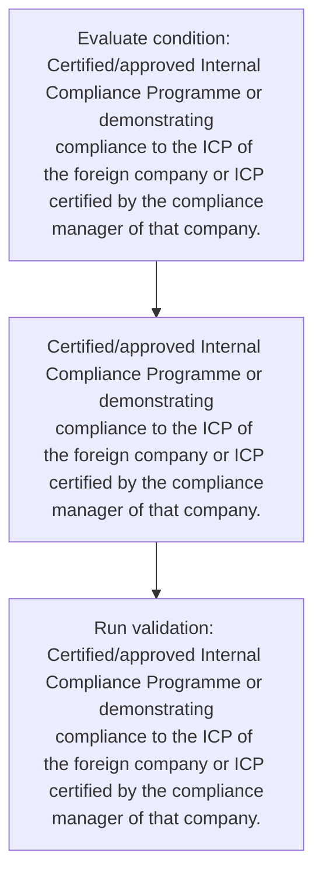
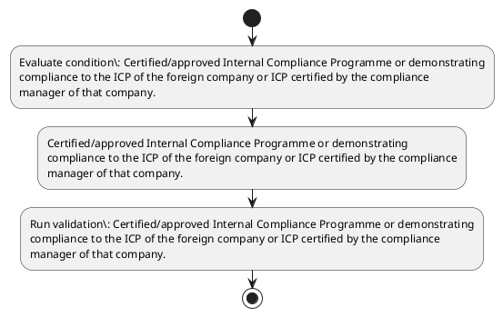

# Chapter 10 / Section 4: Certified/approved Internal Compliance Programme or demonstrating

**Chapter Title:** SCOMET: Special Chemicals, Organisms, Materials, Equipment and Technologies

**Pages:** 17

**Purpose:** Certified/approved Internal Compliance Programme or demonstrating
compliance to the ICP of the foreign company or ICP certified by the compliance
manager of that company.

**Purpose Thanglish:** Indha Certified/approved Internal Compliance Programme or demonstrating section-la, Certified/approved Internal Compliance Programme or demonstrating
compliance to the ICP of the foreign company or ICP certified by the compliance
manager of that company.

**Summary:** 4. Certified/approved Internal Compliance Programme or demonstrating
compliance to the ICP of the foreign company or ICP certified by the compliance
manager of that company. [only for intra-company transfers]

**Business Meaning:** 4.

**Business Explanation:** 4. Certified/approved Internal Compliance Programme or demonstrating
compliance to the ICP of the foreign company or ICP certified by the compliance
manager of that company. [only for intra-company transfers]

**Business Explanation Thanglish:** Indha Certified/approved Internal Compliance Programme or demonstrating section-la, 4. Certified/approved Internal Compliance Programme or demonstrating
compliance to the ICP of the foreign company or ICP certified by the compliance
manager of that company. [only for intra-company transfers]

## Business Logic
- None identified

## Business Rules
- rule_id=CH10-SEC4-R001, rule_description=IF validations pass THEN recommend action: Certified/approved Internal Compliance Programme or demonstrating
compliance to the ICP of the foreign company or ICP certified by the compliance
manager of that company., trigger=Certified/approved Internal Compliance Programme or demonstrating, condition=Certified/approved Internal Compliance Programme or demonstrating
compliance to the ICP of the foreign company or ICP certified by the compliance
manager of that company., validation=Certified/approved Internal Compliance Programme or demonstrating
compliance to the ICP of the foreign company or ICP certified by the compliance
manager of that company., action=Certified/approved Internal Compliance Programme or demonstrating
compliance to the ICP of the foreign company or ICP certified by the compliance
manager of that company., exception=No explicit exception found in uploaded documents., output=DEKAI should produce a compliance decision for 4 - Certified/approved Internal Compliance Programme or demonstrating.

## Conditions
- Certified/approved Internal Compliance Programme or demonstrating
compliance to the ICP of the foreign company or ICP certified by the compliance
manager of that company.

## Condition Logic
- id=10.4.1, if=Certified/approved Internal Compliance Programme or demonstrating
compliance to the ICP of the foreign company or ICP certified by the compliance
manager of that company., then=Certified/approved Internal Compliance Programme or demonstrating
compliance to the ICP of the foreign company or ICP certified by the compliance
manager of that company., source=Certified/approved Internal Compliance Programme or demonstrating
compliance to the ICP of the foreign company or ICP certified by the compliance
manager of that company.

## Validations
- Certified/approved Internal Compliance Programme or demonstrating
compliance to the ICP of the foreign company or ICP certified by the compliance
manager of that company.

## Exceptions
- None identified

## Dependencies
- None identified

## Authorities
- None identified

## Required Documents
- None identified

## Timelines
- None identified

## Actions
- Certified/approved Internal Compliance Programme or demonstrating
compliance to the ICP of the foreign company or ICP certified by the compliance
manager of that company.

## Workflow
- Evaluate condition: Certified/approved Internal Compliance Programme or demonstrating
compliance to the ICP of the foreign company or ICP certified by the compliance
manager of that company.
- Certified/approved Internal Compliance Programme or demonstrating
compliance to the ICP of the foreign company or ICP certified by the compliance
manager of that company.
- Run validation: Certified/approved Internal Compliance Programme or demonstrating
compliance to the ICP of the foreign company or ICP certified by the compliance
manager of that company.

## Workflow ASCII
```text
Certified/approved Internal Compliance Programme or demonstrating
Evaluate condition: Certified/approved Internal Compliance Programme or demonstrating
compliance to the ICP of the foreign company or ICP certified by the compliance
manager of that company.
   |
   v
Certified/approved Internal Compliance Programme or demonstrating
compliance to the ICP of the foreign company or ICP certified by the compliance
manager of that company.
   |
   v
Run validation: Certified/approved Internal Compliance Programme or demonstrating
compliance to the ICP of the foreign company or ICP certified by the compliance
manager of that company.
```

## Decision Tree
- IF Certified/approved Internal Compliance Programme or demonstrating
compliance to the ICP of the foreign company or ICP certified by the compliance
manager of that company. THEN Certified/approved Internal Compliance Programme or demonstrating
compliance to the ICP of the foreign company or ICP certified by the compliance
manager of that company.

## Decision Tree ASCII
```text
Certified/approved Internal Compliance Programme or demonstrating Decision
IF Certified/approved Internal Compliance Programme or demonstrating
compliance to the ICP of the foreign company or ICP certified by the compliance
manager of that company. THEN Certified/approved Internal Compliance Programme or demonstrating
compliance to the ICP of the foreign company or ICP certified by the compliance
manager of that company.
```

## Examples
- User asks to process Certified/approved Internal Compliance Programme or demonstrating; the platform checks conditions, validations, and documents before action.

**Real-world Example:** Example: an importer or exporter invokes Certified/approved Internal Compliance Programme or demonstrating, submits the prescribed DGFT records, and DEKAI uses the extracted rules to certified/approved internal compliance programme or demonstrating
compliance to the icp of the foreign company or icp certified by the compliance
manager of that company..

**Real-world Example Thanglish:** Indha Certified/approved Internal Compliance Programme or demonstrating section-la, Example: an importer or exporter invokes Certified/approved Internal Compliance Programme or demonstrating, submits the prescribed DGFT records, and DEKAI uses the extracted rules to certified/approved internal compliance programme or demonstrating
compliance to the icp of the foreign company or icp certified by the compliance
manager of that company..

## AI Rules
- IF validations pass THEN recommend action: Certified/approved Internal Compliance Programme or demonstrating
compliance to the ICP of the foreign company or ICP certified by the compliance
manager of that company.

## Database Fields
- name=section_code, type=string, required=True, source=parsed_section_heading
- name=section_title, type=string, required=True, source=parsed_section_heading
- name=the_flag, type=boolean, required=False, source=keyword:the
- name=icp_flag, type=boolean, required=False, source=keyword:ICP
- name=for_flag, type=boolean, required=False, source=keyword:for
- name=that_flag, type=boolean, required=False, source=keyword:that
- name=only_flag, type=boolean, required=False, source=keyword:only
- name=foreign_flag, type=boolean, required=False, source=keyword:foreign
- name=company_flag, type=boolean, required=False, source=keyword:company
- name=manager_flag, type=boolean, required=False, source=keyword:manager

## API Requirements
- method=GET, path=/api/dgft/sections/4, purpose=Retrieve knowledge payload for section 4, query_params=['include=workflow,decision_tree,validations'], response_fields=['section', 'title', 'summary', 'conditions', 'validations', 'exceptions', 'workflow', 'decision_tree']
- method=POST, path=/api/dgft/Certified-approved-Internal-Compliance-Programme-or-demonstrating/validate, purpose=Validate inputs and documents for Certified/approved Internal Compliance Programme or demonstrating, request_fields=['section_code', 'section_title'], response_fields=['status', 'errors', 'warnings', 'next_actions']
- method=POST, path=/api/dgft/Certified-approved-Internal-Compliance-Programme-or-demonstrating/execute, purpose=Trigger business action for Certified/approved Internal Compliance Programme or demonstrating
compliance to the ICP of the foreign company or ICP certified by the compliance
manager of that company., request_fields=['section_code', 'section_title'], response_fields=['reference_id', 'status', 'authority', 'timeline']

## UI Screens
- screen_id=Certified_approved_Internal_Compliance_Programme_or_demonstrating_overview, name=Certified/approved Internal Compliance Programme or demonstrating Overview, purpose=Show section summary, authority, timeline, and eligibility cues., widgets=['summary_card', 'conditions_table', 'authority_badges', 'timeline_panel']
- screen_id=Certified_approved_Internal_Compliance_Programme_or_demonstrating_submission, name=Certified/approved Internal Compliance Programme or demonstrating Submission, purpose=Capture applicant data and supporting documents., widgets=['dynamic_form', 'document_uploader', 'validation_panel', 'next_action_footer'], fields=['section_code', 'section_title', 'the_flag', 'icp_flag', 'for_flag', 'that_flag', 'only_flag', 'foreign_flag']

## Error Messages
- Validation failed because the section requirements were not fully met.

## FAQ
- question_en=What is the purpose of section 4?, answer_en=4. Certified/approved Internal Compliance Programme or demonstrating
compliance to the ICP of the foreign company or ICP certified by the compliance
manager of that company. [only for intra-company transfers], question_thanglish=Indha Certified/approved Internal Compliance Programme or demonstrating section-la, What is the purpose of section 4?, answer_thanglish=Indha Certified/approved Internal Compliance Programme or demonstrating section-la, 4. Certified/approved Internal Compliance Programme or demonstrating
compliance to the ICP of the foreign company or ICP certified by the compliance
manager of that company. [only for intra-company transfers]
- question_en=What documents are required under Certified/approved Internal Compliance Programme or demonstrating?, answer_en=Not explicitly covered in uploaded documents., question_thanglish=Indha Certified/approved Internal Compliance Programme or demonstrating section-la, What documents are required under Certified/approved Internal Compliance Programme or demonstrating?, answer_thanglish=Indha Certified/approved Internal Compliance Programme or demonstrating section-la, Not explicitly covered in uploaded documents.
- question_en=Which authority handles Certified/approved Internal Compliance Programme or demonstrating?, answer_en=Not explicitly covered in uploaded documents., question_thanglish=Indha Certified/approved Internal Compliance Programme or demonstrating section-la, Which authority handles Certified/approved Internal Compliance Programme or demonstrating?, answer_thanglish=Indha Certified/approved Internal Compliance Programme or demonstrating section-la, Not explicitly covered in uploaded documents.

## Questions Users May Ask
- What does Certified/approved Internal Compliance Programme or demonstrating require?
- Which documents are needed for Certified/approved Internal Compliance Programme or demonstrating?
- How does DEKAI validate Certified/approved Internal Compliance Programme or demonstrating requests?
- What action should be taken for Certified/approved Internal Compliance Programme or demonstrating?

## Expected AI Answers
- Certified/approved Internal Compliance Programme or demonstrating requires the platform to interpret the section text, apply the extracted business rules, and present the correct next action.
- Required documents are inferred from the section text: no explicit documents were detected.
- DEKAI validates Certified/approved Internal Compliance Programme or demonstrating by checking conditions, required documents, authority references, and exception clauses before recommending an outcome.
- The primary extracted action is: Certified/approved Internal Compliance Programme or demonstrating
compliance to the ICP of the foreign company or ICP certified by the compliance
manager of that company.

## AI Q&A Examples
- question_en=User asks: How do I comply with Certified/approved Internal Compliance Programme or demonstrating?, answer_en=AI answers: DEKAI should evaluate section 4, apply the extracted rules, and guide the user through Evaluate condition: Certified/approved Internal Compliance Programme or demonstrating
compliance to the ICP of the foreign company or ICP certified by the compliance
manager of that company.., question_thanglish=Indha Certified/approved Internal Compliance Programme or demonstrating section-la, User asks: How do I comply with Certified/approved Internal Compliance Programme or demonstrating?, answer_thanglish=Indha Certified/approved Internal Compliance Programme or demonstrating section-la, AI answers: DEKAI should evaluate section 4, apply the extracted rules, and guide the user through Evaluate condition: Certified/approved Internal Compliance Programme or demonstrating
compliance to the ICP of the foreign company or ICP certified by the compliance
manager of that company..
- question_en=User asks: Which validations apply to Certified/approved Internal Compliance Programme or demonstrating?, answer_en=AI answers: Applicable validations are Certified/approved Internal Compliance Programme or demonstrating
compliance to the ICP of the foreign company or ICP certified by the compliance
manager of that company., question_thanglish=Indha Certified/approved Internal Compliance Programme or demonstrating section-la, User asks: Which validations apply to Certified/approved Internal Compliance Programme or demonstrating?, answer_thanglish=Indha Certified/approved Internal Compliance Programme or demonstrating section-la, AI answers: Applicable validations are Certified/approved Internal Compliance Programme or demonstrating
compliance to the ICP of the foreign company or ICP certified by the compliance
manager of that company.

## DEKAI AI Implementation Notes
- Capture chapter 10, section 4, title, and page references as immutable knowledge metadata.
- Bind validations for Certified/approved Internal Compliance Programme or demonstrating into a rule engine keyed by the rule IDs extracted for this section.

## DEKAI AI Implementation Notes Thanglish
- Indha Certified/approved Internal Compliance Programme or demonstrating section-la, Capture chapter 10, section 4, title, and page references as immutable knowledge metadata.
- Indha Certified/approved Internal Compliance Programme or demonstrating section-la, Bind validations for Certified/approved Internal Compliance Programme or demonstrating into a rule engine keyed by the rule IDs extracted for this section.

## AI Metadata
- Keywords: the, ICP, for, that, only, foreign, company, manager, Internal, Programme, certified, transfers, Compliance, demonstrating, intra-company, Certified/approved
- Search Keywords: the, ICP, for, that, only, foreign, company, manager, Internal, Programme, certified, transfers, Compliance, demonstrating, intra-company, Certified/approved
- Intent: Support Certified/approved Internal Compliance Programme or demonstrating processing and compliance validation.
- Tags: 4, Certified/approved Internal Compliance Programme or demonstrating, dgft
- Related Sections: 
- Related Chapters: 
- Related Rules: 

## Mermaid


## PlantUML

