# Chapter 10 / Section 4: General Conditions & Exclusions

**Chapter Title:** SCOMET: Special Chemicals, Organisms, Materials, Equipment and Technologies

**Pages:** 31, 34

**Purpose:** General Conditions & Exclusions
GAET would not be issued in case of items to be used to design, develop, acquire,
or manufacture, possess, transport, transfer and/or used for military applications,
explosives, chemical, biological, nuclear weapons or for missiles capable of
delivering weapons of mass destruction and their delivery system;
a.

**Purpose Thanglish:** Indha General Conditions & Exclusions section-la, General Conditions & Exclusions
GAET would not be issued in case of items to be used to design, develop, acquire,
or manufacture, possess, transport, transfer and/or used for military applications,
explosives, chemical, biological, nuclear weapons or for missiles capable of
delivering weapons of mass destruction and their delivery system;
a.

**Summary:** 4. General Conditions & Exclusions
GAET would not be issued in case of items to be used to design, develop, acquire,
or manufacture, possess, transport, transfer and/or used for military applications,
explosives, chemical, biological, nuclear weapons or for missiles capable of
delivering weapons of mass destruction and their delivery system;
a. GAET would not be issued for countries or entities covered under UNSC
embargo or sanctions list or on assessment of proliferation concerns, or
national security and foreign policy considerations, etc.:
b.

**Business Meaning:** General Conditions & Exclusions governs how DGFT business controls should be applied, validated, and enforced.

**Business Explanation:** General Conditions & Exclusions explains the operating rule set that DEKAI should enforce. Key control points include IMWG shall reserve the right to deny the issue of GAET without assigning
any reason(s)
4. The section also drives actions such as General Conditions & Exclusions
GAET would not be issued in case of items to be used to design, develop, acquire,
or manufacture, possess, transport, transfer and/or used for military applications,
explosives, chemical, biological, nuclear weapons or for missiles capable of
delivering weapons of mass destruction and their delivery system;
a..

**Business Explanation Thanglish:** Indha General Conditions & Exclusions section-la, General Conditions & Exclusions explains the operating rule set that DEKAI should enforce. Key control points include IMWG kandippa reserve the right to deny the issue of GAET without assigning
any reason(s)
4. The section also drives actions such as General Conditions & Exclusions
GAET would not be issued in case of items to be used to design, develop, acquire,
or manufacture, possess, transport, transfer and/or used for military applications,
explosives, chemical, biological, nuclear weapons or for missiles capable of
delivering weapons of mass destruction and their delivery system;
a..

## Business Logic
- IMWG shall reserve the right to deny the issue of GAET without assigning
any reason(s)
4.
- IMWG shall reserve the right to deny the issuance of GAEIS without assigning
any reason(s).

## Business Rules
- rule_id=CH10-SEC4-R001, rule_description=IMWG shall reserve the right to deny the issue of GAET without assigning
any reason(s)
4., trigger=General Conditions & Exclusions, condition=General Conditions & Exclusions
GAET would not be issued in case of items to be used to design, develop, acquire,
or manufacture, possess, transport, transfer and/or used for military applications,
explosives, chemical, biological, nuclear weapons or for missiles capable of
delivering weapons of mass destruction and their delivery system;
a., validation=IMWG shall reserve the right to deny the issue of GAET without assigning
any reason(s)
4., action=General Conditions & Exclusions
GAET would not be issued in case of items to be used to design, develop, acquire,
or manufacture, possess, transport, transfer and/or used for military applications,
explosives, chemical, biological, nuclear weapons or for missiles capable of
delivering weapons of mass destruction and their delivery system;
a., exception=No explicit exception found in uploaded documents., output=DEKAI should produce a compliance decision for 4 - General Conditions & Exclusions.
- rule_id=CH10-SEC4-R002, rule_description=IMWG shall reserve the right to deny the issuance of GAEIS without assigning
any reason(s)., trigger=General Conditions & Exclusions, condition=GAET would not be issued for countries or entities covered under UNSC
embargo or sanctions list or on assessment of proliferation concerns, or
national security and foreign policy considerations, etc.:
b., validation=IMWG shall reserve the right to deny the issuance of GAEIS without assigning
any reason(s)., action=GAET would not be issued for countries or entities covered under UNSC
embargo or sanctions list or on assessment of proliferation concerns, or
national security and foreign policy considerations, etc.:
b., exception=No explicit exception found in uploaded documents., output=DEKAI should produce a compliance decision for 4 - General Conditions & Exclusions.

## Conditions
- General Conditions & Exclusions
GAET would not be issued in case of items to be used to design, develop, acquire,
or manufacture, possess, transport, transfer and/or used for military applications,
explosives, chemical, biological, nuclear weapons or for missiles capable of
delivering weapons of mass destruction and their delivery system;
a.
- GAET would not be issued for countries or entities covered under UNSC
embargo or sanctions list or on assessment of proliferation concerns, or
national security and foreign policy considerations, etc.:
b.
- In case of inclusion of new countries or amendment to the existing list of
countries where the export is expected to be done under GAET the
applicant exporter will obtain prior permission of DGFT with relevant
details;
c.
- GAEIS would not be issued in case of items to be used to design, develop, acquire,
or manufacture, possess, transport, transfer and/or used for military applications,
explosives, chemical, biological, nuclear weapons or for missiles capable of
delivering weapons of mass destruction and their delivery system;
b.
- GAEIS would not be issued for countries or entities covered under UNSC
embargo or sanctions list or on assessment of proliferation concerns, or national
security and foreign policy considerations, etc.:
c.
- In case of inclusion of new countries or amendment to the existing list of
countries where the export is expected to be done under GAEIS the applicant
exporter will obtain prior permission from DGFT with relevant details;
d.

## Condition Logic
- id=10.4.1, if=General Conditions & Exclusions
GAET would not be issued in case of items to be used to design, develop, acquire,
or manufacture, possess, transport, transfer and/or used for military applications,
explosives, chemical, biological, nuclear weapons or for missiles capable of
delivering weapons of mass destruction and their delivery system;
a., then=General Conditions & Exclusions
GAET would not be issued in case of items to be used to design, develop, acquire,
or manufacture, possess, transport, transfer and/or used for military applications,
explosives, chemical, biological, nuclear weapons or for missiles capable of
delivering weapons of mass destruction and their delivery system;
a., source=General Conditions & Exclusions
GAET would not be issued in case of items to be used to design, develop, acquire,
or manufacture, possess, transport, transfer and/or used for military applications,
explosives, chemical, biological, nuclear weapons or for missiles capable of
delivering weapons of mass destruction and their delivery system;
a.
- id=10.4.2, if=GAET would not be issued for countries or entities covered under UNSC
embargo or sanctions list or on assessment of proliferation concerns, or
national security and foreign policy considerations, etc.:
b., then=General Conditions & Exclusions
GAET would not be issued in case of items to be used to design, develop, acquire,
or manufacture, possess, transport, transfer and/or used for military applications,
explosives, chemical, biological, nuclear weapons or for missiles capable of
delivering weapons of mass destruction and their delivery system;
a., source=GAET would not be issued for countries or entities covered under UNSC
embargo or sanctions list or on assessment of proliferation concerns, or
national security and foreign policy considerations, etc.:
b.
- id=10.4.3, if=In case of inclusion of new countries or amendment to the existing list of
countries where the export is expected to be done under GAET the
applicant exporter will obtain prior permission of DGFT with relevant
details;
c., then=General Conditions & Exclusions
GAET would not be issued in case of items to be used to design, develop, acquire,
or manufacture, possess, transport, transfer and/or used for military applications,
explosives, chemical, biological, nuclear weapons or for missiles capable of
delivering weapons of mass destruction and their delivery system;
a., source=In case of inclusion of new countries or amendment to the existing list of
countries where the export is expected to be done under GAET the
applicant exporter will obtain prior permission of DGFT with relevant
details;
c.
- id=10.4.4, if=GAEIS would not be issued in case of items to be used to design, develop, acquire,
or manufacture, possess, transport, transfer and/or used for military applications,
explosives, chemical, biological, nuclear weapons or for missiles capable of
delivering weapons of mass destruction and their delivery system;
b., then=General Conditions & Exclusions
GAET would not be issued in case of items to be used to design, develop, acquire,
or manufacture, possess, transport, transfer and/or used for military applications,
explosives, chemical, biological, nuclear weapons or for missiles capable of
delivering weapons of mass destruction and their delivery system;
a., source=GAEIS would not be issued in case of items to be used to design, develop, acquire,
or manufacture, possess, transport, transfer and/or used for military applications,
explosives, chemical, biological, nuclear weapons or for missiles capable of
delivering weapons of mass destruction and their delivery system;
b.
- id=10.4.5, if=GAEIS would not be issued for countries or entities covered under UNSC
embargo or sanctions list or on assessment of proliferation concerns, or national
security and foreign policy considerations, etc.:
c., then=General Conditions & Exclusions
GAET would not be issued in case of items to be used to design, develop, acquire,
or manufacture, possess, transport, transfer and/or used for military applications,
explosives, chemical, biological, nuclear weapons or for missiles capable of
delivering weapons of mass destruction and their delivery system;
a., source=GAEIS would not be issued for countries or entities covered under UNSC
embargo or sanctions list or on assessment of proliferation concerns, or national
security and foreign policy considerations, etc.:
c.
- id=10.4.6, if=In case of inclusion of new countries or amendment to the existing list of
countries where the export is expected to be done under GAEIS the applicant
exporter will obtain prior permission from DGFT with relevant details;
d., then=General Conditions & Exclusions
GAET would not be issued in case of items to be used to design, develop, acquire,
or manufacture, possess, transport, transfer and/or used for military applications,
explosives, chemical, biological, nuclear weapons or for missiles capable of
delivering weapons of mass destruction and their delivery system;
a., source=In case of inclusion of new countries or amendment to the existing list of
countries where the export is expected to be done under GAEIS the applicant
exporter will obtain prior permission from DGFT with relevant details;
d.

## Validations
- IMWG shall reserve the right to deny the issue of GAET without assigning
any reason(s)
4.
- IMWG shall reserve the right to deny the issuance of GAEIS without assigning
any reason(s).

## Exceptions
- None identified

## Dependencies
- None identified

## Authorities
- DGFT

## Required Documents
- General Conditions & Exclusions
GAET would not be issued in case of items to be used to design, develop, acquire,
or manufacture, possess, transport, transfer and/or used for military applications,
explosives, chemical, biological, nuclear weapons or for missiles capable of
delivering weapons of mass destruction and their delivery system;
a.
- GAEIS would not be issued in case of items to be used to design, develop, acquire,
or manufacture, possess, transport, transfer and/or used for military applications,
explosives, chemical, biological, nuclear weapons or for missiles capable of
delivering weapons of mass destruction and their delivery system;
b.

## Timelines
- None identified

## Actions
- General Conditions & Exclusions
GAET would not be issued in case of items to be used to design, develop, acquire,
or manufacture, possess, transport, transfer and/or used for military applications,
explosives, chemical, biological, nuclear weapons or for missiles capable of
delivering weapons of mass destruction and their delivery system;
a.
- GAET would not be issued for countries or entities covered under UNSC
embargo or sanctions list or on assessment of proliferation concerns, or
national security and foreign policy considerations, etc.:
b.
- In case of inclusion of new countries or amendment to the existing list of
countries where the export is expected to be done under GAET the
applicant exporter will obtain prior permission of DGFT with relevant
details;
c.
- IMWG shall reserve the right to deny the issue of GAET without assigning
any reason(s)
4.
- GAEIS would not be issued in case of items to be used to design, develop, acquire,
or manufacture, possess, transport, transfer and/or used for military applications,
explosives, chemical, biological, nuclear weapons or for missiles capable of
delivering weapons of mass destruction and their delivery system;
b.
- GAEIS would not be issued for countries or entities covered under UNSC
embargo or sanctions list or on assessment of proliferation concerns, or national
security and foreign policy considerations, etc.:
c.
- In case of inclusion of new countries or amendment to the existing list of
countries where the export is expected to be done under GAEIS the applicant
exporter will obtain prior permission from DGFT with relevant details;
d.

## Workflow
- Evaluate condition: General Conditions & Exclusions
GAET would not be issued in case of items to be used to design, develop, acquire,
or manufacture, possess, transport, transfer and/or used for military applications,
explosives, chemical, biological, nuclear weapons or for missiles capable of
delivering weapons of mass destruction and their delivery system;
a.
- Evaluate condition: GAET would not be issued for countries or entities covered under UNSC
embargo or sanctions list or on assessment of proliferation concerns, or
national security and foreign policy considerations, etc.:
b.
- Evaluate condition: In case of inclusion of new countries or amendment to the existing list of
countries where the export is expected to be done under GAET the
applicant exporter will obtain prior permission of DGFT with relevant
details;
c.
- General Conditions & Exclusions
GAET would not be issued in case of items to be used to design, develop, acquire,
or manufacture, possess, transport, transfer and/or used for military applications,
explosives, chemical, biological, nuclear weapons or for missiles capable of
delivering weapons of mass destruction and their delivery system;
a.
- GAET would not be issued for countries or entities covered under UNSC
embargo or sanctions list or on assessment of proliferation concerns, or
national security and foreign policy considerations, etc.:
b.
- In case of inclusion of new countries or amendment to the existing list of
countries where the export is expected to be done under GAET the
applicant exporter will obtain prior permission of DGFT with relevant
details;
c.
- IMWG shall reserve the right to deny the issue of GAET without assigning
any reason(s)
4.
- GAEIS would not be issued in case of items to be used to design, develop, acquire,
or manufacture, possess, transport, transfer and/or used for military applications,
explosives, chemical, biological, nuclear weapons or for missiles capable of
delivering weapons of mass destruction and their delivery system;
b.
- GAEIS would not be issued for countries or entities covered under UNSC
embargo or sanctions list or on assessment of proliferation concerns, or national
security and foreign policy considerations, etc.:
c.
- Run validation: IMWG shall reserve the right to deny the issue of GAET without assigning
any reason(s)
4.
- Run validation: IMWG shall reserve the right to deny the issuance of GAEIS without assigning
any reason(s).

## Workflow ASCII
```text
General Conditions & Exclusions
Evaluate condition: General Conditions & Exclusions
GAET would not be issued in case of items to be used to design, develop, acquire,
or manufacture, possess, transport, transfer and/or used for military applications,
explosives, chemical, biological, nuclear weapons or for missiles capable of
delivering weapons of mass destruction and their delivery system;
a.
   |
   v
Evaluate condition: GAET would not be issued for countries or entities covered under UNSC
embargo or sanctions list or on assessment of proliferation concerns, or
national security and foreign policy considerations, etc.:
b.
   |
   v
Evaluate condition: In case of inclusion of new countries or amendment to the existing list of
countries where the export is expected to be done under GAET the
applicant exporter will obtain prior permission of DGFT with relevant
details;
c.
   |
   v
General Conditions & Exclusions
GAET would not be issued in case of items to be used to design, develop, acquire,
or manufacture, possess, transport, transfer and/or used for military applications,
explosives, chemical, biological, nuclear weapons or for missiles capable of
delivering weapons of mass destruction and their delivery system;
a.
   |
   v
GAET would not be issued for countries or entities covered under UNSC
embargo or sanctions list or on assessment of proliferation concerns, or
national security and foreign policy considerations, etc.:
b.
   |
   v
In case of inclusion of new countries or amendment to the existing list of
countries where the export is expected to be done under GAET the
applicant exporter will obtain prior permission of DGFT with relevant
details;
c.
   |
   v
IMWG shall reserve the right to deny the issue of GAET without assigning
any reason(s)
4.
   |
   v
GAEIS would not be issued in case of items to be used to design, develop, acquire,
or manufacture, possess, transport, transfer and/or used for military applications,
explosives, chemical, biological, nuclear weapons or for missiles capable of
delivering weapons of mass destruction and their delivery system;
b.
   |
   v
GAEIS would not be issued for countries or entities covered under UNSC
embargo or sanctions list or on assessment of proliferation concerns, or national
security and foreign policy considerations, etc.:
c.
   |
   v
Run validation: IMWG shall reserve the right to deny the issue of GAET without assigning
any reason(s)
4.
   |
   v
Run validation: IMWG shall reserve the right to deny the issuance of GAEIS without assigning
any reason(s).
```

## Decision Tree
- IF General Conditions & Exclusions
GAET would not be issued in case of items to be used to design, develop, acquire,
or manufacture, possess, transport, transfer and/or used for military applications,
explosives, chemical, biological, nuclear weapons or for missiles capable of
delivering weapons of mass destruction and their delivery system;
a. THEN General Conditions & Exclusions
GAET would not be issued in case of items to be used to design, develop, acquire,
or manufacture, possess, transport, transfer and/or used for military applications,
explosives, chemical, biological, nuclear weapons or for missiles capable of
delivering weapons of mass destruction and their delivery system;
a.
- IF GAET would not be issued for countries or entities covered under UNSC
embargo or sanctions list or on assessment of proliferation concerns, or
national security and foreign policy considerations, etc.:
b. THEN General Conditions & Exclusions
GAET would not be issued in case of items to be used to design, develop, acquire,
or manufacture, possess, transport, transfer and/or used for military applications,
explosives, chemical, biological, nuclear weapons or for missiles capable of
delivering weapons of mass destruction and their delivery system;
a.
- IF In case of inclusion of new countries or amendment to the existing list of
countries where the export is expected to be done under GAET the
applicant exporter will obtain prior permission of DGFT with relevant
details;
c. THEN General Conditions & Exclusions
GAET would not be issued in case of items to be used to design, develop, acquire,
or manufacture, possess, transport, transfer and/or used for military applications,
explosives, chemical, biological, nuclear weapons or for missiles capable of
delivering weapons of mass destruction and their delivery system;
a.
- IF GAEIS would not be issued in case of items to be used to design, develop, acquire,
or manufacture, possess, transport, transfer and/or used for military applications,
explosives, chemical, biological, nuclear weapons or for missiles capable of
delivering weapons of mass destruction and their delivery system;
b. THEN General Conditions & Exclusions
GAET would not be issued in case of items to be used to design, develop, acquire,
or manufacture, possess, transport, transfer and/or used for military applications,
explosives, chemical, biological, nuclear weapons or for missiles capable of
delivering weapons of mass destruction and their delivery system;
a.
- IF GAEIS would not be issued for countries or entities covered under UNSC
embargo or sanctions list or on assessment of proliferation concerns, or national
security and foreign policy considerations, etc.:
c. THEN General Conditions & Exclusions
GAET would not be issued in case of items to be used to design, develop, acquire,
or manufacture, possess, transport, transfer and/or used for military applications,
explosives, chemical, biological, nuclear weapons or for missiles capable of
delivering weapons of mass destruction and their delivery system;
a.

## Decision Tree ASCII
```text
General Conditions & Exclusions Decision
IF General Conditions & Exclusions
GAET would not be issued in case of items to be used to design, develop, acquire,
or manufacture, possess, transport, transfer and/or used for military applications,
explosives, chemical, biological, nuclear weapons or for missiles capable of
delivering weapons of mass destruction and their delivery system;
a. THEN General Conditions & Exclusions
GAET would not be issued in case of items to be used to design, develop, acquire,
or manufacture, possess, transport, transfer and/or used for military applications,
explosives, chemical, biological, nuclear weapons or for missiles capable of
delivering weapons of mass destruction and their delivery system;
a.
   |
   v
IF GAET would not be issued for countries or entities covered under UNSC
embargo or sanctions list or on assessment of proliferation concerns, or
national security and foreign policy considerations, etc.:
b. THEN General Conditions & Exclusions
GAET would not be issued in case of items to be used to design, develop, acquire,
or manufacture, possess, transport, transfer and/or used for military applications,
explosives, chemical, biological, nuclear weapons or for missiles capable of
delivering weapons of mass destruction and their delivery system;
a.
   |
   v
IF In case of inclusion of new countries or amendment to the existing list of
countries where the export is expected to be done under GAET the
applicant exporter will obtain prior permission of DGFT with relevant
details;
c. THEN General Conditions & Exclusions
GAET would not be issued in case of items to be used to design, develop, acquire,
or manufacture, possess, transport, transfer and/or used for military applications,
explosives, chemical, biological, nuclear weapons or for missiles capable of
delivering weapons of mass destruction and their delivery system;
a.
   |
   v
IF GAEIS would not be issued in case of items to be used to design, develop, acquire,
or manufacture, possess, transport, transfer and/or used for military applications,
explosives, chemical, biological, nuclear weapons or for missiles capable of
delivering weapons of mass destruction and their delivery system;
b. THEN General Conditions & Exclusions
GAET would not be issued in case of items to be used to design, develop, acquire,
or manufacture, possess, transport, transfer and/or used for military applications,
explosives, chemical, biological, nuclear weapons or for missiles capable of
delivering weapons of mass destruction and their delivery system;
a.
   |
   v
IF GAEIS would not be issued for countries or entities covered under UNSC
embargo or sanctions list or on assessment of proliferation concerns, or national
security and foreign policy considerations, etc.:
c. THEN General Conditions & Exclusions
GAET would not be issued in case of items to be used to design, develop, acquire,
or manufacture, possess, transport, transfer and/or used for military applications,
explosives, chemical, biological, nuclear weapons or for missiles capable of
delivering weapons of mass destruction and their delivery system;
a.
```

## Examples
- User asks to process General Conditions & Exclusions; the platform checks conditions, validations, and documents before action.

**Real-world Example:** Example: an importer or exporter invokes General Conditions & Exclusions, submits General Conditions & Exclusions
GAET would not be issued in case of items to be used to design, develop, acquire,
or manufacture, possess, transport, transfer and/or used for military applications,
explosives, chemical, biological, nuclear weapons or for missiles capable of
delivering weapons of mass destruction and their delivery system;
a., GAEIS would not be issued in case of items to be used to design, develop, acquire,
or manufacture, possess, transport, transfer and/or used for military applications,
explosives, chemical, biological, nuclear weapons or for missiles capable of
delivering weapons of mass destruction and their delivery system;
b., and DEKAI uses the extracted rules to general conditions & exclusions
gaet would not be issued in case of items to be used to design, develop, acquire,
or manufacture, possess, transport, transfer and/or used for military applications,
explosives, chemical, biological, nuclear weapons or for missiles capable of
delivering weapons of mass destruction and their delivery system;
a..

**Real-world Example Thanglish:** Indha General Conditions & Exclusions section-la, Example: an importer or exporter invokes General Conditions & Exclusions, submits General Conditions & Exclusions
GAET would not be issued in case of items to be used to design, develop, acquire,
or manufacture, possess, transport, transfer and/or used for military applications,
explosives, chemical, biological, nuclear weapons or for missiles capable of
delivering weapons of mass destruction and their delivery system;
a., GAEIS would not be issued in case of items to be used to design, develop, acquire,
or manufacture, possess, transport, transfer and/or used for military applications,
explosives, chemical, biological, nuclear weapons or for missiles capable of
delivering weapons of mass destruction and their delivery system;
b., and DEKAI uses the extracted rules to general conditions & exclusions
gaet would not be issued in case of items to be used to design, develop, acquire,
or manufacture, possess, transport, transfer and/or used for military applications,
explosives, chemical, biological, nuclear weapons or for missiles capable of
delivering weapons of mass destruction and their delivery system;
a..

## AI Rules
- IF detected context matches section rule THEN enforce: IMWG shall reserve the right to deny the issue of GAET without assigning
any reason(s)
4.
- IF detected context matches section rule THEN enforce: IMWG shall reserve the right to deny the issuance of GAEIS without assigning
any reason(s).
- IF validations pass THEN recommend action: General Conditions & Exclusions
GAET would not be issued in case of items to be used to design, develop, acquire,
or manufacture, possess, transport, transfer and/or used for military applications,
explosives, chemical, biological, nuclear weapons or for missiles capable of
delivering weapons of mass destruction and their delivery system;
a.

## Database Fields
- name=section_code, type=string, required=True, source=parsed_section_heading
- name=section_title, type=string, required=True, source=parsed_section_heading
- name=not_flag, type=boolean, required=False, source=keyword:not
- name=for_flag, type=boolean, required=False, source=keyword:for
- name=and_flag, type=boolean, required=False, source=keyword:and
- name=etc_flag, type=boolean, required=False, source=keyword:etc
- name=new_flag, type=boolean, required=False, source=keyword:new
- name=the_flag, type=boolean, required=False, source=keyword:the
- name=any_flag, type=boolean, required=False, source=keyword:any
- name=gaet_flag, type=boolean, required=False, source=keyword:GAET
- name=document_1_submitted, type=boolean, required=True, source=General Conditions & Exclusions
GAET would not be issued in case of items to be used to design, develop, acquire,
or manufacture, possess, transport, transfer and/or used for military applications,
explosives, chemical, biological, nuclear weapons or for missiles capable of
delivering weapons of mass destruction and their delivery system;
a.
- name=document_2_submitted, type=boolean, required=True, source=GAEIS would not be issued in case of items to be used to design, develop, acquire,
or manufacture, possess, transport, transfer and/or used for military applications,
explosives, chemical, biological, nuclear weapons or for missiles capable of
delivering weapons of mass destruction and their delivery system;
b.

## API Requirements
- method=GET, path=/api/dgft/sections/4, purpose=Retrieve knowledge payload for section 4, query_params=['include=workflow,decision_tree,validations'], response_fields=['section', 'title', 'summary', 'conditions', 'validations', 'exceptions', 'workflow', 'decision_tree']
- method=POST, path=/api/dgft/General-Conditions-Exclusions/validate, purpose=Validate inputs and documents for General Conditions & Exclusions, request_fields=['section_code', 'section_title', 'document_1_submitted', 'document_2_submitted'], response_fields=['status', 'errors', 'warnings', 'next_actions']
- method=POST, path=/api/dgft/General-Conditions-Exclusions/execute, purpose=Trigger business action for General Conditions & Exclusions
GAET would not be issued in case of items to be used to design, develop, acquire,
or manufacture, possess, transport, transfer and/or used for military applications,
explosives, chemical, biological, nuclear weapons or for missiles capable of
delivering weapons of mass destruction and their delivery system;
a., request_fields=['section_code', 'section_title', 'document_1_submitted', 'document_2_submitted'], response_fields=['reference_id', 'status', 'authority', 'timeline']

## UI Screens
- screen_id=General_Conditions_Exclusions_overview, name=General Conditions & Exclusions Overview, purpose=Show section summary, authority, timeline, and eligibility cues., widgets=['summary_card', 'conditions_table', 'authority_badges', 'timeline_panel']
- screen_id=General_Conditions_Exclusions_submission, name=General Conditions & Exclusions Submission, purpose=Capture applicant data and supporting documents., widgets=['dynamic_form', 'document_uploader', 'validation_panel', 'next_action_footer'], fields=['section_code', 'section_title', 'not_flag', 'for_flag', 'and_flag', 'etc_flag', 'new_flag', 'the_flag']

## Error Messages
- Validation failed because the section requirements were not fully met.

## FAQ
- question_en=What is the purpose of section 4?, answer_en=General Conditions & Exclusions explains the operating rule set that DEKAI should enforce. Key control points include IMWG shall reserve the right to deny the issue of GAET without assigning
any reason(s)
4. The section also drives actions such as General Conditions & Exclusions
GAET would not be issued in case of items to be used to design, develop, acquire,
or manufacture, possess, transport, transfer and/or used for military applications,
explosives, chemical, biological, nuclear weapons or for missiles capable of
delivering weapons of mass destruction and their delivery system;
a.., question_thanglish=Indha General Conditions & Exclusions section-la, What is the purpose of section 4?, answer_thanglish=Indha General Conditions & Exclusions section-la, General Conditions & Exclusions explains the operating rule set that DEKAI should enforce. Key control points include IMWG kandippa reserve the right to deny the issue of GAET without assigning
any reason(s)
4. The section also drives actions such as General Conditions & Exclusions
GAET would not be issued in case of items to be used to design, develop, acquire,
or manufacture, possess, transport, transfer and/or used for military applications,
explosives, chemical, biological, nuclear weapons or for missiles capable of
delivering weapons of mass destruction and their delivery system;
a..
- question_en=What documents are required under General Conditions & Exclusions?, answer_en=General Conditions & Exclusions
GAET would not be issued in case of items to be used to design, develop, acquire,
or manufacture, possess, transport, transfer and/or used for military applications,
explosives, chemical, biological, nuclear weapons or for missiles capable of
delivering weapons of mass destruction and their delivery system;
a., GAEIS would not be issued in case of items to be used to design, develop, acquire,
or manufacture, possess, transport, transfer and/or used for military applications,
explosives, chemical, biological, nuclear weapons or for missiles capable of
delivering weapons of mass destruction and their delivery system;
b., question_thanglish=Indha General Conditions & Exclusions section-la, What documents are required under General Conditions & Exclusions?, answer_thanglish=Indha General Conditions & Exclusions section-la, General Conditions & Exclusions
GAET would not be issued in case of items to be used to design, develop, acquire,
or manufacture, possess, transport, transfer and/or used for military applications,
explosives, chemical, biological, nuclear weapons or for missiles capable of
delivering weapons of mass destruction and their delivery system;
a., GAEIS would not be issued in case of items to be used to design, develop, acquire,
or manufacture, possess, transport, transfer and/or used for military applications,
explosives, chemical, biological, nuclear weapons or for missiles capable of
delivering weapons of mass destruction and their delivery system;
b.
- question_en=Which authority handles General Conditions & Exclusions?, answer_en=DGFT, question_thanglish=Indha General Conditions & Exclusions section-la, Which authority handles General Conditions & Exclusions?, answer_thanglish=Indha General Conditions & Exclusions section-la, DGFT

## Questions Users May Ask
- What does General Conditions & Exclusions require?
- Which documents are needed for General Conditions & Exclusions?
- How does DEKAI validate General Conditions & Exclusions requests?
- What action should be taken for General Conditions & Exclusions?

## Expected AI Answers
- General Conditions & Exclusions requires the platform to interpret the section text, apply the extracted business rules, and present the correct next action.
- Required documents are inferred from the section text: General Conditions & Exclusions
GAET would not be issued in case of items to be used to design, develop, acquire,
or manufacture, possess, transport, transfer and/or used for military applications,
explosives, chemical, biological, nuclear weapons or for missiles capable of
delivering weapons of mass destruction and their delivery system;
a., GAEIS would not be issued in case of items to be used to design, develop, acquire,
or manufacture, possess, transport, transfer and/or used for military applications,
explosives, chemical, biological, nuclear weapons or for missiles capable of
delivering weapons of mass destruction and their delivery system;
b.
- DEKAI validates General Conditions & Exclusions by checking conditions, required documents, authority references, and exception clauses before recommending an outcome.
- The primary extracted action is: General Conditions & Exclusions
GAET would not be issued in case of items to be used to design, develop, acquire,
or manufacture, possess, transport, transfer and/or used for military applications,
explosives, chemical, biological, nuclear weapons or for missiles capable of
delivering weapons of mass destruction and their delivery system;
a.

## AI Q&A Examples
- question_en=User asks: How do I comply with General Conditions & Exclusions?, answer_en=AI answers: DEKAI should evaluate section 4, apply the extracted rules, and guide the user through Evaluate condition: General Conditions & Exclusions
GAET would not be issued in case of items to be used to design, develop, acquire,
or manufacture, possess, transport, transfer and/or used for military applications,
explosives, chemical, biological, nuclear weapons or for missiles capable of
delivering weapons of mass destruction and their delivery system;
a.., question_thanglish=Indha General Conditions & Exclusions section-la, User asks: How do I comply with General Conditions & Exclusions?, answer_thanglish=Indha General Conditions & Exclusions section-la, AI answers: DEKAI should evaluate section 4, apply the extracted rules, and guide the user through Evaluate condition: General Conditions & Exclusions
GAET would not be issued in case of items to be used to design, develop, acquire,
or manufacture, possess, transport, transfer and/or used for military applications,
explosives, chemical, biological, nuclear weapons or for missiles capable of
delivering weapons of mass destruction and their delivery system;
a..
- question_en=User asks: Which validations apply to General Conditions & Exclusions?, answer_en=AI answers: Applicable validations are IMWG shall reserve the right to deny the issue of GAET without assigning
any reason(s)
4., IMWG shall reserve the right to deny the issuance of GAEIS without assigning
any reason(s)., question_thanglish=Indha General Conditions & Exclusions section-la, User asks: Which validations apply to General Conditions & Exclusions?, answer_thanglish=Indha General Conditions & Exclusions section-la, AI answers: Applicable validations are IMWG kandippa reserve the right to deny the issue of GAET without assigning
any reason(s)
4., IMWG kandippa reserve the right to deny the issuance of GAEIS without assigning
any reason(s).

## DEKAI AI Implementation Notes
- Capture chapter 10, section 4, title, and page references as immutable knowledge metadata.
- Bind validations for General Conditions & Exclusions into a rule engine keyed by the rule IDs extracted for this section.
- Expose document upload controls for: General Conditions & Exclusions
GAET would not be issued in case of items to be used to design, develop, acquire,
or manufacture, possess, transport, transfer and/or used for military applications,
explosives, chemical, biological, nuclear weapons or for missiles capable of
delivering weapons of mass destruction and their delivery system;
a., GAEIS would not be issued in case of items to be used to design, develop, acquire,
or manufacture, possess, transport, transfer and/or used for military applications,
explosives, chemical, biological, nuclear weapons or for missiles capable of
delivering weapons of mass destruction and their delivery system;
b..
- Route escalations or approvals to: DGFT.

## DEKAI AI Implementation Notes Thanglish
- Indha General Conditions & Exclusions section-la, Capture chapter 10, section 4, title, and page references as immutable knowledge metadata.
- Indha General Conditions & Exclusions section-la, Bind validations for General Conditions & Exclusions into a rule engine keyed by the rule IDs extracted for this section.
- Indha General Conditions & Exclusions section-la, Expose document upload controls for: General Conditions & Exclusions
GAET would not be issued in case of items to be used to design, develop, acquire,
or manufacture, possess, transport, transfer and/or used for military applications,
explosives, chemical, biological, nuclear weapons or for missiles capable of
delivering weapons of mass destruction and their delivery system;
a., GAEIS would not be issued in case of items to be used to design, develop, acquire,
or manufacture, possess, transport, transfer and/or used for military applications,
explosives, chemical, biological, nuclear weapons or for missiles capable of
delivering weapons of mass destruction and their delivery system;
b..
- Indha General Conditions & Exclusions section-la, Route escalations or approvals to: DGFT.

## AI Metadata
- Keywords: not, for, and, etc, new, the, any, GAET, case, used, mass, UNSC, list, done, will, DGFT, with, IMWG, deny, from
- Search Keywords: not, for, and, etc, new, the, any, GAET, case, used, mass, UNSC, list, done, will, DGFT, with, IMWG, deny, from
- Intent: Support General Conditions & Exclusions processing and compliance validation.
- Tags: 4, General Conditions & Exclusions, business-rule, document-driven, dgft
- Related Sections: 
- Related Chapters: 
- Related Rules: IMWG shall reserve the right to deny the issue of GAET without assigning
any reason(s)
4., IMWG shall reserve the right to deny the issuance of GAEIS without assigning
any reason(s).

## Mermaid

```mermaid
flowchart TD
    S1["Evaluate condition: General Conditions & Exclusions
GAET would not be issued in case of items to be used to design, develop, acquire,
or manufacture, possess, transport, transfer and/or used for military applications,
explosives, chemical, biological, nuclear weapons or for missiles capable of
delivering weapons of mass destruction and their delivery system;
a."]
    S2["Evaluate condition: GAET would not be issued for countries or entities covered under UNSC
embargo or sanctions list or on assessment of proliferation concerns, or
national security and foreign policy considerations, etc.:
b."]
    S1 --> S2
    S3["Evaluate condition: In case of inclusion of new countries or amendment to the existing list of
countries where the export is expected to be done under GAET the
applicant exporter will obtain prior permission of DGFT with relevant
details;
c."]
    S2 --> S3
    S4["General Conditions & Exclusions
GAET would not be issued in case of items to be used to design, develop, acquire,
or manufacture, possess, transport, transfer and/or used for military applications,
explosives, chemical, biological, nuclear weapons or for missiles capable of
delivering weapons of mass destruction and their delivery system;
a."]
    S3 --> S4
    S5["GAET would not be issued for countries or entities covered under UNSC
embargo or sanctions list or on assessment of proliferation concerns, or
national security and foreign policy considerations, etc.:
b."]
    S4 --> S5
    S6["In case of inclusion of new countries or amendment to the existing list of
countries where the export is expected to be done under GAET the
applicant exporter will obtain prior permission of DGFT with relevant
details;
c."]
    S5 --> S6
    S7["IMWG shall reserve the right to deny the issue of GAET without assigning
any reason(s)
4."]
    S6 --> S7
    S8["GAEIS would not be issued in case of items to be used to design, develop, acquire,
or manufacture, possess, transport, transfer and/or used for military applications,
explosives, chemical, biological, nuclear weapons or for missiles capable of
delivering weapons of mass destruction and their delivery system;
b."]
    S7 --> S8
    S9["GAEIS would not be issued for countries or entities covered under UNSC
embargo or sanctions list or on assessment of proliferation concerns, or national
security and foreign policy considerations, etc.:
c."]
    S8 --> S9
    S10["Run validation: IMWG shall reserve the right to deny the issue of GAET without assigning
any reason(s)
4."]
    S9 --> S10
    S11["Run validation: IMWG shall reserve the right to deny the issuance of GAEIS without assigning
any reason(s)."]
    S10 --> S11
```


## PlantUML
```plantuml
@startuml
start
:Evaluate condition\: General Conditions & Exclusions
GAET would not be issued in case of items to be used to design, develop, acquire,
or manufacture, possess, transport, transfer and/or used for military applications,
explosives, chemical, biological, nuclear weapons or for missiles capable of
delivering weapons of mass destruction and their delivery system;
a.;
:Evaluate condition\: GAET would not be issued for countries or entities covered under UNSC
embargo or sanctions list or on assessment of proliferation concerns, or
national security and foreign policy considerations, etc.\:
b.;
:Evaluate condition\: In case of inclusion of new countries or amendment to the existing list of
countries where the export is expected to be done under GAET the
applicant exporter will obtain prior permission of DGFT with relevant
details;
c.;
:General Conditions & Exclusions
GAET would not be issued in case of items to be used to design, develop, acquire,
or manufacture, possess, transport, transfer and/or used for military applications,
explosives, chemical, biological, nuclear weapons or for missiles capable of
delivering weapons of mass destruction and their delivery system;
a.;
:GAET would not be issued for countries or entities covered under UNSC
embargo or sanctions list or on assessment of proliferation concerns, or
national security and foreign policy considerations, etc.\:
b.;
:In case of inclusion of new countries or amendment to the existing list of
countries where the export is expected to be done under GAET the
applicant exporter will obtain prior permission of DGFT with relevant
details;
c.;
:IMWG shall reserve the right to deny the issue of GAET without assigning
any reason(s)
4.;
:GAEIS would not be issued in case of items to be used to design, develop, acquire,
or manufacture, possess, transport, transfer and/or used for military applications,
explosives, chemical, biological, nuclear weapons or for missiles capable of
delivering weapons of mass destruction and their delivery system;
b.;
:GAEIS would not be issued for countries or entities covered under UNSC
embargo or sanctions list or on assessment of proliferation concerns, or national
security and foreign policy considerations, etc.\:
c.;
:Run validation\: IMWG shall reserve the right to deny the issue of GAET without assigning
any reason(s)
4.;
:Run validation\: IMWG shall reserve the right to deny the issuance of GAEIS without assigning
any reason(s).;
stop
@enduml
```
