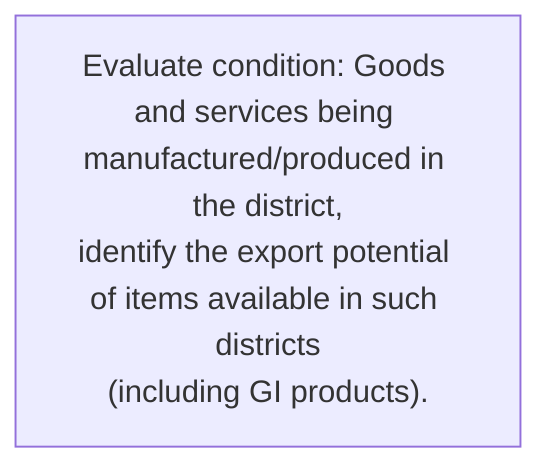
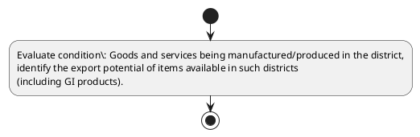

# Chapter 3 / Section 4: Goods and services being manufactured/produced in the district,

**Chapter Title:** Developing Districts as Export Hubs

**Pages:** 4

**Purpose:** Defines the operational requirements for Goods and services being manufactured/produced in the district,.

**Purpose Thanglish:** Indha Goods and services being manufactured/produced in the district, section-la, Defines the operational requirements for Goods and services being manufactured/produced in the district,.

**Summary:** 4. Goods and services being manufactured/produced in the district,
identify the export potential of items available in such districts
(including GI products).

**Business Meaning:** 4.

**Business Explanation:** 4. Goods and services being manufactured/produced in the district,
identify the export potential of items available in such districts
(including GI products).

**Business Explanation Thanglish:** Indha Goods and services being manufactured/produced in the district, section-la, 4. Goods and services being manufactured/produced in the district,
identify the export potential of items available in such districts
(including GI products).

## Business Logic
- None identified

## Business Rules
- rule_id=CH3-SEC4-R001, rule_description=4. Goods and services being manufactured/produced in the district,
identify the export potential of items available in such districts
(including GI products)., trigger=Goods and services being manufactured/produced in the district,, condition=Goods and services being manufactured/produced in the district,
identify the export potential of items available in such districts
(including GI products)., validation=Not explicitly covered in uploaded documents., action=Manual review required., exception=No explicit exception found in uploaded documents., output=DEKAI should produce a compliance decision for 4 - Goods and services being manufactured/produced in the district,.

## Conditions
- Goods and services being manufactured/produced in the district,
identify the export potential of items available in such districts
(including GI products).

## Condition Logic
- id=3.4.1, if=Goods and services being manufactured/produced in the district,
identify the export potential of items available in such districts
(including GI products)., then=Route for review, source=Goods and services being manufactured/produced in the district,
identify the export potential of items available in such districts
(including GI products).

## Validations
- None identified

## Exceptions
- None identified

## Dependencies
- None identified

## Authorities
- None identified

## Required Documents
- None identified

## Timelines
- None identified

## Actions
- None identified

## Workflow
- Evaluate condition: Goods and services being manufactured/produced in the district,
identify the export potential of items available in such districts
(including GI products).

## Workflow ASCII
```text
Goods and services being manufactured/produced in the district,
Evaluate condition: Goods and services being manufactured/produced in the district,
identify the export potential of items available in such districts
(including GI products).
```

## Decision Tree
- IF section 4 applies THEN proceed with standard DGFT workflow

## Decision Tree ASCII
```text
Goods and services being manufactured/produced in the district, Decision
IF section 4 applies THEN proceed with standard DGFT workflow
```

## Examples
- User asks to process Goods and services being manufactured/produced in the district,; the platform checks conditions, validations, and documents before action.

**Real-world Example:** Example: an importer or exporter invokes Goods and services being manufactured/produced in the district,, submits the prescribed DGFT records, and DEKAI uses the extracted rules to follow the goods and services being manufactured/produced in the district, process.

**Real-world Example Thanglish:** Indha Goods and services being manufactured/produced in the district, section-la, Example: an importer or exporter invokes Goods and services being manufactured/produced in the district,, submits the prescribed DGFT records, and DEKAI uses the extracted rules to follow the goods and services being manufactured/produced in the district, process.

## AI Rules
- None identified

## Database Fields
- name=section_code, type=string, required=True, source=parsed_section_heading
- name=section_title, type=string, required=True, source=parsed_section_heading
- name=and_flag, type=boolean, required=False, source=keyword:and
- name=the_flag, type=boolean, required=False, source=keyword:the
- name=such_flag, type=boolean, required=False, source=keyword:such
- name=goods_flag, type=boolean, required=False, source=keyword:Goods
- name=being_flag, type=boolean, required=False, source=keyword:being
- name=items_flag, type=boolean, required=False, source=keyword:items
- name=export_flag, type=boolean, required=False, source=keyword:export
- name=services_flag, type=boolean, required=False, source=keyword:services

## API Requirements
- method=GET, path=/api/dgft/sections/4, purpose=Retrieve knowledge payload for section 4, query_params=['include=workflow,decision_tree,validations'], response_fields=['section', 'title', 'summary', 'conditions', 'validations', 'exceptions', 'workflow', 'decision_tree']
- method=POST, path=/api/dgft/Goods-and-services-being-manufactured-produced-in-the-district/validate, purpose=Validate inputs and documents for Goods and services being manufactured/produced in the district,, request_fields=['section_code', 'section_title'], response_fields=['status', 'errors', 'warnings', 'next_actions']

## UI Screens
- screen_id=Goods_and_services_being_manufactured_produced_in_the_district_overview, name=Goods and services being manufactured/produced in the district, Overview, purpose=Show section summary, authority, timeline, and eligibility cues., widgets=['summary_card', 'conditions_table', 'authority_badges', 'timeline_panel']
- screen_id=Goods_and_services_being_manufactured_produced_in_the_district_submission, name=Goods and services being manufactured/produced in the district, Submission, purpose=Capture applicant data and supporting documents., widgets=['dynamic_form', 'document_uploader', 'validation_panel', 'next_action_footer'], fields=['section_code', 'section_title', 'and_flag', 'the_flag', 'such_flag', 'goods_flag', 'being_flag', 'items_flag']

## Error Messages
- Validation failed because the section requirements were not fully met.

## FAQ
- question_en=What is the purpose of section 4?, answer_en=4. Goods and services being manufactured/produced in the district,
identify the export potential of items available in such districts
(including GI products)., question_thanglish=Indha Goods and services being manufactured/produced in the district, section-la, What is the purpose of section 4?, answer_thanglish=Indha Goods and services being manufactured/produced in the district, section-la, 4. Goods and services being manufactured/produced in the district,
identify the export potential of items available in such districts
(including GI products).
- question_en=What documents are required under Goods and services being manufactured/produced in the district,?, answer_en=Not explicitly covered in uploaded documents., question_thanglish=Indha Goods and services being manufactured/produced in the district, section-la, What documents are required under Goods and services being manufactured/produced in the district,?, answer_thanglish=Indha Goods and services being manufactured/produced in the district, section-la, Not explicitly covered in uploaded documents.
- question_en=Which authority handles Goods and services being manufactured/produced in the district,?, answer_en=Not explicitly covered in uploaded documents., question_thanglish=Indha Goods and services being manufactured/produced in the district, section-la, Which authority handles Goods and services being manufactured/produced in the district,?, answer_thanglish=Indha Goods and services being manufactured/produced in the district, section-la, Not explicitly covered in uploaded documents.

## Questions Users May Ask
- What does Goods and services being manufactured/produced in the district, require?
- Which documents are needed for Goods and services being manufactured/produced in the district,?
- How does DEKAI validate Goods and services being manufactured/produced in the district, requests?

## Expected AI Answers
- Goods and services being manufactured/produced in the district, requires the platform to interpret the section text, apply the extracted business rules, and present the correct next action.
- Required documents are inferred from the section text: no explicit documents were detected.
- DEKAI validates Goods and services being manufactured/produced in the district, by checking conditions, required documents, authority references, and exception clauses before recommending an outcome.

## AI Q&A Examples
- question_en=User asks: How do I comply with Goods and services being manufactured/produced in the district,?, answer_en=AI answers: DEKAI should evaluate section 4, apply the extracted rules, and guide the user through Evaluate condition: Goods and services being manufactured/produced in the district,
identify the export potential of items available in such districts
(including GI products).., question_thanglish=Indha Goods and services being manufactured/produced in the district, section-la, User asks: How do I comply with Goods and services being manufactured/produced in the district,?, answer_thanglish=Indha Goods and services being manufactured/produced in the district, section-la, AI answers: DEKAI should evaluate section 4, apply the extracted rules, and guide the user through Evaluate condition: Goods and services being manufactured/produced in the district,
identify the export potential of items available in such districts
(including GI products)..
- question_en=User asks: Which validations apply to Goods and services being manufactured/produced in the district,?, answer_en=AI answers: Applicable validations are not explicitly covered in the uploaded documents., question_thanglish=Indha Goods and services being manufactured/produced in the district, section-la, User asks: Which validations apply to Goods and services being manufactured/produced in the district,?, answer_thanglish=Indha Goods and services being manufactured/produced in the district, section-la, AI answers: Applicable validations are not explicitly covered in the uploaded documents.

## DEKAI AI Implementation Notes
- Capture chapter 3, section 4, title, and page references as immutable knowledge metadata.
- Bind validations for Goods and services being manufactured/produced in the district, into a rule engine keyed by the rule IDs extracted for this section.

## DEKAI AI Implementation Notes Thanglish
- Indha Goods and services being manufactured/produced in the district, section-la, Capture chapter 3, section 4, title, and page references as immutable knowledge metadata.
- Indha Goods and services being manufactured/produced in the district, section-la, Bind validations for Goods and services being manufactured/produced in the district, into a rule engine keyed by the rule IDs extracted for this section.

## AI Metadata
- Keywords: and, the, such, Goods, being, items, export, services, district, identify, products, potential, available, districts, including, manufactured/produced
- Search Keywords: and, the, such, Goods, being, items, export, services, district, identify, products, potential, available, districts, including, manufactured/produced
- Intent: Provide knowledge guidance for Goods and services being manufactured/produced in the district,.
- Tags: 4, Goods and services being manufactured/produced in the district,, dgft
- Related Sections: 
- Related Chapters: 
- Related Rules: 

## Mermaid


## PlantUML

