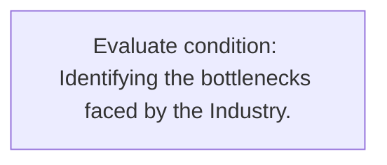
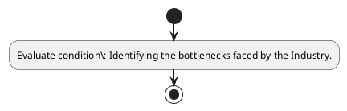

# Chapter 3 / Section 4: Identifying the bottlenecks faced by the Industry.

**Chapter Title:** Developing Districts as Export Hubs

**Pages:** 5

**Purpose:** Defines the operational requirements for Identifying the bottlenecks faced by the Industry..

**Purpose Thanglish:** Indha Identifying the bottlenecks faced by the Industry. section-la, Defines the operational requirements for Identifying the bottlenecks faced by the Industry..

**Summary:** 4. Identifying the bottlenecks faced by the Industry.

**Business Meaning:** 4.

**Business Explanation:** 4. Identifying the bottlenecks faced by the Industry.

**Business Explanation Thanglish:** Indha Identifying the bottlenecks faced by the Industry. section-la, 4. Identifying the bottlenecks faced by the Industry.

## Business Logic
- None identified

## Business Rules
- rule_id=CH3-SEC4-R001, rule_description=4. Identifying the bottlenecks faced by the Industry., trigger=Identifying the bottlenecks faced by the Industry., condition=Identifying the bottlenecks faced by the Industry., validation=Not explicitly covered in uploaded documents., action=Manual review required., exception=No explicit exception found in uploaded documents., output=DEKAI should produce a compliance decision for 4 - Identifying the bottlenecks faced by the Industry..

## Conditions
- Identifying the bottlenecks faced by the Industry.

## Condition Logic
- id=3.4.1, if=Identifying the bottlenecks faced by the Industry., then=Route for review, source=Identifying the bottlenecks faced by the Industry.

## Validations
- None identified

## Exceptions
- None identified

## Dependencies
- None identified

## Authorities
- None identified

## Required Documents
- None identified

## Timelines
- None identified

## Actions
- None identified

## Workflow
- Evaluate condition: Identifying the bottlenecks faced by the Industry.

## Workflow ASCII
```text
Identifying the bottlenecks faced by the Industry.
Evaluate condition: Identifying the bottlenecks faced by the Industry.
```

## Decision Tree
- IF section 4 applies THEN proceed with standard DGFT workflow

## Decision Tree ASCII
```text
Identifying the bottlenecks faced by the Industry. Decision
IF section 4 applies THEN proceed with standard DGFT workflow
```

## Examples
- User asks to process Identifying the bottlenecks faced by the Industry.; the platform checks conditions, validations, and documents before action.

**Real-world Example:** Example: an importer or exporter invokes Identifying the bottlenecks faced by the Industry., submits the prescribed DGFT records, and DEKAI uses the extracted rules to follow the identifying the bottlenecks faced by the industry. process.

**Real-world Example Thanglish:** Indha Identifying the bottlenecks faced by the Industry. section-la, Example: an importer or exporter invokes Identifying the bottlenecks faced by the Industry., submits the prescribed DGFT records, and DEKAI uses the extracted rules to follow the identifying the bottlenecks faced by the industry. process.

## AI Rules
- None identified

## Database Fields
- name=section_code, type=string, required=True, source=parsed_section_heading
- name=section_title, type=string, required=True, source=parsed_section_heading
- name=the_flag, type=boolean, required=False, source=keyword:the
- name=faced_flag, type=boolean, required=False, source=keyword:faced
- name=industry_flag, type=boolean, required=False, source=keyword:Industry
- name=identifying_flag, type=boolean, required=False, source=keyword:Identifying
- name=bottlenecks_flag, type=boolean, required=False, source=keyword:bottlenecks

## API Requirements
- method=GET, path=/api/dgft/sections/4, purpose=Retrieve knowledge payload for section 4, query_params=['include=workflow,decision_tree,validations'], response_fields=['section', 'title', 'summary', 'conditions', 'validations', 'exceptions', 'workflow', 'decision_tree']
- method=POST, path=/api/dgft/Identifying-the-bottlenecks-faced-by-the-Industry/validate, purpose=Validate inputs and documents for Identifying the bottlenecks faced by the Industry., request_fields=['section_code', 'section_title'], response_fields=['status', 'errors', 'warnings', 'next_actions']

## UI Screens
- screen_id=Identifying_the_bottlenecks_faced_by_the_Industry_overview, name=Identifying the bottlenecks faced by the Industry. Overview, purpose=Show section summary, authority, timeline, and eligibility cues., widgets=['summary_card', 'conditions_table', 'authority_badges', 'timeline_panel']
- screen_id=Identifying_the_bottlenecks_faced_by_the_Industry_submission, name=Identifying the bottlenecks faced by the Industry. Submission, purpose=Capture applicant data and supporting documents., widgets=['dynamic_form', 'document_uploader', 'validation_panel', 'next_action_footer'], fields=['section_code', 'section_title', 'the_flag', 'faced_flag', 'industry_flag', 'identifying_flag', 'bottlenecks_flag']

## Error Messages
- Validation failed because the section requirements were not fully met.

## FAQ
- question_en=What is the purpose of section 4?, answer_en=4. Identifying the bottlenecks faced by the Industry., question_thanglish=Indha Identifying the bottlenecks faced by the Industry. section-la, What is the purpose of section 4?, answer_thanglish=Indha Identifying the bottlenecks faced by the Industry. section-la, 4. Identifying the bottlenecks faced by the Industry.
- question_en=What documents are required under Identifying the bottlenecks faced by the Industry.?, answer_en=Not explicitly covered in uploaded documents., question_thanglish=Indha Identifying the bottlenecks faced by the Industry. section-la, What documents are required under Identifying the bottlenecks faced by the Industry.?, answer_thanglish=Indha Identifying the bottlenecks faced by the Industry. section-la, Not explicitly covered in uploaded documents.
- question_en=Which authority handles Identifying the bottlenecks faced by the Industry.?, answer_en=Not explicitly covered in uploaded documents., question_thanglish=Indha Identifying the bottlenecks faced by the Industry. section-la, Which authority handles Identifying the bottlenecks faced by the Industry.?, answer_thanglish=Indha Identifying the bottlenecks faced by the Industry. section-la, Not explicitly covered in uploaded documents.

## Questions Users May Ask
- What does Identifying the bottlenecks faced by the Industry. require?
- Which documents are needed for Identifying the bottlenecks faced by the Industry.?
- How does DEKAI validate Identifying the bottlenecks faced by the Industry. requests?

## Expected AI Answers
- Identifying the bottlenecks faced by the Industry. requires the platform to interpret the section text, apply the extracted business rules, and present the correct next action.
- Required documents are inferred from the section text: no explicit documents were detected.
- DEKAI validates Identifying the bottlenecks faced by the Industry. by checking conditions, required documents, authority references, and exception clauses before recommending an outcome.

## AI Q&A Examples
- question_en=User asks: How do I comply with Identifying the bottlenecks faced by the Industry.?, answer_en=AI answers: DEKAI should evaluate section 4, apply the extracted rules, and guide the user through Evaluate condition: Identifying the bottlenecks faced by the Industry.., question_thanglish=Indha Identifying the bottlenecks faced by the Industry. section-la, User asks: How do I comply with Identifying the bottlenecks faced by the Industry.?, answer_thanglish=Indha Identifying the bottlenecks faced by the Industry. section-la, AI answers: DEKAI should evaluate section 4, apply the extracted rules, and guide the user through Evaluate condition: Identifying the bottlenecks faced by the Industry..
- question_en=User asks: Which validations apply to Identifying the bottlenecks faced by the Industry.?, answer_en=AI answers: Applicable validations are not explicitly covered in the uploaded documents., question_thanglish=Indha Identifying the bottlenecks faced by the Industry. section-la, User asks: Which validations apply to Identifying the bottlenecks faced by the Industry.?, answer_thanglish=Indha Identifying the bottlenecks faced by the Industry. section-la, AI answers: Applicable validations are not explicitly covered in the uploaded documents.

## DEKAI AI Implementation Notes
- Capture chapter 3, section 4, title, and page references as immutable knowledge metadata.
- Bind validations for Identifying the bottlenecks faced by the Industry. into a rule engine keyed by the rule IDs extracted for this section.

## DEKAI AI Implementation Notes Thanglish
- Indha Identifying the bottlenecks faced by the Industry. section-la, Capture chapter 3, section 4, title, and page references as immutable knowledge metadata.
- Indha Identifying the bottlenecks faced by the Industry. section-la, Bind validations for Identifying the bottlenecks faced by the Industry. into a rule engine keyed by the rule IDs extracted for this section.

## AI Metadata
- Keywords: the, faced, Industry, Identifying, bottlenecks
- Search Keywords: the, faced, Industry, Identifying, bottlenecks
- Intent: Provide knowledge guidance for Identifying the bottlenecks faced by the Industry..
- Tags: 4, Identifying the bottlenecks faced by the Industry., dgft
- Related Sections: 
- Related Chapters: 
- Related Rules: 

## Mermaid


## PlantUML

