# Chapter  / Section 4: REFERENCES

**Chapter Title:** TradeNetDeclaration.IPTDEC Ver2.1 (2)

**Pages:** 4, 5

**Purpose:** 3, Code for the ECE/TRADE/201 1 Jan 96
Representation of Names of Countries - ISO Country Code
5 UN/ECE WP Trade Facilitation Recommendation No.

**Purpose Thanglish:** Indha REFERENCES section-la, 3, Code for the ECE/TRADE/201 1 Jan 96
Representation of Names of Countries - ISO Country Code
5 UN/ECE WP Trade Facilitation Recommendation No.

**Summary:** 4. REFERENCES
S/ Document Name Document/Directory Rev Date
N Reference
1 Trade Net Declaration message specification TDS41-MDS-XML-
DECLARATION-TX
2 Trade Net Response message specification TDS41-MDS-XML-
RESPONSE-TX
3 UN/CEFACT XML Naming and Design Rules Naming And Design Rules
_2.0.doc
4 UN/ECE WP Recommendation No. 3, Code for the ECE/TRADE/201 1 Jan 96
Representation of Names of Countries - ISO Country Code
5 UN/ECE WP Trade Facilitation Recommendation No.

**Business Meaning:** 4.

**Business Explanation:** 4. REFERENCES
S/ Document Name Document/Directory Rev Date
N Reference
1 Trade Net Declaration message specification TDS41-MDS-XML-
DECLARATION-TX
2 Trade Net Response message specification TDS41-MDS-XML-
RESPONSE-TX
3 UN/CEFACT XML Naming and Design Rules Naming And Design Rules
_2.0.doc
4 UN/ECE WP Recommendation No. 3, Code for the ECE/TRADE/201 1 Jan 96
Representation of Names of Countries - ISO Country Code
5 UN/ECE WP Trade Facilitation Recommendation No.

**Business Explanation Thanglish:** Indha REFERENCES section-la, 4. REFERENCES
S/ Document Name Document/Directory Rev Date
N Reference
1 Trade Net Declaration message specification TDS41-MDS-XML-
DECLARATION-TX
2 Trade Net Response message specification TDS41-MDS-XML-
RESPONSE-TX
3 UN/CEFACT XML Naming and Design Rules Naming And Design Rules
_2.0.doc
4 UN/ECE WP Recommendation No. 3, Code for the ECE/TRADE/201 1 Jan 96
Representation of Names of Countries - ISO Country Code
5 UN/ECE WP Trade Facilitation Recommendation No.

## Business Logic
- None identified

## Business Rules
- rule_id=CH-SEC4-R001, rule_description=4. REFERENCES
S/ Document Name Document/Directory Rev Date
N Reference
1 Trade Net Declaration message specification TDS41-MDS-XML-
DECLARATION-TX
2 Trade Net Response message specification TDS41-MDS-XML-
RESPONSE-TX
3 UN/CEFACT XML Naming and Design Rules Naming And Design Rules
_2.0.doc
4 UN/ECE WP Recommendation No. 3, Code for the ECE/TRADE/201 1 Jan 96
Representation of Names of Countries - ISO Country Code
5 UN/ECE WP Trade Facilitation Recommendation No., trigger=REFERENCES, condition=REFERENCES
S/ Document Name Document/Directory Rev Date
N Reference
1 Trade Net Declaration message specification TDS41-MDS-XML-
DECLARATION-TX
2 Trade Net Response message specification TDS41-MDS-XML-
RESPONSE-TX
3 UN/CEFACT XML Naming and Design Rules Naming And Design Rules
_2.0.doc
4 UN/ECE WP Recommendation No., validation=Not explicitly covered in uploaded documents., action=Manual review required., exception=No explicit exception found in uploaded documents., output=DEKAI should produce a compliance decision for 4 - REFERENCES.

## Conditions
- REFERENCES
S/ Document Name Document/Directory Rev Date
N Reference
1 Trade Net Declaration message specification TDS41-MDS-XML-
DECLARATION-TX
2 Trade Net Response message specification TDS41-MDS-XML-
RESPONSE-TX
3 UN/CEFACT XML Naming and Design Rules Naming And Design Rules
_2.0.doc
4 UN/ECE WP Recommendation No.
- 21, Codes CEFACT/ICG/2010/IC01 12 Jul 10
for Types of Cargo, Packages and Packaging Material 0/Rev.1
12 STDID Code Lists STDID-TDS41-COD
Trade Net Declaration.IPTDEC Ver2.1.doc Message Specification XML (IPTDEC)
OFFICIAL (CLOSED)
Prepared by:
TDS41-MDS-XML-IPTDEC-M
S/
N | Document Name | Document/Directory
Reference | Rev | Date
1 | Trade Net Declaration message specification | TDS41-MDS-XML-
DECLARATION-TX | |
2 | Trade Net Response message specification | TDS41-MDS-XML-
RESPONSE-TX | |
3 | UN/CEFACT XML Naming and Design Rules | Naming And Design Rules
_2.0.doc | |
4 | UN/ECE WP Recommendation No.
- REFERENCES
S/
N
Document Name
Document/Directory
Reference
Rev
Date
1
Trade Net Declaration message specification
TDS41-MDS-XML-
DECLARATION-TX
2
Trade Net Response message specification
TDS41-MDS-XML-
RESPONSE-TX
3
UN/CEFACT XML Naming and Design Rules
Naming And Design Rules
_2.0.doc
4
UN/ECE WP Recommendation No.

## Condition Logic
- id=.4.1, if=REFERENCES
S/ Document Name Document/Directory Rev Date
N Reference
1 Trade Net Declaration message specification TDS41-MDS-XML-
DECLARATION-TX
2 Trade Net Response message specification TDS41-MDS-XML-
RESPONSE-TX
3 UN/CEFACT XML Naming and Design Rules Naming And Design Rules
_2.0.doc
4 UN/ECE WP Recommendation No., then=Route for review, source=REFERENCES
S/ Document Name Document/Directory Rev Date
N Reference
1 Trade Net Declaration message specification TDS41-MDS-XML-
DECLARATION-TX
2 Trade Net Response message specification TDS41-MDS-XML-
RESPONSE-TX
3 UN/CEFACT XML Naming and Design Rules Naming And Design Rules
_2.0.doc
4 UN/ECE WP Recommendation No.
- id=.4.2, if=21, Codes CEFACT/ICG/2010/IC01 12 Jul 10
for Types of Cargo, Packages and Packaging Material 0/Rev.1
12 STDID Code Lists STDID-TDS41-COD
Trade Net Declaration.IPTDEC Ver2.1.doc Message Specification XML (IPTDEC)
OFFICIAL (CLOSED)
Prepared by:
TDS41-MDS-XML-IPTDEC-M
S/
N | Document Name | Document/Directory
Reference | Rev | Date
1 | Trade Net Declaration message specification | TDS41-MDS-XML-
DECLARATION-TX | |
2 | Trade Net Response message specification | TDS41-MDS-XML-
RESPONSE-TX | |
3 | UN/CEFACT XML Naming and Design Rules | Naming And Design Rules
_2.0.doc | |
4 | UN/ECE WP Recommendation No., then=Route for review, source=21, Codes CEFACT/ICG/2010/IC01 12 Jul 10
for Types of Cargo, Packages and Packaging Material 0/Rev.1
12 STDID Code Lists STDID-TDS41-COD
Trade Net Declaration.IPTDEC Ver2.1.doc Message Specification XML (IPTDEC)
OFFICIAL (CLOSED)
Prepared by:
TDS41-MDS-XML-IPTDEC-M
S/
N | Document Name | Document/Directory
Reference | Rev | Date
1 | Trade Net Declaration message specification | TDS41-MDS-XML-
DECLARATION-TX | |
2 | Trade Net Response message specification | TDS41-MDS-XML-
RESPONSE-TX | |
3 | UN/CEFACT XML Naming and Design Rules | Naming And Design Rules
_2.0.doc | |
4 | UN/ECE WP Recommendation No.
- id=.4.3, if=REFERENCES
S/
N
Document Name
Document/Directory
Reference
Rev
Date
1
Trade Net Declaration message specification
TDS41-MDS-XML-
DECLARATION-TX
2
Trade Net Response message specification
TDS41-MDS-XML-
RESPONSE-TX
3
UN/CEFACT XML Naming and Design Rules
Naming And Design Rules
_2.0.doc
4
UN/ECE WP Recommendation No., then=Route for review, source=REFERENCES
S/
N
Document Name
Document/Directory
Reference
Rev
Date
1
Trade Net Declaration message specification
TDS41-MDS-XML-
DECLARATION-TX
2
Trade Net Response message specification
TDS41-MDS-XML-
RESPONSE-TX
3
UN/CEFACT XML Naming and Design Rules
Naming And Design Rules
_2.0.doc
4
UN/ECE WP Recommendation No.

## Validations
- None identified

## Exceptions
- None identified

## Dependencies
- 1
- 2
- 3
- 5
- 6
- 7
- 8

## Authorities
- None identified

## Required Documents
- S/ Document Name Document
- Trade Net Declaration
- 21, Codes
for Types of Cargo, Packages and Packaging Material | CEFACT/ICG/2010/IC01
0/Rev.1 | | 12 Jul 10
12 | STDID Code Lists | STDID-TDS41-COD | |
OFFICIAL (CLOSED)
TRADENET MESSAGE
18/11/2021 11:10
AM
Prepared by:
For:
Release Date
18/11/2021
Ver
4.1
Reference
TRADENET
Document Id.

## Timelines
- None identified

## Actions
- None identified

## Workflow
- Evaluate condition: REFERENCES
S/ Document Name Document/Directory Rev Date
N Reference
1 Trade Net Declaration message specification TDS41-MDS-XML-
DECLARATION-TX
2 Trade Net Response message specification TDS41-MDS-XML-
RESPONSE-TX
3 UN/CEFACT XML Naming and Design Rules Naming And Design Rules
_2.0.doc
4 UN/ECE WP Recommendation No.
- Evaluate condition: 21, Codes CEFACT/ICG/2010/IC01 12 Jul 10
for Types of Cargo, Packages and Packaging Material 0/Rev.1
12 STDID Code Lists STDID-TDS41-COD
Trade Net Declaration.IPTDEC Ver2.1.doc Message Specification XML (IPTDEC)
OFFICIAL (CLOSED)
Prepared by:
TDS41-MDS-XML-IPTDEC-M
S/
N | Document Name | Document/Directory
Reference | Rev | Date
1 | Trade Net Declaration message specification | TDS41-MDS-XML-
DECLARATION-TX | |
2 | Trade Net Response message specification | TDS41-MDS-XML-
RESPONSE-TX | |
3 | UN/CEFACT XML Naming and Design Rules | Naming And Design Rules
_2.0.doc | |
4 | UN/ECE WP Recommendation No.
- Evaluate condition: REFERENCES
S/
N
Document Name
Document/Directory
Reference
Rev
Date
1
Trade Net Declaration message specification
TDS41-MDS-XML-
DECLARATION-TX
2
Trade Net Response message specification
TDS41-MDS-XML-
RESPONSE-TX
3
UN/CEFACT XML Naming and Design Rules
Naming And Design Rules
_2.0.doc
4
UN/ECE WP Recommendation No.

## Workflow ASCII
```text
REFERENCES
Evaluate condition: REFERENCES
S/ Document Name Document/Directory Rev Date
N Reference
1 Trade Net Declaration message specification TDS41-MDS-XML-
DECLARATION-TX
2 Trade Net Response message specification TDS41-MDS-XML-
RESPONSE-TX
3 UN/CEFACT XML Naming and Design Rules Naming And Design Rules
_2.0.doc
4 UN/ECE WP Recommendation No.
   |
   v
Evaluate condition: 21, Codes CEFACT/ICG/2010/IC01 12 Jul 10
for Types of Cargo, Packages and Packaging Material 0/Rev.1
12 STDID Code Lists STDID-TDS41-COD
Trade Net Declaration.IPTDEC Ver2.1.doc Message Specification XML (IPTDEC)
OFFICIAL (CLOSED)
Prepared by:
TDS41-MDS-XML-IPTDEC-M
S/
N | Document Name | Document/Directory
Reference | Rev | Date
1 | Trade Net Declaration message specification | TDS41-MDS-XML-
DECLARATION-TX | |
2 | Trade Net Response message specification | TDS41-MDS-XML-
RESPONSE-TX | |
3 | UN/CEFACT XML Naming and Design Rules | Naming And Design Rules
_2.0.doc | |
4 | UN/ECE WP Recommendation No.
   |
   v
Evaluate condition: REFERENCES
S/
N
Document Name
Document/Directory
Reference
Rev
Date
1
Trade Net Declaration message specification
TDS41-MDS-XML-
DECLARATION-TX
2
Trade Net Response message specification
TDS41-MDS-XML-
RESPONSE-TX
3
UN/CEFACT XML Naming and Design Rules
Naming And Design Rules
_2.0.doc
4
UN/ECE WP Recommendation No.
```

## Decision Tree
- IF section 4 applies THEN proceed with standard DGFT workflow

## Decision Tree ASCII
```text
REFERENCES Decision
IF section 4 applies THEN proceed with standard DGFT workflow
```

## Examples
- User asks to process REFERENCES; the platform checks conditions, validations, and documents before action.

**Real-world Example:** Example: an importer or exporter invokes REFERENCES, submits S/ Document Name Document, Trade Net Declaration, 21, Codes
for Types of Cargo, Packages and Packaging Material | CEFACT/ICG/2010/IC01
0/Rev.1 | | 12 Jul 10
12 | STDID Code Lists | STDID-TDS41-COD | |
OFFICIAL (CLOSED)
TRADENET MESSAGE
18/11/2021 11:10
AM
Prepared by:
For:
Release Date
18/11/2021
Ver
4.1
Reference
TRADENET
Document Id., and DEKAI uses the extracted rules to follow the references process.

**Real-world Example Thanglish:** Indha REFERENCES section-la, Example: an importer or exporter invokes REFERENCES, submits S/ Document Name Document, Trade Net Declaration, 21, Codes
for Types of Cargo, Packages and Packaging Material | CEFACT/ICG/2010/IC01
0/Rev.1 | | 12 Jul 10
12 | STDID Code Lists | STDID-TDS41-COD | |
OFFICIAL (CLOSED)
TRADENET MESSAGE
18/11/2021 11:10
AM
Prepared by:
For:
Release Date
18/11/2021
Ver
4.1
Reference
TRADENET
Document Id., and DEKAI uses the extracted rules to follow the references process.

## AI Rules
- None identified

## Database Fields
- name=section_code, type=string, required=True, source=parsed_section_heading
- name=section_title, type=string, required=True, source=parsed_section_heading
- name=rev_flag, type=boolean, required=False, source=keyword:Rev
- name=net_flag, type=boolean, required=False, source=keyword:Net
- name=xml_flag, type=boolean, required=False, source=keyword:XML
- name=and_flag, type=boolean, required=False, source=keyword:and
- name=doc_flag, type=boolean, required=False, source=keyword:doc
- name=for_flag, type=boolean, required=False, source=keyword:for
- name=the_flag, type=boolean, required=False, source=keyword:the
- name=jan_flag, type=boolean, required=False, source=keyword:Jan
- name=document_1_submitted, type=boolean, required=True, source=S/ Document Name Document
- name=document_2_submitted, type=boolean, required=True, source=Trade Net Declaration
- name=document_3_submitted, type=boolean, required=True, source=21, Codes
for Types of Cargo, Packages and Packaging Material | CEFACT/ICG/2010/IC01
0/Rev.1 | | 12 Jul 10
12 | STDID Code Lists | STDID-TDS41-COD | |
OFFICIAL (CLOSED)
TRADENET MESSAGE
18/11/2021 11:10
AM
Prepared by:
For:
Release Date
18/11/2021
Ver
4.1
Reference
TRADENET
Document Id.

## API Requirements
- method=GET, path=/api/dgft/sections/4, purpose=Retrieve knowledge payload for section 4, query_params=['include=workflow,decision_tree,validations'], response_fields=['section', 'title', 'summary', 'conditions', 'validations', 'exceptions', 'workflow', 'decision_tree']
- method=POST, path=/api/dgft/REFERENCES/validate, purpose=Validate inputs and documents for REFERENCES, request_fields=['section_code', 'section_title', 'document_1_submitted', 'document_2_submitted', 'document_3_submitted'], response_fields=['status', 'errors', 'warnings', 'next_actions']

## UI Screens
- screen_id=REFERENCES_overview, name=REFERENCES Overview, purpose=Show section summary, authority, timeline, and eligibility cues., widgets=['summary_card', 'conditions_table', 'authority_badges', 'timeline_panel']
- screen_id=REFERENCES_submission, name=REFERENCES Submission, purpose=Capture applicant data and supporting documents., widgets=['dynamic_form', 'document_uploader', 'validation_panel', 'next_action_footer'], fields=['section_code', 'section_title', 'rev_flag', 'net_flag', 'xml_flag', 'and_flag', 'doc_flag', 'for_flag']

## Error Messages
- Validation failed because the section requirements were not fully met.

## FAQ
- question_en=What is the purpose of section 4?, answer_en=4. REFERENCES
S/ Document Name Document/Directory Rev Date
N Reference
1 Trade Net Declaration message specification TDS41-MDS-XML-
DECLARATION-TX
2 Trade Net Response message specification TDS41-MDS-XML-
RESPONSE-TX
3 UN/CEFACT XML Naming and Design Rules Naming And Design Rules
_2.0.doc
4 UN/ECE WP Recommendation No. 3, Code for the ECE/TRADE/201 1 Jan 96
Representation of Names of Countries - ISO Country Code
5 UN/ECE WP Trade Facilitation Recommendation No., question_thanglish=Indha REFERENCES section-la, What is the purpose of section 4?, answer_thanglish=Indha REFERENCES section-la, 4. REFERENCES
S/ Document Name Document/Directory Rev Date
N Reference
1 Trade Net Declaration message specification TDS41-MDS-XML-
DECLARATION-TX
2 Trade Net Response message specification TDS41-MDS-XML-
RESPONSE-TX
3 UN/CEFACT XML Naming and Design Rules Naming And Design Rules
_2.0.doc
4 UN/ECE WP Recommendation No. 3, Code for the ECE/TRADE/201 1 Jan 96
Representation of Names of Countries - ISO Country Code
5 UN/ECE WP Trade Facilitation Recommendation No.
- question_en=What documents are required under REFERENCES?, answer_en=S/ Document Name Document, Trade Net Declaration, 21, Codes
for Types of Cargo, Packages and Packaging Material | CEFACT/ICG/2010/IC01
0/Rev.1 | | 12 Jul 10
12 | STDID Code Lists | STDID-TDS41-COD | |
OFFICIAL (CLOSED)
TRADENET MESSAGE
18/11/2021 11:10
AM
Prepared by:
For:
Release Date
18/11/2021
Ver
4.1
Reference
TRADENET
Document Id., question_thanglish=Indha REFERENCES section-la, What documents are required under REFERENCES?, answer_thanglish=Indha REFERENCES section-la, S/ Document Name Document, Trade Net Declaration, 21, Codes
for Types of Cargo, Packages and Packaging Material | CEFACT/ICG/2010/IC01
0/Rev.1 | | 12 Jul 10
12 | STDID Code Lists | STDID-TDS41-COD | |
OFFICIAL (CLOSED)
TRADENET MESSAGE
18/11/2021 11:10
AM
Prepared by:
For:
Release Date
18/11/2021
Ver
4.1
Reference
TRADENET
Document Id.
- question_en=Which authority handles REFERENCES?, answer_en=Not explicitly covered in uploaded documents., question_thanglish=Indha REFERENCES section-la, Which authority handles REFERENCES?, answer_thanglish=Indha REFERENCES section-la, Not explicitly covered in uploaded documents.

## Questions Users May Ask
- What does REFERENCES require?
- Which documents are needed for REFERENCES?
- How does DEKAI validate REFERENCES requests?

## Expected AI Answers
- REFERENCES requires the platform to interpret the section text, apply the extracted business rules, and present the correct next action.
- Required documents are inferred from the section text: S/ Document Name Document, Trade Net Declaration, 21, Codes
for Types of Cargo, Packages and Packaging Material | CEFACT/ICG/2010/IC01
0/Rev.1 | | 12 Jul 10
12 | STDID Code Lists | STDID-TDS41-COD | |
OFFICIAL (CLOSED)
TRADENET MESSAGE
18/11/2021 11:10
AM
Prepared by:
For:
Release Date
18/11/2021
Ver
4.1
Reference
TRADENET
Document Id.
- DEKAI validates REFERENCES by checking conditions, required documents, authority references, and exception clauses before recommending an outcome.

## AI Q&A Examples
- question_en=User asks: How do I comply with REFERENCES?, answer_en=AI answers: DEKAI should evaluate section 4, apply the extracted rules, and guide the user through Evaluate condition: REFERENCES
S/ Document Name Document/Directory Rev Date
N Reference
1 Trade Net Declaration message specification TDS41-MDS-XML-
DECLARATION-TX
2 Trade Net Response message specification TDS41-MDS-XML-
RESPONSE-TX
3 UN/CEFACT XML Naming and Design Rules Naming And Design Rules
_2.0.doc
4 UN/ECE WP Recommendation No.., question_thanglish=Indha REFERENCES section-la, User asks: How do I comply with REFERENCES?, answer_thanglish=Indha REFERENCES section-la, AI answers: DEKAI should evaluate section 4, apply the extracted rules, and guide the user through Evaluate condition: REFERENCES
S/ Document Name Document/Directory Rev Date
N Reference
1 Trade Net Declaration message specification TDS41-MDS-XML-
DECLARATION-TX
2 Trade Net Response message specification TDS41-MDS-XML-
RESPONSE-TX
3 UN/CEFACT XML Naming and Design Rules Naming And Design Rules
_2.0.doc
4 UN/ECE WP Recommendation No..
- question_en=User asks: Which validations apply to REFERENCES?, answer_en=AI answers: Applicable validations are not explicitly covered in the uploaded documents., question_thanglish=Indha REFERENCES section-la, User asks: Which validations apply to REFERENCES?, answer_thanglish=Indha REFERENCES section-la, AI answers: Applicable validations are not explicitly covered in the uploaded documents.

## DEKAI AI Implementation Notes
- Capture chapter , section 4, title, and page references as immutable knowledge metadata.
- Bind validations for REFERENCES into a rule engine keyed by the rule IDs extracted for this section.
- Expose document upload controls for: S/ Document Name Document, Trade Net Declaration, 21, Codes
for Types of Cargo, Packages and Packaging Material | CEFACT/ICG/2010/IC01
0/Rev.1 | | 12 Jul 10
12 | STDID Code Lists | STDID-TDS41-COD | |
OFFICIAL (CLOSED)
TRADENET MESSAGE
18/11/2021 11:10
AM
Prepared by:
For:
Release Date
18/11/2021
Ver
4.1
Reference
TRADENET
Document Id..
- Show contextual links to related sections: 1, 2, 3, 5, 6, 7, 8.

## DEKAI AI Implementation Notes Thanglish
- Indha REFERENCES section-la, Capture chapter , section 4, title, and page references as immutable knowledge metadata.
- Indha REFERENCES section-la, Bind validations for REFERENCES into a rule engine keyed by the rule IDs extracted for this section.
- Indha REFERENCES section-la, Expose document upload controls for: S/ Document Name Document, Trade Net Declaration, 21, Codes
for Types of Cargo, Packages and Packaging Material | CEFACT/ICG/2010/IC01
0/Rev.1 | | 12 Jul 10
12 | STDID Code Lists | STDID-TDS41-COD | |
OFFICIAL (CLOSED)
TRADENET MESSAGE
18/11/2021 11:10
AM
Prepared by:
For:
Release Date
18/11/2021
Ver
4.1
Reference
TRADENET
Document Id..
- Indha REFERENCES section-la, Show contextual links to related sections: 1, 2, 3, 5, 6, 7, 8.

## AI Metadata
- Keywords: Rev, Net, XML, and, doc, for, the, Jan, ISO, Dec, Sep, III, Jul, COD, Ver, Name, Date, Code, Used, Trade
- Search Keywords: Rev, Net, XML, and, doc, for, the, Jan, ISO, Dec, Sep, III, Jul, COD, Ver, Name, Date, Code, Used, Trade
- Intent: Provide knowledge guidance for REFERENCES.
- Tags: 4, REFERENCES, document-driven, dgft
- Related Sections: 1, 2, 3, 5, 6, 7, 8
- Related Chapters: 
- Related Rules: 

## Mermaid

```mermaid
flowchart TD
    S1["Evaluate condition: REFERENCES
S/ Document Name Document/Directory Rev Date
N Reference
1 Trade Net Declaration message specification TDS41-MDS-XML-
DECLARATION-TX
2 Trade Net Response message specification TDS41-MDS-XML-
RESPONSE-TX
3 UN/CEFACT XML Naming and Design Rules Naming And Design Rules
_2.0.doc
4 UN/ECE WP Recommendation No."]
    S2["Evaluate condition: 21, Codes CEFACT/ICG/2010/IC01 12 Jul 10
for Types of Cargo, Packages and Packaging Material 0/Rev.1
12 STDID Code Lists STDID-TDS41-COD
Trade Net Declaration.IPTDEC Ver2.1.doc Message Specification XML (IPTDEC)
OFFICIAL (CLOSED)
Prepared by:
TDS41-MDS-XML-IPTDEC-M
S/
N | Document Name | Document/Directory
Reference | Rev | Date
1 | Trade Net Declaration message specification | TDS41-MDS-XML-
DECLARATION-TX | |
2 | Trade Net Response message specification | TDS41-MDS-XML-
RESPONSE-TX | |
3 | UN/CEFACT XML Naming and Design Rules | Naming And Design Rules
_2.0.doc | |
4 | UN/ECE WP Recommendation No."]
    S1 --> S2
    S3["Evaluate condition: REFERENCES
S/
N
Document Name
Document/Directory
Reference
Rev
Date
1
Trade Net Declaration message specification
TDS41-MDS-XML-
DECLARATION-TX
2
Trade Net Response message specification
TDS41-MDS-XML-
RESPONSE-TX
3
UN/CEFACT XML Naming and Design Rules
Naming And Design Rules
_2.0.doc
4
UN/ECE WP Recommendation No."]
    S2 --> S3
```


## PlantUML
```plantuml
@startuml
start
:Evaluate condition\: REFERENCES
S/ Document Name Document/Directory Rev Date
N Reference
1 Trade Net Declaration message specification TDS41-MDS-XML-
DECLARATION-TX
2 Trade Net Response message specification TDS41-MDS-XML-
RESPONSE-TX
3 UN/CEFACT XML Naming and Design Rules Naming And Design Rules
_2.0.doc
4 UN/ECE WP Recommendation No.;
:Evaluate condition\: 21, Codes CEFACT/ICG/2010/IC01 12 Jul 10
for Types of Cargo, Packages and Packaging Material 0/Rev.1
12 STDID Code Lists STDID-TDS41-COD
Trade Net Declaration.IPTDEC Ver2.1.doc Message Specification XML (IPTDEC)
OFFICIAL (CLOSED)
Prepared by\:
TDS41-MDS-XML-IPTDEC-M
S/
N | Document Name | Document/Directory
Reference | Rev | Date
1 | Trade Net Declaration message specification | TDS41-MDS-XML-
DECLARATION-TX | |
2 | Trade Net Response message specification | TDS41-MDS-XML-
RESPONSE-TX | |
3 | UN/CEFACT XML Naming and Design Rules | Naming And Design Rules
_2.0.doc | |
4 | UN/ECE WP Recommendation No.;
:Evaluate condition\: REFERENCES
S/
N
Document Name
Document/Directory
Reference
Rev
Date
1
Trade Net Declaration message specification
TDS41-MDS-XML-
DECLARATION-TX
2
Trade Net Response message specification
TDS41-MDS-XML-
RESPONSE-TX
3
UN/CEFACT XML Naming and Design Rules
Naming And Design Rules
_2.0.doc
4
UN/ECE WP Recommendation No.;
stop
@enduml
```
