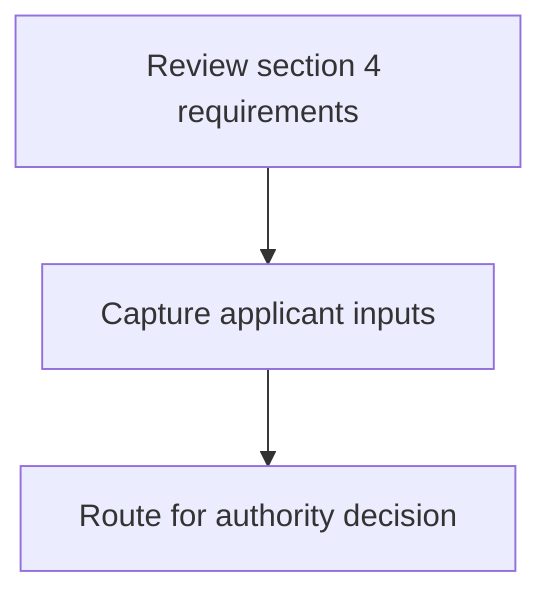
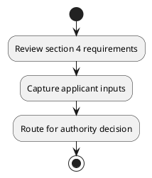

# Chapter 8 / Section 4: Representative of the Branch Manager of the concerned Bank:

**Chapter Title:** Quality Complaints and Trade Disputes

**Pages:** 3

**Purpose:** Defines the operational requirements for Representative of the Branch Manager of the concerned Bank:.

**Purpose Thanglish:** Indha Representative of the Branch Manager of the concerned Bank: section-la, Defines the operational requirements for Representative of the Branch Manager of the concerned Bank:.

**Summary:** 4. Representative of the Branch Manager of the concerned Bank:
Member

**Business Meaning:** 4.

**Business Explanation:** 4. Representative of the Branch Manager of the concerned Bank:
Member

**Business Explanation Thanglish:** Indha Representative of the Branch Manager of the concerned Bank: section-la, 4. Representative of the Branch Manager of the concerned Bank:
Member

## Business Logic
- None identified

## Business Rules
- rule_id=CH8-SEC4-R001, rule_description=4. Representative of the Branch Manager of the concerned Bank:
Member, trigger=Representative of the Branch Manager of the concerned Bank:, condition=Not explicitly covered in uploaded documents., validation=Not explicitly covered in uploaded documents., action=Manual review required., exception=No explicit exception found in uploaded documents., output=DEKAI should produce a compliance decision for 4 - Representative of the Branch Manager of the concerned Bank:.

## Conditions
- None identified

## Condition Logic
- None identified

## Validations
- None identified

## Exceptions
- None identified

## Dependencies
- None identified

## Authorities
- None identified

## Required Documents
- None identified

## Timelines
- None identified

## Actions
- None identified

## Workflow
- Review section 4 requirements
- Capture applicant inputs
- Route for authority decision

## Workflow ASCII
```text
Representative of the Branch Manager of the concerned Bank:
Review section 4 requirements
   |
   v
Capture applicant inputs
   |
   v
Route for authority decision
```

## Decision Tree
- IF section 4 applies THEN proceed with standard DGFT workflow

## Decision Tree ASCII
```text
Representative of the Branch Manager of the concerned Bank: Decision
IF section 4 applies THEN proceed with standard DGFT workflow
```

## Examples
- User asks to process Representative of the Branch Manager of the concerned Bank:; the platform checks conditions, validations, and documents before action.

**Real-world Example:** Example: an importer or exporter invokes Representative of the Branch Manager of the concerned Bank:, submits the prescribed DGFT records, and DEKAI uses the extracted rules to follow the representative of the branch manager of the concerned bank: process.

**Real-world Example Thanglish:** Indha Representative of the Branch Manager of the concerned Bank: section-la, Example: an importer or exporter invokes Representative of the Branch Manager of the concerned Bank:, submits the prescribed DGFT records, and DEKAI uses the extracted rules to follow the representative of the branch manager of the concerned bank: process.

## AI Rules
- None identified

## Database Fields
- name=section_code, type=string, required=True, source=parsed_section_heading
- name=section_title, type=string, required=True, source=parsed_section_heading
- name=the_flag, type=boolean, required=False, source=keyword:the
- name=bank_flag, type=boolean, required=False, source=keyword:Bank
- name=branch_flag, type=boolean, required=False, source=keyword:Branch
- name=member_flag, type=boolean, required=False, source=keyword:Member
- name=manager_flag, type=boolean, required=False, source=keyword:Manager
- name=concerned_flag, type=boolean, required=False, source=keyword:concerned
- name=representative_flag, type=boolean, required=False, source=keyword:Representative

## API Requirements
- method=GET, path=/api/dgft/sections/4, purpose=Retrieve knowledge payload for section 4, query_params=['include=workflow,decision_tree,validations'], response_fields=['section', 'title', 'summary', 'conditions', 'validations', 'exceptions', 'workflow', 'decision_tree']
- method=POST, path=/api/dgft/Representative-of-the-Branch-Manager-of-the-concerned-Bank/validate, purpose=Validate inputs and documents for Representative of the Branch Manager of the concerned Bank:, request_fields=['section_code', 'section_title'], response_fields=['status', 'errors', 'warnings', 'next_actions']

## UI Screens
- screen_id=Representative_of_the_Branch_Manager_of_the_concerned_Bank_overview, name=Representative of the Branch Manager of the concerned Bank: Overview, purpose=Show section summary, authority, timeline, and eligibility cues., widgets=['summary_card', 'conditions_table', 'authority_badges', 'timeline_panel']
- screen_id=Representative_of_the_Branch_Manager_of_the_concerned_Bank_submission, name=Representative of the Branch Manager of the concerned Bank: Submission, purpose=Capture applicant data and supporting documents., widgets=['dynamic_form', 'document_uploader', 'validation_panel', 'next_action_footer'], fields=['section_code', 'section_title', 'the_flag', 'bank_flag', 'branch_flag', 'member_flag', 'manager_flag', 'concerned_flag']

## Error Messages
- Validation failed because the section requirements were not fully met.

## FAQ
- question_en=What is the purpose of section 4?, answer_en=4. Representative of the Branch Manager of the concerned Bank:
Member, question_thanglish=Indha Representative of the Branch Manager of the concerned Bank: section-la, What is the purpose of section 4?, answer_thanglish=Indha Representative of the Branch Manager of the concerned Bank: section-la, 4. Representative of the Branch Manager of the concerned Bank:
Member
- question_en=What documents are required under Representative of the Branch Manager of the concerned Bank:?, answer_en=Not explicitly covered in uploaded documents., question_thanglish=Indha Representative of the Branch Manager of the concerned Bank: section-la, What documents are required under Representative of the Branch Manager of the concerned Bank:?, answer_thanglish=Indha Representative of the Branch Manager of the concerned Bank: section-la, Not explicitly covered in uploaded documents.
- question_en=Which authority handles Representative of the Branch Manager of the concerned Bank:?, answer_en=Not explicitly covered in uploaded documents., question_thanglish=Indha Representative of the Branch Manager of the concerned Bank: section-la, Which authority handles Representative of the Branch Manager of the concerned Bank:?, answer_thanglish=Indha Representative of the Branch Manager of the concerned Bank: section-la, Not explicitly covered in uploaded documents.

## Questions Users May Ask
- What does Representative of the Branch Manager of the concerned Bank: require?
- Which documents are needed for Representative of the Branch Manager of the concerned Bank:?
- How does DEKAI validate Representative of the Branch Manager of the concerned Bank: requests?

## Expected AI Answers
- Representative of the Branch Manager of the concerned Bank: requires the platform to interpret the section text, apply the extracted business rules, and present the correct next action.
- Required documents are inferred from the section text: no explicit documents were detected.
- DEKAI validates Representative of the Branch Manager of the concerned Bank: by checking conditions, required documents, authority references, and exception clauses before recommending an outcome.

## AI Q&A Examples
- question_en=User asks: How do I comply with Representative of the Branch Manager of the concerned Bank:?, answer_en=AI answers: DEKAI should evaluate section 4, apply the extracted rules, and guide the user through Review section 4 requirements., question_thanglish=Indha Representative of the Branch Manager of the concerned Bank: section-la, User asks: How do I comply with Representative of the Branch Manager of the concerned Bank:?, answer_thanglish=Indha Representative of the Branch Manager of the concerned Bank: section-la, AI answers: DEKAI should evaluate section 4, apply the extracted rules, and guide the user through Review section 4 requirements.
- question_en=User asks: Which validations apply to Representative of the Branch Manager of the concerned Bank:?, answer_en=AI answers: Applicable validations are not explicitly covered in the uploaded documents., question_thanglish=Indha Representative of the Branch Manager of the concerned Bank: section-la, User asks: Which validations apply to Representative of the Branch Manager of the concerned Bank:?, answer_thanglish=Indha Representative of the Branch Manager of the concerned Bank: section-la, AI answers: Applicable validations are not explicitly covered in the uploaded documents.

## DEKAI AI Implementation Notes
- Capture chapter 8, section 4, title, and page references as immutable knowledge metadata.
- Bind validations for Representative of the Branch Manager of the concerned Bank: into a rule engine keyed by the rule IDs extracted for this section.

## DEKAI AI Implementation Notes Thanglish
- Indha Representative of the Branch Manager of the concerned Bank: section-la, Capture chapter 8, section 4, title, and page references as immutable knowledge metadata.
- Indha Representative of the Branch Manager of the concerned Bank: section-la, Bind validations for Representative of the Branch Manager of the concerned Bank: into a rule engine keyed by the rule IDs extracted for this section.

## AI Metadata
- Keywords: the, Bank, Branch, Member, Manager, concerned, Representative
- Search Keywords: the, Bank, Branch, Member, Manager, concerned, Representative
- Intent: Provide knowledge guidance for Representative of the Branch Manager of the concerned Bank:.
- Tags: 4, Representative of the Branch Manager of the concerned Bank:, dgft
- Related Sections: 
- Related Chapters: 
- Related Rules: 

## Mermaid


## PlantUML

