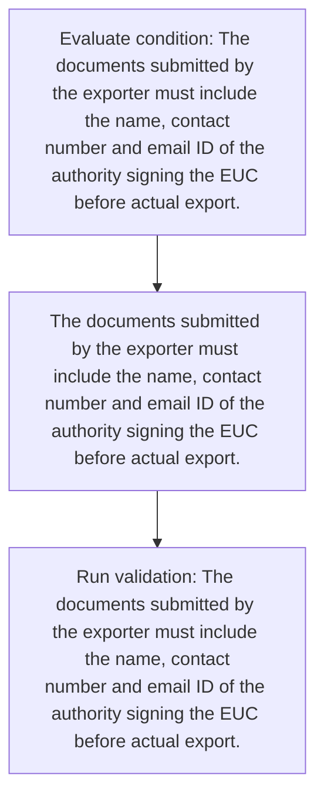
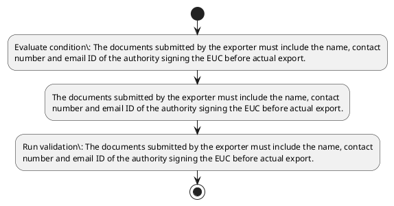

# Chapter 10 / Section 4: The documents submitted by the exporter must include the name, contact

**Chapter Title:** SCOMET: Special Chemicals, Organisms, Materials, Equipment and Technologies

**Pages:** 30, 34

**Purpose:** Defines the operational requirements for The documents submitted by the exporter must include the name, contact.

**Purpose Thanglish:** Indha The documents submitted by the exporter must include the name, contact section-la, Defines the operational requirements for The documents submitted by the exporter must include the name, contact.

**Summary:** 4. The documents submitted by the exporter must include the name, contact
number and email ID of the authority signing the EUC before actual export.

**Business Meaning:** The documents submitted by the exporter must include the name, contact governs how DGFT business controls should be applied, validated, and enforced.

**Business Explanation:** The documents submitted by the exporter must include the name, contact explains the operating rule set that DEKAI should enforce. Key control points include The documents submitted by the exporter must include the name, contact
number and email ID of the authority signing the EUC before actual export. The section also drives actions such as The documents submitted by the exporter must include the name, contact
number and email ID of the authority signing the EUC before actual export..

**Business Explanation Thanglish:** Indha The documents submitted by the exporter must include the name, contact section-la, The documents submitted by the exporter must include the name, contact explains the operating rule set that DEKAI should enforce. Key control points include The documents submitted by the exporter must include the name, contact
number and email ID of the authority signing the EUC before actual export. The section also drives actions such as The documents submitted by the exporter must include the name, contact
number and email ID of the authority signing the EUC before actual export..

## Business Logic
- The documents submitted by the exporter must include the name, contact
number and email ID of the authority signing the EUC before actual export.

## Business Rules
- rule_id=CH10-SEC4-R001, rule_description=The documents submitted by the exporter must include the name, contact
number and email ID of the authority signing the EUC before actual export., trigger=The documents submitted by the exporter must include the name, contact, condition=The documents submitted by the exporter must include the name, contact
number and email ID of the authority signing the EUC before actual export., validation=The documents submitted by the exporter must include the name, contact
number and email ID of the authority signing the EUC before actual export., action=The documents submitted by the exporter must include the name, contact
number and email ID of the authority signing the EUC before actual export., exception=No explicit exception found in uploaded documents., output=DEKAI should produce a compliance decision for 4 - The documents submitted by the exporter must include the name, contact.

## Conditions
- The documents submitted by the exporter must include the name, contact
number and email ID of the authority signing the EUC before actual export.

## Condition Logic
- id=10.4.1, if=The documents submitted by the exporter must include the name, contact
number and email ID of the authority signing the EUC before actual export., then=The documents submitted by the exporter must include the name, contact
number and email ID of the authority signing the EUC before actual export., source=The documents submitted by the exporter must include the name, contact
number and email ID of the authority signing the EUC before actual export.

## Validations
- The documents submitted by the exporter must include the name, contact
number and email ID of the authority signing the EUC before actual export.

## Exceptions
- None identified

## Dependencies
- None identified

## Authorities
- None identified

## Required Documents
- The documents submitted by the exporter must include the name, contact
number and email ID of the authority signing the EUC before actual export.

## Timelines
- The documents submitted by the exporter must include the name, contact
number and email ID of the authority signing the EUC before actual export.

## Actions
- The documents submitted by the exporter must include the name, contact
number and email ID of the authority signing the EUC before actual export.

## Workflow
- Evaluate condition: The documents submitted by the exporter must include the name, contact
number and email ID of the authority signing the EUC before actual export.
- The documents submitted by the exporter must include the name, contact
number and email ID of the authority signing the EUC before actual export.
- Run validation: The documents submitted by the exporter must include the name, contact
number and email ID of the authority signing the EUC before actual export.

## Workflow ASCII
```text
The documents submitted by the exporter must include the name, contact
Evaluate condition: The documents submitted by the exporter must include the name, contact
number and email ID of the authority signing the EUC before actual export.
   |
   v
The documents submitted by the exporter must include the name, contact
number and email ID of the authority signing the EUC before actual export.
   |
   v
Run validation: The documents submitted by the exporter must include the name, contact
number and email ID of the authority signing the EUC before actual export.
```

## Decision Tree
- IF The documents submitted by the exporter must include the name, contact
number and email ID of the authority signing the EUC before actual export. THEN The documents submitted by the exporter must include the name, contact
number and email ID of the authority signing the EUC before actual export.

## Decision Tree ASCII
```text
The documents submitted by the exporter must include the name, contact Decision
IF The documents submitted by the exporter must include the name, contact
number and email ID of the authority signing the EUC before actual export. THEN The documents submitted by the exporter must include the name, contact
number and email ID of the authority signing the EUC before actual export.
```

## Examples
- User asks to process The documents submitted by the exporter must include the name, contact; the platform checks conditions, validations, and documents before action.

**Real-world Example:** Example: an importer or exporter invokes The documents submitted by the exporter must include the name, contact, submits The documents submitted by the exporter must include the name, contact
number and email ID of the authority signing the EUC before actual export., and DEKAI uses the extracted rules to the documents submitted by the exporter must include the name, contact
number and email id of the authority signing the euc before actual export..

**Real-world Example Thanglish:** Indha The documents submitted by the exporter must include the name, contact section-la, Example: an importer or exporter invokes The documents submitted by the exporter must include the name, contact, submits The documents submitted by the exporter must include the name, contact
number and email ID of the authority signing the EUC before actual export., and DEKAI uses the extracted rules to the documents submitted by the exporter must include the name, contact
number and email id of the authority signing the euc before actual export..

## AI Rules
- IF detected context matches section rule THEN enforce: The documents submitted by the exporter must include the name, contact
number and email ID of the authority signing the EUC before actual export.
- IF validations pass THEN recommend action: The documents submitted by the exporter must include the name, contact
number and email ID of the authority signing the EUC before actual export.

## Database Fields
- name=section_code, type=string, required=True, source=parsed_section_heading
- name=section_title, type=string, required=True, source=parsed_section_heading
- name=the_flag, type=boolean, required=False, source=keyword:The
- name=and_flag, type=boolean, required=False, source=keyword:and
- name=euc_flag, type=boolean, required=False, source=keyword:EUC
- name=must_flag, type=boolean, required=False, source=keyword:must
- name=name_flag, type=boolean, required=False, source=keyword:name
- name=email_flag, type=boolean, required=False, source=keyword:email
- name=number_flag, type=boolean, required=False, source=keyword:number
- name=before_flag, type=boolean, required=False, source=keyword:before
- name=document_1_submitted, type=boolean, required=True, source=The documents submitted by the exporter must include the name, contact
number and email ID of the authority signing the EUC before actual export.

## API Requirements
- method=GET, path=/api/dgft/sections/4, purpose=Retrieve knowledge payload for section 4, query_params=['include=workflow,decision_tree,validations'], response_fields=['section', 'title', 'summary', 'conditions', 'validations', 'exceptions', 'workflow', 'decision_tree']
- method=POST, path=/api/dgft/The-documents-submitted-by-the-exporter-must-include-the-name-contact/validate, purpose=Validate inputs and documents for The documents submitted by the exporter must include the name, contact, request_fields=['section_code', 'section_title', 'document_1_submitted'], response_fields=['status', 'errors', 'warnings', 'next_actions']
- method=POST, path=/api/dgft/The-documents-submitted-by-the-exporter-must-include-the-name-contact/execute, purpose=Trigger business action for The documents submitted by the exporter must include the name, contact
number and email ID of the authority signing the EUC before actual export., request_fields=['section_code', 'section_title', 'document_1_submitted'], response_fields=['reference_id', 'status', 'authority', 'timeline']

## UI Screens
- screen_id=The_documents_submitted_by_the_exporter_must_include_the_name_contact_overview, name=The documents submitted by the exporter must include the name, contact Overview, purpose=Show section summary, authority, timeline, and eligibility cues., widgets=['summary_card', 'conditions_table', 'authority_badges', 'timeline_panel']
- screen_id=The_documents_submitted_by_the_exporter_must_include_the_name_contact_submission, name=The documents submitted by the exporter must include the name, contact Submission, purpose=Capture applicant data and supporting documents., widgets=['dynamic_form', 'document_uploader', 'validation_panel', 'next_action_footer'], fields=['section_code', 'section_title', 'the_flag', 'and_flag', 'euc_flag', 'must_flag', 'name_flag', 'email_flag']

## Error Messages
- Validation failed because the section requirements were not fully met.

## FAQ
- question_en=What is the purpose of section 4?, answer_en=The documents submitted by the exporter must include the name, contact explains the operating rule set that DEKAI should enforce. Key control points include The documents submitted by the exporter must include the name, contact
number and email ID of the authority signing the EUC before actual export. The section also drives actions such as The documents submitted by the exporter must include the name, contact
number and email ID of the authority signing the EUC before actual export.., question_thanglish=Indha The documents submitted by the exporter must include the name, contact section-la, What is the purpose of section 4?, answer_thanglish=Indha The documents submitted by the exporter must include the name, contact section-la, The documents submitted by the exporter must include the name, contact explains the operating rule set that DEKAI should enforce. Key control points include The documents submitted by the exporter must include the name, contact
number and email ID of the authority signing the EUC before actual export. The section also drives actions such as The documents submitted by the exporter must include the name, contact
number and email ID of the authority signing the EUC before actual export..
- question_en=What documents are required under The documents submitted by the exporter must include the name, contact?, answer_en=The documents submitted by the exporter must include the name, contact
number and email ID of the authority signing the EUC before actual export., question_thanglish=Indha The documents submitted by the exporter must include the name, contact section-la, What documents are required under The documents submitted by the exporter must include the name, contact?, answer_thanglish=Indha The documents submitted by the exporter must include the name, contact section-la, The documents submitted by the exporter must include the name, contact
number and email ID of the authority signing the EUC before actual export.
- question_en=Which authority handles The documents submitted by the exporter must include the name, contact?, answer_en=Not explicitly covered in uploaded documents., question_thanglish=Indha The documents submitted by the exporter must include the name, contact section-la, Which authority handles The documents submitted by the exporter must include the name, contact?, answer_thanglish=Indha The documents submitted by the exporter must include the name, contact section-la, Not explicitly covered in uploaded documents.

## Questions Users May Ask
- What does The documents submitted by the exporter must include the name, contact require?
- Which documents are needed for The documents submitted by the exporter must include the name, contact?
- How does DEKAI validate The documents submitted by the exporter must include the name, contact requests?
- What action should be taken for The documents submitted by the exporter must include the name, contact?

## Expected AI Answers
- The documents submitted by the exporter must include the name, contact requires the platform to interpret the section text, apply the extracted business rules, and present the correct next action.
- Required documents are inferred from the section text: The documents submitted by the exporter must include the name, contact
number and email ID of the authority signing the EUC before actual export.
- DEKAI validates The documents submitted by the exporter must include the name, contact by checking conditions, required documents, authority references, and exception clauses before recommending an outcome.
- The primary extracted action is: The documents submitted by the exporter must include the name, contact
number and email ID of the authority signing the EUC before actual export.

## AI Q&A Examples
- question_en=User asks: How do I comply with The documents submitted by the exporter must include the name, contact?, answer_en=AI answers: DEKAI should evaluate section 4, apply the extracted rules, and guide the user through Evaluate condition: The documents submitted by the exporter must include the name, contact
number and email ID of the authority signing the EUC before actual export.., question_thanglish=Indha The documents submitted by the exporter must include the name, contact section-la, User asks: How do I comply with The documents submitted by the exporter must include the name, contact?, answer_thanglish=Indha The documents submitted by the exporter must include the name, contact section-la, AI answers: DEKAI should evaluate section 4, apply the extracted rules, and guide the user through Evaluate condition: The documents submitted by the exporter must include the name, contact
number and email ID of the authority signing the EUC before actual export..
- question_en=User asks: Which validations apply to The documents submitted by the exporter must include the name, contact?, answer_en=AI answers: Applicable validations are The documents submitted by the exporter must include the name, contact
number and email ID of the authority signing the EUC before actual export., question_thanglish=Indha The documents submitted by the exporter must include the name, contact section-la, User asks: Which validations apply to The documents submitted by the exporter must include the name, contact?, answer_thanglish=Indha The documents submitted by the exporter must include the name, contact section-la, AI answers: Applicable validations are The documents submitted by the exporter must include the name, contact
number and email ID of the authority signing the EUC before actual export.

## DEKAI AI Implementation Notes
- Capture chapter 10, section 4, title, and page references as immutable knowledge metadata.
- Bind validations for The documents submitted by the exporter must include the name, contact into a rule engine keyed by the rule IDs extracted for this section.
- Expose document upload controls for: The documents submitted by the exporter must include the name, contact
number and email ID of the authority signing the EUC before actual export..

## DEKAI AI Implementation Notes Thanglish
- Indha The documents submitted by the exporter must include the name, contact section-la, Capture chapter 10, section 4, title, and page references as immutable knowledge metadata.
- Indha The documents submitted by the exporter must include the name, contact section-la, Bind validations for The documents submitted by the exporter must include the name, contact into a rule engine keyed by the rule IDs extracted for this section.
- Indha The documents submitted by the exporter must include the name, contact section-la, Expose document upload controls for: The documents submitted by the exporter must include the name, contact
number and email ID of the authority signing the EUC before actual export..

## AI Metadata
- Keywords: The, and, EUC, must, name, email, number, before, actual, export, include, contact, signing, exporter, documents, submitted, authority
- Search Keywords: The, and, EUC, must, name, email, number, before, actual, export, include, contact, signing, exporter, documents, submitted, authority
- Intent: Support The documents submitted by the exporter must include the name, contact processing and compliance validation.
- Tags: 4, The documents submitted by the exporter must include the name, contact, business-rule, document-driven, dgft
- Related Sections: 
- Related Chapters: 
- Related Rules: The documents submitted by the exporter must include the name, contact
number and email ID of the authority signing the EUC before actual export.

## Mermaid


## PlantUML

