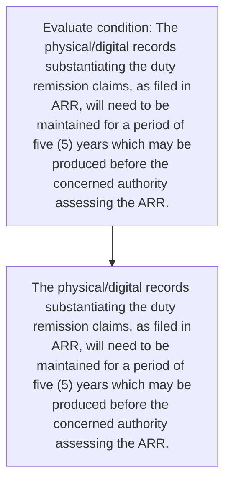
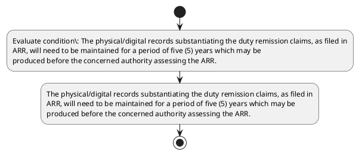

# Chapter 4 / Section 4: The physical/digital records substantiating the duty remission claims, as filed in

**Chapter Title:** Duty Exemption / Remission Schemes

**Pages:** 55

**Purpose:** The physical/digital records substantiating the duty remission claims, as filed in
ARR, will need to be maintained for a period of five (5) years which may be
produced before the concerned authority assessing the ARR.

**Purpose Thanglish:** Indha The physical/digital records substantiating the duty remission claims, as filed in section-la, The physical/digital records substantiating the duty remission claims, as filed in
ARR, will need to be maintained for a period of five (5) years which may be
produced before the concerned authority assessing the ARR.

**Summary:** 4. The physical/digital records substantiating the duty remission claims, as filed in
ARR, will need to be maintained for a period of five (5) years which may be
produced before the concerned authority assessing the ARR.

**Business Meaning:** 4.

**Business Explanation:** 4. The physical/digital records substantiating the duty remission claims, as filed in
ARR, will need to be maintained for a period of five (5) years which may be
produced before the concerned authority assessing the ARR.

**Business Explanation Thanglish:** Indha The physical/digital records substantiating the duty remission claims, as filed in section-la, 4. The physical/digital records substantiating the duty remission claims, as filed in
ARR, will need to be maintained for a period of five (5) years which may be
produced before the concerned authority assessing the ARR.

## Business Logic
- None identified

## Business Rules
- rule_id=CH4-SEC4-R001, rule_description=IF validations pass THEN recommend action: The physical/digital records substantiating the duty remission claims, as filed in
ARR, will need to be maintained for a period of five (5) years which may be
produced before the concerned authority assessing the ARR., trigger=The physical/digital records substantiating the duty remission claims, as filed in, condition=The physical/digital records substantiating the duty remission claims, as filed in
ARR, will need to be maintained for a period of five (5) years which may be
produced before the concerned authority assessing the ARR., validation=Not explicitly covered in uploaded documents., action=The physical/digital records substantiating the duty remission claims, as filed in
ARR, will need to be maintained for a period of five (5) years which may be
produced before the concerned authority assessing the ARR., exception=No explicit exception found in uploaded documents., output=DEKAI should produce a compliance decision for 4 - The physical/digital records substantiating the duty remission claims, as filed in.

## Conditions
- The physical/digital records substantiating the duty remission claims, as filed in
ARR, will need to be maintained for a period of five (5) years which may be
produced before the concerned authority assessing the ARR.

## Condition Logic
- id=4.4.1, if=The physical/digital records substantiating the duty remission claims, as filed in
ARR, will need to be maintained for a period of five (5) years which may be
produced before the concerned authority assessing the ARR., then=The physical/digital records substantiating the duty remission claims, as filed in
ARR, will need to be maintained for a period of five (5) years which may be
produced before the concerned authority assessing the ARR., source=The physical/digital records substantiating the duty remission claims, as filed in
ARR, will need to be maintained for a period of five (5) years which may be
produced before the concerned authority assessing the ARR.

## Validations
- None identified

## Exceptions
- None identified

## Dependencies
- 5

## Authorities
- None identified

## Required Documents
- None identified

## Timelines
- The physical/digital records substantiating the duty remission claims, as filed in
ARR, will need to be maintained for a period of five (5) years which may be
produced before the concerned authority assessing the ARR.

## Actions
- The physical/digital records substantiating the duty remission claims, as filed in
ARR, will need to be maintained for a period of five (5) years which may be
produced before the concerned authority assessing the ARR.

## Workflow
- Evaluate condition: The physical/digital records substantiating the duty remission claims, as filed in
ARR, will need to be maintained for a period of five (5) years which may be
produced before the concerned authority assessing the ARR.
- The physical/digital records substantiating the duty remission claims, as filed in
ARR, will need to be maintained for a period of five (5) years which may be
produced before the concerned authority assessing the ARR.

## Workflow ASCII
```text
The physical/digital records substantiating the duty remission claims, as filed in
Evaluate condition: The physical/digital records substantiating the duty remission claims, as filed in
ARR, will need to be maintained for a period of five (5) years which may be
produced before the concerned authority assessing the ARR.
   |
   v
The physical/digital records substantiating the duty remission claims, as filed in
ARR, will need to be maintained for a period of five (5) years which may be
produced before the concerned authority assessing the ARR.
```

## Decision Tree
- IF The physical/digital records substantiating the duty remission claims, as filed in
ARR, will need to be maintained for a period of five (5) years which may be
produced before the concerned authority assessing the ARR. THEN The physical/digital records substantiating the duty remission claims, as filed in
ARR, will need to be maintained for a period of five (5) years which may be
produced before the concerned authority assessing the ARR.

## Decision Tree ASCII
```text
The physical/digital records substantiating the duty remission claims, as filed in Decision
IF The physical/digital records substantiating the duty remission claims, as filed in
ARR, will need to be maintained for a period of five (5) years which may be
produced before the concerned authority assessing the ARR. THEN The physical/digital records substantiating the duty remission claims, as filed in
ARR, will need to be maintained for a period of five (5) years which may be
produced before the concerned authority assessing the ARR.
```

## Examples
- User asks to process The physical/digital records substantiating the duty remission claims, as filed in; the platform checks conditions, validations, and documents before action.

**Real-world Example:** Example: an importer or exporter invokes The physical/digital records substantiating the duty remission claims, as filed in, submits the prescribed DGFT records, and DEKAI uses the extracted rules to the physical/digital records substantiating the duty remission claims, as filed in
arr, will need to be maintained for a period of five (5) years which may be
produced before the concerned authority assessing the arr..

**Real-world Example Thanglish:** Indha The physical/digital records substantiating the duty remission claims, as filed in section-la, Example: an importer or exporter invokes The physical/digital records substantiating the duty remission claims, as filed in, submits the prescribed DGFT records, and DEKAI uses the extracted rules to the physical/digital records substantiating the duty remission claims, as filed in
arr, will need to be maintained for a period of five (5) years which may be
produced before the concerned authority assessing the arr..

## AI Rules
- IF validations pass THEN recommend action: The physical/digital records substantiating the duty remission claims, as filed in
ARR, will need to be maintained for a period of five (5) years which may be
produced before the concerned authority assessing the ARR.

## Database Fields
- name=section_code, type=string, required=True, source=parsed_section_heading
- name=section_title, type=string, required=True, source=parsed_section_heading
- name=the_flag, type=boolean, required=False, source=keyword:The
- name=arr_flag, type=boolean, required=False, source=keyword:ARR
- name=for_flag, type=boolean, required=False, source=keyword:for
- name=may_flag, type=boolean, required=False, source=keyword:may
- name=duty_flag, type=boolean, required=False, source=keyword:duty
- name=will_flag, type=boolean, required=False, source=keyword:will
- name=need_flag, type=boolean, required=False, source=keyword:need
- name=five_flag, type=boolean, required=False, source=keyword:five

## API Requirements
- method=GET, path=/api/dgft/sections/4, purpose=Retrieve knowledge payload for section 4, query_params=['include=workflow,decision_tree,validations'], response_fields=['section', 'title', 'summary', 'conditions', 'validations', 'exceptions', 'workflow', 'decision_tree']
- method=POST, path=/api/dgft/The-physical-digital-records-substantiating-the-duty-remission-claims-as-filed-in/validate, purpose=Validate inputs and documents for The physical/digital records substantiating the duty remission claims, as filed in, request_fields=['section_code', 'section_title'], response_fields=['status', 'errors', 'warnings', 'next_actions']
- method=POST, path=/api/dgft/The-physical-digital-records-substantiating-the-duty-remission-claims-as-filed-in/execute, purpose=Trigger business action for The physical/digital records substantiating the duty remission claims, as filed in
ARR, will need to be maintained for a period of five (5) years which may be
produced before the concerned authority assessing the ARR., request_fields=['section_code', 'section_title'], response_fields=['reference_id', 'status', 'authority', 'timeline']

## UI Screens
- screen_id=The_physical_digital_records_substantiating_the_duty_remission_claims_as_filed_in_overview, name=The physical/digital records substantiating the duty remission claims, as filed in Overview, purpose=Show section summary, authority, timeline, and eligibility cues., widgets=['summary_card', 'conditions_table', 'authority_badges', 'timeline_panel']
- screen_id=The_physical_digital_records_substantiating_the_duty_remission_claims_as_filed_in_submission, name=The physical/digital records substantiating the duty remission claims, as filed in Submission, purpose=Capture applicant data and supporting documents., widgets=['dynamic_form', 'document_uploader', 'validation_panel', 'next_action_footer'], fields=['section_code', 'section_title', 'the_flag', 'arr_flag', 'for_flag', 'may_flag', 'duty_flag', 'will_flag']

## Error Messages
- Validation failed because the section requirements were not fully met.

## FAQ
- question_en=What is the purpose of section 4?, answer_en=4. The physical/digital records substantiating the duty remission claims, as filed in
ARR, will need to be maintained for a period of five (5) years which may be
produced before the concerned authority assessing the ARR., question_thanglish=Indha The physical/digital records substantiating the duty remission claims, as filed in section-la, What is the purpose of section 4?, answer_thanglish=Indha The physical/digital records substantiating the duty remission claims, as filed in section-la, 4. The physical/digital records substantiating the duty remission claims, as filed in
ARR, will need to be maintained for a period of five (5) years which may be
produced before the concerned authority assessing the ARR.
- question_en=What documents are required under The physical/digital records substantiating the duty remission claims, as filed in?, answer_en=Not explicitly covered in uploaded documents., question_thanglish=Indha The physical/digital records substantiating the duty remission claims, as filed in section-la, What documents are required under The physical/digital records substantiating the duty remission claims, as filed in?, answer_thanglish=Indha The physical/digital records substantiating the duty remission claims, as filed in section-la, Not explicitly covered in uploaded documents.
- question_en=Which authority handles The physical/digital records substantiating the duty remission claims, as filed in?, answer_en=Not explicitly covered in uploaded documents., question_thanglish=Indha The physical/digital records substantiating the duty remission claims, as filed in section-la, Which authority handles The physical/digital records substantiating the duty remission claims, as filed in?, answer_thanglish=Indha The physical/digital records substantiating the duty remission claims, as filed in section-la, Not explicitly covered in uploaded documents.

## Questions Users May Ask
- What does The physical/digital records substantiating the duty remission claims, as filed in require?
- Which documents are needed for The physical/digital records substantiating the duty remission claims, as filed in?
- How does DEKAI validate The physical/digital records substantiating the duty remission claims, as filed in requests?
- What action should be taken for The physical/digital records substantiating the duty remission claims, as filed in?

## Expected AI Answers
- The physical/digital records substantiating the duty remission claims, as filed in requires the platform to interpret the section text, apply the extracted business rules, and present the correct next action.
- Required documents are inferred from the section text: no explicit documents were detected.
- DEKAI validates The physical/digital records substantiating the duty remission claims, as filed in by checking conditions, required documents, authority references, and exception clauses before recommending an outcome.
- The primary extracted action is: The physical/digital records substantiating the duty remission claims, as filed in
ARR, will need to be maintained for a period of five (5) years which may be
produced before the concerned authority assessing the ARR.

## AI Q&A Examples
- question_en=User asks: How do I comply with The physical/digital records substantiating the duty remission claims, as filed in?, answer_en=AI answers: DEKAI should evaluate section 4, apply the extracted rules, and guide the user through Evaluate condition: The physical/digital records substantiating the duty remission claims, as filed in
ARR, will need to be maintained for a period of five (5) years which may be
produced before the concerned authority assessing the ARR.., question_thanglish=Indha The physical/digital records substantiating the duty remission claims, as filed in section-la, User asks: How do I comply with The physical/digital records substantiating the duty remission claims, as filed in?, answer_thanglish=Indha The physical/digital records substantiating the duty remission claims, as filed in section-la, AI answers: DEKAI should evaluate section 4, apply the extracted rules, and guide the user through Evaluate condition: The physical/digital records substantiating the duty remission claims, as filed in
ARR, will need to be maintained for a period of five (5) years which may be
produced before the concerned authority assessing the ARR..
- question_en=User asks: Which validations apply to The physical/digital records substantiating the duty remission claims, as filed in?, answer_en=AI answers: Applicable validations are not explicitly covered in the uploaded documents., question_thanglish=Indha The physical/digital records substantiating the duty remission claims, as filed in section-la, User asks: Which validations apply to The physical/digital records substantiating the duty remission claims, as filed in?, answer_thanglish=Indha The physical/digital records substantiating the duty remission claims, as filed in section-la, AI answers: Applicable validations are not explicitly covered in the uploaded documents.

## DEKAI AI Implementation Notes
- Capture chapter 4, section 4, title, and page references as immutable knowledge metadata.
- Bind validations for The physical/digital records substantiating the duty remission claims, as filed in into a rule engine keyed by the rule IDs extracted for this section.
- Show contextual links to related sections: 5.

## DEKAI AI Implementation Notes Thanglish
- Indha The physical/digital records substantiating the duty remission claims, as filed in section-la, Capture chapter 4, section 4, title, and page references as immutable knowledge metadata.
- Indha The physical/digital records substantiating the duty remission claims, as filed in section-la, Bind validations for The physical/digital records substantiating the duty remission claims, as filed in into a rule engine keyed by the rule IDs extracted for this section.
- Indha The physical/digital records substantiating the duty remission claims, as filed in section-la, Show contextual links to related sections: 5.

## AI Metadata
- Keywords: The, ARR, for, may, duty, will, need, five, filed, years, which, claims, period, before, records, produced, remission, concerned, authority, assessing
- Search Keywords: The, ARR, for, may, duty, will, need, five, filed, years, which, claims, period, before, records, produced, remission, concerned, authority, assessing
- Intent: Support The physical/digital records substantiating the duty remission claims, as filed in processing and compliance validation.
- Tags: 4, The physical/digital records substantiating the duty remission claims, as filed in, dgft
- Related Sections: 5
- Related Chapters: 
- Related Rules: 

## Mermaid


## PlantUML

