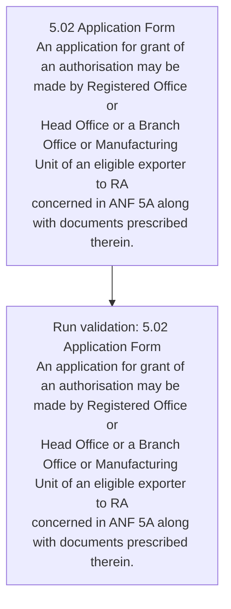
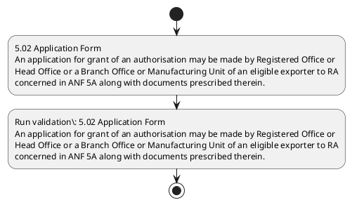

# Chapter 5 / Section 5.02: Application Form

**Chapter Title:** Export Promotion Capital Goods (EPCG) Scheme

**Pages:** 2

**Purpose:** 5.02 Application Form
An application for grant of an authorisation may be made by Registered Office or
Head Office or a Branch Office or Manufacturing Unit of an eligible exporter to RA
concerned in ANF 5A along with documents prescribed therein.

**Purpose Thanglish:** Indha Application Form section-la, 5.02 application Form
An application for grant of an authorisation may be made by Registered Office or
Head Office or a Branch Office or Manufacturing Unit of an eligible exporter to RA
concerned in ANF 5A along with documents prescribed therein.

**Summary:** 5.02 Application Form
An application for grant of an authorisation may be made by Registered Office or
Head Office or a Branch Office or Manufacturing Unit of an eligible exporter to RA
concerned in ANF 5A along with documents prescribed therein.

**Business Meaning:** Application Form governs how DGFT business controls should be applied, validated, and enforced.

**Business Explanation:** Application Form explains the operating rule set that DEKAI should enforce. Key control points include 5.02 Application Form
An application for grant of an authorisation may be made by Registered Office or
Head Office or a Branch Office or Manufacturing Unit of an eligible exporter to RA
concerned in ANF 5A along with documents prescribed therein. The section also drives actions such as 5.02 Application Form
An application for grant of an authorisation may be made by Registered Office or
Head Office or a Branch Office or Manufacturing Unit of an eligible exporter to RA
concerned in ANF 5A along with documents prescribed therein..

**Business Explanation Thanglish:** Indha Application Form section-la, application Form explains the operating rule set that DEKAI should enforce. Key control points include 5.02 application Form
An application for grant of an authorisation may be made by Registered Office or
Head Office or a Branch Office or Manufacturing Unit of an eligible exporter to RA
concerned in ANF 5A along with documents prescribed therein. The section also drives actions such as 5.02 application Form
An application for grant of an authorisation may be made by Registered Office or
Head Office or a Branch Office or Manufacturing Unit of an eligible exporter to RA
concerned in ANF 5A along with documents prescribed therein..

## Business Logic
- 5.02 Application Form
An application for grant of an authorisation may be made by Registered Office or
Head Office or a Branch Office or Manufacturing Unit of an eligible exporter to RA
concerned in ANF 5A along with documents prescribed therein.

## Business Rules
- rule_id=CH5-SEC5_02-R001, rule_description=5.02 Application Form
An application for grant of an authorisation may be made by Registered Office or
Head Office or a Branch Office or Manufacturing Unit of an eligible exporter to RA
concerned in ANF 5A along with documents prescribed therein., trigger=Application Form, condition=Section 5.02 is applicable, validation=5.02 Application Form
An application for grant of an authorisation may be made by Registered Office or
Head Office or a Branch Office or Manufacturing Unit of an eligible exporter to RA
concerned in ANF 5A along with documents prescribed therein., action=5.02 Application Form
An application for grant of an authorisation may be made by Registered Office or
Head Office or a Branch Office or Manufacturing Unit of an eligible exporter to RA
concerned in ANF 5A along with documents prescribed therein., exception=No explicit exception found in uploaded documents., output=DEKAI should produce a compliance decision for 5.02 - Application Form.

## Conditions
- None identified

## Condition Logic
- id=5.5.02.1, if=Section 5.02 is applicable, then=5.02 Application Form
An application for grant of an authorisation may be made by Registered Office or
Head Office or a Branch Office or Manufacturing Unit of an eligible exporter to RA
concerned in ANF 5A along with documents prescribed therein., source=Derived from uploaded documents

## Validations
- 5.02 Application Form
An application for grant of an authorisation may be made by Registered Office or
Head Office or a Branch Office or Manufacturing Unit of an eligible exporter to RA
concerned in ANF 5A along with documents prescribed therein.

## Exceptions
- None identified

## Dependencies
- None identified

## Authorities
- RA
- Head Office or a Branch Office or Manufacturing Unit of an eligible exporter to RA

## Required Documents
- 5.02 Application Form
An application for grant of an authorisation may be made by Registered Office or
Head Office or a Branch Office or Manufacturing Unit of an eligible exporter to RA
concerned in ANF 5A along with documents prescribed therein.

## Timelines
- None identified

## Actions
- 5.02 Application Form
An application for grant of an authorisation may be made by Registered Office or
Head Office or a Branch Office or Manufacturing Unit of an eligible exporter to RA
concerned in ANF 5A along with documents prescribed therein.

## Workflow
- 5.02 Application Form
An application for grant of an authorisation may be made by Registered Office or
Head Office or a Branch Office or Manufacturing Unit of an eligible exporter to RA
concerned in ANF 5A along with documents prescribed therein.
- Run validation: 5.02 Application Form
An application for grant of an authorisation may be made by Registered Office or
Head Office or a Branch Office or Manufacturing Unit of an eligible exporter to RA
concerned in ANF 5A along with documents prescribed therein.

## Workflow ASCII
```text
Application Form
5.02 Application Form
An application for grant of an authorisation may be made by Registered Office or
Head Office or a Branch Office or Manufacturing Unit of an eligible exporter to RA
concerned in ANF 5A along with documents prescribed therein.
   |
   v
Run validation: 5.02 Application Form
An application for grant of an authorisation may be made by Registered Office or
Head Office or a Branch Office or Manufacturing Unit of an eligible exporter to RA
concerned in ANF 5A along with documents prescribed therein.
```

## Decision Tree
- IF section 5.02 applies THEN 5.02 Application Form
An application for grant of an authorisation may be made by Registered Office or
Head Office or a Branch Office or Manufacturing Unit of an eligible exporter to RA
concerned in ANF 5A along with documents prescribed therein.

## Decision Tree ASCII
```text
Application Form Decision
IF section 5.02 applies THEN 5.02 Application Form
An application for grant of an authorisation may be made by Registered Office or
Head Office or a Branch Office or Manufacturing Unit of an eligible exporter to RA
concerned in ANF 5A along with documents prescribed therein.
```

## Examples
- User asks to process Application Form; the platform checks conditions, validations, and documents before action.

**Real-world Example:** Example: an importer or exporter invokes Application Form, submits 5.02 Application Form
An application for grant of an authorisation may be made by Registered Office or
Head Office or a Branch Office or Manufacturing Unit of an eligible exporter to RA
concerned in ANF 5A along with documents prescribed therein., and DEKAI uses the extracted rules to 5.02 application form
an application for grant of an authorisation may be made by registered office or
head office or a branch office or manufacturing unit of an eligible exporter to ra
concerned in anf 5a along with documents prescribed therein..

**Real-world Example Thanglish:** Indha Application Form section-la, Example: an importer or exporter invokes application Form, submits 5.02 application Form
An application for grant of an authorisation may be made by Registered Office or
Head Office or a Branch Office or Manufacturing Unit of an eligible exporter to RA
concerned in ANF 5A along with documents prescribed therein., and DEKAI uses the extracted rules to 5.02 application form
an application for grant of an authorisation may be made by registered office or
head office or a branch office or manufacturing unit of an eligible exporter to ra
concerned in anf 5a along with documents prescribed therein..

## AI Rules
- IF detected context matches section rule THEN enforce: 5.02 Application Form
An application for grant of an authorisation may be made by Registered Office or
Head Office or a Branch Office or Manufacturing Unit of an eligible exporter to RA
concerned in ANF 5A along with documents prescribed therein.
- IF validations pass THEN recommend action: 5.02 Application Form
An application for grant of an authorisation may be made by Registered Office or
Head Office or a Branch Office or Manufacturing Unit of an eligible exporter to RA
concerned in ANF 5A along with documents prescribed therein.

## Database Fields
- name=section_code, type=string, required=True, source=parsed_section_heading
- name=section_title, type=string, required=True, source=parsed_section_heading
- name=for_flag, type=boolean, required=False, source=keyword:for
- name=may_flag, type=boolean, required=False, source=keyword:may
- name=anf_flag, type=boolean, required=False, source=keyword:ANF
- name=form_flag, type=boolean, required=False, source=keyword:Form
- name=made_flag, type=boolean, required=False, source=keyword:made
- name=head_flag, type=boolean, required=False, source=keyword:Head
- name=unit_flag, type=boolean, required=False, source=keyword:Unit
- name=with_flag, type=boolean, required=False, source=keyword:with
- name=document_1_submitted, type=boolean, required=True, source=5.02 Application Form
An application for grant of an authorisation may be made by Registered Office or
Head Office or a Branch Office or Manufacturing Unit of an eligible exporter to RA
concerned in ANF 5A along with documents prescribed therein.

## API Requirements
- method=GET, path=/api/dgft/sections/5.02, purpose=Retrieve knowledge payload for section 5.02, query_params=['include=workflow,decision_tree,validations'], response_fields=['section', 'title', 'summary', 'conditions', 'validations', 'exceptions', 'workflow', 'decision_tree']
- method=POST, path=/api/dgft/Application-Form/validate, purpose=Validate inputs and documents for Application Form, request_fields=['section_code', 'section_title', 'document_1_submitted'], response_fields=['status', 'errors', 'warnings', 'next_actions']
- method=POST, path=/api/dgft/Application-Form/execute, purpose=Trigger business action for 5.02 Application Form
An application for grant of an authorisation may be made by Registered Office or
Head Office or a Branch Office or Manufacturing Unit of an eligible exporter to RA
concerned in ANF 5A along with documents prescribed therein., request_fields=['section_code', 'section_title', 'document_1_submitted'], response_fields=['reference_id', 'status', 'authority', 'timeline']

## UI Screens
- screen_id=Application_Form_overview, name=Application Form Overview, purpose=Show section summary, authority, timeline, and eligibility cues., widgets=['summary_card', 'conditions_table', 'authority_badges', 'timeline_panel']
- screen_id=Application_Form_submission, name=Application Form Submission, purpose=Capture applicant data and supporting documents., widgets=['dynamic_form', 'document_uploader', 'validation_panel', 'next_action_footer'], fields=['section_code', 'section_title', 'for_flag', 'may_flag', 'anf_flag', 'form_flag', 'made_flag', 'head_flag']

## Error Messages
- Validation failed because the section requirements were not fully met.

## FAQ
- question_en=What is the purpose of section 5.02?, answer_en=Application Form explains the operating rule set that DEKAI should enforce. Key control points include 5.02 Application Form
An application for grant of an authorisation may be made by Registered Office or
Head Office or a Branch Office or Manufacturing Unit of an eligible exporter to RA
concerned in ANF 5A along with documents prescribed therein. The section also drives actions such as 5.02 Application Form
An application for grant of an authorisation may be made by Registered Office or
Head Office or a Branch Office or Manufacturing Unit of an eligible exporter to RA
concerned in ANF 5A along with documents prescribed therein.., question_thanglish=Indha Application Form section-la, What is the purpose of section 5.02?, answer_thanglish=Indha Application Form section-la, application Form explains the operating rule set that DEKAI should enforce. Key control points include 5.02 application Form
An application for grant of an authorisation may be made by Registered Office or
Head Office or a Branch Office or Manufacturing Unit of an eligible exporter to RA
concerned in ANF 5A along with documents prescribed therein. The section also drives actions such as 5.02 application Form
An application for grant of an authorisation may be made by Registered Office or
Head Office or a Branch Office or Manufacturing Unit of an eligible exporter to RA
concerned in ANF 5A along with documents prescribed therein..
- question_en=What documents are required under Application Form?, answer_en=5.02 Application Form
An application for grant of an authorisation may be made by Registered Office or
Head Office or a Branch Office or Manufacturing Unit of an eligible exporter to RA
concerned in ANF 5A along with documents prescribed therein., question_thanglish=Indha Application Form section-la, What documents are required under application Form?, answer_thanglish=Indha Application Form section-la, 5.02 application Form
An application for grant of an authorisation may be made by Registered Office or
Head Office or a Branch Office or Manufacturing Unit of an eligible exporter to RA
concerned in ANF 5A along with documents prescribed therein.
- question_en=Which authority handles Application Form?, answer_en=RA, Head Office or a Branch Office or Manufacturing Unit of an eligible exporter to RA, question_thanglish=Indha Application Form section-la, Which authority handles application Form?, answer_thanglish=Indha Application Form section-la, RA, Head Office or a Branch Office or Manufacturing Unit of an eligible exporter to RA

## Questions Users May Ask
- What does Application Form require?
- Which documents are needed for Application Form?
- How does DEKAI validate Application Form requests?
- What action should be taken for Application Form?

## Expected AI Answers
- Application Form requires the platform to interpret the section text, apply the extracted business rules, and present the correct next action.
- Required documents are inferred from the section text: 5.02 Application Form
An application for grant of an authorisation may be made by Registered Office or
Head Office or a Branch Office or Manufacturing Unit of an eligible exporter to RA
concerned in ANF 5A along with documents prescribed therein.
- DEKAI validates Application Form by checking conditions, required documents, authority references, and exception clauses before recommending an outcome.
- The primary extracted action is: 5.02 Application Form
An application for grant of an authorisation may be made by Registered Office or
Head Office or a Branch Office or Manufacturing Unit of an eligible exporter to RA
concerned in ANF 5A along with documents prescribed therein.

## AI Q&A Examples
- question_en=User asks: How do I comply with Application Form?, answer_en=AI answers: DEKAI should evaluate section 5.02, apply the extracted rules, and guide the user through 5.02 Application Form
An application for grant of an authorisation may be made by Registered Office or
Head Office or a Branch Office or Manufacturing Unit of an eligible exporter to RA
concerned in ANF 5A along with documents prescribed therein.., question_thanglish=Indha Application Form section-la, User asks: How do I comply with application Form?, answer_thanglish=Indha Application Form section-la, AI answers: DEKAI should evaluate section 5.02, apply the extracted rules, and guide the user through 5.02 application Form
An application for grant of an authorisation may be made by Registered Office or
Head Office or a Branch Office or Manufacturing Unit of an eligible exporter to RA
concerned in ANF 5A along with documents prescribed therein..
- question_en=User asks: Which validations apply to Application Form?, answer_en=AI answers: Applicable validations are 5.02 Application Form
An application for grant of an authorisation may be made by Registered Office or
Head Office or a Branch Office or Manufacturing Unit of an eligible exporter to RA
concerned in ANF 5A along with documents prescribed therein., question_thanglish=Indha Application Form section-la, User asks: Which validations apply to application Form?, answer_thanglish=Indha Application Form section-la, AI answers: Applicable validations are 5.02 application Form
An application for grant of an authorisation may be made by Registered Office or
Head Office or a Branch Office or Manufacturing Unit of an eligible exporter to RA
concerned in ANF 5A along with documents prescribed therein.

## DEKAI AI Implementation Notes
- Capture chapter 5, section 5.02, title, and page references as immutable knowledge metadata.
- Bind validations for Application Form into a rule engine keyed by the rule IDs extracted for this section.
- Expose document upload controls for: 5.02 Application Form
An application for grant of an authorisation may be made by Registered Office or
Head Office or a Branch Office or Manufacturing Unit of an eligible exporter to RA
concerned in ANF 5A along with documents prescribed therein..
- Route escalations or approvals to: RA, Head Office or a Branch Office or Manufacturing Unit of an eligible exporter to RA.

## DEKAI AI Implementation Notes Thanglish
- Indha Application Form section-la, Capture chapter 5, section 5.02, title, and page references as immutable knowledge metadata.
- Indha Application Form section-la, Bind validations for application Form into a rule engine keyed by the rule IDs extracted for this section.
- Indha Application Form section-la, Expose document upload controls for: 5.02 application Form
An application for grant of an authorisation may be made by Registered Office or
Head Office or a Branch Office or Manufacturing Unit of an eligible exporter to RA
concerned in ANF 5A along with documents prescribed therein..
- Indha Application Form section-la, Route escalations or approvals to: RA, Head Office or a Branch Office or Manufacturing Unit of an eligible exporter to RA.

## AI Metadata
- Keywords: for, may, ANF, Form, made, Head, Unit, with, grant, along, Office, Branch, therein, eligible, exporter, concerned, documents, Registered, prescribed, Application
- Search Keywords: for, may, ANF, Form, made, Head, Unit, with, grant, along, Office, Branch, therein, eligible, exporter, concerned, documents, Registered, prescribed, Application
- Intent: Support Application Form processing and compliance validation.
- Tags: 5.02, Application Form, business-rule, document-driven, dgft
- Related Sections: 
- Related Chapters: 
- Related Rules: 5.02 Application Form
An application for grant of an authorisation may be made by Registered Office or
Head Office or a Branch Office or Manufacturing Unit of an eligible exporter to RA
concerned in ANF 5A along with documents prescribed therein.

## Mermaid


## PlantUML

