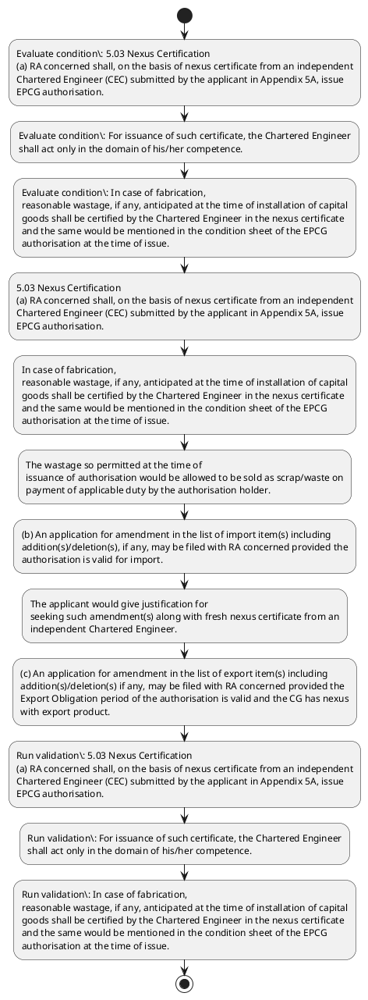

# Chapter 5 / Section 5.03: Nexus Certification

**Chapter Title:** Export Promotion Capital Goods (EPCG) Scheme

**Pages:** 2

**Purpose:** 5.03 Nexus Certification
(a) RA concerned shall, on the basis of nexus certificate from an independent
Chartered Engineer (CEC) submitted by the applicant in Appendix 5A, issue
EPCG authorisation.

**Purpose Thanglish:** Indha Nexus Certification section-la, 5.03 Nexus Certification
(a) RA concerned kandippa, on the basis of nexus certificate from an independent
Chartered Engineer (CEC) submitted by the applicant in Appendix 5A, issue
EPCG authorisation.

**Summary:** 5.03 Nexus Certification
(a) RA concerned shall, on the basis of nexus certificate from an independent
Chartered Engineer (CEC) submitted by the applicant in Appendix 5A, issue
EPCG authorisation. For issuance of such certificate, the Chartered Engineer
shall act only in the domain of his/her competence. In case of fabrication,
reasonable wastage, if any, anticipated at the time of installation of capital
goods shall be certified by the Chartered Engineer in the nexus certificate
and the same would be mentioned in the condition sheet of the EPCG
authorisation at the time of issue.

**Business Meaning:** Nexus Certification governs how DGFT business controls should be applied, validated, and enforced.

**Business Explanation:** Nexus Certification explains the operating rule set that DEKAI should enforce. Key control points include 5.03 Nexus Certification
(a) RA concerned shall, on the basis of nexus certificate from an independent
Chartered Engineer (CEC) submitted by the applicant in Appendix 5A, issue
EPCG authorisation. The section also drives actions such as 5.03 Nexus Certification
(a) RA concerned shall, on the basis of nexus certificate from an independent
Chartered Engineer (CEC) submitted by the applicant in Appendix 5A, issue
EPCG authorisation..

**Business Explanation Thanglish:** Indha Nexus Certification section-la, Nexus Certification explains the operating rule set that DEKAI should enforce. Key control points include 5.03 Nexus Certification
(a) RA concerned kandippa, on the basis of nexus certificate from an independent
Chartered Engineer (CEC) submitted by the applicant in Appendix 5A, issue
EPCG authorisation. The section also drives actions such as 5.03 Nexus Certification
(a) RA concerned kandippa, on the basis of nexus certificate from an independent
Chartered Engineer (CEC) submitted by the applicant in Appendix 5A, issue
EPCG authorisation..

## Business Logic
- 5.03 Nexus Certification
(a) RA concerned shall, on the basis of nexus certificate from an independent
Chartered Engineer (CEC) submitted by the applicant in Appendix 5A, issue
EPCG authorisation.
- For issuance of such certificate, the Chartered Engineer
shall act only in the domain of his/her competence.
- In case of fabrication,
reasonable wastage, if any, anticipated at the time of installation of capital
goods shall be certified by the Chartered Engineer in the nexus certificate
and the same would be mentioned in the condition sheet of the EPCG
authorisation at the time of issue.
- 5.03 Nexus Certification
(a)
RA concerned shall, on the basis of nexus certificate from an independent
Chartered Engineer (CEC) submitted by the applicant in Appendix 5A, issue
EPCG authorisation.

## Business Rules
- rule_id=CH5-SEC5_03-R001, rule_description=5.03 Nexus Certification
(a) RA concerned shall, on the basis of nexus certificate from an independent
Chartered Engineer (CEC) submitted by the applicant in Appendix 5A, issue
EPCG authorisation., trigger=Nexus Certification, condition=5.03 Nexus Certification
(a) RA concerned shall, on the basis of nexus certificate from an independent
Chartered Engineer (CEC) submitted by the applicant in Appendix 5A, issue
EPCG authorisation., validation=5.03 Nexus Certification
(a) RA concerned shall, on the basis of nexus certificate from an independent
Chartered Engineer (CEC) submitted by the applicant in Appendix 5A, issue
EPCG authorisation., action=5.03 Nexus Certification
(a) RA concerned shall, on the basis of nexus certificate from an independent
Chartered Engineer (CEC) submitted by the applicant in Appendix 5A, issue
EPCG authorisation., exception=No explicit exception found in uploaded documents., output=DEKAI should produce a compliance decision for 5.03 - Nexus Certification.
- rule_id=CH5-SEC5_03-R002, rule_description=For issuance of such certificate, the Chartered Engineer
shall act only in the domain of his/her competence., trigger=Nexus Certification, condition=For issuance of such certificate, the Chartered Engineer
shall act only in the domain of his/her competence., validation=For issuance of such certificate, the Chartered Engineer
shall act only in the domain of his/her competence., action=In case of fabrication,
reasonable wastage, if any, anticipated at the time of installation of capital
goods shall be certified by the Chartered Engineer in the nexus certificate
and the same would be mentioned in the condition sheet of the EPCG
authorisation at the time of issue., exception=No explicit exception found in uploaded documents., output=DEKAI should produce a compliance decision for 5.03 - Nexus Certification.
- rule_id=CH5-SEC5_03-R003, rule_description=In case of fabrication,
reasonable wastage, if any, anticipated at the time of installation of capital
goods shall be certified by the Chartered Engineer in the nexus certificate
and the same would be mentioned in the condition sheet of the EPCG
authorisation at the time of issue., trigger=Nexus Certification, condition=any, validation=In case of fabrication,
reasonable wastage, if any, anticipated at the time of installation of capital
goods shall be certified by the Chartered Engineer in the nexus certificate
and the same would be mentioned in the condition sheet of the EPCG
authorisation at the time of issue., action=The wastage so permitted at the time of
issuance of authorisation would be allowed to be sold as scrap/waste on
payment of applicable duty by the authorisation holder., exception=No explicit exception found in uploaded documents., output=DEKAI should produce a compliance decision for 5.03 - Nexus Certification.
- rule_id=CH5-SEC5_03-R004, rule_description=5.03 Nexus Certification
(a)
RA concerned shall, on the basis of nexus certificate from an independent
Chartered Engineer (CEC) submitted by the applicant in Appendix 5A, issue
EPCG authorisation., trigger=Nexus Certification, condition=any, validation=5.03 Nexus Certification
(a)
RA concerned shall, on the basis of nexus certificate from an independent
Chartered Engineer (CEC) submitted by the applicant in Appendix 5A, issue
EPCG authorisation., action=(b) An application for amendment in the list of import item(s) including
addition(s)/deletion(s), if any, may be filed with RA concerned provided the
authorisation is valid for import., exception=No explicit exception found in uploaded documents., output=DEKAI should produce a compliance decision for 5.03 - Nexus Certification.

## Conditions
- 5.03 Nexus Certification
(a) RA concerned shall, on the basis of nexus certificate from an independent
Chartered Engineer (CEC) submitted by the applicant in Appendix 5A, issue
EPCG authorisation.
- For issuance of such certificate, the Chartered Engineer
shall act only in the domain of his/her competence.
- In case of fabrication,
reasonable wastage, if any, anticipated at the time of installation of capital
goods shall be certified by the Chartered Engineer in the nexus certificate
and the same would be mentioned in the condition sheet of the EPCG
authorisation at the time of issue.
- (b) An application for amendment in the list of import item(s) including
addition(s)/deletion(s), if any, may be filed with RA concerned provided the
authorisation is valid for import.
- The applicant would give justification for
seeking such amendment(s) along with fresh nexus certificate from an
independent Chartered Engineer.
- (c) An application for amendment in the list of export item(s) including
addition(s)/deletion(s) if any, may be filed with RA concerned provided the
Export Obligation period of the authorisation is valid and the CG has nexus
with export product.
- The applicant would give justification for seeking such
amendment(s) along with fresh nexus certificate from an independent
Chartered Engineer.
- 5.03 Nexus Certification
(a)
RA concerned shall, on the basis of nexus certificate from an independent
Chartered Engineer (CEC) submitted by the applicant in Appendix 5A, issue
EPCG authorisation.
- (b)
An application for amendment in the list of import item(s) including
addition(s)/deletion(s), if any, may be filed with RA concerned provided the
authorisation is valid for import.
- (c)
An application for amendment in the list of export item(s) including
addition(s)/deletion(s) if any, may be filed with RA concerned provided the
Export Obligation period of the authorisation is valid and the CG has nexus
with export product.

## Condition Logic
- id=5.5.03.1, if=5.03 Nexus Certification
(a) RA concerned shall, on the basis of nexus certificate from an independent
Chartered Engineer (CEC) submitted by the applicant in Appendix 5A, issue
EPCG authorisation., then=5.03 Nexus Certification
(a) RA concerned shall, on the basis of nexus certificate from an independent
Chartered Engineer (CEC) submitted by the applicant in Appendix 5A, issue
EPCG authorisation., source=5.03 Nexus Certification
(a) RA concerned shall, on the basis of nexus certificate from an independent
Chartered Engineer (CEC) submitted by the applicant in Appendix 5A, issue
EPCG authorisation.
- id=5.5.03.2, if=For issuance of such certificate, the Chartered Engineer
shall act only in the domain of his/her competence., then=5.03 Nexus Certification
(a) RA concerned shall, on the basis of nexus certificate from an independent
Chartered Engineer (CEC) submitted by the applicant in Appendix 5A, issue
EPCG authorisation., source=For issuance of such certificate, the Chartered Engineer
shall act only in the domain of his/her competence.
- id=5.5.03.3, if=any, then=5.03 Nexus Certification
(a) RA concerned shall, on the basis of nexus certificate from an independent
Chartered Engineer (CEC) submitted by the applicant in Appendix 5A, issue
EPCG authorisation., source=In case of fabrication,
reasonable wastage, if any, anticipated at the time of installation of capital
goods shall be certified by the Chartered Engineer in the nexus certificate
and the same would be mentioned in the condition sheet of the EPCG
authorisation at the time of issue.
- id=5.5.03.4, if=any, then=5.03 Nexus Certification
(a) RA concerned shall, on the basis of nexus certificate from an independent
Chartered Engineer (CEC) submitted by the applicant in Appendix 5A, issue
EPCG authorisation., source=(b) An application for amendment in the list of import item(s) including
addition(s)/deletion(s), if any, may be filed with RA concerned provided the
authorisation is valid for import.
- id=5.5.03.5, if=The applicant would give justification for
seeking such amendment(s) along with fresh nexus certificate from an
independent Chartered Engineer., then=5.03 Nexus Certification
(a) RA concerned shall, on the basis of nexus certificate from an independent
Chartered Engineer (CEC) submitted by the applicant in Appendix 5A, issue
EPCG authorisation., source=The applicant would give justification for
seeking such amendment(s) along with fresh nexus certificate from an
independent Chartered Engineer.
- id=5.5.03.6, if=any, then=5.03 Nexus Certification
(a) RA concerned shall, on the basis of nexus certificate from an independent
Chartered Engineer (CEC) submitted by the applicant in Appendix 5A, issue
EPCG authorisation., source=(c) An application for amendment in the list of export item(s) including
addition(s)/deletion(s) if any, may be filed with RA concerned provided the
Export Obligation period of the authorisation is valid and the CG has nexus
with export product.
- id=5.5.03.7, if=The applicant would give justification for seeking such
amendment(s) along with fresh nexus certificate from an independent
Chartered Engineer., then=5.03 Nexus Certification
(a) RA concerned shall, on the basis of nexus certificate from an independent
Chartered Engineer (CEC) submitted by the applicant in Appendix 5A, issue
EPCG authorisation., source=The applicant would give justification for seeking such
amendment(s) along with fresh nexus certificate from an independent
Chartered Engineer.
- id=5.5.03.8, if=5.03 Nexus Certification
(a)
RA concerned shall, on the basis of nexus certificate from an independent
Chartered Engineer (CEC) submitted by the applicant in Appendix 5A, issue
EPCG authorisation., then=5.03 Nexus Certification
(a) RA concerned shall, on the basis of nexus certificate from an independent
Chartered Engineer (CEC) submitted by the applicant in Appendix 5A, issue
EPCG authorisation., source=5.03 Nexus Certification
(a)
RA concerned shall, on the basis of nexus certificate from an independent
Chartered Engineer (CEC) submitted by the applicant in Appendix 5A, issue
EPCG authorisation.
- id=5.5.03.9, if=any, then=5.03 Nexus Certification
(a) RA concerned shall, on the basis of nexus certificate from an independent
Chartered Engineer (CEC) submitted by the applicant in Appendix 5A, issue
EPCG authorisation., source=(b)
An application for amendment in the list of import item(s) including
addition(s)/deletion(s), if any, may be filed with RA concerned provided the
authorisation is valid for import.
- id=5.5.03.10, if=any, then=5.03 Nexus Certification
(a) RA concerned shall, on the basis of nexus certificate from an independent
Chartered Engineer (CEC) submitted by the applicant in Appendix 5A, issue
EPCG authorisation., source=(c)
An application for amendment in the list of export item(s) including
addition(s)/deletion(s) if any, may be filed with RA concerned provided the
Export Obligation period of the authorisation is valid and the CG has nexus
with export product.

## Validations
- 5.03 Nexus Certification
(a) RA concerned shall, on the basis of nexus certificate from an independent
Chartered Engineer (CEC) submitted by the applicant in Appendix 5A, issue
EPCG authorisation.
- For issuance of such certificate, the Chartered Engineer
shall act only in the domain of his/her competence.
- In case of fabrication,
reasonable wastage, if any, anticipated at the time of installation of capital
goods shall be certified by the Chartered Engineer in the nexus certificate
and the same would be mentioned in the condition sheet of the EPCG
authorisation at the time of issue.
- 5.03 Nexus Certification
(a)
RA concerned shall, on the basis of nexus certificate from an independent
Chartered Engineer (CEC) submitted by the applicant in Appendix 5A, issue
EPCG authorisation.

## Exceptions
- None identified

## Dependencies
- None identified

## Authorities
- RA

## Required Documents
- 5.03 Nexus Certification
(a) RA concerned shall, on the basis of nexus certificate from an independent
Chartered Engineer (CEC) submitted by the applicant in Appendix 5A, issue
EPCG authorisation.
- For issuance of such certificate, the Chartered Engineer
shall act only in the domain of his/her competence.
- In case of fabrication,
reasonable wastage, if any, anticipated at the time of installation of capital
goods shall be certified by the Chartered Engineer in the nexus certificate
and the same would be mentioned in the condition sheet of the EPCG
authorisation at the time of issue.
- (b) An application for amendment in the list of import item(s) including
addition(s)/deletion(s), if any, may be filed with RA concerned provided the
authorisation is valid for import.
- The applicant would give justification for
seeking such amendment(s) along with fresh nexus certificate from an
independent Chartered Engineer.
- (c) An application for amendment in the list of export item(s) including
addition(s)/deletion(s) if any, may be filed with RA concerned provided the
Export Obligation period of the authorisation is valid and the CG has nexus
with export product.
- The applicant would give justification for seeking such
amendment(s) along with fresh nexus certificate from an independent
Chartered Engineer.
- 5.03 Nexus Certification
(a)
RA concerned shall, on the basis of nexus certificate from an independent
Chartered Engineer (CEC) submitted by the applicant in Appendix 5A, issue
EPCG authorisation.
- (b)
An application for amendment in the list of import item(s) including
addition(s)/deletion(s), if any, may be filed with RA concerned provided the
authorisation is valid for import.
- (c)
An application for amendment in the list of export item(s) including
addition(s)/deletion(s) if any, may be filed with RA concerned provided the
Export Obligation period of the authorisation is valid and the CG has nexus
with export product.

## Timelines
- (b) An application for amendment in the list of import item(s) including
addition(s)/deletion(s), if any, may be filed with RA concerned provided the
authorisation is valid for import.
- (b)
An application for amendment in the list of import item(s) including
addition(s)/deletion(s), if any, may be filed with RA concerned provided the
authorisation is valid for import.

## Actions
- 5.03 Nexus Certification
(a) RA concerned shall, on the basis of nexus certificate from an independent
Chartered Engineer (CEC) submitted by the applicant in Appendix 5A, issue
EPCG authorisation.
- In case of fabrication,
reasonable wastage, if any, anticipated at the time of installation of capital
goods shall be certified by the Chartered Engineer in the nexus certificate
and the same would be mentioned in the condition sheet of the EPCG
authorisation at the time of issue.
- The wastage so permitted at the time of
issuance of authorisation would be allowed to be sold as scrap/waste on
payment of applicable duty by the authorisation holder.
- (b) An application for amendment in the list of import item(s) including
addition(s)/deletion(s), if any, may be filed with RA concerned provided the
authorisation is valid for import.
- The applicant would give justification for
seeking such amendment(s) along with fresh nexus certificate from an
independent Chartered Engineer.
- (c) An application for amendment in the list of export item(s) including
addition(s)/deletion(s) if any, may be filed with RA concerned provided the
Export Obligation period of the authorisation is valid and the CG has nexus
with export product.
- The applicant would give justification for seeking such
amendment(s) along with fresh nexus certificate from an independent
Chartered Engineer.
- 5.03 Nexus Certification
(a)
RA concerned shall, on the basis of nexus certificate from an independent
Chartered Engineer (CEC) submitted by the applicant in Appendix 5A, issue
EPCG authorisation.
- (b)
An application for amendment in the list of import item(s) including
addition(s)/deletion(s), if any, may be filed with RA concerned provided the
authorisation is valid for import.
- (c)
An application for amendment in the list of export item(s) including
addition(s)/deletion(s) if any, may be filed with RA concerned provided the
Export Obligation period of the authorisation is valid and the CG has nexus
with export product.

## Workflow
- Evaluate condition: 5.03 Nexus Certification
(a) RA concerned shall, on the basis of nexus certificate from an independent
Chartered Engineer (CEC) submitted by the applicant in Appendix 5A, issue
EPCG authorisation.
- Evaluate condition: For issuance of such certificate, the Chartered Engineer
shall act only in the domain of his/her competence.
- Evaluate condition: In case of fabrication,
reasonable wastage, if any, anticipated at the time of installation of capital
goods shall be certified by the Chartered Engineer in the nexus certificate
and the same would be mentioned in the condition sheet of the EPCG
authorisation at the time of issue.
- 5.03 Nexus Certification
(a) RA concerned shall, on the basis of nexus certificate from an independent
Chartered Engineer (CEC) submitted by the applicant in Appendix 5A, issue
EPCG authorisation.
- In case of fabrication,
reasonable wastage, if any, anticipated at the time of installation of capital
goods shall be certified by the Chartered Engineer in the nexus certificate
and the same would be mentioned in the condition sheet of the EPCG
authorisation at the time of issue.
- The wastage so permitted at the time of
issuance of authorisation would be allowed to be sold as scrap/waste on
payment of applicable duty by the authorisation holder.
- (b) An application for amendment in the list of import item(s) including
addition(s)/deletion(s), if any, may be filed with RA concerned provided the
authorisation is valid for import.
- The applicant would give justification for
seeking such amendment(s) along with fresh nexus certificate from an
independent Chartered Engineer.
- (c) An application for amendment in the list of export item(s) including
addition(s)/deletion(s) if any, may be filed with RA concerned provided the
Export Obligation period of the authorisation is valid and the CG has nexus
with export product.
- Run validation: 5.03 Nexus Certification
(a) RA concerned shall, on the basis of nexus certificate from an independent
Chartered Engineer (CEC) submitted by the applicant in Appendix 5A, issue
EPCG authorisation.
- Run validation: For issuance of such certificate, the Chartered Engineer
shall act only in the domain of his/her competence.
- Run validation: In case of fabrication,
reasonable wastage, if any, anticipated at the time of installation of capital
goods shall be certified by the Chartered Engineer in the nexus certificate
and the same would be mentioned in the condition sheet of the EPCG
authorisation at the time of issue.

## Workflow ASCII
```text
Nexus Certification
Evaluate condition: 5.03 Nexus Certification
(a) RA concerned shall, on the basis of nexus certificate from an independent
Chartered Engineer (CEC) submitted by the applicant in Appendix 5A, issue
EPCG authorisation.
   |
   v
Evaluate condition: For issuance of such certificate, the Chartered Engineer
shall act only in the domain of his/her competence.
   |
   v
Evaluate condition: In case of fabrication,
reasonable wastage, if any, anticipated at the time of installation of capital
goods shall be certified by the Chartered Engineer in the nexus certificate
and the same would be mentioned in the condition sheet of the EPCG
authorisation at the time of issue.
   |
   v
5.03 Nexus Certification
(a) RA concerned shall, on the basis of nexus certificate from an independent
Chartered Engineer (CEC) submitted by the applicant in Appendix 5A, issue
EPCG authorisation.
   |
   v
In case of fabrication,
reasonable wastage, if any, anticipated at the time of installation of capital
goods shall be certified by the Chartered Engineer in the nexus certificate
and the same would be mentioned in the condition sheet of the EPCG
authorisation at the time of issue.
   |
   v
The wastage so permitted at the time of
issuance of authorisation would be allowed to be sold as scrap/waste on
payment of applicable duty by the authorisation holder.
   |
   v
(b) An application for amendment in the list of import item(s) including
addition(s)/deletion(s), if any, may be filed with RA concerned provided the
authorisation is valid for import.
   |
   v
The applicant would give justification for
seeking such amendment(s) along with fresh nexus certificate from an
independent Chartered Engineer.
   |
   v
(c) An application for amendment in the list of export item(s) including
addition(s)/deletion(s) if any, may be filed with RA concerned provided the
Export Obligation period of the authorisation is valid and the CG has nexus
with export product.
   |
   v
Run validation: 5.03 Nexus Certification
(a) RA concerned shall, on the basis of nexus certificate from an independent
Chartered Engineer (CEC) submitted by the applicant in Appendix 5A, issue
EPCG authorisation.
   |
   v
Run validation: For issuance of such certificate, the Chartered Engineer
shall act only in the domain of his/her competence.
   |
   v
Run validation: In case of fabrication,
reasonable wastage, if any, anticipated at the time of installation of capital
goods shall be certified by the Chartered Engineer in the nexus certificate
and the same would be mentioned in the condition sheet of the EPCG
authorisation at the time of issue.
```

## Decision Tree
- IF 5.03 Nexus Certification
(a) RA concerned shall, on the basis of nexus certificate from an independent
Chartered Engineer (CEC) submitted by the applicant in Appendix 5A, issue
EPCG authorisation. THEN 5.03 Nexus Certification
(a) RA concerned shall, on the basis of nexus certificate from an independent
Chartered Engineer (CEC) submitted by the applicant in Appendix 5A, issue
EPCG authorisation.
- IF For issuance of such certificate, the Chartered Engineer
shall act only in the domain of his/her competence. THEN 5.03 Nexus Certification
(a) RA concerned shall, on the basis of nexus certificate from an independent
Chartered Engineer (CEC) submitted by the applicant in Appendix 5A, issue
EPCG authorisation.
- IF In case of fabrication,
reasonable wastage, if any, anticipated at the time of installation of capital
goods shall be certified by the Chartered Engineer in the nexus certificate
and the same would be mentioned in the condition sheet of the EPCG
authorisation at the time of issue. THEN 5.03 Nexus Certification
(a) RA concerned shall, on the basis of nexus certificate from an independent
Chartered Engineer (CEC) submitted by the applicant in Appendix 5A, issue
EPCG authorisation.
- IF (b) An application for amendment in the list of import item(s) including
addition(s)/deletion(s), if any, may be filed with RA concerned provided the
authorisation is valid for import. THEN 5.03 Nexus Certification
(a) RA concerned shall, on the basis of nexus certificate from an independent
Chartered Engineer (CEC) submitted by the applicant in Appendix 5A, issue
EPCG authorisation.
- IF The applicant would give justification for
seeking such amendment(s) along with fresh nexus certificate from an
independent Chartered Engineer. THEN 5.03 Nexus Certification
(a) RA concerned shall, on the basis of nexus certificate from an independent
Chartered Engineer (CEC) submitted by the applicant in Appendix 5A, issue
EPCG authorisation.

## Decision Tree ASCII
```text
Nexus Certification Decision
IF 5.03 Nexus Certification
(a) RA concerned shall, on the basis of nexus certificate from an independent
Chartered Engineer (CEC) submitted by the applicant in Appendix 5A, issue
EPCG authorisation. THEN 5.03 Nexus Certification
(a) RA concerned shall, on the basis of nexus certificate from an independent
Chartered Engineer (CEC) submitted by the applicant in Appendix 5A, issue
EPCG authorisation.
   |
   v
IF For issuance of such certificate, the Chartered Engineer
shall act only in the domain of his/her competence. THEN 5.03 Nexus Certification
(a) RA concerned shall, on the basis of nexus certificate from an independent
Chartered Engineer (CEC) submitted by the applicant in Appendix 5A, issue
EPCG authorisation.
   |
   v
IF In case of fabrication,
reasonable wastage, if any, anticipated at the time of installation of capital
goods shall be certified by the Chartered Engineer in the nexus certificate
and the same would be mentioned in the condition sheet of the EPCG
authorisation at the time of issue. THEN 5.03 Nexus Certification
(a) RA concerned shall, on the basis of nexus certificate from an independent
Chartered Engineer (CEC) submitted by the applicant in Appendix 5A, issue
EPCG authorisation.
   |
   v
IF (b) An application for amendment in the list of import item(s) including
addition(s)/deletion(s), if any, may be filed with RA concerned provided the
authorisation is valid for import. THEN 5.03 Nexus Certification
(a) RA concerned shall, on the basis of nexus certificate from an independent
Chartered Engineer (CEC) submitted by the applicant in Appendix 5A, issue
EPCG authorisation.
   |
   v
IF The applicant would give justification for
seeking such amendment(s) along with fresh nexus certificate from an
independent Chartered Engineer. THEN 5.03 Nexus Certification
(a) RA concerned shall, on the basis of nexus certificate from an independent
Chartered Engineer (CEC) submitted by the applicant in Appendix 5A, issue
EPCG authorisation.
```

## Examples
- User asks to process Nexus Certification; the platform checks conditions, validations, and documents before action.

**Real-world Example:** Example: an importer or exporter invokes Nexus Certification, submits 5.03 Nexus Certification
(a) RA concerned shall, on the basis of nexus certificate from an independent
Chartered Engineer (CEC) submitted by the applicant in Appendix 5A, issue
EPCG authorisation., For issuance of such certificate, the Chartered Engineer
shall act only in the domain of his/her competence., In case of fabrication,
reasonable wastage, if any, anticipated at the time of installation of capital
goods shall be certified by the Chartered Engineer in the nexus certificate
and the same would be mentioned in the condition sheet of the EPCG
authorisation at the time of issue., and DEKAI uses the extracted rules to 5.03 nexus certification
(a) ra concerned shall, on the basis of nexus certificate from an independent
chartered engineer (cec) submitted by the applicant in appendix 5a, issue
epcg authorisation..

**Real-world Example Thanglish:** Indha Nexus Certification section-la, Example: an importer or exporter invokes Nexus Certification, submits 5.03 Nexus Certification
(a) RA concerned kandippa, on the basis of nexus certificate from an independent
Chartered Engineer (CEC) submitted by the applicant in Appendix 5A, issue
EPCG authorisation., For issuance of such certificate, the Chartered Engineer
kandippa act only in the domain of his/her competence., In case of fabrication,
reasonable wastage, if any, anticipated at the time of installation of capital
goods kandippa be certified by the Chartered Engineer in the nexus certificate
and the same would be mentioned in the condition sheet of the EPCG
authorisation at the time of issue., and DEKAI uses the extracted rules to 5.03 nexus certification
(a) ra concerned kandippa, on the basis of nexus certificate from an independent
chartered engineer (cec) submitted by the applicant in appendix 5a, issue
epcg authorisation..

## AI Rules
- IF detected context matches section rule THEN enforce: 5.03 Nexus Certification
(a) RA concerned shall, on the basis of nexus certificate from an independent
Chartered Engineer (CEC) submitted by the applicant in Appendix 5A, issue
EPCG authorisation.
- IF detected context matches section rule THEN enforce: For issuance of such certificate, the Chartered Engineer
shall act only in the domain of his/her competence.
- IF detected context matches section rule THEN enforce: In case of fabrication,
reasonable wastage, if any, anticipated at the time of installation of capital
goods shall be certified by the Chartered Engineer in the nexus certificate
and the same would be mentioned in the condition sheet of the EPCG
authorisation at the time of issue.
- IF detected context matches section rule THEN enforce: 5.03 Nexus Certification
(a)
RA concerned shall, on the basis of nexus certificate from an independent
Chartered Engineer (CEC) submitted by the applicant in Appendix 5A, issue
EPCG authorisation.
- IF validations pass THEN recommend action: 5.03 Nexus Certification
(a) RA concerned shall, on the basis of nexus certificate from an independent
Chartered Engineer (CEC) submitted by the applicant in Appendix 5A, issue
EPCG authorisation.

## Database Fields
- name=section_code, type=string, required=True, source=parsed_section_heading
- name=section_title, type=string, required=True, source=parsed_section_heading
- name=the_flag, type=boolean, required=False, source=keyword:the
- name=cec_flag, type=boolean, required=False, source=keyword:CEC
- name=for_flag, type=boolean, required=False, source=keyword:For
- name=act_flag, type=boolean, required=False, source=keyword:act
- name=any_flag, type=boolean, required=False, source=keyword:any
- name=and_flag, type=boolean, required=False, source=keyword:and
- name=may_flag, type=boolean, required=False, source=keyword:may
- name=has_flag, type=boolean, required=False, source=keyword:has
- name=document_1_submitted, type=boolean, required=True, source=5.03 Nexus Certification
(a) RA concerned shall, on the basis of nexus certificate from an independent
Chartered Engineer (CEC) submitted by the applicant in Appendix 5A, issue
EPCG authorisation.
- name=document_2_submitted, type=boolean, required=True, source=For issuance of such certificate, the Chartered Engineer
shall act only in the domain of his/her competence.
- name=document_3_submitted, type=boolean, required=True, source=In case of fabrication,
reasonable wastage, if any, anticipated at the time of installation of capital
goods shall be certified by the Chartered Engineer in the nexus certificate
and the same would be mentioned in the condition sheet of the EPCG
authorisation at the time of issue.
- name=document_4_submitted, type=boolean, required=True, source=(b) An application for amendment in the list of import item(s) including
addition(s)/deletion(s), if any, may be filed with RA concerned provided the
authorisation is valid for import.
- name=document_5_submitted, type=boolean, required=True, source=The applicant would give justification for
seeking such amendment(s) along with fresh nexus certificate from an
independent Chartered Engineer.
- name=document_6_submitted, type=boolean, required=True, source=(c) An application for amendment in the list of export item(s) including
addition(s)/deletion(s) if any, may be filed with RA concerned provided the
Export Obligation period of the authorisation is valid and the CG has nexus
with export product.

## API Requirements
- method=GET, path=/api/dgft/sections/5.03, purpose=Retrieve knowledge payload for section 5.03, query_params=['include=workflow,decision_tree,validations'], response_fields=['section', 'title', 'summary', 'conditions', 'validations', 'exceptions', 'workflow', 'decision_tree']
- method=POST, path=/api/dgft/Nexus-Certification/validate, purpose=Validate inputs and documents for Nexus Certification, request_fields=['section_code', 'section_title', 'document_1_submitted', 'document_2_submitted', 'document_3_submitted', 'document_4_submitted', 'document_5_submitted', 'document_6_submitted'], response_fields=['status', 'errors', 'warnings', 'next_actions']
- method=POST, path=/api/dgft/Nexus-Certification/execute, purpose=Trigger business action for 5.03 Nexus Certification
(a) RA concerned shall, on the basis of nexus certificate from an independent
Chartered Engineer (CEC) submitted by the applicant in Appendix 5A, issue
EPCG authorisation., request_fields=['section_code', 'section_title', 'document_1_submitted', 'document_2_submitted', 'document_3_submitted', 'document_4_submitted', 'document_5_submitted', 'document_6_submitted'], response_fields=['reference_id', 'status', 'authority', 'timeline']

## UI Screens
- screen_id=Nexus_Certification_overview, name=Nexus Certification Overview, purpose=Show section summary, authority, timeline, and eligibility cues., widgets=['summary_card', 'conditions_table', 'authority_badges', 'timeline_panel']
- screen_id=Nexus_Certification_submission, name=Nexus Certification Submission, purpose=Capture applicant data and supporting documents., widgets=['dynamic_form', 'document_uploader', 'validation_panel', 'next_action_footer'], fields=['section_code', 'section_title', 'the_flag', 'cec_flag', 'for_flag', 'act_flag', 'any_flag', 'and_flag']

## Error Messages
- Validation failed because the section requirements were not fully met.

## FAQ
- question_en=What is the purpose of section 5.03?, answer_en=Nexus Certification explains the operating rule set that DEKAI should enforce. Key control points include 5.03 Nexus Certification
(a) RA concerned shall, on the basis of nexus certificate from an independent
Chartered Engineer (CEC) submitted by the applicant in Appendix 5A, issue
EPCG authorisation. The section also drives actions such as 5.03 Nexus Certification
(a) RA concerned shall, on the basis of nexus certificate from an independent
Chartered Engineer (CEC) submitted by the applicant in Appendix 5A, issue
EPCG authorisation.., question_thanglish=Indha Nexus Certification section-la, What is the purpose of section 5.03?, answer_thanglish=Indha Nexus Certification section-la, Nexus Certification explains the operating rule set that DEKAI should enforce. Key control points include 5.03 Nexus Certification
(a) RA concerned kandippa, on the basis of nexus certificate from an independent
Chartered Engineer (CEC) submitted by the applicant in Appendix 5A, issue
EPCG authorisation. The section also drives actions such as 5.03 Nexus Certification
(a) RA concerned kandippa, on the basis of nexus certificate from an independent
Chartered Engineer (CEC) submitted by the applicant in Appendix 5A, issue
EPCG authorisation..
- question_en=What documents are required under Nexus Certification?, answer_en=5.03 Nexus Certification
(a) RA concerned shall, on the basis of nexus certificate from an independent
Chartered Engineer (CEC) submitted by the applicant in Appendix 5A, issue
EPCG authorisation., For issuance of such certificate, the Chartered Engineer
shall act only in the domain of his/her competence., In case of fabrication,
reasonable wastage, if any, anticipated at the time of installation of capital
goods shall be certified by the Chartered Engineer in the nexus certificate
and the same would be mentioned in the condition sheet of the EPCG
authorisation at the time of issue., (b) An application for amendment in the list of import item(s) including
addition(s)/deletion(s), if any, may be filed with RA concerned provided the
authorisation is valid for import., The applicant would give justification for
seeking such amendment(s) along with fresh nexus certificate from an
independent Chartered Engineer., (c) An application for amendment in the list of export item(s) including
addition(s)/deletion(s) if any, may be filed with RA concerned provided the
Export Obligation period of the authorisation is valid and the CG has nexus
with export product., The applicant would give justification for seeking such
amendment(s) along with fresh nexus certificate from an independent
Chartered Engineer., 5.03 Nexus Certification
(a)
RA concerned shall, on the basis of nexus certificate from an independent
Chartered Engineer (CEC) submitted by the applicant in Appendix 5A, issue
EPCG authorisation., (b)
An application for amendment in the list of import item(s) including
addition(s)/deletion(s), if any, may be filed with RA concerned provided the
authorisation is valid for import., (c)
An application for amendment in the list of export item(s) including
addition(s)/deletion(s) if any, may be filed with RA concerned provided the
Export Obligation period of the authorisation is valid and the CG has nexus
with export product., question_thanglish=Indha Nexus Certification section-la, What documents are required under Nexus Certification?, answer_thanglish=Indha Nexus Certification section-la, 5.03 Nexus Certification
(a) RA concerned kandippa, on the basis of nexus certificate from an independent
Chartered Engineer (CEC) submitted by the applicant in Appendix 5A, issue
EPCG authorisation., For issuance of such certificate, the Chartered Engineer
kandippa act only in the domain of his/her competence., In case of fabrication,
reasonable wastage, if any, anticipated at the time of installation of capital
goods kandippa be certified by the Chartered Engineer in the nexus certificate
and the same would be mentioned in the condition sheet of the EPCG
authorisation at the time of issue., (b) An application for amendment in the list of import item(s) including
addition(s)/deletion(s), if any, may be filed with RA concerned provided the
authorisation is valid for import., The applicant would give justification for
seeking such amendment(s) along with fresh nexus certificate from an
independent Chartered Engineer., (c) An application for amendment in the list of export item(s) including
addition(s)/deletion(s) if any, may be filed with RA concerned provided the
export Obligation period of the authorisation is valid and the CG has nexus
with export product., The applicant would give justification for seeking such
amendment(s) along with fresh nexus certificate from an independent
Chartered Engineer., 5.03 Nexus Certification
(a)
RA concerned kandippa, on the basis of nexus certificate from an independent
Chartered Engineer (CEC) submitted by the applicant in Appendix 5A, issue
EPCG authorisation., (b)
An application for amendment in the list of import item(s) including
addition(s)/deletion(s), if any, may be filed with RA concerned provided the
authorisation is valid for import., (c)
An application for amendment in the list of export item(s) including
addition(s)/deletion(s) if any, may be filed with RA concerned provided the
export Obligation period of the authorisation is valid and the CG has nexus
with export product.
- question_en=Which authority handles Nexus Certification?, answer_en=RA, question_thanglish=Indha Nexus Certification section-la, Which authority handles Nexus Certification?, answer_thanglish=Indha Nexus Certification section-la, RA

## Questions Users May Ask
- What does Nexus Certification require?
- Which documents are needed for Nexus Certification?
- How does DEKAI validate Nexus Certification requests?
- What action should be taken for Nexus Certification?

## Expected AI Answers
- Nexus Certification requires the platform to interpret the section text, apply the extracted business rules, and present the correct next action.
- Required documents are inferred from the section text: 5.03 Nexus Certification
(a) RA concerned shall, on the basis of nexus certificate from an independent
Chartered Engineer (CEC) submitted by the applicant in Appendix 5A, issue
EPCG authorisation., For issuance of such certificate, the Chartered Engineer
shall act only in the domain of his/her competence., In case of fabrication,
reasonable wastage, if any, anticipated at the time of installation of capital
goods shall be certified by the Chartered Engineer in the nexus certificate
and the same would be mentioned in the condition sheet of the EPCG
authorisation at the time of issue., (b) An application for amendment in the list of import item(s) including
addition(s)/deletion(s), if any, may be filed with RA concerned provided the
authorisation is valid for import., The applicant would give justification for
seeking such amendment(s) along with fresh nexus certificate from an
independent Chartered Engineer.
- DEKAI validates Nexus Certification by checking conditions, required documents, authority references, and exception clauses before recommending an outcome.
- The primary extracted action is: 5.03 Nexus Certification
(a) RA concerned shall, on the basis of nexus certificate from an independent
Chartered Engineer (CEC) submitted by the applicant in Appendix 5A, issue
EPCG authorisation.

## AI Q&A Examples
- question_en=User asks: How do I comply with Nexus Certification?, answer_en=AI answers: DEKAI should evaluate section 5.03, apply the extracted rules, and guide the user through Evaluate condition: 5.03 Nexus Certification
(a) RA concerned shall, on the basis of nexus certificate from an independent
Chartered Engineer (CEC) submitted by the applicant in Appendix 5A, issue
EPCG authorisation.., question_thanglish=Indha Nexus Certification section-la, User asks: How do I comply with Nexus Certification?, answer_thanglish=Indha Nexus Certification section-la, AI answers: DEKAI should evaluate section 5.03, apply the extracted rules, and guide the user through Evaluate condition: 5.03 Nexus Certification
(a) RA concerned kandippa, on the basis of nexus certificate from an independent
Chartered Engineer (CEC) submitted by the applicant in Appendix 5A, issue
EPCG authorisation..
- question_en=User asks: Which validations apply to Nexus Certification?, answer_en=AI answers: Applicable validations are 5.03 Nexus Certification
(a) RA concerned shall, on the basis of nexus certificate from an independent
Chartered Engineer (CEC) submitted by the applicant in Appendix 5A, issue
EPCG authorisation., For issuance of such certificate, the Chartered Engineer
shall act only in the domain of his/her competence., In case of fabrication,
reasonable wastage, if any, anticipated at the time of installation of capital
goods shall be certified by the Chartered Engineer in the nexus certificate
and the same would be mentioned in the condition sheet of the EPCG
authorisation at the time of issue., question_thanglish=Indha Nexus Certification section-la, User asks: Which validations apply to Nexus Certification?, answer_thanglish=Indha Nexus Certification section-la, AI answers: Applicable validations are 5.03 Nexus Certification
(a) RA concerned kandippa, on the basis of nexus certificate from an independent
Chartered Engineer (CEC) submitted by the applicant in Appendix 5A, issue
EPCG authorisation., For issuance of such certificate, the Chartered Engineer
kandippa act only in the domain of his/her competence., In case of fabrication,
reasonable wastage, if any, anticipated at the time of installation of capital
goods kandippa be certified by the Chartered Engineer in the nexus certificate
and the same would be mentioned in the condition sheet of the EPCG
authorisation at the time of issue.

## DEKAI AI Implementation Notes
- Capture chapter 5, section 5.03, title, and page references as immutable knowledge metadata.
- Bind validations for Nexus Certification into a rule engine keyed by the rule IDs extracted for this section.
- Expose document upload controls for: 5.03 Nexus Certification
(a) RA concerned shall, on the basis of nexus certificate from an independent
Chartered Engineer (CEC) submitted by the applicant in Appendix 5A, issue
EPCG authorisation., For issuance of such certificate, the Chartered Engineer
shall act only in the domain of his/her competence., In case of fabrication,
reasonable wastage, if any, anticipated at the time of installation of capital
goods shall be certified by the Chartered Engineer in the nexus certificate
and the same would be mentioned in the condition sheet of the EPCG
authorisation at the time of issue., (b) An application for amendment in the list of import item(s) including
addition(s)/deletion(s), if any, may be filed with RA concerned provided the
authorisation is valid for import., The applicant would give justification for
seeking such amendment(s) along with fresh nexus certificate from an
independent Chartered Engineer., (c) An application for amendment in the list of export item(s) including
addition(s)/deletion(s) if any, may be filed with RA concerned provided the
Export Obligation period of the authorisation is valid and the CG has nexus
with export product..
- Route escalations or approvals to: RA.

## DEKAI AI Implementation Notes Thanglish
- Indha Nexus Certification section-la, Capture chapter 5, section 5.03, title, and page references as immutable knowledge metadata.
- Indha Nexus Certification section-la, Bind validations for Nexus Certification into a rule engine keyed by the rule IDs extracted for this section.
- Indha Nexus Certification section-la, Expose document upload controls for: 5.03 Nexus Certification
(a) RA concerned kandippa, on the basis of nexus certificate from an independent
Chartered Engineer (CEC) submitted by the applicant in Appendix 5A, issue
EPCG authorisation., For issuance of such certificate, the Chartered Engineer
kandippa act only in the domain of his/her competence., In case of fabrication,
reasonable wastage, if any, anticipated at the time of installation of capital
goods kandippa be certified by the Chartered Engineer in the nexus certificate
and the same would be mentioned in the condition sheet of the EPCG
authorisation at the time of issue., (b) An application for amendment in the list of import item(s) including
addition(s)/deletion(s), if any, may be filed with RA concerned provided the
authorisation is valid for import., The applicant would give justification for
seeking such amendment(s) along with fresh nexus certificate from an
independent Chartered Engineer., (c) An application for amendment in the list of export item(s) including
addition(s)/deletion(s) if any, may be filed with RA concerned provided the
export Obligation period of the authorisation is valid and the CG has nexus
with export product..
- Indha Nexus Certification section-la, Route escalations or approvals to: RA.

## AI Metadata
- Keywords: the, CEC, For, act, any, and, may, has, from, EPCG, such, only, case, time, same, sold, duty, list, item, with
- Search Keywords: the, CEC, For, act, any, and, may, has, from, EPCG, such, only, case, time, same, sold, duty, list, item, with
- Intent: Support Nexus Certification processing and compliance validation.
- Tags: 5.03, Nexus Certification, business-rule, document-driven, dgft
- Related Sections: 
- Related Chapters: 
- Related Rules: 5.03 Nexus Certification
(a) RA concerned shall, on the basis of nexus certificate from an independent
Chartered Engineer (CEC) submitted by the applicant in Appendix 5A, issue
EPCG authorisation., For issuance of such certificate, the Chartered Engineer
shall act only in the domain of his/her competence., In case of fabrication,
reasonable wastage, if any, anticipated at the time of installation of capital
goods shall be certified by the Chartered Engineer in the nexus certificate
and the same would be mentioned in the condition sheet of the EPCG
authorisation at the time of issue., 5.03 Nexus Certification
(a)
RA concerned shall, on the basis of nexus certificate from an independent
Chartered Engineer (CEC) submitted by the applicant in Appendix 5A, issue
EPCG authorisation.

## Mermaid

```mermaid
flowchart TD
    S1["Evaluate condition: 5.03 Nexus Certification
(a) RA concerned shall, on the basis of nexus certificate from an independent
Chartered Engineer (CEC) submitted by the applicant in Appendix 5A, issue
EPCG authorisation."]
    S2["Evaluate condition: For issuance of such certificate, the Chartered Engineer
shall act only in the domain of his/her competence."]
    S1 --> S2
    S3["Evaluate condition: In case of fabrication,
reasonable wastage, if any, anticipated at the time of installation of capital
goods shall be certified by the Chartered Engineer in the nexus certificate
and the same would be mentioned in the condition sheet of the EPCG
authorisation at the time of issue."]
    S2 --> S3
    S4["5.03 Nexus Certification
(a) RA concerned shall, on the basis of nexus certificate from an independent
Chartered Engineer (CEC) submitted by the applicant in Appendix 5A, issue
EPCG authorisation."]
    S3 --> S4
    S5["In case of fabrication,
reasonable wastage, if any, anticipated at the time of installation of capital
goods shall be certified by the Chartered Engineer in the nexus certificate
and the same would be mentioned in the condition sheet of the EPCG
authorisation at the time of issue."]
    S4 --> S5
    S6["The wastage so permitted at the time of
issuance of authorisation would be allowed to be sold as scrap/waste on
payment of applicable duty by the authorisation holder."]
    S5 --> S6
    S7["(b) An application for amendment in the list of import item(s) including
addition(s)/deletion(s), if any, may be filed with RA concerned provided the
authorisation is valid for import."]
    S6 --> S7
    S8["The applicant would give justification for
seeking such amendment(s) along with fresh nexus certificate from an
independent Chartered Engineer."]
    S7 --> S8
    S9["(c) An application for amendment in the list of export item(s) including
addition(s)/deletion(s) if any, may be filed with RA concerned provided the
Export Obligation period of the authorisation is valid and the CG has nexus
with export product."]
    S8 --> S9
    S10["Run validation: 5.03 Nexus Certification
(a) RA concerned shall, on the basis of nexus certificate from an independent
Chartered Engineer (CEC) submitted by the applicant in Appendix 5A, issue
EPCG authorisation."]
    S9 --> S10
    S11["Run validation: For issuance of such certificate, the Chartered Engineer
shall act only in the domain of his/her competence."]
    S10 --> S11
    S12["Run validation: In case of fabrication,
reasonable wastage, if any, anticipated at the time of installation of capital
goods shall be certified by the Chartered Engineer in the nexus certificate
and the same would be mentioned in the condition sheet of the EPCG
authorisation at the time of issue."]
    S11 --> S12
```


## PlantUML

