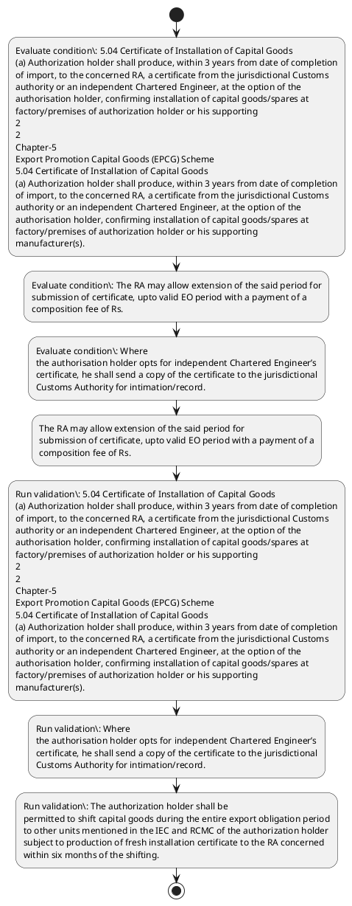

# Chapter 5 / Section 5.04: Certificate of Installation of Capital Goods

**Chapter Title:** Export Promotion Capital Goods (EPCG) Scheme

**Pages:** 2, 3

**Purpose:** 5.04 Certificate of Installation of Capital Goods
(a) Authorization holder shall produce, within 3 years from date of completion
of import, to the concerned RA, a certificate from the jurisdictional Customs
authority or an independent Chartered Engineer, at the option of the
authorisation holder, confirming installation of capital goods/spares at
factory/premises of authorization holder or his supporting
2
2
Chapter-5
Export Promotion Capital Goods (EPCG) Scheme
5.04 Certificate of Installation of Capital Goods
(a) Authorization holder shall produce, within 3 years from date of completion
of import, to the concerned RA, a certificate from the jurisdictional Customs
authority or an independent Chartered Engineer, at the option of the
authorisation holder, confirming installation of capital goods/spares at
factory/premises of authorization holder or his supporting
manufacturer(s).

**Purpose Thanglish:** Indha Certificate of Installation of Capital Goods section-la, 5.04 Certificate of Installation of Capital Goods
(a) Authorization holder kandippa produce, within 3 years from date of completion
of import, to the concerned RA, a certificate from the jurisdictional Customs
authority or an independent Chartered Engineer, at the option of the
authorisation holder, confirming installation of capital goods/spares at
factory/premises of authorization holder or his supporting
2
2
Chapter-5
export Promotion Capital Goods (EPCG) Scheme
5.04 Certificate of Installation of Capital Goods
(a) Authorization holder kandippa produce, within 3 years from date of completion
of import, to the concerned RA, a certificate from the jurisdictional Customs
authority or an independent Chartered Engineer, at the option of the
authorisation holder, confirming installation of capital goods/spares at
factory/premises of authorization holder or his supporting
manufacturer(s).

**Summary:** 5.04 Certificate of Installation of Capital Goods
(a) Authorization holder shall produce, within 3 years from date of completion
of import, to the concerned RA, a certificate from the jurisdictional Customs
authority or an independent Chartered Engineer, at the option of the
authorisation holder, confirming installation of capital goods/spares at
factory/premises of authorization holder or his supporting
2
2
Chapter-5
Export Promotion Capital Goods (EPCG) Scheme
5.04 Certificate of Installation of Capital Goods
(a) Authorization holder shall produce, within 3 years from date of completion
of import, to the concerned RA, a certificate from the jurisdictional Customs
authority or an independent Chartered Engineer, at the option of the
authorisation holder, confirming installation of capital goods/spares at
factory/premises of authorization holder or his supporting
manufacturer(s). The RA may allow extension of the said period for
submission of certificate, upto valid EO period with a payment of a
composition fee of Rs. 10,000/- per year by the authorisation holder.

**Business Meaning:** Certificate of Installation of Capital Goods governs how DGFT business controls should be applied, validated, and enforced.

**Business Explanation:** Certificate of Installation of Capital Goods explains the operating rule set that DEKAI should enforce. Key control points include 5.04 Certificate of Installation of Capital Goods
(a) Authorization holder shall produce, within 3 years from date of completion
of import, to the concerned RA, a certificate from the jurisdictional Customs
authority or an independent Chartered Engineer, at the option of the
authorisation holder, confirming installation of capital goods/spares at
factory/premises of authorization holder or his supporting
2
2
Chapter-5
Export Promotion Capital Goods (EPCG) Scheme
5.04 Certificate of Installation of Capital Goods
(a) Authorization holder shall produce, within 3 years from date of completion
of import, to the concerned RA, a certificate from the jurisdictional Customs
authority or an independent Chartered Engineer, at the option of the
authorisation holder, confirming installation of capital goods/spares at
factory/premises of authorization holder or his supporting
manufacturer(s). The section also drives actions such as The RA may allow extension of the said period for
submission of certificate, upto valid EO period with a payment of a
composition fee of Rs..

**Business Explanation Thanglish:** Indha Certificate of Installation of Capital Goods section-la, Certificate of Installation of Capital Goods explains the operating rule set that DEKAI should enforce. Key control points include 5.04 Certificate of Installation of Capital Goods
(a) Authorization holder kandippa produce, within 3 years from date of completion
of import, to the concerned RA, a certificate from the jurisdictional Customs
authority or an independent Chartered Engineer, at the option of the
authorisation holder, confirming installation of capital goods/spares at
factory/premises of authorization holder or his supporting
2
2
Chapter-5
export Promotion Capital Goods (EPCG) Scheme
5.04 Certificate of Installation of Capital Goods
(a) Authorization holder kandippa produce, within 3 years from date of completion
of import, to the concerned RA, a certificate from the jurisdictional Customs
authority or an independent Chartered Engineer, at the option of the
authorisation holder, confirming installation of capital goods/spares at
factory/premises of authorization holder or his supporting
manufacturer(s). The section also drives actions such as The RA may allow extension of the said period for
submission of certificate, upto valid EO period with a payment of a
composition fee of Rs..

## Business Logic
- 5.04 Certificate of Installation of Capital Goods
(a) Authorization holder shall produce, within 3 years from date of completion
of import, to the concerned RA, a certificate from the jurisdictional Customs
authority or an independent Chartered Engineer, at the option of the
authorisation holder, confirming installation of capital goods/spares at
factory/premises of authorization holder or his supporting
2
2
Chapter-5
Export Promotion Capital Goods (EPCG) Scheme
5.04 Certificate of Installation of Capital Goods
(a) Authorization holder shall produce, within 3 years from date of completion
of import, to the concerned RA, a certificate from the jurisdictional Customs
authority or an independent Chartered Engineer, at the option of the
authorisation holder, confirming installation of capital goods/spares at
factory/premises of authorization holder or his supporting
manufacturer(s).
- Where
the authorisation holder opts for independent Chartered Engineer’s
certificate, he shall send a copy of the certificate to the jurisdictional
Customs Authority for intimation/record.
- The authorization holder shall be
permitted to shift capital goods during the entire export obligation period
to other units mentioned in the IEC and RCMC of the authorization holder
subject to production of fresh installation certificate to the RA concerned
within six months of the shifting.

## Business Rules
- rule_id=CH5-SEC5_04-R001, rule_description=5.04 Certificate of Installation of Capital Goods
(a) Authorization holder shall produce, within 3 years from date of completion
of import, to the concerned RA, a certificate from the jurisdictional Customs
authority or an independent Chartered Engineer, at the option of the
authorisation holder, confirming installation of capital goods/spares at
factory/premises of authorization holder or his supporting
2
2
Chapter-5
Export Promotion Capital Goods (EPCG) Scheme
5.04 Certificate of Installation of Capital Goods
(a) Authorization holder shall produce, within 3 years from date of completion
of import, to the concerned RA, a certificate from the jurisdictional Customs
authority or an independent Chartered Engineer, at the option of the
authorisation holder, confirming installation of capital goods/spares at
factory/premises of authorization holder or his supporting
manufacturer(s)., trigger=Certificate of Installation of Capital Goods, condition=5.04 Certificate of Installation of Capital Goods
(a) Authorization holder shall produce, within 3 years from date of completion
of import, to the concerned RA, a certificate from the jurisdictional Customs
authority or an independent Chartered Engineer, at the option of the
authorisation holder, confirming installation of capital goods/spares at
factory/premises of authorization holder or his supporting
2
2
Chapter-5
Export Promotion Capital Goods (EPCG) Scheme
5.04 Certificate of Installation of Capital Goods
(a) Authorization holder shall produce, within 3 years from date of completion
of import, to the concerned RA, a certificate from the jurisdictional Customs
authority or an independent Chartered Engineer, at the option of the
authorisation holder, confirming installation of capital goods/spares at
factory/premises of authorization holder or his supporting
manufacturer(s)., validation=5.04 Certificate of Installation of Capital Goods
(a) Authorization holder shall produce, within 3 years from date of completion
of import, to the concerned RA, a certificate from the jurisdictional Customs
authority or an independent Chartered Engineer, at the option of the
authorisation holder, confirming installation of capital goods/spares at
factory/premises of authorization holder or his supporting
2
2
Chapter-5
Export Promotion Capital Goods (EPCG) Scheme
5.04 Certificate of Installation of Capital Goods
(a) Authorization holder shall produce, within 3 years from date of completion
of import, to the concerned RA, a certificate from the jurisdictional Customs
authority or an independent Chartered Engineer, at the option of the
authorisation holder, confirming installation of capital goods/spares at
factory/premises of authorization holder or his supporting
manufacturer(s)., action=The RA may allow extension of the said period for
submission of certificate, upto valid EO period with a payment of a
composition fee of Rs., exception=No explicit exception found in uploaded documents., output=DEKAI should produce a compliance decision for 5.04 - Certificate of Installation of Capital Goods.
- rule_id=CH5-SEC5_04-R002, rule_description=Where
the authorisation holder opts for independent Chartered Engineer’s
certificate, he shall send a copy of the certificate to the jurisdictional
Customs Authority for intimation/record., trigger=Certificate of Installation of Capital Goods, condition=The RA may allow extension of the said period for
submission of certificate, upto valid EO period with a payment of a
composition fee of Rs., validation=Where
the authorisation holder opts for independent Chartered Engineer’s
certificate, he shall send a copy of the certificate to the jurisdictional
Customs Authority for intimation/record., action=The RA may allow extension of the said period for
submission of certificate, upto valid EO period with a payment of a
composition fee of Rs., exception=No explicit exception found in uploaded documents., output=DEKAI should produce a compliance decision for 5.04 - Certificate of Installation of Capital Goods.
- rule_id=CH5-SEC5_04-R003, rule_description=The authorization holder shall be
permitted to shift capital goods during the entire export obligation period
to other units mentioned in the IEC and RCMC of the authorization holder
subject to production of fresh installation certificate to the RA concerned
within six months of the shifting., trigger=Certificate of Installation of Capital Goods, condition=Where
the authorisation holder opts for independent Chartered Engineer’s
certificate, he shall send a copy of the certificate to the jurisdictional
Customs Authority for intimation/record., validation=The authorization holder shall be
permitted to shift capital goods during the entire export obligation period
to other units mentioned in the IEC and RCMC of the authorization holder
subject to production of fresh installation certificate to the RA concerned
within six months of the shifting., action=The RA may allow extension of the said period for
submission of certificate, upto valid EO period with a payment of a
composition fee of Rs., exception=No explicit exception found in uploaded documents., output=DEKAI should produce a compliance decision for 5.04 - Certificate of Installation of Capital Goods.

## Conditions
- 5.04 Certificate of Installation of Capital Goods
(a) Authorization holder shall produce, within 3 years from date of completion
of import, to the concerned RA, a certificate from the jurisdictional Customs
authority or an independent Chartered Engineer, at the option of the
authorisation holder, confirming installation of capital goods/spares at
factory/premises of authorization holder or his supporting
2
2
Chapter-5
Export Promotion Capital Goods (EPCG) Scheme
5.04 Certificate of Installation of Capital Goods
(a) Authorization holder shall produce, within 3 years from date of completion
of import, to the concerned RA, a certificate from the jurisdictional Customs
authority or an independent Chartered Engineer, at the option of the
authorisation holder, confirming installation of capital goods/spares at
factory/premises of authorization holder or his supporting
manufacturer(s).
- The RA may allow extension of the said period for
submission of certificate, upto valid EO period with a payment of a
composition fee of Rs.
- Where
the authorisation holder opts for independent Chartered Engineer’s
certificate, he shall send a copy of the certificate to the jurisdictional
Customs Authority for intimation/record.
- The authorization holder shall be
permitted to shift capital goods during the entire export obligation period
to other units mentioned in the IEC and RCMC of the authorization holder
subject to production of fresh installation certificate to the RA concerned
within six months of the shifting.

## Condition Logic
- id=5.5.04.1, if=5.04 Certificate of Installation of Capital Goods
(a) Authorization holder shall produce, within 3 years from date of completion
of import, to the concerned RA, a certificate from the jurisdictional Customs
authority or an independent Chartered Engineer, at the option of the
authorisation holder, confirming installation of capital goods/spares at
factory/premises of authorization holder or his supporting
2
2
Chapter-5
Export Promotion Capital Goods (EPCG) Scheme
5.04 Certificate of Installation of Capital Goods
(a) Authorization holder shall produce, within 3 years from date of completion
of import, to the concerned RA, a certificate from the jurisdictional Customs
authority or an independent Chartered Engineer, at the option of the
authorisation holder, confirming installation of capital goods/spares at
factory/premises of authorization holder or his supporting
manufacturer(s)., then=The RA may allow extension of the said period for
submission of certificate, upto valid EO period with a payment of a
composition fee of Rs., source=5.04 Certificate of Installation of Capital Goods
(a) Authorization holder shall produce, within 3 years from date of completion
of import, to the concerned RA, a certificate from the jurisdictional Customs
authority or an independent Chartered Engineer, at the option of the
authorisation holder, confirming installation of capital goods/spares at
factory/premises of authorization holder or his supporting
2
2
Chapter-5
Export Promotion Capital Goods (EPCG) Scheme
5.04 Certificate of Installation of Capital Goods
(a) Authorization holder shall produce, within 3 years from date of completion
of import, to the concerned RA, a certificate from the jurisdictional Customs
authority or an independent Chartered Engineer, at the option of the
authorisation holder, confirming installation of capital goods/spares at
factory/premises of authorization holder or his supporting
manufacturer(s).
- id=5.5.04.2, if=The RA may allow extension of the said period for
submission of certificate, upto valid EO period with a payment of a
composition fee of Rs., then=The RA may allow extension of the said period for
submission of certificate, upto valid EO period with a payment of a
composition fee of Rs., source=The RA may allow extension of the said period for
submission of certificate, upto valid EO period with a payment of a
composition fee of Rs.
- id=5.5.04.3, if=Where
the authorisation holder opts for independent Chartered Engineer’s
certificate, he shall send a copy of the certificate to the jurisdictional
Customs Authority for intimation/record., then=The RA may allow extension of the said period for
submission of certificate, upto valid EO period with a payment of a
composition fee of Rs., source=Where
the authorisation holder opts for independent Chartered Engineer’s
certificate, he shall send a copy of the certificate to the jurisdictional
Customs Authority for intimation/record.
- id=5.5.04.4, if=The authorization holder shall be
permitted to shift capital goods during the entire export obligation period
to other units mentioned in the IEC and RCMC of the authorization holder
subject to production of fresh installation certificate to the RA concerned
within six months of the shifting., then=The RA may allow extension of the said period for
submission of certificate, upto valid EO period with a payment of a
composition fee of Rs., source=The authorization holder shall be
permitted to shift capital goods during the entire export obligation period
to other units mentioned in the IEC and RCMC of the authorization holder
subject to production of fresh installation certificate to the RA concerned
within six months of the shifting.

## Validations
- 5.04 Certificate of Installation of Capital Goods
(a) Authorization holder shall produce, within 3 years from date of completion
of import, to the concerned RA, a certificate from the jurisdictional Customs
authority or an independent Chartered Engineer, at the option of the
authorisation holder, confirming installation of capital goods/spares at
factory/premises of authorization holder or his supporting
2
2
Chapter-5
Export Promotion Capital Goods (EPCG) Scheme
5.04 Certificate of Installation of Capital Goods
(a) Authorization holder shall produce, within 3 years from date of completion
of import, to the concerned RA, a certificate from the jurisdictional Customs
authority or an independent Chartered Engineer, at the option of the
authorisation holder, confirming installation of capital goods/spares at
factory/premises of authorization holder or his supporting
manufacturer(s).
- Where
the authorisation holder opts for independent Chartered Engineer’s
certificate, he shall send a copy of the certificate to the jurisdictional
Customs Authority for intimation/record.
- The authorization holder shall be
permitted to shift capital goods during the entire export obligation period
to other units mentioned in the IEC and RCMC of the authorization holder
subject to production of fresh installation certificate to the RA concerned
within six months of the shifting.

## Exceptions
- None identified

## Dependencies
- None identified

## Authorities
- RA
- Customs
- The RA
- Customs Authority

## Required Documents
- 5.04 Certificate of Installation of Capital Goods
(a) Authorization holder shall produce, within 3 years from date of completion
of import, to the concerned RA, a certificate from the jurisdictional Customs
authority or an independent Chartered Engineer, at the option of the
authorisation holder, confirming installation of capital goods/spares at
factory/premises of authorization holder or his supporting
2
2
Chapter-5
Export Promotion Capital Goods (EPCG) Scheme
5.04 Certificate of Installation of Capital Goods
(a) Authorization holder shall produce, within 3 years from date of completion
of import, to the concerned RA, a certificate from the jurisdictional Customs
authority or an independent Chartered Engineer, at the option of the
authorisation holder, confirming installation of capital goods/spares at
factory/premises of authorization holder or his supporting
manufacturer(s).
- The RA may allow extension of the said period for
submission of certificate, upto valid EO period with a payment of a
composition fee of Rs.
- Where
the authorisation holder opts for independent Chartered Engineer’s
certificate, he shall send a copy of the certificate to the jurisdictional
Customs Authority for intimation/record.
- The authorization holder shall be
permitted to shift capital goods during the entire export obligation period
to other units mentioned in the IEC and RCMC of the authorization holder
subject to production of fresh installation certificate to the RA concerned
within six months of the shifting.

## Timelines
- 5.04 Certificate of Installation of Capital Goods
(a) Authorization holder shall produce, within 3 years from date of completion
of import, to the concerned RA, a certificate from the jurisdictional Customs
authority or an independent Chartered Engineer, at the option of the
authorisation holder, confirming installation of capital goods/spares at
factory/premises of authorization holder or his supporting
2
2
Chapter-5
Export Promotion Capital Goods (EPCG) Scheme
5.04 Certificate of Installation of Capital Goods
(a) Authorization holder shall produce, within 3 years from date of completion
of import, to the concerned RA, a certificate from the jurisdictional Customs
authority or an independent Chartered Engineer, at the option of the
authorisation holder, confirming installation of capital goods/spares at
factory/premises of authorization holder or his supporting
manufacturer(s).
- The authorization holder shall be
permitted to shift capital goods during the entire export obligation period
to other units mentioned in the IEC and RCMC of the authorization holder
subject to production of fresh installation certificate to the RA concerned
within six months of the shifting.

## Actions
- The RA may allow extension of the said period for
submission of certificate, upto valid EO period with a payment of a
composition fee of Rs.

## Workflow
- Evaluate condition: 5.04 Certificate of Installation of Capital Goods
(a) Authorization holder shall produce, within 3 years from date of completion
of import, to the concerned RA, a certificate from the jurisdictional Customs
authority or an independent Chartered Engineer, at the option of the
authorisation holder, confirming installation of capital goods/spares at
factory/premises of authorization holder or his supporting
2
2
Chapter-5
Export Promotion Capital Goods (EPCG) Scheme
5.04 Certificate of Installation of Capital Goods
(a) Authorization holder shall produce, within 3 years from date of completion
of import, to the concerned RA, a certificate from the jurisdictional Customs
authority or an independent Chartered Engineer, at the option of the
authorisation holder, confirming installation of capital goods/spares at
factory/premises of authorization holder or his supporting
manufacturer(s).
- Evaluate condition: The RA may allow extension of the said period for
submission of certificate, upto valid EO period with a payment of a
composition fee of Rs.
- Evaluate condition: Where
the authorisation holder opts for independent Chartered Engineer’s
certificate, he shall send a copy of the certificate to the jurisdictional
Customs Authority for intimation/record.
- The RA may allow extension of the said period for
submission of certificate, upto valid EO period with a payment of a
composition fee of Rs.
- Run validation: 5.04 Certificate of Installation of Capital Goods
(a) Authorization holder shall produce, within 3 years from date of completion
of import, to the concerned RA, a certificate from the jurisdictional Customs
authority or an independent Chartered Engineer, at the option of the
authorisation holder, confirming installation of capital goods/spares at
factory/premises of authorization holder or his supporting
2
2
Chapter-5
Export Promotion Capital Goods (EPCG) Scheme
5.04 Certificate of Installation of Capital Goods
(a) Authorization holder shall produce, within 3 years from date of completion
of import, to the concerned RA, a certificate from the jurisdictional Customs
authority or an independent Chartered Engineer, at the option of the
authorisation holder, confirming installation of capital goods/spares at
factory/premises of authorization holder or his supporting
manufacturer(s).
- Run validation: Where
the authorisation holder opts for independent Chartered Engineer’s
certificate, he shall send a copy of the certificate to the jurisdictional
Customs Authority for intimation/record.
- Run validation: The authorization holder shall be
permitted to shift capital goods during the entire export obligation period
to other units mentioned in the IEC and RCMC of the authorization holder
subject to production of fresh installation certificate to the RA concerned
within six months of the shifting.

## Workflow ASCII
```text
Certificate of Installation of Capital Goods
Evaluate condition: 5.04 Certificate of Installation of Capital Goods
(a) Authorization holder shall produce, within 3 years from date of completion
of import, to the concerned RA, a certificate from the jurisdictional Customs
authority or an independent Chartered Engineer, at the option of the
authorisation holder, confirming installation of capital goods/spares at
factory/premises of authorization holder or his supporting
2
2
Chapter-5
Export Promotion Capital Goods (EPCG) Scheme
5.04 Certificate of Installation of Capital Goods
(a) Authorization holder shall produce, within 3 years from date of completion
of import, to the concerned RA, a certificate from the jurisdictional Customs
authority or an independent Chartered Engineer, at the option of the
authorisation holder, confirming installation of capital goods/spares at
factory/premises of authorization holder or his supporting
manufacturer(s).
   |
   v
Evaluate condition: The RA may allow extension of the said period for
submission of certificate, upto valid EO period with a payment of a
composition fee of Rs.
   |
   v
Evaluate condition: Where
the authorisation holder opts for independent Chartered Engineer’s
certificate, he shall send a copy of the certificate to the jurisdictional
Customs Authority for intimation/record.
   |
   v
The RA may allow extension of the said period for
submission of certificate, upto valid EO period with a payment of a
composition fee of Rs.
   |
   v
Run validation: 5.04 Certificate of Installation of Capital Goods
(a) Authorization holder shall produce, within 3 years from date of completion
of import, to the concerned RA, a certificate from the jurisdictional Customs
authority or an independent Chartered Engineer, at the option of the
authorisation holder, confirming installation of capital goods/spares at
factory/premises of authorization holder or his supporting
2
2
Chapter-5
Export Promotion Capital Goods (EPCG) Scheme
5.04 Certificate of Installation of Capital Goods
(a) Authorization holder shall produce, within 3 years from date of completion
of import, to the concerned RA, a certificate from the jurisdictional Customs
authority or an independent Chartered Engineer, at the option of the
authorisation holder, confirming installation of capital goods/spares at
factory/premises of authorization holder or his supporting
manufacturer(s).
   |
   v
Run validation: Where
the authorisation holder opts for independent Chartered Engineer’s
certificate, he shall send a copy of the certificate to the jurisdictional
Customs Authority for intimation/record.
   |
   v
Run validation: The authorization holder shall be
permitted to shift capital goods during the entire export obligation period
to other units mentioned in the IEC and RCMC of the authorization holder
subject to production of fresh installation certificate to the RA concerned
within six months of the shifting.
```

## Decision Tree
- IF 5.04 Certificate of Installation of Capital Goods
(a) Authorization holder shall produce, within 3 years from date of completion
of import, to the concerned RA, a certificate from the jurisdictional Customs
authority or an independent Chartered Engineer, at the option of the
authorisation holder, confirming installation of capital goods/spares at
factory/premises of authorization holder or his supporting
2
2
Chapter-5
Export Promotion Capital Goods (EPCG) Scheme
5.04 Certificate of Installation of Capital Goods
(a) Authorization holder shall produce, within 3 years from date of completion
of import, to the concerned RA, a certificate from the jurisdictional Customs
authority or an independent Chartered Engineer, at the option of the
authorisation holder, confirming installation of capital goods/spares at
factory/premises of authorization holder or his supporting
manufacturer(s). THEN The RA may allow extension of the said period for
submission of certificate, upto valid EO period with a payment of a
composition fee of Rs.
- IF The RA may allow extension of the said period for
submission of certificate, upto valid EO period with a payment of a
composition fee of Rs. THEN The RA may allow extension of the said period for
submission of certificate, upto valid EO period with a payment of a
composition fee of Rs.
- IF Where
the authorisation holder opts for independent Chartered Engineer’s
certificate, he shall send a copy of the certificate to the jurisdictional
Customs Authority for intimation/record. THEN The RA may allow extension of the said period for
submission of certificate, upto valid EO period with a payment of a
composition fee of Rs.
- IF The authorization holder shall be
permitted to shift capital goods during the entire export obligation period
to other units mentioned in the IEC and RCMC of the authorization holder
subject to production of fresh installation certificate to the RA concerned
within six months of the shifting. THEN The RA may allow extension of the said period for
submission of certificate, upto valid EO period with a payment of a
composition fee of Rs.

## Decision Tree ASCII
```text
Certificate of Installation of Capital Goods Decision
IF 5.04 Certificate of Installation of Capital Goods
(a) Authorization holder shall produce, within 3 years from date of completion
of import, to the concerned RA, a certificate from the jurisdictional Customs
authority or an independent Chartered Engineer, at the option of the
authorisation holder, confirming installation of capital goods/spares at
factory/premises of authorization holder or his supporting
2
2
Chapter-5
Export Promotion Capital Goods (EPCG) Scheme
5.04 Certificate of Installation of Capital Goods
(a) Authorization holder shall produce, within 3 years from date of completion
of import, to the concerned RA, a certificate from the jurisdictional Customs
authority or an independent Chartered Engineer, at the option of the
authorisation holder, confirming installation of capital goods/spares at
factory/premises of authorization holder or his supporting
manufacturer(s). THEN The RA may allow extension of the said period for
submission of certificate, upto valid EO period with a payment of a
composition fee of Rs.
   |
   v
IF The RA may allow extension of the said period for
submission of certificate, upto valid EO period with a payment of a
composition fee of Rs. THEN The RA may allow extension of the said period for
submission of certificate, upto valid EO period with a payment of a
composition fee of Rs.
   |
   v
IF Where
the authorisation holder opts for independent Chartered Engineer’s
certificate, he shall send a copy of the certificate to the jurisdictional
Customs Authority for intimation/record. THEN The RA may allow extension of the said period for
submission of certificate, upto valid EO period with a payment of a
composition fee of Rs.
   |
   v
IF The authorization holder shall be
permitted to shift capital goods during the entire export obligation period
to other units mentioned in the IEC and RCMC of the authorization holder
subject to production of fresh installation certificate to the RA concerned
within six months of the shifting. THEN The RA may allow extension of the said period for
submission of certificate, upto valid EO period with a payment of a
composition fee of Rs.
```

## Examples
- User asks to process Certificate of Installation of Capital Goods; the platform checks conditions, validations, and documents before action.

**Real-world Example:** Example: an importer or exporter invokes Certificate of Installation of Capital Goods, submits 5.04 Certificate of Installation of Capital Goods
(a) Authorization holder shall produce, within 3 years from date of completion
of import, to the concerned RA, a certificate from the jurisdictional Customs
authority or an independent Chartered Engineer, at the option of the
authorisation holder, confirming installation of capital goods/spares at
factory/premises of authorization holder or his supporting
2
2
Chapter-5
Export Promotion Capital Goods (EPCG) Scheme
5.04 Certificate of Installation of Capital Goods
(a) Authorization holder shall produce, within 3 years from date of completion
of import, to the concerned RA, a certificate from the jurisdictional Customs
authority or an independent Chartered Engineer, at the option of the
authorisation holder, confirming installation of capital goods/spares at
factory/premises of authorization holder or his supporting
manufacturer(s)., The RA may allow extension of the said period for
submission of certificate, upto valid EO period with a payment of a
composition fee of Rs., Where
the authorisation holder opts for independent Chartered Engineer’s
certificate, he shall send a copy of the certificate to the jurisdictional
Customs Authority for intimation/record., and DEKAI uses the extracted rules to the ra may allow extension of the said period for
submission of certificate, upto valid eo period with a payment of a
composition fee of rs..

**Real-world Example Thanglish:** Indha Certificate of Installation of Capital Goods section-la, Example: an importer or exporter invokes Certificate of Installation of Capital Goods, submits 5.04 Certificate of Installation of Capital Goods
(a) Authorization holder kandippa produce, within 3 years from date of completion
of import, to the concerned RA, a certificate from the jurisdictional Customs
authority or an independent Chartered Engineer, at the option of the
authorisation holder, confirming installation of capital goods/spares at
factory/premises of authorization holder or his supporting
2
2
Chapter-5
export Promotion Capital Goods (EPCG) Scheme
5.04 Certificate of Installation of Capital Goods
(a) Authorization holder kandippa produce, within 3 years from date of completion
of import, to the concerned RA, a certificate from the jurisdictional Customs
authority or an independent Chartered Engineer, at the option of the
authorisation holder, confirming installation of capital goods/spares at
factory/premises of authorization holder or his supporting
manufacturer(s)., The RA may allow extension of the said period for
submission of certificate, upto valid EO period with a payment of a
composition fee of Rs., Where
the authorisation holder opts for independent Chartered Engineer’s
certificate, he kandippa send a copy of the certificate to the jurisdictional
Customs authority for intimation/record., and DEKAI uses the extracted rules to the ra may allow extension of the said period for
submission of certificate, upto valid eo period with a payment of a
composition fee of rs..

## AI Rules
- IF detected context matches section rule THEN enforce: 5.04 Certificate of Installation of Capital Goods
(a) Authorization holder shall produce, within 3 years from date of completion
of import, to the concerned RA, a certificate from the jurisdictional Customs
authority or an independent Chartered Engineer, at the option of the
authorisation holder, confirming installation of capital goods/spares at
factory/premises of authorization holder or his supporting
2
2
Chapter-5
Export Promotion Capital Goods (EPCG) Scheme
5.04 Certificate of Installation of Capital Goods
(a) Authorization holder shall produce, within 3 years from date of completion
of import, to the concerned RA, a certificate from the jurisdictional Customs
authority or an independent Chartered Engineer, at the option of the
authorisation holder, confirming installation of capital goods/spares at
factory/premises of authorization holder or his supporting
manufacturer(s).
- IF detected context matches section rule THEN enforce: Where
the authorisation holder opts for independent Chartered Engineer’s
certificate, he shall send a copy of the certificate to the jurisdictional
Customs Authority for intimation/record.
- IF detected context matches section rule THEN enforce: The authorization holder shall be
permitted to shift capital goods during the entire export obligation period
to other units mentioned in the IEC and RCMC of the authorization holder
subject to production of fresh installation certificate to the RA concerned
within six months of the shifting.
- IF validations pass THEN recommend action: The RA may allow extension of the said period for
submission of certificate, upto valid EO period with a payment of a
composition fee of Rs.

## Database Fields
- name=section_code, type=string, required=True, source=parsed_section_heading
- name=section_title, type=string, required=True, source=parsed_section_heading
- name=the_flag, type=boolean, required=False, source=keyword:the
- name=his_flag, type=boolean, required=False, source=keyword:his
- name=may_flag, type=boolean, required=False, source=keyword:may
- name=for_flag, type=boolean, required=False, source=keyword:for
- name=fee_flag, type=boolean, required=False, source=keyword:fee
- name=per_flag, type=boolean, required=False, source=keyword:per
- name=iec_flag, type=boolean, required=False, source=keyword:IEC
- name=and_flag, type=boolean, required=False, source=keyword:and
- name=document_1_submitted, type=boolean, required=True, source=5.04 Certificate of Installation of Capital Goods
(a) Authorization holder shall produce, within 3 years from date of completion
of import, to the concerned RA, a certificate from the jurisdictional Customs
authority or an independent Chartered Engineer, at the option of the
authorisation holder, confirming installation of capital goods/spares at
factory/premises of authorization holder or his supporting
2
2
Chapter-5
Export Promotion Capital Goods (EPCG) Scheme
5.04 Certificate of Installation of Capital Goods
(a) Authorization holder shall produce, within 3 years from date of completion
of import, to the concerned RA, a certificate from the jurisdictional Customs
authority or an independent Chartered Engineer, at the option of the
authorisation holder, confirming installation of capital goods/spares at
factory/premises of authorization holder or his supporting
manufacturer(s).
- name=document_2_submitted, type=boolean, required=True, source=The RA may allow extension of the said period for
submission of certificate, upto valid EO period with a payment of a
composition fee of Rs.
- name=document_3_submitted, type=boolean, required=True, source=Where
the authorisation holder opts for independent Chartered Engineer’s
certificate, he shall send a copy of the certificate to the jurisdictional
Customs Authority for intimation/record.
- name=document_4_submitted, type=boolean, required=True, source=The authorization holder shall be
permitted to shift capital goods during the entire export obligation period
to other units mentioned in the IEC and RCMC of the authorization holder
subject to production of fresh installation certificate to the RA concerned
within six months of the shifting.

## API Requirements
- method=GET, path=/api/dgft/sections/5.04, purpose=Retrieve knowledge payload for section 5.04, query_params=['include=workflow,decision_tree,validations'], response_fields=['section', 'title', 'summary', 'conditions', 'validations', 'exceptions', 'workflow', 'decision_tree']
- method=POST, path=/api/dgft/Certificate-of-Installation-of-Capital-Goods/validate, purpose=Validate inputs and documents for Certificate of Installation of Capital Goods, request_fields=['section_code', 'section_title', 'document_1_submitted', 'document_2_submitted', 'document_3_submitted', 'document_4_submitted'], response_fields=['status', 'errors', 'warnings', 'next_actions']
- method=POST, path=/api/dgft/Certificate-of-Installation-of-Capital-Goods/execute, purpose=Trigger business action for The RA may allow extension of the said period for
submission of certificate, upto valid EO period with a payment of a
composition fee of Rs., request_fields=['section_code', 'section_title', 'document_1_submitted', 'document_2_submitted', 'document_3_submitted', 'document_4_submitted'], response_fields=['reference_id', 'status', 'authority', 'timeline']

## UI Screens
- screen_id=Certificate_of_Installation_of_Capital_Goods_overview, name=Certificate of Installation of Capital Goods Overview, purpose=Show section summary, authority, timeline, and eligibility cues., widgets=['summary_card', 'conditions_table', 'authority_badges', 'timeline_panel']
- screen_id=Certificate_of_Installation_of_Capital_Goods_submission, name=Certificate of Installation of Capital Goods Submission, purpose=Capture applicant data and supporting documents., widgets=['dynamic_form', 'document_uploader', 'validation_panel', 'next_action_footer'], fields=['section_code', 'section_title', 'the_flag', 'his_flag', 'may_flag', 'for_flag', 'fee_flag', 'per_flag']

## Error Messages
- Validation failed because the section requirements were not fully met.

## FAQ
- question_en=What is the purpose of section 5.04?, answer_en=Certificate of Installation of Capital Goods explains the operating rule set that DEKAI should enforce. Key control points include 5.04 Certificate of Installation of Capital Goods
(a) Authorization holder shall produce, within 3 years from date of completion
of import, to the concerned RA, a certificate from the jurisdictional Customs
authority or an independent Chartered Engineer, at the option of the
authorisation holder, confirming installation of capital goods/spares at
factory/premises of authorization holder or his supporting
2
2
Chapter-5
Export Promotion Capital Goods (EPCG) Scheme
5.04 Certificate of Installation of Capital Goods
(a) Authorization holder shall produce, within 3 years from date of completion
of import, to the concerned RA, a certificate from the jurisdictional Customs
authority or an independent Chartered Engineer, at the option of the
authorisation holder, confirming installation of capital goods/spares at
factory/premises of authorization holder or his supporting
manufacturer(s). The section also drives actions such as The RA may allow extension of the said period for
submission of certificate, upto valid EO period with a payment of a
composition fee of Rs.., question_thanglish=Indha Certificate of Installation of Capital Goods section-la, What is the purpose of section 5.04?, answer_thanglish=Indha Certificate of Installation of Capital Goods section-la, Certificate of Installation of Capital Goods explains the operating rule set that DEKAI should enforce. Key control points include 5.04 Certificate of Installation of Capital Goods
(a) Authorization holder kandippa produce, within 3 years from date of completion
of import, to the concerned RA, a certificate from the jurisdictional Customs
authority or an independent Chartered Engineer, at the option of the
authorisation holder, confirming installation of capital goods/spares at
factory/premises of authorization holder or his supporting
2
2
Chapter-5
export Promotion Capital Goods (EPCG) Scheme
5.04 Certificate of Installation of Capital Goods
(a) Authorization holder kandippa produce, within 3 years from date of completion
of import, to the concerned RA, a certificate from the jurisdictional Customs
authority or an independent Chartered Engineer, at the option of the
authorisation holder, confirming installation of capital goods/spares at
factory/premises of authorization holder or his supporting
manufacturer(s). The section also drives actions such as The RA may allow extension of the said period for
submission of certificate, upto valid EO period with a payment of a
composition fee of Rs..
- question_en=What documents are required under Certificate of Installation of Capital Goods?, answer_en=5.04 Certificate of Installation of Capital Goods
(a) Authorization holder shall produce, within 3 years from date of completion
of import, to the concerned RA, a certificate from the jurisdictional Customs
authority or an independent Chartered Engineer, at the option of the
authorisation holder, confirming installation of capital goods/spares at
factory/premises of authorization holder or his supporting
2
2
Chapter-5
Export Promotion Capital Goods (EPCG) Scheme
5.04 Certificate of Installation of Capital Goods
(a) Authorization holder shall produce, within 3 years from date of completion
of import, to the concerned RA, a certificate from the jurisdictional Customs
authority or an independent Chartered Engineer, at the option of the
authorisation holder, confirming installation of capital goods/spares at
factory/premises of authorization holder or his supporting
manufacturer(s)., The RA may allow extension of the said period for
submission of certificate, upto valid EO period with a payment of a
composition fee of Rs., Where
the authorisation holder opts for independent Chartered Engineer’s
certificate, he shall send a copy of the certificate to the jurisdictional
Customs Authority for intimation/record., The authorization holder shall be
permitted to shift capital goods during the entire export obligation period
to other units mentioned in the IEC and RCMC of the authorization holder
subject to production of fresh installation certificate to the RA concerned
within six months of the shifting., question_thanglish=Indha Certificate of Installation of Capital Goods section-la, What documents are required under Certificate of Installation of Capital Goods?, answer_thanglish=Indha Certificate of Installation of Capital Goods section-la, 5.04 Certificate of Installation of Capital Goods
(a) Authorization holder kandippa produce, within 3 years from date of completion
of import, to the concerned RA, a certificate from the jurisdictional Customs
authority or an independent Chartered Engineer, at the option of the
authorisation holder, confirming installation of capital goods/spares at
factory/premises of authorization holder or his supporting
2
2
Chapter-5
export Promotion Capital Goods (EPCG) Scheme
5.04 Certificate of Installation of Capital Goods
(a) Authorization holder kandippa produce, within 3 years from date of completion
of import, to the concerned RA, a certificate from the jurisdictional Customs
authority or an independent Chartered Engineer, at the option of the
authorisation holder, confirming installation of capital goods/spares at
factory/premises of authorization holder or his supporting
manufacturer(s)., The RA may allow extension of the said period for
submission of certificate, upto valid EO period with a payment of a
composition fee of Rs., Where
the authorisation holder opts for independent Chartered Engineer’s
certificate, he kandippa send a copy of the certificate to the jurisdictional
Customs authority for intimation/record., The authorization holder kandippa be
permitted to shift capital goods during the entire export obligation period
to other units mentioned in the IEC and RCMC of the authorization holder
subject to production of fresh installation certificate to the RA concerned
within six months of the shifting.
- question_en=Which authority handles Certificate of Installation of Capital Goods?, answer_en=RA, Customs, The RA, Customs Authority, question_thanglish=Indha Certificate of Installation of Capital Goods section-la, Which authority handles Certificate of Installation of Capital Goods?, answer_thanglish=Indha Certificate of Installation of Capital Goods section-la, RA, Customs, The RA, Customs authority

## Questions Users May Ask
- What does Certificate of Installation of Capital Goods require?
- Which documents are needed for Certificate of Installation of Capital Goods?
- How does DEKAI validate Certificate of Installation of Capital Goods requests?
- What action should be taken for Certificate of Installation of Capital Goods?

## Expected AI Answers
- Certificate of Installation of Capital Goods requires the platform to interpret the section text, apply the extracted business rules, and present the correct next action.
- Required documents are inferred from the section text: 5.04 Certificate of Installation of Capital Goods
(a) Authorization holder shall produce, within 3 years from date of completion
of import, to the concerned RA, a certificate from the jurisdictional Customs
authority or an independent Chartered Engineer, at the option of the
authorisation holder, confirming installation of capital goods/spares at
factory/premises of authorization holder or his supporting
2
2
Chapter-5
Export Promotion Capital Goods (EPCG) Scheme
5.04 Certificate of Installation of Capital Goods
(a) Authorization holder shall produce, within 3 years from date of completion
of import, to the concerned RA, a certificate from the jurisdictional Customs
authority or an independent Chartered Engineer, at the option of the
authorisation holder, confirming installation of capital goods/spares at
factory/premises of authorization holder or his supporting
manufacturer(s)., The RA may allow extension of the said period for
submission of certificate, upto valid EO period with a payment of a
composition fee of Rs., Where
the authorisation holder opts for independent Chartered Engineer’s
certificate, he shall send a copy of the certificate to the jurisdictional
Customs Authority for intimation/record., The authorization holder shall be
permitted to shift capital goods during the entire export obligation period
to other units mentioned in the IEC and RCMC of the authorization holder
subject to production of fresh installation certificate to the RA concerned
within six months of the shifting.
- DEKAI validates Certificate of Installation of Capital Goods by checking conditions, required documents, authority references, and exception clauses before recommending an outcome.
- The primary extracted action is: The RA may allow extension of the said period for
submission of certificate, upto valid EO period with a payment of a
composition fee of Rs.

## AI Q&A Examples
- question_en=User asks: How do I comply with Certificate of Installation of Capital Goods?, answer_en=AI answers: DEKAI should evaluate section 5.04, apply the extracted rules, and guide the user through Evaluate condition: 5.04 Certificate of Installation of Capital Goods
(a) Authorization holder shall produce, within 3 years from date of completion
of import, to the concerned RA, a certificate from the jurisdictional Customs
authority or an independent Chartered Engineer, at the option of the
authorisation holder, confirming installation of capital goods/spares at
factory/premises of authorization holder or his supporting
2
2
Chapter-5
Export Promotion Capital Goods (EPCG) Scheme
5.04 Certificate of Installation of Capital Goods
(a) Authorization holder shall produce, within 3 years from date of completion
of import, to the concerned RA, a certificate from the jurisdictional Customs
authority or an independent Chartered Engineer, at the option of the
authorisation holder, confirming installation of capital goods/spares at
factory/premises of authorization holder or his supporting
manufacturer(s).., question_thanglish=Indha Certificate of Installation of Capital Goods section-la, User asks: How do I comply with Certificate of Installation of Capital Goods?, answer_thanglish=Indha Certificate of Installation of Capital Goods section-la, AI answers: DEKAI should evaluate section 5.04, apply the extracted rules, and guide the user through Evaluate condition: 5.04 Certificate of Installation of Capital Goods
(a) Authorization holder kandippa produce, within 3 years from date of completion
of import, to the concerned RA, a certificate from the jurisdictional Customs
authority or an independent Chartered Engineer, at the option of the
authorisation holder, confirming installation of capital goods/spares at
factory/premises of authorization holder or his supporting
2
2
Chapter-5
export Promotion Capital Goods (EPCG) Scheme
5.04 Certificate of Installation of Capital Goods
(a) Authorization holder kandippa produce, within 3 years from date of completion
of import, to the concerned RA, a certificate from the jurisdictional Customs
authority or an independent Chartered Engineer, at the option of the
authorisation holder, confirming installation of capital goods/spares at
factory/premises of authorization holder or his supporting
manufacturer(s)..
- question_en=User asks: Which validations apply to Certificate of Installation of Capital Goods?, answer_en=AI answers: Applicable validations are 5.04 Certificate of Installation of Capital Goods
(a) Authorization holder shall produce, within 3 years from date of completion
of import, to the concerned RA, a certificate from the jurisdictional Customs
authority or an independent Chartered Engineer, at the option of the
authorisation holder, confirming installation of capital goods/spares at
factory/premises of authorization holder or his supporting
2
2
Chapter-5
Export Promotion Capital Goods (EPCG) Scheme
5.04 Certificate of Installation of Capital Goods
(a) Authorization holder shall produce, within 3 years from date of completion
of import, to the concerned RA, a certificate from the jurisdictional Customs
authority or an independent Chartered Engineer, at the option of the
authorisation holder, confirming installation of capital goods/spares at
factory/premises of authorization holder or his supporting
manufacturer(s)., Where
the authorisation holder opts for independent Chartered Engineer’s
certificate, he shall send a copy of the certificate to the jurisdictional
Customs Authority for intimation/record., The authorization holder shall be
permitted to shift capital goods during the entire export obligation period
to other units mentioned in the IEC and RCMC of the authorization holder
subject to production of fresh installation certificate to the RA concerned
within six months of the shifting., question_thanglish=Indha Certificate of Installation of Capital Goods section-la, User asks: Which validations apply to Certificate of Installation of Capital Goods?, answer_thanglish=Indha Certificate of Installation of Capital Goods section-la, AI answers: Applicable validations are 5.04 Certificate of Installation of Capital Goods
(a) Authorization holder kandippa produce, within 3 years from date of completion
of import, to the concerned RA, a certificate from the jurisdictional Customs
authority or an independent Chartered Engineer, at the option of the
authorisation holder, confirming installation of capital goods/spares at
factory/premises of authorization holder or his supporting
2
2
Chapter-5
export Promotion Capital Goods (EPCG) Scheme
5.04 Certificate of Installation of Capital Goods
(a) Authorization holder kandippa produce, within 3 years from date of completion
of import, to the concerned RA, a certificate from the jurisdictional Customs
authority or an independent Chartered Engineer, at the option of the
authorisation holder, confirming installation of capital goods/spares at
factory/premises of authorization holder or his supporting
manufacturer(s)., Where
the authorisation holder opts for independent Chartered Engineer’s
certificate, he kandippa send a copy of the certificate to the jurisdictional
Customs authority for intimation/record., The authorization holder kandippa be
permitted to shift capital goods during the entire export obligation period
to other units mentioned in the IEC and RCMC of the authorization holder
subject to production of fresh installation certificate to the RA concerned
within six months of the shifting.

## DEKAI AI Implementation Notes
- Capture chapter 5, section 5.04, title, and page references as immutable knowledge metadata.
- Bind validations for Certificate of Installation of Capital Goods into a rule engine keyed by the rule IDs extracted for this section.
- Expose document upload controls for: 5.04 Certificate of Installation of Capital Goods
(a) Authorization holder shall produce, within 3 years from date of completion
of import, to the concerned RA, a certificate from the jurisdictional Customs
authority or an independent Chartered Engineer, at the option of the
authorisation holder, confirming installation of capital goods/spares at
factory/premises of authorization holder or his supporting
2
2
Chapter-5
Export Promotion Capital Goods (EPCG) Scheme
5.04 Certificate of Installation of Capital Goods
(a) Authorization holder shall produce, within 3 years from date of completion
of import, to the concerned RA, a certificate from the jurisdictional Customs
authority or an independent Chartered Engineer, at the option of the
authorisation holder, confirming installation of capital goods/spares at
factory/premises of authorization holder or his supporting
manufacturer(s)., The RA may allow extension of the said period for
submission of certificate, upto valid EO period with a payment of a
composition fee of Rs., Where
the authorisation holder opts for independent Chartered Engineer’s
certificate, he shall send a copy of the certificate to the jurisdictional
Customs Authority for intimation/record., The authorization holder shall be
permitted to shift capital goods during the entire export obligation period
to other units mentioned in the IEC and RCMC of the authorization holder
subject to production of fresh installation certificate to the RA concerned
within six months of the shifting..
- Route escalations or approvals to: RA, Customs, The RA, Customs Authority.

## DEKAI AI Implementation Notes Thanglish
- Indha Certificate of Installation of Capital Goods section-la, Capture chapter 5, section 5.04, title, and page references as immutable knowledge metadata.
- Indha Certificate of Installation of Capital Goods section-la, Bind validations for Certificate of Installation of Capital Goods into a rule engine keyed by the rule IDs extracted for this section.
- Indha Certificate of Installation of Capital Goods section-la, Expose document upload controls for: 5.04 Certificate of Installation of Capital Goods
(a) Authorization holder kandippa produce, within 3 years from date of completion
of import, to the concerned RA, a certificate from the jurisdictional Customs
authority or an independent Chartered Engineer, at the option of the
authorisation holder, confirming installation of capital goods/spares at
factory/premises of authorization holder or his supporting
2
2
Chapter-5
export Promotion Capital Goods (EPCG) Scheme
5.04 Certificate of Installation of Capital Goods
(a) Authorization holder kandippa produce, within 3 years from date of completion
of import, to the concerned RA, a certificate from the jurisdictional Customs
authority or an independent Chartered Engineer, at the option of the
authorisation holder, confirming installation of capital goods/spares at
factory/premises of authorization holder or his supporting
manufacturer(s)., The RA may allow extension of the said period for
submission of certificate, upto valid EO period with a payment of a
composition fee of Rs., Where
the authorisation holder opts for independent Chartered Engineer’s
certificate, he kandippa send a copy of the certificate to the jurisdictional
Customs authority for intimation/record., The authorization holder kandippa be
permitted to shift capital goods during the entire export obligation period
to other units mentioned in the IEC and RCMC of the authorization holder
subject to production of fresh installation certificate to the RA concerned
within six months of the shifting..
- Indha Certificate of Installation of Capital Goods section-la, Route escalations or approvals to: RA, Customs, The RA, Customs authority.

## AI Metadata
- Keywords: the, his, may, for, fee, per, IEC, and, six, from, date, EPCG, said, upto, with, year, opts, send, copy, RCMC
- Search Keywords: the, his, may, for, fee, per, IEC, and, six, from, date, EPCG, said, upto, with, year, opts, send, copy, RCMC
- Intent: Support Certificate of Installation of Capital Goods processing and compliance validation.
- Tags: 5.04, Certificate of Installation of Capital Goods, business-rule, document-driven, dgft
- Related Sections: 
- Related Chapters: 
- Related Rules: 5.04 Certificate of Installation of Capital Goods
(a) Authorization holder shall produce, within 3 years from date of completion
of import, to the concerned RA, a certificate from the jurisdictional Customs
authority or an independent Chartered Engineer, at the option of the
authorisation holder, confirming installation of capital goods/spares at
factory/premises of authorization holder or his supporting
2
2
Chapter-5
Export Promotion Capital Goods (EPCG) Scheme
5.04 Certificate of Installation of Capital Goods
(a) Authorization holder shall produce, within 3 years from date of completion
of import, to the concerned RA, a certificate from the jurisdictional Customs
authority or an independent Chartered Engineer, at the option of the
authorisation holder, confirming installation of capital goods/spares at
factory/premises of authorization holder or his supporting
manufacturer(s)., Where
the authorisation holder opts for independent Chartered Engineer’s
certificate, he shall send a copy of the certificate to the jurisdictional
Customs Authority for intimation/record., The authorization holder shall be
permitted to shift capital goods during the entire export obligation period
to other units mentioned in the IEC and RCMC of the authorization holder
subject to production of fresh installation certificate to the RA concerned
within six months of the shifting.

## Mermaid

```mermaid
flowchart TD
    S1["Evaluate condition: 5.04 Certificate of Installation of Capital Goods
(a) Authorization holder shall produce, within 3 years from date of completion
of import, to the concerned RA, a certificate from the jurisdictional Customs
authority or an independent Chartered Engineer, at the option of the
authorisation holder, confirming installation of capital goods/spares at
factory/premises of authorization holder or his supporting
2
2
Chapter-5
Export Promotion Capital Goods (EPCG) Scheme
5.04 Certificate of Installation of Capital Goods
(a) Authorization holder shall produce, within 3 years from date of completion
of import, to the concerned RA, a certificate from the jurisdictional Customs
authority or an independent Chartered Engineer, at the option of the
authorisation holder, confirming installation of capital goods/spares at
factory/premises of authorization holder or his supporting
manufacturer(s)."]
    S2["Evaluate condition: The RA may allow extension of the said period for
submission of certificate, upto valid EO period with a payment of a
composition fee of Rs."]
    S1 --> S2
    S3["Evaluate condition: Where
the authorisation holder opts for independent Chartered Engineer’s
certificate, he shall send a copy of the certificate to the jurisdictional
Customs Authority for intimation/record."]
    S2 --> S3
    S4["The RA may allow extension of the said period for
submission of certificate, upto valid EO period with a payment of a
composition fee of Rs."]
    S3 --> S4
    S5["Run validation: 5.04 Certificate of Installation of Capital Goods
(a) Authorization holder shall produce, within 3 years from date of completion
of import, to the concerned RA, a certificate from the jurisdictional Customs
authority or an independent Chartered Engineer, at the option of the
authorisation holder, confirming installation of capital goods/spares at
factory/premises of authorization holder or his supporting
2
2
Chapter-5
Export Promotion Capital Goods (EPCG) Scheme
5.04 Certificate of Installation of Capital Goods
(a) Authorization holder shall produce, within 3 years from date of completion
of import, to the concerned RA, a certificate from the jurisdictional Customs
authority or an independent Chartered Engineer, at the option of the
authorisation holder, confirming installation of capital goods/spares at
factory/premises of authorization holder or his supporting
manufacturer(s)."]
    S4 --> S5
    S6["Run validation: Where
the authorisation holder opts for independent Chartered Engineer’s
certificate, he shall send a copy of the certificate to the jurisdictional
Customs Authority for intimation/record."]
    S5 --> S6
    S7["Run validation: The authorization holder shall be
permitted to shift capital goods during the entire export obligation period
to other units mentioned in the IEC and RCMC of the authorization holder
subject to production of fresh installation certificate to the RA concerned
within six months of the shifting."]
    S6 --> S7
```


## PlantUML

