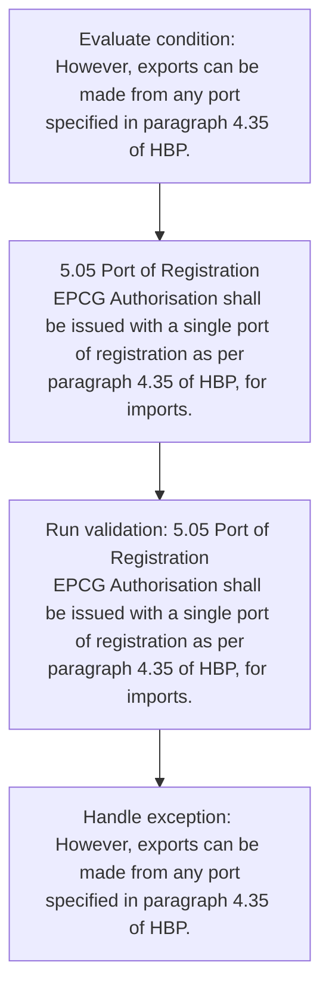
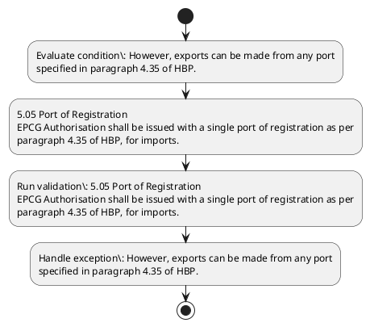

# Chapter 5 / Section 5.05: Port of Registration

**Chapter Title:** Export Promotion Capital Goods (EPCG) Scheme

**Pages:** 3

**Purpose:** 5.05 Port of Registration
EPCG Authorisation shall be issued with a single port of registration as per
paragraph 4.35 of HBP, for imports.

**Purpose Thanglish:** Indha Port of Registration section-la, 5.05 Port of Registration
EPCG Authorisation kandippa be issued with a single port of registration as per
paragraph 4.35 of HBP, for imports.

**Summary:** 5.05 Port of Registration
EPCG Authorisation shall be issued with a single port of registration as per
paragraph 4.35 of HBP, for imports. However, exports can be made from any port
specified in paragraph 4.35 of HBP.

**Business Meaning:** Port of Registration governs how DGFT business controls should be applied, validated, and enforced.

**Business Explanation:** Port of Registration explains the operating rule set that DEKAI should enforce. Key control points include 5.05 Port of Registration
EPCG Authorisation shall be issued with a single port of registration as per
paragraph 4.35 of HBP, for imports. The section also drives actions such as 5.05 Port of Registration
EPCG Authorisation shall be issued with a single port of registration as per
paragraph 4.35 of HBP, for imports..

**Business Explanation Thanglish:** Indha Port of Registration section-la, Port of Registration explains the operating rule set that DEKAI should enforce. Key control points include 5.05 Port of Registration
EPCG Authorisation kandippa be issued with a single port of registration as per
paragraph 4.35 of HBP, for imports. The section also drives actions such as 5.05 Port of Registration
EPCG Authorisation kandippa be issued with a single port of registration as per
paragraph 4.35 of HBP, for imports..

## Business Logic
- 5.05 Port of Registration
EPCG Authorisation shall be issued with a single port of registration as per
paragraph 4.35 of HBP, for imports.

## Business Rules
- rule_id=CH5-SEC5_05-R001, rule_description=5.05 Port of Registration
EPCG Authorisation shall be issued with a single port of registration as per
paragraph 4.35 of HBP, for imports., trigger=Port of Registration, condition=However, exports can be made from any port
specified in paragraph 4.35 of HBP., validation=5.05 Port of Registration
EPCG Authorisation shall be issued with a single port of registration as per
paragraph 4.35 of HBP, for imports., action=5.05 Port of Registration
EPCG Authorisation shall be issued with a single port of registration as per
paragraph 4.35 of HBP, for imports., exception=However, exports can be made from any port
specified in paragraph 4.35 of HBP., output=DEKAI should produce a compliance decision for 5.05 - Port of Registration.

## Conditions
- However, exports can be made from any port
specified in paragraph 4.35 of HBP.

## Condition Logic
- id=5.5.05.1, if=However, exports can be made from any port
specified in paragraph 4.35 of HBP., then=5.05 Port of Registration
EPCG Authorisation shall be issued with a single port of registration as per
paragraph 4.35 of HBP, for imports., source=However, exports can be made from any port
specified in paragraph 4.35 of HBP.

## Validations
- 5.05 Port of Registration
EPCG Authorisation shall be issued with a single port of registration as per
paragraph 4.35 of HBP, for imports.

## Exceptions
- However, exports can be made from any port
specified in paragraph 4.35 of HBP.

## Dependencies
- 4.35

## Authorities
- None identified

## Required Documents
- None identified

## Timelines
- None identified

## Actions
- 5.05 Port of Registration
EPCG Authorisation shall be issued with a single port of registration as per
paragraph 4.35 of HBP, for imports.

## Workflow
- Evaluate condition: However, exports can be made from any port
specified in paragraph 4.35 of HBP.
- 5.05 Port of Registration
EPCG Authorisation shall be issued with a single port of registration as per
paragraph 4.35 of HBP, for imports.
- Run validation: 5.05 Port of Registration
EPCG Authorisation shall be issued with a single port of registration as per
paragraph 4.35 of HBP, for imports.
- Handle exception: However, exports can be made from any port
specified in paragraph 4.35 of HBP.

## Workflow ASCII
```text
Port of Registration
Evaluate condition: However, exports can be made from any port
specified in paragraph 4.35 of HBP.
   |
   v
5.05 Port of Registration
EPCG Authorisation shall be issued with a single port of registration as per
paragraph 4.35 of HBP, for imports.
   |
   v
Run validation: 5.05 Port of Registration
EPCG Authorisation shall be issued with a single port of registration as per
paragraph 4.35 of HBP, for imports.
   |
   v
Handle exception: However, exports can be made from any port
specified in paragraph 4.35 of HBP.
```

## Decision Tree
- IF However, exports can be made from any port
specified in paragraph 4.35 of HBP. THEN 5.05 Port of Registration
EPCG Authorisation shall be issued with a single port of registration as per
paragraph 4.35 of HBP, for imports.
- IF exception applies (However, exports can be made from any port
specified in paragraph 4.35 of HBP.) THEN route to manual review

## Decision Tree ASCII
```text
Port of Registration Decision
IF However, exports can be made from any port
specified in paragraph 4.35 of HBP. THEN 5.05 Port of Registration
EPCG Authorisation shall be issued with a single port of registration as per
paragraph 4.35 of HBP, for imports.
   |
   v
IF exception applies (However, exports can be made from any port
specified in paragraph 4.35 of HBP.) THEN route to manual review
```

## Examples
- User asks to process Port of Registration; the platform checks conditions, validations, and documents before action.

**Real-world Example:** Example: an importer or exporter invokes Port of Registration, submits the prescribed DGFT records, and DEKAI uses the extracted rules to 5.05 port of registration
epcg authorisation shall be issued with a single port of registration as per
paragraph 4.35 of hbp, for imports..

**Real-world Example Thanglish:** Indha Port of Registration section-la, Example: an importer or exporter invokes Port of Registration, submits the prescribed DGFT records, and DEKAI uses the extracted rules to 5.05 port of registration
epcg authorisation kandippa be issued with a single port of registration as per
paragraph 4.35 of hbp, for imports..

## AI Rules
- IF detected context matches section rule THEN enforce: 5.05 Port of Registration
EPCG Authorisation shall be issued with a single port of registration as per
paragraph 4.35 of HBP, for imports.
- IF validations pass THEN recommend action: 5.05 Port of Registration
EPCG Authorisation shall be issued with a single port of registration as per
paragraph 4.35 of HBP, for imports.

## Database Fields
- name=section_code, type=string, required=True, source=parsed_section_heading
- name=section_title, type=string, required=True, source=parsed_section_heading
- name=per_flag, type=boolean, required=False, source=keyword:per
- name=hbp_flag, type=boolean, required=False, source=keyword:HBP
- name=for_flag, type=boolean, required=False, source=keyword:for
- name=can_flag, type=boolean, required=False, source=keyword:can
- name=any_flag, type=boolean, required=False, source=keyword:any
- name=port_flag, type=boolean, required=False, source=keyword:Port
- name=epcg_flag, type=boolean, required=False, source=keyword:EPCG
- name=with_flag, type=boolean, required=False, source=keyword:with

## API Requirements
- method=GET, path=/api/dgft/sections/5.05, purpose=Retrieve knowledge payload for section 5.05, query_params=['include=workflow,decision_tree,validations'], response_fields=['section', 'title', 'summary', 'conditions', 'validations', 'exceptions', 'workflow', 'decision_tree']
- method=POST, path=/api/dgft/Port-of-Registration/validate, purpose=Validate inputs and documents for Port of Registration, request_fields=['section_code', 'section_title'], response_fields=['status', 'errors', 'warnings', 'next_actions']
- method=POST, path=/api/dgft/Port-of-Registration/execute, purpose=Trigger business action for 5.05 Port of Registration
EPCG Authorisation shall be issued with a single port of registration as per
paragraph 4.35 of HBP, for imports., request_fields=['section_code', 'section_title'], response_fields=['reference_id', 'status', 'authority', 'timeline']

## UI Screens
- screen_id=Port_of_Registration_overview, name=Port of Registration Overview, purpose=Show section summary, authority, timeline, and eligibility cues., widgets=['summary_card', 'conditions_table', 'authority_badges', 'timeline_panel']
- screen_id=Port_of_Registration_submission, name=Port of Registration Submission, purpose=Capture applicant data and supporting documents., widgets=['dynamic_form', 'document_uploader', 'validation_panel', 'next_action_footer'], fields=['section_code', 'section_title', 'per_flag', 'hbp_flag', 'for_flag', 'can_flag', 'any_flag', 'port_flag']
- screen_id=Port_of_Registration_exceptions, name=Port of Registration Exception Review, purpose=Explain exception handling and manual review triggers., widgets=['exception_banner', 'decision_tree', 'case_notes']

## Error Messages
- Validation failed because the section requirements were not fully met.

## FAQ
- question_en=What is the purpose of section 5.05?, answer_en=Port of Registration explains the operating rule set that DEKAI should enforce. Key control points include 5.05 Port of Registration
EPCG Authorisation shall be issued with a single port of registration as per
paragraph 4.35 of HBP, for imports. The section also drives actions such as 5.05 Port of Registration
EPCG Authorisation shall be issued with a single port of registration as per
paragraph 4.35 of HBP, for imports.., question_thanglish=Indha Port of Registration section-la, What is the purpose of section 5.05?, answer_thanglish=Indha Port of Registration section-la, Port of Registration explains the operating rule set that DEKAI should enforce. Key control points include 5.05 Port of Registration
EPCG Authorisation kandippa be issued with a single port of registration as per
paragraph 4.35 of HBP, for imports. The section also drives actions such as 5.05 Port of Registration
EPCG Authorisation kandippa be issued with a single port of registration as per
paragraph 4.35 of HBP, for imports..
- question_en=What documents are required under Port of Registration?, answer_en=Not explicitly covered in uploaded documents., question_thanglish=Indha Port of Registration section-la, What documents are required under Port of Registration?, answer_thanglish=Indha Port of Registration section-la, Not explicitly covered in uploaded documents.
- question_en=Which authority handles Port of Registration?, answer_en=Not explicitly covered in uploaded documents., question_thanglish=Indha Port of Registration section-la, Which authority handles Port of Registration?, answer_thanglish=Indha Port of Registration section-la, Not explicitly covered in uploaded documents.

## Questions Users May Ask
- What does Port of Registration require?
- Which documents are needed for Port of Registration?
- How does DEKAI validate Port of Registration requests?
- What action should be taken for Port of Registration?

## Expected AI Answers
- Port of Registration requires the platform to interpret the section text, apply the extracted business rules, and present the correct next action.
- Required documents are inferred from the section text: no explicit documents were detected.
- DEKAI validates Port of Registration by checking conditions, required documents, authority references, and exception clauses before recommending an outcome.
- The primary extracted action is: 5.05 Port of Registration
EPCG Authorisation shall be issued with a single port of registration as per
paragraph 4.35 of HBP, for imports.

## AI Q&A Examples
- question_en=User asks: How do I comply with Port of Registration?, answer_en=AI answers: DEKAI should evaluate section 5.05, apply the extracted rules, and guide the user through Evaluate condition: However, exports can be made from any port
specified in paragraph 4.35 of HBP.., question_thanglish=Indha Port of Registration section-la, User asks: How do I comply with Port of Registration?, answer_thanglish=Indha Port of Registration section-la, AI answers: DEKAI should evaluate section 5.05, apply the extracted rules, and guide the user through Evaluate condition: However, exports can be made from any port
specified in paragraph 4.35 of HBP..
- question_en=User asks: Which validations apply to Port of Registration?, answer_en=AI answers: Applicable validations are 5.05 Port of Registration
EPCG Authorisation shall be issued with a single port of registration as per
paragraph 4.35 of HBP, for imports., question_thanglish=Indha Port of Registration section-la, User asks: Which validations apply to Port of Registration?, answer_thanglish=Indha Port of Registration section-la, AI answers: Applicable validations are 5.05 Port of Registration
EPCG Authorisation kandippa be issued with a single port of registration as per
paragraph 4.35 of HBP, for imports.

## DEKAI AI Implementation Notes
- Capture chapter 5, section 5.05, title, and page references as immutable knowledge metadata.
- Bind validations for Port of Registration into a rule engine keyed by the rule IDs extracted for this section.
- Trigger manual review when exception clauses are detected.

## DEKAI AI Implementation Notes Thanglish
- Indha Port of Registration section-la, Capture chapter 5, section 5.05, title, and page references as immutable knowledge metadata.
- Indha Port of Registration section-la, Bind validations for Port of Registration into a rule engine keyed by the rule IDs extracted for this section.
- Indha Port of Registration section-la, Trigger manual review when exception clauses are detected.

## AI Metadata
- Keywords: per, HBP, for, can, any, Port, EPCG, with, made, from, shall, issued, single, imports, However, exports, paragraph, specified, Registration, Authorisation
- Search Keywords: per, HBP, for, can, any, Port, EPCG, with, made, from, shall, issued, single, imports, However, exports, paragraph, specified, Registration, Authorisation
- Intent: Support Port of Registration processing and compliance validation.
- Tags: 5.05, Port of Registration, business-rule, dgft
- Related Sections: 
- Related Chapters: 
- Related Rules: 5.05 Port of Registration
EPCG Authorisation shall be issued with a single port of registration as per
paragraph 4.35 of HBP, for imports.

## Mermaid


## PlantUML

