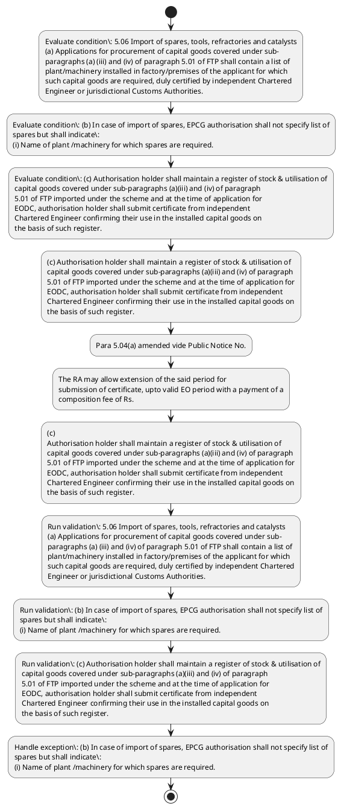

# Chapter 5 / Section 5.06: Import of spares, tools, refractories and catalysts

**Chapter Title:** Export Promotion Capital Goods (EPCG) Scheme

**Pages:** 3

**Purpose:** 5.06 Import of spares, tools, refractories and catalysts
(a) Applications for procurement of capital goods covered under sub-
paragraphs (a) (iii) and (iv) of paragraph 5.01 of FTP shall contain a list of
plant/machinery installed in factory/premises of the applicant for which
such capital goods are required, duly certified by independent Chartered
Engineer or jurisdictional Customs Authorities.

**Purpose Thanglish:** Indha Import of spares, tools, refractories and catalysts section-la, 5.06 import of spares, tools, refractories and catalysts
(a) Applications for procurement of capital goods covered under sub-
paragraphs (a) (iii) and (iv) of paragraph 5.01 of FTP kandippa contain a list of
plant/machinery installed in factory/premises of the applicant for which
such capital goods are required, duly certified by independent Chartered
Engineer or jurisdictional Customs Authorities.

**Summary:** 5.06 Import of spares, tools, refractories and catalysts
(a) Applications for procurement of capital goods covered under sub-
paragraphs (a) (iii) and (iv) of paragraph 5.01 of FTP shall contain a list of
plant/machinery installed in factory/premises of the applicant for which
such capital goods are required, duly certified by independent Chartered
Engineer or jurisdictional Customs Authorities. (b) In case of import of spares, EPCG authorisation shall not specify list of
spares but shall indicate:
(i) Name of plant /machinery for which spares are required. (ii) Value of duty saved allowed under the authorisation.

**Business Meaning:** Import of spares, tools, refractories and catalysts governs how DGFT business controls should be applied, validated, and enforced.

**Business Explanation:** Import of spares, tools, refractories and catalysts explains the operating rule set that DEKAI should enforce. Key control points include 5.06 Import of spares, tools, refractories and catalysts
(a) Applications for procurement of capital goods covered under sub-
paragraphs (a) (iii) and (iv) of paragraph 5.01 of FTP shall contain a list of
plant/machinery installed in factory/premises of the applicant for which
such capital goods are required, duly certified by independent Chartered
Engineer or jurisdictional Customs Authorities. The section also drives actions such as (c) Authorisation holder shall maintain a register of stock & utilisation of
capital goods covered under sub-paragraphs (a)(iii) and (iv) of paragraph
5.01 of FTP imported under the scheme and at the time of application for
EODC, authorisation holder shall submit certificate from independent
Chartered Engineer confirming their use in the installed capital goods on
the basis of such register..

**Business Explanation Thanglish:** Indha Import of spares, tools, refractories and catalysts section-la, import of spares, tools, refractories and catalysts explains the operating rule set that DEKAI should enforce. Key control points include 5.06 import of spares, tools, refractories and catalysts
(a) Applications for procurement of capital goods covered under sub-
paragraphs (a) (iii) and (iv) of paragraph 5.01 of FTP kandippa contain a list of
plant/machinery installed in factory/premises of the applicant for which
such capital goods are required, duly certified by independent Chartered
Engineer or jurisdictional Customs Authorities. The section also drives actions such as (c) Authorisation holder kandippa maintain a register of stock & utilisation of
capital goods covered under sub-paragraphs (a)(iii) and (iv) of paragraph
5.01 of FTP imported under the scheme and at the time of application for
EODC, authorisation holder kandippa submit certificate from independent
Chartered Engineer confirming their use in the installed capital goods on
the basis of such register..

## Business Logic
- 5.06 Import of spares, tools, refractories and catalysts
(a) Applications for procurement of capital goods covered under sub-
paragraphs (a) (iii) and (iv) of paragraph 5.01 of FTP shall contain a list of
plant/machinery installed in factory/premises of the applicant for which
such capital goods are required, duly certified by independent Chartered
Engineer or jurisdictional Customs Authorities.
- (b) In case of import of spares, EPCG authorisation shall not specify list of
spares but shall indicate:
(i) Name of plant /machinery for which spares are required.
- (c) Authorisation holder shall maintain a register of stock & utilisation of
capital goods covered under sub-paragraphs (a)(iii) and (iv) of paragraph
5.01 of FTP imported under the scheme and at the time of application for
EODC, authorisation holder shall submit certificate from independent
Chartered Engineer confirming their use in the installed capital goods on
the basis of such register.
- Where
the authorisation holder opts for independent Chartered Engineer’s
certificate, he shall send a copy of the certificate to the jurisdictional
Customs Authority for intimation/record.
- The authorization holder shall be
permitted to shift capital goods during the entire export obligation period
to other units mentioned in the IEC and RCMC of the authorization holder
subject to production of fresh installation certificate to the RA concerned
within six months of the shifting.
- 5.06 Import of spares, tools, refractories and catalysts
(a)
Applications for procurement of capital goods covered under sub-
paragraphs (a) (iii) and (iv) of paragraph 5.01 of FTP shall contain a list of
plant/machinery installed in factory/premises of the applicant for which
such capital goods are required, duly certified by independent Chartered
Engineer or jurisdictional Customs Authorities.
- (b)
In case of import of spares, EPCG authorisation shall not specify list of
spares but shall indicate:
(i)
Name of plant /machinery for which spares are required.
- (c)
Authorisation holder shall maintain a register of stock & utilisation of
capital goods covered under sub-paragraphs (a)(iii) and (iv) of paragraph
5.01 of FTP imported under the scheme and at the time of application for
EODC, authorisation holder shall submit certificate from independent
Chartered Engineer confirming their use in the installed capital goods on
the basis of such register.

## Business Rules
- rule_id=CH5-SEC5_06-R001, rule_description=5.06 Import of spares, tools, refractories and catalysts
(a) Applications for procurement of capital goods covered under sub-
paragraphs (a) (iii) and (iv) of paragraph 5.01 of FTP shall contain a list of
plant/machinery installed in factory/premises of the applicant for which
such capital goods are required, duly certified by independent Chartered
Engineer or jurisdictional Customs Authorities., trigger=Import of spares, tools, refractories and catalysts, condition=5.06 Import of spares, tools, refractories and catalysts
(a) Applications for procurement of capital goods covered under sub-
paragraphs (a) (iii) and (iv) of paragraph 5.01 of FTP shall contain a list of
plant/machinery installed in factory/premises of the applicant for which
such capital goods are required, duly certified by independent Chartered
Engineer or jurisdictional Customs Authorities., validation=5.06 Import of spares, tools, refractories and catalysts
(a) Applications for procurement of capital goods covered under sub-
paragraphs (a) (iii) and (iv) of paragraph 5.01 of FTP shall contain a list of
plant/machinery installed in factory/premises of the applicant for which
such capital goods are required, duly certified by independent Chartered
Engineer or jurisdictional Customs Authorities., action=(c) Authorisation holder shall maintain a register of stock & utilisation of
capital goods covered under sub-paragraphs (a)(iii) and (iv) of paragraph
5.01 of FTP imported under the scheme and at the time of application for
EODC, authorisation holder shall submit certificate from independent
Chartered Engineer confirming their use in the installed capital goods on
the basis of such register., exception=(b) In case of import of spares, EPCG authorisation shall not specify list of
spares but shall indicate:
(i) Name of plant /machinery for which spares are required., output=DEKAI should produce a compliance decision for 5.06 - Import of spares, tools, refractories and catalysts.
- rule_id=CH5-SEC5_06-R002, rule_description=(b) In case of import of spares, EPCG authorisation shall not specify list of
spares but shall indicate:
(i) Name of plant /machinery for which spares are required., trigger=Import of spares, tools, refractories and catalysts, condition=(b) In case of import of spares, EPCG authorisation shall not specify list of
spares but shall indicate:
(i) Name of plant /machinery for which spares are required., validation=(b) In case of import of spares, EPCG authorisation shall not specify list of
spares but shall indicate:
(i) Name of plant /machinery for which spares are required., action=Para 5.04(a) amended vide Public Notice No., exception=(b)
In case of import of spares, EPCG authorisation shall not specify list of
spares but shall indicate:
(i)
Name of plant /machinery for which spares are required., output=DEKAI should produce a compliance decision for 5.06 - Import of spares, tools, refractories and catalysts.
- rule_id=CH5-SEC5_06-R003, rule_description=(c) Authorisation holder shall maintain a register of stock & utilisation of
capital goods covered under sub-paragraphs (a)(iii) and (iv) of paragraph
5.01 of FTP imported under the scheme and at the time of application for
EODC, authorisation holder shall submit certificate from independent
Chartered Engineer confirming their use in the installed capital goods on
the basis of such register., trigger=Import of spares, tools, refractories and catalysts, condition=(c) Authorisation holder shall maintain a register of stock & utilisation of
capital goods covered under sub-paragraphs (a)(iii) and (iv) of paragraph
5.01 of FTP imported under the scheme and at the time of application for
EODC, authorisation holder shall submit certificate from independent
Chartered Engineer confirming their use in the installed capital goods on
the basis of such register., validation=(c) Authorisation holder shall maintain a register of stock & utilisation of
capital goods covered under sub-paragraphs (a)(iii) and (iv) of paragraph
5.01 of FTP imported under the scheme and at the time of application for
EODC, authorisation holder shall submit certificate from independent
Chartered Engineer confirming their use in the installed capital goods on
the basis of such register., action=The RA may allow extension of the said period for
submission of certificate, upto valid EO period with a payment of a
composition fee of Rs., exception=(b)
In case of import of spares, EPCG authorisation shall not specify list of
spares but shall indicate:
(i)
Name of plant /machinery for which spares are required., output=DEKAI should produce a compliance decision for 5.06 - Import of spares, tools, refractories and catalysts.
- rule_id=CH5-SEC5_06-R004, rule_description=Where
the authorisation holder opts for independent Chartered Engineer’s
certificate, he shall send a copy of the certificate to the jurisdictional
Customs Authority for intimation/record., trigger=Import of spares, tools, refractories and catalysts, condition=The RA may allow extension of the said period for
submission of certificate, upto valid EO period with a payment of a
composition fee of Rs., validation=Where
the authorisation holder opts for independent Chartered Engineer’s
certificate, he shall send a copy of the certificate to the jurisdictional
Customs Authority for intimation/record., action=(c)
Authorisation holder shall maintain a register of stock & utilisation of
capital goods covered under sub-paragraphs (a)(iii) and (iv) of paragraph
5.01 of FTP imported under the scheme and at the time of application for
EODC, authorisation holder shall submit certificate from independent
Chartered Engineer confirming their use in the installed capital goods on
the basis of such register., exception=(b)
In case of import of spares, EPCG authorisation shall not specify list of
spares but shall indicate:
(i)
Name of plant /machinery for which spares are required., output=DEKAI should produce a compliance decision for 5.06 - Import of spares, tools, refractories and catalysts.
- rule_id=CH5-SEC5_06-R005, rule_description=The authorization holder shall be
permitted to shift capital goods during the entire export obligation period
to other units mentioned in the IEC and RCMC of the authorization holder
subject to production of fresh installation certificate to the RA concerned
within six months of the shifting., trigger=Import of spares, tools, refractories and catalysts, condition=Where
the authorisation holder opts for independent Chartered Engineer’s
certificate, he shall send a copy of the certificate to the jurisdictional
Customs Authority for intimation/record., validation=The authorization holder shall be
permitted to shift capital goods during the entire export obligation period
to other units mentioned in the IEC and RCMC of the authorization holder
subject to production of fresh installation certificate to the RA concerned
within six months of the shifting., action=(c)
Authorisation holder shall maintain a register of stock & utilisation of
capital goods covered under sub-paragraphs (a)(iii) and (iv) of paragraph
5.01 of FTP imported under the scheme and at the time of application for
EODC, authorisation holder shall submit certificate from independent
Chartered Engineer confirming their use in the installed capital goods on
the basis of such register., exception=(b)
In case of import of spares, EPCG authorisation shall not specify list of
spares but shall indicate:
(i)
Name of plant /machinery for which spares are required., output=DEKAI should produce a compliance decision for 5.06 - Import of spares, tools, refractories and catalysts.
- rule_id=CH5-SEC5_06-R006, rule_description=5.06 Import of spares, tools, refractories and catalysts
(a)
Applications for procurement of capital goods covered under sub-
paragraphs (a) (iii) and (iv) of paragraph 5.01 of FTP shall contain a list of
plant/machinery installed in factory/premises of the applicant for which
such capital goods are required, duly certified by independent Chartered
Engineer or jurisdictional Customs Authorities., trigger=Import of spares, tools, refractories and catalysts, condition=The authorization holder shall be
permitted to shift capital goods during the entire export obligation period
to other units mentioned in the IEC and RCMC of the authorization holder
subject to production of fresh installation certificate to the RA concerned
within six months of the shifting., validation=5.06 Import of spares, tools, refractories and catalysts
(a)
Applications for procurement of capital goods covered under sub-
paragraphs (a) (iii) and (iv) of paragraph 5.01 of FTP shall contain a list of
plant/machinery installed in factory/premises of the applicant for which
such capital goods are required, duly certified by independent Chartered
Engineer or jurisdictional Customs Authorities., action=(c)
Authorisation holder shall maintain a register of stock & utilisation of
capital goods covered under sub-paragraphs (a)(iii) and (iv) of paragraph
5.01 of FTP imported under the scheme and at the time of application for
EODC, authorisation holder shall submit certificate from independent
Chartered Engineer confirming their use in the installed capital goods on
the basis of such register., exception=(b)
In case of import of spares, EPCG authorisation shall not specify list of
spares but shall indicate:
(i)
Name of plant /machinery for which spares are required., output=DEKAI should produce a compliance decision for 5.06 - Import of spares, tools, refractories and catalysts.
- rule_id=CH5-SEC5_06-R007, rule_description=(b)
In case of import of spares, EPCG authorisation shall not specify list of
spares but shall indicate:
(i)
Name of plant /machinery for which spares are required., trigger=Import of spares, tools, refractories and catalysts, condition=5.06 Import of spares, tools, refractories and catalysts
(a)
Applications for procurement of capital goods covered under sub-
paragraphs (a) (iii) and (iv) of paragraph 5.01 of FTP shall contain a list of
plant/machinery installed in factory/premises of the applicant for which
such capital goods are required, duly certified by independent Chartered
Engineer or jurisdictional Customs Authorities., validation=(b)
In case of import of spares, EPCG authorisation shall not specify list of
spares but shall indicate:
(i)
Name of plant /machinery for which spares are required., action=(c)
Authorisation holder shall maintain a register of stock & utilisation of
capital goods covered under sub-paragraphs (a)(iii) and (iv) of paragraph
5.01 of FTP imported under the scheme and at the time of application for
EODC, authorisation holder shall submit certificate from independent
Chartered Engineer confirming their use in the installed capital goods on
the basis of such register., exception=(b)
In case of import of spares, EPCG authorisation shall not specify list of
spares but shall indicate:
(i)
Name of plant /machinery for which spares are required., output=DEKAI should produce a compliance decision for 5.06 - Import of spares, tools, refractories and catalysts.
- rule_id=CH5-SEC5_06-R008, rule_description=(c)
Authorisation holder shall maintain a register of stock & utilisation of
capital goods covered under sub-paragraphs (a)(iii) and (iv) of paragraph
5.01 of FTP imported under the scheme and at the time of application for
EODC, authorisation holder shall submit certificate from independent
Chartered Engineer confirming their use in the installed capital goods on
the basis of such register., trigger=Import of spares, tools, refractories and catalysts, condition=(b)
In case of import of spares, EPCG authorisation shall not specify list of
spares but shall indicate:
(i)
Name of plant /machinery for which spares are required., validation=(c)
Authorisation holder shall maintain a register of stock & utilisation of
capital goods covered under sub-paragraphs (a)(iii) and (iv) of paragraph
5.01 of FTP imported under the scheme and at the time of application for
EODC, authorisation holder shall submit certificate from independent
Chartered Engineer confirming their use in the installed capital goods on
the basis of such register., action=(c)
Authorisation holder shall maintain a register of stock & utilisation of
capital goods covered under sub-paragraphs (a)(iii) and (iv) of paragraph
5.01 of FTP imported under the scheme and at the time of application for
EODC, authorisation holder shall submit certificate from independent
Chartered Engineer confirming their use in the installed capital goods on
the basis of such register., exception=(b)
In case of import of spares, EPCG authorisation shall not specify list of
spares but shall indicate:
(i)
Name of plant /machinery for which spares are required., output=DEKAI should produce a compliance decision for 5.06 - Import of spares, tools, refractories and catalysts.

## Conditions
- 5.06 Import of spares, tools, refractories and catalysts
(a) Applications for procurement of capital goods covered under sub-
paragraphs (a) (iii) and (iv) of paragraph 5.01 of FTP shall contain a list of
plant/machinery installed in factory/premises of the applicant for which
such capital goods are required, duly certified by independent Chartered
Engineer or jurisdictional Customs Authorities.
- (b) In case of import of spares, EPCG authorisation shall not specify list of
spares but shall indicate:
(i) Name of plant /machinery for which spares are required.
- (c) Authorisation holder shall maintain a register of stock & utilisation of
capital goods covered under sub-paragraphs (a)(iii) and (iv) of paragraph
5.01 of FTP imported under the scheme and at the time of application for
EODC, authorisation holder shall submit certificate from independent
Chartered Engineer confirming their use in the installed capital goods on
the basis of such register.
- The RA may allow extension of the said period for
submission of certificate, upto valid EO period with a payment of a
composition fee of Rs.
- Where
the authorisation holder opts for independent Chartered Engineer’s
certificate, he shall send a copy of the certificate to the jurisdictional
Customs Authority for intimation/record.
- The authorization holder shall be
permitted to shift capital goods during the entire export obligation period
to other units mentioned in the IEC and RCMC of the authorization holder
subject to production of fresh installation certificate to the RA concerned
within six months of the shifting.
- 5.06 Import of spares, tools, refractories and catalysts
(a)
Applications for procurement of capital goods covered under sub-
paragraphs (a) (iii) and (iv) of paragraph 5.01 of FTP shall contain a list of
plant/machinery installed in factory/premises of the applicant for which
such capital goods are required, duly certified by independent Chartered
Engineer or jurisdictional Customs Authorities.
- (b)
In case of import of spares, EPCG authorisation shall not specify list of
spares but shall indicate:
(i)
Name of plant /machinery for which spares are required.
- (c)
Authorisation holder shall maintain a register of stock & utilisation of
capital goods covered under sub-paragraphs (a)(iii) and (iv) of paragraph
5.01 of FTP imported under the scheme and at the time of application for
EODC, authorisation holder shall submit certificate from independent
Chartered Engineer confirming their use in the installed capital goods on
the basis of such register.

## Condition Logic
- id=5.5.06.1, if=5.06 Import of spares, tools, refractories and catalysts
(a) Applications for procurement of capital goods covered under sub-
paragraphs (a) (iii) and (iv) of paragraph 5.01 of FTP shall contain a list of
plant/machinery installed in factory/premises of the applicant for which
such capital goods are required, duly certified by independent Chartered
Engineer or jurisdictional Customs Authorities., then=(c) Authorisation holder shall maintain a register of stock & utilisation of
capital goods covered under sub-paragraphs (a)(iii) and (iv) of paragraph
5.01 of FTP imported under the scheme and at the time of application for
EODC, authorisation holder shall submit certificate from independent
Chartered Engineer confirming their use in the installed capital goods on
the basis of such register., source=5.06 Import of spares, tools, refractories and catalysts
(a) Applications for procurement of capital goods covered under sub-
paragraphs (a) (iii) and (iv) of paragraph 5.01 of FTP shall contain a list of
plant/machinery installed in factory/premises of the applicant for which
such capital goods are required, duly certified by independent Chartered
Engineer or jurisdictional Customs Authorities.
- id=5.5.06.2, if=(b) In case of import of spares, EPCG authorisation shall not specify list of
spares but shall indicate:
(i) Name of plant /machinery for which spares are required., then=(c) Authorisation holder shall maintain a register of stock & utilisation of
capital goods covered under sub-paragraphs (a)(iii) and (iv) of paragraph
5.01 of FTP imported under the scheme and at the time of application for
EODC, authorisation holder shall submit certificate from independent
Chartered Engineer confirming their use in the installed capital goods on
the basis of such register., source=(b) In case of import of spares, EPCG authorisation shall not specify list of
spares but shall indicate:
(i) Name of plant /machinery for which spares are required.
- id=5.5.06.3, if=(c) Authorisation holder shall maintain a register of stock & utilisation of
capital goods covered under sub-paragraphs (a)(iii) and (iv) of paragraph
5.01 of FTP imported under the scheme and at the time of application for
EODC, authorisation holder shall submit certificate from independent
Chartered Engineer confirming their use in the installed capital goods on
the basis of such register., then=(c) Authorisation holder shall maintain a register of stock & utilisation of
capital goods covered under sub-paragraphs (a)(iii) and (iv) of paragraph
5.01 of FTP imported under the scheme and at the time of application for
EODC, authorisation holder shall submit certificate from independent
Chartered Engineer confirming their use in the installed capital goods on
the basis of such register., source=(c) Authorisation holder shall maintain a register of stock & utilisation of
capital goods covered under sub-paragraphs (a)(iii) and (iv) of paragraph
5.01 of FTP imported under the scheme and at the time of application for
EODC, authorisation holder shall submit certificate from independent
Chartered Engineer confirming their use in the installed capital goods on
the basis of such register.
- id=5.5.06.4, if=The RA may allow extension of the said period for
submission of certificate, upto valid EO period with a payment of a
composition fee of Rs., then=(c) Authorisation holder shall maintain a register of stock & utilisation of
capital goods covered under sub-paragraphs (a)(iii) and (iv) of paragraph
5.01 of FTP imported under the scheme and at the time of application for
EODC, authorisation holder shall submit certificate from independent
Chartered Engineer confirming their use in the installed capital goods on
the basis of such register., source=The RA may allow extension of the said period for
submission of certificate, upto valid EO period with a payment of a
composition fee of Rs.
- id=5.5.06.5, if=Where
the authorisation holder opts for independent Chartered Engineer’s
certificate, he shall send a copy of the certificate to the jurisdictional
Customs Authority for intimation/record., then=(c) Authorisation holder shall maintain a register of stock & utilisation of
capital goods covered under sub-paragraphs (a)(iii) and (iv) of paragraph
5.01 of FTP imported under the scheme and at the time of application for
EODC, authorisation holder shall submit certificate from independent
Chartered Engineer confirming their use in the installed capital goods on
the basis of such register., source=Where
the authorisation holder opts for independent Chartered Engineer’s
certificate, he shall send a copy of the certificate to the jurisdictional
Customs Authority for intimation/record.
- id=5.5.06.6, if=The authorization holder shall be
permitted to shift capital goods during the entire export obligation period
to other units mentioned in the IEC and RCMC of the authorization holder
subject to production of fresh installation certificate to the RA concerned
within six months of the shifting., then=(c) Authorisation holder shall maintain a register of stock & utilisation of
capital goods covered under sub-paragraphs (a)(iii) and (iv) of paragraph
5.01 of FTP imported under the scheme and at the time of application for
EODC, authorisation holder shall submit certificate from independent
Chartered Engineer confirming their use in the installed capital goods on
the basis of such register., source=The authorization holder shall be
permitted to shift capital goods during the entire export obligation period
to other units mentioned in the IEC and RCMC of the authorization holder
subject to production of fresh installation certificate to the RA concerned
within six months of the shifting.
- id=5.5.06.7, if=5.06 Import of spares, tools, refractories and catalysts
(a)
Applications for procurement of capital goods covered under sub-
paragraphs (a) (iii) and (iv) of paragraph 5.01 of FTP shall contain a list of
plant/machinery installed in factory/premises of the applicant for which
such capital goods are required, duly certified by independent Chartered
Engineer or jurisdictional Customs Authorities., then=(c) Authorisation holder shall maintain a register of stock & utilisation of
capital goods covered under sub-paragraphs (a)(iii) and (iv) of paragraph
5.01 of FTP imported under the scheme and at the time of application for
EODC, authorisation holder shall submit certificate from independent
Chartered Engineer confirming their use in the installed capital goods on
the basis of such register., source=5.06 Import of spares, tools, refractories and catalysts
(a)
Applications for procurement of capital goods covered under sub-
paragraphs (a) (iii) and (iv) of paragraph 5.01 of FTP shall contain a list of
plant/machinery installed in factory/premises of the applicant for which
such capital goods are required, duly certified by independent Chartered
Engineer or jurisdictional Customs Authorities.
- id=5.5.06.8, if=(b)
In case of import of spares, EPCG authorisation shall not specify list of
spares but shall indicate:
(i)
Name of plant /machinery for which spares are required., then=(c) Authorisation holder shall maintain a register of stock & utilisation of
capital goods covered under sub-paragraphs (a)(iii) and (iv) of paragraph
5.01 of FTP imported under the scheme and at the time of application for
EODC, authorisation holder shall submit certificate from independent
Chartered Engineer confirming their use in the installed capital goods on
the basis of such register., source=(b)
In case of import of spares, EPCG authorisation shall not specify list of
spares but shall indicate:
(i)
Name of plant /machinery for which spares are required.
- id=5.5.06.9, if=(c)
Authorisation holder shall maintain a register of stock & utilisation of
capital goods covered under sub-paragraphs (a)(iii) and (iv) of paragraph
5.01 of FTP imported under the scheme and at the time of application for
EODC, authorisation holder shall submit certificate from independent
Chartered Engineer confirming their use in the installed capital goods on
the basis of such register., then=(c) Authorisation holder shall maintain a register of stock & utilisation of
capital goods covered under sub-paragraphs (a)(iii) and (iv) of paragraph
5.01 of FTP imported under the scheme and at the time of application for
EODC, authorisation holder shall submit certificate from independent
Chartered Engineer confirming their use in the installed capital goods on
the basis of such register., source=(c)
Authorisation holder shall maintain a register of stock & utilisation of
capital goods covered under sub-paragraphs (a)(iii) and (iv) of paragraph
5.01 of FTP imported under the scheme and at the time of application for
EODC, authorisation holder shall submit certificate from independent
Chartered Engineer confirming their use in the installed capital goods on
the basis of such register.

## Validations
- 5.06 Import of spares, tools, refractories and catalysts
(a) Applications for procurement of capital goods covered under sub-
paragraphs (a) (iii) and (iv) of paragraph 5.01 of FTP shall contain a list of
plant/machinery installed in factory/premises of the applicant for which
such capital goods are required, duly certified by independent Chartered
Engineer or jurisdictional Customs Authorities.
- (b) In case of import of spares, EPCG authorisation shall not specify list of
spares but shall indicate:
(i) Name of plant /machinery for which spares are required.
- (c) Authorisation holder shall maintain a register of stock & utilisation of
capital goods covered under sub-paragraphs (a)(iii) and (iv) of paragraph
5.01 of FTP imported under the scheme and at the time of application for
EODC, authorisation holder shall submit certificate from independent
Chartered Engineer confirming their use in the installed capital goods on
the basis of such register.
- Where
the authorisation holder opts for independent Chartered Engineer’s
certificate, he shall send a copy of the certificate to the jurisdictional
Customs Authority for intimation/record.
- The authorization holder shall be
permitted to shift capital goods during the entire export obligation period
to other units mentioned in the IEC and RCMC of the authorization holder
subject to production of fresh installation certificate to the RA concerned
within six months of the shifting.
- 5.06 Import of spares, tools, refractories and catalysts
(a)
Applications for procurement of capital goods covered under sub-
paragraphs (a) (iii) and (iv) of paragraph 5.01 of FTP shall contain a list of
plant/machinery installed in factory/premises of the applicant for which
such capital goods are required, duly certified by independent Chartered
Engineer or jurisdictional Customs Authorities.
- (b)
In case of import of spares, EPCG authorisation shall not specify list of
spares but shall indicate:
(i)
Name of plant /machinery for which spares are required.
- (c)
Authorisation holder shall maintain a register of stock & utilisation of
capital goods covered under sub-paragraphs (a)(iii) and (iv) of paragraph
5.01 of FTP imported under the scheme and at the time of application for
EODC, authorisation holder shall submit certificate from independent
Chartered Engineer confirming their use in the installed capital goods on
the basis of such register.

## Exceptions
- (b) In case of import of spares, EPCG authorisation shall not specify list of
spares but shall indicate:
(i) Name of plant /machinery for which spares are required.
- (b)
In case of import of spares, EPCG authorisation shall not specify list of
spares but shall indicate:
(i)
Name of plant /machinery for which spares are required.

## Dependencies
- 5.01
- 5.04
- 5.07

## Authorities
- Customs
- Engineer or jurisdictional Customs Authorities
- RA
- The RA
- Customs Authority

## Required Documents
- 5.06 Import of spares, tools, refractories and catalysts
(a) Applications for procurement of capital goods covered under sub-
paragraphs (a) (iii) and (iv) of paragraph 5.01 of FTP shall contain a list of
plant/machinery installed in factory/premises of the applicant for which
such capital goods are required, duly certified by independent Chartered
Engineer or jurisdictional Customs Authorities.
- (c) Authorisation holder shall maintain a register of stock & utilisation of
capital goods covered under sub-paragraphs (a)(iii) and (iv) of paragraph
5.01 of FTP imported under the scheme and at the time of application for
EODC, authorisation holder shall submit certificate from independent
Chartered Engineer confirming their use in the installed capital goods on
the basis of such register.
- The RA may allow extension of the said period for
submission of certificate, upto valid EO period with a payment of a
composition fee of Rs.
- Where
the authorisation holder opts for independent Chartered Engineer’s
certificate, he shall send a copy of the certificate to the jurisdictional
Customs Authority for intimation/record.
- The authorization holder shall be
permitted to shift capital goods during the entire export obligation period
to other units mentioned in the IEC and RCMC of the authorization holder
subject to production of fresh installation certificate to the RA concerned
within six months of the shifting.
- 5.06 Import of spares, tools, refractories and catalysts
(a)
Applications for procurement of capital goods covered under sub-
paragraphs (a) (iii) and (iv) of paragraph 5.01 of FTP shall contain a list of
plant/machinery installed in factory/premises of the applicant for which
such capital goods are required, duly certified by independent Chartered
Engineer or jurisdictional Customs Authorities.
- (c)
Authorisation holder shall maintain a register of stock & utilisation of
capital goods covered under sub-paragraphs (a)(iii) and (iv) of paragraph
5.01 of FTP imported under the scheme and at the time of application for
EODC, authorisation holder shall submit certificate from independent
Chartered Engineer confirming their use in the installed capital goods on
the basis of such register.

## Timelines
- The authorization holder shall be
permitted to shift capital goods during the entire export obligation period
to other units mentioned in the IEC and RCMC of the authorization holder
subject to production of fresh installation certificate to the RA concerned
within six months of the shifting.

## Actions
- (c) Authorisation holder shall maintain a register of stock & utilisation of
capital goods covered under sub-paragraphs (a)(iii) and (iv) of paragraph
5.01 of FTP imported under the scheme and at the time of application for
EODC, authorisation holder shall submit certificate from independent
Chartered Engineer confirming their use in the installed capital goods on
the basis of such register.
- Para 5.04(a) amended vide Public Notice No.
- The RA may allow extension of the said period for
submission of certificate, upto valid EO period with a payment of a
composition fee of Rs.
- (c)
Authorisation holder shall maintain a register of stock & utilisation of
capital goods covered under sub-paragraphs (a)(iii) and (iv) of paragraph
5.01 of FTP imported under the scheme and at the time of application for
EODC, authorisation holder shall submit certificate from independent
Chartered Engineer confirming their use in the installed capital goods on
the basis of such register.

## Workflow
- Evaluate condition: 5.06 Import of spares, tools, refractories and catalysts
(a) Applications for procurement of capital goods covered under sub-
paragraphs (a) (iii) and (iv) of paragraph 5.01 of FTP shall contain a list of
plant/machinery installed in factory/premises of the applicant for which
such capital goods are required, duly certified by independent Chartered
Engineer or jurisdictional Customs Authorities.
- Evaluate condition: (b) In case of import of spares, EPCG authorisation shall not specify list of
spares but shall indicate:
(i) Name of plant /machinery for which spares are required.
- Evaluate condition: (c) Authorisation holder shall maintain a register of stock & utilisation of
capital goods covered under sub-paragraphs (a)(iii) and (iv) of paragraph
5.01 of FTP imported under the scheme and at the time of application for
EODC, authorisation holder shall submit certificate from independent
Chartered Engineer confirming their use in the installed capital goods on
the basis of such register.
- (c) Authorisation holder shall maintain a register of stock & utilisation of
capital goods covered under sub-paragraphs (a)(iii) and (iv) of paragraph
5.01 of FTP imported under the scheme and at the time of application for
EODC, authorisation holder shall submit certificate from independent
Chartered Engineer confirming their use in the installed capital goods on
the basis of such register.
- Para 5.04(a) amended vide Public Notice No.
- The RA may allow extension of the said period for
submission of certificate, upto valid EO period with a payment of a
composition fee of Rs.
- (c)
Authorisation holder shall maintain a register of stock & utilisation of
capital goods covered under sub-paragraphs (a)(iii) and (iv) of paragraph
5.01 of FTP imported under the scheme and at the time of application for
EODC, authorisation holder shall submit certificate from independent
Chartered Engineer confirming their use in the installed capital goods on
the basis of such register.
- Run validation: 5.06 Import of spares, tools, refractories and catalysts
(a) Applications for procurement of capital goods covered under sub-
paragraphs (a) (iii) and (iv) of paragraph 5.01 of FTP shall contain a list of
plant/machinery installed in factory/premises of the applicant for which
such capital goods are required, duly certified by independent Chartered
Engineer or jurisdictional Customs Authorities.
- Run validation: (b) In case of import of spares, EPCG authorisation shall not specify list of
spares but shall indicate:
(i) Name of plant /machinery for which spares are required.
- Run validation: (c) Authorisation holder shall maintain a register of stock & utilisation of
capital goods covered under sub-paragraphs (a)(iii) and (iv) of paragraph
5.01 of FTP imported under the scheme and at the time of application for
EODC, authorisation holder shall submit certificate from independent
Chartered Engineer confirming their use in the installed capital goods on
the basis of such register.
- Handle exception: (b) In case of import of spares, EPCG authorisation shall not specify list of
spares but shall indicate:
(i) Name of plant /machinery for which spares are required.

## Workflow ASCII
```text
Import of spares, tools, refractories and catalysts
Evaluate condition: 5.06 Import of spares, tools, refractories and catalysts
(a) Applications for procurement of capital goods covered under sub-
paragraphs (a) (iii) and (iv) of paragraph 5.01 of FTP shall contain a list of
plant/machinery installed in factory/premises of the applicant for which
such capital goods are required, duly certified by independent Chartered
Engineer or jurisdictional Customs Authorities.
   |
   v
Evaluate condition: (b) In case of import of spares, EPCG authorisation shall not specify list of
spares but shall indicate:
(i) Name of plant /machinery for which spares are required.
   |
   v
Evaluate condition: (c) Authorisation holder shall maintain a register of stock & utilisation of
capital goods covered under sub-paragraphs (a)(iii) and (iv) of paragraph
5.01 of FTP imported under the scheme and at the time of application for
EODC, authorisation holder shall submit certificate from independent
Chartered Engineer confirming their use in the installed capital goods on
the basis of such register.
   |
   v
(c) Authorisation holder shall maintain a register of stock & utilisation of
capital goods covered under sub-paragraphs (a)(iii) and (iv) of paragraph
5.01 of FTP imported under the scheme and at the time of application for
EODC, authorisation holder shall submit certificate from independent
Chartered Engineer confirming their use in the installed capital goods on
the basis of such register.
   |
   v
Para 5.04(a) amended vide Public Notice No.
   |
   v
The RA may allow extension of the said period for
submission of certificate, upto valid EO period with a payment of a
composition fee of Rs.
   |
   v
(c)
Authorisation holder shall maintain a register of stock & utilisation of
capital goods covered under sub-paragraphs (a)(iii) and (iv) of paragraph
5.01 of FTP imported under the scheme and at the time of application for
EODC, authorisation holder shall submit certificate from independent
Chartered Engineer confirming their use in the installed capital goods on
the basis of such register.
   |
   v
Run validation: 5.06 Import of spares, tools, refractories and catalysts
(a) Applications for procurement of capital goods covered under sub-
paragraphs (a) (iii) and (iv) of paragraph 5.01 of FTP shall contain a list of
plant/machinery installed in factory/premises of the applicant for which
such capital goods are required, duly certified by independent Chartered
Engineer or jurisdictional Customs Authorities.
   |
   v
Run validation: (b) In case of import of spares, EPCG authorisation shall not specify list of
spares but shall indicate:
(i) Name of plant /machinery for which spares are required.
   |
   v
Run validation: (c) Authorisation holder shall maintain a register of stock & utilisation of
capital goods covered under sub-paragraphs (a)(iii) and (iv) of paragraph
5.01 of FTP imported under the scheme and at the time of application for
EODC, authorisation holder shall submit certificate from independent
Chartered Engineer confirming their use in the installed capital goods on
the basis of such register.
   |
   v
Handle exception: (b) In case of import of spares, EPCG authorisation shall not specify list of
spares but shall indicate:
(i) Name of plant /machinery for which spares are required.
```

## Decision Tree
- IF 5.06 Import of spares, tools, refractories and catalysts
(a) Applications for procurement of capital goods covered under sub-
paragraphs (a) (iii) and (iv) of paragraph 5.01 of FTP shall contain a list of
plant/machinery installed in factory/premises of the applicant for which
such capital goods are required, duly certified by independent Chartered
Engineer or jurisdictional Customs Authorities. THEN (c) Authorisation holder shall maintain a register of stock & utilisation of
capital goods covered under sub-paragraphs (a)(iii) and (iv) of paragraph
5.01 of FTP imported under the scheme and at the time of application for
EODC, authorisation holder shall submit certificate from independent
Chartered Engineer confirming their use in the installed capital goods on
the basis of such register.
- IF (b) In case of import of spares, EPCG authorisation shall not specify list of
spares but shall indicate:
(i) Name of plant /machinery for which spares are required. THEN (c) Authorisation holder shall maintain a register of stock & utilisation of
capital goods covered under sub-paragraphs (a)(iii) and (iv) of paragraph
5.01 of FTP imported under the scheme and at the time of application for
EODC, authorisation holder shall submit certificate from independent
Chartered Engineer confirming their use in the installed capital goods on
the basis of such register.
- IF (c) Authorisation holder shall maintain a register of stock & utilisation of
capital goods covered under sub-paragraphs (a)(iii) and (iv) of paragraph
5.01 of FTP imported under the scheme and at the time of application for
EODC, authorisation holder shall submit certificate from independent
Chartered Engineer confirming their use in the installed capital goods on
the basis of such register. THEN (c) Authorisation holder shall maintain a register of stock & utilisation of
capital goods covered under sub-paragraphs (a)(iii) and (iv) of paragraph
5.01 of FTP imported under the scheme and at the time of application for
EODC, authorisation holder shall submit certificate from independent
Chartered Engineer confirming their use in the installed capital goods on
the basis of such register.
- IF The RA may allow extension of the said period for
submission of certificate, upto valid EO period with a payment of a
composition fee of Rs. THEN (c) Authorisation holder shall maintain a register of stock & utilisation of
capital goods covered under sub-paragraphs (a)(iii) and (iv) of paragraph
5.01 of FTP imported under the scheme and at the time of application for
EODC, authorisation holder shall submit certificate from independent
Chartered Engineer confirming their use in the installed capital goods on
the basis of such register.
- IF Where
the authorisation holder opts for independent Chartered Engineer’s
certificate, he shall send a copy of the certificate to the jurisdictional
Customs Authority for intimation/record. THEN (c) Authorisation holder shall maintain a register of stock & utilisation of
capital goods covered under sub-paragraphs (a)(iii) and (iv) of paragraph
5.01 of FTP imported under the scheme and at the time of application for
EODC, authorisation holder shall submit certificate from independent
Chartered Engineer confirming their use in the installed capital goods on
the basis of such register.
- IF exception applies ((b) In case of import of spares, EPCG authorisation shall not specify list of
spares but shall indicate:
(i) Name of plant /machinery for which spares are required.) THEN route to manual review
- IF exception applies ((b)
In case of import of spares, EPCG authorisation shall not specify list of
spares but shall indicate:
(i)
Name of plant /machinery for which spares are required.) THEN route to manual review

## Decision Tree ASCII
```text
Import of spares, tools, refractories and catalysts Decision
IF 5.06 Import of spares, tools, refractories and catalysts
(a) Applications for procurement of capital goods covered under sub-
paragraphs (a) (iii) and (iv) of paragraph 5.01 of FTP shall contain a list of
plant/machinery installed in factory/premises of the applicant for which
such capital goods are required, duly certified by independent Chartered
Engineer or jurisdictional Customs Authorities. THEN (c) Authorisation holder shall maintain a register of stock & utilisation of
capital goods covered under sub-paragraphs (a)(iii) and (iv) of paragraph
5.01 of FTP imported under the scheme and at the time of application for
EODC, authorisation holder shall submit certificate from independent
Chartered Engineer confirming their use in the installed capital goods on
the basis of such register.
   |
   v
IF (b) In case of import of spares, EPCG authorisation shall not specify list of
spares but shall indicate:
(i) Name of plant /machinery for which spares are required. THEN (c) Authorisation holder shall maintain a register of stock & utilisation of
capital goods covered under sub-paragraphs (a)(iii) and (iv) of paragraph
5.01 of FTP imported under the scheme and at the time of application for
EODC, authorisation holder shall submit certificate from independent
Chartered Engineer confirming their use in the installed capital goods on
the basis of such register.
   |
   v
IF (c) Authorisation holder shall maintain a register of stock & utilisation of
capital goods covered under sub-paragraphs (a)(iii) and (iv) of paragraph
5.01 of FTP imported under the scheme and at the time of application for
EODC, authorisation holder shall submit certificate from independent
Chartered Engineer confirming their use in the installed capital goods on
the basis of such register. THEN (c) Authorisation holder shall maintain a register of stock & utilisation of
capital goods covered under sub-paragraphs (a)(iii) and (iv) of paragraph
5.01 of FTP imported under the scheme and at the time of application for
EODC, authorisation holder shall submit certificate from independent
Chartered Engineer confirming their use in the installed capital goods on
the basis of such register.
   |
   v
IF The RA may allow extension of the said period for
submission of certificate, upto valid EO period with a payment of a
composition fee of Rs. THEN (c) Authorisation holder shall maintain a register of stock & utilisation of
capital goods covered under sub-paragraphs (a)(iii) and (iv) of paragraph
5.01 of FTP imported under the scheme and at the time of application for
EODC, authorisation holder shall submit certificate from independent
Chartered Engineer confirming their use in the installed capital goods on
the basis of such register.
   |
   v
IF Where
the authorisation holder opts for independent Chartered Engineer’s
certificate, he shall send a copy of the certificate to the jurisdictional
Customs Authority for intimation/record. THEN (c) Authorisation holder shall maintain a register of stock & utilisation of
capital goods covered under sub-paragraphs (a)(iii) and (iv) of paragraph
5.01 of FTP imported under the scheme and at the time of application for
EODC, authorisation holder shall submit certificate from independent
Chartered Engineer confirming their use in the installed capital goods on
the basis of such register.
   |
   v
IF exception applies ((b) In case of import of spares, EPCG authorisation shall not specify list of
spares but shall indicate:
(i) Name of plant /machinery for which spares are required.) THEN route to manual review
   |
   v
IF exception applies ((b)
In case of import of spares, EPCG authorisation shall not specify list of
spares but shall indicate:
(i)
Name of plant /machinery for which spares are required.) THEN route to manual review
```

## Examples
- User asks to process Import of spares, tools, refractories and catalysts; the platform checks conditions, validations, and documents before action.

**Real-world Example:** Example: an importer or exporter invokes Import of spares, tools, refractories and catalysts, submits 5.06 Import of spares, tools, refractories and catalysts
(a) Applications for procurement of capital goods covered under sub-
paragraphs (a) (iii) and (iv) of paragraph 5.01 of FTP shall contain a list of
plant/machinery installed in factory/premises of the applicant for which
such capital goods are required, duly certified by independent Chartered
Engineer or jurisdictional Customs Authorities., (c) Authorisation holder shall maintain a register of stock & utilisation of
capital goods covered under sub-paragraphs (a)(iii) and (iv) of paragraph
5.01 of FTP imported under the scheme and at the time of application for
EODC, authorisation holder shall submit certificate from independent
Chartered Engineer confirming their use in the installed capital goods on
the basis of such register., The RA may allow extension of the said period for
submission of certificate, upto valid EO period with a payment of a
composition fee of Rs., and DEKAI uses the extracted rules to (c) authorisation holder shall maintain a register of stock & utilisation of
capital goods covered under sub-paragraphs (a)(iii) and (iv) of paragraph
5.01 of ftp imported under the scheme and at the time of application for
eodc, authorisation holder shall submit certificate from independent
chartered engineer confirming their use in the installed capital goods on
the basis of such register..

**Real-world Example Thanglish:** Indha Import of spares, tools, refractories and catalysts section-la, Example: an importer or exporter invokes import of spares, tools, refractories and catalysts, submits 5.06 import of spares, tools, refractories and catalysts
(a) Applications for procurement of capital goods covered under sub-
paragraphs (a) (iii) and (iv) of paragraph 5.01 of FTP kandippa contain a list of
plant/machinery installed in factory/premises of the applicant for which
such capital goods are required, duly certified by independent Chartered
Engineer or jurisdictional Customs Authorities., (c) Authorisation holder kandippa maintain a register of stock & utilisation of
capital goods covered under sub-paragraphs (a)(iii) and (iv) of paragraph
5.01 of FTP imported under the scheme and at the time of application for
EODC, authorisation holder kandippa submit certificate from independent
Chartered Engineer confirming their use in the installed capital goods on
the basis of such register., The RA may allow extension of the said period for
submission of certificate, upto valid EO period with a payment of a
composition fee of Rs., and DEKAI uses the extracted rules to (c) authorisation holder kandippa maintain a register of stock & utilisation of
capital goods covered under sub-paragraphs (a)(iii) and (iv) of paragraph
5.01 of ftp imported under the scheme and at the time of application for
eodc, authorisation holder kandippa submit certificate from independent
chartered engineer confirming their use in the installed capital goods on
the basis of such register..

## AI Rules
- IF detected context matches section rule THEN enforce: 5.06 Import of spares, tools, refractories and catalysts
(a) Applications for procurement of capital goods covered under sub-
paragraphs (a) (iii) and (iv) of paragraph 5.01 of FTP shall contain a list of
plant/machinery installed in factory/premises of the applicant for which
such capital goods are required, duly certified by independent Chartered
Engineer or jurisdictional Customs Authorities.
- IF detected context matches section rule THEN enforce: (b) In case of import of spares, EPCG authorisation shall not specify list of
spares but shall indicate:
(i) Name of plant /machinery for which spares are required.
- IF detected context matches section rule THEN enforce: (c) Authorisation holder shall maintain a register of stock & utilisation of
capital goods covered under sub-paragraphs (a)(iii) and (iv) of paragraph
5.01 of FTP imported under the scheme and at the time of application for
EODC, authorisation holder shall submit certificate from independent
Chartered Engineer confirming their use in the installed capital goods on
the basis of such register.
- IF detected context matches section rule THEN enforce: Where
the authorisation holder opts for independent Chartered Engineer’s
certificate, he shall send a copy of the certificate to the jurisdictional
Customs Authority for intimation/record.
- IF detected context matches section rule THEN enforce: The authorization holder shall be
permitted to shift capital goods during the entire export obligation period
to other units mentioned in the IEC and RCMC of the authorization holder
subject to production of fresh installation certificate to the RA concerned
within six months of the shifting.
- IF detected context matches section rule THEN enforce: 5.06 Import of spares, tools, refractories and catalysts
(a)
Applications for procurement of capital goods covered under sub-
paragraphs (a) (iii) and (iv) of paragraph 5.01 of FTP shall contain a list of
plant/machinery installed in factory/premises of the applicant for which
such capital goods are required, duly certified by independent Chartered
Engineer or jurisdictional Customs Authorities.
- IF validations pass THEN recommend action: (c) Authorisation holder shall maintain a register of stock & utilisation of
capital goods covered under sub-paragraphs (a)(iii) and (iv) of paragraph
5.01 of FTP imported under the scheme and at the time of application for
EODC, authorisation holder shall submit certificate from independent
Chartered Engineer confirming their use in the installed capital goods on
the basis of such register.

## Database Fields
- name=section_code, type=string, required=True, source=parsed_section_heading
- name=section_title, type=string, required=True, source=parsed_section_heading
- name=and_flag, type=boolean, required=False, source=keyword:and
- name=for_flag, type=boolean, required=False, source=keyword:for
- name=sub_flag, type=boolean, required=False, source=keyword:sub
- name=iii_flag, type=boolean, required=False, source=keyword:iii
- name=ftp_flag, type=boolean, required=False, source=keyword:FTP
- name=the_flag, type=boolean, required=False, source=keyword:the
- name=are_flag, type=boolean, required=False, source=keyword:are
- name=not_flag, type=boolean, required=False, source=keyword:not
- name=document_1_submitted, type=boolean, required=True, source=5.06 Import of spares, tools, refractories and catalysts
(a) Applications for procurement of capital goods covered under sub-
paragraphs (a) (iii) and (iv) of paragraph 5.01 of FTP shall contain a list of
plant/machinery installed in factory/premises of the applicant for which
such capital goods are required, duly certified by independent Chartered
Engineer or jurisdictional Customs Authorities.
- name=document_2_submitted, type=boolean, required=True, source=(c) Authorisation holder shall maintain a register of stock & utilisation of
capital goods covered under sub-paragraphs (a)(iii) and (iv) of paragraph
5.01 of FTP imported under the scheme and at the time of application for
EODC, authorisation holder shall submit certificate from independent
Chartered Engineer confirming their use in the installed capital goods on
the basis of such register.
- name=document_3_submitted, type=boolean, required=True, source=The RA may allow extension of the said period for
submission of certificate, upto valid EO period with a payment of a
composition fee of Rs.
- name=document_4_submitted, type=boolean, required=True, source=Where
the authorisation holder opts for independent Chartered Engineer’s
certificate, he shall send a copy of the certificate to the jurisdictional
Customs Authority for intimation/record.
- name=document_5_submitted, type=boolean, required=True, source=The authorization holder shall be
permitted to shift capital goods during the entire export obligation period
to other units mentioned in the IEC and RCMC of the authorization holder
subject to production of fresh installation certificate to the RA concerned
within six months of the shifting.
- name=document_6_submitted, type=boolean, required=True, source=5.06 Import of spares, tools, refractories and catalysts
(a)
Applications for procurement of capital goods covered under sub-
paragraphs (a) (iii) and (iv) of paragraph 5.01 of FTP shall contain a list of
plant/machinery installed in factory/premises of the applicant for which
such capital goods are required, duly certified by independent Chartered
Engineer or jurisdictional Customs Authorities.

## API Requirements
- method=GET, path=/api/dgft/sections/5.06, purpose=Retrieve knowledge payload for section 5.06, query_params=['include=workflow,decision_tree,validations'], response_fields=['section', 'title', 'summary', 'conditions', 'validations', 'exceptions', 'workflow', 'decision_tree']
- method=POST, path=/api/dgft/Import-of-spares-tools-refractories-and-catalysts/validate, purpose=Validate inputs and documents for Import of spares, tools, refractories and catalysts, request_fields=['section_code', 'section_title', 'document_1_submitted', 'document_2_submitted', 'document_3_submitted', 'document_4_submitted', 'document_5_submitted', 'document_6_submitted'], response_fields=['status', 'errors', 'warnings', 'next_actions']
- method=POST, path=/api/dgft/Import-of-spares-tools-refractories-and-catalysts/execute, purpose=Trigger business action for (c) Authorisation holder shall maintain a register of stock & utilisation of
capital goods covered under sub-paragraphs (a)(iii) and (iv) of paragraph
5.01 of FTP imported under the scheme and at the time of application for
EODC, authorisation holder shall submit certificate from independent
Chartered Engineer confirming their use in the installed capital goods on
the basis of such register., request_fields=['section_code', 'section_title', 'document_1_submitted', 'document_2_submitted', 'document_3_submitted', 'document_4_submitted', 'document_5_submitted', 'document_6_submitted'], response_fields=['reference_id', 'status', 'authority', 'timeline']

## UI Screens
- screen_id=Import_of_spares_tools_refractories_and_catalysts_overview, name=Import of spares, tools, refractories and catalysts Overview, purpose=Show section summary, authority, timeline, and eligibility cues., widgets=['summary_card', 'conditions_table', 'authority_badges', 'timeline_panel']
- screen_id=Import_of_spares_tools_refractories_and_catalysts_submission, name=Import of spares, tools, refractories and catalysts Submission, purpose=Capture applicant data and supporting documents., widgets=['dynamic_form', 'document_uploader', 'validation_panel', 'next_action_footer'], fields=['section_code', 'section_title', 'and_flag', 'for_flag', 'sub_flag', 'iii_flag', 'ftp_flag', 'the_flag']
- screen_id=Import_of_spares_tools_refractories_and_catalysts_exceptions, name=Import of spares, tools, refractories and catalysts Exception Review, purpose=Explain exception handling and manual review triggers., widgets=['exception_banner', 'decision_tree', 'case_notes']

## Error Messages
- Validation failed because the section requirements were not fully met.

## FAQ
- question_en=What is the purpose of section 5.06?, answer_en=Import of spares, tools, refractories and catalysts explains the operating rule set that DEKAI should enforce. Key control points include 5.06 Import of spares, tools, refractories and catalysts
(a) Applications for procurement of capital goods covered under sub-
paragraphs (a) (iii) and (iv) of paragraph 5.01 of FTP shall contain a list of
plant/machinery installed in factory/premises of the applicant for which
such capital goods are required, duly certified by independent Chartered
Engineer or jurisdictional Customs Authorities. The section also drives actions such as (c) Authorisation holder shall maintain a register of stock & utilisation of
capital goods covered under sub-paragraphs (a)(iii) and (iv) of paragraph
5.01 of FTP imported under the scheme and at the time of application for
EODC, authorisation holder shall submit certificate from independent
Chartered Engineer confirming their use in the installed capital goods on
the basis of such register.., question_thanglish=Indha Import of spares, tools, refractories and catalysts section-la, What is the purpose of section 5.06?, answer_thanglish=Indha Import of spares, tools, refractories and catalysts section-la, import of spares, tools, refractories and catalysts explains the operating rule set that DEKAI should enforce. Key control points include 5.06 import of spares, tools, refractories and catalysts
(a) Applications for procurement of capital goods covered under sub-
paragraphs (a) (iii) and (iv) of paragraph 5.01 of FTP kandippa contain a list of
plant/machinery installed in factory/premises of the applicant for which
such capital goods are required, duly certified by independent Chartered
Engineer or jurisdictional Customs Authorities. The section also drives actions such as (c) Authorisation holder kandippa maintain a register of stock & utilisation of
capital goods covered under sub-paragraphs (a)(iii) and (iv) of paragraph
5.01 of FTP imported under the scheme and at the time of application for
EODC, authorisation holder kandippa submit certificate from independent
Chartered Engineer confirming their use in the installed capital goods on
the basis of such register..
- question_en=What documents are required under Import of spares, tools, refractories and catalysts?, answer_en=5.06 Import of spares, tools, refractories and catalysts
(a) Applications for procurement of capital goods covered under sub-
paragraphs (a) (iii) and (iv) of paragraph 5.01 of FTP shall contain a list of
plant/machinery installed in factory/premises of the applicant for which
such capital goods are required, duly certified by independent Chartered
Engineer or jurisdictional Customs Authorities., (c) Authorisation holder shall maintain a register of stock & utilisation of
capital goods covered under sub-paragraphs (a)(iii) and (iv) of paragraph
5.01 of FTP imported under the scheme and at the time of application for
EODC, authorisation holder shall submit certificate from independent
Chartered Engineer confirming their use in the installed capital goods on
the basis of such register., The RA may allow extension of the said period for
submission of certificate, upto valid EO period with a payment of a
composition fee of Rs., Where
the authorisation holder opts for independent Chartered Engineer’s
certificate, he shall send a copy of the certificate to the jurisdictional
Customs Authority for intimation/record., The authorization holder shall be
permitted to shift capital goods during the entire export obligation period
to other units mentioned in the IEC and RCMC of the authorization holder
subject to production of fresh installation certificate to the RA concerned
within six months of the shifting., 5.06 Import of spares, tools, refractories and catalysts
(a)
Applications for procurement of capital goods covered under sub-
paragraphs (a) (iii) and (iv) of paragraph 5.01 of FTP shall contain a list of
plant/machinery installed in factory/premises of the applicant for which
such capital goods are required, duly certified by independent Chartered
Engineer or jurisdictional Customs Authorities., (c)
Authorisation holder shall maintain a register of stock & utilisation of
capital goods covered under sub-paragraphs (a)(iii) and (iv) of paragraph
5.01 of FTP imported under the scheme and at the time of application for
EODC, authorisation holder shall submit certificate from independent
Chartered Engineer confirming their use in the installed capital goods on
the basis of such register., question_thanglish=Indha Import of spares, tools, refractories and catalysts section-la, What documents are required under import of spares, tools, refractories and catalysts?, answer_thanglish=Indha Import of spares, tools, refractories and catalysts section-la, 5.06 import of spares, tools, refractories and catalysts
(a) Applications for procurement of capital goods covered under sub-
paragraphs (a) (iii) and (iv) of paragraph 5.01 of FTP kandippa contain a list of
plant/machinery installed in factory/premises of the applicant for which
such capital goods are required, duly certified by independent Chartered
Engineer or jurisdictional Customs Authorities., (c) Authorisation holder kandippa maintain a register of stock & utilisation of
capital goods covered under sub-paragraphs (a)(iii) and (iv) of paragraph
5.01 of FTP imported under the scheme and at the time of application for
EODC, authorisation holder kandippa submit certificate from independent
Chartered Engineer confirming their use in the installed capital goods on
the basis of such register., The RA may allow extension of the said period for
submission of certificate, upto valid EO period with a payment of a
composition fee of Rs., Where
the authorisation holder opts for independent Chartered Engineer’s
certificate, he kandippa send a copy of the certificate to the jurisdictional
Customs authority for intimation/record., The authorization holder kandippa be
permitted to shift capital goods during the entire export obligation period
to other units mentioned in the IEC and RCMC of the authorization holder
subject to production of fresh installation certificate to the RA concerned
within six months of the shifting., 5.06 import of spares, tools, refractories and catalysts
(a)
Applications for procurement of capital goods covered under sub-
paragraphs (a) (iii) and (iv) of paragraph 5.01 of FTP kandippa contain a list of
plant/machinery installed in factory/premises of the applicant for which
such capital goods are required, duly certified by independent Chartered
Engineer or jurisdictional Customs Authorities., (c)
Authorisation holder kandippa maintain a register of stock & utilisation of
capital goods covered under sub-paragraphs (a)(iii) and (iv) of paragraph
5.01 of FTP imported under the scheme and at the time of application for
EODC, authorisation holder kandippa submit certificate from independent
Chartered Engineer confirming their use in the installed capital goods on
the basis of such register.
- question_en=Which authority handles Import of spares, tools, refractories and catalysts?, answer_en=Customs, Engineer or jurisdictional Customs Authorities, RA, The RA, Customs Authority, question_thanglish=Indha Import of spares, tools, refractories and catalysts section-la, Which authority handles import of spares, tools, refractories and catalysts?, answer_thanglish=Indha Import of spares, tools, refractories and catalysts section-la, Customs, Engineer or jurisdictional Customs Authorities, RA, The RA, Customs authority

## Questions Users May Ask
- What does Import of spares, tools, refractories and catalysts require?
- Which documents are needed for Import of spares, tools, refractories and catalysts?
- How does DEKAI validate Import of spares, tools, refractories and catalysts requests?
- What action should be taken for Import of spares, tools, refractories and catalysts?

## Expected AI Answers
- Import of spares, tools, refractories and catalysts requires the platform to interpret the section text, apply the extracted business rules, and present the correct next action.
- Required documents are inferred from the section text: 5.06 Import of spares, tools, refractories and catalysts
(a) Applications for procurement of capital goods covered under sub-
paragraphs (a) (iii) and (iv) of paragraph 5.01 of FTP shall contain a list of
plant/machinery installed in factory/premises of the applicant for which
such capital goods are required, duly certified by independent Chartered
Engineer or jurisdictional Customs Authorities., (c) Authorisation holder shall maintain a register of stock & utilisation of
capital goods covered under sub-paragraphs (a)(iii) and (iv) of paragraph
5.01 of FTP imported under the scheme and at the time of application for
EODC, authorisation holder shall submit certificate from independent
Chartered Engineer confirming their use in the installed capital goods on
the basis of such register., The RA may allow extension of the said period for
submission of certificate, upto valid EO period with a payment of a
composition fee of Rs., Where
the authorisation holder opts for independent Chartered Engineer’s
certificate, he shall send a copy of the certificate to the jurisdictional
Customs Authority for intimation/record., The authorization holder shall be
permitted to shift capital goods during the entire export obligation period
to other units mentioned in the IEC and RCMC of the authorization holder
subject to production of fresh installation certificate to the RA concerned
within six months of the shifting.
- DEKAI validates Import of spares, tools, refractories and catalysts by checking conditions, required documents, authority references, and exception clauses before recommending an outcome.
- The primary extracted action is: (c) Authorisation holder shall maintain a register of stock & utilisation of
capital goods covered under sub-paragraphs (a)(iii) and (iv) of paragraph
5.01 of FTP imported under the scheme and at the time of application for
EODC, authorisation holder shall submit certificate from independent
Chartered Engineer confirming their use in the installed capital goods on
the basis of such register.

## AI Q&A Examples
- question_en=User asks: How do I comply with Import of spares, tools, refractories and catalysts?, answer_en=AI answers: DEKAI should evaluate section 5.06, apply the extracted rules, and guide the user through Evaluate condition: 5.06 Import of spares, tools, refractories and catalysts
(a) Applications for procurement of capital goods covered under sub-
paragraphs (a) (iii) and (iv) of paragraph 5.01 of FTP shall contain a list of
plant/machinery installed in factory/premises of the applicant for which
such capital goods are required, duly certified by independent Chartered
Engineer or jurisdictional Customs Authorities.., question_thanglish=Indha Import of spares, tools, refractories and catalysts section-la, User asks: How do I comply with import of spares, tools, refractories and catalysts?, answer_thanglish=Indha Import of spares, tools, refractories and catalysts section-la, AI answers: DEKAI should evaluate section 5.06, apply the extracted rules, and guide the user through Evaluate condition: 5.06 import of spares, tools, refractories and catalysts
(a) Applications for procurement of capital goods covered under sub-
paragraphs (a) (iii) and (iv) of paragraph 5.01 of FTP kandippa contain a list of
plant/machinery installed in factory/premises of the applicant for which
such capital goods are required, duly certified by independent Chartered
Engineer or jurisdictional Customs Authorities..
- question_en=User asks: Which validations apply to Import of spares, tools, refractories and catalysts?, answer_en=AI answers: Applicable validations are 5.06 Import of spares, tools, refractories and catalysts
(a) Applications for procurement of capital goods covered under sub-
paragraphs (a) (iii) and (iv) of paragraph 5.01 of FTP shall contain a list of
plant/machinery installed in factory/premises of the applicant for which
such capital goods are required, duly certified by independent Chartered
Engineer or jurisdictional Customs Authorities., (b) In case of import of spares, EPCG authorisation shall not specify list of
spares but shall indicate:
(i) Name of plant /machinery for which spares are required., (c) Authorisation holder shall maintain a register of stock & utilisation of
capital goods covered under sub-paragraphs (a)(iii) and (iv) of paragraph
5.01 of FTP imported under the scheme and at the time of application for
EODC, authorisation holder shall submit certificate from independent
Chartered Engineer confirming their use in the installed capital goods on
the basis of such register., question_thanglish=Indha Import of spares, tools, refractories and catalysts section-la, User asks: Which validations apply to import of spares, tools, refractories and catalysts?, answer_thanglish=Indha Import of spares, tools, refractories and catalysts section-la, AI answers: Applicable validations are 5.06 import of spares, tools, refractories and catalysts
(a) Applications for procurement of capital goods covered under sub-
paragraphs (a) (iii) and (iv) of paragraph 5.01 of FTP kandippa contain a list of
plant/machinery installed in factory/premises of the applicant for which
such capital goods are required, duly certified by independent Chartered
Engineer or jurisdictional Customs Authorities., (b) In case of import of spares, EPCG authorisation kandippa not specify list of
spares but kandippa indicate:
(i) Name of plant /machinery for which spares are required., (c) Authorisation holder kandippa maintain a register of stock & utilisation of
capital goods covered under sub-paragraphs (a)(iii) and (iv) of paragraph
5.01 of FTP imported under the scheme and at the time of application for
EODC, authorisation holder kandippa submit certificate from independent
Chartered Engineer confirming their use in the installed capital goods on
the basis of such register.

## DEKAI AI Implementation Notes
- Capture chapter 5, section 5.06, title, and page references as immutable knowledge metadata.
- Bind validations for Import of spares, tools, refractories and catalysts into a rule engine keyed by the rule IDs extracted for this section.
- Expose document upload controls for: 5.06 Import of spares, tools, refractories and catalysts
(a) Applications for procurement of capital goods covered under sub-
paragraphs (a) (iii) and (iv) of paragraph 5.01 of FTP shall contain a list of
plant/machinery installed in factory/premises of the applicant for which
such capital goods are required, duly certified by independent Chartered
Engineer or jurisdictional Customs Authorities., (c) Authorisation holder shall maintain a register of stock & utilisation of
capital goods covered under sub-paragraphs (a)(iii) and (iv) of paragraph
5.01 of FTP imported under the scheme and at the time of application for
EODC, authorisation holder shall submit certificate from independent
Chartered Engineer confirming their use in the installed capital goods on
the basis of such register., The RA may allow extension of the said period for
submission of certificate, upto valid EO period with a payment of a
composition fee of Rs., Where
the authorisation holder opts for independent Chartered Engineer’s
certificate, he shall send a copy of the certificate to the jurisdictional
Customs Authority for intimation/record., The authorization holder shall be
permitted to shift capital goods during the entire export obligation period
to other units mentioned in the IEC and RCMC of the authorization holder
subject to production of fresh installation certificate to the RA concerned
within six months of the shifting., 5.06 Import of spares, tools, refractories and catalysts
(a)
Applications for procurement of capital goods covered under sub-
paragraphs (a) (iii) and (iv) of paragraph 5.01 of FTP shall contain a list of
plant/machinery installed in factory/premises of the applicant for which
such capital goods are required, duly certified by independent Chartered
Engineer or jurisdictional Customs Authorities..
- Route escalations or approvals to: Customs, Engineer or jurisdictional Customs Authorities, RA, The RA.
- Trigger manual review when exception clauses are detected.
- Show contextual links to related sections: 5.01, 5.04, 5.07.

## DEKAI AI Implementation Notes Thanglish
- Indha Import of spares, tools, refractories and catalysts section-la, Capture chapter 5, section 5.06, title, and page references as immutable knowledge metadata.
- Indha Import of spares, tools, refractories and catalysts section-la, Bind validations for import of spares, tools, refractories and catalysts into a rule engine keyed by the rule IDs extracted for this section.
- Indha Import of spares, tools, refractories and catalysts section-la, Expose document upload controls for: 5.06 import of spares, tools, refractories and catalysts
(a) Applications for procurement of capital goods covered under sub-
paragraphs (a) (iii) and (iv) of paragraph 5.01 of FTP kandippa contain a list of
plant/machinery installed in factory/premises of the applicant for which
such capital goods are required, duly certified by independent Chartered
Engineer or jurisdictional Customs Authorities., (c) Authorisation holder kandippa maintain a register of stock & utilisation of
capital goods covered under sub-paragraphs (a)(iii) and (iv) of paragraph
5.01 of FTP imported under the scheme and at the time of application for
EODC, authorisation holder kandippa submit certificate from independent
Chartered Engineer confirming their use in the installed capital goods on
the basis of such register., The RA may allow extension of the said period for
submission of certificate, upto valid EO period with a payment of a
composition fee of Rs., Where
the authorisation holder opts for independent Chartered Engineer’s
certificate, he kandippa send a copy of the certificate to the jurisdictional
Customs authority for intimation/record., The authorization holder kandippa be
permitted to shift capital goods during the entire export obligation period
to other units mentioned in the IEC and RCMC of the authorization holder
subject to production of fresh installation certificate to the RA concerned
within six months of the shifting., 5.06 import of spares, tools, refractories and catalysts
(a)
Applications for procurement of capital goods covered under sub-
paragraphs (a) (iii) and (iv) of paragraph 5.01 of FTP kandippa contain a list of
plant/machinery installed in factory/premises of the applicant for which
such capital goods are required, duly certified by independent Chartered
Engineer or jurisdictional Customs Authorities..
- Indha Import of spares, tools, refractories and catalysts section-la, Route escalations or approvals to: Customs, Engineer or jurisdictional Customs Authorities, RA, The RA.
- Indha Import of spares, tools, refractories and catalysts section-la, Trigger manual review when exception clauses are detected.
- Indha Import of spares, tools, refractories and catalysts section-la, Show contextual links to related sections: 5.01, 5.04, 5.07.

## AI Metadata
- Keywords: and, for, sub, iii, FTP, the, are, not, but, use, may, fee, per, IEC, six, list, such, duly, case, EPCG
- Search Keywords: and, for, sub, iii, FTP, the, are, not, but, use, may, fee, per, IEC, six, list, such, duly, case, EPCG
- Intent: Support Import of spares, tools, refractories and catalysts processing and compliance validation.
- Tags: 5.06, Import of spares, tools, refractories and catalysts, business-rule, document-driven, dgft
- Related Sections: 5.01, 5.04, 5.07
- Related Chapters: 
- Related Rules: 5.06 Import of spares, tools, refractories and catalysts
(a) Applications for procurement of capital goods covered under sub-
paragraphs (a) (iii) and (iv) of paragraph 5.01 of FTP shall contain a list of
plant/machinery installed in factory/premises of the applicant for which
such capital goods are required, duly certified by independent Chartered
Engineer or jurisdictional Customs Authorities., (b) In case of import of spares, EPCG authorisation shall not specify list of
spares but shall indicate:
(i) Name of plant /machinery for which spares are required., (c) Authorisation holder shall maintain a register of stock & utilisation of
capital goods covered under sub-paragraphs (a)(iii) and (iv) of paragraph
5.01 of FTP imported under the scheme and at the time of application for
EODC, authorisation holder shall submit certificate from independent
Chartered Engineer confirming their use in the installed capital goods on
the basis of such register., Where
the authorisation holder opts for independent Chartered Engineer’s
certificate, he shall send a copy of the certificate to the jurisdictional
Customs Authority for intimation/record., The authorization holder shall be
permitted to shift capital goods during the entire export obligation period
to other units mentioned in the IEC and RCMC of the authorization holder
subject to production of fresh installation certificate to the RA concerned
within six months of the shifting.

## Mermaid

```mermaid
flowchart TD
    S1["Evaluate condition: 5.06 Import of spares, tools, refractories and catalysts
(a) Applications for procurement of capital goods covered under sub-
paragraphs (a) (iii) and (iv) of paragraph 5.01 of FTP shall contain a list of
plant/machinery installed in factory/premises of the applicant for which
such capital goods are required, duly certified by independent Chartered
Engineer or jurisdictional Customs Authorities."]
    S2["Evaluate condition: (b) In case of import of spares, EPCG authorisation shall not specify list of
spares but shall indicate:
(i) Name of plant /machinery for which spares are required."]
    S1 --> S2
    S3["Evaluate condition: (c) Authorisation holder shall maintain a register of stock & utilisation of
capital goods covered under sub-paragraphs (a)(iii) and (iv) of paragraph
5.01 of FTP imported under the scheme and at the time of application for
EODC, authorisation holder shall submit certificate from independent
Chartered Engineer confirming their use in the installed capital goods on
the basis of such register."]
    S2 --> S3
    S4["(c) Authorisation holder shall maintain a register of stock & utilisation of
capital goods covered under sub-paragraphs (a)(iii) and (iv) of paragraph
5.01 of FTP imported under the scheme and at the time of application for
EODC, authorisation holder shall submit certificate from independent
Chartered Engineer confirming their use in the installed capital goods on
the basis of such register."]
    S3 --> S4
    S5["Para 5.04(a) amended vide Public Notice No."]
    S4 --> S5
    S6["The RA may allow extension of the said period for
submission of certificate, upto valid EO period with a payment of a
composition fee of Rs."]
    S5 --> S6
    S7["(c)
Authorisation holder shall maintain a register of stock & utilisation of
capital goods covered under sub-paragraphs (a)(iii) and (iv) of paragraph
5.01 of FTP imported under the scheme and at the time of application for
EODC, authorisation holder shall submit certificate from independent
Chartered Engineer confirming their use in the installed capital goods on
the basis of such register."]
    S6 --> S7
    S8["Run validation: 5.06 Import of spares, tools, refractories and catalysts
(a) Applications for procurement of capital goods covered under sub-
paragraphs (a) (iii) and (iv) of paragraph 5.01 of FTP shall contain a list of
plant/machinery installed in factory/premises of the applicant for which
such capital goods are required, duly certified by independent Chartered
Engineer or jurisdictional Customs Authorities."]
    S7 --> S8
    S9["Run validation: (b) In case of import of spares, EPCG authorisation shall not specify list of
spares but shall indicate:
(i) Name of plant /machinery for which spares are required."]
    S8 --> S9
    S10["Run validation: (c) Authorisation holder shall maintain a register of stock & utilisation of
capital goods covered under sub-paragraphs (a)(iii) and (iv) of paragraph
5.01 of FTP imported under the scheme and at the time of application for
EODC, authorisation holder shall submit certificate from independent
Chartered Engineer confirming their use in the installed capital goods on
the basis of such register."]
    S9 --> S10
    S11["Handle exception: (b) In case of import of spares, EPCG authorisation shall not specify list of
spares but shall indicate:
(i) Name of plant /machinery for which spares are required."]
    S10 --> S11
```


## PlantUML

