# Chapter 5 / Section 5.07: Conversion of EOU/Relocated SEZ Units to DTA Unit under EPCG

**Chapter Title:** Export Promotion Capital Goods (EPCG) Scheme

**Pages:** 4

**Purpose:** 5.07 Conversion of EOU/Relocated SEZ Units to DTA Unit under EPCG
Scheme
(a) An EOU/a relocated SEZ unit, while converting to a DTA Unit, may apply for
an EPCG authorisation along with documents prescribed.

**Purpose Thanglish:** Indha Conversion of EOU/Relocated SEZ Units to DTA Unit under EPCG section-la, 5.07 Conversion of EOU/Relocated SEZ Units to DTA Unit under EPCG
Scheme
(a) An EOU/a relocated SEZ unit, while converting to a DTA Unit, may apply for
an EPCG authorisation along with documents prescribed.

**Summary:** 5.07 Conversion of EOU/Relocated SEZ Units to DTA Unit under EPCG
Scheme
(a) An EOU/a relocated SEZ unit, while converting to a DTA Unit, may apply for
an EPCG authorisation along with documents prescribed. ‘No Objection
Certificate’ should be produced from the concerned Development
Commissioner. (b) The export obligation period for a unit which converts from EOU/SEZ
Scheme to EPCG Scheme would be the same as is available to a direct EPCG
Authorisation holder as per paragraph 5.01 of FTP.

**Business Meaning:** Conversion of EOU/Relocated SEZ Units to DTA Unit under EPCG governs how DGFT business controls should be applied, validated, and enforced.

**Business Explanation:** Conversion of EOU/Relocated SEZ Units to DTA Unit under EPCG explains the operating rule set that DEKAI should enforce. Key control points include ‘No Objection
Certificate’ should be produced from the concerned Development
Commissioner. The section also drives actions such as 5.07 Conversion of EOU/Relocated SEZ Units to DTA Unit under EPCG
Scheme
(a) An EOU/a relocated SEZ unit, while converting to a DTA Unit, may apply for
an EPCG authorisation along with documents prescribed..

**Business Explanation Thanglish:** Indha Conversion of EOU/Relocated SEZ Units to DTA Unit under EPCG section-la, Conversion of EOU/Relocated SEZ Units to DTA Unit under EPCG explains the operating rule set that DEKAI should enforce. Key control points include ‘No Objection
Certificate’ should be produced from the concerned Development
Commissioner. The section also drives actions such as 5.07 Conversion of EOU/Relocated SEZ Units to DTA Unit under EPCG
Scheme
(a) An EOU/a relocated SEZ unit, while converting to a DTA Unit, may apply for
an EPCG authorisation along with documents prescribed..

## Business Logic
- ‘No Objection
Certificate’ should be produced from the concerned Development
Commissioner.
- (c) If a standalone EOU / SEZ unit wishes to de-bond from EOU to EPCG Scheme,
there shall be no requirement for maintenance of average export obligation
and the unit shall be required to maintain only specific export obligation
equivalent to six times of the proportionate duty saved amount of the
depreciated value of capital goods for which the Authorisation has been
obtained.
- (d) In case one unit of a firm / company opts to de-bond from EOU to EPCG
Scheme, while other unit(s) are DTA units, then the average export
obligation in respect of the authorisations issued to the firm / company
(other than de-bonding unit) shall remain unchanged and the average EO,
after de-bonding of the unit, shall be fixed by excluding the exports made by
the de-bonded unit from the total exports of the firm/ company, which runs
concurrently for all the units of the firm/ company.
- (c)
If a standalone EOU / SEZ unit wishes to de-bond from EOU to EPCG Scheme,
there shall be no requirement for maintenance of average export obligation
and the unit shall be required to maintain only specific export obligation
equivalent to six times of the proportionate duty saved amount of the
depreciated value of capital goods for which the Authorisation has been
obtained.
- (d)
In case one unit of a firm / company opts to de-bond from EOU to EPCG
Scheme, while other unit(s) are DTA units, then the average export
obligation in respect of the authorisations issued to the firm / company
(other than de-bonding unit) shall remain unchanged and the average EO,
after de-bonding of the unit, shall be fixed by excluding the exports made by
the de-bonded unit from the total exports of the firm/ company, which runs
concurrently for all the units of the firm/ company.

## Business Rules
- rule_id=CH5-SEC5_07-R001, rule_description=‘No Objection
Certificate’ should be produced from the concerned Development
Commissioner., trigger=Conversion of EOU/Relocated SEZ Units to DTA Unit under EPCG, condition=‘No Objection
Certificate’ should be produced from the concerned Development
Commissioner., validation=(c) If a standalone EOU / SEZ unit wishes to de-bond from EOU to EPCG Scheme,
there shall be no requirement for maintenance of average export obligation
and the unit shall be required to maintain only specific export obligation
equivalent to six times of the proportionate duty saved amount of the
depreciated value of capital goods for which the Authorisation has been
obtained., action=5.07 Conversion of EOU/Relocated SEZ Units to DTA Unit under EPCG
Scheme
(a) An EOU/a relocated SEZ unit, while converting to a DTA Unit, may apply for
an EPCG authorisation along with documents prescribed., exception=No explicit exception found in uploaded documents., output=DEKAI should produce a compliance decision for 5.07 - Conversion of EOU/Relocated SEZ Units to DTA Unit under EPCG.
- rule_id=CH5-SEC5_07-R002, rule_description=(c) If a standalone EOU / SEZ unit wishes to de-bond from EOU to EPCG Scheme,
there shall be no requirement for maintenance of average export obligation
and the unit shall be required to maintain only specific export obligation
equivalent to six times of the proportionate duty saved amount of the
depreciated value of capital goods for which the Authorisation has been
obtained., trigger=Conversion of EOU/Relocated SEZ Units to DTA Unit under EPCG, condition=a standalone EOU / SEZ unit wishes to de-bond from EOU to EPCG Scheme, validation=(d) In case one unit of a firm / company opts to de-bond from EOU to EPCG
Scheme, while other unit(s) are DTA units, then the average export
obligation in respect of the authorisations issued to the firm / company
(other than de-bonding unit) shall remain unchanged and the average EO,
after de-bonding of the unit, shall be fixed by excluding the exports made by
the de-bonded unit from the total exports of the firm/ company, which runs
concurrently for all the units of the firm/ company., action=(c) If a standalone EOU / SEZ unit wishes to de-bond from EOU to EPCG Scheme,
there shall be no requirement for maintenance of average export obligation
and the unit shall be required to maintain only specific export obligation
equivalent to six times of the proportionate duty saved amount of the
depreciated value of capital goods for which the Authorisation has been
obtained., exception=No explicit exception found in uploaded documents., output=DEKAI should produce a compliance decision for 5.07 - Conversion of EOU/Relocated SEZ Units to DTA Unit under EPCG.
- rule_id=CH5-SEC5_07-R003, rule_description=(d) In case one unit of a firm / company opts to de-bond from EOU to EPCG
Scheme, while other unit(s) are DTA units, then the average export
obligation in respect of the authorisations issued to the firm / company
(other than de-bonding unit) shall remain unchanged and the average EO,
after de-bonding of the unit, shall be fixed by excluding the exports made by
the de-bonded unit from the total exports of the firm/ company, which runs
concurrently for all the units of the firm/ company., trigger=Conversion of EOU/Relocated SEZ Units to DTA Unit under EPCG, condition=(d) In case one unit of a firm / company opts to de-bond from EOU to EPCG
Scheme, while other unit(s) are DTA units, then the average export
obligation in respect of the authorisations issued to the firm / company
(other than de-bonding unit) shall remain unchanged and the average EO,
after de-bonding of the unit, shall be fixed by excluding the exports made by
the de-bonded unit from the total exports of the firm/ company, which runs
concurrently for all the units of the firm/ company., validation=(c)
If a standalone EOU / SEZ unit wishes to de-bond from EOU to EPCG Scheme,
there shall be no requirement for maintenance of average export obligation
and the unit shall be required to maintain only specific export obligation
equivalent to six times of the proportionate duty saved amount of the
depreciated value of capital goods for which the Authorisation has been
obtained., action=(d) In case one unit of a firm / company opts to de-bond from EOU to EPCG
Scheme, while other unit(s) are DTA units, then the average export
obligation in respect of the authorisations issued to the firm / company
(other than de-bonding unit) shall remain unchanged and the average EO,
after de-bonding of the unit, shall be fixed by excluding the exports made by
the de-bonded unit from the total exports of the firm/ company, which runs
concurrently for all the units of the firm/ company., exception=No explicit exception found in uploaded documents., output=DEKAI should produce a compliance decision for 5.07 - Conversion of EOU/Relocated SEZ Units to DTA Unit under EPCG.
- rule_id=CH5-SEC5_07-R004, rule_description=(c)
If a standalone EOU / SEZ unit wishes to de-bond from EOU to EPCG Scheme,
there shall be no requirement for maintenance of average export obligation
and the unit shall be required to maintain only specific export obligation
equivalent to six times of the proportionate duty saved amount of the
depreciated value of capital goods for which the Authorisation has been
obtained., trigger=Conversion of EOU/Relocated SEZ Units to DTA Unit under EPCG, condition=In such a case, specific
EO equivalent to six times of the proportionate duty saved amount on the
depreciated value of the Capital Goods would be imposed on the de- bonding
unit shifting to the EPCG Scheme., validation=(d)
In case one unit of a firm / company opts to de-bond from EOU to EPCG
Scheme, while other unit(s) are DTA units, then the average export
obligation in respect of the authorisations issued to the firm / company
(other than de-bonding unit) shall remain unchanged and the average EO,
after de-bonding of the unit, shall be fixed by excluding the exports made by
the de-bonded unit from the total exports of the firm/ company, which runs
concurrently for all the units of the firm/ company., action=5.07 Conversion of EOU/Relocated SEZ Units to DTA Unit under EPCG
Scheme
(a)
An EOU/a relocated SEZ unit, while converting to a DTA Unit, may apply for
an EPCG authorisation along with documents prescribed., exception=No explicit exception found in uploaded documents., output=DEKAI should produce a compliance decision for 5.07 - Conversion of EOU/Relocated SEZ Units to DTA Unit under EPCG.
- rule_id=CH5-SEC5_07-R005, rule_description=(d)
In case one unit of a firm / company opts to de-bond from EOU to EPCG
Scheme, while other unit(s) are DTA units, then the average export
obligation in respect of the authorisations issued to the firm / company
(other than de-bonding unit) shall remain unchanged and the average EO,
after de-bonding of the unit, shall be fixed by excluding the exports made by
the de-bonded unit from the total exports of the firm/ company, which runs
concurrently for all the units of the firm/ company., trigger=Conversion of EOU/Relocated SEZ Units to DTA Unit under EPCG, condition=a standalone EOU / SEZ unit wishes to de-bond from EOU to EPCG Scheme, validation=(d)
In case one unit of a firm / company opts to de-bond from EOU to EPCG
Scheme, while other unit(s) are DTA units, then the average export
obligation in respect of the authorisations issued to the firm / company
(other than de-bonding unit) shall remain unchanged and the average EO,
after de-bonding of the unit, shall be fixed by excluding the exports made by
the de-bonded unit from the total exports of the firm/ company, which runs
concurrently for all the units of the firm/ company., action=(c)
If a standalone EOU / SEZ unit wishes to de-bond from EOU to EPCG Scheme,
there shall be no requirement for maintenance of average export obligation
and the unit shall be required to maintain only specific export obligation
equivalent to six times of the proportionate duty saved amount of the
depreciated value of capital goods for which the Authorisation has been
obtained., exception=No explicit exception found in uploaded documents., output=DEKAI should produce a compliance decision for 5.07 - Conversion of EOU/Relocated SEZ Units to DTA Unit under EPCG.

## Conditions
- ‘No Objection
Certificate’ should be produced from the concerned Development
Commissioner.
- (c) If a standalone EOU / SEZ unit wishes to de-bond from EOU to EPCG Scheme,
there shall be no requirement for maintenance of average export obligation
and the unit shall be required to maintain only specific export obligation
equivalent to six times of the proportionate duty saved amount of the
depreciated value of capital goods for which the Authorisation has been
obtained.
- (d) In case one unit of a firm / company opts to de-bond from EOU to EPCG
Scheme, while other unit(s) are DTA units, then the average export
obligation in respect of the authorisations issued to the firm / company
(other than de-bonding unit) shall remain unchanged and the average EO,
after de-bonding of the unit, shall be fixed by excluding the exports made by
the de-bonded unit from the total exports of the firm/ company, which runs
concurrently for all the units of the firm/ company.
- In such a case, specific
EO equivalent to six times of the proportionate duty saved amount on the
depreciated value of the Capital Goods would be imposed on the de- bonding
unit shifting to the EPCG Scheme.
- (c)
If a standalone EOU / SEZ unit wishes to de-bond from EOU to EPCG Scheme,
there shall be no requirement for maintenance of average export obligation
and the unit shall be required to maintain only specific export obligation
equivalent to six times of the proportionate duty saved amount of the
depreciated value of capital goods for which the Authorisation has been
obtained.
- (d)
In case one unit of a firm / company opts to de-bond from EOU to EPCG
Scheme, while other unit(s) are DTA units, then the average export
obligation in respect of the authorisations issued to the firm / company
(other than de-bonding unit) shall remain unchanged and the average EO,
after de-bonding of the unit, shall be fixed by excluding the exports made by
the de-bonded unit from the total exports of the firm/ company, which runs
concurrently for all the units of the firm/ company.

## Condition Logic
- id=5.5.07.1, if=‘No Objection
Certificate’ should be produced from the concerned Development
Commissioner., then=5.07 Conversion of EOU/Relocated SEZ Units to DTA Unit under EPCG
Scheme
(a) An EOU/a relocated SEZ unit, while converting to a DTA Unit, may apply for
an EPCG authorisation along with documents prescribed., source=‘No Objection
Certificate’ should be produced from the concerned Development
Commissioner.
- id=5.5.07.2, if=a standalone EOU / SEZ unit wishes to de-bond from EOU to EPCG Scheme, then=5.07 Conversion of EOU/Relocated SEZ Units to DTA Unit under EPCG
Scheme
(a) An EOU/a relocated SEZ unit, while converting to a DTA Unit, may apply for
an EPCG authorisation along with documents prescribed., source=(c) If a standalone EOU / SEZ unit wishes to de-bond from EOU to EPCG Scheme,
there shall be no requirement for maintenance of average export obligation
and the unit shall be required to maintain only specific export obligation
equivalent to six times of the proportionate duty saved amount of the
depreciated value of capital goods for which the Authorisation has been
obtained.
- id=5.5.07.3, if=(d) In case one unit of a firm / company opts to de-bond from EOU to EPCG
Scheme, while other unit(s) are DTA units, then the average export
obligation in respect of the authorisations issued to the firm / company
(other than de-bonding unit) shall remain unchanged and the average EO,
after de-bonding of the unit, shall be fixed by excluding the exports made by
the de-bonded unit from the total exports of the firm/ company, which runs
concurrently for all the units of the firm/ company., then=5.07 Conversion of EOU/Relocated SEZ Units to DTA Unit under EPCG
Scheme
(a) An EOU/a relocated SEZ unit, while converting to a DTA Unit, may apply for
an EPCG authorisation along with documents prescribed., source=(d) In case one unit of a firm / company opts to de-bond from EOU to EPCG
Scheme, while other unit(s) are DTA units, then the average export
obligation in respect of the authorisations issued to the firm / company
(other than de-bonding unit) shall remain unchanged and the average EO,
after de-bonding of the unit, shall be fixed by excluding the exports made by
the de-bonded unit from the total exports of the firm/ company, which runs
concurrently for all the units of the firm/ company.
- id=5.5.07.4, if=In such a case, specific
EO equivalent to six times of the proportionate duty saved amount on the
depreciated value of the Capital Goods would be imposed on the de- bonding
unit shifting to the EPCG Scheme., then=5.07 Conversion of EOU/Relocated SEZ Units to DTA Unit under EPCG
Scheme
(a) An EOU/a relocated SEZ unit, while converting to a DTA Unit, may apply for
an EPCG authorisation along with documents prescribed., source=In such a case, specific
EO equivalent to six times of the proportionate duty saved amount on the
depreciated value of the Capital Goods would be imposed on the de- bonding
unit shifting to the EPCG Scheme.
- id=5.5.07.5, if=a standalone EOU / SEZ unit wishes to de-bond from EOU to EPCG Scheme, then=5.07 Conversion of EOU/Relocated SEZ Units to DTA Unit under EPCG
Scheme
(a) An EOU/a relocated SEZ unit, while converting to a DTA Unit, may apply for
an EPCG authorisation along with documents prescribed., source=(c)
If a standalone EOU / SEZ unit wishes to de-bond from EOU to EPCG Scheme,
there shall be no requirement for maintenance of average export obligation
and the unit shall be required to maintain only specific export obligation
equivalent to six times of the proportionate duty saved amount of the
depreciated value of capital goods for which the Authorisation has been
obtained.
- id=5.5.07.6, if=(d)
In case one unit of a firm / company opts to de-bond from EOU to EPCG
Scheme, while other unit(s) are DTA units, then the average export
obligation in respect of the authorisations issued to the firm / company
(other than de-bonding unit) shall remain unchanged and the average EO,
after de-bonding of the unit, shall be fixed by excluding the exports made by
the de-bonded unit from the total exports of the firm/ company, which runs
concurrently for all the units of the firm/ company., then=5.07 Conversion of EOU/Relocated SEZ Units to DTA Unit under EPCG
Scheme
(a) An EOU/a relocated SEZ unit, while converting to a DTA Unit, may apply for
an EPCG authorisation along with documents prescribed., source=(d)
In case one unit of a firm / company opts to de-bond from EOU to EPCG
Scheme, while other unit(s) are DTA units, then the average export
obligation in respect of the authorisations issued to the firm / company
(other than de-bonding unit) shall remain unchanged and the average EO,
after de-bonding of the unit, shall be fixed by excluding the exports made by
the de-bonded unit from the total exports of the firm/ company, which runs
concurrently for all the units of the firm/ company.

## Validations
- (c) If a standalone EOU / SEZ unit wishes to de-bond from EOU to EPCG Scheme,
there shall be no requirement for maintenance of average export obligation
and the unit shall be required to maintain only specific export obligation
equivalent to six times of the proportionate duty saved amount of the
depreciated value of capital goods for which the Authorisation has been
obtained.
- (d) In case one unit of a firm / company opts to de-bond from EOU to EPCG
Scheme, while other unit(s) are DTA units, then the average export
obligation in respect of the authorisations issued to the firm / company
(other than de-bonding unit) shall remain unchanged and the average EO,
after de-bonding of the unit, shall be fixed by excluding the exports made by
the de-bonded unit from the total exports of the firm/ company, which runs
concurrently for all the units of the firm/ company.
- (c)
If a standalone EOU / SEZ unit wishes to de-bond from EOU to EPCG Scheme,
there shall be no requirement for maintenance of average export obligation
and the unit shall be required to maintain only specific export obligation
equivalent to six times of the proportionate duty saved amount of the
depreciated value of capital goods for which the Authorisation has been
obtained.
- (d)
In case one unit of a firm / company opts to de-bond from EOU to EPCG
Scheme, while other unit(s) are DTA units, then the average export
obligation in respect of the authorisations issued to the firm / company
(other than de-bonding unit) shall remain unchanged and the average EO,
after de-bonding of the unit, shall be fixed by excluding the exports made by
the de-bonded unit from the total exports of the firm/ company, which runs
concurrently for all the units of the firm/ company.

## Exceptions
- None identified

## Dependencies
- 5.01

## Authorities
- None identified

## Required Documents
- 5.07 Conversion of EOU/Relocated SEZ Units to DTA Unit under EPCG
Scheme
(a) An EOU/a relocated SEZ unit, while converting to a DTA Unit, may apply for
an EPCG authorisation along with documents prescribed.
- ‘No Objection
Certificate’ should be produced from the concerned Development
Commissioner.
- 5.07 Conversion of EOU/Relocated SEZ Units to DTA Unit under EPCG
Scheme
(a)
An EOU/a relocated SEZ unit, while converting to a DTA Unit, may apply for
an EPCG authorisation along with documents prescribed.

## Timelines
- (d) In case one unit of a firm / company opts to de-bond from EOU to EPCG
Scheme, while other unit(s) are DTA units, then the average export
obligation in respect of the authorisations issued to the firm / company
(other than de-bonding unit) shall remain unchanged and the average EO,
after de-bonding of the unit, shall be fixed by excluding the exports made by
the de-bonded unit from the total exports of the firm/ company, which runs
concurrently for all the units of the firm/ company.
- (d)
In case one unit of a firm / company opts to de-bond from EOU to EPCG
Scheme, while other unit(s) are DTA units, then the average export
obligation in respect of the authorisations issued to the firm / company
(other than de-bonding unit) shall remain unchanged and the average EO,
after de-bonding of the unit, shall be fixed by excluding the exports made by
the de-bonded unit from the total exports of the firm/ company, which runs
concurrently for all the units of the firm/ company.

## Actions
- 5.07 Conversion of EOU/Relocated SEZ Units to DTA Unit under EPCG
Scheme
(a) An EOU/a relocated SEZ unit, while converting to a DTA Unit, may apply for
an EPCG authorisation along with documents prescribed.
- (c) If a standalone EOU / SEZ unit wishes to de-bond from EOU to EPCG Scheme,
there shall be no requirement for maintenance of average export obligation
and the unit shall be required to maintain only specific export obligation
equivalent to six times of the proportionate duty saved amount of the
depreciated value of capital goods for which the Authorisation has been
obtained.
- (d) In case one unit of a firm / company opts to de-bond from EOU to EPCG
Scheme, while other unit(s) are DTA units, then the average export
obligation in respect of the authorisations issued to the firm / company
(other than de-bonding unit) shall remain unchanged and the average EO,
after de-bonding of the unit, shall be fixed by excluding the exports made by
the de-bonded unit from the total exports of the firm/ company, which runs
concurrently for all the units of the firm/ company.
- 5.07 Conversion of EOU/Relocated SEZ Units to DTA Unit under EPCG
Scheme
(a)
An EOU/a relocated SEZ unit, while converting to a DTA Unit, may apply for
an EPCG authorisation along with documents prescribed.
- (c)
If a standalone EOU / SEZ unit wishes to de-bond from EOU to EPCG Scheme,
there shall be no requirement for maintenance of average export obligation
and the unit shall be required to maintain only specific export obligation
equivalent to six times of the proportionate duty saved amount of the
depreciated value of capital goods for which the Authorisation has been
obtained.
- (d)
In case one unit of a firm / company opts to de-bond from EOU to EPCG
Scheme, while other unit(s) are DTA units, then the average export
obligation in respect of the authorisations issued to the firm / company
(other than de-bonding unit) shall remain unchanged and the average EO,
after de-bonding of the unit, shall be fixed by excluding the exports made by
the de-bonded unit from the total exports of the firm/ company, which runs
concurrently for all the units of the firm/ company.

## Workflow
- Evaluate condition: ‘No Objection
Certificate’ should be produced from the concerned Development
Commissioner.
- Evaluate condition: (c) If a standalone EOU / SEZ unit wishes to de-bond from EOU to EPCG Scheme,
there shall be no requirement for maintenance of average export obligation
and the unit shall be required to maintain only specific export obligation
equivalent to six times of the proportionate duty saved amount of the
depreciated value of capital goods for which the Authorisation has been
obtained.
- Evaluate condition: (d) In case one unit of a firm / company opts to de-bond from EOU to EPCG
Scheme, while other unit(s) are DTA units, then the average export
obligation in respect of the authorisations issued to the firm / company
(other than de-bonding unit) shall remain unchanged and the average EO,
after de-bonding of the unit, shall be fixed by excluding the exports made by
the de-bonded unit from the total exports of the firm/ company, which runs
concurrently for all the units of the firm/ company.
- 5.07 Conversion of EOU/Relocated SEZ Units to DTA Unit under EPCG
Scheme
(a) An EOU/a relocated SEZ unit, while converting to a DTA Unit, may apply for
an EPCG authorisation along with documents prescribed.
- (c) If a standalone EOU / SEZ unit wishes to de-bond from EOU to EPCG Scheme,
there shall be no requirement for maintenance of average export obligation
and the unit shall be required to maintain only specific export obligation
equivalent to six times of the proportionate duty saved amount of the
depreciated value of capital goods for which the Authorisation has been
obtained.
- (d) In case one unit of a firm / company opts to de-bond from EOU to EPCG
Scheme, while other unit(s) are DTA units, then the average export
obligation in respect of the authorisations issued to the firm / company
(other than de-bonding unit) shall remain unchanged and the average EO,
after de-bonding of the unit, shall be fixed by excluding the exports made by
the de-bonded unit from the total exports of the firm/ company, which runs
concurrently for all the units of the firm/ company.
- 5.07 Conversion of EOU/Relocated SEZ Units to DTA Unit under EPCG
Scheme
(a)
An EOU/a relocated SEZ unit, while converting to a DTA Unit, may apply for
an EPCG authorisation along with documents prescribed.
- (c)
If a standalone EOU / SEZ unit wishes to de-bond from EOU to EPCG Scheme,
there shall be no requirement for maintenance of average export obligation
and the unit shall be required to maintain only specific export obligation
equivalent to six times of the proportionate duty saved amount of the
depreciated value of capital goods for which the Authorisation has been
obtained.
- (d)
In case one unit of a firm / company opts to de-bond from EOU to EPCG
Scheme, while other unit(s) are DTA units, then the average export
obligation in respect of the authorisations issued to the firm / company
(other than de-bonding unit) shall remain unchanged and the average EO,
after de-bonding of the unit, shall be fixed by excluding the exports made by
the de-bonded unit from the total exports of the firm/ company, which runs
concurrently for all the units of the firm/ company.
- Run validation: (c) If a standalone EOU / SEZ unit wishes to de-bond from EOU to EPCG Scheme,
there shall be no requirement for maintenance of average export obligation
and the unit shall be required to maintain only specific export obligation
equivalent to six times of the proportionate duty saved amount of the
depreciated value of capital goods for which the Authorisation has been
obtained.
- Run validation: (d) In case one unit of a firm / company opts to de-bond from EOU to EPCG
Scheme, while other unit(s) are DTA units, then the average export
obligation in respect of the authorisations issued to the firm / company
(other than de-bonding unit) shall remain unchanged and the average EO,
after de-bonding of the unit, shall be fixed by excluding the exports made by
the de-bonded unit from the total exports of the firm/ company, which runs
concurrently for all the units of the firm/ company.
- Run validation: (c)
If a standalone EOU / SEZ unit wishes to de-bond from EOU to EPCG Scheme,
there shall be no requirement for maintenance of average export obligation
and the unit shall be required to maintain only specific export obligation
equivalent to six times of the proportionate duty saved amount of the
depreciated value of capital goods for which the Authorisation has been
obtained.

## Workflow ASCII
```text
Conversion of EOU/Relocated SEZ Units to DTA Unit under EPCG
Evaluate condition: ‘No Objection
Certificate’ should be produced from the concerned Development
Commissioner.
   |
   v
Evaluate condition: (c) If a standalone EOU / SEZ unit wishes to de-bond from EOU to EPCG Scheme,
there shall be no requirement for maintenance of average export obligation
and the unit shall be required to maintain only specific export obligation
equivalent to six times of the proportionate duty saved amount of the
depreciated value of capital goods for which the Authorisation has been
obtained.
   |
   v
Evaluate condition: (d) In case one unit of a firm / company opts to de-bond from EOU to EPCG
Scheme, while other unit(s) are DTA units, then the average export
obligation in respect of the authorisations issued to the firm / company
(other than de-bonding unit) shall remain unchanged and the average EO,
after de-bonding of the unit, shall be fixed by excluding the exports made by
the de-bonded unit from the total exports of the firm/ company, which runs
concurrently for all the units of the firm/ company.
   |
   v
5.07 Conversion of EOU/Relocated SEZ Units to DTA Unit under EPCG
Scheme
(a) An EOU/a relocated SEZ unit, while converting to a DTA Unit, may apply for
an EPCG authorisation along with documents prescribed.
   |
   v
(c) If a standalone EOU / SEZ unit wishes to de-bond from EOU to EPCG Scheme,
there shall be no requirement for maintenance of average export obligation
and the unit shall be required to maintain only specific export obligation
equivalent to six times of the proportionate duty saved amount of the
depreciated value of capital goods for which the Authorisation has been
obtained.
   |
   v
(d) In case one unit of a firm / company opts to de-bond from EOU to EPCG
Scheme, while other unit(s) are DTA units, then the average export
obligation in respect of the authorisations issued to the firm / company
(other than de-bonding unit) shall remain unchanged and the average EO,
after de-bonding of the unit, shall be fixed by excluding the exports made by
the de-bonded unit from the total exports of the firm/ company, which runs
concurrently for all the units of the firm/ company.
   |
   v
5.07 Conversion of EOU/Relocated SEZ Units to DTA Unit under EPCG
Scheme
(a)
An EOU/a relocated SEZ unit, while converting to a DTA Unit, may apply for
an EPCG authorisation along with documents prescribed.
   |
   v
(c)
If a standalone EOU / SEZ unit wishes to de-bond from EOU to EPCG Scheme,
there shall be no requirement for maintenance of average export obligation
and the unit shall be required to maintain only specific export obligation
equivalent to six times of the proportionate duty saved amount of the
depreciated value of capital goods for which the Authorisation has been
obtained.
   |
   v
(d)
In case one unit of a firm / company opts to de-bond from EOU to EPCG
Scheme, while other unit(s) are DTA units, then the average export
obligation in respect of the authorisations issued to the firm / company
(other than de-bonding unit) shall remain unchanged and the average EO,
after de-bonding of the unit, shall be fixed by excluding the exports made by
the de-bonded unit from the total exports of the firm/ company, which runs
concurrently for all the units of the firm/ company.
   |
   v
Run validation: (c) If a standalone EOU / SEZ unit wishes to de-bond from EOU to EPCG Scheme,
there shall be no requirement for maintenance of average export obligation
and the unit shall be required to maintain only specific export obligation
equivalent to six times of the proportionate duty saved amount of the
depreciated value of capital goods for which the Authorisation has been
obtained.
   |
   v
Run validation: (d) In case one unit of a firm / company opts to de-bond from EOU to EPCG
Scheme, while other unit(s) are DTA units, then the average export
obligation in respect of the authorisations issued to the firm / company
(other than de-bonding unit) shall remain unchanged and the average EO,
after de-bonding of the unit, shall be fixed by excluding the exports made by
the de-bonded unit from the total exports of the firm/ company, which runs
concurrently for all the units of the firm/ company.
   |
   v
Run validation: (c)
If a standalone EOU / SEZ unit wishes to de-bond from EOU to EPCG Scheme,
there shall be no requirement for maintenance of average export obligation
and the unit shall be required to maintain only specific export obligation
equivalent to six times of the proportionate duty saved amount of the
depreciated value of capital goods for which the Authorisation has been
obtained.
```

## Decision Tree
- IF ‘No Objection
Certificate’ should be produced from the concerned Development
Commissioner. THEN 5.07 Conversion of EOU/Relocated SEZ Units to DTA Unit under EPCG
Scheme
(a) An EOU/a relocated SEZ unit, while converting to a DTA Unit, may apply for
an EPCG authorisation along with documents prescribed.
- IF (c) If a standalone EOU / SEZ unit wishes to de-bond from EOU to EPCG Scheme,
there shall be no requirement for maintenance of average export obligation
and the unit shall be required to maintain only specific export obligation
equivalent to six times of the proportionate duty saved amount of the
depreciated value of capital goods for which the Authorisation has been
obtained. THEN 5.07 Conversion of EOU/Relocated SEZ Units to DTA Unit under EPCG
Scheme
(a) An EOU/a relocated SEZ unit, while converting to a DTA Unit, may apply for
an EPCG authorisation along with documents prescribed.
- IF (d) In case one unit of a firm / company opts to de-bond from EOU to EPCG
Scheme, while other unit(s) are DTA units, then the average export
obligation in respect of the authorisations issued to the firm / company
(other than de-bonding unit) shall remain unchanged and the average EO,
after de-bonding of the unit, shall be fixed by excluding the exports made by
the de-bonded unit from the total exports of the firm/ company, which runs
concurrently for all the units of the firm/ company. THEN 5.07 Conversion of EOU/Relocated SEZ Units to DTA Unit under EPCG
Scheme
(a) An EOU/a relocated SEZ unit, while converting to a DTA Unit, may apply for
an EPCG authorisation along with documents prescribed.
- IF In such a case, specific
EO equivalent to six times of the proportionate duty saved amount on the
depreciated value of the Capital Goods would be imposed on the de- bonding
unit shifting to the EPCG Scheme. THEN 5.07 Conversion of EOU/Relocated SEZ Units to DTA Unit under EPCG
Scheme
(a) An EOU/a relocated SEZ unit, while converting to a DTA Unit, may apply for
an EPCG authorisation along with documents prescribed.
- IF (c)
If a standalone EOU / SEZ unit wishes to de-bond from EOU to EPCG Scheme,
there shall be no requirement for maintenance of average export obligation
and the unit shall be required to maintain only specific export obligation
equivalent to six times of the proportionate duty saved amount of the
depreciated value of capital goods for which the Authorisation has been
obtained. THEN 5.07 Conversion of EOU/Relocated SEZ Units to DTA Unit under EPCG
Scheme
(a) An EOU/a relocated SEZ unit, while converting to a DTA Unit, may apply for
an EPCG authorisation along with documents prescribed.

## Decision Tree ASCII
```text
Conversion of EOU/Relocated SEZ Units to DTA Unit under EPCG Decision
IF ‘No Objection
Certificate’ should be produced from the concerned Development
Commissioner. THEN 5.07 Conversion of EOU/Relocated SEZ Units to DTA Unit under EPCG
Scheme
(a) An EOU/a relocated SEZ unit, while converting to a DTA Unit, may apply for
an EPCG authorisation along with documents prescribed.
   |
   v
IF (c) If a standalone EOU / SEZ unit wishes to de-bond from EOU to EPCG Scheme,
there shall be no requirement for maintenance of average export obligation
and the unit shall be required to maintain only specific export obligation
equivalent to six times of the proportionate duty saved amount of the
depreciated value of capital goods for which the Authorisation has been
obtained. THEN 5.07 Conversion of EOU/Relocated SEZ Units to DTA Unit under EPCG
Scheme
(a) An EOU/a relocated SEZ unit, while converting to a DTA Unit, may apply for
an EPCG authorisation along with documents prescribed.
   |
   v
IF (d) In case one unit of a firm / company opts to de-bond from EOU to EPCG
Scheme, while other unit(s) are DTA units, then the average export
obligation in respect of the authorisations issued to the firm / company
(other than de-bonding unit) shall remain unchanged and the average EO,
after de-bonding of the unit, shall be fixed by excluding the exports made by
the de-bonded unit from the total exports of the firm/ company, which runs
concurrently for all the units of the firm/ company. THEN 5.07 Conversion of EOU/Relocated SEZ Units to DTA Unit under EPCG
Scheme
(a) An EOU/a relocated SEZ unit, while converting to a DTA Unit, may apply for
an EPCG authorisation along with documents prescribed.
   |
   v
IF In such a case, specific
EO equivalent to six times of the proportionate duty saved amount on the
depreciated value of the Capital Goods would be imposed on the de- bonding
unit shifting to the EPCG Scheme. THEN 5.07 Conversion of EOU/Relocated SEZ Units to DTA Unit under EPCG
Scheme
(a) An EOU/a relocated SEZ unit, while converting to a DTA Unit, may apply for
an EPCG authorisation along with documents prescribed.
   |
   v
IF (c)
If a standalone EOU / SEZ unit wishes to de-bond from EOU to EPCG Scheme,
there shall be no requirement for maintenance of average export obligation
and the unit shall be required to maintain only specific export obligation
equivalent to six times of the proportionate duty saved amount of the
depreciated value of capital goods for which the Authorisation has been
obtained. THEN 5.07 Conversion of EOU/Relocated SEZ Units to DTA Unit under EPCG
Scheme
(a) An EOU/a relocated SEZ unit, while converting to a DTA Unit, may apply for
an EPCG authorisation along with documents prescribed.
```

## Examples
- User asks to process Conversion of EOU/Relocated SEZ Units to DTA Unit under EPCG; the platform checks conditions, validations, and documents before action.

**Real-world Example:** Example: an importer or exporter invokes Conversion of EOU/Relocated SEZ Units to DTA Unit under EPCG, submits 5.07 Conversion of EOU/Relocated SEZ Units to DTA Unit under EPCG
Scheme
(a) An EOU/a relocated SEZ unit, while converting to a DTA Unit, may apply for
an EPCG authorisation along with documents prescribed., ‘No Objection
Certificate’ should be produced from the concerned Development
Commissioner., 5.07 Conversion of EOU/Relocated SEZ Units to DTA Unit under EPCG
Scheme
(a)
An EOU/a relocated SEZ unit, while converting to a DTA Unit, may apply for
an EPCG authorisation along with documents prescribed., and DEKAI uses the extracted rules to 5.07 conversion of eou/relocated sez units to dta unit under epcg
scheme
(a) an eou/a relocated sez unit, while converting to a dta unit, may apply for
an epcg authorisation along with documents prescribed..

**Real-world Example Thanglish:** Indha Conversion of EOU/Relocated SEZ Units to DTA Unit under EPCG section-la, Example: an importer or exporter invokes Conversion of EOU/Relocated SEZ Units to DTA Unit under EPCG, submits 5.07 Conversion of EOU/Relocated SEZ Units to DTA Unit under EPCG
Scheme
(a) An EOU/a relocated SEZ unit, while converting to a DTA Unit, may apply for
an EPCG authorisation along with documents prescribed., ‘No Objection
Certificate’ should be produced from the concerned Development
Commissioner., 5.07 Conversion of EOU/Relocated SEZ Units to DTA Unit under EPCG
Scheme
(a)
An EOU/a relocated SEZ unit, while converting to a DTA Unit, may apply for
an EPCG authorisation along with documents prescribed., and DEKAI uses the extracted rules to 5.07 conversion of eou/relocated sez units to dta unit under epcg
scheme
(a) an eou/a relocated sez unit, while converting to a dta unit, may apply for
an epcg authorisation along with documents prescribed..

## AI Rules
- IF detected context matches section rule THEN enforce: ‘No Objection
Certificate’ should be produced from the concerned Development
Commissioner.
- IF detected context matches section rule THEN enforce: (c) If a standalone EOU / SEZ unit wishes to de-bond from EOU to EPCG Scheme,
there shall be no requirement for maintenance of average export obligation
and the unit shall be required to maintain only specific export obligation
equivalent to six times of the proportionate duty saved amount of the
depreciated value of capital goods for which the Authorisation has been
obtained.
- IF detected context matches section rule THEN enforce: (d) In case one unit of a firm / company opts to de-bond from EOU to EPCG
Scheme, while other unit(s) are DTA units, then the average export
obligation in respect of the authorisations issued to the firm / company
(other than de-bonding unit) shall remain unchanged and the average EO,
after de-bonding of the unit, shall be fixed by excluding the exports made by
the de-bonded unit from the total exports of the firm/ company, which runs
concurrently for all the units of the firm/ company.
- IF detected context matches section rule THEN enforce: (c)
If a standalone EOU / SEZ unit wishes to de-bond from EOU to EPCG Scheme,
there shall be no requirement for maintenance of average export obligation
and the unit shall be required to maintain only specific export obligation
equivalent to six times of the proportionate duty saved amount of the
depreciated value of capital goods for which the Authorisation has been
obtained.
- IF detected context matches section rule THEN enforce: (d)
In case one unit of a firm / company opts to de-bond from EOU to EPCG
Scheme, while other unit(s) are DTA units, then the average export
obligation in respect of the authorisations issued to the firm / company
(other than de-bonding unit) shall remain unchanged and the average EO,
after de-bonding of the unit, shall be fixed by excluding the exports made by
the de-bonded unit from the total exports of the firm/ company, which runs
concurrently for all the units of the firm/ company.
- IF validations pass THEN recommend action: 5.07 Conversion of EOU/Relocated SEZ Units to DTA Unit under EPCG
Scheme
(a) An EOU/a relocated SEZ unit, while converting to a DTA Unit, may apply for
an EPCG authorisation along with documents prescribed.

## Database Fields
- name=section_code, type=string, required=True, source=parsed_section_heading
- name=section_title, type=string, required=True, source=parsed_section_heading
- name=sez_flag, type=boolean, required=False, source=keyword:SEZ
- name=dta_flag, type=boolean, required=False, source=keyword:DTA
- name=may_flag, type=boolean, required=False, source=keyword:may
- name=for_flag, type=boolean, required=False, source=keyword:for
- name=the_flag, type=boolean, required=False, source=keyword:the
- name=per_flag, type=boolean, required=False, source=keyword:per
- name=ftp_flag, type=boolean, required=False, source=keyword:FTP
- name=eou_flag, type=boolean, required=False, source=keyword:EOU
- name=document_1_submitted, type=boolean, required=True, source=5.07 Conversion of EOU/Relocated SEZ Units to DTA Unit under EPCG
Scheme
(a) An EOU/a relocated SEZ unit, while converting to a DTA Unit, may apply for
an EPCG authorisation along with documents prescribed.
- name=document_2_submitted, type=boolean, required=True, source=‘No Objection
Certificate’ should be produced from the concerned Development
Commissioner.
- name=document_3_submitted, type=boolean, required=True, source=5.07 Conversion of EOU/Relocated SEZ Units to DTA Unit under EPCG
Scheme
(a)
An EOU/a relocated SEZ unit, while converting to a DTA Unit, may apply for
an EPCG authorisation along with documents prescribed.

## API Requirements
- method=GET, path=/api/dgft/sections/5.07, purpose=Retrieve knowledge payload for section 5.07, query_params=['include=workflow,decision_tree,validations'], response_fields=['section', 'title', 'summary', 'conditions', 'validations', 'exceptions', 'workflow', 'decision_tree']
- method=POST, path=/api/dgft/Conversion-of-EOU-Relocated-SEZ-Units-to-DTA-Unit-under-EPCG/validate, purpose=Validate inputs and documents for Conversion of EOU/Relocated SEZ Units to DTA Unit under EPCG, request_fields=['section_code', 'section_title', 'document_1_submitted', 'document_2_submitted', 'document_3_submitted'], response_fields=['status', 'errors', 'warnings', 'next_actions']
- method=POST, path=/api/dgft/Conversion-of-EOU-Relocated-SEZ-Units-to-DTA-Unit-under-EPCG/execute, purpose=Trigger business action for 5.07 Conversion of EOU/Relocated SEZ Units to DTA Unit under EPCG
Scheme
(a) An EOU/a relocated SEZ unit, while converting to a DTA Unit, may apply for
an EPCG authorisation along with documents prescribed., request_fields=['section_code', 'section_title', 'document_1_submitted', 'document_2_submitted', 'document_3_submitted'], response_fields=['reference_id', 'status', 'authority', 'timeline']

## UI Screens
- screen_id=Conversion_of_EOU_Relocated_SEZ_Units_to_DTA_Unit_under_EPCG_overview, name=Conversion of EOU/Relocated SEZ Units to DTA Unit under EPCG Overview, purpose=Show section summary, authority, timeline, and eligibility cues., widgets=['summary_card', 'conditions_table', 'authority_badges', 'timeline_panel']
- screen_id=Conversion_of_EOU_Relocated_SEZ_Units_to_DTA_Unit_under_EPCG_submission, name=Conversion of EOU/Relocated SEZ Units to DTA Unit under EPCG Submission, purpose=Capture applicant data and supporting documents., widgets=['dynamic_form', 'document_uploader', 'validation_panel', 'next_action_footer'], fields=['section_code', 'section_title', 'sez_flag', 'dta_flag', 'may_flag', 'for_flag', 'the_flag', 'per_flag']

## Error Messages
- Validation failed because the section requirements were not fully met.

## FAQ
- question_en=What is the purpose of section 5.07?, answer_en=Conversion of EOU/Relocated SEZ Units to DTA Unit under EPCG explains the operating rule set that DEKAI should enforce. Key control points include ‘No Objection
Certificate’ should be produced from the concerned Development
Commissioner. The section also drives actions such as 5.07 Conversion of EOU/Relocated SEZ Units to DTA Unit under EPCG
Scheme
(a) An EOU/a relocated SEZ unit, while converting to a DTA Unit, may apply for
an EPCG authorisation along with documents prescribed.., question_thanglish=Indha Conversion of EOU/Relocated SEZ Units to DTA Unit under EPCG section-la, What is the purpose of section 5.07?, answer_thanglish=Indha Conversion of EOU/Relocated SEZ Units to DTA Unit under EPCG section-la, Conversion of EOU/Relocated SEZ Units to DTA Unit under EPCG explains the operating rule set that DEKAI should enforce. Key control points include ‘No Objection
Certificate’ should be produced from the concerned Development
Commissioner. The section also drives actions such as 5.07 Conversion of EOU/Relocated SEZ Units to DTA Unit under EPCG
Scheme
(a) An EOU/a relocated SEZ unit, while converting to a DTA Unit, may apply for
an EPCG authorisation along with documents prescribed..
- question_en=What documents are required under Conversion of EOU/Relocated SEZ Units to DTA Unit under EPCG?, answer_en=5.07 Conversion of EOU/Relocated SEZ Units to DTA Unit under EPCG
Scheme
(a) An EOU/a relocated SEZ unit, while converting to a DTA Unit, may apply for
an EPCG authorisation along with documents prescribed., ‘No Objection
Certificate’ should be produced from the concerned Development
Commissioner., 5.07 Conversion of EOU/Relocated SEZ Units to DTA Unit under EPCG
Scheme
(a)
An EOU/a relocated SEZ unit, while converting to a DTA Unit, may apply for
an EPCG authorisation along with documents prescribed., question_thanglish=Indha Conversion of EOU/Relocated SEZ Units to DTA Unit under EPCG section-la, What documents are required under Conversion of EOU/Relocated SEZ Units to DTA Unit under EPCG?, answer_thanglish=Indha Conversion of EOU/Relocated SEZ Units to DTA Unit under EPCG section-la, 5.07 Conversion of EOU/Relocated SEZ Units to DTA Unit under EPCG
Scheme
(a) An EOU/a relocated SEZ unit, while converting to a DTA Unit, may apply for
an EPCG authorisation along with documents prescribed., ‘No Objection
Certificate’ should be produced from the concerned Development
Commissioner., 5.07 Conversion of EOU/Relocated SEZ Units to DTA Unit under EPCG
Scheme
(a)
An EOU/a relocated SEZ unit, while converting to a DTA Unit, may apply for
an EPCG authorisation along with documents prescribed.
- question_en=Which authority handles Conversion of EOU/Relocated SEZ Units to DTA Unit under EPCG?, answer_en=Not explicitly covered in uploaded documents., question_thanglish=Indha Conversion of EOU/Relocated SEZ Units to DTA Unit under EPCG section-la, Which authority handles Conversion of EOU/Relocated SEZ Units to DTA Unit under EPCG?, answer_thanglish=Indha Conversion of EOU/Relocated SEZ Units to DTA Unit under EPCG section-la, Not explicitly covered in uploaded documents.

## Questions Users May Ask
- What does Conversion of EOU/Relocated SEZ Units to DTA Unit under EPCG require?
- Which documents are needed for Conversion of EOU/Relocated SEZ Units to DTA Unit under EPCG?
- How does DEKAI validate Conversion of EOU/Relocated SEZ Units to DTA Unit under EPCG requests?
- What action should be taken for Conversion of EOU/Relocated SEZ Units to DTA Unit under EPCG?

## Expected AI Answers
- Conversion of EOU/Relocated SEZ Units to DTA Unit under EPCG requires the platform to interpret the section text, apply the extracted business rules, and present the correct next action.
- Required documents are inferred from the section text: 5.07 Conversion of EOU/Relocated SEZ Units to DTA Unit under EPCG
Scheme
(a) An EOU/a relocated SEZ unit, while converting to a DTA Unit, may apply for
an EPCG authorisation along with documents prescribed., ‘No Objection
Certificate’ should be produced from the concerned Development
Commissioner., 5.07 Conversion of EOU/Relocated SEZ Units to DTA Unit under EPCG
Scheme
(a)
An EOU/a relocated SEZ unit, while converting to a DTA Unit, may apply for
an EPCG authorisation along with documents prescribed.
- DEKAI validates Conversion of EOU/Relocated SEZ Units to DTA Unit under EPCG by checking conditions, required documents, authority references, and exception clauses before recommending an outcome.
- The primary extracted action is: 5.07 Conversion of EOU/Relocated SEZ Units to DTA Unit under EPCG
Scheme
(a) An EOU/a relocated SEZ unit, while converting to a DTA Unit, may apply for
an EPCG authorisation along with documents prescribed.

## AI Q&A Examples
- question_en=User asks: How do I comply with Conversion of EOU/Relocated SEZ Units to DTA Unit under EPCG?, answer_en=AI answers: DEKAI should evaluate section 5.07, apply the extracted rules, and guide the user through Evaluate condition: ‘No Objection
Certificate’ should be produced from the concerned Development
Commissioner.., question_thanglish=Indha Conversion of EOU/Relocated SEZ Units to DTA Unit under EPCG section-la, User asks: How do I comply with Conversion of EOU/Relocated SEZ Units to DTA Unit under EPCG?, answer_thanglish=Indha Conversion of EOU/Relocated SEZ Units to DTA Unit under EPCG section-la, AI answers: DEKAI should evaluate section 5.07, apply the extracted rules, and guide the user through Evaluate condition: ‘No Objection
Certificate’ should be produced from the concerned Development
Commissioner..
- question_en=User asks: Which validations apply to Conversion of EOU/Relocated SEZ Units to DTA Unit under EPCG?, answer_en=AI answers: Applicable validations are (c) If a standalone EOU / SEZ unit wishes to de-bond from EOU to EPCG Scheme,
there shall be no requirement for maintenance of average export obligation
and the unit shall be required to maintain only specific export obligation
equivalent to six times of the proportionate duty saved amount of the
depreciated value of capital goods for which the Authorisation has been
obtained., (d) In case one unit of a firm / company opts to de-bond from EOU to EPCG
Scheme, while other unit(s) are DTA units, then the average export
obligation in respect of the authorisations issued to the firm / company
(other than de-bonding unit) shall remain unchanged and the average EO,
after de-bonding of the unit, shall be fixed by excluding the exports made by
the de-bonded unit from the total exports of the firm/ company, which runs
concurrently for all the units of the firm/ company., (c)
If a standalone EOU / SEZ unit wishes to de-bond from EOU to EPCG Scheme,
there shall be no requirement for maintenance of average export obligation
and the unit shall be required to maintain only specific export obligation
equivalent to six times of the proportionate duty saved amount of the
depreciated value of capital goods for which the Authorisation has been
obtained., question_thanglish=Indha Conversion of EOU/Relocated SEZ Units to DTA Unit under EPCG section-la, User asks: Which validations apply to Conversion of EOU/Relocated SEZ Units to DTA Unit under EPCG?, answer_thanglish=Indha Conversion of EOU/Relocated SEZ Units to DTA Unit under EPCG section-la, AI answers: Applicable validations are (c) If a standalone EOU / SEZ unit wishes to de-bond from EOU to EPCG Scheme,
there kandippa be no requirement for maintenance of average export obligation
and the unit kandippa be required to maintain only specific export obligation
equivalent to six times of the proportionate duty saved amount of the
depreciated value of capital goods for which the Authorisation has been
obtained., (d) In case one unit of a firm / company opts to de-bond from EOU to EPCG
Scheme, while other unit(s) are DTA units, then the average export
obligation in respect of the authorisations issued to the firm / company
(other than de-bonding unit) kandippa remain unchanged and the average EO,
after de-bonding of the unit, kandippa be fixed by excluding the exports made by
the de-bonded unit from the total exports of the firm/ company, which runs
concurrently for all the units of the firm/ company., (c)
If a standalone EOU / SEZ unit wishes to de-bond from EOU to EPCG Scheme,
there kandippa be no requirement for maintenance of average export obligation
and the unit kandippa be required to maintain only specific export obligation
equivalent to six times of the proportionate duty saved amount of the
depreciated value of capital goods for which the Authorisation has been
obtained.

## DEKAI AI Implementation Notes
- Capture chapter 5, section 5.07, title, and page references as immutable knowledge metadata.
- Bind validations for Conversion of EOU/Relocated SEZ Units to DTA Unit under EPCG into a rule engine keyed by the rule IDs extracted for this section.
- Expose document upload controls for: 5.07 Conversion of EOU/Relocated SEZ Units to DTA Unit under EPCG
Scheme
(a) An EOU/a relocated SEZ unit, while converting to a DTA Unit, may apply for
an EPCG authorisation along with documents prescribed., ‘No Objection
Certificate’ should be produced from the concerned Development
Commissioner., 5.07 Conversion of EOU/Relocated SEZ Units to DTA Unit under EPCG
Scheme
(a)
An EOU/a relocated SEZ unit, while converting to a DTA Unit, may apply for
an EPCG authorisation along with documents prescribed..
- Show contextual links to related sections: 5.01.

## DEKAI AI Implementation Notes Thanglish
- Indha Conversion of EOU/Relocated SEZ Units to DTA Unit under EPCG section-la, Capture chapter 5, section 5.07, title, and page references as immutable knowledge metadata.
- Indha Conversion of EOU/Relocated SEZ Units to DTA Unit under EPCG section-la, Bind validations for Conversion of EOU/Relocated SEZ Units to DTA Unit under EPCG into a rule engine keyed by the rule IDs extracted for this section.
- Indha Conversion of EOU/Relocated SEZ Units to DTA Unit under EPCG section-la, Expose document upload controls for: 5.07 Conversion of EOU/Relocated SEZ Units to DTA Unit under EPCG
Scheme
(a) An EOU/a relocated SEZ unit, while converting to a DTA Unit, may apply for
an EPCG authorisation along with documents prescribed., ‘No Objection
Certificate’ should be produced from the concerned Development
Commissioner., 5.07 Conversion of EOU/Relocated SEZ Units to DTA Unit under EPCG
Scheme
(a)
An EOU/a relocated SEZ unit, while converting to a DTA Unit, may apply for
an EPCG authorisation along with documents prescribed..
- Indha Conversion of EOU/Relocated SEZ Units to DTA Unit under EPCG section-la, Show contextual links to related sections: 5.01.

## AI Metadata
- Keywords: SEZ, DTA, may, for, the, per, FTP, EOU, and, six, has, one, are, all, Unit, EPCG, with, from, same, only
- Search Keywords: SEZ, DTA, may, for, the, per, FTP, EOU, and, six, has, one, are, all, Unit, EPCG, with, from, same, only
- Intent: Support Conversion of EOU/Relocated SEZ Units to DTA Unit under EPCG processing and compliance validation.
- Tags: 5.07, Conversion of EOU/Relocated SEZ Units to DTA Unit under EPCG, business-rule, document-driven, dgft
- Related Sections: 5.01
- Related Chapters: 
- Related Rules: ‘No Objection
Certificate’ should be produced from the concerned Development
Commissioner., (c) If a standalone EOU / SEZ unit wishes to de-bond from EOU to EPCG Scheme,
there shall be no requirement for maintenance of average export obligation
and the unit shall be required to maintain only specific export obligation
equivalent to six times of the proportionate duty saved amount of the
depreciated value of capital goods for which the Authorisation has been
obtained., (d) In case one unit of a firm / company opts to de-bond from EOU to EPCG
Scheme, while other unit(s) are DTA units, then the average export
obligation in respect of the authorisations issued to the firm / company
(other than de-bonding unit) shall remain unchanged and the average EO,
after de-bonding of the unit, shall be fixed by excluding the exports made by
the de-bonded unit from the total exports of the firm/ company, which runs
concurrently for all the units of the firm/ company., (c)
If a standalone EOU / SEZ unit wishes to de-bond from EOU to EPCG Scheme,
there shall be no requirement for maintenance of average export obligation
and the unit shall be required to maintain only specific export obligation
equivalent to six times of the proportionate duty saved amount of the
depreciated value of capital goods for which the Authorisation has been
obtained., (d)
In case one unit of a firm / company opts to de-bond from EOU to EPCG
Scheme, while other unit(s) are DTA units, then the average export
obligation in respect of the authorisations issued to the firm / company
(other than de-bonding unit) shall remain unchanged and the average EO,
after de-bonding of the unit, shall be fixed by excluding the exports made by
the de-bonded unit from the total exports of the firm/ company, which runs
concurrently for all the units of the firm/ company.

## Mermaid

```mermaid
flowchart TD
    S1["Evaluate condition: ‘No Objection
Certificate’ should be produced from the concerned Development
Commissioner."]
    S2["Evaluate condition: (c) If a standalone EOU / SEZ unit wishes to de-bond from EOU to EPCG Scheme,
there shall be no requirement for maintenance of average export obligation
and the unit shall be required to maintain only specific export obligation
equivalent to six times of the proportionate duty saved amount of the
depreciated value of capital goods for which the Authorisation has been
obtained."]
    S1 --> S2
    S3["Evaluate condition: (d) In case one unit of a firm / company opts to de-bond from EOU to EPCG
Scheme, while other unit(s) are DTA units, then the average export
obligation in respect of the authorisations issued to the firm / company
(other than de-bonding unit) shall remain unchanged and the average EO,
after de-bonding of the unit, shall be fixed by excluding the exports made by
the de-bonded unit from the total exports of the firm/ company, which runs
concurrently for all the units of the firm/ company."]
    S2 --> S3
    S4["5.07 Conversion of EOU/Relocated SEZ Units to DTA Unit under EPCG
Scheme
(a) An EOU/a relocated SEZ unit, while converting to a DTA Unit, may apply for
an EPCG authorisation along with documents prescribed."]
    S3 --> S4
    S5["(c) If a standalone EOU / SEZ unit wishes to de-bond from EOU to EPCG Scheme,
there shall be no requirement for maintenance of average export obligation
and the unit shall be required to maintain only specific export obligation
equivalent to six times of the proportionate duty saved amount of the
depreciated value of capital goods for which the Authorisation has been
obtained."]
    S4 --> S5
    S6["(d) In case one unit of a firm / company opts to de-bond from EOU to EPCG
Scheme, while other unit(s) are DTA units, then the average export
obligation in respect of the authorisations issued to the firm / company
(other than de-bonding unit) shall remain unchanged and the average EO,
after de-bonding of the unit, shall be fixed by excluding the exports made by
the de-bonded unit from the total exports of the firm/ company, which runs
concurrently for all the units of the firm/ company."]
    S5 --> S6
    S7["5.07 Conversion of EOU/Relocated SEZ Units to DTA Unit under EPCG
Scheme
(a)
An EOU/a relocated SEZ unit, while converting to a DTA Unit, may apply for
an EPCG authorisation along with documents prescribed."]
    S6 --> S7
    S8["(c)
If a standalone EOU / SEZ unit wishes to de-bond from EOU to EPCG Scheme,
there shall be no requirement for maintenance of average export obligation
and the unit shall be required to maintain only specific export obligation
equivalent to six times of the proportionate duty saved amount of the
depreciated value of capital goods for which the Authorisation has been
obtained."]
    S7 --> S8
    S9["(d)
In case one unit of a firm / company opts to de-bond from EOU to EPCG
Scheme, while other unit(s) are DTA units, then the average export
obligation in respect of the authorisations issued to the firm / company
(other than de-bonding unit) shall remain unchanged and the average EO,
after de-bonding of the unit, shall be fixed by excluding the exports made by
the de-bonded unit from the total exports of the firm/ company, which runs
concurrently for all the units of the firm/ company."]
    S8 --> S9
    S10["Run validation: (c) If a standalone EOU / SEZ unit wishes to de-bond from EOU to EPCG Scheme,
there shall be no requirement for maintenance of average export obligation
and the unit shall be required to maintain only specific export obligation
equivalent to six times of the proportionate duty saved amount of the
depreciated value of capital goods for which the Authorisation has been
obtained."]
    S9 --> S10
    S11["Run validation: (d) In case one unit of a firm / company opts to de-bond from EOU to EPCG
Scheme, while other unit(s) are DTA units, then the average export
obligation in respect of the authorisations issued to the firm / company
(other than de-bonding unit) shall remain unchanged and the average EO,
after de-bonding of the unit, shall be fixed by excluding the exports made by
the de-bonded unit from the total exports of the firm/ company, which runs
concurrently for all the units of the firm/ company."]
    S10 --> S11
    S12["Run validation: (c)
If a standalone EOU / SEZ unit wishes to de-bond from EOU to EPCG Scheme,
there shall be no requirement for maintenance of average export obligation
and the unit shall be required to maintain only specific export obligation
equivalent to six times of the proportionate duty saved amount of the
depreciated value of capital goods for which the Authorisation has been
obtained."]
    S11 --> S12
```


## PlantUML

```plantuml
@startuml
start
:Evaluate condition\: ‘No Objection
Certificate’ should be produced from the concerned Development
Commissioner.;
:Evaluate condition\: (c) If a standalone EOU / SEZ unit wishes to de-bond from EOU to EPCG Scheme,
there shall be no requirement for maintenance of average export obligation
and the unit shall be required to maintain only specific export obligation
equivalent to six times of the proportionate duty saved amount of the
depreciated value of capital goods for which the Authorisation has been
obtained.;
:Evaluate condition\: (d) In case one unit of a firm / company opts to de-bond from EOU to EPCG
Scheme, while other unit(s) are DTA units, then the average export
obligation in respect of the authorisations issued to the firm / company
(other than de-bonding unit) shall remain unchanged and the average EO,
after de-bonding of the unit, shall be fixed by excluding the exports made by
the de-bonded unit from the total exports of the firm/ company, which runs
concurrently for all the units of the firm/ company.;
:5.07 Conversion of EOU/Relocated SEZ Units to DTA Unit under EPCG
Scheme
(a) An EOU/a relocated SEZ unit, while converting to a DTA Unit, may apply for
an EPCG authorisation along with documents prescribed.;
:(c) If a standalone EOU / SEZ unit wishes to de-bond from EOU to EPCG Scheme,
there shall be no requirement for maintenance of average export obligation
and the unit shall be required to maintain only specific export obligation
equivalent to six times of the proportionate duty saved amount of the
depreciated value of capital goods for which the Authorisation has been
obtained.;
:(d) In case one unit of a firm / company opts to de-bond from EOU to EPCG
Scheme, while other unit(s) are DTA units, then the average export
obligation in respect of the authorisations issued to the firm / company
(other than de-bonding unit) shall remain unchanged and the average EO,
after de-bonding of the unit, shall be fixed by excluding the exports made by
the de-bonded unit from the total exports of the firm/ company, which runs
concurrently for all the units of the firm/ company.;
:5.07 Conversion of EOU/Relocated SEZ Units to DTA Unit under EPCG
Scheme
(a)
An EOU/a relocated SEZ unit, while converting to a DTA Unit, may apply for
an EPCG authorisation along with documents prescribed.;
:(c)
If a standalone EOU / SEZ unit wishes to de-bond from EOU to EPCG Scheme,
there shall be no requirement for maintenance of average export obligation
and the unit shall be required to maintain only specific export obligation
equivalent to six times of the proportionate duty saved amount of the
depreciated value of capital goods for which the Authorisation has been
obtained.;
:(d)
In case one unit of a firm / company opts to de-bond from EOU to EPCG
Scheme, while other unit(s) are DTA units, then the average export
obligation in respect of the authorisations issued to the firm / company
(other than de-bonding unit) shall remain unchanged and the average EO,
after de-bonding of the unit, shall be fixed by excluding the exports made by
the de-bonded unit from the total exports of the firm/ company, which runs
concurrently for all the units of the firm/ company.;
:Run validation\: (c) If a standalone EOU / SEZ unit wishes to de-bond from EOU to EPCG Scheme,
there shall be no requirement for maintenance of average export obligation
and the unit shall be required to maintain only specific export obligation
equivalent to six times of the proportionate duty saved amount of the
depreciated value of capital goods for which the Authorisation has been
obtained.;
:Run validation\: (d) In case one unit of a firm / company opts to de-bond from EOU to EPCG
Scheme, while other unit(s) are DTA units, then the average export
obligation in respect of the authorisations issued to the firm / company
(other than de-bonding unit) shall remain unchanged and the average EO,
after de-bonding of the unit, shall be fixed by excluding the exports made by
the de-bonded unit from the total exports of the firm/ company, which runs
concurrently for all the units of the firm/ company.;
:Run validation\: (c)
If a standalone EOU / SEZ unit wishes to de-bond from EOU to EPCG Scheme,
there shall be no requirement for maintenance of average export obligation
and the unit shall be required to maintain only specific export obligation
equivalent to six times of the proportionate duty saved amount of the
depreciated value of capital goods for which the Authorisation has been
obtained.;
stop
@enduml
```

