# Chapter 5 / Section 5.08: Procurement from SEZ

**Chapter Title:** Export Promotion Capital Goods (EPCG) Scheme

**Pages:** 4, 5

**Purpose:** 5.08 Procurement from SEZ
(a) If the request is made along with the application for authorisation for
procurement of new Capital goods from SEZs, the RA may issue a
"Certificate of supplies from SEZ", containing the details for the requested
items after making the import item "Invalid for direct imports”.

**Purpose Thanglish:** Indha Procurement from SEZ section-la, 5.08 Procurement from SEZ
(a) If the request is made along with the application for authorisation for
procurement of new Capital goods from SEZs, the RA may issue a
"Certificate of supplies from SEZ", containing the details for the requested
items after making the import item "Invalid for direct imports”.

**Summary:** 5.08 Procurement from SEZ
(a) If the request is made along with the application for authorisation for
procurement of new Capital goods from SEZs, the RA may issue a
"Certificate of supplies from SEZ", containing the details for the requested
items after making the import item "Invalid for direct imports”. The
"Certificate of supplies from SEZ" shall contain the following details:
(i) Name, Address and GSTIN of SEZ unit;
(ii) GSTIN & Address of recipient unit of EPCG authorisation holder
where capital goods would be installed;
(iii) Name, description including specifications, where applicable,
and quantity of items; and
(iv) Individual value of items to be procured. 4
4
5.08 Procurement from SEZ
(a)
If the request is made along with the application for authorisation for
procurement of new Capital goods from SEZs, the RA may issue a
"Certificate of supplies from SEZ", containing the details for the requested
items after making the import item "Invalid for direct imports”.

**Business Meaning:** Procurement from SEZ governs how DGFT business controls should be applied, validated, and enforced.

**Business Explanation:** Procurement from SEZ explains the operating rule set that DEKAI should enforce. Key control points include The
"Certificate of supplies from SEZ" shall contain the following details:
(i) Name, Address and GSTIN of SEZ unit;
(ii) GSTIN & Address of recipient unit of EPCG authorisation holder
where capital goods would be installed;
(iii) Name, description including specifications, where applicable,
and quantity of items; and
(iv) Individual value of items to be procured. The section also drives actions such as 5.08 Procurement from SEZ
(a) If the request is made along with the application for authorisation for
procurement of new Capital goods from SEZs, the RA may issue a
"Certificate of supplies from SEZ", containing the details for the requested
items after making the import item "Invalid for direct imports”..

**Business Explanation Thanglish:** Indha Procurement from SEZ section-la, Procurement from SEZ explains the operating rule set that DEKAI should enforce. Key control points include The
"Certificate of supplies from SEZ" kandippa contain the following details:
(i) Name, Address and GSTIN of SEZ unit;
(ii) GSTIN & Address of recipient unit of EPCG authorisation holder
where capital goods would be installed;
(iii) Name, description including specifications, where applicable,
and quantity of items; and
(iv) Individual value of items to be procured. The section also drives actions such as 5.08 Procurement from SEZ
(a) If the request is made along with the application for authorisation for
procurement of new Capital goods from SEZs, the RA may issue a
"Certificate of supplies from SEZ", containing the details for the requested
items after making the import item "Invalid for direct imports”..

## Business Logic
- The
"Certificate of supplies from SEZ" shall contain the following details:
(i) Name, Address and GSTIN of SEZ unit;
(ii) GSTIN & Address of recipient unit of EPCG authorisation holder
where capital goods would be installed;
(iii) Name, description including specifications, where applicable,
and quantity of items; and
(iv) Individual value of items to be procured.
- (b) The said “Certificate of supplies from SEZ" shall be marked in
quadruplicate with a copy each to the authorisation holder, SEZ supplier
unit, designated officer at SEZ and the relevant port customs authorities.
- The above certificate shall be issued as an online amendment to the
authorisation and has to be transmitted.
- (c) In cases where the request for issue of "Certificate of supplies from SEZ" is
made in due course, it shall be accompanied with an authorisation
utilization status issued by the relevant Customs authorities mentioned on
the authorisation for the RA to verify the actual utilization of authorisation
at the time of application.
- In case the request for
"Certificate of supplies from SEZ" is made along with the application for
authorisation, the same procedure shall apply.

## Business Rules
- rule_id=CH5-SEC5_08-R001, rule_description=The
"Certificate of supplies from SEZ" shall contain the following details:
(i) Name, Address and GSTIN of SEZ unit;
(ii) GSTIN & Address of recipient unit of EPCG authorisation holder
where capital goods would be installed;
(iii) Name, description including specifications, where applicable,
and quantity of items; and
(iv) Individual value of items to be procured., trigger=Procurement from SEZ, condition=5.08 Procurement from SEZ
(a) If the request is made along with the application for authorisation for
procurement of new Capital goods from SEZs, the RA may issue a
"Certificate of supplies from SEZ", containing the details for the requested
items after making the import item "Invalid for direct imports”., validation=5.08 Procurement from SEZ
(a) If the request is made along with the application for authorisation for
procurement of new Capital goods from SEZs, the RA may issue a
"Certificate of supplies from SEZ", containing the details for the requested
items after making the import item "Invalid for direct imports”., action=5.08 Procurement from SEZ
(a) If the request is made along with the application for authorisation for
procurement of new Capital goods from SEZs, the RA may issue a
"Certificate of supplies from SEZ", containing the details for the requested
items after making the import item "Invalid for direct imports”., exception=No explicit exception found in uploaded documents., output=DEKAI should produce a compliance decision for 5.08 - Procurement from SEZ.
- rule_id=CH5-SEC5_08-R002, rule_description=(b) The said “Certificate of supplies from SEZ" shall be marked in
quadruplicate with a copy each to the authorisation holder, SEZ supplier
unit, designated officer at SEZ and the relevant port customs authorities., trigger=Procurement from SEZ, condition=The
"Certificate of supplies from SEZ" shall contain the following details:
(i) Name, Address and GSTIN of SEZ unit;
(ii) GSTIN & Address of recipient unit of EPCG authorisation holder
where capital goods would be installed;
(iii) Name, description including specifications, where applicable,
and quantity of items; and
(iv) Individual value of items to be procured., validation=The
"Certificate of supplies from SEZ" shall contain the following details:
(i) Name, Address and GSTIN of SEZ unit;
(ii) GSTIN & Address of recipient unit of EPCG authorisation holder
where capital goods would be installed;
(iii) Name, description including specifications, where applicable,
and quantity of items; and
(iv) Individual value of items to be procured., action=4
4
5.08 Procurement from SEZ
(a)
If the request is made along with the application for authorisation for
procurement of new Capital goods from SEZs, the RA may issue a
"Certificate of supplies from SEZ", containing the details for the requested
items after making the import item "Invalid for direct imports”., exception=No explicit exception found in uploaded documents., output=DEKAI should produce a compliance decision for 5.08 - Procurement from SEZ.
- rule_id=CH5-SEC5_08-R003, rule_description=The above certificate shall be issued as an online amendment to the
authorisation and has to be transmitted., trigger=Procurement from SEZ, condition=4
4
5.08 Procurement from SEZ
(a)
If the request is made along with the application for authorisation for
procurement of new Capital goods from SEZs, the RA may issue a
"Certificate of supplies from SEZ", containing the details for the requested
items after making the import item "Invalid for direct imports”., validation=4
4
5.08 Procurement from SEZ
(a)
If the request is made along with the application for authorisation for
procurement of new Capital goods from SEZs, the RA may issue a
"Certificate of supplies from SEZ", containing the details for the requested
items after making the import item "Invalid for direct imports”., action=The above certificate shall be issued as an online amendment to the
authorisation and has to be transmitted., exception=No explicit exception found in uploaded documents., output=DEKAI should produce a compliance decision for 5.08 - Procurement from SEZ.
- rule_id=CH5-SEC5_08-R004, rule_description=(c) In cases where the request for issue of "Certificate of supplies from SEZ" is
made in due course, it shall be accompanied with an authorisation
utilization status issued by the relevant Customs authorities mentioned on
the authorisation for the RA to verify the actual utilization of authorisation
at the time of application., trigger=Procurement from SEZ, condition=(b) The said “Certificate of supplies from SEZ" shall be marked in
quadruplicate with a copy each to the authorisation holder, SEZ supplier
unit, designated officer at SEZ and the relevant port customs authorities., validation=(b) The said “Certificate of supplies from SEZ" shall be marked in
quadruplicate with a copy each to the authorisation holder, SEZ supplier
unit, designated officer at SEZ and the relevant port customs authorities., action=(c) In cases where the request for issue of "Certificate of supplies from SEZ" is
made in due course, it shall be accompanied with an authorisation
utilization status issued by the relevant Customs authorities mentioned on
the authorisation for the RA to verify the actual utilization of authorisation
at the time of application., exception=No explicit exception found in uploaded documents., output=DEKAI should produce a compliance decision for 5.08 - Procurement from SEZ.
- rule_id=CH5-SEC5_08-R005, rule_description=In case the request for
"Certificate of supplies from SEZ" is made along with the application for
authorisation, the same procedure shall apply., trigger=Procurement from SEZ, condition=The above certificate shall be issued as an online amendment to the
authorisation and has to be transmitted., validation=The above certificate shall be issued as an online amendment to the
authorisation and has to be transmitted., action=The certificate may be issued to the extent of
quantity available as per utilization status., exception=No explicit exception found in uploaded documents., output=DEKAI should produce a compliance decision for 5.08 - Procurement from SEZ.

## Conditions
- 5.08 Procurement from SEZ
(a) If the request is made along with the application for authorisation for
procurement of new Capital goods from SEZs, the RA may issue a
"Certificate of supplies from SEZ", containing the details for the requested
items after making the import item "Invalid for direct imports”.
- The
"Certificate of supplies from SEZ" shall contain the following details:
(i) Name, Address and GSTIN of SEZ unit;
(ii) GSTIN & Address of recipient unit of EPCG authorisation holder
where capital goods would be installed;
(iii) Name, description including specifications, where applicable,
and quantity of items; and
(iv) Individual value of items to be procured.
- 4
4
5.08 Procurement from SEZ
(a)
If the request is made along with the application for authorisation for
procurement of new Capital goods from SEZs, the RA may issue a
"Certificate of supplies from SEZ", containing the details for the requested
items after making the import item "Invalid for direct imports”.
- (b) The said “Certificate of supplies from SEZ" shall be marked in
quadruplicate with a copy each to the authorisation holder, SEZ supplier
unit, designated officer at SEZ and the relevant port customs authorities.
- The above certificate shall be issued as an online amendment to the
authorisation and has to be transmitted.
- (c) In cases where the request for issue of "Certificate of supplies from SEZ" is
made in due course, it shall be accompanied with an authorisation
utilization status issued by the relevant Customs authorities mentioned on
the authorisation for the RA to verify the actual utilization of authorisation
at the time of application.
- The certificate may be issued to the extent of
quantity available as per utilization status.
- In case the request for
"Certificate of supplies from SEZ" is made along with the application for
authorisation, the same procedure shall apply.

## Condition Logic
- id=5.5.08.1, if=5.08 Procurement from SEZ
(a) If the request is made along with the application for authorisation for
procurement of new Capital goods from SEZs, the RA may issue a
"Certificate of supplies from SEZ", containing the details for the requested
items after making the import item "Invalid for direct imports”., then=5.08 Procurement from SEZ
(a) If the request is made along with the application for authorisation for
procurement of new Capital goods from SEZs, the RA may issue a
"Certificate of supplies from SEZ", containing the details for the requested
items after making the import item "Invalid for direct imports”., source=5.08 Procurement from SEZ
(a) If the request is made along with the application for authorisation for
procurement of new Capital goods from SEZs, the RA may issue a
"Certificate of supplies from SEZ", containing the details for the requested
items after making the import item "Invalid for direct imports”.
- id=5.5.08.2, if=The
"Certificate of supplies from SEZ" shall contain the following details:
(i) Name, Address and GSTIN of SEZ unit;
(ii) GSTIN & Address of recipient unit of EPCG authorisation holder
where capital goods would be installed;
(iii) Name, description including specifications, where applicable,
and quantity of items; and
(iv) Individual value of items to be procured., then=5.08 Procurement from SEZ
(a) If the request is made along with the application for authorisation for
procurement of new Capital goods from SEZs, the RA may issue a
"Certificate of supplies from SEZ", containing the details for the requested
items after making the import item "Invalid for direct imports”., source=The
"Certificate of supplies from SEZ" shall contain the following details:
(i) Name, Address and GSTIN of SEZ unit;
(ii) GSTIN & Address of recipient unit of EPCG authorisation holder
where capital goods would be installed;
(iii) Name, description including specifications, where applicable,
and quantity of items; and
(iv) Individual value of items to be procured.
- id=5.5.08.3, if=4
4
5.08 Procurement from SEZ
(a)
If the request is made along with the application for authorisation for
procurement of new Capital goods from SEZs, the RA may issue a
"Certificate of supplies from SEZ", containing the details for the requested
items after making the import item "Invalid for direct imports”., then=5.08 Procurement from SEZ
(a) If the request is made along with the application for authorisation for
procurement of new Capital goods from SEZs, the RA may issue a
"Certificate of supplies from SEZ", containing the details for the requested
items after making the import item "Invalid for direct imports”., source=4
4
5.08 Procurement from SEZ
(a)
If the request is made along with the application for authorisation for
procurement of new Capital goods from SEZs, the RA may issue a
"Certificate of supplies from SEZ", containing the details for the requested
items after making the import item "Invalid for direct imports”.
- id=5.5.08.4, if=(b) The said “Certificate of supplies from SEZ" shall be marked in
quadruplicate with a copy each to the authorisation holder, SEZ supplier
unit, designated officer at SEZ and the relevant port customs authorities., then=5.08 Procurement from SEZ
(a) If the request is made along with the application for authorisation for
procurement of new Capital goods from SEZs, the RA may issue a
"Certificate of supplies from SEZ", containing the details for the requested
items after making the import item "Invalid for direct imports”., source=(b) The said “Certificate of supplies from SEZ" shall be marked in
quadruplicate with a copy each to the authorisation holder, SEZ supplier
unit, designated officer at SEZ and the relevant port customs authorities.
- id=5.5.08.5, if=The above certificate shall be issued as an online amendment to the
authorisation and has to be transmitted., then=5.08 Procurement from SEZ
(a) If the request is made along with the application for authorisation for
procurement of new Capital goods from SEZs, the RA may issue a
"Certificate of supplies from SEZ", containing the details for the requested
items after making the import item "Invalid for direct imports”., source=The above certificate shall be issued as an online amendment to the
authorisation and has to be transmitted.
- id=5.5.08.6, if=(c) In cases where the request for issue of "Certificate of supplies from SEZ" is
made in due course, it shall be accompanied with an authorisation
utilization status issued by the relevant Customs authorities mentioned on
the authorisation for the RA to verify the actual utilization of authorisation
at the time of application., then=5.08 Procurement from SEZ
(a) If the request is made along with the application for authorisation for
procurement of new Capital goods from SEZs, the RA may issue a
"Certificate of supplies from SEZ", containing the details for the requested
items after making the import item "Invalid for direct imports”., source=(c) In cases where the request for issue of "Certificate of supplies from SEZ" is
made in due course, it shall be accompanied with an authorisation
utilization status issued by the relevant Customs authorities mentioned on
the authorisation for the RA to verify the actual utilization of authorisation
at the time of application.
- id=5.5.08.7, if=The certificate may be issued to the extent of
quantity available as per utilization status., then=5.08 Procurement from SEZ
(a) If the request is made along with the application for authorisation for
procurement of new Capital goods from SEZs, the RA may issue a
"Certificate of supplies from SEZ", containing the details for the requested
items after making the import item "Invalid for direct imports”., source=The certificate may be issued to the extent of
quantity available as per utilization status.
- id=5.5.08.8, if=In case the request for
"Certificate of supplies from SEZ" is made along with the application for
authorisation, the same procedure shall apply., then=5.08 Procurement from SEZ
(a) If the request is made along with the application for authorisation for
procurement of new Capital goods from SEZs, the RA may issue a
"Certificate of supplies from SEZ", containing the details for the requested
items after making the import item "Invalid for direct imports”., source=In case the request for
"Certificate of supplies from SEZ" is made along with the application for
authorisation, the same procedure shall apply.

## Validations
- 5.08 Procurement from SEZ
(a) If the request is made along with the application for authorisation for
procurement of new Capital goods from SEZs, the RA may issue a
"Certificate of supplies from SEZ", containing the details for the requested
items after making the import item "Invalid for direct imports”.
- The
"Certificate of supplies from SEZ" shall contain the following details:
(i) Name, Address and GSTIN of SEZ unit;
(ii) GSTIN & Address of recipient unit of EPCG authorisation holder
where capital goods would be installed;
(iii) Name, description including specifications, where applicable,
and quantity of items; and
(iv) Individual value of items to be procured.
- 4
4
5.08 Procurement from SEZ
(a)
If the request is made along with the application for authorisation for
procurement of new Capital goods from SEZs, the RA may issue a
"Certificate of supplies from SEZ", containing the details for the requested
items after making the import item "Invalid for direct imports”.
- (b) The said “Certificate of supplies from SEZ" shall be marked in
quadruplicate with a copy each to the authorisation holder, SEZ supplier
unit, designated officer at SEZ and the relevant port customs authorities.
- The above certificate shall be issued as an online amendment to the
authorisation and has to be transmitted.
- (c) In cases where the request for issue of "Certificate of supplies from SEZ" is
made in due course, it shall be accompanied with an authorisation
utilization status issued by the relevant Customs authorities mentioned on
the authorisation for the RA to verify the actual utilization of authorisation
at the time of application.
- In case the request for
"Certificate of supplies from SEZ" is made along with the application for
authorisation, the same procedure shall apply.

## Exceptions
- None identified

## Dependencies
- None identified

## Authorities
- RA
- customs

## Required Documents
- 5.08 Procurement from SEZ
(a) If the request is made along with the application for authorisation for
procurement of new Capital goods from SEZs, the RA may issue a
"Certificate of supplies from SEZ", containing the details for the requested
items after making the import item "Invalid for direct imports”.
- The
"Certificate of supplies from SEZ" shall contain the following details:
(i) Name, Address and GSTIN of SEZ unit;
(ii) GSTIN & Address of recipient unit of EPCG authorisation holder
where capital goods would be installed;
(iii) Name, description including specifications, where applicable,
and quantity of items; and
(iv) Individual value of items to be procured.
- 4
4
5.08 Procurement from SEZ
(a)
If the request is made along with the application for authorisation for
procurement of new Capital goods from SEZs, the RA may issue a
"Certificate of supplies from SEZ", containing the details for the requested
items after making the import item "Invalid for direct imports”.
- (b) The said “Certificate of supplies from SEZ" shall be marked in
quadruplicate with a copy each to the authorisation holder, SEZ supplier
unit, designated officer at SEZ and the relevant port customs authorities.
- The above certificate shall be issued as an online amendment to the
authorisation and has to be transmitted.
- (c) In cases where the request for issue of "Certificate of supplies from SEZ" is
made in due course, it shall be accompanied with an authorisation
utilization status issued by the relevant Customs authorities mentioned on
the authorisation for the RA to verify the actual utilization of authorisation
at the time of application.
- The certificate may be issued to the extent of
quantity available as per utilization status.
- In case the request for
"Certificate of supplies from SEZ" is made along with the application for
authorisation, the same procedure shall apply.

## Timelines
- 5.08 Procurement from SEZ
(a) If the request is made along with the application for authorisation for
procurement of new Capital goods from SEZs, the RA may issue a
"Certificate of supplies from SEZ", containing the details for the requested
items after making the import item "Invalid for direct imports”.
- 4
4
5.08 Procurement from SEZ
(a)
If the request is made along with the application for authorisation for
procurement of new Capital goods from SEZs, the RA may issue a
"Certificate of supplies from SEZ", containing the details for the requested
items after making the import item "Invalid for direct imports”.

## Actions
- 5.08 Procurement from SEZ
(a) If the request is made along with the application for authorisation for
procurement of new Capital goods from SEZs, the RA may issue a
"Certificate of supplies from SEZ", containing the details for the requested
items after making the import item "Invalid for direct imports”.
- 4
4
5.08 Procurement from SEZ
(a)
If the request is made along with the application for authorisation for
procurement of new Capital goods from SEZs, the RA may issue a
"Certificate of supplies from SEZ", containing the details for the requested
items after making the import item "Invalid for direct imports”.
- The above certificate shall be issued as an online amendment to the
authorisation and has to be transmitted.
- (c) In cases where the request for issue of "Certificate of supplies from SEZ" is
made in due course, it shall be accompanied with an authorisation
utilization status issued by the relevant Customs authorities mentioned on
the authorisation for the RA to verify the actual utilization of authorisation
at the time of application.
- The certificate may be issued to the extent of
quantity available as per utilization status.
- In case the request for
"Certificate of supplies from SEZ" is made along with the application for
authorisation, the same procedure shall apply.

## Workflow
- Evaluate condition: 5.08 Procurement from SEZ
(a) If the request is made along with the application for authorisation for
procurement of new Capital goods from SEZs, the RA may issue a
"Certificate of supplies from SEZ", containing the details for the requested
items after making the import item "Invalid for direct imports”.
- Evaluate condition: The
"Certificate of supplies from SEZ" shall contain the following details:
(i) Name, Address and GSTIN of SEZ unit;
(ii) GSTIN & Address of recipient unit of EPCG authorisation holder
where capital goods would be installed;
(iii) Name, description including specifications, where applicable,
and quantity of items; and
(iv) Individual value of items to be procured.
- Evaluate condition: 4
4
5.08 Procurement from SEZ
(a)
If the request is made along with the application for authorisation for
procurement of new Capital goods from SEZs, the RA may issue a
"Certificate of supplies from SEZ", containing the details for the requested
items after making the import item "Invalid for direct imports”.
- 5.08 Procurement from SEZ
(a) If the request is made along with the application for authorisation for
procurement of new Capital goods from SEZs, the RA may issue a
"Certificate of supplies from SEZ", containing the details for the requested
items after making the import item "Invalid for direct imports”.
- 4
4
5.08 Procurement from SEZ
(a)
If the request is made along with the application for authorisation for
procurement of new Capital goods from SEZs, the RA may issue a
"Certificate of supplies from SEZ", containing the details for the requested
items after making the import item "Invalid for direct imports”.
- The above certificate shall be issued as an online amendment to the
authorisation and has to be transmitted.
- (c) In cases where the request for issue of "Certificate of supplies from SEZ" is
made in due course, it shall be accompanied with an authorisation
utilization status issued by the relevant Customs authorities mentioned on
the authorisation for the RA to verify the actual utilization of authorisation
at the time of application.
- The certificate may be issued to the extent of
quantity available as per utilization status.
- In case the request for
"Certificate of supplies from SEZ" is made along with the application for
authorisation, the same procedure shall apply.
- Run validation: 5.08 Procurement from SEZ
(a) If the request is made along with the application for authorisation for
procurement of new Capital goods from SEZs, the RA may issue a
"Certificate of supplies from SEZ", containing the details for the requested
items after making the import item "Invalid for direct imports”.
- Run validation: The
"Certificate of supplies from SEZ" shall contain the following details:
(i) Name, Address and GSTIN of SEZ unit;
(ii) GSTIN & Address of recipient unit of EPCG authorisation holder
where capital goods would be installed;
(iii) Name, description including specifications, where applicable,
and quantity of items; and
(iv) Individual value of items to be procured.
- Run validation: 4
4
5.08 Procurement from SEZ
(a)
If the request is made along with the application for authorisation for
procurement of new Capital goods from SEZs, the RA may issue a
"Certificate of supplies from SEZ", containing the details for the requested
items after making the import item "Invalid for direct imports”.

## Workflow ASCII
```text
Procurement from SEZ
Evaluate condition: 5.08 Procurement from SEZ
(a) If the request is made along with the application for authorisation for
procurement of new Capital goods from SEZs, the RA may issue a
"Certificate of supplies from SEZ", containing the details for the requested
items after making the import item "Invalid for direct imports”.
   |
   v
Evaluate condition: The
"Certificate of supplies from SEZ" shall contain the following details:
(i) Name, Address and GSTIN of SEZ unit;
(ii) GSTIN & Address of recipient unit of EPCG authorisation holder
where capital goods would be installed;
(iii) Name, description including specifications, where applicable,
and quantity of items; and
(iv) Individual value of items to be procured.
   |
   v
Evaluate condition: 4
4
5.08 Procurement from SEZ
(a)
If the request is made along with the application for authorisation for
procurement of new Capital goods from SEZs, the RA may issue a
"Certificate of supplies from SEZ", containing the details for the requested
items after making the import item "Invalid for direct imports”.
   |
   v
5.08 Procurement from SEZ
(a) If the request is made along with the application for authorisation for
procurement of new Capital goods from SEZs, the RA may issue a
"Certificate of supplies from SEZ", containing the details for the requested
items after making the import item "Invalid for direct imports”.
   |
   v
4
4
5.08 Procurement from SEZ
(a)
If the request is made along with the application for authorisation for
procurement of new Capital goods from SEZs, the RA may issue a
"Certificate of supplies from SEZ", containing the details for the requested
items after making the import item "Invalid for direct imports”.
   |
   v
The above certificate shall be issued as an online amendment to the
authorisation and has to be transmitted.
   |
   v
(c) In cases where the request for issue of "Certificate of supplies from SEZ" is
made in due course, it shall be accompanied with an authorisation
utilization status issued by the relevant Customs authorities mentioned on
the authorisation for the RA to verify the actual utilization of authorisation
at the time of application.
   |
   v
The certificate may be issued to the extent of
quantity available as per utilization status.
   |
   v
In case the request for
"Certificate of supplies from SEZ" is made along with the application for
authorisation, the same procedure shall apply.
   |
   v
Run validation: 5.08 Procurement from SEZ
(a) If the request is made along with the application for authorisation for
procurement of new Capital goods from SEZs, the RA may issue a
"Certificate of supplies from SEZ", containing the details for the requested
items after making the import item "Invalid for direct imports”.
   |
   v
Run validation: The
"Certificate of supplies from SEZ" shall contain the following details:
(i) Name, Address and GSTIN of SEZ unit;
(ii) GSTIN & Address of recipient unit of EPCG authorisation holder
where capital goods would be installed;
(iii) Name, description including specifications, where applicable,
and quantity of items; and
(iv) Individual value of items to be procured.
   |
   v
Run validation: 4
4
5.08 Procurement from SEZ
(a)
If the request is made along with the application for authorisation for
procurement of new Capital goods from SEZs, the RA may issue a
"Certificate of supplies from SEZ", containing the details for the requested
items after making the import item "Invalid for direct imports”.
```

## Decision Tree
- IF 5.08 Procurement from SEZ
(a) If the request is made along with the application for authorisation for
procurement of new Capital goods from SEZs, the RA may issue a
"Certificate of supplies from SEZ", containing the details for the requested
items after making the import item "Invalid for direct imports”. THEN 5.08 Procurement from SEZ
(a) If the request is made along with the application for authorisation for
procurement of new Capital goods from SEZs, the RA may issue a
"Certificate of supplies from SEZ", containing the details for the requested
items after making the import item "Invalid for direct imports”.
- IF The
"Certificate of supplies from SEZ" shall contain the following details:
(i) Name, Address and GSTIN of SEZ unit;
(ii) GSTIN & Address of recipient unit of EPCG authorisation holder
where capital goods would be installed;
(iii) Name, description including specifications, where applicable,
and quantity of items; and
(iv) Individual value of items to be procured. THEN 5.08 Procurement from SEZ
(a) If the request is made along with the application for authorisation for
procurement of new Capital goods from SEZs, the RA may issue a
"Certificate of supplies from SEZ", containing the details for the requested
items after making the import item "Invalid for direct imports”.
- IF 4
4
5.08 Procurement from SEZ
(a)
If the request is made along with the application for authorisation for
procurement of new Capital goods from SEZs, the RA may issue a
"Certificate of supplies from SEZ", containing the details for the requested
items after making the import item "Invalid for direct imports”. THEN 5.08 Procurement from SEZ
(a) If the request is made along with the application for authorisation for
procurement of new Capital goods from SEZs, the RA may issue a
"Certificate of supplies from SEZ", containing the details for the requested
items after making the import item "Invalid for direct imports”.
- IF (b) The said “Certificate of supplies from SEZ" shall be marked in
quadruplicate with a copy each to the authorisation holder, SEZ supplier
unit, designated officer at SEZ and the relevant port customs authorities. THEN 5.08 Procurement from SEZ
(a) If the request is made along with the application for authorisation for
procurement of new Capital goods from SEZs, the RA may issue a
"Certificate of supplies from SEZ", containing the details for the requested
items after making the import item "Invalid for direct imports”.
- IF The above certificate shall be issued as an online amendment to the
authorisation and has to be transmitted. THEN 5.08 Procurement from SEZ
(a) If the request is made along with the application for authorisation for
procurement of new Capital goods from SEZs, the RA may issue a
"Certificate of supplies from SEZ", containing the details for the requested
items after making the import item "Invalid for direct imports”.

## Decision Tree ASCII
```text
Procurement from SEZ Decision
IF 5.08 Procurement from SEZ
(a) If the request is made along with the application for authorisation for
procurement of new Capital goods from SEZs, the RA may issue a
"Certificate of supplies from SEZ", containing the details for the requested
items after making the import item "Invalid for direct imports”. THEN 5.08 Procurement from SEZ
(a) If the request is made along with the application for authorisation for
procurement of new Capital goods from SEZs, the RA may issue a
"Certificate of supplies from SEZ", containing the details for the requested
items after making the import item "Invalid for direct imports”.
   |
   v
IF The
"Certificate of supplies from SEZ" shall contain the following details:
(i) Name, Address and GSTIN of SEZ unit;
(ii) GSTIN & Address of recipient unit of EPCG authorisation holder
where capital goods would be installed;
(iii) Name, description including specifications, where applicable,
and quantity of items; and
(iv) Individual value of items to be procured. THEN 5.08 Procurement from SEZ
(a) If the request is made along with the application for authorisation for
procurement of new Capital goods from SEZs, the RA may issue a
"Certificate of supplies from SEZ", containing the details for the requested
items after making the import item "Invalid for direct imports”.
   |
   v
IF 4
4
5.08 Procurement from SEZ
(a)
If the request is made along with the application for authorisation for
procurement of new Capital goods from SEZs, the RA may issue a
"Certificate of supplies from SEZ", containing the details for the requested
items after making the import item "Invalid for direct imports”. THEN 5.08 Procurement from SEZ
(a) If the request is made along with the application for authorisation for
procurement of new Capital goods from SEZs, the RA may issue a
"Certificate of supplies from SEZ", containing the details for the requested
items after making the import item "Invalid for direct imports”.
   |
   v
IF (b) The said “Certificate of supplies from SEZ" shall be marked in
quadruplicate with a copy each to the authorisation holder, SEZ supplier
unit, designated officer at SEZ and the relevant port customs authorities. THEN 5.08 Procurement from SEZ
(a) If the request is made along with the application for authorisation for
procurement of new Capital goods from SEZs, the RA may issue a
"Certificate of supplies from SEZ", containing the details for the requested
items after making the import item "Invalid for direct imports”.
   |
   v
IF The above certificate shall be issued as an online amendment to the
authorisation and has to be transmitted. THEN 5.08 Procurement from SEZ
(a) If the request is made along with the application for authorisation for
procurement of new Capital goods from SEZs, the RA may issue a
"Certificate of supplies from SEZ", containing the details for the requested
items after making the import item "Invalid for direct imports”.
```

## Examples
- User asks to process Procurement from SEZ; the platform checks conditions, validations, and documents before action.

**Real-world Example:** Example: an importer or exporter invokes Procurement from SEZ, submits 5.08 Procurement from SEZ
(a) If the request is made along with the application for authorisation for
procurement of new Capital goods from SEZs, the RA may issue a
"Certificate of supplies from SEZ", containing the details for the requested
items after making the import item "Invalid for direct imports”., The
"Certificate of supplies from SEZ" shall contain the following details:
(i) Name, Address and GSTIN of SEZ unit;
(ii) GSTIN & Address of recipient unit of EPCG authorisation holder
where capital goods would be installed;
(iii) Name, description including specifications, where applicable,
and quantity of items; and
(iv) Individual value of items to be procured., 4
4
5.08 Procurement from SEZ
(a)
If the request is made along with the application for authorisation for
procurement of new Capital goods from SEZs, the RA may issue a
"Certificate of supplies from SEZ", containing the details for the requested
items after making the import item "Invalid for direct imports”., and DEKAI uses the extracted rules to 5.08 procurement from sez
(a) if the request is made along with the application for authorisation for
procurement of new capital goods from sezs, the ra may issue a
"certificate of supplies from sez", containing the details for the requested
items after making the import item "invalid for direct imports”..

**Real-world Example Thanglish:** Indha Procurement from SEZ section-la, Example: an importer or exporter invokes Procurement from SEZ, submits 5.08 Procurement from SEZ
(a) If the request is made along with the application for authorisation for
procurement of new Capital goods from SEZs, the RA may issue a
"Certificate of supplies from SEZ", containing the details for the requested
items after making the import item "Invalid for direct imports”., The
"Certificate of supplies from SEZ" kandippa contain the following details:
(i) Name, Address and GSTIN of SEZ unit;
(ii) GSTIN & Address of recipient unit of EPCG authorisation holder
where capital goods would be installed;
(iii) Name, description including specifications, where applicable,
and quantity of items; and
(iv) Individual value of items to be procured., 4
4
5.08 Procurement from SEZ
(a)
If the request is made along with the application for authorisation for
procurement of new Capital goods from SEZs, the RA may issue a
"Certificate of supplies from SEZ", containing the details for the requested
items after making the import item "Invalid for direct imports”., and DEKAI uses the extracted rules to 5.08 procurement from sez
(a) if the request is made along with the application for authorisation for
procurement of new capital goods from sezs, the ra may issue a
"certificate of supplies from sez", containing the details for the requested
items after making the import item "invalid for direct imports”..

## AI Rules
- IF detected context matches section rule THEN enforce: The
"Certificate of supplies from SEZ" shall contain the following details:
(i) Name, Address and GSTIN of SEZ unit;
(ii) GSTIN & Address of recipient unit of EPCG authorisation holder
where capital goods would be installed;
(iii) Name, description including specifications, where applicable,
and quantity of items; and
(iv) Individual value of items to be procured.
- IF detected context matches section rule THEN enforce: (b) The said “Certificate of supplies from SEZ" shall be marked in
quadruplicate with a copy each to the authorisation holder, SEZ supplier
unit, designated officer at SEZ and the relevant port customs authorities.
- IF detected context matches section rule THEN enforce: The above certificate shall be issued as an online amendment to the
authorisation and has to be transmitted.
- IF detected context matches section rule THEN enforce: (c) In cases where the request for issue of "Certificate of supplies from SEZ" is
made in due course, it shall be accompanied with an authorisation
utilization status issued by the relevant Customs authorities mentioned on
the authorisation for the RA to verify the actual utilization of authorisation
at the time of application.
- IF detected context matches section rule THEN enforce: In case the request for
"Certificate of supplies from SEZ" is made along with the application for
authorisation, the same procedure shall apply.
- IF validations pass THEN recommend action: 5.08 Procurement from SEZ
(a) If the request is made along with the application for authorisation for
procurement of new Capital goods from SEZs, the RA may issue a
"Certificate of supplies from SEZ", containing the details for the requested
items after making the import item "Invalid for direct imports”.

## Database Fields
- name=section_code, type=string, required=True, source=parsed_section_heading
- name=section_title, type=string, required=True, source=parsed_section_heading
- name=sez_flag, type=boolean, required=False, source=keyword:SEZ
- name=the_flag, type=boolean, required=False, source=keyword:the
- name=for_flag, type=boolean, required=False, source=keyword:for
- name=new_flag, type=boolean, required=False, source=keyword:new
- name=may_flag, type=boolean, required=False, source=keyword:may
- name=and_flag, type=boolean, required=False, source=keyword:and
- name=iii_flag, type=boolean, required=False, source=keyword:iii
- name=has_flag, type=boolean, required=False, source=keyword:has
- name=document_1_submitted, type=boolean, required=True, source=5.08 Procurement from SEZ
(a) If the request is made along with the application for authorisation for
procurement of new Capital goods from SEZs, the RA may issue a
"Certificate of supplies from SEZ", containing the details for the requested
items after making the import item "Invalid for direct imports”.
- name=document_2_submitted, type=boolean, required=True, source=The
"Certificate of supplies from SEZ" shall contain the following details:
(i) Name, Address and GSTIN of SEZ unit;
(ii) GSTIN & Address of recipient unit of EPCG authorisation holder
where capital goods would be installed;
(iii) Name, description including specifications, where applicable,
and quantity of items; and
(iv) Individual value of items to be procured.
- name=document_3_submitted, type=boolean, required=True, source=4
4
5.08 Procurement from SEZ
(a)
If the request is made along with the application for authorisation for
procurement of new Capital goods from SEZs, the RA may issue a
"Certificate of supplies from SEZ", containing the details for the requested
items after making the import item "Invalid for direct imports”.
- name=document_4_submitted, type=boolean, required=True, source=(b) The said “Certificate of supplies from SEZ" shall be marked in
quadruplicate with a copy each to the authorisation holder, SEZ supplier
unit, designated officer at SEZ and the relevant port customs authorities.
- name=document_5_submitted, type=boolean, required=True, source=The above certificate shall be issued as an online amendment to the
authorisation and has to be transmitted.
- name=document_6_submitted, type=boolean, required=True, source=(c) In cases where the request for issue of "Certificate of supplies from SEZ" is
made in due course, it shall be accompanied with an authorisation
utilization status issued by the relevant Customs authorities mentioned on
the authorisation for the RA to verify the actual utilization of authorisation
at the time of application.

## API Requirements
- method=GET, path=/api/dgft/sections/5.08, purpose=Retrieve knowledge payload for section 5.08, query_params=['include=workflow,decision_tree,validations'], response_fields=['section', 'title', 'summary', 'conditions', 'validations', 'exceptions', 'workflow', 'decision_tree']
- method=POST, path=/api/dgft/Procurement-from-SEZ/validate, purpose=Validate inputs and documents for Procurement from SEZ, request_fields=['section_code', 'section_title', 'document_1_submitted', 'document_2_submitted', 'document_3_submitted', 'document_4_submitted', 'document_5_submitted', 'document_6_submitted'], response_fields=['status', 'errors', 'warnings', 'next_actions']
- method=POST, path=/api/dgft/Procurement-from-SEZ/execute, purpose=Trigger business action for 5.08 Procurement from SEZ
(a) If the request is made along with the application for authorisation for
procurement of new Capital goods from SEZs, the RA may issue a
"Certificate of supplies from SEZ", containing the details for the requested
items after making the import item "Invalid for direct imports”., request_fields=['section_code', 'section_title', 'document_1_submitted', 'document_2_submitted', 'document_3_submitted', 'document_4_submitted', 'document_5_submitted', 'document_6_submitted'], response_fields=['reference_id', 'status', 'authority', 'timeline']

## UI Screens
- screen_id=Procurement_from_SEZ_overview, name=Procurement from SEZ Overview, purpose=Show section summary, authority, timeline, and eligibility cues., widgets=['summary_card', 'conditions_table', 'authority_badges', 'timeline_panel']
- screen_id=Procurement_from_SEZ_submission, name=Procurement from SEZ Submission, purpose=Capture applicant data and supporting documents., widgets=['dynamic_form', 'document_uploader', 'validation_panel', 'next_action_footer'], fields=['section_code', 'section_title', 'sez_flag', 'the_flag', 'for_flag', 'new_flag', 'may_flag', 'and_flag']

## Error Messages
- 5.08 Procurement from SEZ
(a) If the request is made along with the application for authorisation for
procurement of new Capital goods from SEZs, the RA may issue a
"Certificate of supplies from SEZ", containing the details for the requested
items after making the import item "Invalid for direct imports”.
- 4
4
5.08 Procurement from SEZ
(a)
If the request is made along with the application for authorisation for
procurement of new Capital goods from SEZs, the RA may issue a
"Certificate of supplies from SEZ", containing the details for the requested
items after making the import item "Invalid for direct imports”.

## FAQ
- question_en=What is the purpose of section 5.08?, answer_en=Procurement from SEZ explains the operating rule set that DEKAI should enforce. Key control points include The
"Certificate of supplies from SEZ" shall contain the following details:
(i) Name, Address and GSTIN of SEZ unit;
(ii) GSTIN & Address of recipient unit of EPCG authorisation holder
where capital goods would be installed;
(iii) Name, description including specifications, where applicable,
and quantity of items; and
(iv) Individual value of items to be procured. The section also drives actions such as 5.08 Procurement from SEZ
(a) If the request is made along with the application for authorisation for
procurement of new Capital goods from SEZs, the RA may issue a
"Certificate of supplies from SEZ", containing the details for the requested
items after making the import item "Invalid for direct imports”.., question_thanglish=Indha Procurement from SEZ section-la, What is the purpose of section 5.08?, answer_thanglish=Indha Procurement from SEZ section-la, Procurement from SEZ explains the operating rule set that DEKAI should enforce. Key control points include The
"Certificate of supplies from SEZ" kandippa contain the following details:
(i) Name, Address and GSTIN of SEZ unit;
(ii) GSTIN & Address of recipient unit of EPCG authorisation holder
where capital goods would be installed;
(iii) Name, description including specifications, where applicable,
and quantity of items; and
(iv) Individual value of items to be procured. The section also drives actions such as 5.08 Procurement from SEZ
(a) If the request is made along with the application for authorisation for
procurement of new Capital goods from SEZs, the RA may issue a
"Certificate of supplies from SEZ", containing the details for the requested
items after making the import item "Invalid for direct imports”..
- question_en=What documents are required under Procurement from SEZ?, answer_en=5.08 Procurement from SEZ
(a) If the request is made along with the application for authorisation for
procurement of new Capital goods from SEZs, the RA may issue a
"Certificate of supplies from SEZ", containing the details for the requested
items after making the import item "Invalid for direct imports”., The
"Certificate of supplies from SEZ" shall contain the following details:
(i) Name, Address and GSTIN of SEZ unit;
(ii) GSTIN & Address of recipient unit of EPCG authorisation holder
where capital goods would be installed;
(iii) Name, description including specifications, where applicable,
and quantity of items; and
(iv) Individual value of items to be procured., 4
4
5.08 Procurement from SEZ
(a)
If the request is made along with the application for authorisation for
procurement of new Capital goods from SEZs, the RA may issue a
"Certificate of supplies from SEZ", containing the details for the requested
items after making the import item "Invalid for direct imports”., (b) The said “Certificate of supplies from SEZ" shall be marked in
quadruplicate with a copy each to the authorisation holder, SEZ supplier
unit, designated officer at SEZ and the relevant port customs authorities., The above certificate shall be issued as an online amendment to the
authorisation and has to be transmitted., (c) In cases where the request for issue of "Certificate of supplies from SEZ" is
made in due course, it shall be accompanied with an authorisation
utilization status issued by the relevant Customs authorities mentioned on
the authorisation for the RA to verify the actual utilization of authorisation
at the time of application., The certificate may be issued to the extent of
quantity available as per utilization status., In case the request for
"Certificate of supplies from SEZ" is made along with the application for
authorisation, the same procedure shall apply., question_thanglish=Indha Procurement from SEZ section-la, What documents are required under Procurement from SEZ?, answer_thanglish=Indha Procurement from SEZ section-la, 5.08 Procurement from SEZ
(a) If the request is made along with the application for authorisation for
procurement of new Capital goods from SEZs, the RA may issue a
"Certificate of supplies from SEZ", containing the details for the requested
items after making the import item "Invalid for direct imports”., The
"Certificate of supplies from SEZ" kandippa contain the following details:
(i) Name, Address and GSTIN of SEZ unit;
(ii) GSTIN & Address of recipient unit of EPCG authorisation holder
where capital goods would be installed;
(iii) Name, description including specifications, where applicable,
and quantity of items; and
(iv) Individual value of items to be procured., 4
4
5.08 Procurement from SEZ
(a)
If the request is made along with the application for authorisation for
procurement of new Capital goods from SEZs, the RA may issue a
"Certificate of supplies from SEZ", containing the details for the requested
items after making the import item "Invalid for direct imports”., (b) The said “Certificate of supplies from SEZ" kandippa be marked in
quadruplicate with a copy each to the authorisation holder, SEZ supplier
unit, designated officer at SEZ and the relevant port customs authorities., The above certificate kandippa be issued as an online amendment to the
authorisation and has to be transmitted., (c) In cases where the request for issue of "Certificate of supplies from SEZ" is
made in due course, it kandippa be accompanied with an authorisation
utilization status issued by the relevant Customs authorities mentioned on
the authorisation for the RA to verify the actual utilization of authorisation
at the time of application., The certificate may be issued to the extent of
quantity available as per utilization status., In case the request for
"Certificate of supplies from SEZ" is made along with the application for
authorisation, the same procedure kandippa apply.
- question_en=Which authority handles Procurement from SEZ?, answer_en=RA, customs, question_thanglish=Indha Procurement from SEZ section-la, Which authority handles Procurement from SEZ?, answer_thanglish=Indha Procurement from SEZ section-la, RA, customs

## Questions Users May Ask
- What does Procurement from SEZ require?
- Which documents are needed for Procurement from SEZ?
- How does DEKAI validate Procurement from SEZ requests?
- What action should be taken for Procurement from SEZ?

## Expected AI Answers
- Procurement from SEZ requires the platform to interpret the section text, apply the extracted business rules, and present the correct next action.
- Required documents are inferred from the section text: 5.08 Procurement from SEZ
(a) If the request is made along with the application for authorisation for
procurement of new Capital goods from SEZs, the RA may issue a
"Certificate of supplies from SEZ", containing the details for the requested
items after making the import item "Invalid for direct imports”., The
"Certificate of supplies from SEZ" shall contain the following details:
(i) Name, Address and GSTIN of SEZ unit;
(ii) GSTIN & Address of recipient unit of EPCG authorisation holder
where capital goods would be installed;
(iii) Name, description including specifications, where applicable,
and quantity of items; and
(iv) Individual value of items to be procured., 4
4
5.08 Procurement from SEZ
(a)
If the request is made along with the application for authorisation for
procurement of new Capital goods from SEZs, the RA may issue a
"Certificate of supplies from SEZ", containing the details for the requested
items after making the import item "Invalid for direct imports”., (b) The said “Certificate of supplies from SEZ" shall be marked in
quadruplicate with a copy each to the authorisation holder, SEZ supplier
unit, designated officer at SEZ and the relevant port customs authorities., The above certificate shall be issued as an online amendment to the
authorisation and has to be transmitted.
- DEKAI validates Procurement from SEZ by checking conditions, required documents, authority references, and exception clauses before recommending an outcome.
- The primary extracted action is: 5.08 Procurement from SEZ
(a) If the request is made along with the application for authorisation for
procurement of new Capital goods from SEZs, the RA may issue a
"Certificate of supplies from SEZ", containing the details for the requested
items after making the import item "Invalid for direct imports”.

## AI Q&A Examples
- question_en=User asks: How do I comply with Procurement from SEZ?, answer_en=AI answers: DEKAI should evaluate section 5.08, apply the extracted rules, and guide the user through Evaluate condition: 5.08 Procurement from SEZ
(a) If the request is made along with the application for authorisation for
procurement of new Capital goods from SEZs, the RA may issue a
"Certificate of supplies from SEZ", containing the details for the requested
items after making the import item "Invalid for direct imports”.., question_thanglish=Indha Procurement from SEZ section-la, User asks: How do I comply with Procurement from SEZ?, answer_thanglish=Indha Procurement from SEZ section-la, AI answers: DEKAI should evaluate section 5.08, apply the extracted rules, and guide the user through Evaluate condition: 5.08 Procurement from SEZ
(a) If the request is made along with the application for authorisation for
procurement of new Capital goods from SEZs, the RA may issue a
"Certificate of supplies from SEZ", containing the details for the requested
items after making the import item "Invalid for direct imports”..
- question_en=User asks: Which validations apply to Procurement from SEZ?, answer_en=AI answers: Applicable validations are 5.08 Procurement from SEZ
(a) If the request is made along with the application for authorisation for
procurement of new Capital goods from SEZs, the RA may issue a
"Certificate of supplies from SEZ", containing the details for the requested
items after making the import item "Invalid for direct imports”., The
"Certificate of supplies from SEZ" shall contain the following details:
(i) Name, Address and GSTIN of SEZ unit;
(ii) GSTIN & Address of recipient unit of EPCG authorisation holder
where capital goods would be installed;
(iii) Name, description including specifications, where applicable,
and quantity of items; and
(iv) Individual value of items to be procured., 4
4
5.08 Procurement from SEZ
(a)
If the request is made along with the application for authorisation for
procurement of new Capital goods from SEZs, the RA may issue a
"Certificate of supplies from SEZ", containing the details for the requested
items after making the import item "Invalid for direct imports”., question_thanglish=Indha Procurement from SEZ section-la, User asks: Which validations apply to Procurement from SEZ?, answer_thanglish=Indha Procurement from SEZ section-la, AI answers: Applicable validations are 5.08 Procurement from SEZ
(a) If the request is made along with the application for authorisation for
procurement of new Capital goods from SEZs, the RA may issue a
"Certificate of supplies from SEZ", containing the details for the requested
items after making the import item "Invalid for direct imports”., The
"Certificate of supplies from SEZ" kandippa contain the following details:
(i) Name, Address and GSTIN of SEZ unit;
(ii) GSTIN & Address of recipient unit of EPCG authorisation holder
where capital goods would be installed;
(iii) Name, description including specifications, where applicable,
and quantity of items; and
(iv) Individual value of items to be procured., 4
4
5.08 Procurement from SEZ
(a)
If the request is made along with the application for authorisation for
procurement of new Capital goods from SEZs, the RA may issue a
"Certificate of supplies from SEZ", containing the details for the requested
items after making the import item "Invalid for direct imports”.

## DEKAI AI Implementation Notes
- Capture chapter 5, section 5.08, title, and page references as immutable knowledge metadata.
- Bind validations for Procurement from SEZ into a rule engine keyed by the rule IDs extracted for this section.
- Expose document upload controls for: 5.08 Procurement from SEZ
(a) If the request is made along with the application for authorisation for
procurement of new Capital goods from SEZs, the RA may issue a
"Certificate of supplies from SEZ", containing the details for the requested
items after making the import item "Invalid for direct imports”., The
"Certificate of supplies from SEZ" shall contain the following details:
(i) Name, Address and GSTIN of SEZ unit;
(ii) GSTIN & Address of recipient unit of EPCG authorisation holder
where capital goods would be installed;
(iii) Name, description including specifications, where applicable,
and quantity of items; and
(iv) Individual value of items to be procured., 4
4
5.08 Procurement from SEZ
(a)
If the request is made along with the application for authorisation for
procurement of new Capital goods from SEZs, the RA may issue a
"Certificate of supplies from SEZ", containing the details for the requested
items after making the import item "Invalid for direct imports”., (b) The said “Certificate of supplies from SEZ" shall be marked in
quadruplicate with a copy each to the authorisation holder, SEZ supplier
unit, designated officer at SEZ and the relevant port customs authorities., The above certificate shall be issued as an online amendment to the
authorisation and has to be transmitted., (c) In cases where the request for issue of "Certificate of supplies from SEZ" is
made in due course, it shall be accompanied with an authorisation
utilization status issued by the relevant Customs authorities mentioned on
the authorisation for the RA to verify the actual utilization of authorisation
at the time of application..
- Route escalations or approvals to: RA, customs.

## DEKAI AI Implementation Notes Thanglish
- Indha Procurement from SEZ section-la, Capture chapter 5, section 5.08, title, and page references as immutable knowledge metadata.
- Indha Procurement from SEZ section-la, Bind validations for Procurement from SEZ into a rule engine keyed by the rule IDs extracted for this section.
- Indha Procurement from SEZ section-la, Expose document upload controls for: 5.08 Procurement from SEZ
(a) If the request is made along with the application for authorisation for
procurement of new Capital goods from SEZs, the RA may issue a
"Certificate of supplies from SEZ", containing the details for the requested
items after making the import item "Invalid for direct imports”., The
"Certificate of supplies from SEZ" kandippa contain the following details:
(i) Name, Address and GSTIN of SEZ unit;
(ii) GSTIN & Address of recipient unit of EPCG authorisation holder
where capital goods would be installed;
(iii) Name, description including specifications, where applicable,
and quantity of items; and
(iv) Individual value of items to be procured., 4
4
5.08 Procurement from SEZ
(a)
If the request is made along with the application for authorisation for
procurement of new Capital goods from SEZs, the RA may issue a
"Certificate of supplies from SEZ", containing the details for the requested
items after making the import item "Invalid for direct imports”., (b) The said “Certificate of supplies from SEZ" kandippa be marked in
quadruplicate with a copy each to the authorisation holder, SEZ supplier
unit, designated officer at SEZ and the relevant port customs authorities., The above certificate kandippa be issued as an online amendment to the
authorisation and has to be transmitted., (c) In cases where the request for issue of "Certificate of supplies from SEZ" is
made in due course, it kandippa be accompanied with an authorisation
utilization status issued by the relevant Customs authorities mentioned on
the authorisation for the RA to verify the actual utilization of authorisation
at the time of application..
- Indha Procurement from SEZ section-la, Route escalations or approvals to: RA, customs.

## AI Metadata
- Keywords: SEZ, the, for, new, may, and, iii, has, due, per, from, made, with, SEZs, item, Name, unit, EPCG, said, copy
- Search Keywords: SEZ, the, for, new, may, and, iii, has, due, per, from, made, with, SEZs, item, Name, unit, EPCG, said, copy
- Intent: Support Procurement from SEZ processing and compliance validation.
- Tags: 5.08, Procurement from SEZ, business-rule, document-driven, dgft
- Related Sections: 
- Related Chapters: 
- Related Rules: The
"Certificate of supplies from SEZ" shall contain the following details:
(i) Name, Address and GSTIN of SEZ unit;
(ii) GSTIN & Address of recipient unit of EPCG authorisation holder
where capital goods would be installed;
(iii) Name, description including specifications, where applicable,
and quantity of items; and
(iv) Individual value of items to be procured., (b) The said “Certificate of supplies from SEZ" shall be marked in
quadruplicate with a copy each to the authorisation holder, SEZ supplier
unit, designated officer at SEZ and the relevant port customs authorities., The above certificate shall be issued as an online amendment to the
authorisation and has to be transmitted., (c) In cases where the request for issue of "Certificate of supplies from SEZ" is
made in due course, it shall be accompanied with an authorisation
utilization status issued by the relevant Customs authorities mentioned on
the authorisation for the RA to verify the actual utilization of authorisation
at the time of application., In case the request for
"Certificate of supplies from SEZ" is made along with the application for
authorisation, the same procedure shall apply.

## Mermaid

```mermaid
flowchart TD
    S1["Evaluate condition: 5.08 Procurement from SEZ
(a) If the request is made along with the application for authorisation for
procurement of new Capital goods from SEZs, the RA may issue a
'Certificate of supplies from SEZ', containing the details for the requested
items after making the import item 'Invalid for direct imports”."]
    S2["Evaluate condition: The
'Certificate of supplies from SEZ' shall contain the following details:
(i) Name, Address and GSTIN of SEZ unit;
(ii) GSTIN & Address of recipient unit of EPCG authorisation holder
where capital goods would be installed;
(iii) Name, description including specifications, where applicable,
and quantity of items; and
(iv) Individual value of items to be procured."]
    S1 --> S2
    S3["Evaluate condition: 4
4
5.08 Procurement from SEZ
(a)
If the request is made along with the application for authorisation for
procurement of new Capital goods from SEZs, the RA may issue a
'Certificate of supplies from SEZ', containing the details for the requested
items after making the import item 'Invalid for direct imports”."]
    S2 --> S3
    S4["5.08 Procurement from SEZ
(a) If the request is made along with the application for authorisation for
procurement of new Capital goods from SEZs, the RA may issue a
'Certificate of supplies from SEZ', containing the details for the requested
items after making the import item 'Invalid for direct imports”."]
    S3 --> S4
    S5["4
4
5.08 Procurement from SEZ
(a)
If the request is made along with the application for authorisation for
procurement of new Capital goods from SEZs, the RA may issue a
'Certificate of supplies from SEZ', containing the details for the requested
items after making the import item 'Invalid for direct imports”."]
    S4 --> S5
    S6["The above certificate shall be issued as an online amendment to the
authorisation and has to be transmitted."]
    S5 --> S6
    S7["(c) In cases where the request for issue of 'Certificate of supplies from SEZ' is
made in due course, it shall be accompanied with an authorisation
utilization status issued by the relevant Customs authorities mentioned on
the authorisation for the RA to verify the actual utilization of authorisation
at the time of application."]
    S6 --> S7
    S8["The certificate may be issued to the extent of
quantity available as per utilization status."]
    S7 --> S8
    S9["In case the request for
'Certificate of supplies from SEZ' is made along with the application for
authorisation, the same procedure shall apply."]
    S8 --> S9
    S10["Run validation: 5.08 Procurement from SEZ
(a) If the request is made along with the application for authorisation for
procurement of new Capital goods from SEZs, the RA may issue a
'Certificate of supplies from SEZ', containing the details for the requested
items after making the import item 'Invalid for direct imports”."]
    S9 --> S10
    S11["Run validation: The
'Certificate of supplies from SEZ' shall contain the following details:
(i) Name, Address and GSTIN of SEZ unit;
(ii) GSTIN & Address of recipient unit of EPCG authorisation holder
where capital goods would be installed;
(iii) Name, description including specifications, where applicable,
and quantity of items; and
(iv) Individual value of items to be procured."]
    S10 --> S11
    S12["Run validation: 4
4
5.08 Procurement from SEZ
(a)
If the request is made along with the application for authorisation for
procurement of new Capital goods from SEZs, the RA may issue a
'Certificate of supplies from SEZ', containing the details for the requested
items after making the import item 'Invalid for direct imports”."]
    S11 --> S12
```


## PlantUML
```plantuml
@startuml
start
:Evaluate condition\: 5.08 Procurement from SEZ
(a) If the request is made along with the application for authorisation for
procurement of new Capital goods from SEZs, the RA may issue a
"Certificate of supplies from SEZ", containing the details for the requested
items after making the import item "Invalid for direct imports”.;
:Evaluate condition\: The
"Certificate of supplies from SEZ" shall contain the following details\:
(i) Name, Address and GSTIN of SEZ unit;
(ii) GSTIN & Address of recipient unit of EPCG authorisation holder
where capital goods would be installed;
(iii) Name, description including specifications, where applicable,
and quantity of items; and
(iv) Individual value of items to be procured.;
:Evaluate condition\: 4
4
5.08 Procurement from SEZ
(a)
If the request is made along with the application for authorisation for
procurement of new Capital goods from SEZs, the RA may issue a
"Certificate of supplies from SEZ", containing the details for the requested
items after making the import item "Invalid for direct imports”.;
:5.08 Procurement from SEZ
(a) If the request is made along with the application for authorisation for
procurement of new Capital goods from SEZs, the RA may issue a
"Certificate of supplies from SEZ", containing the details for the requested
items after making the import item "Invalid for direct imports”.;
:4
4
5.08 Procurement from SEZ
(a)
If the request is made along with the application for authorisation for
procurement of new Capital goods from SEZs, the RA may issue a
"Certificate of supplies from SEZ", containing the details for the requested
items after making the import item "Invalid for direct imports”.;
:The above certificate shall be issued as an online amendment to the
authorisation and has to be transmitted.;
:(c) In cases where the request for issue of "Certificate of supplies from SEZ" is
made in due course, it shall be accompanied with an authorisation
utilization status issued by the relevant Customs authorities mentioned on
the authorisation for the RA to verify the actual utilization of authorisation
at the time of application.;
:The certificate may be issued to the extent of
quantity available as per utilization status.;
:In case the request for
"Certificate of supplies from SEZ" is made along with the application for
authorisation, the same procedure shall apply.;
:Run validation\: 5.08 Procurement from SEZ
(a) If the request is made along with the application for authorisation for
procurement of new Capital goods from SEZs, the RA may issue a
"Certificate of supplies from SEZ", containing the details for the requested
items after making the import item "Invalid for direct imports”.;
:Run validation\: The
"Certificate of supplies from SEZ" shall contain the following details\:
(i) Name, Address and GSTIN of SEZ unit;
(ii) GSTIN & Address of recipient unit of EPCG authorisation holder
where capital goods would be installed;
(iii) Name, description including specifications, where applicable,
and quantity of items; and
(iv) Individual value of items to be procured.;
:Run validation\: 4
4
5.08 Procurement from SEZ
(a)
If the request is made along with the application for authorisation for
procurement of new Capital goods from SEZs, the RA may issue a
"Certificate of supplies from SEZ", containing the details for the requested
items after making the import item "Invalid for direct imports”.;
stop
@enduml
```
