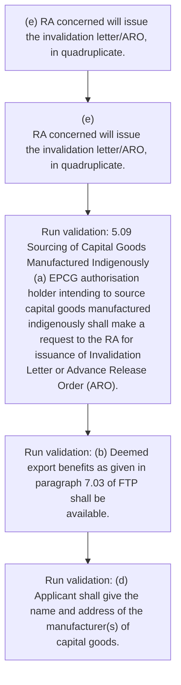
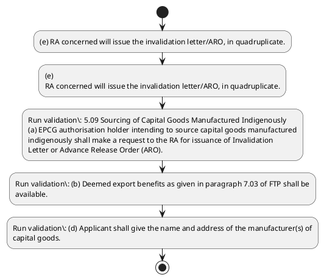

# Chapter 5 / Section 5.09: Sourcing of Capital Goods Manufactured Indigenously

**Chapter Title:** Export Promotion Capital Goods (EPCG) Scheme

**Pages:** 5

**Purpose:** 5.09 Sourcing of Capital Goods Manufactured Indigenously
(a) EPCG authorisation holder intending to source capital goods manufactured
indigenously shall make a request to the RA for issuance of Invalidation
Letter or Advance Release Order (ARO).

**Purpose Thanglish:** Indha Sourcing of Capital Goods Manufactured Indigenously section-la, 5.09 Sourcing of Capital Goods Manufactured Indigenously
(a) EPCG authorisation holder intending to source capital goods manufactured
indigenously kandippa make a request to the RA for issuance of Invalidation
Letter or Advance Release Order (ARO).

**Summary:** 5.09 Sourcing of Capital Goods Manufactured Indigenously
(a) EPCG authorisation holder intending to source capital goods manufactured
indigenously shall make a request to the RA for issuance of Invalidation
Letter or Advance Release Order (ARO). (b) Deemed export benefits as given in paragraph 7.03 of FTP shall be
available. (c) This request can be made either along with application or during the
validity period of EPCG Authorisation.

**Business Meaning:** Sourcing of Capital Goods Manufactured Indigenously governs how DGFT business controls should be applied, validated, and enforced.

**Business Explanation:** Sourcing of Capital Goods Manufactured Indigenously explains the operating rule set that DEKAI should enforce. Key control points include 5.09 Sourcing of Capital Goods Manufactured Indigenously
(a) EPCG authorisation holder intending to source capital goods manufactured
indigenously shall make a request to the RA for issuance of Invalidation
Letter or Advance Release Order (ARO). The section also drives actions such as (e) RA concerned will issue the invalidation letter/ARO, in quadruplicate..

**Business Explanation Thanglish:** Indha Sourcing of Capital Goods Manufactured Indigenously section-la, Sourcing of Capital Goods Manufactured Indigenously explains the operating rule set that DEKAI should enforce. Key control points include 5.09 Sourcing of Capital Goods Manufactured Indigenously
(a) EPCG authorisation holder intending to source capital goods manufactured
indigenously kandippa make a request to the RA for issuance of Invalidation
Letter or Advance Release Order (ARO). The section also drives actions such as (e) RA concerned will issue the invalidation letter/ARO, in quadruplicate..

## Business Logic
- 5.09 Sourcing of Capital Goods Manufactured Indigenously
(a) EPCG authorisation holder intending to source capital goods manufactured
indigenously shall make a request to the RA for issuance of Invalidation
Letter or Advance Release Order (ARO).
- (b) Deemed export benefits as given in paragraph 7.03 of FTP shall be
available.
- (d) Applicant shall give the name and address of the manufacturer(s) of
capital goods.
- (f) Validity period of invalidation letter/ARO shall be co-terminous with the
validity period of EPCG authorisation.
- 5.09 Sourcing of Capital Goods Manufactured Indigenously
(a)
EPCG authorisation holder intending to source capital goods manufactured
indigenously shall make a request to the RA for issuance of Invalidation
Letter or Advance Release Order (ARO).
- (b)
Deemed export benefits as given in paragraph 7.03 of FTP shall be
available.
- (d)
Applicant shall give the name and address of the manufacturer(s) of
capital goods.
- (f)
Validity period of invalidation letter/ARO shall be co-terminous with the
validity period of EPCG authorisation.

## Business Rules
- rule_id=CH5-SEC5_09-R001, rule_description=5.09 Sourcing of Capital Goods Manufactured Indigenously
(a) EPCG authorisation holder intending to source capital goods manufactured
indigenously shall make a request to the RA for issuance of Invalidation
Letter or Advance Release Order (ARO)., trigger=Sourcing of Capital Goods Manufactured Indigenously, condition=Section 5.09 is applicable, validation=5.09 Sourcing of Capital Goods Manufactured Indigenously
(a) EPCG authorisation holder intending to source capital goods manufactured
indigenously shall make a request to the RA for issuance of Invalidation
Letter or Advance Release Order (ARO)., action=(e) RA concerned will issue the invalidation letter/ARO, in quadruplicate., exception=No explicit exception found in uploaded documents., output=DEKAI should produce a compliance decision for 5.09 - Sourcing of Capital Goods Manufactured Indigenously.
- rule_id=CH5-SEC5_09-R002, rule_description=(b) Deemed export benefits as given in paragraph 7.03 of FTP shall be
available., trigger=Sourcing of Capital Goods Manufactured Indigenously, condition=Section 5.09 is applicable, validation=(b) Deemed export benefits as given in paragraph 7.03 of FTP shall be
available., action=(e)
RA concerned will issue the invalidation letter/ARO, in quadruplicate., exception=No explicit exception found in uploaded documents., output=DEKAI should produce a compliance decision for 5.09 - Sourcing of Capital Goods Manufactured Indigenously.
- rule_id=CH5-SEC5_09-R003, rule_description=(d) Applicant shall give the name and address of the manufacturer(s) of
capital goods., trigger=Sourcing of Capital Goods Manufactured Indigenously, condition=Section 5.09 is applicable, validation=(d) Applicant shall give the name and address of the manufacturer(s) of
capital goods., action=(e)
RA concerned will issue the invalidation letter/ARO, in quadruplicate., exception=No explicit exception found in uploaded documents., output=DEKAI should produce a compliance decision for 5.09 - Sourcing of Capital Goods Manufactured Indigenously.
- rule_id=CH5-SEC5_09-R004, rule_description=(f) Validity period of invalidation letter/ARO shall be co-terminous with the
validity period of EPCG authorisation., trigger=Sourcing of Capital Goods Manufactured Indigenously, condition=Section 5.09 is applicable, validation=(f) Validity period of invalidation letter/ARO shall be co-terminous with the
validity period of EPCG authorisation., action=(e)
RA concerned will issue the invalidation letter/ARO, in quadruplicate., exception=No explicit exception found in uploaded documents., output=DEKAI should produce a compliance decision for 5.09 - Sourcing of Capital Goods Manufactured Indigenously.
- rule_id=CH5-SEC5_09-R005, rule_description=5.09 Sourcing of Capital Goods Manufactured Indigenously
(a)
EPCG authorisation holder intending to source capital goods manufactured
indigenously shall make a request to the RA for issuance of Invalidation
Letter or Advance Release Order (ARO)., trigger=Sourcing of Capital Goods Manufactured Indigenously, condition=Section 5.09 is applicable, validation=5.09 Sourcing of Capital Goods Manufactured Indigenously
(a)
EPCG authorisation holder intending to source capital goods manufactured
indigenously shall make a request to the RA for issuance of Invalidation
Letter or Advance Release Order (ARO)., action=(e)
RA concerned will issue the invalidation letter/ARO, in quadruplicate., exception=No explicit exception found in uploaded documents., output=DEKAI should produce a compliance decision for 5.09 - Sourcing of Capital Goods Manufactured Indigenously.
- rule_id=CH5-SEC5_09-R006, rule_description=(b)
Deemed export benefits as given in paragraph 7.03 of FTP shall be
available., trigger=Sourcing of Capital Goods Manufactured Indigenously, condition=Section 5.09 is applicable, validation=(b)
Deemed export benefits as given in paragraph 7.03 of FTP shall be
available., action=(e)
RA concerned will issue the invalidation letter/ARO, in quadruplicate., exception=No explicit exception found in uploaded documents., output=DEKAI should produce a compliance decision for 5.09 - Sourcing of Capital Goods Manufactured Indigenously.
- rule_id=CH5-SEC5_09-R007, rule_description=(d)
Applicant shall give the name and address of the manufacturer(s) of
capital goods., trigger=Sourcing of Capital Goods Manufactured Indigenously, condition=Section 5.09 is applicable, validation=(d)
Applicant shall give the name and address of the manufacturer(s) of
capital goods., action=(e)
RA concerned will issue the invalidation letter/ARO, in quadruplicate., exception=No explicit exception found in uploaded documents., output=DEKAI should produce a compliance decision for 5.09 - Sourcing of Capital Goods Manufactured Indigenously.
- rule_id=CH5-SEC5_09-R008, rule_description=(f)
Validity period of invalidation letter/ARO shall be co-terminous with the
validity period of EPCG authorisation., trigger=Sourcing of Capital Goods Manufactured Indigenously, condition=Section 5.09 is applicable, validation=(f)
Validity period of invalidation letter/ARO shall be co-terminous with the
validity period of EPCG authorisation., action=(e)
RA concerned will issue the invalidation letter/ARO, in quadruplicate., exception=No explicit exception found in uploaded documents., output=DEKAI should produce a compliance decision for 5.09 - Sourcing of Capital Goods Manufactured Indigenously.

## Conditions
- None identified

## Condition Logic
- id=5.5.09.1, if=Section 5.09 is applicable, then=(e) RA concerned will issue the invalidation letter/ARO, in quadruplicate., source=Derived from uploaded documents

## Validations
- 5.09 Sourcing of Capital Goods Manufactured Indigenously
(a) EPCG authorisation holder intending to source capital goods manufactured
indigenously shall make a request to the RA for issuance of Invalidation
Letter or Advance Release Order (ARO).
- (b) Deemed export benefits as given in paragraph 7.03 of FTP shall be
available.
- (d) Applicant shall give the name and address of the manufacturer(s) of
capital goods.
- (f) Validity period of invalidation letter/ARO shall be co-terminous with the
validity period of EPCG authorisation.
- 5.09 Sourcing of Capital Goods Manufactured Indigenously
(a)
EPCG authorisation holder intending to source capital goods manufactured
indigenously shall make a request to the RA for issuance of Invalidation
Letter or Advance Release Order (ARO).
- (b)
Deemed export benefits as given in paragraph 7.03 of FTP shall be
available.
- (d)
Applicant shall give the name and address of the manufacturer(s) of
capital goods.
- (f)
Validity period of invalidation letter/ARO shall be co-terminous with the
validity period of EPCG authorisation.

## Exceptions
- None identified

## Dependencies
- 7.03

## Authorities
- RA

## Required Documents
- (c) This request can be made either along with application or during the
validity period of EPCG Authorisation.
- (c)
This request can be made either along with application or during the
validity period of EPCG Authorisation.

## Timelines
- None identified

## Actions
- (e) RA concerned will issue the invalidation letter/ARO, in quadruplicate.
- (e)
RA concerned will issue the invalidation letter/ARO, in quadruplicate.

## Workflow
- (e) RA concerned will issue the invalidation letter/ARO, in quadruplicate.
- (e)
RA concerned will issue the invalidation letter/ARO, in quadruplicate.
- Run validation: 5.09 Sourcing of Capital Goods Manufactured Indigenously
(a) EPCG authorisation holder intending to source capital goods manufactured
indigenously shall make a request to the RA for issuance of Invalidation
Letter or Advance Release Order (ARO).
- Run validation: (b) Deemed export benefits as given in paragraph 7.03 of FTP shall be
available.
- Run validation: (d) Applicant shall give the name and address of the manufacturer(s) of
capital goods.

## Workflow ASCII
```text
Sourcing of Capital Goods Manufactured Indigenously
(e) RA concerned will issue the invalidation letter/ARO, in quadruplicate.
   |
   v
(e)
RA concerned will issue the invalidation letter/ARO, in quadruplicate.
   |
   v
Run validation: 5.09 Sourcing of Capital Goods Manufactured Indigenously
(a) EPCG authorisation holder intending to source capital goods manufactured
indigenously shall make a request to the RA for issuance of Invalidation
Letter or Advance Release Order (ARO).
   |
   v
Run validation: (b) Deemed export benefits as given in paragraph 7.03 of FTP shall be
available.
   |
   v
Run validation: (d) Applicant shall give the name and address of the manufacturer(s) of
capital goods.
```

## Decision Tree
- IF section 5.09 applies THEN (e) RA concerned will issue the invalidation letter/ARO, in quadruplicate.

## Decision Tree ASCII
```text
Sourcing of Capital Goods Manufactured Indigenously Decision
IF section 5.09 applies THEN (e) RA concerned will issue the invalidation letter/ARO, in quadruplicate.
```

## Examples
- User asks to process Sourcing of Capital Goods Manufactured Indigenously; the platform checks conditions, validations, and documents before action.

**Real-world Example:** Example: an importer or exporter invokes Sourcing of Capital Goods Manufactured Indigenously, submits (c) This request can be made either along with application or during the
validity period of EPCG Authorisation., (c)
This request can be made either along with application or during the
validity period of EPCG Authorisation., and DEKAI uses the extracted rules to (e) ra concerned will issue the invalidation letter/aro, in quadruplicate..

**Real-world Example Thanglish:** Indha Sourcing of Capital Goods Manufactured Indigenously section-la, Example: an importer or exporter invokes Sourcing of Capital Goods Manufactured Indigenously, submits (c) This request can be made either along with application or during the
validity period of EPCG Authorisation., (c)
This request can be made either along with application or during the
validity period of EPCG Authorisation., and DEKAI uses the extracted rules to (e) ra concerned will issue the invalidation letter/aro, in quadruplicate..

## AI Rules
- IF detected context matches section rule THEN enforce: 5.09 Sourcing of Capital Goods Manufactured Indigenously
(a) EPCG authorisation holder intending to source capital goods manufactured
indigenously shall make a request to the RA for issuance of Invalidation
Letter or Advance Release Order (ARO).
- IF detected context matches section rule THEN enforce: (b) Deemed export benefits as given in paragraph 7.03 of FTP shall be
available.
- IF detected context matches section rule THEN enforce: (d) Applicant shall give the name and address of the manufacturer(s) of
capital goods.
- IF detected context matches section rule THEN enforce: (f) Validity period of invalidation letter/ARO shall be co-terminous with the
validity period of EPCG authorisation.
- IF detected context matches section rule THEN enforce: 5.09 Sourcing of Capital Goods Manufactured Indigenously
(a)
EPCG authorisation holder intending to source capital goods manufactured
indigenously shall make a request to the RA for issuance of Invalidation
Letter or Advance Release Order (ARO).
- IF detected context matches section rule THEN enforce: (b)
Deemed export benefits as given in paragraph 7.03 of FTP shall be
available.
- IF validations pass THEN recommend action: (e) RA concerned will issue the invalidation letter/ARO, in quadruplicate.

## Database Fields
- name=section_code, type=string, required=True, source=parsed_section_heading
- name=section_title, type=string, required=True, source=parsed_section_heading
- name=the_flag, type=boolean, required=False, source=keyword:the
- name=for_flag, type=boolean, required=False, source=keyword:for
- name=aro_flag, type=boolean, required=False, source=keyword:ARO
- name=ftp_flag, type=boolean, required=False, source=keyword:FTP
- name=can_flag, type=boolean, required=False, source=keyword:can
- name=and_flag, type=boolean, required=False, source=keyword:and
- name=epcg_flag, type=boolean, required=False, source=keyword:EPCG
- name=make_flag, type=boolean, required=False, source=keyword:make
- name=document_1_submitted, type=boolean, required=True, source=(c) This request can be made either along with application or during the
validity period of EPCG Authorisation.
- name=document_2_submitted, type=boolean, required=True, source=(c)
This request can be made either along with application or during the
validity period of EPCG Authorisation.

## API Requirements
- method=GET, path=/api/dgft/sections/5.09, purpose=Retrieve knowledge payload for section 5.09, query_params=['include=workflow,decision_tree,validations'], response_fields=['section', 'title', 'summary', 'conditions', 'validations', 'exceptions', 'workflow', 'decision_tree']
- method=POST, path=/api/dgft/Sourcing-of-Capital-Goods-Manufactured-Indigenously/validate, purpose=Validate inputs and documents for Sourcing of Capital Goods Manufactured Indigenously, request_fields=['section_code', 'section_title', 'document_1_submitted', 'document_2_submitted'], response_fields=['status', 'errors', 'warnings', 'next_actions']
- method=POST, path=/api/dgft/Sourcing-of-Capital-Goods-Manufactured-Indigenously/execute, purpose=Trigger business action for (e) RA concerned will issue the invalidation letter/ARO, in quadruplicate., request_fields=['section_code', 'section_title', 'document_1_submitted', 'document_2_submitted'], response_fields=['reference_id', 'status', 'authority', 'timeline']

## UI Screens
- screen_id=Sourcing_of_Capital_Goods_Manufactured_Indigenously_overview, name=Sourcing of Capital Goods Manufactured Indigenously Overview, purpose=Show section summary, authority, timeline, and eligibility cues., widgets=['summary_card', 'conditions_table', 'authority_badges', 'timeline_panel']
- screen_id=Sourcing_of_Capital_Goods_Manufactured_Indigenously_submission, name=Sourcing of Capital Goods Manufactured Indigenously Submission, purpose=Capture applicant data and supporting documents., widgets=['dynamic_form', 'document_uploader', 'validation_panel', 'next_action_footer'], fields=['section_code', 'section_title', 'the_flag', 'for_flag', 'aro_flag', 'ftp_flag', 'can_flag', 'and_flag']

## Error Messages
- Validation failed because the section requirements were not fully met.

## FAQ
- question_en=What is the purpose of section 5.09?, answer_en=Sourcing of Capital Goods Manufactured Indigenously explains the operating rule set that DEKAI should enforce. Key control points include 5.09 Sourcing of Capital Goods Manufactured Indigenously
(a) EPCG authorisation holder intending to source capital goods manufactured
indigenously shall make a request to the RA for issuance of Invalidation
Letter or Advance Release Order (ARO). The section also drives actions such as (e) RA concerned will issue the invalidation letter/ARO, in quadruplicate.., question_thanglish=Indha Sourcing of Capital Goods Manufactured Indigenously section-la, What is the purpose of section 5.09?, answer_thanglish=Indha Sourcing of Capital Goods Manufactured Indigenously section-la, Sourcing of Capital Goods Manufactured Indigenously explains the operating rule set that DEKAI should enforce. Key control points include 5.09 Sourcing of Capital Goods Manufactured Indigenously
(a) EPCG authorisation holder intending to source capital goods manufactured
indigenously kandippa make a request to the RA for issuance of Invalidation
Letter or Advance Release Order (ARO). The section also drives actions such as (e) RA concerned will issue the invalidation letter/ARO, in quadruplicate..
- question_en=What documents are required under Sourcing of Capital Goods Manufactured Indigenously?, answer_en=(c) This request can be made either along with application or during the
validity period of EPCG Authorisation., (c)
This request can be made either along with application or during the
validity period of EPCG Authorisation., question_thanglish=Indha Sourcing of Capital Goods Manufactured Indigenously section-la, What documents are required under Sourcing of Capital Goods Manufactured Indigenously?, answer_thanglish=Indha Sourcing of Capital Goods Manufactured Indigenously section-la, (c) This request can be made either along with application or during the
validity period of EPCG Authorisation., (c)
This request can be made either along with application or during the
validity period of EPCG Authorisation.
- question_en=Which authority handles Sourcing of Capital Goods Manufactured Indigenously?, answer_en=RA, question_thanglish=Indha Sourcing of Capital Goods Manufactured Indigenously section-la, Which authority handles Sourcing of Capital Goods Manufactured Indigenously?, answer_thanglish=Indha Sourcing of Capital Goods Manufactured Indigenously section-la, RA

## Questions Users May Ask
- What does Sourcing of Capital Goods Manufactured Indigenously require?
- Which documents are needed for Sourcing of Capital Goods Manufactured Indigenously?
- How does DEKAI validate Sourcing of Capital Goods Manufactured Indigenously requests?
- What action should be taken for Sourcing of Capital Goods Manufactured Indigenously?

## Expected AI Answers
- Sourcing of Capital Goods Manufactured Indigenously requires the platform to interpret the section text, apply the extracted business rules, and present the correct next action.
- Required documents are inferred from the section text: (c) This request can be made either along with application or during the
validity period of EPCG Authorisation., (c)
This request can be made either along with application or during the
validity period of EPCG Authorisation.
- DEKAI validates Sourcing of Capital Goods Manufactured Indigenously by checking conditions, required documents, authority references, and exception clauses before recommending an outcome.
- The primary extracted action is: (e) RA concerned will issue the invalidation letter/ARO, in quadruplicate.

## AI Q&A Examples
- question_en=User asks: How do I comply with Sourcing of Capital Goods Manufactured Indigenously?, answer_en=AI answers: DEKAI should evaluate section 5.09, apply the extracted rules, and guide the user through (e) RA concerned will issue the invalidation letter/ARO, in quadruplicate.., question_thanglish=Indha Sourcing of Capital Goods Manufactured Indigenously section-la, User asks: How do I comply with Sourcing of Capital Goods Manufactured Indigenously?, answer_thanglish=Indha Sourcing of Capital Goods Manufactured Indigenously section-la, AI answers: DEKAI should evaluate section 5.09, apply the extracted rules, and guide the user through (e) RA concerned will issue the invalidation letter/ARO, in quadruplicate..
- question_en=User asks: Which validations apply to Sourcing of Capital Goods Manufactured Indigenously?, answer_en=AI answers: Applicable validations are 5.09 Sourcing of Capital Goods Manufactured Indigenously
(a) EPCG authorisation holder intending to source capital goods manufactured
indigenously shall make a request to the RA for issuance of Invalidation
Letter or Advance Release Order (ARO)., (b) Deemed export benefits as given in paragraph 7.03 of FTP shall be
available., (d) Applicant shall give the name and address of the manufacturer(s) of
capital goods., question_thanglish=Indha Sourcing of Capital Goods Manufactured Indigenously section-la, User asks: Which validations apply to Sourcing of Capital Goods Manufactured Indigenously?, answer_thanglish=Indha Sourcing of Capital Goods Manufactured Indigenously section-la, AI answers: Applicable validations are 5.09 Sourcing of Capital Goods Manufactured Indigenously
(a) EPCG authorisation holder intending to source capital goods manufactured
indigenously kandippa make a request to the RA for issuance of Invalidation
Letter or Advance Release Order (ARO)., (b) Deemed export benefits as given in paragraph 7.03 of FTP kandippa be
available., (d) Applicant kandippa give the name and address of the manufacturer(s) of
capital goods.

## DEKAI AI Implementation Notes
- Capture chapter 5, section 5.09, title, and page references as immutable knowledge metadata.
- Bind validations for Sourcing of Capital Goods Manufactured Indigenously into a rule engine keyed by the rule IDs extracted for this section.
- Expose document upload controls for: (c) This request can be made either along with application or during the
validity period of EPCG Authorisation., (c)
This request can be made either along with application or during the
validity period of EPCG Authorisation..
- Route escalations or approvals to: RA.

## DEKAI AI Implementation Notes Thanglish
- Indha Sourcing of Capital Goods Manufactured Indigenously section-la, Capture chapter 5, section 5.09, title, and page references as immutable knowledge metadata.
- Indha Sourcing of Capital Goods Manufactured Indigenously section-la, Bind validations for Sourcing of Capital Goods Manufactured Indigenously into a rule engine keyed by the rule IDs extracted for this section.
- Indha Sourcing of Capital Goods Manufactured Indigenously section-la, Expose document upload controls for: (c) This request can be made either along with application or during the
validity period of EPCG Authorisation., (c)
This request can be made either along with application or during the
validity period of EPCG Authorisation..
- Indha Sourcing of Capital Goods Manufactured Indigenously section-la, Route escalations or approvals to: RA.

## AI Metadata
- Keywords: the, for, ARO, FTP, can, and, EPCG, make, This, made, with, give, name, will, Goods, shall, Order, given, along, issue
- Search Keywords: the, for, ARO, FTP, can, and, EPCG, make, This, made, with, give, name, will, Goods, shall, Order, given, along, issue
- Intent: Support Sourcing of Capital Goods Manufactured Indigenously processing and compliance validation.
- Tags: 5.09, Sourcing of Capital Goods Manufactured Indigenously, business-rule, document-driven, dgft
- Related Sections: 
- Related Chapters: 
- Related Rules: 5.09 Sourcing of Capital Goods Manufactured Indigenously
(a) EPCG authorisation holder intending to source capital goods manufactured
indigenously shall make a request to the RA for issuance of Invalidation
Letter or Advance Release Order (ARO)., (b) Deemed export benefits as given in paragraph 7.03 of FTP shall be
available., (d) Applicant shall give the name and address of the manufacturer(s) of
capital goods., (f) Validity period of invalidation letter/ARO shall be co-terminous with the
validity period of EPCG authorisation., 5.09 Sourcing of Capital Goods Manufactured Indigenously
(a)
EPCG authorisation holder intending to source capital goods manufactured
indigenously shall make a request to the RA for issuance of Invalidation
Letter or Advance Release Order (ARO).

## Mermaid


## PlantUML

