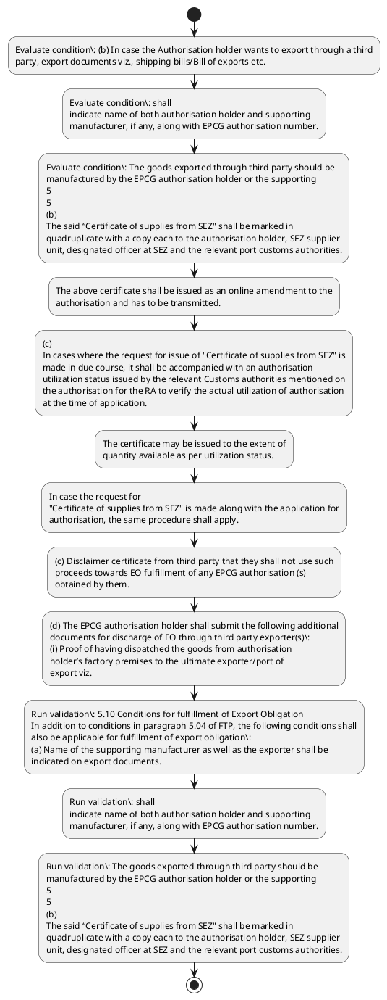

# Chapter 5 / Section 5.10: Conditions for fulfillment of Export Obligation

**Chapter Title:** Export Promotion Capital Goods (EPCG) Scheme

**Pages:** 5, 6

**Purpose:** 5.10 Conditions for fulfillment of Export Obligation
In addition to conditions in paragraph 5.04 of FTP, the following conditions shall
also be applicable for fulfillment of export obligation:
(a) Name of the supporting manufacturer as well as the exporter shall be
indicated on export documents.

**Purpose Thanglish:** Indha Conditions for fulfillment of Export Obligation section-la, 5.10 Conditions for fulfillment of export Obligation
In addition to conditions in paragraph 5.04 of FTP, the following conditions kandippa
also be applicable for fulfillment of export obligation:
(a) Name of the supporting manufacturer as well as the exporter kandippa be
indicated on export documents.

**Summary:** 5.10 Conditions for fulfillment of Export Obligation
In addition to conditions in paragraph 5.04 of FTP, the following conditions shall
also be applicable for fulfillment of export obligation:
(a) Name of the supporting manufacturer as well as the exporter shall be
indicated on export documents. (b) In case the Authorisation holder wants to export through a third
party, export documents viz., shipping bills/Bill of exports etc. shall
indicate name of both authorisation holder and supporting
manufacturer, if any, along with EPCG authorisation number.

**Business Meaning:** Conditions for fulfillment of Export Obligation governs how DGFT business controls should be applied, validated, and enforced.

**Business Explanation:** Conditions for fulfillment of Export Obligation explains the operating rule set that DEKAI should enforce. Key control points include 5.10 Conditions for fulfillment of Export Obligation
In addition to conditions in paragraph 5.04 of FTP, the following conditions shall
also be applicable for fulfillment of export obligation:
(a) Name of the supporting manufacturer as well as the exporter shall be
indicated on export documents. The section also drives actions such as The above certificate shall be issued as an online amendment to the
authorisation and has to be transmitted..

**Business Explanation Thanglish:** Indha Conditions for fulfillment of Export Obligation section-la, Conditions for fulfillment of export Obligation explains the operating rule set that DEKAI should enforce. Key control points include 5.10 Conditions for fulfillment of export Obligation
In addition to conditions in paragraph 5.04 of FTP, the following conditions kandippa
also be applicable for fulfillment of export obligation:
(a) Name of the supporting manufacturer as well as the exporter kandippa be
indicated on export documents. The section also drives actions such as The above certificate kandippa be issued as an online amendment to the
authorisation and has to be transmitted..

## Business Logic
- 5.10 Conditions for fulfillment of Export Obligation
In addition to conditions in paragraph 5.04 of FTP, the following conditions shall
also be applicable for fulfillment of export obligation:
(a) Name of the supporting manufacturer as well as the exporter shall be
indicated on export documents.
- shall
indicate name of both authorisation holder and supporting
manufacturer, if any, along with EPCG authorisation number.
- Shipping bill/Bill of Export, GST invoice and e-BRC/ export
realisation from RBI’s EDPMS should be in the name of third party
exporter.
- The goods exported through third party should be
manufactured by the EPCG authorisation holder or the supporting
5
5
(b)
The said “Certificate of supplies from SEZ" shall be marked in
quadruplicate with a copy each to the authorisation holder, SEZ supplier
unit, designated officer at SEZ and the relevant port customs authorities.
- The above certificate shall be issued as an online amendment to the
authorisation and has to be transmitted.
- (c)
In cases where the request for issue of "Certificate of supplies from SEZ" is
made in due course, it shall be accompanied with an authorisation
utilization status issued by the relevant Customs authorities mentioned on
the authorisation for the RA to verify the actual utilization of authorisation
at the time of application.
- In case the request for
"Certificate of supplies from SEZ" is made along with the application for
authorisation, the same procedure shall apply.
- 5.10 Conditions for fulfillment of Export Obligation
In addition to conditions in paragraph 5.04 of FTP, the following conditions shall
also be applicable for fulfillment of export obligation:
(a)
Name of the supporting manufacturer as well as the exporter shall be
indicated on export documents.
- The goods exported through third party should be
manufactured by the EPCG authorisation holder or the supporting
manufacturer where the capital goods imported under the
authorisation have been installed.
- The goods manufactured by the
authorisation holder shall be exported as it is by the ultimate
exporter (third party exporter) without further processing.
- Proceeds
realised through normal banking channel from third party exporter’s
account to the authorisation holder’s account on account of such
exports shall only be counted towards fulfillment of export obligation.
- (c) Disclaimer certificate from third party that they shall not use such
proceeds towards EO fulfillment of any EPCG authorisation (s)
obtained by them.
- (d) The EPCG authorisation holder shall submit the following additional
documents for discharge of EO through third party exporter(s):
(i) Proof of having dispatched the goods from authorisation
holder’s factory premises to the ultimate exporter/port of
export viz.
- (v) Disclaimer certificate from third party exporter that they shall
not use such proceeds towards EO fulfillment of any EPCG
authorisation(s) obtained by them.
- (c)
Disclaimer certificate from third party that they shall not use such
proceeds towards EO fulfillment of any EPCG authorisation (s)
obtained by them.
- (d)
The EPCG authorisation holder shall submit the following additional
documents for discharge of EO through third party exporter(s):
(i)
Proof of having dispatched the goods from authorisation
holder’s factory premises to the ultimate exporter/port of
export viz.
- (v)
Disclaimer certificate from third party exporter that they shall
not use such proceeds towards EO fulfillment of any EPCG
authorisation(s) obtained by them.

## Business Rules
- rule_id=CH5-SEC5_10-R001, rule_description=5.10 Conditions for fulfillment of Export Obligation
In addition to conditions in paragraph 5.04 of FTP, the following conditions shall
also be applicable for fulfillment of export obligation:
(a) Name of the supporting manufacturer as well as the exporter shall be
indicated on export documents., trigger=Conditions for fulfillment of Export Obligation, condition=(b) In case the Authorisation holder wants to export through a third
party, export documents viz., shipping bills/Bill of exports etc., validation=5.10 Conditions for fulfillment of Export Obligation
In addition to conditions in paragraph 5.04 of FTP, the following conditions shall
also be applicable for fulfillment of export obligation:
(a) Name of the supporting manufacturer as well as the exporter shall be
indicated on export documents., action=The above certificate shall be issued as an online amendment to the
authorisation and has to be transmitted., exception=No explicit exception found in uploaded documents., output=DEKAI should produce a compliance decision for 5.10 - Conditions for fulfillment of Export Obligation.
- rule_id=CH5-SEC5_10-R002, rule_description=shall
indicate name of both authorisation holder and supporting
manufacturer, if any, along with EPCG authorisation number., trigger=Conditions for fulfillment of Export Obligation, condition=any, validation=shall
indicate name of both authorisation holder and supporting
manufacturer, if any, along with EPCG authorisation number., action=(c)
In cases where the request for issue of "Certificate of supplies from SEZ" is
made in due course, it shall be accompanied with an authorisation
utilization status issued by the relevant Customs authorities mentioned on
the authorisation for the RA to verify the actual utilization of authorisation
at the time of application., exception=No explicit exception found in uploaded documents., output=DEKAI should produce a compliance decision for 5.10 - Conditions for fulfillment of Export Obligation.
- rule_id=CH5-SEC5_10-R003, rule_description=Shipping bill/Bill of Export, GST invoice and e-BRC/ export
realisation from RBI’s EDPMS should be in the name of third party
exporter., trigger=Conditions for fulfillment of Export Obligation, condition=The goods exported through third party should be
manufactured by the EPCG authorisation holder or the supporting
5
5
(b)
The said “Certificate of supplies from SEZ" shall be marked in
quadruplicate with a copy each to the authorisation holder, SEZ supplier
unit, designated officer at SEZ and the relevant port customs authorities., validation=The goods exported through third party should be
manufactured by the EPCG authorisation holder or the supporting
5
5
(b)
The said “Certificate of supplies from SEZ" shall be marked in
quadruplicate with a copy each to the authorisation holder, SEZ supplier
unit, designated officer at SEZ and the relevant port customs authorities., action=The certificate may be issued to the extent of
quantity available as per utilization status., exception=No explicit exception found in uploaded documents., output=DEKAI should produce a compliance decision for 5.10 - Conditions for fulfillment of Export Obligation.
- rule_id=CH5-SEC5_10-R004, rule_description=The goods exported through third party should be
manufactured by the EPCG authorisation holder or the supporting
5
5
(b)
The said “Certificate of supplies from SEZ" shall be marked in
quadruplicate with a copy each to the authorisation holder, SEZ supplier
unit, designated officer at SEZ and the relevant port customs authorities., trigger=Conditions for fulfillment of Export Obligation, condition=The above certificate shall be issued as an online amendment to the
authorisation and has to be transmitted., validation=The above certificate shall be issued as an online amendment to the
authorisation and has to be transmitted., action=In case the request for
"Certificate of supplies from SEZ" is made along with the application for
authorisation, the same procedure shall apply., exception=No explicit exception found in uploaded documents., output=DEKAI should produce a compliance decision for 5.10 - Conditions for fulfillment of Export Obligation.
- rule_id=CH5-SEC5_10-R005, rule_description=The above certificate shall be issued as an online amendment to the
authorisation and has to be transmitted., trigger=Conditions for fulfillment of Export Obligation, condition=(c)
In cases where the request for issue of "Certificate of supplies from SEZ" is
made in due course, it shall be accompanied with an authorisation
utilization status issued by the relevant Customs authorities mentioned on
the authorisation for the RA to verify the actual utilization of authorisation
at the time of application., validation=(c)
In cases where the request for issue of "Certificate of supplies from SEZ" is
made in due course, it shall be accompanied with an authorisation
utilization status issued by the relevant Customs authorities mentioned on
the authorisation for the RA to verify the actual utilization of authorisation
at the time of application., action=(c) Disclaimer certificate from third party that they shall not use such
proceeds towards EO fulfillment of any EPCG authorisation (s)
obtained by them., exception=No explicit exception found in uploaded documents., output=DEKAI should produce a compliance decision for 5.10 - Conditions for fulfillment of Export Obligation.
- rule_id=CH5-SEC5_10-R006, rule_description=(c)
In cases where the request for issue of "Certificate of supplies from SEZ" is
made in due course, it shall be accompanied with an authorisation
utilization status issued by the relevant Customs authorities mentioned on
the authorisation for the RA to verify the actual utilization of authorisation
at the time of application., trigger=Conditions for fulfillment of Export Obligation, condition=The certificate may be issued to the extent of
quantity available as per utilization status., validation=In case the request for
"Certificate of supplies from SEZ" is made along with the application for
authorisation, the same procedure shall apply., action=(d) The EPCG authorisation holder shall submit the following additional
documents for discharge of EO through third party exporter(s):
(i) Proof of having dispatched the goods from authorisation
holder’s factory premises to the ultimate exporter/port of
export viz., exception=No explicit exception found in uploaded documents., output=DEKAI should produce a compliance decision for 5.10 - Conditions for fulfillment of Export Obligation.
- rule_id=CH5-SEC5_10-R007, rule_description=In case the request for
"Certificate of supplies from SEZ" is made along with the application for
authorisation, the same procedure shall apply., trigger=Conditions for fulfillment of Export Obligation, condition=In case the request for
"Certificate of supplies from SEZ" is made along with the application for
authorisation, the same procedure shall apply., validation=5.10 Conditions for fulfillment of Export Obligation
In addition to conditions in paragraph 5.04 of FTP, the following conditions shall
also be applicable for fulfillment of export obligation:
(a)
Name of the supporting manufacturer as well as the exporter shall be
indicated on export documents., action=(a) ARE 1 certificate issued by Central Excise/Tax invoice for
export prescribed under the GST rules with due authentication
by the Customs verifying the exports along with the shipping
bill number, date and EPCG authorisation number, or
(b) Invoice duly incorporating the relevant EPCG
authorisation number & date at the time of dispatch in case the
unit is not registered with Central Excise/GST., exception=No explicit exception found in uploaded documents., output=DEKAI should produce a compliance decision for 5.10 - Conditions for fulfillment of Export Obligation.
- rule_id=CH5-SEC5_10-R008, rule_description=5.10 Conditions for fulfillment of Export Obligation
In addition to conditions in paragraph 5.04 of FTP, the following conditions shall
also be applicable for fulfillment of export obligation:
(a)
Name of the supporting manufacturer as well as the exporter shall be
indicated on export documents., trigger=Conditions for fulfillment of Export Obligation, condition=(b)
In case the Authorisation holder wants to export through a third
party, export documents viz., shipping bills/Bill of exports etc., validation=The goods manufactured by the
authorisation holder shall be exported as it is by the ultimate
exporter (third party exporter) without further processing., action=(v) Disclaimer certificate from third party exporter that they shall
not use such proceeds towards EO fulfillment of any EPCG
authorisation(s) obtained by them., exception=No explicit exception found in uploaded documents., output=DEKAI should produce a compliance decision for 5.10 - Conditions for fulfillment of Export Obligation.
- rule_id=CH5-SEC5_10-R009, rule_description=The goods exported through third party should be
manufactured by the EPCG authorisation holder or the supporting
manufacturer where the capital goods imported under the
authorisation have been installed., trigger=Conditions for fulfillment of Export Obligation, condition=The goods exported through third party should be
manufactured by the EPCG authorisation holder or the supporting
manufacturer where the capital goods imported under the
authorisation have been installed., validation=Proceeds
realised through normal banking channel from third party exporter’s
account to the authorisation holder’s account on account of such
exports shall only be counted towards fulfillment of export obligation., action=(c)
Disclaimer certificate from third party that they shall not use such
proceeds towards EO fulfillment of any EPCG authorisation (s)
obtained by them., exception=No explicit exception found in uploaded documents., output=DEKAI should produce a compliance decision for 5.10 - Conditions for fulfillment of Export Obligation.
- rule_id=CH5-SEC5_10-R010, rule_description=The goods manufactured by the
authorisation holder shall be exported as it is by the ultimate
exporter (third party exporter) without further processing., trigger=Conditions for fulfillment of Export Obligation, condition=(c) Disclaimer certificate from third party that they shall not use such
proceeds towards EO fulfillment of any EPCG authorisation (s)
obtained by them., validation=(c) Disclaimer certificate from third party that they shall not use such
proceeds towards EO fulfillment of any EPCG authorisation (s)
obtained by them., action=(d)
The EPCG authorisation holder shall submit the following additional
documents for discharge of EO through third party exporter(s):
(i)
Proof of having dispatched the goods from authorisation
holder’s factory premises to the ultimate exporter/port of
export viz., exception=No explicit exception found in uploaded documents., output=DEKAI should produce a compliance decision for 5.10 - Conditions for fulfillment of Export Obligation.
- rule_id=CH5-SEC5_10-R011, rule_description=Proceeds
realised through normal banking channel from third party exporter’s
account to the authorisation holder’s account on account of such
exports shall only be counted towards fulfillment of export obligation., trigger=Conditions for fulfillment of Export Obligation, condition=(a) ARE 1 certificate issued by Central Excise/Tax invoice for
export prescribed under the GST rules with due authentication
by the Customs verifying the exports along with the shipping
bill number, date and EPCG authorisation number, or
(b) Invoice duly incorporating the relevant EPCG
authorisation number & date at the time of dispatch in case the
unit is not registered with Central Excise/GST., validation=(d) The EPCG authorisation holder shall submit the following additional
documents for discharge of EO through third party exporter(s):
(i) Proof of having dispatched the goods from authorisation
holder’s factory premises to the ultimate exporter/port of
export viz., action=(a) ARE 1 certificate issued by Central Excise/Tax invoice for
export prescribed under the GST rules with due authentication
by the Customs verifying the exports along with the shipping
bill number, date and EPCG authorisation number, or
(b)
Invoice
duly
incorporating
the
relevant
EPCG
authorisation number & date at the time of dispatch in case the
unit is not registered with Central Excise/GST., exception=No explicit exception found in uploaded documents., output=DEKAI should produce a compliance decision for 5.10 - Conditions for fulfillment of Export Obligation.
- rule_id=CH5-SEC5_10-R012, rule_description=(c) Disclaimer certificate from third party that they shall not use such
proceeds towards EO fulfillment of any EPCG authorisation (s)
obtained by them., trigger=Conditions for fulfillment of Export Obligation, condition=(v) Disclaimer certificate from third party exporter that they shall
not use such proceeds towards EO fulfillment of any EPCG
authorisation(s) obtained by them., validation=(a) ARE 1 certificate issued by Central Excise/Tax invoice for
export prescribed under the GST rules with due authentication
by the Customs verifying the exports along with the shipping
bill number, date and EPCG authorisation number, or
(b) Invoice duly incorporating the relevant EPCG
authorisation number & date at the time of dispatch in case the
unit is not registered with Central Excise/GST., action=(v)
Disclaimer certificate from third party exporter that they shall
not use such proceeds towards EO fulfillment of any EPCG
authorisation(s) obtained by them., exception=No explicit exception found in uploaded documents., output=DEKAI should produce a compliance decision for 5.10 - Conditions for fulfillment of Export Obligation.
- rule_id=CH5-SEC5_10-R013, rule_description=(d) The EPCG authorisation holder shall submit the following additional
documents for discharge of EO through third party exporter(s):
(i) Proof of having dispatched the goods from authorisation
holder’s factory premises to the ultimate exporter/port of
export viz., trigger=Conditions for fulfillment of Export Obligation, condition=6
6
manufacturer where the capital goods imported under the
authorisation have been installed., validation=(v) Disclaimer certificate from third party exporter that they shall
not use such proceeds towards EO fulfillment of any EPCG
authorisation(s) obtained by them., action=(v)
Disclaimer certificate from third party exporter that they shall
not use such proceeds towards EO fulfillment of any EPCG
authorisation(s) obtained by them., exception=No explicit exception found in uploaded documents., output=DEKAI should produce a compliance decision for 5.10 - Conditions for fulfillment of Export Obligation.
- rule_id=CH5-SEC5_10-R014, rule_description=(v) Disclaimer certificate from third party exporter that they shall
not use such proceeds towards EO fulfillment of any EPCG
authorisation(s) obtained by them., trigger=Conditions for fulfillment of Export Obligation, condition=(c)
Disclaimer certificate from third party that they shall not use such
proceeds towards EO fulfillment of any EPCG authorisation (s)
obtained by them., validation=(c)
Disclaimer certificate from third party that they shall not use such
proceeds towards EO fulfillment of any EPCG authorisation (s)
obtained by them., action=(v)
Disclaimer certificate from third party exporter that they shall
not use such proceeds towards EO fulfillment of any EPCG
authorisation(s) obtained by them., exception=No explicit exception found in uploaded documents., output=DEKAI should produce a compliance decision for 5.10 - Conditions for fulfillment of Export Obligation.
- rule_id=CH5-SEC5_10-R015, rule_description=(c)
Disclaimer certificate from third party that they shall not use such
proceeds towards EO fulfillment of any EPCG authorisation (s)
obtained by them., trigger=Conditions for fulfillment of Export Obligation, condition=(a) ARE 1 certificate issued by Central Excise/Tax invoice for
export prescribed under the GST rules with due authentication
by the Customs verifying the exports along with the shipping
bill number, date and EPCG authorisation number, or
(b)
Invoice
duly
incorporating
the
relevant
EPCG
authorisation number & date at the time of dispatch in case the
unit is not registered with Central Excise/GST., validation=(d)
The EPCG authorisation holder shall submit the following additional
documents for discharge of EO through third party exporter(s):
(i)
Proof of having dispatched the goods from authorisation
holder’s factory premises to the ultimate exporter/port of
export viz., action=(v)
Disclaimer certificate from third party exporter that they shall
not use such proceeds towards EO fulfillment of any EPCG
authorisation(s) obtained by them., exception=No explicit exception found in uploaded documents., output=DEKAI should produce a compliance decision for 5.10 - Conditions for fulfillment of Export Obligation.
- rule_id=CH5-SEC5_10-R016, rule_description=(d)
The EPCG authorisation holder shall submit the following additional
documents for discharge of EO through third party exporter(s):
(i)
Proof of having dispatched the goods from authorisation
holder’s factory premises to the ultimate exporter/port of
export viz., trigger=Conditions for fulfillment of Export Obligation, condition=(v)
Disclaimer certificate from third party exporter that they shall
not use such proceeds towards EO fulfillment of any EPCG
authorisation(s) obtained by them., validation=(a) ARE 1 certificate issued by Central Excise/Tax invoice for
export prescribed under the GST rules with due authentication
by the Customs verifying the exports along with the shipping
bill number, date and EPCG authorisation number, or
(b)
Invoice
duly
incorporating
the
relevant
EPCG
authorisation number & date at the time of dispatch in case the
unit is not registered with Central Excise/GST., action=(v)
Disclaimer certificate from third party exporter that they shall
not use such proceeds towards EO fulfillment of any EPCG
authorisation(s) obtained by them., exception=No explicit exception found in uploaded documents., output=DEKAI should produce a compliance decision for 5.10 - Conditions for fulfillment of Export Obligation.
- rule_id=CH5-SEC5_10-R017, rule_description=(v)
Disclaimer certificate from third party exporter that they shall
not use such proceeds towards EO fulfillment of any EPCG
authorisation(s) obtained by them., trigger=Conditions for fulfillment of Export Obligation, condition=(v)
Disclaimer certificate from third party exporter that they shall
not use such proceeds towards EO fulfillment of any EPCG
authorisation(s) obtained by them., validation=(v)
Disclaimer certificate from third party exporter that they shall
not use such proceeds towards EO fulfillment of any EPCG
authorisation(s) obtained by them., action=(v)
Disclaimer certificate from third party exporter that they shall
not use such proceeds towards EO fulfillment of any EPCG
authorisation(s) obtained by them., exception=No explicit exception found in uploaded documents., output=DEKAI should produce a compliance decision for 5.10 - Conditions for fulfillment of Export Obligation.

## Conditions
- (b) In case the Authorisation holder wants to export through a third
party, export documents viz., shipping bills/Bill of exports etc.
- shall
indicate name of both authorisation holder and supporting
manufacturer, if any, along with EPCG authorisation number.
- The goods exported through third party should be
manufactured by the EPCG authorisation holder or the supporting
5
5
(b)
The said “Certificate of supplies from SEZ" shall be marked in
quadruplicate with a copy each to the authorisation holder, SEZ supplier
unit, designated officer at SEZ and the relevant port customs authorities.
- The above certificate shall be issued as an online amendment to the
authorisation and has to be transmitted.
- (c)
In cases where the request for issue of "Certificate of supplies from SEZ" is
made in due course, it shall be accompanied with an authorisation
utilization status issued by the relevant Customs authorities mentioned on
the authorisation for the RA to verify the actual utilization of authorisation
at the time of application.
- The certificate may be issued to the extent of
quantity available as per utilization status.
- In case the request for
"Certificate of supplies from SEZ" is made along with the application for
authorisation, the same procedure shall apply.
- (b)
In case the Authorisation holder wants to export through a third
party, export documents viz., shipping bills/Bill of exports etc.
- The goods exported through third party should be
manufactured by the EPCG authorisation holder or the supporting
manufacturer where the capital goods imported under the
authorisation have been installed.
- (c) Disclaimer certificate from third party that they shall not use such
proceeds towards EO fulfillment of any EPCG authorisation (s)
obtained by them.
- (a) ARE 1 certificate issued by Central Excise/Tax invoice for
export prescribed under the GST rules with due authentication
by the Customs verifying the exports along with the shipping
bill number, date and EPCG authorisation number, or
(b) Invoice duly incorporating the relevant EPCG
authorisation number & date at the time of dispatch in case the
unit is not registered with Central Excise/GST.
- (v) Disclaimer certificate from third party exporter that they shall
not use such proceeds towards EO fulfillment of any EPCG
authorisation(s) obtained by them.
- 6
6
manufacturer where the capital goods imported under the
authorisation have been installed.
- (c)
Disclaimer certificate from third party that they shall not use such
proceeds towards EO fulfillment of any EPCG authorisation (s)
obtained by them.
- (a) ARE 1 certificate issued by Central Excise/Tax invoice for
export prescribed under the GST rules with due authentication
by the Customs verifying the exports along with the shipping
bill number, date and EPCG authorisation number, or
(b)
Invoice
duly
incorporating
the
relevant
EPCG
authorisation number & date at the time of dispatch in case the
unit is not registered with Central Excise/GST.
- (v)
Disclaimer certificate from third party exporter that they shall
not use such proceeds towards EO fulfillment of any EPCG
authorisation(s) obtained by them.

## Condition Logic
- id=5.5.10.1, if=(b) In case the Authorisation holder wants to export through a third
party, export documents viz., shipping bills/Bill of exports etc., then=The above certificate shall be issued as an online amendment to the
authorisation and has to be transmitted., source=(b) In case the Authorisation holder wants to export through a third
party, export documents viz., shipping bills/Bill of exports etc.
- id=5.5.10.2, if=any, then=The above certificate shall be issued as an online amendment to the
authorisation and has to be transmitted., source=shall
indicate name of both authorisation holder and supporting
manufacturer, if any, along with EPCG authorisation number.
- id=5.5.10.3, if=The goods exported through third party should be
manufactured by the EPCG authorisation holder or the supporting
5
5
(b)
The said “Certificate of supplies from SEZ" shall be marked in
quadruplicate with a copy each to the authorisation holder, SEZ supplier
unit, designated officer at SEZ and the relevant port customs authorities., then=The above certificate shall be issued as an online amendment to the
authorisation and has to be transmitted., source=The goods exported through third party should be
manufactured by the EPCG authorisation holder or the supporting
5
5
(b)
The said “Certificate of supplies from SEZ" shall be marked in
quadruplicate with a copy each to the authorisation holder, SEZ supplier
unit, designated officer at SEZ and the relevant port customs authorities.
- id=5.5.10.4, if=The above certificate shall be issued as an online amendment to the
authorisation and has to be transmitted., then=The above certificate shall be issued as an online amendment to the
authorisation and has to be transmitted., source=The above certificate shall be issued as an online amendment to the
authorisation and has to be transmitted.
- id=5.5.10.5, if=(c)
In cases where the request for issue of "Certificate of supplies from SEZ" is
made in due course, it shall be accompanied with an authorisation
utilization status issued by the relevant Customs authorities mentioned on
the authorisation for the RA to verify the actual utilization of authorisation
at the time of application., then=The above certificate shall be issued as an online amendment to the
authorisation and has to be transmitted., source=(c)
In cases where the request for issue of "Certificate of supplies from SEZ" is
made in due course, it shall be accompanied with an authorisation
utilization status issued by the relevant Customs authorities mentioned on
the authorisation for the RA to verify the actual utilization of authorisation
at the time of application.
- id=5.5.10.6, if=The certificate may be issued to the extent of
quantity available as per utilization status., then=The above certificate shall be issued as an online amendment to the
authorisation and has to be transmitted., source=The certificate may be issued to the extent of
quantity available as per utilization status.
- id=5.5.10.7, if=In case the request for
"Certificate of supplies from SEZ" is made along with the application for
authorisation, the same procedure shall apply., then=The above certificate shall be issued as an online amendment to the
authorisation and has to be transmitted., source=In case the request for
"Certificate of supplies from SEZ" is made along with the application for
authorisation, the same procedure shall apply.
- id=5.5.10.8, if=(b)
In case the Authorisation holder wants to export through a third
party, export documents viz., shipping bills/Bill of exports etc., then=The above certificate shall be issued as an online amendment to the
authorisation and has to be transmitted., source=(b)
In case the Authorisation holder wants to export through a third
party, export documents viz., shipping bills/Bill of exports etc.
- id=5.5.10.9, if=The goods exported through third party should be
manufactured by the EPCG authorisation holder or the supporting
manufacturer where the capital goods imported under the
authorisation have been installed., then=The above certificate shall be issued as an online amendment to the
authorisation and has to be transmitted., source=The goods exported through third party should be
manufactured by the EPCG authorisation holder or the supporting
manufacturer where the capital goods imported under the
authorisation have been installed.
- id=5.5.10.10, if=(c) Disclaimer certificate from third party that they shall not use such
proceeds towards EO fulfillment of any EPCG authorisation (s)
obtained by them., then=The above certificate shall be issued as an online amendment to the
authorisation and has to be transmitted., source=(c) Disclaimer certificate from third party that they shall not use such
proceeds towards EO fulfillment of any EPCG authorisation (s)
obtained by them.
- id=5.5.10.11, if=(a) ARE 1 certificate issued by Central Excise/Tax invoice for
export prescribed under the GST rules with due authentication
by the Customs verifying the exports along with the shipping
bill number, date and EPCG authorisation number, or
(b) Invoice duly incorporating the relevant EPCG
authorisation number & date at the time of dispatch in case the
unit is not registered with Central Excise/GST., then=The above certificate shall be issued as an online amendment to the
authorisation and has to be transmitted., source=(a) ARE 1 certificate issued by Central Excise/Tax invoice for
export prescribed under the GST rules with due authentication
by the Customs verifying the exports along with the shipping
bill number, date and EPCG authorisation number, or
(b) Invoice duly incorporating the relevant EPCG
authorisation number & date at the time of dispatch in case the
unit is not registered with Central Excise/GST.
- id=5.5.10.12, if=(v) Disclaimer certificate from third party exporter that they shall
not use such proceeds towards EO fulfillment of any EPCG
authorisation(s) obtained by them., then=The above certificate shall be issued as an online amendment to the
authorisation and has to be transmitted., source=(v) Disclaimer certificate from third party exporter that they shall
not use such proceeds towards EO fulfillment of any EPCG
authorisation(s) obtained by them.
- id=5.5.10.13, if=6
6
manufacturer where the capital goods imported under the
authorisation have been installed., then=The above certificate shall be issued as an online amendment to the
authorisation and has to be transmitted., source=6
6
manufacturer where the capital goods imported under the
authorisation have been installed.
- id=5.5.10.14, if=(c)
Disclaimer certificate from third party that they shall not use such
proceeds towards EO fulfillment of any EPCG authorisation (s)
obtained by them., then=The above certificate shall be issued as an online amendment to the
authorisation and has to be transmitted., source=(c)
Disclaimer certificate from third party that they shall not use such
proceeds towards EO fulfillment of any EPCG authorisation (s)
obtained by them.
- id=5.5.10.15, if=(a) ARE 1 certificate issued by Central Excise/Tax invoice for
export prescribed under the GST rules with due authentication
by the Customs verifying the exports along with the shipping
bill number, date and EPCG authorisation number, or
(b)
Invoice
duly
incorporating
the
relevant
EPCG
authorisation number & date at the time of dispatch in case the
unit is not registered with Central Excise/GST., then=The above certificate shall be issued as an online amendment to the
authorisation and has to be transmitted., source=(a) ARE 1 certificate issued by Central Excise/Tax invoice for
export prescribed under the GST rules with due authentication
by the Customs verifying the exports along with the shipping
bill number, date and EPCG authorisation number, or
(b)
Invoice
duly
incorporating
the
relevant
EPCG
authorisation number & date at the time of dispatch in case the
unit is not registered with Central Excise/GST.
- id=5.5.10.16, if=(v)
Disclaimer certificate from third party exporter that they shall
not use such proceeds towards EO fulfillment of any EPCG
authorisation(s) obtained by them., then=The above certificate shall be issued as an online amendment to the
authorisation and has to be transmitted., source=(v)
Disclaimer certificate from third party exporter that they shall
not use such proceeds towards EO fulfillment of any EPCG
authorisation(s) obtained by them.

## Validations
- 5.10 Conditions for fulfillment of Export Obligation
In addition to conditions in paragraph 5.04 of FTP, the following conditions shall
also be applicable for fulfillment of export obligation:
(a) Name of the supporting manufacturer as well as the exporter shall be
indicated on export documents.
- shall
indicate name of both authorisation holder and supporting
manufacturer, if any, along with EPCG authorisation number.
- The goods exported through third party should be
manufactured by the EPCG authorisation holder or the supporting
5
5
(b)
The said “Certificate of supplies from SEZ" shall be marked in
quadruplicate with a copy each to the authorisation holder, SEZ supplier
unit, designated officer at SEZ and the relevant port customs authorities.
- The above certificate shall be issued as an online amendment to the
authorisation and has to be transmitted.
- (c)
In cases where the request for issue of "Certificate of supplies from SEZ" is
made in due course, it shall be accompanied with an authorisation
utilization status issued by the relevant Customs authorities mentioned on
the authorisation for the RA to verify the actual utilization of authorisation
at the time of application.
- In case the request for
"Certificate of supplies from SEZ" is made along with the application for
authorisation, the same procedure shall apply.
- 5.10 Conditions for fulfillment of Export Obligation
In addition to conditions in paragraph 5.04 of FTP, the following conditions shall
also be applicable for fulfillment of export obligation:
(a)
Name of the supporting manufacturer as well as the exporter shall be
indicated on export documents.
- The goods manufactured by the
authorisation holder shall be exported as it is by the ultimate
exporter (third party exporter) without further processing.
- Proceeds
realised through normal banking channel from third party exporter’s
account to the authorisation holder’s account on account of such
exports shall only be counted towards fulfillment of export obligation.
- (c) Disclaimer certificate from third party that they shall not use such
proceeds towards EO fulfillment of any EPCG authorisation (s)
obtained by them.
- (d) The EPCG authorisation holder shall submit the following additional
documents for discharge of EO through third party exporter(s):
(i) Proof of having dispatched the goods from authorisation
holder’s factory premises to the ultimate exporter/port of
export viz.
- (a) ARE 1 certificate issued by Central Excise/Tax invoice for
export prescribed under the GST rules with due authentication
by the Customs verifying the exports along with the shipping
bill number, date and EPCG authorisation number, or
(b) Invoice duly incorporating the relevant EPCG
authorisation number & date at the time of dispatch in case the
unit is not registered with Central Excise/GST.
- (v) Disclaimer certificate from third party exporter that they shall
not use such proceeds towards EO fulfillment of any EPCG
authorisation(s) obtained by them.
- (c)
Disclaimer certificate from third party that they shall not use such
proceeds towards EO fulfillment of any EPCG authorisation (s)
obtained by them.
- (d)
The EPCG authorisation holder shall submit the following additional
documents for discharge of EO through third party exporter(s):
(i)
Proof of having dispatched the goods from authorisation
holder’s factory premises to the ultimate exporter/port of
export viz.
- (a) ARE 1 certificate issued by Central Excise/Tax invoice for
export prescribed under the GST rules with due authentication
by the Customs verifying the exports along with the shipping
bill number, date and EPCG authorisation number, or
(b)
Invoice
duly
incorporating
the
relevant
EPCG
authorisation number & date at the time of dispatch in case the
unit is not registered with Central Excise/GST.
- (v)
Disclaimer certificate from third party exporter that they shall
not use such proceeds towards EO fulfillment of any EPCG
authorisation(s) obtained by them.

## Exceptions
- None identified

## Dependencies
- 5.04

## Authorities
- customs
- RA

## Required Documents
- 5.10 Conditions for fulfillment of Export Obligation
In addition to conditions in paragraph 5.04 of FTP, the following conditions shall
also be applicable for fulfillment of export obligation:
(a) Name of the supporting manufacturer as well as the exporter shall be
indicated on export documents.
- (b) In case the Authorisation holder wants to export through a third
party, export documents viz., shipping bills/Bill of exports etc.
- Shipping bill/Bill
- The goods exported through third party should be
manufactured by the EPCG authorisation holder or the supporting
5
5
(b)
The said “Certificate of supplies from SEZ" shall be marked in
quadruplicate with a copy each to the authorisation holder, SEZ supplier
unit, designated officer at SEZ and the relevant port customs authorities.
- The above certificate shall be issued as an online amendment to the
authorisation and has to be transmitted.
- (c)
In cases where the request for issue of "Certificate of supplies from SEZ" is
made in due course, it shall be accompanied with an authorisation
utilization status issued by the relevant Customs authorities mentioned on
the authorisation for the RA to verify the actual utilization of authorisation
at the time of application.
- The certificate may be issued to the extent of
quantity available as per utilization status.
- In case the request for
"Certificate of supplies from SEZ" is made along with the application for
authorisation, the same procedure shall apply.
- 5.10 Conditions for fulfillment of Export Obligation
In addition to conditions in paragraph 5.04 of FTP, the following conditions shall
also be applicable for fulfillment of export obligation:
(a)
Name of the supporting manufacturer as well as the exporter shall be
indicated on export documents.
- (b)
In case the Authorisation holder wants to export through a third
party, export documents viz., shipping bills/Bill of exports etc.
- (c) Disclaimer certificate from third party that they shall not use such
proceeds towards EO fulfillment of any EPCG authorisation (s)
obtained by them.
- (d) The EPCG authorisation holder shall submit the following additional
documents for discharge of EO through third party exporter(s):
(i) Proof of having dispatched the goods from authorisation
holder’s factory premises to the ultimate exporter/port of
export viz.
- (a) ARE 1 certificate issued by Central Excise/Tax invoice for
export prescribed under the GST rules with due authentication
by the Customs verifying the exports along with the shipping
bill number, date and EPCG authorisation number, or
(b) Invoice duly incorporating the relevant EPCG
authorisation number & date at the time of dispatch in case the
unit is not registered with Central Excise/GST.
- (iii) An undertaking from the third party exporter on a stamp
paper, declaring that the products exported for fulfillment of
EO by them on behalf of the license holder as per details given
in the statement of exports, were manufactured by the license
holder.
- (v) Disclaimer certificate from third party exporter that they shall
not use such proceeds towards EO fulfillment of any EPCG
authorisation(s) obtained by them.
- (c)
Disclaimer certificate from third party that they shall not use such
proceeds towards EO fulfillment of any EPCG authorisation (s)
obtained by them.
- (d)
The EPCG authorisation holder shall submit the following additional
documents for discharge of EO through third party exporter(s):
(i)
Proof of having dispatched the goods from authorisation
holder’s factory premises to the ultimate exporter/port of
export viz.
- (a) ARE 1 certificate issued by Central Excise/Tax invoice for
export prescribed under the GST rules with due authentication
by the Customs verifying the exports along with the shipping
bill number, date and EPCG authorisation number, or
(b)
Invoice
duly
incorporating
the
relevant
EPCG
authorisation number & date at the time of dispatch in case the
unit is not registered with Central Excise/GST.
- (iii)
An undertaking from the third party exporter on a stamp
paper, declaring that the products exported for fulfillment of
EO by them on behalf of the license holder as per details given
in the statement of exports, were manufactured by the license
holder.
- (v)
Disclaimer certificate from third party exporter that they shall
not use such proceeds towards EO fulfillment of any EPCG
authorisation(s) obtained by them.

## Timelines
- None identified

## Actions
- The above certificate shall be issued as an online amendment to the
authorisation and has to be transmitted.
- (c)
In cases where the request for issue of "Certificate of supplies from SEZ" is
made in due course, it shall be accompanied with an authorisation
utilization status issued by the relevant Customs authorities mentioned on
the authorisation for the RA to verify the actual utilization of authorisation
at the time of application.
- The certificate may be issued to the extent of
quantity available as per utilization status.
- In case the request for
"Certificate of supplies from SEZ" is made along with the application for
authorisation, the same procedure shall apply.
- (c) Disclaimer certificate from third party that they shall not use such
proceeds towards EO fulfillment of any EPCG authorisation (s)
obtained by them.
- (d) The EPCG authorisation holder shall submit the following additional
documents for discharge of EO through third party exporter(s):
(i) Proof of having dispatched the goods from authorisation
holder’s factory premises to the ultimate exporter/port of
export viz.
- (a) ARE 1 certificate issued by Central Excise/Tax invoice for
export prescribed under the GST rules with due authentication
by the Customs verifying the exports along with the shipping
bill number, date and EPCG authorisation number, or
(b) Invoice duly incorporating the relevant EPCG
authorisation number & date at the time of dispatch in case the
unit is not registered with Central Excise/GST.
- (v) Disclaimer certificate from third party exporter that they shall
not use such proceeds towards EO fulfillment of any EPCG
authorisation(s) obtained by them.
- (c)
Disclaimer certificate from third party that they shall not use such
proceeds towards EO fulfillment of any EPCG authorisation (s)
obtained by them.
- (d)
The EPCG authorisation holder shall submit the following additional
documents for discharge of EO through third party exporter(s):
(i)
Proof of having dispatched the goods from authorisation
holder’s factory premises to the ultimate exporter/port of
export viz.
- (a) ARE 1 certificate issued by Central Excise/Tax invoice for
export prescribed under the GST rules with due authentication
by the Customs verifying the exports along with the shipping
bill number, date and EPCG authorisation number, or
(b)
Invoice
duly
incorporating
the
relevant
EPCG
authorisation number & date at the time of dispatch in case the
unit is not registered with Central Excise/GST.
- (v)
Disclaimer certificate from third party exporter that they shall
not use such proceeds towards EO fulfillment of any EPCG
authorisation(s) obtained by them.

## Workflow
- Evaluate condition: (b) In case the Authorisation holder wants to export through a third
party, export documents viz., shipping bills/Bill of exports etc.
- Evaluate condition: shall
indicate name of both authorisation holder and supporting
manufacturer, if any, along with EPCG authorisation number.
- Evaluate condition: The goods exported through third party should be
manufactured by the EPCG authorisation holder or the supporting
5
5
(b)
The said “Certificate of supplies from SEZ" shall be marked in
quadruplicate with a copy each to the authorisation holder, SEZ supplier
unit, designated officer at SEZ and the relevant port customs authorities.
- The above certificate shall be issued as an online amendment to the
authorisation and has to be transmitted.
- (c)
In cases where the request for issue of "Certificate of supplies from SEZ" is
made in due course, it shall be accompanied with an authorisation
utilization status issued by the relevant Customs authorities mentioned on
the authorisation for the RA to verify the actual utilization of authorisation
at the time of application.
- The certificate may be issued to the extent of
quantity available as per utilization status.
- In case the request for
"Certificate of supplies from SEZ" is made along with the application for
authorisation, the same procedure shall apply.
- (c) Disclaimer certificate from third party that they shall not use such
proceeds towards EO fulfillment of any EPCG authorisation (s)
obtained by them.
- (d) The EPCG authorisation holder shall submit the following additional
documents for discharge of EO through third party exporter(s):
(i) Proof of having dispatched the goods from authorisation
holder’s factory premises to the ultimate exporter/port of
export viz.
- Run validation: 5.10 Conditions for fulfillment of Export Obligation
In addition to conditions in paragraph 5.04 of FTP, the following conditions shall
also be applicable for fulfillment of export obligation:
(a) Name of the supporting manufacturer as well as the exporter shall be
indicated on export documents.
- Run validation: shall
indicate name of both authorisation holder and supporting
manufacturer, if any, along with EPCG authorisation number.
- Run validation: The goods exported through third party should be
manufactured by the EPCG authorisation holder or the supporting
5
5
(b)
The said “Certificate of supplies from SEZ" shall be marked in
quadruplicate with a copy each to the authorisation holder, SEZ supplier
unit, designated officer at SEZ and the relevant port customs authorities.

## Workflow ASCII
```text
Conditions for fulfillment of Export Obligation
Evaluate condition: (b) In case the Authorisation holder wants to export through a third
party, export documents viz., shipping bills/Bill of exports etc.
   |
   v
Evaluate condition: shall
indicate name of both authorisation holder and supporting
manufacturer, if any, along with EPCG authorisation number.
   |
   v
Evaluate condition: The goods exported through third party should be
manufactured by the EPCG authorisation holder or the supporting
5
5
(b)
The said “Certificate of supplies from SEZ" shall be marked in
quadruplicate with a copy each to the authorisation holder, SEZ supplier
unit, designated officer at SEZ and the relevant port customs authorities.
   |
   v
The above certificate shall be issued as an online amendment to the
authorisation and has to be transmitted.
   |
   v
(c)
In cases where the request for issue of "Certificate of supplies from SEZ" is
made in due course, it shall be accompanied with an authorisation
utilization status issued by the relevant Customs authorities mentioned on
the authorisation for the RA to verify the actual utilization of authorisation
at the time of application.
   |
   v
The certificate may be issued to the extent of
quantity available as per utilization status.
   |
   v
In case the request for
"Certificate of supplies from SEZ" is made along with the application for
authorisation, the same procedure shall apply.
   |
   v
(c) Disclaimer certificate from third party that they shall not use such
proceeds towards EO fulfillment of any EPCG authorisation (s)
obtained by them.
   |
   v
(d) The EPCG authorisation holder shall submit the following additional
documents for discharge of EO through third party exporter(s):
(i) Proof of having dispatched the goods from authorisation
holder’s factory premises to the ultimate exporter/port of
export viz.
   |
   v
Run validation: 5.10 Conditions for fulfillment of Export Obligation
In addition to conditions in paragraph 5.04 of FTP, the following conditions shall
also be applicable for fulfillment of export obligation:
(a) Name of the supporting manufacturer as well as the exporter shall be
indicated on export documents.
   |
   v
Run validation: shall
indicate name of both authorisation holder and supporting
manufacturer, if any, along with EPCG authorisation number.
   |
   v
Run validation: The goods exported through third party should be
manufactured by the EPCG authorisation holder or the supporting
5
5
(b)
The said “Certificate of supplies from SEZ" shall be marked in
quadruplicate with a copy each to the authorisation holder, SEZ supplier
unit, designated officer at SEZ and the relevant port customs authorities.
```

## Decision Tree
- IF (b) In case the Authorisation holder wants to export through a third
party, export documents viz., shipping bills/Bill of exports etc. THEN The above certificate shall be issued as an online amendment to the
authorisation and has to be transmitted.
- IF shall
indicate name of both authorisation holder and supporting
manufacturer, if any, along with EPCG authorisation number. THEN The above certificate shall be issued as an online amendment to the
authorisation and has to be transmitted.
- IF The goods exported through third party should be
manufactured by the EPCG authorisation holder or the supporting
5
5
(b)
The said “Certificate of supplies from SEZ" shall be marked in
quadruplicate with a copy each to the authorisation holder, SEZ supplier
unit, designated officer at SEZ and the relevant port customs authorities. THEN The above certificate shall be issued as an online amendment to the
authorisation and has to be transmitted.
- IF The above certificate shall be issued as an online amendment to the
authorisation and has to be transmitted. THEN The above certificate shall be issued as an online amendment to the
authorisation and has to be transmitted.
- IF (c)
In cases where the request for issue of "Certificate of supplies from SEZ" is
made in due course, it shall be accompanied with an authorisation
utilization status issued by the relevant Customs authorities mentioned on
the authorisation for the RA to verify the actual utilization of authorisation
at the time of application. THEN The above certificate shall be issued as an online amendment to the
authorisation and has to be transmitted.

## Decision Tree ASCII
```text
Conditions for fulfillment of Export Obligation Decision
IF (b) In case the Authorisation holder wants to export through a third
party, export documents viz., shipping bills/Bill of exports etc. THEN The above certificate shall be issued as an online amendment to the
authorisation and has to be transmitted.
   |
   v
IF shall
indicate name of both authorisation holder and supporting
manufacturer, if any, along with EPCG authorisation number. THEN The above certificate shall be issued as an online amendment to the
authorisation and has to be transmitted.
   |
   v
IF The goods exported through third party should be
manufactured by the EPCG authorisation holder or the supporting
5
5
(b)
The said “Certificate of supplies from SEZ" shall be marked in
quadruplicate with a copy each to the authorisation holder, SEZ supplier
unit, designated officer at SEZ and the relevant port customs authorities. THEN The above certificate shall be issued as an online amendment to the
authorisation and has to be transmitted.
   |
   v
IF The above certificate shall be issued as an online amendment to the
authorisation and has to be transmitted. THEN The above certificate shall be issued as an online amendment to the
authorisation and has to be transmitted.
   |
   v
IF (c)
In cases where the request for issue of "Certificate of supplies from SEZ" is
made in due course, it shall be accompanied with an authorisation
utilization status issued by the relevant Customs authorities mentioned on
the authorisation for the RA to verify the actual utilization of authorisation
at the time of application. THEN The above certificate shall be issued as an online amendment to the
authorisation and has to be transmitted.
```

## Examples
- User asks to process Conditions for fulfillment of Export Obligation; the platform checks conditions, validations, and documents before action.

**Real-world Example:** Example: an importer or exporter invokes Conditions for fulfillment of Export Obligation, submits 5.10 Conditions for fulfillment of Export Obligation
In addition to conditions in paragraph 5.04 of FTP, the following conditions shall
also be applicable for fulfillment of export obligation:
(a) Name of the supporting manufacturer as well as the exporter shall be
indicated on export documents., (b) In case the Authorisation holder wants to export through a third
party, export documents viz., shipping bills/Bill of exports etc., Shipping bill/Bill, and DEKAI uses the extracted rules to the above certificate shall be issued as an online amendment to the
authorisation and has to be transmitted..

**Real-world Example Thanglish:** Indha Conditions for fulfillment of Export Obligation section-la, Example: an importer or exporter invokes Conditions for fulfillment of export Obligation, submits 5.10 Conditions for fulfillment of export Obligation
In addition to conditions in paragraph 5.04 of FTP, the following conditions kandippa
also be applicable for fulfillment of export obligation:
(a) Name of the supporting manufacturer as well as the exporter kandippa be
indicated on export documents., (b) In case the Authorisation holder wants to export through a third
party, export documents viz., shipping bills/Bill of exports etc., Shipping bill/Bill, and DEKAI uses the extracted rules to the above certificate kandippa be issued as an online amendment to the
authorisation and has to be transmitted..

## AI Rules
- IF detected context matches section rule THEN enforce: 5.10 Conditions for fulfillment of Export Obligation
In addition to conditions in paragraph 5.04 of FTP, the following conditions shall
also be applicable for fulfillment of export obligation:
(a) Name of the supporting manufacturer as well as the exporter shall be
indicated on export documents.
- IF detected context matches section rule THEN enforce: shall
indicate name of both authorisation holder and supporting
manufacturer, if any, along with EPCG authorisation number.
- IF detected context matches section rule THEN enforce: Shipping bill/Bill of Export, GST invoice and e-BRC/ export
realisation from RBI’s EDPMS should be in the name of third party
exporter.
- IF detected context matches section rule THEN enforce: The goods exported through third party should be
manufactured by the EPCG authorisation holder or the supporting
5
5
(b)
The said “Certificate of supplies from SEZ" shall be marked in
quadruplicate with a copy each to the authorisation holder, SEZ supplier
unit, designated officer at SEZ and the relevant port customs authorities.
- IF detected context matches section rule THEN enforce: The above certificate shall be issued as an online amendment to the
authorisation and has to be transmitted.
- IF detected context matches section rule THEN enforce: (c)
In cases where the request for issue of "Certificate of supplies from SEZ" is
made in due course, it shall be accompanied with an authorisation
utilization status issued by the relevant Customs authorities mentioned on
the authorisation for the RA to verify the actual utilization of authorisation
at the time of application.
- IF validations pass THEN recommend action: The above certificate shall be issued as an online amendment to the
authorisation and has to be transmitted.

## Database Fields
- name=section_code, type=string, required=True, source=parsed_section_heading
- name=section_title, type=string, required=True, source=parsed_section_heading
- name=for_flag, type=boolean, required=False, source=keyword:for
- name=ftp_flag, type=boolean, required=False, source=keyword:FTP
- name=the_flag, type=boolean, required=False, source=keyword:the
- name=viz_flag, type=boolean, required=False, source=keyword:viz
- name=etc_flag, type=boolean, required=False, source=keyword:etc
- name=and_flag, type=boolean, required=False, source=keyword:and
- name=any_flag, type=boolean, required=False, source=keyword:any
- name=gst_flag, type=boolean, required=False, source=keyword:GST
- name=document_1_submitted, type=boolean, required=True, source=5.10 Conditions for fulfillment of Export Obligation
In addition to conditions in paragraph 5.04 of FTP, the following conditions shall
also be applicable for fulfillment of export obligation:
(a) Name of the supporting manufacturer as well as the exporter shall be
indicated on export documents.
- name=document_2_submitted, type=boolean, required=True, source=(b) In case the Authorisation holder wants to export through a third
party, export documents viz., shipping bills/Bill of exports etc.
- name=document_3_submitted, type=boolean, required=True, source=Shipping bill/Bill
- name=document_4_submitted, type=boolean, required=True, source=The goods exported through third party should be
manufactured by the EPCG authorisation holder or the supporting
5
5
(b)
The said “Certificate of supplies from SEZ" shall be marked in
quadruplicate with a copy each to the authorisation holder, SEZ supplier
unit, designated officer at SEZ and the relevant port customs authorities.
- name=document_5_submitted, type=boolean, required=True, source=The above certificate shall be issued as an online amendment to the
authorisation and has to be transmitted.
- name=document_6_submitted, type=boolean, required=True, source=(c)
In cases where the request for issue of "Certificate of supplies from SEZ" is
made in due course, it shall be accompanied with an authorisation
utilization status issued by the relevant Customs authorities mentioned on
the authorisation for the RA to verify the actual utilization of authorisation
at the time of application.

## API Requirements
- method=GET, path=/api/dgft/sections/5.10, purpose=Retrieve knowledge payload for section 5.10, query_params=['include=workflow,decision_tree,validations'], response_fields=['section', 'title', 'summary', 'conditions', 'validations', 'exceptions', 'workflow', 'decision_tree']
- method=POST, path=/api/dgft/Conditions-for-fulfillment-of-Export-Obligation/validate, purpose=Validate inputs and documents for Conditions for fulfillment of Export Obligation, request_fields=['section_code', 'section_title', 'document_1_submitted', 'document_2_submitted', 'document_3_submitted', 'document_4_submitted', 'document_5_submitted', 'document_6_submitted'], response_fields=['status', 'errors', 'warnings', 'next_actions']
- method=POST, path=/api/dgft/Conditions-for-fulfillment-of-Export-Obligation/execute, purpose=Trigger business action for The above certificate shall be issued as an online amendment to the
authorisation and has to be transmitted., request_fields=['section_code', 'section_title', 'document_1_submitted', 'document_2_submitted', 'document_3_submitted', 'document_4_submitted', 'document_5_submitted', 'document_6_submitted'], response_fields=['reference_id', 'status', 'authority', 'timeline']

## UI Screens
- screen_id=Conditions_for_fulfillment_of_Export_Obligation_overview, name=Conditions for fulfillment of Export Obligation Overview, purpose=Show section summary, authority, timeline, and eligibility cues., widgets=['summary_card', 'conditions_table', 'authority_badges', 'timeline_panel']
- screen_id=Conditions_for_fulfillment_of_Export_Obligation_submission, name=Conditions for fulfillment of Export Obligation Submission, purpose=Capture applicant data and supporting documents., widgets=['dynamic_form', 'document_uploader', 'validation_panel', 'next_action_footer'], fields=['section_code', 'section_title', 'for_flag', 'ftp_flag', 'the_flag', 'viz_flag', 'etc_flag', 'and_flag']

## Error Messages
- Validation failed because the section requirements were not fully met.

## FAQ
- question_en=What is the purpose of section 5.10?, answer_en=Conditions for fulfillment of Export Obligation explains the operating rule set that DEKAI should enforce. Key control points include 5.10 Conditions for fulfillment of Export Obligation
In addition to conditions in paragraph 5.04 of FTP, the following conditions shall
also be applicable for fulfillment of export obligation:
(a) Name of the supporting manufacturer as well as the exporter shall be
indicated on export documents. The section also drives actions such as The above certificate shall be issued as an online amendment to the
authorisation and has to be transmitted.., question_thanglish=Indha Conditions for fulfillment of Export Obligation section-la, What is the purpose of section 5.10?, answer_thanglish=Indha Conditions for fulfillment of Export Obligation section-la, Conditions for fulfillment of export Obligation explains the operating rule set that DEKAI should enforce. Key control points include 5.10 Conditions for fulfillment of export Obligation
In addition to conditions in paragraph 5.04 of FTP, the following conditions kandippa
also be applicable for fulfillment of export obligation:
(a) Name of the supporting manufacturer as well as the exporter kandippa be
indicated on export documents. The section also drives actions such as The above certificate kandippa be issued as an online amendment to the
authorisation and has to be transmitted..
- question_en=What documents are required under Conditions for fulfillment of Export Obligation?, answer_en=5.10 Conditions for fulfillment of Export Obligation
In addition to conditions in paragraph 5.04 of FTP, the following conditions shall
also be applicable for fulfillment of export obligation:
(a) Name of the supporting manufacturer as well as the exporter shall be
indicated on export documents., (b) In case the Authorisation holder wants to export through a third
party, export documents viz., shipping bills/Bill of exports etc., Shipping bill/Bill, The goods exported through third party should be
manufactured by the EPCG authorisation holder or the supporting
5
5
(b)
The said “Certificate of supplies from SEZ" shall be marked in
quadruplicate with a copy each to the authorisation holder, SEZ supplier
unit, designated officer at SEZ and the relevant port customs authorities., The above certificate shall be issued as an online amendment to the
authorisation and has to be transmitted., (c)
In cases where the request for issue of "Certificate of supplies from SEZ" is
made in due course, it shall be accompanied with an authorisation
utilization status issued by the relevant Customs authorities mentioned on
the authorisation for the RA to verify the actual utilization of authorisation
at the time of application., The certificate may be issued to the extent of
quantity available as per utilization status., In case the request for
"Certificate of supplies from SEZ" is made along with the application for
authorisation, the same procedure shall apply., 5.10 Conditions for fulfillment of Export Obligation
In addition to conditions in paragraph 5.04 of FTP, the following conditions shall
also be applicable for fulfillment of export obligation:
(a)
Name of the supporting manufacturer as well as the exporter shall be
indicated on export documents., (b)
In case the Authorisation holder wants to export through a third
party, export documents viz., shipping bills/Bill of exports etc., (c) Disclaimer certificate from third party that they shall not use such
proceeds towards EO fulfillment of any EPCG authorisation (s)
obtained by them., (d) The EPCG authorisation holder shall submit the following additional
documents for discharge of EO through third party exporter(s):
(i) Proof of having dispatched the goods from authorisation
holder’s factory premises to the ultimate exporter/port of
export viz., (a) ARE 1 certificate issued by Central Excise/Tax invoice for
export prescribed under the GST rules with due authentication
by the Customs verifying the exports along with the shipping
bill number, date and EPCG authorisation number, or
(b) Invoice duly incorporating the relevant EPCG
authorisation number & date at the time of dispatch in case the
unit is not registered with Central Excise/GST., (iii) An undertaking from the third party exporter on a stamp
paper, declaring that the products exported for fulfillment of
EO by them on behalf of the license holder as per details given
in the statement of exports, were manufactured by the license
holder., (v) Disclaimer certificate from third party exporter that they shall
not use such proceeds towards EO fulfillment of any EPCG
authorisation(s) obtained by them., (c)
Disclaimer certificate from third party that they shall not use such
proceeds towards EO fulfillment of any EPCG authorisation (s)
obtained by them., (d)
The EPCG authorisation holder shall submit the following additional
documents for discharge of EO through third party exporter(s):
(i)
Proof of having dispatched the goods from authorisation
holder’s factory premises to the ultimate exporter/port of
export viz., (a) ARE 1 certificate issued by Central Excise/Tax invoice for
export prescribed under the GST rules with due authentication
by the Customs verifying the exports along with the shipping
bill number, date and EPCG authorisation number, or
(b)
Invoice
duly
incorporating
the
relevant
EPCG
authorisation number & date at the time of dispatch in case the
unit is not registered with Central Excise/GST., (iii)
An undertaking from the third party exporter on a stamp
paper, declaring that the products exported for fulfillment of
EO by them on behalf of the license holder as per details given
in the statement of exports, were manufactured by the license
holder., (v)
Disclaimer certificate from third party exporter that they shall
not use such proceeds towards EO fulfillment of any EPCG
authorisation(s) obtained by them., question_thanglish=Indha Conditions for fulfillment of Export Obligation section-la, What documents are required under Conditions for fulfillment of export Obligation?, answer_thanglish=Indha Conditions for fulfillment of Export Obligation section-la, 5.10 Conditions for fulfillment of export Obligation
In addition to conditions in paragraph 5.04 of FTP, the following conditions kandippa
also be applicable for fulfillment of export obligation:
(a) Name of the supporting manufacturer as well as the exporter kandippa be
indicated on export documents., (b) In case the Authorisation holder wants to export through a third
party, export documents viz., shipping bills/Bill of exports etc., Shipping bill/Bill, The goods exported through third party should be
manufactured by the EPCG authorisation holder or the supporting
5
5
(b)
The said “Certificate of supplies from SEZ" kandippa be marked in
quadruplicate with a copy each to the authorisation holder, SEZ supplier
unit, designated officer at SEZ and the relevant port customs authorities., The above certificate kandippa be issued as an online amendment to the
authorisation and has to be transmitted., (c)
In cases where the request for issue of "Certificate of supplies from SEZ" is
made in due course, it kandippa be accompanied with an authorisation
utilization status issued by the relevant Customs authorities mentioned on
the authorisation for the RA to verify the actual utilization of authorisation
at the time of application., The certificate may be issued to the extent of
quantity available as per utilization status., In case the request for
"Certificate of supplies from SEZ" is made along with the application for
authorisation, the same procedure kandippa apply., 5.10 Conditions for fulfillment of export Obligation
In addition to conditions in paragraph 5.04 of FTP, the following conditions kandippa
also be applicable for fulfillment of export obligation:
(a)
Name of the supporting manufacturer as well as the exporter kandippa be
indicated on export documents., (b)
In case the Authorisation holder wants to export through a third
party, export documents viz., shipping bills/Bill of exports etc., (c) Disclaimer certificate from third party that they kandippa not use such
proceeds towards EO fulfillment of any EPCG authorisation (s)
obtained by them., (d) The EPCG authorisation holder kandippa submit the following additional
documents for discharge of EO through third party exporter(s):
(i) Proof of having dispatched the goods from authorisation
holder’s factory premises to the ultimate exporter/port of
export viz., (a) ARE 1 certificate issued by Central Excise/Tax invoice for
export prescribed under the GST rules with due authentication
by the Customs verifying the exports along with the shipping
bill number, date and EPCG authorisation number, or
(b) Invoice duly incorporating the relevant EPCG
authorisation number & date at the time of dispatch in case the
unit is not registered with Central Excise/GST., (iii) An undertaking from the third party exporter on a stamp
paper, declaring that the products exported for fulfillment of
EO by them on behalf of the license holder as per details given
in the statement of exports, were manufactured by the license
holder., (v) Disclaimer certificate from third party exporter that they kandippa
not use such proceeds towards EO fulfillment of any EPCG
authorisation(s) obtained by them., (c)
Disclaimer certificate from third party that they kandippa not use such
proceeds towards EO fulfillment of any EPCG authorisation (s)
obtained by them., (d)
The EPCG authorisation holder kandippa submit the following additional
documents for discharge of EO through third party exporter(s):
(i)
Proof of having dispatched the goods from authorisation
holder’s factory premises to the ultimate exporter/port of
export viz., (a) ARE 1 certificate issued by Central Excise/Tax invoice for
export prescribed under the GST rules with due authentication
by the Customs verifying the exports along with the shipping
bill number, date and EPCG authorisation number, or
(b)
Invoice
duly
incorporating
the
relevant
EPCG
authorisation number & date at the time of dispatch in case the
unit is not registered with Central Excise/GST., (iii)
An undertaking from the third party exporter on a stamp
paper, declaring that the products exported for fulfillment of
EO by them on behalf of the license holder as per details given
in the statement of exports, were manufactured by the license
holder., (v)
Disclaimer certificate from third party exporter that they kandippa
not use such proceeds towards EO fulfillment of any EPCG
authorisation(s) obtained by them.
- question_en=Which authority handles Conditions for fulfillment of Export Obligation?, answer_en=customs, RA, question_thanglish=Indha Conditions for fulfillment of Export Obligation section-la, Which authority handles Conditions for fulfillment of export Obligation?, answer_thanglish=Indha Conditions for fulfillment of Export Obligation section-la, customs, RA

## Questions Users May Ask
- What does Conditions for fulfillment of Export Obligation require?
- Which documents are needed for Conditions for fulfillment of Export Obligation?
- How does DEKAI validate Conditions for fulfillment of Export Obligation requests?
- What action should be taken for Conditions for fulfillment of Export Obligation?

## Expected AI Answers
- Conditions for fulfillment of Export Obligation requires the platform to interpret the section text, apply the extracted business rules, and present the correct next action.
- Required documents are inferred from the section text: 5.10 Conditions for fulfillment of Export Obligation
In addition to conditions in paragraph 5.04 of FTP, the following conditions shall
also be applicable for fulfillment of export obligation:
(a) Name of the supporting manufacturer as well as the exporter shall be
indicated on export documents., (b) In case the Authorisation holder wants to export through a third
party, export documents viz., shipping bills/Bill of exports etc., Shipping bill/Bill, The goods exported through third party should be
manufactured by the EPCG authorisation holder or the supporting
5
5
(b)
The said “Certificate of supplies from SEZ" shall be marked in
quadruplicate with a copy each to the authorisation holder, SEZ supplier
unit, designated officer at SEZ and the relevant port customs authorities., The above certificate shall be issued as an online amendment to the
authorisation and has to be transmitted.
- DEKAI validates Conditions for fulfillment of Export Obligation by checking conditions, required documents, authority references, and exception clauses before recommending an outcome.
- The primary extracted action is: The above certificate shall be issued as an online amendment to the
authorisation and has to be transmitted.

## AI Q&A Examples
- question_en=User asks: How do I comply with Conditions for fulfillment of Export Obligation?, answer_en=AI answers: DEKAI should evaluate section 5.10, apply the extracted rules, and guide the user through Evaluate condition: (b) In case the Authorisation holder wants to export through a third
party, export documents viz., shipping bills/Bill of exports etc.., question_thanglish=Indha Conditions for fulfillment of Export Obligation section-la, User asks: How do I comply with Conditions for fulfillment of export Obligation?, answer_thanglish=Indha Conditions for fulfillment of Export Obligation section-la, AI answers: DEKAI should evaluate section 5.10, apply the extracted rules, and guide the user through Evaluate condition: (b) In case the Authorisation holder wants to export through a third
party, export documents viz., shipping bills/Bill of exports etc..
- question_en=User asks: Which validations apply to Conditions for fulfillment of Export Obligation?, answer_en=AI answers: Applicable validations are 5.10 Conditions for fulfillment of Export Obligation
In addition to conditions in paragraph 5.04 of FTP, the following conditions shall
also be applicable for fulfillment of export obligation:
(a) Name of the supporting manufacturer as well as the exporter shall be
indicated on export documents., shall
indicate name of both authorisation holder and supporting
manufacturer, if any, along with EPCG authorisation number., The goods exported through third party should be
manufactured by the EPCG authorisation holder or the supporting
5
5
(b)
The said “Certificate of supplies from SEZ" shall be marked in
quadruplicate with a copy each to the authorisation holder, SEZ supplier
unit, designated officer at SEZ and the relevant port customs authorities., question_thanglish=Indha Conditions for fulfillment of Export Obligation section-la, User asks: Which validations apply to Conditions for fulfillment of export Obligation?, answer_thanglish=Indha Conditions for fulfillment of Export Obligation section-la, AI answers: Applicable validations are 5.10 Conditions for fulfillment of export Obligation
In addition to conditions in paragraph 5.04 of FTP, the following conditions kandippa
also be applicable for fulfillment of export obligation:
(a) Name of the supporting manufacturer as well as the exporter kandippa be
indicated on export documents., kandippa
indicate name of both authorisation holder and supporting
manufacturer, if any, along with EPCG authorisation number., The goods exported through third party should be
manufactured by the EPCG authorisation holder or the supporting
5
5
(b)
The said “Certificate of supplies from SEZ" kandippa be marked in
quadruplicate with a copy each to the authorisation holder, SEZ supplier
unit, designated officer at SEZ and the relevant port customs authorities.

## DEKAI AI Implementation Notes
- Capture chapter 5, section 5.10, title, and page references as immutable knowledge metadata.
- Bind validations for Conditions for fulfillment of Export Obligation into a rule engine keyed by the rule IDs extracted for this section.
- Expose document upload controls for: 5.10 Conditions for fulfillment of Export Obligation
In addition to conditions in paragraph 5.04 of FTP, the following conditions shall
also be applicable for fulfillment of export obligation:
(a) Name of the supporting manufacturer as well as the exporter shall be
indicated on export documents., (b) In case the Authorisation holder wants to export through a third
party, export documents viz., shipping bills/Bill of exports etc., Shipping bill/Bill, The goods exported through third party should be
manufactured by the EPCG authorisation holder or the supporting
5
5
(b)
The said “Certificate of supplies from SEZ" shall be marked in
quadruplicate with a copy each to the authorisation holder, SEZ supplier
unit, designated officer at SEZ and the relevant port customs authorities., The above certificate shall be issued as an online amendment to the
authorisation and has to be transmitted., (c)
In cases where the request for issue of "Certificate of supplies from SEZ" is
made in due course, it shall be accompanied with an authorisation
utilization status issued by the relevant Customs authorities mentioned on
the authorisation for the RA to verify the actual utilization of authorisation
at the time of application..
- Route escalations or approvals to: customs, RA.
- Show contextual links to related sections: 5.04.

## DEKAI AI Implementation Notes Thanglish
- Indha Conditions for fulfillment of Export Obligation section-la, Capture chapter 5, section 5.10, title, and page references as immutable knowledge metadata.
- Indha Conditions for fulfillment of Export Obligation section-la, Bind validations for Conditions for fulfillment of export Obligation into a rule engine keyed by the rule IDs extracted for this section.
- Indha Conditions for fulfillment of Export Obligation section-la, Expose document upload controls for: 5.10 Conditions for fulfillment of export Obligation
In addition to conditions in paragraph 5.04 of FTP, the following conditions kandippa
also be applicable for fulfillment of export obligation:
(a) Name of the supporting manufacturer as well as the exporter kandippa be
indicated on export documents., (b) In case the Authorisation holder wants to export through a third
party, export documents viz., shipping bills/Bill of exports etc., Shipping bill/Bill, The goods exported through third party should be
manufactured by the EPCG authorisation holder or the supporting
5
5
(b)
The said “Certificate of supplies from SEZ" kandippa be marked in
quadruplicate with a copy each to the authorisation holder, SEZ supplier
unit, designated officer at SEZ and the relevant port customs authorities., The above certificate kandippa be issued as an online amendment to the
authorisation and has to be transmitted., (c)
In cases where the request for issue of "Certificate of supplies from SEZ" is
made in due course, it kandippa be accompanied with an authorisation
utilization status issued by the relevant Customs authorities mentioned on
the authorisation for the RA to verify the actual utilization of authorisation
at the time of application..
- Indha Conditions for fulfillment of Export Obligation section-la, Route escalations or approvals to: customs, RA.
- Indha Conditions for fulfillment of Export Obligation section-la, Show contextual links to related sections: 5.04.

## AI Metadata
- Keywords: for, FTP, the, viz, etc, and, any, GST, RBI, SEZ, has, due, may, per, not, use, ARE, iii, also, Name
- Search Keywords: for, FTP, the, viz, etc, and, any, GST, RBI, SEZ, has, due, may, per, not, use, ARE, iii, also, Name
- Intent: Support Conditions for fulfillment of Export Obligation processing and compliance validation.
- Tags: 5.10, Conditions for fulfillment of Export Obligation, business-rule, document-driven, dgft
- Related Sections: 5.04
- Related Chapters: 
- Related Rules: 5.10 Conditions for fulfillment of Export Obligation
In addition to conditions in paragraph 5.04 of FTP, the following conditions shall
also be applicable for fulfillment of export obligation:
(a) Name of the supporting manufacturer as well as the exporter shall be
indicated on export documents., shall
indicate name of both authorisation holder and supporting
manufacturer, if any, along with EPCG authorisation number., Shipping bill/Bill of Export, GST invoice and e-BRC/ export
realisation from RBI’s EDPMS should be in the name of third party
exporter., The goods exported through third party should be
manufactured by the EPCG authorisation holder or the supporting
5
5
(b)
The said “Certificate of supplies from SEZ" shall be marked in
quadruplicate with a copy each to the authorisation holder, SEZ supplier
unit, designated officer at SEZ and the relevant port customs authorities., The above certificate shall be issued as an online amendment to the
authorisation and has to be transmitted.

## Mermaid

```mermaid
flowchart TD
    S1["Evaluate condition: (b) In case the Authorisation holder wants to export through a third
party, export documents viz., shipping bills/Bill of exports etc."]
    S2["Evaluate condition: shall
indicate name of both authorisation holder and supporting
manufacturer, if any, along with EPCG authorisation number."]
    S1 --> S2
    S3["Evaluate condition: The goods exported through third party should be
manufactured by the EPCG authorisation holder or the supporting
5
5
(b)
The said “Certificate of supplies from SEZ' shall be marked in
quadruplicate with a copy each to the authorisation holder, SEZ supplier
unit, designated officer at SEZ and the relevant port customs authorities."]
    S2 --> S3
    S4["The above certificate shall be issued as an online amendment to the
authorisation and has to be transmitted."]
    S3 --> S4
    S5["(c)
In cases where the request for issue of 'Certificate of supplies from SEZ' is
made in due course, it shall be accompanied with an authorisation
utilization status issued by the relevant Customs authorities mentioned on
the authorisation for the RA to verify the actual utilization of authorisation
at the time of application."]
    S4 --> S5
    S6["The certificate may be issued to the extent of
quantity available as per utilization status."]
    S5 --> S6
    S7["In case the request for
'Certificate of supplies from SEZ' is made along with the application for
authorisation, the same procedure shall apply."]
    S6 --> S7
    S8["(c) Disclaimer certificate from third party that they shall not use such
proceeds towards EO fulfillment of any EPCG authorisation (s)
obtained by them."]
    S7 --> S8
    S9["(d) The EPCG authorisation holder shall submit the following additional
documents for discharge of EO through third party exporter(s):
(i) Proof of having dispatched the goods from authorisation
holder’s factory premises to the ultimate exporter/port of
export viz."]
    S8 --> S9
    S10["Run validation: 5.10 Conditions for fulfillment of Export Obligation
In addition to conditions in paragraph 5.04 of FTP, the following conditions shall
also be applicable for fulfillment of export obligation:
(a) Name of the supporting manufacturer as well as the exporter shall be
indicated on export documents."]
    S9 --> S10
    S11["Run validation: shall
indicate name of both authorisation holder and supporting
manufacturer, if any, along with EPCG authorisation number."]
    S10 --> S11
    S12["Run validation: The goods exported through third party should be
manufactured by the EPCG authorisation holder or the supporting
5
5
(b)
The said “Certificate of supplies from SEZ' shall be marked in
quadruplicate with a copy each to the authorisation holder, SEZ supplier
unit, designated officer at SEZ and the relevant port customs authorities."]
    S11 --> S12
```


## PlantUML

