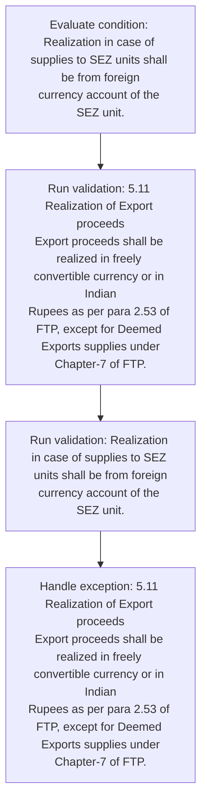
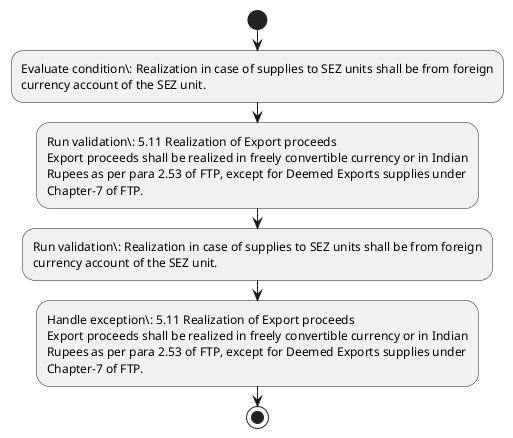

# Chapter 5 / Section 5.11: Realization of Export proceeds

**Chapter Title:** Export Promotion Capital Goods (EPCG) Scheme

**Pages:** 7

**Purpose:** 5.11 Realization of Export proceeds
Export proceeds shall be realized in freely convertible currency or in Indian
Rupees as per para 2.53 of FTP, except for Deemed Exports supplies under
Chapter-7 of FTP.

**Purpose Thanglish:** Indha Realization of Export proceeds section-la, 5.11 Realization of export proceeds
export proceeds kandippa be realized in freely convertible currency or in Indian
Rupees as per para 2.53 of FTP, except for Deemed Exports supplies under
Chapter-7 of FTP.

**Summary:** 5.11 Realization of Export proceeds
Export proceeds shall be realized in freely convertible currency or in Indian
Rupees as per para 2.53 of FTP, except for Deemed Exports supplies under
Chapter-7 of FTP. Exports to SEZ units/Supplies to developers/co-developers
irrespective of currency of realization would also be counted for discharge of
Export Obligation. Realization in case of supplies to SEZ units shall be from foreign
currency account of the SEZ unit.

**Business Meaning:** Realization of Export proceeds governs how DGFT business controls should be applied, validated, and enforced.

**Business Explanation:** Realization of Export proceeds explains the operating rule set that DEKAI should enforce. Key control points include 5.11 Realization of Export proceeds
Export proceeds shall be realized in freely convertible currency or in Indian
Rupees as per para 2.53 of FTP, except for Deemed Exports supplies under
Chapter-7 of FTP.

**Business Explanation Thanglish:** Indha Realization of Export proceeds section-la, Realization of export proceeds explains the operating rule set that DEKAI should enforce. Key control points include 5.11 Realization of export proceeds
export proceeds kandippa be realized in freely convertible currency or in Indian
Rupees as per para 2.53 of FTP, except for Deemed Exports supplies under
Chapter-7 of FTP.

## Business Logic
- 5.11 Realization of Export proceeds
Export proceeds shall be realized in freely convertible currency or in Indian
Rupees as per para 2.53 of FTP, except for Deemed Exports supplies under
Chapter-7 of FTP.
- Realization in case of supplies to SEZ units shall be from foreign
currency account of the SEZ unit.

## Business Rules
- rule_id=CH5-SEC5_11-R001, rule_description=5.11 Realization of Export proceeds
Export proceeds shall be realized in freely convertible currency or in Indian
Rupees as per para 2.53 of FTP, except for Deemed Exports supplies under
Chapter-7 of FTP., trigger=Realization of Export proceeds, condition=Realization in case of supplies to SEZ units shall be from foreign
currency account of the SEZ unit., validation=5.11 Realization of Export proceeds
Export proceeds shall be realized in freely convertible currency or in Indian
Rupees as per para 2.53 of FTP, except for Deemed Exports supplies under
Chapter-7 of FTP., action=Manual review required., exception=5.11 Realization of Export proceeds
Export proceeds shall be realized in freely convertible currency or in Indian
Rupees as per para 2.53 of FTP, except for Deemed Exports supplies under
Chapter-7 of FTP., output=DEKAI should produce a compliance decision for 5.11 - Realization of Export proceeds.
- rule_id=CH5-SEC5_11-R002, rule_description=Realization in case of supplies to SEZ units shall be from foreign
currency account of the SEZ unit., trigger=Realization of Export proceeds, condition=Realization in case of supplies to SEZ units shall be from foreign
currency account of the SEZ unit., validation=Realization in case of supplies to SEZ units shall be from foreign
currency account of the SEZ unit., action=Manual review required., exception=5.11 Realization of Export proceeds
Export proceeds shall be realized in freely convertible currency or in Indian
Rupees as per para 2.53 of FTP, except for Deemed Exports supplies under
Chapter-7 of FTP., output=DEKAI should produce a compliance decision for 5.11 - Realization of Export proceeds.

## Conditions
- Realization in case of supplies to SEZ units shall be from foreign
currency account of the SEZ unit.

## Condition Logic
- id=5.5.11.1, if=Realization in case of supplies to SEZ units shall be from foreign
currency account of the SEZ unit., then=Route for review, source=Realization in case of supplies to SEZ units shall be from foreign
currency account of the SEZ unit.

## Validations
- 5.11 Realization of Export proceeds
Export proceeds shall be realized in freely convertible currency or in Indian
Rupees as per para 2.53 of FTP, except for Deemed Exports supplies under
Chapter-7 of FTP.
- Realization in case of supplies to SEZ units shall be from foreign
currency account of the SEZ unit.

## Exceptions
- 5.11 Realization of Export proceeds
Export proceeds shall be realized in freely convertible currency or in Indian
Rupees as per para 2.53 of FTP, except for Deemed Exports supplies under
Chapter-7 of FTP.

## Dependencies
- 2.53

## Authorities
- None identified

## Required Documents
- None identified

## Timelines
- None identified

## Actions
- None identified

## Workflow
- Evaluate condition: Realization in case of supplies to SEZ units shall be from foreign
currency account of the SEZ unit.
- Run validation: 5.11 Realization of Export proceeds
Export proceeds shall be realized in freely convertible currency or in Indian
Rupees as per para 2.53 of FTP, except for Deemed Exports supplies under
Chapter-7 of FTP.
- Run validation: Realization in case of supplies to SEZ units shall be from foreign
currency account of the SEZ unit.
- Handle exception: 5.11 Realization of Export proceeds
Export proceeds shall be realized in freely convertible currency or in Indian
Rupees as per para 2.53 of FTP, except for Deemed Exports supplies under
Chapter-7 of FTP.

## Workflow ASCII
```text
Realization of Export proceeds
Evaluate condition: Realization in case of supplies to SEZ units shall be from foreign
currency account of the SEZ unit.
   |
   v
Run validation: 5.11 Realization of Export proceeds
Export proceeds shall be realized in freely convertible currency or in Indian
Rupees as per para 2.53 of FTP, except for Deemed Exports supplies under
Chapter-7 of FTP.
   |
   v
Run validation: Realization in case of supplies to SEZ units shall be from foreign
currency account of the SEZ unit.
   |
   v
Handle exception: 5.11 Realization of Export proceeds
Export proceeds shall be realized in freely convertible currency or in Indian
Rupees as per para 2.53 of FTP, except for Deemed Exports supplies under
Chapter-7 of FTP.
```

## Decision Tree
- IF exception applies (5.11 Realization of Export proceeds
Export proceeds shall be realized in freely convertible currency or in Indian
Rupees as per para 2.53 of FTP, except for Deemed Exports supplies under
Chapter-7 of FTP.) THEN route to manual review

## Decision Tree ASCII
```text
Realization of Export proceeds Decision
IF exception applies (5.11 Realization of Export proceeds
Export proceeds shall be realized in freely convertible currency or in Indian
Rupees as per para 2.53 of FTP, except for Deemed Exports supplies under
Chapter-7 of FTP.) THEN route to manual review
```

## Examples
- User asks to process Realization of Export proceeds; the platform checks conditions, validations, and documents before action.

**Real-world Example:** Example: an importer or exporter invokes Realization of Export proceeds, submits the prescribed DGFT records, and DEKAI uses the extracted rules to follow the realization of export proceeds process.

**Real-world Example Thanglish:** Indha Realization of Export proceeds section-la, Example: an importer or exporter invokes Realization of export proceeds, submits the prescribed DGFT records, and DEKAI uses the extracted rules to follow the realization of export proceeds process.

## AI Rules
- IF detected context matches section rule THEN enforce: 5.11 Realization of Export proceeds
Export proceeds shall be realized in freely convertible currency or in Indian
Rupees as per para 2.53 of FTP, except for Deemed Exports supplies under
Chapter-7 of FTP.
- IF detected context matches section rule THEN enforce: Realization in case of supplies to SEZ units shall be from foreign
currency account of the SEZ unit.

## Database Fields
- name=section_code, type=string, required=True, source=parsed_section_heading
- name=section_title, type=string, required=True, source=parsed_section_heading
- name=per_flag, type=boolean, required=False, source=keyword:per
- name=ftp_flag, type=boolean, required=False, source=keyword:FTP
- name=for_flag, type=boolean, required=False, source=keyword:for
- name=sez_flag, type=boolean, required=False, source=keyword:SEZ
- name=the_flag, type=boolean, required=False, source=keyword:the
- name=para_flag, type=boolean, required=False, source=keyword:para
- name=also_flag, type=boolean, required=False, source=keyword:also
- name=case_flag, type=boolean, required=False, source=keyword:case

## API Requirements
- method=GET, path=/api/dgft/sections/5.11, purpose=Retrieve knowledge payload for section 5.11, query_params=['include=workflow,decision_tree,validations'], response_fields=['section', 'title', 'summary', 'conditions', 'validations', 'exceptions', 'workflow', 'decision_tree']
- method=POST, path=/api/dgft/Realization-of-Export-proceeds/validate, purpose=Validate inputs and documents for Realization of Export proceeds, request_fields=['section_code', 'section_title'], response_fields=['status', 'errors', 'warnings', 'next_actions']

## UI Screens
- screen_id=Realization_of_Export_proceeds_overview, name=Realization of Export proceeds Overview, purpose=Show section summary, authority, timeline, and eligibility cues., widgets=['summary_card', 'conditions_table', 'authority_badges', 'timeline_panel']
- screen_id=Realization_of_Export_proceeds_submission, name=Realization of Export proceeds Submission, purpose=Capture applicant data and supporting documents., widgets=['dynamic_form', 'document_uploader', 'validation_panel', 'next_action_footer'], fields=['section_code', 'section_title', 'per_flag', 'ftp_flag', 'for_flag', 'sez_flag', 'the_flag', 'para_flag']
- screen_id=Realization_of_Export_proceeds_exceptions, name=Realization of Export proceeds Exception Review, purpose=Explain exception handling and manual review triggers., widgets=['exception_banner', 'decision_tree', 'case_notes']

## Error Messages
- Validation failed because the section requirements were not fully met.

## FAQ
- question_en=What is the purpose of section 5.11?, answer_en=Realization of Export proceeds explains the operating rule set that DEKAI should enforce. Key control points include 5.11 Realization of Export proceeds
Export proceeds shall be realized in freely convertible currency or in Indian
Rupees as per para 2.53 of FTP, except for Deemed Exports supplies under
Chapter-7 of FTP., question_thanglish=Indha Realization of Export proceeds section-la, What is the purpose of section 5.11?, answer_thanglish=Indha Realization of Export proceeds section-la, Realization of export proceeds explains the operating rule set that DEKAI should enforce. Key control points include 5.11 Realization of export proceeds
export proceeds kandippa be realized in freely convertible currency or in Indian
Rupees as per para 2.53 of FTP, except for Deemed Exports supplies under
Chapter-7 of FTP.
- question_en=What documents are required under Realization of Export proceeds?, answer_en=Not explicitly covered in uploaded documents., question_thanglish=Indha Realization of Export proceeds section-la, What documents are required under Realization of export proceeds?, answer_thanglish=Indha Realization of Export proceeds section-la, Not explicitly covered in uploaded documents.
- question_en=Which authority handles Realization of Export proceeds?, answer_en=Not explicitly covered in uploaded documents., question_thanglish=Indha Realization of Export proceeds section-la, Which authority handles Realization of export proceeds?, answer_thanglish=Indha Realization of Export proceeds section-la, Not explicitly covered in uploaded documents.

## Questions Users May Ask
- What does Realization of Export proceeds require?
- Which documents are needed for Realization of Export proceeds?
- How does DEKAI validate Realization of Export proceeds requests?

## Expected AI Answers
- Realization of Export proceeds requires the platform to interpret the section text, apply the extracted business rules, and present the correct next action.
- Required documents are inferred from the section text: no explicit documents were detected.
- DEKAI validates Realization of Export proceeds by checking conditions, required documents, authority references, and exception clauses before recommending an outcome.

## AI Q&A Examples
- question_en=User asks: How do I comply with Realization of Export proceeds?, answer_en=AI answers: DEKAI should evaluate section 5.11, apply the extracted rules, and guide the user through Evaluate condition: Realization in case of supplies to SEZ units shall be from foreign
currency account of the SEZ unit.., question_thanglish=Indha Realization of Export proceeds section-la, User asks: How do I comply with Realization of export proceeds?, answer_thanglish=Indha Realization of Export proceeds section-la, AI answers: DEKAI should evaluate section 5.11, apply the extracted rules, and guide the user through Evaluate condition: Realization in case of supplies to SEZ units kandippa be from foreign
currency account of the SEZ unit..
- question_en=User asks: Which validations apply to Realization of Export proceeds?, answer_en=AI answers: Applicable validations are 5.11 Realization of Export proceeds
Export proceeds shall be realized in freely convertible currency or in Indian
Rupees as per para 2.53 of FTP, except for Deemed Exports supplies under
Chapter-7 of FTP., Realization in case of supplies to SEZ units shall be from foreign
currency account of the SEZ unit., question_thanglish=Indha Realization of Export proceeds section-la, User asks: Which validations apply to Realization of export proceeds?, answer_thanglish=Indha Realization of Export proceeds section-la, AI answers: Applicable validations are 5.11 Realization of export proceeds
export proceeds kandippa be realized in freely convertible currency or in Indian
Rupees as per para 2.53 of FTP, except for Deemed Exports supplies under
Chapter-7 of FTP., Realization in case of supplies to SEZ units kandippa be from foreign
currency account of the SEZ unit.

## DEKAI AI Implementation Notes
- Capture chapter 5, section 5.11, title, and page references as immutable knowledge metadata.
- Bind validations for Realization of Export proceeds into a rule engine keyed by the rule IDs extracted for this section.
- Trigger manual review when exception clauses are detected.

## DEKAI AI Implementation Notes Thanglish
- Indha Realization of Export proceeds section-la, Capture chapter 5, section 5.11, title, and page references as immutable knowledge metadata.
- Indha Realization of Export proceeds section-la, Bind validations for Realization of export proceeds into a rule engine keyed by the rule IDs extracted for this section.
- Indha Realization of Export proceeds section-la, Trigger manual review when exception clauses are detected.

## AI Metadata
- Keywords: per, FTP, for, SEZ, the, para, also, case, from, unit, shall, under, would, units, Export, freely, Indian, Rupees, except, Deemed
- Search Keywords: per, FTP, for, SEZ, the, para, also, case, from, unit, shall, under, would, units, Export, freely, Indian, Rupees, except, Deemed
- Intent: Provide knowledge guidance for Realization of Export proceeds.
- Tags: 5.11, Realization of Export proceeds, business-rule, dgft
- Related Sections: 
- Related Chapters: 
- Related Rules: 5.11 Realization of Export proceeds
Export proceeds shall be realized in freely convertible currency or in Indian
Rupees as per para 2.53 of FTP, except for Deemed Exports supplies under
Chapter-7 of FTP., Realization in case of supplies to SEZ units shall be from foreign
currency account of the SEZ unit.

## Mermaid


## PlantUML

