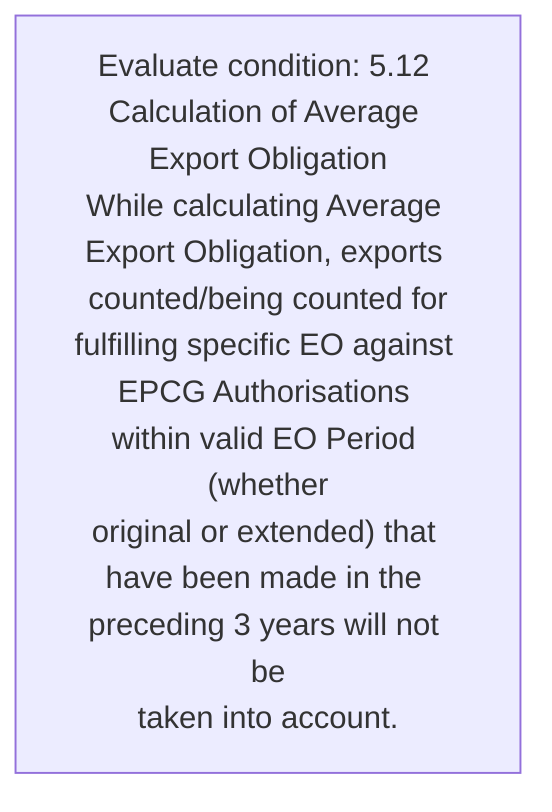
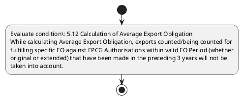

# Chapter 5 / Section 5.12: Calculation of Average Export Obligation

**Chapter Title:** Export Promotion Capital Goods (EPCG) Scheme

**Pages:** 7

**Purpose:** 5.12 Calculation of Average Export Obligation
While calculating Average Export Obligation, exports counted/being counted for
fulfilling specific EO against EPCG Authorisations within valid EO Period (whether
original or extended) that have been made in the preceding 3 years will not be
taken into account.

**Purpose Thanglish:** Indha Calculation of Average Export Obligation section-la, 5.12 Calculation of Average export Obligation
While calculating Average export Obligation, exports counted/being counted for
fulfilling specific EO against EPCG Authorisations within valid EO Period (whether
original or extended) that have been made in the preceding 3 years will not be
taken into account.

**Summary:** 5.12 Calculation of Average Export Obligation
While calculating Average Export Obligation, exports counted/being counted for
fulfilling specific EO against EPCG Authorisations within valid EO Period (whether
original or extended) that have been made in the preceding 3 years will not be
taken into account.

**Business Meaning:** 5.12 Calculation of Average Export Obligation
While calculating Average Export Obligation, exports counted/being counted for
fulfilling specific EO against EPCG Authorisations within valid EO Period (whether
original or extended) that have been made in the preceding 3 years will not be
taken into account.

**Business Explanation:** 5.12 Calculation of Average Export Obligation
While calculating Average Export Obligation, exports counted/being counted for
fulfilling specific EO against EPCG Authorisations within valid EO Period (whether
original or extended) that have been made in the preceding 3 years will not be
taken into account.

**Business Explanation Thanglish:** Indha Calculation of Average Export Obligation section-la, 5.12 Calculation of Average export Obligation
While calculating Average export Obligation, exports counted/being counted for
fulfilling specific EO against EPCG Authorisations within valid EO Period (whether
original or extended) that have been made in the preceding 3 years will not be
taken into account.

## Business Logic
- None identified

## Business Rules
- rule_id=CH5-SEC5_12-R001, rule_description=5.12 Calculation of Average Export Obligation
While calculating Average Export Obligation, exports counted/being counted for
fulfilling specific EO against EPCG Authorisations within valid EO Period (whether
original or extended) that have been made in the preceding 3 years will not be
taken into account., trigger=Calculation of Average Export Obligation, condition=5.12 Calculation of Average Export Obligation
While calculating Average Export Obligation, exports counted/being counted for
fulfilling specific EO against EPCG Authorisations within valid EO Period (whether
original or extended) that have been made in the preceding 3 years will not be
taken into account., validation=Not explicitly covered in uploaded documents., action=Manual review required., exception=No explicit exception found in uploaded documents., output=DEKAI should produce a compliance decision for 5.12 - Calculation of Average Export Obligation.

## Conditions
- 5.12 Calculation of Average Export Obligation
While calculating Average Export Obligation, exports counted/being counted for
fulfilling specific EO against EPCG Authorisations within valid EO Period (whether
original or extended) that have been made in the preceding 3 years will not be
taken into account.

## Condition Logic
- id=5.5.12.1, if=5.12 Calculation of Average Export Obligation
While calculating Average Export Obligation, exports counted/being counted for
fulfilling specific EO against EPCG Authorisations within valid EO Period (whether
original or extended) that have been made in the preceding 3 years will not be
taken into account., then=Route for review, source=5.12 Calculation of Average Export Obligation
While calculating Average Export Obligation, exports counted/being counted for
fulfilling specific EO against EPCG Authorisations within valid EO Period (whether
original or extended) that have been made in the preceding 3 years will not be
taken into account.

## Validations
- None identified

## Exceptions
- None identified

## Dependencies
- None identified

## Authorities
- None identified

## Required Documents
- None identified

## Timelines
- 5.12 Calculation of Average Export Obligation
While calculating Average Export Obligation, exports counted/being counted for
fulfilling specific EO against EPCG Authorisations within valid EO Period (whether
original or extended) that have been made in the preceding 3 years will not be
taken into account.

## Actions
- None identified

## Workflow
- Evaluate condition: 5.12 Calculation of Average Export Obligation
While calculating Average Export Obligation, exports counted/being counted for
fulfilling specific EO against EPCG Authorisations within valid EO Period (whether
original or extended) that have been made in the preceding 3 years will not be
taken into account.

## Workflow ASCII
```text
Calculation of Average Export Obligation
Evaluate condition: 5.12 Calculation of Average Export Obligation
While calculating Average Export Obligation, exports counted/being counted for
fulfilling specific EO against EPCG Authorisations within valid EO Period (whether
original or extended) that have been made in the preceding 3 years will not be
taken into account.
```

## Decision Tree
- IF section 5.12 applies THEN proceed with standard DGFT workflow

## Decision Tree ASCII
```text
Calculation of Average Export Obligation Decision
IF section 5.12 applies THEN proceed with standard DGFT workflow
```

## Examples
- User asks to process Calculation of Average Export Obligation; the platform checks conditions, validations, and documents before action.

**Real-world Example:** Example: an importer or exporter invokes Calculation of Average Export Obligation, submits the prescribed DGFT records, and DEKAI uses the extracted rules to follow the calculation of average export obligation process.

**Real-world Example Thanglish:** Indha Calculation of Average Export Obligation section-la, Example: an importer or exporter invokes Calculation of Average export Obligation, submits the prescribed DGFT records, and DEKAI uses the extracted rules to follow the calculation of average export obligation process.

## AI Rules
- None identified

## Database Fields
- name=section_code, type=string, required=True, source=parsed_section_heading
- name=section_title, type=string, required=True, source=parsed_section_heading
- name=for_flag, type=boolean, required=False, source=keyword:for
- name=the_flag, type=boolean, required=False, source=keyword:the
- name=not_flag, type=boolean, required=False, source=keyword:not
- name=epcg_flag, type=boolean, required=False, source=keyword:EPCG
- name=that_flag, type=boolean, required=False, source=keyword:that
- name=have_flag, type=boolean, required=False, source=keyword:have
- name=been_flag, type=boolean, required=False, source=keyword:been
- name=made_flag, type=boolean, required=False, source=keyword:made

## API Requirements
- method=GET, path=/api/dgft/sections/5.12, purpose=Retrieve knowledge payload for section 5.12, query_params=['include=workflow,decision_tree,validations'], response_fields=['section', 'title', 'summary', 'conditions', 'validations', 'exceptions', 'workflow', 'decision_tree']
- method=POST, path=/api/dgft/Calculation-of-Average-Export-Obligation/validate, purpose=Validate inputs and documents for Calculation of Average Export Obligation, request_fields=['section_code', 'section_title'], response_fields=['status', 'errors', 'warnings', 'next_actions']

## UI Screens
- screen_id=Calculation_of_Average_Export_Obligation_overview, name=Calculation of Average Export Obligation Overview, purpose=Show section summary, authority, timeline, and eligibility cues., widgets=['summary_card', 'conditions_table', 'authority_badges', 'timeline_panel']
- screen_id=Calculation_of_Average_Export_Obligation_submission, name=Calculation of Average Export Obligation Submission, purpose=Capture applicant data and supporting documents., widgets=['dynamic_form', 'document_uploader', 'validation_panel', 'next_action_footer'], fields=['section_code', 'section_title', 'for_flag', 'the_flag', 'not_flag', 'epcg_flag', 'that_flag', 'have_flag']

## Error Messages
- Validation failed because the section requirements were not fully met.

## FAQ
- question_en=What is the purpose of section 5.12?, answer_en=5.12 Calculation of Average Export Obligation
While calculating Average Export Obligation, exports counted/being counted for
fulfilling specific EO against EPCG Authorisations within valid EO Period (whether
original or extended) that have been made in the preceding 3 years will not be
taken into account., question_thanglish=Indha Calculation of Average Export Obligation section-la, What is the purpose of section 5.12?, answer_thanglish=Indha Calculation of Average Export Obligation section-la, 5.12 Calculation of Average export Obligation
While calculating Average export Obligation, exports counted/being counted for
fulfilling specific EO against EPCG Authorisations within valid EO Period (whether
original or extended) that have been made in the preceding 3 years will not be
taken into account.
- question_en=What documents are required under Calculation of Average Export Obligation?, answer_en=Not explicitly covered in uploaded documents., question_thanglish=Indha Calculation of Average Export Obligation section-la, What documents are required under Calculation of Average export Obligation?, answer_thanglish=Indha Calculation of Average Export Obligation section-la, Not explicitly covered in uploaded documents.
- question_en=Which authority handles Calculation of Average Export Obligation?, answer_en=Not explicitly covered in uploaded documents., question_thanglish=Indha Calculation of Average Export Obligation section-la, Which authority handles Calculation of Average export Obligation?, answer_thanglish=Indha Calculation of Average Export Obligation section-la, Not explicitly covered in uploaded documents.

## Questions Users May Ask
- What does Calculation of Average Export Obligation require?
- Which documents are needed for Calculation of Average Export Obligation?
- How does DEKAI validate Calculation of Average Export Obligation requests?

## Expected AI Answers
- Calculation of Average Export Obligation requires the platform to interpret the section text, apply the extracted business rules, and present the correct next action.
- Required documents are inferred from the section text: no explicit documents were detected.
- DEKAI validates Calculation of Average Export Obligation by checking conditions, required documents, authority references, and exception clauses before recommending an outcome.

## AI Q&A Examples
- question_en=User asks: How do I comply with Calculation of Average Export Obligation?, answer_en=AI answers: DEKAI should evaluate section 5.12, apply the extracted rules, and guide the user through Evaluate condition: 5.12 Calculation of Average Export Obligation
While calculating Average Export Obligation, exports counted/being counted for
fulfilling specific EO against EPCG Authorisations within valid EO Period (whether
original or extended) that have been made in the preceding 3 years will not be
taken into account.., question_thanglish=Indha Calculation of Average Export Obligation section-la, User asks: How do I comply with Calculation of Average export Obligation?, answer_thanglish=Indha Calculation of Average Export Obligation section-la, AI answers: DEKAI should evaluate section 5.12, apply the extracted rules, and guide the user through Evaluate condition: 5.12 Calculation of Average export Obligation
While calculating Average export Obligation, exports counted/being counted for
fulfilling specific EO against EPCG Authorisations within valid EO Period (whether
original or extended) that have been made in the preceding 3 years will not be
taken into account..
- question_en=User asks: Which validations apply to Calculation of Average Export Obligation?, answer_en=AI answers: Applicable validations are not explicitly covered in the uploaded documents., question_thanglish=Indha Calculation of Average Export Obligation section-la, User asks: Which validations apply to Calculation of Average export Obligation?, answer_thanglish=Indha Calculation of Average Export Obligation section-la, AI answers: Applicable validations are not explicitly covered in the uploaded documents.

## DEKAI AI Implementation Notes
- Capture chapter 5, section 5.12, title, and page references as immutable knowledge metadata.
- Bind validations for Calculation of Average Export Obligation into a rule engine keyed by the rule IDs extracted for this section.

## DEKAI AI Implementation Notes Thanglish
- Indha Calculation of Average Export Obligation section-la, Capture chapter 5, section 5.12, title, and page references as immutable knowledge metadata.
- Indha Calculation of Average Export Obligation section-la, Bind validations for Calculation of Average export Obligation into a rule engine keyed by the rule IDs extracted for this section.

## AI Metadata
- Keywords: for, the, not, EPCG, that, have, been, made, will, into, While, valid, years, taken, Export, within, Period, Average, exports, counted
- Search Keywords: for, the, not, EPCG, that, have, been, made, will, into, While, valid, years, taken, Export, within, Period, Average, exports, counted
- Intent: Provide knowledge guidance for Calculation of Average Export Obligation.
- Tags: 5.12, Calculation of Average Export Obligation, dgft
- Related Sections: 
- Related Chapters: 
- Related Rules: 

## Mermaid


## PlantUML

