# Chapter 5 / Section 5.14: Report for EO fulfilment

**Chapter Title:** Export Promotion Capital Goods (EPCG) Scheme

**Pages:** 9

**Purpose:** 5.14 Report for EO fulfilment
Authorisation holder shall submit to RA concerned a report on fulfilment of export
obligation through online mode after expiry of first block period of four years and
continuously till the expiry of valid EO period.

**Purpose Thanglish:** Indha Report for EO fulfilment section-la, 5.14 Report for EO fulfilment
Authorisation holder kandippa submit to RA concerned a report on fulfilment of export
obligation through online mode after expiry of first block period of four years and
continuously till the expiry of valid EO period.

**Summary:** 5.14 Report for EO fulfilment
Authorisation holder shall submit to RA concerned a report on fulfilment of export
obligation through online mode after expiry of first block period of four years and
continuously till the expiry of valid EO period. Such report shall contain a statement
with details of Shipping bill/Invoice number/Bill of Export/FIRC number with date
and number, as applicable, duly certified by Chartered Accountant/Cost
Accountant/Company Secretary for evidencing fulfillment of specific as well as
average EO (wherever applicable). 5.15 Automatic Reduction/Enhancement upto 10% Duty saved
amount and pro rata Reduction/Enhancement in export obligation
If authorisation issued has been utilized for import of goods:-
(a) In excess of duty saved amount indicated on the authorisation by not more
than 10%, the authorisation shall be deemed to have been enhanced by
that proportion.

**Business Meaning:** Report for EO fulfilment governs how DGFT business controls should be applied, validated, and enforced.

**Business Explanation:** Report for EO fulfilment explains the operating rule set that DEKAI should enforce. Key control points include 5.14 Report for EO fulfilment
Authorisation holder shall submit to RA concerned a report on fulfilment of export
obligation through online mode after expiry of first block period of four years and
continuously till the expiry of valid EO period. The section also drives actions such as 5.14 Report for EO fulfilment
Authorisation holder shall submit to RA concerned a report on fulfilment of export
obligation through online mode after expiry of first block period of four years and
continuously till the expiry of valid EO period..

**Business Explanation Thanglish:** Indha Report for EO fulfilment section-la, Report for EO fulfilment explains the operating rule set that DEKAI should enforce. Key control points include 5.14 Report for EO fulfilment
Authorisation holder kandippa submit to RA concerned a report on fulfilment of export
obligation through online mode after expiry of first block period of four years and
continuously till the expiry of valid EO period. The section also drives actions such as 5.14 Report for EO fulfilment
Authorisation holder kandippa submit to RA concerned a report on fulfilment of export
obligation through online mode after expiry of first block period of four years and
continuously till the expiry of valid EO period..

## Business Logic
- 5.14 Report for EO fulfilment
Authorisation holder shall submit to RA concerned a report on fulfilment of export
obligation through online mode after expiry of first block period of four years and
continuously till the expiry of valid EO period.
- Such report shall contain a statement
with details of Shipping bill/Invoice number/Bill of Export/FIRC number with date
and number, as applicable, duly certified by Chartered Accountant/Cost
Accountant/Company Secretary for evidencing fulfillment of specific as well as
average EO (wherever applicable).
- 5.15 Automatic Reduction/Enhancement upto 10% Duty saved
amount and pro rata Reduction/Enhancement in export obligation
If authorisation issued has been utilized for import of goods:-
(a) In excess of duty saved amount indicated on the authorisation by not more
than 10%, the authorisation shall be deemed to have been enhanced by
that proportion.
- Customs shall automatically allow clearance of such goods
without endorsement by RA concerned.
- The authorisation holder shall
furnish additional fee to cover excess imports effected, in terms of duty
saved amount, to RA concerned, at the time of application for EODC.
- Export
obligation shall automatically stand enhanced proportionately.
- The
Authorisation holder shall furnish additional BG/LUT to the Customs
Authority.
- (c) Less than the duty saved amount indicated on the authorisation, the export
obligation shall stand reduced on pro-rata basis with reference to actual
utilization of the authorisation.
- 9
9
(v)
Authorisations issued from 5th December, 2017 till 31st March 2023
shall be governed by provisions of paragraph 5.14 of HBP as amended vide PN
No.
- (e) Notwithstanding sub-para (d) above, sub-para (c) above shall
also be applicable for authorisations issued under FTP (2015-20)
(f) Notwithstanding the provisions contained in Para 5.13 of the
Handbook of Procedures (HBP), 2023, in respect of EPCG
Authorisations where the Block-wise Export Obligation (EO)
period (whether original or as extended) is expiring during the
period 01.03.2026 to 31.05.2026, the concerned Block-wise EO
period shall stand automatically extended up to 31.08.2026.
- 5.15 Automatic Reduction/Enhancement upto 10% Duty saved
amount and pro rata Reduction/Enhancement in export obligation
If authorisation issued has been utilized for import of goods:-
(a)
In excess of duty saved amount indicated on the authorisation by not more
than 10%, the authorisation shall be deemed to have been enhanced by
that proportion.
- (c)
Less than the duty saved amount indicated on the authorisation, the export
obligation shall stand reduced on pro-rata basis with reference to actual
utilization of the authorisation.

## Business Rules
- rule_id=CH5-SEC5_14-R001, rule_description=5.14 Report for EO fulfilment
Authorisation holder shall submit to RA concerned a report on fulfilment of export
obligation through online mode after expiry of first block period of four years and
continuously till the expiry of valid EO period., trigger=Report for EO fulfilment, condition=5.14 Report for EO fulfilment
Authorisation holder shall submit to RA concerned a report on fulfilment of export
obligation through online mode after expiry of first block period of four years and
continuously till the expiry of valid EO period., validation=5.14 Report for EO fulfilment
Authorisation holder shall submit to RA concerned a report on fulfilment of export
obligation through online mode after expiry of first block period of four years and
continuously till the expiry of valid EO period., action=5.14 Report for EO fulfilment
Authorisation holder shall submit to RA concerned a report on fulfilment of export
obligation through online mode after expiry of first block period of four years and
continuously till the expiry of valid EO period., exception=(e) Notwithstanding sub-para (d) above, sub-para (c) above shall
also be applicable for authorisations issued under FTP (2015-20)
(f) Notwithstanding the provisions contained in Para 5.13 of the
Handbook of Procedures (HBP), 2023, in respect of EPCG
Authorisations where the Block-wise Export Obligation (EO)
period (whether original or as extended) is expiring during the
period 01.03.2026 to 31.05.2026, the concerned Block-wise EO
period shall stand automatically extended up to 31.08.2026., output=DEKAI should produce a compliance decision for 5.14 - Report for EO fulfilment.
- rule_id=CH5-SEC5_14-R002, rule_description=Such report shall contain a statement
with details of Shipping bill/Invoice number/Bill of Export/FIRC number with date
and number, as applicable, duly certified by Chartered Accountant/Cost
Accountant/Company Secretary for evidencing fulfillment of specific as well as
average EO (wherever applicable)., trigger=Report for EO fulfilment, condition=Such report shall contain a statement
with details of Shipping bill/Invoice number/Bill of Export/FIRC number with date
and number, as applicable, duly certified by Chartered Accountant/Cost
Accountant/Company Secretary for evidencing fulfillment of specific as well as
average EO (wherever applicable)., validation=Such report shall contain a statement
with details of Shipping bill/Invoice number/Bill of Export/FIRC number with date
and number, as applicable, duly certified by Chartered Accountant/Cost
Accountant/Company Secretary for evidencing fulfillment of specific as well as
average EO (wherever applicable)., action=Such report shall contain a statement
with details of Shipping bill/Invoice number/Bill of Export/FIRC number with date
and number, as applicable, duly certified by Chartered Accountant/Cost
Accountant/Company Secretary for evidencing fulfillment of specific as well as
average EO (wherever applicable)., exception=(e) Notwithstanding sub-para (d) above, sub-para (c) above shall
also be applicable for authorisations issued under FTP (2015-20)
(f) Notwithstanding the provisions contained in Para 5.13 of the
Handbook of Procedures (HBP), 2023, in respect of EPCG
Authorisations where the Block-wise Export Obligation (EO)
period (whether original or as extended) is expiring during the
period 01.03.2026 to 31.05.2026, the concerned Block-wise EO
period shall stand automatically extended up to 31.08.2026., output=DEKAI should produce a compliance decision for 5.14 - Report for EO fulfilment.
- rule_id=CH5-SEC5_14-R003, rule_description=5.15 Automatic Reduction/Enhancement upto 10% Duty saved
amount and pro rata Reduction/Enhancement in export obligation
If authorisation issued has been utilized for import of goods:-
(a) In excess of duty saved amount indicated on the authorisation by not more
than 10%, the authorisation shall be deemed to have been enhanced by
that proportion., trigger=Report for EO fulfilment, condition=5.15 Automatic Reduction/Enhancement upto 10% Duty saved
amount and pro rata Reduction/Enhancement in export obligation
If authorisation issued has been utilized for import of goods:-
(a) In excess of duty saved amount indicated on the authorisation by not more
than 10%, the authorisation shall be deemed to have been enhanced by
that proportion., validation=5.15 Automatic Reduction/Enhancement upto 10% Duty saved
amount and pro rata Reduction/Enhancement in export obligation
If authorisation issued has been utilized for import of goods:-
(a) In excess of duty saved amount indicated on the authorisation by not more
than 10%, the authorisation shall be deemed to have been enhanced by
that proportion., action=5.15 Automatic Reduction/Enhancement upto 10% Duty saved
amount and pro rata Reduction/Enhancement in export obligation
If authorisation issued has been utilized for import of goods:-
(a) In excess of duty saved amount indicated on the authorisation by not more
than 10%, the authorisation shall be deemed to have been enhanced by
that proportion., exception=(e) Notwithstanding sub-para (d) above, sub-para (c) above shall
also be applicable for authorisations issued under FTP (2015-20)
(f) Notwithstanding the provisions contained in Para 5.13 of the
Handbook of Procedures (HBP), 2023, in respect of EPCG
Authorisations where the Block-wise Export Obligation (EO)
period (whether original or as extended) is expiring during the
period 01.03.2026 to 31.05.2026, the concerned Block-wise EO
period shall stand automatically extended up to 31.08.2026., output=DEKAI should produce a compliance decision for 5.14 - Report for EO fulfilment.
- rule_id=CH5-SEC5_14-R004, rule_description=Customs shall automatically allow clearance of such goods
without endorsement by RA concerned., trigger=Report for EO fulfilment, condition=(e) Notwithstanding sub-para (d) above, sub-para (c) above shall
also be applicable for authorisations issued under FTP (2015-20)
(f) Notwithstanding the provisions contained in Para 5.13 of the
Handbook of Procedures (HBP), 2023, in respect of EPCG
Authorisations where the Block-wise Export Obligation (EO)
period (whether original or as extended) is expiring during the
period 01.03.2026 to 31.05.2026, the concerned Block-wise EO
period shall stand automatically extended up to 31.08.2026., validation=Customs shall automatically allow clearance of such goods
without endorsement by RA concerned., action=The authorisation holder shall
furnish additional fee to cover excess imports effected, in terms of duty
saved amount, to RA concerned, at the time of application for EODC., exception=(e) Notwithstanding sub-para (d) above, sub-para (c) above shall
also be applicable for authorisations issued under FTP (2015-20)
(f) Notwithstanding the provisions contained in Para 5.13 of the
Handbook of Procedures (HBP), 2023, in respect of EPCG
Authorisations where the Block-wise Export Obligation (EO)
period (whether original or as extended) is expiring during the
period 01.03.2026 to 31.05.2026, the concerned Block-wise EO
period shall stand automatically extended up to 31.08.2026., output=DEKAI should produce a compliance decision for 5.14 - Report for EO fulfilment.
- rule_id=CH5-SEC5_14-R005, rule_description=The authorisation holder shall
furnish additional fee to cover excess imports effected, in terms of duty
saved amount, to RA concerned, at the time of application for EODC., trigger=Report for EO fulfilment, condition=5.15 Automatic Reduction/Enhancement upto 10% Duty saved
amount and pro rata Reduction/Enhancement in export obligation
If authorisation issued has been utilized for import of goods:-
(a)
In excess of duty saved amount indicated on the authorisation by not more
than 10%, the authorisation shall be deemed to have been enhanced by
that proportion., validation=The authorisation holder shall
furnish additional fee to cover excess imports effected, in terms of duty
saved amount, to RA concerned, at the time of application for EODC., action=The
Authorisation holder shall furnish additional BG/LUT to the Customs
Authority., exception=(e) Notwithstanding sub-para (d) above, sub-para (c) above shall
also be applicable for authorisations issued under FTP (2015-20)
(f) Notwithstanding the provisions contained in Para 5.13 of the
Handbook of Procedures (HBP), 2023, in respect of EPCG
Authorisations where the Block-wise Export Obligation (EO)
period (whether original or as extended) is expiring during the
period 01.03.2026 to 31.05.2026, the concerned Block-wise EO
period shall stand automatically extended up to 31.08.2026., output=DEKAI should produce a compliance decision for 5.14 - Report for EO fulfilment.
- rule_id=CH5-SEC5_14-R006, rule_description=Export
obligation shall automatically stand enhanced proportionately., trigger=Report for EO fulfilment, condition=5.15 Automatic Reduction/Enhancement upto 10% Duty saved
amount and pro rata Reduction/Enhancement in export obligation
If authorisation issued has been utilized for import of goods:-
(a)
In excess of duty saved amount indicated on the authorisation by not more
than 10%, the authorisation shall be deemed to have been enhanced by
that proportion., validation=Export
obligation shall automatically stand enhanced proportionately., action=Para 5.14 amended vide Public Notice No., exception=(e) Notwithstanding sub-para (d) above, sub-para (c) above shall
also be applicable for authorisations issued under FTP (2015-20)
(f) Notwithstanding the provisions contained in Para 5.13 of the
Handbook of Procedures (HBP), 2023, in respect of EPCG
Authorisations where the Block-wise Export Obligation (EO)
period (whether original or as extended) is expiring during the
period 01.03.2026 to 31.05.2026, the concerned Block-wise EO
period shall stand automatically extended up to 31.08.2026., output=DEKAI should produce a compliance decision for 5.14 - Report for EO fulfilment.
- rule_id=CH5-SEC5_14-R007, rule_description=The
Authorisation holder shall furnish additional BG/LUT to the Customs
Authority., trigger=Report for EO fulfilment, condition=5.15 Automatic Reduction/Enhancement upto 10% Duty saved
amount and pro rata Reduction/Enhancement in export obligation
If authorisation issued has been utilized for import of goods:-
(a)
In excess of duty saved amount indicated on the authorisation by not more
than 10%, the authorisation shall be deemed to have been enhanced by
that proportion., validation=The
Authorisation holder shall furnish additional BG/LUT to the Customs
Authority., action=9
9
(v)
Authorisations issued from 5th December, 2017 till 31st March 2023
shall be governed by provisions of paragraph 5.14 of HBP as amended vide PN
No., exception=(e) Notwithstanding sub-para (d) above, sub-para (c) above shall
also be applicable for authorisations issued under FTP (2015-20)
(f) Notwithstanding the provisions contained in Para 5.13 of the
Handbook of Procedures (HBP), 2023, in respect of EPCG
Authorisations where the Block-wise Export Obligation (EO)
period (whether original or as extended) is expiring during the
period 01.03.2026 to 31.05.2026, the concerned Block-wise EO
period shall stand automatically extended up to 31.08.2026., output=DEKAI should produce a compliance decision for 5.14 - Report for EO fulfilment.
- rule_id=CH5-SEC5_14-R008, rule_description=(c) Less than the duty saved amount indicated on the authorisation, the export
obligation shall stand reduced on pro-rata basis with reference to actual
utilization of the authorisation., trigger=Report for EO fulfilment, condition=5.15 Automatic Reduction/Enhancement upto 10% Duty saved
amount and pro rata Reduction/Enhancement in export obligation
If authorisation issued has been utilized for import of goods:-
(a)
In excess of duty saved amount indicated on the authorisation by not more
than 10%, the authorisation shall be deemed to have been enhanced by
that proportion., validation=(c) Less than the duty saved amount indicated on the authorisation, the export
obligation shall stand reduced on pro-rata basis with reference to actual
utilization of the authorisation., action=(e) Notwithstanding sub-para (d) above, sub-para (c) above shall
also be applicable for authorisations issued under FTP (2015-20)
(f) Notwithstanding the provisions contained in Para 5.13 of the
Handbook of Procedures (HBP), 2023, in respect of EPCG
Authorisations where the Block-wise Export Obligation (EO)
period (whether original or as extended) is expiring during the
period 01.03.2026 to 31.05.2026, the concerned Block-wise EO
period shall stand automatically extended up to 31.08.2026., exception=(e) Notwithstanding sub-para (d) above, sub-para (c) above shall
also be applicable for authorisations issued under FTP (2015-20)
(f) Notwithstanding the provisions contained in Para 5.13 of the
Handbook of Procedures (HBP), 2023, in respect of EPCG
Authorisations where the Block-wise Export Obligation (EO)
period (whether original or as extended) is expiring during the
period 01.03.2026 to 31.05.2026, the concerned Block-wise EO
period shall stand automatically extended up to 31.08.2026., output=DEKAI should produce a compliance decision for 5.14 - Report for EO fulfilment.
- rule_id=CH5-SEC5_14-R009, rule_description=9
9
(v)
Authorisations issued from 5th December, 2017 till 31st March 2023
shall be governed by provisions of paragraph 5.14 of HBP as amended vide PN
No., trigger=Report for EO fulfilment, condition=5.15 Automatic Reduction/Enhancement upto 10% Duty saved
amount and pro rata Reduction/Enhancement in export obligation
If authorisation issued has been utilized for import of goods:-
(a)
In excess of duty saved amount indicated on the authorisation by not more
than 10%, the authorisation shall be deemed to have been enhanced by
that proportion., validation=9
9
(v)
Authorisations issued from 5th December, 2017 till 31st March 2023
shall be governed by provisions of paragraph 5.14 of HBP as amended vide PN
No., action=5.15 Automatic Reduction/Enhancement upto 10% Duty saved
amount and pro rata Reduction/Enhancement in export obligation
If authorisation issued has been utilized for import of goods:-
(a)
In excess of duty saved amount indicated on the authorisation by not more
than 10%, the authorisation shall be deemed to have been enhanced by
that proportion., exception=(e) Notwithstanding sub-para (d) above, sub-para (c) above shall
also be applicable for authorisations issued under FTP (2015-20)
(f) Notwithstanding the provisions contained in Para 5.13 of the
Handbook of Procedures (HBP), 2023, in respect of EPCG
Authorisations where the Block-wise Export Obligation (EO)
period (whether original or as extended) is expiring during the
period 01.03.2026 to 31.05.2026, the concerned Block-wise EO
period shall stand automatically extended up to 31.08.2026., output=DEKAI should produce a compliance decision for 5.14 - Report for EO fulfilment.
- rule_id=CH5-SEC5_14-R010, rule_description=(e) Notwithstanding sub-para (d) above, sub-para (c) above shall
also be applicable for authorisations issued under FTP (2015-20)
(f) Notwithstanding the provisions contained in Para 5.13 of the
Handbook of Procedures (HBP), 2023, in respect of EPCG
Authorisations where the Block-wise Export Obligation (EO)
period (whether original or as extended) is expiring during the
period 01.03.2026 to 31.05.2026, the concerned Block-wise EO
period shall stand automatically extended up to 31.08.2026., trigger=Report for EO fulfilment, condition=5.15 Automatic Reduction/Enhancement upto 10% Duty saved
amount and pro rata Reduction/Enhancement in export obligation
If authorisation issued has been utilized for import of goods:-
(a)
In excess of duty saved amount indicated on the authorisation by not more
than 10%, the authorisation shall be deemed to have been enhanced by
that proportion., validation=(e) Notwithstanding sub-para (d) above, sub-para (c) above shall
also be applicable for authorisations issued under FTP (2015-20)
(f) Notwithstanding the provisions contained in Para 5.13 of the
Handbook of Procedures (HBP), 2023, in respect of EPCG
Authorisations where the Block-wise Export Obligation (EO)
period (whether original or as extended) is expiring during the
period 01.03.2026 to 31.05.2026, the concerned Block-wise EO
period shall stand automatically extended up to 31.08.2026., action=5.15 Automatic Reduction/Enhancement upto 10% Duty saved
amount and pro rata Reduction/Enhancement in export obligation
If authorisation issued has been utilized for import of goods:-
(a)
In excess of duty saved amount indicated on the authorisation by not more
than 10%, the authorisation shall be deemed to have been enhanced by
that proportion., exception=(e) Notwithstanding sub-para (d) above, sub-para (c) above shall
also be applicable for authorisations issued under FTP (2015-20)
(f) Notwithstanding the provisions contained in Para 5.13 of the
Handbook of Procedures (HBP), 2023, in respect of EPCG
Authorisations where the Block-wise Export Obligation (EO)
period (whether original or as extended) is expiring during the
period 01.03.2026 to 31.05.2026, the concerned Block-wise EO
period shall stand automatically extended up to 31.08.2026., output=DEKAI should produce a compliance decision for 5.14 - Report for EO fulfilment.
- rule_id=CH5-SEC5_14-R011, rule_description=5.15 Automatic Reduction/Enhancement upto 10% Duty saved
amount and pro rata Reduction/Enhancement in export obligation
If authorisation issued has been utilized for import of goods:-
(a)
In excess of duty saved amount indicated on the authorisation by not more
than 10%, the authorisation shall be deemed to have been enhanced by
that proportion., trigger=Report for EO fulfilment, condition=5.15 Automatic Reduction/Enhancement upto 10% Duty saved
amount and pro rata Reduction/Enhancement in export obligation
If authorisation issued has been utilized for import of goods:-
(a)
In excess of duty saved amount indicated on the authorisation by not more
than 10%, the authorisation shall be deemed to have been enhanced by
that proportion., validation=5.15 Automatic Reduction/Enhancement upto 10% Duty saved
amount and pro rata Reduction/Enhancement in export obligation
If authorisation issued has been utilized for import of goods:-
(a)
In excess of duty saved amount indicated on the authorisation by not more
than 10%, the authorisation shall be deemed to have been enhanced by
that proportion., action=5.15 Automatic Reduction/Enhancement upto 10% Duty saved
amount and pro rata Reduction/Enhancement in export obligation
If authorisation issued has been utilized for import of goods:-
(a)
In excess of duty saved amount indicated on the authorisation by not more
than 10%, the authorisation shall be deemed to have been enhanced by
that proportion., exception=(e) Notwithstanding sub-para (d) above, sub-para (c) above shall
also be applicable for authorisations issued under FTP (2015-20)
(f) Notwithstanding the provisions contained in Para 5.13 of the
Handbook of Procedures (HBP), 2023, in respect of EPCG
Authorisations where the Block-wise Export Obligation (EO)
period (whether original or as extended) is expiring during the
period 01.03.2026 to 31.05.2026, the concerned Block-wise EO
period shall stand automatically extended up to 31.08.2026., output=DEKAI should produce a compliance decision for 5.14 - Report for EO fulfilment.
- rule_id=CH5-SEC5_14-R012, rule_description=(c)
Less than the duty saved amount indicated on the authorisation, the export
obligation shall stand reduced on pro-rata basis with reference to actual
utilization of the authorisation., trigger=Report for EO fulfilment, condition=5.15 Automatic Reduction/Enhancement upto 10% Duty saved
amount and pro rata Reduction/Enhancement in export obligation
If authorisation issued has been utilized for import of goods:-
(a)
In excess of duty saved amount indicated on the authorisation by not more
than 10%, the authorisation shall be deemed to have been enhanced by
that proportion., validation=(c)
Less than the duty saved amount indicated on the authorisation, the export
obligation shall stand reduced on pro-rata basis with reference to actual
utilization of the authorisation., action=5.15 Automatic Reduction/Enhancement upto 10% Duty saved
amount and pro rata Reduction/Enhancement in export obligation
If authorisation issued has been utilized for import of goods:-
(a)
In excess of duty saved amount indicated on the authorisation by not more
than 10%, the authorisation shall be deemed to have been enhanced by
that proportion., exception=(e) Notwithstanding sub-para (d) above, sub-para (c) above shall
also be applicable for authorisations issued under FTP (2015-20)
(f) Notwithstanding the provisions contained in Para 5.13 of the
Handbook of Procedures (HBP), 2023, in respect of EPCG
Authorisations where the Block-wise Export Obligation (EO)
period (whether original or as extended) is expiring during the
period 01.03.2026 to 31.05.2026, the concerned Block-wise EO
period shall stand automatically extended up to 31.08.2026., output=DEKAI should produce a compliance decision for 5.14 - Report for EO fulfilment.

## Conditions
- 5.14 Report for EO fulfilment
Authorisation holder shall submit to RA concerned a report on fulfilment of export
obligation through online mode after expiry of first block period of four years and
continuously till the expiry of valid EO period.
- Such report shall contain a statement
with details of Shipping bill/Invoice number/Bill of Export/FIRC number with date
and number, as applicable, duly certified by Chartered Accountant/Cost
Accountant/Company Secretary for evidencing fulfillment of specific as well as
average EO (wherever applicable).
- 5.15 Automatic Reduction/Enhancement upto 10% Duty saved
amount and pro rata Reduction/Enhancement in export obligation
If authorisation issued has been utilized for import of goods:-
(a) In excess of duty saved amount indicated on the authorisation by not more
than 10%, the authorisation shall be deemed to have been enhanced by
that proportion.
- (e) Notwithstanding sub-para (d) above, sub-para (c) above shall
also be applicable for authorisations issued under FTP (2015-20)
(f) Notwithstanding the provisions contained in Para 5.13 of the
Handbook of Procedures (HBP), 2023, in respect of EPCG
Authorisations where the Block-wise Export Obligation (EO)
period (whether original or as extended) is expiring during the
period 01.03.2026 to 31.05.2026, the concerned Block-wise EO
period shall stand automatically extended up to 31.08.2026.
- 5.15 Automatic Reduction/Enhancement upto 10% Duty saved
amount and pro rata Reduction/Enhancement in export obligation
If authorisation issued has been utilized for import of goods:-
(a)
In excess of duty saved amount indicated on the authorisation by not more
than 10%, the authorisation shall be deemed to have been enhanced by
that proportion.

## Condition Logic
- id=5.5.14.1, if=5.14 Report for EO fulfilment
Authorisation holder shall submit to RA concerned a report on fulfilment of export
obligation through online mode after expiry of first block period of four years and
continuously till the expiry of valid EO period., then=5.14 Report for EO fulfilment
Authorisation holder shall submit to RA concerned a report on fulfilment of export
obligation through online mode after expiry of first block period of four years and
continuously till the expiry of valid EO period., source=5.14 Report for EO fulfilment
Authorisation holder shall submit to RA concerned a report on fulfilment of export
obligation through online mode after expiry of first block period of four years and
continuously till the expiry of valid EO period.
- id=5.5.14.2, if=Such report shall contain a statement
with details of Shipping bill/Invoice number/Bill of Export/FIRC number with date
and number, as applicable, duly certified by Chartered Accountant/Cost
Accountant/Company Secretary for evidencing fulfillment of specific as well as
average EO (wherever applicable)., then=5.14 Report for EO fulfilment
Authorisation holder shall submit to RA concerned a report on fulfilment of export
obligation through online mode after expiry of first block period of four years and
continuously till the expiry of valid EO period., source=Such report shall contain a statement
with details of Shipping bill/Invoice number/Bill of Export/FIRC number with date
and number, as applicable, duly certified by Chartered Accountant/Cost
Accountant/Company Secretary for evidencing fulfillment of specific as well as
average EO (wherever applicable).
- id=5.5.14.3, if=5.15 Automatic Reduction/Enhancement upto 10% Duty saved
amount and pro rata Reduction/Enhancement in export obligation
If authorisation issued has been utilized for import of goods:-
(a) In excess of duty saved amount indicated on the authorisation by not more
than 10%, the authorisation shall be deemed to have been enhanced by
that proportion., then=5.14 Report for EO fulfilment
Authorisation holder shall submit to RA concerned a report on fulfilment of export
obligation through online mode after expiry of first block period of four years and
continuously till the expiry of valid EO period., source=5.15 Automatic Reduction/Enhancement upto 10% Duty saved
amount and pro rata Reduction/Enhancement in export obligation
If authorisation issued has been utilized for import of goods:-
(a) In excess of duty saved amount indicated on the authorisation by not more
than 10%, the authorisation shall be deemed to have been enhanced by
that proportion.
- id=5.5.14.4, if=(e) Notwithstanding sub-para (d) above, sub-para (c) above shall
also be applicable for authorisations issued under FTP (2015-20)
(f) Notwithstanding the provisions contained in Para 5.13 of the
Handbook of Procedures (HBP), 2023, in respect of EPCG
Authorisations where the Block-wise Export Obligation (EO)
period (whether original or as extended) is expiring during the
period 01.03.2026 to 31.05.2026, the concerned Block-wise EO
period shall stand automatically extended up to 31.08.2026., then=5.14 Report for EO fulfilment
Authorisation holder shall submit to RA concerned a report on fulfilment of export
obligation through online mode after expiry of first block period of four years and
continuously till the expiry of valid EO period., source=(e) Notwithstanding sub-para (d) above, sub-para (c) above shall
also be applicable for authorisations issued under FTP (2015-20)
(f) Notwithstanding the provisions contained in Para 5.13 of the
Handbook of Procedures (HBP), 2023, in respect of EPCG
Authorisations where the Block-wise Export Obligation (EO)
period (whether original or as extended) is expiring during the
period 01.03.2026 to 31.05.2026, the concerned Block-wise EO
period shall stand automatically extended up to 31.08.2026.
- id=5.5.14.5, if=5.15 Automatic Reduction/Enhancement upto 10% Duty saved
amount and pro rata Reduction/Enhancement in export obligation
If authorisation issued has been utilized for import of goods:-
(a)
In excess of duty saved amount indicated on the authorisation by not more
than 10%, the authorisation shall be deemed to have been enhanced by
that proportion., then=5.14 Report for EO fulfilment
Authorisation holder shall submit to RA concerned a report on fulfilment of export
obligation through online mode after expiry of first block period of four years and
continuously till the expiry of valid EO period., source=5.15 Automatic Reduction/Enhancement upto 10% Duty saved
amount and pro rata Reduction/Enhancement in export obligation
If authorisation issued has been utilized for import of goods:-
(a)
In excess of duty saved amount indicated on the authorisation by not more
than 10%, the authorisation shall be deemed to have been enhanced by
that proportion.

## Validations
- 5.14 Report for EO fulfilment
Authorisation holder shall submit to RA concerned a report on fulfilment of export
obligation through online mode after expiry of first block period of four years and
continuously till the expiry of valid EO period.
- Such report shall contain a statement
with details of Shipping bill/Invoice number/Bill of Export/FIRC number with date
and number, as applicable, duly certified by Chartered Accountant/Cost
Accountant/Company Secretary for evidencing fulfillment of specific as well as
average EO (wherever applicable).
- 5.15 Automatic Reduction/Enhancement upto 10% Duty saved
amount and pro rata Reduction/Enhancement in export obligation
If authorisation issued has been utilized for import of goods:-
(a) In excess of duty saved amount indicated on the authorisation by not more
than 10%, the authorisation shall be deemed to have been enhanced by
that proportion.
- Customs shall automatically allow clearance of such goods
without endorsement by RA concerned.
- The authorisation holder shall
furnish additional fee to cover excess imports effected, in terms of duty
saved amount, to RA concerned, at the time of application for EODC.
- Export
obligation shall automatically stand enhanced proportionately.
- The
Authorisation holder shall furnish additional BG/LUT to the Customs
Authority.
- (c) Less than the duty saved amount indicated on the authorisation, the export
obligation shall stand reduced on pro-rata basis with reference to actual
utilization of the authorisation.
- 9
9
(v)
Authorisations issued from 5th December, 2017 till 31st March 2023
shall be governed by provisions of paragraph 5.14 of HBP as amended vide PN
No.
- (e) Notwithstanding sub-para (d) above, sub-para (c) above shall
also be applicable for authorisations issued under FTP (2015-20)
(f) Notwithstanding the provisions contained in Para 5.13 of the
Handbook of Procedures (HBP), 2023, in respect of EPCG
Authorisations where the Block-wise Export Obligation (EO)
period (whether original or as extended) is expiring during the
period 01.03.2026 to 31.05.2026, the concerned Block-wise EO
period shall stand automatically extended up to 31.08.2026.
- 5.15 Automatic Reduction/Enhancement upto 10% Duty saved
amount and pro rata Reduction/Enhancement in export obligation
If authorisation issued has been utilized for import of goods:-
(a)
In excess of duty saved amount indicated on the authorisation by not more
than 10%, the authorisation shall be deemed to have been enhanced by
that proportion.
- (c)
Less than the duty saved amount indicated on the authorisation, the export
obligation shall stand reduced on pro-rata basis with reference to actual
utilization of the authorisation.

## Exceptions
- (e) Notwithstanding sub-para (d) above, sub-para (c) above shall
also be applicable for authorisations issued under FTP (2015-20)
(f) Notwithstanding the provisions contained in Para 5.13 of the
Handbook of Procedures (HBP), 2023, in respect of EPCG
Authorisations where the Block-wise Export Obligation (EO)
period (whether original or as extended) is expiring during the
period 01.03.2026 to 31.05.2026, the concerned Block-wise EO
period shall stand automatically extended up to 31.08.2026.

## Dependencies
- 5.13
- 5.07
- 5.12
- 5.20

## Authorities
- RA
- Authorisation holder shall submit to RA
- Customs
- Authorisation holder shall furnish additional BG/LUT to the Customs

## Required Documents
- Shipping bill/Invoice number/Bill
- The authorisation holder shall
furnish additional fee to cover excess imports effected, in terms of duty
saved amount, to RA concerned, at the time of application for EODC.

## Timelines
- 5.14 Report for EO fulfilment
Authorisation holder shall submit to RA concerned a report on fulfilment of export
obligation through online mode after expiry of first block period of four years and
continuously till the expiry of valid EO period.

## Actions
- 5.14 Report for EO fulfilment
Authorisation holder shall submit to RA concerned a report on fulfilment of export
obligation through online mode after expiry of first block period of four years and
continuously till the expiry of valid EO period.
- Such report shall contain a statement
with details of Shipping bill/Invoice number/Bill of Export/FIRC number with date
and number, as applicable, duly certified by Chartered Accountant/Cost
Accountant/Company Secretary for evidencing fulfillment of specific as well as
average EO (wherever applicable).
- 5.15 Automatic Reduction/Enhancement upto 10% Duty saved
amount and pro rata Reduction/Enhancement in export obligation
If authorisation issued has been utilized for import of goods:-
(a) In excess of duty saved amount indicated on the authorisation by not more
than 10%, the authorisation shall be deemed to have been enhanced by
that proportion.
- The authorisation holder shall
furnish additional fee to cover excess imports effected, in terms of duty
saved amount, to RA concerned, at the time of application for EODC.
- The
Authorisation holder shall furnish additional BG/LUT to the Customs
Authority.
- Para 5.14 amended vide Public Notice No.
- 9
9
(v)
Authorisations issued from 5th December, 2017 till 31st March 2023
shall be governed by provisions of paragraph 5.14 of HBP as amended vide PN
No.
- (e) Notwithstanding sub-para (d) above, sub-para (c) above shall
also be applicable for authorisations issued under FTP (2015-20)
(f) Notwithstanding the provisions contained in Para 5.13 of the
Handbook of Procedures (HBP), 2023, in respect of EPCG
Authorisations where the Block-wise Export Obligation (EO)
period (whether original or as extended) is expiring during the
period 01.03.2026 to 31.05.2026, the concerned Block-wise EO
period shall stand automatically extended up to 31.08.2026.
- 5.15 Automatic Reduction/Enhancement upto 10% Duty saved
amount and pro rata Reduction/Enhancement in export obligation
If authorisation issued has been utilized for import of goods:-
(a)
In excess of duty saved amount indicated on the authorisation by not more
than 10%, the authorisation shall be deemed to have been enhanced by
that proportion.

## Workflow
- Evaluate condition: 5.14 Report for EO fulfilment
Authorisation holder shall submit to RA concerned a report on fulfilment of export
obligation through online mode after expiry of first block period of four years and
continuously till the expiry of valid EO period.
- Evaluate condition: Such report shall contain a statement
with details of Shipping bill/Invoice number/Bill of Export/FIRC number with date
and number, as applicable, duly certified by Chartered Accountant/Cost
Accountant/Company Secretary for evidencing fulfillment of specific as well as
average EO (wherever applicable).
- Evaluate condition: 5.15 Automatic Reduction/Enhancement upto 10% Duty saved
amount and pro rata Reduction/Enhancement in export obligation
If authorisation issued has been utilized for import of goods:-
(a) In excess of duty saved amount indicated on the authorisation by not more
than 10%, the authorisation shall be deemed to have been enhanced by
that proportion.
- 5.14 Report for EO fulfilment
Authorisation holder shall submit to RA concerned a report on fulfilment of export
obligation through online mode after expiry of first block period of four years and
continuously till the expiry of valid EO period.
- Such report shall contain a statement
with details of Shipping bill/Invoice number/Bill of Export/FIRC number with date
and number, as applicable, duly certified by Chartered Accountant/Cost
Accountant/Company Secretary for evidencing fulfillment of specific as well as
average EO (wherever applicable).
- 5.15 Automatic Reduction/Enhancement upto 10% Duty saved
amount and pro rata Reduction/Enhancement in export obligation
If authorisation issued has been utilized for import of goods:-
(a) In excess of duty saved amount indicated on the authorisation by not more
than 10%, the authorisation shall be deemed to have been enhanced by
that proportion.
- The authorisation holder shall
furnish additional fee to cover excess imports effected, in terms of duty
saved amount, to RA concerned, at the time of application for EODC.
- The
Authorisation holder shall furnish additional BG/LUT to the Customs
Authority.
- Para 5.14 amended vide Public Notice No.
- Run validation: 5.14 Report for EO fulfilment
Authorisation holder shall submit to RA concerned a report on fulfilment of export
obligation through online mode after expiry of first block period of four years and
continuously till the expiry of valid EO period.
- Run validation: Such report shall contain a statement
with details of Shipping bill/Invoice number/Bill of Export/FIRC number with date
and number, as applicable, duly certified by Chartered Accountant/Cost
Accountant/Company Secretary for evidencing fulfillment of specific as well as
average EO (wherever applicable).
- Run validation: 5.15 Automatic Reduction/Enhancement upto 10% Duty saved
amount and pro rata Reduction/Enhancement in export obligation
If authorisation issued has been utilized for import of goods:-
(a) In excess of duty saved amount indicated on the authorisation by not more
than 10%, the authorisation shall be deemed to have been enhanced by
that proportion.
- Handle exception: (e) Notwithstanding sub-para (d) above, sub-para (c) above shall
also be applicable for authorisations issued under FTP (2015-20)
(f) Notwithstanding the provisions contained in Para 5.13 of the
Handbook of Procedures (HBP), 2023, in respect of EPCG
Authorisations where the Block-wise Export Obligation (EO)
period (whether original or as extended) is expiring during the
period 01.03.2026 to 31.05.2026, the concerned Block-wise EO
period shall stand automatically extended up to 31.08.2026.

## Workflow ASCII
```text
Report for EO fulfilment
Evaluate condition: 5.14 Report for EO fulfilment
Authorisation holder shall submit to RA concerned a report on fulfilment of export
obligation through online mode after expiry of first block period of four years and
continuously till the expiry of valid EO period.
   |
   v
Evaluate condition: Such report shall contain a statement
with details of Shipping bill/Invoice number/Bill of Export/FIRC number with date
and number, as applicable, duly certified by Chartered Accountant/Cost
Accountant/Company Secretary for evidencing fulfillment of specific as well as
average EO (wherever applicable).
   |
   v
Evaluate condition: 5.15 Automatic Reduction/Enhancement upto 10% Duty saved
amount and pro rata Reduction/Enhancement in export obligation
If authorisation issued has been utilized for import of goods:-
(a) In excess of duty saved amount indicated on the authorisation by not more
than 10%, the authorisation shall be deemed to have been enhanced by
that proportion.
   |
   v
5.14 Report for EO fulfilment
Authorisation holder shall submit to RA concerned a report on fulfilment of export
obligation through online mode after expiry of first block period of four years and
continuously till the expiry of valid EO period.
   |
   v
Such report shall contain a statement
with details of Shipping bill/Invoice number/Bill of Export/FIRC number with date
and number, as applicable, duly certified by Chartered Accountant/Cost
Accountant/Company Secretary for evidencing fulfillment of specific as well as
average EO (wherever applicable).
   |
   v
5.15 Automatic Reduction/Enhancement upto 10% Duty saved
amount and pro rata Reduction/Enhancement in export obligation
If authorisation issued has been utilized for import of goods:-
(a) In excess of duty saved amount indicated on the authorisation by not more
than 10%, the authorisation shall be deemed to have been enhanced by
that proportion.
   |
   v
The authorisation holder shall
furnish additional fee to cover excess imports effected, in terms of duty
saved amount, to RA concerned, at the time of application for EODC.
   |
   v
The
Authorisation holder shall furnish additional BG/LUT to the Customs
Authority.
   |
   v
Para 5.14 amended vide Public Notice No.
   |
   v
Run validation: 5.14 Report for EO fulfilment
Authorisation holder shall submit to RA concerned a report on fulfilment of export
obligation through online mode after expiry of first block period of four years and
continuously till the expiry of valid EO period.
   |
   v
Run validation: Such report shall contain a statement
with details of Shipping bill/Invoice number/Bill of Export/FIRC number with date
and number, as applicable, duly certified by Chartered Accountant/Cost
Accountant/Company Secretary for evidencing fulfillment of specific as well as
average EO (wherever applicable).
   |
   v
Run validation: 5.15 Automatic Reduction/Enhancement upto 10% Duty saved
amount and pro rata Reduction/Enhancement in export obligation
If authorisation issued has been utilized for import of goods:-
(a) In excess of duty saved amount indicated on the authorisation by not more
than 10%, the authorisation shall be deemed to have been enhanced by
that proportion.
   |
   v
Handle exception: (e) Notwithstanding sub-para (d) above, sub-para (c) above shall
also be applicable for authorisations issued under FTP (2015-20)
(f) Notwithstanding the provisions contained in Para 5.13 of the
Handbook of Procedures (HBP), 2023, in respect of EPCG
Authorisations where the Block-wise Export Obligation (EO)
period (whether original or as extended) is expiring during the
period 01.03.2026 to 31.05.2026, the concerned Block-wise EO
period shall stand automatically extended up to 31.08.2026.
```

## Decision Tree
- IF 5.14 Report for EO fulfilment
Authorisation holder shall submit to RA concerned a report on fulfilment of export
obligation through online mode after expiry of first block period of four years and
continuously till the expiry of valid EO period. THEN 5.14 Report for EO fulfilment
Authorisation holder shall submit to RA concerned a report on fulfilment of export
obligation through online mode after expiry of first block period of four years and
continuously till the expiry of valid EO period.
- IF Such report shall contain a statement
with details of Shipping bill/Invoice number/Bill of Export/FIRC number with date
and number, as applicable, duly certified by Chartered Accountant/Cost
Accountant/Company Secretary for evidencing fulfillment of specific as well as
average EO (wherever applicable). THEN 5.14 Report for EO fulfilment
Authorisation holder shall submit to RA concerned a report on fulfilment of export
obligation through online mode after expiry of first block period of four years and
continuously till the expiry of valid EO period.
- IF 5.15 Automatic Reduction/Enhancement upto 10% Duty saved
amount and pro rata Reduction/Enhancement in export obligation
If authorisation issued has been utilized for import of goods:-
(a) In excess of duty saved amount indicated on the authorisation by not more
than 10%, the authorisation shall be deemed to have been enhanced by
that proportion. THEN 5.14 Report for EO fulfilment
Authorisation holder shall submit to RA concerned a report on fulfilment of export
obligation through online mode after expiry of first block period of four years and
continuously till the expiry of valid EO period.
- IF (e) Notwithstanding sub-para (d) above, sub-para (c) above shall
also be applicable for authorisations issued under FTP (2015-20)
(f) Notwithstanding the provisions contained in Para 5.13 of the
Handbook of Procedures (HBP), 2023, in respect of EPCG
Authorisations where the Block-wise Export Obligation (EO)
period (whether original or as extended) is expiring during the
period 01.03.2026 to 31.05.2026, the concerned Block-wise EO
period shall stand automatically extended up to 31.08.2026. THEN 5.14 Report for EO fulfilment
Authorisation holder shall submit to RA concerned a report on fulfilment of export
obligation through online mode after expiry of first block period of four years and
continuously till the expiry of valid EO period.
- IF 5.15 Automatic Reduction/Enhancement upto 10% Duty saved
amount and pro rata Reduction/Enhancement in export obligation
If authorisation issued has been utilized for import of goods:-
(a)
In excess of duty saved amount indicated on the authorisation by not more
than 10%, the authorisation shall be deemed to have been enhanced by
that proportion. THEN 5.14 Report for EO fulfilment
Authorisation holder shall submit to RA concerned a report on fulfilment of export
obligation through online mode after expiry of first block period of four years and
continuously till the expiry of valid EO period.
- IF exception applies ((e) Notwithstanding sub-para (d) above, sub-para (c) above shall
also be applicable for authorisations issued under FTP (2015-20)
(f) Notwithstanding the provisions contained in Para 5.13 of the
Handbook of Procedures (HBP), 2023, in respect of EPCG
Authorisations where the Block-wise Export Obligation (EO)
period (whether original or as extended) is expiring during the
period 01.03.2026 to 31.05.2026, the concerned Block-wise EO
period shall stand automatically extended up to 31.08.2026.) THEN route to manual review

## Decision Tree ASCII
```text
Report for EO fulfilment Decision
IF 5.14 Report for EO fulfilment
Authorisation holder shall submit to RA concerned a report on fulfilment of export
obligation through online mode after expiry of first block period of four years and
continuously till the expiry of valid EO period. THEN 5.14 Report for EO fulfilment
Authorisation holder shall submit to RA concerned a report on fulfilment of export
obligation through online mode after expiry of first block period of four years and
continuously till the expiry of valid EO period.
   |
   v
IF Such report shall contain a statement
with details of Shipping bill/Invoice number/Bill of Export/FIRC number with date
and number, as applicable, duly certified by Chartered Accountant/Cost
Accountant/Company Secretary for evidencing fulfillment of specific as well as
average EO (wherever applicable). THEN 5.14 Report for EO fulfilment
Authorisation holder shall submit to RA concerned a report on fulfilment of export
obligation through online mode after expiry of first block period of four years and
continuously till the expiry of valid EO period.
   |
   v
IF 5.15 Automatic Reduction/Enhancement upto 10% Duty saved
amount and pro rata Reduction/Enhancement in export obligation
If authorisation issued has been utilized for import of goods:-
(a) In excess of duty saved amount indicated on the authorisation by not more
than 10%, the authorisation shall be deemed to have been enhanced by
that proportion. THEN 5.14 Report for EO fulfilment
Authorisation holder shall submit to RA concerned a report on fulfilment of export
obligation through online mode after expiry of first block period of four years and
continuously till the expiry of valid EO period.
   |
   v
IF (e) Notwithstanding sub-para (d) above, sub-para (c) above shall
also be applicable for authorisations issued under FTP (2015-20)
(f) Notwithstanding the provisions contained in Para 5.13 of the
Handbook of Procedures (HBP), 2023, in respect of EPCG
Authorisations where the Block-wise Export Obligation (EO)
period (whether original or as extended) is expiring during the
period 01.03.2026 to 31.05.2026, the concerned Block-wise EO
period shall stand automatically extended up to 31.08.2026. THEN 5.14 Report for EO fulfilment
Authorisation holder shall submit to RA concerned a report on fulfilment of export
obligation through online mode after expiry of first block period of four years and
continuously till the expiry of valid EO period.
   |
   v
IF 5.15 Automatic Reduction/Enhancement upto 10% Duty saved
amount and pro rata Reduction/Enhancement in export obligation
If authorisation issued has been utilized for import of goods:-
(a)
In excess of duty saved amount indicated on the authorisation by not more
than 10%, the authorisation shall be deemed to have been enhanced by
that proportion. THEN 5.14 Report for EO fulfilment
Authorisation holder shall submit to RA concerned a report on fulfilment of export
obligation through online mode after expiry of first block period of four years and
continuously till the expiry of valid EO period.
   |
   v
IF exception applies ((e) Notwithstanding sub-para (d) above, sub-para (c) above shall
also be applicable for authorisations issued under FTP (2015-20)
(f) Notwithstanding the provisions contained in Para 5.13 of the
Handbook of Procedures (HBP), 2023, in respect of EPCG
Authorisations where the Block-wise Export Obligation (EO)
period (whether original or as extended) is expiring during the
period 01.03.2026 to 31.05.2026, the concerned Block-wise EO
period shall stand automatically extended up to 31.08.2026.) THEN route to manual review
```

## Examples
- User asks to process Report for EO fulfilment; the platform checks conditions, validations, and documents before action.

**Real-world Example:** Example: an importer or exporter invokes Report for EO fulfilment, submits Shipping bill/Invoice number/Bill, The authorisation holder shall
furnish additional fee to cover excess imports effected, in terms of duty
saved amount, to RA concerned, at the time of application for EODC., and DEKAI uses the extracted rules to 5.14 report for eo fulfilment
authorisation holder shall submit to ra concerned a report on fulfilment of export
obligation through online mode after expiry of first block period of four years and
continuously till the expiry of valid eo period..

**Real-world Example Thanglish:** Indha Report for EO fulfilment section-la, Example: an importer or exporter invokes Report for EO fulfilment, submits Shipping bill/Invoice number/Bill, The authorisation holder kandippa
furnish additional fee to cover excess imports effected, in terms of duty
saved amount, to RA concerned, at the time of application for EODC., and DEKAI uses the extracted rules to 5.14 report for eo fulfilment
authorisation holder kandippa submit to ra concerned a report on fulfilment of export
obligation through online mode after expiry of first block period of four years and
continuously till the expiry of valid eo period..

## AI Rules
- IF detected context matches section rule THEN enforce: 5.14 Report for EO fulfilment
Authorisation holder shall submit to RA concerned a report on fulfilment of export
obligation through online mode after expiry of first block period of four years and
continuously till the expiry of valid EO period.
- IF detected context matches section rule THEN enforce: Such report shall contain a statement
with details of Shipping bill/Invoice number/Bill of Export/FIRC number with date
and number, as applicable, duly certified by Chartered Accountant/Cost
Accountant/Company Secretary for evidencing fulfillment of specific as well as
average EO (wherever applicable).
- IF detected context matches section rule THEN enforce: 5.15 Automatic Reduction/Enhancement upto 10% Duty saved
amount and pro rata Reduction/Enhancement in export obligation
If authorisation issued has been utilized for import of goods:-
(a) In excess of duty saved amount indicated on the authorisation by not more
than 10%, the authorisation shall be deemed to have been enhanced by
that proportion.
- IF detected context matches section rule THEN enforce: Customs shall automatically allow clearance of such goods
without endorsement by RA concerned.
- IF detected context matches section rule THEN enforce: The authorisation holder shall
furnish additional fee to cover excess imports effected, in terms of duty
saved amount, to RA concerned, at the time of application for EODC.
- IF detected context matches section rule THEN enforce: Export
obligation shall automatically stand enhanced proportionately.
- IF validations pass THEN recommend action: 5.14 Report for EO fulfilment
Authorisation holder shall submit to RA concerned a report on fulfilment of export
obligation through online mode after expiry of first block period of four years and
continuously till the expiry of valid EO period.

## Database Fields
- name=section_code, type=string, required=True, source=parsed_section_heading
- name=section_title, type=string, required=True, source=parsed_section_heading
- name=for_flag, type=boolean, required=False, source=keyword:for
- name=and_flag, type=boolean, required=False, source=keyword:and
- name=the_flag, type=boolean, required=False, source=keyword:the
- name=pro_flag, type=boolean, required=False, source=keyword:pro
- name=has_flag, type=boolean, required=False, source=keyword:has
- name=not_flag, type=boolean, required=False, source=keyword:not
- name=fee_flag, type=boolean, required=False, source=keyword:fee
- name=per_flag, type=boolean, required=False, source=keyword:per
- name=document_1_submitted, type=boolean, required=True, source=Shipping bill/Invoice number/Bill
- name=document_2_submitted, type=boolean, required=True, source=The authorisation holder shall
furnish additional fee to cover excess imports effected, in terms of duty
saved amount, to RA concerned, at the time of application for EODC.

## API Requirements
- method=GET, path=/api/dgft/sections/5.14, purpose=Retrieve knowledge payload for section 5.14, query_params=['include=workflow,decision_tree,validations'], response_fields=['section', 'title', 'summary', 'conditions', 'validations', 'exceptions', 'workflow', 'decision_tree']
- method=POST, path=/api/dgft/Report-for-EO-fulfilment/validate, purpose=Validate inputs and documents for Report for EO fulfilment, request_fields=['section_code', 'section_title', 'document_1_submitted', 'document_2_submitted'], response_fields=['status', 'errors', 'warnings', 'next_actions']
- method=POST, path=/api/dgft/Report-for-EO-fulfilment/execute, purpose=Trigger business action for 5.14 Report for EO fulfilment
Authorisation holder shall submit to RA concerned a report on fulfilment of export
obligation through online mode after expiry of first block period of four years and
continuously till the expiry of valid EO period., request_fields=['section_code', 'section_title', 'document_1_submitted', 'document_2_submitted'], response_fields=['reference_id', 'status', 'authority', 'timeline']

## UI Screens
- screen_id=Report_for_EO_fulfilment_overview, name=Report for EO fulfilment Overview, purpose=Show section summary, authority, timeline, and eligibility cues., widgets=['summary_card', 'conditions_table', 'authority_badges', 'timeline_panel']
- screen_id=Report_for_EO_fulfilment_submission, name=Report for EO fulfilment Submission, purpose=Capture applicant data and supporting documents., widgets=['dynamic_form', 'document_uploader', 'validation_panel', 'next_action_footer'], fields=['section_code', 'section_title', 'for_flag', 'and_flag', 'the_flag', 'pro_flag', 'has_flag', 'not_flag']
- screen_id=Report_for_EO_fulfilment_exceptions, name=Report for EO fulfilment Exception Review, purpose=Explain exception handling and manual review triggers., widgets=['exception_banner', 'decision_tree', 'case_notes']

## Error Messages
- Validation failed because the section requirements were not fully met.

## FAQ
- question_en=What is the purpose of section 5.14?, answer_en=Report for EO fulfilment explains the operating rule set that DEKAI should enforce. Key control points include 5.14 Report for EO fulfilment
Authorisation holder shall submit to RA concerned a report on fulfilment of export
obligation through online mode after expiry of first block period of four years and
continuously till the expiry of valid EO period. The section also drives actions such as 5.14 Report for EO fulfilment
Authorisation holder shall submit to RA concerned a report on fulfilment of export
obligation through online mode after expiry of first block period of four years and
continuously till the expiry of valid EO period.., question_thanglish=Indha Report for EO fulfilment section-la, What is the purpose of section 5.14?, answer_thanglish=Indha Report for EO fulfilment section-la, Report for EO fulfilment explains the operating rule set that DEKAI should enforce. Key control points include 5.14 Report for EO fulfilment
Authorisation holder kandippa submit to RA concerned a report on fulfilment of export
obligation through online mode after expiry of first block period of four years and
continuously till the expiry of valid EO period. The section also drives actions such as 5.14 Report for EO fulfilment
Authorisation holder kandippa submit to RA concerned a report on fulfilment of export
obligation through online mode after expiry of first block period of four years and
continuously till the expiry of valid EO period..
- question_en=What documents are required under Report for EO fulfilment?, answer_en=Shipping bill/Invoice number/Bill, The authorisation holder shall
furnish additional fee to cover excess imports effected, in terms of duty
saved amount, to RA concerned, at the time of application for EODC., question_thanglish=Indha Report for EO fulfilment section-la, What documents are required under Report for EO fulfilment?, answer_thanglish=Indha Report for EO fulfilment section-la, Shipping bill/Invoice number/Bill, The authorisation holder kandippa
furnish additional fee to cover excess imports effected, in terms of duty
saved amount, to RA concerned, at the time of application for EODC.
- question_en=Which authority handles Report for EO fulfilment?, answer_en=RA, Authorisation holder shall submit to RA, Customs, Authorisation holder shall furnish additional BG/LUT to the Customs, question_thanglish=Indha Report for EO fulfilment section-la, Which authority handles Report for EO fulfilment?, answer_thanglish=Indha Report for EO fulfilment section-la, RA, Authorisation holder kandippa submit to RA, Customs, Authorisation holder kandippa furnish additional BG/LUT to the Customs

## Questions Users May Ask
- What does Report for EO fulfilment require?
- Which documents are needed for Report for EO fulfilment?
- How does DEKAI validate Report for EO fulfilment requests?
- What action should be taken for Report for EO fulfilment?

## Expected AI Answers
- Report for EO fulfilment requires the platform to interpret the section text, apply the extracted business rules, and present the correct next action.
- Required documents are inferred from the section text: Shipping bill/Invoice number/Bill, The authorisation holder shall
furnish additional fee to cover excess imports effected, in terms of duty
saved amount, to RA concerned, at the time of application for EODC.
- DEKAI validates Report for EO fulfilment by checking conditions, required documents, authority references, and exception clauses before recommending an outcome.
- The primary extracted action is: 5.14 Report for EO fulfilment
Authorisation holder shall submit to RA concerned a report on fulfilment of export
obligation through online mode after expiry of first block period of four years and
continuously till the expiry of valid EO period.

## AI Q&A Examples
- question_en=User asks: How do I comply with Report for EO fulfilment?, answer_en=AI answers: DEKAI should evaluate section 5.14, apply the extracted rules, and guide the user through Evaluate condition: 5.14 Report for EO fulfilment
Authorisation holder shall submit to RA concerned a report on fulfilment of export
obligation through online mode after expiry of first block period of four years and
continuously till the expiry of valid EO period.., question_thanglish=Indha Report for EO fulfilment section-la, User asks: How do I comply with Report for EO fulfilment?, answer_thanglish=Indha Report for EO fulfilment section-la, AI answers: DEKAI should evaluate section 5.14, apply the extracted rules, and guide the user through Evaluate condition: 5.14 Report for EO fulfilment
Authorisation holder kandippa submit to RA concerned a report on fulfilment of export
obligation through online mode after expiry of first block period of four years and
continuously till the expiry of valid EO period..
- question_en=User asks: Which validations apply to Report for EO fulfilment?, answer_en=AI answers: Applicable validations are 5.14 Report for EO fulfilment
Authorisation holder shall submit to RA concerned a report on fulfilment of export
obligation through online mode after expiry of first block period of four years and
continuously till the expiry of valid EO period., Such report shall contain a statement
with details of Shipping bill/Invoice number/Bill of Export/FIRC number with date
and number, as applicable, duly certified by Chartered Accountant/Cost
Accountant/Company Secretary for evidencing fulfillment of specific as well as
average EO (wherever applicable)., 5.15 Automatic Reduction/Enhancement upto 10% Duty saved
amount and pro rata Reduction/Enhancement in export obligation
If authorisation issued has been utilized for import of goods:-
(a) In excess of duty saved amount indicated on the authorisation by not more
than 10%, the authorisation shall be deemed to have been enhanced by
that proportion., question_thanglish=Indha Report for EO fulfilment section-la, User asks: Which validations apply to Report for EO fulfilment?, answer_thanglish=Indha Report for EO fulfilment section-la, AI answers: Applicable validations are 5.14 Report for EO fulfilment
Authorisation holder kandippa submit to RA concerned a report on fulfilment of export
obligation through online mode after expiry of first block period of four years and
continuously till the expiry of valid EO period., Such report kandippa contain a statement
with details of Shipping bill/Invoice number/Bill of export/FIRC number with date
and number, as applicable, duly certified by Chartered Accountant/Cost
Accountant/Company Secretary for evidencing fulfillment of specific as well as
average EO (wherever applicable)., 5.15 Automatic Reduction/Enhancement upto 10% Duty saved
amount and pro rata Reduction/Enhancement in export obligation
If authorisation issued has been utilized for import of goods:-
(a) In excess of duty saved amount indicated on the authorisation by not more
than 10%, the authorisation kandippa be deemed to have been enhanced by
that proportion.

## DEKAI AI Implementation Notes
- Capture chapter 5, section 5.14, title, and page references as immutable knowledge metadata.
- Bind validations for Report for EO fulfilment into a rule engine keyed by the rule IDs extracted for this section.
- Expose document upload controls for: Shipping bill/Invoice number/Bill, The authorisation holder shall
furnish additional fee to cover excess imports effected, in terms of duty
saved amount, to RA concerned, at the time of application for EODC..
- Route escalations or approvals to: RA, Authorisation holder shall submit to RA, Customs, Authorisation holder shall furnish additional BG/LUT to the Customs.
- Trigger manual review when exception clauses are detected.
- Show contextual links to related sections: 5.07, 5.12, 5.13, 5.20.

## DEKAI AI Implementation Notes Thanglish
- Indha Report for EO fulfilment section-la, Capture chapter 5, section 5.14, title, and page references as immutable knowledge metadata.
- Indha Report for EO fulfilment section-la, Bind validations for Report for EO fulfilment into a rule engine keyed by the rule IDs extracted for this section.
- Indha Report for EO fulfilment section-la, Expose document upload controls for: Shipping bill/Invoice number/Bill, The authorisation holder kandippa
furnish additional fee to cover excess imports effected, in terms of duty
saved amount, to RA concerned, at the time of application for EODC..
- Indha Report for EO fulfilment section-la, Route escalations or approvals to: RA, Authorisation holder kandippa submit to RA, Customs, Authorisation holder kandippa furnish additional BG/LUT to the Customs.
- Indha Report for EO fulfilment section-la, Trigger manual review when exception clauses are detected.
- Indha Report for EO fulfilment section-la, Show contextual links to related sections: 5.07, 5.12, 5.13, 5.20.

## AI Metadata
- Keywords: for, and, the, pro, has, not, fee, per, its, may, iii, HBP, FTP, mode, four, till, Such, with, date, duly
- Search Keywords: for, and, the, pro, has, not, fee, per, its, may, iii, HBP, FTP, mode, four, till, Such, with, date, duly
- Intent: Support Report for EO fulfilment processing and compliance validation.
- Tags: 5.14, Report for EO fulfilment, business-rule, document-driven, dgft
- Related Sections: 5.07, 5.12, 5.13, 5.20
- Related Chapters: 
- Related Rules: 5.14 Report for EO fulfilment
Authorisation holder shall submit to RA concerned a report on fulfilment of export
obligation through online mode after expiry of first block period of four years and
continuously till the expiry of valid EO period., Such report shall contain a statement
with details of Shipping bill/Invoice number/Bill of Export/FIRC number with date
and number, as applicable, duly certified by Chartered Accountant/Cost
Accountant/Company Secretary for evidencing fulfillment of specific as well as
average EO (wherever applicable)., 5.15 Automatic Reduction/Enhancement upto 10% Duty saved
amount and pro rata Reduction/Enhancement in export obligation
If authorisation issued has been utilized for import of goods:-
(a) In excess of duty saved amount indicated on the authorisation by not more
than 10%, the authorisation shall be deemed to have been enhanced by
that proportion., Customs shall automatically allow clearance of such goods
without endorsement by RA concerned., The authorisation holder shall
furnish additional fee to cover excess imports effected, in terms of duty
saved amount, to RA concerned, at the time of application for EODC.

## Mermaid

```mermaid
flowchart TD
    S1["Evaluate condition: 5.14 Report for EO fulfilment
Authorisation holder shall submit to RA concerned a report on fulfilment of export
obligation through online mode after expiry of first block period of four years and
continuously till the expiry of valid EO period."]
    S2["Evaluate condition: Such report shall contain a statement
with details of Shipping bill/Invoice number/Bill of Export/FIRC number with date
and number, as applicable, duly certified by Chartered Accountant/Cost
Accountant/Company Secretary for evidencing fulfillment of specific as well as
average EO (wherever applicable)."]
    S1 --> S2
    S3["Evaluate condition: 5.15 Automatic Reduction/Enhancement upto 10% Duty saved
amount and pro rata Reduction/Enhancement in export obligation
If authorisation issued has been utilized for import of goods:-
(a) In excess of duty saved amount indicated on the authorisation by not more
than 10%, the authorisation shall be deemed to have been enhanced by
that proportion."]
    S2 --> S3
    S4["5.14 Report for EO fulfilment
Authorisation holder shall submit to RA concerned a report on fulfilment of export
obligation through online mode after expiry of first block period of four years and
continuously till the expiry of valid EO period."]
    S3 --> S4
    S5["Such report shall contain a statement
with details of Shipping bill/Invoice number/Bill of Export/FIRC number with date
and number, as applicable, duly certified by Chartered Accountant/Cost
Accountant/Company Secretary for evidencing fulfillment of specific as well as
average EO (wherever applicable)."]
    S4 --> S5
    S6["5.15 Automatic Reduction/Enhancement upto 10% Duty saved
amount and pro rata Reduction/Enhancement in export obligation
If authorisation issued has been utilized for import of goods:-
(a) In excess of duty saved amount indicated on the authorisation by not more
than 10%, the authorisation shall be deemed to have been enhanced by
that proportion."]
    S5 --> S6
    S7["The authorisation holder shall
furnish additional fee to cover excess imports effected, in terms of duty
saved amount, to RA concerned, at the time of application for EODC."]
    S6 --> S7
    S8["The
Authorisation holder shall furnish additional BG/LUT to the Customs
Authority."]
    S7 --> S8
    S9["Para 5.14 amended vide Public Notice No."]
    S8 --> S9
    S10["Run validation: 5.14 Report for EO fulfilment
Authorisation holder shall submit to RA concerned a report on fulfilment of export
obligation through online mode after expiry of first block period of four years and
continuously till the expiry of valid EO period."]
    S9 --> S10
    S11["Run validation: Such report shall contain a statement
with details of Shipping bill/Invoice number/Bill of Export/FIRC number with date
and number, as applicable, duly certified by Chartered Accountant/Cost
Accountant/Company Secretary for evidencing fulfillment of specific as well as
average EO (wherever applicable)."]
    S10 --> S11
    S12["Run validation: 5.15 Automatic Reduction/Enhancement upto 10% Duty saved
amount and pro rata Reduction/Enhancement in export obligation
If authorisation issued has been utilized for import of goods:-
(a) In excess of duty saved amount indicated on the authorisation by not more
than 10%, the authorisation shall be deemed to have been enhanced by
that proportion."]
    S11 --> S12
    S13["Handle exception: (e) Notwithstanding sub-para (d) above, sub-para (c) above shall
also be applicable for authorisations issued under FTP (2015-20)
(f) Notwithstanding the provisions contained in Para 5.13 of the
Handbook of Procedures (HBP), 2023, in respect of EPCG
Authorisations where the Block-wise Export Obligation (EO)
period (whether original or as extended) is expiring during the
period 01.03.2026 to 31.05.2026, the concerned Block-wise EO
period shall stand automatically extended up to 31.08.2026."]
    S12 --> S13
```


## PlantUML

```plantuml
@startuml
start
:Evaluate condition\: 5.14 Report for EO fulfilment
Authorisation holder shall submit to RA concerned a report on fulfilment of export
obligation through online mode after expiry of first block period of four years and
continuously till the expiry of valid EO period.;
:Evaluate condition\: Such report shall contain a statement
with details of Shipping bill/Invoice number/Bill of Export/FIRC number with date
and number, as applicable, duly certified by Chartered Accountant/Cost
Accountant/Company Secretary for evidencing fulfillment of specific as well as
average EO (wherever applicable).;
:Evaluate condition\: 5.15 Automatic Reduction/Enhancement upto 10% Duty saved
amount and pro rata Reduction/Enhancement in export obligation
If authorisation issued has been utilized for import of goods\:-
(a) In excess of duty saved amount indicated on the authorisation by not more
than 10%, the authorisation shall be deemed to have been enhanced by
that proportion.;
:5.14 Report for EO fulfilment
Authorisation holder shall submit to RA concerned a report on fulfilment of export
obligation through online mode after expiry of first block period of four years and
continuously till the expiry of valid EO period.;
:Such report shall contain a statement
with details of Shipping bill/Invoice number/Bill of Export/FIRC number with date
and number, as applicable, duly certified by Chartered Accountant/Cost
Accountant/Company Secretary for evidencing fulfillment of specific as well as
average EO (wherever applicable).;
:5.15 Automatic Reduction/Enhancement upto 10% Duty saved
amount and pro rata Reduction/Enhancement in export obligation
If authorisation issued has been utilized for import of goods\:-
(a) In excess of duty saved amount indicated on the authorisation by not more
than 10%, the authorisation shall be deemed to have been enhanced by
that proportion.;
:The authorisation holder shall
furnish additional fee to cover excess imports effected, in terms of duty
saved amount, to RA concerned, at the time of application for EODC.;
:The
Authorisation holder shall furnish additional BG/LUT to the Customs
Authority.;
:Para 5.14 amended vide Public Notice No.;
:Run validation\: 5.14 Report for EO fulfilment
Authorisation holder shall submit to RA concerned a report on fulfilment of export
obligation through online mode after expiry of first block period of four years and
continuously till the expiry of valid EO period.;
:Run validation\: Such report shall contain a statement
with details of Shipping bill/Invoice number/Bill of Export/FIRC number with date
and number, as applicable, duly certified by Chartered Accountant/Cost
Accountant/Company Secretary for evidencing fulfillment of specific as well as
average EO (wherever applicable).;
:Run validation\: 5.15 Automatic Reduction/Enhancement upto 10% Duty saved
amount and pro rata Reduction/Enhancement in export obligation
If authorisation issued has been utilized for import of goods\:-
(a) In excess of duty saved amount indicated on the authorisation by not more
than 10%, the authorisation shall be deemed to have been enhanced by
that proportion.;
:Handle exception\: (e) Notwithstanding sub-para (d) above, sub-para (c) above shall
also be applicable for authorisations issued under FTP (2015-20)
(f) Notwithstanding the provisions contained in Para 5.13 of the
Handbook of Procedures (HBP), 2023, in respect of EPCG
Authorisations where the Block-wise Export Obligation (EO)
period (whether original or as extended) is expiring during the
period 01.03.2026 to 31.05.2026, the concerned Block-wise EO
period shall stand automatically extended up to 31.08.2026.;
stop
@enduml
```

