# Chapter 5 / Section 5.16: Extension in Export Obligation Period

**Chapter Title:** Export Promotion Capital Goods (EPCG) Scheme

**Pages:** 10, 11

**Purpose:** 5.16 Extension in Export Obligation Period
(a) Extension in Export Obligation Period of EPCG authorisation issued prior to
Notification of Foreign Trade Policy 2023 shall be governed by relevant
provisions of HBP applicable on the date of issue of authorisation.

**Purpose Thanglish:** Indha Extension in Export Obligation Period section-la, 5.16 Extension in export Obligation Period
(a) Extension in export Obligation Period of EPCG authorisation issued prior to
Notification of Foreign Trade Policy 2023 kandippa be governed by relevant
provisions of HBP applicable on the date of issue of authorisation.

**Summary:** 5.16 Extension in Export Obligation Period
(a) Extension in Export Obligation Period of EPCG authorisation issued prior to
Notification of Foreign Trade Policy 2023 shall be governed by relevant
provisions of HBP applicable on the date of issue of authorisation. (b) In case of extension of Export obligation period beyond 6 years, two
extensions, from date of expiry, of one year each or two years in one go at
the choice of authorisation holder, may be considered by RA concerned
with composition fee as under:
Composition fee to be
Duty Saved value of EPCG
levied (in Rupees)
Authorisation issued
Up to ₹2 Crores 20,000
More than ₹2 Crores to 10 Crores 30,000
Above ₹10 Crores 60,000
No refund of earlier paid Composition Fee shall be admissible. (c) Request for extension in EO Period shall be made to RA concerned within 6
months from the date of expiry of original EO Period.

**Business Meaning:** Extension in Export Obligation Period governs how DGFT business controls should be applied, validated, and enforced.

**Business Explanation:** Extension in Export Obligation Period explains the operating rule set that DEKAI should enforce. Key control points include 5.16 Extension in Export Obligation Period
(a) Extension in Export Obligation Period of EPCG authorisation issued prior to
Notification of Foreign Trade Policy 2023 shall be governed by relevant
provisions of HBP applicable on the date of issue of authorisation. The section also drives actions such as 5.16 Extension in Export Obligation Period
(a) Extension in Export Obligation Period of EPCG authorisation issued prior to
Notification of Foreign Trade Policy 2023 shall be governed by relevant
provisions of HBP applicable on the date of issue of authorisation..

**Business Explanation Thanglish:** Indha Extension in Export Obligation Period section-la, Extension in export Obligation Period explains the operating rule set that DEKAI should enforce. Key control points include 5.16 Extension in export Obligation Period
(a) Extension in export Obligation Period of EPCG authorisation issued prior to
Notification of Foreign Trade Policy 2023 kandippa be governed by relevant
provisions of HBP applicable on the date of issue of authorisation. The section also drives actions such as 5.16 Extension in export Obligation Period
(a) Extension in export Obligation Period of EPCG authorisation issued prior to
Notification of Foreign Trade Policy 2023 kandippa be governed by relevant
provisions of HBP applicable on the date of issue of authorisation..

## Business Logic
- 5.16 Extension in Export Obligation Period
(a) Extension in Export Obligation Period of EPCG authorisation issued prior to
Notification of Foreign Trade Policy 2023 shall be governed by relevant
provisions of HBP applicable on the date of issue of authorisation.
- (b) In case of extension of Export obligation period beyond 6 years, two
extensions, from date of expiry, of one year each or two years in one go at
the choice of authorisation holder, may be considered by RA concerned
with composition fee as under:
Composition fee to be
Duty Saved value of EPCG
levied (in Rupees)
Authorisation issued
Up to ₹2 Crores 20,000
More than ₹2 Crores to 10 Crores 30,000
Above ₹10 Crores 60,000
No refund of earlier paid Composition Fee shall be admissible.
- (c) Request for extension in EO Period shall be made to RA concerned within 6
months from the date of expiry of original EO Period.
- However, EO extension, beyond 8 years
from date of issue of authorisation, shall not be allowed by RA under this
provision.
- (d) Notwithstanding sub-para (a) above, sub-paras (b) and (c) above shall also
be applicable for authorisations issued under FTP (2015-20).
- (e) For implementation of all PRC decisions involving levy of Composition Fee
while allowing extension in block-wise/EO period and/or regularisation of
exports already made, the applicable Composition Fee shall be as under:-
10
| Composition fee to be
Duty Saved value of EPCG |
| levied (in Rupees)
Authorisation issued |
Up to ₹2 Crores 20,000 |
More than ₹2 Crores to 10 Crores 30,000 |
Above ₹10 Crores 60,000 |
10
5.16 Extension in Export Obligation Period
(a)
Extension in Export Obligation Period of EPCG authorisation issued prior to
Notification of Foreign Trade Policy 2023 shall be governed by relevant
provisions of HBP applicable on the date of issue of authorisation.
- (b)
In case of extension of Export obligation period beyond 6 years, two
extensions, from date of expiry, of one year each or two years in one go at
the choice of authorisation holder, may be considered by RA concerned
with composition fee as under:
Duty Saved value of EPCG
Authorisation issued
Composition fee to be
levied (in Rupees)
Up to ₹2 Crores
20,000
More than ₹2 Crores to 10 Crores
30,000
Above ₹10 Crores
60,000
No refund of earlier paid Composition Fee shall be admissible.
- (c)
Request for extension in EO Period shall be made to RA concerned within 6
months from the date of expiry of original EO Period.
- (d)
Notwithstanding sub-para (a) above, sub-paras (b) and (c) above shall also
be applicable for authorisations issued under FTP (2015-20).
- (e)
For implementation of all PRC decisions involving levy of Composition Fee
while allowing extension in block-wise/EO period and/or regularisation of
exports already made, the applicable Composition Fee shall be as under:-
Duty Saved value of EPCG Composition fee to be
Authorisation issued levied (in Rupees)
Up to ₹2 Crores 30,000
More than ₹2 Crores to 10 Crores 60,000
Above ₹10 Crores 1,00,000
No refund of earlier paid Composition Fee shall be admissible.
- (f) Notwithstanding the provisions contained in Para 5.16 of the Handbook of
Procedures (HBP), 2023, in respect of EPCG Authorisations where the original
or extended Export Obligation (EO) period is expiring during the period
01.03.2026 to 31.05.2026, the EO period shall stand automatically extended up
to 31.08.2026.
- 51/2025-26 dated 06.03.2026
11
Duty Saved value of EPCG | Composition fee to be
Authorisation issued | levied (in Rupees)
Up to ₹2 Crores 30,000 |
More than ₹2 Crores to 10 Crores 60,000
Above ₹10 Crores 1,00,000 |
11
Duty Saved value of EPCG
Authorisation issued
Composition fee to be
levied (in Rupees)
Up to ₹2 Crores
30,000
More than ₹2 Crores to 10 Crores
60,000
Above ₹10 Crores
1,00,000
No refund of earlier paid Composition Fee shall be admissible.
- (f)
Notwithstanding the provisions contained in Para 5.16 of the Handbook of
Procedures (HBP), 2023, in respect of EPCG Authorisations where the original
or extended Export Obligation (EO) period is expiring during the period
01.03.2026 to 31.05.2026, the EO period shall stand automatically extended up
to 31.08.2026.

## Business Rules
- rule_id=CH5-SEC5_16-R001, rule_description=5.16 Extension in Export Obligation Period
(a) Extension in Export Obligation Period of EPCG authorisation issued prior to
Notification of Foreign Trade Policy 2023 shall be governed by relevant
provisions of HBP applicable on the date of issue of authorisation., trigger=Extension in Export Obligation Period, condition=5.16 Extension in Export Obligation Period
(a) Extension in Export Obligation Period of EPCG authorisation issued prior to
Notification of Foreign Trade Policy 2023 shall be governed by relevant
provisions of HBP applicable on the date of issue of authorisation., validation=5.16 Extension in Export Obligation Period
(a) Extension in Export Obligation Period of EPCG authorisation issued prior to
Notification of Foreign Trade Policy 2023 shall be governed by relevant
provisions of HBP applicable on the date of issue of authorisation., action=5.16 Extension in Export Obligation Period
(a) Extension in Export Obligation Period of EPCG authorisation issued prior to
Notification of Foreign Trade Policy 2023 shall be governed by relevant
provisions of HBP applicable on the date of issue of authorisation., exception=However, RA may
consider the request for extension received after 6 months, but within the
extendable validity of EO period, with a late fee of Rs., output=DEKAI should produce a compliance decision for 5.16 - Extension in Export Obligation Period.
- rule_id=CH5-SEC5_16-R002, rule_description=(b) In case of extension of Export obligation period beyond 6 years, two
extensions, from date of expiry, of one year each or two years in one go at
the choice of authorisation holder, may be considered by RA concerned
with composition fee as under:
Composition fee to be
Duty Saved value of EPCG
levied (in Rupees)
Authorisation issued
Up to ₹2 Crores 20,000
More than ₹2 Crores to 10 Crores 30,000
Above ₹10 Crores 60,000
No refund of earlier paid Composition Fee shall be admissible., trigger=Extension in Export Obligation Period, condition=(b) In case of extension of Export obligation period beyond 6 years, two
extensions, from date of expiry, of one year each or two years in one go at
the choice of authorisation holder, may be considered by RA concerned
with composition fee as under:
Composition fee to be
Duty Saved value of EPCG
levied (in Rupees)
Authorisation issued
Up to ₹2 Crores 20,000
More than ₹2 Crores to 10 Crores 30,000
Above ₹10 Crores 60,000
No refund of earlier paid Composition Fee shall be admissible., validation=(b) In case of extension of Export obligation period beyond 6 years, two
extensions, from date of expiry, of one year each or two years in one go at
the choice of authorisation holder, may be considered by RA concerned
with composition fee as under:
Composition fee to be
Duty Saved value of EPCG
levied (in Rupees)
Authorisation issued
Up to ₹2 Crores 20,000
More than ₹2 Crores to 10 Crores 30,000
Above ₹10 Crores 60,000
No refund of earlier paid Composition Fee shall be admissible., action=(b) In case of extension of Export obligation period beyond 6 years, two
extensions, from date of expiry, of one year each or two years in one go at
the choice of authorisation holder, may be considered by RA concerned
with composition fee as under:
Composition fee to be
Duty Saved value of EPCG
levied (in Rupees)
Authorisation issued
Up to ₹2 Crores 20,000
More than ₹2 Crores to 10 Crores 30,000
Above ₹10 Crores 60,000
No refund of earlier paid Composition Fee shall be admissible., exception=However, EO extension, beyond 8 years
from date of issue of authorisation, shall not be allowed by RA under this
provision., output=DEKAI should produce a compliance decision for 5.16 - Extension in Export Obligation Period.
- rule_id=CH5-SEC5_16-R003, rule_description=(c) Request for extension in EO Period shall be made to RA concerned within 6
months from the date of expiry of original EO Period., trigger=Extension in Export Obligation Period, condition=However, RA may
consider the request for extension received after 6 months, but within the
extendable validity of EO period, with a late fee of Rs., validation=(c) Request for extension in EO Period shall be made to RA concerned within 6
months from the date of expiry of original EO Period., action=The request
for extension for regularisation purpose, from 6th to 8th year, may also be
considered after expiry of EO period on payment of late fee of Rs., exception=(d) Notwithstanding sub-para (a) above, sub-paras (b) and (c) above shall also
be applicable for authorisations issued under FTP (2015-20)., output=DEKAI should produce a compliance decision for 5.16 - Extension in Export Obligation Period.
- rule_id=CH5-SEC5_16-R004, rule_description=However, EO extension, beyond 8 years
from date of issue of authorisation, shall not be allowed by RA under this
provision., trigger=Extension in Export Obligation Period, condition=The request
for extension for regularisation purpose, from 6th to 8th year, may also be
considered after expiry of EO period on payment of late fee of Rs., validation=However, EO extension, beyond 8 years
from date of issue of authorisation, shall not be allowed by RA under this
provision., action=This fee is in addition to the composition fee that may be payable on account
of shortfall in export obligation., exception=(d)
Notwithstanding sub-para (a) above, sub-paras (b) and (c) above shall also
be applicable for authorisations issued under FTP (2015-20)., output=DEKAI should produce a compliance decision for 5.16 - Extension in Export Obligation Period.
- rule_id=CH5-SEC5_16-R005, rule_description=(d) Notwithstanding sub-para (a) above, sub-paras (b) and (c) above shall also
be applicable for authorisations issued under FTP (2015-20)., trigger=Extension in Export Obligation Period, condition=(e) For implementation of all PRC decisions involving levy of Composition Fee
while allowing extension in block-wise/EO period and/or regularisation of
exports already made, the applicable Composition Fee shall be as under:-
10
| Composition fee to be
Duty Saved value of EPCG |
| levied (in Rupees)
Authorisation issued |
Up to ₹2 Crores 20,000 |
More than ₹2 Crores to 10 Crores 30,000 |
Above ₹10 Crores 60,000 |
10
5.16 Extension in Export Obligation Period
(a)
Extension in Export Obligation Period of EPCG authorisation issued prior to
Notification of Foreign Trade Policy 2023 shall be governed by relevant
provisions of HBP applicable on the date of issue of authorisation., validation=(d) Notwithstanding sub-para (a) above, sub-paras (b) and (c) above shall also
be applicable for authorisations issued under FTP (2015-20)., action=However, EO extension, beyond 8 years
from date of issue of authorisation, shall not be allowed by RA under this
provision., exception=(f) Notwithstanding the provisions contained in Para 5.16 of the Handbook of
Procedures (HBP), 2023, in respect of EPCG Authorisations where the original
or extended Export Obligation (EO) period is expiring during the period
01.03.2026 to 31.05.2026, the EO period shall stand automatically extended up
to 31.08.2026., output=DEKAI should produce a compliance decision for 5.16 - Extension in Export Obligation Period.
- rule_id=CH5-SEC5_16-R006, rule_description=(e) For implementation of all PRC decisions involving levy of Composition Fee
while allowing extension in block-wise/EO period and/or regularisation of
exports already made, the applicable Composition Fee shall be as under:-
10
| Composition fee to be
Duty Saved value of EPCG |
| levied (in Rupees)
Authorisation issued |
Up to ₹2 Crores 20,000 |
More than ₹2 Crores to 10 Crores 30,000 |
Above ₹10 Crores 60,000 |
10
5.16 Extension in Export Obligation Period
(a)
Extension in Export Obligation Period of EPCG authorisation issued prior to
Notification of Foreign Trade Policy 2023 shall be governed by relevant
provisions of HBP applicable on the date of issue of authorisation., trigger=Extension in Export Obligation Period, condition=(b)
In case of extension of Export obligation period beyond 6 years, two
extensions, from date of expiry, of one year each or two years in one go at
the choice of authorisation holder, may be considered by RA concerned
with composition fee as under:
Duty Saved value of EPCG
Authorisation issued
Composition fee to be
levied (in Rupees)
Up to ₹2 Crores
20,000
More than ₹2 Crores to 10 Crores
30,000
Above ₹10 Crores
60,000
No refund of earlier paid Composition Fee shall be admissible., validation=(e) For implementation of all PRC decisions involving levy of Composition Fee
while allowing extension in block-wise/EO period and/or regularisation of
exports already made, the applicable Composition Fee shall be as under:-
10
| Composition fee to be
Duty Saved value of EPCG |
| levied (in Rupees)
Authorisation issued |
Up to ₹2 Crores 20,000 |
More than ₹2 Crores to 10 Crores 30,000 |
Above ₹10 Crores 60,000 |
10
5.16 Extension in Export Obligation Period
(a)
Extension in Export Obligation Period of EPCG authorisation issued prior to
Notification of Foreign Trade Policy 2023 shall be governed by relevant
provisions of HBP applicable on the date of issue of authorisation., action=(d) Notwithstanding sub-para (a) above, sub-paras (b) and (c) above shall also
be applicable for authorisations issued under FTP (2015-20)., exception=(f)
Notwithstanding the provisions contained in Para 5.16 of the Handbook of
Procedures (HBP), 2023, in respect of EPCG Authorisations where the original
or extended Export Obligation (EO) period is expiring during the period
01.03.2026 to 31.05.2026, the EO period shall stand automatically extended up
to 31.08.2026., output=DEKAI should produce a compliance decision for 5.16 - Extension in Export Obligation Period.
- rule_id=CH5-SEC5_16-R007, rule_description=(b)
In case of extension of Export obligation period beyond 6 years, two
extensions, from date of expiry, of one year each or two years in one go at
the choice of authorisation holder, may be considered by RA concerned
with composition fee as under:
Duty Saved value of EPCG
Authorisation issued
Composition fee to be
levied (in Rupees)
Up to ₹2 Crores
20,000
More than ₹2 Crores to 10 Crores
30,000
Above ₹10 Crores
60,000
No refund of earlier paid Composition Fee shall be admissible., trigger=Extension in Export Obligation Period, condition=(f) Notwithstanding the provisions contained in Para 5.16 of the Handbook of
Procedures (HBP), 2023, in respect of EPCG Authorisations where the original
or extended Export Obligation (EO) period is expiring during the period
01.03.2026 to 31.05.2026, the EO period shall stand automatically extended up
to 31.08.2026., validation=(b)
In case of extension of Export obligation period beyond 6 years, two
extensions, from date of expiry, of one year each or two years in one go at
the choice of authorisation holder, may be considered by RA concerned
with composition fee as under:
Duty Saved value of EPCG
Authorisation issued
Composition fee to be
levied (in Rupees)
Up to ₹2 Crores
20,000
More than ₹2 Crores to 10 Crores
30,000
Above ₹10 Crores
60,000
No refund of earlier paid Composition Fee shall be admissible., action=(e) For implementation of all PRC decisions involving levy of Composition Fee
while allowing extension in block-wise/EO period and/or regularisation of
exports already made, the applicable Composition Fee shall be as under:-
10
| Composition fee to be
Duty Saved value of EPCG |
| levied (in Rupees)
Authorisation issued |
Up to ₹2 Crores 20,000 |
More than ₹2 Crores to 10 Crores 30,000 |
Above ₹10 Crores 60,000 |
10
5.16 Extension in Export Obligation Period
(a)
Extension in Export Obligation Period of EPCG authorisation issued prior to
Notification of Foreign Trade Policy 2023 shall be governed by relevant
provisions of HBP applicable on the date of issue of authorisation., exception=(f)
Notwithstanding the provisions contained in Para 5.16 of the Handbook of
Procedures (HBP), 2023, in respect of EPCG Authorisations where the original
or extended Export Obligation (EO) period is expiring during the period
01.03.2026 to 31.05.2026, the EO period shall stand automatically extended up
to 31.08.2026., output=DEKAI should produce a compliance decision for 5.16 - Extension in Export Obligation Period.
- rule_id=CH5-SEC5_16-R008, rule_description=(c)
Request for extension in EO Period shall be made to RA concerned within 6
months from the date of expiry of original EO Period., trigger=Extension in Export Obligation Period, condition=(f)
Notwithstanding the provisions contained in Para 5.16 of the Handbook of
Procedures (HBP), 2023, in respect of EPCG Authorisations where the original
or extended Export Obligation (EO) period is expiring during the period
01.03.2026 to 31.05.2026, the EO period shall stand automatically extended up
to 31.08.2026., validation=(c)
Request for extension in EO Period shall be made to RA concerned within 6
months from the date of expiry of original EO Period., action=(b)
In case of extension of Export obligation period beyond 6 years, two
extensions, from date of expiry, of one year each or two years in one go at
the choice of authorisation holder, may be considered by RA concerned
with composition fee as under:
Duty Saved value of EPCG
Authorisation issued
Composition fee to be
levied (in Rupees)
Up to ₹2 Crores
20,000
More than ₹2 Crores to 10 Crores
30,000
Above ₹10 Crores
60,000
No refund of earlier paid Composition Fee shall be admissible., exception=(f)
Notwithstanding the provisions contained in Para 5.16 of the Handbook of
Procedures (HBP), 2023, in respect of EPCG Authorisations where the original
or extended Export Obligation (EO) period is expiring during the period
01.03.2026 to 31.05.2026, the EO period shall stand automatically extended up
to 31.08.2026., output=DEKAI should produce a compliance decision for 5.16 - Extension in Export Obligation Period.
- rule_id=CH5-SEC5_16-R009, rule_description=(d)
Notwithstanding sub-para (a) above, sub-paras (b) and (c) above shall also
be applicable for authorisations issued under FTP (2015-20)., trigger=Extension in Export Obligation Period, condition=(f)
Notwithstanding the provisions contained in Para 5.16 of the Handbook of
Procedures (HBP), 2023, in respect of EPCG Authorisations where the original
or extended Export Obligation (EO) period is expiring during the period
01.03.2026 to 31.05.2026, the EO period shall stand automatically extended up
to 31.08.2026., validation=(d)
Notwithstanding sub-para (a) above, sub-paras (b) and (c) above shall also
be applicable for authorisations issued under FTP (2015-20)., action=(d)
Notwithstanding sub-para (a) above, sub-paras (b) and (c) above shall also
be applicable for authorisations issued under FTP (2015-20)., exception=(f)
Notwithstanding the provisions contained in Para 5.16 of the Handbook of
Procedures (HBP), 2023, in respect of EPCG Authorisations where the original
or extended Export Obligation (EO) period is expiring during the period
01.03.2026 to 31.05.2026, the EO period shall stand automatically extended up
to 31.08.2026., output=DEKAI should produce a compliance decision for 5.16 - Extension in Export Obligation Period.
- rule_id=CH5-SEC5_16-R010, rule_description=(e)
For implementation of all PRC decisions involving levy of Composition Fee
while allowing extension in block-wise/EO period and/or regularisation of
exports already made, the applicable Composition Fee shall be as under:-
Duty Saved value of EPCG Composition fee to be
Authorisation issued levied (in Rupees)
Up to ₹2 Crores 30,000
More than ₹2 Crores to 10 Crores 60,000
Above ₹10 Crores 1,00,000
No refund of earlier paid Composition Fee shall be admissible., trigger=Extension in Export Obligation Period, condition=(f)
Notwithstanding the provisions contained in Para 5.16 of the Handbook of
Procedures (HBP), 2023, in respect of EPCG Authorisations where the original
or extended Export Obligation (EO) period is expiring during the period
01.03.2026 to 31.05.2026, the EO period shall stand automatically extended up
to 31.08.2026., validation=(e)
For implementation of all PRC decisions involving levy of Composition Fee
while allowing extension in block-wise/EO period and/or regularisation of
exports already made, the applicable Composition Fee shall be as under:-
Duty Saved value of EPCG Composition fee to be
Authorisation issued levied (in Rupees)
Up to ₹2 Crores 30,000
More than ₹2 Crores to 10 Crores 60,000
Above ₹10 Crores 1,00,000
No refund of earlier paid Composition Fee shall be admissible., action=(e)
For implementation of all PRC decisions involving levy of Composition Fee
while allowing extension in block-wise/EO period and/or regularisation of
exports already made, the applicable Composition Fee shall be as under:-
Duty Saved value of EPCG Composition fee to be
Authorisation issued levied (in Rupees)
Up to ₹2 Crores 30,000
More than ₹2 Crores to 10 Crores 60,000
Above ₹10 Crores 1,00,000
No refund of earlier paid Composition Fee shall be admissible., exception=(f)
Notwithstanding the provisions contained in Para 5.16 of the Handbook of
Procedures (HBP), 2023, in respect of EPCG Authorisations where the original
or extended Export Obligation (EO) period is expiring during the period
01.03.2026 to 31.05.2026, the EO period shall stand automatically extended up
to 31.08.2026., output=DEKAI should produce a compliance decision for 5.16 - Extension in Export Obligation Period.
- rule_id=CH5-SEC5_16-R011, rule_description=(f) Notwithstanding the provisions contained in Para 5.16 of the Handbook of
Procedures (HBP), 2023, in respect of EPCG Authorisations where the original
or extended Export Obligation (EO) period is expiring during the period
01.03.2026 to 31.05.2026, the EO period shall stand automatically extended up
to 31.08.2026., trigger=Extension in Export Obligation Period, condition=(f)
Notwithstanding the provisions contained in Para 5.16 of the Handbook of
Procedures (HBP), 2023, in respect of EPCG Authorisations where the original
or extended Export Obligation (EO) period is expiring during the period
01.03.2026 to 31.05.2026, the EO period shall stand automatically extended up
to 31.08.2026., validation=(f) Notwithstanding the provisions contained in Para 5.16 of the Handbook of
Procedures (HBP), 2023, in respect of EPCG Authorisations where the original
or extended Export Obligation (EO) period is expiring during the period
01.03.2026 to 31.05.2026, the EO period shall stand automatically extended up
to 31.08.2026., action=Para 5.16(b) amended vide Public Notice No., exception=(f)
Notwithstanding the provisions contained in Para 5.16 of the Handbook of
Procedures (HBP), 2023, in respect of EPCG Authorisations where the original
or extended Export Obligation (EO) period is expiring during the period
01.03.2026 to 31.05.2026, the EO period shall stand automatically extended up
to 31.08.2026., output=DEKAI should produce a compliance decision for 5.16 - Extension in Export Obligation Period.
- rule_id=CH5-SEC5_16-R012, rule_description=51/2025-26 dated 06.03.2026
11
Duty Saved value of EPCG | Composition fee to be
Authorisation issued | levied (in Rupees)
Up to ₹2 Crores 30,000 |
More than ₹2 Crores to 10 Crores 60,000
Above ₹10 Crores 1,00,000 |
11
Duty Saved value of EPCG
Authorisation issued
Composition fee to be
levied (in Rupees)
Up to ₹2 Crores
30,000
More than ₹2 Crores to 10 Crores
60,000
Above ₹10 Crores
1,00,000
No refund of earlier paid Composition Fee shall be admissible., trigger=Extension in Export Obligation Period, condition=(f)
Notwithstanding the provisions contained in Para 5.16 of the Handbook of
Procedures (HBP), 2023, in respect of EPCG Authorisations where the original
or extended Export Obligation (EO) period is expiring during the period
01.03.2026 to 31.05.2026, the EO period shall stand automatically extended up
to 31.08.2026., validation=51/2025-26 dated 06.03.2026
11
Duty Saved value of EPCG | Composition fee to be
Authorisation issued | levied (in Rupees)
Up to ₹2 Crores 30,000 |
More than ₹2 Crores to 10 Crores 60,000
Above ₹10 Crores 1,00,000 |
11
Duty Saved value of EPCG
Authorisation issued
Composition fee to be
levied (in Rupees)
Up to ₹2 Crores
30,000
More than ₹2 Crores to 10 Crores
60,000
Above ₹10 Crores
1,00,000
No refund of earlier paid Composition Fee shall be admissible., action=51/2025-26 dated 06.03.2026
11
Duty Saved value of EPCG | Composition fee to be
Authorisation issued | levied (in Rupees)
Up to ₹2 Crores 30,000 |
More than ₹2 Crores to 10 Crores 60,000
Above ₹10 Crores 1,00,000 |
11
Duty Saved value of EPCG
Authorisation issued
Composition fee to be
levied (in Rupees)
Up to ₹2 Crores
30,000
More than ₹2 Crores to 10 Crores
60,000
Above ₹10 Crores
1,00,000
No refund of earlier paid Composition Fee shall be admissible., exception=(f)
Notwithstanding the provisions contained in Para 5.16 of the Handbook of
Procedures (HBP), 2023, in respect of EPCG Authorisations where the original
or extended Export Obligation (EO) period is expiring during the period
01.03.2026 to 31.05.2026, the EO period shall stand automatically extended up
to 31.08.2026., output=DEKAI should produce a compliance decision for 5.16 - Extension in Export Obligation Period.
- rule_id=CH5-SEC5_16-R013, rule_description=(f)
Notwithstanding the provisions contained in Para 5.16 of the Handbook of
Procedures (HBP), 2023, in respect of EPCG Authorisations where the original
or extended Export Obligation (EO) period is expiring during the period
01.03.2026 to 31.05.2026, the EO period shall stand automatically extended up
to 31.08.2026., trigger=Extension in Export Obligation Period, condition=(f)
Notwithstanding the provisions contained in Para 5.16 of the Handbook of
Procedures (HBP), 2023, in respect of EPCG Authorisations where the original
or extended Export Obligation (EO) period is expiring during the period
01.03.2026 to 31.05.2026, the EO period shall stand automatically extended up
to 31.08.2026., validation=(f)
Notwithstanding the provisions contained in Para 5.16 of the Handbook of
Procedures (HBP), 2023, in respect of EPCG Authorisations where the original
or extended Export Obligation (EO) period is expiring during the period
01.03.2026 to 31.05.2026, the EO period shall stand automatically extended up
to 31.08.2026., action=51/2025-26 dated 06.03.2026
11
Duty Saved value of EPCG | Composition fee to be
Authorisation issued | levied (in Rupees)
Up to ₹2 Crores 30,000 |
More than ₹2 Crores to 10 Crores 60,000
Above ₹10 Crores 1,00,000 |
11
Duty Saved value of EPCG
Authorisation issued
Composition fee to be
levied (in Rupees)
Up to ₹2 Crores
30,000
More than ₹2 Crores to 10 Crores
60,000
Above ₹10 Crores
1,00,000
No refund of earlier paid Composition Fee shall be admissible., exception=(f)
Notwithstanding the provisions contained in Para 5.16 of the Handbook of
Procedures (HBP), 2023, in respect of EPCG Authorisations where the original
or extended Export Obligation (EO) period is expiring during the period
01.03.2026 to 31.05.2026, the EO period shall stand automatically extended up
to 31.08.2026., output=DEKAI should produce a compliance decision for 5.16 - Extension in Export Obligation Period.

## Conditions
- 5.16 Extension in Export Obligation Period
(a) Extension in Export Obligation Period of EPCG authorisation issued prior to
Notification of Foreign Trade Policy 2023 shall be governed by relevant
provisions of HBP applicable on the date of issue of authorisation.
- (b) In case of extension of Export obligation period beyond 6 years, two
extensions, from date of expiry, of one year each or two years in one go at
the choice of authorisation holder, may be considered by RA concerned
with composition fee as under:
Composition fee to be
Duty Saved value of EPCG
levied (in Rupees)
Authorisation issued
Up to ₹2 Crores 20,000
More than ₹2 Crores to 10 Crores 30,000
Above ₹10 Crores 60,000
No refund of earlier paid Composition Fee shall be admissible.
- However, RA may
consider the request for extension received after 6 months, but within the
extendable validity of EO period, with a late fee of Rs.
- The request
for extension for regularisation purpose, from 6th to 8th year, may also be
considered after expiry of EO period on payment of late fee of Rs.
- (e) For implementation of all PRC decisions involving levy of Composition Fee
while allowing extension in block-wise/EO period and/or regularisation of
exports already made, the applicable Composition Fee shall be as under:-
10
| Composition fee to be
Duty Saved value of EPCG |
| levied (in Rupees)
Authorisation issued |
Up to ₹2 Crores 20,000 |
More than ₹2 Crores to 10 Crores 30,000 |
Above ₹10 Crores 60,000 |
10
5.16 Extension in Export Obligation Period
(a)
Extension in Export Obligation Period of EPCG authorisation issued prior to
Notification of Foreign Trade Policy 2023 shall be governed by relevant
provisions of HBP applicable on the date of issue of authorisation.
- (b)
In case of extension of Export obligation period beyond 6 years, two
extensions, from date of expiry, of one year each or two years in one go at
the choice of authorisation holder, may be considered by RA concerned
with composition fee as under:
Duty Saved value of EPCG
Authorisation issued
Composition fee to be
levied (in Rupees)
Up to ₹2 Crores
20,000
More than ₹2 Crores to 10 Crores
30,000
Above ₹10 Crores
60,000
No refund of earlier paid Composition Fee shall be admissible.
- (f) Notwithstanding the provisions contained in Para 5.16 of the Handbook of
Procedures (HBP), 2023, in respect of EPCG Authorisations where the original
or extended Export Obligation (EO) period is expiring during the period
01.03.2026 to 31.05.2026, the EO period shall stand automatically extended up
to 31.08.2026.
- (f)
Notwithstanding the provisions contained in Para 5.16 of the Handbook of
Procedures (HBP), 2023, in respect of EPCG Authorisations where the original
or extended Export Obligation (EO) period is expiring during the period
01.03.2026 to 31.05.2026, the EO period shall stand automatically extended up
to 31.08.2026.

## Condition Logic
- id=5.5.16.1, if=5.16 Extension in Export Obligation Period
(a) Extension in Export Obligation Period of EPCG authorisation issued prior to
Notification of Foreign Trade Policy 2023 shall be governed by relevant
provisions of HBP applicable on the date of issue of authorisation., then=5.16 Extension in Export Obligation Period
(a) Extension in Export Obligation Period of EPCG authorisation issued prior to
Notification of Foreign Trade Policy 2023 shall be governed by relevant
provisions of HBP applicable on the date of issue of authorisation., source=5.16 Extension in Export Obligation Period
(a) Extension in Export Obligation Period of EPCG authorisation issued prior to
Notification of Foreign Trade Policy 2023 shall be governed by relevant
provisions of HBP applicable on the date of issue of authorisation.
- id=5.5.16.2, if=(b) In case of extension of Export obligation period beyond 6 years, two
extensions, from date of expiry, of one year each or two years in one go at
the choice of authorisation holder, may be considered by RA concerned
with composition fee as under:
Composition fee to be
Duty Saved value of EPCG
levied (in Rupees)
Authorisation issued
Up to ₹2 Crores 20,000
More than ₹2 Crores to 10 Crores 30,000
Above ₹10 Crores 60,000
No refund of earlier paid Composition Fee shall be admissible., then=5.16 Extension in Export Obligation Period
(a) Extension in Export Obligation Period of EPCG authorisation issued prior to
Notification of Foreign Trade Policy 2023 shall be governed by relevant
provisions of HBP applicable on the date of issue of authorisation., source=(b) In case of extension of Export obligation period beyond 6 years, two
extensions, from date of expiry, of one year each or two years in one go at
the choice of authorisation holder, may be considered by RA concerned
with composition fee as under:
Composition fee to be
Duty Saved value of EPCG
levied (in Rupees)
Authorisation issued
Up to ₹2 Crores 20,000
More than ₹2 Crores to 10 Crores 30,000
Above ₹10 Crores 60,000
No refund of earlier paid Composition Fee shall be admissible.
- id=5.5.16.3, if=However, RA may
consider the request for extension received after 6 months, but within the
extendable validity of EO period, with a late fee of Rs., then=5.16 Extension in Export Obligation Period
(a) Extension in Export Obligation Period of EPCG authorisation issued prior to
Notification of Foreign Trade Policy 2023 shall be governed by relevant
provisions of HBP applicable on the date of issue of authorisation., source=However, RA may
consider the request for extension received after 6 months, but within the
extendable validity of EO period, with a late fee of Rs.
- id=5.5.16.4, if=The request
for extension for regularisation purpose, from 6th to 8th year, may also be
considered after expiry of EO period on payment of late fee of Rs., then=5.16 Extension in Export Obligation Period
(a) Extension in Export Obligation Period of EPCG authorisation issued prior to
Notification of Foreign Trade Policy 2023 shall be governed by relevant
provisions of HBP applicable on the date of issue of authorisation., source=The request
for extension for regularisation purpose, from 6th to 8th year, may also be
considered after expiry of EO period on payment of late fee of Rs.
- id=5.5.16.5, if=(e) For implementation of all PRC decisions involving levy of Composition Fee
while allowing extension in block-wise/EO period and/or regularisation of
exports already made, the applicable Composition Fee shall be as under:-
10
| Composition fee to be
Duty Saved value of EPCG |
| levied (in Rupees)
Authorisation issued |
Up to ₹2 Crores 20,000 |
More than ₹2 Crores to 10 Crores 30,000 |
Above ₹10 Crores 60,000 |
10
5.16 Extension in Export Obligation Period
(a)
Extension in Export Obligation Period of EPCG authorisation issued prior to
Notification of Foreign Trade Policy 2023 shall be governed by relevant
provisions of HBP applicable on the date of issue of authorisation., then=5.16 Extension in Export Obligation Period
(a) Extension in Export Obligation Period of EPCG authorisation issued prior to
Notification of Foreign Trade Policy 2023 shall be governed by relevant
provisions of HBP applicable on the date of issue of authorisation., source=(e) For implementation of all PRC decisions involving levy of Composition Fee
while allowing extension in block-wise/EO period and/or regularisation of
exports already made, the applicable Composition Fee shall be as under:-
10
| Composition fee to be
Duty Saved value of EPCG |
| levied (in Rupees)
Authorisation issued |
Up to ₹2 Crores 20,000 |
More than ₹2 Crores to 10 Crores 30,000 |
Above ₹10 Crores 60,000 |
10
5.16 Extension in Export Obligation Period
(a)
Extension in Export Obligation Period of EPCG authorisation issued prior to
Notification of Foreign Trade Policy 2023 shall be governed by relevant
provisions of HBP applicable on the date of issue of authorisation.
- id=5.5.16.6, if=(b)
In case of extension of Export obligation period beyond 6 years, two
extensions, from date of expiry, of one year each or two years in one go at
the choice of authorisation holder, may be considered by RA concerned
with composition fee as under:
Duty Saved value of EPCG
Authorisation issued
Composition fee to be
levied (in Rupees)
Up to ₹2 Crores
20,000
More than ₹2 Crores to 10 Crores
30,000
Above ₹10 Crores
60,000
No refund of earlier paid Composition Fee shall be admissible., then=5.16 Extension in Export Obligation Period
(a) Extension in Export Obligation Period of EPCG authorisation issued prior to
Notification of Foreign Trade Policy 2023 shall be governed by relevant
provisions of HBP applicable on the date of issue of authorisation., source=(b)
In case of extension of Export obligation period beyond 6 years, two
extensions, from date of expiry, of one year each or two years in one go at
the choice of authorisation holder, may be considered by RA concerned
with composition fee as under:
Duty Saved value of EPCG
Authorisation issued
Composition fee to be
levied (in Rupees)
Up to ₹2 Crores
20,000
More than ₹2 Crores to 10 Crores
30,000
Above ₹10 Crores
60,000
No refund of earlier paid Composition Fee shall be admissible.
- id=5.5.16.7, if=(f) Notwithstanding the provisions contained in Para 5.16 of the Handbook of
Procedures (HBP), 2023, in respect of EPCG Authorisations where the original
or extended Export Obligation (EO) period is expiring during the period
01.03.2026 to 31.05.2026, the EO period shall stand automatically extended up
to 31.08.2026., then=5.16 Extension in Export Obligation Period
(a) Extension in Export Obligation Period of EPCG authorisation issued prior to
Notification of Foreign Trade Policy 2023 shall be governed by relevant
provisions of HBP applicable on the date of issue of authorisation., source=(f) Notwithstanding the provisions contained in Para 5.16 of the Handbook of
Procedures (HBP), 2023, in respect of EPCG Authorisations where the original
or extended Export Obligation (EO) period is expiring during the period
01.03.2026 to 31.05.2026, the EO period shall stand automatically extended up
to 31.08.2026.
- id=5.5.16.8, if=(f)
Notwithstanding the provisions contained in Para 5.16 of the Handbook of
Procedures (HBP), 2023, in respect of EPCG Authorisations where the original
or extended Export Obligation (EO) period is expiring during the period
01.03.2026 to 31.05.2026, the EO period shall stand automatically extended up
to 31.08.2026., then=5.16 Extension in Export Obligation Period
(a) Extension in Export Obligation Period of EPCG authorisation issued prior to
Notification of Foreign Trade Policy 2023 shall be governed by relevant
provisions of HBP applicable on the date of issue of authorisation., source=(f)
Notwithstanding the provisions contained in Para 5.16 of the Handbook of
Procedures (HBP), 2023, in respect of EPCG Authorisations where the original
or extended Export Obligation (EO) period is expiring during the period
01.03.2026 to 31.05.2026, the EO period shall stand automatically extended up
to 31.08.2026.

## Validations
- 5.16 Extension in Export Obligation Period
(a) Extension in Export Obligation Period of EPCG authorisation issued prior to
Notification of Foreign Trade Policy 2023 shall be governed by relevant
provisions of HBP applicable on the date of issue of authorisation.
- (b) In case of extension of Export obligation period beyond 6 years, two
extensions, from date of expiry, of one year each or two years in one go at
the choice of authorisation holder, may be considered by RA concerned
with composition fee as under:
Composition fee to be
Duty Saved value of EPCG
levied (in Rupees)
Authorisation issued
Up to ₹2 Crores 20,000
More than ₹2 Crores to 10 Crores 30,000
Above ₹10 Crores 60,000
No refund of earlier paid Composition Fee shall be admissible.
- (c) Request for extension in EO Period shall be made to RA concerned within 6
months from the date of expiry of original EO Period.
- However, EO extension, beyond 8 years
from date of issue of authorisation, shall not be allowed by RA under this
provision.
- (d) Notwithstanding sub-para (a) above, sub-paras (b) and (c) above shall also
be applicable for authorisations issued under FTP (2015-20).
- (e) For implementation of all PRC decisions involving levy of Composition Fee
while allowing extension in block-wise/EO period and/or regularisation of
exports already made, the applicable Composition Fee shall be as under:-
10
| Composition fee to be
Duty Saved value of EPCG |
| levied (in Rupees)
Authorisation issued |
Up to ₹2 Crores 20,000 |
More than ₹2 Crores to 10 Crores 30,000 |
Above ₹10 Crores 60,000 |
10
5.16 Extension in Export Obligation Period
(a)
Extension in Export Obligation Period of EPCG authorisation issued prior to
Notification of Foreign Trade Policy 2023 shall be governed by relevant
provisions of HBP applicable on the date of issue of authorisation.
- (b)
In case of extension of Export obligation period beyond 6 years, two
extensions, from date of expiry, of one year each or two years in one go at
the choice of authorisation holder, may be considered by RA concerned
with composition fee as under:
Duty Saved value of EPCG
Authorisation issued
Composition fee to be
levied (in Rupees)
Up to ₹2 Crores
20,000
More than ₹2 Crores to 10 Crores
30,000
Above ₹10 Crores
60,000
No refund of earlier paid Composition Fee shall be admissible.
- (c)
Request for extension in EO Period shall be made to RA concerned within 6
months from the date of expiry of original EO Period.
- (d)
Notwithstanding sub-para (a) above, sub-paras (b) and (c) above shall also
be applicable for authorisations issued under FTP (2015-20).
- (e)
For implementation of all PRC decisions involving levy of Composition Fee
while allowing extension in block-wise/EO period and/or regularisation of
exports already made, the applicable Composition Fee shall be as under:-
Duty Saved value of EPCG Composition fee to be
Authorisation issued levied (in Rupees)
Up to ₹2 Crores 30,000
More than ₹2 Crores to 10 Crores 60,000
Above ₹10 Crores 1,00,000
No refund of earlier paid Composition Fee shall be admissible.
- (f) Notwithstanding the provisions contained in Para 5.16 of the Handbook of
Procedures (HBP), 2023, in respect of EPCG Authorisations where the original
or extended Export Obligation (EO) period is expiring during the period
01.03.2026 to 31.05.2026, the EO period shall stand automatically extended up
to 31.08.2026.
- 51/2025-26 dated 06.03.2026
11
Duty Saved value of EPCG | Composition fee to be
Authorisation issued | levied (in Rupees)
Up to ₹2 Crores 30,000 |
More than ₹2 Crores to 10 Crores 60,000
Above ₹10 Crores 1,00,000 |
11
Duty Saved value of EPCG
Authorisation issued
Composition fee to be
levied (in Rupees)
Up to ₹2 Crores
30,000
More than ₹2 Crores to 10 Crores
60,000
Above ₹10 Crores
1,00,000
No refund of earlier paid Composition Fee shall be admissible.
- (f)
Notwithstanding the provisions contained in Para 5.16 of the Handbook of
Procedures (HBP), 2023, in respect of EPCG Authorisations where the original
or extended Export Obligation (EO) period is expiring during the period
01.03.2026 to 31.05.2026, the EO period shall stand automatically extended up
to 31.08.2026.

## Exceptions
- However, RA may
consider the request for extension received after 6 months, but within the
extendable validity of EO period, with a late fee of Rs.
- However, EO extension, beyond 8 years
from date of issue of authorisation, shall not be allowed by RA under this
provision.
- (d) Notwithstanding sub-para (a) above, sub-paras (b) and (c) above shall also
be applicable for authorisations issued under FTP (2015-20).
- (d)
Notwithstanding sub-para (a) above, sub-paras (b) and (c) above shall also
be applicable for authorisations issued under FTP (2015-20).
- (f) Notwithstanding the provisions contained in Para 5.16 of the Handbook of
Procedures (HBP), 2023, in respect of EPCG Authorisations where the original
or extended Export Obligation (EO) period is expiring during the period
01.03.2026 to 31.05.2026, the EO period shall stand automatically extended up
to 31.08.2026.
- (f)
Notwithstanding the provisions contained in Para 5.16 of the Handbook of
Procedures (HBP), 2023, in respect of EPCG Authorisations where the original
or extended Export Obligation (EO) period is expiring during the period
01.03.2026 to 31.05.2026, the EO period shall stand automatically extended up
to 31.08.2026.

## Dependencies
- 5.07
- 5.20

## Authorities
- RA
- Request for extension in EO Period shall be made to RA

## Required Documents
- None identified

## Timelines
- (b) In case of extension of Export obligation period beyond 6 years, two
extensions, from date of expiry, of one year each or two years in one go at
the choice of authorisation holder, may be considered by RA concerned
with composition fee as under:
Composition fee to be
Duty Saved value of EPCG
levied (in Rupees)
Authorisation issued
Up to ₹2 Crores 20,000
More than ₹2 Crores to 10 Crores 30,000
Above ₹10 Crores 60,000
No refund of earlier paid Composition Fee shall be admissible.
- (c) Request for extension in EO Period shall be made to RA concerned within 6
months from the date of expiry of original EO Period.
- However, RA may
consider the request for extension received after 6 months, but within the
extendable validity of EO period, with a late fee of Rs.
- The request
for extension for regularisation purpose, from 6th to 8th year, may also be
considered after expiry of EO period on payment of late fee of Rs.
- However, EO extension, beyond 8 years
from date of issue of authorisation, shall not be allowed by RA under this
provision.
- (b)
In case of extension of Export obligation period beyond 6 years, two
extensions, from date of expiry, of one year each or two years in one go at
the choice of authorisation holder, may be considered by RA concerned
with composition fee as under:
Duty Saved value of EPCG
Authorisation issued
Composition fee to be
levied (in Rupees)
Up to ₹2 Crores
20,000
More than ₹2 Crores to 10 Crores
30,000
Above ₹10 Crores
60,000
No refund of earlier paid Composition Fee shall be admissible.
- (c)
Request for extension in EO Period shall be made to RA concerned within 6
months from the date of expiry of original EO Period.

## Actions
- 5.16 Extension in Export Obligation Period
(a) Extension in Export Obligation Period of EPCG authorisation issued prior to
Notification of Foreign Trade Policy 2023 shall be governed by relevant
provisions of HBP applicable on the date of issue of authorisation.
- (b) In case of extension of Export obligation period beyond 6 years, two
extensions, from date of expiry, of one year each or two years in one go at
the choice of authorisation holder, may be considered by RA concerned
with composition fee as under:
Composition fee to be
Duty Saved value of EPCG
levied (in Rupees)
Authorisation issued
Up to ₹2 Crores 20,000
More than ₹2 Crores to 10 Crores 30,000
Above ₹10 Crores 60,000
No refund of earlier paid Composition Fee shall be admissible.
- The request
for extension for regularisation purpose, from 6th to 8th year, may also be
considered after expiry of EO period on payment of late fee of Rs.
- This fee is in addition to the composition fee that may be payable on account
of shortfall in export obligation.
- However, EO extension, beyond 8 years
from date of issue of authorisation, shall not be allowed by RA under this
provision.
- (d) Notwithstanding sub-para (a) above, sub-paras (b) and (c) above shall also
be applicable for authorisations issued under FTP (2015-20).
- (e) For implementation of all PRC decisions involving levy of Composition Fee
while allowing extension in block-wise/EO period and/or regularisation of
exports already made, the applicable Composition Fee shall be as under:-
10
| Composition fee to be
Duty Saved value of EPCG |
| levied (in Rupees)
Authorisation issued |
Up to ₹2 Crores 20,000 |
More than ₹2 Crores to 10 Crores 30,000 |
Above ₹10 Crores 60,000 |
10
5.16 Extension in Export Obligation Period
(a)
Extension in Export Obligation Period of EPCG authorisation issued prior to
Notification of Foreign Trade Policy 2023 shall be governed by relevant
provisions of HBP applicable on the date of issue of authorisation.
- (b)
In case of extension of Export obligation period beyond 6 years, two
extensions, from date of expiry, of one year each or two years in one go at
the choice of authorisation holder, may be considered by RA concerned
with composition fee as under:
Duty Saved value of EPCG
Authorisation issued
Composition fee to be
levied (in Rupees)
Up to ₹2 Crores
20,000
More than ₹2 Crores to 10 Crores
30,000
Above ₹10 Crores
60,000
No refund of earlier paid Composition Fee shall be admissible.
- (d)
Notwithstanding sub-para (a) above, sub-paras (b) and (c) above shall also
be applicable for authorisations issued under FTP (2015-20).
- (e)
For implementation of all PRC decisions involving levy of Composition Fee
while allowing extension in block-wise/EO period and/or regularisation of
exports already made, the applicable Composition Fee shall be as under:-
Duty Saved value of EPCG Composition fee to be
Authorisation issued levied (in Rupees)
Up to ₹2 Crores 30,000
More than ₹2 Crores to 10 Crores 60,000
Above ₹10 Crores 1,00,000
No refund of earlier paid Composition Fee shall be admissible.
- Para 5.16(b) amended vide Public Notice No.
- 51/2025-26 dated 06.03.2026
11
Duty Saved value of EPCG | Composition fee to be
Authorisation issued | levied (in Rupees)
Up to ₹2 Crores 30,000 |
More than ₹2 Crores to 10 Crores 60,000
Above ₹10 Crores 1,00,000 |
11
Duty Saved value of EPCG
Authorisation issued
Composition fee to be
levied (in Rupees)
Up to ₹2 Crores
30,000
More than ₹2 Crores to 10 Crores
60,000
Above ₹10 Crores
1,00,000
No refund of earlier paid Composition Fee shall be admissible.

## Workflow
- Evaluate condition: 5.16 Extension in Export Obligation Period
(a) Extension in Export Obligation Period of EPCG authorisation issued prior to
Notification of Foreign Trade Policy 2023 shall be governed by relevant
provisions of HBP applicable on the date of issue of authorisation.
- Evaluate condition: (b) In case of extension of Export obligation period beyond 6 years, two
extensions, from date of expiry, of one year each or two years in one go at
the choice of authorisation holder, may be considered by RA concerned
with composition fee as under:
Composition fee to be
Duty Saved value of EPCG
levied (in Rupees)
Authorisation issued
Up to ₹2 Crores 20,000
More than ₹2 Crores to 10 Crores 30,000
Above ₹10 Crores 60,000
No refund of earlier paid Composition Fee shall be admissible.
- Evaluate condition: However, RA may
consider the request for extension received after 6 months, but within the
extendable validity of EO period, with a late fee of Rs.
- 5.16 Extension in Export Obligation Period
(a) Extension in Export Obligation Period of EPCG authorisation issued prior to
Notification of Foreign Trade Policy 2023 shall be governed by relevant
provisions of HBP applicable on the date of issue of authorisation.
- (b) In case of extension of Export obligation period beyond 6 years, two
extensions, from date of expiry, of one year each or two years in one go at
the choice of authorisation holder, may be considered by RA concerned
with composition fee as under:
Composition fee to be
Duty Saved value of EPCG
levied (in Rupees)
Authorisation issued
Up to ₹2 Crores 20,000
More than ₹2 Crores to 10 Crores 30,000
Above ₹10 Crores 60,000
No refund of earlier paid Composition Fee shall be admissible.
- The request
for extension for regularisation purpose, from 6th to 8th year, may also be
considered after expiry of EO period on payment of late fee of Rs.
- This fee is in addition to the composition fee that may be payable on account
of shortfall in export obligation.
- However, EO extension, beyond 8 years
from date of issue of authorisation, shall not be allowed by RA under this
provision.
- (d) Notwithstanding sub-para (a) above, sub-paras (b) and (c) above shall also
be applicable for authorisations issued under FTP (2015-20).
- Run validation: 5.16 Extension in Export Obligation Period
(a) Extension in Export Obligation Period of EPCG authorisation issued prior to
Notification of Foreign Trade Policy 2023 shall be governed by relevant
provisions of HBP applicable on the date of issue of authorisation.
- Run validation: (b) In case of extension of Export obligation period beyond 6 years, two
extensions, from date of expiry, of one year each or two years in one go at
the choice of authorisation holder, may be considered by RA concerned
with composition fee as under:
Composition fee to be
Duty Saved value of EPCG
levied (in Rupees)
Authorisation issued
Up to ₹2 Crores 20,000
More than ₹2 Crores to 10 Crores 30,000
Above ₹10 Crores 60,000
No refund of earlier paid Composition Fee shall be admissible.
- Run validation: (c) Request for extension in EO Period shall be made to RA concerned within 6
months from the date of expiry of original EO Period.
- Handle exception: However, RA may
consider the request for extension received after 6 months, but within the
extendable validity of EO period, with a late fee of Rs.

## Workflow ASCII
```text
Extension in Export Obligation Period
Evaluate condition: 5.16 Extension in Export Obligation Period
(a) Extension in Export Obligation Period of EPCG authorisation issued prior to
Notification of Foreign Trade Policy 2023 shall be governed by relevant
provisions of HBP applicable on the date of issue of authorisation.
   |
   v
Evaluate condition: (b) In case of extension of Export obligation period beyond 6 years, two
extensions, from date of expiry, of one year each or two years in one go at
the choice of authorisation holder, may be considered by RA concerned
with composition fee as under:
Composition fee to be
Duty Saved value of EPCG
levied (in Rupees)
Authorisation issued
Up to ₹2 Crores 20,000
More than ₹2 Crores to 10 Crores 30,000
Above ₹10 Crores 60,000
No refund of earlier paid Composition Fee shall be admissible.
   |
   v
Evaluate condition: However, RA may
consider the request for extension received after 6 months, but within the
extendable validity of EO period, with a late fee of Rs.
   |
   v
5.16 Extension in Export Obligation Period
(a) Extension in Export Obligation Period of EPCG authorisation issued prior to
Notification of Foreign Trade Policy 2023 shall be governed by relevant
provisions of HBP applicable on the date of issue of authorisation.
   |
   v
(b) In case of extension of Export obligation period beyond 6 years, two
extensions, from date of expiry, of one year each or two years in one go at
the choice of authorisation holder, may be considered by RA concerned
with composition fee as under:
Composition fee to be
Duty Saved value of EPCG
levied (in Rupees)
Authorisation issued
Up to ₹2 Crores 20,000
More than ₹2 Crores to 10 Crores 30,000
Above ₹10 Crores 60,000
No refund of earlier paid Composition Fee shall be admissible.
   |
   v
The request
for extension for regularisation purpose, from 6th to 8th year, may also be
considered after expiry of EO period on payment of late fee of Rs.
   |
   v
This fee is in addition to the composition fee that may be payable on account
of shortfall in export obligation.
   |
   v
However, EO extension, beyond 8 years
from date of issue of authorisation, shall not be allowed by RA under this
provision.
   |
   v
(d) Notwithstanding sub-para (a) above, sub-paras (b) and (c) above shall also
be applicable for authorisations issued under FTP (2015-20).
   |
   v
Run validation: 5.16 Extension in Export Obligation Period
(a) Extension in Export Obligation Period of EPCG authorisation issued prior to
Notification of Foreign Trade Policy 2023 shall be governed by relevant
provisions of HBP applicable on the date of issue of authorisation.
   |
   v
Run validation: (b) In case of extension of Export obligation period beyond 6 years, two
extensions, from date of expiry, of one year each or two years in one go at
the choice of authorisation holder, may be considered by RA concerned
with composition fee as under:
Composition fee to be
Duty Saved value of EPCG
levied (in Rupees)
Authorisation issued
Up to ₹2 Crores 20,000
More than ₹2 Crores to 10 Crores 30,000
Above ₹10 Crores 60,000
No refund of earlier paid Composition Fee shall be admissible.
   |
   v
Run validation: (c) Request for extension in EO Period shall be made to RA concerned within 6
months from the date of expiry of original EO Period.
   |
   v
Handle exception: However, RA may
consider the request for extension received after 6 months, but within the
extendable validity of EO period, with a late fee of Rs.
```

## Decision Tree
- IF 5.16 Extension in Export Obligation Period
(a) Extension in Export Obligation Period of EPCG authorisation issued prior to
Notification of Foreign Trade Policy 2023 shall be governed by relevant
provisions of HBP applicable on the date of issue of authorisation. THEN 5.16 Extension in Export Obligation Period
(a) Extension in Export Obligation Period of EPCG authorisation issued prior to
Notification of Foreign Trade Policy 2023 shall be governed by relevant
provisions of HBP applicable on the date of issue of authorisation.
- IF (b) In case of extension of Export obligation period beyond 6 years, two
extensions, from date of expiry, of one year each or two years in one go at
the choice of authorisation holder, may be considered by RA concerned
with composition fee as under:
Composition fee to be
Duty Saved value of EPCG
levied (in Rupees)
Authorisation issued
Up to ₹2 Crores 20,000
More than ₹2 Crores to 10 Crores 30,000
Above ₹10 Crores 60,000
No refund of earlier paid Composition Fee shall be admissible. THEN 5.16 Extension in Export Obligation Period
(a) Extension in Export Obligation Period of EPCG authorisation issued prior to
Notification of Foreign Trade Policy 2023 shall be governed by relevant
provisions of HBP applicable on the date of issue of authorisation.
- IF However, RA may
consider the request for extension received after 6 months, but within the
extendable validity of EO period, with a late fee of Rs. THEN 5.16 Extension in Export Obligation Period
(a) Extension in Export Obligation Period of EPCG authorisation issued prior to
Notification of Foreign Trade Policy 2023 shall be governed by relevant
provisions of HBP applicable on the date of issue of authorisation.
- IF The request
for extension for regularisation purpose, from 6th to 8th year, may also be
considered after expiry of EO period on payment of late fee of Rs. THEN 5.16 Extension in Export Obligation Period
(a) Extension in Export Obligation Period of EPCG authorisation issued prior to
Notification of Foreign Trade Policy 2023 shall be governed by relevant
provisions of HBP applicable on the date of issue of authorisation.
- IF (e) For implementation of all PRC decisions involving levy of Composition Fee
while allowing extension in block-wise/EO period and/or regularisation of
exports already made, the applicable Composition Fee shall be as under:-
10
| Composition fee to be
Duty Saved value of EPCG |
| levied (in Rupees)
Authorisation issued |
Up to ₹2 Crores 20,000 |
More than ₹2 Crores to 10 Crores 30,000 |
Above ₹10 Crores 60,000 |
10
5.16 Extension in Export Obligation Period
(a)
Extension in Export Obligation Period of EPCG authorisation issued prior to
Notification of Foreign Trade Policy 2023 shall be governed by relevant
provisions of HBP applicable on the date of issue of authorisation. THEN 5.16 Extension in Export Obligation Period
(a) Extension in Export Obligation Period of EPCG authorisation issued prior to
Notification of Foreign Trade Policy 2023 shall be governed by relevant
provisions of HBP applicable on the date of issue of authorisation.
- IF exception applies (However, RA may
consider the request for extension received after 6 months, but within the
extendable validity of EO period, with a late fee of Rs.) THEN route to manual review
- IF exception applies (However, EO extension, beyond 8 years
from date of issue of authorisation, shall not be allowed by RA under this
provision.) THEN route to manual review
- IF exception applies ((d) Notwithstanding sub-para (a) above, sub-paras (b) and (c) above shall also
be applicable for authorisations issued under FTP (2015-20).) THEN route to manual review

## Decision Tree ASCII
```text
Extension in Export Obligation Period Decision
IF 5.16 Extension in Export Obligation Period
(a) Extension in Export Obligation Period of EPCG authorisation issued prior to
Notification of Foreign Trade Policy 2023 shall be governed by relevant
provisions of HBP applicable on the date of issue of authorisation. THEN 5.16 Extension in Export Obligation Period
(a) Extension in Export Obligation Period of EPCG authorisation issued prior to
Notification of Foreign Trade Policy 2023 shall be governed by relevant
provisions of HBP applicable on the date of issue of authorisation.
   |
   v
IF (b) In case of extension of Export obligation period beyond 6 years, two
extensions, from date of expiry, of one year each or two years in one go at
the choice of authorisation holder, may be considered by RA concerned
with composition fee as under:
Composition fee to be
Duty Saved value of EPCG
levied (in Rupees)
Authorisation issued
Up to ₹2 Crores 20,000
More than ₹2 Crores to 10 Crores 30,000
Above ₹10 Crores 60,000
No refund of earlier paid Composition Fee shall be admissible. THEN 5.16 Extension in Export Obligation Period
(a) Extension in Export Obligation Period of EPCG authorisation issued prior to
Notification of Foreign Trade Policy 2023 shall be governed by relevant
provisions of HBP applicable on the date of issue of authorisation.
   |
   v
IF However, RA may
consider the request for extension received after 6 months, but within the
extendable validity of EO period, with a late fee of Rs. THEN 5.16 Extension in Export Obligation Period
(a) Extension in Export Obligation Period of EPCG authorisation issued prior to
Notification of Foreign Trade Policy 2023 shall be governed by relevant
provisions of HBP applicable on the date of issue of authorisation.
   |
   v
IF The request
for extension for regularisation purpose, from 6th to 8th year, may also be
considered after expiry of EO period on payment of late fee of Rs. THEN 5.16 Extension in Export Obligation Period
(a) Extension in Export Obligation Period of EPCG authorisation issued prior to
Notification of Foreign Trade Policy 2023 shall be governed by relevant
provisions of HBP applicable on the date of issue of authorisation.
   |
   v
IF (e) For implementation of all PRC decisions involving levy of Composition Fee
while allowing extension in block-wise/EO period and/or regularisation of
exports already made, the applicable Composition Fee shall be as under:-
10
| Composition fee to be
Duty Saved value of EPCG |
| levied (in Rupees)
Authorisation issued |
Up to ₹2 Crores 20,000 |
More than ₹2 Crores to 10 Crores 30,000 |
Above ₹10 Crores 60,000 |
10
5.16 Extension in Export Obligation Period
(a)
Extension in Export Obligation Period of EPCG authorisation issued prior to
Notification of Foreign Trade Policy 2023 shall be governed by relevant
provisions of HBP applicable on the date of issue of authorisation. THEN 5.16 Extension in Export Obligation Period
(a) Extension in Export Obligation Period of EPCG authorisation issued prior to
Notification of Foreign Trade Policy 2023 shall be governed by relevant
provisions of HBP applicable on the date of issue of authorisation.
   |
   v
IF exception applies (However, RA may
consider the request for extension received after 6 months, but within the
extendable validity of EO period, with a late fee of Rs.) THEN route to manual review
   |
   v
IF exception applies (However, EO extension, beyond 8 years
from date of issue of authorisation, shall not be allowed by RA under this
provision.) THEN route to manual review
   |
   v
IF exception applies ((d) Notwithstanding sub-para (a) above, sub-paras (b) and (c) above shall also
be applicable for authorisations issued under FTP (2015-20).) THEN route to manual review
```

## Examples
- User asks to process Extension in Export Obligation Period; the platform checks conditions, validations, and documents before action.

**Real-world Example:** Example: an importer or exporter invokes Extension in Export Obligation Period, submits the prescribed DGFT records, and DEKAI uses the extracted rules to 5.16 extension in export obligation period
(a) extension in export obligation period of epcg authorisation issued prior to
notification of foreign trade policy 2023 shall be governed by relevant
provisions of hbp applicable on the date of issue of authorisation..

**Real-world Example Thanglish:** Indha Extension in Export Obligation Period section-la, Example: an importer or exporter invokes Extension in export Obligation Period, submits the prescribed DGFT records, and DEKAI uses the extracted rules to 5.16 extension in export obligation period
(a) extension in export obligation period of epcg authorisation issued prior to
notification of foreign trade policy 2023 kandippa be governed by relevant
provisions of hbp applicable on the date of issue of authorisation..

## AI Rules
- IF detected context matches section rule THEN enforce: 5.16 Extension in Export Obligation Period
(a) Extension in Export Obligation Period of EPCG authorisation issued prior to
Notification of Foreign Trade Policy 2023 shall be governed by relevant
provisions of HBP applicable on the date of issue of authorisation.
- IF detected context matches section rule THEN enforce: (b) In case of extension of Export obligation period beyond 6 years, two
extensions, from date of expiry, of one year each or two years in one go at
the choice of authorisation holder, may be considered by RA concerned
with composition fee as under:
Composition fee to be
Duty Saved value of EPCG
levied (in Rupees)
Authorisation issued
Up to ₹2 Crores 20,000
More than ₹2 Crores to 10 Crores 30,000
Above ₹10 Crores 60,000
No refund of earlier paid Composition Fee shall be admissible.
- IF detected context matches section rule THEN enforce: (c) Request for extension in EO Period shall be made to RA concerned within 6
months from the date of expiry of original EO Period.
- IF detected context matches section rule THEN enforce: However, EO extension, beyond 8 years
from date of issue of authorisation, shall not be allowed by RA under this
provision.
- IF detected context matches section rule THEN enforce: (d) Notwithstanding sub-para (a) above, sub-paras (b) and (c) above shall also
be applicable for authorisations issued under FTP (2015-20).
- IF detected context matches section rule THEN enforce: (e) For implementation of all PRC decisions involving levy of Composition Fee
while allowing extension in block-wise/EO period and/or regularisation of
exports already made, the applicable Composition Fee shall be as under:-
10
| Composition fee to be
Duty Saved value of EPCG |
| levied (in Rupees)
Authorisation issued |
Up to ₹2 Crores 20,000 |
More than ₹2 Crores to 10 Crores 30,000 |
Above ₹10 Crores 60,000 |
10
5.16 Extension in Export Obligation Period
(a)
Extension in Export Obligation Period of EPCG authorisation issued prior to
Notification of Foreign Trade Policy 2023 shall be governed by relevant
provisions of HBP applicable on the date of issue of authorisation.
- IF validations pass THEN recommend action: 5.16 Extension in Export Obligation Period
(a) Extension in Export Obligation Period of EPCG authorisation issued prior to
Notification of Foreign Trade Policy 2023 shall be governed by relevant
provisions of HBP applicable on the date of issue of authorisation.

## Database Fields
- name=section_code, type=string, required=True, source=parsed_section_heading
- name=section_title, type=string, required=True, source=parsed_section_heading
- name=hbp_flag, type=boolean, required=False, source=keyword:HBP
- name=the_flag, type=boolean, required=False, source=keyword:the
- name=two_flag, type=boolean, required=False, source=keyword:two
- name=one_flag, type=boolean, required=False, source=keyword:one
- name=may_flag, type=boolean, required=False, source=keyword:may
- name=fee_flag, type=boolean, required=False, source=keyword:fee
- name=for_flag, type=boolean, required=False, source=keyword:for
- name=but_flag, type=boolean, required=False, source=keyword:but

## API Requirements
- method=GET, path=/api/dgft/sections/5.16, purpose=Retrieve knowledge payload for section 5.16, query_params=['include=workflow,decision_tree,validations'], response_fields=['section', 'title', 'summary', 'conditions', 'validations', 'exceptions', 'workflow', 'decision_tree']
- method=POST, path=/api/dgft/Extension-in-Export-Obligation-Period/validate, purpose=Validate inputs and documents for Extension in Export Obligation Period, request_fields=['section_code', 'section_title'], response_fields=['status', 'errors', 'warnings', 'next_actions']
- method=POST, path=/api/dgft/Extension-in-Export-Obligation-Period/execute, purpose=Trigger business action for 5.16 Extension in Export Obligation Period
(a) Extension in Export Obligation Period of EPCG authorisation issued prior to
Notification of Foreign Trade Policy 2023 shall be governed by relevant
provisions of HBP applicable on the date of issue of authorisation., request_fields=['section_code', 'section_title'], response_fields=['reference_id', 'status', 'authority', 'timeline']

## UI Screens
- screen_id=Extension_in_Export_Obligation_Period_overview, name=Extension in Export Obligation Period Overview, purpose=Show section summary, authority, timeline, and eligibility cues., widgets=['summary_card', 'conditions_table', 'authority_badges', 'timeline_panel']
- screen_id=Extension_in_Export_Obligation_Period_submission, name=Extension in Export Obligation Period Submission, purpose=Capture applicant data and supporting documents., widgets=['dynamic_form', 'document_uploader', 'validation_panel', 'next_action_footer'], fields=['section_code', 'section_title', 'hbp_flag', 'the_flag', 'two_flag', 'one_flag', 'may_flag', 'fee_flag']
- screen_id=Extension_in_Export_Obligation_Period_exceptions, name=Extension in Export Obligation Period Exception Review, purpose=Explain exception handling and manual review triggers., widgets=['exception_banner', 'decision_tree', 'case_notes']

## Error Messages
- Validation failed because the section requirements were not fully met.

## FAQ
- question_en=What is the purpose of section 5.16?, answer_en=Extension in Export Obligation Period explains the operating rule set that DEKAI should enforce. Key control points include 5.16 Extension in Export Obligation Period
(a) Extension in Export Obligation Period of EPCG authorisation issued prior to
Notification of Foreign Trade Policy 2023 shall be governed by relevant
provisions of HBP applicable on the date of issue of authorisation. The section also drives actions such as 5.16 Extension in Export Obligation Period
(a) Extension in Export Obligation Period of EPCG authorisation issued prior to
Notification of Foreign Trade Policy 2023 shall be governed by relevant
provisions of HBP applicable on the date of issue of authorisation.., question_thanglish=Indha Extension in Export Obligation Period section-la, What is the purpose of section 5.16?, answer_thanglish=Indha Extension in Export Obligation Period section-la, Extension in export Obligation Period explains the operating rule set that DEKAI should enforce. Key control points include 5.16 Extension in export Obligation Period
(a) Extension in export Obligation Period of EPCG authorisation issued prior to
Notification of Foreign Trade Policy 2023 kandippa be governed by relevant
provisions of HBP applicable on the date of issue of authorisation. The section also drives actions such as 5.16 Extension in export Obligation Period
(a) Extension in export Obligation Period of EPCG authorisation issued prior to
Notification of Foreign Trade Policy 2023 kandippa be governed by relevant
provisions of HBP applicable on the date of issue of authorisation..
- question_en=What documents are required under Extension in Export Obligation Period?, answer_en=Not explicitly covered in uploaded documents., question_thanglish=Indha Extension in Export Obligation Period section-la, What documents are required under Extension in export Obligation Period?, answer_thanglish=Indha Extension in Export Obligation Period section-la, Not explicitly covered in uploaded documents.
- question_en=Which authority handles Extension in Export Obligation Period?, answer_en=RA, Request for extension in EO Period shall be made to RA, question_thanglish=Indha Extension in Export Obligation Period section-la, Which authority handles Extension in export Obligation Period?, answer_thanglish=Indha Extension in Export Obligation Period section-la, RA, Request for extension in EO Period kandippa be made to RA

## Questions Users May Ask
- What does Extension in Export Obligation Period require?
- Which documents are needed for Extension in Export Obligation Period?
- How does DEKAI validate Extension in Export Obligation Period requests?
- What action should be taken for Extension in Export Obligation Period?

## Expected AI Answers
- Extension in Export Obligation Period requires the platform to interpret the section text, apply the extracted business rules, and present the correct next action.
- Required documents are inferred from the section text: no explicit documents were detected.
- DEKAI validates Extension in Export Obligation Period by checking conditions, required documents, authority references, and exception clauses before recommending an outcome.
- The primary extracted action is: 5.16 Extension in Export Obligation Period
(a) Extension in Export Obligation Period of EPCG authorisation issued prior to
Notification of Foreign Trade Policy 2023 shall be governed by relevant
provisions of HBP applicable on the date of issue of authorisation.

## AI Q&A Examples
- question_en=User asks: How do I comply with Extension in Export Obligation Period?, answer_en=AI answers: DEKAI should evaluate section 5.16, apply the extracted rules, and guide the user through Evaluate condition: 5.16 Extension in Export Obligation Period
(a) Extension in Export Obligation Period of EPCG authorisation issued prior to
Notification of Foreign Trade Policy 2023 shall be governed by relevant
provisions of HBP applicable on the date of issue of authorisation.., question_thanglish=Indha Extension in Export Obligation Period section-la, User asks: How do I comply with Extension in export Obligation Period?, answer_thanglish=Indha Extension in Export Obligation Period section-la, AI answers: DEKAI should evaluate section 5.16, apply the extracted rules, and guide the user through Evaluate condition: 5.16 Extension in export Obligation Period
(a) Extension in export Obligation Period of EPCG authorisation issued prior to
Notification of Foreign Trade Policy 2023 kandippa be governed by relevant
provisions of HBP applicable on the date of issue of authorisation..
- question_en=User asks: Which validations apply to Extension in Export Obligation Period?, answer_en=AI answers: Applicable validations are 5.16 Extension in Export Obligation Period
(a) Extension in Export Obligation Period of EPCG authorisation issued prior to
Notification of Foreign Trade Policy 2023 shall be governed by relevant
provisions of HBP applicable on the date of issue of authorisation., (b) In case of extension of Export obligation period beyond 6 years, two
extensions, from date of expiry, of one year each or two years in one go at
the choice of authorisation holder, may be considered by RA concerned
with composition fee as under:
Composition fee to be
Duty Saved value of EPCG
levied (in Rupees)
Authorisation issued
Up to ₹2 Crores 20,000
More than ₹2 Crores to 10 Crores 30,000
Above ₹10 Crores 60,000
No refund of earlier paid Composition Fee shall be admissible., (c) Request for extension in EO Period shall be made to RA concerned within 6
months from the date of expiry of original EO Period., question_thanglish=Indha Extension in Export Obligation Period section-la, User asks: Which validations apply to Extension in export Obligation Period?, answer_thanglish=Indha Extension in Export Obligation Period section-la, AI answers: Applicable validations are 5.16 Extension in export Obligation Period
(a) Extension in export Obligation Period of EPCG authorisation issued prior to
Notification of Foreign Trade Policy 2023 kandippa be governed by relevant
provisions of HBP applicable on the date of issue of authorisation., (b) In case of extension of export obligation period beyond 6 years, two
extensions, from date of expiry, of one year each or two years in one go at
the choice of authorisation holder, may be considered by RA concerned
with composition fee as under:
Composition fee to be
Duty Saved value of EPCG
levied (in Rupees)
Authorisation issued
Up to ₹2 Crores 20,000
More than ₹2 Crores to 10 Crores 30,000
Above ₹10 Crores 60,000
No refund of earlier paid Composition Fee kandippa be admissible., (c) Request for extension in EO Period kandippa be made to RA concerned within 6
months from the date of expiry of original EO Period.

## DEKAI AI Implementation Notes
- Capture chapter 5, section 5.16, title, and page references as immutable knowledge metadata.
- Bind validations for Extension in Export Obligation Period into a rule engine keyed by the rule IDs extracted for this section.
- Route escalations or approvals to: RA, Request for extension in EO Period shall be made to RA.
- Trigger manual review when exception clauses are detected.
- Show contextual links to related sections: 5.07, 5.20.

## DEKAI AI Implementation Notes Thanglish
- Indha Extension in Export Obligation Period section-la, Capture chapter 5, section 5.16, title, and page references as immutable knowledge metadata.
- Indha Extension in Export Obligation Period section-la, Bind validations for Extension in export Obligation Period into a rule engine keyed by the rule IDs extracted for this section.
- Indha Extension in Export Obligation Period section-la, Route escalations or approvals to: RA, Request for extension in EO Period kandippa be made to RA.
- Indha Extension in Export Obligation Period section-la, Trigger manual review when exception clauses are detected.
- Indha Extension in Export Obligation Period section-la, Show contextual links to related sections: 5.07, 5.20.

## AI Metadata
- Keywords: HBP, the, two, one, may, fee, for, but, not, and, FTP, all, PRC, iii, EPCG, date, case, from, year, each
- Search Keywords: HBP, the, two, one, may, fee, for, but, not, and, FTP, all, PRC, iii, EPCG, date, case, from, year, each
- Intent: Support Extension in Export Obligation Period processing and compliance validation.
- Tags: 5.16, Extension in Export Obligation Period, business-rule, dgft
- Related Sections: 5.07, 5.20
- Related Chapters: 
- Related Rules: 5.16 Extension in Export Obligation Period
(a) Extension in Export Obligation Period of EPCG authorisation issued prior to
Notification of Foreign Trade Policy 2023 shall be governed by relevant
provisions of HBP applicable on the date of issue of authorisation., (b) In case of extension of Export obligation period beyond 6 years, two
extensions, from date of expiry, of one year each or two years in one go at
the choice of authorisation holder, may be considered by RA concerned
with composition fee as under:
Composition fee to be
Duty Saved value of EPCG
levied (in Rupees)
Authorisation issued
Up to ₹2 Crores 20,000
More than ₹2 Crores to 10 Crores 30,000
Above ₹10 Crores 60,000
No refund of earlier paid Composition Fee shall be admissible., (c) Request for extension in EO Period shall be made to RA concerned within 6
months from the date of expiry of original EO Period., However, EO extension, beyond 8 years
from date of issue of authorisation, shall not be allowed by RA under this
provision., (d) Notwithstanding sub-para (a) above, sub-paras (b) and (c) above shall also
be applicable for authorisations issued under FTP (2015-20).

## Mermaid

```mermaid
flowchart TD
    S1["Evaluate condition: 5.16 Extension in Export Obligation Period
(a) Extension in Export Obligation Period of EPCG authorisation issued prior to
Notification of Foreign Trade Policy 2023 shall be governed by relevant
provisions of HBP applicable on the date of issue of authorisation."]
    S2["Evaluate condition: (b) In case of extension of Export obligation period beyond 6 years, two
extensions, from date of expiry, of one year each or two years in one go at
the choice of authorisation holder, may be considered by RA concerned
with composition fee as under:
Composition fee to be
Duty Saved value of EPCG
levied (in Rupees)
Authorisation issued
Up to ₹2 Crores 20,000
More than ₹2 Crores to 10 Crores 30,000
Above ₹10 Crores 60,000
No refund of earlier paid Composition Fee shall be admissible."]
    S1 --> S2
    S3["Evaluate condition: However, RA may
consider the request for extension received after 6 months, but within the
extendable validity of EO period, with a late fee of Rs."]
    S2 --> S3
    S4["5.16 Extension in Export Obligation Period
(a) Extension in Export Obligation Period of EPCG authorisation issued prior to
Notification of Foreign Trade Policy 2023 shall be governed by relevant
provisions of HBP applicable on the date of issue of authorisation."]
    S3 --> S4
    S5["(b) In case of extension of Export obligation period beyond 6 years, two
extensions, from date of expiry, of one year each or two years in one go at
the choice of authorisation holder, may be considered by RA concerned
with composition fee as under:
Composition fee to be
Duty Saved value of EPCG
levied (in Rupees)
Authorisation issued
Up to ₹2 Crores 20,000
More than ₹2 Crores to 10 Crores 30,000
Above ₹10 Crores 60,000
No refund of earlier paid Composition Fee shall be admissible."]
    S4 --> S5
    S6["The request
for extension for regularisation purpose, from 6th to 8th year, may also be
considered after expiry of EO period on payment of late fee of Rs."]
    S5 --> S6
    S7["This fee is in addition to the composition fee that may be payable on account
of shortfall in export obligation."]
    S6 --> S7
    S8["However, EO extension, beyond 8 years
from date of issue of authorisation, shall not be allowed by RA under this
provision."]
    S7 --> S8
    S9["(d) Notwithstanding sub-para (a) above, sub-paras (b) and (c) above shall also
be applicable for authorisations issued under FTP (2015-20)."]
    S8 --> S9
    S10["Run validation: 5.16 Extension in Export Obligation Period
(a) Extension in Export Obligation Period of EPCG authorisation issued prior to
Notification of Foreign Trade Policy 2023 shall be governed by relevant
provisions of HBP applicable on the date of issue of authorisation."]
    S9 --> S10
    S11["Run validation: (b) In case of extension of Export obligation period beyond 6 years, two
extensions, from date of expiry, of one year each or two years in one go at
the choice of authorisation holder, may be considered by RA concerned
with composition fee as under:
Composition fee to be
Duty Saved value of EPCG
levied (in Rupees)
Authorisation issued
Up to ₹2 Crores 20,000
More than ₹2 Crores to 10 Crores 30,000
Above ₹10 Crores 60,000
No refund of earlier paid Composition Fee shall be admissible."]
    S10 --> S11
    S12["Run validation: (c) Request for extension in EO Period shall be made to RA concerned within 6
months from the date of expiry of original EO Period."]
    S11 --> S12
    S13["Handle exception: However, RA may
consider the request for extension received after 6 months, but within the
extendable validity of EO period, with a late fee of Rs."]
    S12 --> S13
```


## PlantUML

```plantuml
@startuml
start
:Evaluate condition\: 5.16 Extension in Export Obligation Period
(a) Extension in Export Obligation Period of EPCG authorisation issued prior to
Notification of Foreign Trade Policy 2023 shall be governed by relevant
provisions of HBP applicable on the date of issue of authorisation.;
:Evaluate condition\: (b) In case of extension of Export obligation period beyond 6 years, two
extensions, from date of expiry, of one year each or two years in one go at
the choice of authorisation holder, may be considered by RA concerned
with composition fee as under\:
Composition fee to be
Duty Saved value of EPCG
levied (in Rupees)
Authorisation issued
Up to ₹2 Crores 20,000
More than ₹2 Crores to 10 Crores 30,000
Above ₹10 Crores 60,000
No refund of earlier paid Composition Fee shall be admissible.;
:Evaluate condition\: However, RA may
consider the request for extension received after 6 months, but within the
extendable validity of EO period, with a late fee of Rs.;
:5.16 Extension in Export Obligation Period
(a) Extension in Export Obligation Period of EPCG authorisation issued prior to
Notification of Foreign Trade Policy 2023 shall be governed by relevant
provisions of HBP applicable on the date of issue of authorisation.;
:(b) In case of extension of Export obligation period beyond 6 years, two
extensions, from date of expiry, of one year each or two years in one go at
the choice of authorisation holder, may be considered by RA concerned
with composition fee as under\:
Composition fee to be
Duty Saved value of EPCG
levied (in Rupees)
Authorisation issued
Up to ₹2 Crores 20,000
More than ₹2 Crores to 10 Crores 30,000
Above ₹10 Crores 60,000
No refund of earlier paid Composition Fee shall be admissible.;
:The request
for extension for regularisation purpose, from 6th to 8th year, may also be
considered after expiry of EO period on payment of late fee of Rs.;
:This fee is in addition to the composition fee that may be payable on account
of shortfall in export obligation.;
:However, EO extension, beyond 8 years
from date of issue of authorisation, shall not be allowed by RA under this
provision.;
:(d) Notwithstanding sub-para (a) above, sub-paras (b) and (c) above shall also
be applicable for authorisations issued under FTP (2015-20).;
:Run validation\: 5.16 Extension in Export Obligation Period
(a) Extension in Export Obligation Period of EPCG authorisation issued prior to
Notification of Foreign Trade Policy 2023 shall be governed by relevant
provisions of HBP applicable on the date of issue of authorisation.;
:Run validation\: (b) In case of extension of Export obligation period beyond 6 years, two
extensions, from date of expiry, of one year each or two years in one go at
the choice of authorisation holder, may be considered by RA concerned
with composition fee as under\:
Composition fee to be
Duty Saved value of EPCG
levied (in Rupees)
Authorisation issued
Up to ₹2 Crores 20,000
More than ₹2 Crores to 10 Crores 30,000
Above ₹10 Crores 60,000
No refund of earlier paid Composition Fee shall be admissible.;
:Run validation\: (c) Request for extension in EO Period shall be made to RA concerned within 6
months from the date of expiry of original EO Period.;
:Handle exception\: However, RA may
consider the request for extension received after 6 months, but within the
extendable validity of EO period, with a late fee of Rs.;
stop
@enduml
```

