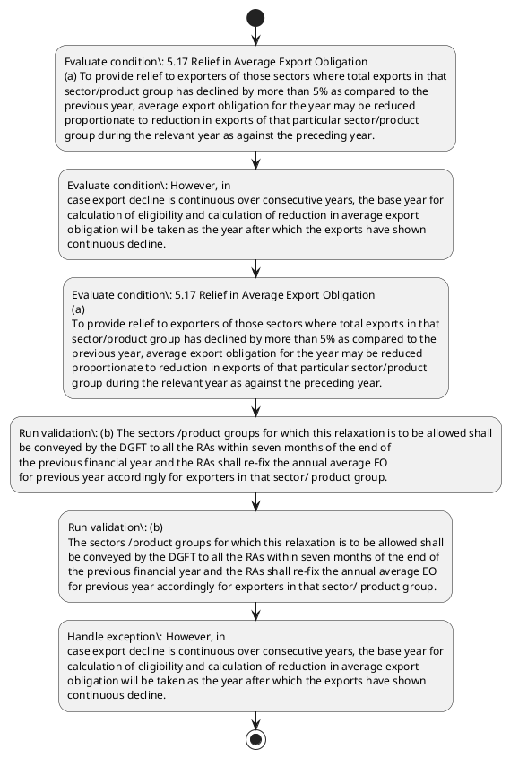

# Chapter 5 / Section 5.17: Relief in Average Export Obligation

**Chapter Title:** Export Promotion Capital Goods (EPCG) Scheme

**Pages:** 12

**Purpose:** 5.17 Relief in Average Export Obligation
(a) To provide relief to exporters of those sectors where total exports in that
sector/product group has declined by more than 5% as compared to the
previous year, average export obligation for the year may be reduced
proportionate to reduction in exports of that particular sector/product
group during the relevant year as against the preceding year.

**Purpose Thanglish:** Indha Relief in Average Export Obligation section-la, 5.17 Relief in Average export Obligation
(a) To provide relief to exporters of those sectors where total exports in that
sector/product group has declined by more than 5% as compared to the
previous year, average export obligation for the year may be reduced
proportionate to reduction in exports of that particular sector/product
group during the relevant year as against the preceding year.

**Summary:** 5.17 Relief in Average Export Obligation
(a) To provide relief to exporters of those sectors where total exports in that
sector/product group has declined by more than 5% as compared to the
previous year, average export obligation for the year may be reduced
proportionate to reduction in exports of that particular sector/product
group during the relevant year as against the preceding year. However, in
case export decline is continuous over consecutive years, the base year for
calculation of eligibility and calculation of reduction in average export
obligation will be taken as the year after which the exports have shown
continuous decline. (b) The sectors /product groups for which this relaxation is to be allowed shall
be conveyed by the DGFT to all the RAs within seven months of the end of
the previous financial year and the RAs shall re-fix the annual average EO
for previous year accordingly for exporters in that sector/ product group.

**Business Meaning:** Relief in Average Export Obligation governs how DGFT business controls should be applied, validated, and enforced.

**Business Explanation:** Relief in Average Export Obligation explains the operating rule set that DEKAI should enforce. Key control points include (b) The sectors /product groups for which this relaxation is to be allowed shall
be conveyed by the DGFT to all the RAs within seven months of the end of
the previous financial year and the RAs shall re-fix the annual average EO
for previous year accordingly for exporters in that sector/ product group.

**Business Explanation Thanglish:** Indha Relief in Average Export Obligation section-la, Relief in Average export Obligation explains the operating rule set that DEKAI should enforce. Key control points include (b) The sectors /product groups for which this relaxation is to be allowed kandippa
be conveyed by the DGFT to all the RAs within seven months of the end of
the previous financial year and the RAs kandippa re-fix the annual average EO
for previous year accordingly for exporters in that sector/ product group.

## Business Logic
- (b) The sectors /product groups for which this relaxation is to be allowed shall
be conveyed by the DGFT to all the RAs within seven months of the end of
the previous financial year and the RAs shall re-fix the annual average EO
for previous year accordingly for exporters in that sector/ product group.
- (b)
The sectors /product groups for which this relaxation is to be allowed shall
be conveyed by the DGFT to all the RAs within seven months of the end of
the previous financial year and the RAs shall re-fix the annual average EO
for previous year accordingly for exporters in that sector/ product group.

## Business Rules
- rule_id=CH5-SEC5_17-R001, rule_description=(b) The sectors /product groups for which this relaxation is to be allowed shall
be conveyed by the DGFT to all the RAs within seven months of the end of
the previous financial year and the RAs shall re-fix the annual average EO
for previous year accordingly for exporters in that sector/ product group., trigger=Relief in Average Export Obligation, condition=5.17 Relief in Average Export Obligation
(a) To provide relief to exporters of those sectors where total exports in that
sector/product group has declined by more than 5% as compared to the
previous year, average export obligation for the year may be reduced
proportionate to reduction in exports of that particular sector/product
group during the relevant year as against the preceding year., validation=(b) The sectors /product groups for which this relaxation is to be allowed shall
be conveyed by the DGFT to all the RAs within seven months of the end of
the previous financial year and the RAs shall re-fix the annual average EO
for previous year accordingly for exporters in that sector/ product group., action=Manual review required., exception=However, in
case export decline is continuous over consecutive years, the base year for
calculation of eligibility and calculation of reduction in average export
obligation will be taken as the year after which the exports have shown
continuous decline., output=DEKAI should produce a compliance decision for 5.17 - Relief in Average Export Obligation.
- rule_id=CH5-SEC5_17-R002, rule_description=(b)
The sectors /product groups for which this relaxation is to be allowed shall
be conveyed by the DGFT to all the RAs within seven months of the end of
the previous financial year and the RAs shall re-fix the annual average EO
for previous year accordingly for exporters in that sector/ product group., trigger=Relief in Average Export Obligation, condition=However, in
case export decline is continuous over consecutive years, the base year for
calculation of eligibility and calculation of reduction in average export
obligation will be taken as the year after which the exports have shown
continuous decline., validation=(b)
The sectors /product groups for which this relaxation is to be allowed shall
be conveyed by the DGFT to all the RAs within seven months of the end of
the previous financial year and the RAs shall re-fix the annual average EO
for previous year accordingly for exporters in that sector/ product group., action=Manual review required., exception=However, in
case export decline is continuous over consecutive years, the base year for
calculation of eligibility and calculation of reduction in average export
obligation will be taken as the year after which the exports have shown
continuous decline., output=DEKAI should produce a compliance decision for 5.17 - Relief in Average Export Obligation.

## Conditions
- 5.17 Relief in Average Export Obligation
(a) To provide relief to exporters of those sectors where total exports in that
sector/product group has declined by more than 5% as compared to the
previous year, average export obligation for the year may be reduced
proportionate to reduction in exports of that particular sector/product
group during the relevant year as against the preceding year.
- However, in
case export decline is continuous over consecutive years, the base year for
calculation of eligibility and calculation of reduction in average export
obligation will be taken as the year after which the exports have shown
continuous decline.
- 5.17 Relief in Average Export Obligation
(a)
To provide relief to exporters of those sectors where total exports in that
sector/product group has declined by more than 5% as compared to the
previous year, average export obligation for the year may be reduced
proportionate to reduction in exports of that particular sector/product
group during the relevant year as against the preceding year.

## Condition Logic
- id=5.5.17.1, if=5.17 Relief in Average Export Obligation
(a) To provide relief to exporters of those sectors where total exports in that
sector/product group has declined by more than 5% as compared to the
previous year, average export obligation for the year may be reduced
proportionate to reduction in exports of that particular sector/product
group during the relevant year as against the preceding year., then=Route for review, source=5.17 Relief in Average Export Obligation
(a) To provide relief to exporters of those sectors where total exports in that
sector/product group has declined by more than 5% as compared to the
previous year, average export obligation for the year may be reduced
proportionate to reduction in exports of that particular sector/product
group during the relevant year as against the preceding year.
- id=5.5.17.2, if=However, in
case export decline is continuous over consecutive years, the base year for
calculation of eligibility and calculation of reduction in average export
obligation will be taken as the year after which the exports have shown
continuous decline., then=Route for review, source=However, in
case export decline is continuous over consecutive years, the base year for
calculation of eligibility and calculation of reduction in average export
obligation will be taken as the year after which the exports have shown
continuous decline.
- id=5.5.17.3, if=5.17 Relief in Average Export Obligation
(a)
To provide relief to exporters of those sectors where total exports in that
sector/product group has declined by more than 5% as compared to the
previous year, average export obligation for the year may be reduced
proportionate to reduction in exports of that particular sector/product
group during the relevant year as against the preceding year., then=Route for review, source=5.17 Relief in Average Export Obligation
(a)
To provide relief to exporters of those sectors where total exports in that
sector/product group has declined by more than 5% as compared to the
previous year, average export obligation for the year may be reduced
proportionate to reduction in exports of that particular sector/product
group during the relevant year as against the preceding year.

## Validations
- (b) The sectors /product groups for which this relaxation is to be allowed shall
be conveyed by the DGFT to all the RAs within seven months of the end of
the previous financial year and the RAs shall re-fix the annual average EO
for previous year accordingly for exporters in that sector/ product group.
- (b)
The sectors /product groups for which this relaxation is to be allowed shall
be conveyed by the DGFT to all the RAs within seven months of the end of
the previous financial year and the RAs shall re-fix the annual average EO
for previous year accordingly for exporters in that sector/ product group.

## Exceptions
- However, in
case export decline is continuous over consecutive years, the base year for
calculation of eligibility and calculation of reduction in average export
obligation will be taken as the year after which the exports have shown
continuous decline.

## Dependencies
- None identified

## Authorities
- DGFT

## Required Documents
- None identified

## Timelines
- However, in
case export decline is continuous over consecutive years, the base year for
calculation of eligibility and calculation of reduction in average export
obligation will be taken as the year after which the exports have shown
continuous decline.
- (b) The sectors /product groups for which this relaxation is to be allowed shall
be conveyed by the DGFT to all the RAs within seven months of the end of
the previous financial year and the RAs shall re-fix the annual average EO
for previous year accordingly for exporters in that sector/ product group.
- (b)
The sectors /product groups for which this relaxation is to be allowed shall
be conveyed by the DGFT to all the RAs within seven months of the end of
the previous financial year and the RAs shall re-fix the annual average EO
for previous year accordingly for exporters in that sector/ product group.

## Actions
- None identified

## Workflow
- Evaluate condition: 5.17 Relief in Average Export Obligation
(a) To provide relief to exporters of those sectors where total exports in that
sector/product group has declined by more than 5% as compared to the
previous year, average export obligation for the year may be reduced
proportionate to reduction in exports of that particular sector/product
group during the relevant year as against the preceding year.
- Evaluate condition: However, in
case export decline is continuous over consecutive years, the base year for
calculation of eligibility and calculation of reduction in average export
obligation will be taken as the year after which the exports have shown
continuous decline.
- Evaluate condition: 5.17 Relief in Average Export Obligation
(a)
To provide relief to exporters of those sectors where total exports in that
sector/product group has declined by more than 5% as compared to the
previous year, average export obligation for the year may be reduced
proportionate to reduction in exports of that particular sector/product
group during the relevant year as against the preceding year.
- Run validation: (b) The sectors /product groups for which this relaxation is to be allowed shall
be conveyed by the DGFT to all the RAs within seven months of the end of
the previous financial year and the RAs shall re-fix the annual average EO
for previous year accordingly for exporters in that sector/ product group.
- Run validation: (b)
The sectors /product groups for which this relaxation is to be allowed shall
be conveyed by the DGFT to all the RAs within seven months of the end of
the previous financial year and the RAs shall re-fix the annual average EO
for previous year accordingly for exporters in that sector/ product group.
- Handle exception: However, in
case export decline is continuous over consecutive years, the base year for
calculation of eligibility and calculation of reduction in average export
obligation will be taken as the year after which the exports have shown
continuous decline.

## Workflow ASCII
```text
Relief in Average Export Obligation
Evaluate condition: 5.17 Relief in Average Export Obligation
(a) To provide relief to exporters of those sectors where total exports in that
sector/product group has declined by more than 5% as compared to the
previous year, average export obligation for the year may be reduced
proportionate to reduction in exports of that particular sector/product
group during the relevant year as against the preceding year.
   |
   v
Evaluate condition: However, in
case export decline is continuous over consecutive years, the base year for
calculation of eligibility and calculation of reduction in average export
obligation will be taken as the year after which the exports have shown
continuous decline.
   |
   v
Evaluate condition: 5.17 Relief in Average Export Obligation
(a)
To provide relief to exporters of those sectors where total exports in that
sector/product group has declined by more than 5% as compared to the
previous year, average export obligation for the year may be reduced
proportionate to reduction in exports of that particular sector/product
group during the relevant year as against the preceding year.
   |
   v
Run validation: (b) The sectors /product groups for which this relaxation is to be allowed shall
be conveyed by the DGFT to all the RAs within seven months of the end of
the previous financial year and the RAs shall re-fix the annual average EO
for previous year accordingly for exporters in that sector/ product group.
   |
   v
Run validation: (b)
The sectors /product groups for which this relaxation is to be allowed shall
be conveyed by the DGFT to all the RAs within seven months of the end of
the previous financial year and the RAs shall re-fix the annual average EO
for previous year accordingly for exporters in that sector/ product group.
   |
   v
Handle exception: However, in
case export decline is continuous over consecutive years, the base year for
calculation of eligibility and calculation of reduction in average export
obligation will be taken as the year after which the exports have shown
continuous decline.
```

## Decision Tree
- IF exception applies (However, in
case export decline is continuous over consecutive years, the base year for
calculation of eligibility and calculation of reduction in average export
obligation will be taken as the year after which the exports have shown
continuous decline.) THEN route to manual review

## Decision Tree ASCII
```text
Relief in Average Export Obligation Decision
IF exception applies (However, in
case export decline is continuous over consecutive years, the base year for
calculation of eligibility and calculation of reduction in average export
obligation will be taken as the year after which the exports have shown
continuous decline.) THEN route to manual review
```

## Examples
- User asks to process Relief in Average Export Obligation; the platform checks conditions, validations, and documents before action.

**Real-world Example:** Example: an importer or exporter invokes Relief in Average Export Obligation, submits the prescribed DGFT records, and DEKAI uses the extracted rules to follow the relief in average export obligation process.

**Real-world Example Thanglish:** Indha Relief in Average Export Obligation section-la, Example: an importer or exporter invokes Relief in Average export Obligation, submits the prescribed DGFT records, and DEKAI uses the extracted rules to follow the relief in average export obligation process.

## AI Rules
- IF detected context matches section rule THEN enforce: (b) The sectors /product groups for which this relaxation is to be allowed shall
be conveyed by the DGFT to all the RAs within seven months of the end of
the previous financial year and the RAs shall re-fix the annual average EO
for previous year accordingly for exporters in that sector/ product group.
- IF detected context matches section rule THEN enforce: (b)
The sectors /product groups for which this relaxation is to be allowed shall
be conveyed by the DGFT to all the RAs within seven months of the end of
the previous financial year and the RAs shall re-fix the annual average EO
for previous year accordingly for exporters in that sector/ product group.

## Database Fields
- name=section_code, type=string, required=True, source=parsed_section_heading
- name=section_title, type=string, required=True, source=parsed_section_heading
- name=has_flag, type=boolean, required=False, source=keyword:has
- name=the_flag, type=boolean, required=False, source=keyword:the
- name=for_flag, type=boolean, required=False, source=keyword:for
- name=may_flag, type=boolean, required=False, source=keyword:may
- name=and_flag, type=boolean, required=False, source=keyword:and
- name=all_flag, type=boolean, required=False, source=keyword:all
- name=ras_flag, type=boolean, required=False, source=keyword:RAs
- name=end_flag, type=boolean, required=False, source=keyword:end

## API Requirements
- method=GET, path=/api/dgft/sections/5.17, purpose=Retrieve knowledge payload for section 5.17, query_params=['include=workflow,decision_tree,validations'], response_fields=['section', 'title', 'summary', 'conditions', 'validations', 'exceptions', 'workflow', 'decision_tree']
- method=POST, path=/api/dgft/Relief-in-Average-Export-Obligation/validate, purpose=Validate inputs and documents for Relief in Average Export Obligation, request_fields=['section_code', 'section_title'], response_fields=['status', 'errors', 'warnings', 'next_actions']

## UI Screens
- screen_id=Relief_in_Average_Export_Obligation_overview, name=Relief in Average Export Obligation Overview, purpose=Show section summary, authority, timeline, and eligibility cues., widgets=['summary_card', 'conditions_table', 'authority_badges', 'timeline_panel']
- screen_id=Relief_in_Average_Export_Obligation_submission, name=Relief in Average Export Obligation Submission, purpose=Capture applicant data and supporting documents., widgets=['dynamic_form', 'document_uploader', 'validation_panel', 'next_action_footer'], fields=['section_code', 'section_title', 'has_flag', 'the_flag', 'for_flag', 'may_flag', 'and_flag', 'all_flag']
- screen_id=Relief_in_Average_Export_Obligation_exceptions, name=Relief in Average Export Obligation Exception Review, purpose=Explain exception handling and manual review triggers., widgets=['exception_banner', 'decision_tree', 'case_notes']

## Error Messages
- Validation failed because the section requirements were not fully met.

## FAQ
- question_en=What is the purpose of section 5.17?, answer_en=Relief in Average Export Obligation explains the operating rule set that DEKAI should enforce. Key control points include (b) The sectors /product groups for which this relaxation is to be allowed shall
be conveyed by the DGFT to all the RAs within seven months of the end of
the previous financial year and the RAs shall re-fix the annual average EO
for previous year accordingly for exporters in that sector/ product group., question_thanglish=Indha Relief in Average Export Obligation section-la, What is the purpose of section 5.17?, answer_thanglish=Indha Relief in Average Export Obligation section-la, Relief in Average export Obligation explains the operating rule set that DEKAI should enforce. Key control points include (b) The sectors /product groups for which this relaxation is to be allowed kandippa
be conveyed by the DGFT to all the RAs within seven months of the end of
the previous financial year and the RAs kandippa re-fix the annual average EO
for previous year accordingly for exporters in that sector/ product group.
- question_en=What documents are required under Relief in Average Export Obligation?, answer_en=Not explicitly covered in uploaded documents., question_thanglish=Indha Relief in Average Export Obligation section-la, What documents are required under Relief in Average export Obligation?, answer_thanglish=Indha Relief in Average Export Obligation section-la, Not explicitly covered in uploaded documents.
- question_en=Which authority handles Relief in Average Export Obligation?, answer_en=DGFT, question_thanglish=Indha Relief in Average Export Obligation section-la, Which authority handles Relief in Average export Obligation?, answer_thanglish=Indha Relief in Average Export Obligation section-la, DGFT

## Questions Users May Ask
- What does Relief in Average Export Obligation require?
- Which documents are needed for Relief in Average Export Obligation?
- How does DEKAI validate Relief in Average Export Obligation requests?

## Expected AI Answers
- Relief in Average Export Obligation requires the platform to interpret the section text, apply the extracted business rules, and present the correct next action.
- Required documents are inferred from the section text: no explicit documents were detected.
- DEKAI validates Relief in Average Export Obligation by checking conditions, required documents, authority references, and exception clauses before recommending an outcome.

## AI Q&A Examples
- question_en=User asks: How do I comply with Relief in Average Export Obligation?, answer_en=AI answers: DEKAI should evaluate section 5.17, apply the extracted rules, and guide the user through Evaluate condition: 5.17 Relief in Average Export Obligation
(a) To provide relief to exporters of those sectors where total exports in that
sector/product group has declined by more than 5% as compared to the
previous year, average export obligation for the year may be reduced
proportionate to reduction in exports of that particular sector/product
group during the relevant year as against the preceding year.., question_thanglish=Indha Relief in Average Export Obligation section-la, User asks: How do I comply with Relief in Average export Obligation?, answer_thanglish=Indha Relief in Average Export Obligation section-la, AI answers: DEKAI should evaluate section 5.17, apply the extracted rules, and guide the user through Evaluate condition: 5.17 Relief in Average export Obligation
(a) To provide relief to exporters of those sectors where total exports in that
sector/product group has declined by more than 5% as compared to the
previous year, average export obligation for the year may be reduced
proportionate to reduction in exports of that particular sector/product
group during the relevant year as against the preceding year..
- question_en=User asks: Which validations apply to Relief in Average Export Obligation?, answer_en=AI answers: Applicable validations are (b) The sectors /product groups for which this relaxation is to be allowed shall
be conveyed by the DGFT to all the RAs within seven months of the end of
the previous financial year and the RAs shall re-fix the annual average EO
for previous year accordingly for exporters in that sector/ product group., (b)
The sectors /product groups for which this relaxation is to be allowed shall
be conveyed by the DGFT to all the RAs within seven months of the end of
the previous financial year and the RAs shall re-fix the annual average EO
for previous year accordingly for exporters in that sector/ product group., question_thanglish=Indha Relief in Average Export Obligation section-la, User asks: Which validations apply to Relief in Average export Obligation?, answer_thanglish=Indha Relief in Average Export Obligation section-la, AI answers: Applicable validations are (b) The sectors /product groups for which this relaxation is to be allowed kandippa
be conveyed by the DGFT to all the RAs within seven months of the end of
the previous financial year and the RAs kandippa re-fix the annual average EO
for previous year accordingly for exporters in that sector/ product group., (b)
The sectors /product groups for which this relaxation is to be allowed kandippa
be conveyed by the DGFT to all the RAs within seven months of the end of
the previous financial year and the RAs kandippa re-fix the annual average EO
for previous year accordingly for exporters in that sector/ product group.

## DEKAI AI Implementation Notes
- Capture chapter 5, section 5.17, title, and page references as immutable knowledge metadata.
- Bind validations for Relief in Average Export Obligation into a rule engine keyed by the rule IDs extracted for this section.
- Route escalations or approvals to: DGFT.
- Trigger manual review when exception clauses are detected.

## DEKAI AI Implementation Notes Thanglish
- Indha Relief in Average Export Obligation section-la, Capture chapter 5, section 5.17, title, and page references as immutable knowledge metadata.
- Indha Relief in Average Export Obligation section-la, Bind validations for Relief in Average export Obligation into a rule engine keyed by the rule IDs extracted for this section.
- Indha Relief in Average Export Obligation section-la, Route escalations or approvals to: DGFT.
- Indha Relief in Average Export Obligation section-la, Trigger manual review when exception clauses are detected.

## AI Metadata
- Keywords: has, the, for, may, and, all, RAs, end, that, more, than, year, case, over, base, will, have, this, DGFT, those
- Search Keywords: has, the, for, may, and, all, RAs, end, that, more, than, year, case, over, base, will, have, this, DGFT, those
- Intent: Provide knowledge guidance for Relief in Average Export Obligation.
- Tags: 5.17, Relief in Average Export Obligation, business-rule, dgft
- Related Sections: 
- Related Chapters: 
- Related Rules: (b) The sectors /product groups for which this relaxation is to be allowed shall
be conveyed by the DGFT to all the RAs within seven months of the end of
the previous financial year and the RAs shall re-fix the annual average EO
for previous year accordingly for exporters in that sector/ product group., (b)
The sectors /product groups for which this relaxation is to be allowed shall
be conveyed by the DGFT to all the RAs within seven months of the end of
the previous financial year and the RAs shall re-fix the annual average EO
for previous year accordingly for exporters in that sector/ product group.

## Mermaid

```mermaid
flowchart TD
    S1["Evaluate condition: 5.17 Relief in Average Export Obligation
(a) To provide relief to exporters of those sectors where total exports in that
sector/product group has declined by more than 5% as compared to the
previous year, average export obligation for the year may be reduced
proportionate to reduction in exports of that particular sector/product
group during the relevant year as against the preceding year."]
    S2["Evaluate condition: However, in
case export decline is continuous over consecutive years, the base year for
calculation of eligibility and calculation of reduction in average export
obligation will be taken as the year after which the exports have shown
continuous decline."]
    S1 --> S2
    S3["Evaluate condition: 5.17 Relief in Average Export Obligation
(a)
To provide relief to exporters of those sectors where total exports in that
sector/product group has declined by more than 5% as compared to the
previous year, average export obligation for the year may be reduced
proportionate to reduction in exports of that particular sector/product
group during the relevant year as against the preceding year."]
    S2 --> S3
    S4["Run validation: (b) The sectors /product groups for which this relaxation is to be allowed shall
be conveyed by the DGFT to all the RAs within seven months of the end of
the previous financial year and the RAs shall re-fix the annual average EO
for previous year accordingly for exporters in that sector/ product group."]
    S3 --> S4
    S5["Run validation: (b)
The sectors /product groups for which this relaxation is to be allowed shall
be conveyed by the DGFT to all the RAs within seven months of the end of
the previous financial year and the RAs shall re-fix the annual average EO
for previous year accordingly for exporters in that sector/ product group."]
    S4 --> S5
    S6["Handle exception: However, in
case export decline is continuous over consecutive years, the base year for
calculation of eligibility and calculation of reduction in average export
obligation will be taken as the year after which the exports have shown
continuous decline."]
    S5 --> S6
```


## PlantUML

