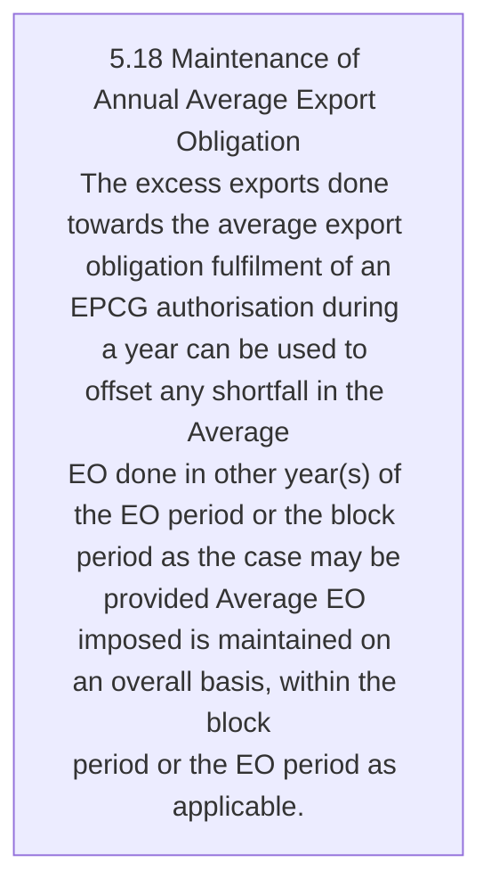
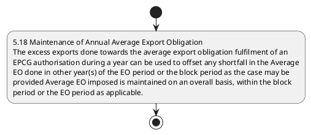

# Chapter 5 / Section 5.18: Maintenance of Annual Average Export Obligation

**Chapter Title:** Export Promotion Capital Goods (EPCG) Scheme

**Pages:** 12

**Purpose:** 5.18 Maintenance of Annual Average Export Obligation
The excess exports done towards the average export obligation fulfilment of an
EPCG authorisation during a year can be used to offset any shortfall in the Average
EO done in other year(s) of the EO period or the block period as the case may be
provided Average EO imposed is maintained on an overall basis, within the block
period or the EO period as applicable.

**Purpose Thanglish:** Indha Maintenance of Annual Average Export Obligation section-la, 5.18 Maintenance of Annual Average export Obligation
The excess exports done towards the average export obligation fulfilment of an
EPCG authorisation during a year can be used to offset any shortfall in the Average
EO done in other year(s) of the EO period or the block period as the case may be
provided Average EO imposed is maintained on an overall basis, within the block
period or the EO period as applicable.

**Summary:** 5.18 Maintenance of Annual Average Export Obligation
The excess exports done towards the average export obligation fulfilment of an
EPCG authorisation during a year can be used to offset any shortfall in the Average
EO done in other year(s) of the EO period or the block period as the case may be
provided Average EO imposed is maintained on an overall basis, within the block
period or the EO period as applicable.

**Business Meaning:** 5.18 Maintenance of Annual Average Export Obligation
The excess exports done towards the average export obligation fulfilment of an
EPCG authorisation during a year can be used to offset any shortfall in the Average
EO done in other year(s) of the EO period or the block period as the case may be
provided Average EO imposed is maintained on an overall basis, within the block
period or the EO period as applicable.

**Business Explanation:** 5.18 Maintenance of Annual Average Export Obligation
The excess exports done towards the average export obligation fulfilment of an
EPCG authorisation during a year can be used to offset any shortfall in the Average
EO done in other year(s) of the EO period or the block period as the case may be
provided Average EO imposed is maintained on an overall basis, within the block
period or the EO period as applicable.

**Business Explanation Thanglish:** Indha Maintenance of Annual Average Export Obligation section-la, 5.18 Maintenance of Annual Average export Obligation
The excess exports done towards the average export obligation fulfilment of an
EPCG authorisation during a year can be used to offset any shortfall in the Average
EO done in other year(s) of the EO period or the block period as the case may be
provided Average EO imposed is maintained on an overall basis, within the block
period or the EO period as applicable.

## Business Logic
- None identified

## Business Rules
- rule_id=CH5-SEC5_18-R001, rule_description=IF validations pass THEN recommend action: 5.18 Maintenance of Annual Average Export Obligation
The excess exports done towards the average export obligation fulfilment of an
EPCG authorisation during a year can be used to offset any shortfall in the Average
EO done in other year(s) of the EO period or the block period as the case may be
provided Average EO imposed is maintained on an overall basis, within the block
period or the EO period as applicable., trigger=Maintenance of Annual Average Export Obligation, condition=Section 5.18 is applicable, validation=Not explicitly covered in uploaded documents., action=5.18 Maintenance of Annual Average Export Obligation
The excess exports done towards the average export obligation fulfilment of an
EPCG authorisation during a year can be used to offset any shortfall in the Average
EO done in other year(s) of the EO period or the block period as the case may be
provided Average EO imposed is maintained on an overall basis, within the block
period or the EO period as applicable., exception=No explicit exception found in uploaded documents., output=DEKAI should produce a compliance decision for 5.18 - Maintenance of Annual Average Export Obligation.

## Conditions
- None identified

## Condition Logic
- id=5.5.18.1, if=Section 5.18 is applicable, then=5.18 Maintenance of Annual Average Export Obligation
The excess exports done towards the average export obligation fulfilment of an
EPCG authorisation during a year can be used to offset any shortfall in the Average
EO done in other year(s) of the EO period or the block period as the case may be
provided Average EO imposed is maintained on an overall basis, within the block
period or the EO period as applicable., source=Derived from uploaded documents

## Validations
- None identified

## Exceptions
- None identified

## Dependencies
- None identified

## Authorities
- None identified

## Required Documents
- None identified

## Timelines
- 5.18 Maintenance of Annual Average Export Obligation
The excess exports done towards the average export obligation fulfilment of an
EPCG authorisation during a year can be used to offset any shortfall in the Average
EO done in other year(s) of the EO period or the block period as the case may be
provided Average EO imposed is maintained on an overall basis, within the block
period or the EO period as applicable.

## Actions
- 5.18 Maintenance of Annual Average Export Obligation
The excess exports done towards the average export obligation fulfilment of an
EPCG authorisation during a year can be used to offset any shortfall in the Average
EO done in other year(s) of the EO period or the block period as the case may be
provided Average EO imposed is maintained on an overall basis, within the block
period or the EO period as applicable.

## Workflow
- 5.18 Maintenance of Annual Average Export Obligation
The excess exports done towards the average export obligation fulfilment of an
EPCG authorisation during a year can be used to offset any shortfall in the Average
EO done in other year(s) of the EO period or the block period as the case may be
provided Average EO imposed is maintained on an overall basis, within the block
period or the EO period as applicable.

## Workflow ASCII
```text
Maintenance of Annual Average Export Obligation
5.18 Maintenance of Annual Average Export Obligation
The excess exports done towards the average export obligation fulfilment of an
EPCG authorisation during a year can be used to offset any shortfall in the Average
EO done in other year(s) of the EO period or the block period as the case may be
provided Average EO imposed is maintained on an overall basis, within the block
period or the EO period as applicable.
```

## Decision Tree
- IF section 5.18 applies THEN 5.18 Maintenance of Annual Average Export Obligation
The excess exports done towards the average export obligation fulfilment of an
EPCG authorisation during a year can be used to offset any shortfall in the Average
EO done in other year(s) of the EO period or the block period as the case may be
provided Average EO imposed is maintained on an overall basis, within the block
period or the EO period as applicable.

## Decision Tree ASCII
```text
Maintenance of Annual Average Export Obligation Decision
IF section 5.18 applies THEN 5.18 Maintenance of Annual Average Export Obligation
The excess exports done towards the average export obligation fulfilment of an
EPCG authorisation during a year can be used to offset any shortfall in the Average
EO done in other year(s) of the EO period or the block period as the case may be
provided Average EO imposed is maintained on an overall basis, within the block
period or the EO period as applicable.
```

## Examples
- User asks to process Maintenance of Annual Average Export Obligation; the platform checks conditions, validations, and documents before action.

**Real-world Example:** Example: an importer or exporter invokes Maintenance of Annual Average Export Obligation, submits the prescribed DGFT records, and DEKAI uses the extracted rules to 5.18 maintenance of annual average export obligation
the excess exports done towards the average export obligation fulfilment of an
epcg authorisation during a year can be used to offset any shortfall in the average
eo done in other year(s) of the eo period or the block period as the case may be
provided average eo imposed is maintained on an overall basis, within the block
period or the eo period as applicable..

**Real-world Example Thanglish:** Indha Maintenance of Annual Average Export Obligation section-la, Example: an importer or exporter invokes Maintenance of Annual Average export Obligation, submits the prescribed DGFT records, and DEKAI uses the extracted rules to 5.18 maintenance of annual average export obligation
the excess exports done towards the average export obligation fulfilment of an
epcg authorisation during a year can be used to offset any shortfall in the average
eo done in other year(s) of the eo period or the block period as the case may be
provided average eo imposed is maintained on an overall basis, within the block
period or the eo period as applicable..

## AI Rules
- IF validations pass THEN recommend action: 5.18 Maintenance of Annual Average Export Obligation
The excess exports done towards the average export obligation fulfilment of an
EPCG authorisation during a year can be used to offset any shortfall in the Average
EO done in other year(s) of the EO period or the block period as the case may be
provided Average EO imposed is maintained on an overall basis, within the block
period or the EO period as applicable.

## Database Fields
- name=section_code, type=string, required=True, source=parsed_section_heading
- name=section_title, type=string, required=True, source=parsed_section_heading
- name=the_flag, type=boolean, required=False, source=keyword:The
- name=can_flag, type=boolean, required=False, source=keyword:can
- name=any_flag, type=boolean, required=False, source=keyword:any
- name=may_flag, type=boolean, required=False, source=keyword:may
- name=done_flag, type=boolean, required=False, source=keyword:done
- name=epcg_flag, type=boolean, required=False, source=keyword:EPCG
- name=year_flag, type=boolean, required=False, source=keyword:year
- name=used_flag, type=boolean, required=False, source=keyword:used

## API Requirements
- method=GET, path=/api/dgft/sections/5.18, purpose=Retrieve knowledge payload for section 5.18, query_params=['include=workflow,decision_tree,validations'], response_fields=['section', 'title', 'summary', 'conditions', 'validations', 'exceptions', 'workflow', 'decision_tree']
- method=POST, path=/api/dgft/Maintenance-of-Annual-Average-Export-Obligation/validate, purpose=Validate inputs and documents for Maintenance of Annual Average Export Obligation, request_fields=['section_code', 'section_title'], response_fields=['status', 'errors', 'warnings', 'next_actions']
- method=POST, path=/api/dgft/Maintenance-of-Annual-Average-Export-Obligation/execute, purpose=Trigger business action for 5.18 Maintenance of Annual Average Export Obligation
The excess exports done towards the average export obligation fulfilment of an
EPCG authorisation during a year can be used to offset any shortfall in the Average
EO done in other year(s) of the EO period or the block period as the case may be
provided Average EO imposed is maintained on an overall basis, within the block
period or the EO period as applicable., request_fields=['section_code', 'section_title'], response_fields=['reference_id', 'status', 'authority', 'timeline']

## UI Screens
- screen_id=Maintenance_of_Annual_Average_Export_Obligation_overview, name=Maintenance of Annual Average Export Obligation Overview, purpose=Show section summary, authority, timeline, and eligibility cues., widgets=['summary_card', 'conditions_table', 'authority_badges', 'timeline_panel']
- screen_id=Maintenance_of_Annual_Average_Export_Obligation_submission, name=Maintenance of Annual Average Export Obligation Submission, purpose=Capture applicant data and supporting documents., widgets=['dynamic_form', 'document_uploader', 'validation_panel', 'next_action_footer'], fields=['section_code', 'section_title', 'the_flag', 'can_flag', 'any_flag', 'may_flag', 'done_flag', 'epcg_flag']

## Error Messages
- Validation failed because the section requirements were not fully met.

## FAQ
- question_en=What is the purpose of section 5.18?, answer_en=5.18 Maintenance of Annual Average Export Obligation
The excess exports done towards the average export obligation fulfilment of an
EPCG authorisation during a year can be used to offset any shortfall in the Average
EO done in other year(s) of the EO period or the block period as the case may be
provided Average EO imposed is maintained on an overall basis, within the block
period or the EO period as applicable., question_thanglish=Indha Maintenance of Annual Average Export Obligation section-la, What is the purpose of section 5.18?, answer_thanglish=Indha Maintenance of Annual Average Export Obligation section-la, 5.18 Maintenance of Annual Average export Obligation
The excess exports done towards the average export obligation fulfilment of an
EPCG authorisation during a year can be used to offset any shortfall in the Average
EO done in other year(s) of the EO period or the block period as the case may be
provided Average EO imposed is maintained on an overall basis, within the block
period or the EO period as applicable.
- question_en=What documents are required under Maintenance of Annual Average Export Obligation?, answer_en=Not explicitly covered in uploaded documents., question_thanglish=Indha Maintenance of Annual Average Export Obligation section-la, What documents are required under Maintenance of Annual Average export Obligation?, answer_thanglish=Indha Maintenance of Annual Average Export Obligation section-la, Not explicitly covered in uploaded documents.
- question_en=Which authority handles Maintenance of Annual Average Export Obligation?, answer_en=Not explicitly covered in uploaded documents., question_thanglish=Indha Maintenance of Annual Average Export Obligation section-la, Which authority handles Maintenance of Annual Average export Obligation?, answer_thanglish=Indha Maintenance of Annual Average Export Obligation section-la, Not explicitly covered in uploaded documents.

## Questions Users May Ask
- What does Maintenance of Annual Average Export Obligation require?
- Which documents are needed for Maintenance of Annual Average Export Obligation?
- How does DEKAI validate Maintenance of Annual Average Export Obligation requests?
- What action should be taken for Maintenance of Annual Average Export Obligation?

## Expected AI Answers
- Maintenance of Annual Average Export Obligation requires the platform to interpret the section text, apply the extracted business rules, and present the correct next action.
- Required documents are inferred from the section text: no explicit documents were detected.
- DEKAI validates Maintenance of Annual Average Export Obligation by checking conditions, required documents, authority references, and exception clauses before recommending an outcome.
- The primary extracted action is: 5.18 Maintenance of Annual Average Export Obligation
The excess exports done towards the average export obligation fulfilment of an
EPCG authorisation during a year can be used to offset any shortfall in the Average
EO done in other year(s) of the EO period or the block period as the case may be
provided Average EO imposed is maintained on an overall basis, within the block
period or the EO period as applicable.

## AI Q&A Examples
- question_en=User asks: How do I comply with Maintenance of Annual Average Export Obligation?, answer_en=AI answers: DEKAI should evaluate section 5.18, apply the extracted rules, and guide the user through 5.18 Maintenance of Annual Average Export Obligation
The excess exports done towards the average export obligation fulfilment of an
EPCG authorisation during a year can be used to offset any shortfall in the Average
EO done in other year(s) of the EO period or the block period as the case may be
provided Average EO imposed is maintained on an overall basis, within the block
period or the EO period as applicable.., question_thanglish=Indha Maintenance of Annual Average Export Obligation section-la, User asks: How do I comply with Maintenance of Annual Average export Obligation?, answer_thanglish=Indha Maintenance of Annual Average Export Obligation section-la, AI answers: DEKAI should evaluate section 5.18, apply the extracted rules, and guide the user through 5.18 Maintenance of Annual Average export Obligation
The excess exports done towards the average export obligation fulfilment of an
EPCG authorisation during a year can be used to offset any shortfall in the Average
EO done in other year(s) of the EO period or the block period as the case may be
provided Average EO imposed is maintained on an overall basis, within the block
period or the EO period as applicable..
- question_en=User asks: Which validations apply to Maintenance of Annual Average Export Obligation?, answer_en=AI answers: Applicable validations are not explicitly covered in the uploaded documents., question_thanglish=Indha Maintenance of Annual Average Export Obligation section-la, User asks: Which validations apply to Maintenance of Annual Average export Obligation?, answer_thanglish=Indha Maintenance of Annual Average Export Obligation section-la, AI answers: Applicable validations are not explicitly covered in the uploaded documents.

## DEKAI AI Implementation Notes
- Capture chapter 5, section 5.18, title, and page references as immutable knowledge metadata.
- Bind validations for Maintenance of Annual Average Export Obligation into a rule engine keyed by the rule IDs extracted for this section.

## DEKAI AI Implementation Notes Thanglish
- Indha Maintenance of Annual Average Export Obligation section-la, Capture chapter 5, section 5.18, title, and page references as immutable knowledge metadata.
- Indha Maintenance of Annual Average Export Obligation section-la, Bind validations for Maintenance of Annual Average export Obligation into a rule engine keyed by the rule IDs extracted for this section.

## AI Metadata
- Keywords: The, can, any, may, done, EPCG, year, used, case, other, block, basis, Annual, Export, excess, during, offset, period, within, Average
- Search Keywords: The, can, any, may, done, EPCG, year, used, case, other, block, basis, Annual, Export, excess, during, offset, period, within, Average
- Intent: Support Maintenance of Annual Average Export Obligation processing and compliance validation.
- Tags: 5.18, Maintenance of Annual Average Export Obligation, dgft
- Related Sections: 
- Related Chapters: 
- Related Rules: 

## Mermaid


## PlantUML

