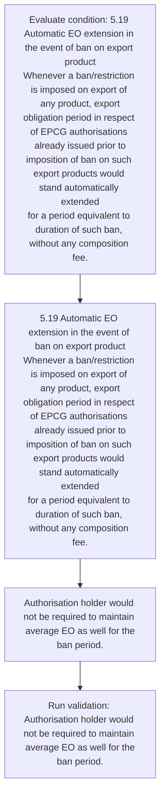
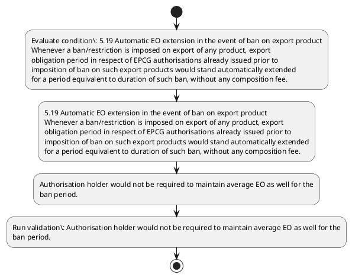

# Chapter 5 / Section 5.19: Automatic EO extension in the event of ban on export product

**Chapter Title:** Export Promotion Capital Goods (EPCG) Scheme

**Pages:** 12

**Purpose:** 5.19 Automatic EO extension in the event of ban on export product
Whenever a ban/restriction is imposed on export of any product, export
obligation period in respect of EPCG authorisations already issued prior to
imposition of ban on such export products would stand automatically extended
for a period equivalent to duration of such ban, without any composition fee.

**Purpose Thanglish:** Indha Automatic EO extension in the event of ban on export product section-la, 5.19 Automatic EO extension in the event of ban on export product
Whenever a ban/restriction is imposed on export of any product, export
obligation period in respect of EPCG authorisations already issued prior to
imposition of ban on such export products would stand automatically extended
for a period equivalent to duration of such ban, without any composition fee.

**Summary:** 5.19 Automatic EO extension in the event of ban on export product
Whenever a ban/restriction is imposed on export of any product, export
obligation period in respect of EPCG authorisations already issued prior to
imposition of ban on such export products would stand automatically extended
for a period equivalent to duration of such ban, without any composition fee. Authorisation holder would not be required to maintain average EO as well for the
ban period.

**Business Meaning:** Automatic EO extension in the event of ban on export product governs how DGFT business controls should be applied, validated, and enforced.

**Business Explanation:** Automatic EO extension in the event of ban on export product explains the operating rule set that DEKAI should enforce. Key control points include Authorisation holder would not be required to maintain average EO as well for the
ban period. The section also drives actions such as 5.19 Automatic EO extension in the event of ban on export product
Whenever a ban/restriction is imposed on export of any product, export
obligation period in respect of EPCG authorisations already issued prior to
imposition of ban on such export products would stand automatically extended
for a period equivalent to duration of such ban, without any composition fee..

**Business Explanation Thanglish:** Indha Automatic EO extension in the event of ban on export product section-la, Automatic EO extension in the event of ban on export product explains the operating rule set that DEKAI should enforce. Key control points include Authorisation holder would not be required to maintain average EO as well for the
ban period. The section also drives actions such as 5.19 Automatic EO extension in the event of ban on export product
Whenever a ban/restriction is imposed on export of any product, export
obligation period in respect of EPCG authorisations already issued prior to
imposition of ban on such export products would stand automatically extended
for a period equivalent to duration of such ban, without any composition fee..

## Business Logic
- Authorisation holder would not be required to maintain average EO as well for the
ban period.

## Business Rules
- rule_id=CH5-SEC5_19-R001, rule_description=Authorisation holder would not be required to maintain average EO as well for the
ban period., trigger=Automatic EO extension in the event of ban on export product, condition=5.19 Automatic EO extension in the event of ban on export product
Whenever a ban/restriction is imposed on export of any product, export
obligation period in respect of EPCG authorisations already issued prior to
imposition of ban on such export products would stand automatically extended
for a period equivalent to duration of such ban, without any composition fee., validation=Authorisation holder would not be required to maintain average EO as well for the
ban period., action=5.19 Automatic EO extension in the event of ban on export product
Whenever a ban/restriction is imposed on export of any product, export
obligation period in respect of EPCG authorisations already issued prior to
imposition of ban on such export products would stand automatically extended
for a period equivalent to duration of such ban, without any composition fee., exception=No explicit exception found in uploaded documents., output=DEKAI should produce a compliance decision for 5.19 - Automatic EO extension in the event of ban on export product.

## Conditions
- 5.19 Automatic EO extension in the event of ban on export product
Whenever a ban/restriction is imposed on export of any product, export
obligation period in respect of EPCG authorisations already issued prior to
imposition of ban on such export products would stand automatically extended
for a period equivalent to duration of such ban, without any composition fee.

## Condition Logic
- id=5.5.19.1, if=5.19 Automatic EO extension in the event of ban on export product
Whenever a ban/restriction is imposed on export of any product, export
obligation period in respect of EPCG authorisations already issued prior to
imposition of ban on such export products would stand automatically extended
for a period equivalent to duration of such ban, without any composition fee., then=5.19 Automatic EO extension in the event of ban on export product
Whenever a ban/restriction is imposed on export of any product, export
obligation period in respect of EPCG authorisations already issued prior to
imposition of ban on such export products would stand automatically extended
for a period equivalent to duration of such ban, without any composition fee., source=5.19 Automatic EO extension in the event of ban on export product
Whenever a ban/restriction is imposed on export of any product, export
obligation period in respect of EPCG authorisations already issued prior to
imposition of ban on such export products would stand automatically extended
for a period equivalent to duration of such ban, without any composition fee.

## Validations
- Authorisation holder would not be required to maintain average EO as well for the
ban period.

## Exceptions
- None identified

## Dependencies
- None identified

## Authorities
- None identified

## Required Documents
- None identified

## Timelines
- None identified

## Actions
- 5.19 Automatic EO extension in the event of ban on export product
Whenever a ban/restriction is imposed on export of any product, export
obligation period in respect of EPCG authorisations already issued prior to
imposition of ban on such export products would stand automatically extended
for a period equivalent to duration of such ban, without any composition fee.
- Authorisation holder would not be required to maintain average EO as well for the
ban period.

## Workflow
- Evaluate condition: 5.19 Automatic EO extension in the event of ban on export product
Whenever a ban/restriction is imposed on export of any product, export
obligation period in respect of EPCG authorisations already issued prior to
imposition of ban on such export products would stand automatically extended
for a period equivalent to duration of such ban, without any composition fee.
- 5.19 Automatic EO extension in the event of ban on export product
Whenever a ban/restriction is imposed on export of any product, export
obligation period in respect of EPCG authorisations already issued prior to
imposition of ban on such export products would stand automatically extended
for a period equivalent to duration of such ban, without any composition fee.
- Authorisation holder would not be required to maintain average EO as well for the
ban period.
- Run validation: Authorisation holder would not be required to maintain average EO as well for the
ban period.

## Workflow ASCII
```text
Automatic EO extension in the event of ban on export product
Evaluate condition: 5.19 Automatic EO extension in the event of ban on export product
Whenever a ban/restriction is imposed on export of any product, export
obligation period in respect of EPCG authorisations already issued prior to
imposition of ban on such export products would stand automatically extended
for a period equivalent to duration of such ban, without any composition fee.
   |
   v
5.19 Automatic EO extension in the event of ban on export product
Whenever a ban/restriction is imposed on export of any product, export
obligation period in respect of EPCG authorisations already issued prior to
imposition of ban on such export products would stand automatically extended
for a period equivalent to duration of such ban, without any composition fee.
   |
   v
Authorisation holder would not be required to maintain average EO as well for the
ban period.
   |
   v
Run validation: Authorisation holder would not be required to maintain average EO as well for the
ban period.
```

## Decision Tree
- IF 5.19 Automatic EO extension in the event of ban on export product
Whenever a ban/restriction is imposed on export of any product, export
obligation period in respect of EPCG authorisations already issued prior to
imposition of ban on such export products would stand automatically extended
for a period equivalent to duration of such ban, without any composition fee. THEN 5.19 Automatic EO extension in the event of ban on export product
Whenever a ban/restriction is imposed on export of any product, export
obligation period in respect of EPCG authorisations already issued prior to
imposition of ban on such export products would stand automatically extended
for a period equivalent to duration of such ban, without any composition fee.

## Decision Tree ASCII
```text
Automatic EO extension in the event of ban on export product Decision
IF 5.19 Automatic EO extension in the event of ban on export product
Whenever a ban/restriction is imposed on export of any product, export
obligation period in respect of EPCG authorisations already issued prior to
imposition of ban on such export products would stand automatically extended
for a period equivalent to duration of such ban, without any composition fee. THEN 5.19 Automatic EO extension in the event of ban on export product
Whenever a ban/restriction is imposed on export of any product, export
obligation period in respect of EPCG authorisations already issued prior to
imposition of ban on such export products would stand automatically extended
for a period equivalent to duration of such ban, without any composition fee.
```

## Examples
- User asks to process Automatic EO extension in the event of ban on export product; the platform checks conditions, validations, and documents before action.

**Real-world Example:** Example: an importer or exporter invokes Automatic EO extension in the event of ban on export product, submits the prescribed DGFT records, and DEKAI uses the extracted rules to 5.19 automatic eo extension in the event of ban on export product
whenever a ban/restriction is imposed on export of any product, export
obligation period in respect of epcg authorisations already issued prior to
imposition of ban on such export products would stand automatically extended
for a period equivalent to duration of such ban, without any composition fee..

**Real-world Example Thanglish:** Indha Automatic EO extension in the event of ban on export product section-la, Example: an importer or exporter invokes Automatic EO extension in the event of ban on export product, submits the prescribed DGFT records, and DEKAI uses the extracted rules to 5.19 automatic eo extension in the event of ban on export product
whenever a ban/restriction is imposed on export of any product, export
obligation period in respect of epcg authorisations already issued prior to
imposition of ban on such export products would stand automatically extended
for a period equivalent to duration of such ban, without any composition fee..

## AI Rules
- IF detected context matches section rule THEN enforce: Authorisation holder would not be required to maintain average EO as well for the
ban period.
- IF validations pass THEN recommend action: 5.19 Automatic EO extension in the event of ban on export product
Whenever a ban/restriction is imposed on export of any product, export
obligation period in respect of EPCG authorisations already issued prior to
imposition of ban on such export products would stand automatically extended
for a period equivalent to duration of such ban, without any composition fee.

## Database Fields
- name=section_code, type=string, required=True, source=parsed_section_heading
- name=section_title, type=string, required=True, source=parsed_section_heading
- name=the_flag, type=boolean, required=False, source=keyword:the
- name=ban_flag, type=boolean, required=False, source=keyword:ban
- name=any_flag, type=boolean, required=False, source=keyword:any
- name=for_flag, type=boolean, required=False, source=keyword:for
- name=fee_flag, type=boolean, required=False, source=keyword:fee
- name=not_flag, type=boolean, required=False, source=keyword:not
- name=epcg_flag, type=boolean, required=False, source=keyword:EPCG
- name=such_flag, type=boolean, required=False, source=keyword:such

## API Requirements
- method=GET, path=/api/dgft/sections/5.19, purpose=Retrieve knowledge payload for section 5.19, query_params=['include=workflow,decision_tree,validations'], response_fields=['section', 'title', 'summary', 'conditions', 'validations', 'exceptions', 'workflow', 'decision_tree']
- method=POST, path=/api/dgft/Automatic-EO-extension-in-the-event-of-ban-on-export-product/validate, purpose=Validate inputs and documents for Automatic EO extension in the event of ban on export product, request_fields=['section_code', 'section_title'], response_fields=['status', 'errors', 'warnings', 'next_actions']
- method=POST, path=/api/dgft/Automatic-EO-extension-in-the-event-of-ban-on-export-product/execute, purpose=Trigger business action for 5.19 Automatic EO extension in the event of ban on export product
Whenever a ban/restriction is imposed on export of any product, export
obligation period in respect of EPCG authorisations already issued prior to
imposition of ban on such export products would stand automatically extended
for a period equivalent to duration of such ban, without any composition fee., request_fields=['section_code', 'section_title'], response_fields=['reference_id', 'status', 'authority', 'timeline']

## UI Screens
- screen_id=Automatic_EO_extension_in_the_event_of_ban_on_export_product_overview, name=Automatic EO extension in the event of ban on export product Overview, purpose=Show section summary, authority, timeline, and eligibility cues., widgets=['summary_card', 'conditions_table', 'authority_badges', 'timeline_panel']
- screen_id=Automatic_EO_extension_in_the_event_of_ban_on_export_product_submission, name=Automatic EO extension in the event of ban on export product Submission, purpose=Capture applicant data and supporting documents., widgets=['dynamic_form', 'document_uploader', 'validation_panel', 'next_action_footer'], fields=['section_code', 'section_title', 'the_flag', 'ban_flag', 'any_flag', 'for_flag', 'fee_flag', 'not_flag']

## Error Messages
- Validation failed because the section requirements were not fully met.

## FAQ
- question_en=What is the purpose of section 5.19?, answer_en=Automatic EO extension in the event of ban on export product explains the operating rule set that DEKAI should enforce. Key control points include Authorisation holder would not be required to maintain average EO as well for the
ban period. The section also drives actions such as 5.19 Automatic EO extension in the event of ban on export product
Whenever a ban/restriction is imposed on export of any product, export
obligation period in respect of EPCG authorisations already issued prior to
imposition of ban on such export products would stand automatically extended
for a period equivalent to duration of such ban, without any composition fee.., question_thanglish=Indha Automatic EO extension in the event of ban on export product section-la, What is the purpose of section 5.19?, answer_thanglish=Indha Automatic EO extension in the event of ban on export product section-la, Automatic EO extension in the event of ban on export product explains the operating rule set that DEKAI should enforce. Key control points include Authorisation holder would not be required to maintain average EO as well for the
ban period. The section also drives actions such as 5.19 Automatic EO extension in the event of ban on export product
Whenever a ban/restriction is imposed on export of any product, export
obligation period in respect of EPCG authorisations already issued prior to
imposition of ban on such export products would stand automatically extended
for a period equivalent to duration of such ban, without any composition fee..
- question_en=What documents are required under Automatic EO extension in the event of ban on export product?, answer_en=Not explicitly covered in uploaded documents., question_thanglish=Indha Automatic EO extension in the event of ban on export product section-la, What documents are required under Automatic EO extension in the event of ban on export product?, answer_thanglish=Indha Automatic EO extension in the event of ban on export product section-la, Not explicitly covered in uploaded documents.
- question_en=Which authority handles Automatic EO extension in the event of ban on export product?, answer_en=Not explicitly covered in uploaded documents., question_thanglish=Indha Automatic EO extension in the event of ban on export product section-la, Which authority handles Automatic EO extension in the event of ban on export product?, answer_thanglish=Indha Automatic EO extension in the event of ban on export product section-la, Not explicitly covered in uploaded documents.

## Questions Users May Ask
- What does Automatic EO extension in the event of ban on export product require?
- Which documents are needed for Automatic EO extension in the event of ban on export product?
- How does DEKAI validate Automatic EO extension in the event of ban on export product requests?
- What action should be taken for Automatic EO extension in the event of ban on export product?

## Expected AI Answers
- Automatic EO extension in the event of ban on export product requires the platform to interpret the section text, apply the extracted business rules, and present the correct next action.
- Required documents are inferred from the section text: no explicit documents were detected.
- DEKAI validates Automatic EO extension in the event of ban on export product by checking conditions, required documents, authority references, and exception clauses before recommending an outcome.
- The primary extracted action is: 5.19 Automatic EO extension in the event of ban on export product
Whenever a ban/restriction is imposed on export of any product, export
obligation period in respect of EPCG authorisations already issued prior to
imposition of ban on such export products would stand automatically extended
for a period equivalent to duration of such ban, without any composition fee.

## AI Q&A Examples
- question_en=User asks: How do I comply with Automatic EO extension in the event of ban on export product?, answer_en=AI answers: DEKAI should evaluate section 5.19, apply the extracted rules, and guide the user through Evaluate condition: 5.19 Automatic EO extension in the event of ban on export product
Whenever a ban/restriction is imposed on export of any product, export
obligation period in respect of EPCG authorisations already issued prior to
imposition of ban on such export products would stand automatically extended
for a period equivalent to duration of such ban, without any composition fee.., question_thanglish=Indha Automatic EO extension in the event of ban on export product section-la, User asks: How do I comply with Automatic EO extension in the event of ban on export product?, answer_thanglish=Indha Automatic EO extension in the event of ban on export product section-la, AI answers: DEKAI should evaluate section 5.19, apply the extracted rules, and guide the user through Evaluate condition: 5.19 Automatic EO extension in the event of ban on export product
Whenever a ban/restriction is imposed on export of any product, export
obligation period in respect of EPCG authorisations already issued prior to
imposition of ban on such export products would stand automatically extended
for a period equivalent to duration of such ban, without any composition fee..
- question_en=User asks: Which validations apply to Automatic EO extension in the event of ban on export product?, answer_en=AI answers: Applicable validations are Authorisation holder would not be required to maintain average EO as well for the
ban period., question_thanglish=Indha Automatic EO extension in the event of ban on export product section-la, User asks: Which validations apply to Automatic EO extension in the event of ban on export product?, answer_thanglish=Indha Automatic EO extension in the event of ban on export product section-la, AI answers: Applicable validations are Authorisation holder would not be required to maintain average EO as well for the
ban period.

## DEKAI AI Implementation Notes
- Capture chapter 5, section 5.19, title, and page references as immutable knowledge metadata.
- Bind validations for Automatic EO extension in the event of ban on export product into a rule engine keyed by the rule IDs extracted for this section.

## DEKAI AI Implementation Notes Thanglish
- Indha Automatic EO extension in the event of ban on export product section-la, Capture chapter 5, section 5.19, title, and page references as immutable knowledge metadata.
- Indha Automatic EO extension in the event of ban on export product section-la, Bind validations for Automatic EO extension in the event of ban on export product into a rule engine keyed by the rule IDs extracted for this section.

## AI Metadata
- Keywords: the, ban, any, for, fee, not, EPCG, such, well, event, prior, would, stand, export, period, issued, holder, product, imposed, respect
- Search Keywords: the, ban, any, for, fee, not, EPCG, such, well, event, prior, would, stand, export, period, issued, holder, product, imposed, respect
- Intent: Support Automatic EO extension in the event of ban on export product processing and compliance validation.
- Tags: 5.19, Automatic EO extension in the event of ban on export product, business-rule, dgft
- Related Sections: 
- Related Chapters: 
- Related Rules: Authorisation holder would not be required to maintain average EO as well for the
ban period.

## Mermaid


## PlantUML

