# Chapter  / Section 5.1: Abbreviations

**Chapter Title:** TradeNetDeclaration.IPTDEC Ver2.1 (2)

**Pages:** 5, 6, 7, 8, 9, 10, 11, 12, 13, 14, 15, 16, 17, 18, 19, 20

**Purpose:** 5.1 Abbreviations
CA Controlling Agency
Crimson Logic Crimson Logic Pte Ltd
XML Extensible Markup Language
FTZ Free Trade Zone
GST Goods and Services Tax
ISO International Standards Organisation
MDS Message Design Specifications
SC Singapore Customs
STDID Singapore Trade Data Interchange Directory
Trade Net Declaration.IPTDEC Ver2.1.doc Message Specification XML (IPTDEC)
OFFICIAL (CLOSED)
Prepared by:
TDS41-MDS-XML-IPTDEC-M
OFFICIAL (CLOSED)
TRADENET MESSAGE
18/11/2021 11:10
AM
Prepared by:
For:
Release Date
18/11/2021
Ver
4.1
Reference
TRADENET
Document Id.

**Purpose Thanglish:** Indha Abbreviations section-la, 5.1 Abbreviations
CA Controlling Agency
Crimson Logic Crimson Logic Pte Ltd
XML Extensible Markup Language
FTZ Free Trade Zone
GST Goods and Services Tax
ISO International Standards Organisation
MDS Message Design Specifications
SC Singapore Customs
STDID Singapore Trade Data Interchange Directory
Trade Net Declaration.IPTDEC Ver2.1.doc Message Specification XML (IPTDEC)
OFFICIAL (CLOSED)
Prepared by:
TDS41-MDS-XML-IPTDEC-M
OFFICIAL (CLOSED)
TRADENET MESSAGE
18/11/2021 11:10
AM
Prepared by:
For:
Release Date
18/11/2021
Ver
4.1
Reference
TRADENET
Document Id.

**Summary:** 5.1 Abbreviations
CA Controlling Agency
Crimson Logic Crimson Logic Pte Ltd
XML Extensible Markup Language
FTZ Free Trade Zone
GST Goods and Services Tax
ISO International Standards Organisation
MDS Message Design Specifications
SC Singapore Customs
STDID Singapore Trade Data Interchange Directory
Trade Net Declaration.IPTDEC Ver2.1.doc Message Specification XML (IPTDEC)
OFFICIAL (CLOSED)
Prepared by:
TDS41-MDS-XML-IPTDEC-M
OFFICIAL (CLOSED)
TRADENET MESSAGE
18/11/2021 11:10
AM
Prepared by:
For:
Release Date
18/11/2021
Ver
4.1
Reference
TRADENET
Document Id. TDS41-MDS-XML-IPTDEC-M
Trade Net Declaration.IPTDEC Ver2.1.doc
OFFICIAL (CLOSED)
5. DEFINITIONS AND ABBREVIATIONS
5.1 Abbreviations
CA
Controlling Agency
Crimson Logic
XML
Extensible Markup Language
FTZ
Free Trade Zone
GST
Goods and Services Tax
ISO
International Standards Organisation
MDS
Message Design Specifications
SC
Singapore Customs
STDID
Singapore Trade Data Interchange Directory
OFFICIAL (CLOSED)
AM
6.

**Business Meaning:** Abbreviations governs how DGFT business controls should be applied, validated, and enforced.

**Business Explanation:** Abbreviations explains the operating rule set that DEKAI should enforce. Key control points include /cac:Unique Reference Number
B065 cbc:Declarant ID M 1 an..17 Mandatory to specify Message Sender Id (must be same as the Sender
Id as specified in the interchange header). The section also drives actions such as Transfer conditions are:
Code Declaration Type Transfer Conditions
DUT Duty To allow the Declarant to submit Declarations such as anti-dumping
duties, excise for local manufacturing, previously exempted vehicles
and short payment
GST GST (including duty exemption) To allow the Declarant to submit Declarations such as:
a) non-dutiable HS for
i) direct import
ii) release from FTZ to customs territories
iii) release from BW to customs territories and,
iv) release of Class II cargoes from BWCY
b) dutiable HS
i) Motor vehicles
ii) Ethyl alcohol for lab use
iii) Industrial exemption
iv) Beer for SAF
c) Short Payment
d) Auction cargoes release from FTZ or local cargoes which entered
ALPS & subsequently enter customs territory
DNG Duty & GST To allow the Declarant to submit Declarations such as:
a) Direct import
b) Local manufacturing
c) Sale of:
i) embassy vehicles to others
ii) vehicles by foreign armed forces
iii) vehicles by disabled persons
Trade Net Declaration.IPTDEC Ver2.1.doc Message Specification XML (IPTDEC)
OFFICIAL (CLOSED)
Prepared by:
TDS41-MDS-XML-IPTDEC-M
Code | Declaration Type | Transfer Conditions
DUT | Duty | To allow the Declarant to submit Declarations such as anti-dumping
duties, excise for local manufacturing, previously exempted vehicles
and short payment
GST | GST (including duty exemption) | To allow the Declarant to submit Declarations such as:
a) non-dutiable HS for
i) direct import
ii) release from FTZ to customs territories
iii) release from BW to customs territories and,
iv) release of Class II cargoes from BWCY
b) dutiable HS
i) Motor vehicles
ii) Ethyl alcohol for lab use
iii) Industrial exemption
iv) Beer for SAF
c) Short Payment
d) Auction cargoes release from FTZ or local cargoes which entered
ALPS & subsequently enter customs territory
DNG | Duty & GST | To allow the Declarant to submit Declarations such as:
a) Direct import
b) Local manufacturing
c) Sale of:
i) embassy vehicles to others
ii) vehicles by foreign armed forces
iii) vehicles by disabled persons
OFFICIAL (CLOSED)
TRADENET MESSAGE
18/11/2021 11:10
AM
Prepared by:
For:
Release Date
18/11/2021
Ver
4.1
Reference
TRADENET
Document Id..

**Business Explanation Thanglish:** Indha Abbreviations section-la, Abbreviations explains the operating rule set that DEKAI should enforce. Key control points include /cac:Unique Reference Number
B065 cbc:Declarant ID M 1 an..17 Mandatory to specify Message Sender Id (must be same as the Sender
Id as specified in the interchange header). The section also drives actions such as Transfer conditions are:
Code Declaration Type Transfer Conditions
DUT Duty To allow the Declarant to submit Declarations such as anti-dumping
duties, excise for local manufacturing, previously exempted vehicles
and short payment
GST GST (including duty exemption) To allow the Declarant to submit Declarations such as:
a) non-dutiable HS for
i) direct import
ii) release from FTZ to customs territories
iii) release from BW to customs territories and,
iv) release of Class II cargoes from BWCY
b) dutiable HS
i) Motor vehicles
ii) Ethyl alcohol for lab use
iii) Industrial exemption
iv) Beer for SAF
c) Short Payment
d) Auction cargoes release from FTZ or local cargoes which entered
ALPS & subsequently enter customs territory
DNG Duty & GST To allow the Declarant to submit Declarations such as:
a) Direct import
b) Local manufacturing
c) Sale of:
i) embassy vehicles to others
ii) vehicles by foreign armed forces
iii) vehicles by disabled persons
Trade Net Declaration.IPTDEC Ver2.1.doc Message Specification XML (IPTDEC)
OFFICIAL (CLOSED)
Prepared by:
TDS41-MDS-XML-IPTDEC-M
Code | Declaration Type | Transfer Conditions
DUT | Duty | To allow the Declarant to submit Declarations such as anti-dumping
duties, excise for local manufacturing, previously exempted vehicles
and short payment
GST | GST (including duty exemption) | To allow the Declarant to submit Declarations such as:
a) non-dutiable HS for
i) direct import
ii) release from FTZ to customs territories
iii) release from BW to customs territories and,
iv) release of Class II cargoes from BWCY
b) dutiable HS
i) Motor vehicles
ii) Ethyl alcohol for lab use
iii) Industrial exemption
iv) Beer for SAF
c) Short Payment
d) Auction cargoes release from FTZ or local cargoes which entered
ALPS & subsequently enter customs territory
DNG | Duty & GST | To allow the Declarant to submit Declarations such as:
a) Direct import
b) Local manufacturing
c) Sale of:
i) embassy vehicles to others
ii) vehicles by foreign armed forces
iii) vehicles by disabled persons
OFFICIAL (CLOSED)
TRADENET MESSAGE
18/11/2021 11:10
AM
Prepared by:
For:
Release Date
18/11/2021
Ver
4.1
Reference
TRADENET
Document Id..

## Business Logic
- /cac:Unique Reference Number
B065 cbc:Declarant ID M 1 an..17 Mandatory to specify Message Sender Id (must be same as the Sender
Id as specified in the interchange header).
- /cac:Unique Reference Number
B065
cbc:Declarant ID
M
1 an..17
Mandatory to specify Message Sender Id (must be same as the Sender
Id as specified in the interchange header).
- /cac:Party Name
/cac:Freight Forwarder Party
A040 cac:Inward Carrier Agent Party C 1 a) Specify Inward Carrier Agent, must be registered with Customs.
- /cac:Party Name
/cac:Freight Forwarder Party
A040
cac:Inward Carrier Agent Party
C
1
a) Specify Inward Carrier Agent, must be registered with Customs.
- B058 cbc:Harmonized System Quantity M 1 n..16 For all Declaration Types, specify HS code quantity and the measure
unit specifier must match the measurement unit in the Singapore
Trade Classification.Specify quantity and unit according to invoice
if the measurement unit in Singapore Trade Classification = ‘-’
unit Code (attribute) M 1 an..3 (value).
- B058
cbc:Harmonized System Quantity
unit Code (attribute)
M
M
1 n..16
1 an..3
For all Declaration Types, specify HS code quantity and the measure
unit specifier must match the measurement unit in the Singapore
Trade Classification.Specify quantity and unit according to invoice
if the measurement unit in Singapore Trade Classification = ‘-’
(value).
- A023 cac:Goods And Services Tax C 1 Specify the item GST:
a) For Declaration Type = GST, the declared item GST payable amount
must be equal to (CIF/LSP x GST rate).
- b) For other Declaration Types, the declared item GST payable
amount must equal to (CIF/LSP + Customs Duty + Excise Duty +
Other tax) X GST rate, where applicable
B060 cbc:Goods And Services Tax Percent M 1 n..2 Specify percentage for GST rate.
- /cac:Goods And Services Tax
A016 cac:Excise Duty C 1 For dutiable goods subject to Excise Duty:
B024 cbc:Duty Rate M 1 n..8 Specify item Excise Duty rate for dutiable goods subject to Excise
Duty.
- /cac:Excise Duty
A016 cac:Customs Duty C 1 For dutiable goods subject to Customs Duty, if any:
B024 cbc:Duty Rate M 1 n..8 Specify item Customs Duty rate for dutiable goods subject to Customs
Duty, if any.
- A023
cac:Goods And Services Tax
C
1
Specify the item GST:
a)
For Declaration Type = GST, the declared item GST payable amount
must be equal to (CIF/LSP x GST rate).
- b)
For other Declaration Types, the declared item GST payable
amount must equal to (CIF/LSP + Customs Duty + Excise Duty +
Other tax) X GST rate, where applicable
B060
cbc:Goods And Services Tax Percent
M
1 n..2
Specify percentage for GST rate.
- /cac:Goods And Services Tax
A016
cac:Excise Duty
C
1
For dutiable goods subject to Excise Duty:
B024
cbc:Duty Rate
M
1 n..8
Specify item Excise Duty rate for dutiable goods subject to Excise
Duty.
- /cac:Excise Duty
A016
cac:Customs Duty
C
1
For dutiable goods subject to Customs Duty, if any:
B024
cbc:Duty Rate
M
1 n..8
Specify item Customs Duty rate for dutiable goods subject to Customs
Duty, if any.
- i) For transport mode = 1, the unit code must be set to TNE.
- ii) For transport mode = 4, the unit code must be set to KGM.

## Business Rules
- rule_id=CH-SEC5_1-R001, rule_description=/cac:Unique Reference Number
B065 cbc:Declarant ID M 1 an..17 Mandatory to specify Message Sender Id (must be same as the Sender
Id as specified in the interchange header)., trigger=Abbreviations, condition=5.1 Abbreviations
CA Controlling Agency
Crimson Logic Crimson Logic Pte Ltd
XML Extensible Markup Language
FTZ Free Trade Zone
GST Goods and Services Tax
ISO International Standards Organisation
MDS Message Design Specifications
SC Singapore Customs
STDID Singapore Trade Data Interchange Directory
Trade Net Declaration.IPTDEC Ver2.1.doc Message Specification XML (IPTDEC)
OFFICIAL (CLOSED)
Prepared by:
TDS41-MDS-XML-IPTDEC-M
OFFICIAL (CLOSED)
TRADENET MESSAGE
18/11/2021 11:10
AM
Prepared by:
For:
Release Date
18/11/2021
Ver
4.1
Reference
TRADENET
Document Id., validation=/cac:Unique Reference Number
B065 cbc:Declarant ID M 1 an..17 Mandatory to specify Message Sender Id (must be same as the Sender
Id as specified in the interchange header)., action=Transfer conditions are:
Code Declaration Type Transfer Conditions
DUT Duty To allow the Declarant to submit Declarations such as anti-dumping
duties, excise for local manufacturing, previously exempted vehicles
and short payment
GST GST (including duty exemption) To allow the Declarant to submit Declarations such as:
a) non-dutiable HS for
i) direct import
ii) release from FTZ to customs territories
iii) release from BW to customs territories and,
iv) release of Class II cargoes from BWCY
b) dutiable HS
i) Motor vehicles
ii) Ethyl alcohol for lab use
iii) Industrial exemption
iv) Beer for SAF
c) Short Payment
d) Auction cargoes release from FTZ or local cargoes which entered
ALPS & subsequently enter customs territory
DNG Duty & GST To allow the Declarant to submit Declarations such as:
a) Direct import
b) Local manufacturing
c) Sale of:
i) embassy vehicles to others
ii) vehicles by foreign armed forces
iii) vehicles by disabled persons
Trade Net Declaration.IPTDEC Ver2.1.doc Message Specification XML (IPTDEC)
OFFICIAL (CLOSED)
Prepared by:
TDS41-MDS-XML-IPTDEC-M
Code | Declaration Type | Transfer Conditions
DUT | Duty | To allow the Declarant to submit Declarations such as anti-dumping
duties, excise for local manufacturing, previously exempted vehicles
and short payment
GST | GST (including duty exemption) | To allow the Declarant to submit Declarations such as:
a) non-dutiable HS for
i) direct import
ii) release from FTZ to customs territories
iii) release from BW to customs territories and,
iv) release of Class II cargoes from BWCY
b) dutiable HS
i) Motor vehicles
ii) Ethyl alcohol for lab use
iii) Industrial exemption
iv) Beer for SAF
c) Short Payment
d) Auction cargoes release from FTZ or local cargoes which entered
ALPS & subsequently enter customs territory
DNG | Duty & GST | To allow the Declarant to submit Declarations such as:
a) Direct import
b) Local manufacturing
c) Sale of:
i) embassy vehicles to others
ii) vehicles by foreign armed forces
iii) vehicles by disabled persons
OFFICIAL (CLOSED)
TRADENET MESSAGE
18/11/2021 11:10
AM
Prepared by:
For:
Release Date
18/11/2021
Ver
4.1
Reference
TRADENET
Document Id., exception=Transfer conditions are:
Code Declaration Type Transfer Conditions
DUT Duty To allow the Declarant to submit Declarations such as anti-dumping
duties, excise for local manufacturing, previously exempted vehicles
and short payment
GST GST (including duty exemption) To allow the Declarant to submit Declarations such as:
a) non-dutiable HS for
i) direct import
ii) release from FTZ to customs territories
iii) release from BW to customs territories and,
iv) release of Class II cargoes from BWCY
b) dutiable HS
i) Motor vehicles
ii) Ethyl alcohol for lab use
iii) Industrial exemption
iv) Beer for SAF
c) Short Payment
d) Auction cargoes release from FTZ or local cargoes which entered
ALPS & subsequently enter customs territory
DNG Duty & GST To allow the Declarant to submit Declarations such as:
a) Direct import
b) Local manufacturing
c) Sale of:
i) embassy vehicles to others
ii) vehicles by foreign armed forces
iii) vehicles by disabled persons
Trade Net Declaration.IPTDEC Ver2.1.doc Message Specification XML (IPTDEC)
OFFICIAL (CLOSED)
Prepared by:
TDS41-MDS-XML-IPTDEC-M
Code | Declaration Type | Transfer Conditions
DUT | Duty | To allow the Declarant to submit Declarations such as anti-dumping
duties, excise for local manufacturing, previously exempted vehicles
and short payment
GST | GST (including duty exemption) | To allow the Declarant to submit Declarations such as:
a) non-dutiable HS for
i) direct import
ii) release from FTZ to customs territories
iii) release from BW to customs territories and,
iv) release of Class II cargoes from BWCY
b) dutiable HS
i) Motor vehicles
ii) Ethyl alcohol for lab use
iii) Industrial exemption
iv) Beer for SAF
c) Short Payment
d) Auction cargoes release from FTZ or local cargoes which entered
ALPS & subsequently enter customs territory
DNG | Duty & GST | To allow the Declarant to submit Declarations such as:
a) Direct import
b) Local manufacturing
c) Sale of:
i) embassy vehicles to others
ii) vehicles by foreign armed forces
iii) vehicles by disabled persons
OFFICIAL (CLOSED)
TRADENET MESSAGE
18/11/2021 11:10
AM
Prepared by:
For:
Release Date
18/11/2021
Ver
4.1
Reference
TRADENET
Document Id., output=DEKAI should produce a compliance decision for 5.1 - Abbreviations.
- rule_id=CH-SEC5_1-R002, rule_description=/cac:Unique Reference Number
B065
cbc:Declarant ID
M
1 an..17
Mandatory to specify Message Sender Id (must be same as the Sender
Id as specified in the interchange header)., trigger=Abbreviations, condition=DEFINITIONS AND ABBREVIATIONS
5.1 Abbreviations
CA
Controlling Agency
Crimson Logic
XML
Extensible Markup Language
FTZ
Free Trade Zone
GST
Goods and Services Tax
ISO
International Standards Organisation
MDS
Message Design Specifications
SC
Singapore Customs
STDID
Singapore Trade Data Interchange Directory
OFFICIAL (CLOSED)
AM
6., validation=Refers to the declaration at
the frontend software: “I/We declare that all the particulars in
this Application are true and correct”., action=Transfer conditions are:
Code Declaration Type
Transfer Conditions
DUT
Duty
To allow the Declarant to submit Declarations such as anti-dumping
duties, excise for local manufacturing, previously exempted vehicles
and short payment
GST
GST (including duty exemption)
To allow the Declarant to submit Declarations such as:
a) non-dutiable HS for
i) direct import
ii) release from FTZ to customs territories
iii) release from BW to customs territories and,
iv) release of Class II cargoes from BWCY
b) dutiable HS
i) Motor vehicles
ii) Ethyl alcohol for lab use
iii) Industrial exemption
iv) Beer for SAF
c) Short Payment
d) Auction cargoes release from FTZ or local cargoes which entered
ALPS & subsequently enter customs territory
DNG
Duty & GST
To allow the Declarant to submit Declarations such as:
a) Direct import
b) Local manufacturing
c) Sale of:
i) embassy vehicles to others
ii) vehicles by foreign armed forces
iii) vehicles by disabled persons
OFFICIAL (CLOSED)
AM
d) Release of goods from FTZ
e) Release of goods from LW
f) Release of AD goods from FTZ
g) Release of Class II cargoes from BWCY
h) Short payment of GST and duty
BKT Blanket To allow the Declarant to submit Declarations such as:
a) gas
b) water
c) video tapes
d) petroleum
Trade Net Declaration.IPTDEC Ver2.1.doc Message Specification XML (IPTDEC)
OFFICIAL (CLOSED)
Prepared by:
TDS41-MDS-XML-IPTDEC-M
| | d) Release of goods from FTZ
e) Release of goods from LW
f) Release of AD goods from FTZ
g) Release of Class II cargoes from BWCY
h) Short payment of GST and duty
BKT | Blanket | To allow the Declarant to submit Declarations such as:
a) gas
b) water
c) video tapes
d) petroleum
OFFICIAL (CLOSED)
TRADENET MESSAGE
18/11/2021 11:10
AM
Prepared by:
For:
Release Date
18/11/2021
Ver
4.1
Reference
TRADENET
Document Id., exception=Transfer conditions are:
Code Declaration Type
Transfer Conditions
DUT
Duty
To allow the Declarant to submit Declarations such as anti-dumping
duties, excise for local manufacturing, previously exempted vehicles
and short payment
GST
GST (including duty exemption)
To allow the Declarant to submit Declarations such as:
a) non-dutiable HS for
i) direct import
ii) release from FTZ to customs territories
iii) release from BW to customs territories and,
iv) release of Class II cargoes from BWCY
b) dutiable HS
i) Motor vehicles
ii) Ethyl alcohol for lab use
iii) Industrial exemption
iv) Beer for SAF
c) Short Payment
d) Auction cargoes release from FTZ or local cargoes which entered
ALPS & subsequently enter customs territory
DNG
Duty & GST
To allow the Declarant to submit Declarations such as:
a) Direct import
b) Local manufacturing
c) Sale of:
i) embassy vehicles to others
ii) vehicles by foreign armed forces
iii) vehicles by disabled persons
OFFICIAL (CLOSED)
AM
d) Release of goods from FTZ
e) Release of goods from LW
f) Release of AD goods from FTZ
g) Release of Class II cargoes from BWCY
h) Short payment of GST and duty
BKT Blanket To allow the Declarant to submit Declarations such as:
a) gas
b) water
c) video tapes
d) petroleum
Trade Net Declaration.IPTDEC Ver2.1.doc Message Specification XML (IPTDEC)
OFFICIAL (CLOSED)
Prepared by:
TDS41-MDS-XML-IPTDEC-M
| | d) Release of goods from FTZ
e) Release of goods from LW
f) Release of AD goods from FTZ
g) Release of Class II cargoes from BWCY
h) Short payment of GST and duty
BKT | Blanket | To allow the Declarant to submit Declarations such as:
a) gas
b) water
c) video tapes
d) petroleum
OFFICIAL (CLOSED)
TRADENET MESSAGE
18/11/2021 11:10
AM
Prepared by:
For:
Release Date
18/11/2021
Ver
4.1
Reference
TRADENET
Document Id., output=DEKAI should produce a compliance decision for 5.1 - Abbreviations.
- rule_id=CH-SEC5_1-R003, rule_description=/cac:Party Name
/cac:Freight Forwarder Party
A040 cac:Inward Carrier Agent Party C 1 a) Specify Inward Carrier Agent, must be registered with Customs., trigger=Abbreviations, condition=MESSAGE FUNCTION
The Trade Net Declaration message permits the transfer of data from the Declarant to SC and CA (if applicable) for the
purpose of meeting legislative and/or operational requirements in respect of the declaration of goods for import, export
or transit., validation=/cac:Unique Reference Number
B065
cbc:Declarant ID
M
1 an..17
Mandatory to specify Message Sender Id (must be same as the Sender
Id as specified in the interchange header)., action=TDS41-MDS-XML-IPTDEC-M
Trade Net Declaration.IPTDEC Ver2.1.doc
OFFICIAL (CLOSED)
d) Release of goods from FTZ
e) Release of goods from LW
f) Release of AD goods from FTZ
g) Release of Class II cargoes from BWCY
h) Short payment of GST and duty
BKT
Blanket
To allow the Declarant to submit Declarations such as:
a) gas
b) water
c) video tapes
d) petroleum
OFFICIAL (CLOSED)
AM
Sender: Traders, Freight Forwarders, Air Cargo Agents, Shipping Agents
Logical Destinations: SC and CAs (if applicable)(via Trade Net system)
Response message: Trade Net Response message
- for the Issuing Authorities to issue the respective Permit to the Declarant; refer to
reference 2 for more details
- for the Issuing Authorities to inform the Declarant on the rejection of
the declaration; refer to reference 3 for more details)
- for the Issuing Authorities and Trade Net system to inform the Declarant
on the errors found when processing the declaration message; refer to
reference 4 for more details)
7., exception=DUT = Duty
GST = GST (including duty exemption)
DNG = Duty and GST
BKT = Blanket (including blanket GST payment and duty exemption)
B037 cbc:Declaration Indicator M boolean Mandatory for all Declaration Types., output=DEKAI should produce a compliance decision for 5.1 - Abbreviations.
- rule_id=CH-SEC5_1-R004, rule_description=/cac:Party Name
/cac:Freight Forwarder Party
A040
cac:Inward Carrier Agent Party
C
1
a) Specify Inward Carrier Agent, must be registered with Customs., trigger=Abbreviations, condition=Transfer conditions are:
Code Declaration Type Transfer Conditions
DUT Duty To allow the Declarant to submit Declarations such as anti-dumping
duties, excise for local manufacturing, previously exempted vehicles
and short payment
GST GST (including duty exemption) To allow the Declarant to submit Declarations such as:
a) non-dutiable HS for
i) direct import
ii) release from FTZ to customs territories
iii) release from BW to customs territories and,
iv) release of Class II cargoes from BWCY
b) dutiable HS
i) Motor vehicles
ii) Ethyl alcohol for lab use
iii) Industrial exemption
iv) Beer for SAF
c) Short Payment
d) Auction cargoes release from FTZ or local cargoes which entered
ALPS & subsequently enter customs territory
DNG Duty & GST To allow the Declarant to submit Declarations such as:
a) Direct import
b) Local manufacturing
c) Sale of:
i) embassy vehicles to others
ii) vehicles by foreign armed forces
iii) vehicles by disabled persons
Trade Net Declaration.IPTDEC Ver2.1.doc Message Specification XML (IPTDEC)
OFFICIAL (CLOSED)
Prepared by:
TDS41-MDS-XML-IPTDEC-M
Code | Declaration Type | Transfer Conditions
DUT | Duty | To allow the Declarant to submit Declarations such as anti-dumping
duties, excise for local manufacturing, previously exempted vehicles
and short payment
GST | GST (including duty exemption) | To allow the Declarant to submit Declarations such as:
a) non-dutiable HS for
i) direct import
ii) release from FTZ to customs territories
iii) release from BW to customs territories and,
iv) release of Class II cargoes from BWCY
b) dutiable HS
i) Motor vehicles
ii) Ethyl alcohol for lab use
iii) Industrial exemption
iv) Beer for SAF
c) Short Payment
d) Auction cargoes release from FTZ or local cargoes which entered
ALPS & subsequently enter customs territory
DNG | Duty & GST | To allow the Declarant to submit Declarations such as:
a) Direct import
b) Local manufacturing
c) Sale of:
i) embassy vehicles to others
ii) vehicles by foreign armed forces
iii) vehicles by disabled persons
OFFICIAL (CLOSED)
TRADENET MESSAGE
18/11/2021 11:10
AM
Prepared by:
For:
Release Date
18/11/2021
Ver
4.1
Reference
TRADENET
Document Id., validation=a) For Declaration Type = GST and BKT, specify party type:
- (Declarant)
- (Claimant, if required)
- (Declaring Agent, if declared by Agent)
- (Inward Carrier Agent; optional)
- (Importer)
- (Freight Forwarder; mandatory for consol consignment)
b) For others, specify Party Type:
- (Declarant)
- (Declaring Agent, if declared by Agent)
- (Inward Carrier Agent; optional for transport mode = 2, 3, 5 or
7)
- (Importer)
- (Freight Forwarder; mandatory for consol consignment)
A014 cac:Declarant Party M 1 Specify the identity of the Declarant., action=TDS41-MDS-XML-IPTDEC-M
Trade Net Declaration.IPTDEC Ver2.1.doc
OFFICIAL (CLOSED)
Sender
: Traders, Freight Forwarders, Air Cargo Agents, Shipping Agents
Logical Destinations
: SC and CAs (if applicable)(via Trade Net system)
Response message: Trade Net Response message
- for the Issuing Authorities to issue the respective Permit to the Declarant; refer to
reference 2 for more details
- for the Issuing Authorities to inform the Declarant on the rejection of
the declaration; refer to reference 3 for more details)
- for the Issuing Authorities and Trade Net system to inform the Declarant
on the errors found when processing the declaration message; refer to
reference 4 for more details)
7., exception=DUT = Duty
GST = GST (including duty exemption)
DNG = Duty and GST
BKT = Blanket (including blanket GST payment and duty exemption)
B037
cbc:Declaration Indicator
M
boolean
Mandatory for all Declaration Types., output=DEKAI should produce a compliance decision for 5.1 - Abbreviations.
- rule_id=CH-SEC5_1-R005, rule_description=B058 cbc:Harmonized System Quantity M 1 n..16 For all Declaration Types, specify HS code quantity and the measure
unit specifier must match the measurement unit in the Singapore
Trade Classification.Specify quantity and unit according to invoice
if the measurement unit in Singapore Trade Classification = ‘-’
unit Code (attribute) M 1 an..3 (value)., trigger=Abbreviations, condition=Transfer conditions are:
Code Declaration Type
Transfer Conditions
DUT
Duty
To allow the Declarant to submit Declarations such as anti-dumping
duties, excise for local manufacturing, previously exempted vehicles
and short payment
GST
GST (including duty exemption)
To allow the Declarant to submit Declarations such as:
a) non-dutiable HS for
i) direct import
ii) release from FTZ to customs territories
iii) release from BW to customs territories and,
iv) release of Class II cargoes from BWCY
b) dutiable HS
i) Motor vehicles
ii) Ethyl alcohol for lab use
iii) Industrial exemption
iv) Beer for SAF
c) Short Payment
d) Auction cargoes release from FTZ or local cargoes which entered
ALPS & subsequently enter customs territory
DNG
Duty & GST
To allow the Declarant to submit Declarations such as:
a) Direct import
b) Local manufacturing
c) Sale of:
i) embassy vehicles to others
ii) vehicles by foreign armed forces
iii) vehicles by disabled persons
OFFICIAL (CLOSED)
AM
d) Release of goods from FTZ
e) Release of goods from LW
f) Release of AD goods from FTZ
g) Release of Class II cargoes from BWCY
h) Short payment of GST and duty
BKT Blanket To allow the Declarant to submit Declarations such as:
a) gas
b) water
c) video tapes
d) petroleum
Trade Net Declaration.IPTDEC Ver2.1.doc Message Specification XML (IPTDEC)
OFFICIAL (CLOSED)
Prepared by:
TDS41-MDS-XML-IPTDEC-M
| | d) Release of goods from FTZ
e) Release of goods from LW
f) Release of AD goods from FTZ
g) Release of Class II cargoes from BWCY
h) Short payment of GST and duty
BKT | Blanket | To allow the Declarant to submit Declarations such as:
a) gas
b) water
c) video tapes
d) petroleum
OFFICIAL (CLOSED)
TRADENET MESSAGE
18/11/2021 11:10
AM
Prepared by:
For:
Release Date
18/11/2021
Ver
4.1
Reference
TRADENET
Document Id., validation=a) For Declaration Type = GST and BKT, specify party type:
- (Declarant)
- (Claimant, if required)
- (Declaring Agent, if declared by Agent)
- (Inward Carrier Agent; optional)
- (Importer)
- (Freight Forwarder; mandatory for consol consignment)
b) For others, specify Party Type:
- (Declarant)
- (Declaring Agent, if declared by Agent)
- (Inward Carrier Agent; optional for transport mode = 2, 3, 5 or
7)
- (Importer)
- (Freight Forwarder; mandatory for consol consignment)
A014
cac:Declarant Party
M
1
Specify the identity of the Declarant., action=DUT = Duty
GST = GST (including duty exemption)
DNG = Duty and GST
BKT = Blanket (including blanket GST payment and duty exemption)
B037 cbc:Declaration Indicator M boolean Mandatory for all Declaration Types., exception=ipt:Transport C 1 Notes:
For all Declaration Types, specify for inward transport, except for
the following:
(i) Goods released from licensed premises such as Licensed
Warehouse, Excise Factory, Zero-GST Warehouse, Bonded
Warehouse
(ii) short payment where place of receipt = SPSTK, SPNOSTK
(iii) declaration type = BKT (Blanket)
(iv) recovery payment where place of receipt = RCNOSTK
(v) payment for goods previously exempted from duties/taxes (e.g., output=DEKAI should produce a compliance decision for 5.1 - Abbreviations.
- rule_id=CH-SEC5_1-R006, rule_description=B058
cbc:Harmonized System Quantity
unit Code (attribute)
M
M
1 n..16
1 an..3
For all Declaration Types, specify HS code quantity and the measure
unit specifier must match the measurement unit in the Singapore
Trade Classification.Specify quantity and unit according to invoice
if the measurement unit in Singapore Trade Classification = ‘-’
(value)., trigger=Abbreviations, condition=TDS41-MDS-XML-IPTDEC-M
Trade Net Declaration.IPTDEC Ver2.1.doc
OFFICIAL (CLOSED)
d) Release of goods from FTZ
e) Release of goods from LW
f) Release of AD goods from FTZ
g) Release of Class II cargoes from BWCY
h) Short payment of GST and duty
BKT
Blanket
To allow the Declarant to submit Declarations such as:
a) gas
b) water
c) video tapes
d) petroleum
OFFICIAL (CLOSED)
AM
Sender: Traders, Freight Forwarders, Air Cargo Agents, Shipping Agents
Logical Destinations: SC and CAs (if applicable)(via Trade Net system)
Response message: Trade Net Response message
- for the Issuing Authorities to issue the respective Permit to the Declarant; refer to
reference 2 for more details
- for the Issuing Authorities to inform the Declarant on the rejection of
the declaration; refer to reference 3 for more details)
- for the Issuing Authorities and Trade Net system to inform the Declarant
on the errors found when processing the declaration message; refer to
reference 4 for more details)
7., validation=/cac:Party Name
/cac:Freight Forwarder Party
A040 cac:Inward Carrier Agent Party C 1 a) Specify Inward Carrier Agent, must be registered with Customs., action=A066 cac:Remarks C 1 Provide additional details such as the source of the exchange rate
obtained eg., exception=place of release = EM, EXEMPT)
(vi) Supplementary declaration for schemes under AISS, IGDS such as
Place of Receipt = AISSLOC, SPIGDS
A026 cac:Inward Transport M 1 Mandatory to specify Inward transport., output=DEKAI should produce a compliance decision for 5.1 - Abbreviations.
- rule_id=CH-SEC5_1-R007, rule_description=A023 cac:Goods And Services Tax C 1 Specify the item GST:
a) For Declaration Type = GST, the declared item GST payable amount
must be equal to (CIF/LSP x GST rate)., trigger=Abbreviations, condition=Trade Net Declaration.IPTDEC Ver2.1.doc Message Specification XML (IPTDEC)
OFFICIAL (CLOSED)
Prepared by:
TDS41-MDS-XML-IPTDEC-M
OFFICIAL (CLOSED)
TRADENET MESSAGE
18/11/2021 11:10
AM
Prepared by:
For:
Release Date
18/11/2021
Ver
4.1
Reference
TRADENET
Document Id., validation=/cac:Party Name
/cac:Freight Forwarder Party
A040
cac:Inward Carrier Agent Party
C
1
a) Specify Inward Carrier Agent, must be registered with Customs., action=DUT = Duty
GST = GST (including duty exemption)
DNG = Duty and GST
BKT = Blanket (including blanket GST payment and duty exemption)
B037
cbc:Declaration Indicator
M
boolean
Mandatory for all Declaration Types., exception=ipt:Transport
C
1
Notes:
For all Declaration Types, specify for inward transport, except for
the following:
(i)
Goods released from licensed premises such as Licensed
Warehouse, Excise Factory, Zero-GST Warehouse, Bonded
Warehouse
(ii)
short payment where place of receipt = SPSTK, SPNOSTK
(iii)
declaration type = BKT (Blanket)
(iv)
recovery payment where place of receipt = RCNOSTK
(v)
payment for goods previously exempted from duties/taxes (e.g., output=DEKAI should produce a compliance decision for 5.1 - Abbreviations.
- rule_id=CH-SEC5_1-R008, rule_description=b) For other Declaration Types, the declared item GST payable
amount must equal to (CIF/LSP + Customs Duty + Excise Duty +
Other tax) X GST rate, where applicable
B060 cbc:Goods And Services Tax Percent M 1 n..2 Specify percentage for GST rate., trigger=Abbreviations, condition=TDS41-MDS-XML-IPTDEC-M
Trade Net Declaration.IPTDEC Ver2.1.doc
OFFICIAL (CLOSED)
Sender
: Traders, Freight Forwarders, Air Cargo Agents, Shipping Agents
Logical Destinations
: SC and CAs (if applicable)(via Trade Net system)
Response message: Trade Net Response message
- for the Issuing Authorities to issue the respective Permit to the Declarant; refer to
reference 2 for more details
- for the Issuing Authorities to inform the Declarant on the rejection of
the declaration; refer to reference 3 for more details)
- for the Issuing Authorities and Trade Net system to inform the Declarant
on the errors found when processing the declaration message; refer to
reference 4 for more details)
7., validation=B058 cbc:Harmonized System Quantity M 1 n..16 For all Declaration Types, specify HS code quantity and the measure
unit specifier must match the measurement unit in the Singapore
Trade Classification.Specify quantity and unit according to invoice
if the measurement unit in Singapore Trade Classification = ‘-’
unit Code (attribute) M 1 an..3 (value)., action=A066
cac:Remarks
C
1
Provide additional details such as the source of the exchange rate
obtained eg., exception=place of release = EM, EXEMPT)
(vi)
Supplementary declaration for schemes under AISS, IGDS such as
Place of Receipt = AISSLOC, SPIGDS
A026
cac:Inward Transport
M
1
Mandatory to specify Inward transport., output=DEKAI should produce a compliance decision for 5.1 - Abbreviations.
- rule_id=CH-SEC5_1-R009, rule_description=/cac:Goods And Services Tax
A016 cac:Excise Duty C 1 For dutiable goods subject to Excise Duty:
B024 cbc:Duty Rate M 1 n..8 Specify item Excise Duty rate for dutiable goods subject to Excise
Duty., trigger=Abbreviations, condition=A062 cac:Unique Reference Number M 1 Format:
Declarant entity identifier = XXXXXXXXXXXXXXXXX
Date of Creation = CCYYMMDD
Sequence Numeric = 9999
B036 cbc:ID M 1 an..17 Specify Declarant entity identifier., validation=B058
cbc:Harmonized System Quantity
unit Code (attribute)
M
M
1 n..16
1 an..3
For all Declaration Types, specify HS code quantity and the measure
unit specifier must match the measurement unit in the Singapore
Trade Classification.Specify quantity and unit according to invoice
if the measurement unit in Singapore Trade Classification = ‘-’
(value)., action=ipt:Transport C 1 Notes:
For all Declaration Types, specify for inward transport, except for
the following:
(i) Goods released from licensed premises such as Licensed
Warehouse, Excise Factory, Zero-GST Warehouse, Bonded
Warehouse
(ii) short payment where place of receipt = SPSTK, SPNOSTK
(iii) declaration type = BKT (Blanket)
(iv) recovery payment where place of receipt = RCNOSTK
(v) payment for goods previously exempted from duties/taxes (e.g., exception=B064 cbc:Invoice Number C 1 an..35 Mandatory to specify invoice number and invoice date for all cases
except for the following:
(i) short payment where place of receipt = SPSTK, SPNOSTK, SPIGDS
(ii) declaration type = BKT (Blanket)
(iii) recovery payment where place of receipt = RCNOSTK
(iv) payment for goods previously exempted from duties/taxes (e.g., output=DEKAI should produce a compliance decision for 5.1 - Abbreviations.
- rule_id=CH-SEC5_1-R010, rule_description=/cac:Excise Duty
A016 cac:Customs Duty C 1 For dutiable goods subject to Customs Duty, if any:
B024 cbc:Duty Rate M 1 n..8 Specify item Customs Duty rate for dutiable goods subject to Customs
Duty, if any., trigger=Abbreviations, condition=B020 cbc:Date M 1 n8 Specify date of Creation., validation=A023 cac:Goods And Services Tax C 1 Specify the item GST:
a) For Declaration Type = GST, the declared item GST payable amount
must be equal to (CIF/LSP x GST rate)., action=ipt:Transport
C
1
Notes:
For all Declaration Types, specify for inward transport, except for
the following:
(i)
Goods released from licensed premises such as Licensed
Warehouse, Excise Factory, Zero-GST Warehouse, Bonded
Warehouse
(ii)
short payment where place of receipt = SPSTK, SPNOSTK
(iii)
declaration type = BKT (Blanket)
(iv)
recovery payment where place of receipt = RCNOSTK
(v)
payment for goods previously exempted from duties/taxes (e.g., exception=place of release = EM, EXEMPT)
(v) supplementary declaration for schemes under AISS, IGDS such
Trade Net Declaration.IPTDEC Ver2.1.doc Message Specification XML (IPTDEC)
OFFICIAL (CLOSED)
Prepared by:
TDS41-MDS-XML-IPTDEC-M
| cac:Licence |
B064 cbc:Reference ID
/cac:Licence | |
cac:Supporting Document Reference | |
B023 cbc:Document ID
B033 cbc:Filename
/cac:Supporting Document Reference
INVOICE SECTION | |
| cac:Invoice |
OFFICIAL (CLOSED)
TRADENET MESSAGE
18/11/2021 11:10
AM
Prepared by:
For:
Release Date
18/11/2021
Ver
4.1
Reference
TRADENET
Document Id., output=DEKAI should produce a compliance decision for 5.1 - Abbreviations.
- rule_id=CH-SEC5_1-R011, rule_description=A023
cac:Goods And Services Tax
C
1
Specify the item GST:
a)
For Declaration Type = GST, the declared item GST payable amount
must be equal to (CIF/LSP x GST rate)., trigger=Abbreviations, condition=4 Specify sequence number., validation=b) For other Declaration Types, the declared item GST payable
amount must equal to (CIF/LSP + Customs Duty + Excise Duty +
Other tax) X GST rate, where applicable
B060 cbc:Goods And Services Tax Percent M 1 n..2 Specify percentage for GST rate., action=/cac:Party Name
/cac:Freight Forwarder Party
A040 cac:Inward Carrier Agent Party C 1 a) Specify Inward Carrier Agent, must be registered with Customs., exception=B064
cbc:Invoice Number
C
1 an..35
Mandatory to specify invoice number and invoice date for all cases
except for the following:
(i) short payment where place of receipt = SPSTK, SPNOSTK, SPIGDS
(ii) declaration type = BKT (Blanket)
(iii) recovery payment where place of receipt = RCNOSTK
(iv) payment for goods previously exempted from duties/taxes (e.g., output=DEKAI should produce a compliance decision for 5.1 - Abbreviations.
- rule_id=CH-SEC5_1-R012, rule_description=b)
For other Declaration Types, the declared item GST payable
amount must equal to (CIF/LSP + Customs Duty + Excise Duty +
Other tax) X GST rate, where applicable
B060
cbc:Goods And Services Tax Percent
M
1 n..2
Specify percentage for GST rate., trigger=Abbreviations, condition=/cac:Unique Reference Number
B065 cbc:Declarant ID M 1 an..17 Mandatory to specify Message Sender Id (must be same as the Sender
Id as specified in the interchange header)., validation=A023
cac:Goods And Services Tax
C
1
Specify the item GST:
a)
For Declaration Type = GST, the declared item GST payable amount
must be equal to (CIF/LSP x GST rate)., action=/cac:Party Name
/cac:Freight Forwarder Party
A040
cac:Inward Carrier Agent Party
C
1
a) Specify Inward Carrier Agent, must be registered with Customs., exception=place of release = EM, EXEMPT)
(v) supplementary declaration for schemes under AISS, IGDS such
OFFICIAL (CLOSED)
AM
as place of receipt = AISSLOC, SPIGDS
B020 cbc:Invoice Date C 1 n8 Format: CCYYMMDD
A043 cac:Supplier Manufacturer Party C 1 a) Specify the supplier/ manufacturer name except for the following:
(i) short payment where place of receipt = SPSTK, SPNOSTK, SPIGDS
(ii) declaration type = BKT (Blanket)
(iii) recovery payment where place of receipt = RCNOSTK
(iv) payment for goods previously exempted from duties/taxes (e.g., output=DEKAI should produce a compliance decision for 5.1 - Abbreviations.
- rule_id=CH-SEC5_1-R013, rule_description=/cac:Goods And Services Tax
A016
cac:Excise Duty
C
1
For dutiable goods subject to Excise Duty:
B024
cbc:Duty Rate
M
1 n..8
Specify item Excise Duty rate for dutiable goods subject to Excise
Duty., trigger=Abbreviations, condition=B083 cbc:Common Access Reference M 1 an..7 IPTDEC
B021 cbc:Declaration Type M 1 an..7 Specify Declaration Type eg., validation=b)
For other Declaration Types, the declared item GST payable
amount must equal to (CIF/LSP + Customs Duty + Excise Duty +
Other tax) X GST rate, where applicable
B060
cbc:Goods And Services Tax Percent
M
1 n..2
Specify percentage for GST rate., action=B064 cbc:Invoice Number C 1 an..35 Mandatory to specify invoice number and invoice date for all cases
except for the following:
(i) short payment where place of receipt = SPSTK, SPNOSTK, SPIGDS
(ii) declaration type = BKT (Blanket)
(iii) recovery payment where place of receipt = RCNOSTK
(iv) payment for goods previously exempted from duties/taxes (e.g., exception=place of release = EM, EXEMPT)
(v) supplementary declaration for schemes under AISS, IGDS such
as place of receipt = AISSLOC, SPIGDS
b) Specify Supplier code if the Supplier and Importer are related., output=DEKAI should produce a compliance decision for 5.1 - Abbreviations.
- rule_id=CH-SEC5_1-R014, rule_description=/cac:Excise Duty
A016
cac:Customs Duty
C
1
For dutiable goods subject to Customs Duty, if any:
B024
cbc:Duty Rate
M
1 n..8
Specify item Customs Duty rate for dutiable goods subject to Customs
Duty, if any., trigger=Abbreviations, condition=B064 cbc:Previous Permit Number C 1 an..35 Specify previous Permit Number if applicable., validation=i) For transport mode = 1, the unit code must be set to TNE., action=B064
cbc:Invoice Number
C
1 an..35
Mandatory to specify invoice number and invoice date for all cases
except for the following:
(i) short payment where place of receipt = SPSTK, SPNOSTK, SPIGDS
(ii) declaration type = BKT (Blanket)
(iii) recovery payment where place of receipt = RCNOSTK
(iv) payment for goods previously exempted from duties/taxes (e.g., exception=currency ID (attribute) M 1 a3 Specify the currency code (refer to UN/ECE Recommendation No., output=DEKAI should produce a compliance decision for 5.1 - Abbreviations.
- rule_id=CH-SEC5_1-R015, rule_description=i) For transport mode = 1, the unit code must be set to TNE., trigger=Abbreviations, condition=bank, tel, date, etc if currency code is not on Customs
Exchange Rate List., validation=ii) For transport mode = 4, the unit code must be set to KGM., action=place of release = EM, EXEMPT)
(v) supplementary declaration for schemes under AISS, IGDS such
OFFICIAL (CLOSED)
AM
as place of receipt = AISSLOC, SPIGDS
B020 cbc:Invoice Date C 1 n8 Format: CCYYMMDD
A043 cac:Supplier Manufacturer Party C 1 a) Specify the supplier/ manufacturer name except for the following:
(i) short payment where place of receipt = SPSTK, SPNOSTK, SPIGDS
(ii) declaration type = BKT (Blanket)
(iii) recovery payment where place of receipt = RCNOSTK
(iv) payment for goods previously exempted from duties/taxes (e.g., exception=TDS41-MDS-XML-IPTDEC-M
Trade Net Declaration.IPTDEC Ver2.1.doc
OFFICIAL (CLOSED)
as place of receipt = AISSLOC, SPIGDS
B020
cbc:Invoice Date
C
1 n8
Format: CCYYMMDD
A043
cac:Supplier Manufacturer Party
C
1
a) Specify the supplier/ manufacturer name except for the following:
(i) short payment where place of receipt = SPSTK, SPNOSTK, SPIGDS
(ii) declaration type = BKT (Blanket)
(iii) recovery payment where place of receipt = RCNOSTK
(iv) payment for goods previously exempted from duties/taxes (e.g., output=DEKAI should produce a compliance decision for 5.1 - Abbreviations.
- rule_id=CH-SEC5_1-R016, rule_description=ii) For transport mode = 4, the unit code must be set to KGM., trigger=Abbreviations, condition=B034 cbc:Free Text M 2 an..512 Specify general/trader’s remarks., validation=ii) For transport mode = 4, the unit code must be set to KGM., action=TDS41-MDS-XML-IPTDEC-M
Trade Net Declaration.IPTDEC Ver2.1.doc
OFFICIAL (CLOSED)
as place of receipt = AISSLOC, SPIGDS
B020
cbc:Invoice Date
C
1 n8
Format: CCYYMMDD
A043
cac:Supplier Manufacturer Party
C
1
a) Specify the supplier/ manufacturer name except for the following:
(i) short payment where place of receipt = SPSTK, SPNOSTK, SPIGDS
(ii) declaration type = BKT (Blanket)
(iii) recovery payment where place of receipt = RCNOSTK
(iv) payment for goods previously exempted from duties/taxes (e.g., exception=B004
cbc:Amount
currency ID (attribute)
M
M
1 n..16
1 a3
Specify total invoice value., output=DEKAI should produce a compliance decision for 5.1 - Abbreviations.

## Conditions
- 5.1 Abbreviations
CA Controlling Agency
Crimson Logic Crimson Logic Pte Ltd
XML Extensible Markup Language
FTZ Free Trade Zone
GST Goods and Services Tax
ISO International Standards Organisation
MDS Message Design Specifications
SC Singapore Customs
STDID Singapore Trade Data Interchange Directory
Trade Net Declaration.IPTDEC Ver2.1.doc Message Specification XML (IPTDEC)
OFFICIAL (CLOSED)
Prepared by:
TDS41-MDS-XML-IPTDEC-M
OFFICIAL (CLOSED)
TRADENET MESSAGE
18/11/2021 11:10
AM
Prepared by:
For:
Release Date
18/11/2021
Ver
4.1
Reference
TRADENET
Document Id.
- DEFINITIONS AND ABBREVIATIONS
5.1 Abbreviations
CA
Controlling Agency
Crimson Logic
XML
Extensible Markup Language
FTZ
Free Trade Zone
GST
Goods and Services Tax
ISO
International Standards Organisation
MDS
Message Design Specifications
SC
Singapore Customs
STDID
Singapore Trade Data Interchange Directory
OFFICIAL (CLOSED)
AM
6.
- MESSAGE FUNCTION
The Trade Net Declaration message permits the transfer of data from the Declarant to SC and CA (if applicable) for the
purpose of meeting legislative and/or operational requirements in respect of the declaration of goods for import, export
or transit.
- Transfer conditions are:
Code Declaration Type Transfer Conditions
DUT Duty To allow the Declarant to submit Declarations such as anti-dumping
duties, excise for local manufacturing, previously exempted vehicles
and short payment
GST GST (including duty exemption) To allow the Declarant to submit Declarations such as:
a) non-dutiable HS for
i) direct import
ii) release from FTZ to customs territories
iii) release from BW to customs territories and,
iv) release of Class II cargoes from BWCY
b) dutiable HS
i) Motor vehicles
ii) Ethyl alcohol for lab use
iii) Industrial exemption
iv) Beer for SAF
c) Short Payment
d) Auction cargoes release from FTZ or local cargoes which entered
ALPS & subsequently enter customs territory
DNG Duty & GST To allow the Declarant to submit Declarations such as:
a) Direct import
b) Local manufacturing
c) Sale of:
i) embassy vehicles to others
ii) vehicles by foreign armed forces
iii) vehicles by disabled persons
Trade Net Declaration.IPTDEC Ver2.1.doc Message Specification XML (IPTDEC)
OFFICIAL (CLOSED)
Prepared by:
TDS41-MDS-XML-IPTDEC-M
Code | Declaration Type | Transfer Conditions
DUT | Duty | To allow the Declarant to submit Declarations such as anti-dumping
duties, excise for local manufacturing, previously exempted vehicles
and short payment
GST | GST (including duty exemption) | To allow the Declarant to submit Declarations such as:
a) non-dutiable HS for
i) direct import
ii) release from FTZ to customs territories
iii) release from BW to customs territories and,
iv) release of Class II cargoes from BWCY
b) dutiable HS
i) Motor vehicles
ii) Ethyl alcohol for lab use
iii) Industrial exemption
iv) Beer for SAF
c) Short Payment
d) Auction cargoes release from FTZ or local cargoes which entered
ALPS & subsequently enter customs territory
DNG | Duty & GST | To allow the Declarant to submit Declarations such as:
a) Direct import
b) Local manufacturing
c) Sale of:
i) embassy vehicles to others
ii) vehicles by foreign armed forces
iii) vehicles by disabled persons
OFFICIAL (CLOSED)
TRADENET MESSAGE
18/11/2021 11:10
AM
Prepared by:
For:
Release Date
18/11/2021
Ver
4.1
Reference
TRADENET
Document Id.
- Transfer conditions are:
Code Declaration Type
Transfer Conditions
DUT
Duty
To allow the Declarant to submit Declarations such as anti-dumping
duties, excise for local manufacturing, previously exempted vehicles
and short payment
GST
GST (including duty exemption)
To allow the Declarant to submit Declarations such as:
a) non-dutiable HS for
i) direct import
ii) release from FTZ to customs territories
iii) release from BW to customs territories and,
iv) release of Class II cargoes from BWCY
b) dutiable HS
i) Motor vehicles
ii) Ethyl alcohol for lab use
iii) Industrial exemption
iv) Beer for SAF
c) Short Payment
d) Auction cargoes release from FTZ or local cargoes which entered
ALPS & subsequently enter customs territory
DNG
Duty & GST
To allow the Declarant to submit Declarations such as:
a) Direct import
b) Local manufacturing
c) Sale of:
i) embassy vehicles to others
ii) vehicles by foreign armed forces
iii) vehicles by disabled persons
OFFICIAL (CLOSED)
AM
d) Release of goods from FTZ
e) Release of goods from LW
f) Release of AD goods from FTZ
g) Release of Class II cargoes from BWCY
h) Short payment of GST and duty
BKT Blanket To allow the Declarant to submit Declarations such as:
a) gas
b) water
c) video tapes
d) petroleum
Trade Net Declaration.IPTDEC Ver2.1.doc Message Specification XML (IPTDEC)
OFFICIAL (CLOSED)
Prepared by:
TDS41-MDS-XML-IPTDEC-M
| | d) Release of goods from FTZ
e) Release of goods from LW
f) Release of AD goods from FTZ
g) Release of Class II cargoes from BWCY
h) Short payment of GST and duty
BKT | Blanket | To allow the Declarant to submit Declarations such as:
a) gas
b) water
c) video tapes
d) petroleum
OFFICIAL (CLOSED)
TRADENET MESSAGE
18/11/2021 11:10
AM
Prepared by:
For:
Release Date
18/11/2021
Ver
4.1
Reference
TRADENET
Document Id.
- TDS41-MDS-XML-IPTDEC-M
Trade Net Declaration.IPTDEC Ver2.1.doc
OFFICIAL (CLOSED)
d) Release of goods from FTZ
e) Release of goods from LW
f) Release of AD goods from FTZ
g) Release of Class II cargoes from BWCY
h) Short payment of GST and duty
BKT
Blanket
To allow the Declarant to submit Declarations such as:
a) gas
b) water
c) video tapes
d) petroleum
OFFICIAL (CLOSED)
AM
Sender: Traders, Freight Forwarders, Air Cargo Agents, Shipping Agents
Logical Destinations: SC and CAs (if applicable)(via Trade Net system)
Response message: Trade Net Response message
- for the Issuing Authorities to issue the respective Permit to the Declarant; refer to
reference 2 for more details
- for the Issuing Authorities to inform the Declarant on the rejection of
the declaration; refer to reference 3 for more details)
- for the Issuing Authorities and Trade Net system to inform the Declarant
on the errors found when processing the declaration message; refer to
reference 4 for more details)
7.
- Trade Net Declaration.IPTDEC Ver2.1.doc Message Specification XML (IPTDEC)
OFFICIAL (CLOSED)
Prepared by:
TDS41-MDS-XML-IPTDEC-M
OFFICIAL (CLOSED)
TRADENET MESSAGE
18/11/2021 11:10
AM
Prepared by:
For:
Release Date
18/11/2021
Ver
4.1
Reference
TRADENET
Document Id.
- TDS41-MDS-XML-IPTDEC-M
Trade Net Declaration.IPTDEC Ver2.1.doc
OFFICIAL (CLOSED)
Sender
: Traders, Freight Forwarders, Air Cargo Agents, Shipping Agents
Logical Destinations
: SC and CAs (if applicable)(via Trade Net system)
Response message: Trade Net Response message
- for the Issuing Authorities to issue the respective Permit to the Declarant; refer to
reference 2 for more details
- for the Issuing Authorities to inform the Declarant on the rejection of
the declaration; refer to reference 3 for more details)
- for the Issuing Authorities and Trade Net system to inform the Declarant
on the errors found when processing the declaration message; refer to
reference 4 for more details)
7.
- A062 cac:Unique Reference Number M 1 Format:
Declarant entity identifier = XXXXXXXXXXXXXXXXX
Date of Creation = CCYYMMDD
Sequence Numeric = 9999
B036 cbc:ID M 1 an..17 Specify Declarant entity identifier.
- B020 cbc:Date M 1 n8 Specify date of Creation.
- 4 Specify sequence number.
- /cac:Unique Reference Number
B065 cbc:Declarant ID M 1 an..17 Mandatory to specify Message Sender Id (must be same as the Sender
Id as specified in the interchange header).
- B083 cbc:Common Access Reference M 1 an..7 IPTDEC
B021 cbc:Declaration Type M 1 an..7 Specify Declaration Type eg.
- B064 cbc:Previous Permit Number C 1 an..35 Specify previous Permit Number if applicable.
- bank, tel, date, etc if currency code is not on Customs
Exchange Rate List.
- B034 cbc:Free Text M 2 an..512 Specify general/trader’s remarks.
- /cac:Remarks
B065 cbc:Additional Recipient ID C 3 an..17 Repeat at most 3 times for additional Recipient (for the purpose of
Trade Net Declaration.IPTDEC Ver2.1.doc Message Specification XML (IPTDEC)
OFFICIAL (CLOSED)
Prepared by:
TDS41-MDS-XML-IPTDEC-M
Ref Tag name | User defined
S R Repr | Remarks
HEADER SECTION | |
| ipt:Header |
OFFICIAL (CLOSED)
TRADENET MESSAGE
18/11/2021 11:10
AM
Prepared by:
For:
Release Date
18/11/2021
Ver
4.1
Reference
TRADENET
Document Id.
- A062
cac:Unique Reference Number
M
1
Format:
Declarant entity identifier = XXXXXXXXXXXXXXXXX
Date of Creation = CCYYMMDD
Sequence Numeric = 9999
B036
cbc:ID
M
1 an..17
Specify Declarant entity identifier.
- B020
cbc:Date
M
1 n8
Specify date of Creation.
- 4
Specify sequence number.
- /cac:Unique Reference Number
B065
cbc:Declarant ID
M
1 an..17
Mandatory to specify Message Sender Id (must be same as the Sender
Id as specified in the interchange header).
- B083
cbc:Common Access Reference
M
1 an..7
IPTDEC
B021
cbc:Declaration Type
M
1 an..7
Specify Declaration Type eg.
- B064
cbc:Previous Permit Number
C
1 an..35
Specify previous Permit Number if applicable.
- B034
cbc:Free Text
M
2 an..512
Specify general/trader’s remarks.
- B007 cbc:Banker Guarantee Code C 1 an..3 Specify BG indicator (if any).
- B089 cbc:Customs Procedure Code M 1 an..7 Specify Customs Procedure Code (CPC).
- B057 cbc:Processing Code One M 1 an..35 Specify processing code 1.
- B057 cbc:Processing Code Two C 1 an..35 Specify processing code 2.
- B057 cbc:Processing Code Three C 1 an..35 Specify processing code 3.
- /cac:CPCProcessing Code
/cac:Customs Procedure Code Information
ipt:Cargo M 1
B009 cbc:Cargo Packing Type M 1 an..3 Specify Cargo Packing Type (refer to STDID Code List).
- A032 cac:Release Location M 1 Specify Place of Release.
- B039 cbc:Location Code M 1 an..7 Specify location code (refer to STDID Code Lists).
- B040 cbc:Location Name C 1 an..256 Specify name and/address of location if the location code = SY
(shipyard) or SC (sailing club) or O (others).
- /cac:Release Location
A032 cac:Receipt Location M 1 Specify Place of Receipt.
- 5 Specify sequence number.
- B027 cbc:Equipment ID M 1 an..13 Specify container number.
- B069 cbc:Size Type Code M 1 an5 Specify container type and size using the following valid codes:
FCL20
FCL40
FCL45
LCL20
LCL40
LCL45
where:
FCL: Full Container Load
LCL: Less Than Container Load
B028 cbc:Equipment Weight Measure Numeric M 1 n..
- 3 Specify container weight (TNE).
- A058 cac:Transport Equipment Seal M 1 Specify the shipper seal number affixed to the container at the time
of arrival.
- B067 cbc:Seal ID M 1 an..35 Specify shipper seal number.
- /cac:Transport Equipment Seal
Trade Net Declaration.IPTDEC Ver2.1.doc Message Specification XML (IPTDEC)
OFFICIAL (CLOSED)
Prepared by:
TDS41-MDS-XML-IPTDEC-M
| ipt:Cargo |
OFFICIAL (CLOSED)
TRADENET MESSAGE
18/11/2021 11:10
AM
Prepared by:
For:
Release Date
18/11/2021
Ver
4.1
Reference
TRADENET
Document Id.
- B007
cbc:Banker Guarantee Code
C
1 an..3
Specify BG indicator (if any).
- B089
cbc:Customs Procedure Code
M
1 an..7
Specify Customs Procedure Code (CPC).
- B057
cbc:Processing Code One
M
1 an..35
Specify processing code 1.
- B057
cbc:Processing Code Two
C
1 an..35
Specify processing code 2.
- B057
cbc:Processing Code Three
C
1 an..35
Specify processing code 3.
- /cac:CPCProcessing Code
/cac:Customs Procedure Code Information
ipt:Cargo
M
1
B009
cbc:Cargo Packing Type
M
1 an..3
Specify Cargo Packing Type (refer to STDID Code List).
- A032
cac:Release Location
M
1
Specify Place of Release.
- B039
cbc:Location Code
M
1 an..7
Specify location code (refer to STDID Code Lists).
- B040
cbc:Location Name
C
1 an..256
Specify name and/address of location if the location code = SY
(shipyard) or SC (sailing club) or O (others).
- /cac:Release Location
A032
cac:Receipt Location
M
1
Specify Place of Receipt.
- 5
Specify sequence number.
- B027
cbc:Equipment ID
M
1 an..13
Specify container number.
- B069
cbc:Size Type Code
M
1 an5
Specify container type and size using the following valid codes:
FCL20
FCL40
FCL45
LCL20
LCL40
LCL45
where:
FCL: Full Container Load
LCL: Less Than Container Load
B028
cbc:Equipment Weight Measure Numeric
M
1 n..
- 3
Specify container weight (TNE).
- A058
cac:Transport Equipment Seal
M
1
Specify the shipper seal number affixed to the container at the time
of arrival.
- B067
cbc:Seal ID
M
1 an..35
Specify shipper seal number.
- /cac:Transport Equipment Seal
OFFICIAL (CLOSED)
AM
/cac:Transport Equipment
B037 cbc:Supply Indicator C 1 boolean Specify Supply Indicator for:
a) all dutiable goods of Singapore origin released from Licensed
Warehouse, if there is a supply.
- b) all imported goods where there is a supply prior to its release
from Customs' control.
- B020 cbc:Blanket Start Date C 1 n8 Format: CCYYMMDD
For blanket imports, specify Start Date of Blanket.
- ipt:Transport C 1 Notes:
For all Declaration Types, specify for inward transport, except for
the following:
(i) Goods released from licensed premises such as Licensed
Warehouse, Excise Factory, Zero-GST Warehouse, Bonded
Warehouse
(ii) short payment where place of receipt = SPSTK, SPNOSTK
(iii) declaration type = BKT (Blanket)
(iv) recovery payment where place of receipt = RCNOSTK
(v) payment for goods previously exempted from duties/taxes (e.g.
- place of release = EM, EXEMPT)
(vi) Supplementary declaration for schemes under AISS, IGDS such as
Place of Receipt = AISSLOC, SPIGDS
A026 cac:Inward Transport M 1 Mandatory to specify Inward transport.
- A060 cac:Transport Means C 1 Specify inward transport mode.
- 19) are:
1: Maritime
2: Rail
3: Road
4: Air
5: Mail
6: Multimodal (For future use)
7: Pipeline
B082 cbc:Mode Code M 1 n1 Specify Inward Transport Mode.
- B076 cbc:Conveyance Reference Number C 1 an..17 For transport mode = 1, specify inward voyage number.
- Specify ‘NA’
if there is no inward voyage number.
- For transport mode = 4, specify inward flight number.
- Specify ‘NA’
if there is no inward flight number.
- B049 cbc:Transport Identifier C 1 an..35 For transport mode = 1, specify inward vessel name.
- For transport mode = 3, specify Vehicle Licence/Registration Number,
Trade Net Declaration.IPTDEC Ver2.1.doc Message Specification XML (IPTDEC)
OFFICIAL (CLOSED)
Prepared by:
TDS41-MDS-XML-IPTDEC-M
OFFICIAL (CLOSED)
TRADENET MESSAGE
18/11/2021 11:10
AM
Prepared by:
For:
Release Date
18/11/2021
Ver
4.1
Reference
TRADENET
Document Id.
- TDS41-MDS-XML-IPTDEC-M
Trade Net Declaration.IPTDEC Ver2.1.doc
OFFICIAL (CLOSED)
/cac:Transport Equipment
B037
cbc:Supply Indicator
C
1 boolean
Specify Supply Indicator for:
a) all dutiable goods of Singapore origin released from Licensed
Warehouse, if there is a supply.
- B020
cbc:Blanket Start Date
C
1 n8
Format: CCYYMMDD
For blanket imports, specify Start Date of Blanket.
- ipt:Transport
C
1
Notes:
For all Declaration Types, specify for inward transport, except for
the following:
(i)
Goods released from licensed premises such as Licensed
Warehouse, Excise Factory, Zero-GST Warehouse, Bonded
Warehouse
(ii)
short payment where place of receipt = SPSTK, SPNOSTK
(iii)
declaration type = BKT (Blanket)
(iv)
recovery payment where place of receipt = RCNOSTK
(v)
payment for goods previously exempted from duties/taxes (e.g.
- place of release = EM, EXEMPT)
(vi)
Supplementary declaration for schemes under AISS, IGDS such as
Place of Receipt = AISSLOC, SPIGDS
A026
cac:Inward Transport
M
1
Mandatory to specify Inward transport.
- A060
cac:Transport Means
C
1
Specify inward transport mode.
- 19) are:
1: Maritime
2: Rail
3: Road
4: Air
5: Mail
6: Multimodal (For future use)
7: Pipeline
B082
cbc:Mode Code
M
1 n1
Specify Inward Transport Mode.
- B076
cbc:Conveyance Reference Number
C
1 an..17
For transport mode = 1, specify inward voyage number.
- B049
cbc:Transport Identifier
C
1 an..35
For transport mode = 1, specify inward vessel name.
- For transport mode = 3, specify Vehicle Licence/Registration Number,
OFFICIAL (CLOSED)
AM
if any.
- For transport mode = 4, specify inward Aircraft Registration Number
for chartered flights, if any.
- /cac:Transport Mode
B064 cbc:MAWBOUCROBLNumber C 1 an..35 For transport mode = 1, to specify inward OUCR/ Ocean Bill of Lading
Number.
- For transport mode = 4, specify inward Master Air Waybill.
- /cac:Transport Means
B020 cbc:Arrival Date M 1 n8 Format: CCYYMMDD
For inward transport, specify Date of Arrival.
- B055 cbc:Loading Port C 1 an..5 For inward transport, Specify Place/Port of Loading.
- Specify the port code
(refer to UN/ECE Recommendation No.
- /cac:Inward Transport
ipt:Party M 1 Specify party details.
- a) For Declaration Type = GST and BKT, specify party type:
- (Declarant)
- (Claimant, if required)
- (Declaring Agent, if declared by Agent)
- (Inward Carrier Agent; optional)
- (Importer)
- (Freight Forwarder; mandatory for consol consignment)
b) For others, specify Party Type:
- (Declarant)
- (Declaring Agent, if declared by Agent)
- (Inward Carrier Agent; optional for transport mode = 2, 3, 5 or
7)
- (Importer)
- (Freight Forwarder; mandatory for consol consignment)
A014 cac:Declarant Party M 1 Specify the identity of the Declarant.
- A043 cac:Person Information M 1 Specify Declarant Person Information.
- B012 cbc:Code Value M 1 an..17 Specify Declarant Code.
- B093 cbc:Name M 1 an..100 Specify Declarant name.
- /cac:Person Information
B071 cbc:Telephone M 1 an..25 Mandatory to specify Declarant contact number.
- /cac:Declarant Party
A040 cac:Declaring Agent Party C 1 Specify Declaring Agent.
- A038 cac:Party Identification M 1 Specify Declaring Agent Party Identification.
- TDS41-MDS-XML-IPTDEC-M
Trade Net Declaration.IPTDEC Ver2.1.doc
OFFICIAL (CLOSED)
if any.
- /cac:Transport Mode
B064
cbc:MAWBOUCROBLNumber
C
1 an..35
For transport mode = 1, to specify inward OUCR/ Ocean Bill of Lading
Number.
- /cac:Transport Means
B020
cbc:Arrival Date
M
1 n8
Format: CCYYMMDD
For inward transport, specify Date of Arrival.
- B055
cbc:Loading Port
C
1 an..5
For inward transport, Specify Place/Port of Loading.
- /cac:Inward Transport
ipt:Party
M
1
Specify party details.
- a) For Declaration Type = GST and BKT, specify party type:
- (Declarant)
- (Claimant, if required)
- (Declaring Agent, if declared by Agent)
- (Inward Carrier Agent; optional)
- (Importer)
- (Freight Forwarder; mandatory for consol consignment)
b) For others, specify Party Type:
- (Declarant)
- (Declaring Agent, if declared by Agent)
- (Inward Carrier Agent; optional for transport mode = 2, 3, 5 or
7)
- (Importer)
- (Freight Forwarder; mandatory for consol consignment)
A014
cac:Declarant Party
M
1
Specify the identity of the Declarant.
- A043
cac:Person Information
M
1
Specify Declarant Person Information.
- B012
cbc:Code Value
M
1 an..17
Specify Declarant Code.
- B093
cbc:Name
M
1 an..100
Specify Declarant name.
- /cac:Person Information
B071
cbc:Telephone
M
1 an..25
Mandatory to specify Declarant contact number.
- /cac:Declarant Party
A040
cac:Declaring Agent Party
C
1
Specify Declaring Agent.
- A038
cac:Party Identification
M
1
Specify Declaring Agent Party Identification.
- OFFICIAL (CLOSED)
AM
B036 cbc:ID M 1 an..17 Specify Declaring Agent Entity Identifier.
- /cac:Party Identification
A039 cac:Party Name M 1 Specify Declaring Agent Party Name.
- B093 cbc:Name M 2 an..50 Specify Declaring Agent name.
- /cac:Party Name
/cac:Declaring Agent Party
A040 cac:Freight Forwarder Party C 1 Mandatory to specify Freight Forwarder/NVOCC/Cargo
Agent/Consolidator for consol consignment.
- A038 cac:Party Identification M 1 Specify Freight Forwarder Party Identification.
- B036 cbc:ID M 1 an..17 Specify Freight Forwarder/NVOCC/Cargo Agent/Consolidator Entity
Identifier.
- /cac:Party Identification
A039 cac:Party Name M 1 Specify Freight Forwarder Party Name.
- B093 cbc:Name M 2 an..50 Specify Freight Forwarder/NVOCC/Cargo Agent/Consolidator name.
- /cac:Party Name
/cac:Freight Forwarder Party
A040 cac:Inward Carrier Agent Party C 1 a) Specify Inward Carrier Agent, must be registered with Customs.
- b) Mandatory to specify inward carrier agent if inward transport
mode = 1 or 4 (optional for inward transport mode = 2, 3, 5 or 7;
optional for declaration type = BKT).
- A038 cac:Party Identification M 1 Specify Inward Carrier Agent Party Identification.
- B036 cbc:ID M 1 an..17 Specify Inward Carrier Agent Entity Identifier.
- /cac:Party Identification
A039 cac:Party Name M 1 Specify Inward Carrier Agent Party Name.
- B093 cbc:Name M 2 an..50 Specify Inward Carrier Agent name.
- /cac:Party Name
/cac:Inward Carrier Agent Party
A040 cac:Importer Party M 1 Specify Importer details.
- A038 cac:Party Identification M 1 Specify Importer Party Identification.
- B036 cbc:ID M 1 an..17 Specify Importer Entity Identifier.
- /cac:Party Identification
A039 cac:Party Name M 1 Specify Importer Party Name.
- B093 cbc:Name M 2 an..35 Specify Importer name.
- /cac:Party Name
/cac:Importer Party
A011 cac:Claimant Party C 1 Specify Claimant information for Declaration Type = GST and BKT
only.
- (not applicable for others)
A040 cac:Party Detail M 1 Specify Claimant Party details.
- A038 cac:Party Identification M 1 Specify Claimant Party Identification.
- B036 cbc:ID M 1 an..17 Specify Claimant company Entity Identifier.
- /cac:Party Identification
A039 cac:Party Name M 1 Specify Claimant Party Name.
- B093 cbc:Name M 2 an..50 Specify Claimant company name.
- /cac:Party Name
/cac:Party Detail
Trade Net Declaration.IPTDEC Ver2.1.doc Message Specification XML (IPTDEC)
OFFICIAL (CLOSED)
Prepared by:
TDS41-MDS-XML-IPTDEC-M
OFFICIAL (CLOSED)
TRADENET MESSAGE
18/11/2021 11:10
AM
Prepared by:
For:
Release Date
18/11/2021
Ver
4.1
Reference
TRADENET
Document Id.
- TDS41-MDS-XML-IPTDEC-M
Trade Net Declaration.IPTDEC Ver2.1.doc
OFFICIAL (CLOSED)
B036
cbc:ID
M
1 an..17
Specify Declaring Agent Entity Identifier.
- /cac:Party Identification
A039
cac:Party Name
M
1
Specify Declaring Agent Party Name.
- B093
cbc:Name
M
2 an..50
Specify Declaring Agent name.
- /cac:Party Name
/cac:Declaring Agent Party
A040
cac:Freight Forwarder Party
C
1
Mandatory to specify Freight Forwarder/NVOCC/Cargo
Agent/Consolidator for consol consignment.
- A038
cac:Party Identification
M
1
Specify Freight Forwarder Party Identification.
- B036
cbc:ID
M
1 an..17
Specify Freight Forwarder/NVOCC/Cargo Agent/Consolidator Entity
Identifier.
- /cac:Party Identification
A039
cac:Party Name
M
1
Specify Freight Forwarder Party Name.
- B093
cbc:Name
M
2 an..50
Specify Freight Forwarder/NVOCC/Cargo Agent/Consolidator name.
- /cac:Party Name
/cac:Freight Forwarder Party
A040
cac:Inward Carrier Agent Party
C
1
a) Specify Inward Carrier Agent, must be registered with Customs.
- A038
cac:Party Identification
M
1
Specify Inward Carrier Agent Party Identification.
- B036
cbc:ID
M
1 an..17
Specify Inward Carrier Agent Entity Identifier.
- /cac:Party Identification
A039
cac:Party Name
M
1
Specify Inward Carrier Agent Party Name.
- B093
cbc:Name
M
2 an..50
Specify Inward Carrier Agent name.
- /cac:Party Name
/cac:Inward Carrier Agent Party
A040
cac:Importer Party
M
1
Specify Importer details.
- A038
cac:Party Identification
M
1
Specify Importer Party Identification.
- B036
cbc:ID
M
1 an..17
Specify Importer Entity Identifier.
- /cac:Party Identification
A039
cac:Party Name
M
1
Specify Importer Party Name.
- B093
cbc:Name
M
2 an..35
Specify Importer name.
- /cac:Party Name
/cac:Importer Party
A011
cac:Claimant Party
C
1
Specify Claimant information for Declaration Type = GST and BKT
only.
- (not applicable for others)
A040
cac:Party Detail
M
1
Specify Claimant Party details.
- A038
cac:Party Identification
M
1
Specify Claimant Party Identification.
- B036
cbc:ID
M
1 an..17
Specify Claimant company Entity Identifier.
- /cac:Party Identification
A039
cac:Party Name
M
1
Specify Claimant Party Name.
- B093
cbc:Name
M
2 an..50
Specify Claimant company name.
- /cac:Party Name
/cac:Party Detail
OFFICIAL (CLOSED)
AM
A043 cac:Claimant Information M 1 Specify Claimant Information.
- B012 cbc:Code Value M 1 an..17 Specify Claimant Code.
- B093 cbc:Name M 1 an..100 Specify Claimant name.
- /cac:Claimant Information
/cac:Claimant Party
cac:Licence C 5 Specify licences or other documents.
- B064 cbc:Reference ID M 1 an..35 Specify licences or other documents.
- /cac:Licence
cac:Supporting Document Reference C 10 Repeat at most 10 times, specify supporting documents attached to
the declaration if applicable.
- Only the following file formats are allowed:
1) MS Word
2) Adobe PDF
3) MS Excel
4) Image Files
a) Bitmap
b) JPEG
c) GIF Image
d) EMF Image
e) PNG Image
f) TIF Image
B023 cbc:Document ID M 1 an..3 Specify Document type code.
- B033 cbc:Filename M 1 an..70 Specify Filename of the document.
- B064 cbc:Invoice Number C 1 an..35 Mandatory to specify invoice number and invoice date for all cases
except for the following:
(i) short payment where place of receipt = SPSTK, SPNOSTK, SPIGDS
(ii) declaration type = BKT (Blanket)
(iii) recovery payment where place of receipt = RCNOSTK
(iv) payment for goods previously exempted from duties/taxes (e.g.
- place of release = EM, EXEMPT)
(v) supplementary declaration for schemes under AISS, IGDS such
Trade Net Declaration.IPTDEC Ver2.1.doc Message Specification XML (IPTDEC)
OFFICIAL (CLOSED)
Prepared by:
TDS41-MDS-XML-IPTDEC-M
| cac:Licence |
B064 cbc:Reference ID
/cac:Licence | |
cac:Supporting Document Reference | |
B023 cbc:Document ID
B033 cbc:Filename
/cac:Supporting Document Reference
INVOICE SECTION | |
| cac:Invoice |
OFFICIAL (CLOSED)
TRADENET MESSAGE
18/11/2021 11:10
AM
Prepared by:
For:
Release Date
18/11/2021
Ver
4.1
Reference
TRADENET
Document Id.
- TDS41-MDS-XML-IPTDEC-M
Trade Net Declaration.IPTDEC Ver2.1.doc
OFFICIAL (CLOSED)
A043
cac:Claimant Information
M
1
Specify Claimant Information.
- B012
cbc:Code Value
M
1 an..17
Specify Claimant Code.
- B093
cbc:Name
M
1 an..100
Specify Claimant name.
- /cac:Claimant Information
/cac:Claimant Party
cac:Licence
C
5
Specify licences or other documents.
- B064
cbc:Reference ID
M
1 an..35
Specify licences or other documents.
- /cac:Licence
cac:Supporting Document Reference
C
10
Repeat at most 10 times, specify supporting documents attached to
the declaration if applicable.
- Only the following file formats are allowed:
1) MS Word
2) Adobe PDF
3) MS Excel
4) Image Files
a) Bitmap
b) JPEG
c) GIF Image
d) EMF Image
e) PNG Image
f) TIF Image
B023
cbc:Document ID
M
1 an..3
Specify Document type code.
- B033
cbc:Filename
M
1 an..70
Specify Filename of the document.
- B064
cbc:Invoice Number
C
1 an..35
Mandatory to specify invoice number and invoice date for all cases
except for the following:
(i) short payment where place of receipt = SPSTK, SPNOSTK, SPIGDS
(ii) declaration type = BKT (Blanket)
(iii) recovery payment where place of receipt = RCNOSTK
(iv) payment for goods previously exempted from duties/taxes (e.g.
- place of release = EM, EXEMPT)
(v) supplementary declaration for schemes under AISS, IGDS such
OFFICIAL (CLOSED)
AM
as place of receipt = AISSLOC, SPIGDS
B020 cbc:Invoice Date C 1 n8 Format: CCYYMMDD
A043 cac:Supplier Manufacturer Party C 1 a) Specify the supplier/ manufacturer name except for the following:
(i) short payment where place of receipt = SPSTK, SPNOSTK, SPIGDS
(ii) declaration type = BKT (Blanket)
(iii) recovery payment where place of receipt = RCNOSTK
(iv) payment for goods previously exempted from duties/taxes (e.g.
- place of release = EM, EXEMPT)
(v) supplementary declaration for schemes under AISS, IGDS such
as place of receipt = AISSLOC, SPIGDS
b) Specify Supplier code if the Supplier and Importer are related.
- B012 cbc:Code Value C 1 an..17 Specify Supplier/Manufacturer code.
- B093 cbc:Name C 2 an..50 Specify Supplier/Manufacturer name.
- /cac:Supplier Manufacturer Party
B072 cbc:Unit Price Term Type C 1 a3 Specify Unit Price Term Type of the unit price (refer to STDID Code
Lists).
- A022 cac:Total Invoice Value C 1 Specify Total Invoice value (excluding other charges listed
separately).
- B004 cbc:Amount M 1 n..16 Specify total invoice value.
- currency ID (attribute) M 1 a3 Specify the currency code (refer to UN/ECE Recommendation No.
- 9)
B031 cbc:Exchange Rate C 1 n..11 Specify rate of exchange if currency code is not in SGD.
- /cac:Total Invoice Value
A010 cac:Freight Charge C 1 Specify
a) freight charges to derive at CNF value.
- b) percentage of freight charge component, if any.
- B004 cbc:Amount M 1 n..16 Specify freight charge amount.
- B052 cbc:Charge Percent C 1 n..7 Specify percentage of freight charge, if any.
- /cac:Freight Charge
A010 cac:Insurance Charge C 1 Specify
a) insurance charges to derive at CIF value, if any.
- b) percentage of insurance, if any.
- B004 cbc:Amount M 1 n..16 Specify insurance charge amount.
- B052 cbc:Charge Percent C 1 n..7 Specify percentage of insurance charges, if any.
- /cac:Insurance Charge
A010 cac:Other Taxable Charge C 1 Specify
a) other taxable charges (commission, discount, etc), if any.
- TDS41-MDS-XML-IPTDEC-M
Trade Net Declaration.IPTDEC Ver2.1.doc
OFFICIAL (CLOSED)
as place of receipt = AISSLOC, SPIGDS
B020
cbc:Invoice Date
C
1 n8
Format: CCYYMMDD
A043
cac:Supplier Manufacturer Party
C
1
a) Specify the supplier/ manufacturer name except for the following:
(i) short payment where place of receipt = SPSTK, SPNOSTK, SPIGDS
(ii) declaration type = BKT (Blanket)
(iii) recovery payment where place of receipt = RCNOSTK
(iv) payment for goods previously exempted from duties/taxes (e.g.
- B012
cbc:Code Value
C
1 an..17
Specify Supplier/Manufacturer code.
- B093
cbc:Name
C
2 an..50
Specify Supplier/Manufacturer name.
- /cac:Supplier Manufacturer Party
B072
cbc:Unit Price Term Type
C
1 a3
Specify Unit Price Term Type of the unit price (refer to STDID Code
Lists).
- A022
cac:Total Invoice Value
C
1
Specify Total Invoice value (excluding other charges listed
separately).
- B004
cbc:Amount
currency ID (attribute)
M
M
1 n..16
1 a3
Specify total invoice value.
- Specify the currency code (refer to UN/ECE Recommendation No.
- 9)
B031
cbc:Exchange Rate
C
1 n..11
Specify rate of exchange if currency code is not in SGD.
- /cac:Total Invoice Value
A010
cac:Freight Charge
C
1
Specify
a) freight charges to derive at CNF value.
- B004
cbc:Amount
currency ID (attribute)
M
M
1 n..16
1 a3
Specify freight charge amount.
- B052
cbc:Charge Percent
C
1 n..7
Specify percentage of freight charge, if any.
- /cac:Freight Charge
A010
cac:Insurance Charge
C
1
Specify
a) insurance charges to derive at CIF value, if any.
- B004
cbc:Amount
currency ID (attribute)
M
M
1 n..16
1 a3
Specify insurance charge amount.
- B052
cbc:Charge Percent
C
1 n..7
Specify percentage of insurance charges, if any.
- /cac:Insurance Charge
A010
cac:Other Taxable Charge
C
1
Specify
a) other taxable charges (commission, discount, etc), if any.
- OFFICIAL (CLOSED)
AM
b) percentage of other taxable charges, if any.
- B004 cbc:Amount M 1 n..16 Specify other taxable charge amount.
- B052 cbc:Charge Percent C 1 n..7 Specify percentage of other taxable charge, if any.
- B068 cbc:Item Sequence Numeric M 1 n..5 Specify item Sequence Number.
- B035 cbc:Item Harmonized System Code M 1 an..10 Specify Item Harmonized System code.
- B034 cbc:Goods Description M 1 an..512 Specify description of the item.
- A030 cac:Item Quantity M 1 Specify the following for both dutiable and non-dutiable cargo.
- B058 cbc:Harmonized System Quantity M 1 n..16 For all Declaration Types, specify HS code quantity and the measure
unit specifier must match the measurement unit in the Singapore
Trade Classification.Specify quantity and unit according to invoice
if the measurement unit in Singapore Trade Classification = ‘-’
unit Code (attribute) M 1 an..3 (value).
- Specify unit (refer to STDID code list).
- B058 cbc:Total Dutiable Quantity C 1 n..16 For goods to be bonded into or released from licensed premises such
as Licensed Warehouse, Excise Factory, Zero-GST Warehouse, Bonded
Warehouse: specify Total dutiable quantity/weight/volume
i) for products based on specific rates, specify either weight or
volume according to duty rate unit specifier
ii) for others, specify dutiable quantity according to unit price
measurement.
- unit Code (attribute) M 1 an..3 Specify unit (refer to STDID code list).
- B058 cbc:Dutiable Quantity C 1 n..16 For dutiable cargo based on specific rates in accordance with duty
rate unit specifier:
i) Dutiable quantity/weight/volume.
- B052 cbc:Alcohol Percent C 1 n..7 Specify percentage of alcohol by volume for liquor attracting duty
based on alcoholic strength.
- /cac:Item Quantity
B016 cbc:Origin Country M 1 a2 Specify Country of Origin of goods.
- A057 cac:Transaction Value M 1 Specify item CIF/FOB, LSP, Unit price and optional item charge
amount.
- B003 cbc:Item CIFFOBValue M 1 n..16 Mandatory for all Declaration Types to specify item CIF/FOB value in
SGD.
- B003 cbc:Last Selling Price Value C 1 n..16 Specify item LSP value.
- Trade Net Declaration.IPTDEC Ver2.1.doc Message Specification XML (IPTDEC)
OFFICIAL (CLOSED)
Prepared by:
TDS41-MDS-XML-IPTDEC-M
| ipt:Item |
OFFICIAL (CLOSED)
TRADENET MESSAGE
18/11/2021 11:10
AM
Prepared by:
For:
Release Date
18/11/2021
Ver
4.1
Reference
TRADENET
Document Id.
- TDS41-MDS-XML-IPTDEC-M
Trade Net Declaration.IPTDEC Ver2.1.doc
OFFICIAL (CLOSED)
b) percentage of other taxable charges, if any.
- B004
cbc:Amount
currency ID (attribute)
M
M
1 n..16
1 a3
Specify other taxable charge amount.
- B052
cbc:Charge Percent
C
1 n..7
Specify percentage of other taxable charge, if any.
- B068
cbc:Item Sequence Numeric
M
1 n..5
Specify item Sequence Number.
- B035
cbc:Item Harmonized System Code
M
1 an..10
Specify Item Harmonized System code.
- B034
cbc:Goods Description
M
1 an..512
Specify description of the item.
- A030
cac:Item Quantity
M
1
Specify the following for both dutiable and non-dutiable cargo.
- B058
cbc:Harmonized System Quantity
unit Code (attribute)
M
M
1 n..16
1 an..3
For all Declaration Types, specify HS code quantity and the measure
unit specifier must match the measurement unit in the Singapore
Trade Classification.Specify quantity and unit according to invoice
if the measurement unit in Singapore Trade Classification = ‘-’
(value).
- B058
cbc:Total Dutiable Quantity
unit Code (attribute)
C
M
1 n..16
1 an..3
For goods to be bonded into or released from licensed premises such
as Licensed Warehouse, Excise Factory, Zero-GST Warehouse, Bonded
Warehouse: specify Total dutiable quantity/weight/volume
i) for products based on specific rates, specify either weight or
volume according to duty rate unit specifier
ii) for others, specify dutiable quantity according to unit price
measurement.
- B058
cbc:Dutiable Quantity
unit Code (attribute)
C
M
1 n..16
1 an..3
For dutiable cargo based on specific rates in accordance with duty
rate unit specifier:
i) Dutiable quantity/weight/volume.
- B052
cbc:Alcohol Percent
C
1 n..7
Specify percentage of alcohol by volume for liquor attracting duty
based on alcoholic strength.
- /cac:Item Quantity
B016
cbc:Origin Country
M
1 a2
Specify Country of Origin of goods.
- A057
cac:Transaction Value
M
1
Specify item CIF/FOB, LSP, Unit price and optional item charge
amount.
- B003
cbc:Item CIFFOBValue
M
1 n..16
Mandatory for all Declaration Types to specify item CIF/FOB value in
SGD.
- B003
cbc:Last Selling Price Value
C
1 n..16
Specify item LSP value.
- OFFICIAL (CLOSED)
AM
Specify LSP if Supply Indicator = true.
- A022 cac:Unit Price Value C 1 Specify item unit price value.
- B004 cbc:Amount M 1 n..16 Specify item unit price value (amount).
- /cac:Unit Price Value
A022 cac:Optional Item Charge C 1 i) specify optional item charges for motor vehicles (eg Accessories
Charge, not included in unit price of motor vehicle).
- B004 cbc:Amount M 1 n..16 Specify optional item charges amount.
- /cac:Optional Item Charge
/cac:Transaction Value
A008 cac:CASCProduct C 5 Repeat at most 5 times, specify CA/SC product details.
- B057 cbc:CASCProduct Code C 1 an..17 Specify CA/SC product code such as:
(1) Dutiable Motor Vehicle product code
(2) ICDV No.
- (3) Item code (to be declared for IEF exemption quota)
B058 cbc:CASCProduct Quantity C 1 n..16 Specify quantity and measurement unit of CA/SC product code.
- unit Code (attribute) M 1 an..3 Specify unit (refer to UN/ECE Recommendation No.
- A001 cac:Additional CASCIdentification C 50 Repeat at most 50 times.
- Specify additional product details (ie.
- for motor vehicles when MV product code is
filled.
- B057 cbc:CASCCode Three C 1 an..35 Examples: Vehicle Type when MV product code is filled.
- /cac:Additional CASCIdentification
/cac:CASCProduct
B049 cbc:Brand Name M 1 an..35 Specify brand name.
- B022 cbc:Model Description C 1 an..35 Specify model description (if any).
- B037 cbc:Dangerous Goods Indicator C Boolean Specify DG indicator for dangerous goods.
- A037 cac:Packing Description C 1 Specify packing description for liquor/tobacco products; optional
for others.
- Repeat at most 4 times and specify:
1st time: outer-pack quantity
2nd time: in-pack quantity
3rd time: inner-pack quantity
4th time: inmost-pack quantity
Trade Net Declaration.IPTDEC Ver2.1.doc Message Specification XML (IPTDEC)
OFFICIAL (CLOSED)
Prepared by:
TDS41-MDS-XML-IPTDEC-M
OFFICIAL (CLOSED)
TRADENET MESSAGE
18/11/2021 11:10
AM
Prepared by:
For:
Release Date
18/11/2021
Ver
4.1
Reference
TRADENET
Document Id.
- TDS41-MDS-XML-IPTDEC-M
Trade Net Declaration.IPTDEC Ver2.1.doc
OFFICIAL (CLOSED)
Specify LSP if Supply Indicator = true.
- A022
cac:Unit Price Value
C
1
Specify item unit price value.
- B004
cbc:Amount
currency ID (attribute)
M
M
1 n..16
1 a3
Specify item unit price value (amount).
- /cac:Unit Price Value
A022
cac:Optional Item Charge
C
1
i) specify optional item charges for motor vehicles (eg Accessories
Charge, not included in unit price of motor vehicle).
- B004
cbc:Amount
currency ID (attribute)
M
M
1 n..16
1 a3
Specify optional item charges amount.
- /cac:Optional Item Charge
/cac:Transaction Value
A008
cac:CASCProduct
C
5
Repeat at most 5 times, specify CA/SC product details.
- B057
cbc:CASCProduct Code
C
1 an..17
Specify CA/SC product code such as:
(1) Dutiable Motor Vehicle product code
(2) ICDV No.
- (3) Item code (to be declared for IEF exemption quota)
B058
cbc:CASCProduct Quantity
unit Code (attribute)
C
M
1 n..16
1 an..3
Specify quantity and measurement unit of CA/SC product code.
- Specify unit (refer to UN/ECE Recommendation No.
- A001
cac:Additional CASCIdentification
C
50
Repeat at most 50 times.
- B057
cbc:CASCCode Three
C
1 an..35
Examples: Vehicle Type when MV product code is filled.
- /cac:Additional CASCIdentification
/cac:CASCProduct
B049
cbc:Brand Name
M
1 an..35
Specify brand name.
- B022
cbc:Model Description
C
1 an..35
Specify model description (if any).
- B037
cbc:Dangerous Goods Indicator
C
Boolean
Specify DG indicator for dangerous goods.
- A037
cac:Packing Description
C
1
Specify packing description for liquor/tobacco products; optional
for others.
- Repeat at most 4 times and specify:
1st time: outer-pack quantity
2nd time: in-pack quantity
3rd time: inner-pack quantity
4th time: inmost-pack quantity
OFFICIAL (CLOSED)
AM
B051 cbc:Outer Pack Quantity C 1 n..8 Specify outer-pack quantity.
- B051 cbc:In Pack Quantity C 1 n..8 Specify in-pack quantity.
- B051 cbc:Inner Pack Quantity C 1 n..8 Specify inner-pack quantity.
- B051 cbc:Inmost Pack Quantity C 1 n..8 Specify inmost-pack quantity.
- /cac:Packing Description
B070 cac:Shipping Marks Information C 4 Specify markings on cargo for marks and numbers, if any.
- Repeat at most 4 times and specify:
(1) 1st occurrence: 10 lines x 17 = 170 chars
(2) 2nd occurrence: 10 lines x 17 = 170 chars
(3) 3rd occurrence: 8 lines x 17 = 136 chars
(4) 4th occurrence: 3 lines x 12 = 36 chars
B065 cbc:Shipping Marks M 10 an..17 Specify markings on cargo for marks and numbers.
- /cac:Shipping Marks Information
A033 cac:Lot Identification C 1 For goods received into or released from Licensed Premises such as
Licensed Warehouse, Excise Factory, Zero-GST Warehouse, Bonded
Warehouse, specify current, previous lot number and marking, if
applicable.
- B041 cbc:Current Lot Number C 1 an..30 Specify current lot number, if applicable.
- B041 cbc:Previous Lot Number C 1 an..30 Specify previous lot number, if applicable.
- B043 cbc:Marking C 1 an..2 Specify marking for the goods, if applicable, such as “HW” Health
Warning for tobacco products.
- /cac:Lot Identification
B064 cbc:In HAWBHUCRHBLNumber C 1 an..35 Specify Inward HAWB/HUCR/HBL number for transport mode 1 or 4.
- B064 cbc:Item Invoice Number C 1 an..35 Mandatory to specify Invoice number except for
i) Used motor vehicle already registered in Singapore under duty
exemption.
- B026 cbc:Engine Capacity C 1 n..7 Specify engine capacity/power for dutiable motor vehicles (refer to
Note).
- unit Code (attribute) M 1 an..2 Specify engine capacity (in cubic capacity – cc) or power unit (in
kilo watt - k W).
- B020 cbc:Original Registration Date C n8 Format: CCYYMMDD
Specify date of first registration (for used motor vehicles).
- TDS41-MDS-XML-IPTDEC-M
Trade Net Declaration.IPTDEC Ver2.1.doc
OFFICIAL (CLOSED)
B051
cbc:Outer Pack Quantity
unit Code (attribute)
C
M
1 n..8
1 an..3
Specify outer-pack quantity.
- B051
cbc:In Pack Quantity
unit Code (attribute)
C
M
1 n..8
1 an..3
Specify in-pack quantity.
- B051
cbc:Inner Pack Quantity
unit Code (attribute)
C
M
1 n..8
1 an..3
Specify inner-pack quantity.
- B051
cbc:Inmost Pack Quantity
unit Code (attribute)
C
M
1 n..8
1 an..3
Specify inmost-pack quantity.
- /cac:Packing Description
B070
cac:Shipping Marks Information
C
4
Specify markings on cargo for marks and numbers, if any.
- Repeat at most 4 times and specify:
(1) 1st occurrence: 10 lines x 17 = 170 chars
(2) 2nd occurrence: 10 lines x 17 = 170 chars
(3) 3rd occurrence: 8 lines x 17 = 136 chars
(4) 4th occurrence: 3 lines x 12 = 36 chars
B065
cbc:Shipping Marks
M
10 an..17
Specify markings on cargo for marks and numbers.
- /cac:Shipping Marks Information
A033
cac:Lot Identification
C
1
For goods received into or released from Licensed Premises such as
Licensed Warehouse, Excise Factory, Zero-GST Warehouse, Bonded
Warehouse, specify current, previous lot number and marking, if
applicable.
- B041
cbc:Current Lot Number
C
1 an..30
Specify current lot number, if applicable.
- B041
cbc:Previous Lot Number
C
1 an..30
Specify previous lot number, if applicable.
- B043
cbc:Marking
C
1 an..2
Specify marking for the goods, if applicable, such as “HW” Health
Warning for tobacco products.
- /cac:Lot Identification
B064
cbc:In HAWBHUCRHBLNumber
C
1 an..35
Specify Inward HAWB/HUCR/HBL number for transport mode 1 or 4.
- B064
cbc:Item Invoice Number
C
1 an..35
Mandatory to specify Invoice number except for
i) Used motor vehicle already registered in Singapore under duty
exemption.
- B026
cbc:Engine Capacity
unit Code (attribute)
C
M
1 n..7
1 an..2
Specify engine capacity/power for dutiable motor vehicles (refer to
Note).
- Specify engine capacity (in cubic capacity – cc) or power unit (in
kilo watt - k W).
- B020
cbc:Original Registration Date
C
n8
Format: CCYYMMDD
Specify date of first registration (for used motor vehicles).
- /cac:Motor Vehicle
A054 cac:Tariff C 1 Specify duties and taxes amount
B056 cbc:Preferential Code C 1 an..3 Specify “PRF” if goods are imported under preferential duty rates.
- A023 cac:Goods And Services Tax C 1 Specify the item GST:
a) For Declaration Type = GST, the declared item GST payable amount
must be equal to (CIF/LSP x GST rate).
- b) For other Declaration Types, the declared item GST payable
amount must equal to (CIF/LSP + Customs Duty + Excise Duty +
Other tax) X GST rate, where applicable
B060 cbc:Goods And Services Tax Percent M 1 n..2 Specify percentage for GST rate.
- B003 cbc:Goods And Services Tax Amount M 1 n..16 Specify item GST payable amount.
- /cac:Goods And Services Tax
A016 cac:Excise Duty C 1 For dutiable goods subject to Excise Duty:
B024 cbc:Duty Rate M 1 n..8 Specify item Excise Duty rate for dutiable goods subject to Excise
Duty.
- B025 cbc:Duty Rate Unit M 1 an..3 Specify the unit which the excise duty rate applies to.
- B003 cbc:Duty Amount M 1 n..16 Specify item Excise Duty amount.
- /cac:Excise Duty
A016 cac:Customs Duty C 1 For dutiable goods subject to Customs Duty, if any:
B024 cbc:Duty Rate M 1 n..8 Specify item Customs Duty rate for dutiable goods subject to Customs
Duty, if any.
- B025 cbc:Duty Rate Unit M 1 an..3 Specify the unit which the customs duty rate applies to.
- B003 cbc:Duty Amount M 1 n..16 Specify item Customs Duty amount.
- /cac:Customs Duty
A016 cac:Other Tax C 1 For all Declaration Types, specify Other tax, if applicable.
- B024 cbc:Duty Rate M 1 n..8 Specify item Other tax rate, if any.
- B025 cbc:Duty Rate Unit M 1 an..3 Specify the unit which the other tax rate applies to.
- B003 cbc:Duty Amount M 1 n..16 specify item other tax amount.
- /cac:Other Tax
/cac:Tariff
SUMMARY SECTION
ipt:Summary M 1
B068 cbc:Number Of Items M 1 n..5 Specify total number of items declared.
- B003 cbc:Total CIFFOBValue M 1 n..16 Specify Total CIF/FOB value in SGD based on the sum of CIF/FOB
amount declared at line items.
- B092 cbc:Total Outer Pack M 1 n..8 Specify Total Outer Pack.
- B091 cbc:Total Gross Weight M 1 n..15 Specify Total Gross Weight
Trade Net Declaration.IPTDEC Ver2.1.doc Message Specification XML (IPTDEC)
OFFICIAL (CLOSED)
Prepared by:
TDS41-MDS-XML-IPTDEC-M
| ipt:Summary |
OFFICIAL (CLOSED)
TRADENET MESSAGE
18/11/2021 11:10
AM
Prepared by:
For:
Release Date
18/11/2021
Ver
4.1
Reference
TRADENET
Document Id.
- /cac:Motor Vehicle
A054
cac:Tariff
C
1
Specify duties and taxes amount
B056
cbc:Preferential Code
C
1 an..3
Specify “PRF” if goods are imported under preferential duty rates.
- A023
cac:Goods And Services Tax
C
1
Specify the item GST:
a)
For Declaration Type = GST, the declared item GST payable amount
must be equal to (CIF/LSP x GST rate).
- b)
For other Declaration Types, the declared item GST payable
amount must equal to (CIF/LSP + Customs Duty + Excise Duty +
Other tax) X GST rate, where applicable
B060
cbc:Goods And Services Tax Percent
M
1 n..2
Specify percentage for GST rate.
- B003
cbc:Goods And Services Tax Amount
M
1 n..16
Specify item GST payable amount.
- /cac:Goods And Services Tax
A016
cac:Excise Duty
C
1
For dutiable goods subject to Excise Duty:
B024
cbc:Duty Rate
M
1 n..8
Specify item Excise Duty rate for dutiable goods subject to Excise
Duty.
- B025
cbc:Duty Rate Unit
M
1 an..3
Specify the unit which the excise duty rate applies to.
- B003
cbc:Duty Amount
M
1 n..16
Specify item Excise Duty amount.
- /cac:Excise Duty
A016
cac:Customs Duty
C
1
For dutiable goods subject to Customs Duty, if any:
B024
cbc:Duty Rate
M
1 n..8
Specify item Customs Duty rate for dutiable goods subject to Customs
Duty, if any.
- B025
cbc:Duty Rate Unit
M
1 an..3
Specify the unit which the customs duty rate applies to.
- B003
cbc:Duty Amount
M
1 n..16
Specify item Customs Duty amount.
- /cac:Customs Duty
A016
cac:Other Tax
C
1
For all Declaration Types, specify Other tax, if applicable.
- B024
cbc:Duty Rate
M
1 n..8
Specify item Other tax rate, if any.
- B025
cbc:Duty Rate Unit
M
1 an..3
Specify the unit which the other tax rate applies to.
- B003
cbc:Duty Amount
M
1 n..16
specify item other tax amount.
- /cac:Other Tax
/cac:Tariff
SUMMARY SECTION
ipt:Summary
M
1
B068
cbc:Number Of Items
M
1 n..5
Specify total number of items declared.
- B003
cbc:Total CIFFOBValue
M
1 n..16
Specify Total CIF/FOB value in SGD based on the sum of CIF/FOB
amount declared at line items.
- B092
cbc:Total Outer Pack
unit Code (attribute)
M
M
1 n..8
1 an..3
Specify Total Outer Pack.
- B091
cbc:Total Gross Weight
M
1 n..15
Specify Total Gross Weight
OFFICIAL (CLOSED)
AM
unit Code (attribute) M 1 an..3 Specify unit (refer to weight measurement code in STDID Code List).
- A056 cac:Total Tariff C 1
B003 cbc:Total Goods And Services Tax Amount C 1 n..16 Specify Total GST amount payable based on the sum of GST amount
declared at line items.
- B003 cbc:Total Excise Duty Amount C 1 n..16 Specify Total Excise Duty amount payable based on the sum of excise
duty amount declared at line items.
- B003 cbc:Total Customs Duty Amount C 1 n..16 Specify Total Customs Duty amount payable based on the sum of
customs duty amount declared at line items.
- B003 cbc:Total Other Tax Amount C 1 n..16 Specify Total Other Tax amount payable based on the sum of other tax
amount declared at line items.
- B003 cbc:Total Amount Payable C 1 n..16 Specify Total Amount Payable:
i) if declaration type = GST, total amount payable = total GST
ii) if declaration type = DUT, total amount payable = total
customs duty + total excise duty + total other tax
iii) if declaration type = DNG, total amount payable = total
customs duty + total excise duty + total other tax + total
GST
iv) if declaration type = BKT, total amount payable = total
customs duty + total excise duty + total other tax + total
GST (Total GST is not applicable for dutiable goods of
Singapore origin where supply indicator = blank)
/cac:Total Tariff
End Declaration ---------------------
Trade Net Declaration.IPTDEC Ver2.1.doc Message Specification XML (IPTDEC)
OFFICIAL (CLOSED)
Prepared by:
TDS41-MDS-XML-IPTDEC-M
| End Declaration --------------------- | | | | | | | | | |
OFFICIAL (CLOSED)
TRADENET MESSAGE
18/11/2021 11:10
AM
Prepared by:
For:
Release Date
18/11/2021
Ver
4.1
Reference
TRADENET
Document Id.
- TDS41-MDS-XML-IPTDEC-M
Trade Net Declaration.IPTDEC Ver2.1.doc
OFFICIAL (CLOSED)
unit Code (attribute)
M
1 an..3
Specify unit (refer to weight measurement code in STDID Code List).
- A056
cac:Total Tariff
C
1
B003
cbc:Total Goods And Services Tax Amount
C
1 n..16
Specify Total GST amount payable based on the sum of GST amount
declared at line items.
- B003
cbc:Total Excise Duty Amount
C
1 n..16
Specify Total Excise Duty amount payable based on the sum of excise
duty amount declared at line items.
- B003
cbc:Total Customs Duty Amount
C
1 n..16
Specify Total Customs Duty amount payable based on the sum of
customs duty amount declared at line items.
- B003
cbc:Total Other Tax Amount
C
1 n..16
Specify Total Other Tax amount payable based on the sum of other tax
amount declared at line items.
- B003
cbc:Total Amount Payable
C
1 n..16
Specify Total Amount Payable:
i)
if declaration type = GST, total amount payable = total GST
ii)
if declaration type = DUT, total amount payable = total
customs duty + total excise duty + total other tax
iii) if declaration type = DNG, total amount payable = total
customs duty + total excise duty + total other tax + total
GST
iv)
if declaration type = BKT, total amount payable = total
customs duty + total excise duty + total other tax + total
GST (Total GST is not applicable for dutiable goods of
Singapore origin where supply indicator = blank)
/cac:Total Tariff
End Declaration ---------------------

## Condition Logic
- id=.5.1.1, if=5.1 Abbreviations
CA Controlling Agency
Crimson Logic Crimson Logic Pte Ltd
XML Extensible Markup Language
FTZ Free Trade Zone
GST Goods and Services Tax
ISO International Standards Organisation
MDS Message Design Specifications
SC Singapore Customs
STDID Singapore Trade Data Interchange Directory
Trade Net Declaration.IPTDEC Ver2.1.doc Message Specification XML (IPTDEC)
OFFICIAL (CLOSED)
Prepared by:
TDS41-MDS-XML-IPTDEC-M
OFFICIAL (CLOSED)
TRADENET MESSAGE
18/11/2021 11:10
AM
Prepared by:
For:
Release Date
18/11/2021
Ver
4.1
Reference
TRADENET
Document Id., then=Transfer conditions are:
Code Declaration Type Transfer Conditions
DUT Duty To allow the Declarant to submit Declarations such as anti-dumping
duties, excise for local manufacturing, previously exempted vehicles
and short payment
GST GST (including duty exemption) To allow the Declarant to submit Declarations such as:
a) non-dutiable HS for
i) direct import
ii) release from FTZ to customs territories
iii) release from BW to customs territories and,
iv) release of Class II cargoes from BWCY
b) dutiable HS
i) Motor vehicles
ii) Ethyl alcohol for lab use
iii) Industrial exemption
iv) Beer for SAF
c) Short Payment
d) Auction cargoes release from FTZ or local cargoes which entered
ALPS & subsequently enter customs territory
DNG Duty & GST To allow the Declarant to submit Declarations such as:
a) Direct import
b) Local manufacturing
c) Sale of:
i) embassy vehicles to others
ii) vehicles by foreign armed forces
iii) vehicles by disabled persons
Trade Net Declaration.IPTDEC Ver2.1.doc Message Specification XML (IPTDEC)
OFFICIAL (CLOSED)
Prepared by:
TDS41-MDS-XML-IPTDEC-M
Code | Declaration Type | Transfer Conditions
DUT | Duty | To allow the Declarant to submit Declarations such as anti-dumping
duties, excise for local manufacturing, previously exempted vehicles
and short payment
GST | GST (including duty exemption) | To allow the Declarant to submit Declarations such as:
a) non-dutiable HS for
i) direct import
ii) release from FTZ to customs territories
iii) release from BW to customs territories and,
iv) release of Class II cargoes from BWCY
b) dutiable HS
i) Motor vehicles
ii) Ethyl alcohol for lab use
iii) Industrial exemption
iv) Beer for SAF
c) Short Payment
d) Auction cargoes release from FTZ or local cargoes which entered
ALPS & subsequently enter customs territory
DNG | Duty & GST | To allow the Declarant to submit Declarations such as:
a) Direct import
b) Local manufacturing
c) Sale of:
i) embassy vehicles to others
ii) vehicles by foreign armed forces
iii) vehicles by disabled persons
OFFICIAL (CLOSED)
TRADENET MESSAGE
18/11/2021 11:10
AM
Prepared by:
For:
Release Date
18/11/2021
Ver
4.1
Reference
TRADENET
Document Id., source=5.1 Abbreviations
CA Controlling Agency
Crimson Logic Crimson Logic Pte Ltd
XML Extensible Markup Language
FTZ Free Trade Zone
GST Goods and Services Tax
ISO International Standards Organisation
MDS Message Design Specifications
SC Singapore Customs
STDID Singapore Trade Data Interchange Directory
Trade Net Declaration.IPTDEC Ver2.1.doc Message Specification XML (IPTDEC)
OFFICIAL (CLOSED)
Prepared by:
TDS41-MDS-XML-IPTDEC-M
OFFICIAL (CLOSED)
TRADENET MESSAGE
18/11/2021 11:10
AM
Prepared by:
For:
Release Date
18/11/2021
Ver
4.1
Reference
TRADENET
Document Id.
- id=.5.1.2, if=DEFINITIONS AND ABBREVIATIONS
5.1 Abbreviations
CA
Controlling Agency
Crimson Logic
XML
Extensible Markup Language
FTZ
Free Trade Zone
GST
Goods and Services Tax
ISO
International Standards Organisation
MDS
Message Design Specifications
SC
Singapore Customs
STDID
Singapore Trade Data Interchange Directory
OFFICIAL (CLOSED)
AM
6., then=Transfer conditions are:
Code Declaration Type Transfer Conditions
DUT Duty To allow the Declarant to submit Declarations such as anti-dumping
duties, excise for local manufacturing, previously exempted vehicles
and short payment
GST GST (including duty exemption) To allow the Declarant to submit Declarations such as:
a) non-dutiable HS for
i) direct import
ii) release from FTZ to customs territories
iii) release from BW to customs territories and,
iv) release of Class II cargoes from BWCY
b) dutiable HS
i) Motor vehicles
ii) Ethyl alcohol for lab use
iii) Industrial exemption
iv) Beer for SAF
c) Short Payment
d) Auction cargoes release from FTZ or local cargoes which entered
ALPS & subsequently enter customs territory
DNG Duty & GST To allow the Declarant to submit Declarations such as:
a) Direct import
b) Local manufacturing
c) Sale of:
i) embassy vehicles to others
ii) vehicles by foreign armed forces
iii) vehicles by disabled persons
Trade Net Declaration.IPTDEC Ver2.1.doc Message Specification XML (IPTDEC)
OFFICIAL (CLOSED)
Prepared by:
TDS41-MDS-XML-IPTDEC-M
Code | Declaration Type | Transfer Conditions
DUT | Duty | To allow the Declarant to submit Declarations such as anti-dumping
duties, excise for local manufacturing, previously exempted vehicles
and short payment
GST | GST (including duty exemption) | To allow the Declarant to submit Declarations such as:
a) non-dutiable HS for
i) direct import
ii) release from FTZ to customs territories
iii) release from BW to customs territories and,
iv) release of Class II cargoes from BWCY
b) dutiable HS
i) Motor vehicles
ii) Ethyl alcohol for lab use
iii) Industrial exemption
iv) Beer for SAF
c) Short Payment
d) Auction cargoes release from FTZ or local cargoes which entered
ALPS & subsequently enter customs territory
DNG | Duty & GST | To allow the Declarant to submit Declarations such as:
a) Direct import
b) Local manufacturing
c) Sale of:
i) embassy vehicles to others
ii) vehicles by foreign armed forces
iii) vehicles by disabled persons
OFFICIAL (CLOSED)
TRADENET MESSAGE
18/11/2021 11:10
AM
Prepared by:
For:
Release Date
18/11/2021
Ver
4.1
Reference
TRADENET
Document Id., source=DEFINITIONS AND ABBREVIATIONS
5.1 Abbreviations
CA
Controlling Agency
Crimson Logic
XML
Extensible Markup Language
FTZ
Free Trade Zone
GST
Goods and Services Tax
ISO
International Standards Organisation
MDS
Message Design Specifications
SC
Singapore Customs
STDID
Singapore Trade Data Interchange Directory
OFFICIAL (CLOSED)
AM
6.
- id=.5.1.3, if=MESSAGE FUNCTION
The Trade Net Declaration message permits the transfer of data from the Declarant to SC and CA (if applicable) for the
purpose of meeting legislative and/or operational requirements in respect of the declaration of goods for import, export
or transit., then=Transfer conditions are:
Code Declaration Type Transfer Conditions
DUT Duty To allow the Declarant to submit Declarations such as anti-dumping
duties, excise for local manufacturing, previously exempted vehicles
and short payment
GST GST (including duty exemption) To allow the Declarant to submit Declarations such as:
a) non-dutiable HS for
i) direct import
ii) release from FTZ to customs territories
iii) release from BW to customs territories and,
iv) release of Class II cargoes from BWCY
b) dutiable HS
i) Motor vehicles
ii) Ethyl alcohol for lab use
iii) Industrial exemption
iv) Beer for SAF
c) Short Payment
d) Auction cargoes release from FTZ or local cargoes which entered
ALPS & subsequently enter customs territory
DNG Duty & GST To allow the Declarant to submit Declarations such as:
a) Direct import
b) Local manufacturing
c) Sale of:
i) embassy vehicles to others
ii) vehicles by foreign armed forces
iii) vehicles by disabled persons
Trade Net Declaration.IPTDEC Ver2.1.doc Message Specification XML (IPTDEC)
OFFICIAL (CLOSED)
Prepared by:
TDS41-MDS-XML-IPTDEC-M
Code | Declaration Type | Transfer Conditions
DUT | Duty | To allow the Declarant to submit Declarations such as anti-dumping
duties, excise for local manufacturing, previously exempted vehicles
and short payment
GST | GST (including duty exemption) | To allow the Declarant to submit Declarations such as:
a) non-dutiable HS for
i) direct import
ii) release from FTZ to customs territories
iii) release from BW to customs territories and,
iv) release of Class II cargoes from BWCY
b) dutiable HS
i) Motor vehicles
ii) Ethyl alcohol for lab use
iii) Industrial exemption
iv) Beer for SAF
c) Short Payment
d) Auction cargoes release from FTZ or local cargoes which entered
ALPS & subsequently enter customs territory
DNG | Duty & GST | To allow the Declarant to submit Declarations such as:
a) Direct import
b) Local manufacturing
c) Sale of:
i) embassy vehicles to others
ii) vehicles by foreign armed forces
iii) vehicles by disabled persons
OFFICIAL (CLOSED)
TRADENET MESSAGE
18/11/2021 11:10
AM
Prepared by:
For:
Release Date
18/11/2021
Ver
4.1
Reference
TRADENET
Document Id., source=MESSAGE FUNCTION
The Trade Net Declaration message permits the transfer of data from the Declarant to SC and CA (if applicable) for the
purpose of meeting legislative and/or operational requirements in respect of the declaration of goods for import, export
or transit.
- id=.5.1.4, if=Transfer conditions are:
Code Declaration Type Transfer Conditions
DUT Duty To allow the Declarant to submit Declarations such as anti-dumping
duties, excise for local manufacturing, previously exempted vehicles
and short payment
GST GST (including duty exemption) To allow the Declarant to submit Declarations such as:
a) non-dutiable HS for
i) direct import
ii) release from FTZ to customs territories
iii) release from BW to customs territories and,
iv) release of Class II cargoes from BWCY
b) dutiable HS
i) Motor vehicles
ii) Ethyl alcohol for lab use
iii) Industrial exemption
iv) Beer for SAF
c) Short Payment
d) Auction cargoes release from FTZ or local cargoes which entered
ALPS & subsequently enter customs territory
DNG Duty & GST To allow the Declarant to submit Declarations such as:
a) Direct import
b) Local manufacturing
c) Sale of:
i) embassy vehicles to others
ii) vehicles by foreign armed forces
iii) vehicles by disabled persons
Trade Net Declaration.IPTDEC Ver2.1.doc Message Specification XML (IPTDEC)
OFFICIAL (CLOSED)
Prepared by:
TDS41-MDS-XML-IPTDEC-M
Code | Declaration Type | Transfer Conditions
DUT | Duty | To allow the Declarant to submit Declarations such as anti-dumping
duties, excise for local manufacturing, previously exempted vehicles
and short payment
GST | GST (including duty exemption) | To allow the Declarant to submit Declarations such as:
a) non-dutiable HS for
i) direct import
ii) release from FTZ to customs territories
iii) release from BW to customs territories and,
iv) release of Class II cargoes from BWCY
b) dutiable HS
i) Motor vehicles
ii) Ethyl alcohol for lab use
iii) Industrial exemption
iv) Beer for SAF
c) Short Payment
d) Auction cargoes release from FTZ or local cargoes which entered
ALPS & subsequently enter customs territory
DNG | Duty & GST | To allow the Declarant to submit Declarations such as:
a) Direct import
b) Local manufacturing
c) Sale of:
i) embassy vehicles to others
ii) vehicles by foreign armed forces
iii) vehicles by disabled persons
OFFICIAL (CLOSED)
TRADENET MESSAGE
18/11/2021 11:10
AM
Prepared by:
For:
Release Date
18/11/2021
Ver
4.1
Reference
TRADENET
Document Id., then=Transfer conditions are:
Code Declaration Type Transfer Conditions
DUT Duty To allow the Declarant to submit Declarations such as anti-dumping
duties, excise for local manufacturing, previously exempted vehicles
and short payment
GST GST (including duty exemption) To allow the Declarant to submit Declarations such as:
a) non-dutiable HS for
i) direct import
ii) release from FTZ to customs territories
iii) release from BW to customs territories and,
iv) release of Class II cargoes from BWCY
b) dutiable HS
i) Motor vehicles
ii) Ethyl alcohol for lab use
iii) Industrial exemption
iv) Beer for SAF
c) Short Payment
d) Auction cargoes release from FTZ or local cargoes which entered
ALPS & subsequently enter customs territory
DNG Duty & GST To allow the Declarant to submit Declarations such as:
a) Direct import
b) Local manufacturing
c) Sale of:
i) embassy vehicles to others
ii) vehicles by foreign armed forces
iii) vehicles by disabled persons
Trade Net Declaration.IPTDEC Ver2.1.doc Message Specification XML (IPTDEC)
OFFICIAL (CLOSED)
Prepared by:
TDS41-MDS-XML-IPTDEC-M
Code | Declaration Type | Transfer Conditions
DUT | Duty | To allow the Declarant to submit Declarations such as anti-dumping
duties, excise for local manufacturing, previously exempted vehicles
and short payment
GST | GST (including duty exemption) | To allow the Declarant to submit Declarations such as:
a) non-dutiable HS for
i) direct import
ii) release from FTZ to customs territories
iii) release from BW to customs territories and,
iv) release of Class II cargoes from BWCY
b) dutiable HS
i) Motor vehicles
ii) Ethyl alcohol for lab use
iii) Industrial exemption
iv) Beer for SAF
c) Short Payment
d) Auction cargoes release from FTZ or local cargoes which entered
ALPS & subsequently enter customs territory
DNG | Duty & GST | To allow the Declarant to submit Declarations such as:
a) Direct import
b) Local manufacturing
c) Sale of:
i) embassy vehicles to others
ii) vehicles by foreign armed forces
iii) vehicles by disabled persons
OFFICIAL (CLOSED)
TRADENET MESSAGE
18/11/2021 11:10
AM
Prepared by:
For:
Release Date
18/11/2021
Ver
4.1
Reference
TRADENET
Document Id., source=Transfer conditions are:
Code Declaration Type Transfer Conditions
DUT Duty To allow the Declarant to submit Declarations such as anti-dumping
duties, excise for local manufacturing, previously exempted vehicles
and short payment
GST GST (including duty exemption) To allow the Declarant to submit Declarations such as:
a) non-dutiable HS for
i) direct import
ii) release from FTZ to customs territories
iii) release from BW to customs territories and,
iv) release of Class II cargoes from BWCY
b) dutiable HS
i) Motor vehicles
ii) Ethyl alcohol for lab use
iii) Industrial exemption
iv) Beer for SAF
c) Short Payment
d) Auction cargoes release from FTZ or local cargoes which entered
ALPS & subsequently enter customs territory
DNG Duty & GST To allow the Declarant to submit Declarations such as:
a) Direct import
b) Local manufacturing
c) Sale of:
i) embassy vehicles to others
ii) vehicles by foreign armed forces
iii) vehicles by disabled persons
Trade Net Declaration.IPTDEC Ver2.1.doc Message Specification XML (IPTDEC)
OFFICIAL (CLOSED)
Prepared by:
TDS41-MDS-XML-IPTDEC-M
Code | Declaration Type | Transfer Conditions
DUT | Duty | To allow the Declarant to submit Declarations such as anti-dumping
duties, excise for local manufacturing, previously exempted vehicles
and short payment
GST | GST (including duty exemption) | To allow the Declarant to submit Declarations such as:
a) non-dutiable HS for
i) direct import
ii) release from FTZ to customs territories
iii) release from BW to customs territories and,
iv) release of Class II cargoes from BWCY
b) dutiable HS
i) Motor vehicles
ii) Ethyl alcohol for lab use
iii) Industrial exemption
iv) Beer for SAF
c) Short Payment
d) Auction cargoes release from FTZ or local cargoes which entered
ALPS & subsequently enter customs territory
DNG | Duty & GST | To allow the Declarant to submit Declarations such as:
a) Direct import
b) Local manufacturing
c) Sale of:
i) embassy vehicles to others
ii) vehicles by foreign armed forces
iii) vehicles by disabled persons
OFFICIAL (CLOSED)
TRADENET MESSAGE
18/11/2021 11:10
AM
Prepared by:
For:
Release Date
18/11/2021
Ver
4.1
Reference
TRADENET
Document Id.
- id=.5.1.5, if=Transfer conditions are:
Code Declaration Type
Transfer Conditions
DUT
Duty
To allow the Declarant to submit Declarations such as anti-dumping
duties, excise for local manufacturing, previously exempted vehicles
and short payment
GST
GST (including duty exemption)
To allow the Declarant to submit Declarations such as:
a) non-dutiable HS for
i) direct import
ii) release from FTZ to customs territories
iii) release from BW to customs territories and,
iv) release of Class II cargoes from BWCY
b) dutiable HS
i) Motor vehicles
ii) Ethyl alcohol for lab use
iii) Industrial exemption
iv) Beer for SAF
c) Short Payment
d) Auction cargoes release from FTZ or local cargoes which entered
ALPS & subsequently enter customs territory
DNG
Duty & GST
To allow the Declarant to submit Declarations such as:
a) Direct import
b) Local manufacturing
c) Sale of:
i) embassy vehicles to others
ii) vehicles by foreign armed forces
iii) vehicles by disabled persons
OFFICIAL (CLOSED)
AM
d) Release of goods from FTZ
e) Release of goods from LW
f) Release of AD goods from FTZ
g) Release of Class II cargoes from BWCY
h) Short payment of GST and duty
BKT Blanket To allow the Declarant to submit Declarations such as:
a) gas
b) water
c) video tapes
d) petroleum
Trade Net Declaration.IPTDEC Ver2.1.doc Message Specification XML (IPTDEC)
OFFICIAL (CLOSED)
Prepared by:
TDS41-MDS-XML-IPTDEC-M
| | d) Release of goods from FTZ
e) Release of goods from LW
f) Release of AD goods from FTZ
g) Release of Class II cargoes from BWCY
h) Short payment of GST and duty
BKT | Blanket | To allow the Declarant to submit Declarations such as:
a) gas
b) water
c) video tapes
d) petroleum
OFFICIAL (CLOSED)
TRADENET MESSAGE
18/11/2021 11:10
AM
Prepared by:
For:
Release Date
18/11/2021
Ver
4.1
Reference
TRADENET
Document Id., then=Transfer conditions are:
Code Declaration Type Transfer Conditions
DUT Duty To allow the Declarant to submit Declarations such as anti-dumping
duties, excise for local manufacturing, previously exempted vehicles
and short payment
GST GST (including duty exemption) To allow the Declarant to submit Declarations such as:
a) non-dutiable HS for
i) direct import
ii) release from FTZ to customs territories
iii) release from BW to customs territories and,
iv) release of Class II cargoes from BWCY
b) dutiable HS
i) Motor vehicles
ii) Ethyl alcohol for lab use
iii) Industrial exemption
iv) Beer for SAF
c) Short Payment
d) Auction cargoes release from FTZ or local cargoes which entered
ALPS & subsequently enter customs territory
DNG Duty & GST To allow the Declarant to submit Declarations such as:
a) Direct import
b) Local manufacturing
c) Sale of:
i) embassy vehicles to others
ii) vehicles by foreign armed forces
iii) vehicles by disabled persons
Trade Net Declaration.IPTDEC Ver2.1.doc Message Specification XML (IPTDEC)
OFFICIAL (CLOSED)
Prepared by:
TDS41-MDS-XML-IPTDEC-M
Code | Declaration Type | Transfer Conditions
DUT | Duty | To allow the Declarant to submit Declarations such as anti-dumping
duties, excise for local manufacturing, previously exempted vehicles
and short payment
GST | GST (including duty exemption) | To allow the Declarant to submit Declarations such as:
a) non-dutiable HS for
i) direct import
ii) release from FTZ to customs territories
iii) release from BW to customs territories and,
iv) release of Class II cargoes from BWCY
b) dutiable HS
i) Motor vehicles
ii) Ethyl alcohol for lab use
iii) Industrial exemption
iv) Beer for SAF
c) Short Payment
d) Auction cargoes release from FTZ or local cargoes which entered
ALPS & subsequently enter customs territory
DNG | Duty & GST | To allow the Declarant to submit Declarations such as:
a) Direct import
b) Local manufacturing
c) Sale of:
i) embassy vehicles to others
ii) vehicles by foreign armed forces
iii) vehicles by disabled persons
OFFICIAL (CLOSED)
TRADENET MESSAGE
18/11/2021 11:10
AM
Prepared by:
For:
Release Date
18/11/2021
Ver
4.1
Reference
TRADENET
Document Id., source=Transfer conditions are:
Code Declaration Type
Transfer Conditions
DUT
Duty
To allow the Declarant to submit Declarations such as anti-dumping
duties, excise for local manufacturing, previously exempted vehicles
and short payment
GST
GST (including duty exemption)
To allow the Declarant to submit Declarations such as:
a) non-dutiable HS for
i) direct import
ii) release from FTZ to customs territories
iii) release from BW to customs territories and,
iv) release of Class II cargoes from BWCY
b) dutiable HS
i) Motor vehicles
ii) Ethyl alcohol for lab use
iii) Industrial exemption
iv) Beer for SAF
c) Short Payment
d) Auction cargoes release from FTZ or local cargoes which entered
ALPS & subsequently enter customs territory
DNG
Duty & GST
To allow the Declarant to submit Declarations such as:
a) Direct import
b) Local manufacturing
c) Sale of:
i) embassy vehicles to others
ii) vehicles by foreign armed forces
iii) vehicles by disabled persons
OFFICIAL (CLOSED)
AM
d) Release of goods from FTZ
e) Release of goods from LW
f) Release of AD goods from FTZ
g) Release of Class II cargoes from BWCY
h) Short payment of GST and duty
BKT Blanket To allow the Declarant to submit Declarations such as:
a) gas
b) water
c) video tapes
d) petroleum
Trade Net Declaration.IPTDEC Ver2.1.doc Message Specification XML (IPTDEC)
OFFICIAL (CLOSED)
Prepared by:
TDS41-MDS-XML-IPTDEC-M
| | d) Release of goods from FTZ
e) Release of goods from LW
f) Release of AD goods from FTZ
g) Release of Class II cargoes from BWCY
h) Short payment of GST and duty
BKT | Blanket | To allow the Declarant to submit Declarations such as:
a) gas
b) water
c) video tapes
d) petroleum
OFFICIAL (CLOSED)
TRADENET MESSAGE
18/11/2021 11:10
AM
Prepared by:
For:
Release Date
18/11/2021
Ver
4.1
Reference
TRADENET
Document Id.
- id=.5.1.6, if=TDS41-MDS-XML-IPTDEC-M
Trade Net Declaration.IPTDEC Ver2.1.doc
OFFICIAL (CLOSED)
d) Release of goods from FTZ
e) Release of goods from LW
f) Release of AD goods from FTZ
g) Release of Class II cargoes from BWCY
h) Short payment of GST and duty
BKT
Blanket
To allow the Declarant to submit Declarations such as:
a) gas
b) water
c) video tapes
d) petroleum
OFFICIAL (CLOSED)
AM
Sender: Traders, Freight Forwarders, Air Cargo Agents, Shipping Agents
Logical Destinations: SC and CAs (if applicable)(via Trade Net system)
Response message: Trade Net Response message
- for the Issuing Authorities to issue the respective Permit to the Declarant; refer to
reference 2 for more details
- for the Issuing Authorities to inform the Declarant on the rejection of
the declaration; refer to reference 3 for more details)
- for the Issuing Authorities and Trade Net system to inform the Declarant
on the errors found when processing the declaration message; refer to
reference 4 for more details)
7., then=Transfer conditions are:
Code Declaration Type Transfer Conditions
DUT Duty To allow the Declarant to submit Declarations such as anti-dumping
duties, excise for local manufacturing, previously exempted vehicles
and short payment
GST GST (including duty exemption) To allow the Declarant to submit Declarations such as:
a) non-dutiable HS for
i) direct import
ii) release from FTZ to customs territories
iii) release from BW to customs territories and,
iv) release of Class II cargoes from BWCY
b) dutiable HS
i) Motor vehicles
ii) Ethyl alcohol for lab use
iii) Industrial exemption
iv) Beer for SAF
c) Short Payment
d) Auction cargoes release from FTZ or local cargoes which entered
ALPS & subsequently enter customs territory
DNG Duty & GST To allow the Declarant to submit Declarations such as:
a) Direct import
b) Local manufacturing
c) Sale of:
i) embassy vehicles to others
ii) vehicles by foreign armed forces
iii) vehicles by disabled persons
Trade Net Declaration.IPTDEC Ver2.1.doc Message Specification XML (IPTDEC)
OFFICIAL (CLOSED)
Prepared by:
TDS41-MDS-XML-IPTDEC-M
Code | Declaration Type | Transfer Conditions
DUT | Duty | To allow the Declarant to submit Declarations such as anti-dumping
duties, excise for local manufacturing, previously exempted vehicles
and short payment
GST | GST (including duty exemption) | To allow the Declarant to submit Declarations such as:
a) non-dutiable HS for
i) direct import
ii) release from FTZ to customs territories
iii) release from BW to customs territories and,
iv) release of Class II cargoes from BWCY
b) dutiable HS
i) Motor vehicles
ii) Ethyl alcohol for lab use
iii) Industrial exemption
iv) Beer for SAF
c) Short Payment
d) Auction cargoes release from FTZ or local cargoes which entered
ALPS & subsequently enter customs territory
DNG | Duty & GST | To allow the Declarant to submit Declarations such as:
a) Direct import
b) Local manufacturing
c) Sale of:
i) embassy vehicles to others
ii) vehicles by foreign armed forces
iii) vehicles by disabled persons
OFFICIAL (CLOSED)
TRADENET MESSAGE
18/11/2021 11:10
AM
Prepared by:
For:
Release Date
18/11/2021
Ver
4.1
Reference
TRADENET
Document Id., source=TDS41-MDS-XML-IPTDEC-M
Trade Net Declaration.IPTDEC Ver2.1.doc
OFFICIAL (CLOSED)
d) Release of goods from FTZ
e) Release of goods from LW
f) Release of AD goods from FTZ
g) Release of Class II cargoes from BWCY
h) Short payment of GST and duty
BKT
Blanket
To allow the Declarant to submit Declarations such as:
a) gas
b) water
c) video tapes
d) petroleum
OFFICIAL (CLOSED)
AM
Sender: Traders, Freight Forwarders, Air Cargo Agents, Shipping Agents
Logical Destinations: SC and CAs (if applicable)(via Trade Net system)
Response message: Trade Net Response message
- for the Issuing Authorities to issue the respective Permit to the Declarant; refer to
reference 2 for more details
- for the Issuing Authorities to inform the Declarant on the rejection of
the declaration; refer to reference 3 for more details)
- for the Issuing Authorities and Trade Net system to inform the Declarant
on the errors found when processing the declaration message; refer to
reference 4 for more details)
7.
- id=.5.1.7, if=Trade Net Declaration.IPTDEC Ver2.1.doc Message Specification XML (IPTDEC)
OFFICIAL (CLOSED)
Prepared by:
TDS41-MDS-XML-IPTDEC-M
OFFICIAL (CLOSED)
TRADENET MESSAGE
18/11/2021 11:10
AM
Prepared by:
For:
Release Date
18/11/2021
Ver
4.1
Reference
TRADENET
Document Id., then=Transfer conditions are:
Code Declaration Type Transfer Conditions
DUT Duty To allow the Declarant to submit Declarations such as anti-dumping
duties, excise for local manufacturing, previously exempted vehicles
and short payment
GST GST (including duty exemption) To allow the Declarant to submit Declarations such as:
a) non-dutiable HS for
i) direct import
ii) release from FTZ to customs territories
iii) release from BW to customs territories and,
iv) release of Class II cargoes from BWCY
b) dutiable HS
i) Motor vehicles
ii) Ethyl alcohol for lab use
iii) Industrial exemption
iv) Beer for SAF
c) Short Payment
d) Auction cargoes release from FTZ or local cargoes which entered
ALPS & subsequently enter customs territory
DNG Duty & GST To allow the Declarant to submit Declarations such as:
a) Direct import
b) Local manufacturing
c) Sale of:
i) embassy vehicles to others
ii) vehicles by foreign armed forces
iii) vehicles by disabled persons
Trade Net Declaration.IPTDEC Ver2.1.doc Message Specification XML (IPTDEC)
OFFICIAL (CLOSED)
Prepared by:
TDS41-MDS-XML-IPTDEC-M
Code | Declaration Type | Transfer Conditions
DUT | Duty | To allow the Declarant to submit Declarations such as anti-dumping
duties, excise for local manufacturing, previously exempted vehicles
and short payment
GST | GST (including duty exemption) | To allow the Declarant to submit Declarations such as:
a) non-dutiable HS for
i) direct import
ii) release from FTZ to customs territories
iii) release from BW to customs territories and,
iv) release of Class II cargoes from BWCY
b) dutiable HS
i) Motor vehicles
ii) Ethyl alcohol for lab use
iii) Industrial exemption
iv) Beer for SAF
c) Short Payment
d) Auction cargoes release from FTZ or local cargoes which entered
ALPS & subsequently enter customs territory
DNG | Duty & GST | To allow the Declarant to submit Declarations such as:
a) Direct import
b) Local manufacturing
c) Sale of:
i) embassy vehicles to others
ii) vehicles by foreign armed forces
iii) vehicles by disabled persons
OFFICIAL (CLOSED)
TRADENET MESSAGE
18/11/2021 11:10
AM
Prepared by:
For:
Release Date
18/11/2021
Ver
4.1
Reference
TRADENET
Document Id., source=Trade Net Declaration.IPTDEC Ver2.1.doc Message Specification XML (IPTDEC)
OFFICIAL (CLOSED)
Prepared by:
TDS41-MDS-XML-IPTDEC-M
OFFICIAL (CLOSED)
TRADENET MESSAGE
18/11/2021 11:10
AM
Prepared by:
For:
Release Date
18/11/2021
Ver
4.1
Reference
TRADENET
Document Id.
- id=.5.1.8, if=TDS41-MDS-XML-IPTDEC-M
Trade Net Declaration.IPTDEC Ver2.1.doc
OFFICIAL (CLOSED)
Sender
: Traders, Freight Forwarders, Air Cargo Agents, Shipping Agents
Logical Destinations
: SC and CAs (if applicable)(via Trade Net system)
Response message: Trade Net Response message
- for the Issuing Authorities to issue the respective Permit to the Declarant; refer to
reference 2 for more details
- for the Issuing Authorities to inform the Declarant on the rejection of
the declaration; refer to reference 3 for more details)
- for the Issuing Authorities and Trade Net system to inform the Declarant
on the errors found when processing the declaration message; refer to
reference 4 for more details)
7., then=Transfer conditions are:
Code Declaration Type Transfer Conditions
DUT Duty To allow the Declarant to submit Declarations such as anti-dumping
duties, excise for local manufacturing, previously exempted vehicles
and short payment
GST GST (including duty exemption) To allow the Declarant to submit Declarations such as:
a) non-dutiable HS for
i) direct import
ii) release from FTZ to customs territories
iii) release from BW to customs territories and,
iv) release of Class II cargoes from BWCY
b) dutiable HS
i) Motor vehicles
ii) Ethyl alcohol for lab use
iii) Industrial exemption
iv) Beer for SAF
c) Short Payment
d) Auction cargoes release from FTZ or local cargoes which entered
ALPS & subsequently enter customs territory
DNG Duty & GST To allow the Declarant to submit Declarations such as:
a) Direct import
b) Local manufacturing
c) Sale of:
i) embassy vehicles to others
ii) vehicles by foreign armed forces
iii) vehicles by disabled persons
Trade Net Declaration.IPTDEC Ver2.1.doc Message Specification XML (IPTDEC)
OFFICIAL (CLOSED)
Prepared by:
TDS41-MDS-XML-IPTDEC-M
Code | Declaration Type | Transfer Conditions
DUT | Duty | To allow the Declarant to submit Declarations such as anti-dumping
duties, excise for local manufacturing, previously exempted vehicles
and short payment
GST | GST (including duty exemption) | To allow the Declarant to submit Declarations such as:
a) non-dutiable HS for
i) direct import
ii) release from FTZ to customs territories
iii) release from BW to customs territories and,
iv) release of Class II cargoes from BWCY
b) dutiable HS
i) Motor vehicles
ii) Ethyl alcohol for lab use
iii) Industrial exemption
iv) Beer for SAF
c) Short Payment
d) Auction cargoes release from FTZ or local cargoes which entered
ALPS & subsequently enter customs territory
DNG | Duty & GST | To allow the Declarant to submit Declarations such as:
a) Direct import
b) Local manufacturing
c) Sale of:
i) embassy vehicles to others
ii) vehicles by foreign armed forces
iii) vehicles by disabled persons
OFFICIAL (CLOSED)
TRADENET MESSAGE
18/11/2021 11:10
AM
Prepared by:
For:
Release Date
18/11/2021
Ver
4.1
Reference
TRADENET
Document Id., source=TDS41-MDS-XML-IPTDEC-M
Trade Net Declaration.IPTDEC Ver2.1.doc
OFFICIAL (CLOSED)
Sender
: Traders, Freight Forwarders, Air Cargo Agents, Shipping Agents
Logical Destinations
: SC and CAs (if applicable)(via Trade Net system)
Response message: Trade Net Response message
- for the Issuing Authorities to issue the respective Permit to the Declarant; refer to
reference 2 for more details
- for the Issuing Authorities to inform the Declarant on the rejection of
the declaration; refer to reference 3 for more details)
- for the Issuing Authorities and Trade Net system to inform the Declarant
on the errors found when processing the declaration message; refer to
reference 4 for more details)
7.
- id=.5.1.9, if=A062 cac:Unique Reference Number M 1 Format:
Declarant entity identifier = XXXXXXXXXXXXXXXXX
Date of Creation = CCYYMMDD
Sequence Numeric = 9999
B036 cbc:ID M 1 an..17 Specify Declarant entity identifier., then=Transfer conditions are:
Code Declaration Type Transfer Conditions
DUT Duty To allow the Declarant to submit Declarations such as anti-dumping
duties, excise for local manufacturing, previously exempted vehicles
and short payment
GST GST (including duty exemption) To allow the Declarant to submit Declarations such as:
a) non-dutiable HS for
i) direct import
ii) release from FTZ to customs territories
iii) release from BW to customs territories and,
iv) release of Class II cargoes from BWCY
b) dutiable HS
i) Motor vehicles
ii) Ethyl alcohol for lab use
iii) Industrial exemption
iv) Beer for SAF
c) Short Payment
d) Auction cargoes release from FTZ or local cargoes which entered
ALPS & subsequently enter customs territory
DNG Duty & GST To allow the Declarant to submit Declarations such as:
a) Direct import
b) Local manufacturing
c) Sale of:
i) embassy vehicles to others
ii) vehicles by foreign armed forces
iii) vehicles by disabled persons
Trade Net Declaration.IPTDEC Ver2.1.doc Message Specification XML (IPTDEC)
OFFICIAL (CLOSED)
Prepared by:
TDS41-MDS-XML-IPTDEC-M
Code | Declaration Type | Transfer Conditions
DUT | Duty | To allow the Declarant to submit Declarations such as anti-dumping
duties, excise for local manufacturing, previously exempted vehicles
and short payment
GST | GST (including duty exemption) | To allow the Declarant to submit Declarations such as:
a) non-dutiable HS for
i) direct import
ii) release from FTZ to customs territories
iii) release from BW to customs territories and,
iv) release of Class II cargoes from BWCY
b) dutiable HS
i) Motor vehicles
ii) Ethyl alcohol for lab use
iii) Industrial exemption
iv) Beer for SAF
c) Short Payment
d) Auction cargoes release from FTZ or local cargoes which entered
ALPS & subsequently enter customs territory
DNG | Duty & GST | To allow the Declarant to submit Declarations such as:
a) Direct import
b) Local manufacturing
c) Sale of:
i) embassy vehicles to others
ii) vehicles by foreign armed forces
iii) vehicles by disabled persons
OFFICIAL (CLOSED)
TRADENET MESSAGE
18/11/2021 11:10
AM
Prepared by:
For:
Release Date
18/11/2021
Ver
4.1
Reference
TRADENET
Document Id., source=A062 cac:Unique Reference Number M 1 Format:
Declarant entity identifier = XXXXXXXXXXXXXXXXX
Date of Creation = CCYYMMDD
Sequence Numeric = 9999
B036 cbc:ID M 1 an..17 Specify Declarant entity identifier.
- id=.5.1.10, if=B020 cbc:Date M 1 n8 Specify date of Creation., then=Transfer conditions are:
Code Declaration Type Transfer Conditions
DUT Duty To allow the Declarant to submit Declarations such as anti-dumping
duties, excise for local manufacturing, previously exempted vehicles
and short payment
GST GST (including duty exemption) To allow the Declarant to submit Declarations such as:
a) non-dutiable HS for
i) direct import
ii) release from FTZ to customs territories
iii) release from BW to customs territories and,
iv) release of Class II cargoes from BWCY
b) dutiable HS
i) Motor vehicles
ii) Ethyl alcohol for lab use
iii) Industrial exemption
iv) Beer for SAF
c) Short Payment
d) Auction cargoes release from FTZ or local cargoes which entered
ALPS & subsequently enter customs territory
DNG Duty & GST To allow the Declarant to submit Declarations such as:
a) Direct import
b) Local manufacturing
c) Sale of:
i) embassy vehicles to others
ii) vehicles by foreign armed forces
iii) vehicles by disabled persons
Trade Net Declaration.IPTDEC Ver2.1.doc Message Specification XML (IPTDEC)
OFFICIAL (CLOSED)
Prepared by:
TDS41-MDS-XML-IPTDEC-M
Code | Declaration Type | Transfer Conditions
DUT | Duty | To allow the Declarant to submit Declarations such as anti-dumping
duties, excise for local manufacturing, previously exempted vehicles
and short payment
GST | GST (including duty exemption) | To allow the Declarant to submit Declarations such as:
a) non-dutiable HS for
i) direct import
ii) release from FTZ to customs territories
iii) release from BW to customs territories and,
iv) release of Class II cargoes from BWCY
b) dutiable HS
i) Motor vehicles
ii) Ethyl alcohol for lab use
iii) Industrial exemption
iv) Beer for SAF
c) Short Payment
d) Auction cargoes release from FTZ or local cargoes which entered
ALPS & subsequently enter customs territory
DNG | Duty & GST | To allow the Declarant to submit Declarations such as:
a) Direct import
b) Local manufacturing
c) Sale of:
i) embassy vehicles to others
ii) vehicles by foreign armed forces
iii) vehicles by disabled persons
OFFICIAL (CLOSED)
TRADENET MESSAGE
18/11/2021 11:10
AM
Prepared by:
For:
Release Date
18/11/2021
Ver
4.1
Reference
TRADENET
Document Id., source=B020 cbc:Date M 1 n8 Specify date of Creation.
- id=.5.1.11, if=4 Specify sequence number., then=Transfer conditions are:
Code Declaration Type Transfer Conditions
DUT Duty To allow the Declarant to submit Declarations such as anti-dumping
duties, excise for local manufacturing, previously exempted vehicles
and short payment
GST GST (including duty exemption) To allow the Declarant to submit Declarations such as:
a) non-dutiable HS for
i) direct import
ii) release from FTZ to customs territories
iii) release from BW to customs territories and,
iv) release of Class II cargoes from BWCY
b) dutiable HS
i) Motor vehicles
ii) Ethyl alcohol for lab use
iii) Industrial exemption
iv) Beer for SAF
c) Short Payment
d) Auction cargoes release from FTZ or local cargoes which entered
ALPS & subsequently enter customs territory
DNG Duty & GST To allow the Declarant to submit Declarations such as:
a) Direct import
b) Local manufacturing
c) Sale of:
i) embassy vehicles to others
ii) vehicles by foreign armed forces
iii) vehicles by disabled persons
Trade Net Declaration.IPTDEC Ver2.1.doc Message Specification XML (IPTDEC)
OFFICIAL (CLOSED)
Prepared by:
TDS41-MDS-XML-IPTDEC-M
Code | Declaration Type | Transfer Conditions
DUT | Duty | To allow the Declarant to submit Declarations such as anti-dumping
duties, excise for local manufacturing, previously exempted vehicles
and short payment
GST | GST (including duty exemption) | To allow the Declarant to submit Declarations such as:
a) non-dutiable HS for
i) direct import
ii) release from FTZ to customs territories
iii) release from BW to customs territories and,
iv) release of Class II cargoes from BWCY
b) dutiable HS
i) Motor vehicles
ii) Ethyl alcohol for lab use
iii) Industrial exemption
iv) Beer for SAF
c) Short Payment
d) Auction cargoes release from FTZ or local cargoes which entered
ALPS & subsequently enter customs territory
DNG | Duty & GST | To allow the Declarant to submit Declarations such as:
a) Direct import
b) Local manufacturing
c) Sale of:
i) embassy vehicles to others
ii) vehicles by foreign armed forces
iii) vehicles by disabled persons
OFFICIAL (CLOSED)
TRADENET MESSAGE
18/11/2021 11:10
AM
Prepared by:
For:
Release Date
18/11/2021
Ver
4.1
Reference
TRADENET
Document Id., source=4 Specify sequence number.
- id=.5.1.12, if=/cac:Unique Reference Number
B065 cbc:Declarant ID M 1 an..17 Mandatory to specify Message Sender Id (must be same as the Sender
Id as specified in the interchange header)., then=Transfer conditions are:
Code Declaration Type Transfer Conditions
DUT Duty To allow the Declarant to submit Declarations such as anti-dumping
duties, excise for local manufacturing, previously exempted vehicles
and short payment
GST GST (including duty exemption) To allow the Declarant to submit Declarations such as:
a) non-dutiable HS for
i) direct import
ii) release from FTZ to customs territories
iii) release from BW to customs territories and,
iv) release of Class II cargoes from BWCY
b) dutiable HS
i) Motor vehicles
ii) Ethyl alcohol for lab use
iii) Industrial exemption
iv) Beer for SAF
c) Short Payment
d) Auction cargoes release from FTZ or local cargoes which entered
ALPS & subsequently enter customs territory
DNG Duty & GST To allow the Declarant to submit Declarations such as:
a) Direct import
b) Local manufacturing
c) Sale of:
i) embassy vehicles to others
ii) vehicles by foreign armed forces
iii) vehicles by disabled persons
Trade Net Declaration.IPTDEC Ver2.1.doc Message Specification XML (IPTDEC)
OFFICIAL (CLOSED)
Prepared by:
TDS41-MDS-XML-IPTDEC-M
Code | Declaration Type | Transfer Conditions
DUT | Duty | To allow the Declarant to submit Declarations such as anti-dumping
duties, excise for local manufacturing, previously exempted vehicles
and short payment
GST | GST (including duty exemption) | To allow the Declarant to submit Declarations such as:
a) non-dutiable HS for
i) direct import
ii) release from FTZ to customs territories
iii) release from BW to customs territories and,
iv) release of Class II cargoes from BWCY
b) dutiable HS
i) Motor vehicles
ii) Ethyl alcohol for lab use
iii) Industrial exemption
iv) Beer for SAF
c) Short Payment
d) Auction cargoes release from FTZ or local cargoes which entered
ALPS & subsequently enter customs territory
DNG | Duty & GST | To allow the Declarant to submit Declarations such as:
a) Direct import
b) Local manufacturing
c) Sale of:
i) embassy vehicles to others
ii) vehicles by foreign armed forces
iii) vehicles by disabled persons
OFFICIAL (CLOSED)
TRADENET MESSAGE
18/11/2021 11:10
AM
Prepared by:
For:
Release Date
18/11/2021
Ver
4.1
Reference
TRADENET
Document Id., source=/cac:Unique Reference Number
B065 cbc:Declarant ID M 1 an..17 Mandatory to specify Message Sender Id (must be same as the Sender
Id as specified in the interchange header).
- id=.5.1.13, if=B083 cbc:Common Access Reference M 1 an..7 IPTDEC
B021 cbc:Declaration Type M 1 an..7 Specify Declaration Type eg., then=Transfer conditions are:
Code Declaration Type Transfer Conditions
DUT Duty To allow the Declarant to submit Declarations such as anti-dumping
duties, excise for local manufacturing, previously exempted vehicles
and short payment
GST GST (including duty exemption) To allow the Declarant to submit Declarations such as:
a) non-dutiable HS for
i) direct import
ii) release from FTZ to customs territories
iii) release from BW to customs territories and,
iv) release of Class II cargoes from BWCY
b) dutiable HS
i) Motor vehicles
ii) Ethyl alcohol for lab use
iii) Industrial exemption
iv) Beer for SAF
c) Short Payment
d) Auction cargoes release from FTZ or local cargoes which entered
ALPS & subsequently enter customs territory
DNG Duty & GST To allow the Declarant to submit Declarations such as:
a) Direct import
b) Local manufacturing
c) Sale of:
i) embassy vehicles to others
ii) vehicles by foreign armed forces
iii) vehicles by disabled persons
Trade Net Declaration.IPTDEC Ver2.1.doc Message Specification XML (IPTDEC)
OFFICIAL (CLOSED)
Prepared by:
TDS41-MDS-XML-IPTDEC-M
Code | Declaration Type | Transfer Conditions
DUT | Duty | To allow the Declarant to submit Declarations such as anti-dumping
duties, excise for local manufacturing, previously exempted vehicles
and short payment
GST | GST (including duty exemption) | To allow the Declarant to submit Declarations such as:
a) non-dutiable HS for
i) direct import
ii) release from FTZ to customs territories
iii) release from BW to customs territories and,
iv) release of Class II cargoes from BWCY
b) dutiable HS
i) Motor vehicles
ii) Ethyl alcohol for lab use
iii) Industrial exemption
iv) Beer for SAF
c) Short Payment
d) Auction cargoes release from FTZ or local cargoes which entered
ALPS & subsequently enter customs territory
DNG | Duty & GST | To allow the Declarant to submit Declarations such as:
a) Direct import
b) Local manufacturing
c) Sale of:
i) embassy vehicles to others
ii) vehicles by foreign armed forces
iii) vehicles by disabled persons
OFFICIAL (CLOSED)
TRADENET MESSAGE
18/11/2021 11:10
AM
Prepared by:
For:
Release Date
18/11/2021
Ver
4.1
Reference
TRADENET
Document Id., source=B083 cbc:Common Access Reference M 1 an..7 IPTDEC
B021 cbc:Declaration Type M 1 an..7 Specify Declaration Type eg.
- id=.5.1.14, if=B064 cbc:Previous Permit Number C 1 an..35 Specify previous Permit Number if applicable., then=Transfer conditions are:
Code Declaration Type Transfer Conditions
DUT Duty To allow the Declarant to submit Declarations such as anti-dumping
duties, excise for local manufacturing, previously exempted vehicles
and short payment
GST GST (including duty exemption) To allow the Declarant to submit Declarations such as:
a) non-dutiable HS for
i) direct import
ii) release from FTZ to customs territories
iii) release from BW to customs territories and,
iv) release of Class II cargoes from BWCY
b) dutiable HS
i) Motor vehicles
ii) Ethyl alcohol for lab use
iii) Industrial exemption
iv) Beer for SAF
c) Short Payment
d) Auction cargoes release from FTZ or local cargoes which entered
ALPS & subsequently enter customs territory
DNG Duty & GST To allow the Declarant to submit Declarations such as:
a) Direct import
b) Local manufacturing
c) Sale of:
i) embassy vehicles to others
ii) vehicles by foreign armed forces
iii) vehicles by disabled persons
Trade Net Declaration.IPTDEC Ver2.1.doc Message Specification XML (IPTDEC)
OFFICIAL (CLOSED)
Prepared by:
TDS41-MDS-XML-IPTDEC-M
Code | Declaration Type | Transfer Conditions
DUT | Duty | To allow the Declarant to submit Declarations such as anti-dumping
duties, excise for local manufacturing, previously exempted vehicles
and short payment
GST | GST (including duty exemption) | To allow the Declarant to submit Declarations such as:
a) non-dutiable HS for
i) direct import
ii) release from FTZ to customs territories
iii) release from BW to customs territories and,
iv) release of Class II cargoes from BWCY
b) dutiable HS
i) Motor vehicles
ii) Ethyl alcohol for lab use
iii) Industrial exemption
iv) Beer for SAF
c) Short Payment
d) Auction cargoes release from FTZ or local cargoes which entered
ALPS & subsequently enter customs territory
DNG | Duty & GST | To allow the Declarant to submit Declarations such as:
a) Direct import
b) Local manufacturing
c) Sale of:
i) embassy vehicles to others
ii) vehicles by foreign armed forces
iii) vehicles by disabled persons
OFFICIAL (CLOSED)
TRADENET MESSAGE
18/11/2021 11:10
AM
Prepared by:
For:
Release Date
18/11/2021
Ver
4.1
Reference
TRADENET
Document Id., source=B064 cbc:Previous Permit Number C 1 an..35 Specify previous Permit Number if applicable.
- id=.5.1.15, if=bank, tel, date, etc if currency code is not on Customs
Exchange Rate List., then=Transfer conditions are:
Code Declaration Type Transfer Conditions
DUT Duty To allow the Declarant to submit Declarations such as anti-dumping
duties, excise for local manufacturing, previously exempted vehicles
and short payment
GST GST (including duty exemption) To allow the Declarant to submit Declarations such as:
a) non-dutiable HS for
i) direct import
ii) release from FTZ to customs territories
iii) release from BW to customs territories and,
iv) release of Class II cargoes from BWCY
b) dutiable HS
i) Motor vehicles
ii) Ethyl alcohol for lab use
iii) Industrial exemption
iv) Beer for SAF
c) Short Payment
d) Auction cargoes release from FTZ or local cargoes which entered
ALPS & subsequently enter customs territory
DNG Duty & GST To allow the Declarant to submit Declarations such as:
a) Direct import
b) Local manufacturing
c) Sale of:
i) embassy vehicles to others
ii) vehicles by foreign armed forces
iii) vehicles by disabled persons
Trade Net Declaration.IPTDEC Ver2.1.doc Message Specification XML (IPTDEC)
OFFICIAL (CLOSED)
Prepared by:
TDS41-MDS-XML-IPTDEC-M
Code | Declaration Type | Transfer Conditions
DUT | Duty | To allow the Declarant to submit Declarations such as anti-dumping
duties, excise for local manufacturing, previously exempted vehicles
and short payment
GST | GST (including duty exemption) | To allow the Declarant to submit Declarations such as:
a) non-dutiable HS for
i) direct import
ii) release from FTZ to customs territories
iii) release from BW to customs territories and,
iv) release of Class II cargoes from BWCY
b) dutiable HS
i) Motor vehicles
ii) Ethyl alcohol for lab use
iii) Industrial exemption
iv) Beer for SAF
c) Short Payment
d) Auction cargoes release from FTZ or local cargoes which entered
ALPS & subsequently enter customs territory
DNG | Duty & GST | To allow the Declarant to submit Declarations such as:
a) Direct import
b) Local manufacturing
c) Sale of:
i) embassy vehicles to others
ii) vehicles by foreign armed forces
iii) vehicles by disabled persons
OFFICIAL (CLOSED)
TRADENET MESSAGE
18/11/2021 11:10
AM
Prepared by:
For:
Release Date
18/11/2021
Ver
4.1
Reference
TRADENET
Document Id., source=bank, tel, date, etc if currency code is not on Customs
Exchange Rate List.
- id=.5.1.16, if=B034 cbc:Free Text M 2 an..512 Specify general/trader’s remarks., then=Transfer conditions are:
Code Declaration Type Transfer Conditions
DUT Duty To allow the Declarant to submit Declarations such as anti-dumping
duties, excise for local manufacturing, previously exempted vehicles
and short payment
GST GST (including duty exemption) To allow the Declarant to submit Declarations such as:
a) non-dutiable HS for
i) direct import
ii) release from FTZ to customs territories
iii) release from BW to customs territories and,
iv) release of Class II cargoes from BWCY
b) dutiable HS
i) Motor vehicles
ii) Ethyl alcohol for lab use
iii) Industrial exemption
iv) Beer for SAF
c) Short Payment
d) Auction cargoes release from FTZ or local cargoes which entered
ALPS & subsequently enter customs territory
DNG Duty & GST To allow the Declarant to submit Declarations such as:
a) Direct import
b) Local manufacturing
c) Sale of:
i) embassy vehicles to others
ii) vehicles by foreign armed forces
iii) vehicles by disabled persons
Trade Net Declaration.IPTDEC Ver2.1.doc Message Specification XML (IPTDEC)
OFFICIAL (CLOSED)
Prepared by:
TDS41-MDS-XML-IPTDEC-M
Code | Declaration Type | Transfer Conditions
DUT | Duty | To allow the Declarant to submit Declarations such as anti-dumping
duties, excise for local manufacturing, previously exempted vehicles
and short payment
GST | GST (including duty exemption) | To allow the Declarant to submit Declarations such as:
a) non-dutiable HS for
i) direct import
ii) release from FTZ to customs territories
iii) release from BW to customs territories and,
iv) release of Class II cargoes from BWCY
b) dutiable HS
i) Motor vehicles
ii) Ethyl alcohol for lab use
iii) Industrial exemption
iv) Beer for SAF
c) Short Payment
d) Auction cargoes release from FTZ or local cargoes which entered
ALPS & subsequently enter customs territory
DNG | Duty & GST | To allow the Declarant to submit Declarations such as:
a) Direct import
b) Local manufacturing
c) Sale of:
i) embassy vehicles to others
ii) vehicles by foreign armed forces
iii) vehicles by disabled persons
OFFICIAL (CLOSED)
TRADENET MESSAGE
18/11/2021 11:10
AM
Prepared by:
For:
Release Date
18/11/2021
Ver
4.1
Reference
TRADENET
Document Id., source=B034 cbc:Free Text M 2 an..512 Specify general/trader’s remarks.
- id=.5.1.17, if=/cac:Remarks
B065 cbc:Additional Recipient ID C 3 an..17 Repeat at most 3 times for additional Recipient (for the purpose of
Trade Net Declaration.IPTDEC Ver2.1.doc Message Specification XML (IPTDEC)
OFFICIAL (CLOSED)
Prepared by:
TDS41-MDS-XML-IPTDEC-M
Ref Tag name | User defined
S R Repr | Remarks
HEADER SECTION | |
| ipt:Header |
OFFICIAL (CLOSED)
TRADENET MESSAGE
18/11/2021 11:10
AM
Prepared by:
For:
Release Date
18/11/2021
Ver
4.1
Reference
TRADENET
Document Id., then=Transfer conditions are:
Code Declaration Type Transfer Conditions
DUT Duty To allow the Declarant to submit Declarations such as anti-dumping
duties, excise for local manufacturing, previously exempted vehicles
and short payment
GST GST (including duty exemption) To allow the Declarant to submit Declarations such as:
a) non-dutiable HS for
i) direct import
ii) release from FTZ to customs territories
iii) release from BW to customs territories and,
iv) release of Class II cargoes from BWCY
b) dutiable HS
i) Motor vehicles
ii) Ethyl alcohol for lab use
iii) Industrial exemption
iv) Beer for SAF
c) Short Payment
d) Auction cargoes release from FTZ or local cargoes which entered
ALPS & subsequently enter customs territory
DNG Duty & GST To allow the Declarant to submit Declarations such as:
a) Direct import
b) Local manufacturing
c) Sale of:
i) embassy vehicles to others
ii) vehicles by foreign armed forces
iii) vehicles by disabled persons
Trade Net Declaration.IPTDEC Ver2.1.doc Message Specification XML (IPTDEC)
OFFICIAL (CLOSED)
Prepared by:
TDS41-MDS-XML-IPTDEC-M
Code | Declaration Type | Transfer Conditions
DUT | Duty | To allow the Declarant to submit Declarations such as anti-dumping
duties, excise for local manufacturing, previously exempted vehicles
and short payment
GST | GST (including duty exemption) | To allow the Declarant to submit Declarations such as:
a) non-dutiable HS for
i) direct import
ii) release from FTZ to customs territories
iii) release from BW to customs territories and,
iv) release of Class II cargoes from BWCY
b) dutiable HS
i) Motor vehicles
ii) Ethyl alcohol for lab use
iii) Industrial exemption
iv) Beer for SAF
c) Short Payment
d) Auction cargoes release from FTZ or local cargoes which entered
ALPS & subsequently enter customs territory
DNG | Duty & GST | To allow the Declarant to submit Declarations such as:
a) Direct import
b) Local manufacturing
c) Sale of:
i) embassy vehicles to others
ii) vehicles by foreign armed forces
iii) vehicles by disabled persons
OFFICIAL (CLOSED)
TRADENET MESSAGE
18/11/2021 11:10
AM
Prepared by:
For:
Release Date
18/11/2021
Ver
4.1
Reference
TRADENET
Document Id., source=/cac:Remarks
B065 cbc:Additional Recipient ID C 3 an..17 Repeat at most 3 times for additional Recipient (for the purpose of
Trade Net Declaration.IPTDEC Ver2.1.doc Message Specification XML (IPTDEC)
OFFICIAL (CLOSED)
Prepared by:
TDS41-MDS-XML-IPTDEC-M
Ref Tag name | User defined
S R Repr | Remarks
HEADER SECTION | |
| ipt:Header |
OFFICIAL (CLOSED)
TRADENET MESSAGE
18/11/2021 11:10
AM
Prepared by:
For:
Release Date
18/11/2021
Ver
4.1
Reference
TRADENET
Document Id.
- id=.5.1.18, if=A062
cac:Unique Reference Number
M
1
Format:
Declarant entity identifier = XXXXXXXXXXXXXXXXX
Date of Creation = CCYYMMDD
Sequence Numeric = 9999
B036
cbc:ID
M
1 an..17
Specify Declarant entity identifier., then=Transfer conditions are:
Code Declaration Type Transfer Conditions
DUT Duty To allow the Declarant to submit Declarations such as anti-dumping
duties, excise for local manufacturing, previously exempted vehicles
and short payment
GST GST (including duty exemption) To allow the Declarant to submit Declarations such as:
a) non-dutiable HS for
i) direct import
ii) release from FTZ to customs territories
iii) release from BW to customs territories and,
iv) release of Class II cargoes from BWCY
b) dutiable HS
i) Motor vehicles
ii) Ethyl alcohol for lab use
iii) Industrial exemption
iv) Beer for SAF
c) Short Payment
d) Auction cargoes release from FTZ or local cargoes which entered
ALPS & subsequently enter customs territory
DNG Duty & GST To allow the Declarant to submit Declarations such as:
a) Direct import
b) Local manufacturing
c) Sale of:
i) embassy vehicles to others
ii) vehicles by foreign armed forces
iii) vehicles by disabled persons
Trade Net Declaration.IPTDEC Ver2.1.doc Message Specification XML (IPTDEC)
OFFICIAL (CLOSED)
Prepared by:
TDS41-MDS-XML-IPTDEC-M
Code | Declaration Type | Transfer Conditions
DUT | Duty | To allow the Declarant to submit Declarations such as anti-dumping
duties, excise for local manufacturing, previously exempted vehicles
and short payment
GST | GST (including duty exemption) | To allow the Declarant to submit Declarations such as:
a) non-dutiable HS for
i) direct import
ii) release from FTZ to customs territories
iii) release from BW to customs territories and,
iv) release of Class II cargoes from BWCY
b) dutiable HS
i) Motor vehicles
ii) Ethyl alcohol for lab use
iii) Industrial exemption
iv) Beer for SAF
c) Short Payment
d) Auction cargoes release from FTZ or local cargoes which entered
ALPS & subsequently enter customs territory
DNG | Duty & GST | To allow the Declarant to submit Declarations such as:
a) Direct import
b) Local manufacturing
c) Sale of:
i) embassy vehicles to others
ii) vehicles by foreign armed forces
iii) vehicles by disabled persons
OFFICIAL (CLOSED)
TRADENET MESSAGE
18/11/2021 11:10
AM
Prepared by:
For:
Release Date
18/11/2021
Ver
4.1
Reference
TRADENET
Document Id., source=A062
cac:Unique Reference Number
M
1
Format:
Declarant entity identifier = XXXXXXXXXXXXXXXXX
Date of Creation = CCYYMMDD
Sequence Numeric = 9999
B036
cbc:ID
M
1 an..17
Specify Declarant entity identifier.
- id=.5.1.19, if=B020
cbc:Date
M
1 n8
Specify date of Creation., then=Transfer conditions are:
Code Declaration Type Transfer Conditions
DUT Duty To allow the Declarant to submit Declarations such as anti-dumping
duties, excise for local manufacturing, previously exempted vehicles
and short payment
GST GST (including duty exemption) To allow the Declarant to submit Declarations such as:
a) non-dutiable HS for
i) direct import
ii) release from FTZ to customs territories
iii) release from BW to customs territories and,
iv) release of Class II cargoes from BWCY
b) dutiable HS
i) Motor vehicles
ii) Ethyl alcohol for lab use
iii) Industrial exemption
iv) Beer for SAF
c) Short Payment
d) Auction cargoes release from FTZ or local cargoes which entered
ALPS & subsequently enter customs territory
DNG Duty & GST To allow the Declarant to submit Declarations such as:
a) Direct import
b) Local manufacturing
c) Sale of:
i) embassy vehicles to others
ii) vehicles by foreign armed forces
iii) vehicles by disabled persons
Trade Net Declaration.IPTDEC Ver2.1.doc Message Specification XML (IPTDEC)
OFFICIAL (CLOSED)
Prepared by:
TDS41-MDS-XML-IPTDEC-M
Code | Declaration Type | Transfer Conditions
DUT | Duty | To allow the Declarant to submit Declarations such as anti-dumping
duties, excise for local manufacturing, previously exempted vehicles
and short payment
GST | GST (including duty exemption) | To allow the Declarant to submit Declarations such as:
a) non-dutiable HS for
i) direct import
ii) release from FTZ to customs territories
iii) release from BW to customs territories and,
iv) release of Class II cargoes from BWCY
b) dutiable HS
i) Motor vehicles
ii) Ethyl alcohol for lab use
iii) Industrial exemption
iv) Beer for SAF
c) Short Payment
d) Auction cargoes release from FTZ or local cargoes which entered
ALPS & subsequently enter customs territory
DNG | Duty & GST | To allow the Declarant to submit Declarations such as:
a) Direct import
b) Local manufacturing
c) Sale of:
i) embassy vehicles to others
ii) vehicles by foreign armed forces
iii) vehicles by disabled persons
OFFICIAL (CLOSED)
TRADENET MESSAGE
18/11/2021 11:10
AM
Prepared by:
For:
Release Date
18/11/2021
Ver
4.1
Reference
TRADENET
Document Id., source=B020
cbc:Date
M
1 n8
Specify date of Creation.
- id=.5.1.20, if=4
Specify sequence number., then=Transfer conditions are:
Code Declaration Type Transfer Conditions
DUT Duty To allow the Declarant to submit Declarations such as anti-dumping
duties, excise for local manufacturing, previously exempted vehicles
and short payment
GST GST (including duty exemption) To allow the Declarant to submit Declarations such as:
a) non-dutiable HS for
i) direct import
ii) release from FTZ to customs territories
iii) release from BW to customs territories and,
iv) release of Class II cargoes from BWCY
b) dutiable HS
i) Motor vehicles
ii) Ethyl alcohol for lab use
iii) Industrial exemption
iv) Beer for SAF
c) Short Payment
d) Auction cargoes release from FTZ or local cargoes which entered
ALPS & subsequently enter customs territory
DNG Duty & GST To allow the Declarant to submit Declarations such as:
a) Direct import
b) Local manufacturing
c) Sale of:
i) embassy vehicles to others
ii) vehicles by foreign armed forces
iii) vehicles by disabled persons
Trade Net Declaration.IPTDEC Ver2.1.doc Message Specification XML (IPTDEC)
OFFICIAL (CLOSED)
Prepared by:
TDS41-MDS-XML-IPTDEC-M
Code | Declaration Type | Transfer Conditions
DUT | Duty | To allow the Declarant to submit Declarations such as anti-dumping
duties, excise for local manufacturing, previously exempted vehicles
and short payment
GST | GST (including duty exemption) | To allow the Declarant to submit Declarations such as:
a) non-dutiable HS for
i) direct import
ii) release from FTZ to customs territories
iii) release from BW to customs territories and,
iv) release of Class II cargoes from BWCY
b) dutiable HS
i) Motor vehicles
ii) Ethyl alcohol for lab use
iii) Industrial exemption
iv) Beer for SAF
c) Short Payment
d) Auction cargoes release from FTZ or local cargoes which entered
ALPS & subsequently enter customs territory
DNG | Duty & GST | To allow the Declarant to submit Declarations such as:
a) Direct import
b) Local manufacturing
c) Sale of:
i) embassy vehicles to others
ii) vehicles by foreign armed forces
iii) vehicles by disabled persons
OFFICIAL (CLOSED)
TRADENET MESSAGE
18/11/2021 11:10
AM
Prepared by:
For:
Release Date
18/11/2021
Ver
4.1
Reference
TRADENET
Document Id., source=4
Specify sequence number.
- id=.5.1.21, if=/cac:Unique Reference Number
B065
cbc:Declarant ID
M
1 an..17
Mandatory to specify Message Sender Id (must be same as the Sender
Id as specified in the interchange header)., then=Transfer conditions are:
Code Declaration Type Transfer Conditions
DUT Duty To allow the Declarant to submit Declarations such as anti-dumping
duties, excise for local manufacturing, previously exempted vehicles
and short payment
GST GST (including duty exemption) To allow the Declarant to submit Declarations such as:
a) non-dutiable HS for
i) direct import
ii) release from FTZ to customs territories
iii) release from BW to customs territories and,
iv) release of Class II cargoes from BWCY
b) dutiable HS
i) Motor vehicles
ii) Ethyl alcohol for lab use
iii) Industrial exemption
iv) Beer for SAF
c) Short Payment
d) Auction cargoes release from FTZ or local cargoes which entered
ALPS & subsequently enter customs territory
DNG Duty & GST To allow the Declarant to submit Declarations such as:
a) Direct import
b) Local manufacturing
c) Sale of:
i) embassy vehicles to others
ii) vehicles by foreign armed forces
iii) vehicles by disabled persons
Trade Net Declaration.IPTDEC Ver2.1.doc Message Specification XML (IPTDEC)
OFFICIAL (CLOSED)
Prepared by:
TDS41-MDS-XML-IPTDEC-M
Code | Declaration Type | Transfer Conditions
DUT | Duty | To allow the Declarant to submit Declarations such as anti-dumping
duties, excise for local manufacturing, previously exempted vehicles
and short payment
GST | GST (including duty exemption) | To allow the Declarant to submit Declarations such as:
a) non-dutiable HS for
i) direct import
ii) release from FTZ to customs territories
iii) release from BW to customs territories and,
iv) release of Class II cargoes from BWCY
b) dutiable HS
i) Motor vehicles
ii) Ethyl alcohol for lab use
iii) Industrial exemption
iv) Beer for SAF
c) Short Payment
d) Auction cargoes release from FTZ or local cargoes which entered
ALPS & subsequently enter customs territory
DNG | Duty & GST | To allow the Declarant to submit Declarations such as:
a) Direct import
b) Local manufacturing
c) Sale of:
i) embassy vehicles to others
ii) vehicles by foreign armed forces
iii) vehicles by disabled persons
OFFICIAL (CLOSED)
TRADENET MESSAGE
18/11/2021 11:10
AM
Prepared by:
For:
Release Date
18/11/2021
Ver
4.1
Reference
TRADENET
Document Id., source=/cac:Unique Reference Number
B065
cbc:Declarant ID
M
1 an..17
Mandatory to specify Message Sender Id (must be same as the Sender
Id as specified in the interchange header).
- id=.5.1.22, if=B083
cbc:Common Access Reference
M
1 an..7
IPTDEC
B021
cbc:Declaration Type
M
1 an..7
Specify Declaration Type eg., then=Transfer conditions are:
Code Declaration Type Transfer Conditions
DUT Duty To allow the Declarant to submit Declarations such as anti-dumping
duties, excise for local manufacturing, previously exempted vehicles
and short payment
GST GST (including duty exemption) To allow the Declarant to submit Declarations such as:
a) non-dutiable HS for
i) direct import
ii) release from FTZ to customs territories
iii) release from BW to customs territories and,
iv) release of Class II cargoes from BWCY
b) dutiable HS
i) Motor vehicles
ii) Ethyl alcohol for lab use
iii) Industrial exemption
iv) Beer for SAF
c) Short Payment
d) Auction cargoes release from FTZ or local cargoes which entered
ALPS & subsequently enter customs territory
DNG Duty & GST To allow the Declarant to submit Declarations such as:
a) Direct import
b) Local manufacturing
c) Sale of:
i) embassy vehicles to others
ii) vehicles by foreign armed forces
iii) vehicles by disabled persons
Trade Net Declaration.IPTDEC Ver2.1.doc Message Specification XML (IPTDEC)
OFFICIAL (CLOSED)
Prepared by:
TDS41-MDS-XML-IPTDEC-M
Code | Declaration Type | Transfer Conditions
DUT | Duty | To allow the Declarant to submit Declarations such as anti-dumping
duties, excise for local manufacturing, previously exempted vehicles
and short payment
GST | GST (including duty exemption) | To allow the Declarant to submit Declarations such as:
a) non-dutiable HS for
i) direct import
ii) release from FTZ to customs territories
iii) release from BW to customs territories and,
iv) release of Class II cargoes from BWCY
b) dutiable HS
i) Motor vehicles
ii) Ethyl alcohol for lab use
iii) Industrial exemption
iv) Beer for SAF
c) Short Payment
d) Auction cargoes release from FTZ or local cargoes which entered
ALPS & subsequently enter customs territory
DNG | Duty & GST | To allow the Declarant to submit Declarations such as:
a) Direct import
b) Local manufacturing
c) Sale of:
i) embassy vehicles to others
ii) vehicles by foreign armed forces
iii) vehicles by disabled persons
OFFICIAL (CLOSED)
TRADENET MESSAGE
18/11/2021 11:10
AM
Prepared by:
For:
Release Date
18/11/2021
Ver
4.1
Reference
TRADENET
Document Id., source=B083
cbc:Common Access Reference
M
1 an..7
IPTDEC
B021
cbc:Declaration Type
M
1 an..7
Specify Declaration Type eg.
- id=.5.1.23, if=B064
cbc:Previous Permit Number
C
1 an..35
Specify previous Permit Number if applicable., then=Transfer conditions are:
Code Declaration Type Transfer Conditions
DUT Duty To allow the Declarant to submit Declarations such as anti-dumping
duties, excise for local manufacturing, previously exempted vehicles
and short payment
GST GST (including duty exemption) To allow the Declarant to submit Declarations such as:
a) non-dutiable HS for
i) direct import
ii) release from FTZ to customs territories
iii) release from BW to customs territories and,
iv) release of Class II cargoes from BWCY
b) dutiable HS
i) Motor vehicles
ii) Ethyl alcohol for lab use
iii) Industrial exemption
iv) Beer for SAF
c) Short Payment
d) Auction cargoes release from FTZ or local cargoes which entered
ALPS & subsequently enter customs territory
DNG Duty & GST To allow the Declarant to submit Declarations such as:
a) Direct import
b) Local manufacturing
c) Sale of:
i) embassy vehicles to others
ii) vehicles by foreign armed forces
iii) vehicles by disabled persons
Trade Net Declaration.IPTDEC Ver2.1.doc Message Specification XML (IPTDEC)
OFFICIAL (CLOSED)
Prepared by:
TDS41-MDS-XML-IPTDEC-M
Code | Declaration Type | Transfer Conditions
DUT | Duty | To allow the Declarant to submit Declarations such as anti-dumping
duties, excise for local manufacturing, previously exempted vehicles
and short payment
GST | GST (including duty exemption) | To allow the Declarant to submit Declarations such as:
a) non-dutiable HS for
i) direct import
ii) release from FTZ to customs territories
iii) release from BW to customs territories and,
iv) release of Class II cargoes from BWCY
b) dutiable HS
i) Motor vehicles
ii) Ethyl alcohol for lab use
iii) Industrial exemption
iv) Beer for SAF
c) Short Payment
d) Auction cargoes release from FTZ or local cargoes which entered
ALPS & subsequently enter customs territory
DNG | Duty & GST | To allow the Declarant to submit Declarations such as:
a) Direct import
b) Local manufacturing
c) Sale of:
i) embassy vehicles to others
ii) vehicles by foreign armed forces
iii) vehicles by disabled persons
OFFICIAL (CLOSED)
TRADENET MESSAGE
18/11/2021 11:10
AM
Prepared by:
For:
Release Date
18/11/2021
Ver
4.1
Reference
TRADENET
Document Id., source=B064
cbc:Previous Permit Number
C
1 an..35
Specify previous Permit Number if applicable.
- id=.5.1.24, if=B034
cbc:Free Text
M
2 an..512
Specify general/trader’s remarks., then=Transfer conditions are:
Code Declaration Type Transfer Conditions
DUT Duty To allow the Declarant to submit Declarations such as anti-dumping
duties, excise for local manufacturing, previously exempted vehicles
and short payment
GST GST (including duty exemption) To allow the Declarant to submit Declarations such as:
a) non-dutiable HS for
i) direct import
ii) release from FTZ to customs territories
iii) release from BW to customs territories and,
iv) release of Class II cargoes from BWCY
b) dutiable HS
i) Motor vehicles
ii) Ethyl alcohol for lab use
iii) Industrial exemption
iv) Beer for SAF
c) Short Payment
d) Auction cargoes release from FTZ or local cargoes which entered
ALPS & subsequently enter customs territory
DNG Duty & GST To allow the Declarant to submit Declarations such as:
a) Direct import
b) Local manufacturing
c) Sale of:
i) embassy vehicles to others
ii) vehicles by foreign armed forces
iii) vehicles by disabled persons
Trade Net Declaration.IPTDEC Ver2.1.doc Message Specification XML (IPTDEC)
OFFICIAL (CLOSED)
Prepared by:
TDS41-MDS-XML-IPTDEC-M
Code | Declaration Type | Transfer Conditions
DUT | Duty | To allow the Declarant to submit Declarations such as anti-dumping
duties, excise for local manufacturing, previously exempted vehicles
and short payment
GST | GST (including duty exemption) | To allow the Declarant to submit Declarations such as:
a) non-dutiable HS for
i) direct import
ii) release from FTZ to customs territories
iii) release from BW to customs territories and,
iv) release of Class II cargoes from BWCY
b) dutiable HS
i) Motor vehicles
ii) Ethyl alcohol for lab use
iii) Industrial exemption
iv) Beer for SAF
c) Short Payment
d) Auction cargoes release from FTZ or local cargoes which entered
ALPS & subsequently enter customs territory
DNG | Duty & GST | To allow the Declarant to submit Declarations such as:
a) Direct import
b) Local manufacturing
c) Sale of:
i) embassy vehicles to others
ii) vehicles by foreign armed forces
iii) vehicles by disabled persons
OFFICIAL (CLOSED)
TRADENET MESSAGE
18/11/2021 11:10
AM
Prepared by:
For:
Release Date
18/11/2021
Ver
4.1
Reference
TRADENET
Document Id., source=B034
cbc:Free Text
M
2 an..512
Specify general/trader’s remarks.
- id=.5.1.25, if=B007 cbc:Banker Guarantee Code C 1 an..3 Specify BG indicator (if any)., then=Transfer conditions are:
Code Declaration Type Transfer Conditions
DUT Duty To allow the Declarant to submit Declarations such as anti-dumping
duties, excise for local manufacturing, previously exempted vehicles
and short payment
GST GST (including duty exemption) To allow the Declarant to submit Declarations such as:
a) non-dutiable HS for
i) direct import
ii) release from FTZ to customs territories
iii) release from BW to customs territories and,
iv) release of Class II cargoes from BWCY
b) dutiable HS
i) Motor vehicles
ii) Ethyl alcohol for lab use
iii) Industrial exemption
iv) Beer for SAF
c) Short Payment
d) Auction cargoes release from FTZ or local cargoes which entered
ALPS & subsequently enter customs territory
DNG Duty & GST To allow the Declarant to submit Declarations such as:
a) Direct import
b) Local manufacturing
c) Sale of:
i) embassy vehicles to others
ii) vehicles by foreign armed forces
iii) vehicles by disabled persons
Trade Net Declaration.IPTDEC Ver2.1.doc Message Specification XML (IPTDEC)
OFFICIAL (CLOSED)
Prepared by:
TDS41-MDS-XML-IPTDEC-M
Code | Declaration Type | Transfer Conditions
DUT | Duty | To allow the Declarant to submit Declarations such as anti-dumping
duties, excise for local manufacturing, previously exempted vehicles
and short payment
GST | GST (including duty exemption) | To allow the Declarant to submit Declarations such as:
a) non-dutiable HS for
i) direct import
ii) release from FTZ to customs territories
iii) release from BW to customs territories and,
iv) release of Class II cargoes from BWCY
b) dutiable HS
i) Motor vehicles
ii) Ethyl alcohol for lab use
iii) Industrial exemption
iv) Beer for SAF
c) Short Payment
d) Auction cargoes release from FTZ or local cargoes which entered
ALPS & subsequently enter customs territory
DNG | Duty & GST | To allow the Declarant to submit Declarations such as:
a) Direct import
b) Local manufacturing
c) Sale of:
i) embassy vehicles to others
ii) vehicles by foreign armed forces
iii) vehicles by disabled persons
OFFICIAL (CLOSED)
TRADENET MESSAGE
18/11/2021 11:10
AM
Prepared by:
For:
Release Date
18/11/2021
Ver
4.1
Reference
TRADENET
Document Id., source=B007 cbc:Banker Guarantee Code C 1 an..3 Specify BG indicator (if any).
- id=.5.1.26, if=B089 cbc:Customs Procedure Code M 1 an..7 Specify Customs Procedure Code (CPC)., then=Transfer conditions are:
Code Declaration Type Transfer Conditions
DUT Duty To allow the Declarant to submit Declarations such as anti-dumping
duties, excise for local manufacturing, previously exempted vehicles
and short payment
GST GST (including duty exemption) To allow the Declarant to submit Declarations such as:
a) non-dutiable HS for
i) direct import
ii) release from FTZ to customs territories
iii) release from BW to customs territories and,
iv) release of Class II cargoes from BWCY
b) dutiable HS
i) Motor vehicles
ii) Ethyl alcohol for lab use
iii) Industrial exemption
iv) Beer for SAF
c) Short Payment
d) Auction cargoes release from FTZ or local cargoes which entered
ALPS & subsequently enter customs territory
DNG Duty & GST To allow the Declarant to submit Declarations such as:
a) Direct import
b) Local manufacturing
c) Sale of:
i) embassy vehicles to others
ii) vehicles by foreign armed forces
iii) vehicles by disabled persons
Trade Net Declaration.IPTDEC Ver2.1.doc Message Specification XML (IPTDEC)
OFFICIAL (CLOSED)
Prepared by:
TDS41-MDS-XML-IPTDEC-M
Code | Declaration Type | Transfer Conditions
DUT | Duty | To allow the Declarant to submit Declarations such as anti-dumping
duties, excise for local manufacturing, previously exempted vehicles
and short payment
GST | GST (including duty exemption) | To allow the Declarant to submit Declarations such as:
a) non-dutiable HS for
i) direct import
ii) release from FTZ to customs territories
iii) release from BW to customs territories and,
iv) release of Class II cargoes from BWCY
b) dutiable HS
i) Motor vehicles
ii) Ethyl alcohol for lab use
iii) Industrial exemption
iv) Beer for SAF
c) Short Payment
d) Auction cargoes release from FTZ or local cargoes which entered
ALPS & subsequently enter customs territory
DNG | Duty & GST | To allow the Declarant to submit Declarations such as:
a) Direct import
b) Local manufacturing
c) Sale of:
i) embassy vehicles to others
ii) vehicles by foreign armed forces
iii) vehicles by disabled persons
OFFICIAL (CLOSED)
TRADENET MESSAGE
18/11/2021 11:10
AM
Prepared by:
For:
Release Date
18/11/2021
Ver
4.1
Reference
TRADENET
Document Id., source=B089 cbc:Customs Procedure Code M 1 an..7 Specify Customs Procedure Code (CPC).
- id=.5.1.27, if=B057 cbc:Processing Code One M 1 an..35 Specify processing code 1., then=Transfer conditions are:
Code Declaration Type Transfer Conditions
DUT Duty To allow the Declarant to submit Declarations such as anti-dumping
duties, excise for local manufacturing, previously exempted vehicles
and short payment
GST GST (including duty exemption) To allow the Declarant to submit Declarations such as:
a) non-dutiable HS for
i) direct import
ii) release from FTZ to customs territories
iii) release from BW to customs territories and,
iv) release of Class II cargoes from BWCY
b) dutiable HS
i) Motor vehicles
ii) Ethyl alcohol for lab use
iii) Industrial exemption
iv) Beer for SAF
c) Short Payment
d) Auction cargoes release from FTZ or local cargoes which entered
ALPS & subsequently enter customs territory
DNG Duty & GST To allow the Declarant to submit Declarations such as:
a) Direct import
b) Local manufacturing
c) Sale of:
i) embassy vehicles to others
ii) vehicles by foreign armed forces
iii) vehicles by disabled persons
Trade Net Declaration.IPTDEC Ver2.1.doc Message Specification XML (IPTDEC)
OFFICIAL (CLOSED)
Prepared by:
TDS41-MDS-XML-IPTDEC-M
Code | Declaration Type | Transfer Conditions
DUT | Duty | To allow the Declarant to submit Declarations such as anti-dumping
duties, excise for local manufacturing, previously exempted vehicles
and short payment
GST | GST (including duty exemption) | To allow the Declarant to submit Declarations such as:
a) non-dutiable HS for
i) direct import
ii) release from FTZ to customs territories
iii) release from BW to customs territories and,
iv) release of Class II cargoes from BWCY
b) dutiable HS
i) Motor vehicles
ii) Ethyl alcohol for lab use
iii) Industrial exemption
iv) Beer for SAF
c) Short Payment
d) Auction cargoes release from FTZ or local cargoes which entered
ALPS & subsequently enter customs territory
DNG | Duty & GST | To allow the Declarant to submit Declarations such as:
a) Direct import
b) Local manufacturing
c) Sale of:
i) embassy vehicles to others
ii) vehicles by foreign armed forces
iii) vehicles by disabled persons
OFFICIAL (CLOSED)
TRADENET MESSAGE
18/11/2021 11:10
AM
Prepared by:
For:
Release Date
18/11/2021
Ver
4.1
Reference
TRADENET
Document Id., source=B057 cbc:Processing Code One M 1 an..35 Specify processing code 1.
- id=.5.1.28, if=B057 cbc:Processing Code Two C 1 an..35 Specify processing code 2., then=Transfer conditions are:
Code Declaration Type Transfer Conditions
DUT Duty To allow the Declarant to submit Declarations such as anti-dumping
duties, excise for local manufacturing, previously exempted vehicles
and short payment
GST GST (including duty exemption) To allow the Declarant to submit Declarations such as:
a) non-dutiable HS for
i) direct import
ii) release from FTZ to customs territories
iii) release from BW to customs territories and,
iv) release of Class II cargoes from BWCY
b) dutiable HS
i) Motor vehicles
ii) Ethyl alcohol for lab use
iii) Industrial exemption
iv) Beer for SAF
c) Short Payment
d) Auction cargoes release from FTZ or local cargoes which entered
ALPS & subsequently enter customs territory
DNG Duty & GST To allow the Declarant to submit Declarations such as:
a) Direct import
b) Local manufacturing
c) Sale of:
i) embassy vehicles to others
ii) vehicles by foreign armed forces
iii) vehicles by disabled persons
Trade Net Declaration.IPTDEC Ver2.1.doc Message Specification XML (IPTDEC)
OFFICIAL (CLOSED)
Prepared by:
TDS41-MDS-XML-IPTDEC-M
Code | Declaration Type | Transfer Conditions
DUT | Duty | To allow the Declarant to submit Declarations such as anti-dumping
duties, excise for local manufacturing, previously exempted vehicles
and short payment
GST | GST (including duty exemption) | To allow the Declarant to submit Declarations such as:
a) non-dutiable HS for
i) direct import
ii) release from FTZ to customs territories
iii) release from BW to customs territories and,
iv) release of Class II cargoes from BWCY
b) dutiable HS
i) Motor vehicles
ii) Ethyl alcohol for lab use
iii) Industrial exemption
iv) Beer for SAF
c) Short Payment
d) Auction cargoes release from FTZ or local cargoes which entered
ALPS & subsequently enter customs territory
DNG | Duty & GST | To allow the Declarant to submit Declarations such as:
a) Direct import
b) Local manufacturing
c) Sale of:
i) embassy vehicles to others
ii) vehicles by foreign armed forces
iii) vehicles by disabled persons
OFFICIAL (CLOSED)
TRADENET MESSAGE
18/11/2021 11:10
AM
Prepared by:
For:
Release Date
18/11/2021
Ver
4.1
Reference
TRADENET
Document Id., source=B057 cbc:Processing Code Two C 1 an..35 Specify processing code 2.
- id=.5.1.29, if=B057 cbc:Processing Code Three C 1 an..35 Specify processing code 3., then=Transfer conditions are:
Code Declaration Type Transfer Conditions
DUT Duty To allow the Declarant to submit Declarations such as anti-dumping
duties, excise for local manufacturing, previously exempted vehicles
and short payment
GST GST (including duty exemption) To allow the Declarant to submit Declarations such as:
a) non-dutiable HS for
i) direct import
ii) release from FTZ to customs territories
iii) release from BW to customs territories and,
iv) release of Class II cargoes from BWCY
b) dutiable HS
i) Motor vehicles
ii) Ethyl alcohol for lab use
iii) Industrial exemption
iv) Beer for SAF
c) Short Payment
d) Auction cargoes release from FTZ or local cargoes which entered
ALPS & subsequently enter customs territory
DNG Duty & GST To allow the Declarant to submit Declarations such as:
a) Direct import
b) Local manufacturing
c) Sale of:
i) embassy vehicles to others
ii) vehicles by foreign armed forces
iii) vehicles by disabled persons
Trade Net Declaration.IPTDEC Ver2.1.doc Message Specification XML (IPTDEC)
OFFICIAL (CLOSED)
Prepared by:
TDS41-MDS-XML-IPTDEC-M
Code | Declaration Type | Transfer Conditions
DUT | Duty | To allow the Declarant to submit Declarations such as anti-dumping
duties, excise for local manufacturing, previously exempted vehicles
and short payment
GST | GST (including duty exemption) | To allow the Declarant to submit Declarations such as:
a) non-dutiable HS for
i) direct import
ii) release from FTZ to customs territories
iii) release from BW to customs territories and,
iv) release of Class II cargoes from BWCY
b) dutiable HS
i) Motor vehicles
ii) Ethyl alcohol for lab use
iii) Industrial exemption
iv) Beer for SAF
c) Short Payment
d) Auction cargoes release from FTZ or local cargoes which entered
ALPS & subsequently enter customs territory
DNG | Duty & GST | To allow the Declarant to submit Declarations such as:
a) Direct import
b) Local manufacturing
c) Sale of:
i) embassy vehicles to others
ii) vehicles by foreign armed forces
iii) vehicles by disabled persons
OFFICIAL (CLOSED)
TRADENET MESSAGE
18/11/2021 11:10
AM
Prepared by:
For:
Release Date
18/11/2021
Ver
4.1
Reference
TRADENET
Document Id., source=B057 cbc:Processing Code Three C 1 an..35 Specify processing code 3.
- id=.5.1.30, if=/cac:CPCProcessing Code
/cac:Customs Procedure Code Information
ipt:Cargo M 1
B009 cbc:Cargo Packing Type M 1 an..3 Specify Cargo Packing Type (refer to STDID Code List)., then=Transfer conditions are:
Code Declaration Type Transfer Conditions
DUT Duty To allow the Declarant to submit Declarations such as anti-dumping
duties, excise for local manufacturing, previously exempted vehicles
and short payment
GST GST (including duty exemption) To allow the Declarant to submit Declarations such as:
a) non-dutiable HS for
i) direct import
ii) release from FTZ to customs territories
iii) release from BW to customs territories and,
iv) release of Class II cargoes from BWCY
b) dutiable HS
i) Motor vehicles
ii) Ethyl alcohol for lab use
iii) Industrial exemption
iv) Beer for SAF
c) Short Payment
d) Auction cargoes release from FTZ or local cargoes which entered
ALPS & subsequently enter customs territory
DNG Duty & GST To allow the Declarant to submit Declarations such as:
a) Direct import
b) Local manufacturing
c) Sale of:
i) embassy vehicles to others
ii) vehicles by foreign armed forces
iii) vehicles by disabled persons
Trade Net Declaration.IPTDEC Ver2.1.doc Message Specification XML (IPTDEC)
OFFICIAL (CLOSED)
Prepared by:
TDS41-MDS-XML-IPTDEC-M
Code | Declaration Type | Transfer Conditions
DUT | Duty | To allow the Declarant to submit Declarations such as anti-dumping
duties, excise for local manufacturing, previously exempted vehicles
and short payment
GST | GST (including duty exemption) | To allow the Declarant to submit Declarations such as:
a) non-dutiable HS for
i) direct import
ii) release from FTZ to customs territories
iii) release from BW to customs territories and,
iv) release of Class II cargoes from BWCY
b) dutiable HS
i) Motor vehicles
ii) Ethyl alcohol for lab use
iii) Industrial exemption
iv) Beer for SAF
c) Short Payment
d) Auction cargoes release from FTZ or local cargoes which entered
ALPS & subsequently enter customs territory
DNG | Duty & GST | To allow the Declarant to submit Declarations such as:
a) Direct import
b) Local manufacturing
c) Sale of:
i) embassy vehicles to others
ii) vehicles by foreign armed forces
iii) vehicles by disabled persons
OFFICIAL (CLOSED)
TRADENET MESSAGE
18/11/2021 11:10
AM
Prepared by:
For:
Release Date
18/11/2021
Ver
4.1
Reference
TRADENET
Document Id., source=/cac:CPCProcessing Code
/cac:Customs Procedure Code Information
ipt:Cargo M 1
B009 cbc:Cargo Packing Type M 1 an..3 Specify Cargo Packing Type (refer to STDID Code List).
- id=.5.1.31, if=A032 cac:Release Location M 1 Specify Place of Release., then=Transfer conditions are:
Code Declaration Type Transfer Conditions
DUT Duty To allow the Declarant to submit Declarations such as anti-dumping
duties, excise for local manufacturing, previously exempted vehicles
and short payment
GST GST (including duty exemption) To allow the Declarant to submit Declarations such as:
a) non-dutiable HS for
i) direct import
ii) release from FTZ to customs territories
iii) release from BW to customs territories and,
iv) release of Class II cargoes from BWCY
b) dutiable HS
i) Motor vehicles
ii) Ethyl alcohol for lab use
iii) Industrial exemption
iv) Beer for SAF
c) Short Payment
d) Auction cargoes release from FTZ or local cargoes which entered
ALPS & subsequently enter customs territory
DNG Duty & GST To allow the Declarant to submit Declarations such as:
a) Direct import
b) Local manufacturing
c) Sale of:
i) embassy vehicles to others
ii) vehicles by foreign armed forces
iii) vehicles by disabled persons
Trade Net Declaration.IPTDEC Ver2.1.doc Message Specification XML (IPTDEC)
OFFICIAL (CLOSED)
Prepared by:
TDS41-MDS-XML-IPTDEC-M
Code | Declaration Type | Transfer Conditions
DUT | Duty | To allow the Declarant to submit Declarations such as anti-dumping
duties, excise for local manufacturing, previously exempted vehicles
and short payment
GST | GST (including duty exemption) | To allow the Declarant to submit Declarations such as:
a) non-dutiable HS for
i) direct import
ii) release from FTZ to customs territories
iii) release from BW to customs territories and,
iv) release of Class II cargoes from BWCY
b) dutiable HS
i) Motor vehicles
ii) Ethyl alcohol for lab use
iii) Industrial exemption
iv) Beer for SAF
c) Short Payment
d) Auction cargoes release from FTZ or local cargoes which entered
ALPS & subsequently enter customs territory
DNG | Duty & GST | To allow the Declarant to submit Declarations such as:
a) Direct import
b) Local manufacturing
c) Sale of:
i) embassy vehicles to others
ii) vehicles by foreign armed forces
iii) vehicles by disabled persons
OFFICIAL (CLOSED)
TRADENET MESSAGE
18/11/2021 11:10
AM
Prepared by:
For:
Release Date
18/11/2021
Ver
4.1
Reference
TRADENET
Document Id., source=A032 cac:Release Location M 1 Specify Place of Release.
- id=.5.1.32, if=B039 cbc:Location Code M 1 an..7 Specify location code (refer to STDID Code Lists)., then=Transfer conditions are:
Code Declaration Type Transfer Conditions
DUT Duty To allow the Declarant to submit Declarations such as anti-dumping
duties, excise for local manufacturing, previously exempted vehicles
and short payment
GST GST (including duty exemption) To allow the Declarant to submit Declarations such as:
a) non-dutiable HS for
i) direct import
ii) release from FTZ to customs territories
iii) release from BW to customs territories and,
iv) release of Class II cargoes from BWCY
b) dutiable HS
i) Motor vehicles
ii) Ethyl alcohol for lab use
iii) Industrial exemption
iv) Beer for SAF
c) Short Payment
d) Auction cargoes release from FTZ or local cargoes which entered
ALPS & subsequently enter customs territory
DNG Duty & GST To allow the Declarant to submit Declarations such as:
a) Direct import
b) Local manufacturing
c) Sale of:
i) embassy vehicles to others
ii) vehicles by foreign armed forces
iii) vehicles by disabled persons
Trade Net Declaration.IPTDEC Ver2.1.doc Message Specification XML (IPTDEC)
OFFICIAL (CLOSED)
Prepared by:
TDS41-MDS-XML-IPTDEC-M
Code | Declaration Type | Transfer Conditions
DUT | Duty | To allow the Declarant to submit Declarations such as anti-dumping
duties, excise for local manufacturing, previously exempted vehicles
and short payment
GST | GST (including duty exemption) | To allow the Declarant to submit Declarations such as:
a) non-dutiable HS for
i) direct import
ii) release from FTZ to customs territories
iii) release from BW to customs territories and,
iv) release of Class II cargoes from BWCY
b) dutiable HS
i) Motor vehicles
ii) Ethyl alcohol for lab use
iii) Industrial exemption
iv) Beer for SAF
c) Short Payment
d) Auction cargoes release from FTZ or local cargoes which entered
ALPS & subsequently enter customs territory
DNG | Duty & GST | To allow the Declarant to submit Declarations such as:
a) Direct import
b) Local manufacturing
c) Sale of:
i) embassy vehicles to others
ii) vehicles by foreign armed forces
iii) vehicles by disabled persons
OFFICIAL (CLOSED)
TRADENET MESSAGE
18/11/2021 11:10
AM
Prepared by:
For:
Release Date
18/11/2021
Ver
4.1
Reference
TRADENET
Document Id., source=B039 cbc:Location Code M 1 an..7 Specify location code (refer to STDID Code Lists).
- id=.5.1.33, if=B040 cbc:Location Name C 1 an..256 Specify name and/address of location if the location code = SY
(shipyard) or SC (sailing club) or O (others)., then=Transfer conditions are:
Code Declaration Type Transfer Conditions
DUT Duty To allow the Declarant to submit Declarations such as anti-dumping
duties, excise for local manufacturing, previously exempted vehicles
and short payment
GST GST (including duty exemption) To allow the Declarant to submit Declarations such as:
a) non-dutiable HS for
i) direct import
ii) release from FTZ to customs territories
iii) release from BW to customs territories and,
iv) release of Class II cargoes from BWCY
b) dutiable HS
i) Motor vehicles
ii) Ethyl alcohol for lab use
iii) Industrial exemption
iv) Beer for SAF
c) Short Payment
d) Auction cargoes release from FTZ or local cargoes which entered
ALPS & subsequently enter customs territory
DNG Duty & GST To allow the Declarant to submit Declarations such as:
a) Direct import
b) Local manufacturing
c) Sale of:
i) embassy vehicles to others
ii) vehicles by foreign armed forces
iii) vehicles by disabled persons
Trade Net Declaration.IPTDEC Ver2.1.doc Message Specification XML (IPTDEC)
OFFICIAL (CLOSED)
Prepared by:
TDS41-MDS-XML-IPTDEC-M
Code | Declaration Type | Transfer Conditions
DUT | Duty | To allow the Declarant to submit Declarations such as anti-dumping
duties, excise for local manufacturing, previously exempted vehicles
and short payment
GST | GST (including duty exemption) | To allow the Declarant to submit Declarations such as:
a) non-dutiable HS for
i) direct import
ii) release from FTZ to customs territories
iii) release from BW to customs territories and,
iv) release of Class II cargoes from BWCY
b) dutiable HS
i) Motor vehicles
ii) Ethyl alcohol for lab use
iii) Industrial exemption
iv) Beer for SAF
c) Short Payment
d) Auction cargoes release from FTZ or local cargoes which entered
ALPS & subsequently enter customs territory
DNG | Duty & GST | To allow the Declarant to submit Declarations such as:
a) Direct import
b) Local manufacturing
c) Sale of:
i) embassy vehicles to others
ii) vehicles by foreign armed forces
iii) vehicles by disabled persons
OFFICIAL (CLOSED)
TRADENET MESSAGE
18/11/2021 11:10
AM
Prepared by:
For:
Release Date
18/11/2021
Ver
4.1
Reference
TRADENET
Document Id., source=B040 cbc:Location Name C 1 an..256 Specify name and/address of location if the location code = SY
(shipyard) or SC (sailing club) or O (others).
- id=.5.1.34, if=/cac:Release Location
A032 cac:Receipt Location M 1 Specify Place of Receipt., then=Transfer conditions are:
Code Declaration Type Transfer Conditions
DUT Duty To allow the Declarant to submit Declarations such as anti-dumping
duties, excise for local manufacturing, previously exempted vehicles
and short payment
GST GST (including duty exemption) To allow the Declarant to submit Declarations such as:
a) non-dutiable HS for
i) direct import
ii) release from FTZ to customs territories
iii) release from BW to customs territories and,
iv) release of Class II cargoes from BWCY
b) dutiable HS
i) Motor vehicles
ii) Ethyl alcohol for lab use
iii) Industrial exemption
iv) Beer for SAF
c) Short Payment
d) Auction cargoes release from FTZ or local cargoes which entered
ALPS & subsequently enter customs territory
DNG Duty & GST To allow the Declarant to submit Declarations such as:
a) Direct import
b) Local manufacturing
c) Sale of:
i) embassy vehicles to others
ii) vehicles by foreign armed forces
iii) vehicles by disabled persons
Trade Net Declaration.IPTDEC Ver2.1.doc Message Specification XML (IPTDEC)
OFFICIAL (CLOSED)
Prepared by:
TDS41-MDS-XML-IPTDEC-M
Code | Declaration Type | Transfer Conditions
DUT | Duty | To allow the Declarant to submit Declarations such as anti-dumping
duties, excise for local manufacturing, previously exempted vehicles
and short payment
GST | GST (including duty exemption) | To allow the Declarant to submit Declarations such as:
a) non-dutiable HS for
i) direct import
ii) release from FTZ to customs territories
iii) release from BW to customs territories and,
iv) release of Class II cargoes from BWCY
b) dutiable HS
i) Motor vehicles
ii) Ethyl alcohol for lab use
iii) Industrial exemption
iv) Beer for SAF
c) Short Payment
d) Auction cargoes release from FTZ or local cargoes which entered
ALPS & subsequently enter customs territory
DNG | Duty & GST | To allow the Declarant to submit Declarations such as:
a) Direct import
b) Local manufacturing
c) Sale of:
i) embassy vehicles to others
ii) vehicles by foreign armed forces
iii) vehicles by disabled persons
OFFICIAL (CLOSED)
TRADENET MESSAGE
18/11/2021 11:10
AM
Prepared by:
For:
Release Date
18/11/2021
Ver
4.1
Reference
TRADENET
Document Id., source=/cac:Release Location
A032 cac:Receipt Location M 1 Specify Place of Receipt.
- id=.5.1.35, if=5 Specify sequence number., then=Transfer conditions are:
Code Declaration Type Transfer Conditions
DUT Duty To allow the Declarant to submit Declarations such as anti-dumping
duties, excise for local manufacturing, previously exempted vehicles
and short payment
GST GST (including duty exemption) To allow the Declarant to submit Declarations such as:
a) non-dutiable HS for
i) direct import
ii) release from FTZ to customs territories
iii) release from BW to customs territories and,
iv) release of Class II cargoes from BWCY
b) dutiable HS
i) Motor vehicles
ii) Ethyl alcohol for lab use
iii) Industrial exemption
iv) Beer for SAF
c) Short Payment
d) Auction cargoes release from FTZ or local cargoes which entered
ALPS & subsequently enter customs territory
DNG Duty & GST To allow the Declarant to submit Declarations such as:
a) Direct import
b) Local manufacturing
c) Sale of:
i) embassy vehicles to others
ii) vehicles by foreign armed forces
iii) vehicles by disabled persons
Trade Net Declaration.IPTDEC Ver2.1.doc Message Specification XML (IPTDEC)
OFFICIAL (CLOSED)
Prepared by:
TDS41-MDS-XML-IPTDEC-M
Code | Declaration Type | Transfer Conditions
DUT | Duty | To allow the Declarant to submit Declarations such as anti-dumping
duties, excise for local manufacturing, previously exempted vehicles
and short payment
GST | GST (including duty exemption) | To allow the Declarant to submit Declarations such as:
a) non-dutiable HS for
i) direct import
ii) release from FTZ to customs territories
iii) release from BW to customs territories and,
iv) release of Class II cargoes from BWCY
b) dutiable HS
i) Motor vehicles
ii) Ethyl alcohol for lab use
iii) Industrial exemption
iv) Beer for SAF
c) Short Payment
d) Auction cargoes release from FTZ or local cargoes which entered
ALPS & subsequently enter customs territory
DNG | Duty & GST | To allow the Declarant to submit Declarations such as:
a) Direct import
b) Local manufacturing
c) Sale of:
i) embassy vehicles to others
ii) vehicles by foreign armed forces
iii) vehicles by disabled persons
OFFICIAL (CLOSED)
TRADENET MESSAGE
18/11/2021 11:10
AM
Prepared by:
For:
Release Date
18/11/2021
Ver
4.1
Reference
TRADENET
Document Id., source=5 Specify sequence number.
- id=.5.1.36, if=B027 cbc:Equipment ID M 1 an..13 Specify container number., then=Transfer conditions are:
Code Declaration Type Transfer Conditions
DUT Duty To allow the Declarant to submit Declarations such as anti-dumping
duties, excise for local manufacturing, previously exempted vehicles
and short payment
GST GST (including duty exemption) To allow the Declarant to submit Declarations such as:
a) non-dutiable HS for
i) direct import
ii) release from FTZ to customs territories
iii) release from BW to customs territories and,
iv) release of Class II cargoes from BWCY
b) dutiable HS
i) Motor vehicles
ii) Ethyl alcohol for lab use
iii) Industrial exemption
iv) Beer for SAF
c) Short Payment
d) Auction cargoes release from FTZ or local cargoes which entered
ALPS & subsequently enter customs territory
DNG Duty & GST To allow the Declarant to submit Declarations such as:
a) Direct import
b) Local manufacturing
c) Sale of:
i) embassy vehicles to others
ii) vehicles by foreign armed forces
iii) vehicles by disabled persons
Trade Net Declaration.IPTDEC Ver2.1.doc Message Specification XML (IPTDEC)
OFFICIAL (CLOSED)
Prepared by:
TDS41-MDS-XML-IPTDEC-M
Code | Declaration Type | Transfer Conditions
DUT | Duty | To allow the Declarant to submit Declarations such as anti-dumping
duties, excise for local manufacturing, previously exempted vehicles
and short payment
GST | GST (including duty exemption) | To allow the Declarant to submit Declarations such as:
a) non-dutiable HS for
i) direct import
ii) release from FTZ to customs territories
iii) release from BW to customs territories and,
iv) release of Class II cargoes from BWCY
b) dutiable HS
i) Motor vehicles
ii) Ethyl alcohol for lab use
iii) Industrial exemption
iv) Beer for SAF
c) Short Payment
d) Auction cargoes release from FTZ or local cargoes which entered
ALPS & subsequently enter customs territory
DNG | Duty & GST | To allow the Declarant to submit Declarations such as:
a) Direct import
b) Local manufacturing
c) Sale of:
i) embassy vehicles to others
ii) vehicles by foreign armed forces
iii) vehicles by disabled persons
OFFICIAL (CLOSED)
TRADENET MESSAGE
18/11/2021 11:10
AM
Prepared by:
For:
Release Date
18/11/2021
Ver
4.1
Reference
TRADENET
Document Id., source=B027 cbc:Equipment ID M 1 an..13 Specify container number.
- id=.5.1.37, if=B069 cbc:Size Type Code M 1 an5 Specify container type and size using the following valid codes:
FCL20
FCL40
FCL45
LCL20
LCL40
LCL45
where:
FCL: Full Container Load
LCL: Less Than Container Load
B028 cbc:Equipment Weight Measure Numeric M 1 n.., then=Transfer conditions are:
Code Declaration Type Transfer Conditions
DUT Duty To allow the Declarant to submit Declarations such as anti-dumping
duties, excise for local manufacturing, previously exempted vehicles
and short payment
GST GST (including duty exemption) To allow the Declarant to submit Declarations such as:
a) non-dutiable HS for
i) direct import
ii) release from FTZ to customs territories
iii) release from BW to customs territories and,
iv) release of Class II cargoes from BWCY
b) dutiable HS
i) Motor vehicles
ii) Ethyl alcohol for lab use
iii) Industrial exemption
iv) Beer for SAF
c) Short Payment
d) Auction cargoes release from FTZ or local cargoes which entered
ALPS & subsequently enter customs territory
DNG Duty & GST To allow the Declarant to submit Declarations such as:
a) Direct import
b) Local manufacturing
c) Sale of:
i) embassy vehicles to others
ii) vehicles by foreign armed forces
iii) vehicles by disabled persons
Trade Net Declaration.IPTDEC Ver2.1.doc Message Specification XML (IPTDEC)
OFFICIAL (CLOSED)
Prepared by:
TDS41-MDS-XML-IPTDEC-M
Code | Declaration Type | Transfer Conditions
DUT | Duty | To allow the Declarant to submit Declarations such as anti-dumping
duties, excise for local manufacturing, previously exempted vehicles
and short payment
GST | GST (including duty exemption) | To allow the Declarant to submit Declarations such as:
a) non-dutiable HS for
i) direct import
ii) release from FTZ to customs territories
iii) release from BW to customs territories and,
iv) release of Class II cargoes from BWCY
b) dutiable HS
i) Motor vehicles
ii) Ethyl alcohol for lab use
iii) Industrial exemption
iv) Beer for SAF
c) Short Payment
d) Auction cargoes release from FTZ or local cargoes which entered
ALPS & subsequently enter customs territory
DNG | Duty & GST | To allow the Declarant to submit Declarations such as:
a) Direct import
b) Local manufacturing
c) Sale of:
i) embassy vehicles to others
ii) vehicles by foreign armed forces
iii) vehicles by disabled persons
OFFICIAL (CLOSED)
TRADENET MESSAGE
18/11/2021 11:10
AM
Prepared by:
For:
Release Date
18/11/2021
Ver
4.1
Reference
TRADENET
Document Id., source=B069 cbc:Size Type Code M 1 an5 Specify container type and size using the following valid codes:
FCL20
FCL40
FCL45
LCL20
LCL40
LCL45
where:
FCL: Full Container Load
LCL: Less Than Container Load
B028 cbc:Equipment Weight Measure Numeric M 1 n..
- id=.5.1.38, if=3 Specify container weight (TNE)., then=Transfer conditions are:
Code Declaration Type Transfer Conditions
DUT Duty To allow the Declarant to submit Declarations such as anti-dumping
duties, excise for local manufacturing, previously exempted vehicles
and short payment
GST GST (including duty exemption) To allow the Declarant to submit Declarations such as:
a) non-dutiable HS for
i) direct import
ii) release from FTZ to customs territories
iii) release from BW to customs territories and,
iv) release of Class II cargoes from BWCY
b) dutiable HS
i) Motor vehicles
ii) Ethyl alcohol for lab use
iii) Industrial exemption
iv) Beer for SAF
c) Short Payment
d) Auction cargoes release from FTZ or local cargoes which entered
ALPS & subsequently enter customs territory
DNG Duty & GST To allow the Declarant to submit Declarations such as:
a) Direct import
b) Local manufacturing
c) Sale of:
i) embassy vehicles to others
ii) vehicles by foreign armed forces
iii) vehicles by disabled persons
Trade Net Declaration.IPTDEC Ver2.1.doc Message Specification XML (IPTDEC)
OFFICIAL (CLOSED)
Prepared by:
TDS41-MDS-XML-IPTDEC-M
Code | Declaration Type | Transfer Conditions
DUT | Duty | To allow the Declarant to submit Declarations such as anti-dumping
duties, excise for local manufacturing, previously exempted vehicles
and short payment
GST | GST (including duty exemption) | To allow the Declarant to submit Declarations such as:
a) non-dutiable HS for
i) direct import
ii) release from FTZ to customs territories
iii) release from BW to customs territories and,
iv) release of Class II cargoes from BWCY
b) dutiable HS
i) Motor vehicles
ii) Ethyl alcohol for lab use
iii) Industrial exemption
iv) Beer for SAF
c) Short Payment
d) Auction cargoes release from FTZ or local cargoes which entered
ALPS & subsequently enter customs territory
DNG | Duty & GST | To allow the Declarant to submit Declarations such as:
a) Direct import
b) Local manufacturing
c) Sale of:
i) embassy vehicles to others
ii) vehicles by foreign armed forces
iii) vehicles by disabled persons
OFFICIAL (CLOSED)
TRADENET MESSAGE
18/11/2021 11:10
AM
Prepared by:
For:
Release Date
18/11/2021
Ver
4.1
Reference
TRADENET
Document Id., source=3 Specify container weight (TNE).
- id=.5.1.39, if=A058 cac:Transport Equipment Seal M 1 Specify the shipper seal number affixed to the container at the time
of arrival., then=Transfer conditions are:
Code Declaration Type Transfer Conditions
DUT Duty To allow the Declarant to submit Declarations such as anti-dumping
duties, excise for local manufacturing, previously exempted vehicles
and short payment
GST GST (including duty exemption) To allow the Declarant to submit Declarations such as:
a) non-dutiable HS for
i) direct import
ii) release from FTZ to customs territories
iii) release from BW to customs territories and,
iv) release of Class II cargoes from BWCY
b) dutiable HS
i) Motor vehicles
ii) Ethyl alcohol for lab use
iii) Industrial exemption
iv) Beer for SAF
c) Short Payment
d) Auction cargoes release from FTZ or local cargoes which entered
ALPS & subsequently enter customs territory
DNG Duty & GST To allow the Declarant to submit Declarations such as:
a) Direct import
b) Local manufacturing
c) Sale of:
i) embassy vehicles to others
ii) vehicles by foreign armed forces
iii) vehicles by disabled persons
Trade Net Declaration.IPTDEC Ver2.1.doc Message Specification XML (IPTDEC)
OFFICIAL (CLOSED)
Prepared by:
TDS41-MDS-XML-IPTDEC-M
Code | Declaration Type | Transfer Conditions
DUT | Duty | To allow the Declarant to submit Declarations such as anti-dumping
duties, excise for local manufacturing, previously exempted vehicles
and short payment
GST | GST (including duty exemption) | To allow the Declarant to submit Declarations such as:
a) non-dutiable HS for
i) direct import
ii) release from FTZ to customs territories
iii) release from BW to customs territories and,
iv) release of Class II cargoes from BWCY
b) dutiable HS
i) Motor vehicles
ii) Ethyl alcohol for lab use
iii) Industrial exemption
iv) Beer for SAF
c) Short Payment
d) Auction cargoes release from FTZ or local cargoes which entered
ALPS & subsequently enter customs territory
DNG | Duty & GST | To allow the Declarant to submit Declarations such as:
a) Direct import
b) Local manufacturing
c) Sale of:
i) embassy vehicles to others
ii) vehicles by foreign armed forces
iii) vehicles by disabled persons
OFFICIAL (CLOSED)
TRADENET MESSAGE
18/11/2021 11:10
AM
Prepared by:
For:
Release Date
18/11/2021
Ver
4.1
Reference
TRADENET
Document Id., source=A058 cac:Transport Equipment Seal M 1 Specify the shipper seal number affixed to the container at the time
of arrival.
- id=.5.1.40, if=B067 cbc:Seal ID M 1 an..35 Specify shipper seal number., then=Transfer conditions are:
Code Declaration Type Transfer Conditions
DUT Duty To allow the Declarant to submit Declarations such as anti-dumping
duties, excise for local manufacturing, previously exempted vehicles
and short payment
GST GST (including duty exemption) To allow the Declarant to submit Declarations such as:
a) non-dutiable HS for
i) direct import
ii) release from FTZ to customs territories
iii) release from BW to customs territories and,
iv) release of Class II cargoes from BWCY
b) dutiable HS
i) Motor vehicles
ii) Ethyl alcohol for lab use
iii) Industrial exemption
iv) Beer for SAF
c) Short Payment
d) Auction cargoes release from FTZ or local cargoes which entered
ALPS & subsequently enter customs territory
DNG Duty & GST To allow the Declarant to submit Declarations such as:
a) Direct import
b) Local manufacturing
c) Sale of:
i) embassy vehicles to others
ii) vehicles by foreign armed forces
iii) vehicles by disabled persons
Trade Net Declaration.IPTDEC Ver2.1.doc Message Specification XML (IPTDEC)
OFFICIAL (CLOSED)
Prepared by:
TDS41-MDS-XML-IPTDEC-M
Code | Declaration Type | Transfer Conditions
DUT | Duty | To allow the Declarant to submit Declarations such as anti-dumping
duties, excise for local manufacturing, previously exempted vehicles
and short payment
GST | GST (including duty exemption) | To allow the Declarant to submit Declarations such as:
a) non-dutiable HS for
i) direct import
ii) release from FTZ to customs territories
iii) release from BW to customs territories and,
iv) release of Class II cargoes from BWCY
b) dutiable HS
i) Motor vehicles
ii) Ethyl alcohol for lab use
iii) Industrial exemption
iv) Beer for SAF
c) Short Payment
d) Auction cargoes release from FTZ or local cargoes which entered
ALPS & subsequently enter customs territory
DNG | Duty & GST | To allow the Declarant to submit Declarations such as:
a) Direct import
b) Local manufacturing
c) Sale of:
i) embassy vehicles to others
ii) vehicles by foreign armed forces
iii) vehicles by disabled persons
OFFICIAL (CLOSED)
TRADENET MESSAGE
18/11/2021 11:10
AM
Prepared by:
For:
Release Date
18/11/2021
Ver
4.1
Reference
TRADENET
Document Id., source=B067 cbc:Seal ID M 1 an..35 Specify shipper seal number.
- id=.5.1.41, if=/cac:Transport Equipment Seal
Trade Net Declaration.IPTDEC Ver2.1.doc Message Specification XML (IPTDEC)
OFFICIAL (CLOSED)
Prepared by:
TDS41-MDS-XML-IPTDEC-M
| ipt:Cargo |
OFFICIAL (CLOSED)
TRADENET MESSAGE
18/11/2021 11:10
AM
Prepared by:
For:
Release Date
18/11/2021
Ver
4.1
Reference
TRADENET
Document Id., then=Transfer conditions are:
Code Declaration Type Transfer Conditions
DUT Duty To allow the Declarant to submit Declarations such as anti-dumping
duties, excise for local manufacturing, previously exempted vehicles
and short payment
GST GST (including duty exemption) To allow the Declarant to submit Declarations such as:
a) non-dutiable HS for
i) direct import
ii) release from FTZ to customs territories
iii) release from BW to customs territories and,
iv) release of Class II cargoes from BWCY
b) dutiable HS
i) Motor vehicles
ii) Ethyl alcohol for lab use
iii) Industrial exemption
iv) Beer for SAF
c) Short Payment
d) Auction cargoes release from FTZ or local cargoes which entered
ALPS & subsequently enter customs territory
DNG Duty & GST To allow the Declarant to submit Declarations such as:
a) Direct import
b) Local manufacturing
c) Sale of:
i) embassy vehicles to others
ii) vehicles by foreign armed forces
iii) vehicles by disabled persons
Trade Net Declaration.IPTDEC Ver2.1.doc Message Specification XML (IPTDEC)
OFFICIAL (CLOSED)
Prepared by:
TDS41-MDS-XML-IPTDEC-M
Code | Declaration Type | Transfer Conditions
DUT | Duty | To allow the Declarant to submit Declarations such as anti-dumping
duties, excise for local manufacturing, previously exempted vehicles
and short payment
GST | GST (including duty exemption) | To allow the Declarant to submit Declarations such as:
a) non-dutiable HS for
i) direct import
ii) release from FTZ to customs territories
iii) release from BW to customs territories and,
iv) release of Class II cargoes from BWCY
b) dutiable HS
i) Motor vehicles
ii) Ethyl alcohol for lab use
iii) Industrial exemption
iv) Beer for SAF
c) Short Payment
d) Auction cargoes release from FTZ or local cargoes which entered
ALPS & subsequently enter customs territory
DNG | Duty & GST | To allow the Declarant to submit Declarations such as:
a) Direct import
b) Local manufacturing
c) Sale of:
i) embassy vehicles to others
ii) vehicles by foreign armed forces
iii) vehicles by disabled persons
OFFICIAL (CLOSED)
TRADENET MESSAGE
18/11/2021 11:10
AM
Prepared by:
For:
Release Date
18/11/2021
Ver
4.1
Reference
TRADENET
Document Id., source=/cac:Transport Equipment Seal
Trade Net Declaration.IPTDEC Ver2.1.doc Message Specification XML (IPTDEC)
OFFICIAL (CLOSED)
Prepared by:
TDS41-MDS-XML-IPTDEC-M
| ipt:Cargo |
OFFICIAL (CLOSED)
TRADENET MESSAGE
18/11/2021 11:10
AM
Prepared by:
For:
Release Date
18/11/2021
Ver
4.1
Reference
TRADENET
Document Id.
- id=.5.1.42, if=B007
cbc:Banker Guarantee Code
C
1 an..3
Specify BG indicator (if any)., then=Transfer conditions are:
Code Declaration Type Transfer Conditions
DUT Duty To allow the Declarant to submit Declarations such as anti-dumping
duties, excise for local manufacturing, previously exempted vehicles
and short payment
GST GST (including duty exemption) To allow the Declarant to submit Declarations such as:
a) non-dutiable HS for
i) direct import
ii) release from FTZ to customs territories
iii) release from BW to customs territories and,
iv) release of Class II cargoes from BWCY
b) dutiable HS
i) Motor vehicles
ii) Ethyl alcohol for lab use
iii) Industrial exemption
iv) Beer for SAF
c) Short Payment
d) Auction cargoes release from FTZ or local cargoes which entered
ALPS & subsequently enter customs territory
DNG Duty & GST To allow the Declarant to submit Declarations such as:
a) Direct import
b) Local manufacturing
c) Sale of:
i) embassy vehicles to others
ii) vehicles by foreign armed forces
iii) vehicles by disabled persons
Trade Net Declaration.IPTDEC Ver2.1.doc Message Specification XML (IPTDEC)
OFFICIAL (CLOSED)
Prepared by:
TDS41-MDS-XML-IPTDEC-M
Code | Declaration Type | Transfer Conditions
DUT | Duty | To allow the Declarant to submit Declarations such as anti-dumping
duties, excise for local manufacturing, previously exempted vehicles
and short payment
GST | GST (including duty exemption) | To allow the Declarant to submit Declarations such as:
a) non-dutiable HS for
i) direct import
ii) release from FTZ to customs territories
iii) release from BW to customs territories and,
iv) release of Class II cargoes from BWCY
b) dutiable HS
i) Motor vehicles
ii) Ethyl alcohol for lab use
iii) Industrial exemption
iv) Beer for SAF
c) Short Payment
d) Auction cargoes release from FTZ or local cargoes which entered
ALPS & subsequently enter customs territory
DNG | Duty & GST | To allow the Declarant to submit Declarations such as:
a) Direct import
b) Local manufacturing
c) Sale of:
i) embassy vehicles to others
ii) vehicles by foreign armed forces
iii) vehicles by disabled persons
OFFICIAL (CLOSED)
TRADENET MESSAGE
18/11/2021 11:10
AM
Prepared by:
For:
Release Date
18/11/2021
Ver
4.1
Reference
TRADENET
Document Id., source=B007
cbc:Banker Guarantee Code
C
1 an..3
Specify BG indicator (if any).
- id=.5.1.43, if=B089
cbc:Customs Procedure Code
M
1 an..7
Specify Customs Procedure Code (CPC)., then=Transfer conditions are:
Code Declaration Type Transfer Conditions
DUT Duty To allow the Declarant to submit Declarations such as anti-dumping
duties, excise for local manufacturing, previously exempted vehicles
and short payment
GST GST (including duty exemption) To allow the Declarant to submit Declarations such as:
a) non-dutiable HS for
i) direct import
ii) release from FTZ to customs territories
iii) release from BW to customs territories and,
iv) release of Class II cargoes from BWCY
b) dutiable HS
i) Motor vehicles
ii) Ethyl alcohol for lab use
iii) Industrial exemption
iv) Beer for SAF
c) Short Payment
d) Auction cargoes release from FTZ or local cargoes which entered
ALPS & subsequently enter customs territory
DNG Duty & GST To allow the Declarant to submit Declarations such as:
a) Direct import
b) Local manufacturing
c) Sale of:
i) embassy vehicles to others
ii) vehicles by foreign armed forces
iii) vehicles by disabled persons
Trade Net Declaration.IPTDEC Ver2.1.doc Message Specification XML (IPTDEC)
OFFICIAL (CLOSED)
Prepared by:
TDS41-MDS-XML-IPTDEC-M
Code | Declaration Type | Transfer Conditions
DUT | Duty | To allow the Declarant to submit Declarations such as anti-dumping
duties, excise for local manufacturing, previously exempted vehicles
and short payment
GST | GST (including duty exemption) | To allow the Declarant to submit Declarations such as:
a) non-dutiable HS for
i) direct import
ii) release from FTZ to customs territories
iii) release from BW to customs territories and,
iv) release of Class II cargoes from BWCY
b) dutiable HS
i) Motor vehicles
ii) Ethyl alcohol for lab use
iii) Industrial exemption
iv) Beer for SAF
c) Short Payment
d) Auction cargoes release from FTZ or local cargoes which entered
ALPS & subsequently enter customs territory
DNG | Duty & GST | To allow the Declarant to submit Declarations such as:
a) Direct import
b) Local manufacturing
c) Sale of:
i) embassy vehicles to others
ii) vehicles by foreign armed forces
iii) vehicles by disabled persons
OFFICIAL (CLOSED)
TRADENET MESSAGE
18/11/2021 11:10
AM
Prepared by:
For:
Release Date
18/11/2021
Ver
4.1
Reference
TRADENET
Document Id., source=B089
cbc:Customs Procedure Code
M
1 an..7
Specify Customs Procedure Code (CPC).
- id=.5.1.44, if=B057
cbc:Processing Code One
M
1 an..35
Specify processing code 1., then=Transfer conditions are:
Code Declaration Type Transfer Conditions
DUT Duty To allow the Declarant to submit Declarations such as anti-dumping
duties, excise for local manufacturing, previously exempted vehicles
and short payment
GST GST (including duty exemption) To allow the Declarant to submit Declarations such as:
a) non-dutiable HS for
i) direct import
ii) release from FTZ to customs territories
iii) release from BW to customs territories and,
iv) release of Class II cargoes from BWCY
b) dutiable HS
i) Motor vehicles
ii) Ethyl alcohol for lab use
iii) Industrial exemption
iv) Beer for SAF
c) Short Payment
d) Auction cargoes release from FTZ or local cargoes which entered
ALPS & subsequently enter customs territory
DNG Duty & GST To allow the Declarant to submit Declarations such as:
a) Direct import
b) Local manufacturing
c) Sale of:
i) embassy vehicles to others
ii) vehicles by foreign armed forces
iii) vehicles by disabled persons
Trade Net Declaration.IPTDEC Ver2.1.doc Message Specification XML (IPTDEC)
OFFICIAL (CLOSED)
Prepared by:
TDS41-MDS-XML-IPTDEC-M
Code | Declaration Type | Transfer Conditions
DUT | Duty | To allow the Declarant to submit Declarations such as anti-dumping
duties, excise for local manufacturing, previously exempted vehicles
and short payment
GST | GST (including duty exemption) | To allow the Declarant to submit Declarations such as:
a) non-dutiable HS for
i) direct import
ii) release from FTZ to customs territories
iii) release from BW to customs territories and,
iv) release of Class II cargoes from BWCY
b) dutiable HS
i) Motor vehicles
ii) Ethyl alcohol for lab use
iii) Industrial exemption
iv) Beer for SAF
c) Short Payment
d) Auction cargoes release from FTZ or local cargoes which entered
ALPS & subsequently enter customs territory
DNG | Duty & GST | To allow the Declarant to submit Declarations such as:
a) Direct import
b) Local manufacturing
c) Sale of:
i) embassy vehicles to others
ii) vehicles by foreign armed forces
iii) vehicles by disabled persons
OFFICIAL (CLOSED)
TRADENET MESSAGE
18/11/2021 11:10
AM
Prepared by:
For:
Release Date
18/11/2021
Ver
4.1
Reference
TRADENET
Document Id., source=B057
cbc:Processing Code One
M
1 an..35
Specify processing code 1.
- id=.5.1.45, if=B057
cbc:Processing Code Two
C
1 an..35
Specify processing code 2., then=Transfer conditions are:
Code Declaration Type Transfer Conditions
DUT Duty To allow the Declarant to submit Declarations such as anti-dumping
duties, excise for local manufacturing, previously exempted vehicles
and short payment
GST GST (including duty exemption) To allow the Declarant to submit Declarations such as:
a) non-dutiable HS for
i) direct import
ii) release from FTZ to customs territories
iii) release from BW to customs territories and,
iv) release of Class II cargoes from BWCY
b) dutiable HS
i) Motor vehicles
ii) Ethyl alcohol for lab use
iii) Industrial exemption
iv) Beer for SAF
c) Short Payment
d) Auction cargoes release from FTZ or local cargoes which entered
ALPS & subsequently enter customs territory
DNG Duty & GST To allow the Declarant to submit Declarations such as:
a) Direct import
b) Local manufacturing
c) Sale of:
i) embassy vehicles to others
ii) vehicles by foreign armed forces
iii) vehicles by disabled persons
Trade Net Declaration.IPTDEC Ver2.1.doc Message Specification XML (IPTDEC)
OFFICIAL (CLOSED)
Prepared by:
TDS41-MDS-XML-IPTDEC-M
Code | Declaration Type | Transfer Conditions
DUT | Duty | To allow the Declarant to submit Declarations such as anti-dumping
duties, excise for local manufacturing, previously exempted vehicles
and short payment
GST | GST (including duty exemption) | To allow the Declarant to submit Declarations such as:
a) non-dutiable HS for
i) direct import
ii) release from FTZ to customs territories
iii) release from BW to customs territories and,
iv) release of Class II cargoes from BWCY
b) dutiable HS
i) Motor vehicles
ii) Ethyl alcohol for lab use
iii) Industrial exemption
iv) Beer for SAF
c) Short Payment
d) Auction cargoes release from FTZ or local cargoes which entered
ALPS & subsequently enter customs territory
DNG | Duty & GST | To allow the Declarant to submit Declarations such as:
a) Direct import
b) Local manufacturing
c) Sale of:
i) embassy vehicles to others
ii) vehicles by foreign armed forces
iii) vehicles by disabled persons
OFFICIAL (CLOSED)
TRADENET MESSAGE
18/11/2021 11:10
AM
Prepared by:
For:
Release Date
18/11/2021
Ver
4.1
Reference
TRADENET
Document Id., source=B057
cbc:Processing Code Two
C
1 an..35
Specify processing code 2.
- id=.5.1.46, if=B057
cbc:Processing Code Three
C
1 an..35
Specify processing code 3., then=Transfer conditions are:
Code Declaration Type Transfer Conditions
DUT Duty To allow the Declarant to submit Declarations such as anti-dumping
duties, excise for local manufacturing, previously exempted vehicles
and short payment
GST GST (including duty exemption) To allow the Declarant to submit Declarations such as:
a) non-dutiable HS for
i) direct import
ii) release from FTZ to customs territories
iii) release from BW to customs territories and,
iv) release of Class II cargoes from BWCY
b) dutiable HS
i) Motor vehicles
ii) Ethyl alcohol for lab use
iii) Industrial exemption
iv) Beer for SAF
c) Short Payment
d) Auction cargoes release from FTZ or local cargoes which entered
ALPS & subsequently enter customs territory
DNG Duty & GST To allow the Declarant to submit Declarations such as:
a) Direct import
b) Local manufacturing
c) Sale of:
i) embassy vehicles to others
ii) vehicles by foreign armed forces
iii) vehicles by disabled persons
Trade Net Declaration.IPTDEC Ver2.1.doc Message Specification XML (IPTDEC)
OFFICIAL (CLOSED)
Prepared by:
TDS41-MDS-XML-IPTDEC-M
Code | Declaration Type | Transfer Conditions
DUT | Duty | To allow the Declarant to submit Declarations such as anti-dumping
duties, excise for local manufacturing, previously exempted vehicles
and short payment
GST | GST (including duty exemption) | To allow the Declarant to submit Declarations such as:
a) non-dutiable HS for
i) direct import
ii) release from FTZ to customs territories
iii) release from BW to customs territories and,
iv) release of Class II cargoes from BWCY
b) dutiable HS
i) Motor vehicles
ii) Ethyl alcohol for lab use
iii) Industrial exemption
iv) Beer for SAF
c) Short Payment
d) Auction cargoes release from FTZ or local cargoes which entered
ALPS & subsequently enter customs territory
DNG | Duty & GST | To allow the Declarant to submit Declarations such as:
a) Direct import
b) Local manufacturing
c) Sale of:
i) embassy vehicles to others
ii) vehicles by foreign armed forces
iii) vehicles by disabled persons
OFFICIAL (CLOSED)
TRADENET MESSAGE
18/11/2021 11:10
AM
Prepared by:
For:
Release Date
18/11/2021
Ver
4.1
Reference
TRADENET
Document Id., source=B057
cbc:Processing Code Three
C
1 an..35
Specify processing code 3.
- id=.5.1.47, if=/cac:CPCProcessing Code
/cac:Customs Procedure Code Information
ipt:Cargo
M
1
B009
cbc:Cargo Packing Type
M
1 an..3
Specify Cargo Packing Type (refer to STDID Code List)., then=Transfer conditions are:
Code Declaration Type Transfer Conditions
DUT Duty To allow the Declarant to submit Declarations such as anti-dumping
duties, excise for local manufacturing, previously exempted vehicles
and short payment
GST GST (including duty exemption) To allow the Declarant to submit Declarations such as:
a) non-dutiable HS for
i) direct import
ii) release from FTZ to customs territories
iii) release from BW to customs territories and,
iv) release of Class II cargoes from BWCY
b) dutiable HS
i) Motor vehicles
ii) Ethyl alcohol for lab use
iii) Industrial exemption
iv) Beer for SAF
c) Short Payment
d) Auction cargoes release from FTZ or local cargoes which entered
ALPS & subsequently enter customs territory
DNG Duty & GST To allow the Declarant to submit Declarations such as:
a) Direct import
b) Local manufacturing
c) Sale of:
i) embassy vehicles to others
ii) vehicles by foreign armed forces
iii) vehicles by disabled persons
Trade Net Declaration.IPTDEC Ver2.1.doc Message Specification XML (IPTDEC)
OFFICIAL (CLOSED)
Prepared by:
TDS41-MDS-XML-IPTDEC-M
Code | Declaration Type | Transfer Conditions
DUT | Duty | To allow the Declarant to submit Declarations such as anti-dumping
duties, excise for local manufacturing, previously exempted vehicles
and short payment
GST | GST (including duty exemption) | To allow the Declarant to submit Declarations such as:
a) non-dutiable HS for
i) direct import
ii) release from FTZ to customs territories
iii) release from BW to customs territories and,
iv) release of Class II cargoes from BWCY
b) dutiable HS
i) Motor vehicles
ii) Ethyl alcohol for lab use
iii) Industrial exemption
iv) Beer for SAF
c) Short Payment
d) Auction cargoes release from FTZ or local cargoes which entered
ALPS & subsequently enter customs territory
DNG | Duty & GST | To allow the Declarant to submit Declarations such as:
a) Direct import
b) Local manufacturing
c) Sale of:
i) embassy vehicles to others
ii) vehicles by foreign armed forces
iii) vehicles by disabled persons
OFFICIAL (CLOSED)
TRADENET MESSAGE
18/11/2021 11:10
AM
Prepared by:
For:
Release Date
18/11/2021
Ver
4.1
Reference
TRADENET
Document Id., source=/cac:CPCProcessing Code
/cac:Customs Procedure Code Information
ipt:Cargo
M
1
B009
cbc:Cargo Packing Type
M
1 an..3
Specify Cargo Packing Type (refer to STDID Code List).
- id=.5.1.48, if=A032
cac:Release Location
M
1
Specify Place of Release., then=Transfer conditions are:
Code Declaration Type Transfer Conditions
DUT Duty To allow the Declarant to submit Declarations such as anti-dumping
duties, excise for local manufacturing, previously exempted vehicles
and short payment
GST GST (including duty exemption) To allow the Declarant to submit Declarations such as:
a) non-dutiable HS for
i) direct import
ii) release from FTZ to customs territories
iii) release from BW to customs territories and,
iv) release of Class II cargoes from BWCY
b) dutiable HS
i) Motor vehicles
ii) Ethyl alcohol for lab use
iii) Industrial exemption
iv) Beer for SAF
c) Short Payment
d) Auction cargoes release from FTZ or local cargoes which entered
ALPS & subsequently enter customs territory
DNG Duty & GST To allow the Declarant to submit Declarations such as:
a) Direct import
b) Local manufacturing
c) Sale of:
i) embassy vehicles to others
ii) vehicles by foreign armed forces
iii) vehicles by disabled persons
Trade Net Declaration.IPTDEC Ver2.1.doc Message Specification XML (IPTDEC)
OFFICIAL (CLOSED)
Prepared by:
TDS41-MDS-XML-IPTDEC-M
Code | Declaration Type | Transfer Conditions
DUT | Duty | To allow the Declarant to submit Declarations such as anti-dumping
duties, excise for local manufacturing, previously exempted vehicles
and short payment
GST | GST (including duty exemption) | To allow the Declarant to submit Declarations such as:
a) non-dutiable HS for
i) direct import
ii) release from FTZ to customs territories
iii) release from BW to customs territories and,
iv) release of Class II cargoes from BWCY
b) dutiable HS
i) Motor vehicles
ii) Ethyl alcohol for lab use
iii) Industrial exemption
iv) Beer for SAF
c) Short Payment
d) Auction cargoes release from FTZ or local cargoes which entered
ALPS & subsequently enter customs territory
DNG | Duty & GST | To allow the Declarant to submit Declarations such as:
a) Direct import
b) Local manufacturing
c) Sale of:
i) embassy vehicles to others
ii) vehicles by foreign armed forces
iii) vehicles by disabled persons
OFFICIAL (CLOSED)
TRADENET MESSAGE
18/11/2021 11:10
AM
Prepared by:
For:
Release Date
18/11/2021
Ver
4.1
Reference
TRADENET
Document Id., source=A032
cac:Release Location
M
1
Specify Place of Release.
- id=.5.1.49, if=B039
cbc:Location Code
M
1 an..7
Specify location code (refer to STDID Code Lists)., then=Transfer conditions are:
Code Declaration Type Transfer Conditions
DUT Duty To allow the Declarant to submit Declarations such as anti-dumping
duties, excise for local manufacturing, previously exempted vehicles
and short payment
GST GST (including duty exemption) To allow the Declarant to submit Declarations such as:
a) non-dutiable HS for
i) direct import
ii) release from FTZ to customs territories
iii) release from BW to customs territories and,
iv) release of Class II cargoes from BWCY
b) dutiable HS
i) Motor vehicles
ii) Ethyl alcohol for lab use
iii) Industrial exemption
iv) Beer for SAF
c) Short Payment
d) Auction cargoes release from FTZ or local cargoes which entered
ALPS & subsequently enter customs territory
DNG Duty & GST To allow the Declarant to submit Declarations such as:
a) Direct import
b) Local manufacturing
c) Sale of:
i) embassy vehicles to others
ii) vehicles by foreign armed forces
iii) vehicles by disabled persons
Trade Net Declaration.IPTDEC Ver2.1.doc Message Specification XML (IPTDEC)
OFFICIAL (CLOSED)
Prepared by:
TDS41-MDS-XML-IPTDEC-M
Code | Declaration Type | Transfer Conditions
DUT | Duty | To allow the Declarant to submit Declarations such as anti-dumping
duties, excise for local manufacturing, previously exempted vehicles
and short payment
GST | GST (including duty exemption) | To allow the Declarant to submit Declarations such as:
a) non-dutiable HS for
i) direct import
ii) release from FTZ to customs territories
iii) release from BW to customs territories and,
iv) release of Class II cargoes from BWCY
b) dutiable HS
i) Motor vehicles
ii) Ethyl alcohol for lab use
iii) Industrial exemption
iv) Beer for SAF
c) Short Payment
d) Auction cargoes release from FTZ or local cargoes which entered
ALPS & subsequently enter customs territory
DNG | Duty & GST | To allow the Declarant to submit Declarations such as:
a) Direct import
b) Local manufacturing
c) Sale of:
i) embassy vehicles to others
ii) vehicles by foreign armed forces
iii) vehicles by disabled persons
OFFICIAL (CLOSED)
TRADENET MESSAGE
18/11/2021 11:10
AM
Prepared by:
For:
Release Date
18/11/2021
Ver
4.1
Reference
TRADENET
Document Id., source=B039
cbc:Location Code
M
1 an..7
Specify location code (refer to STDID Code Lists).
- id=.5.1.50, if=B040
cbc:Location Name
C
1 an..256
Specify name and/address of location if the location code = SY
(shipyard) or SC (sailing club) or O (others)., then=Transfer conditions are:
Code Declaration Type Transfer Conditions
DUT Duty To allow the Declarant to submit Declarations such as anti-dumping
duties, excise for local manufacturing, previously exempted vehicles
and short payment
GST GST (including duty exemption) To allow the Declarant to submit Declarations such as:
a) non-dutiable HS for
i) direct import
ii) release from FTZ to customs territories
iii) release from BW to customs territories and,
iv) release of Class II cargoes from BWCY
b) dutiable HS
i) Motor vehicles
ii) Ethyl alcohol for lab use
iii) Industrial exemption
iv) Beer for SAF
c) Short Payment
d) Auction cargoes release from FTZ or local cargoes which entered
ALPS & subsequently enter customs territory
DNG Duty & GST To allow the Declarant to submit Declarations such as:
a) Direct import
b) Local manufacturing
c) Sale of:
i) embassy vehicles to others
ii) vehicles by foreign armed forces
iii) vehicles by disabled persons
Trade Net Declaration.IPTDEC Ver2.1.doc Message Specification XML (IPTDEC)
OFFICIAL (CLOSED)
Prepared by:
TDS41-MDS-XML-IPTDEC-M
Code | Declaration Type | Transfer Conditions
DUT | Duty | To allow the Declarant to submit Declarations such as anti-dumping
duties, excise for local manufacturing, previously exempted vehicles
and short payment
GST | GST (including duty exemption) | To allow the Declarant to submit Declarations such as:
a) non-dutiable HS for
i) direct import
ii) release from FTZ to customs territories
iii) release from BW to customs territories and,
iv) release of Class II cargoes from BWCY
b) dutiable HS
i) Motor vehicles
ii) Ethyl alcohol for lab use
iii) Industrial exemption
iv) Beer for SAF
c) Short Payment
d) Auction cargoes release from FTZ or local cargoes which entered
ALPS & subsequently enter customs territory
DNG | Duty & GST | To allow the Declarant to submit Declarations such as:
a) Direct import
b) Local manufacturing
c) Sale of:
i) embassy vehicles to others
ii) vehicles by foreign armed forces
iii) vehicles by disabled persons
OFFICIAL (CLOSED)
TRADENET MESSAGE
18/11/2021 11:10
AM
Prepared by:
For:
Release Date
18/11/2021
Ver
4.1
Reference
TRADENET
Document Id., source=B040
cbc:Location Name
C
1 an..256
Specify name and/address of location if the location code = SY
(shipyard) or SC (sailing club) or O (others).
- id=.5.1.51, if=/cac:Release Location
A032
cac:Receipt Location
M
1
Specify Place of Receipt., then=Transfer conditions are:
Code Declaration Type Transfer Conditions
DUT Duty To allow the Declarant to submit Declarations such as anti-dumping
duties, excise for local manufacturing, previously exempted vehicles
and short payment
GST GST (including duty exemption) To allow the Declarant to submit Declarations such as:
a) non-dutiable HS for
i) direct import
ii) release from FTZ to customs territories
iii) release from BW to customs territories and,
iv) release of Class II cargoes from BWCY
b) dutiable HS
i) Motor vehicles
ii) Ethyl alcohol for lab use
iii) Industrial exemption
iv) Beer for SAF
c) Short Payment
d) Auction cargoes release from FTZ or local cargoes which entered
ALPS & subsequently enter customs territory
DNG Duty & GST To allow the Declarant to submit Declarations such as:
a) Direct import
b) Local manufacturing
c) Sale of:
i) embassy vehicles to others
ii) vehicles by foreign armed forces
iii) vehicles by disabled persons
Trade Net Declaration.IPTDEC Ver2.1.doc Message Specification XML (IPTDEC)
OFFICIAL (CLOSED)
Prepared by:
TDS41-MDS-XML-IPTDEC-M
Code | Declaration Type | Transfer Conditions
DUT | Duty | To allow the Declarant to submit Declarations such as anti-dumping
duties, excise for local manufacturing, previously exempted vehicles
and short payment
GST | GST (including duty exemption) | To allow the Declarant to submit Declarations such as:
a) non-dutiable HS for
i) direct import
ii) release from FTZ to customs territories
iii) release from BW to customs territories and,
iv) release of Class II cargoes from BWCY
b) dutiable HS
i) Motor vehicles
ii) Ethyl alcohol for lab use
iii) Industrial exemption
iv) Beer for SAF
c) Short Payment
d) Auction cargoes release from FTZ or local cargoes which entered
ALPS & subsequently enter customs territory
DNG | Duty & GST | To allow the Declarant to submit Declarations such as:
a) Direct import
b) Local manufacturing
c) Sale of:
i) embassy vehicles to others
ii) vehicles by foreign armed forces
iii) vehicles by disabled persons
OFFICIAL (CLOSED)
TRADENET MESSAGE
18/11/2021 11:10
AM
Prepared by:
For:
Release Date
18/11/2021
Ver
4.1
Reference
TRADENET
Document Id., source=/cac:Release Location
A032
cac:Receipt Location
M
1
Specify Place of Receipt.
- id=.5.1.52, if=5
Specify sequence number., then=Transfer conditions are:
Code Declaration Type Transfer Conditions
DUT Duty To allow the Declarant to submit Declarations such as anti-dumping
duties, excise for local manufacturing, previously exempted vehicles
and short payment
GST GST (including duty exemption) To allow the Declarant to submit Declarations such as:
a) non-dutiable HS for
i) direct import
ii) release from FTZ to customs territories
iii) release from BW to customs territories and,
iv) release of Class II cargoes from BWCY
b) dutiable HS
i) Motor vehicles
ii) Ethyl alcohol for lab use
iii) Industrial exemption
iv) Beer for SAF
c) Short Payment
d) Auction cargoes release from FTZ or local cargoes which entered
ALPS & subsequently enter customs territory
DNG Duty & GST To allow the Declarant to submit Declarations such as:
a) Direct import
b) Local manufacturing
c) Sale of:
i) embassy vehicles to others
ii) vehicles by foreign armed forces
iii) vehicles by disabled persons
Trade Net Declaration.IPTDEC Ver2.1.doc Message Specification XML (IPTDEC)
OFFICIAL (CLOSED)
Prepared by:
TDS41-MDS-XML-IPTDEC-M
Code | Declaration Type | Transfer Conditions
DUT | Duty | To allow the Declarant to submit Declarations such as anti-dumping
duties, excise for local manufacturing, previously exempted vehicles
and short payment
GST | GST (including duty exemption) | To allow the Declarant to submit Declarations such as:
a) non-dutiable HS for
i) direct import
ii) release from FTZ to customs territories
iii) release from BW to customs territories and,
iv) release of Class II cargoes from BWCY
b) dutiable HS
i) Motor vehicles
ii) Ethyl alcohol for lab use
iii) Industrial exemption
iv) Beer for SAF
c) Short Payment
d) Auction cargoes release from FTZ or local cargoes which entered
ALPS & subsequently enter customs territory
DNG | Duty & GST | To allow the Declarant to submit Declarations such as:
a) Direct import
b) Local manufacturing
c) Sale of:
i) embassy vehicles to others
ii) vehicles by foreign armed forces
iii) vehicles by disabled persons
OFFICIAL (CLOSED)
TRADENET MESSAGE
18/11/2021 11:10
AM
Prepared by:
For:
Release Date
18/11/2021
Ver
4.1
Reference
TRADENET
Document Id., source=5
Specify sequence number.
- id=.5.1.53, if=B027
cbc:Equipment ID
M
1 an..13
Specify container number., then=Transfer conditions are:
Code Declaration Type Transfer Conditions
DUT Duty To allow the Declarant to submit Declarations such as anti-dumping
duties, excise for local manufacturing, previously exempted vehicles
and short payment
GST GST (including duty exemption) To allow the Declarant to submit Declarations such as:
a) non-dutiable HS for
i) direct import
ii) release from FTZ to customs territories
iii) release from BW to customs territories and,
iv) release of Class II cargoes from BWCY
b) dutiable HS
i) Motor vehicles
ii) Ethyl alcohol for lab use
iii) Industrial exemption
iv) Beer for SAF
c) Short Payment
d) Auction cargoes release from FTZ or local cargoes which entered
ALPS & subsequently enter customs territory
DNG Duty & GST To allow the Declarant to submit Declarations such as:
a) Direct import
b) Local manufacturing
c) Sale of:
i) embassy vehicles to others
ii) vehicles by foreign armed forces
iii) vehicles by disabled persons
Trade Net Declaration.IPTDEC Ver2.1.doc Message Specification XML (IPTDEC)
OFFICIAL (CLOSED)
Prepared by:
TDS41-MDS-XML-IPTDEC-M
Code | Declaration Type | Transfer Conditions
DUT | Duty | To allow the Declarant to submit Declarations such as anti-dumping
duties, excise for local manufacturing, previously exempted vehicles
and short payment
GST | GST (including duty exemption) | To allow the Declarant to submit Declarations such as:
a) non-dutiable HS for
i) direct import
ii) release from FTZ to customs territories
iii) release from BW to customs territories and,
iv) release of Class II cargoes from BWCY
b) dutiable HS
i) Motor vehicles
ii) Ethyl alcohol for lab use
iii) Industrial exemption
iv) Beer for SAF
c) Short Payment
d) Auction cargoes release from FTZ or local cargoes which entered
ALPS & subsequently enter customs territory
DNG | Duty & GST | To allow the Declarant to submit Declarations such as:
a) Direct import
b) Local manufacturing
c) Sale of:
i) embassy vehicles to others
ii) vehicles by foreign armed forces
iii) vehicles by disabled persons
OFFICIAL (CLOSED)
TRADENET MESSAGE
18/11/2021 11:10
AM
Prepared by:
For:
Release Date
18/11/2021
Ver
4.1
Reference
TRADENET
Document Id., source=B027
cbc:Equipment ID
M
1 an..13
Specify container number.
- id=.5.1.54, if=B069
cbc:Size Type Code
M
1 an5
Specify container type and size using the following valid codes:
FCL20
FCL40
FCL45
LCL20
LCL40
LCL45
where:
FCL: Full Container Load
LCL: Less Than Container Load
B028
cbc:Equipment Weight Measure Numeric
M
1 n.., then=Transfer conditions are:
Code Declaration Type Transfer Conditions
DUT Duty To allow the Declarant to submit Declarations such as anti-dumping
duties, excise for local manufacturing, previously exempted vehicles
and short payment
GST GST (including duty exemption) To allow the Declarant to submit Declarations such as:
a) non-dutiable HS for
i) direct import
ii) release from FTZ to customs territories
iii) release from BW to customs territories and,
iv) release of Class II cargoes from BWCY
b) dutiable HS
i) Motor vehicles
ii) Ethyl alcohol for lab use
iii) Industrial exemption
iv) Beer for SAF
c) Short Payment
d) Auction cargoes release from FTZ or local cargoes which entered
ALPS & subsequently enter customs territory
DNG Duty & GST To allow the Declarant to submit Declarations such as:
a) Direct import
b) Local manufacturing
c) Sale of:
i) embassy vehicles to others
ii) vehicles by foreign armed forces
iii) vehicles by disabled persons
Trade Net Declaration.IPTDEC Ver2.1.doc Message Specification XML (IPTDEC)
OFFICIAL (CLOSED)
Prepared by:
TDS41-MDS-XML-IPTDEC-M
Code | Declaration Type | Transfer Conditions
DUT | Duty | To allow the Declarant to submit Declarations such as anti-dumping
duties, excise for local manufacturing, previously exempted vehicles
and short payment
GST | GST (including duty exemption) | To allow the Declarant to submit Declarations such as:
a) non-dutiable HS for
i) direct import
ii) release from FTZ to customs territories
iii) release from BW to customs territories and,
iv) release of Class II cargoes from BWCY
b) dutiable HS
i) Motor vehicles
ii) Ethyl alcohol for lab use
iii) Industrial exemption
iv) Beer for SAF
c) Short Payment
d) Auction cargoes release from FTZ or local cargoes which entered
ALPS & subsequently enter customs territory
DNG | Duty & GST | To allow the Declarant to submit Declarations such as:
a) Direct import
b) Local manufacturing
c) Sale of:
i) embassy vehicles to others
ii) vehicles by foreign armed forces
iii) vehicles by disabled persons
OFFICIAL (CLOSED)
TRADENET MESSAGE
18/11/2021 11:10
AM
Prepared by:
For:
Release Date
18/11/2021
Ver
4.1
Reference
TRADENET
Document Id., source=B069
cbc:Size Type Code
M
1 an5
Specify container type and size using the following valid codes:
FCL20
FCL40
FCL45
LCL20
LCL40
LCL45
where:
FCL: Full Container Load
LCL: Less Than Container Load
B028
cbc:Equipment Weight Measure Numeric
M
1 n..
- id=.5.1.55, if=3
Specify container weight (TNE)., then=Transfer conditions are:
Code Declaration Type Transfer Conditions
DUT Duty To allow the Declarant to submit Declarations such as anti-dumping
duties, excise for local manufacturing, previously exempted vehicles
and short payment
GST GST (including duty exemption) To allow the Declarant to submit Declarations such as:
a) non-dutiable HS for
i) direct import
ii) release from FTZ to customs territories
iii) release from BW to customs territories and,
iv) release of Class II cargoes from BWCY
b) dutiable HS
i) Motor vehicles
ii) Ethyl alcohol for lab use
iii) Industrial exemption
iv) Beer for SAF
c) Short Payment
d) Auction cargoes release from FTZ or local cargoes which entered
ALPS & subsequently enter customs territory
DNG Duty & GST To allow the Declarant to submit Declarations such as:
a) Direct import
b) Local manufacturing
c) Sale of:
i) embassy vehicles to others
ii) vehicles by foreign armed forces
iii) vehicles by disabled persons
Trade Net Declaration.IPTDEC Ver2.1.doc Message Specification XML (IPTDEC)
OFFICIAL (CLOSED)
Prepared by:
TDS41-MDS-XML-IPTDEC-M
Code | Declaration Type | Transfer Conditions
DUT | Duty | To allow the Declarant to submit Declarations such as anti-dumping
duties, excise for local manufacturing, previously exempted vehicles
and short payment
GST | GST (including duty exemption) | To allow the Declarant to submit Declarations such as:
a) non-dutiable HS for
i) direct import
ii) release from FTZ to customs territories
iii) release from BW to customs territories and,
iv) release of Class II cargoes from BWCY
b) dutiable HS
i) Motor vehicles
ii) Ethyl alcohol for lab use
iii) Industrial exemption
iv) Beer for SAF
c) Short Payment
d) Auction cargoes release from FTZ or local cargoes which entered
ALPS & subsequently enter customs territory
DNG | Duty & GST | To allow the Declarant to submit Declarations such as:
a) Direct import
b) Local manufacturing
c) Sale of:
i) embassy vehicles to others
ii) vehicles by foreign armed forces
iii) vehicles by disabled persons
OFFICIAL (CLOSED)
TRADENET MESSAGE
18/11/2021 11:10
AM
Prepared by:
For:
Release Date
18/11/2021
Ver
4.1
Reference
TRADENET
Document Id., source=3
Specify container weight (TNE).
- id=.5.1.56, if=A058
cac:Transport Equipment Seal
M
1
Specify the shipper seal number affixed to the container at the time
of arrival., then=Transfer conditions are:
Code Declaration Type Transfer Conditions
DUT Duty To allow the Declarant to submit Declarations such as anti-dumping
duties, excise for local manufacturing, previously exempted vehicles
and short payment
GST GST (including duty exemption) To allow the Declarant to submit Declarations such as:
a) non-dutiable HS for
i) direct import
ii) release from FTZ to customs territories
iii) release from BW to customs territories and,
iv) release of Class II cargoes from BWCY
b) dutiable HS
i) Motor vehicles
ii) Ethyl alcohol for lab use
iii) Industrial exemption
iv) Beer for SAF
c) Short Payment
d) Auction cargoes release from FTZ or local cargoes which entered
ALPS & subsequently enter customs territory
DNG Duty & GST To allow the Declarant to submit Declarations such as:
a) Direct import
b) Local manufacturing
c) Sale of:
i) embassy vehicles to others
ii) vehicles by foreign armed forces
iii) vehicles by disabled persons
Trade Net Declaration.IPTDEC Ver2.1.doc Message Specification XML (IPTDEC)
OFFICIAL (CLOSED)
Prepared by:
TDS41-MDS-XML-IPTDEC-M
Code | Declaration Type | Transfer Conditions
DUT | Duty | To allow the Declarant to submit Declarations such as anti-dumping
duties, excise for local manufacturing, previously exempted vehicles
and short payment
GST | GST (including duty exemption) | To allow the Declarant to submit Declarations such as:
a) non-dutiable HS for
i) direct import
ii) release from FTZ to customs territories
iii) release from BW to customs territories and,
iv) release of Class II cargoes from BWCY
b) dutiable HS
i) Motor vehicles
ii) Ethyl alcohol for lab use
iii) Industrial exemption
iv) Beer for SAF
c) Short Payment
d) Auction cargoes release from FTZ or local cargoes which entered
ALPS & subsequently enter customs territory
DNG | Duty & GST | To allow the Declarant to submit Declarations such as:
a) Direct import
b) Local manufacturing
c) Sale of:
i) embassy vehicles to others
ii) vehicles by foreign armed forces
iii) vehicles by disabled persons
OFFICIAL (CLOSED)
TRADENET MESSAGE
18/11/2021 11:10
AM
Prepared by:
For:
Release Date
18/11/2021
Ver
4.1
Reference
TRADENET
Document Id., source=A058
cac:Transport Equipment Seal
M
1
Specify the shipper seal number affixed to the container at the time
of arrival.
- id=.5.1.57, if=B067
cbc:Seal ID
M
1 an..35
Specify shipper seal number., then=Transfer conditions are:
Code Declaration Type Transfer Conditions
DUT Duty To allow the Declarant to submit Declarations such as anti-dumping
duties, excise for local manufacturing, previously exempted vehicles
and short payment
GST GST (including duty exemption) To allow the Declarant to submit Declarations such as:
a) non-dutiable HS for
i) direct import
ii) release from FTZ to customs territories
iii) release from BW to customs territories and,
iv) release of Class II cargoes from BWCY
b) dutiable HS
i) Motor vehicles
ii) Ethyl alcohol for lab use
iii) Industrial exemption
iv) Beer for SAF
c) Short Payment
d) Auction cargoes release from FTZ or local cargoes which entered
ALPS & subsequently enter customs territory
DNG Duty & GST To allow the Declarant to submit Declarations such as:
a) Direct import
b) Local manufacturing
c) Sale of:
i) embassy vehicles to others
ii) vehicles by foreign armed forces
iii) vehicles by disabled persons
Trade Net Declaration.IPTDEC Ver2.1.doc Message Specification XML (IPTDEC)
OFFICIAL (CLOSED)
Prepared by:
TDS41-MDS-XML-IPTDEC-M
Code | Declaration Type | Transfer Conditions
DUT | Duty | To allow the Declarant to submit Declarations such as anti-dumping
duties, excise for local manufacturing, previously exempted vehicles
and short payment
GST | GST (including duty exemption) | To allow the Declarant to submit Declarations such as:
a) non-dutiable HS for
i) direct import
ii) release from FTZ to customs territories
iii) release from BW to customs territories and,
iv) release of Class II cargoes from BWCY
b) dutiable HS
i) Motor vehicles
ii) Ethyl alcohol for lab use
iii) Industrial exemption
iv) Beer for SAF
c) Short Payment
d) Auction cargoes release from FTZ or local cargoes which entered
ALPS & subsequently enter customs territory
DNG | Duty & GST | To allow the Declarant to submit Declarations such as:
a) Direct import
b) Local manufacturing
c) Sale of:
i) embassy vehicles to others
ii) vehicles by foreign armed forces
iii) vehicles by disabled persons
OFFICIAL (CLOSED)
TRADENET MESSAGE
18/11/2021 11:10
AM
Prepared by:
For:
Release Date
18/11/2021
Ver
4.1
Reference
TRADENET
Document Id., source=B067
cbc:Seal ID
M
1 an..35
Specify shipper seal number.
- id=.5.1.58, if=/cac:Transport Equipment Seal
OFFICIAL (CLOSED)
AM
/cac:Transport Equipment
B037 cbc:Supply Indicator C 1 boolean Specify Supply Indicator for:
a) all dutiable goods of Singapore origin released from Licensed
Warehouse, if there is a supply., then=Transfer conditions are:
Code Declaration Type Transfer Conditions
DUT Duty To allow the Declarant to submit Declarations such as anti-dumping
duties, excise for local manufacturing, previously exempted vehicles
and short payment
GST GST (including duty exemption) To allow the Declarant to submit Declarations such as:
a) non-dutiable HS for
i) direct import
ii) release from FTZ to customs territories
iii) release from BW to customs territories and,
iv) release of Class II cargoes from BWCY
b) dutiable HS
i) Motor vehicles
ii) Ethyl alcohol for lab use
iii) Industrial exemption
iv) Beer for SAF
c) Short Payment
d) Auction cargoes release from FTZ or local cargoes which entered
ALPS & subsequently enter customs territory
DNG Duty & GST To allow the Declarant to submit Declarations such as:
a) Direct import
b) Local manufacturing
c) Sale of:
i) embassy vehicles to others
ii) vehicles by foreign armed forces
iii) vehicles by disabled persons
Trade Net Declaration.IPTDEC Ver2.1.doc Message Specification XML (IPTDEC)
OFFICIAL (CLOSED)
Prepared by:
TDS41-MDS-XML-IPTDEC-M
Code | Declaration Type | Transfer Conditions
DUT | Duty | To allow the Declarant to submit Declarations such as anti-dumping
duties, excise for local manufacturing, previously exempted vehicles
and short payment
GST | GST (including duty exemption) | To allow the Declarant to submit Declarations such as:
a) non-dutiable HS for
i) direct import
ii) release from FTZ to customs territories
iii) release from BW to customs territories and,
iv) release of Class II cargoes from BWCY
b) dutiable HS
i) Motor vehicles
ii) Ethyl alcohol for lab use
iii) Industrial exemption
iv) Beer for SAF
c) Short Payment
d) Auction cargoes release from FTZ or local cargoes which entered
ALPS & subsequently enter customs territory
DNG | Duty & GST | To allow the Declarant to submit Declarations such as:
a) Direct import
b) Local manufacturing
c) Sale of:
i) embassy vehicles to others
ii) vehicles by foreign armed forces
iii) vehicles by disabled persons
OFFICIAL (CLOSED)
TRADENET MESSAGE
18/11/2021 11:10
AM
Prepared by:
For:
Release Date
18/11/2021
Ver
4.1
Reference
TRADENET
Document Id., source=/cac:Transport Equipment Seal
OFFICIAL (CLOSED)
AM
/cac:Transport Equipment
B037 cbc:Supply Indicator C 1 boolean Specify Supply Indicator for:
a) all dutiable goods of Singapore origin released from Licensed
Warehouse, if there is a supply.
- id=.5.1.59, if=b) all imported goods where there is a supply prior to its release
from Customs' control., then=Transfer conditions are:
Code Declaration Type Transfer Conditions
DUT Duty To allow the Declarant to submit Declarations such as anti-dumping
duties, excise for local manufacturing, previously exempted vehicles
and short payment
GST GST (including duty exemption) To allow the Declarant to submit Declarations such as:
a) non-dutiable HS for
i) direct import
ii) release from FTZ to customs territories
iii) release from BW to customs territories and,
iv) release of Class II cargoes from BWCY
b) dutiable HS
i) Motor vehicles
ii) Ethyl alcohol for lab use
iii) Industrial exemption
iv) Beer for SAF
c) Short Payment
d) Auction cargoes release from FTZ or local cargoes which entered
ALPS & subsequently enter customs territory
DNG Duty & GST To allow the Declarant to submit Declarations such as:
a) Direct import
b) Local manufacturing
c) Sale of:
i) embassy vehicles to others
ii) vehicles by foreign armed forces
iii) vehicles by disabled persons
Trade Net Declaration.IPTDEC Ver2.1.doc Message Specification XML (IPTDEC)
OFFICIAL (CLOSED)
Prepared by:
TDS41-MDS-XML-IPTDEC-M
Code | Declaration Type | Transfer Conditions
DUT | Duty | To allow the Declarant to submit Declarations such as anti-dumping
duties, excise for local manufacturing, previously exempted vehicles
and short payment
GST | GST (including duty exemption) | To allow the Declarant to submit Declarations such as:
a) non-dutiable HS for
i) direct import
ii) release from FTZ to customs territories
iii) release from BW to customs territories and,
iv) release of Class II cargoes from BWCY
b) dutiable HS
i) Motor vehicles
ii) Ethyl alcohol for lab use
iii) Industrial exemption
iv) Beer for SAF
c) Short Payment
d) Auction cargoes release from FTZ or local cargoes which entered
ALPS & subsequently enter customs territory
DNG | Duty & GST | To allow the Declarant to submit Declarations such as:
a) Direct import
b) Local manufacturing
c) Sale of:
i) embassy vehicles to others
ii) vehicles by foreign armed forces
iii) vehicles by disabled persons
OFFICIAL (CLOSED)
TRADENET MESSAGE
18/11/2021 11:10
AM
Prepared by:
For:
Release Date
18/11/2021
Ver
4.1
Reference
TRADENET
Document Id., source=b) all imported goods where there is a supply prior to its release
from Customs' control.
- id=.5.1.60, if=B020 cbc:Blanket Start Date C 1 n8 Format: CCYYMMDD
For blanket imports, specify Start Date of Blanket., then=Transfer conditions are:
Code Declaration Type Transfer Conditions
DUT Duty To allow the Declarant to submit Declarations such as anti-dumping
duties, excise for local manufacturing, previously exempted vehicles
and short payment
GST GST (including duty exemption) To allow the Declarant to submit Declarations such as:
a) non-dutiable HS for
i) direct import
ii) release from FTZ to customs territories
iii) release from BW to customs territories and,
iv) release of Class II cargoes from BWCY
b) dutiable HS
i) Motor vehicles
ii) Ethyl alcohol for lab use
iii) Industrial exemption
iv) Beer for SAF
c) Short Payment
d) Auction cargoes release from FTZ or local cargoes which entered
ALPS & subsequently enter customs territory
DNG Duty & GST To allow the Declarant to submit Declarations such as:
a) Direct import
b) Local manufacturing
c) Sale of:
i) embassy vehicles to others
ii) vehicles by foreign armed forces
iii) vehicles by disabled persons
Trade Net Declaration.IPTDEC Ver2.1.doc Message Specification XML (IPTDEC)
OFFICIAL (CLOSED)
Prepared by:
TDS41-MDS-XML-IPTDEC-M
Code | Declaration Type | Transfer Conditions
DUT | Duty | To allow the Declarant to submit Declarations such as anti-dumping
duties, excise for local manufacturing, previously exempted vehicles
and short payment
GST | GST (including duty exemption) | To allow the Declarant to submit Declarations such as:
a) non-dutiable HS for
i) direct import
ii) release from FTZ to customs territories
iii) release from BW to customs territories and,
iv) release of Class II cargoes from BWCY
b) dutiable HS
i) Motor vehicles
ii) Ethyl alcohol for lab use
iii) Industrial exemption
iv) Beer for SAF
c) Short Payment
d) Auction cargoes release from FTZ or local cargoes which entered
ALPS & subsequently enter customs territory
DNG | Duty & GST | To allow the Declarant to submit Declarations such as:
a) Direct import
b) Local manufacturing
c) Sale of:
i) embassy vehicles to others
ii) vehicles by foreign armed forces
iii) vehicles by disabled persons
OFFICIAL (CLOSED)
TRADENET MESSAGE
18/11/2021 11:10
AM
Prepared by:
For:
Release Date
18/11/2021
Ver
4.1
Reference
TRADENET
Document Id., source=B020 cbc:Blanket Start Date C 1 n8 Format: CCYYMMDD
For blanket imports, specify Start Date of Blanket.
- id=.5.1.61, if=ipt:Transport C 1 Notes:
For all Declaration Types, specify for inward transport, except for
the following:
(i) Goods released from licensed premises such as Licensed
Warehouse, Excise Factory, Zero-GST Warehouse, Bonded
Warehouse
(ii) short payment where place of receipt = SPSTK, SPNOSTK
(iii) declaration type = BKT (Blanket)
(iv) recovery payment where place of receipt = RCNOSTK
(v) payment for goods previously exempted from duties/taxes (e.g., then=Transfer conditions are:
Code Declaration Type Transfer Conditions
DUT Duty To allow the Declarant to submit Declarations such as anti-dumping
duties, excise for local manufacturing, previously exempted vehicles
and short payment
GST GST (including duty exemption) To allow the Declarant to submit Declarations such as:
a) non-dutiable HS for
i) direct import
ii) release from FTZ to customs territories
iii) release from BW to customs territories and,
iv) release of Class II cargoes from BWCY
b) dutiable HS
i) Motor vehicles
ii) Ethyl alcohol for lab use
iii) Industrial exemption
iv) Beer for SAF
c) Short Payment
d) Auction cargoes release from FTZ or local cargoes which entered
ALPS & subsequently enter customs territory
DNG Duty & GST To allow the Declarant to submit Declarations such as:
a) Direct import
b) Local manufacturing
c) Sale of:
i) embassy vehicles to others
ii) vehicles by foreign armed forces
iii) vehicles by disabled persons
Trade Net Declaration.IPTDEC Ver2.1.doc Message Specification XML (IPTDEC)
OFFICIAL (CLOSED)
Prepared by:
TDS41-MDS-XML-IPTDEC-M
Code | Declaration Type | Transfer Conditions
DUT | Duty | To allow the Declarant to submit Declarations such as anti-dumping
duties, excise for local manufacturing, previously exempted vehicles
and short payment
GST | GST (including duty exemption) | To allow the Declarant to submit Declarations such as:
a) non-dutiable HS for
i) direct import
ii) release from FTZ to customs territories
iii) release from BW to customs territories and,
iv) release of Class II cargoes from BWCY
b) dutiable HS
i) Motor vehicles
ii) Ethyl alcohol for lab use
iii) Industrial exemption
iv) Beer for SAF
c) Short Payment
d) Auction cargoes release from FTZ or local cargoes which entered
ALPS & subsequently enter customs territory
DNG | Duty & GST | To allow the Declarant to submit Declarations such as:
a) Direct import
b) Local manufacturing
c) Sale of:
i) embassy vehicles to others
ii) vehicles by foreign armed forces
iii) vehicles by disabled persons
OFFICIAL (CLOSED)
TRADENET MESSAGE
18/11/2021 11:10
AM
Prepared by:
For:
Release Date
18/11/2021
Ver
4.1
Reference
TRADENET
Document Id., source=ipt:Transport C 1 Notes:
For all Declaration Types, specify for inward transport, except for
the following:
(i) Goods released from licensed premises such as Licensed
Warehouse, Excise Factory, Zero-GST Warehouse, Bonded
Warehouse
(ii) short payment where place of receipt = SPSTK, SPNOSTK
(iii) declaration type = BKT (Blanket)
(iv) recovery payment where place of receipt = RCNOSTK
(v) payment for goods previously exempted from duties/taxes (e.g.
- id=.5.1.62, if=place of release = EM, EXEMPT)
(vi) Supplementary declaration for schemes under AISS, IGDS such as
Place of Receipt = AISSLOC, SPIGDS
A026 cac:Inward Transport M 1 Mandatory to specify Inward transport., then=Transfer conditions are:
Code Declaration Type Transfer Conditions
DUT Duty To allow the Declarant to submit Declarations such as anti-dumping
duties, excise for local manufacturing, previously exempted vehicles
and short payment
GST GST (including duty exemption) To allow the Declarant to submit Declarations such as:
a) non-dutiable HS for
i) direct import
ii) release from FTZ to customs territories
iii) release from BW to customs territories and,
iv) release of Class II cargoes from BWCY
b) dutiable HS
i) Motor vehicles
ii) Ethyl alcohol for lab use
iii) Industrial exemption
iv) Beer for SAF
c) Short Payment
d) Auction cargoes release from FTZ or local cargoes which entered
ALPS & subsequently enter customs territory
DNG Duty & GST To allow the Declarant to submit Declarations such as:
a) Direct import
b) Local manufacturing
c) Sale of:
i) embassy vehicles to others
ii) vehicles by foreign armed forces
iii) vehicles by disabled persons
Trade Net Declaration.IPTDEC Ver2.1.doc Message Specification XML (IPTDEC)
OFFICIAL (CLOSED)
Prepared by:
TDS41-MDS-XML-IPTDEC-M
Code | Declaration Type | Transfer Conditions
DUT | Duty | To allow the Declarant to submit Declarations such as anti-dumping
duties, excise for local manufacturing, previously exempted vehicles
and short payment
GST | GST (including duty exemption) | To allow the Declarant to submit Declarations such as:
a) non-dutiable HS for
i) direct import
ii) release from FTZ to customs territories
iii) release from BW to customs territories and,
iv) release of Class II cargoes from BWCY
b) dutiable HS
i) Motor vehicles
ii) Ethyl alcohol for lab use
iii) Industrial exemption
iv) Beer for SAF
c) Short Payment
d) Auction cargoes release from FTZ or local cargoes which entered
ALPS & subsequently enter customs territory
DNG | Duty & GST | To allow the Declarant to submit Declarations such as:
a) Direct import
b) Local manufacturing
c) Sale of:
i) embassy vehicles to others
ii) vehicles by foreign armed forces
iii) vehicles by disabled persons
OFFICIAL (CLOSED)
TRADENET MESSAGE
18/11/2021 11:10
AM
Prepared by:
For:
Release Date
18/11/2021
Ver
4.1
Reference
TRADENET
Document Id., source=place of release = EM, EXEMPT)
(vi) Supplementary declaration for schemes under AISS, IGDS such as
Place of Receipt = AISSLOC, SPIGDS
A026 cac:Inward Transport M 1 Mandatory to specify Inward transport.
- id=.5.1.63, if=A060 cac:Transport Means C 1 Specify inward transport mode., then=Transfer conditions are:
Code Declaration Type Transfer Conditions
DUT Duty To allow the Declarant to submit Declarations such as anti-dumping
duties, excise for local manufacturing, previously exempted vehicles
and short payment
GST GST (including duty exemption) To allow the Declarant to submit Declarations such as:
a) non-dutiable HS for
i) direct import
ii) release from FTZ to customs territories
iii) release from BW to customs territories and,
iv) release of Class II cargoes from BWCY
b) dutiable HS
i) Motor vehicles
ii) Ethyl alcohol for lab use
iii) Industrial exemption
iv) Beer for SAF
c) Short Payment
d) Auction cargoes release from FTZ or local cargoes which entered
ALPS & subsequently enter customs territory
DNG Duty & GST To allow the Declarant to submit Declarations such as:
a) Direct import
b) Local manufacturing
c) Sale of:
i) embassy vehicles to others
ii) vehicles by foreign armed forces
iii) vehicles by disabled persons
Trade Net Declaration.IPTDEC Ver2.1.doc Message Specification XML (IPTDEC)
OFFICIAL (CLOSED)
Prepared by:
TDS41-MDS-XML-IPTDEC-M
Code | Declaration Type | Transfer Conditions
DUT | Duty | To allow the Declarant to submit Declarations such as anti-dumping
duties, excise for local manufacturing, previously exempted vehicles
and short payment
GST | GST (including duty exemption) | To allow the Declarant to submit Declarations such as:
a) non-dutiable HS for
i) direct import
ii) release from FTZ to customs territories
iii) release from BW to customs territories and,
iv) release of Class II cargoes from BWCY
b) dutiable HS
i) Motor vehicles
ii) Ethyl alcohol for lab use
iii) Industrial exemption
iv) Beer for SAF
c) Short Payment
d) Auction cargoes release from FTZ or local cargoes which entered
ALPS & subsequently enter customs territory
DNG | Duty & GST | To allow the Declarant to submit Declarations such as:
a) Direct import
b) Local manufacturing
c) Sale of:
i) embassy vehicles to others
ii) vehicles by foreign armed forces
iii) vehicles by disabled persons
OFFICIAL (CLOSED)
TRADENET MESSAGE
18/11/2021 11:10
AM
Prepared by:
For:
Release Date
18/11/2021
Ver
4.1
Reference
TRADENET
Document Id., source=A060 cac:Transport Means C 1 Specify inward transport mode.
- id=.5.1.64, if=19) are:
1: Maritime
2: Rail
3: Road
4: Air
5: Mail
6: Multimodal (For future use)
7: Pipeline
B082 cbc:Mode Code M 1 n1 Specify Inward Transport Mode., then=Transfer conditions are:
Code Declaration Type Transfer Conditions
DUT Duty To allow the Declarant to submit Declarations such as anti-dumping
duties, excise for local manufacturing, previously exempted vehicles
and short payment
GST GST (including duty exemption) To allow the Declarant to submit Declarations such as:
a) non-dutiable HS for
i) direct import
ii) release from FTZ to customs territories
iii) release from BW to customs territories and,
iv) release of Class II cargoes from BWCY
b) dutiable HS
i) Motor vehicles
ii) Ethyl alcohol for lab use
iii) Industrial exemption
iv) Beer for SAF
c) Short Payment
d) Auction cargoes release from FTZ or local cargoes which entered
ALPS & subsequently enter customs territory
DNG Duty & GST To allow the Declarant to submit Declarations such as:
a) Direct import
b) Local manufacturing
c) Sale of:
i) embassy vehicles to others
ii) vehicles by foreign armed forces
iii) vehicles by disabled persons
Trade Net Declaration.IPTDEC Ver2.1.doc Message Specification XML (IPTDEC)
OFFICIAL (CLOSED)
Prepared by:
TDS41-MDS-XML-IPTDEC-M
Code | Declaration Type | Transfer Conditions
DUT | Duty | To allow the Declarant to submit Declarations such as anti-dumping
duties, excise for local manufacturing, previously exempted vehicles
and short payment
GST | GST (including duty exemption) | To allow the Declarant to submit Declarations such as:
a) non-dutiable HS for
i) direct import
ii) release from FTZ to customs territories
iii) release from BW to customs territories and,
iv) release of Class II cargoes from BWCY
b) dutiable HS
i) Motor vehicles
ii) Ethyl alcohol for lab use
iii) Industrial exemption
iv) Beer for SAF
c) Short Payment
d) Auction cargoes release from FTZ or local cargoes which entered
ALPS & subsequently enter customs territory
DNG | Duty & GST | To allow the Declarant to submit Declarations such as:
a) Direct import
b) Local manufacturing
c) Sale of:
i) embassy vehicles to others
ii) vehicles by foreign armed forces
iii) vehicles by disabled persons
OFFICIAL (CLOSED)
TRADENET MESSAGE
18/11/2021 11:10
AM
Prepared by:
For:
Release Date
18/11/2021
Ver
4.1
Reference
TRADENET
Document Id., source=19) are:
1: Maritime
2: Rail
3: Road
4: Air
5: Mail
6: Multimodal (For future use)
7: Pipeline
B082 cbc:Mode Code M 1 n1 Specify Inward Transport Mode.
- id=.5.1.65, if=B076 cbc:Conveyance Reference Number C 1 an..17 For transport mode = 1, specify inward voyage number., then=Transfer conditions are:
Code Declaration Type Transfer Conditions
DUT Duty To allow the Declarant to submit Declarations such as anti-dumping
duties, excise for local manufacturing, previously exempted vehicles
and short payment
GST GST (including duty exemption) To allow the Declarant to submit Declarations such as:
a) non-dutiable HS for
i) direct import
ii) release from FTZ to customs territories
iii) release from BW to customs territories and,
iv) release of Class II cargoes from BWCY
b) dutiable HS
i) Motor vehicles
ii) Ethyl alcohol for lab use
iii) Industrial exemption
iv) Beer for SAF
c) Short Payment
d) Auction cargoes release from FTZ or local cargoes which entered
ALPS & subsequently enter customs territory
DNG Duty & GST To allow the Declarant to submit Declarations such as:
a) Direct import
b) Local manufacturing
c) Sale of:
i) embassy vehicles to others
ii) vehicles by foreign armed forces
iii) vehicles by disabled persons
Trade Net Declaration.IPTDEC Ver2.1.doc Message Specification XML (IPTDEC)
OFFICIAL (CLOSED)
Prepared by:
TDS41-MDS-XML-IPTDEC-M
Code | Declaration Type | Transfer Conditions
DUT | Duty | To allow the Declarant to submit Declarations such as anti-dumping
duties, excise for local manufacturing, previously exempted vehicles
and short payment
GST | GST (including duty exemption) | To allow the Declarant to submit Declarations such as:
a) non-dutiable HS for
i) direct import
ii) release from FTZ to customs territories
iii) release from BW to customs territories and,
iv) release of Class II cargoes from BWCY
b) dutiable HS
i) Motor vehicles
ii) Ethyl alcohol for lab use
iii) Industrial exemption
iv) Beer for SAF
c) Short Payment
d) Auction cargoes release from FTZ or local cargoes which entered
ALPS & subsequently enter customs territory
DNG | Duty & GST | To allow the Declarant to submit Declarations such as:
a) Direct import
b) Local manufacturing
c) Sale of:
i) embassy vehicles to others
ii) vehicles by foreign armed forces
iii) vehicles by disabled persons
OFFICIAL (CLOSED)
TRADENET MESSAGE
18/11/2021 11:10
AM
Prepared by:
For:
Release Date
18/11/2021
Ver
4.1
Reference
TRADENET
Document Id., source=B076 cbc:Conveyance Reference Number C 1 an..17 For transport mode = 1, specify inward voyage number.
- id=.5.1.66, if=Specify ‘NA’
if there is no inward voyage number., then=Transfer conditions are:
Code Declaration Type Transfer Conditions
DUT Duty To allow the Declarant to submit Declarations such as anti-dumping
duties, excise for local manufacturing, previously exempted vehicles
and short payment
GST GST (including duty exemption) To allow the Declarant to submit Declarations such as:
a) non-dutiable HS for
i) direct import
ii) release from FTZ to customs territories
iii) release from BW to customs territories and,
iv) release of Class II cargoes from BWCY
b) dutiable HS
i) Motor vehicles
ii) Ethyl alcohol for lab use
iii) Industrial exemption
iv) Beer for SAF
c) Short Payment
d) Auction cargoes release from FTZ or local cargoes which entered
ALPS & subsequently enter customs territory
DNG Duty & GST To allow the Declarant to submit Declarations such as:
a) Direct import
b) Local manufacturing
c) Sale of:
i) embassy vehicles to others
ii) vehicles by foreign armed forces
iii) vehicles by disabled persons
Trade Net Declaration.IPTDEC Ver2.1.doc Message Specification XML (IPTDEC)
OFFICIAL (CLOSED)
Prepared by:
TDS41-MDS-XML-IPTDEC-M
Code | Declaration Type | Transfer Conditions
DUT | Duty | To allow the Declarant to submit Declarations such as anti-dumping
duties, excise for local manufacturing, previously exempted vehicles
and short payment
GST | GST (including duty exemption) | To allow the Declarant to submit Declarations such as:
a) non-dutiable HS for
i) direct import
ii) release from FTZ to customs territories
iii) release from BW to customs territories and,
iv) release of Class II cargoes from BWCY
b) dutiable HS
i) Motor vehicles
ii) Ethyl alcohol for lab use
iii) Industrial exemption
iv) Beer for SAF
c) Short Payment
d) Auction cargoes release from FTZ or local cargoes which entered
ALPS & subsequently enter customs territory
DNG | Duty & GST | To allow the Declarant to submit Declarations such as:
a) Direct import
b) Local manufacturing
c) Sale of:
i) embassy vehicles to others
ii) vehicles by foreign armed forces
iii) vehicles by disabled persons
OFFICIAL (CLOSED)
TRADENET MESSAGE
18/11/2021 11:10
AM
Prepared by:
For:
Release Date
18/11/2021
Ver
4.1
Reference
TRADENET
Document Id., source=Specify ‘NA’
if there is no inward voyage number.
- id=.5.1.67, if=For transport mode = 4, specify inward flight number., then=Transfer conditions are:
Code Declaration Type Transfer Conditions
DUT Duty To allow the Declarant to submit Declarations such as anti-dumping
duties, excise for local manufacturing, previously exempted vehicles
and short payment
GST GST (including duty exemption) To allow the Declarant to submit Declarations such as:
a) non-dutiable HS for
i) direct import
ii) release from FTZ to customs territories
iii) release from BW to customs territories and,
iv) release of Class II cargoes from BWCY
b) dutiable HS
i) Motor vehicles
ii) Ethyl alcohol for lab use
iii) Industrial exemption
iv) Beer for SAF
c) Short Payment
d) Auction cargoes release from FTZ or local cargoes which entered
ALPS & subsequently enter customs territory
DNG Duty & GST To allow the Declarant to submit Declarations such as:
a) Direct import
b) Local manufacturing
c) Sale of:
i) embassy vehicles to others
ii) vehicles by foreign armed forces
iii) vehicles by disabled persons
Trade Net Declaration.IPTDEC Ver2.1.doc Message Specification XML (IPTDEC)
OFFICIAL (CLOSED)
Prepared by:
TDS41-MDS-XML-IPTDEC-M
Code | Declaration Type | Transfer Conditions
DUT | Duty | To allow the Declarant to submit Declarations such as anti-dumping
duties, excise for local manufacturing, previously exempted vehicles
and short payment
GST | GST (including duty exemption) | To allow the Declarant to submit Declarations such as:
a) non-dutiable HS for
i) direct import
ii) release from FTZ to customs territories
iii) release from BW to customs territories and,
iv) release of Class II cargoes from BWCY
b) dutiable HS
i) Motor vehicles
ii) Ethyl alcohol for lab use
iii) Industrial exemption
iv) Beer for SAF
c) Short Payment
d) Auction cargoes release from FTZ or local cargoes which entered
ALPS & subsequently enter customs territory
DNG | Duty & GST | To allow the Declarant to submit Declarations such as:
a) Direct import
b) Local manufacturing
c) Sale of:
i) embassy vehicles to others
ii) vehicles by foreign armed forces
iii) vehicles by disabled persons
OFFICIAL (CLOSED)
TRADENET MESSAGE
18/11/2021 11:10
AM
Prepared by:
For:
Release Date
18/11/2021
Ver
4.1
Reference
TRADENET
Document Id., source=For transport mode = 4, specify inward flight number.
- id=.5.1.68, if=Specify ‘NA’
if there is no inward flight number., then=Transfer conditions are:
Code Declaration Type Transfer Conditions
DUT Duty To allow the Declarant to submit Declarations such as anti-dumping
duties, excise for local manufacturing, previously exempted vehicles
and short payment
GST GST (including duty exemption) To allow the Declarant to submit Declarations such as:
a) non-dutiable HS for
i) direct import
ii) release from FTZ to customs territories
iii) release from BW to customs territories and,
iv) release of Class II cargoes from BWCY
b) dutiable HS
i) Motor vehicles
ii) Ethyl alcohol for lab use
iii) Industrial exemption
iv) Beer for SAF
c) Short Payment
d) Auction cargoes release from FTZ or local cargoes which entered
ALPS & subsequently enter customs territory
DNG Duty & GST To allow the Declarant to submit Declarations such as:
a) Direct import
b) Local manufacturing
c) Sale of:
i) embassy vehicles to others
ii) vehicles by foreign armed forces
iii) vehicles by disabled persons
Trade Net Declaration.IPTDEC Ver2.1.doc Message Specification XML (IPTDEC)
OFFICIAL (CLOSED)
Prepared by:
TDS41-MDS-XML-IPTDEC-M
Code | Declaration Type | Transfer Conditions
DUT | Duty | To allow the Declarant to submit Declarations such as anti-dumping
duties, excise for local manufacturing, previously exempted vehicles
and short payment
GST | GST (including duty exemption) | To allow the Declarant to submit Declarations such as:
a) non-dutiable HS for
i) direct import
ii) release from FTZ to customs territories
iii) release from BW to customs territories and,
iv) release of Class II cargoes from BWCY
b) dutiable HS
i) Motor vehicles
ii) Ethyl alcohol for lab use
iii) Industrial exemption
iv) Beer for SAF
c) Short Payment
d) Auction cargoes release from FTZ or local cargoes which entered
ALPS & subsequently enter customs territory
DNG | Duty & GST | To allow the Declarant to submit Declarations such as:
a) Direct import
b) Local manufacturing
c) Sale of:
i) embassy vehicles to others
ii) vehicles by foreign armed forces
iii) vehicles by disabled persons
OFFICIAL (CLOSED)
TRADENET MESSAGE
18/11/2021 11:10
AM
Prepared by:
For:
Release Date
18/11/2021
Ver
4.1
Reference
TRADENET
Document Id., source=Specify ‘NA’
if there is no inward flight number.
- id=.5.1.69, if=B049 cbc:Transport Identifier C 1 an..35 For transport mode = 1, specify inward vessel name., then=Transfer conditions are:
Code Declaration Type Transfer Conditions
DUT Duty To allow the Declarant to submit Declarations such as anti-dumping
duties, excise for local manufacturing, previously exempted vehicles
and short payment
GST GST (including duty exemption) To allow the Declarant to submit Declarations such as:
a) non-dutiable HS for
i) direct import
ii) release from FTZ to customs territories
iii) release from BW to customs territories and,
iv) release of Class II cargoes from BWCY
b) dutiable HS
i) Motor vehicles
ii) Ethyl alcohol for lab use
iii) Industrial exemption
iv) Beer for SAF
c) Short Payment
d) Auction cargoes release from FTZ or local cargoes which entered
ALPS & subsequently enter customs territory
DNG Duty & GST To allow the Declarant to submit Declarations such as:
a) Direct import
b) Local manufacturing
c) Sale of:
i) embassy vehicles to others
ii) vehicles by foreign armed forces
iii) vehicles by disabled persons
Trade Net Declaration.IPTDEC Ver2.1.doc Message Specification XML (IPTDEC)
OFFICIAL (CLOSED)
Prepared by:
TDS41-MDS-XML-IPTDEC-M
Code | Declaration Type | Transfer Conditions
DUT | Duty | To allow the Declarant to submit Declarations such as anti-dumping
duties, excise for local manufacturing, previously exempted vehicles
and short payment
GST | GST (including duty exemption) | To allow the Declarant to submit Declarations such as:
a) non-dutiable HS for
i) direct import
ii) release from FTZ to customs territories
iii) release from BW to customs territories and,
iv) release of Class II cargoes from BWCY
b) dutiable HS
i) Motor vehicles
ii) Ethyl alcohol for lab use
iii) Industrial exemption
iv) Beer for SAF
c) Short Payment
d) Auction cargoes release from FTZ or local cargoes which entered
ALPS & subsequently enter customs territory
DNG | Duty & GST | To allow the Declarant to submit Declarations such as:
a) Direct import
b) Local manufacturing
c) Sale of:
i) embassy vehicles to others
ii) vehicles by foreign armed forces
iii) vehicles by disabled persons
OFFICIAL (CLOSED)
TRADENET MESSAGE
18/11/2021 11:10
AM
Prepared by:
For:
Release Date
18/11/2021
Ver
4.1
Reference
TRADENET
Document Id., source=B049 cbc:Transport Identifier C 1 an..35 For transport mode = 1, specify inward vessel name.
- id=.5.1.70, if=For transport mode = 3, specify Vehicle Licence/Registration Number,
Trade Net Declaration.IPTDEC Ver2.1.doc Message Specification XML (IPTDEC)
OFFICIAL (CLOSED)
Prepared by:
TDS41-MDS-XML-IPTDEC-M
OFFICIAL (CLOSED)
TRADENET MESSAGE
18/11/2021 11:10
AM
Prepared by:
For:
Release Date
18/11/2021
Ver
4.1
Reference
TRADENET
Document Id., then=Transfer conditions are:
Code Declaration Type Transfer Conditions
DUT Duty To allow the Declarant to submit Declarations such as anti-dumping
duties, excise for local manufacturing, previously exempted vehicles
and short payment
GST GST (including duty exemption) To allow the Declarant to submit Declarations such as:
a) non-dutiable HS for
i) direct import
ii) release from FTZ to customs territories
iii) release from BW to customs territories and,
iv) release of Class II cargoes from BWCY
b) dutiable HS
i) Motor vehicles
ii) Ethyl alcohol for lab use
iii) Industrial exemption
iv) Beer for SAF
c) Short Payment
d) Auction cargoes release from FTZ or local cargoes which entered
ALPS & subsequently enter customs territory
DNG Duty & GST To allow the Declarant to submit Declarations such as:
a) Direct import
b) Local manufacturing
c) Sale of:
i) embassy vehicles to others
ii) vehicles by foreign armed forces
iii) vehicles by disabled persons
Trade Net Declaration.IPTDEC Ver2.1.doc Message Specification XML (IPTDEC)
OFFICIAL (CLOSED)
Prepared by:
TDS41-MDS-XML-IPTDEC-M
Code | Declaration Type | Transfer Conditions
DUT | Duty | To allow the Declarant to submit Declarations such as anti-dumping
duties, excise for local manufacturing, previously exempted vehicles
and short payment
GST | GST (including duty exemption) | To allow the Declarant to submit Declarations such as:
a) non-dutiable HS for
i) direct import
ii) release from FTZ to customs territories
iii) release from BW to customs territories and,
iv) release of Class II cargoes from BWCY
b) dutiable HS
i) Motor vehicles
ii) Ethyl alcohol for lab use
iii) Industrial exemption
iv) Beer for SAF
c) Short Payment
d) Auction cargoes release from FTZ or local cargoes which entered
ALPS & subsequently enter customs territory
DNG | Duty & GST | To allow the Declarant to submit Declarations such as:
a) Direct import
b) Local manufacturing
c) Sale of:
i) embassy vehicles to others
ii) vehicles by foreign armed forces
iii) vehicles by disabled persons
OFFICIAL (CLOSED)
TRADENET MESSAGE
18/11/2021 11:10
AM
Prepared by:
For:
Release Date
18/11/2021
Ver
4.1
Reference
TRADENET
Document Id., source=For transport mode = 3, specify Vehicle Licence/Registration Number,
Trade Net Declaration.IPTDEC Ver2.1.doc Message Specification XML (IPTDEC)
OFFICIAL (CLOSED)
Prepared by:
TDS41-MDS-XML-IPTDEC-M
OFFICIAL (CLOSED)
TRADENET MESSAGE
18/11/2021 11:10
AM
Prepared by:
For:
Release Date
18/11/2021
Ver
4.1
Reference
TRADENET
Document Id.
- id=.5.1.71, if=TDS41-MDS-XML-IPTDEC-M
Trade Net Declaration.IPTDEC Ver2.1.doc
OFFICIAL (CLOSED)
/cac:Transport Equipment
B037
cbc:Supply Indicator
C
1 boolean
Specify Supply Indicator for:
a) all dutiable goods of Singapore origin released from Licensed
Warehouse, if there is a supply., then=Transfer conditions are:
Code Declaration Type Transfer Conditions
DUT Duty To allow the Declarant to submit Declarations such as anti-dumping
duties, excise for local manufacturing, previously exempted vehicles
and short payment
GST GST (including duty exemption) To allow the Declarant to submit Declarations such as:
a) non-dutiable HS for
i) direct import
ii) release from FTZ to customs territories
iii) release from BW to customs territories and,
iv) release of Class II cargoes from BWCY
b) dutiable HS
i) Motor vehicles
ii) Ethyl alcohol for lab use
iii) Industrial exemption
iv) Beer for SAF
c) Short Payment
d) Auction cargoes release from FTZ or local cargoes which entered
ALPS & subsequently enter customs territory
DNG Duty & GST To allow the Declarant to submit Declarations such as:
a) Direct import
b) Local manufacturing
c) Sale of:
i) embassy vehicles to others
ii) vehicles by foreign armed forces
iii) vehicles by disabled persons
Trade Net Declaration.IPTDEC Ver2.1.doc Message Specification XML (IPTDEC)
OFFICIAL (CLOSED)
Prepared by:
TDS41-MDS-XML-IPTDEC-M
Code | Declaration Type | Transfer Conditions
DUT | Duty | To allow the Declarant to submit Declarations such as anti-dumping
duties, excise for local manufacturing, previously exempted vehicles
and short payment
GST | GST (including duty exemption) | To allow the Declarant to submit Declarations such as:
a) non-dutiable HS for
i) direct import
ii) release from FTZ to customs territories
iii) release from BW to customs territories and,
iv) release of Class II cargoes from BWCY
b) dutiable HS
i) Motor vehicles
ii) Ethyl alcohol for lab use
iii) Industrial exemption
iv) Beer for SAF
c) Short Payment
d) Auction cargoes release from FTZ or local cargoes which entered
ALPS & subsequently enter customs territory
DNG | Duty & GST | To allow the Declarant to submit Declarations such as:
a) Direct import
b) Local manufacturing
c) Sale of:
i) embassy vehicles to others
ii) vehicles by foreign armed forces
iii) vehicles by disabled persons
OFFICIAL (CLOSED)
TRADENET MESSAGE
18/11/2021 11:10
AM
Prepared by:
For:
Release Date
18/11/2021
Ver
4.1
Reference
TRADENET
Document Id., source=TDS41-MDS-XML-IPTDEC-M
Trade Net Declaration.IPTDEC Ver2.1.doc
OFFICIAL (CLOSED)
/cac:Transport Equipment
B037
cbc:Supply Indicator
C
1 boolean
Specify Supply Indicator for:
a) all dutiable goods of Singapore origin released from Licensed
Warehouse, if there is a supply.
- id=.5.1.72, if=B020
cbc:Blanket Start Date
C
1 n8
Format: CCYYMMDD
For blanket imports, specify Start Date of Blanket., then=Transfer conditions are:
Code Declaration Type Transfer Conditions
DUT Duty To allow the Declarant to submit Declarations such as anti-dumping
duties, excise for local manufacturing, previously exempted vehicles
and short payment
GST GST (including duty exemption) To allow the Declarant to submit Declarations such as:
a) non-dutiable HS for
i) direct import
ii) release from FTZ to customs territories
iii) release from BW to customs territories and,
iv) release of Class II cargoes from BWCY
b) dutiable HS
i) Motor vehicles
ii) Ethyl alcohol for lab use
iii) Industrial exemption
iv) Beer for SAF
c) Short Payment
d) Auction cargoes release from FTZ or local cargoes which entered
ALPS & subsequently enter customs territory
DNG Duty & GST To allow the Declarant to submit Declarations such as:
a) Direct import
b) Local manufacturing
c) Sale of:
i) embassy vehicles to others
ii) vehicles by foreign armed forces
iii) vehicles by disabled persons
Trade Net Declaration.IPTDEC Ver2.1.doc Message Specification XML (IPTDEC)
OFFICIAL (CLOSED)
Prepared by:
TDS41-MDS-XML-IPTDEC-M
Code | Declaration Type | Transfer Conditions
DUT | Duty | To allow the Declarant to submit Declarations such as anti-dumping
duties, excise for local manufacturing, previously exempted vehicles
and short payment
GST | GST (including duty exemption) | To allow the Declarant to submit Declarations such as:
a) non-dutiable HS for
i) direct import
ii) release from FTZ to customs territories
iii) release from BW to customs territories and,
iv) release of Class II cargoes from BWCY
b) dutiable HS
i) Motor vehicles
ii) Ethyl alcohol for lab use
iii) Industrial exemption
iv) Beer for SAF
c) Short Payment
d) Auction cargoes release from FTZ or local cargoes which entered
ALPS & subsequently enter customs territory
DNG | Duty & GST | To allow the Declarant to submit Declarations such as:
a) Direct import
b) Local manufacturing
c) Sale of:
i) embassy vehicles to others
ii) vehicles by foreign armed forces
iii) vehicles by disabled persons
OFFICIAL (CLOSED)
TRADENET MESSAGE
18/11/2021 11:10
AM
Prepared by:
For:
Release Date
18/11/2021
Ver
4.1
Reference
TRADENET
Document Id., source=B020
cbc:Blanket Start Date
C
1 n8
Format: CCYYMMDD
For blanket imports, specify Start Date of Blanket.
- id=.5.1.73, if=ipt:Transport
C
1
Notes:
For all Declaration Types, specify for inward transport, except for
the following:
(i)
Goods released from licensed premises such as Licensed
Warehouse, Excise Factory, Zero-GST Warehouse, Bonded
Warehouse
(ii)
short payment where place of receipt = SPSTK, SPNOSTK
(iii)
declaration type = BKT (Blanket)
(iv)
recovery payment where place of receipt = RCNOSTK
(v)
payment for goods previously exempted from duties/taxes (e.g., then=Transfer conditions are:
Code Declaration Type Transfer Conditions
DUT Duty To allow the Declarant to submit Declarations such as anti-dumping
duties, excise for local manufacturing, previously exempted vehicles
and short payment
GST GST (including duty exemption) To allow the Declarant to submit Declarations such as:
a) non-dutiable HS for
i) direct import
ii) release from FTZ to customs territories
iii) release from BW to customs territories and,
iv) release of Class II cargoes from BWCY
b) dutiable HS
i) Motor vehicles
ii) Ethyl alcohol for lab use
iii) Industrial exemption
iv) Beer for SAF
c) Short Payment
d) Auction cargoes release from FTZ or local cargoes which entered
ALPS & subsequently enter customs territory
DNG Duty & GST To allow the Declarant to submit Declarations such as:
a) Direct import
b) Local manufacturing
c) Sale of:
i) embassy vehicles to others
ii) vehicles by foreign armed forces
iii) vehicles by disabled persons
Trade Net Declaration.IPTDEC Ver2.1.doc Message Specification XML (IPTDEC)
OFFICIAL (CLOSED)
Prepared by:
TDS41-MDS-XML-IPTDEC-M
Code | Declaration Type | Transfer Conditions
DUT | Duty | To allow the Declarant to submit Declarations such as anti-dumping
duties, excise for local manufacturing, previously exempted vehicles
and short payment
GST | GST (including duty exemption) | To allow the Declarant to submit Declarations such as:
a) non-dutiable HS for
i) direct import
ii) release from FTZ to customs territories
iii) release from BW to customs territories and,
iv) release of Class II cargoes from BWCY
b) dutiable HS
i) Motor vehicles
ii) Ethyl alcohol for lab use
iii) Industrial exemption
iv) Beer for SAF
c) Short Payment
d) Auction cargoes release from FTZ or local cargoes which entered
ALPS & subsequently enter customs territory
DNG | Duty & GST | To allow the Declarant to submit Declarations such as:
a) Direct import
b) Local manufacturing
c) Sale of:
i) embassy vehicles to others
ii) vehicles by foreign armed forces
iii) vehicles by disabled persons
OFFICIAL (CLOSED)
TRADENET MESSAGE
18/11/2021 11:10
AM
Prepared by:
For:
Release Date
18/11/2021
Ver
4.1
Reference
TRADENET
Document Id., source=ipt:Transport
C
1
Notes:
For all Declaration Types, specify for inward transport, except for
the following:
(i)
Goods released from licensed premises such as Licensed
Warehouse, Excise Factory, Zero-GST Warehouse, Bonded
Warehouse
(ii)
short payment where place of receipt = SPSTK, SPNOSTK
(iii)
declaration type = BKT (Blanket)
(iv)
recovery payment where place of receipt = RCNOSTK
(v)
payment for goods previously exempted from duties/taxes (e.g.
- id=.5.1.74, if=place of release = EM, EXEMPT)
(vi)
Supplementary declaration for schemes under AISS, IGDS such as
Place of Receipt = AISSLOC, SPIGDS
A026
cac:Inward Transport
M
1
Mandatory to specify Inward transport., then=Transfer conditions are:
Code Declaration Type Transfer Conditions
DUT Duty To allow the Declarant to submit Declarations such as anti-dumping
duties, excise for local manufacturing, previously exempted vehicles
and short payment
GST GST (including duty exemption) To allow the Declarant to submit Declarations such as:
a) non-dutiable HS for
i) direct import
ii) release from FTZ to customs territories
iii) release from BW to customs territories and,
iv) release of Class II cargoes from BWCY
b) dutiable HS
i) Motor vehicles
ii) Ethyl alcohol for lab use
iii) Industrial exemption
iv) Beer for SAF
c) Short Payment
d) Auction cargoes release from FTZ or local cargoes which entered
ALPS & subsequently enter customs territory
DNG Duty & GST To allow the Declarant to submit Declarations such as:
a) Direct import
b) Local manufacturing
c) Sale of:
i) embassy vehicles to others
ii) vehicles by foreign armed forces
iii) vehicles by disabled persons
Trade Net Declaration.IPTDEC Ver2.1.doc Message Specification XML (IPTDEC)
OFFICIAL (CLOSED)
Prepared by:
TDS41-MDS-XML-IPTDEC-M
Code | Declaration Type | Transfer Conditions
DUT | Duty | To allow the Declarant to submit Declarations such as anti-dumping
duties, excise for local manufacturing, previously exempted vehicles
and short payment
GST | GST (including duty exemption) | To allow the Declarant to submit Declarations such as:
a) non-dutiable HS for
i) direct import
ii) release from FTZ to customs territories
iii) release from BW to customs territories and,
iv) release of Class II cargoes from BWCY
b) dutiable HS
i) Motor vehicles
ii) Ethyl alcohol for lab use
iii) Industrial exemption
iv) Beer for SAF
c) Short Payment
d) Auction cargoes release from FTZ or local cargoes which entered
ALPS & subsequently enter customs territory
DNG | Duty & GST | To allow the Declarant to submit Declarations such as:
a) Direct import
b) Local manufacturing
c) Sale of:
i) embassy vehicles to others
ii) vehicles by foreign armed forces
iii) vehicles by disabled persons
OFFICIAL (CLOSED)
TRADENET MESSAGE
18/11/2021 11:10
AM
Prepared by:
For:
Release Date
18/11/2021
Ver
4.1
Reference
TRADENET
Document Id., source=place of release = EM, EXEMPT)
(vi)
Supplementary declaration for schemes under AISS, IGDS such as
Place of Receipt = AISSLOC, SPIGDS
A026
cac:Inward Transport
M
1
Mandatory to specify Inward transport.
- id=.5.1.75, if=A060
cac:Transport Means
C
1
Specify inward transport mode., then=Transfer conditions are:
Code Declaration Type Transfer Conditions
DUT Duty To allow the Declarant to submit Declarations such as anti-dumping
duties, excise for local manufacturing, previously exempted vehicles
and short payment
GST GST (including duty exemption) To allow the Declarant to submit Declarations such as:
a) non-dutiable HS for
i) direct import
ii) release from FTZ to customs territories
iii) release from BW to customs territories and,
iv) release of Class II cargoes from BWCY
b) dutiable HS
i) Motor vehicles
ii) Ethyl alcohol for lab use
iii) Industrial exemption
iv) Beer for SAF
c) Short Payment
d) Auction cargoes release from FTZ or local cargoes which entered
ALPS & subsequently enter customs territory
DNG Duty & GST To allow the Declarant to submit Declarations such as:
a) Direct import
b) Local manufacturing
c) Sale of:
i) embassy vehicles to others
ii) vehicles by foreign armed forces
iii) vehicles by disabled persons
Trade Net Declaration.IPTDEC Ver2.1.doc Message Specification XML (IPTDEC)
OFFICIAL (CLOSED)
Prepared by:
TDS41-MDS-XML-IPTDEC-M
Code | Declaration Type | Transfer Conditions
DUT | Duty | To allow the Declarant to submit Declarations such as anti-dumping
duties, excise for local manufacturing, previously exempted vehicles
and short payment
GST | GST (including duty exemption) | To allow the Declarant to submit Declarations such as:
a) non-dutiable HS for
i) direct import
ii) release from FTZ to customs territories
iii) release from BW to customs territories and,
iv) release of Class II cargoes from BWCY
b) dutiable HS
i) Motor vehicles
ii) Ethyl alcohol for lab use
iii) Industrial exemption
iv) Beer for SAF
c) Short Payment
d) Auction cargoes release from FTZ or local cargoes which entered
ALPS & subsequently enter customs territory
DNG | Duty & GST | To allow the Declarant to submit Declarations such as:
a) Direct import
b) Local manufacturing
c) Sale of:
i) embassy vehicles to others
ii) vehicles by foreign armed forces
iii) vehicles by disabled persons
OFFICIAL (CLOSED)
TRADENET MESSAGE
18/11/2021 11:10
AM
Prepared by:
For:
Release Date
18/11/2021
Ver
4.1
Reference
TRADENET
Document Id., source=A060
cac:Transport Means
C
1
Specify inward transport mode.
- id=.5.1.76, if=19) are:
1: Maritime
2: Rail
3: Road
4: Air
5: Mail
6: Multimodal (For future use)
7: Pipeline
B082
cbc:Mode Code
M
1 n1
Specify Inward Transport Mode., then=Transfer conditions are:
Code Declaration Type Transfer Conditions
DUT Duty To allow the Declarant to submit Declarations such as anti-dumping
duties, excise for local manufacturing, previously exempted vehicles
and short payment
GST GST (including duty exemption) To allow the Declarant to submit Declarations such as:
a) non-dutiable HS for
i) direct import
ii) release from FTZ to customs territories
iii) release from BW to customs territories and,
iv) release of Class II cargoes from BWCY
b) dutiable HS
i) Motor vehicles
ii) Ethyl alcohol for lab use
iii) Industrial exemption
iv) Beer for SAF
c) Short Payment
d) Auction cargoes release from FTZ or local cargoes which entered
ALPS & subsequently enter customs territory
DNG Duty & GST To allow the Declarant to submit Declarations such as:
a) Direct import
b) Local manufacturing
c) Sale of:
i) embassy vehicles to others
ii) vehicles by foreign armed forces
iii) vehicles by disabled persons
Trade Net Declaration.IPTDEC Ver2.1.doc Message Specification XML (IPTDEC)
OFFICIAL (CLOSED)
Prepared by:
TDS41-MDS-XML-IPTDEC-M
Code | Declaration Type | Transfer Conditions
DUT | Duty | To allow the Declarant to submit Declarations such as anti-dumping
duties, excise for local manufacturing, previously exempted vehicles
and short payment
GST | GST (including duty exemption) | To allow the Declarant to submit Declarations such as:
a) non-dutiable HS for
i) direct import
ii) release from FTZ to customs territories
iii) release from BW to customs territories and,
iv) release of Class II cargoes from BWCY
b) dutiable HS
i) Motor vehicles
ii) Ethyl alcohol for lab use
iii) Industrial exemption
iv) Beer for SAF
c) Short Payment
d) Auction cargoes release from FTZ or local cargoes which entered
ALPS & subsequently enter customs territory
DNG | Duty & GST | To allow the Declarant to submit Declarations such as:
a) Direct import
b) Local manufacturing
c) Sale of:
i) embassy vehicles to others
ii) vehicles by foreign armed forces
iii) vehicles by disabled persons
OFFICIAL (CLOSED)
TRADENET MESSAGE
18/11/2021 11:10
AM
Prepared by:
For:
Release Date
18/11/2021
Ver
4.1
Reference
TRADENET
Document Id., source=19) are:
1: Maritime
2: Rail
3: Road
4: Air
5: Mail
6: Multimodal (For future use)
7: Pipeline
B082
cbc:Mode Code
M
1 n1
Specify Inward Transport Mode.
- id=.5.1.77, if=B076
cbc:Conveyance Reference Number
C
1 an..17
For transport mode = 1, specify inward voyage number., then=Transfer conditions are:
Code Declaration Type Transfer Conditions
DUT Duty To allow the Declarant to submit Declarations such as anti-dumping
duties, excise for local manufacturing, previously exempted vehicles
and short payment
GST GST (including duty exemption) To allow the Declarant to submit Declarations such as:
a) non-dutiable HS for
i) direct import
ii) release from FTZ to customs territories
iii) release from BW to customs territories and,
iv) release of Class II cargoes from BWCY
b) dutiable HS
i) Motor vehicles
ii) Ethyl alcohol for lab use
iii) Industrial exemption
iv) Beer for SAF
c) Short Payment
d) Auction cargoes release from FTZ or local cargoes which entered
ALPS & subsequently enter customs territory
DNG Duty & GST To allow the Declarant to submit Declarations such as:
a) Direct import
b) Local manufacturing
c) Sale of:
i) embassy vehicles to others
ii) vehicles by foreign armed forces
iii) vehicles by disabled persons
Trade Net Declaration.IPTDEC Ver2.1.doc Message Specification XML (IPTDEC)
OFFICIAL (CLOSED)
Prepared by:
TDS41-MDS-XML-IPTDEC-M
Code | Declaration Type | Transfer Conditions
DUT | Duty | To allow the Declarant to submit Declarations such as anti-dumping
duties, excise for local manufacturing, previously exempted vehicles
and short payment
GST | GST (including duty exemption) | To allow the Declarant to submit Declarations such as:
a) non-dutiable HS for
i) direct import
ii) release from FTZ to customs territories
iii) release from BW to customs territories and,
iv) release of Class II cargoes from BWCY
b) dutiable HS
i) Motor vehicles
ii) Ethyl alcohol for lab use
iii) Industrial exemption
iv) Beer for SAF
c) Short Payment
d) Auction cargoes release from FTZ or local cargoes which entered
ALPS & subsequently enter customs territory
DNG | Duty & GST | To allow the Declarant to submit Declarations such as:
a) Direct import
b) Local manufacturing
c) Sale of:
i) embassy vehicles to others
ii) vehicles by foreign armed forces
iii) vehicles by disabled persons
OFFICIAL (CLOSED)
TRADENET MESSAGE
18/11/2021 11:10
AM
Prepared by:
For:
Release Date
18/11/2021
Ver
4.1
Reference
TRADENET
Document Id., source=B076
cbc:Conveyance Reference Number
C
1 an..17
For transport mode = 1, specify inward voyage number.
- id=.5.1.78, if=B049
cbc:Transport Identifier
C
1 an..35
For transport mode = 1, specify inward vessel name., then=Transfer conditions are:
Code Declaration Type Transfer Conditions
DUT Duty To allow the Declarant to submit Declarations such as anti-dumping
duties, excise for local manufacturing, previously exempted vehicles
and short payment
GST GST (including duty exemption) To allow the Declarant to submit Declarations such as:
a) non-dutiable HS for
i) direct import
ii) release from FTZ to customs territories
iii) release from BW to customs territories and,
iv) release of Class II cargoes from BWCY
b) dutiable HS
i) Motor vehicles
ii) Ethyl alcohol for lab use
iii) Industrial exemption
iv) Beer for SAF
c) Short Payment
d) Auction cargoes release from FTZ or local cargoes which entered
ALPS & subsequently enter customs territory
DNG Duty & GST To allow the Declarant to submit Declarations such as:
a) Direct import
b) Local manufacturing
c) Sale of:
i) embassy vehicles to others
ii) vehicles by foreign armed forces
iii) vehicles by disabled persons
Trade Net Declaration.IPTDEC Ver2.1.doc Message Specification XML (IPTDEC)
OFFICIAL (CLOSED)
Prepared by:
TDS41-MDS-XML-IPTDEC-M
Code | Declaration Type | Transfer Conditions
DUT | Duty | To allow the Declarant to submit Declarations such as anti-dumping
duties, excise for local manufacturing, previously exempted vehicles
and short payment
GST | GST (including duty exemption) | To allow the Declarant to submit Declarations such as:
a) non-dutiable HS for
i) direct import
ii) release from FTZ to customs territories
iii) release from BW to customs territories and,
iv) release of Class II cargoes from BWCY
b) dutiable HS
i) Motor vehicles
ii) Ethyl alcohol for lab use
iii) Industrial exemption
iv) Beer for SAF
c) Short Payment
d) Auction cargoes release from FTZ or local cargoes which entered
ALPS & subsequently enter customs territory
DNG | Duty & GST | To allow the Declarant to submit Declarations such as:
a) Direct import
b) Local manufacturing
c) Sale of:
i) embassy vehicles to others
ii) vehicles by foreign armed forces
iii) vehicles by disabled persons
OFFICIAL (CLOSED)
TRADENET MESSAGE
18/11/2021 11:10
AM
Prepared by:
For:
Release Date
18/11/2021
Ver
4.1
Reference
TRADENET
Document Id., source=B049
cbc:Transport Identifier
C
1 an..35
For transport mode = 1, specify inward vessel name.
- id=.5.1.79, if=For transport mode = 3, specify Vehicle Licence/Registration Number,
OFFICIAL (CLOSED)
AM
if any., then=Transfer conditions are:
Code Declaration Type Transfer Conditions
DUT Duty To allow the Declarant to submit Declarations such as anti-dumping
duties, excise for local manufacturing, previously exempted vehicles
and short payment
GST GST (including duty exemption) To allow the Declarant to submit Declarations such as:
a) non-dutiable HS for
i) direct import
ii) release from FTZ to customs territories
iii) release from BW to customs territories and,
iv) release of Class II cargoes from BWCY
b) dutiable HS
i) Motor vehicles
ii) Ethyl alcohol for lab use
iii) Industrial exemption
iv) Beer for SAF
c) Short Payment
d) Auction cargoes release from FTZ or local cargoes which entered
ALPS & subsequently enter customs territory
DNG Duty & GST To allow the Declarant to submit Declarations such as:
a) Direct import
b) Local manufacturing
c) Sale of:
i) embassy vehicles to others
ii) vehicles by foreign armed forces
iii) vehicles by disabled persons
Trade Net Declaration.IPTDEC Ver2.1.doc Message Specification XML (IPTDEC)
OFFICIAL (CLOSED)
Prepared by:
TDS41-MDS-XML-IPTDEC-M
Code | Declaration Type | Transfer Conditions
DUT | Duty | To allow the Declarant to submit Declarations such as anti-dumping
duties, excise for local manufacturing, previously exempted vehicles
and short payment
GST | GST (including duty exemption) | To allow the Declarant to submit Declarations such as:
a) non-dutiable HS for
i) direct import
ii) release from FTZ to customs territories
iii) release from BW to customs territories and,
iv) release of Class II cargoes from BWCY
b) dutiable HS
i) Motor vehicles
ii) Ethyl alcohol for lab use
iii) Industrial exemption
iv) Beer for SAF
c) Short Payment
d) Auction cargoes release from FTZ or local cargoes which entered
ALPS & subsequently enter customs territory
DNG | Duty & GST | To allow the Declarant to submit Declarations such as:
a) Direct import
b) Local manufacturing
c) Sale of:
i) embassy vehicles to others
ii) vehicles by foreign armed forces
iii) vehicles by disabled persons
OFFICIAL (CLOSED)
TRADENET MESSAGE
18/11/2021 11:10
AM
Prepared by:
For:
Release Date
18/11/2021
Ver
4.1
Reference
TRADENET
Document Id., source=For transport mode = 3, specify Vehicle Licence/Registration Number,
OFFICIAL (CLOSED)
AM
if any.
- id=.5.1.80, if=For transport mode = 4, specify inward Aircraft Registration Number
for chartered flights, if any., then=Transfer conditions are:
Code Declaration Type Transfer Conditions
DUT Duty To allow the Declarant to submit Declarations such as anti-dumping
duties, excise for local manufacturing, previously exempted vehicles
and short payment
GST GST (including duty exemption) To allow the Declarant to submit Declarations such as:
a) non-dutiable HS for
i) direct import
ii) release from FTZ to customs territories
iii) release from BW to customs territories and,
iv) release of Class II cargoes from BWCY
b) dutiable HS
i) Motor vehicles
ii) Ethyl alcohol for lab use
iii) Industrial exemption
iv) Beer for SAF
c) Short Payment
d) Auction cargoes release from FTZ or local cargoes which entered
ALPS & subsequently enter customs territory
DNG Duty & GST To allow the Declarant to submit Declarations such as:
a) Direct import
b) Local manufacturing
c) Sale of:
i) embassy vehicles to others
ii) vehicles by foreign armed forces
iii) vehicles by disabled persons
Trade Net Declaration.IPTDEC Ver2.1.doc Message Specification XML (IPTDEC)
OFFICIAL (CLOSED)
Prepared by:
TDS41-MDS-XML-IPTDEC-M
Code | Declaration Type | Transfer Conditions
DUT | Duty | To allow the Declarant to submit Declarations such as anti-dumping
duties, excise for local manufacturing, previously exempted vehicles
and short payment
GST | GST (including duty exemption) | To allow the Declarant to submit Declarations such as:
a) non-dutiable HS for
i) direct import
ii) release from FTZ to customs territories
iii) release from BW to customs territories and,
iv) release of Class II cargoes from BWCY
b) dutiable HS
i) Motor vehicles
ii) Ethyl alcohol for lab use
iii) Industrial exemption
iv) Beer for SAF
c) Short Payment
d) Auction cargoes release from FTZ or local cargoes which entered
ALPS & subsequently enter customs territory
DNG | Duty & GST | To allow the Declarant to submit Declarations such as:
a) Direct import
b) Local manufacturing
c) Sale of:
i) embassy vehicles to others
ii) vehicles by foreign armed forces
iii) vehicles by disabled persons
OFFICIAL (CLOSED)
TRADENET MESSAGE
18/11/2021 11:10
AM
Prepared by:
For:
Release Date
18/11/2021
Ver
4.1
Reference
TRADENET
Document Id., source=For transport mode = 4, specify inward Aircraft Registration Number
for chartered flights, if any.
- id=.5.1.81, if=/cac:Transport Mode
B064 cbc:MAWBOUCROBLNumber C 1 an..35 For transport mode = 1, to specify inward OUCR/ Ocean Bill of Lading
Number., then=Transfer conditions are:
Code Declaration Type Transfer Conditions
DUT Duty To allow the Declarant to submit Declarations such as anti-dumping
duties, excise for local manufacturing, previously exempted vehicles
and short payment
GST GST (including duty exemption) To allow the Declarant to submit Declarations such as:
a) non-dutiable HS for
i) direct import
ii) release from FTZ to customs territories
iii) release from BW to customs territories and,
iv) release of Class II cargoes from BWCY
b) dutiable HS
i) Motor vehicles
ii) Ethyl alcohol for lab use
iii) Industrial exemption
iv) Beer for SAF
c) Short Payment
d) Auction cargoes release from FTZ or local cargoes which entered
ALPS & subsequently enter customs territory
DNG Duty & GST To allow the Declarant to submit Declarations such as:
a) Direct import
b) Local manufacturing
c) Sale of:
i) embassy vehicles to others
ii) vehicles by foreign armed forces
iii) vehicles by disabled persons
Trade Net Declaration.IPTDEC Ver2.1.doc Message Specification XML (IPTDEC)
OFFICIAL (CLOSED)
Prepared by:
TDS41-MDS-XML-IPTDEC-M
Code | Declaration Type | Transfer Conditions
DUT | Duty | To allow the Declarant to submit Declarations such as anti-dumping
duties, excise for local manufacturing, previously exempted vehicles
and short payment
GST | GST (including duty exemption) | To allow the Declarant to submit Declarations such as:
a) non-dutiable HS for
i) direct import
ii) release from FTZ to customs territories
iii) release from BW to customs territories and,
iv) release of Class II cargoes from BWCY
b) dutiable HS
i) Motor vehicles
ii) Ethyl alcohol for lab use
iii) Industrial exemption
iv) Beer for SAF
c) Short Payment
d) Auction cargoes release from FTZ or local cargoes which entered
ALPS & subsequently enter customs territory
DNG | Duty & GST | To allow the Declarant to submit Declarations such as:
a) Direct import
b) Local manufacturing
c) Sale of:
i) embassy vehicles to others
ii) vehicles by foreign armed forces
iii) vehicles by disabled persons
OFFICIAL (CLOSED)
TRADENET MESSAGE
18/11/2021 11:10
AM
Prepared by:
For:
Release Date
18/11/2021
Ver
4.1
Reference
TRADENET
Document Id., source=/cac:Transport Mode
B064 cbc:MAWBOUCROBLNumber C 1 an..35 For transport mode = 1, to specify inward OUCR/ Ocean Bill of Lading
Number.
- id=.5.1.82, if=For transport mode = 4, specify inward Master Air Waybill., then=Transfer conditions are:
Code Declaration Type Transfer Conditions
DUT Duty To allow the Declarant to submit Declarations such as anti-dumping
duties, excise for local manufacturing, previously exempted vehicles
and short payment
GST GST (including duty exemption) To allow the Declarant to submit Declarations such as:
a) non-dutiable HS for
i) direct import
ii) release from FTZ to customs territories
iii) release from BW to customs territories and,
iv) release of Class II cargoes from BWCY
b) dutiable HS
i) Motor vehicles
ii) Ethyl alcohol for lab use
iii) Industrial exemption
iv) Beer for SAF
c) Short Payment
d) Auction cargoes release from FTZ or local cargoes which entered
ALPS & subsequently enter customs territory
DNG Duty & GST To allow the Declarant to submit Declarations such as:
a) Direct import
b) Local manufacturing
c) Sale of:
i) embassy vehicles to others
ii) vehicles by foreign armed forces
iii) vehicles by disabled persons
Trade Net Declaration.IPTDEC Ver2.1.doc Message Specification XML (IPTDEC)
OFFICIAL (CLOSED)
Prepared by:
TDS41-MDS-XML-IPTDEC-M
Code | Declaration Type | Transfer Conditions
DUT | Duty | To allow the Declarant to submit Declarations such as anti-dumping
duties, excise for local manufacturing, previously exempted vehicles
and short payment
GST | GST (including duty exemption) | To allow the Declarant to submit Declarations such as:
a) non-dutiable HS for
i) direct import
ii) release from FTZ to customs territories
iii) release from BW to customs territories and,
iv) release of Class II cargoes from BWCY
b) dutiable HS
i) Motor vehicles
ii) Ethyl alcohol for lab use
iii) Industrial exemption
iv) Beer for SAF
c) Short Payment
d) Auction cargoes release from FTZ or local cargoes which entered
ALPS & subsequently enter customs territory
DNG | Duty & GST | To allow the Declarant to submit Declarations such as:
a) Direct import
b) Local manufacturing
c) Sale of:
i) embassy vehicles to others
ii) vehicles by foreign armed forces
iii) vehicles by disabled persons
OFFICIAL (CLOSED)
TRADENET MESSAGE
18/11/2021 11:10
AM
Prepared by:
For:
Release Date
18/11/2021
Ver
4.1
Reference
TRADENET
Document Id., source=For transport mode = 4, specify inward Master Air Waybill.
- id=.5.1.83, if=/cac:Transport Means
B020 cbc:Arrival Date M 1 n8 Format: CCYYMMDD
For inward transport, specify Date of Arrival., then=Transfer conditions are:
Code Declaration Type Transfer Conditions
DUT Duty To allow the Declarant to submit Declarations such as anti-dumping
duties, excise for local manufacturing, previously exempted vehicles
and short payment
GST GST (including duty exemption) To allow the Declarant to submit Declarations such as:
a) non-dutiable HS for
i) direct import
ii) release from FTZ to customs territories
iii) release from BW to customs territories and,
iv) release of Class II cargoes from BWCY
b) dutiable HS
i) Motor vehicles
ii) Ethyl alcohol for lab use
iii) Industrial exemption
iv) Beer for SAF
c) Short Payment
d) Auction cargoes release from FTZ or local cargoes which entered
ALPS & subsequently enter customs territory
DNG Duty & GST To allow the Declarant to submit Declarations such as:
a) Direct import
b) Local manufacturing
c) Sale of:
i) embassy vehicles to others
ii) vehicles by foreign armed forces
iii) vehicles by disabled persons
Trade Net Declaration.IPTDEC Ver2.1.doc Message Specification XML (IPTDEC)
OFFICIAL (CLOSED)
Prepared by:
TDS41-MDS-XML-IPTDEC-M
Code | Declaration Type | Transfer Conditions
DUT | Duty | To allow the Declarant to submit Declarations such as anti-dumping
duties, excise for local manufacturing, previously exempted vehicles
and short payment
GST | GST (including duty exemption) | To allow the Declarant to submit Declarations such as:
a) non-dutiable HS for
i) direct import
ii) release from FTZ to customs territories
iii) release from BW to customs territories and,
iv) release of Class II cargoes from BWCY
b) dutiable HS
i) Motor vehicles
ii) Ethyl alcohol for lab use
iii) Industrial exemption
iv) Beer for SAF
c) Short Payment
d) Auction cargoes release from FTZ or local cargoes which entered
ALPS & subsequently enter customs territory
DNG | Duty & GST | To allow the Declarant to submit Declarations such as:
a) Direct import
b) Local manufacturing
c) Sale of:
i) embassy vehicles to others
ii) vehicles by foreign armed forces
iii) vehicles by disabled persons
OFFICIAL (CLOSED)
TRADENET MESSAGE
18/11/2021 11:10
AM
Prepared by:
For:
Release Date
18/11/2021
Ver
4.1
Reference
TRADENET
Document Id., source=/cac:Transport Means
B020 cbc:Arrival Date M 1 n8 Format: CCYYMMDD
For inward transport, specify Date of Arrival.
- id=.5.1.84, if=B055 cbc:Loading Port C 1 an..5 For inward transport, Specify Place/Port of Loading., then=Transfer conditions are:
Code Declaration Type Transfer Conditions
DUT Duty To allow the Declarant to submit Declarations such as anti-dumping
duties, excise for local manufacturing, previously exempted vehicles
and short payment
GST GST (including duty exemption) To allow the Declarant to submit Declarations such as:
a) non-dutiable HS for
i) direct import
ii) release from FTZ to customs territories
iii) release from BW to customs territories and,
iv) release of Class II cargoes from BWCY
b) dutiable HS
i) Motor vehicles
ii) Ethyl alcohol for lab use
iii) Industrial exemption
iv) Beer for SAF
c) Short Payment
d) Auction cargoes release from FTZ or local cargoes which entered
ALPS & subsequently enter customs territory
DNG Duty & GST To allow the Declarant to submit Declarations such as:
a) Direct import
b) Local manufacturing
c) Sale of:
i) embassy vehicles to others
ii) vehicles by foreign armed forces
iii) vehicles by disabled persons
Trade Net Declaration.IPTDEC Ver2.1.doc Message Specification XML (IPTDEC)
OFFICIAL (CLOSED)
Prepared by:
TDS41-MDS-XML-IPTDEC-M
Code | Declaration Type | Transfer Conditions
DUT | Duty | To allow the Declarant to submit Declarations such as anti-dumping
duties, excise for local manufacturing, previously exempted vehicles
and short payment
GST | GST (including duty exemption) | To allow the Declarant to submit Declarations such as:
a) non-dutiable HS for
i) direct import
ii) release from FTZ to customs territories
iii) release from BW to customs territories and,
iv) release of Class II cargoes from BWCY
b) dutiable HS
i) Motor vehicles
ii) Ethyl alcohol for lab use
iii) Industrial exemption
iv) Beer for SAF
c) Short Payment
d) Auction cargoes release from FTZ or local cargoes which entered
ALPS & subsequently enter customs territory
DNG | Duty & GST | To allow the Declarant to submit Declarations such as:
a) Direct import
b) Local manufacturing
c) Sale of:
i) embassy vehicles to others
ii) vehicles by foreign armed forces
iii) vehicles by disabled persons
OFFICIAL (CLOSED)
TRADENET MESSAGE
18/11/2021 11:10
AM
Prepared by:
For:
Release Date
18/11/2021
Ver
4.1
Reference
TRADENET
Document Id., source=B055 cbc:Loading Port C 1 an..5 For inward transport, Specify Place/Port of Loading.
- id=.5.1.85, if=Specify the port code
(refer to UN/ECE Recommendation No., then=Transfer conditions are:
Code Declaration Type Transfer Conditions
DUT Duty To allow the Declarant to submit Declarations such as anti-dumping
duties, excise for local manufacturing, previously exempted vehicles
and short payment
GST GST (including duty exemption) To allow the Declarant to submit Declarations such as:
a) non-dutiable HS for
i) direct import
ii) release from FTZ to customs territories
iii) release from BW to customs territories and,
iv) release of Class II cargoes from BWCY
b) dutiable HS
i) Motor vehicles
ii) Ethyl alcohol for lab use
iii) Industrial exemption
iv) Beer for SAF
c) Short Payment
d) Auction cargoes release from FTZ or local cargoes which entered
ALPS & subsequently enter customs territory
DNG Duty & GST To allow the Declarant to submit Declarations such as:
a) Direct import
b) Local manufacturing
c) Sale of:
i) embassy vehicles to others
ii) vehicles by foreign armed forces
iii) vehicles by disabled persons
Trade Net Declaration.IPTDEC Ver2.1.doc Message Specification XML (IPTDEC)
OFFICIAL (CLOSED)
Prepared by:
TDS41-MDS-XML-IPTDEC-M
Code | Declaration Type | Transfer Conditions
DUT | Duty | To allow the Declarant to submit Declarations such as anti-dumping
duties, excise for local manufacturing, previously exempted vehicles
and short payment
GST | GST (including duty exemption) | To allow the Declarant to submit Declarations such as:
a) non-dutiable HS for
i) direct import
ii) release from FTZ to customs territories
iii) release from BW to customs territories and,
iv) release of Class II cargoes from BWCY
b) dutiable HS
i) Motor vehicles
ii) Ethyl alcohol for lab use
iii) Industrial exemption
iv) Beer for SAF
c) Short Payment
d) Auction cargoes release from FTZ or local cargoes which entered
ALPS & subsequently enter customs territory
DNG | Duty & GST | To allow the Declarant to submit Declarations such as:
a) Direct import
b) Local manufacturing
c) Sale of:
i) embassy vehicles to others
ii) vehicles by foreign armed forces
iii) vehicles by disabled persons
OFFICIAL (CLOSED)
TRADENET MESSAGE
18/11/2021 11:10
AM
Prepared by:
For:
Release Date
18/11/2021
Ver
4.1
Reference
TRADENET
Document Id., source=Specify the port code
(refer to UN/ECE Recommendation No.
- id=.5.1.86, if=/cac:Inward Transport
ipt:Party M 1 Specify party details., then=Transfer conditions are:
Code Declaration Type Transfer Conditions
DUT Duty To allow the Declarant to submit Declarations such as anti-dumping
duties, excise for local manufacturing, previously exempted vehicles
and short payment
GST GST (including duty exemption) To allow the Declarant to submit Declarations such as:
a) non-dutiable HS for
i) direct import
ii) release from FTZ to customs territories
iii) release from BW to customs territories and,
iv) release of Class II cargoes from BWCY
b) dutiable HS
i) Motor vehicles
ii) Ethyl alcohol for lab use
iii) Industrial exemption
iv) Beer for SAF
c) Short Payment
d) Auction cargoes release from FTZ or local cargoes which entered
ALPS & subsequently enter customs territory
DNG Duty & GST To allow the Declarant to submit Declarations such as:
a) Direct import
b) Local manufacturing
c) Sale of:
i) embassy vehicles to others
ii) vehicles by foreign armed forces
iii) vehicles by disabled persons
Trade Net Declaration.IPTDEC Ver2.1.doc Message Specification XML (IPTDEC)
OFFICIAL (CLOSED)
Prepared by:
TDS41-MDS-XML-IPTDEC-M
Code | Declaration Type | Transfer Conditions
DUT | Duty | To allow the Declarant to submit Declarations such as anti-dumping
duties, excise for local manufacturing, previously exempted vehicles
and short payment
GST | GST (including duty exemption) | To allow the Declarant to submit Declarations such as:
a) non-dutiable HS for
i) direct import
ii) release from FTZ to customs territories
iii) release from BW to customs territories and,
iv) release of Class II cargoes from BWCY
b) dutiable HS
i) Motor vehicles
ii) Ethyl alcohol for lab use
iii) Industrial exemption
iv) Beer for SAF
c) Short Payment
d) Auction cargoes release from FTZ or local cargoes which entered
ALPS & subsequently enter customs territory
DNG | Duty & GST | To allow the Declarant to submit Declarations such as:
a) Direct import
b) Local manufacturing
c) Sale of:
i) embassy vehicles to others
ii) vehicles by foreign armed forces
iii) vehicles by disabled persons
OFFICIAL (CLOSED)
TRADENET MESSAGE
18/11/2021 11:10
AM
Prepared by:
For:
Release Date
18/11/2021
Ver
4.1
Reference
TRADENET
Document Id., source=/cac:Inward Transport
ipt:Party M 1 Specify party details.
- id=.5.1.87, if=a) For Declaration Type = GST and BKT, specify party type:
- (Declarant)
- (Claimant, if required)
- (Declaring Agent, if declared by Agent)
- (Inward Carrier Agent; optional)
- (Importer)
- (Freight Forwarder; mandatory for consol consignment)
b) For others, specify Party Type:
- (Declarant)
- (Declaring Agent, if declared by Agent)
- (Inward Carrier Agent; optional for transport mode = 2, 3, 5 or
7)
- (Importer)
- (Freight Forwarder; mandatory for consol consignment)
A014 cac:Declarant Party M 1 Specify the identity of the Declarant., then=Transfer conditions are:
Code Declaration Type Transfer Conditions
DUT Duty To allow the Declarant to submit Declarations such as anti-dumping
duties, excise for local manufacturing, previously exempted vehicles
and short payment
GST GST (including duty exemption) To allow the Declarant to submit Declarations such as:
a) non-dutiable HS for
i) direct import
ii) release from FTZ to customs territories
iii) release from BW to customs territories and,
iv) release of Class II cargoes from BWCY
b) dutiable HS
i) Motor vehicles
ii) Ethyl alcohol for lab use
iii) Industrial exemption
iv) Beer for SAF
c) Short Payment
d) Auction cargoes release from FTZ or local cargoes which entered
ALPS & subsequently enter customs territory
DNG Duty & GST To allow the Declarant to submit Declarations such as:
a) Direct import
b) Local manufacturing
c) Sale of:
i) embassy vehicles to others
ii) vehicles by foreign armed forces
iii) vehicles by disabled persons
Trade Net Declaration.IPTDEC Ver2.1.doc Message Specification XML (IPTDEC)
OFFICIAL (CLOSED)
Prepared by:
TDS41-MDS-XML-IPTDEC-M
Code | Declaration Type | Transfer Conditions
DUT | Duty | To allow the Declarant to submit Declarations such as anti-dumping
duties, excise for local manufacturing, previously exempted vehicles
and short payment
GST | GST (including duty exemption) | To allow the Declarant to submit Declarations such as:
a) non-dutiable HS for
i) direct import
ii) release from FTZ to customs territories
iii) release from BW to customs territories and,
iv) release of Class II cargoes from BWCY
b) dutiable HS
i) Motor vehicles
ii) Ethyl alcohol for lab use
iii) Industrial exemption
iv) Beer for SAF
c) Short Payment
d) Auction cargoes release from FTZ or local cargoes which entered
ALPS & subsequently enter customs territory
DNG | Duty & GST | To allow the Declarant to submit Declarations such as:
a) Direct import
b) Local manufacturing
c) Sale of:
i) embassy vehicles to others
ii) vehicles by foreign armed forces
iii) vehicles by disabled persons
OFFICIAL (CLOSED)
TRADENET MESSAGE
18/11/2021 11:10
AM
Prepared by:
For:
Release Date
18/11/2021
Ver
4.1
Reference
TRADENET
Document Id., source=a) For Declaration Type = GST and BKT, specify party type:
- (Declarant)
- (Claimant, if required)
- (Declaring Agent, if declared by Agent)
- (Inward Carrier Agent; optional)
- (Importer)
- (Freight Forwarder; mandatory for consol consignment)
b) For others, specify Party Type:
- (Declarant)
- (Declaring Agent, if declared by Agent)
- (Inward Carrier Agent; optional for transport mode = 2, 3, 5 or
7)
- (Importer)
- (Freight Forwarder; mandatory for consol consignment)
A014 cac:Declarant Party M 1 Specify the identity of the Declarant.
- id=.5.1.88, if=A043 cac:Person Information M 1 Specify Declarant Person Information., then=Transfer conditions are:
Code Declaration Type Transfer Conditions
DUT Duty To allow the Declarant to submit Declarations such as anti-dumping
duties, excise for local manufacturing, previously exempted vehicles
and short payment
GST GST (including duty exemption) To allow the Declarant to submit Declarations such as:
a) non-dutiable HS for
i) direct import
ii) release from FTZ to customs territories
iii) release from BW to customs territories and,
iv) release of Class II cargoes from BWCY
b) dutiable HS
i) Motor vehicles
ii) Ethyl alcohol for lab use
iii) Industrial exemption
iv) Beer for SAF
c) Short Payment
d) Auction cargoes release from FTZ or local cargoes which entered
ALPS & subsequently enter customs territory
DNG Duty & GST To allow the Declarant to submit Declarations such as:
a) Direct import
b) Local manufacturing
c) Sale of:
i) embassy vehicles to others
ii) vehicles by foreign armed forces
iii) vehicles by disabled persons
Trade Net Declaration.IPTDEC Ver2.1.doc Message Specification XML (IPTDEC)
OFFICIAL (CLOSED)
Prepared by:
TDS41-MDS-XML-IPTDEC-M
Code | Declaration Type | Transfer Conditions
DUT | Duty | To allow the Declarant to submit Declarations such as anti-dumping
duties, excise for local manufacturing, previously exempted vehicles
and short payment
GST | GST (including duty exemption) | To allow the Declarant to submit Declarations such as:
a) non-dutiable HS for
i) direct import
ii) release from FTZ to customs territories
iii) release from BW to customs territories and,
iv) release of Class II cargoes from BWCY
b) dutiable HS
i) Motor vehicles
ii) Ethyl alcohol for lab use
iii) Industrial exemption
iv) Beer for SAF
c) Short Payment
d) Auction cargoes release from FTZ or local cargoes which entered
ALPS & subsequently enter customs territory
DNG | Duty & GST | To allow the Declarant to submit Declarations such as:
a) Direct import
b) Local manufacturing
c) Sale of:
i) embassy vehicles to others
ii) vehicles by foreign armed forces
iii) vehicles by disabled persons
OFFICIAL (CLOSED)
TRADENET MESSAGE
18/11/2021 11:10
AM
Prepared by:
For:
Release Date
18/11/2021
Ver
4.1
Reference
TRADENET
Document Id., source=A043 cac:Person Information M 1 Specify Declarant Person Information.
- id=.5.1.89, if=B012 cbc:Code Value M 1 an..17 Specify Declarant Code., then=Transfer conditions are:
Code Declaration Type Transfer Conditions
DUT Duty To allow the Declarant to submit Declarations such as anti-dumping
duties, excise for local manufacturing, previously exempted vehicles
and short payment
GST GST (including duty exemption) To allow the Declarant to submit Declarations such as:
a) non-dutiable HS for
i) direct import
ii) release from FTZ to customs territories
iii) release from BW to customs territories and,
iv) release of Class II cargoes from BWCY
b) dutiable HS
i) Motor vehicles
ii) Ethyl alcohol for lab use
iii) Industrial exemption
iv) Beer for SAF
c) Short Payment
d) Auction cargoes release from FTZ or local cargoes which entered
ALPS & subsequently enter customs territory
DNG Duty & GST To allow the Declarant to submit Declarations such as:
a) Direct import
b) Local manufacturing
c) Sale of:
i) embassy vehicles to others
ii) vehicles by foreign armed forces
iii) vehicles by disabled persons
Trade Net Declaration.IPTDEC Ver2.1.doc Message Specification XML (IPTDEC)
OFFICIAL (CLOSED)
Prepared by:
TDS41-MDS-XML-IPTDEC-M
Code | Declaration Type | Transfer Conditions
DUT | Duty | To allow the Declarant to submit Declarations such as anti-dumping
duties, excise for local manufacturing, previously exempted vehicles
and short payment
GST | GST (including duty exemption) | To allow the Declarant to submit Declarations such as:
a) non-dutiable HS for
i) direct import
ii) release from FTZ to customs territories
iii) release from BW to customs territories and,
iv) release of Class II cargoes from BWCY
b) dutiable HS
i) Motor vehicles
ii) Ethyl alcohol for lab use
iii) Industrial exemption
iv) Beer for SAF
c) Short Payment
d) Auction cargoes release from FTZ or local cargoes which entered
ALPS & subsequently enter customs territory
DNG | Duty & GST | To allow the Declarant to submit Declarations such as:
a) Direct import
b) Local manufacturing
c) Sale of:
i) embassy vehicles to others
ii) vehicles by foreign armed forces
iii) vehicles by disabled persons
OFFICIAL (CLOSED)
TRADENET MESSAGE
18/11/2021 11:10
AM
Prepared by:
For:
Release Date
18/11/2021
Ver
4.1
Reference
TRADENET
Document Id., source=B012 cbc:Code Value M 1 an..17 Specify Declarant Code.
- id=.5.1.90, if=B093 cbc:Name M 1 an..100 Specify Declarant name., then=Transfer conditions are:
Code Declaration Type Transfer Conditions
DUT Duty To allow the Declarant to submit Declarations such as anti-dumping
duties, excise for local manufacturing, previously exempted vehicles
and short payment
GST GST (including duty exemption) To allow the Declarant to submit Declarations such as:
a) non-dutiable HS for
i) direct import
ii) release from FTZ to customs territories
iii) release from BW to customs territories and,
iv) release of Class II cargoes from BWCY
b) dutiable HS
i) Motor vehicles
ii) Ethyl alcohol for lab use
iii) Industrial exemption
iv) Beer for SAF
c) Short Payment
d) Auction cargoes release from FTZ or local cargoes which entered
ALPS & subsequently enter customs territory
DNG Duty & GST To allow the Declarant to submit Declarations such as:
a) Direct import
b) Local manufacturing
c) Sale of:
i) embassy vehicles to others
ii) vehicles by foreign armed forces
iii) vehicles by disabled persons
Trade Net Declaration.IPTDEC Ver2.1.doc Message Specification XML (IPTDEC)
OFFICIAL (CLOSED)
Prepared by:
TDS41-MDS-XML-IPTDEC-M
Code | Declaration Type | Transfer Conditions
DUT | Duty | To allow the Declarant to submit Declarations such as anti-dumping
duties, excise for local manufacturing, previously exempted vehicles
and short payment
GST | GST (including duty exemption) | To allow the Declarant to submit Declarations such as:
a) non-dutiable HS for
i) direct import
ii) release from FTZ to customs territories
iii) release from BW to customs territories and,
iv) release of Class II cargoes from BWCY
b) dutiable HS
i) Motor vehicles
ii) Ethyl alcohol for lab use
iii) Industrial exemption
iv) Beer for SAF
c) Short Payment
d) Auction cargoes release from FTZ or local cargoes which entered
ALPS & subsequently enter customs territory
DNG | Duty & GST | To allow the Declarant to submit Declarations such as:
a) Direct import
b) Local manufacturing
c) Sale of:
i) embassy vehicles to others
ii) vehicles by foreign armed forces
iii) vehicles by disabled persons
OFFICIAL (CLOSED)
TRADENET MESSAGE
18/11/2021 11:10
AM
Prepared by:
For:
Release Date
18/11/2021
Ver
4.1
Reference
TRADENET
Document Id., source=B093 cbc:Name M 1 an..100 Specify Declarant name.
- id=.5.1.91, if=/cac:Person Information
B071 cbc:Telephone M 1 an..25 Mandatory to specify Declarant contact number., then=Transfer conditions are:
Code Declaration Type Transfer Conditions
DUT Duty To allow the Declarant to submit Declarations such as anti-dumping
duties, excise for local manufacturing, previously exempted vehicles
and short payment
GST GST (including duty exemption) To allow the Declarant to submit Declarations such as:
a) non-dutiable HS for
i) direct import
ii) release from FTZ to customs territories
iii) release from BW to customs territories and,
iv) release of Class II cargoes from BWCY
b) dutiable HS
i) Motor vehicles
ii) Ethyl alcohol for lab use
iii) Industrial exemption
iv) Beer for SAF
c) Short Payment
d) Auction cargoes release from FTZ or local cargoes which entered
ALPS & subsequently enter customs territory
DNG Duty & GST To allow the Declarant to submit Declarations such as:
a) Direct import
b) Local manufacturing
c) Sale of:
i) embassy vehicles to others
ii) vehicles by foreign armed forces
iii) vehicles by disabled persons
Trade Net Declaration.IPTDEC Ver2.1.doc Message Specification XML (IPTDEC)
OFFICIAL (CLOSED)
Prepared by:
TDS41-MDS-XML-IPTDEC-M
Code | Declaration Type | Transfer Conditions
DUT | Duty | To allow the Declarant to submit Declarations such as anti-dumping
duties, excise for local manufacturing, previously exempted vehicles
and short payment
GST | GST (including duty exemption) | To allow the Declarant to submit Declarations such as:
a) non-dutiable HS for
i) direct import
ii) release from FTZ to customs territories
iii) release from BW to customs territories and,
iv) release of Class II cargoes from BWCY
b) dutiable HS
i) Motor vehicles
ii) Ethyl alcohol for lab use
iii) Industrial exemption
iv) Beer for SAF
c) Short Payment
d) Auction cargoes release from FTZ or local cargoes which entered
ALPS & subsequently enter customs territory
DNG | Duty & GST | To allow the Declarant to submit Declarations such as:
a) Direct import
b) Local manufacturing
c) Sale of:
i) embassy vehicles to others
ii) vehicles by foreign armed forces
iii) vehicles by disabled persons
OFFICIAL (CLOSED)
TRADENET MESSAGE
18/11/2021 11:10
AM
Prepared by:
For:
Release Date
18/11/2021
Ver
4.1
Reference
TRADENET
Document Id., source=/cac:Person Information
B071 cbc:Telephone M 1 an..25 Mandatory to specify Declarant contact number.
- id=.5.1.92, if=/cac:Declarant Party
A040 cac:Declaring Agent Party C 1 Specify Declaring Agent., then=Transfer conditions are:
Code Declaration Type Transfer Conditions
DUT Duty To allow the Declarant to submit Declarations such as anti-dumping
duties, excise for local manufacturing, previously exempted vehicles
and short payment
GST GST (including duty exemption) To allow the Declarant to submit Declarations such as:
a) non-dutiable HS for
i) direct import
ii) release from FTZ to customs territories
iii) release from BW to customs territories and,
iv) release of Class II cargoes from BWCY
b) dutiable HS
i) Motor vehicles
ii) Ethyl alcohol for lab use
iii) Industrial exemption
iv) Beer for SAF
c) Short Payment
d) Auction cargoes release from FTZ or local cargoes which entered
ALPS & subsequently enter customs territory
DNG Duty & GST To allow the Declarant to submit Declarations such as:
a) Direct import
b) Local manufacturing
c) Sale of:
i) embassy vehicles to others
ii) vehicles by foreign armed forces
iii) vehicles by disabled persons
Trade Net Declaration.IPTDEC Ver2.1.doc Message Specification XML (IPTDEC)
OFFICIAL (CLOSED)
Prepared by:
TDS41-MDS-XML-IPTDEC-M
Code | Declaration Type | Transfer Conditions
DUT | Duty | To allow the Declarant to submit Declarations such as anti-dumping
duties, excise for local manufacturing, previously exempted vehicles
and short payment
GST | GST (including duty exemption) | To allow the Declarant to submit Declarations such as:
a) non-dutiable HS for
i) direct import
ii) release from FTZ to customs territories
iii) release from BW to customs territories and,
iv) release of Class II cargoes from BWCY
b) dutiable HS
i) Motor vehicles
ii) Ethyl alcohol for lab use
iii) Industrial exemption
iv) Beer for SAF
c) Short Payment
d) Auction cargoes release from FTZ or local cargoes which entered
ALPS & subsequently enter customs territory
DNG | Duty & GST | To allow the Declarant to submit Declarations such as:
a) Direct import
b) Local manufacturing
c) Sale of:
i) embassy vehicles to others
ii) vehicles by foreign armed forces
iii) vehicles by disabled persons
OFFICIAL (CLOSED)
TRADENET MESSAGE
18/11/2021 11:10
AM
Prepared by:
For:
Release Date
18/11/2021
Ver
4.1
Reference
TRADENET
Document Id., source=/cac:Declarant Party
A040 cac:Declaring Agent Party C 1 Specify Declaring Agent.
- id=.5.1.93, if=A038 cac:Party Identification M 1 Specify Declaring Agent Party Identification., then=Transfer conditions are:
Code Declaration Type Transfer Conditions
DUT Duty To allow the Declarant to submit Declarations such as anti-dumping
duties, excise for local manufacturing, previously exempted vehicles
and short payment
GST GST (including duty exemption) To allow the Declarant to submit Declarations such as:
a) non-dutiable HS for
i) direct import
ii) release from FTZ to customs territories
iii) release from BW to customs territories and,
iv) release of Class II cargoes from BWCY
b) dutiable HS
i) Motor vehicles
ii) Ethyl alcohol for lab use
iii) Industrial exemption
iv) Beer for SAF
c) Short Payment
d) Auction cargoes release from FTZ or local cargoes which entered
ALPS & subsequently enter customs territory
DNG Duty & GST To allow the Declarant to submit Declarations such as:
a) Direct import
b) Local manufacturing
c) Sale of:
i) embassy vehicles to others
ii) vehicles by foreign armed forces
iii) vehicles by disabled persons
Trade Net Declaration.IPTDEC Ver2.1.doc Message Specification XML (IPTDEC)
OFFICIAL (CLOSED)
Prepared by:
TDS41-MDS-XML-IPTDEC-M
Code | Declaration Type | Transfer Conditions
DUT | Duty | To allow the Declarant to submit Declarations such as anti-dumping
duties, excise for local manufacturing, previously exempted vehicles
and short payment
GST | GST (including duty exemption) | To allow the Declarant to submit Declarations such as:
a) non-dutiable HS for
i) direct import
ii) release from FTZ to customs territories
iii) release from BW to customs territories and,
iv) release of Class II cargoes from BWCY
b) dutiable HS
i) Motor vehicles
ii) Ethyl alcohol for lab use
iii) Industrial exemption
iv) Beer for SAF
c) Short Payment
d) Auction cargoes release from FTZ or local cargoes which entered
ALPS & subsequently enter customs territory
DNG | Duty & GST | To allow the Declarant to submit Declarations such as:
a) Direct import
b) Local manufacturing
c) Sale of:
i) embassy vehicles to others
ii) vehicles by foreign armed forces
iii) vehicles by disabled persons
OFFICIAL (CLOSED)
TRADENET MESSAGE
18/11/2021 11:10
AM
Prepared by:
For:
Release Date
18/11/2021
Ver
4.1
Reference
TRADENET
Document Id., source=A038 cac:Party Identification M 1 Specify Declaring Agent Party Identification.
- id=.5.1.94, if=TDS41-MDS-XML-IPTDEC-M
Trade Net Declaration.IPTDEC Ver2.1.doc
OFFICIAL (CLOSED)
if any., then=Transfer conditions are:
Code Declaration Type Transfer Conditions
DUT Duty To allow the Declarant to submit Declarations such as anti-dumping
duties, excise for local manufacturing, previously exempted vehicles
and short payment
GST GST (including duty exemption) To allow the Declarant to submit Declarations such as:
a) non-dutiable HS for
i) direct import
ii) release from FTZ to customs territories
iii) release from BW to customs territories and,
iv) release of Class II cargoes from BWCY
b) dutiable HS
i) Motor vehicles
ii) Ethyl alcohol for lab use
iii) Industrial exemption
iv) Beer for SAF
c) Short Payment
d) Auction cargoes release from FTZ or local cargoes which entered
ALPS & subsequently enter customs territory
DNG Duty & GST To allow the Declarant to submit Declarations such as:
a) Direct import
b) Local manufacturing
c) Sale of:
i) embassy vehicles to others
ii) vehicles by foreign armed forces
iii) vehicles by disabled persons
Trade Net Declaration.IPTDEC Ver2.1.doc Message Specification XML (IPTDEC)
OFFICIAL (CLOSED)
Prepared by:
TDS41-MDS-XML-IPTDEC-M
Code | Declaration Type | Transfer Conditions
DUT | Duty | To allow the Declarant to submit Declarations such as anti-dumping
duties, excise for local manufacturing, previously exempted vehicles
and short payment
GST | GST (including duty exemption) | To allow the Declarant to submit Declarations such as:
a) non-dutiable HS for
i) direct import
ii) release from FTZ to customs territories
iii) release from BW to customs territories and,
iv) release of Class II cargoes from BWCY
b) dutiable HS
i) Motor vehicles
ii) Ethyl alcohol for lab use
iii) Industrial exemption
iv) Beer for SAF
c) Short Payment
d) Auction cargoes release from FTZ or local cargoes which entered
ALPS & subsequently enter customs territory
DNG | Duty & GST | To allow the Declarant to submit Declarations such as:
a) Direct import
b) Local manufacturing
c) Sale of:
i) embassy vehicles to others
ii) vehicles by foreign armed forces
iii) vehicles by disabled persons
OFFICIAL (CLOSED)
TRADENET MESSAGE
18/11/2021 11:10
AM
Prepared by:
For:
Release Date
18/11/2021
Ver
4.1
Reference
TRADENET
Document Id., source=TDS41-MDS-XML-IPTDEC-M
Trade Net Declaration.IPTDEC Ver2.1.doc
OFFICIAL (CLOSED)
if any.
- id=.5.1.95, if=/cac:Transport Mode
B064
cbc:MAWBOUCROBLNumber
C
1 an..35
For transport mode = 1, to specify inward OUCR/ Ocean Bill of Lading
Number., then=Transfer conditions are:
Code Declaration Type Transfer Conditions
DUT Duty To allow the Declarant to submit Declarations such as anti-dumping
duties, excise for local manufacturing, previously exempted vehicles
and short payment
GST GST (including duty exemption) To allow the Declarant to submit Declarations such as:
a) non-dutiable HS for
i) direct import
ii) release from FTZ to customs territories
iii) release from BW to customs territories and,
iv) release of Class II cargoes from BWCY
b) dutiable HS
i) Motor vehicles
ii) Ethyl alcohol for lab use
iii) Industrial exemption
iv) Beer for SAF
c) Short Payment
d) Auction cargoes release from FTZ or local cargoes which entered
ALPS & subsequently enter customs territory
DNG Duty & GST To allow the Declarant to submit Declarations such as:
a) Direct import
b) Local manufacturing
c) Sale of:
i) embassy vehicles to others
ii) vehicles by foreign armed forces
iii) vehicles by disabled persons
Trade Net Declaration.IPTDEC Ver2.1.doc Message Specification XML (IPTDEC)
OFFICIAL (CLOSED)
Prepared by:
TDS41-MDS-XML-IPTDEC-M
Code | Declaration Type | Transfer Conditions
DUT | Duty | To allow the Declarant to submit Declarations such as anti-dumping
duties, excise for local manufacturing, previously exempted vehicles
and short payment
GST | GST (including duty exemption) | To allow the Declarant to submit Declarations such as:
a) non-dutiable HS for
i) direct import
ii) release from FTZ to customs territories
iii) release from BW to customs territories and,
iv) release of Class II cargoes from BWCY
b) dutiable HS
i) Motor vehicles
ii) Ethyl alcohol for lab use
iii) Industrial exemption
iv) Beer for SAF
c) Short Payment
d) Auction cargoes release from FTZ or local cargoes which entered
ALPS & subsequently enter customs territory
DNG | Duty & GST | To allow the Declarant to submit Declarations such as:
a) Direct import
b) Local manufacturing
c) Sale of:
i) embassy vehicles to others
ii) vehicles by foreign armed forces
iii) vehicles by disabled persons
OFFICIAL (CLOSED)
TRADENET MESSAGE
18/11/2021 11:10
AM
Prepared by:
For:
Release Date
18/11/2021
Ver
4.1
Reference
TRADENET
Document Id., source=/cac:Transport Mode
B064
cbc:MAWBOUCROBLNumber
C
1 an..35
For transport mode = 1, to specify inward OUCR/ Ocean Bill of Lading
Number.
- id=.5.1.96, if=/cac:Transport Means
B020
cbc:Arrival Date
M
1 n8
Format: CCYYMMDD
For inward transport, specify Date of Arrival., then=Transfer conditions are:
Code Declaration Type Transfer Conditions
DUT Duty To allow the Declarant to submit Declarations such as anti-dumping
duties, excise for local manufacturing, previously exempted vehicles
and short payment
GST GST (including duty exemption) To allow the Declarant to submit Declarations such as:
a) non-dutiable HS for
i) direct import
ii) release from FTZ to customs territories
iii) release from BW to customs territories and,
iv) release of Class II cargoes from BWCY
b) dutiable HS
i) Motor vehicles
ii) Ethyl alcohol for lab use
iii) Industrial exemption
iv) Beer for SAF
c) Short Payment
d) Auction cargoes release from FTZ or local cargoes which entered
ALPS & subsequently enter customs territory
DNG Duty & GST To allow the Declarant to submit Declarations such as:
a) Direct import
b) Local manufacturing
c) Sale of:
i) embassy vehicles to others
ii) vehicles by foreign armed forces
iii) vehicles by disabled persons
Trade Net Declaration.IPTDEC Ver2.1.doc Message Specification XML (IPTDEC)
OFFICIAL (CLOSED)
Prepared by:
TDS41-MDS-XML-IPTDEC-M
Code | Declaration Type | Transfer Conditions
DUT | Duty | To allow the Declarant to submit Declarations such as anti-dumping
duties, excise for local manufacturing, previously exempted vehicles
and short payment
GST | GST (including duty exemption) | To allow the Declarant to submit Declarations such as:
a) non-dutiable HS for
i) direct import
ii) release from FTZ to customs territories
iii) release from BW to customs territories and,
iv) release of Class II cargoes from BWCY
b) dutiable HS
i) Motor vehicles
ii) Ethyl alcohol for lab use
iii) Industrial exemption
iv) Beer for SAF
c) Short Payment
d) Auction cargoes release from FTZ or local cargoes which entered
ALPS & subsequently enter customs territory
DNG | Duty & GST | To allow the Declarant to submit Declarations such as:
a) Direct import
b) Local manufacturing
c) Sale of:
i) embassy vehicles to others
ii) vehicles by foreign armed forces
iii) vehicles by disabled persons
OFFICIAL (CLOSED)
TRADENET MESSAGE
18/11/2021 11:10
AM
Prepared by:
For:
Release Date
18/11/2021
Ver
4.1
Reference
TRADENET
Document Id., source=/cac:Transport Means
B020
cbc:Arrival Date
M
1 n8
Format: CCYYMMDD
For inward transport, specify Date of Arrival.
- id=.5.1.97, if=B055
cbc:Loading Port
C
1 an..5
For inward transport, Specify Place/Port of Loading., then=Transfer conditions are:
Code Declaration Type Transfer Conditions
DUT Duty To allow the Declarant to submit Declarations such as anti-dumping
duties, excise for local manufacturing, previously exempted vehicles
and short payment
GST GST (including duty exemption) To allow the Declarant to submit Declarations such as:
a) non-dutiable HS for
i) direct import
ii) release from FTZ to customs territories
iii) release from BW to customs territories and,
iv) release of Class II cargoes from BWCY
b) dutiable HS
i) Motor vehicles
ii) Ethyl alcohol for lab use
iii) Industrial exemption
iv) Beer for SAF
c) Short Payment
d) Auction cargoes release from FTZ or local cargoes which entered
ALPS & subsequently enter customs territory
DNG Duty & GST To allow the Declarant to submit Declarations such as:
a) Direct import
b) Local manufacturing
c) Sale of:
i) embassy vehicles to others
ii) vehicles by foreign armed forces
iii) vehicles by disabled persons
Trade Net Declaration.IPTDEC Ver2.1.doc Message Specification XML (IPTDEC)
OFFICIAL (CLOSED)
Prepared by:
TDS41-MDS-XML-IPTDEC-M
Code | Declaration Type | Transfer Conditions
DUT | Duty | To allow the Declarant to submit Declarations such as anti-dumping
duties, excise for local manufacturing, previously exempted vehicles
and short payment
GST | GST (including duty exemption) | To allow the Declarant to submit Declarations such as:
a) non-dutiable HS for
i) direct import
ii) release from FTZ to customs territories
iii) release from BW to customs territories and,
iv) release of Class II cargoes from BWCY
b) dutiable HS
i) Motor vehicles
ii) Ethyl alcohol for lab use
iii) Industrial exemption
iv) Beer for SAF
c) Short Payment
d) Auction cargoes release from FTZ or local cargoes which entered
ALPS & subsequently enter customs territory
DNG | Duty & GST | To allow the Declarant to submit Declarations such as:
a) Direct import
b) Local manufacturing
c) Sale of:
i) embassy vehicles to others
ii) vehicles by foreign armed forces
iii) vehicles by disabled persons
OFFICIAL (CLOSED)
TRADENET MESSAGE
18/11/2021 11:10
AM
Prepared by:
For:
Release Date
18/11/2021
Ver
4.1
Reference
TRADENET
Document Id., source=B055
cbc:Loading Port
C
1 an..5
For inward transport, Specify Place/Port of Loading.
- id=.5.1.98, if=/cac:Inward Transport
ipt:Party
M
1
Specify party details., then=Transfer conditions are:
Code Declaration Type Transfer Conditions
DUT Duty To allow the Declarant to submit Declarations such as anti-dumping
duties, excise for local manufacturing, previously exempted vehicles
and short payment
GST GST (including duty exemption) To allow the Declarant to submit Declarations such as:
a) non-dutiable HS for
i) direct import
ii) release from FTZ to customs territories
iii) release from BW to customs territories and,
iv) release of Class II cargoes from BWCY
b) dutiable HS
i) Motor vehicles
ii) Ethyl alcohol for lab use
iii) Industrial exemption
iv) Beer for SAF
c) Short Payment
d) Auction cargoes release from FTZ or local cargoes which entered
ALPS & subsequently enter customs territory
DNG Duty & GST To allow the Declarant to submit Declarations such as:
a) Direct import
b) Local manufacturing
c) Sale of:
i) embassy vehicles to others
ii) vehicles by foreign armed forces
iii) vehicles by disabled persons
Trade Net Declaration.IPTDEC Ver2.1.doc Message Specification XML (IPTDEC)
OFFICIAL (CLOSED)
Prepared by:
TDS41-MDS-XML-IPTDEC-M
Code | Declaration Type | Transfer Conditions
DUT | Duty | To allow the Declarant to submit Declarations such as anti-dumping
duties, excise for local manufacturing, previously exempted vehicles
and short payment
GST | GST (including duty exemption) | To allow the Declarant to submit Declarations such as:
a) non-dutiable HS for
i) direct import
ii) release from FTZ to customs territories
iii) release from BW to customs territories and,
iv) release of Class II cargoes from BWCY
b) dutiable HS
i) Motor vehicles
ii) Ethyl alcohol for lab use
iii) Industrial exemption
iv) Beer for SAF
c) Short Payment
d) Auction cargoes release from FTZ or local cargoes which entered
ALPS & subsequently enter customs territory
DNG | Duty & GST | To allow the Declarant to submit Declarations such as:
a) Direct import
b) Local manufacturing
c) Sale of:
i) embassy vehicles to others
ii) vehicles by foreign armed forces
iii) vehicles by disabled persons
OFFICIAL (CLOSED)
TRADENET MESSAGE
18/11/2021 11:10
AM
Prepared by:
For:
Release Date
18/11/2021
Ver
4.1
Reference
TRADENET
Document Id., source=/cac:Inward Transport
ipt:Party
M
1
Specify party details.
- id=.5.1.99, if=a) For Declaration Type = GST and BKT, specify party type:
- (Declarant)
- (Claimant, if required)
- (Declaring Agent, if declared by Agent)
- (Inward Carrier Agent; optional)
- (Importer)
- (Freight Forwarder; mandatory for consol consignment)
b) For others, specify Party Type:
- (Declarant)
- (Declaring Agent, if declared by Agent)
- (Inward Carrier Agent; optional for transport mode = 2, 3, 5 or
7)
- (Importer)
- (Freight Forwarder; mandatory for consol consignment)
A014
cac:Declarant Party
M
1
Specify the identity of the Declarant., then=Transfer conditions are:
Code Declaration Type Transfer Conditions
DUT Duty To allow the Declarant to submit Declarations such as anti-dumping
duties, excise for local manufacturing, previously exempted vehicles
and short payment
GST GST (including duty exemption) To allow the Declarant to submit Declarations such as:
a) non-dutiable HS for
i) direct import
ii) release from FTZ to customs territories
iii) release from BW to customs territories and,
iv) release of Class II cargoes from BWCY
b) dutiable HS
i) Motor vehicles
ii) Ethyl alcohol for lab use
iii) Industrial exemption
iv) Beer for SAF
c) Short Payment
d) Auction cargoes release from FTZ or local cargoes which entered
ALPS & subsequently enter customs territory
DNG Duty & GST To allow the Declarant to submit Declarations such as:
a) Direct import
b) Local manufacturing
c) Sale of:
i) embassy vehicles to others
ii) vehicles by foreign armed forces
iii) vehicles by disabled persons
Trade Net Declaration.IPTDEC Ver2.1.doc Message Specification XML (IPTDEC)
OFFICIAL (CLOSED)
Prepared by:
TDS41-MDS-XML-IPTDEC-M
Code | Declaration Type | Transfer Conditions
DUT | Duty | To allow the Declarant to submit Declarations such as anti-dumping
duties, excise for local manufacturing, previously exempted vehicles
and short payment
GST | GST (including duty exemption) | To allow the Declarant to submit Declarations such as:
a) non-dutiable HS for
i) direct import
ii) release from FTZ to customs territories
iii) release from BW to customs territories and,
iv) release of Class II cargoes from BWCY
b) dutiable HS
i) Motor vehicles
ii) Ethyl alcohol for lab use
iii) Industrial exemption
iv) Beer for SAF
c) Short Payment
d) Auction cargoes release from FTZ or local cargoes which entered
ALPS & subsequently enter customs territory
DNG | Duty & GST | To allow the Declarant to submit Declarations such as:
a) Direct import
b) Local manufacturing
c) Sale of:
i) embassy vehicles to others
ii) vehicles by foreign armed forces
iii) vehicles by disabled persons
OFFICIAL (CLOSED)
TRADENET MESSAGE
18/11/2021 11:10
AM
Prepared by:
For:
Release Date
18/11/2021
Ver
4.1
Reference
TRADENET
Document Id., source=a) For Declaration Type = GST and BKT, specify party type:
- (Declarant)
- (Claimant, if required)
- (Declaring Agent, if declared by Agent)
- (Inward Carrier Agent; optional)
- (Importer)
- (Freight Forwarder; mandatory for consol consignment)
b) For others, specify Party Type:
- (Declarant)
- (Declaring Agent, if declared by Agent)
- (Inward Carrier Agent; optional for transport mode = 2, 3, 5 or
7)
- (Importer)
- (Freight Forwarder; mandatory for consol consignment)
A014
cac:Declarant Party
M
1
Specify the identity of the Declarant.
- id=.5.1.100, if=A043
cac:Person Information
M
1
Specify Declarant Person Information., then=Transfer conditions are:
Code Declaration Type Transfer Conditions
DUT Duty To allow the Declarant to submit Declarations such as anti-dumping
duties, excise for local manufacturing, previously exempted vehicles
and short payment
GST GST (including duty exemption) To allow the Declarant to submit Declarations such as:
a) non-dutiable HS for
i) direct import
ii) release from FTZ to customs territories
iii) release from BW to customs territories and,
iv) release of Class II cargoes from BWCY
b) dutiable HS
i) Motor vehicles
ii) Ethyl alcohol for lab use
iii) Industrial exemption
iv) Beer for SAF
c) Short Payment
d) Auction cargoes release from FTZ or local cargoes which entered
ALPS & subsequently enter customs territory
DNG Duty & GST To allow the Declarant to submit Declarations such as:
a) Direct import
b) Local manufacturing
c) Sale of:
i) embassy vehicles to others
ii) vehicles by foreign armed forces
iii) vehicles by disabled persons
Trade Net Declaration.IPTDEC Ver2.1.doc Message Specification XML (IPTDEC)
OFFICIAL (CLOSED)
Prepared by:
TDS41-MDS-XML-IPTDEC-M
Code | Declaration Type | Transfer Conditions
DUT | Duty | To allow the Declarant to submit Declarations such as anti-dumping
duties, excise for local manufacturing, previously exempted vehicles
and short payment
GST | GST (including duty exemption) | To allow the Declarant to submit Declarations such as:
a) non-dutiable HS for
i) direct import
ii) release from FTZ to customs territories
iii) release from BW to customs territories and,
iv) release of Class II cargoes from BWCY
b) dutiable HS
i) Motor vehicles
ii) Ethyl alcohol for lab use
iii) Industrial exemption
iv) Beer for SAF
c) Short Payment
d) Auction cargoes release from FTZ or local cargoes which entered
ALPS & subsequently enter customs territory
DNG | Duty & GST | To allow the Declarant to submit Declarations such as:
a) Direct import
b) Local manufacturing
c) Sale of:
i) embassy vehicles to others
ii) vehicles by foreign armed forces
iii) vehicles by disabled persons
OFFICIAL (CLOSED)
TRADENET MESSAGE
18/11/2021 11:10
AM
Prepared by:
For:
Release Date
18/11/2021
Ver
4.1
Reference
TRADENET
Document Id., source=A043
cac:Person Information
M
1
Specify Declarant Person Information.
- id=.5.1.101, if=B012
cbc:Code Value
M
1 an..17
Specify Declarant Code., then=Transfer conditions are:
Code Declaration Type Transfer Conditions
DUT Duty To allow the Declarant to submit Declarations such as anti-dumping
duties, excise for local manufacturing, previously exempted vehicles
and short payment
GST GST (including duty exemption) To allow the Declarant to submit Declarations such as:
a) non-dutiable HS for
i) direct import
ii) release from FTZ to customs territories
iii) release from BW to customs territories and,
iv) release of Class II cargoes from BWCY
b) dutiable HS
i) Motor vehicles
ii) Ethyl alcohol for lab use
iii) Industrial exemption
iv) Beer for SAF
c) Short Payment
d) Auction cargoes release from FTZ or local cargoes which entered
ALPS & subsequently enter customs territory
DNG Duty & GST To allow the Declarant to submit Declarations such as:
a) Direct import
b) Local manufacturing
c) Sale of:
i) embassy vehicles to others
ii) vehicles by foreign armed forces
iii) vehicles by disabled persons
Trade Net Declaration.IPTDEC Ver2.1.doc Message Specification XML (IPTDEC)
OFFICIAL (CLOSED)
Prepared by:
TDS41-MDS-XML-IPTDEC-M
Code | Declaration Type | Transfer Conditions
DUT | Duty | To allow the Declarant to submit Declarations such as anti-dumping
duties, excise for local manufacturing, previously exempted vehicles
and short payment
GST | GST (including duty exemption) | To allow the Declarant to submit Declarations such as:
a) non-dutiable HS for
i) direct import
ii) release from FTZ to customs territories
iii) release from BW to customs territories and,
iv) release of Class II cargoes from BWCY
b) dutiable HS
i) Motor vehicles
ii) Ethyl alcohol for lab use
iii) Industrial exemption
iv) Beer for SAF
c) Short Payment
d) Auction cargoes release from FTZ or local cargoes which entered
ALPS & subsequently enter customs territory
DNG | Duty & GST | To allow the Declarant to submit Declarations such as:
a) Direct import
b) Local manufacturing
c) Sale of:
i) embassy vehicles to others
ii) vehicles by foreign armed forces
iii) vehicles by disabled persons
OFFICIAL (CLOSED)
TRADENET MESSAGE
18/11/2021 11:10
AM
Prepared by:
For:
Release Date
18/11/2021
Ver
4.1
Reference
TRADENET
Document Id., source=B012
cbc:Code Value
M
1 an..17
Specify Declarant Code.
- id=.5.1.102, if=B093
cbc:Name
M
1 an..100
Specify Declarant name., then=Transfer conditions are:
Code Declaration Type Transfer Conditions
DUT Duty To allow the Declarant to submit Declarations such as anti-dumping
duties, excise for local manufacturing, previously exempted vehicles
and short payment
GST GST (including duty exemption) To allow the Declarant to submit Declarations such as:
a) non-dutiable HS for
i) direct import
ii) release from FTZ to customs territories
iii) release from BW to customs territories and,
iv) release of Class II cargoes from BWCY
b) dutiable HS
i) Motor vehicles
ii) Ethyl alcohol for lab use
iii) Industrial exemption
iv) Beer for SAF
c) Short Payment
d) Auction cargoes release from FTZ or local cargoes which entered
ALPS & subsequently enter customs territory
DNG Duty & GST To allow the Declarant to submit Declarations such as:
a) Direct import
b) Local manufacturing
c) Sale of:
i) embassy vehicles to others
ii) vehicles by foreign armed forces
iii) vehicles by disabled persons
Trade Net Declaration.IPTDEC Ver2.1.doc Message Specification XML (IPTDEC)
OFFICIAL (CLOSED)
Prepared by:
TDS41-MDS-XML-IPTDEC-M
Code | Declaration Type | Transfer Conditions
DUT | Duty | To allow the Declarant to submit Declarations such as anti-dumping
duties, excise for local manufacturing, previously exempted vehicles
and short payment
GST | GST (including duty exemption) | To allow the Declarant to submit Declarations such as:
a) non-dutiable HS for
i) direct import
ii) release from FTZ to customs territories
iii) release from BW to customs territories and,
iv) release of Class II cargoes from BWCY
b) dutiable HS
i) Motor vehicles
ii) Ethyl alcohol for lab use
iii) Industrial exemption
iv) Beer for SAF
c) Short Payment
d) Auction cargoes release from FTZ or local cargoes which entered
ALPS & subsequently enter customs territory
DNG | Duty & GST | To allow the Declarant to submit Declarations such as:
a) Direct import
b) Local manufacturing
c) Sale of:
i) embassy vehicles to others
ii) vehicles by foreign armed forces
iii) vehicles by disabled persons
OFFICIAL (CLOSED)
TRADENET MESSAGE
18/11/2021 11:10
AM
Prepared by:
For:
Release Date
18/11/2021
Ver
4.1
Reference
TRADENET
Document Id., source=B093
cbc:Name
M
1 an..100
Specify Declarant name.
- id=.5.1.103, if=/cac:Person Information
B071
cbc:Telephone
M
1 an..25
Mandatory to specify Declarant contact number., then=Transfer conditions are:
Code Declaration Type Transfer Conditions
DUT Duty To allow the Declarant to submit Declarations such as anti-dumping
duties, excise for local manufacturing, previously exempted vehicles
and short payment
GST GST (including duty exemption) To allow the Declarant to submit Declarations such as:
a) non-dutiable HS for
i) direct import
ii) release from FTZ to customs territories
iii) release from BW to customs territories and,
iv) release of Class II cargoes from BWCY
b) dutiable HS
i) Motor vehicles
ii) Ethyl alcohol for lab use
iii) Industrial exemption
iv) Beer for SAF
c) Short Payment
d) Auction cargoes release from FTZ or local cargoes which entered
ALPS & subsequently enter customs territory
DNG Duty & GST To allow the Declarant to submit Declarations such as:
a) Direct import
b) Local manufacturing
c) Sale of:
i) embassy vehicles to others
ii) vehicles by foreign armed forces
iii) vehicles by disabled persons
Trade Net Declaration.IPTDEC Ver2.1.doc Message Specification XML (IPTDEC)
OFFICIAL (CLOSED)
Prepared by:
TDS41-MDS-XML-IPTDEC-M
Code | Declaration Type | Transfer Conditions
DUT | Duty | To allow the Declarant to submit Declarations such as anti-dumping
duties, excise for local manufacturing, previously exempted vehicles
and short payment
GST | GST (including duty exemption) | To allow the Declarant to submit Declarations such as:
a) non-dutiable HS for
i) direct import
ii) release from FTZ to customs territories
iii) release from BW to customs territories and,
iv) release of Class II cargoes from BWCY
b) dutiable HS
i) Motor vehicles
ii) Ethyl alcohol for lab use
iii) Industrial exemption
iv) Beer for SAF
c) Short Payment
d) Auction cargoes release from FTZ or local cargoes which entered
ALPS & subsequently enter customs territory
DNG | Duty & GST | To allow the Declarant to submit Declarations such as:
a) Direct import
b) Local manufacturing
c) Sale of:
i) embassy vehicles to others
ii) vehicles by foreign armed forces
iii) vehicles by disabled persons
OFFICIAL (CLOSED)
TRADENET MESSAGE
18/11/2021 11:10
AM
Prepared by:
For:
Release Date
18/11/2021
Ver
4.1
Reference
TRADENET
Document Id., source=/cac:Person Information
B071
cbc:Telephone
M
1 an..25
Mandatory to specify Declarant contact number.
- id=.5.1.104, if=/cac:Declarant Party
A040
cac:Declaring Agent Party
C
1
Specify Declaring Agent., then=Transfer conditions are:
Code Declaration Type Transfer Conditions
DUT Duty To allow the Declarant to submit Declarations such as anti-dumping
duties, excise for local manufacturing, previously exempted vehicles
and short payment
GST GST (including duty exemption) To allow the Declarant to submit Declarations such as:
a) non-dutiable HS for
i) direct import
ii) release from FTZ to customs territories
iii) release from BW to customs territories and,
iv) release of Class II cargoes from BWCY
b) dutiable HS
i) Motor vehicles
ii) Ethyl alcohol for lab use
iii) Industrial exemption
iv) Beer for SAF
c) Short Payment
d) Auction cargoes release from FTZ or local cargoes which entered
ALPS & subsequently enter customs territory
DNG Duty & GST To allow the Declarant to submit Declarations such as:
a) Direct import
b) Local manufacturing
c) Sale of:
i) embassy vehicles to others
ii) vehicles by foreign armed forces
iii) vehicles by disabled persons
Trade Net Declaration.IPTDEC Ver2.1.doc Message Specification XML (IPTDEC)
OFFICIAL (CLOSED)
Prepared by:
TDS41-MDS-XML-IPTDEC-M
Code | Declaration Type | Transfer Conditions
DUT | Duty | To allow the Declarant to submit Declarations such as anti-dumping
duties, excise for local manufacturing, previously exempted vehicles
and short payment
GST | GST (including duty exemption) | To allow the Declarant to submit Declarations such as:
a) non-dutiable HS for
i) direct import
ii) release from FTZ to customs territories
iii) release from BW to customs territories and,
iv) release of Class II cargoes from BWCY
b) dutiable HS
i) Motor vehicles
ii) Ethyl alcohol for lab use
iii) Industrial exemption
iv) Beer for SAF
c) Short Payment
d) Auction cargoes release from FTZ or local cargoes which entered
ALPS & subsequently enter customs territory
DNG | Duty & GST | To allow the Declarant to submit Declarations such as:
a) Direct import
b) Local manufacturing
c) Sale of:
i) embassy vehicles to others
ii) vehicles by foreign armed forces
iii) vehicles by disabled persons
OFFICIAL (CLOSED)
TRADENET MESSAGE
18/11/2021 11:10
AM
Prepared by:
For:
Release Date
18/11/2021
Ver
4.1
Reference
TRADENET
Document Id., source=/cac:Declarant Party
A040
cac:Declaring Agent Party
C
1
Specify Declaring Agent.
- id=.5.1.105, if=A038
cac:Party Identification
M
1
Specify Declaring Agent Party Identification., then=Transfer conditions are:
Code Declaration Type Transfer Conditions
DUT Duty To allow the Declarant to submit Declarations such as anti-dumping
duties, excise for local manufacturing, previously exempted vehicles
and short payment
GST GST (including duty exemption) To allow the Declarant to submit Declarations such as:
a) non-dutiable HS for
i) direct import
ii) release from FTZ to customs territories
iii) release from BW to customs territories and,
iv) release of Class II cargoes from BWCY
b) dutiable HS
i) Motor vehicles
ii) Ethyl alcohol for lab use
iii) Industrial exemption
iv) Beer for SAF
c) Short Payment
d) Auction cargoes release from FTZ or local cargoes which entered
ALPS & subsequently enter customs territory
DNG Duty & GST To allow the Declarant to submit Declarations such as:
a) Direct import
b) Local manufacturing
c) Sale of:
i) embassy vehicles to others
ii) vehicles by foreign armed forces
iii) vehicles by disabled persons
Trade Net Declaration.IPTDEC Ver2.1.doc Message Specification XML (IPTDEC)
OFFICIAL (CLOSED)
Prepared by:
TDS41-MDS-XML-IPTDEC-M
Code | Declaration Type | Transfer Conditions
DUT | Duty | To allow the Declarant to submit Declarations such as anti-dumping
duties, excise for local manufacturing, previously exempted vehicles
and short payment
GST | GST (including duty exemption) | To allow the Declarant to submit Declarations such as:
a) non-dutiable HS for
i) direct import
ii) release from FTZ to customs territories
iii) release from BW to customs territories and,
iv) release of Class II cargoes from BWCY
b) dutiable HS
i) Motor vehicles
ii) Ethyl alcohol for lab use
iii) Industrial exemption
iv) Beer for SAF
c) Short Payment
d) Auction cargoes release from FTZ or local cargoes which entered
ALPS & subsequently enter customs territory
DNG | Duty & GST | To allow the Declarant to submit Declarations such as:
a) Direct import
b) Local manufacturing
c) Sale of:
i) embassy vehicles to others
ii) vehicles by foreign armed forces
iii) vehicles by disabled persons
OFFICIAL (CLOSED)
TRADENET MESSAGE
18/11/2021 11:10
AM
Prepared by:
For:
Release Date
18/11/2021
Ver
4.1
Reference
TRADENET
Document Id., source=A038
cac:Party Identification
M
1
Specify Declaring Agent Party Identification.
- id=.5.1.106, if=OFFICIAL (CLOSED)
AM
B036 cbc:ID M 1 an..17 Specify Declaring Agent Entity Identifier., then=Transfer conditions are:
Code Declaration Type Transfer Conditions
DUT Duty To allow the Declarant to submit Declarations such as anti-dumping
duties, excise for local manufacturing, previously exempted vehicles
and short payment
GST GST (including duty exemption) To allow the Declarant to submit Declarations such as:
a) non-dutiable HS for
i) direct import
ii) release from FTZ to customs territories
iii) release from BW to customs territories and,
iv) release of Class II cargoes from BWCY
b) dutiable HS
i) Motor vehicles
ii) Ethyl alcohol for lab use
iii) Industrial exemption
iv) Beer for SAF
c) Short Payment
d) Auction cargoes release from FTZ or local cargoes which entered
ALPS & subsequently enter customs territory
DNG Duty & GST To allow the Declarant to submit Declarations such as:
a) Direct import
b) Local manufacturing
c) Sale of:
i) embassy vehicles to others
ii) vehicles by foreign armed forces
iii) vehicles by disabled persons
Trade Net Declaration.IPTDEC Ver2.1.doc Message Specification XML (IPTDEC)
OFFICIAL (CLOSED)
Prepared by:
TDS41-MDS-XML-IPTDEC-M
Code | Declaration Type | Transfer Conditions
DUT | Duty | To allow the Declarant to submit Declarations such as anti-dumping
duties, excise for local manufacturing, previously exempted vehicles
and short payment
GST | GST (including duty exemption) | To allow the Declarant to submit Declarations such as:
a) non-dutiable HS for
i) direct import
ii) release from FTZ to customs territories
iii) release from BW to customs territories and,
iv) release of Class II cargoes from BWCY
b) dutiable HS
i) Motor vehicles
ii) Ethyl alcohol for lab use
iii) Industrial exemption
iv) Beer for SAF
c) Short Payment
d) Auction cargoes release from FTZ or local cargoes which entered
ALPS & subsequently enter customs territory
DNG | Duty & GST | To allow the Declarant to submit Declarations such as:
a) Direct import
b) Local manufacturing
c) Sale of:
i) embassy vehicles to others
ii) vehicles by foreign armed forces
iii) vehicles by disabled persons
OFFICIAL (CLOSED)
TRADENET MESSAGE
18/11/2021 11:10
AM
Prepared by:
For:
Release Date
18/11/2021
Ver
4.1
Reference
TRADENET
Document Id., source=OFFICIAL (CLOSED)
AM
B036 cbc:ID M 1 an..17 Specify Declaring Agent Entity Identifier.
- id=.5.1.107, if=/cac:Party Identification
A039 cac:Party Name M 1 Specify Declaring Agent Party Name., then=Transfer conditions are:
Code Declaration Type Transfer Conditions
DUT Duty To allow the Declarant to submit Declarations such as anti-dumping
duties, excise for local manufacturing, previously exempted vehicles
and short payment
GST GST (including duty exemption) To allow the Declarant to submit Declarations such as:
a) non-dutiable HS for
i) direct import
ii) release from FTZ to customs territories
iii) release from BW to customs territories and,
iv) release of Class II cargoes from BWCY
b) dutiable HS
i) Motor vehicles
ii) Ethyl alcohol for lab use
iii) Industrial exemption
iv) Beer for SAF
c) Short Payment
d) Auction cargoes release from FTZ or local cargoes which entered
ALPS & subsequently enter customs territory
DNG Duty & GST To allow the Declarant to submit Declarations such as:
a) Direct import
b) Local manufacturing
c) Sale of:
i) embassy vehicles to others
ii) vehicles by foreign armed forces
iii) vehicles by disabled persons
Trade Net Declaration.IPTDEC Ver2.1.doc Message Specification XML (IPTDEC)
OFFICIAL (CLOSED)
Prepared by:
TDS41-MDS-XML-IPTDEC-M
Code | Declaration Type | Transfer Conditions
DUT | Duty | To allow the Declarant to submit Declarations such as anti-dumping
duties, excise for local manufacturing, previously exempted vehicles
and short payment
GST | GST (including duty exemption) | To allow the Declarant to submit Declarations such as:
a) non-dutiable HS for
i) direct import
ii) release from FTZ to customs territories
iii) release from BW to customs territories and,
iv) release of Class II cargoes from BWCY
b) dutiable HS
i) Motor vehicles
ii) Ethyl alcohol for lab use
iii) Industrial exemption
iv) Beer for SAF
c) Short Payment
d) Auction cargoes release from FTZ or local cargoes which entered
ALPS & subsequently enter customs territory
DNG | Duty & GST | To allow the Declarant to submit Declarations such as:
a) Direct import
b) Local manufacturing
c) Sale of:
i) embassy vehicles to others
ii) vehicles by foreign armed forces
iii) vehicles by disabled persons
OFFICIAL (CLOSED)
TRADENET MESSAGE
18/11/2021 11:10
AM
Prepared by:
For:
Release Date
18/11/2021
Ver
4.1
Reference
TRADENET
Document Id., source=/cac:Party Identification
A039 cac:Party Name M 1 Specify Declaring Agent Party Name.
- id=.5.1.108, if=B093 cbc:Name M 2 an..50 Specify Declaring Agent name., then=Transfer conditions are:
Code Declaration Type Transfer Conditions
DUT Duty To allow the Declarant to submit Declarations such as anti-dumping
duties, excise for local manufacturing, previously exempted vehicles
and short payment
GST GST (including duty exemption) To allow the Declarant to submit Declarations such as:
a) non-dutiable HS for
i) direct import
ii) release from FTZ to customs territories
iii) release from BW to customs territories and,
iv) release of Class II cargoes from BWCY
b) dutiable HS
i) Motor vehicles
ii) Ethyl alcohol for lab use
iii) Industrial exemption
iv) Beer for SAF
c) Short Payment
d) Auction cargoes release from FTZ or local cargoes which entered
ALPS & subsequently enter customs territory
DNG Duty & GST To allow the Declarant to submit Declarations such as:
a) Direct import
b) Local manufacturing
c) Sale of:
i) embassy vehicles to others
ii) vehicles by foreign armed forces
iii) vehicles by disabled persons
Trade Net Declaration.IPTDEC Ver2.1.doc Message Specification XML (IPTDEC)
OFFICIAL (CLOSED)
Prepared by:
TDS41-MDS-XML-IPTDEC-M
Code | Declaration Type | Transfer Conditions
DUT | Duty | To allow the Declarant to submit Declarations such as anti-dumping
duties, excise for local manufacturing, previously exempted vehicles
and short payment
GST | GST (including duty exemption) | To allow the Declarant to submit Declarations such as:
a) non-dutiable HS for
i) direct import
ii) release from FTZ to customs territories
iii) release from BW to customs territories and,
iv) release of Class II cargoes from BWCY
b) dutiable HS
i) Motor vehicles
ii) Ethyl alcohol for lab use
iii) Industrial exemption
iv) Beer for SAF
c) Short Payment
d) Auction cargoes release from FTZ or local cargoes which entered
ALPS & subsequently enter customs territory
DNG | Duty & GST | To allow the Declarant to submit Declarations such as:
a) Direct import
b) Local manufacturing
c) Sale of:
i) embassy vehicles to others
ii) vehicles by foreign armed forces
iii) vehicles by disabled persons
OFFICIAL (CLOSED)
TRADENET MESSAGE
18/11/2021 11:10
AM
Prepared by:
For:
Release Date
18/11/2021
Ver
4.1
Reference
TRADENET
Document Id., source=B093 cbc:Name M 2 an..50 Specify Declaring Agent name.
- id=.5.1.109, if=/cac:Party Name
/cac:Declaring Agent Party
A040 cac:Freight Forwarder Party C 1 Mandatory to specify Freight Forwarder/NVOCC/Cargo
Agent/Consolidator for consol consignment., then=Transfer conditions are:
Code Declaration Type Transfer Conditions
DUT Duty To allow the Declarant to submit Declarations such as anti-dumping
duties, excise for local manufacturing, previously exempted vehicles
and short payment
GST GST (including duty exemption) To allow the Declarant to submit Declarations such as:
a) non-dutiable HS for
i) direct import
ii) release from FTZ to customs territories
iii) release from BW to customs territories and,
iv) release of Class II cargoes from BWCY
b) dutiable HS
i) Motor vehicles
ii) Ethyl alcohol for lab use
iii) Industrial exemption
iv) Beer for SAF
c) Short Payment
d) Auction cargoes release from FTZ or local cargoes which entered
ALPS & subsequently enter customs territory
DNG Duty & GST To allow the Declarant to submit Declarations such as:
a) Direct import
b) Local manufacturing
c) Sale of:
i) embassy vehicles to others
ii) vehicles by foreign armed forces
iii) vehicles by disabled persons
Trade Net Declaration.IPTDEC Ver2.1.doc Message Specification XML (IPTDEC)
OFFICIAL (CLOSED)
Prepared by:
TDS41-MDS-XML-IPTDEC-M
Code | Declaration Type | Transfer Conditions
DUT | Duty | To allow the Declarant to submit Declarations such as anti-dumping
duties, excise for local manufacturing, previously exempted vehicles
and short payment
GST | GST (including duty exemption) | To allow the Declarant to submit Declarations such as:
a) non-dutiable HS for
i) direct import
ii) release from FTZ to customs territories
iii) release from BW to customs territories and,
iv) release of Class II cargoes from BWCY
b) dutiable HS
i) Motor vehicles
ii) Ethyl alcohol for lab use
iii) Industrial exemption
iv) Beer for SAF
c) Short Payment
d) Auction cargoes release from FTZ or local cargoes which entered
ALPS & subsequently enter customs territory
DNG | Duty & GST | To allow the Declarant to submit Declarations such as:
a) Direct import
b) Local manufacturing
c) Sale of:
i) embassy vehicles to others
ii) vehicles by foreign armed forces
iii) vehicles by disabled persons
OFFICIAL (CLOSED)
TRADENET MESSAGE
18/11/2021 11:10
AM
Prepared by:
For:
Release Date
18/11/2021
Ver
4.1
Reference
TRADENET
Document Id., source=/cac:Party Name
/cac:Declaring Agent Party
A040 cac:Freight Forwarder Party C 1 Mandatory to specify Freight Forwarder/NVOCC/Cargo
Agent/Consolidator for consol consignment.
- id=.5.1.110, if=A038 cac:Party Identification M 1 Specify Freight Forwarder Party Identification., then=Transfer conditions are:
Code Declaration Type Transfer Conditions
DUT Duty To allow the Declarant to submit Declarations such as anti-dumping
duties, excise for local manufacturing, previously exempted vehicles
and short payment
GST GST (including duty exemption) To allow the Declarant to submit Declarations such as:
a) non-dutiable HS for
i) direct import
ii) release from FTZ to customs territories
iii) release from BW to customs territories and,
iv) release of Class II cargoes from BWCY
b) dutiable HS
i) Motor vehicles
ii) Ethyl alcohol for lab use
iii) Industrial exemption
iv) Beer for SAF
c) Short Payment
d) Auction cargoes release from FTZ or local cargoes which entered
ALPS & subsequently enter customs territory
DNG Duty & GST To allow the Declarant to submit Declarations such as:
a) Direct import
b) Local manufacturing
c) Sale of:
i) embassy vehicles to others
ii) vehicles by foreign armed forces
iii) vehicles by disabled persons
Trade Net Declaration.IPTDEC Ver2.1.doc Message Specification XML (IPTDEC)
OFFICIAL (CLOSED)
Prepared by:
TDS41-MDS-XML-IPTDEC-M
Code | Declaration Type | Transfer Conditions
DUT | Duty | To allow the Declarant to submit Declarations such as anti-dumping
duties, excise for local manufacturing, previously exempted vehicles
and short payment
GST | GST (including duty exemption) | To allow the Declarant to submit Declarations such as:
a) non-dutiable HS for
i) direct import
ii) release from FTZ to customs territories
iii) release from BW to customs territories and,
iv) release of Class II cargoes from BWCY
b) dutiable HS
i) Motor vehicles
ii) Ethyl alcohol for lab use
iii) Industrial exemption
iv) Beer for SAF
c) Short Payment
d) Auction cargoes release from FTZ or local cargoes which entered
ALPS & subsequently enter customs territory
DNG | Duty & GST | To allow the Declarant to submit Declarations such as:
a) Direct import
b) Local manufacturing
c) Sale of:
i) embassy vehicles to others
ii) vehicles by foreign armed forces
iii) vehicles by disabled persons
OFFICIAL (CLOSED)
TRADENET MESSAGE
18/11/2021 11:10
AM
Prepared by:
For:
Release Date
18/11/2021
Ver
4.1
Reference
TRADENET
Document Id., source=A038 cac:Party Identification M 1 Specify Freight Forwarder Party Identification.
- id=.5.1.111, if=B036 cbc:ID M 1 an..17 Specify Freight Forwarder/NVOCC/Cargo Agent/Consolidator Entity
Identifier., then=Transfer conditions are:
Code Declaration Type Transfer Conditions
DUT Duty To allow the Declarant to submit Declarations such as anti-dumping
duties, excise for local manufacturing, previously exempted vehicles
and short payment
GST GST (including duty exemption) To allow the Declarant to submit Declarations such as:
a) non-dutiable HS for
i) direct import
ii) release from FTZ to customs territories
iii) release from BW to customs territories and,
iv) release of Class II cargoes from BWCY
b) dutiable HS
i) Motor vehicles
ii) Ethyl alcohol for lab use
iii) Industrial exemption
iv) Beer for SAF
c) Short Payment
d) Auction cargoes release from FTZ or local cargoes which entered
ALPS & subsequently enter customs territory
DNG Duty & GST To allow the Declarant to submit Declarations such as:
a) Direct import
b) Local manufacturing
c) Sale of:
i) embassy vehicles to others
ii) vehicles by foreign armed forces
iii) vehicles by disabled persons
Trade Net Declaration.IPTDEC Ver2.1.doc Message Specification XML (IPTDEC)
OFFICIAL (CLOSED)
Prepared by:
TDS41-MDS-XML-IPTDEC-M
Code | Declaration Type | Transfer Conditions
DUT | Duty | To allow the Declarant to submit Declarations such as anti-dumping
duties, excise for local manufacturing, previously exempted vehicles
and short payment
GST | GST (including duty exemption) | To allow the Declarant to submit Declarations such as:
a) non-dutiable HS for
i) direct import
ii) release from FTZ to customs territories
iii) release from BW to customs territories and,
iv) release of Class II cargoes from BWCY
b) dutiable HS
i) Motor vehicles
ii) Ethyl alcohol for lab use
iii) Industrial exemption
iv) Beer for SAF
c) Short Payment
d) Auction cargoes release from FTZ or local cargoes which entered
ALPS & subsequently enter customs territory
DNG | Duty & GST | To allow the Declarant to submit Declarations such as:
a) Direct import
b) Local manufacturing
c) Sale of:
i) embassy vehicles to others
ii) vehicles by foreign armed forces
iii) vehicles by disabled persons
OFFICIAL (CLOSED)
TRADENET MESSAGE
18/11/2021 11:10
AM
Prepared by:
For:
Release Date
18/11/2021
Ver
4.1
Reference
TRADENET
Document Id., source=B036 cbc:ID M 1 an..17 Specify Freight Forwarder/NVOCC/Cargo Agent/Consolidator Entity
Identifier.
- id=.5.1.112, if=/cac:Party Identification
A039 cac:Party Name M 1 Specify Freight Forwarder Party Name., then=Transfer conditions are:
Code Declaration Type Transfer Conditions
DUT Duty To allow the Declarant to submit Declarations such as anti-dumping
duties, excise for local manufacturing, previously exempted vehicles
and short payment
GST GST (including duty exemption) To allow the Declarant to submit Declarations such as:
a) non-dutiable HS for
i) direct import
ii) release from FTZ to customs territories
iii) release from BW to customs territories and,
iv) release of Class II cargoes from BWCY
b) dutiable HS
i) Motor vehicles
ii) Ethyl alcohol for lab use
iii) Industrial exemption
iv) Beer for SAF
c) Short Payment
d) Auction cargoes release from FTZ or local cargoes which entered
ALPS & subsequently enter customs territory
DNG Duty & GST To allow the Declarant to submit Declarations such as:
a) Direct import
b) Local manufacturing
c) Sale of:
i) embassy vehicles to others
ii) vehicles by foreign armed forces
iii) vehicles by disabled persons
Trade Net Declaration.IPTDEC Ver2.1.doc Message Specification XML (IPTDEC)
OFFICIAL (CLOSED)
Prepared by:
TDS41-MDS-XML-IPTDEC-M
Code | Declaration Type | Transfer Conditions
DUT | Duty | To allow the Declarant to submit Declarations such as anti-dumping
duties, excise for local manufacturing, previously exempted vehicles
and short payment
GST | GST (including duty exemption) | To allow the Declarant to submit Declarations such as:
a) non-dutiable HS for
i) direct import
ii) release from FTZ to customs territories
iii) release from BW to customs territories and,
iv) release of Class II cargoes from BWCY
b) dutiable HS
i) Motor vehicles
ii) Ethyl alcohol for lab use
iii) Industrial exemption
iv) Beer for SAF
c) Short Payment
d) Auction cargoes release from FTZ or local cargoes which entered
ALPS & subsequently enter customs territory
DNG | Duty & GST | To allow the Declarant to submit Declarations such as:
a) Direct import
b) Local manufacturing
c) Sale of:
i) embassy vehicles to others
ii) vehicles by foreign armed forces
iii) vehicles by disabled persons
OFFICIAL (CLOSED)
TRADENET MESSAGE
18/11/2021 11:10
AM
Prepared by:
For:
Release Date
18/11/2021
Ver
4.1
Reference
TRADENET
Document Id., source=/cac:Party Identification
A039 cac:Party Name M 1 Specify Freight Forwarder Party Name.
- id=.5.1.113, if=B093 cbc:Name M 2 an..50 Specify Freight Forwarder/NVOCC/Cargo Agent/Consolidator name., then=Transfer conditions are:
Code Declaration Type Transfer Conditions
DUT Duty To allow the Declarant to submit Declarations such as anti-dumping
duties, excise for local manufacturing, previously exempted vehicles
and short payment
GST GST (including duty exemption) To allow the Declarant to submit Declarations such as:
a) non-dutiable HS for
i) direct import
ii) release from FTZ to customs territories
iii) release from BW to customs territories and,
iv) release of Class II cargoes from BWCY
b) dutiable HS
i) Motor vehicles
ii) Ethyl alcohol for lab use
iii) Industrial exemption
iv) Beer for SAF
c) Short Payment
d) Auction cargoes release from FTZ or local cargoes which entered
ALPS & subsequently enter customs territory
DNG Duty & GST To allow the Declarant to submit Declarations such as:
a) Direct import
b) Local manufacturing
c) Sale of:
i) embassy vehicles to others
ii) vehicles by foreign armed forces
iii) vehicles by disabled persons
Trade Net Declaration.IPTDEC Ver2.1.doc Message Specification XML (IPTDEC)
OFFICIAL (CLOSED)
Prepared by:
TDS41-MDS-XML-IPTDEC-M
Code | Declaration Type | Transfer Conditions
DUT | Duty | To allow the Declarant to submit Declarations such as anti-dumping
duties, excise for local manufacturing, previously exempted vehicles
and short payment
GST | GST (including duty exemption) | To allow the Declarant to submit Declarations such as:
a) non-dutiable HS for
i) direct import
ii) release from FTZ to customs territories
iii) release from BW to customs territories and,
iv) release of Class II cargoes from BWCY
b) dutiable HS
i) Motor vehicles
ii) Ethyl alcohol for lab use
iii) Industrial exemption
iv) Beer for SAF
c) Short Payment
d) Auction cargoes release from FTZ or local cargoes which entered
ALPS & subsequently enter customs territory
DNG | Duty & GST | To allow the Declarant to submit Declarations such as:
a) Direct import
b) Local manufacturing
c) Sale of:
i) embassy vehicles to others
ii) vehicles by foreign armed forces
iii) vehicles by disabled persons
OFFICIAL (CLOSED)
TRADENET MESSAGE
18/11/2021 11:10
AM
Prepared by:
For:
Release Date
18/11/2021
Ver
4.1
Reference
TRADENET
Document Id., source=B093 cbc:Name M 2 an..50 Specify Freight Forwarder/NVOCC/Cargo Agent/Consolidator name.
- id=.5.1.114, if=/cac:Party Name
/cac:Freight Forwarder Party
A040 cac:Inward Carrier Agent Party C 1 a) Specify Inward Carrier Agent, must be registered with Customs., then=Transfer conditions are:
Code Declaration Type Transfer Conditions
DUT Duty To allow the Declarant to submit Declarations such as anti-dumping
duties, excise for local manufacturing, previously exempted vehicles
and short payment
GST GST (including duty exemption) To allow the Declarant to submit Declarations such as:
a) non-dutiable HS for
i) direct import
ii) release from FTZ to customs territories
iii) release from BW to customs territories and,
iv) release of Class II cargoes from BWCY
b) dutiable HS
i) Motor vehicles
ii) Ethyl alcohol for lab use
iii) Industrial exemption
iv) Beer for SAF
c) Short Payment
d) Auction cargoes release from FTZ or local cargoes which entered
ALPS & subsequently enter customs territory
DNG Duty & GST To allow the Declarant to submit Declarations such as:
a) Direct import
b) Local manufacturing
c) Sale of:
i) embassy vehicles to others
ii) vehicles by foreign armed forces
iii) vehicles by disabled persons
Trade Net Declaration.IPTDEC Ver2.1.doc Message Specification XML (IPTDEC)
OFFICIAL (CLOSED)
Prepared by:
TDS41-MDS-XML-IPTDEC-M
Code | Declaration Type | Transfer Conditions
DUT | Duty | To allow the Declarant to submit Declarations such as anti-dumping
duties, excise for local manufacturing, previously exempted vehicles
and short payment
GST | GST (including duty exemption) | To allow the Declarant to submit Declarations such as:
a) non-dutiable HS for
i) direct import
ii) release from FTZ to customs territories
iii) release from BW to customs territories and,
iv) release of Class II cargoes from BWCY
b) dutiable HS
i) Motor vehicles
ii) Ethyl alcohol for lab use
iii) Industrial exemption
iv) Beer for SAF
c) Short Payment
d) Auction cargoes release from FTZ or local cargoes which entered
ALPS & subsequently enter customs territory
DNG | Duty & GST | To allow the Declarant to submit Declarations such as:
a) Direct import
b) Local manufacturing
c) Sale of:
i) embassy vehicles to others
ii) vehicles by foreign armed forces
iii) vehicles by disabled persons
OFFICIAL (CLOSED)
TRADENET MESSAGE
18/11/2021 11:10
AM
Prepared by:
For:
Release Date
18/11/2021
Ver
4.1
Reference
TRADENET
Document Id., source=/cac:Party Name
/cac:Freight Forwarder Party
A040 cac:Inward Carrier Agent Party C 1 a) Specify Inward Carrier Agent, must be registered with Customs.
- id=.5.1.115, if=b) Mandatory to specify inward carrier agent if inward transport
mode = 1 or 4 (optional for inward transport mode = 2, 3, 5 or 7;
optional for declaration type = BKT)., then=Transfer conditions are:
Code Declaration Type Transfer Conditions
DUT Duty To allow the Declarant to submit Declarations such as anti-dumping
duties, excise for local manufacturing, previously exempted vehicles
and short payment
GST GST (including duty exemption) To allow the Declarant to submit Declarations such as:
a) non-dutiable HS for
i) direct import
ii) release from FTZ to customs territories
iii) release from BW to customs territories and,
iv) release of Class II cargoes from BWCY
b) dutiable HS
i) Motor vehicles
ii) Ethyl alcohol for lab use
iii) Industrial exemption
iv) Beer for SAF
c) Short Payment
d) Auction cargoes release from FTZ or local cargoes which entered
ALPS & subsequently enter customs territory
DNG Duty & GST To allow the Declarant to submit Declarations such as:
a) Direct import
b) Local manufacturing
c) Sale of:
i) embassy vehicles to others
ii) vehicles by foreign armed forces
iii) vehicles by disabled persons
Trade Net Declaration.IPTDEC Ver2.1.doc Message Specification XML (IPTDEC)
OFFICIAL (CLOSED)
Prepared by:
TDS41-MDS-XML-IPTDEC-M
Code | Declaration Type | Transfer Conditions
DUT | Duty | To allow the Declarant to submit Declarations such as anti-dumping
duties, excise for local manufacturing, previously exempted vehicles
and short payment
GST | GST (including duty exemption) | To allow the Declarant to submit Declarations such as:
a) non-dutiable HS for
i) direct import
ii) release from FTZ to customs territories
iii) release from BW to customs territories and,
iv) release of Class II cargoes from BWCY
b) dutiable HS
i) Motor vehicles
ii) Ethyl alcohol for lab use
iii) Industrial exemption
iv) Beer for SAF
c) Short Payment
d) Auction cargoes release from FTZ or local cargoes which entered
ALPS & subsequently enter customs territory
DNG | Duty & GST | To allow the Declarant to submit Declarations such as:
a) Direct import
b) Local manufacturing
c) Sale of:
i) embassy vehicles to others
ii) vehicles by foreign armed forces
iii) vehicles by disabled persons
OFFICIAL (CLOSED)
TRADENET MESSAGE
18/11/2021 11:10
AM
Prepared by:
For:
Release Date
18/11/2021
Ver
4.1
Reference
TRADENET
Document Id., source=b) Mandatory to specify inward carrier agent if inward transport
mode = 1 or 4 (optional for inward transport mode = 2, 3, 5 or 7;
optional for declaration type = BKT).
- id=.5.1.116, if=A038 cac:Party Identification M 1 Specify Inward Carrier Agent Party Identification., then=Transfer conditions are:
Code Declaration Type Transfer Conditions
DUT Duty To allow the Declarant to submit Declarations such as anti-dumping
duties, excise for local manufacturing, previously exempted vehicles
and short payment
GST GST (including duty exemption) To allow the Declarant to submit Declarations such as:
a) non-dutiable HS for
i) direct import
ii) release from FTZ to customs territories
iii) release from BW to customs territories and,
iv) release of Class II cargoes from BWCY
b) dutiable HS
i) Motor vehicles
ii) Ethyl alcohol for lab use
iii) Industrial exemption
iv) Beer for SAF
c) Short Payment
d) Auction cargoes release from FTZ or local cargoes which entered
ALPS & subsequently enter customs territory
DNG Duty & GST To allow the Declarant to submit Declarations such as:
a) Direct import
b) Local manufacturing
c) Sale of:
i) embassy vehicles to others
ii) vehicles by foreign armed forces
iii) vehicles by disabled persons
Trade Net Declaration.IPTDEC Ver2.1.doc Message Specification XML (IPTDEC)
OFFICIAL (CLOSED)
Prepared by:
TDS41-MDS-XML-IPTDEC-M
Code | Declaration Type | Transfer Conditions
DUT | Duty | To allow the Declarant to submit Declarations such as anti-dumping
duties, excise for local manufacturing, previously exempted vehicles
and short payment
GST | GST (including duty exemption) | To allow the Declarant to submit Declarations such as:
a) non-dutiable HS for
i) direct import
ii) release from FTZ to customs territories
iii) release from BW to customs territories and,
iv) release of Class II cargoes from BWCY
b) dutiable HS
i) Motor vehicles
ii) Ethyl alcohol for lab use
iii) Industrial exemption
iv) Beer for SAF
c) Short Payment
d) Auction cargoes release from FTZ or local cargoes which entered
ALPS & subsequently enter customs territory
DNG | Duty & GST | To allow the Declarant to submit Declarations such as:
a) Direct import
b) Local manufacturing
c) Sale of:
i) embassy vehicles to others
ii) vehicles by foreign armed forces
iii) vehicles by disabled persons
OFFICIAL (CLOSED)
TRADENET MESSAGE
18/11/2021 11:10
AM
Prepared by:
For:
Release Date
18/11/2021
Ver
4.1
Reference
TRADENET
Document Id., source=A038 cac:Party Identification M 1 Specify Inward Carrier Agent Party Identification.
- id=.5.1.117, if=B036 cbc:ID M 1 an..17 Specify Inward Carrier Agent Entity Identifier., then=Transfer conditions are:
Code Declaration Type Transfer Conditions
DUT Duty To allow the Declarant to submit Declarations such as anti-dumping
duties, excise for local manufacturing, previously exempted vehicles
and short payment
GST GST (including duty exemption) To allow the Declarant to submit Declarations such as:
a) non-dutiable HS for
i) direct import
ii) release from FTZ to customs territories
iii) release from BW to customs territories and,
iv) release of Class II cargoes from BWCY
b) dutiable HS
i) Motor vehicles
ii) Ethyl alcohol for lab use
iii) Industrial exemption
iv) Beer for SAF
c) Short Payment
d) Auction cargoes release from FTZ or local cargoes which entered
ALPS & subsequently enter customs territory
DNG Duty & GST To allow the Declarant to submit Declarations such as:
a) Direct import
b) Local manufacturing
c) Sale of:
i) embassy vehicles to others
ii) vehicles by foreign armed forces
iii) vehicles by disabled persons
Trade Net Declaration.IPTDEC Ver2.1.doc Message Specification XML (IPTDEC)
OFFICIAL (CLOSED)
Prepared by:
TDS41-MDS-XML-IPTDEC-M
Code | Declaration Type | Transfer Conditions
DUT | Duty | To allow the Declarant to submit Declarations such as anti-dumping
duties, excise for local manufacturing, previously exempted vehicles
and short payment
GST | GST (including duty exemption) | To allow the Declarant to submit Declarations such as:
a) non-dutiable HS for
i) direct import
ii) release from FTZ to customs territories
iii) release from BW to customs territories and,
iv) release of Class II cargoes from BWCY
b) dutiable HS
i) Motor vehicles
ii) Ethyl alcohol for lab use
iii) Industrial exemption
iv) Beer for SAF
c) Short Payment
d) Auction cargoes release from FTZ or local cargoes which entered
ALPS & subsequently enter customs territory
DNG | Duty & GST | To allow the Declarant to submit Declarations such as:
a) Direct import
b) Local manufacturing
c) Sale of:
i) embassy vehicles to others
ii) vehicles by foreign armed forces
iii) vehicles by disabled persons
OFFICIAL (CLOSED)
TRADENET MESSAGE
18/11/2021 11:10
AM
Prepared by:
For:
Release Date
18/11/2021
Ver
4.1
Reference
TRADENET
Document Id., source=B036 cbc:ID M 1 an..17 Specify Inward Carrier Agent Entity Identifier.
- id=.5.1.118, if=/cac:Party Identification
A039 cac:Party Name M 1 Specify Inward Carrier Agent Party Name., then=Transfer conditions are:
Code Declaration Type Transfer Conditions
DUT Duty To allow the Declarant to submit Declarations such as anti-dumping
duties, excise for local manufacturing, previously exempted vehicles
and short payment
GST GST (including duty exemption) To allow the Declarant to submit Declarations such as:
a) non-dutiable HS for
i) direct import
ii) release from FTZ to customs territories
iii) release from BW to customs territories and,
iv) release of Class II cargoes from BWCY
b) dutiable HS
i) Motor vehicles
ii) Ethyl alcohol for lab use
iii) Industrial exemption
iv) Beer for SAF
c) Short Payment
d) Auction cargoes release from FTZ or local cargoes which entered
ALPS & subsequently enter customs territory
DNG Duty & GST To allow the Declarant to submit Declarations such as:
a) Direct import
b) Local manufacturing
c) Sale of:
i) embassy vehicles to others
ii) vehicles by foreign armed forces
iii) vehicles by disabled persons
Trade Net Declaration.IPTDEC Ver2.1.doc Message Specification XML (IPTDEC)
OFFICIAL (CLOSED)
Prepared by:
TDS41-MDS-XML-IPTDEC-M
Code | Declaration Type | Transfer Conditions
DUT | Duty | To allow the Declarant to submit Declarations such as anti-dumping
duties, excise for local manufacturing, previously exempted vehicles
and short payment
GST | GST (including duty exemption) | To allow the Declarant to submit Declarations such as:
a) non-dutiable HS for
i) direct import
ii) release from FTZ to customs territories
iii) release from BW to customs territories and,
iv) release of Class II cargoes from BWCY
b) dutiable HS
i) Motor vehicles
ii) Ethyl alcohol for lab use
iii) Industrial exemption
iv) Beer for SAF
c) Short Payment
d) Auction cargoes release from FTZ or local cargoes which entered
ALPS & subsequently enter customs territory
DNG | Duty & GST | To allow the Declarant to submit Declarations such as:
a) Direct import
b) Local manufacturing
c) Sale of:
i) embassy vehicles to others
ii) vehicles by foreign armed forces
iii) vehicles by disabled persons
OFFICIAL (CLOSED)
TRADENET MESSAGE
18/11/2021 11:10
AM
Prepared by:
For:
Release Date
18/11/2021
Ver
4.1
Reference
TRADENET
Document Id., source=/cac:Party Identification
A039 cac:Party Name M 1 Specify Inward Carrier Agent Party Name.
- id=.5.1.119, if=B093 cbc:Name M 2 an..50 Specify Inward Carrier Agent name., then=Transfer conditions are:
Code Declaration Type Transfer Conditions
DUT Duty To allow the Declarant to submit Declarations such as anti-dumping
duties, excise for local manufacturing, previously exempted vehicles
and short payment
GST GST (including duty exemption) To allow the Declarant to submit Declarations such as:
a) non-dutiable HS for
i) direct import
ii) release from FTZ to customs territories
iii) release from BW to customs territories and,
iv) release of Class II cargoes from BWCY
b) dutiable HS
i) Motor vehicles
ii) Ethyl alcohol for lab use
iii) Industrial exemption
iv) Beer for SAF
c) Short Payment
d) Auction cargoes release from FTZ or local cargoes which entered
ALPS & subsequently enter customs territory
DNG Duty & GST To allow the Declarant to submit Declarations such as:
a) Direct import
b) Local manufacturing
c) Sale of:
i) embassy vehicles to others
ii) vehicles by foreign armed forces
iii) vehicles by disabled persons
Trade Net Declaration.IPTDEC Ver2.1.doc Message Specification XML (IPTDEC)
OFFICIAL (CLOSED)
Prepared by:
TDS41-MDS-XML-IPTDEC-M
Code | Declaration Type | Transfer Conditions
DUT | Duty | To allow the Declarant to submit Declarations such as anti-dumping
duties, excise for local manufacturing, previously exempted vehicles
and short payment
GST | GST (including duty exemption) | To allow the Declarant to submit Declarations such as:
a) non-dutiable HS for
i) direct import
ii) release from FTZ to customs territories
iii) release from BW to customs territories and,
iv) release of Class II cargoes from BWCY
b) dutiable HS
i) Motor vehicles
ii) Ethyl alcohol for lab use
iii) Industrial exemption
iv) Beer for SAF
c) Short Payment
d) Auction cargoes release from FTZ or local cargoes which entered
ALPS & subsequently enter customs territory
DNG | Duty & GST | To allow the Declarant to submit Declarations such as:
a) Direct import
b) Local manufacturing
c) Sale of:
i) embassy vehicles to others
ii) vehicles by foreign armed forces
iii) vehicles by disabled persons
OFFICIAL (CLOSED)
TRADENET MESSAGE
18/11/2021 11:10
AM
Prepared by:
For:
Release Date
18/11/2021
Ver
4.1
Reference
TRADENET
Document Id., source=B093 cbc:Name M 2 an..50 Specify Inward Carrier Agent name.
- id=.5.1.120, if=/cac:Party Name
/cac:Inward Carrier Agent Party
A040 cac:Importer Party M 1 Specify Importer details., then=Transfer conditions are:
Code Declaration Type Transfer Conditions
DUT Duty To allow the Declarant to submit Declarations such as anti-dumping
duties, excise for local manufacturing, previously exempted vehicles
and short payment
GST GST (including duty exemption) To allow the Declarant to submit Declarations such as:
a) non-dutiable HS for
i) direct import
ii) release from FTZ to customs territories
iii) release from BW to customs territories and,
iv) release of Class II cargoes from BWCY
b) dutiable HS
i) Motor vehicles
ii) Ethyl alcohol for lab use
iii) Industrial exemption
iv) Beer for SAF
c) Short Payment
d) Auction cargoes release from FTZ or local cargoes which entered
ALPS & subsequently enter customs territory
DNG Duty & GST To allow the Declarant to submit Declarations such as:
a) Direct import
b) Local manufacturing
c) Sale of:
i) embassy vehicles to others
ii) vehicles by foreign armed forces
iii) vehicles by disabled persons
Trade Net Declaration.IPTDEC Ver2.1.doc Message Specification XML (IPTDEC)
OFFICIAL (CLOSED)
Prepared by:
TDS41-MDS-XML-IPTDEC-M
Code | Declaration Type | Transfer Conditions
DUT | Duty | To allow the Declarant to submit Declarations such as anti-dumping
duties, excise for local manufacturing, previously exempted vehicles
and short payment
GST | GST (including duty exemption) | To allow the Declarant to submit Declarations such as:
a) non-dutiable HS for
i) direct import
ii) release from FTZ to customs territories
iii) release from BW to customs territories and,
iv) release of Class II cargoes from BWCY
b) dutiable HS
i) Motor vehicles
ii) Ethyl alcohol for lab use
iii) Industrial exemption
iv) Beer for SAF
c) Short Payment
d) Auction cargoes release from FTZ or local cargoes which entered
ALPS & subsequently enter customs territory
DNG | Duty & GST | To allow the Declarant to submit Declarations such as:
a) Direct import
b) Local manufacturing
c) Sale of:
i) embassy vehicles to others
ii) vehicles by foreign armed forces
iii) vehicles by disabled persons
OFFICIAL (CLOSED)
TRADENET MESSAGE
18/11/2021 11:10
AM
Prepared by:
For:
Release Date
18/11/2021
Ver
4.1
Reference
TRADENET
Document Id., source=/cac:Party Name
/cac:Inward Carrier Agent Party
A040 cac:Importer Party M 1 Specify Importer details.
- id=.5.1.121, if=A038 cac:Party Identification M 1 Specify Importer Party Identification., then=Transfer conditions are:
Code Declaration Type Transfer Conditions
DUT Duty To allow the Declarant to submit Declarations such as anti-dumping
duties, excise for local manufacturing, previously exempted vehicles
and short payment
GST GST (including duty exemption) To allow the Declarant to submit Declarations such as:
a) non-dutiable HS for
i) direct import
ii) release from FTZ to customs territories
iii) release from BW to customs territories and,
iv) release of Class II cargoes from BWCY
b) dutiable HS
i) Motor vehicles
ii) Ethyl alcohol for lab use
iii) Industrial exemption
iv) Beer for SAF
c) Short Payment
d) Auction cargoes release from FTZ or local cargoes which entered
ALPS & subsequently enter customs territory
DNG Duty & GST To allow the Declarant to submit Declarations such as:
a) Direct import
b) Local manufacturing
c) Sale of:
i) embassy vehicles to others
ii) vehicles by foreign armed forces
iii) vehicles by disabled persons
Trade Net Declaration.IPTDEC Ver2.1.doc Message Specification XML (IPTDEC)
OFFICIAL (CLOSED)
Prepared by:
TDS41-MDS-XML-IPTDEC-M
Code | Declaration Type | Transfer Conditions
DUT | Duty | To allow the Declarant to submit Declarations such as anti-dumping
duties, excise for local manufacturing, previously exempted vehicles
and short payment
GST | GST (including duty exemption) | To allow the Declarant to submit Declarations such as:
a) non-dutiable HS for
i) direct import
ii) release from FTZ to customs territories
iii) release from BW to customs territories and,
iv) release of Class II cargoes from BWCY
b) dutiable HS
i) Motor vehicles
ii) Ethyl alcohol for lab use
iii) Industrial exemption
iv) Beer for SAF
c) Short Payment
d) Auction cargoes release from FTZ or local cargoes which entered
ALPS & subsequently enter customs territory
DNG | Duty & GST | To allow the Declarant to submit Declarations such as:
a) Direct import
b) Local manufacturing
c) Sale of:
i) embassy vehicles to others
ii) vehicles by foreign armed forces
iii) vehicles by disabled persons
OFFICIAL (CLOSED)
TRADENET MESSAGE
18/11/2021 11:10
AM
Prepared by:
For:
Release Date
18/11/2021
Ver
4.1
Reference
TRADENET
Document Id., source=A038 cac:Party Identification M 1 Specify Importer Party Identification.
- id=.5.1.122, if=B036 cbc:ID M 1 an..17 Specify Importer Entity Identifier., then=Transfer conditions are:
Code Declaration Type Transfer Conditions
DUT Duty To allow the Declarant to submit Declarations such as anti-dumping
duties, excise for local manufacturing, previously exempted vehicles
and short payment
GST GST (including duty exemption) To allow the Declarant to submit Declarations such as:
a) non-dutiable HS for
i) direct import
ii) release from FTZ to customs territories
iii) release from BW to customs territories and,
iv) release of Class II cargoes from BWCY
b) dutiable HS
i) Motor vehicles
ii) Ethyl alcohol for lab use
iii) Industrial exemption
iv) Beer for SAF
c) Short Payment
d) Auction cargoes release from FTZ or local cargoes which entered
ALPS & subsequently enter customs territory
DNG Duty & GST To allow the Declarant to submit Declarations such as:
a) Direct import
b) Local manufacturing
c) Sale of:
i) embassy vehicles to others
ii) vehicles by foreign armed forces
iii) vehicles by disabled persons
Trade Net Declaration.IPTDEC Ver2.1.doc Message Specification XML (IPTDEC)
OFFICIAL (CLOSED)
Prepared by:
TDS41-MDS-XML-IPTDEC-M
Code | Declaration Type | Transfer Conditions
DUT | Duty | To allow the Declarant to submit Declarations such as anti-dumping
duties, excise for local manufacturing, previously exempted vehicles
and short payment
GST | GST (including duty exemption) | To allow the Declarant to submit Declarations such as:
a) non-dutiable HS for
i) direct import
ii) release from FTZ to customs territories
iii) release from BW to customs territories and,
iv) release of Class II cargoes from BWCY
b) dutiable HS
i) Motor vehicles
ii) Ethyl alcohol for lab use
iii) Industrial exemption
iv) Beer for SAF
c) Short Payment
d) Auction cargoes release from FTZ or local cargoes which entered
ALPS & subsequently enter customs territory
DNG | Duty & GST | To allow the Declarant to submit Declarations such as:
a) Direct import
b) Local manufacturing
c) Sale of:
i) embassy vehicles to others
ii) vehicles by foreign armed forces
iii) vehicles by disabled persons
OFFICIAL (CLOSED)
TRADENET MESSAGE
18/11/2021 11:10
AM
Prepared by:
For:
Release Date
18/11/2021
Ver
4.1
Reference
TRADENET
Document Id., source=B036 cbc:ID M 1 an..17 Specify Importer Entity Identifier.
- id=.5.1.123, if=/cac:Party Identification
A039 cac:Party Name M 1 Specify Importer Party Name., then=Transfer conditions are:
Code Declaration Type Transfer Conditions
DUT Duty To allow the Declarant to submit Declarations such as anti-dumping
duties, excise for local manufacturing, previously exempted vehicles
and short payment
GST GST (including duty exemption) To allow the Declarant to submit Declarations such as:
a) non-dutiable HS for
i) direct import
ii) release from FTZ to customs territories
iii) release from BW to customs territories and,
iv) release of Class II cargoes from BWCY
b) dutiable HS
i) Motor vehicles
ii) Ethyl alcohol for lab use
iii) Industrial exemption
iv) Beer for SAF
c) Short Payment
d) Auction cargoes release from FTZ or local cargoes which entered
ALPS & subsequently enter customs territory
DNG Duty & GST To allow the Declarant to submit Declarations such as:
a) Direct import
b) Local manufacturing
c) Sale of:
i) embassy vehicles to others
ii) vehicles by foreign armed forces
iii) vehicles by disabled persons
Trade Net Declaration.IPTDEC Ver2.1.doc Message Specification XML (IPTDEC)
OFFICIAL (CLOSED)
Prepared by:
TDS41-MDS-XML-IPTDEC-M
Code | Declaration Type | Transfer Conditions
DUT | Duty | To allow the Declarant to submit Declarations such as anti-dumping
duties, excise for local manufacturing, previously exempted vehicles
and short payment
GST | GST (including duty exemption) | To allow the Declarant to submit Declarations such as:
a) non-dutiable HS for
i) direct import
ii) release from FTZ to customs territories
iii) release from BW to customs territories and,
iv) release of Class II cargoes from BWCY
b) dutiable HS
i) Motor vehicles
ii) Ethyl alcohol for lab use
iii) Industrial exemption
iv) Beer for SAF
c) Short Payment
d) Auction cargoes release from FTZ or local cargoes which entered
ALPS & subsequently enter customs territory
DNG | Duty & GST | To allow the Declarant to submit Declarations such as:
a) Direct import
b) Local manufacturing
c) Sale of:
i) embassy vehicles to others
ii) vehicles by foreign armed forces
iii) vehicles by disabled persons
OFFICIAL (CLOSED)
TRADENET MESSAGE
18/11/2021 11:10
AM
Prepared by:
For:
Release Date
18/11/2021
Ver
4.1
Reference
TRADENET
Document Id., source=/cac:Party Identification
A039 cac:Party Name M 1 Specify Importer Party Name.
- id=.5.1.124, if=B093 cbc:Name M 2 an..35 Specify Importer name., then=Transfer conditions are:
Code Declaration Type Transfer Conditions
DUT Duty To allow the Declarant to submit Declarations such as anti-dumping
duties, excise for local manufacturing, previously exempted vehicles
and short payment
GST GST (including duty exemption) To allow the Declarant to submit Declarations such as:
a) non-dutiable HS for
i) direct import
ii) release from FTZ to customs territories
iii) release from BW to customs territories and,
iv) release of Class II cargoes from BWCY
b) dutiable HS
i) Motor vehicles
ii) Ethyl alcohol for lab use
iii) Industrial exemption
iv) Beer for SAF
c) Short Payment
d) Auction cargoes release from FTZ or local cargoes which entered
ALPS & subsequently enter customs territory
DNG Duty & GST To allow the Declarant to submit Declarations such as:
a) Direct import
b) Local manufacturing
c) Sale of:
i) embassy vehicles to others
ii) vehicles by foreign armed forces
iii) vehicles by disabled persons
Trade Net Declaration.IPTDEC Ver2.1.doc Message Specification XML (IPTDEC)
OFFICIAL (CLOSED)
Prepared by:
TDS41-MDS-XML-IPTDEC-M
Code | Declaration Type | Transfer Conditions
DUT | Duty | To allow the Declarant to submit Declarations such as anti-dumping
duties, excise for local manufacturing, previously exempted vehicles
and short payment
GST | GST (including duty exemption) | To allow the Declarant to submit Declarations such as:
a) non-dutiable HS for
i) direct import
ii) release from FTZ to customs territories
iii) release from BW to customs territories and,
iv) release of Class II cargoes from BWCY
b) dutiable HS
i) Motor vehicles
ii) Ethyl alcohol for lab use
iii) Industrial exemption
iv) Beer for SAF
c) Short Payment
d) Auction cargoes release from FTZ or local cargoes which entered
ALPS & subsequently enter customs territory
DNG | Duty & GST | To allow the Declarant to submit Declarations such as:
a) Direct import
b) Local manufacturing
c) Sale of:
i) embassy vehicles to others
ii) vehicles by foreign armed forces
iii) vehicles by disabled persons
OFFICIAL (CLOSED)
TRADENET MESSAGE
18/11/2021 11:10
AM
Prepared by:
For:
Release Date
18/11/2021
Ver
4.1
Reference
TRADENET
Document Id., source=B093 cbc:Name M 2 an..35 Specify Importer name.
- id=.5.1.125, if=/cac:Party Name
/cac:Importer Party
A011 cac:Claimant Party C 1 Specify Claimant information for Declaration Type = GST and BKT
only., then=Transfer conditions are:
Code Declaration Type Transfer Conditions
DUT Duty To allow the Declarant to submit Declarations such as anti-dumping
duties, excise for local manufacturing, previously exempted vehicles
and short payment
GST GST (including duty exemption) To allow the Declarant to submit Declarations such as:
a) non-dutiable HS for
i) direct import
ii) release from FTZ to customs territories
iii) release from BW to customs territories and,
iv) release of Class II cargoes from BWCY
b) dutiable HS
i) Motor vehicles
ii) Ethyl alcohol for lab use
iii) Industrial exemption
iv) Beer for SAF
c) Short Payment
d) Auction cargoes release from FTZ or local cargoes which entered
ALPS & subsequently enter customs territory
DNG Duty & GST To allow the Declarant to submit Declarations such as:
a) Direct import
b) Local manufacturing
c) Sale of:
i) embassy vehicles to others
ii) vehicles by foreign armed forces
iii) vehicles by disabled persons
Trade Net Declaration.IPTDEC Ver2.1.doc Message Specification XML (IPTDEC)
OFFICIAL (CLOSED)
Prepared by:
TDS41-MDS-XML-IPTDEC-M
Code | Declaration Type | Transfer Conditions
DUT | Duty | To allow the Declarant to submit Declarations such as anti-dumping
duties, excise for local manufacturing, previously exempted vehicles
and short payment
GST | GST (including duty exemption) | To allow the Declarant to submit Declarations such as:
a) non-dutiable HS for
i) direct import
ii) release from FTZ to customs territories
iii) release from BW to customs territories and,
iv) release of Class II cargoes from BWCY
b) dutiable HS
i) Motor vehicles
ii) Ethyl alcohol for lab use
iii) Industrial exemption
iv) Beer for SAF
c) Short Payment
d) Auction cargoes release from FTZ or local cargoes which entered
ALPS & subsequently enter customs territory
DNG | Duty & GST | To allow the Declarant to submit Declarations such as:
a) Direct import
b) Local manufacturing
c) Sale of:
i) embassy vehicles to others
ii) vehicles by foreign armed forces
iii) vehicles by disabled persons
OFFICIAL (CLOSED)
TRADENET MESSAGE
18/11/2021 11:10
AM
Prepared by:
For:
Release Date
18/11/2021
Ver
4.1
Reference
TRADENET
Document Id., source=/cac:Party Name
/cac:Importer Party
A011 cac:Claimant Party C 1 Specify Claimant information for Declaration Type = GST and BKT
only.
- id=.5.1.126, if=(not applicable for others)
A040 cac:Party Detail M 1 Specify Claimant Party details., then=Transfer conditions are:
Code Declaration Type Transfer Conditions
DUT Duty To allow the Declarant to submit Declarations such as anti-dumping
duties, excise for local manufacturing, previously exempted vehicles
and short payment
GST GST (including duty exemption) To allow the Declarant to submit Declarations such as:
a) non-dutiable HS for
i) direct import
ii) release from FTZ to customs territories
iii) release from BW to customs territories and,
iv) release of Class II cargoes from BWCY
b) dutiable HS
i) Motor vehicles
ii) Ethyl alcohol for lab use
iii) Industrial exemption
iv) Beer for SAF
c) Short Payment
d) Auction cargoes release from FTZ or local cargoes which entered
ALPS & subsequently enter customs territory
DNG Duty & GST To allow the Declarant to submit Declarations such as:
a) Direct import
b) Local manufacturing
c) Sale of:
i) embassy vehicles to others
ii) vehicles by foreign armed forces
iii) vehicles by disabled persons
Trade Net Declaration.IPTDEC Ver2.1.doc Message Specification XML (IPTDEC)
OFFICIAL (CLOSED)
Prepared by:
TDS41-MDS-XML-IPTDEC-M
Code | Declaration Type | Transfer Conditions
DUT | Duty | To allow the Declarant to submit Declarations such as anti-dumping
duties, excise for local manufacturing, previously exempted vehicles
and short payment
GST | GST (including duty exemption) | To allow the Declarant to submit Declarations such as:
a) non-dutiable HS for
i) direct import
ii) release from FTZ to customs territories
iii) release from BW to customs territories and,
iv) release of Class II cargoes from BWCY
b) dutiable HS
i) Motor vehicles
ii) Ethyl alcohol for lab use
iii) Industrial exemption
iv) Beer for SAF
c) Short Payment
d) Auction cargoes release from FTZ or local cargoes which entered
ALPS & subsequently enter customs territory
DNG | Duty & GST | To allow the Declarant to submit Declarations such as:
a) Direct import
b) Local manufacturing
c) Sale of:
i) embassy vehicles to others
ii) vehicles by foreign armed forces
iii) vehicles by disabled persons
OFFICIAL (CLOSED)
TRADENET MESSAGE
18/11/2021 11:10
AM
Prepared by:
For:
Release Date
18/11/2021
Ver
4.1
Reference
TRADENET
Document Id., source=(not applicable for others)
A040 cac:Party Detail M 1 Specify Claimant Party details.
- id=.5.1.127, if=A038 cac:Party Identification M 1 Specify Claimant Party Identification., then=Transfer conditions are:
Code Declaration Type Transfer Conditions
DUT Duty To allow the Declarant to submit Declarations such as anti-dumping
duties, excise for local manufacturing, previously exempted vehicles
and short payment
GST GST (including duty exemption) To allow the Declarant to submit Declarations such as:
a) non-dutiable HS for
i) direct import
ii) release from FTZ to customs territories
iii) release from BW to customs territories and,
iv) release of Class II cargoes from BWCY
b) dutiable HS
i) Motor vehicles
ii) Ethyl alcohol for lab use
iii) Industrial exemption
iv) Beer for SAF
c) Short Payment
d) Auction cargoes release from FTZ or local cargoes which entered
ALPS & subsequently enter customs territory
DNG Duty & GST To allow the Declarant to submit Declarations such as:
a) Direct import
b) Local manufacturing
c) Sale of:
i) embassy vehicles to others
ii) vehicles by foreign armed forces
iii) vehicles by disabled persons
Trade Net Declaration.IPTDEC Ver2.1.doc Message Specification XML (IPTDEC)
OFFICIAL (CLOSED)
Prepared by:
TDS41-MDS-XML-IPTDEC-M
Code | Declaration Type | Transfer Conditions
DUT | Duty | To allow the Declarant to submit Declarations such as anti-dumping
duties, excise for local manufacturing, previously exempted vehicles
and short payment
GST | GST (including duty exemption) | To allow the Declarant to submit Declarations such as:
a) non-dutiable HS for
i) direct import
ii) release from FTZ to customs territories
iii) release from BW to customs territories and,
iv) release of Class II cargoes from BWCY
b) dutiable HS
i) Motor vehicles
ii) Ethyl alcohol for lab use
iii) Industrial exemption
iv) Beer for SAF
c) Short Payment
d) Auction cargoes release from FTZ or local cargoes which entered
ALPS & subsequently enter customs territory
DNG | Duty & GST | To allow the Declarant to submit Declarations such as:
a) Direct import
b) Local manufacturing
c) Sale of:
i) embassy vehicles to others
ii) vehicles by foreign armed forces
iii) vehicles by disabled persons
OFFICIAL (CLOSED)
TRADENET MESSAGE
18/11/2021 11:10
AM
Prepared by:
For:
Release Date
18/11/2021
Ver
4.1
Reference
TRADENET
Document Id., source=A038 cac:Party Identification M 1 Specify Claimant Party Identification.
- id=.5.1.128, if=B036 cbc:ID M 1 an..17 Specify Claimant company Entity Identifier., then=Transfer conditions are:
Code Declaration Type Transfer Conditions
DUT Duty To allow the Declarant to submit Declarations such as anti-dumping
duties, excise for local manufacturing, previously exempted vehicles
and short payment
GST GST (including duty exemption) To allow the Declarant to submit Declarations such as:
a) non-dutiable HS for
i) direct import
ii) release from FTZ to customs territories
iii) release from BW to customs territories and,
iv) release of Class II cargoes from BWCY
b) dutiable HS
i) Motor vehicles
ii) Ethyl alcohol for lab use
iii) Industrial exemption
iv) Beer for SAF
c) Short Payment
d) Auction cargoes release from FTZ or local cargoes which entered
ALPS & subsequently enter customs territory
DNG Duty & GST To allow the Declarant to submit Declarations such as:
a) Direct import
b) Local manufacturing
c) Sale of:
i) embassy vehicles to others
ii) vehicles by foreign armed forces
iii) vehicles by disabled persons
Trade Net Declaration.IPTDEC Ver2.1.doc Message Specification XML (IPTDEC)
OFFICIAL (CLOSED)
Prepared by:
TDS41-MDS-XML-IPTDEC-M
Code | Declaration Type | Transfer Conditions
DUT | Duty | To allow the Declarant to submit Declarations such as anti-dumping
duties, excise for local manufacturing, previously exempted vehicles
and short payment
GST | GST (including duty exemption) | To allow the Declarant to submit Declarations such as:
a) non-dutiable HS for
i) direct import
ii) release from FTZ to customs territories
iii) release from BW to customs territories and,
iv) release of Class II cargoes from BWCY
b) dutiable HS
i) Motor vehicles
ii) Ethyl alcohol for lab use
iii) Industrial exemption
iv) Beer for SAF
c) Short Payment
d) Auction cargoes release from FTZ or local cargoes which entered
ALPS & subsequently enter customs territory
DNG | Duty & GST | To allow the Declarant to submit Declarations such as:
a) Direct import
b) Local manufacturing
c) Sale of:
i) embassy vehicles to others
ii) vehicles by foreign armed forces
iii) vehicles by disabled persons
OFFICIAL (CLOSED)
TRADENET MESSAGE
18/11/2021 11:10
AM
Prepared by:
For:
Release Date
18/11/2021
Ver
4.1
Reference
TRADENET
Document Id., source=B036 cbc:ID M 1 an..17 Specify Claimant company Entity Identifier.
- id=.5.1.129, if=/cac:Party Identification
A039 cac:Party Name M 1 Specify Claimant Party Name., then=Transfer conditions are:
Code Declaration Type Transfer Conditions
DUT Duty To allow the Declarant to submit Declarations such as anti-dumping
duties, excise for local manufacturing, previously exempted vehicles
and short payment
GST GST (including duty exemption) To allow the Declarant to submit Declarations such as:
a) non-dutiable HS for
i) direct import
ii) release from FTZ to customs territories
iii) release from BW to customs territories and,
iv) release of Class II cargoes from BWCY
b) dutiable HS
i) Motor vehicles
ii) Ethyl alcohol for lab use
iii) Industrial exemption
iv) Beer for SAF
c) Short Payment
d) Auction cargoes release from FTZ or local cargoes which entered
ALPS & subsequently enter customs territory
DNG Duty & GST To allow the Declarant to submit Declarations such as:
a) Direct import
b) Local manufacturing
c) Sale of:
i) embassy vehicles to others
ii) vehicles by foreign armed forces
iii) vehicles by disabled persons
Trade Net Declaration.IPTDEC Ver2.1.doc Message Specification XML (IPTDEC)
OFFICIAL (CLOSED)
Prepared by:
TDS41-MDS-XML-IPTDEC-M
Code | Declaration Type | Transfer Conditions
DUT | Duty | To allow the Declarant to submit Declarations such as anti-dumping
duties, excise for local manufacturing, previously exempted vehicles
and short payment
GST | GST (including duty exemption) | To allow the Declarant to submit Declarations such as:
a) non-dutiable HS for
i) direct import
ii) release from FTZ to customs territories
iii) release from BW to customs territories and,
iv) release of Class II cargoes from BWCY
b) dutiable HS
i) Motor vehicles
ii) Ethyl alcohol for lab use
iii) Industrial exemption
iv) Beer for SAF
c) Short Payment
d) Auction cargoes release from FTZ or local cargoes which entered
ALPS & subsequently enter customs territory
DNG | Duty & GST | To allow the Declarant to submit Declarations such as:
a) Direct import
b) Local manufacturing
c) Sale of:
i) embassy vehicles to others
ii) vehicles by foreign armed forces
iii) vehicles by disabled persons
OFFICIAL (CLOSED)
TRADENET MESSAGE
18/11/2021 11:10
AM
Prepared by:
For:
Release Date
18/11/2021
Ver
4.1
Reference
TRADENET
Document Id., source=/cac:Party Identification
A039 cac:Party Name M 1 Specify Claimant Party Name.
- id=.5.1.130, if=B093 cbc:Name M 2 an..50 Specify Claimant company name., then=Transfer conditions are:
Code Declaration Type Transfer Conditions
DUT Duty To allow the Declarant to submit Declarations such as anti-dumping
duties, excise for local manufacturing, previously exempted vehicles
and short payment
GST GST (including duty exemption) To allow the Declarant to submit Declarations such as:
a) non-dutiable HS for
i) direct import
ii) release from FTZ to customs territories
iii) release from BW to customs territories and,
iv) release of Class II cargoes from BWCY
b) dutiable HS
i) Motor vehicles
ii) Ethyl alcohol for lab use
iii) Industrial exemption
iv) Beer for SAF
c) Short Payment
d) Auction cargoes release from FTZ or local cargoes which entered
ALPS & subsequently enter customs territory
DNG Duty & GST To allow the Declarant to submit Declarations such as:
a) Direct import
b) Local manufacturing
c) Sale of:
i) embassy vehicles to others
ii) vehicles by foreign armed forces
iii) vehicles by disabled persons
Trade Net Declaration.IPTDEC Ver2.1.doc Message Specification XML (IPTDEC)
OFFICIAL (CLOSED)
Prepared by:
TDS41-MDS-XML-IPTDEC-M
Code | Declaration Type | Transfer Conditions
DUT | Duty | To allow the Declarant to submit Declarations such as anti-dumping
duties, excise for local manufacturing, previously exempted vehicles
and short payment
GST | GST (including duty exemption) | To allow the Declarant to submit Declarations such as:
a) non-dutiable HS for
i) direct import
ii) release from FTZ to customs territories
iii) release from BW to customs territories and,
iv) release of Class II cargoes from BWCY
b) dutiable HS
i) Motor vehicles
ii) Ethyl alcohol for lab use
iii) Industrial exemption
iv) Beer for SAF
c) Short Payment
d) Auction cargoes release from FTZ or local cargoes which entered
ALPS & subsequently enter customs territory
DNG | Duty & GST | To allow the Declarant to submit Declarations such as:
a) Direct import
b) Local manufacturing
c) Sale of:
i) embassy vehicles to others
ii) vehicles by foreign armed forces
iii) vehicles by disabled persons
OFFICIAL (CLOSED)
TRADENET MESSAGE
18/11/2021 11:10
AM
Prepared by:
For:
Release Date
18/11/2021
Ver
4.1
Reference
TRADENET
Document Id., source=B093 cbc:Name M 2 an..50 Specify Claimant company name.
- id=.5.1.131, if=/cac:Party Name
/cac:Party Detail
Trade Net Declaration.IPTDEC Ver2.1.doc Message Specification XML (IPTDEC)
OFFICIAL (CLOSED)
Prepared by:
TDS41-MDS-XML-IPTDEC-M
OFFICIAL (CLOSED)
TRADENET MESSAGE
18/11/2021 11:10
AM
Prepared by:
For:
Release Date
18/11/2021
Ver
4.1
Reference
TRADENET
Document Id., then=Transfer conditions are:
Code Declaration Type Transfer Conditions
DUT Duty To allow the Declarant to submit Declarations such as anti-dumping
duties, excise for local manufacturing, previously exempted vehicles
and short payment
GST GST (including duty exemption) To allow the Declarant to submit Declarations such as:
a) non-dutiable HS for
i) direct import
ii) release from FTZ to customs territories
iii) release from BW to customs territories and,
iv) release of Class II cargoes from BWCY
b) dutiable HS
i) Motor vehicles
ii) Ethyl alcohol for lab use
iii) Industrial exemption
iv) Beer for SAF
c) Short Payment
d) Auction cargoes release from FTZ or local cargoes which entered
ALPS & subsequently enter customs territory
DNG Duty & GST To allow the Declarant to submit Declarations such as:
a) Direct import
b) Local manufacturing
c) Sale of:
i) embassy vehicles to others
ii) vehicles by foreign armed forces
iii) vehicles by disabled persons
Trade Net Declaration.IPTDEC Ver2.1.doc Message Specification XML (IPTDEC)
OFFICIAL (CLOSED)
Prepared by:
TDS41-MDS-XML-IPTDEC-M
Code | Declaration Type | Transfer Conditions
DUT | Duty | To allow the Declarant to submit Declarations such as anti-dumping
duties, excise for local manufacturing, previously exempted vehicles
and short payment
GST | GST (including duty exemption) | To allow the Declarant to submit Declarations such as:
a) non-dutiable HS for
i) direct import
ii) release from FTZ to customs territories
iii) release from BW to customs territories and,
iv) release of Class II cargoes from BWCY
b) dutiable HS
i) Motor vehicles
ii) Ethyl alcohol for lab use
iii) Industrial exemption
iv) Beer for SAF
c) Short Payment
d) Auction cargoes release from FTZ or local cargoes which entered
ALPS & subsequently enter customs territory
DNG | Duty & GST | To allow the Declarant to submit Declarations such as:
a) Direct import
b) Local manufacturing
c) Sale of:
i) embassy vehicles to others
ii) vehicles by foreign armed forces
iii) vehicles by disabled persons
OFFICIAL (CLOSED)
TRADENET MESSAGE
18/11/2021 11:10
AM
Prepared by:
For:
Release Date
18/11/2021
Ver
4.1
Reference
TRADENET
Document Id., source=/cac:Party Name
/cac:Party Detail
Trade Net Declaration.IPTDEC Ver2.1.doc Message Specification XML (IPTDEC)
OFFICIAL (CLOSED)
Prepared by:
TDS41-MDS-XML-IPTDEC-M
OFFICIAL (CLOSED)
TRADENET MESSAGE
18/11/2021 11:10
AM
Prepared by:
For:
Release Date
18/11/2021
Ver
4.1
Reference
TRADENET
Document Id.
- id=.5.1.132, if=TDS41-MDS-XML-IPTDEC-M
Trade Net Declaration.IPTDEC Ver2.1.doc
OFFICIAL (CLOSED)
B036
cbc:ID
M
1 an..17
Specify Declaring Agent Entity Identifier., then=Transfer conditions are:
Code Declaration Type Transfer Conditions
DUT Duty To allow the Declarant to submit Declarations such as anti-dumping
duties, excise for local manufacturing, previously exempted vehicles
and short payment
GST GST (including duty exemption) To allow the Declarant to submit Declarations such as:
a) non-dutiable HS for
i) direct import
ii) release from FTZ to customs territories
iii) release from BW to customs territories and,
iv) release of Class II cargoes from BWCY
b) dutiable HS
i) Motor vehicles
ii) Ethyl alcohol for lab use
iii) Industrial exemption
iv) Beer for SAF
c) Short Payment
d) Auction cargoes release from FTZ or local cargoes which entered
ALPS & subsequently enter customs territory
DNG Duty & GST To allow the Declarant to submit Declarations such as:
a) Direct import
b) Local manufacturing
c) Sale of:
i) embassy vehicles to others
ii) vehicles by foreign armed forces
iii) vehicles by disabled persons
Trade Net Declaration.IPTDEC Ver2.1.doc Message Specification XML (IPTDEC)
OFFICIAL (CLOSED)
Prepared by:
TDS41-MDS-XML-IPTDEC-M
Code | Declaration Type | Transfer Conditions
DUT | Duty | To allow the Declarant to submit Declarations such as anti-dumping
duties, excise for local manufacturing, previously exempted vehicles
and short payment
GST | GST (including duty exemption) | To allow the Declarant to submit Declarations such as:
a) non-dutiable HS for
i) direct import
ii) release from FTZ to customs territories
iii) release from BW to customs territories and,
iv) release of Class II cargoes from BWCY
b) dutiable HS
i) Motor vehicles
ii) Ethyl alcohol for lab use
iii) Industrial exemption
iv) Beer for SAF
c) Short Payment
d) Auction cargoes release from FTZ or local cargoes which entered
ALPS & subsequently enter customs territory
DNG | Duty & GST | To allow the Declarant to submit Declarations such as:
a) Direct import
b) Local manufacturing
c) Sale of:
i) embassy vehicles to others
ii) vehicles by foreign armed forces
iii) vehicles by disabled persons
OFFICIAL (CLOSED)
TRADENET MESSAGE
18/11/2021 11:10
AM
Prepared by:
For:
Release Date
18/11/2021
Ver
4.1
Reference
TRADENET
Document Id., source=TDS41-MDS-XML-IPTDEC-M
Trade Net Declaration.IPTDEC Ver2.1.doc
OFFICIAL (CLOSED)
B036
cbc:ID
M
1 an..17
Specify Declaring Agent Entity Identifier.
- id=.5.1.133, if=/cac:Party Identification
A039
cac:Party Name
M
1
Specify Declaring Agent Party Name., then=Transfer conditions are:
Code Declaration Type Transfer Conditions
DUT Duty To allow the Declarant to submit Declarations such as anti-dumping
duties, excise for local manufacturing, previously exempted vehicles
and short payment
GST GST (including duty exemption) To allow the Declarant to submit Declarations such as:
a) non-dutiable HS for
i) direct import
ii) release from FTZ to customs territories
iii) release from BW to customs territories and,
iv) release of Class II cargoes from BWCY
b) dutiable HS
i) Motor vehicles
ii) Ethyl alcohol for lab use
iii) Industrial exemption
iv) Beer for SAF
c) Short Payment
d) Auction cargoes release from FTZ or local cargoes which entered
ALPS & subsequently enter customs territory
DNG Duty & GST To allow the Declarant to submit Declarations such as:
a) Direct import
b) Local manufacturing
c) Sale of:
i) embassy vehicles to others
ii) vehicles by foreign armed forces
iii) vehicles by disabled persons
Trade Net Declaration.IPTDEC Ver2.1.doc Message Specification XML (IPTDEC)
OFFICIAL (CLOSED)
Prepared by:
TDS41-MDS-XML-IPTDEC-M
Code | Declaration Type | Transfer Conditions
DUT | Duty | To allow the Declarant to submit Declarations such as anti-dumping
duties, excise for local manufacturing, previously exempted vehicles
and short payment
GST | GST (including duty exemption) | To allow the Declarant to submit Declarations such as:
a) non-dutiable HS for
i) direct import
ii) release from FTZ to customs territories
iii) release from BW to customs territories and,
iv) release of Class II cargoes from BWCY
b) dutiable HS
i) Motor vehicles
ii) Ethyl alcohol for lab use
iii) Industrial exemption
iv) Beer for SAF
c) Short Payment
d) Auction cargoes release from FTZ or local cargoes which entered
ALPS & subsequently enter customs territory
DNG | Duty & GST | To allow the Declarant to submit Declarations such as:
a) Direct import
b) Local manufacturing
c) Sale of:
i) embassy vehicles to others
ii) vehicles by foreign armed forces
iii) vehicles by disabled persons
OFFICIAL (CLOSED)
TRADENET MESSAGE
18/11/2021 11:10
AM
Prepared by:
For:
Release Date
18/11/2021
Ver
4.1
Reference
TRADENET
Document Id., source=/cac:Party Identification
A039
cac:Party Name
M
1
Specify Declaring Agent Party Name.
- id=.5.1.134, if=B093
cbc:Name
M
2 an..50
Specify Declaring Agent name., then=Transfer conditions are:
Code Declaration Type Transfer Conditions
DUT Duty To allow the Declarant to submit Declarations such as anti-dumping
duties, excise for local manufacturing, previously exempted vehicles
and short payment
GST GST (including duty exemption) To allow the Declarant to submit Declarations such as:
a) non-dutiable HS for
i) direct import
ii) release from FTZ to customs territories
iii) release from BW to customs territories and,
iv) release of Class II cargoes from BWCY
b) dutiable HS
i) Motor vehicles
ii) Ethyl alcohol for lab use
iii) Industrial exemption
iv) Beer for SAF
c) Short Payment
d) Auction cargoes release from FTZ or local cargoes which entered
ALPS & subsequently enter customs territory
DNG Duty & GST To allow the Declarant to submit Declarations such as:
a) Direct import
b) Local manufacturing
c) Sale of:
i) embassy vehicles to others
ii) vehicles by foreign armed forces
iii) vehicles by disabled persons
Trade Net Declaration.IPTDEC Ver2.1.doc Message Specification XML (IPTDEC)
OFFICIAL (CLOSED)
Prepared by:
TDS41-MDS-XML-IPTDEC-M
Code | Declaration Type | Transfer Conditions
DUT | Duty | To allow the Declarant to submit Declarations such as anti-dumping
duties, excise for local manufacturing, previously exempted vehicles
and short payment
GST | GST (including duty exemption) | To allow the Declarant to submit Declarations such as:
a) non-dutiable HS for
i) direct import
ii) release from FTZ to customs territories
iii) release from BW to customs territories and,
iv) release of Class II cargoes from BWCY
b) dutiable HS
i) Motor vehicles
ii) Ethyl alcohol for lab use
iii) Industrial exemption
iv) Beer for SAF
c) Short Payment
d) Auction cargoes release from FTZ or local cargoes which entered
ALPS & subsequently enter customs territory
DNG | Duty & GST | To allow the Declarant to submit Declarations such as:
a) Direct import
b) Local manufacturing
c) Sale of:
i) embassy vehicles to others
ii) vehicles by foreign armed forces
iii) vehicles by disabled persons
OFFICIAL (CLOSED)
TRADENET MESSAGE
18/11/2021 11:10
AM
Prepared by:
For:
Release Date
18/11/2021
Ver
4.1
Reference
TRADENET
Document Id., source=B093
cbc:Name
M
2 an..50
Specify Declaring Agent name.
- id=.5.1.135, if=/cac:Party Name
/cac:Declaring Agent Party
A040
cac:Freight Forwarder Party
C
1
Mandatory to specify Freight Forwarder/NVOCC/Cargo
Agent/Consolidator for consol consignment., then=Transfer conditions are:
Code Declaration Type Transfer Conditions
DUT Duty To allow the Declarant to submit Declarations such as anti-dumping
duties, excise for local manufacturing, previously exempted vehicles
and short payment
GST GST (including duty exemption) To allow the Declarant to submit Declarations such as:
a) non-dutiable HS for
i) direct import
ii) release from FTZ to customs territories
iii) release from BW to customs territories and,
iv) release of Class II cargoes from BWCY
b) dutiable HS
i) Motor vehicles
ii) Ethyl alcohol for lab use
iii) Industrial exemption
iv) Beer for SAF
c) Short Payment
d) Auction cargoes release from FTZ or local cargoes which entered
ALPS & subsequently enter customs territory
DNG Duty & GST To allow the Declarant to submit Declarations such as:
a) Direct import
b) Local manufacturing
c) Sale of:
i) embassy vehicles to others
ii) vehicles by foreign armed forces
iii) vehicles by disabled persons
Trade Net Declaration.IPTDEC Ver2.1.doc Message Specification XML (IPTDEC)
OFFICIAL (CLOSED)
Prepared by:
TDS41-MDS-XML-IPTDEC-M
Code | Declaration Type | Transfer Conditions
DUT | Duty | To allow the Declarant to submit Declarations such as anti-dumping
duties, excise for local manufacturing, previously exempted vehicles
and short payment
GST | GST (including duty exemption) | To allow the Declarant to submit Declarations such as:
a) non-dutiable HS for
i) direct import
ii) release from FTZ to customs territories
iii) release from BW to customs territories and,
iv) release of Class II cargoes from BWCY
b) dutiable HS
i) Motor vehicles
ii) Ethyl alcohol for lab use
iii) Industrial exemption
iv) Beer for SAF
c) Short Payment
d) Auction cargoes release from FTZ or local cargoes which entered
ALPS & subsequently enter customs territory
DNG | Duty & GST | To allow the Declarant to submit Declarations such as:
a) Direct import
b) Local manufacturing
c) Sale of:
i) embassy vehicles to others
ii) vehicles by foreign armed forces
iii) vehicles by disabled persons
OFFICIAL (CLOSED)
TRADENET MESSAGE
18/11/2021 11:10
AM
Prepared by:
For:
Release Date
18/11/2021
Ver
4.1
Reference
TRADENET
Document Id., source=/cac:Party Name
/cac:Declaring Agent Party
A040
cac:Freight Forwarder Party
C
1
Mandatory to specify Freight Forwarder/NVOCC/Cargo
Agent/Consolidator for consol consignment.
- id=.5.1.136, if=A038
cac:Party Identification
M
1
Specify Freight Forwarder Party Identification., then=Transfer conditions are:
Code Declaration Type Transfer Conditions
DUT Duty To allow the Declarant to submit Declarations such as anti-dumping
duties, excise for local manufacturing, previously exempted vehicles
and short payment
GST GST (including duty exemption) To allow the Declarant to submit Declarations such as:
a) non-dutiable HS for
i) direct import
ii) release from FTZ to customs territories
iii) release from BW to customs territories and,
iv) release of Class II cargoes from BWCY
b) dutiable HS
i) Motor vehicles
ii) Ethyl alcohol for lab use
iii) Industrial exemption
iv) Beer for SAF
c) Short Payment
d) Auction cargoes release from FTZ or local cargoes which entered
ALPS & subsequently enter customs territory
DNG Duty & GST To allow the Declarant to submit Declarations such as:
a) Direct import
b) Local manufacturing
c) Sale of:
i) embassy vehicles to others
ii) vehicles by foreign armed forces
iii) vehicles by disabled persons
Trade Net Declaration.IPTDEC Ver2.1.doc Message Specification XML (IPTDEC)
OFFICIAL (CLOSED)
Prepared by:
TDS41-MDS-XML-IPTDEC-M
Code | Declaration Type | Transfer Conditions
DUT | Duty | To allow the Declarant to submit Declarations such as anti-dumping
duties, excise for local manufacturing, previously exempted vehicles
and short payment
GST | GST (including duty exemption) | To allow the Declarant to submit Declarations such as:
a) non-dutiable HS for
i) direct import
ii) release from FTZ to customs territories
iii) release from BW to customs territories and,
iv) release of Class II cargoes from BWCY
b) dutiable HS
i) Motor vehicles
ii) Ethyl alcohol for lab use
iii) Industrial exemption
iv) Beer for SAF
c) Short Payment
d) Auction cargoes release from FTZ or local cargoes which entered
ALPS & subsequently enter customs territory
DNG | Duty & GST | To allow the Declarant to submit Declarations such as:
a) Direct import
b) Local manufacturing
c) Sale of:
i) embassy vehicles to others
ii) vehicles by foreign armed forces
iii) vehicles by disabled persons
OFFICIAL (CLOSED)
TRADENET MESSAGE
18/11/2021 11:10
AM
Prepared by:
For:
Release Date
18/11/2021
Ver
4.1
Reference
TRADENET
Document Id., source=A038
cac:Party Identification
M
1
Specify Freight Forwarder Party Identification.
- id=.5.1.137, if=B036
cbc:ID
M
1 an..17
Specify Freight Forwarder/NVOCC/Cargo Agent/Consolidator Entity
Identifier., then=Transfer conditions are:
Code Declaration Type Transfer Conditions
DUT Duty To allow the Declarant to submit Declarations such as anti-dumping
duties, excise for local manufacturing, previously exempted vehicles
and short payment
GST GST (including duty exemption) To allow the Declarant to submit Declarations such as:
a) non-dutiable HS for
i) direct import
ii) release from FTZ to customs territories
iii) release from BW to customs territories and,
iv) release of Class II cargoes from BWCY
b) dutiable HS
i) Motor vehicles
ii) Ethyl alcohol for lab use
iii) Industrial exemption
iv) Beer for SAF
c) Short Payment
d) Auction cargoes release from FTZ or local cargoes which entered
ALPS & subsequently enter customs territory
DNG Duty & GST To allow the Declarant to submit Declarations such as:
a) Direct import
b) Local manufacturing
c) Sale of:
i) embassy vehicles to others
ii) vehicles by foreign armed forces
iii) vehicles by disabled persons
Trade Net Declaration.IPTDEC Ver2.1.doc Message Specification XML (IPTDEC)
OFFICIAL (CLOSED)
Prepared by:
TDS41-MDS-XML-IPTDEC-M
Code | Declaration Type | Transfer Conditions
DUT | Duty | To allow the Declarant to submit Declarations such as anti-dumping
duties, excise for local manufacturing, previously exempted vehicles
and short payment
GST | GST (including duty exemption) | To allow the Declarant to submit Declarations such as:
a) non-dutiable HS for
i) direct import
ii) release from FTZ to customs territories
iii) release from BW to customs territories and,
iv) release of Class II cargoes from BWCY
b) dutiable HS
i) Motor vehicles
ii) Ethyl alcohol for lab use
iii) Industrial exemption
iv) Beer for SAF
c) Short Payment
d) Auction cargoes release from FTZ or local cargoes which entered
ALPS & subsequently enter customs territory
DNG | Duty & GST | To allow the Declarant to submit Declarations such as:
a) Direct import
b) Local manufacturing
c) Sale of:
i) embassy vehicles to others
ii) vehicles by foreign armed forces
iii) vehicles by disabled persons
OFFICIAL (CLOSED)
TRADENET MESSAGE
18/11/2021 11:10
AM
Prepared by:
For:
Release Date
18/11/2021
Ver
4.1
Reference
TRADENET
Document Id., source=B036
cbc:ID
M
1 an..17
Specify Freight Forwarder/NVOCC/Cargo Agent/Consolidator Entity
Identifier.
- id=.5.1.138, if=/cac:Party Identification
A039
cac:Party Name
M
1
Specify Freight Forwarder Party Name., then=Transfer conditions are:
Code Declaration Type Transfer Conditions
DUT Duty To allow the Declarant to submit Declarations such as anti-dumping
duties, excise for local manufacturing, previously exempted vehicles
and short payment
GST GST (including duty exemption) To allow the Declarant to submit Declarations such as:
a) non-dutiable HS for
i) direct import
ii) release from FTZ to customs territories
iii) release from BW to customs territories and,
iv) release of Class II cargoes from BWCY
b) dutiable HS
i) Motor vehicles
ii) Ethyl alcohol for lab use
iii) Industrial exemption
iv) Beer for SAF
c) Short Payment
d) Auction cargoes release from FTZ or local cargoes which entered
ALPS & subsequently enter customs territory
DNG Duty & GST To allow the Declarant to submit Declarations such as:
a) Direct import
b) Local manufacturing
c) Sale of:
i) embassy vehicles to others
ii) vehicles by foreign armed forces
iii) vehicles by disabled persons
Trade Net Declaration.IPTDEC Ver2.1.doc Message Specification XML (IPTDEC)
OFFICIAL (CLOSED)
Prepared by:
TDS41-MDS-XML-IPTDEC-M
Code | Declaration Type | Transfer Conditions
DUT | Duty | To allow the Declarant to submit Declarations such as anti-dumping
duties, excise for local manufacturing, previously exempted vehicles
and short payment
GST | GST (including duty exemption) | To allow the Declarant to submit Declarations such as:
a) non-dutiable HS for
i) direct import
ii) release from FTZ to customs territories
iii) release from BW to customs territories and,
iv) release of Class II cargoes from BWCY
b) dutiable HS
i) Motor vehicles
ii) Ethyl alcohol for lab use
iii) Industrial exemption
iv) Beer for SAF
c) Short Payment
d) Auction cargoes release from FTZ or local cargoes which entered
ALPS & subsequently enter customs territory
DNG | Duty & GST | To allow the Declarant to submit Declarations such as:
a) Direct import
b) Local manufacturing
c) Sale of:
i) embassy vehicles to others
ii) vehicles by foreign armed forces
iii) vehicles by disabled persons
OFFICIAL (CLOSED)
TRADENET MESSAGE
18/11/2021 11:10
AM
Prepared by:
For:
Release Date
18/11/2021
Ver
4.1
Reference
TRADENET
Document Id., source=/cac:Party Identification
A039
cac:Party Name
M
1
Specify Freight Forwarder Party Name.
- id=.5.1.139, if=B093
cbc:Name
M
2 an..50
Specify Freight Forwarder/NVOCC/Cargo Agent/Consolidator name., then=Transfer conditions are:
Code Declaration Type Transfer Conditions
DUT Duty To allow the Declarant to submit Declarations such as anti-dumping
duties, excise for local manufacturing, previously exempted vehicles
and short payment
GST GST (including duty exemption) To allow the Declarant to submit Declarations such as:
a) non-dutiable HS for
i) direct import
ii) release from FTZ to customs territories
iii) release from BW to customs territories and,
iv) release of Class II cargoes from BWCY
b) dutiable HS
i) Motor vehicles
ii) Ethyl alcohol for lab use
iii) Industrial exemption
iv) Beer for SAF
c) Short Payment
d) Auction cargoes release from FTZ or local cargoes which entered
ALPS & subsequently enter customs territory
DNG Duty & GST To allow the Declarant to submit Declarations such as:
a) Direct import
b) Local manufacturing
c) Sale of:
i) embassy vehicles to others
ii) vehicles by foreign armed forces
iii) vehicles by disabled persons
Trade Net Declaration.IPTDEC Ver2.1.doc Message Specification XML (IPTDEC)
OFFICIAL (CLOSED)
Prepared by:
TDS41-MDS-XML-IPTDEC-M
Code | Declaration Type | Transfer Conditions
DUT | Duty | To allow the Declarant to submit Declarations such as anti-dumping
duties, excise for local manufacturing, previously exempted vehicles
and short payment
GST | GST (including duty exemption) | To allow the Declarant to submit Declarations such as:
a) non-dutiable HS for
i) direct import
ii) release from FTZ to customs territories
iii) release from BW to customs territories and,
iv) release of Class II cargoes from BWCY
b) dutiable HS
i) Motor vehicles
ii) Ethyl alcohol for lab use
iii) Industrial exemption
iv) Beer for SAF
c) Short Payment
d) Auction cargoes release from FTZ or local cargoes which entered
ALPS & subsequently enter customs territory
DNG | Duty & GST | To allow the Declarant to submit Declarations such as:
a) Direct import
b) Local manufacturing
c) Sale of:
i) embassy vehicles to others
ii) vehicles by foreign armed forces
iii) vehicles by disabled persons
OFFICIAL (CLOSED)
TRADENET MESSAGE
18/11/2021 11:10
AM
Prepared by:
For:
Release Date
18/11/2021
Ver
4.1
Reference
TRADENET
Document Id., source=B093
cbc:Name
M
2 an..50
Specify Freight Forwarder/NVOCC/Cargo Agent/Consolidator name.
- id=.5.1.140, if=/cac:Party Name
/cac:Freight Forwarder Party
A040
cac:Inward Carrier Agent Party
C
1
a) Specify Inward Carrier Agent, must be registered with Customs., then=Transfer conditions are:
Code Declaration Type Transfer Conditions
DUT Duty To allow the Declarant to submit Declarations such as anti-dumping
duties, excise for local manufacturing, previously exempted vehicles
and short payment
GST GST (including duty exemption) To allow the Declarant to submit Declarations such as:
a) non-dutiable HS for
i) direct import
ii) release from FTZ to customs territories
iii) release from BW to customs territories and,
iv) release of Class II cargoes from BWCY
b) dutiable HS
i) Motor vehicles
ii) Ethyl alcohol for lab use
iii) Industrial exemption
iv) Beer for SAF
c) Short Payment
d) Auction cargoes release from FTZ or local cargoes which entered
ALPS & subsequently enter customs territory
DNG Duty & GST To allow the Declarant to submit Declarations such as:
a) Direct import
b) Local manufacturing
c) Sale of:
i) embassy vehicles to others
ii) vehicles by foreign armed forces
iii) vehicles by disabled persons
Trade Net Declaration.IPTDEC Ver2.1.doc Message Specification XML (IPTDEC)
OFFICIAL (CLOSED)
Prepared by:
TDS41-MDS-XML-IPTDEC-M
Code | Declaration Type | Transfer Conditions
DUT | Duty | To allow the Declarant to submit Declarations such as anti-dumping
duties, excise for local manufacturing, previously exempted vehicles
and short payment
GST | GST (including duty exemption) | To allow the Declarant to submit Declarations such as:
a) non-dutiable HS for
i) direct import
ii) release from FTZ to customs territories
iii) release from BW to customs territories and,
iv) release of Class II cargoes from BWCY
b) dutiable HS
i) Motor vehicles
ii) Ethyl alcohol for lab use
iii) Industrial exemption
iv) Beer for SAF
c) Short Payment
d) Auction cargoes release from FTZ or local cargoes which entered
ALPS & subsequently enter customs territory
DNG | Duty & GST | To allow the Declarant to submit Declarations such as:
a) Direct import
b) Local manufacturing
c) Sale of:
i) embassy vehicles to others
ii) vehicles by foreign armed forces
iii) vehicles by disabled persons
OFFICIAL (CLOSED)
TRADENET MESSAGE
18/11/2021 11:10
AM
Prepared by:
For:
Release Date
18/11/2021
Ver
4.1
Reference
TRADENET
Document Id., source=/cac:Party Name
/cac:Freight Forwarder Party
A040
cac:Inward Carrier Agent Party
C
1
a) Specify Inward Carrier Agent, must be registered with Customs.
- id=.5.1.141, if=A038
cac:Party Identification
M
1
Specify Inward Carrier Agent Party Identification., then=Transfer conditions are:
Code Declaration Type Transfer Conditions
DUT Duty To allow the Declarant to submit Declarations such as anti-dumping
duties, excise for local manufacturing, previously exempted vehicles
and short payment
GST GST (including duty exemption) To allow the Declarant to submit Declarations such as:
a) non-dutiable HS for
i) direct import
ii) release from FTZ to customs territories
iii) release from BW to customs territories and,
iv) release of Class II cargoes from BWCY
b) dutiable HS
i) Motor vehicles
ii) Ethyl alcohol for lab use
iii) Industrial exemption
iv) Beer for SAF
c) Short Payment
d) Auction cargoes release from FTZ or local cargoes which entered
ALPS & subsequently enter customs territory
DNG Duty & GST To allow the Declarant to submit Declarations such as:
a) Direct import
b) Local manufacturing
c) Sale of:
i) embassy vehicles to others
ii) vehicles by foreign armed forces
iii) vehicles by disabled persons
Trade Net Declaration.IPTDEC Ver2.1.doc Message Specification XML (IPTDEC)
OFFICIAL (CLOSED)
Prepared by:
TDS41-MDS-XML-IPTDEC-M
Code | Declaration Type | Transfer Conditions
DUT | Duty | To allow the Declarant to submit Declarations such as anti-dumping
duties, excise for local manufacturing, previously exempted vehicles
and short payment
GST | GST (including duty exemption) | To allow the Declarant to submit Declarations such as:
a) non-dutiable HS for
i) direct import
ii) release from FTZ to customs territories
iii) release from BW to customs territories and,
iv) release of Class II cargoes from BWCY
b) dutiable HS
i) Motor vehicles
ii) Ethyl alcohol for lab use
iii) Industrial exemption
iv) Beer for SAF
c) Short Payment
d) Auction cargoes release from FTZ or local cargoes which entered
ALPS & subsequently enter customs territory
DNG | Duty & GST | To allow the Declarant to submit Declarations such as:
a) Direct import
b) Local manufacturing
c) Sale of:
i) embassy vehicles to others
ii) vehicles by foreign armed forces
iii) vehicles by disabled persons
OFFICIAL (CLOSED)
TRADENET MESSAGE
18/11/2021 11:10
AM
Prepared by:
For:
Release Date
18/11/2021
Ver
4.1
Reference
TRADENET
Document Id., source=A038
cac:Party Identification
M
1
Specify Inward Carrier Agent Party Identification.
- id=.5.1.142, if=B036
cbc:ID
M
1 an..17
Specify Inward Carrier Agent Entity Identifier., then=Transfer conditions are:
Code Declaration Type Transfer Conditions
DUT Duty To allow the Declarant to submit Declarations such as anti-dumping
duties, excise for local manufacturing, previously exempted vehicles
and short payment
GST GST (including duty exemption) To allow the Declarant to submit Declarations such as:
a) non-dutiable HS for
i) direct import
ii) release from FTZ to customs territories
iii) release from BW to customs territories and,
iv) release of Class II cargoes from BWCY
b) dutiable HS
i) Motor vehicles
ii) Ethyl alcohol for lab use
iii) Industrial exemption
iv) Beer for SAF
c) Short Payment
d) Auction cargoes release from FTZ or local cargoes which entered
ALPS & subsequently enter customs territory
DNG Duty & GST To allow the Declarant to submit Declarations such as:
a) Direct import
b) Local manufacturing
c) Sale of:
i) embassy vehicles to others
ii) vehicles by foreign armed forces
iii) vehicles by disabled persons
Trade Net Declaration.IPTDEC Ver2.1.doc Message Specification XML (IPTDEC)
OFFICIAL (CLOSED)
Prepared by:
TDS41-MDS-XML-IPTDEC-M
Code | Declaration Type | Transfer Conditions
DUT | Duty | To allow the Declarant to submit Declarations such as anti-dumping
duties, excise for local manufacturing, previously exempted vehicles
and short payment
GST | GST (including duty exemption) | To allow the Declarant to submit Declarations such as:
a) non-dutiable HS for
i) direct import
ii) release from FTZ to customs territories
iii) release from BW to customs territories and,
iv) release of Class II cargoes from BWCY
b) dutiable HS
i) Motor vehicles
ii) Ethyl alcohol for lab use
iii) Industrial exemption
iv) Beer for SAF
c) Short Payment
d) Auction cargoes release from FTZ or local cargoes which entered
ALPS & subsequently enter customs territory
DNG | Duty & GST | To allow the Declarant to submit Declarations such as:
a) Direct import
b) Local manufacturing
c) Sale of:
i) embassy vehicles to others
ii) vehicles by foreign armed forces
iii) vehicles by disabled persons
OFFICIAL (CLOSED)
TRADENET MESSAGE
18/11/2021 11:10
AM
Prepared by:
For:
Release Date
18/11/2021
Ver
4.1
Reference
TRADENET
Document Id., source=B036
cbc:ID
M
1 an..17
Specify Inward Carrier Agent Entity Identifier.
- id=.5.1.143, if=/cac:Party Identification
A039
cac:Party Name
M
1
Specify Inward Carrier Agent Party Name., then=Transfer conditions are:
Code Declaration Type Transfer Conditions
DUT Duty To allow the Declarant to submit Declarations such as anti-dumping
duties, excise for local manufacturing, previously exempted vehicles
and short payment
GST GST (including duty exemption) To allow the Declarant to submit Declarations such as:
a) non-dutiable HS for
i) direct import
ii) release from FTZ to customs territories
iii) release from BW to customs territories and,
iv) release of Class II cargoes from BWCY
b) dutiable HS
i) Motor vehicles
ii) Ethyl alcohol for lab use
iii) Industrial exemption
iv) Beer for SAF
c) Short Payment
d) Auction cargoes release from FTZ or local cargoes which entered
ALPS & subsequently enter customs territory
DNG Duty & GST To allow the Declarant to submit Declarations such as:
a) Direct import
b) Local manufacturing
c) Sale of:
i) embassy vehicles to others
ii) vehicles by foreign armed forces
iii) vehicles by disabled persons
Trade Net Declaration.IPTDEC Ver2.1.doc Message Specification XML (IPTDEC)
OFFICIAL (CLOSED)
Prepared by:
TDS41-MDS-XML-IPTDEC-M
Code | Declaration Type | Transfer Conditions
DUT | Duty | To allow the Declarant to submit Declarations such as anti-dumping
duties, excise for local manufacturing, previously exempted vehicles
and short payment
GST | GST (including duty exemption) | To allow the Declarant to submit Declarations such as:
a) non-dutiable HS for
i) direct import
ii) release from FTZ to customs territories
iii) release from BW to customs territories and,
iv) release of Class II cargoes from BWCY
b) dutiable HS
i) Motor vehicles
ii) Ethyl alcohol for lab use
iii) Industrial exemption
iv) Beer for SAF
c) Short Payment
d) Auction cargoes release from FTZ or local cargoes which entered
ALPS & subsequently enter customs territory
DNG | Duty & GST | To allow the Declarant to submit Declarations such as:
a) Direct import
b) Local manufacturing
c) Sale of:
i) embassy vehicles to others
ii) vehicles by foreign armed forces
iii) vehicles by disabled persons
OFFICIAL (CLOSED)
TRADENET MESSAGE
18/11/2021 11:10
AM
Prepared by:
For:
Release Date
18/11/2021
Ver
4.1
Reference
TRADENET
Document Id., source=/cac:Party Identification
A039
cac:Party Name
M
1
Specify Inward Carrier Agent Party Name.
- id=.5.1.144, if=B093
cbc:Name
M
2 an..50
Specify Inward Carrier Agent name., then=Transfer conditions are:
Code Declaration Type Transfer Conditions
DUT Duty To allow the Declarant to submit Declarations such as anti-dumping
duties, excise for local manufacturing, previously exempted vehicles
and short payment
GST GST (including duty exemption) To allow the Declarant to submit Declarations such as:
a) non-dutiable HS for
i) direct import
ii) release from FTZ to customs territories
iii) release from BW to customs territories and,
iv) release of Class II cargoes from BWCY
b) dutiable HS
i) Motor vehicles
ii) Ethyl alcohol for lab use
iii) Industrial exemption
iv) Beer for SAF
c) Short Payment
d) Auction cargoes release from FTZ or local cargoes which entered
ALPS & subsequently enter customs territory
DNG Duty & GST To allow the Declarant to submit Declarations such as:
a) Direct import
b) Local manufacturing
c) Sale of:
i) embassy vehicles to others
ii) vehicles by foreign armed forces
iii) vehicles by disabled persons
Trade Net Declaration.IPTDEC Ver2.1.doc Message Specification XML (IPTDEC)
OFFICIAL (CLOSED)
Prepared by:
TDS41-MDS-XML-IPTDEC-M
Code | Declaration Type | Transfer Conditions
DUT | Duty | To allow the Declarant to submit Declarations such as anti-dumping
duties, excise for local manufacturing, previously exempted vehicles
and short payment
GST | GST (including duty exemption) | To allow the Declarant to submit Declarations such as:
a) non-dutiable HS for
i) direct import
ii) release from FTZ to customs territories
iii) release from BW to customs territories and,
iv) release of Class II cargoes from BWCY
b) dutiable HS
i) Motor vehicles
ii) Ethyl alcohol for lab use
iii) Industrial exemption
iv) Beer for SAF
c) Short Payment
d) Auction cargoes release from FTZ or local cargoes which entered
ALPS & subsequently enter customs territory
DNG | Duty & GST | To allow the Declarant to submit Declarations such as:
a) Direct import
b) Local manufacturing
c) Sale of:
i) embassy vehicles to others
ii) vehicles by foreign armed forces
iii) vehicles by disabled persons
OFFICIAL (CLOSED)
TRADENET MESSAGE
18/11/2021 11:10
AM
Prepared by:
For:
Release Date
18/11/2021
Ver
4.1
Reference
TRADENET
Document Id., source=B093
cbc:Name
M
2 an..50
Specify Inward Carrier Agent name.
- id=.5.1.145, if=/cac:Party Name
/cac:Inward Carrier Agent Party
A040
cac:Importer Party
M
1
Specify Importer details., then=Transfer conditions are:
Code Declaration Type Transfer Conditions
DUT Duty To allow the Declarant to submit Declarations such as anti-dumping
duties, excise for local manufacturing, previously exempted vehicles
and short payment
GST GST (including duty exemption) To allow the Declarant to submit Declarations such as:
a) non-dutiable HS for
i) direct import
ii) release from FTZ to customs territories
iii) release from BW to customs territories and,
iv) release of Class II cargoes from BWCY
b) dutiable HS
i) Motor vehicles
ii) Ethyl alcohol for lab use
iii) Industrial exemption
iv) Beer for SAF
c) Short Payment
d) Auction cargoes release from FTZ or local cargoes which entered
ALPS & subsequently enter customs territory
DNG Duty & GST To allow the Declarant to submit Declarations such as:
a) Direct import
b) Local manufacturing
c) Sale of:
i) embassy vehicles to others
ii) vehicles by foreign armed forces
iii) vehicles by disabled persons
Trade Net Declaration.IPTDEC Ver2.1.doc Message Specification XML (IPTDEC)
OFFICIAL (CLOSED)
Prepared by:
TDS41-MDS-XML-IPTDEC-M
Code | Declaration Type | Transfer Conditions
DUT | Duty | To allow the Declarant to submit Declarations such as anti-dumping
duties, excise for local manufacturing, previously exempted vehicles
and short payment
GST | GST (including duty exemption) | To allow the Declarant to submit Declarations such as:
a) non-dutiable HS for
i) direct import
ii) release from FTZ to customs territories
iii) release from BW to customs territories and,
iv) release of Class II cargoes from BWCY
b) dutiable HS
i) Motor vehicles
ii) Ethyl alcohol for lab use
iii) Industrial exemption
iv) Beer for SAF
c) Short Payment
d) Auction cargoes release from FTZ or local cargoes which entered
ALPS & subsequently enter customs territory
DNG | Duty & GST | To allow the Declarant to submit Declarations such as:
a) Direct import
b) Local manufacturing
c) Sale of:
i) embassy vehicles to others
ii) vehicles by foreign armed forces
iii) vehicles by disabled persons
OFFICIAL (CLOSED)
TRADENET MESSAGE
18/11/2021 11:10
AM
Prepared by:
For:
Release Date
18/11/2021
Ver
4.1
Reference
TRADENET
Document Id., source=/cac:Party Name
/cac:Inward Carrier Agent Party
A040
cac:Importer Party
M
1
Specify Importer details.
- id=.5.1.146, if=A038
cac:Party Identification
M
1
Specify Importer Party Identification., then=Transfer conditions are:
Code Declaration Type Transfer Conditions
DUT Duty To allow the Declarant to submit Declarations such as anti-dumping
duties, excise for local manufacturing, previously exempted vehicles
and short payment
GST GST (including duty exemption) To allow the Declarant to submit Declarations such as:
a) non-dutiable HS for
i) direct import
ii) release from FTZ to customs territories
iii) release from BW to customs territories and,
iv) release of Class II cargoes from BWCY
b) dutiable HS
i) Motor vehicles
ii) Ethyl alcohol for lab use
iii) Industrial exemption
iv) Beer for SAF
c) Short Payment
d) Auction cargoes release from FTZ or local cargoes which entered
ALPS & subsequently enter customs territory
DNG Duty & GST To allow the Declarant to submit Declarations such as:
a) Direct import
b) Local manufacturing
c) Sale of:
i) embassy vehicles to others
ii) vehicles by foreign armed forces
iii) vehicles by disabled persons
Trade Net Declaration.IPTDEC Ver2.1.doc Message Specification XML (IPTDEC)
OFFICIAL (CLOSED)
Prepared by:
TDS41-MDS-XML-IPTDEC-M
Code | Declaration Type | Transfer Conditions
DUT | Duty | To allow the Declarant to submit Declarations such as anti-dumping
duties, excise for local manufacturing, previously exempted vehicles
and short payment
GST | GST (including duty exemption) | To allow the Declarant to submit Declarations such as:
a) non-dutiable HS for
i) direct import
ii) release from FTZ to customs territories
iii) release from BW to customs territories and,
iv) release of Class II cargoes from BWCY
b) dutiable HS
i) Motor vehicles
ii) Ethyl alcohol for lab use
iii) Industrial exemption
iv) Beer for SAF
c) Short Payment
d) Auction cargoes release from FTZ or local cargoes which entered
ALPS & subsequently enter customs territory
DNG | Duty & GST | To allow the Declarant to submit Declarations such as:
a) Direct import
b) Local manufacturing
c) Sale of:
i) embassy vehicles to others
ii) vehicles by foreign armed forces
iii) vehicles by disabled persons
OFFICIAL (CLOSED)
TRADENET MESSAGE
18/11/2021 11:10
AM
Prepared by:
For:
Release Date
18/11/2021
Ver
4.1
Reference
TRADENET
Document Id., source=A038
cac:Party Identification
M
1
Specify Importer Party Identification.
- id=.5.1.147, if=B036
cbc:ID
M
1 an..17
Specify Importer Entity Identifier., then=Transfer conditions are:
Code Declaration Type Transfer Conditions
DUT Duty To allow the Declarant to submit Declarations such as anti-dumping
duties, excise for local manufacturing, previously exempted vehicles
and short payment
GST GST (including duty exemption) To allow the Declarant to submit Declarations such as:
a) non-dutiable HS for
i) direct import
ii) release from FTZ to customs territories
iii) release from BW to customs territories and,
iv) release of Class II cargoes from BWCY
b) dutiable HS
i) Motor vehicles
ii) Ethyl alcohol for lab use
iii) Industrial exemption
iv) Beer for SAF
c) Short Payment
d) Auction cargoes release from FTZ or local cargoes which entered
ALPS & subsequently enter customs territory
DNG Duty & GST To allow the Declarant to submit Declarations such as:
a) Direct import
b) Local manufacturing
c) Sale of:
i) embassy vehicles to others
ii) vehicles by foreign armed forces
iii) vehicles by disabled persons
Trade Net Declaration.IPTDEC Ver2.1.doc Message Specification XML (IPTDEC)
OFFICIAL (CLOSED)
Prepared by:
TDS41-MDS-XML-IPTDEC-M
Code | Declaration Type | Transfer Conditions
DUT | Duty | To allow the Declarant to submit Declarations such as anti-dumping
duties, excise for local manufacturing, previously exempted vehicles
and short payment
GST | GST (including duty exemption) | To allow the Declarant to submit Declarations such as:
a) non-dutiable HS for
i) direct import
ii) release from FTZ to customs territories
iii) release from BW to customs territories and,
iv) release of Class II cargoes from BWCY
b) dutiable HS
i) Motor vehicles
ii) Ethyl alcohol for lab use
iii) Industrial exemption
iv) Beer for SAF
c) Short Payment
d) Auction cargoes release from FTZ or local cargoes which entered
ALPS & subsequently enter customs territory
DNG | Duty & GST | To allow the Declarant to submit Declarations such as:
a) Direct import
b) Local manufacturing
c) Sale of:
i) embassy vehicles to others
ii) vehicles by foreign armed forces
iii) vehicles by disabled persons
OFFICIAL (CLOSED)
TRADENET MESSAGE
18/11/2021 11:10
AM
Prepared by:
For:
Release Date
18/11/2021
Ver
4.1
Reference
TRADENET
Document Id., source=B036
cbc:ID
M
1 an..17
Specify Importer Entity Identifier.
- id=.5.1.148, if=/cac:Party Identification
A039
cac:Party Name
M
1
Specify Importer Party Name., then=Transfer conditions are:
Code Declaration Type Transfer Conditions
DUT Duty To allow the Declarant to submit Declarations such as anti-dumping
duties, excise for local manufacturing, previously exempted vehicles
and short payment
GST GST (including duty exemption) To allow the Declarant to submit Declarations such as:
a) non-dutiable HS for
i) direct import
ii) release from FTZ to customs territories
iii) release from BW to customs territories and,
iv) release of Class II cargoes from BWCY
b) dutiable HS
i) Motor vehicles
ii) Ethyl alcohol for lab use
iii) Industrial exemption
iv) Beer for SAF
c) Short Payment
d) Auction cargoes release from FTZ or local cargoes which entered
ALPS & subsequently enter customs territory
DNG Duty & GST To allow the Declarant to submit Declarations such as:
a) Direct import
b) Local manufacturing
c) Sale of:
i) embassy vehicles to others
ii) vehicles by foreign armed forces
iii) vehicles by disabled persons
Trade Net Declaration.IPTDEC Ver2.1.doc Message Specification XML (IPTDEC)
OFFICIAL (CLOSED)
Prepared by:
TDS41-MDS-XML-IPTDEC-M
Code | Declaration Type | Transfer Conditions
DUT | Duty | To allow the Declarant to submit Declarations such as anti-dumping
duties, excise for local manufacturing, previously exempted vehicles
and short payment
GST | GST (including duty exemption) | To allow the Declarant to submit Declarations such as:
a) non-dutiable HS for
i) direct import
ii) release from FTZ to customs territories
iii) release from BW to customs territories and,
iv) release of Class II cargoes from BWCY
b) dutiable HS
i) Motor vehicles
ii) Ethyl alcohol for lab use
iii) Industrial exemption
iv) Beer for SAF
c) Short Payment
d) Auction cargoes release from FTZ or local cargoes which entered
ALPS & subsequently enter customs territory
DNG | Duty & GST | To allow the Declarant to submit Declarations such as:
a) Direct import
b) Local manufacturing
c) Sale of:
i) embassy vehicles to others
ii) vehicles by foreign armed forces
iii) vehicles by disabled persons
OFFICIAL (CLOSED)
TRADENET MESSAGE
18/11/2021 11:10
AM
Prepared by:
For:
Release Date
18/11/2021
Ver
4.1
Reference
TRADENET
Document Id., source=/cac:Party Identification
A039
cac:Party Name
M
1
Specify Importer Party Name.
- id=.5.1.149, if=B093
cbc:Name
M
2 an..35
Specify Importer name., then=Transfer conditions are:
Code Declaration Type Transfer Conditions
DUT Duty To allow the Declarant to submit Declarations such as anti-dumping
duties, excise for local manufacturing, previously exempted vehicles
and short payment
GST GST (including duty exemption) To allow the Declarant to submit Declarations such as:
a) non-dutiable HS for
i) direct import
ii) release from FTZ to customs territories
iii) release from BW to customs territories and,
iv) release of Class II cargoes from BWCY
b) dutiable HS
i) Motor vehicles
ii) Ethyl alcohol for lab use
iii) Industrial exemption
iv) Beer for SAF
c) Short Payment
d) Auction cargoes release from FTZ or local cargoes which entered
ALPS & subsequently enter customs territory
DNG Duty & GST To allow the Declarant to submit Declarations such as:
a) Direct import
b) Local manufacturing
c) Sale of:
i) embassy vehicles to others
ii) vehicles by foreign armed forces
iii) vehicles by disabled persons
Trade Net Declaration.IPTDEC Ver2.1.doc Message Specification XML (IPTDEC)
OFFICIAL (CLOSED)
Prepared by:
TDS41-MDS-XML-IPTDEC-M
Code | Declaration Type | Transfer Conditions
DUT | Duty | To allow the Declarant to submit Declarations such as anti-dumping
duties, excise for local manufacturing, previously exempted vehicles
and short payment
GST | GST (including duty exemption) | To allow the Declarant to submit Declarations such as:
a) non-dutiable HS for
i) direct import
ii) release from FTZ to customs territories
iii) release from BW to customs territories and,
iv) release of Class II cargoes from BWCY
b) dutiable HS
i) Motor vehicles
ii) Ethyl alcohol for lab use
iii) Industrial exemption
iv) Beer for SAF
c) Short Payment
d) Auction cargoes release from FTZ or local cargoes which entered
ALPS & subsequently enter customs territory
DNG | Duty & GST | To allow the Declarant to submit Declarations such as:
a) Direct import
b) Local manufacturing
c) Sale of:
i) embassy vehicles to others
ii) vehicles by foreign armed forces
iii) vehicles by disabled persons
OFFICIAL (CLOSED)
TRADENET MESSAGE
18/11/2021 11:10
AM
Prepared by:
For:
Release Date
18/11/2021
Ver
4.1
Reference
TRADENET
Document Id., source=B093
cbc:Name
M
2 an..35
Specify Importer name.
- id=.5.1.150, if=/cac:Party Name
/cac:Importer Party
A011
cac:Claimant Party
C
1
Specify Claimant information for Declaration Type = GST and BKT
only., then=Transfer conditions are:
Code Declaration Type Transfer Conditions
DUT Duty To allow the Declarant to submit Declarations such as anti-dumping
duties, excise for local manufacturing, previously exempted vehicles
and short payment
GST GST (including duty exemption) To allow the Declarant to submit Declarations such as:
a) non-dutiable HS for
i) direct import
ii) release from FTZ to customs territories
iii) release from BW to customs territories and,
iv) release of Class II cargoes from BWCY
b) dutiable HS
i) Motor vehicles
ii) Ethyl alcohol for lab use
iii) Industrial exemption
iv) Beer for SAF
c) Short Payment
d) Auction cargoes release from FTZ or local cargoes which entered
ALPS & subsequently enter customs territory
DNG Duty & GST To allow the Declarant to submit Declarations such as:
a) Direct import
b) Local manufacturing
c) Sale of:
i) embassy vehicles to others
ii) vehicles by foreign armed forces
iii) vehicles by disabled persons
Trade Net Declaration.IPTDEC Ver2.1.doc Message Specification XML (IPTDEC)
OFFICIAL (CLOSED)
Prepared by:
TDS41-MDS-XML-IPTDEC-M
Code | Declaration Type | Transfer Conditions
DUT | Duty | To allow the Declarant to submit Declarations such as anti-dumping
duties, excise for local manufacturing, previously exempted vehicles
and short payment
GST | GST (including duty exemption) | To allow the Declarant to submit Declarations such as:
a) non-dutiable HS for
i) direct import
ii) release from FTZ to customs territories
iii) release from BW to customs territories and,
iv) release of Class II cargoes from BWCY
b) dutiable HS
i) Motor vehicles
ii) Ethyl alcohol for lab use
iii) Industrial exemption
iv) Beer for SAF
c) Short Payment
d) Auction cargoes release from FTZ or local cargoes which entered
ALPS & subsequently enter customs territory
DNG | Duty & GST | To allow the Declarant to submit Declarations such as:
a) Direct import
b) Local manufacturing
c) Sale of:
i) embassy vehicles to others
ii) vehicles by foreign armed forces
iii) vehicles by disabled persons
OFFICIAL (CLOSED)
TRADENET MESSAGE
18/11/2021 11:10
AM
Prepared by:
For:
Release Date
18/11/2021
Ver
4.1
Reference
TRADENET
Document Id., source=/cac:Party Name
/cac:Importer Party
A011
cac:Claimant Party
C
1
Specify Claimant information for Declaration Type = GST and BKT
only.
- id=.5.1.151, if=(not applicable for others)
A040
cac:Party Detail
M
1
Specify Claimant Party details., then=Transfer conditions are:
Code Declaration Type Transfer Conditions
DUT Duty To allow the Declarant to submit Declarations such as anti-dumping
duties, excise for local manufacturing, previously exempted vehicles
and short payment
GST GST (including duty exemption) To allow the Declarant to submit Declarations such as:
a) non-dutiable HS for
i) direct import
ii) release from FTZ to customs territories
iii) release from BW to customs territories and,
iv) release of Class II cargoes from BWCY
b) dutiable HS
i) Motor vehicles
ii) Ethyl alcohol for lab use
iii) Industrial exemption
iv) Beer for SAF
c) Short Payment
d) Auction cargoes release from FTZ or local cargoes which entered
ALPS & subsequently enter customs territory
DNG Duty & GST To allow the Declarant to submit Declarations such as:
a) Direct import
b) Local manufacturing
c) Sale of:
i) embassy vehicles to others
ii) vehicles by foreign armed forces
iii) vehicles by disabled persons
Trade Net Declaration.IPTDEC Ver2.1.doc Message Specification XML (IPTDEC)
OFFICIAL (CLOSED)
Prepared by:
TDS41-MDS-XML-IPTDEC-M
Code | Declaration Type | Transfer Conditions
DUT | Duty | To allow the Declarant to submit Declarations such as anti-dumping
duties, excise for local manufacturing, previously exempted vehicles
and short payment
GST | GST (including duty exemption) | To allow the Declarant to submit Declarations such as:
a) non-dutiable HS for
i) direct import
ii) release from FTZ to customs territories
iii) release from BW to customs territories and,
iv) release of Class II cargoes from BWCY
b) dutiable HS
i) Motor vehicles
ii) Ethyl alcohol for lab use
iii) Industrial exemption
iv) Beer for SAF
c) Short Payment
d) Auction cargoes release from FTZ or local cargoes which entered
ALPS & subsequently enter customs territory
DNG | Duty & GST | To allow the Declarant to submit Declarations such as:
a) Direct import
b) Local manufacturing
c) Sale of:
i) embassy vehicles to others
ii) vehicles by foreign armed forces
iii) vehicles by disabled persons
OFFICIAL (CLOSED)
TRADENET MESSAGE
18/11/2021 11:10
AM
Prepared by:
For:
Release Date
18/11/2021
Ver
4.1
Reference
TRADENET
Document Id., source=(not applicable for others)
A040
cac:Party Detail
M
1
Specify Claimant Party details.
- id=.5.1.152, if=A038
cac:Party Identification
M
1
Specify Claimant Party Identification., then=Transfer conditions are:
Code Declaration Type Transfer Conditions
DUT Duty To allow the Declarant to submit Declarations such as anti-dumping
duties, excise for local manufacturing, previously exempted vehicles
and short payment
GST GST (including duty exemption) To allow the Declarant to submit Declarations such as:
a) non-dutiable HS for
i) direct import
ii) release from FTZ to customs territories
iii) release from BW to customs territories and,
iv) release of Class II cargoes from BWCY
b) dutiable HS
i) Motor vehicles
ii) Ethyl alcohol for lab use
iii) Industrial exemption
iv) Beer for SAF
c) Short Payment
d) Auction cargoes release from FTZ or local cargoes which entered
ALPS & subsequently enter customs territory
DNG Duty & GST To allow the Declarant to submit Declarations such as:
a) Direct import
b) Local manufacturing
c) Sale of:
i) embassy vehicles to others
ii) vehicles by foreign armed forces
iii) vehicles by disabled persons
Trade Net Declaration.IPTDEC Ver2.1.doc Message Specification XML (IPTDEC)
OFFICIAL (CLOSED)
Prepared by:
TDS41-MDS-XML-IPTDEC-M
Code | Declaration Type | Transfer Conditions
DUT | Duty | To allow the Declarant to submit Declarations such as anti-dumping
duties, excise for local manufacturing, previously exempted vehicles
and short payment
GST | GST (including duty exemption) | To allow the Declarant to submit Declarations such as:
a) non-dutiable HS for
i) direct import
ii) release from FTZ to customs territories
iii) release from BW to customs territories and,
iv) release of Class II cargoes from BWCY
b) dutiable HS
i) Motor vehicles
ii) Ethyl alcohol for lab use
iii) Industrial exemption
iv) Beer for SAF
c) Short Payment
d) Auction cargoes release from FTZ or local cargoes which entered
ALPS & subsequently enter customs territory
DNG | Duty & GST | To allow the Declarant to submit Declarations such as:
a) Direct import
b) Local manufacturing
c) Sale of:
i) embassy vehicles to others
ii) vehicles by foreign armed forces
iii) vehicles by disabled persons
OFFICIAL (CLOSED)
TRADENET MESSAGE
18/11/2021 11:10
AM
Prepared by:
For:
Release Date
18/11/2021
Ver
4.1
Reference
TRADENET
Document Id., source=A038
cac:Party Identification
M
1
Specify Claimant Party Identification.
- id=.5.1.153, if=B036
cbc:ID
M
1 an..17
Specify Claimant company Entity Identifier., then=Transfer conditions are:
Code Declaration Type Transfer Conditions
DUT Duty To allow the Declarant to submit Declarations such as anti-dumping
duties, excise for local manufacturing, previously exempted vehicles
and short payment
GST GST (including duty exemption) To allow the Declarant to submit Declarations such as:
a) non-dutiable HS for
i) direct import
ii) release from FTZ to customs territories
iii) release from BW to customs territories and,
iv) release of Class II cargoes from BWCY
b) dutiable HS
i) Motor vehicles
ii) Ethyl alcohol for lab use
iii) Industrial exemption
iv) Beer for SAF
c) Short Payment
d) Auction cargoes release from FTZ or local cargoes which entered
ALPS & subsequently enter customs territory
DNG Duty & GST To allow the Declarant to submit Declarations such as:
a) Direct import
b) Local manufacturing
c) Sale of:
i) embassy vehicles to others
ii) vehicles by foreign armed forces
iii) vehicles by disabled persons
Trade Net Declaration.IPTDEC Ver2.1.doc Message Specification XML (IPTDEC)
OFFICIAL (CLOSED)
Prepared by:
TDS41-MDS-XML-IPTDEC-M
Code | Declaration Type | Transfer Conditions
DUT | Duty | To allow the Declarant to submit Declarations such as anti-dumping
duties, excise for local manufacturing, previously exempted vehicles
and short payment
GST | GST (including duty exemption) | To allow the Declarant to submit Declarations such as:
a) non-dutiable HS for
i) direct import
ii) release from FTZ to customs territories
iii) release from BW to customs territories and,
iv) release of Class II cargoes from BWCY
b) dutiable HS
i) Motor vehicles
ii) Ethyl alcohol for lab use
iii) Industrial exemption
iv) Beer for SAF
c) Short Payment
d) Auction cargoes release from FTZ or local cargoes which entered
ALPS & subsequently enter customs territory
DNG | Duty & GST | To allow the Declarant to submit Declarations such as:
a) Direct import
b) Local manufacturing
c) Sale of:
i) embassy vehicles to others
ii) vehicles by foreign armed forces
iii) vehicles by disabled persons
OFFICIAL (CLOSED)
TRADENET MESSAGE
18/11/2021 11:10
AM
Prepared by:
For:
Release Date
18/11/2021
Ver
4.1
Reference
TRADENET
Document Id., source=B036
cbc:ID
M
1 an..17
Specify Claimant company Entity Identifier.
- id=.5.1.154, if=/cac:Party Identification
A039
cac:Party Name
M
1
Specify Claimant Party Name., then=Transfer conditions are:
Code Declaration Type Transfer Conditions
DUT Duty To allow the Declarant to submit Declarations such as anti-dumping
duties, excise for local manufacturing, previously exempted vehicles
and short payment
GST GST (including duty exemption) To allow the Declarant to submit Declarations such as:
a) non-dutiable HS for
i) direct import
ii) release from FTZ to customs territories
iii) release from BW to customs territories and,
iv) release of Class II cargoes from BWCY
b) dutiable HS
i) Motor vehicles
ii) Ethyl alcohol for lab use
iii) Industrial exemption
iv) Beer for SAF
c) Short Payment
d) Auction cargoes release from FTZ or local cargoes which entered
ALPS & subsequently enter customs territory
DNG Duty & GST To allow the Declarant to submit Declarations such as:
a) Direct import
b) Local manufacturing
c) Sale of:
i) embassy vehicles to others
ii) vehicles by foreign armed forces
iii) vehicles by disabled persons
Trade Net Declaration.IPTDEC Ver2.1.doc Message Specification XML (IPTDEC)
OFFICIAL (CLOSED)
Prepared by:
TDS41-MDS-XML-IPTDEC-M
Code | Declaration Type | Transfer Conditions
DUT | Duty | To allow the Declarant to submit Declarations such as anti-dumping
duties, excise for local manufacturing, previously exempted vehicles
and short payment
GST | GST (including duty exemption) | To allow the Declarant to submit Declarations such as:
a) non-dutiable HS for
i) direct import
ii) release from FTZ to customs territories
iii) release from BW to customs territories and,
iv) release of Class II cargoes from BWCY
b) dutiable HS
i) Motor vehicles
ii) Ethyl alcohol for lab use
iii) Industrial exemption
iv) Beer for SAF
c) Short Payment
d) Auction cargoes release from FTZ or local cargoes which entered
ALPS & subsequently enter customs territory
DNG | Duty & GST | To allow the Declarant to submit Declarations such as:
a) Direct import
b) Local manufacturing
c) Sale of:
i) embassy vehicles to others
ii) vehicles by foreign armed forces
iii) vehicles by disabled persons
OFFICIAL (CLOSED)
TRADENET MESSAGE
18/11/2021 11:10
AM
Prepared by:
For:
Release Date
18/11/2021
Ver
4.1
Reference
TRADENET
Document Id., source=/cac:Party Identification
A039
cac:Party Name
M
1
Specify Claimant Party Name.
- id=.5.1.155, if=B093
cbc:Name
M
2 an..50
Specify Claimant company name., then=Transfer conditions are:
Code Declaration Type Transfer Conditions
DUT Duty To allow the Declarant to submit Declarations such as anti-dumping
duties, excise for local manufacturing, previously exempted vehicles
and short payment
GST GST (including duty exemption) To allow the Declarant to submit Declarations such as:
a) non-dutiable HS for
i) direct import
ii) release from FTZ to customs territories
iii) release from BW to customs territories and,
iv) release of Class II cargoes from BWCY
b) dutiable HS
i) Motor vehicles
ii) Ethyl alcohol for lab use
iii) Industrial exemption
iv) Beer for SAF
c) Short Payment
d) Auction cargoes release from FTZ or local cargoes which entered
ALPS & subsequently enter customs territory
DNG Duty & GST To allow the Declarant to submit Declarations such as:
a) Direct import
b) Local manufacturing
c) Sale of:
i) embassy vehicles to others
ii) vehicles by foreign armed forces
iii) vehicles by disabled persons
Trade Net Declaration.IPTDEC Ver2.1.doc Message Specification XML (IPTDEC)
OFFICIAL (CLOSED)
Prepared by:
TDS41-MDS-XML-IPTDEC-M
Code | Declaration Type | Transfer Conditions
DUT | Duty | To allow the Declarant to submit Declarations such as anti-dumping
duties, excise for local manufacturing, previously exempted vehicles
and short payment
GST | GST (including duty exemption) | To allow the Declarant to submit Declarations such as:
a) non-dutiable HS for
i) direct import
ii) release from FTZ to customs territories
iii) release from BW to customs territories and,
iv) release of Class II cargoes from BWCY
b) dutiable HS
i) Motor vehicles
ii) Ethyl alcohol for lab use
iii) Industrial exemption
iv) Beer for SAF
c) Short Payment
d) Auction cargoes release from FTZ or local cargoes which entered
ALPS & subsequently enter customs territory
DNG | Duty & GST | To allow the Declarant to submit Declarations such as:
a) Direct import
b) Local manufacturing
c) Sale of:
i) embassy vehicles to others
ii) vehicles by foreign armed forces
iii) vehicles by disabled persons
OFFICIAL (CLOSED)
TRADENET MESSAGE
18/11/2021 11:10
AM
Prepared by:
For:
Release Date
18/11/2021
Ver
4.1
Reference
TRADENET
Document Id., source=B093
cbc:Name
M
2 an..50
Specify Claimant company name.
- id=.5.1.156, if=/cac:Party Name
/cac:Party Detail
OFFICIAL (CLOSED)
AM
A043 cac:Claimant Information M 1 Specify Claimant Information., then=Transfer conditions are:
Code Declaration Type Transfer Conditions
DUT Duty To allow the Declarant to submit Declarations such as anti-dumping
duties, excise for local manufacturing, previously exempted vehicles
and short payment
GST GST (including duty exemption) To allow the Declarant to submit Declarations such as:
a) non-dutiable HS for
i) direct import
ii) release from FTZ to customs territories
iii) release from BW to customs territories and,
iv) release of Class II cargoes from BWCY
b) dutiable HS
i) Motor vehicles
ii) Ethyl alcohol for lab use
iii) Industrial exemption
iv) Beer for SAF
c) Short Payment
d) Auction cargoes release from FTZ or local cargoes which entered
ALPS & subsequently enter customs territory
DNG Duty & GST To allow the Declarant to submit Declarations such as:
a) Direct import
b) Local manufacturing
c) Sale of:
i) embassy vehicles to others
ii) vehicles by foreign armed forces
iii) vehicles by disabled persons
Trade Net Declaration.IPTDEC Ver2.1.doc Message Specification XML (IPTDEC)
OFFICIAL (CLOSED)
Prepared by:
TDS41-MDS-XML-IPTDEC-M
Code | Declaration Type | Transfer Conditions
DUT | Duty | To allow the Declarant to submit Declarations such as anti-dumping
duties, excise for local manufacturing, previously exempted vehicles
and short payment
GST | GST (including duty exemption) | To allow the Declarant to submit Declarations such as:
a) non-dutiable HS for
i) direct import
ii) release from FTZ to customs territories
iii) release from BW to customs territories and,
iv) release of Class II cargoes from BWCY
b) dutiable HS
i) Motor vehicles
ii) Ethyl alcohol for lab use
iii) Industrial exemption
iv) Beer for SAF
c) Short Payment
d) Auction cargoes release from FTZ or local cargoes which entered
ALPS & subsequently enter customs territory
DNG | Duty & GST | To allow the Declarant to submit Declarations such as:
a) Direct import
b) Local manufacturing
c) Sale of:
i) embassy vehicles to others
ii) vehicles by foreign armed forces
iii) vehicles by disabled persons
OFFICIAL (CLOSED)
TRADENET MESSAGE
18/11/2021 11:10
AM
Prepared by:
For:
Release Date
18/11/2021
Ver
4.1
Reference
TRADENET
Document Id., source=/cac:Party Name
/cac:Party Detail
OFFICIAL (CLOSED)
AM
A043 cac:Claimant Information M 1 Specify Claimant Information.
- id=.5.1.157, if=B012 cbc:Code Value M 1 an..17 Specify Claimant Code., then=Transfer conditions are:
Code Declaration Type Transfer Conditions
DUT Duty To allow the Declarant to submit Declarations such as anti-dumping
duties, excise for local manufacturing, previously exempted vehicles
and short payment
GST GST (including duty exemption) To allow the Declarant to submit Declarations such as:
a) non-dutiable HS for
i) direct import
ii) release from FTZ to customs territories
iii) release from BW to customs territories and,
iv) release of Class II cargoes from BWCY
b) dutiable HS
i) Motor vehicles
ii) Ethyl alcohol for lab use
iii) Industrial exemption
iv) Beer for SAF
c) Short Payment
d) Auction cargoes release from FTZ or local cargoes which entered
ALPS & subsequently enter customs territory
DNG Duty & GST To allow the Declarant to submit Declarations such as:
a) Direct import
b) Local manufacturing
c) Sale of:
i) embassy vehicles to others
ii) vehicles by foreign armed forces
iii) vehicles by disabled persons
Trade Net Declaration.IPTDEC Ver2.1.doc Message Specification XML (IPTDEC)
OFFICIAL (CLOSED)
Prepared by:
TDS41-MDS-XML-IPTDEC-M
Code | Declaration Type | Transfer Conditions
DUT | Duty | To allow the Declarant to submit Declarations such as anti-dumping
duties, excise for local manufacturing, previously exempted vehicles
and short payment
GST | GST (including duty exemption) | To allow the Declarant to submit Declarations such as:
a) non-dutiable HS for
i) direct import
ii) release from FTZ to customs territories
iii) release from BW to customs territories and,
iv) release of Class II cargoes from BWCY
b) dutiable HS
i) Motor vehicles
ii) Ethyl alcohol for lab use
iii) Industrial exemption
iv) Beer for SAF
c) Short Payment
d) Auction cargoes release from FTZ or local cargoes which entered
ALPS & subsequently enter customs territory
DNG | Duty & GST | To allow the Declarant to submit Declarations such as:
a) Direct import
b) Local manufacturing
c) Sale of:
i) embassy vehicles to others
ii) vehicles by foreign armed forces
iii) vehicles by disabled persons
OFFICIAL (CLOSED)
TRADENET MESSAGE
18/11/2021 11:10
AM
Prepared by:
For:
Release Date
18/11/2021
Ver
4.1
Reference
TRADENET
Document Id., source=B012 cbc:Code Value M 1 an..17 Specify Claimant Code.
- id=.5.1.158, if=B093 cbc:Name M 1 an..100 Specify Claimant name., then=Transfer conditions are:
Code Declaration Type Transfer Conditions
DUT Duty To allow the Declarant to submit Declarations such as anti-dumping
duties, excise for local manufacturing, previously exempted vehicles
and short payment
GST GST (including duty exemption) To allow the Declarant to submit Declarations such as:
a) non-dutiable HS for
i) direct import
ii) release from FTZ to customs territories
iii) release from BW to customs territories and,
iv) release of Class II cargoes from BWCY
b) dutiable HS
i) Motor vehicles
ii) Ethyl alcohol for lab use
iii) Industrial exemption
iv) Beer for SAF
c) Short Payment
d) Auction cargoes release from FTZ or local cargoes which entered
ALPS & subsequently enter customs territory
DNG Duty & GST To allow the Declarant to submit Declarations such as:
a) Direct import
b) Local manufacturing
c) Sale of:
i) embassy vehicles to others
ii) vehicles by foreign armed forces
iii) vehicles by disabled persons
Trade Net Declaration.IPTDEC Ver2.1.doc Message Specification XML (IPTDEC)
OFFICIAL (CLOSED)
Prepared by:
TDS41-MDS-XML-IPTDEC-M
Code | Declaration Type | Transfer Conditions
DUT | Duty | To allow the Declarant to submit Declarations such as anti-dumping
duties, excise for local manufacturing, previously exempted vehicles
and short payment
GST | GST (including duty exemption) | To allow the Declarant to submit Declarations such as:
a) non-dutiable HS for
i) direct import
ii) release from FTZ to customs territories
iii) release from BW to customs territories and,
iv) release of Class II cargoes from BWCY
b) dutiable HS
i) Motor vehicles
ii) Ethyl alcohol for lab use
iii) Industrial exemption
iv) Beer for SAF
c) Short Payment
d) Auction cargoes release from FTZ or local cargoes which entered
ALPS & subsequently enter customs territory
DNG | Duty & GST | To allow the Declarant to submit Declarations such as:
a) Direct import
b) Local manufacturing
c) Sale of:
i) embassy vehicles to others
ii) vehicles by foreign armed forces
iii) vehicles by disabled persons
OFFICIAL (CLOSED)
TRADENET MESSAGE
18/11/2021 11:10
AM
Prepared by:
For:
Release Date
18/11/2021
Ver
4.1
Reference
TRADENET
Document Id., source=B093 cbc:Name M 1 an..100 Specify Claimant name.
- id=.5.1.159, if=/cac:Claimant Information
/cac:Claimant Party
cac:Licence C 5 Specify licences or other documents., then=Transfer conditions are:
Code Declaration Type Transfer Conditions
DUT Duty To allow the Declarant to submit Declarations such as anti-dumping
duties, excise for local manufacturing, previously exempted vehicles
and short payment
GST GST (including duty exemption) To allow the Declarant to submit Declarations such as:
a) non-dutiable HS for
i) direct import
ii) release from FTZ to customs territories
iii) release from BW to customs territories and,
iv) release of Class II cargoes from BWCY
b) dutiable HS
i) Motor vehicles
ii) Ethyl alcohol for lab use
iii) Industrial exemption
iv) Beer for SAF
c) Short Payment
d) Auction cargoes release from FTZ or local cargoes which entered
ALPS & subsequently enter customs territory
DNG Duty & GST To allow the Declarant to submit Declarations such as:
a) Direct import
b) Local manufacturing
c) Sale of:
i) embassy vehicles to others
ii) vehicles by foreign armed forces
iii) vehicles by disabled persons
Trade Net Declaration.IPTDEC Ver2.1.doc Message Specification XML (IPTDEC)
OFFICIAL (CLOSED)
Prepared by:
TDS41-MDS-XML-IPTDEC-M
Code | Declaration Type | Transfer Conditions
DUT | Duty | To allow the Declarant to submit Declarations such as anti-dumping
duties, excise for local manufacturing, previously exempted vehicles
and short payment
GST | GST (including duty exemption) | To allow the Declarant to submit Declarations such as:
a) non-dutiable HS for
i) direct import
ii) release from FTZ to customs territories
iii) release from BW to customs territories and,
iv) release of Class II cargoes from BWCY
b) dutiable HS
i) Motor vehicles
ii) Ethyl alcohol for lab use
iii) Industrial exemption
iv) Beer for SAF
c) Short Payment
d) Auction cargoes release from FTZ or local cargoes which entered
ALPS & subsequently enter customs territory
DNG | Duty & GST | To allow the Declarant to submit Declarations such as:
a) Direct import
b) Local manufacturing
c) Sale of:
i) embassy vehicles to others
ii) vehicles by foreign armed forces
iii) vehicles by disabled persons
OFFICIAL (CLOSED)
TRADENET MESSAGE
18/11/2021 11:10
AM
Prepared by:
For:
Release Date
18/11/2021
Ver
4.1
Reference
TRADENET
Document Id., source=/cac:Claimant Information
/cac:Claimant Party
cac:Licence C 5 Specify licences or other documents.
- id=.5.1.160, if=B064 cbc:Reference ID M 1 an..35 Specify licences or other documents., then=Transfer conditions are:
Code Declaration Type Transfer Conditions
DUT Duty To allow the Declarant to submit Declarations such as anti-dumping
duties, excise for local manufacturing, previously exempted vehicles
and short payment
GST GST (including duty exemption) To allow the Declarant to submit Declarations such as:
a) non-dutiable HS for
i) direct import
ii) release from FTZ to customs territories
iii) release from BW to customs territories and,
iv) release of Class II cargoes from BWCY
b) dutiable HS
i) Motor vehicles
ii) Ethyl alcohol for lab use
iii) Industrial exemption
iv) Beer for SAF
c) Short Payment
d) Auction cargoes release from FTZ or local cargoes which entered
ALPS & subsequently enter customs territory
DNG Duty & GST To allow the Declarant to submit Declarations such as:
a) Direct import
b) Local manufacturing
c) Sale of:
i) embassy vehicles to others
ii) vehicles by foreign armed forces
iii) vehicles by disabled persons
Trade Net Declaration.IPTDEC Ver2.1.doc Message Specification XML (IPTDEC)
OFFICIAL (CLOSED)
Prepared by:
TDS41-MDS-XML-IPTDEC-M
Code | Declaration Type | Transfer Conditions
DUT | Duty | To allow the Declarant to submit Declarations such as anti-dumping
duties, excise for local manufacturing, previously exempted vehicles
and short payment
GST | GST (including duty exemption) | To allow the Declarant to submit Declarations such as:
a) non-dutiable HS for
i) direct import
ii) release from FTZ to customs territories
iii) release from BW to customs territories and,
iv) release of Class II cargoes from BWCY
b) dutiable HS
i) Motor vehicles
ii) Ethyl alcohol for lab use
iii) Industrial exemption
iv) Beer for SAF
c) Short Payment
d) Auction cargoes release from FTZ or local cargoes which entered
ALPS & subsequently enter customs territory
DNG | Duty & GST | To allow the Declarant to submit Declarations such as:
a) Direct import
b) Local manufacturing
c) Sale of:
i) embassy vehicles to others
ii) vehicles by foreign armed forces
iii) vehicles by disabled persons
OFFICIAL (CLOSED)
TRADENET MESSAGE
18/11/2021 11:10
AM
Prepared by:
For:
Release Date
18/11/2021
Ver
4.1
Reference
TRADENET
Document Id., source=B064 cbc:Reference ID M 1 an..35 Specify licences or other documents.
- id=.5.1.161, if=/cac:Licence
cac:Supporting Document Reference C 10 Repeat at most 10 times, specify supporting documents attached to
the declaration if applicable., then=Transfer conditions are:
Code Declaration Type Transfer Conditions
DUT Duty To allow the Declarant to submit Declarations such as anti-dumping
duties, excise for local manufacturing, previously exempted vehicles
and short payment
GST GST (including duty exemption) To allow the Declarant to submit Declarations such as:
a) non-dutiable HS for
i) direct import
ii) release from FTZ to customs territories
iii) release from BW to customs territories and,
iv) release of Class II cargoes from BWCY
b) dutiable HS
i) Motor vehicles
ii) Ethyl alcohol for lab use
iii) Industrial exemption
iv) Beer for SAF
c) Short Payment
d) Auction cargoes release from FTZ or local cargoes which entered
ALPS & subsequently enter customs territory
DNG Duty & GST To allow the Declarant to submit Declarations such as:
a) Direct import
b) Local manufacturing
c) Sale of:
i) embassy vehicles to others
ii) vehicles by foreign armed forces
iii) vehicles by disabled persons
Trade Net Declaration.IPTDEC Ver2.1.doc Message Specification XML (IPTDEC)
OFFICIAL (CLOSED)
Prepared by:
TDS41-MDS-XML-IPTDEC-M
Code | Declaration Type | Transfer Conditions
DUT | Duty | To allow the Declarant to submit Declarations such as anti-dumping
duties, excise for local manufacturing, previously exempted vehicles
and short payment
GST | GST (including duty exemption) | To allow the Declarant to submit Declarations such as:
a) non-dutiable HS for
i) direct import
ii) release from FTZ to customs territories
iii) release from BW to customs territories and,
iv) release of Class II cargoes from BWCY
b) dutiable HS
i) Motor vehicles
ii) Ethyl alcohol for lab use
iii) Industrial exemption
iv) Beer for SAF
c) Short Payment
d) Auction cargoes release from FTZ or local cargoes which entered
ALPS & subsequently enter customs territory
DNG | Duty & GST | To allow the Declarant to submit Declarations such as:
a) Direct import
b) Local manufacturing
c) Sale of:
i) embassy vehicles to others
ii) vehicles by foreign armed forces
iii) vehicles by disabled persons
OFFICIAL (CLOSED)
TRADENET MESSAGE
18/11/2021 11:10
AM
Prepared by:
For:
Release Date
18/11/2021
Ver
4.1
Reference
TRADENET
Document Id., source=/cac:Licence
cac:Supporting Document Reference C 10 Repeat at most 10 times, specify supporting documents attached to
the declaration if applicable.
- id=.5.1.162, if=Only the following file formats are allowed:
1) MS Word
2) Adobe PDF
3) MS Excel
4) Image Files
a) Bitmap
b) JPEG
c) GIF Image
d) EMF Image
e) PNG Image
f) TIF Image
B023 cbc:Document ID M 1 an..3 Specify Document type code., then=Transfer conditions are:
Code Declaration Type Transfer Conditions
DUT Duty To allow the Declarant to submit Declarations such as anti-dumping
duties, excise for local manufacturing, previously exempted vehicles
and short payment
GST GST (including duty exemption) To allow the Declarant to submit Declarations such as:
a) non-dutiable HS for
i) direct import
ii) release from FTZ to customs territories
iii) release from BW to customs territories and,
iv) release of Class II cargoes from BWCY
b) dutiable HS
i) Motor vehicles
ii) Ethyl alcohol for lab use
iii) Industrial exemption
iv) Beer for SAF
c) Short Payment
d) Auction cargoes release from FTZ or local cargoes which entered
ALPS & subsequently enter customs territory
DNG Duty & GST To allow the Declarant to submit Declarations such as:
a) Direct import
b) Local manufacturing
c) Sale of:
i) embassy vehicles to others
ii) vehicles by foreign armed forces
iii) vehicles by disabled persons
Trade Net Declaration.IPTDEC Ver2.1.doc Message Specification XML (IPTDEC)
OFFICIAL (CLOSED)
Prepared by:
TDS41-MDS-XML-IPTDEC-M
Code | Declaration Type | Transfer Conditions
DUT | Duty | To allow the Declarant to submit Declarations such as anti-dumping
duties, excise for local manufacturing, previously exempted vehicles
and short payment
GST | GST (including duty exemption) | To allow the Declarant to submit Declarations such as:
a) non-dutiable HS for
i) direct import
ii) release from FTZ to customs territories
iii) release from BW to customs territories and,
iv) release of Class II cargoes from BWCY
b) dutiable HS
i) Motor vehicles
ii) Ethyl alcohol for lab use
iii) Industrial exemption
iv) Beer for SAF
c) Short Payment
d) Auction cargoes release from FTZ or local cargoes which entered
ALPS & subsequently enter customs territory
DNG | Duty & GST | To allow the Declarant to submit Declarations such as:
a) Direct import
b) Local manufacturing
c) Sale of:
i) embassy vehicles to others
ii) vehicles by foreign armed forces
iii) vehicles by disabled persons
OFFICIAL (CLOSED)
TRADENET MESSAGE
18/11/2021 11:10
AM
Prepared by:
For:
Release Date
18/11/2021
Ver
4.1
Reference
TRADENET
Document Id., source=Only the following file formats are allowed:
1) MS Word
2) Adobe PDF
3) MS Excel
4) Image Files
a) Bitmap
b) JPEG
c) GIF Image
d) EMF Image
e) PNG Image
f) TIF Image
B023 cbc:Document ID M 1 an..3 Specify Document type code.
- id=.5.1.163, if=B033 cbc:Filename M 1 an..70 Specify Filename of the document., then=Transfer conditions are:
Code Declaration Type Transfer Conditions
DUT Duty To allow the Declarant to submit Declarations such as anti-dumping
duties, excise for local manufacturing, previously exempted vehicles
and short payment
GST GST (including duty exemption) To allow the Declarant to submit Declarations such as:
a) non-dutiable HS for
i) direct import
ii) release from FTZ to customs territories
iii) release from BW to customs territories and,
iv) release of Class II cargoes from BWCY
b) dutiable HS
i) Motor vehicles
ii) Ethyl alcohol for lab use
iii) Industrial exemption
iv) Beer for SAF
c) Short Payment
d) Auction cargoes release from FTZ or local cargoes which entered
ALPS & subsequently enter customs territory
DNG Duty & GST To allow the Declarant to submit Declarations such as:
a) Direct import
b) Local manufacturing
c) Sale of:
i) embassy vehicles to others
ii) vehicles by foreign armed forces
iii) vehicles by disabled persons
Trade Net Declaration.IPTDEC Ver2.1.doc Message Specification XML (IPTDEC)
OFFICIAL (CLOSED)
Prepared by:
TDS41-MDS-XML-IPTDEC-M
Code | Declaration Type | Transfer Conditions
DUT | Duty | To allow the Declarant to submit Declarations such as anti-dumping
duties, excise for local manufacturing, previously exempted vehicles
and short payment
GST | GST (including duty exemption) | To allow the Declarant to submit Declarations such as:
a) non-dutiable HS for
i) direct import
ii) release from FTZ to customs territories
iii) release from BW to customs territories and,
iv) release of Class II cargoes from BWCY
b) dutiable HS
i) Motor vehicles
ii) Ethyl alcohol for lab use
iii) Industrial exemption
iv) Beer for SAF
c) Short Payment
d) Auction cargoes release from FTZ or local cargoes which entered
ALPS & subsequently enter customs territory
DNG | Duty & GST | To allow the Declarant to submit Declarations such as:
a) Direct import
b) Local manufacturing
c) Sale of:
i) embassy vehicles to others
ii) vehicles by foreign armed forces
iii) vehicles by disabled persons
OFFICIAL (CLOSED)
TRADENET MESSAGE
18/11/2021 11:10
AM
Prepared by:
For:
Release Date
18/11/2021
Ver
4.1
Reference
TRADENET
Document Id., source=B033 cbc:Filename M 1 an..70 Specify Filename of the document.
- id=.5.1.164, if=B064 cbc:Invoice Number C 1 an..35 Mandatory to specify invoice number and invoice date for all cases
except for the following:
(i) short payment where place of receipt = SPSTK, SPNOSTK, SPIGDS
(ii) declaration type = BKT (Blanket)
(iii) recovery payment where place of receipt = RCNOSTK
(iv) payment for goods previously exempted from duties/taxes (e.g., then=Transfer conditions are:
Code Declaration Type Transfer Conditions
DUT Duty To allow the Declarant to submit Declarations such as anti-dumping
duties, excise for local manufacturing, previously exempted vehicles
and short payment
GST GST (including duty exemption) To allow the Declarant to submit Declarations such as:
a) non-dutiable HS for
i) direct import
ii) release from FTZ to customs territories
iii) release from BW to customs territories and,
iv) release of Class II cargoes from BWCY
b) dutiable HS
i) Motor vehicles
ii) Ethyl alcohol for lab use
iii) Industrial exemption
iv) Beer for SAF
c) Short Payment
d) Auction cargoes release from FTZ or local cargoes which entered
ALPS & subsequently enter customs territory
DNG Duty & GST To allow the Declarant to submit Declarations such as:
a) Direct import
b) Local manufacturing
c) Sale of:
i) embassy vehicles to others
ii) vehicles by foreign armed forces
iii) vehicles by disabled persons
Trade Net Declaration.IPTDEC Ver2.1.doc Message Specification XML (IPTDEC)
OFFICIAL (CLOSED)
Prepared by:
TDS41-MDS-XML-IPTDEC-M
Code | Declaration Type | Transfer Conditions
DUT | Duty | To allow the Declarant to submit Declarations such as anti-dumping
duties, excise for local manufacturing, previously exempted vehicles
and short payment
GST | GST (including duty exemption) | To allow the Declarant to submit Declarations such as:
a) non-dutiable HS for
i) direct import
ii) release from FTZ to customs territories
iii) release from BW to customs territories and,
iv) release of Class II cargoes from BWCY
b) dutiable HS
i) Motor vehicles
ii) Ethyl alcohol for lab use
iii) Industrial exemption
iv) Beer for SAF
c) Short Payment
d) Auction cargoes release from FTZ or local cargoes which entered
ALPS & subsequently enter customs territory
DNG | Duty & GST | To allow the Declarant to submit Declarations such as:
a) Direct import
b) Local manufacturing
c) Sale of:
i) embassy vehicles to others
ii) vehicles by foreign armed forces
iii) vehicles by disabled persons
OFFICIAL (CLOSED)
TRADENET MESSAGE
18/11/2021 11:10
AM
Prepared by:
For:
Release Date
18/11/2021
Ver
4.1
Reference
TRADENET
Document Id., source=B064 cbc:Invoice Number C 1 an..35 Mandatory to specify invoice number and invoice date for all cases
except for the following:
(i) short payment where place of receipt = SPSTK, SPNOSTK, SPIGDS
(ii) declaration type = BKT (Blanket)
(iii) recovery payment where place of receipt = RCNOSTK
(iv) payment for goods previously exempted from duties/taxes (e.g.
- id=.5.1.165, if=place of release = EM, EXEMPT)
(v) supplementary declaration for schemes under AISS, IGDS such
Trade Net Declaration.IPTDEC Ver2.1.doc Message Specification XML (IPTDEC)
OFFICIAL (CLOSED)
Prepared by:
TDS41-MDS-XML-IPTDEC-M
| cac:Licence |
B064 cbc:Reference ID
/cac:Licence | |
cac:Supporting Document Reference | |
B023 cbc:Document ID
B033 cbc:Filename
/cac:Supporting Document Reference
INVOICE SECTION | |
| cac:Invoice |
OFFICIAL (CLOSED)
TRADENET MESSAGE
18/11/2021 11:10
AM
Prepared by:
For:
Release Date
18/11/2021
Ver
4.1
Reference
TRADENET
Document Id., then=Transfer conditions are:
Code Declaration Type Transfer Conditions
DUT Duty To allow the Declarant to submit Declarations such as anti-dumping
duties, excise for local manufacturing, previously exempted vehicles
and short payment
GST GST (including duty exemption) To allow the Declarant to submit Declarations such as:
a) non-dutiable HS for
i) direct import
ii) release from FTZ to customs territories
iii) release from BW to customs territories and,
iv) release of Class II cargoes from BWCY
b) dutiable HS
i) Motor vehicles
ii) Ethyl alcohol for lab use
iii) Industrial exemption
iv) Beer for SAF
c) Short Payment
d) Auction cargoes release from FTZ or local cargoes which entered
ALPS & subsequently enter customs territory
DNG Duty & GST To allow the Declarant to submit Declarations such as:
a) Direct import
b) Local manufacturing
c) Sale of:
i) embassy vehicles to others
ii) vehicles by foreign armed forces
iii) vehicles by disabled persons
Trade Net Declaration.IPTDEC Ver2.1.doc Message Specification XML (IPTDEC)
OFFICIAL (CLOSED)
Prepared by:
TDS41-MDS-XML-IPTDEC-M
Code | Declaration Type | Transfer Conditions
DUT | Duty | To allow the Declarant to submit Declarations such as anti-dumping
duties, excise for local manufacturing, previously exempted vehicles
and short payment
GST | GST (including duty exemption) | To allow the Declarant to submit Declarations such as:
a) non-dutiable HS for
i) direct import
ii) release from FTZ to customs territories
iii) release from BW to customs territories and,
iv) release of Class II cargoes from BWCY
b) dutiable HS
i) Motor vehicles
ii) Ethyl alcohol for lab use
iii) Industrial exemption
iv) Beer for SAF
c) Short Payment
d) Auction cargoes release from FTZ or local cargoes which entered
ALPS & subsequently enter customs territory
DNG | Duty & GST | To allow the Declarant to submit Declarations such as:
a) Direct import
b) Local manufacturing
c) Sale of:
i) embassy vehicles to others
ii) vehicles by foreign armed forces
iii) vehicles by disabled persons
OFFICIAL (CLOSED)
TRADENET MESSAGE
18/11/2021 11:10
AM
Prepared by:
For:
Release Date
18/11/2021
Ver
4.1
Reference
TRADENET
Document Id., source=place of release = EM, EXEMPT)
(v) supplementary declaration for schemes under AISS, IGDS such
Trade Net Declaration.IPTDEC Ver2.1.doc Message Specification XML (IPTDEC)
OFFICIAL (CLOSED)
Prepared by:
TDS41-MDS-XML-IPTDEC-M
| cac:Licence |
B064 cbc:Reference ID
/cac:Licence | |
cac:Supporting Document Reference | |
B023 cbc:Document ID
B033 cbc:Filename
/cac:Supporting Document Reference
INVOICE SECTION | |
| cac:Invoice |
OFFICIAL (CLOSED)
TRADENET MESSAGE
18/11/2021 11:10
AM
Prepared by:
For:
Release Date
18/11/2021
Ver
4.1
Reference
TRADENET
Document Id.
- id=.5.1.166, if=TDS41-MDS-XML-IPTDEC-M
Trade Net Declaration.IPTDEC Ver2.1.doc
OFFICIAL (CLOSED)
A043
cac:Claimant Information
M
1
Specify Claimant Information., then=Transfer conditions are:
Code Declaration Type Transfer Conditions
DUT Duty To allow the Declarant to submit Declarations such as anti-dumping
duties, excise for local manufacturing, previously exempted vehicles
and short payment
GST GST (including duty exemption) To allow the Declarant to submit Declarations such as:
a) non-dutiable HS for
i) direct import
ii) release from FTZ to customs territories
iii) release from BW to customs territories and,
iv) release of Class II cargoes from BWCY
b) dutiable HS
i) Motor vehicles
ii) Ethyl alcohol for lab use
iii) Industrial exemption
iv) Beer for SAF
c) Short Payment
d) Auction cargoes release from FTZ or local cargoes which entered
ALPS & subsequently enter customs territory
DNG Duty & GST To allow the Declarant to submit Declarations such as:
a) Direct import
b) Local manufacturing
c) Sale of:
i) embassy vehicles to others
ii) vehicles by foreign armed forces
iii) vehicles by disabled persons
Trade Net Declaration.IPTDEC Ver2.1.doc Message Specification XML (IPTDEC)
OFFICIAL (CLOSED)
Prepared by:
TDS41-MDS-XML-IPTDEC-M
Code | Declaration Type | Transfer Conditions
DUT | Duty | To allow the Declarant to submit Declarations such as anti-dumping
duties, excise for local manufacturing, previously exempted vehicles
and short payment
GST | GST (including duty exemption) | To allow the Declarant to submit Declarations such as:
a) non-dutiable HS for
i) direct import
ii) release from FTZ to customs territories
iii) release from BW to customs territories and,
iv) release of Class II cargoes from BWCY
b) dutiable HS
i) Motor vehicles
ii) Ethyl alcohol for lab use
iii) Industrial exemption
iv) Beer for SAF
c) Short Payment
d) Auction cargoes release from FTZ or local cargoes which entered
ALPS & subsequently enter customs territory
DNG | Duty & GST | To allow the Declarant to submit Declarations such as:
a) Direct import
b) Local manufacturing
c) Sale of:
i) embassy vehicles to others
ii) vehicles by foreign armed forces
iii) vehicles by disabled persons
OFFICIAL (CLOSED)
TRADENET MESSAGE
18/11/2021 11:10
AM
Prepared by:
For:
Release Date
18/11/2021
Ver
4.1
Reference
TRADENET
Document Id., source=TDS41-MDS-XML-IPTDEC-M
Trade Net Declaration.IPTDEC Ver2.1.doc
OFFICIAL (CLOSED)
A043
cac:Claimant Information
M
1
Specify Claimant Information.
- id=.5.1.167, if=B012
cbc:Code Value
M
1 an..17
Specify Claimant Code., then=Transfer conditions are:
Code Declaration Type Transfer Conditions
DUT Duty To allow the Declarant to submit Declarations such as anti-dumping
duties, excise for local manufacturing, previously exempted vehicles
and short payment
GST GST (including duty exemption) To allow the Declarant to submit Declarations such as:
a) non-dutiable HS for
i) direct import
ii) release from FTZ to customs territories
iii) release from BW to customs territories and,
iv) release of Class II cargoes from BWCY
b) dutiable HS
i) Motor vehicles
ii) Ethyl alcohol for lab use
iii) Industrial exemption
iv) Beer for SAF
c) Short Payment
d) Auction cargoes release from FTZ or local cargoes which entered
ALPS & subsequently enter customs territory
DNG Duty & GST To allow the Declarant to submit Declarations such as:
a) Direct import
b) Local manufacturing
c) Sale of:
i) embassy vehicles to others
ii) vehicles by foreign armed forces
iii) vehicles by disabled persons
Trade Net Declaration.IPTDEC Ver2.1.doc Message Specification XML (IPTDEC)
OFFICIAL (CLOSED)
Prepared by:
TDS41-MDS-XML-IPTDEC-M
Code | Declaration Type | Transfer Conditions
DUT | Duty | To allow the Declarant to submit Declarations such as anti-dumping
duties, excise for local manufacturing, previously exempted vehicles
and short payment
GST | GST (including duty exemption) | To allow the Declarant to submit Declarations such as:
a) non-dutiable HS for
i) direct import
ii) release from FTZ to customs territories
iii) release from BW to customs territories and,
iv) release of Class II cargoes from BWCY
b) dutiable HS
i) Motor vehicles
ii) Ethyl alcohol for lab use
iii) Industrial exemption
iv) Beer for SAF
c) Short Payment
d) Auction cargoes release from FTZ or local cargoes which entered
ALPS & subsequently enter customs territory
DNG | Duty & GST | To allow the Declarant to submit Declarations such as:
a) Direct import
b) Local manufacturing
c) Sale of:
i) embassy vehicles to others
ii) vehicles by foreign armed forces
iii) vehicles by disabled persons
OFFICIAL (CLOSED)
TRADENET MESSAGE
18/11/2021 11:10
AM
Prepared by:
For:
Release Date
18/11/2021
Ver
4.1
Reference
TRADENET
Document Id., source=B012
cbc:Code Value
M
1 an..17
Specify Claimant Code.
- id=.5.1.168, if=B093
cbc:Name
M
1 an..100
Specify Claimant name., then=Transfer conditions are:
Code Declaration Type Transfer Conditions
DUT Duty To allow the Declarant to submit Declarations such as anti-dumping
duties, excise for local manufacturing, previously exempted vehicles
and short payment
GST GST (including duty exemption) To allow the Declarant to submit Declarations such as:
a) non-dutiable HS for
i) direct import
ii) release from FTZ to customs territories
iii) release from BW to customs territories and,
iv) release of Class II cargoes from BWCY
b) dutiable HS
i) Motor vehicles
ii) Ethyl alcohol for lab use
iii) Industrial exemption
iv) Beer for SAF
c) Short Payment
d) Auction cargoes release from FTZ or local cargoes which entered
ALPS & subsequently enter customs territory
DNG Duty & GST To allow the Declarant to submit Declarations such as:
a) Direct import
b) Local manufacturing
c) Sale of:
i) embassy vehicles to others
ii) vehicles by foreign armed forces
iii) vehicles by disabled persons
Trade Net Declaration.IPTDEC Ver2.1.doc Message Specification XML (IPTDEC)
OFFICIAL (CLOSED)
Prepared by:
TDS41-MDS-XML-IPTDEC-M
Code | Declaration Type | Transfer Conditions
DUT | Duty | To allow the Declarant to submit Declarations such as anti-dumping
duties, excise for local manufacturing, previously exempted vehicles
and short payment
GST | GST (including duty exemption) | To allow the Declarant to submit Declarations such as:
a) non-dutiable HS for
i) direct import
ii) release from FTZ to customs territories
iii) release from BW to customs territories and,
iv) release of Class II cargoes from BWCY
b) dutiable HS
i) Motor vehicles
ii) Ethyl alcohol for lab use
iii) Industrial exemption
iv) Beer for SAF
c) Short Payment
d) Auction cargoes release from FTZ or local cargoes which entered
ALPS & subsequently enter customs territory
DNG | Duty & GST | To allow the Declarant to submit Declarations such as:
a) Direct import
b) Local manufacturing
c) Sale of:
i) embassy vehicles to others
ii) vehicles by foreign armed forces
iii) vehicles by disabled persons
OFFICIAL (CLOSED)
TRADENET MESSAGE
18/11/2021 11:10
AM
Prepared by:
For:
Release Date
18/11/2021
Ver
4.1
Reference
TRADENET
Document Id., source=B093
cbc:Name
M
1 an..100
Specify Claimant name.
- id=.5.1.169, if=/cac:Claimant Information
/cac:Claimant Party
cac:Licence
C
5
Specify licences or other documents., then=Transfer conditions are:
Code Declaration Type Transfer Conditions
DUT Duty To allow the Declarant to submit Declarations such as anti-dumping
duties, excise for local manufacturing, previously exempted vehicles
and short payment
GST GST (including duty exemption) To allow the Declarant to submit Declarations such as:
a) non-dutiable HS for
i) direct import
ii) release from FTZ to customs territories
iii) release from BW to customs territories and,
iv) release of Class II cargoes from BWCY
b) dutiable HS
i) Motor vehicles
ii) Ethyl alcohol for lab use
iii) Industrial exemption
iv) Beer for SAF
c) Short Payment
d) Auction cargoes release from FTZ or local cargoes which entered
ALPS & subsequently enter customs territory
DNG Duty & GST To allow the Declarant to submit Declarations such as:
a) Direct import
b) Local manufacturing
c) Sale of:
i) embassy vehicles to others
ii) vehicles by foreign armed forces
iii) vehicles by disabled persons
Trade Net Declaration.IPTDEC Ver2.1.doc Message Specification XML (IPTDEC)
OFFICIAL (CLOSED)
Prepared by:
TDS41-MDS-XML-IPTDEC-M
Code | Declaration Type | Transfer Conditions
DUT | Duty | To allow the Declarant to submit Declarations such as anti-dumping
duties, excise for local manufacturing, previously exempted vehicles
and short payment
GST | GST (including duty exemption) | To allow the Declarant to submit Declarations such as:
a) non-dutiable HS for
i) direct import
ii) release from FTZ to customs territories
iii) release from BW to customs territories and,
iv) release of Class II cargoes from BWCY
b) dutiable HS
i) Motor vehicles
ii) Ethyl alcohol for lab use
iii) Industrial exemption
iv) Beer for SAF
c) Short Payment
d) Auction cargoes release from FTZ or local cargoes which entered
ALPS & subsequently enter customs territory
DNG | Duty & GST | To allow the Declarant to submit Declarations such as:
a) Direct import
b) Local manufacturing
c) Sale of:
i) embassy vehicles to others
ii) vehicles by foreign armed forces
iii) vehicles by disabled persons
OFFICIAL (CLOSED)
TRADENET MESSAGE
18/11/2021 11:10
AM
Prepared by:
For:
Release Date
18/11/2021
Ver
4.1
Reference
TRADENET
Document Id., source=/cac:Claimant Information
/cac:Claimant Party
cac:Licence
C
5
Specify licences or other documents.
- id=.5.1.170, if=B064
cbc:Reference ID
M
1 an..35
Specify licences or other documents., then=Transfer conditions are:
Code Declaration Type Transfer Conditions
DUT Duty To allow the Declarant to submit Declarations such as anti-dumping
duties, excise for local manufacturing, previously exempted vehicles
and short payment
GST GST (including duty exemption) To allow the Declarant to submit Declarations such as:
a) non-dutiable HS for
i) direct import
ii) release from FTZ to customs territories
iii) release from BW to customs territories and,
iv) release of Class II cargoes from BWCY
b) dutiable HS
i) Motor vehicles
ii) Ethyl alcohol for lab use
iii) Industrial exemption
iv) Beer for SAF
c) Short Payment
d) Auction cargoes release from FTZ or local cargoes which entered
ALPS & subsequently enter customs territory
DNG Duty & GST To allow the Declarant to submit Declarations such as:
a) Direct import
b) Local manufacturing
c) Sale of:
i) embassy vehicles to others
ii) vehicles by foreign armed forces
iii) vehicles by disabled persons
Trade Net Declaration.IPTDEC Ver2.1.doc Message Specification XML (IPTDEC)
OFFICIAL (CLOSED)
Prepared by:
TDS41-MDS-XML-IPTDEC-M
Code | Declaration Type | Transfer Conditions
DUT | Duty | To allow the Declarant to submit Declarations such as anti-dumping
duties, excise for local manufacturing, previously exempted vehicles
and short payment
GST | GST (including duty exemption) | To allow the Declarant to submit Declarations such as:
a) non-dutiable HS for
i) direct import
ii) release from FTZ to customs territories
iii) release from BW to customs territories and,
iv) release of Class II cargoes from BWCY
b) dutiable HS
i) Motor vehicles
ii) Ethyl alcohol for lab use
iii) Industrial exemption
iv) Beer for SAF
c) Short Payment
d) Auction cargoes release from FTZ or local cargoes which entered
ALPS & subsequently enter customs territory
DNG | Duty & GST | To allow the Declarant to submit Declarations such as:
a) Direct import
b) Local manufacturing
c) Sale of:
i) embassy vehicles to others
ii) vehicles by foreign armed forces
iii) vehicles by disabled persons
OFFICIAL (CLOSED)
TRADENET MESSAGE
18/11/2021 11:10
AM
Prepared by:
For:
Release Date
18/11/2021
Ver
4.1
Reference
TRADENET
Document Id., source=B064
cbc:Reference ID
M
1 an..35
Specify licences or other documents.
- id=.5.1.171, if=/cac:Licence
cac:Supporting Document Reference
C
10
Repeat at most 10 times, specify supporting documents attached to
the declaration if applicable., then=Transfer conditions are:
Code Declaration Type Transfer Conditions
DUT Duty To allow the Declarant to submit Declarations such as anti-dumping
duties, excise for local manufacturing, previously exempted vehicles
and short payment
GST GST (including duty exemption) To allow the Declarant to submit Declarations such as:
a) non-dutiable HS for
i) direct import
ii) release from FTZ to customs territories
iii) release from BW to customs territories and,
iv) release of Class II cargoes from BWCY
b) dutiable HS
i) Motor vehicles
ii) Ethyl alcohol for lab use
iii) Industrial exemption
iv) Beer for SAF
c) Short Payment
d) Auction cargoes release from FTZ or local cargoes which entered
ALPS & subsequently enter customs territory
DNG Duty & GST To allow the Declarant to submit Declarations such as:
a) Direct import
b) Local manufacturing
c) Sale of:
i) embassy vehicles to others
ii) vehicles by foreign armed forces
iii) vehicles by disabled persons
Trade Net Declaration.IPTDEC Ver2.1.doc Message Specification XML (IPTDEC)
OFFICIAL (CLOSED)
Prepared by:
TDS41-MDS-XML-IPTDEC-M
Code | Declaration Type | Transfer Conditions
DUT | Duty | To allow the Declarant to submit Declarations such as anti-dumping
duties, excise for local manufacturing, previously exempted vehicles
and short payment
GST | GST (including duty exemption) | To allow the Declarant to submit Declarations such as:
a) non-dutiable HS for
i) direct import
ii) release from FTZ to customs territories
iii) release from BW to customs territories and,
iv) release of Class II cargoes from BWCY
b) dutiable HS
i) Motor vehicles
ii) Ethyl alcohol for lab use
iii) Industrial exemption
iv) Beer for SAF
c) Short Payment
d) Auction cargoes release from FTZ or local cargoes which entered
ALPS & subsequently enter customs territory
DNG | Duty & GST | To allow the Declarant to submit Declarations such as:
a) Direct import
b) Local manufacturing
c) Sale of:
i) embassy vehicles to others
ii) vehicles by foreign armed forces
iii) vehicles by disabled persons
OFFICIAL (CLOSED)
TRADENET MESSAGE
18/11/2021 11:10
AM
Prepared by:
For:
Release Date
18/11/2021
Ver
4.1
Reference
TRADENET
Document Id., source=/cac:Licence
cac:Supporting Document Reference
C
10
Repeat at most 10 times, specify supporting documents attached to
the declaration if applicable.
- id=.5.1.172, if=Only the following file formats are allowed:
1) MS Word
2) Adobe PDF
3) MS Excel
4) Image Files
a) Bitmap
b) JPEG
c) GIF Image
d) EMF Image
e) PNG Image
f) TIF Image
B023
cbc:Document ID
M
1 an..3
Specify Document type code., then=Transfer conditions are:
Code Declaration Type Transfer Conditions
DUT Duty To allow the Declarant to submit Declarations such as anti-dumping
duties, excise for local manufacturing, previously exempted vehicles
and short payment
GST GST (including duty exemption) To allow the Declarant to submit Declarations such as:
a) non-dutiable HS for
i) direct import
ii) release from FTZ to customs territories
iii) release from BW to customs territories and,
iv) release of Class II cargoes from BWCY
b) dutiable HS
i) Motor vehicles
ii) Ethyl alcohol for lab use
iii) Industrial exemption
iv) Beer for SAF
c) Short Payment
d) Auction cargoes release from FTZ or local cargoes which entered
ALPS & subsequently enter customs territory
DNG Duty & GST To allow the Declarant to submit Declarations such as:
a) Direct import
b) Local manufacturing
c) Sale of:
i) embassy vehicles to others
ii) vehicles by foreign armed forces
iii) vehicles by disabled persons
Trade Net Declaration.IPTDEC Ver2.1.doc Message Specification XML (IPTDEC)
OFFICIAL (CLOSED)
Prepared by:
TDS41-MDS-XML-IPTDEC-M
Code | Declaration Type | Transfer Conditions
DUT | Duty | To allow the Declarant to submit Declarations such as anti-dumping
duties, excise for local manufacturing, previously exempted vehicles
and short payment
GST | GST (including duty exemption) | To allow the Declarant to submit Declarations such as:
a) non-dutiable HS for
i) direct import
ii) release from FTZ to customs territories
iii) release from BW to customs territories and,
iv) release of Class II cargoes from BWCY
b) dutiable HS
i) Motor vehicles
ii) Ethyl alcohol for lab use
iii) Industrial exemption
iv) Beer for SAF
c) Short Payment
d) Auction cargoes release from FTZ or local cargoes which entered
ALPS & subsequently enter customs territory
DNG | Duty & GST | To allow the Declarant to submit Declarations such as:
a) Direct import
b) Local manufacturing
c) Sale of:
i) embassy vehicles to others
ii) vehicles by foreign armed forces
iii) vehicles by disabled persons
OFFICIAL (CLOSED)
TRADENET MESSAGE
18/11/2021 11:10
AM
Prepared by:
For:
Release Date
18/11/2021
Ver
4.1
Reference
TRADENET
Document Id., source=Only the following file formats are allowed:
1) MS Word
2) Adobe PDF
3) MS Excel
4) Image Files
a) Bitmap
b) JPEG
c) GIF Image
d) EMF Image
e) PNG Image
f) TIF Image
B023
cbc:Document ID
M
1 an..3
Specify Document type code.
- id=.5.1.173, if=B033
cbc:Filename
M
1 an..70
Specify Filename of the document., then=Transfer conditions are:
Code Declaration Type Transfer Conditions
DUT Duty To allow the Declarant to submit Declarations such as anti-dumping
duties, excise for local manufacturing, previously exempted vehicles
and short payment
GST GST (including duty exemption) To allow the Declarant to submit Declarations such as:
a) non-dutiable HS for
i) direct import
ii) release from FTZ to customs territories
iii) release from BW to customs territories and,
iv) release of Class II cargoes from BWCY
b) dutiable HS
i) Motor vehicles
ii) Ethyl alcohol for lab use
iii) Industrial exemption
iv) Beer for SAF
c) Short Payment
d) Auction cargoes release from FTZ or local cargoes which entered
ALPS & subsequently enter customs territory
DNG Duty & GST To allow the Declarant to submit Declarations such as:
a) Direct import
b) Local manufacturing
c) Sale of:
i) embassy vehicles to others
ii) vehicles by foreign armed forces
iii) vehicles by disabled persons
Trade Net Declaration.IPTDEC Ver2.1.doc Message Specification XML (IPTDEC)
OFFICIAL (CLOSED)
Prepared by:
TDS41-MDS-XML-IPTDEC-M
Code | Declaration Type | Transfer Conditions
DUT | Duty | To allow the Declarant to submit Declarations such as anti-dumping
duties, excise for local manufacturing, previously exempted vehicles
and short payment
GST | GST (including duty exemption) | To allow the Declarant to submit Declarations such as:
a) non-dutiable HS for
i) direct import
ii) release from FTZ to customs territories
iii) release from BW to customs territories and,
iv) release of Class II cargoes from BWCY
b) dutiable HS
i) Motor vehicles
ii) Ethyl alcohol for lab use
iii) Industrial exemption
iv) Beer for SAF
c) Short Payment
d) Auction cargoes release from FTZ or local cargoes which entered
ALPS & subsequently enter customs territory
DNG | Duty & GST | To allow the Declarant to submit Declarations such as:
a) Direct import
b) Local manufacturing
c) Sale of:
i) embassy vehicles to others
ii) vehicles by foreign armed forces
iii) vehicles by disabled persons
OFFICIAL (CLOSED)
TRADENET MESSAGE
18/11/2021 11:10
AM
Prepared by:
For:
Release Date
18/11/2021
Ver
4.1
Reference
TRADENET
Document Id., source=B033
cbc:Filename
M
1 an..70
Specify Filename of the document.
- id=.5.1.174, if=B064
cbc:Invoice Number
C
1 an..35
Mandatory to specify invoice number and invoice date for all cases
except for the following:
(i) short payment where place of receipt = SPSTK, SPNOSTK, SPIGDS
(ii) declaration type = BKT (Blanket)
(iii) recovery payment where place of receipt = RCNOSTK
(iv) payment for goods previously exempted from duties/taxes (e.g., then=Transfer conditions are:
Code Declaration Type Transfer Conditions
DUT Duty To allow the Declarant to submit Declarations such as anti-dumping
duties, excise for local manufacturing, previously exempted vehicles
and short payment
GST GST (including duty exemption) To allow the Declarant to submit Declarations such as:
a) non-dutiable HS for
i) direct import
ii) release from FTZ to customs territories
iii) release from BW to customs territories and,
iv) release of Class II cargoes from BWCY
b) dutiable HS
i) Motor vehicles
ii) Ethyl alcohol for lab use
iii) Industrial exemption
iv) Beer for SAF
c) Short Payment
d) Auction cargoes release from FTZ or local cargoes which entered
ALPS & subsequently enter customs territory
DNG Duty & GST To allow the Declarant to submit Declarations such as:
a) Direct import
b) Local manufacturing
c) Sale of:
i) embassy vehicles to others
ii) vehicles by foreign armed forces
iii) vehicles by disabled persons
Trade Net Declaration.IPTDEC Ver2.1.doc Message Specification XML (IPTDEC)
OFFICIAL (CLOSED)
Prepared by:
TDS41-MDS-XML-IPTDEC-M
Code | Declaration Type | Transfer Conditions
DUT | Duty | To allow the Declarant to submit Declarations such as anti-dumping
duties, excise for local manufacturing, previously exempted vehicles
and short payment
GST | GST (including duty exemption) | To allow the Declarant to submit Declarations such as:
a) non-dutiable HS for
i) direct import
ii) release from FTZ to customs territories
iii) release from BW to customs territories and,
iv) release of Class II cargoes from BWCY
b) dutiable HS
i) Motor vehicles
ii) Ethyl alcohol for lab use
iii) Industrial exemption
iv) Beer for SAF
c) Short Payment
d) Auction cargoes release from FTZ or local cargoes which entered
ALPS & subsequently enter customs territory
DNG | Duty & GST | To allow the Declarant to submit Declarations such as:
a) Direct import
b) Local manufacturing
c) Sale of:
i) embassy vehicles to others
ii) vehicles by foreign armed forces
iii) vehicles by disabled persons
OFFICIAL (CLOSED)
TRADENET MESSAGE
18/11/2021 11:10
AM
Prepared by:
For:
Release Date
18/11/2021
Ver
4.1
Reference
TRADENET
Document Id., source=B064
cbc:Invoice Number
C
1 an..35
Mandatory to specify invoice number and invoice date for all cases
except for the following:
(i) short payment where place of receipt = SPSTK, SPNOSTK, SPIGDS
(ii) declaration type = BKT (Blanket)
(iii) recovery payment where place of receipt = RCNOSTK
(iv) payment for goods previously exempted from duties/taxes (e.g.
- id=.5.1.175, if=place of release = EM, EXEMPT)
(v) supplementary declaration for schemes under AISS, IGDS such
OFFICIAL (CLOSED)
AM
as place of receipt = AISSLOC, SPIGDS
B020 cbc:Invoice Date C 1 n8 Format: CCYYMMDD
A043 cac:Supplier Manufacturer Party C 1 a) Specify the supplier/ manufacturer name except for the following:
(i) short payment where place of receipt = SPSTK, SPNOSTK, SPIGDS
(ii) declaration type = BKT (Blanket)
(iii) recovery payment where place of receipt = RCNOSTK
(iv) payment for goods previously exempted from duties/taxes (e.g., then=Transfer conditions are:
Code Declaration Type Transfer Conditions
DUT Duty To allow the Declarant to submit Declarations such as anti-dumping
duties, excise for local manufacturing, previously exempted vehicles
and short payment
GST GST (including duty exemption) To allow the Declarant to submit Declarations such as:
a) non-dutiable HS for
i) direct import
ii) release from FTZ to customs territories
iii) release from BW to customs territories and,
iv) release of Class II cargoes from BWCY
b) dutiable HS
i) Motor vehicles
ii) Ethyl alcohol for lab use
iii) Industrial exemption
iv) Beer for SAF
c) Short Payment
d) Auction cargoes release from FTZ or local cargoes which entered
ALPS & subsequently enter customs territory
DNG Duty & GST To allow the Declarant to submit Declarations such as:
a) Direct import
b) Local manufacturing
c) Sale of:
i) embassy vehicles to others
ii) vehicles by foreign armed forces
iii) vehicles by disabled persons
Trade Net Declaration.IPTDEC Ver2.1.doc Message Specification XML (IPTDEC)
OFFICIAL (CLOSED)
Prepared by:
TDS41-MDS-XML-IPTDEC-M
Code | Declaration Type | Transfer Conditions
DUT | Duty | To allow the Declarant to submit Declarations such as anti-dumping
duties, excise for local manufacturing, previously exempted vehicles
and short payment
GST | GST (including duty exemption) | To allow the Declarant to submit Declarations such as:
a) non-dutiable HS for
i) direct import
ii) release from FTZ to customs territories
iii) release from BW to customs territories and,
iv) release of Class II cargoes from BWCY
b) dutiable HS
i) Motor vehicles
ii) Ethyl alcohol for lab use
iii) Industrial exemption
iv) Beer for SAF
c) Short Payment
d) Auction cargoes release from FTZ or local cargoes which entered
ALPS & subsequently enter customs territory
DNG | Duty & GST | To allow the Declarant to submit Declarations such as:
a) Direct import
b) Local manufacturing
c) Sale of:
i) embassy vehicles to others
ii) vehicles by foreign armed forces
iii) vehicles by disabled persons
OFFICIAL (CLOSED)
TRADENET MESSAGE
18/11/2021 11:10
AM
Prepared by:
For:
Release Date
18/11/2021
Ver
4.1
Reference
TRADENET
Document Id., source=place of release = EM, EXEMPT)
(v) supplementary declaration for schemes under AISS, IGDS such
OFFICIAL (CLOSED)
AM
as place of receipt = AISSLOC, SPIGDS
B020 cbc:Invoice Date C 1 n8 Format: CCYYMMDD
A043 cac:Supplier Manufacturer Party C 1 a) Specify the supplier/ manufacturer name except for the following:
(i) short payment where place of receipt = SPSTK, SPNOSTK, SPIGDS
(ii) declaration type = BKT (Blanket)
(iii) recovery payment where place of receipt = RCNOSTK
(iv) payment for goods previously exempted from duties/taxes (e.g.
- id=.5.1.176, if=place of release = EM, EXEMPT)
(v) supplementary declaration for schemes under AISS, IGDS such
as place of receipt = AISSLOC, SPIGDS
b) Specify Supplier code if the Supplier and Importer are related., then=Transfer conditions are:
Code Declaration Type Transfer Conditions
DUT Duty To allow the Declarant to submit Declarations such as anti-dumping
duties, excise for local manufacturing, previously exempted vehicles
and short payment
GST GST (including duty exemption) To allow the Declarant to submit Declarations such as:
a) non-dutiable HS for
i) direct import
ii) release from FTZ to customs territories
iii) release from BW to customs territories and,
iv) release of Class II cargoes from BWCY
b) dutiable HS
i) Motor vehicles
ii) Ethyl alcohol for lab use
iii) Industrial exemption
iv) Beer for SAF
c) Short Payment
d) Auction cargoes release from FTZ or local cargoes which entered
ALPS & subsequently enter customs territory
DNG Duty & GST To allow the Declarant to submit Declarations such as:
a) Direct import
b) Local manufacturing
c) Sale of:
i) embassy vehicles to others
ii) vehicles by foreign armed forces
iii) vehicles by disabled persons
Trade Net Declaration.IPTDEC Ver2.1.doc Message Specification XML (IPTDEC)
OFFICIAL (CLOSED)
Prepared by:
TDS41-MDS-XML-IPTDEC-M
Code | Declaration Type | Transfer Conditions
DUT | Duty | To allow the Declarant to submit Declarations such as anti-dumping
duties, excise for local manufacturing, previously exempted vehicles
and short payment
GST | GST (including duty exemption) | To allow the Declarant to submit Declarations such as:
a) non-dutiable HS for
i) direct import
ii) release from FTZ to customs territories
iii) release from BW to customs territories and,
iv) release of Class II cargoes from BWCY
b) dutiable HS
i) Motor vehicles
ii) Ethyl alcohol for lab use
iii) Industrial exemption
iv) Beer for SAF
c) Short Payment
d) Auction cargoes release from FTZ or local cargoes which entered
ALPS & subsequently enter customs territory
DNG | Duty & GST | To allow the Declarant to submit Declarations such as:
a) Direct import
b) Local manufacturing
c) Sale of:
i) embassy vehicles to others
ii) vehicles by foreign armed forces
iii) vehicles by disabled persons
OFFICIAL (CLOSED)
TRADENET MESSAGE
18/11/2021 11:10
AM
Prepared by:
For:
Release Date
18/11/2021
Ver
4.1
Reference
TRADENET
Document Id., source=place of release = EM, EXEMPT)
(v) supplementary declaration for schemes under AISS, IGDS such
as place of receipt = AISSLOC, SPIGDS
b) Specify Supplier code if the Supplier and Importer are related.
- id=.5.1.177, if=B012 cbc:Code Value C 1 an..17 Specify Supplier/Manufacturer code., then=Transfer conditions are:
Code Declaration Type Transfer Conditions
DUT Duty To allow the Declarant to submit Declarations such as anti-dumping
duties, excise for local manufacturing, previously exempted vehicles
and short payment
GST GST (including duty exemption) To allow the Declarant to submit Declarations such as:
a) non-dutiable HS for
i) direct import
ii) release from FTZ to customs territories
iii) release from BW to customs territories and,
iv) release of Class II cargoes from BWCY
b) dutiable HS
i) Motor vehicles
ii) Ethyl alcohol for lab use
iii) Industrial exemption
iv) Beer for SAF
c) Short Payment
d) Auction cargoes release from FTZ or local cargoes which entered
ALPS & subsequently enter customs territory
DNG Duty & GST To allow the Declarant to submit Declarations such as:
a) Direct import
b) Local manufacturing
c) Sale of:
i) embassy vehicles to others
ii) vehicles by foreign armed forces
iii) vehicles by disabled persons
Trade Net Declaration.IPTDEC Ver2.1.doc Message Specification XML (IPTDEC)
OFFICIAL (CLOSED)
Prepared by:
TDS41-MDS-XML-IPTDEC-M
Code | Declaration Type | Transfer Conditions
DUT | Duty | To allow the Declarant to submit Declarations such as anti-dumping
duties, excise for local manufacturing, previously exempted vehicles
and short payment
GST | GST (including duty exemption) | To allow the Declarant to submit Declarations such as:
a) non-dutiable HS for
i) direct import
ii) release from FTZ to customs territories
iii) release from BW to customs territories and,
iv) release of Class II cargoes from BWCY
b) dutiable HS
i) Motor vehicles
ii) Ethyl alcohol for lab use
iii) Industrial exemption
iv) Beer for SAF
c) Short Payment
d) Auction cargoes release from FTZ or local cargoes which entered
ALPS & subsequently enter customs territory
DNG | Duty & GST | To allow the Declarant to submit Declarations such as:
a) Direct import
b) Local manufacturing
c) Sale of:
i) embassy vehicles to others
ii) vehicles by foreign armed forces
iii) vehicles by disabled persons
OFFICIAL (CLOSED)
TRADENET MESSAGE
18/11/2021 11:10
AM
Prepared by:
For:
Release Date
18/11/2021
Ver
4.1
Reference
TRADENET
Document Id., source=B012 cbc:Code Value C 1 an..17 Specify Supplier/Manufacturer code.
- id=.5.1.178, if=B093 cbc:Name C 2 an..50 Specify Supplier/Manufacturer name., then=Transfer conditions are:
Code Declaration Type Transfer Conditions
DUT Duty To allow the Declarant to submit Declarations such as anti-dumping
duties, excise for local manufacturing, previously exempted vehicles
and short payment
GST GST (including duty exemption) To allow the Declarant to submit Declarations such as:
a) non-dutiable HS for
i) direct import
ii) release from FTZ to customs territories
iii) release from BW to customs territories and,
iv) release of Class II cargoes from BWCY
b) dutiable HS
i) Motor vehicles
ii) Ethyl alcohol for lab use
iii) Industrial exemption
iv) Beer for SAF
c) Short Payment
d) Auction cargoes release from FTZ or local cargoes which entered
ALPS & subsequently enter customs territory
DNG Duty & GST To allow the Declarant to submit Declarations such as:
a) Direct import
b) Local manufacturing
c) Sale of:
i) embassy vehicles to others
ii) vehicles by foreign armed forces
iii) vehicles by disabled persons
Trade Net Declaration.IPTDEC Ver2.1.doc Message Specification XML (IPTDEC)
OFFICIAL (CLOSED)
Prepared by:
TDS41-MDS-XML-IPTDEC-M
Code | Declaration Type | Transfer Conditions
DUT | Duty | To allow the Declarant to submit Declarations such as anti-dumping
duties, excise for local manufacturing, previously exempted vehicles
and short payment
GST | GST (including duty exemption) | To allow the Declarant to submit Declarations such as:
a) non-dutiable HS for
i) direct import
ii) release from FTZ to customs territories
iii) release from BW to customs territories and,
iv) release of Class II cargoes from BWCY
b) dutiable HS
i) Motor vehicles
ii) Ethyl alcohol for lab use
iii) Industrial exemption
iv) Beer for SAF
c) Short Payment
d) Auction cargoes release from FTZ or local cargoes which entered
ALPS & subsequently enter customs territory
DNG | Duty & GST | To allow the Declarant to submit Declarations such as:
a) Direct import
b) Local manufacturing
c) Sale of:
i) embassy vehicles to others
ii) vehicles by foreign armed forces
iii) vehicles by disabled persons
OFFICIAL (CLOSED)
TRADENET MESSAGE
18/11/2021 11:10
AM
Prepared by:
For:
Release Date
18/11/2021
Ver
4.1
Reference
TRADENET
Document Id., source=B093 cbc:Name C 2 an..50 Specify Supplier/Manufacturer name.
- id=.5.1.179, if=/cac:Supplier Manufacturer Party
B072 cbc:Unit Price Term Type C 1 a3 Specify Unit Price Term Type of the unit price (refer to STDID Code
Lists)., then=Transfer conditions are:
Code Declaration Type Transfer Conditions
DUT Duty To allow the Declarant to submit Declarations such as anti-dumping
duties, excise for local manufacturing, previously exempted vehicles
and short payment
GST GST (including duty exemption) To allow the Declarant to submit Declarations such as:
a) non-dutiable HS for
i) direct import
ii) release from FTZ to customs territories
iii) release from BW to customs territories and,
iv) release of Class II cargoes from BWCY
b) dutiable HS
i) Motor vehicles
ii) Ethyl alcohol for lab use
iii) Industrial exemption
iv) Beer for SAF
c) Short Payment
d) Auction cargoes release from FTZ or local cargoes which entered
ALPS & subsequently enter customs territory
DNG Duty & GST To allow the Declarant to submit Declarations such as:
a) Direct import
b) Local manufacturing
c) Sale of:
i) embassy vehicles to others
ii) vehicles by foreign armed forces
iii) vehicles by disabled persons
Trade Net Declaration.IPTDEC Ver2.1.doc Message Specification XML (IPTDEC)
OFFICIAL (CLOSED)
Prepared by:
TDS41-MDS-XML-IPTDEC-M
Code | Declaration Type | Transfer Conditions
DUT | Duty | To allow the Declarant to submit Declarations such as anti-dumping
duties, excise for local manufacturing, previously exempted vehicles
and short payment
GST | GST (including duty exemption) | To allow the Declarant to submit Declarations such as:
a) non-dutiable HS for
i) direct import
ii) release from FTZ to customs territories
iii) release from BW to customs territories and,
iv) release of Class II cargoes from BWCY
b) dutiable HS
i) Motor vehicles
ii) Ethyl alcohol for lab use
iii) Industrial exemption
iv) Beer for SAF
c) Short Payment
d) Auction cargoes release from FTZ or local cargoes which entered
ALPS & subsequently enter customs territory
DNG | Duty & GST | To allow the Declarant to submit Declarations such as:
a) Direct import
b) Local manufacturing
c) Sale of:
i) embassy vehicles to others
ii) vehicles by foreign armed forces
iii) vehicles by disabled persons
OFFICIAL (CLOSED)
TRADENET MESSAGE
18/11/2021 11:10
AM
Prepared by:
For:
Release Date
18/11/2021
Ver
4.1
Reference
TRADENET
Document Id., source=/cac:Supplier Manufacturer Party
B072 cbc:Unit Price Term Type C 1 a3 Specify Unit Price Term Type of the unit price (refer to STDID Code
Lists).
- id=.5.1.180, if=A022 cac:Total Invoice Value C 1 Specify Total Invoice value (excluding other charges listed
separately)., then=Transfer conditions are:
Code Declaration Type Transfer Conditions
DUT Duty To allow the Declarant to submit Declarations such as anti-dumping
duties, excise for local manufacturing, previously exempted vehicles
and short payment
GST GST (including duty exemption) To allow the Declarant to submit Declarations such as:
a) non-dutiable HS for
i) direct import
ii) release from FTZ to customs territories
iii) release from BW to customs territories and,
iv) release of Class II cargoes from BWCY
b) dutiable HS
i) Motor vehicles
ii) Ethyl alcohol for lab use
iii) Industrial exemption
iv) Beer for SAF
c) Short Payment
d) Auction cargoes release from FTZ or local cargoes which entered
ALPS & subsequently enter customs territory
DNG Duty & GST To allow the Declarant to submit Declarations such as:
a) Direct import
b) Local manufacturing
c) Sale of:
i) embassy vehicles to others
ii) vehicles by foreign armed forces
iii) vehicles by disabled persons
Trade Net Declaration.IPTDEC Ver2.1.doc Message Specification XML (IPTDEC)
OFFICIAL (CLOSED)
Prepared by:
TDS41-MDS-XML-IPTDEC-M
Code | Declaration Type | Transfer Conditions
DUT | Duty | To allow the Declarant to submit Declarations such as anti-dumping
duties, excise for local manufacturing, previously exempted vehicles
and short payment
GST | GST (including duty exemption) | To allow the Declarant to submit Declarations such as:
a) non-dutiable HS for
i) direct import
ii) release from FTZ to customs territories
iii) release from BW to customs territories and,
iv) release of Class II cargoes from BWCY
b) dutiable HS
i) Motor vehicles
ii) Ethyl alcohol for lab use
iii) Industrial exemption
iv) Beer for SAF
c) Short Payment
d) Auction cargoes release from FTZ or local cargoes which entered
ALPS & subsequently enter customs territory
DNG | Duty & GST | To allow the Declarant to submit Declarations such as:
a) Direct import
b) Local manufacturing
c) Sale of:
i) embassy vehicles to others
ii) vehicles by foreign armed forces
iii) vehicles by disabled persons
OFFICIAL (CLOSED)
TRADENET MESSAGE
18/11/2021 11:10
AM
Prepared by:
For:
Release Date
18/11/2021
Ver
4.1
Reference
TRADENET
Document Id., source=A022 cac:Total Invoice Value C 1 Specify Total Invoice value (excluding other charges listed
separately).
- id=.5.1.181, if=B004 cbc:Amount M 1 n..16 Specify total invoice value., then=Transfer conditions are:
Code Declaration Type Transfer Conditions
DUT Duty To allow the Declarant to submit Declarations such as anti-dumping
duties, excise for local manufacturing, previously exempted vehicles
and short payment
GST GST (including duty exemption) To allow the Declarant to submit Declarations such as:
a) non-dutiable HS for
i) direct import
ii) release from FTZ to customs territories
iii) release from BW to customs territories and,
iv) release of Class II cargoes from BWCY
b) dutiable HS
i) Motor vehicles
ii) Ethyl alcohol for lab use
iii) Industrial exemption
iv) Beer for SAF
c) Short Payment
d) Auction cargoes release from FTZ or local cargoes which entered
ALPS & subsequently enter customs territory
DNG Duty & GST To allow the Declarant to submit Declarations such as:
a) Direct import
b) Local manufacturing
c) Sale of:
i) embassy vehicles to others
ii) vehicles by foreign armed forces
iii) vehicles by disabled persons
Trade Net Declaration.IPTDEC Ver2.1.doc Message Specification XML (IPTDEC)
OFFICIAL (CLOSED)
Prepared by:
TDS41-MDS-XML-IPTDEC-M
Code | Declaration Type | Transfer Conditions
DUT | Duty | To allow the Declarant to submit Declarations such as anti-dumping
duties, excise for local manufacturing, previously exempted vehicles
and short payment
GST | GST (including duty exemption) | To allow the Declarant to submit Declarations such as:
a) non-dutiable HS for
i) direct import
ii) release from FTZ to customs territories
iii) release from BW to customs territories and,
iv) release of Class II cargoes from BWCY
b) dutiable HS
i) Motor vehicles
ii) Ethyl alcohol for lab use
iii) Industrial exemption
iv) Beer for SAF
c) Short Payment
d) Auction cargoes release from FTZ or local cargoes which entered
ALPS & subsequently enter customs territory
DNG | Duty & GST | To allow the Declarant to submit Declarations such as:
a) Direct import
b) Local manufacturing
c) Sale of:
i) embassy vehicles to others
ii) vehicles by foreign armed forces
iii) vehicles by disabled persons
OFFICIAL (CLOSED)
TRADENET MESSAGE
18/11/2021 11:10
AM
Prepared by:
For:
Release Date
18/11/2021
Ver
4.1
Reference
TRADENET
Document Id., source=B004 cbc:Amount M 1 n..16 Specify total invoice value.
- id=.5.1.182, if=currency ID (attribute) M 1 a3 Specify the currency code (refer to UN/ECE Recommendation No., then=Transfer conditions are:
Code Declaration Type Transfer Conditions
DUT Duty To allow the Declarant to submit Declarations such as anti-dumping
duties, excise for local manufacturing, previously exempted vehicles
and short payment
GST GST (including duty exemption) To allow the Declarant to submit Declarations such as:
a) non-dutiable HS for
i) direct import
ii) release from FTZ to customs territories
iii) release from BW to customs territories and,
iv) release of Class II cargoes from BWCY
b) dutiable HS
i) Motor vehicles
ii) Ethyl alcohol for lab use
iii) Industrial exemption
iv) Beer for SAF
c) Short Payment
d) Auction cargoes release from FTZ or local cargoes which entered
ALPS & subsequently enter customs territory
DNG Duty & GST To allow the Declarant to submit Declarations such as:
a) Direct import
b) Local manufacturing
c) Sale of:
i) embassy vehicles to others
ii) vehicles by foreign armed forces
iii) vehicles by disabled persons
Trade Net Declaration.IPTDEC Ver2.1.doc Message Specification XML (IPTDEC)
OFFICIAL (CLOSED)
Prepared by:
TDS41-MDS-XML-IPTDEC-M
Code | Declaration Type | Transfer Conditions
DUT | Duty | To allow the Declarant to submit Declarations such as anti-dumping
duties, excise for local manufacturing, previously exempted vehicles
and short payment
GST | GST (including duty exemption) | To allow the Declarant to submit Declarations such as:
a) non-dutiable HS for
i) direct import
ii) release from FTZ to customs territories
iii) release from BW to customs territories and,
iv) release of Class II cargoes from BWCY
b) dutiable HS
i) Motor vehicles
ii) Ethyl alcohol for lab use
iii) Industrial exemption
iv) Beer for SAF
c) Short Payment
d) Auction cargoes release from FTZ or local cargoes which entered
ALPS & subsequently enter customs territory
DNG | Duty & GST | To allow the Declarant to submit Declarations such as:
a) Direct import
b) Local manufacturing
c) Sale of:
i) embassy vehicles to others
ii) vehicles by foreign armed forces
iii) vehicles by disabled persons
OFFICIAL (CLOSED)
TRADENET MESSAGE
18/11/2021 11:10
AM
Prepared by:
For:
Release Date
18/11/2021
Ver
4.1
Reference
TRADENET
Document Id., source=currency ID (attribute) M 1 a3 Specify the currency code (refer to UN/ECE Recommendation No.
- id=.5.1.183, if=9)
B031 cbc:Exchange Rate C 1 n..11 Specify rate of exchange if currency code is not in SGD., then=Transfer conditions are:
Code Declaration Type Transfer Conditions
DUT Duty To allow the Declarant to submit Declarations such as anti-dumping
duties, excise for local manufacturing, previously exempted vehicles
and short payment
GST GST (including duty exemption) To allow the Declarant to submit Declarations such as:
a) non-dutiable HS for
i) direct import
ii) release from FTZ to customs territories
iii) release from BW to customs territories and,
iv) release of Class II cargoes from BWCY
b) dutiable HS
i) Motor vehicles
ii) Ethyl alcohol for lab use
iii) Industrial exemption
iv) Beer for SAF
c) Short Payment
d) Auction cargoes release from FTZ or local cargoes which entered
ALPS & subsequently enter customs territory
DNG Duty & GST To allow the Declarant to submit Declarations such as:
a) Direct import
b) Local manufacturing
c) Sale of:
i) embassy vehicles to others
ii) vehicles by foreign armed forces
iii) vehicles by disabled persons
Trade Net Declaration.IPTDEC Ver2.1.doc Message Specification XML (IPTDEC)
OFFICIAL (CLOSED)
Prepared by:
TDS41-MDS-XML-IPTDEC-M
Code | Declaration Type | Transfer Conditions
DUT | Duty | To allow the Declarant to submit Declarations such as anti-dumping
duties, excise for local manufacturing, previously exempted vehicles
and short payment
GST | GST (including duty exemption) | To allow the Declarant to submit Declarations such as:
a) non-dutiable HS for
i) direct import
ii) release from FTZ to customs territories
iii) release from BW to customs territories and,
iv) release of Class II cargoes from BWCY
b) dutiable HS
i) Motor vehicles
ii) Ethyl alcohol for lab use
iii) Industrial exemption
iv) Beer for SAF
c) Short Payment
d) Auction cargoes release from FTZ or local cargoes which entered
ALPS & subsequently enter customs territory
DNG | Duty & GST | To allow the Declarant to submit Declarations such as:
a) Direct import
b) Local manufacturing
c) Sale of:
i) embassy vehicles to others
ii) vehicles by foreign armed forces
iii) vehicles by disabled persons
OFFICIAL (CLOSED)
TRADENET MESSAGE
18/11/2021 11:10
AM
Prepared by:
For:
Release Date
18/11/2021
Ver
4.1
Reference
TRADENET
Document Id., source=9)
B031 cbc:Exchange Rate C 1 n..11 Specify rate of exchange if currency code is not in SGD.
- id=.5.1.184, if=/cac:Total Invoice Value
A010 cac:Freight Charge C 1 Specify
a) freight charges to derive at CNF value., then=Transfer conditions are:
Code Declaration Type Transfer Conditions
DUT Duty To allow the Declarant to submit Declarations such as anti-dumping
duties, excise for local manufacturing, previously exempted vehicles
and short payment
GST GST (including duty exemption) To allow the Declarant to submit Declarations such as:
a) non-dutiable HS for
i) direct import
ii) release from FTZ to customs territories
iii) release from BW to customs territories and,
iv) release of Class II cargoes from BWCY
b) dutiable HS
i) Motor vehicles
ii) Ethyl alcohol for lab use
iii) Industrial exemption
iv) Beer for SAF
c) Short Payment
d) Auction cargoes release from FTZ or local cargoes which entered
ALPS & subsequently enter customs territory
DNG Duty & GST To allow the Declarant to submit Declarations such as:
a) Direct import
b) Local manufacturing
c) Sale of:
i) embassy vehicles to others
ii) vehicles by foreign armed forces
iii) vehicles by disabled persons
Trade Net Declaration.IPTDEC Ver2.1.doc Message Specification XML (IPTDEC)
OFFICIAL (CLOSED)
Prepared by:
TDS41-MDS-XML-IPTDEC-M
Code | Declaration Type | Transfer Conditions
DUT | Duty | To allow the Declarant to submit Declarations such as anti-dumping
duties, excise for local manufacturing, previously exempted vehicles
and short payment
GST | GST (including duty exemption) | To allow the Declarant to submit Declarations such as:
a) non-dutiable HS for
i) direct import
ii) release from FTZ to customs territories
iii) release from BW to customs territories and,
iv) release of Class II cargoes from BWCY
b) dutiable HS
i) Motor vehicles
ii) Ethyl alcohol for lab use
iii) Industrial exemption
iv) Beer for SAF
c) Short Payment
d) Auction cargoes release from FTZ or local cargoes which entered
ALPS & subsequently enter customs territory
DNG | Duty & GST | To allow the Declarant to submit Declarations such as:
a) Direct import
b) Local manufacturing
c) Sale of:
i) embassy vehicles to others
ii) vehicles by foreign armed forces
iii) vehicles by disabled persons
OFFICIAL (CLOSED)
TRADENET MESSAGE
18/11/2021 11:10
AM
Prepared by:
For:
Release Date
18/11/2021
Ver
4.1
Reference
TRADENET
Document Id., source=/cac:Total Invoice Value
A010 cac:Freight Charge C 1 Specify
a) freight charges to derive at CNF value.
- id=.5.1.185, if=b) percentage of freight charge component, if any., then=Transfer conditions are:
Code Declaration Type Transfer Conditions
DUT Duty To allow the Declarant to submit Declarations such as anti-dumping
duties, excise for local manufacturing, previously exempted vehicles
and short payment
GST GST (including duty exemption) To allow the Declarant to submit Declarations such as:
a) non-dutiable HS for
i) direct import
ii) release from FTZ to customs territories
iii) release from BW to customs territories and,
iv) release of Class II cargoes from BWCY
b) dutiable HS
i) Motor vehicles
ii) Ethyl alcohol for lab use
iii) Industrial exemption
iv) Beer for SAF
c) Short Payment
d) Auction cargoes release from FTZ or local cargoes which entered
ALPS & subsequently enter customs territory
DNG Duty & GST To allow the Declarant to submit Declarations such as:
a) Direct import
b) Local manufacturing
c) Sale of:
i) embassy vehicles to others
ii) vehicles by foreign armed forces
iii) vehicles by disabled persons
Trade Net Declaration.IPTDEC Ver2.1.doc Message Specification XML (IPTDEC)
OFFICIAL (CLOSED)
Prepared by:
TDS41-MDS-XML-IPTDEC-M
Code | Declaration Type | Transfer Conditions
DUT | Duty | To allow the Declarant to submit Declarations such as anti-dumping
duties, excise for local manufacturing, previously exempted vehicles
and short payment
GST | GST (including duty exemption) | To allow the Declarant to submit Declarations such as:
a) non-dutiable HS for
i) direct import
ii) release from FTZ to customs territories
iii) release from BW to customs territories and,
iv) release of Class II cargoes from BWCY
b) dutiable HS
i) Motor vehicles
ii) Ethyl alcohol for lab use
iii) Industrial exemption
iv) Beer for SAF
c) Short Payment
d) Auction cargoes release from FTZ or local cargoes which entered
ALPS & subsequently enter customs territory
DNG | Duty & GST | To allow the Declarant to submit Declarations such as:
a) Direct import
b) Local manufacturing
c) Sale of:
i) embassy vehicles to others
ii) vehicles by foreign armed forces
iii) vehicles by disabled persons
OFFICIAL (CLOSED)
TRADENET MESSAGE
18/11/2021 11:10
AM
Prepared by:
For:
Release Date
18/11/2021
Ver
4.1
Reference
TRADENET
Document Id., source=b) percentage of freight charge component, if any.
- id=.5.1.186, if=B004 cbc:Amount M 1 n..16 Specify freight charge amount., then=Transfer conditions are:
Code Declaration Type Transfer Conditions
DUT Duty To allow the Declarant to submit Declarations such as anti-dumping
duties, excise for local manufacturing, previously exempted vehicles
and short payment
GST GST (including duty exemption) To allow the Declarant to submit Declarations such as:
a) non-dutiable HS for
i) direct import
ii) release from FTZ to customs territories
iii) release from BW to customs territories and,
iv) release of Class II cargoes from BWCY
b) dutiable HS
i) Motor vehicles
ii) Ethyl alcohol for lab use
iii) Industrial exemption
iv) Beer for SAF
c) Short Payment
d) Auction cargoes release from FTZ or local cargoes which entered
ALPS & subsequently enter customs territory
DNG Duty & GST To allow the Declarant to submit Declarations such as:
a) Direct import
b) Local manufacturing
c) Sale of:
i) embassy vehicles to others
ii) vehicles by foreign armed forces
iii) vehicles by disabled persons
Trade Net Declaration.IPTDEC Ver2.1.doc Message Specification XML (IPTDEC)
OFFICIAL (CLOSED)
Prepared by:
TDS41-MDS-XML-IPTDEC-M
Code | Declaration Type | Transfer Conditions
DUT | Duty | To allow the Declarant to submit Declarations such as anti-dumping
duties, excise for local manufacturing, previously exempted vehicles
and short payment
GST | GST (including duty exemption) | To allow the Declarant to submit Declarations such as:
a) non-dutiable HS for
i) direct import
ii) release from FTZ to customs territories
iii) release from BW to customs territories and,
iv) release of Class II cargoes from BWCY
b) dutiable HS
i) Motor vehicles
ii) Ethyl alcohol for lab use
iii) Industrial exemption
iv) Beer for SAF
c) Short Payment
d) Auction cargoes release from FTZ or local cargoes which entered
ALPS & subsequently enter customs territory
DNG | Duty & GST | To allow the Declarant to submit Declarations such as:
a) Direct import
b) Local manufacturing
c) Sale of:
i) embassy vehicles to others
ii) vehicles by foreign armed forces
iii) vehicles by disabled persons
OFFICIAL (CLOSED)
TRADENET MESSAGE
18/11/2021 11:10
AM
Prepared by:
For:
Release Date
18/11/2021
Ver
4.1
Reference
TRADENET
Document Id., source=B004 cbc:Amount M 1 n..16 Specify freight charge amount.
- id=.5.1.187, if=B052 cbc:Charge Percent C 1 n..7 Specify percentage of freight charge, if any., then=Transfer conditions are:
Code Declaration Type Transfer Conditions
DUT Duty To allow the Declarant to submit Declarations such as anti-dumping
duties, excise for local manufacturing, previously exempted vehicles
and short payment
GST GST (including duty exemption) To allow the Declarant to submit Declarations such as:
a) non-dutiable HS for
i) direct import
ii) release from FTZ to customs territories
iii) release from BW to customs territories and,
iv) release of Class II cargoes from BWCY
b) dutiable HS
i) Motor vehicles
ii) Ethyl alcohol for lab use
iii) Industrial exemption
iv) Beer for SAF
c) Short Payment
d) Auction cargoes release from FTZ or local cargoes which entered
ALPS & subsequently enter customs territory
DNG Duty & GST To allow the Declarant to submit Declarations such as:
a) Direct import
b) Local manufacturing
c) Sale of:
i) embassy vehicles to others
ii) vehicles by foreign armed forces
iii) vehicles by disabled persons
Trade Net Declaration.IPTDEC Ver2.1.doc Message Specification XML (IPTDEC)
OFFICIAL (CLOSED)
Prepared by:
TDS41-MDS-XML-IPTDEC-M
Code | Declaration Type | Transfer Conditions
DUT | Duty | To allow the Declarant to submit Declarations such as anti-dumping
duties, excise for local manufacturing, previously exempted vehicles
and short payment
GST | GST (including duty exemption) | To allow the Declarant to submit Declarations such as:
a) non-dutiable HS for
i) direct import
ii) release from FTZ to customs territories
iii) release from BW to customs territories and,
iv) release of Class II cargoes from BWCY
b) dutiable HS
i) Motor vehicles
ii) Ethyl alcohol for lab use
iii) Industrial exemption
iv) Beer for SAF
c) Short Payment
d) Auction cargoes release from FTZ or local cargoes which entered
ALPS & subsequently enter customs territory
DNG | Duty & GST | To allow the Declarant to submit Declarations such as:
a) Direct import
b) Local manufacturing
c) Sale of:
i) embassy vehicles to others
ii) vehicles by foreign armed forces
iii) vehicles by disabled persons
OFFICIAL (CLOSED)
TRADENET MESSAGE
18/11/2021 11:10
AM
Prepared by:
For:
Release Date
18/11/2021
Ver
4.1
Reference
TRADENET
Document Id., source=B052 cbc:Charge Percent C 1 n..7 Specify percentage of freight charge, if any.
- id=.5.1.188, if=/cac:Freight Charge
A010 cac:Insurance Charge C 1 Specify
a) insurance charges to derive at CIF value, if any., then=Transfer conditions are:
Code Declaration Type Transfer Conditions
DUT Duty To allow the Declarant to submit Declarations such as anti-dumping
duties, excise for local manufacturing, previously exempted vehicles
and short payment
GST GST (including duty exemption) To allow the Declarant to submit Declarations such as:
a) non-dutiable HS for
i) direct import
ii) release from FTZ to customs territories
iii) release from BW to customs territories and,
iv) release of Class II cargoes from BWCY
b) dutiable HS
i) Motor vehicles
ii) Ethyl alcohol for lab use
iii) Industrial exemption
iv) Beer for SAF
c) Short Payment
d) Auction cargoes release from FTZ or local cargoes which entered
ALPS & subsequently enter customs territory
DNG Duty & GST To allow the Declarant to submit Declarations such as:
a) Direct import
b) Local manufacturing
c) Sale of:
i) embassy vehicles to others
ii) vehicles by foreign armed forces
iii) vehicles by disabled persons
Trade Net Declaration.IPTDEC Ver2.1.doc Message Specification XML (IPTDEC)
OFFICIAL (CLOSED)
Prepared by:
TDS41-MDS-XML-IPTDEC-M
Code | Declaration Type | Transfer Conditions
DUT | Duty | To allow the Declarant to submit Declarations such as anti-dumping
duties, excise for local manufacturing, previously exempted vehicles
and short payment
GST | GST (including duty exemption) | To allow the Declarant to submit Declarations such as:
a) non-dutiable HS for
i) direct import
ii) release from FTZ to customs territories
iii) release from BW to customs territories and,
iv) release of Class II cargoes from BWCY
b) dutiable HS
i) Motor vehicles
ii) Ethyl alcohol for lab use
iii) Industrial exemption
iv) Beer for SAF
c) Short Payment
d) Auction cargoes release from FTZ or local cargoes which entered
ALPS & subsequently enter customs territory
DNG | Duty & GST | To allow the Declarant to submit Declarations such as:
a) Direct import
b) Local manufacturing
c) Sale of:
i) embassy vehicles to others
ii) vehicles by foreign armed forces
iii) vehicles by disabled persons
OFFICIAL (CLOSED)
TRADENET MESSAGE
18/11/2021 11:10
AM
Prepared by:
For:
Release Date
18/11/2021
Ver
4.1
Reference
TRADENET
Document Id., source=/cac:Freight Charge
A010 cac:Insurance Charge C 1 Specify
a) insurance charges to derive at CIF value, if any.
- id=.5.1.189, if=b) percentage of insurance, if any., then=Transfer conditions are:
Code Declaration Type Transfer Conditions
DUT Duty To allow the Declarant to submit Declarations such as anti-dumping
duties, excise for local manufacturing, previously exempted vehicles
and short payment
GST GST (including duty exemption) To allow the Declarant to submit Declarations such as:
a) non-dutiable HS for
i) direct import
ii) release from FTZ to customs territories
iii) release from BW to customs territories and,
iv) release of Class II cargoes from BWCY
b) dutiable HS
i) Motor vehicles
ii) Ethyl alcohol for lab use
iii) Industrial exemption
iv) Beer for SAF
c) Short Payment
d) Auction cargoes release from FTZ or local cargoes which entered
ALPS & subsequently enter customs territory
DNG Duty & GST To allow the Declarant to submit Declarations such as:
a) Direct import
b) Local manufacturing
c) Sale of:
i) embassy vehicles to others
ii) vehicles by foreign armed forces
iii) vehicles by disabled persons
Trade Net Declaration.IPTDEC Ver2.1.doc Message Specification XML (IPTDEC)
OFFICIAL (CLOSED)
Prepared by:
TDS41-MDS-XML-IPTDEC-M
Code | Declaration Type | Transfer Conditions
DUT | Duty | To allow the Declarant to submit Declarations such as anti-dumping
duties, excise for local manufacturing, previously exempted vehicles
and short payment
GST | GST (including duty exemption) | To allow the Declarant to submit Declarations such as:
a) non-dutiable HS for
i) direct import
ii) release from FTZ to customs territories
iii) release from BW to customs territories and,
iv) release of Class II cargoes from BWCY
b) dutiable HS
i) Motor vehicles
ii) Ethyl alcohol for lab use
iii) Industrial exemption
iv) Beer for SAF
c) Short Payment
d) Auction cargoes release from FTZ or local cargoes which entered
ALPS & subsequently enter customs territory
DNG | Duty & GST | To allow the Declarant to submit Declarations such as:
a) Direct import
b) Local manufacturing
c) Sale of:
i) embassy vehicles to others
ii) vehicles by foreign armed forces
iii) vehicles by disabled persons
OFFICIAL (CLOSED)
TRADENET MESSAGE
18/11/2021 11:10
AM
Prepared by:
For:
Release Date
18/11/2021
Ver
4.1
Reference
TRADENET
Document Id., source=b) percentage of insurance, if any.
- id=.5.1.190, if=B004 cbc:Amount M 1 n..16 Specify insurance charge amount., then=Transfer conditions are:
Code Declaration Type Transfer Conditions
DUT Duty To allow the Declarant to submit Declarations such as anti-dumping
duties, excise for local manufacturing, previously exempted vehicles
and short payment
GST GST (including duty exemption) To allow the Declarant to submit Declarations such as:
a) non-dutiable HS for
i) direct import
ii) release from FTZ to customs territories
iii) release from BW to customs territories and,
iv) release of Class II cargoes from BWCY
b) dutiable HS
i) Motor vehicles
ii) Ethyl alcohol for lab use
iii) Industrial exemption
iv) Beer for SAF
c) Short Payment
d) Auction cargoes release from FTZ or local cargoes which entered
ALPS & subsequently enter customs territory
DNG Duty & GST To allow the Declarant to submit Declarations such as:
a) Direct import
b) Local manufacturing
c) Sale of:
i) embassy vehicles to others
ii) vehicles by foreign armed forces
iii) vehicles by disabled persons
Trade Net Declaration.IPTDEC Ver2.1.doc Message Specification XML (IPTDEC)
OFFICIAL (CLOSED)
Prepared by:
TDS41-MDS-XML-IPTDEC-M
Code | Declaration Type | Transfer Conditions
DUT | Duty | To allow the Declarant to submit Declarations such as anti-dumping
duties, excise for local manufacturing, previously exempted vehicles
and short payment
GST | GST (including duty exemption) | To allow the Declarant to submit Declarations such as:
a) non-dutiable HS for
i) direct import
ii) release from FTZ to customs territories
iii) release from BW to customs territories and,
iv) release of Class II cargoes from BWCY
b) dutiable HS
i) Motor vehicles
ii) Ethyl alcohol for lab use
iii) Industrial exemption
iv) Beer for SAF
c) Short Payment
d) Auction cargoes release from FTZ or local cargoes which entered
ALPS & subsequently enter customs territory
DNG | Duty & GST | To allow the Declarant to submit Declarations such as:
a) Direct import
b) Local manufacturing
c) Sale of:
i) embassy vehicles to others
ii) vehicles by foreign armed forces
iii) vehicles by disabled persons
OFFICIAL (CLOSED)
TRADENET MESSAGE
18/11/2021 11:10
AM
Prepared by:
For:
Release Date
18/11/2021
Ver
4.1
Reference
TRADENET
Document Id., source=B004 cbc:Amount M 1 n..16 Specify insurance charge amount.
- id=.5.1.191, if=B052 cbc:Charge Percent C 1 n..7 Specify percentage of insurance charges, if any., then=Transfer conditions are:
Code Declaration Type Transfer Conditions
DUT Duty To allow the Declarant to submit Declarations such as anti-dumping
duties, excise for local manufacturing, previously exempted vehicles
and short payment
GST GST (including duty exemption) To allow the Declarant to submit Declarations such as:
a) non-dutiable HS for
i) direct import
ii) release from FTZ to customs territories
iii) release from BW to customs territories and,
iv) release of Class II cargoes from BWCY
b) dutiable HS
i) Motor vehicles
ii) Ethyl alcohol for lab use
iii) Industrial exemption
iv) Beer for SAF
c) Short Payment
d) Auction cargoes release from FTZ or local cargoes which entered
ALPS & subsequently enter customs territory
DNG Duty & GST To allow the Declarant to submit Declarations such as:
a) Direct import
b) Local manufacturing
c) Sale of:
i) embassy vehicles to others
ii) vehicles by foreign armed forces
iii) vehicles by disabled persons
Trade Net Declaration.IPTDEC Ver2.1.doc Message Specification XML (IPTDEC)
OFFICIAL (CLOSED)
Prepared by:
TDS41-MDS-XML-IPTDEC-M
Code | Declaration Type | Transfer Conditions
DUT | Duty | To allow the Declarant to submit Declarations such as anti-dumping
duties, excise for local manufacturing, previously exempted vehicles
and short payment
GST | GST (including duty exemption) | To allow the Declarant to submit Declarations such as:
a) non-dutiable HS for
i) direct import
ii) release from FTZ to customs territories
iii) release from BW to customs territories and,
iv) release of Class II cargoes from BWCY
b) dutiable HS
i) Motor vehicles
ii) Ethyl alcohol for lab use
iii) Industrial exemption
iv) Beer for SAF
c) Short Payment
d) Auction cargoes release from FTZ or local cargoes which entered
ALPS & subsequently enter customs territory
DNG | Duty & GST | To allow the Declarant to submit Declarations such as:
a) Direct import
b) Local manufacturing
c) Sale of:
i) embassy vehicles to others
ii) vehicles by foreign armed forces
iii) vehicles by disabled persons
OFFICIAL (CLOSED)
TRADENET MESSAGE
18/11/2021 11:10
AM
Prepared by:
For:
Release Date
18/11/2021
Ver
4.1
Reference
TRADENET
Document Id., source=B052 cbc:Charge Percent C 1 n..7 Specify percentage of insurance charges, if any.
- id=.5.1.192, if=/cac:Insurance Charge
A010 cac:Other Taxable Charge C 1 Specify
a) other taxable charges (commission, discount, etc), if any., then=Transfer conditions are:
Code Declaration Type Transfer Conditions
DUT Duty To allow the Declarant to submit Declarations such as anti-dumping
duties, excise for local manufacturing, previously exempted vehicles
and short payment
GST GST (including duty exemption) To allow the Declarant to submit Declarations such as:
a) non-dutiable HS for
i) direct import
ii) release from FTZ to customs territories
iii) release from BW to customs territories and,
iv) release of Class II cargoes from BWCY
b) dutiable HS
i) Motor vehicles
ii) Ethyl alcohol for lab use
iii) Industrial exemption
iv) Beer for SAF
c) Short Payment
d) Auction cargoes release from FTZ or local cargoes which entered
ALPS & subsequently enter customs territory
DNG Duty & GST To allow the Declarant to submit Declarations such as:
a) Direct import
b) Local manufacturing
c) Sale of:
i) embassy vehicles to others
ii) vehicles by foreign armed forces
iii) vehicles by disabled persons
Trade Net Declaration.IPTDEC Ver2.1.doc Message Specification XML (IPTDEC)
OFFICIAL (CLOSED)
Prepared by:
TDS41-MDS-XML-IPTDEC-M
Code | Declaration Type | Transfer Conditions
DUT | Duty | To allow the Declarant to submit Declarations such as anti-dumping
duties, excise for local manufacturing, previously exempted vehicles
and short payment
GST | GST (including duty exemption) | To allow the Declarant to submit Declarations such as:
a) non-dutiable HS for
i) direct import
ii) release from FTZ to customs territories
iii) release from BW to customs territories and,
iv) release of Class II cargoes from BWCY
b) dutiable HS
i) Motor vehicles
ii) Ethyl alcohol for lab use
iii) Industrial exemption
iv) Beer for SAF
c) Short Payment
d) Auction cargoes release from FTZ or local cargoes which entered
ALPS & subsequently enter customs territory
DNG | Duty & GST | To allow the Declarant to submit Declarations such as:
a) Direct import
b) Local manufacturing
c) Sale of:
i) embassy vehicles to others
ii) vehicles by foreign armed forces
iii) vehicles by disabled persons
OFFICIAL (CLOSED)
TRADENET MESSAGE
18/11/2021 11:10
AM
Prepared by:
For:
Release Date
18/11/2021
Ver
4.1
Reference
TRADENET
Document Id., source=/cac:Insurance Charge
A010 cac:Other Taxable Charge C 1 Specify
a) other taxable charges (commission, discount, etc), if any.
- id=.5.1.193, if=TDS41-MDS-XML-IPTDEC-M
Trade Net Declaration.IPTDEC Ver2.1.doc
OFFICIAL (CLOSED)
as place of receipt = AISSLOC, SPIGDS
B020
cbc:Invoice Date
C
1 n8
Format: CCYYMMDD
A043
cac:Supplier Manufacturer Party
C
1
a) Specify the supplier/ manufacturer name except for the following:
(i) short payment where place of receipt = SPSTK, SPNOSTK, SPIGDS
(ii) declaration type = BKT (Blanket)
(iii) recovery payment where place of receipt = RCNOSTK
(iv) payment for goods previously exempted from duties/taxes (e.g., then=Transfer conditions are:
Code Declaration Type Transfer Conditions
DUT Duty To allow the Declarant to submit Declarations such as anti-dumping
duties, excise for local manufacturing, previously exempted vehicles
and short payment
GST GST (including duty exemption) To allow the Declarant to submit Declarations such as:
a) non-dutiable HS for
i) direct import
ii) release from FTZ to customs territories
iii) release from BW to customs territories and,
iv) release of Class II cargoes from BWCY
b) dutiable HS
i) Motor vehicles
ii) Ethyl alcohol for lab use
iii) Industrial exemption
iv) Beer for SAF
c) Short Payment
d) Auction cargoes release from FTZ or local cargoes which entered
ALPS & subsequently enter customs territory
DNG Duty & GST To allow the Declarant to submit Declarations such as:
a) Direct import
b) Local manufacturing
c) Sale of:
i) embassy vehicles to others
ii) vehicles by foreign armed forces
iii) vehicles by disabled persons
Trade Net Declaration.IPTDEC Ver2.1.doc Message Specification XML (IPTDEC)
OFFICIAL (CLOSED)
Prepared by:
TDS41-MDS-XML-IPTDEC-M
Code | Declaration Type | Transfer Conditions
DUT | Duty | To allow the Declarant to submit Declarations such as anti-dumping
duties, excise for local manufacturing, previously exempted vehicles
and short payment
GST | GST (including duty exemption) | To allow the Declarant to submit Declarations such as:
a) non-dutiable HS for
i) direct import
ii) release from FTZ to customs territories
iii) release from BW to customs territories and,
iv) release of Class II cargoes from BWCY
b) dutiable HS
i) Motor vehicles
ii) Ethyl alcohol for lab use
iii) Industrial exemption
iv) Beer for SAF
c) Short Payment
d) Auction cargoes release from FTZ or local cargoes which entered
ALPS & subsequently enter customs territory
DNG | Duty & GST | To allow the Declarant to submit Declarations such as:
a) Direct import
b) Local manufacturing
c) Sale of:
i) embassy vehicles to others
ii) vehicles by foreign armed forces
iii) vehicles by disabled persons
OFFICIAL (CLOSED)
TRADENET MESSAGE
18/11/2021 11:10
AM
Prepared by:
For:
Release Date
18/11/2021
Ver
4.1
Reference
TRADENET
Document Id., source=TDS41-MDS-XML-IPTDEC-M
Trade Net Declaration.IPTDEC Ver2.1.doc
OFFICIAL (CLOSED)
as place of receipt = AISSLOC, SPIGDS
B020
cbc:Invoice Date
C
1 n8
Format: CCYYMMDD
A043
cac:Supplier Manufacturer Party
C
1
a) Specify the supplier/ manufacturer name except for the following:
(i) short payment where place of receipt = SPSTK, SPNOSTK, SPIGDS
(ii) declaration type = BKT (Blanket)
(iii) recovery payment where place of receipt = RCNOSTK
(iv) payment for goods previously exempted from duties/taxes (e.g.
- id=.5.1.194, if=B012
cbc:Code Value
C
1 an..17
Specify Supplier/Manufacturer code., then=Transfer conditions are:
Code Declaration Type Transfer Conditions
DUT Duty To allow the Declarant to submit Declarations such as anti-dumping
duties, excise for local manufacturing, previously exempted vehicles
and short payment
GST GST (including duty exemption) To allow the Declarant to submit Declarations such as:
a) non-dutiable HS for
i) direct import
ii) release from FTZ to customs territories
iii) release from BW to customs territories and,
iv) release of Class II cargoes from BWCY
b) dutiable HS
i) Motor vehicles
ii) Ethyl alcohol for lab use
iii) Industrial exemption
iv) Beer for SAF
c) Short Payment
d) Auction cargoes release from FTZ or local cargoes which entered
ALPS & subsequently enter customs territory
DNG Duty & GST To allow the Declarant to submit Declarations such as:
a) Direct import
b) Local manufacturing
c) Sale of:
i) embassy vehicles to others
ii) vehicles by foreign armed forces
iii) vehicles by disabled persons
Trade Net Declaration.IPTDEC Ver2.1.doc Message Specification XML (IPTDEC)
OFFICIAL (CLOSED)
Prepared by:
TDS41-MDS-XML-IPTDEC-M
Code | Declaration Type | Transfer Conditions
DUT | Duty | To allow the Declarant to submit Declarations such as anti-dumping
duties, excise for local manufacturing, previously exempted vehicles
and short payment
GST | GST (including duty exemption) | To allow the Declarant to submit Declarations such as:
a) non-dutiable HS for
i) direct import
ii) release from FTZ to customs territories
iii) release from BW to customs territories and,
iv) release of Class II cargoes from BWCY
b) dutiable HS
i) Motor vehicles
ii) Ethyl alcohol for lab use
iii) Industrial exemption
iv) Beer for SAF
c) Short Payment
d) Auction cargoes release from FTZ or local cargoes which entered
ALPS & subsequently enter customs territory
DNG | Duty & GST | To allow the Declarant to submit Declarations such as:
a) Direct import
b) Local manufacturing
c) Sale of:
i) embassy vehicles to others
ii) vehicles by foreign armed forces
iii) vehicles by disabled persons
OFFICIAL (CLOSED)
TRADENET MESSAGE
18/11/2021 11:10
AM
Prepared by:
For:
Release Date
18/11/2021
Ver
4.1
Reference
TRADENET
Document Id., source=B012
cbc:Code Value
C
1 an..17
Specify Supplier/Manufacturer code.
- id=.5.1.195, if=B093
cbc:Name
C
2 an..50
Specify Supplier/Manufacturer name., then=Transfer conditions are:
Code Declaration Type Transfer Conditions
DUT Duty To allow the Declarant to submit Declarations such as anti-dumping
duties, excise for local manufacturing, previously exempted vehicles
and short payment
GST GST (including duty exemption) To allow the Declarant to submit Declarations such as:
a) non-dutiable HS for
i) direct import
ii) release from FTZ to customs territories
iii) release from BW to customs territories and,
iv) release of Class II cargoes from BWCY
b) dutiable HS
i) Motor vehicles
ii) Ethyl alcohol for lab use
iii) Industrial exemption
iv) Beer for SAF
c) Short Payment
d) Auction cargoes release from FTZ or local cargoes which entered
ALPS & subsequently enter customs territory
DNG Duty & GST To allow the Declarant to submit Declarations such as:
a) Direct import
b) Local manufacturing
c) Sale of:
i) embassy vehicles to others
ii) vehicles by foreign armed forces
iii) vehicles by disabled persons
Trade Net Declaration.IPTDEC Ver2.1.doc Message Specification XML (IPTDEC)
OFFICIAL (CLOSED)
Prepared by:
TDS41-MDS-XML-IPTDEC-M
Code | Declaration Type | Transfer Conditions
DUT | Duty | To allow the Declarant to submit Declarations such as anti-dumping
duties, excise for local manufacturing, previously exempted vehicles
and short payment
GST | GST (including duty exemption) | To allow the Declarant to submit Declarations such as:
a) non-dutiable HS for
i) direct import
ii) release from FTZ to customs territories
iii) release from BW to customs territories and,
iv) release of Class II cargoes from BWCY
b) dutiable HS
i) Motor vehicles
ii) Ethyl alcohol for lab use
iii) Industrial exemption
iv) Beer for SAF
c) Short Payment
d) Auction cargoes release from FTZ or local cargoes which entered
ALPS & subsequently enter customs territory
DNG | Duty & GST | To allow the Declarant to submit Declarations such as:
a) Direct import
b) Local manufacturing
c) Sale of:
i) embassy vehicles to others
ii) vehicles by foreign armed forces
iii) vehicles by disabled persons
OFFICIAL (CLOSED)
TRADENET MESSAGE
18/11/2021 11:10
AM
Prepared by:
For:
Release Date
18/11/2021
Ver
4.1
Reference
TRADENET
Document Id., source=B093
cbc:Name
C
2 an..50
Specify Supplier/Manufacturer name.
- id=.5.1.196, if=/cac:Supplier Manufacturer Party
B072
cbc:Unit Price Term Type
C
1 a3
Specify Unit Price Term Type of the unit price (refer to STDID Code
Lists)., then=Transfer conditions are:
Code Declaration Type Transfer Conditions
DUT Duty To allow the Declarant to submit Declarations such as anti-dumping
duties, excise for local manufacturing, previously exempted vehicles
and short payment
GST GST (including duty exemption) To allow the Declarant to submit Declarations such as:
a) non-dutiable HS for
i) direct import
ii) release from FTZ to customs territories
iii) release from BW to customs territories and,
iv) release of Class II cargoes from BWCY
b) dutiable HS
i) Motor vehicles
ii) Ethyl alcohol for lab use
iii) Industrial exemption
iv) Beer for SAF
c) Short Payment
d) Auction cargoes release from FTZ or local cargoes which entered
ALPS & subsequently enter customs territory
DNG Duty & GST To allow the Declarant to submit Declarations such as:
a) Direct import
b) Local manufacturing
c) Sale of:
i) embassy vehicles to others
ii) vehicles by foreign armed forces
iii) vehicles by disabled persons
Trade Net Declaration.IPTDEC Ver2.1.doc Message Specification XML (IPTDEC)
OFFICIAL (CLOSED)
Prepared by:
TDS41-MDS-XML-IPTDEC-M
Code | Declaration Type | Transfer Conditions
DUT | Duty | To allow the Declarant to submit Declarations such as anti-dumping
duties, excise for local manufacturing, previously exempted vehicles
and short payment
GST | GST (including duty exemption) | To allow the Declarant to submit Declarations such as:
a) non-dutiable HS for
i) direct import
ii) release from FTZ to customs territories
iii) release from BW to customs territories and,
iv) release of Class II cargoes from BWCY
b) dutiable HS
i) Motor vehicles
ii) Ethyl alcohol for lab use
iii) Industrial exemption
iv) Beer for SAF
c) Short Payment
d) Auction cargoes release from FTZ or local cargoes which entered
ALPS & subsequently enter customs territory
DNG | Duty & GST | To allow the Declarant to submit Declarations such as:
a) Direct import
b) Local manufacturing
c) Sale of:
i) embassy vehicles to others
ii) vehicles by foreign armed forces
iii) vehicles by disabled persons
OFFICIAL (CLOSED)
TRADENET MESSAGE
18/11/2021 11:10
AM
Prepared by:
For:
Release Date
18/11/2021
Ver
4.1
Reference
TRADENET
Document Id., source=/cac:Supplier Manufacturer Party
B072
cbc:Unit Price Term Type
C
1 a3
Specify Unit Price Term Type of the unit price (refer to STDID Code
Lists).
- id=.5.1.197, if=A022
cac:Total Invoice Value
C
1
Specify Total Invoice value (excluding other charges listed
separately)., then=Transfer conditions are:
Code Declaration Type Transfer Conditions
DUT Duty To allow the Declarant to submit Declarations such as anti-dumping
duties, excise for local manufacturing, previously exempted vehicles
and short payment
GST GST (including duty exemption) To allow the Declarant to submit Declarations such as:
a) non-dutiable HS for
i) direct import
ii) release from FTZ to customs territories
iii) release from BW to customs territories and,
iv) release of Class II cargoes from BWCY
b) dutiable HS
i) Motor vehicles
ii) Ethyl alcohol for lab use
iii) Industrial exemption
iv) Beer for SAF
c) Short Payment
d) Auction cargoes release from FTZ or local cargoes which entered
ALPS & subsequently enter customs territory
DNG Duty & GST To allow the Declarant to submit Declarations such as:
a) Direct import
b) Local manufacturing
c) Sale of:
i) embassy vehicles to others
ii) vehicles by foreign armed forces
iii) vehicles by disabled persons
Trade Net Declaration.IPTDEC Ver2.1.doc Message Specification XML (IPTDEC)
OFFICIAL (CLOSED)
Prepared by:
TDS41-MDS-XML-IPTDEC-M
Code | Declaration Type | Transfer Conditions
DUT | Duty | To allow the Declarant to submit Declarations such as anti-dumping
duties, excise for local manufacturing, previously exempted vehicles
and short payment
GST | GST (including duty exemption) | To allow the Declarant to submit Declarations such as:
a) non-dutiable HS for
i) direct import
ii) release from FTZ to customs territories
iii) release from BW to customs territories and,
iv) release of Class II cargoes from BWCY
b) dutiable HS
i) Motor vehicles
ii) Ethyl alcohol for lab use
iii) Industrial exemption
iv) Beer for SAF
c) Short Payment
d) Auction cargoes release from FTZ or local cargoes which entered
ALPS & subsequently enter customs territory
DNG | Duty & GST | To allow the Declarant to submit Declarations such as:
a) Direct import
b) Local manufacturing
c) Sale of:
i) embassy vehicles to others
ii) vehicles by foreign armed forces
iii) vehicles by disabled persons
OFFICIAL (CLOSED)
TRADENET MESSAGE
18/11/2021 11:10
AM
Prepared by:
For:
Release Date
18/11/2021
Ver
4.1
Reference
TRADENET
Document Id., source=A022
cac:Total Invoice Value
C
1
Specify Total Invoice value (excluding other charges listed
separately).
- id=.5.1.198, if=B004
cbc:Amount
currency ID (attribute)
M
M
1 n..16
1 a3
Specify total invoice value., then=Transfer conditions are:
Code Declaration Type Transfer Conditions
DUT Duty To allow the Declarant to submit Declarations such as anti-dumping
duties, excise for local manufacturing, previously exempted vehicles
and short payment
GST GST (including duty exemption) To allow the Declarant to submit Declarations such as:
a) non-dutiable HS for
i) direct import
ii) release from FTZ to customs territories
iii) release from BW to customs territories and,
iv) release of Class II cargoes from BWCY
b) dutiable HS
i) Motor vehicles
ii) Ethyl alcohol for lab use
iii) Industrial exemption
iv) Beer for SAF
c) Short Payment
d) Auction cargoes release from FTZ or local cargoes which entered
ALPS & subsequently enter customs territory
DNG Duty & GST To allow the Declarant to submit Declarations such as:
a) Direct import
b) Local manufacturing
c) Sale of:
i) embassy vehicles to others
ii) vehicles by foreign armed forces
iii) vehicles by disabled persons
Trade Net Declaration.IPTDEC Ver2.1.doc Message Specification XML (IPTDEC)
OFFICIAL (CLOSED)
Prepared by:
TDS41-MDS-XML-IPTDEC-M
Code | Declaration Type | Transfer Conditions
DUT | Duty | To allow the Declarant to submit Declarations such as anti-dumping
duties, excise for local manufacturing, previously exempted vehicles
and short payment
GST | GST (including duty exemption) | To allow the Declarant to submit Declarations such as:
a) non-dutiable HS for
i) direct import
ii) release from FTZ to customs territories
iii) release from BW to customs territories and,
iv) release of Class II cargoes from BWCY
b) dutiable HS
i) Motor vehicles
ii) Ethyl alcohol for lab use
iii) Industrial exemption
iv) Beer for SAF
c) Short Payment
d) Auction cargoes release from FTZ or local cargoes which entered
ALPS & subsequently enter customs territory
DNG | Duty & GST | To allow the Declarant to submit Declarations such as:
a) Direct import
b) Local manufacturing
c) Sale of:
i) embassy vehicles to others
ii) vehicles by foreign armed forces
iii) vehicles by disabled persons
OFFICIAL (CLOSED)
TRADENET MESSAGE
18/11/2021 11:10
AM
Prepared by:
For:
Release Date
18/11/2021
Ver
4.1
Reference
TRADENET
Document Id., source=B004
cbc:Amount
currency ID (attribute)
M
M
1 n..16
1 a3
Specify total invoice value.
- id=.5.1.199, if=Specify the currency code (refer to UN/ECE Recommendation No., then=Transfer conditions are:
Code Declaration Type Transfer Conditions
DUT Duty To allow the Declarant to submit Declarations such as anti-dumping
duties, excise for local manufacturing, previously exempted vehicles
and short payment
GST GST (including duty exemption) To allow the Declarant to submit Declarations such as:
a) non-dutiable HS for
i) direct import
ii) release from FTZ to customs territories
iii) release from BW to customs territories and,
iv) release of Class II cargoes from BWCY
b) dutiable HS
i) Motor vehicles
ii) Ethyl alcohol for lab use
iii) Industrial exemption
iv) Beer for SAF
c) Short Payment
d) Auction cargoes release from FTZ or local cargoes which entered
ALPS & subsequently enter customs territory
DNG Duty & GST To allow the Declarant to submit Declarations such as:
a) Direct import
b) Local manufacturing
c) Sale of:
i) embassy vehicles to others
ii) vehicles by foreign armed forces
iii) vehicles by disabled persons
Trade Net Declaration.IPTDEC Ver2.1.doc Message Specification XML (IPTDEC)
OFFICIAL (CLOSED)
Prepared by:
TDS41-MDS-XML-IPTDEC-M
Code | Declaration Type | Transfer Conditions
DUT | Duty | To allow the Declarant to submit Declarations such as anti-dumping
duties, excise for local manufacturing, previously exempted vehicles
and short payment
GST | GST (including duty exemption) | To allow the Declarant to submit Declarations such as:
a) non-dutiable HS for
i) direct import
ii) release from FTZ to customs territories
iii) release from BW to customs territories and,
iv) release of Class II cargoes from BWCY
b) dutiable HS
i) Motor vehicles
ii) Ethyl alcohol for lab use
iii) Industrial exemption
iv) Beer for SAF
c) Short Payment
d) Auction cargoes release from FTZ or local cargoes which entered
ALPS & subsequently enter customs territory
DNG | Duty & GST | To allow the Declarant to submit Declarations such as:
a) Direct import
b) Local manufacturing
c) Sale of:
i) embassy vehicles to others
ii) vehicles by foreign armed forces
iii) vehicles by disabled persons
OFFICIAL (CLOSED)
TRADENET MESSAGE
18/11/2021 11:10
AM
Prepared by:
For:
Release Date
18/11/2021
Ver
4.1
Reference
TRADENET
Document Id., source=Specify the currency code (refer to UN/ECE Recommendation No.
- id=.5.1.200, if=9)
B031
cbc:Exchange Rate
C
1 n..11
Specify rate of exchange if currency code is not in SGD., then=Transfer conditions are:
Code Declaration Type Transfer Conditions
DUT Duty To allow the Declarant to submit Declarations such as anti-dumping
duties, excise for local manufacturing, previously exempted vehicles
and short payment
GST GST (including duty exemption) To allow the Declarant to submit Declarations such as:
a) non-dutiable HS for
i) direct import
ii) release from FTZ to customs territories
iii) release from BW to customs territories and,
iv) release of Class II cargoes from BWCY
b) dutiable HS
i) Motor vehicles
ii) Ethyl alcohol for lab use
iii) Industrial exemption
iv) Beer for SAF
c) Short Payment
d) Auction cargoes release from FTZ or local cargoes which entered
ALPS & subsequently enter customs territory
DNG Duty & GST To allow the Declarant to submit Declarations such as:
a) Direct import
b) Local manufacturing
c) Sale of:
i) embassy vehicles to others
ii) vehicles by foreign armed forces
iii) vehicles by disabled persons
Trade Net Declaration.IPTDEC Ver2.1.doc Message Specification XML (IPTDEC)
OFFICIAL (CLOSED)
Prepared by:
TDS41-MDS-XML-IPTDEC-M
Code | Declaration Type | Transfer Conditions
DUT | Duty | To allow the Declarant to submit Declarations such as anti-dumping
duties, excise for local manufacturing, previously exempted vehicles
and short payment
GST | GST (including duty exemption) | To allow the Declarant to submit Declarations such as:
a) non-dutiable HS for
i) direct import
ii) release from FTZ to customs territories
iii) release from BW to customs territories and,
iv) release of Class II cargoes from BWCY
b) dutiable HS
i) Motor vehicles
ii) Ethyl alcohol for lab use
iii) Industrial exemption
iv) Beer for SAF
c) Short Payment
d) Auction cargoes release from FTZ or local cargoes which entered
ALPS & subsequently enter customs territory
DNG | Duty & GST | To allow the Declarant to submit Declarations such as:
a) Direct import
b) Local manufacturing
c) Sale of:
i) embassy vehicles to others
ii) vehicles by foreign armed forces
iii) vehicles by disabled persons
OFFICIAL (CLOSED)
TRADENET MESSAGE
18/11/2021 11:10
AM
Prepared by:
For:
Release Date
18/11/2021
Ver
4.1
Reference
TRADENET
Document Id., source=9)
B031
cbc:Exchange Rate
C
1 n..11
Specify rate of exchange if currency code is not in SGD.
- id=.5.1.201, if=/cac:Total Invoice Value
A010
cac:Freight Charge
C
1
Specify
a) freight charges to derive at CNF value., then=Transfer conditions are:
Code Declaration Type Transfer Conditions
DUT Duty To allow the Declarant to submit Declarations such as anti-dumping
duties, excise for local manufacturing, previously exempted vehicles
and short payment
GST GST (including duty exemption) To allow the Declarant to submit Declarations such as:
a) non-dutiable HS for
i) direct import
ii) release from FTZ to customs territories
iii) release from BW to customs territories and,
iv) release of Class II cargoes from BWCY
b) dutiable HS
i) Motor vehicles
ii) Ethyl alcohol for lab use
iii) Industrial exemption
iv) Beer for SAF
c) Short Payment
d) Auction cargoes release from FTZ or local cargoes which entered
ALPS & subsequently enter customs territory
DNG Duty & GST To allow the Declarant to submit Declarations such as:
a) Direct import
b) Local manufacturing
c) Sale of:
i) embassy vehicles to others
ii) vehicles by foreign armed forces
iii) vehicles by disabled persons
Trade Net Declaration.IPTDEC Ver2.1.doc Message Specification XML (IPTDEC)
OFFICIAL (CLOSED)
Prepared by:
TDS41-MDS-XML-IPTDEC-M
Code | Declaration Type | Transfer Conditions
DUT | Duty | To allow the Declarant to submit Declarations such as anti-dumping
duties, excise for local manufacturing, previously exempted vehicles
and short payment
GST | GST (including duty exemption) | To allow the Declarant to submit Declarations such as:
a) non-dutiable HS for
i) direct import
ii) release from FTZ to customs territories
iii) release from BW to customs territories and,
iv) release of Class II cargoes from BWCY
b) dutiable HS
i) Motor vehicles
ii) Ethyl alcohol for lab use
iii) Industrial exemption
iv) Beer for SAF
c) Short Payment
d) Auction cargoes release from FTZ or local cargoes which entered
ALPS & subsequently enter customs territory
DNG | Duty & GST | To allow the Declarant to submit Declarations such as:
a) Direct import
b) Local manufacturing
c) Sale of:
i) embassy vehicles to others
ii) vehicles by foreign armed forces
iii) vehicles by disabled persons
OFFICIAL (CLOSED)
TRADENET MESSAGE
18/11/2021 11:10
AM
Prepared by:
For:
Release Date
18/11/2021
Ver
4.1
Reference
TRADENET
Document Id., source=/cac:Total Invoice Value
A010
cac:Freight Charge
C
1
Specify
a) freight charges to derive at CNF value.
- id=.5.1.202, if=B004
cbc:Amount
currency ID (attribute)
M
M
1 n..16
1 a3
Specify freight charge amount., then=Transfer conditions are:
Code Declaration Type Transfer Conditions
DUT Duty To allow the Declarant to submit Declarations such as anti-dumping
duties, excise for local manufacturing, previously exempted vehicles
and short payment
GST GST (including duty exemption) To allow the Declarant to submit Declarations such as:
a) non-dutiable HS for
i) direct import
ii) release from FTZ to customs territories
iii) release from BW to customs territories and,
iv) release of Class II cargoes from BWCY
b) dutiable HS
i) Motor vehicles
ii) Ethyl alcohol for lab use
iii) Industrial exemption
iv) Beer for SAF
c) Short Payment
d) Auction cargoes release from FTZ or local cargoes which entered
ALPS & subsequently enter customs territory
DNG Duty & GST To allow the Declarant to submit Declarations such as:
a) Direct import
b) Local manufacturing
c) Sale of:
i) embassy vehicles to others
ii) vehicles by foreign armed forces
iii) vehicles by disabled persons
Trade Net Declaration.IPTDEC Ver2.1.doc Message Specification XML (IPTDEC)
OFFICIAL (CLOSED)
Prepared by:
TDS41-MDS-XML-IPTDEC-M
Code | Declaration Type | Transfer Conditions
DUT | Duty | To allow the Declarant to submit Declarations such as anti-dumping
duties, excise for local manufacturing, previously exempted vehicles
and short payment
GST | GST (including duty exemption) | To allow the Declarant to submit Declarations such as:
a) non-dutiable HS for
i) direct import
ii) release from FTZ to customs territories
iii) release from BW to customs territories and,
iv) release of Class II cargoes from BWCY
b) dutiable HS
i) Motor vehicles
ii) Ethyl alcohol for lab use
iii) Industrial exemption
iv) Beer for SAF
c) Short Payment
d) Auction cargoes release from FTZ or local cargoes which entered
ALPS & subsequently enter customs territory
DNG | Duty & GST | To allow the Declarant to submit Declarations such as:
a) Direct import
b) Local manufacturing
c) Sale of:
i) embassy vehicles to others
ii) vehicles by foreign armed forces
iii) vehicles by disabled persons
OFFICIAL (CLOSED)
TRADENET MESSAGE
18/11/2021 11:10
AM
Prepared by:
For:
Release Date
18/11/2021
Ver
4.1
Reference
TRADENET
Document Id., source=B004
cbc:Amount
currency ID (attribute)
M
M
1 n..16
1 a3
Specify freight charge amount.
- id=.5.1.203, if=B052
cbc:Charge Percent
C
1 n..7
Specify percentage of freight charge, if any., then=Transfer conditions are:
Code Declaration Type Transfer Conditions
DUT Duty To allow the Declarant to submit Declarations such as anti-dumping
duties, excise for local manufacturing, previously exempted vehicles
and short payment
GST GST (including duty exemption) To allow the Declarant to submit Declarations such as:
a) non-dutiable HS for
i) direct import
ii) release from FTZ to customs territories
iii) release from BW to customs territories and,
iv) release of Class II cargoes from BWCY
b) dutiable HS
i) Motor vehicles
ii) Ethyl alcohol for lab use
iii) Industrial exemption
iv) Beer for SAF
c) Short Payment
d) Auction cargoes release from FTZ or local cargoes which entered
ALPS & subsequently enter customs territory
DNG Duty & GST To allow the Declarant to submit Declarations such as:
a) Direct import
b) Local manufacturing
c) Sale of:
i) embassy vehicles to others
ii) vehicles by foreign armed forces
iii) vehicles by disabled persons
Trade Net Declaration.IPTDEC Ver2.1.doc Message Specification XML (IPTDEC)
OFFICIAL (CLOSED)
Prepared by:
TDS41-MDS-XML-IPTDEC-M
Code | Declaration Type | Transfer Conditions
DUT | Duty | To allow the Declarant to submit Declarations such as anti-dumping
duties, excise for local manufacturing, previously exempted vehicles
and short payment
GST | GST (including duty exemption) | To allow the Declarant to submit Declarations such as:
a) non-dutiable HS for
i) direct import
ii) release from FTZ to customs territories
iii) release from BW to customs territories and,
iv) release of Class II cargoes from BWCY
b) dutiable HS
i) Motor vehicles
ii) Ethyl alcohol for lab use
iii) Industrial exemption
iv) Beer for SAF
c) Short Payment
d) Auction cargoes release from FTZ or local cargoes which entered
ALPS & subsequently enter customs territory
DNG | Duty & GST | To allow the Declarant to submit Declarations such as:
a) Direct import
b) Local manufacturing
c) Sale of:
i) embassy vehicles to others
ii) vehicles by foreign armed forces
iii) vehicles by disabled persons
OFFICIAL (CLOSED)
TRADENET MESSAGE
18/11/2021 11:10
AM
Prepared by:
For:
Release Date
18/11/2021
Ver
4.1
Reference
TRADENET
Document Id., source=B052
cbc:Charge Percent
C
1 n..7
Specify percentage of freight charge, if any.
- id=.5.1.204, if=/cac:Freight Charge
A010
cac:Insurance Charge
C
1
Specify
a) insurance charges to derive at CIF value, if any., then=Transfer conditions are:
Code Declaration Type Transfer Conditions
DUT Duty To allow the Declarant to submit Declarations such as anti-dumping
duties, excise for local manufacturing, previously exempted vehicles
and short payment
GST GST (including duty exemption) To allow the Declarant to submit Declarations such as:
a) non-dutiable HS for
i) direct import
ii) release from FTZ to customs territories
iii) release from BW to customs territories and,
iv) release of Class II cargoes from BWCY
b) dutiable HS
i) Motor vehicles
ii) Ethyl alcohol for lab use
iii) Industrial exemption
iv) Beer for SAF
c) Short Payment
d) Auction cargoes release from FTZ or local cargoes which entered
ALPS & subsequently enter customs territory
DNG Duty & GST To allow the Declarant to submit Declarations such as:
a) Direct import
b) Local manufacturing
c) Sale of:
i) embassy vehicles to others
ii) vehicles by foreign armed forces
iii) vehicles by disabled persons
Trade Net Declaration.IPTDEC Ver2.1.doc Message Specification XML (IPTDEC)
OFFICIAL (CLOSED)
Prepared by:
TDS41-MDS-XML-IPTDEC-M
Code | Declaration Type | Transfer Conditions
DUT | Duty | To allow the Declarant to submit Declarations such as anti-dumping
duties, excise for local manufacturing, previously exempted vehicles
and short payment
GST | GST (including duty exemption) | To allow the Declarant to submit Declarations such as:
a) non-dutiable HS for
i) direct import
ii) release from FTZ to customs territories
iii) release from BW to customs territories and,
iv) release of Class II cargoes from BWCY
b) dutiable HS
i) Motor vehicles
ii) Ethyl alcohol for lab use
iii) Industrial exemption
iv) Beer for SAF
c) Short Payment
d) Auction cargoes release from FTZ or local cargoes which entered
ALPS & subsequently enter customs territory
DNG | Duty & GST | To allow the Declarant to submit Declarations such as:
a) Direct import
b) Local manufacturing
c) Sale of:
i) embassy vehicles to others
ii) vehicles by foreign armed forces
iii) vehicles by disabled persons
OFFICIAL (CLOSED)
TRADENET MESSAGE
18/11/2021 11:10
AM
Prepared by:
For:
Release Date
18/11/2021
Ver
4.1
Reference
TRADENET
Document Id., source=/cac:Freight Charge
A010
cac:Insurance Charge
C
1
Specify
a) insurance charges to derive at CIF value, if any.
- id=.5.1.205, if=B004
cbc:Amount
currency ID (attribute)
M
M
1 n..16
1 a3
Specify insurance charge amount., then=Transfer conditions are:
Code Declaration Type Transfer Conditions
DUT Duty To allow the Declarant to submit Declarations such as anti-dumping
duties, excise for local manufacturing, previously exempted vehicles
and short payment
GST GST (including duty exemption) To allow the Declarant to submit Declarations such as:
a) non-dutiable HS for
i) direct import
ii) release from FTZ to customs territories
iii) release from BW to customs territories and,
iv) release of Class II cargoes from BWCY
b) dutiable HS
i) Motor vehicles
ii) Ethyl alcohol for lab use
iii) Industrial exemption
iv) Beer for SAF
c) Short Payment
d) Auction cargoes release from FTZ or local cargoes which entered
ALPS & subsequently enter customs territory
DNG Duty & GST To allow the Declarant to submit Declarations such as:
a) Direct import
b) Local manufacturing
c) Sale of:
i) embassy vehicles to others
ii) vehicles by foreign armed forces
iii) vehicles by disabled persons
Trade Net Declaration.IPTDEC Ver2.1.doc Message Specification XML (IPTDEC)
OFFICIAL (CLOSED)
Prepared by:
TDS41-MDS-XML-IPTDEC-M
Code | Declaration Type | Transfer Conditions
DUT | Duty | To allow the Declarant to submit Declarations such as anti-dumping
duties, excise for local manufacturing, previously exempted vehicles
and short payment
GST | GST (including duty exemption) | To allow the Declarant to submit Declarations such as:
a) non-dutiable HS for
i) direct import
ii) release from FTZ to customs territories
iii) release from BW to customs territories and,
iv) release of Class II cargoes from BWCY
b) dutiable HS
i) Motor vehicles
ii) Ethyl alcohol for lab use
iii) Industrial exemption
iv) Beer for SAF
c) Short Payment
d) Auction cargoes release from FTZ or local cargoes which entered
ALPS & subsequently enter customs territory
DNG | Duty & GST | To allow the Declarant to submit Declarations such as:
a) Direct import
b) Local manufacturing
c) Sale of:
i) embassy vehicles to others
ii) vehicles by foreign armed forces
iii) vehicles by disabled persons
OFFICIAL (CLOSED)
TRADENET MESSAGE
18/11/2021 11:10
AM
Prepared by:
For:
Release Date
18/11/2021
Ver
4.1
Reference
TRADENET
Document Id., source=B004
cbc:Amount
currency ID (attribute)
M
M
1 n..16
1 a3
Specify insurance charge amount.
- id=.5.1.206, if=B052
cbc:Charge Percent
C
1 n..7
Specify percentage of insurance charges, if any., then=Transfer conditions are:
Code Declaration Type Transfer Conditions
DUT Duty To allow the Declarant to submit Declarations such as anti-dumping
duties, excise for local manufacturing, previously exempted vehicles
and short payment
GST GST (including duty exemption) To allow the Declarant to submit Declarations such as:
a) non-dutiable HS for
i) direct import
ii) release from FTZ to customs territories
iii) release from BW to customs territories and,
iv) release of Class II cargoes from BWCY
b) dutiable HS
i) Motor vehicles
ii) Ethyl alcohol for lab use
iii) Industrial exemption
iv) Beer for SAF
c) Short Payment
d) Auction cargoes release from FTZ or local cargoes which entered
ALPS & subsequently enter customs territory
DNG Duty & GST To allow the Declarant to submit Declarations such as:
a) Direct import
b) Local manufacturing
c) Sale of:
i) embassy vehicles to others
ii) vehicles by foreign armed forces
iii) vehicles by disabled persons
Trade Net Declaration.IPTDEC Ver2.1.doc Message Specification XML (IPTDEC)
OFFICIAL (CLOSED)
Prepared by:
TDS41-MDS-XML-IPTDEC-M
Code | Declaration Type | Transfer Conditions
DUT | Duty | To allow the Declarant to submit Declarations such as anti-dumping
duties, excise for local manufacturing, previously exempted vehicles
and short payment
GST | GST (including duty exemption) | To allow the Declarant to submit Declarations such as:
a) non-dutiable HS for
i) direct import
ii) release from FTZ to customs territories
iii) release from BW to customs territories and,
iv) release of Class II cargoes from BWCY
b) dutiable HS
i) Motor vehicles
ii) Ethyl alcohol for lab use
iii) Industrial exemption
iv) Beer for SAF
c) Short Payment
d) Auction cargoes release from FTZ or local cargoes which entered
ALPS & subsequently enter customs territory
DNG | Duty & GST | To allow the Declarant to submit Declarations such as:
a) Direct import
b) Local manufacturing
c) Sale of:
i) embassy vehicles to others
ii) vehicles by foreign armed forces
iii) vehicles by disabled persons
OFFICIAL (CLOSED)
TRADENET MESSAGE
18/11/2021 11:10
AM
Prepared by:
For:
Release Date
18/11/2021
Ver
4.1
Reference
TRADENET
Document Id., source=B052
cbc:Charge Percent
C
1 n..7
Specify percentage of insurance charges, if any.
- id=.5.1.207, if=/cac:Insurance Charge
A010
cac:Other Taxable Charge
C
1
Specify
a) other taxable charges (commission, discount, etc), if any., then=Transfer conditions are:
Code Declaration Type Transfer Conditions
DUT Duty To allow the Declarant to submit Declarations such as anti-dumping
duties, excise for local manufacturing, previously exempted vehicles
and short payment
GST GST (including duty exemption) To allow the Declarant to submit Declarations such as:
a) non-dutiable HS for
i) direct import
ii) release from FTZ to customs territories
iii) release from BW to customs territories and,
iv) release of Class II cargoes from BWCY
b) dutiable HS
i) Motor vehicles
ii) Ethyl alcohol for lab use
iii) Industrial exemption
iv) Beer for SAF
c) Short Payment
d) Auction cargoes release from FTZ or local cargoes which entered
ALPS & subsequently enter customs territory
DNG Duty & GST To allow the Declarant to submit Declarations such as:
a) Direct import
b) Local manufacturing
c) Sale of:
i) embassy vehicles to others
ii) vehicles by foreign armed forces
iii) vehicles by disabled persons
Trade Net Declaration.IPTDEC Ver2.1.doc Message Specification XML (IPTDEC)
OFFICIAL (CLOSED)
Prepared by:
TDS41-MDS-XML-IPTDEC-M
Code | Declaration Type | Transfer Conditions
DUT | Duty | To allow the Declarant to submit Declarations such as anti-dumping
duties, excise for local manufacturing, previously exempted vehicles
and short payment
GST | GST (including duty exemption) | To allow the Declarant to submit Declarations such as:
a) non-dutiable HS for
i) direct import
ii) release from FTZ to customs territories
iii) release from BW to customs territories and,
iv) release of Class II cargoes from BWCY
b) dutiable HS
i) Motor vehicles
ii) Ethyl alcohol for lab use
iii) Industrial exemption
iv) Beer for SAF
c) Short Payment
d) Auction cargoes release from FTZ or local cargoes which entered
ALPS & subsequently enter customs territory
DNG | Duty & GST | To allow the Declarant to submit Declarations such as:
a) Direct import
b) Local manufacturing
c) Sale of:
i) embassy vehicles to others
ii) vehicles by foreign armed forces
iii) vehicles by disabled persons
OFFICIAL (CLOSED)
TRADENET MESSAGE
18/11/2021 11:10
AM
Prepared by:
For:
Release Date
18/11/2021
Ver
4.1
Reference
TRADENET
Document Id., source=/cac:Insurance Charge
A010
cac:Other Taxable Charge
C
1
Specify
a) other taxable charges (commission, discount, etc), if any.
- id=.5.1.208, if=OFFICIAL (CLOSED)
AM
b) percentage of other taxable charges, if any., then=Transfer conditions are:
Code Declaration Type Transfer Conditions
DUT Duty To allow the Declarant to submit Declarations such as anti-dumping
duties, excise for local manufacturing, previously exempted vehicles
and short payment
GST GST (including duty exemption) To allow the Declarant to submit Declarations such as:
a) non-dutiable HS for
i) direct import
ii) release from FTZ to customs territories
iii) release from BW to customs territories and,
iv) release of Class II cargoes from BWCY
b) dutiable HS
i) Motor vehicles
ii) Ethyl alcohol for lab use
iii) Industrial exemption
iv) Beer for SAF
c) Short Payment
d) Auction cargoes release from FTZ or local cargoes which entered
ALPS & subsequently enter customs territory
DNG Duty & GST To allow the Declarant to submit Declarations such as:
a) Direct import
b) Local manufacturing
c) Sale of:
i) embassy vehicles to others
ii) vehicles by foreign armed forces
iii) vehicles by disabled persons
Trade Net Declaration.IPTDEC Ver2.1.doc Message Specification XML (IPTDEC)
OFFICIAL (CLOSED)
Prepared by:
TDS41-MDS-XML-IPTDEC-M
Code | Declaration Type | Transfer Conditions
DUT | Duty | To allow the Declarant to submit Declarations such as anti-dumping
duties, excise for local manufacturing, previously exempted vehicles
and short payment
GST | GST (including duty exemption) | To allow the Declarant to submit Declarations such as:
a) non-dutiable HS for
i) direct import
ii) release from FTZ to customs territories
iii) release from BW to customs territories and,
iv) release of Class II cargoes from BWCY
b) dutiable HS
i) Motor vehicles
ii) Ethyl alcohol for lab use
iii) Industrial exemption
iv) Beer for SAF
c) Short Payment
d) Auction cargoes release from FTZ or local cargoes which entered
ALPS & subsequently enter customs territory
DNG | Duty & GST | To allow the Declarant to submit Declarations such as:
a) Direct import
b) Local manufacturing
c) Sale of:
i) embassy vehicles to others
ii) vehicles by foreign armed forces
iii) vehicles by disabled persons
OFFICIAL (CLOSED)
TRADENET MESSAGE
18/11/2021 11:10
AM
Prepared by:
For:
Release Date
18/11/2021
Ver
4.1
Reference
TRADENET
Document Id., source=OFFICIAL (CLOSED)
AM
b) percentage of other taxable charges, if any.
- id=.5.1.209, if=B004 cbc:Amount M 1 n..16 Specify other taxable charge amount., then=Transfer conditions are:
Code Declaration Type Transfer Conditions
DUT Duty To allow the Declarant to submit Declarations such as anti-dumping
duties, excise for local manufacturing, previously exempted vehicles
and short payment
GST GST (including duty exemption) To allow the Declarant to submit Declarations such as:
a) non-dutiable HS for
i) direct import
ii) release from FTZ to customs territories
iii) release from BW to customs territories and,
iv) release of Class II cargoes from BWCY
b) dutiable HS
i) Motor vehicles
ii) Ethyl alcohol for lab use
iii) Industrial exemption
iv) Beer for SAF
c) Short Payment
d) Auction cargoes release from FTZ or local cargoes which entered
ALPS & subsequently enter customs territory
DNG Duty & GST To allow the Declarant to submit Declarations such as:
a) Direct import
b) Local manufacturing
c) Sale of:
i) embassy vehicles to others
ii) vehicles by foreign armed forces
iii) vehicles by disabled persons
Trade Net Declaration.IPTDEC Ver2.1.doc Message Specification XML (IPTDEC)
OFFICIAL (CLOSED)
Prepared by:
TDS41-MDS-XML-IPTDEC-M
Code | Declaration Type | Transfer Conditions
DUT | Duty | To allow the Declarant to submit Declarations such as anti-dumping
duties, excise for local manufacturing, previously exempted vehicles
and short payment
GST | GST (including duty exemption) | To allow the Declarant to submit Declarations such as:
a) non-dutiable HS for
i) direct import
ii) release from FTZ to customs territories
iii) release from BW to customs territories and,
iv) release of Class II cargoes from BWCY
b) dutiable HS
i) Motor vehicles
ii) Ethyl alcohol for lab use
iii) Industrial exemption
iv) Beer for SAF
c) Short Payment
d) Auction cargoes release from FTZ or local cargoes which entered
ALPS & subsequently enter customs territory
DNG | Duty & GST | To allow the Declarant to submit Declarations such as:
a) Direct import
b) Local manufacturing
c) Sale of:
i) embassy vehicles to others
ii) vehicles by foreign armed forces
iii) vehicles by disabled persons
OFFICIAL (CLOSED)
TRADENET MESSAGE
18/11/2021 11:10
AM
Prepared by:
For:
Release Date
18/11/2021
Ver
4.1
Reference
TRADENET
Document Id., source=B004 cbc:Amount M 1 n..16 Specify other taxable charge amount.
- id=.5.1.210, if=B052 cbc:Charge Percent C 1 n..7 Specify percentage of other taxable charge, if any., then=Transfer conditions are:
Code Declaration Type Transfer Conditions
DUT Duty To allow the Declarant to submit Declarations such as anti-dumping
duties, excise for local manufacturing, previously exempted vehicles
and short payment
GST GST (including duty exemption) To allow the Declarant to submit Declarations such as:
a) non-dutiable HS for
i) direct import
ii) release from FTZ to customs territories
iii) release from BW to customs territories and,
iv) release of Class II cargoes from BWCY
b) dutiable HS
i) Motor vehicles
ii) Ethyl alcohol for lab use
iii) Industrial exemption
iv) Beer for SAF
c) Short Payment
d) Auction cargoes release from FTZ or local cargoes which entered
ALPS & subsequently enter customs territory
DNG Duty & GST To allow the Declarant to submit Declarations such as:
a) Direct import
b) Local manufacturing
c) Sale of:
i) embassy vehicles to others
ii) vehicles by foreign armed forces
iii) vehicles by disabled persons
Trade Net Declaration.IPTDEC Ver2.1.doc Message Specification XML (IPTDEC)
OFFICIAL (CLOSED)
Prepared by:
TDS41-MDS-XML-IPTDEC-M
Code | Declaration Type | Transfer Conditions
DUT | Duty | To allow the Declarant to submit Declarations such as anti-dumping
duties, excise for local manufacturing, previously exempted vehicles
and short payment
GST | GST (including duty exemption) | To allow the Declarant to submit Declarations such as:
a) non-dutiable HS for
i) direct import
ii) release from FTZ to customs territories
iii) release from BW to customs territories and,
iv) release of Class II cargoes from BWCY
b) dutiable HS
i) Motor vehicles
ii) Ethyl alcohol for lab use
iii) Industrial exemption
iv) Beer for SAF
c) Short Payment
d) Auction cargoes release from FTZ or local cargoes which entered
ALPS & subsequently enter customs territory
DNG | Duty & GST | To allow the Declarant to submit Declarations such as:
a) Direct import
b) Local manufacturing
c) Sale of:
i) embassy vehicles to others
ii) vehicles by foreign armed forces
iii) vehicles by disabled persons
OFFICIAL (CLOSED)
TRADENET MESSAGE
18/11/2021 11:10
AM
Prepared by:
For:
Release Date
18/11/2021
Ver
4.1
Reference
TRADENET
Document Id., source=B052 cbc:Charge Percent C 1 n..7 Specify percentage of other taxable charge, if any.
- id=.5.1.211, if=B068 cbc:Item Sequence Numeric M 1 n..5 Specify item Sequence Number., then=Transfer conditions are:
Code Declaration Type Transfer Conditions
DUT Duty To allow the Declarant to submit Declarations such as anti-dumping
duties, excise for local manufacturing, previously exempted vehicles
and short payment
GST GST (including duty exemption) To allow the Declarant to submit Declarations such as:
a) non-dutiable HS for
i) direct import
ii) release from FTZ to customs territories
iii) release from BW to customs territories and,
iv) release of Class II cargoes from BWCY
b) dutiable HS
i) Motor vehicles
ii) Ethyl alcohol for lab use
iii) Industrial exemption
iv) Beer for SAF
c) Short Payment
d) Auction cargoes release from FTZ or local cargoes which entered
ALPS & subsequently enter customs territory
DNG Duty & GST To allow the Declarant to submit Declarations such as:
a) Direct import
b) Local manufacturing
c) Sale of:
i) embassy vehicles to others
ii) vehicles by foreign armed forces
iii) vehicles by disabled persons
Trade Net Declaration.IPTDEC Ver2.1.doc Message Specification XML (IPTDEC)
OFFICIAL (CLOSED)
Prepared by:
TDS41-MDS-XML-IPTDEC-M
Code | Declaration Type | Transfer Conditions
DUT | Duty | To allow the Declarant to submit Declarations such as anti-dumping
duties, excise for local manufacturing, previously exempted vehicles
and short payment
GST | GST (including duty exemption) | To allow the Declarant to submit Declarations such as:
a) non-dutiable HS for
i) direct import
ii) release from FTZ to customs territories
iii) release from BW to customs territories and,
iv) release of Class II cargoes from BWCY
b) dutiable HS
i) Motor vehicles
ii) Ethyl alcohol for lab use
iii) Industrial exemption
iv) Beer for SAF
c) Short Payment
d) Auction cargoes release from FTZ or local cargoes which entered
ALPS & subsequently enter customs territory
DNG | Duty & GST | To allow the Declarant to submit Declarations such as:
a) Direct import
b) Local manufacturing
c) Sale of:
i) embassy vehicles to others
ii) vehicles by foreign armed forces
iii) vehicles by disabled persons
OFFICIAL (CLOSED)
TRADENET MESSAGE
18/11/2021 11:10
AM
Prepared by:
For:
Release Date
18/11/2021
Ver
4.1
Reference
TRADENET
Document Id., source=B068 cbc:Item Sequence Numeric M 1 n..5 Specify item Sequence Number.
- id=.5.1.212, if=B035 cbc:Item Harmonized System Code M 1 an..10 Specify Item Harmonized System code., then=Transfer conditions are:
Code Declaration Type Transfer Conditions
DUT Duty To allow the Declarant to submit Declarations such as anti-dumping
duties, excise for local manufacturing, previously exempted vehicles
and short payment
GST GST (including duty exemption) To allow the Declarant to submit Declarations such as:
a) non-dutiable HS for
i) direct import
ii) release from FTZ to customs territories
iii) release from BW to customs territories and,
iv) release of Class II cargoes from BWCY
b) dutiable HS
i) Motor vehicles
ii) Ethyl alcohol for lab use
iii) Industrial exemption
iv) Beer for SAF
c) Short Payment
d) Auction cargoes release from FTZ or local cargoes which entered
ALPS & subsequently enter customs territory
DNG Duty & GST To allow the Declarant to submit Declarations such as:
a) Direct import
b) Local manufacturing
c) Sale of:
i) embassy vehicles to others
ii) vehicles by foreign armed forces
iii) vehicles by disabled persons
Trade Net Declaration.IPTDEC Ver2.1.doc Message Specification XML (IPTDEC)
OFFICIAL (CLOSED)
Prepared by:
TDS41-MDS-XML-IPTDEC-M
Code | Declaration Type | Transfer Conditions
DUT | Duty | To allow the Declarant to submit Declarations such as anti-dumping
duties, excise for local manufacturing, previously exempted vehicles
and short payment
GST | GST (including duty exemption) | To allow the Declarant to submit Declarations such as:
a) non-dutiable HS for
i) direct import
ii) release from FTZ to customs territories
iii) release from BW to customs territories and,
iv) release of Class II cargoes from BWCY
b) dutiable HS
i) Motor vehicles
ii) Ethyl alcohol for lab use
iii) Industrial exemption
iv) Beer for SAF
c) Short Payment
d) Auction cargoes release from FTZ or local cargoes which entered
ALPS & subsequently enter customs territory
DNG | Duty & GST | To allow the Declarant to submit Declarations such as:
a) Direct import
b) Local manufacturing
c) Sale of:
i) embassy vehicles to others
ii) vehicles by foreign armed forces
iii) vehicles by disabled persons
OFFICIAL (CLOSED)
TRADENET MESSAGE
18/11/2021 11:10
AM
Prepared by:
For:
Release Date
18/11/2021
Ver
4.1
Reference
TRADENET
Document Id., source=B035 cbc:Item Harmonized System Code M 1 an..10 Specify Item Harmonized System code.
- id=.5.1.213, if=B034 cbc:Goods Description M 1 an..512 Specify description of the item., then=Transfer conditions are:
Code Declaration Type Transfer Conditions
DUT Duty To allow the Declarant to submit Declarations such as anti-dumping
duties, excise for local manufacturing, previously exempted vehicles
and short payment
GST GST (including duty exemption) To allow the Declarant to submit Declarations such as:
a) non-dutiable HS for
i) direct import
ii) release from FTZ to customs territories
iii) release from BW to customs territories and,
iv) release of Class II cargoes from BWCY
b) dutiable HS
i) Motor vehicles
ii) Ethyl alcohol for lab use
iii) Industrial exemption
iv) Beer for SAF
c) Short Payment
d) Auction cargoes release from FTZ or local cargoes which entered
ALPS & subsequently enter customs territory
DNG Duty & GST To allow the Declarant to submit Declarations such as:
a) Direct import
b) Local manufacturing
c) Sale of:
i) embassy vehicles to others
ii) vehicles by foreign armed forces
iii) vehicles by disabled persons
Trade Net Declaration.IPTDEC Ver2.1.doc Message Specification XML (IPTDEC)
OFFICIAL (CLOSED)
Prepared by:
TDS41-MDS-XML-IPTDEC-M
Code | Declaration Type | Transfer Conditions
DUT | Duty | To allow the Declarant to submit Declarations such as anti-dumping
duties, excise for local manufacturing, previously exempted vehicles
and short payment
GST | GST (including duty exemption) | To allow the Declarant to submit Declarations such as:
a) non-dutiable HS for
i) direct import
ii) release from FTZ to customs territories
iii) release from BW to customs territories and,
iv) release of Class II cargoes from BWCY
b) dutiable HS
i) Motor vehicles
ii) Ethyl alcohol for lab use
iii) Industrial exemption
iv) Beer for SAF
c) Short Payment
d) Auction cargoes release from FTZ or local cargoes which entered
ALPS & subsequently enter customs territory
DNG | Duty & GST | To allow the Declarant to submit Declarations such as:
a) Direct import
b) Local manufacturing
c) Sale of:
i) embassy vehicles to others
ii) vehicles by foreign armed forces
iii) vehicles by disabled persons
OFFICIAL (CLOSED)
TRADENET MESSAGE
18/11/2021 11:10
AM
Prepared by:
For:
Release Date
18/11/2021
Ver
4.1
Reference
TRADENET
Document Id., source=B034 cbc:Goods Description M 1 an..512 Specify description of the item.
- id=.5.1.214, if=A030 cac:Item Quantity M 1 Specify the following for both dutiable and non-dutiable cargo., then=Transfer conditions are:
Code Declaration Type Transfer Conditions
DUT Duty To allow the Declarant to submit Declarations such as anti-dumping
duties, excise for local manufacturing, previously exempted vehicles
and short payment
GST GST (including duty exemption) To allow the Declarant to submit Declarations such as:
a) non-dutiable HS for
i) direct import
ii) release from FTZ to customs territories
iii) release from BW to customs territories and,
iv) release of Class II cargoes from BWCY
b) dutiable HS
i) Motor vehicles
ii) Ethyl alcohol for lab use
iii) Industrial exemption
iv) Beer for SAF
c) Short Payment
d) Auction cargoes release from FTZ or local cargoes which entered
ALPS & subsequently enter customs territory
DNG Duty & GST To allow the Declarant to submit Declarations such as:
a) Direct import
b) Local manufacturing
c) Sale of:
i) embassy vehicles to others
ii) vehicles by foreign armed forces
iii) vehicles by disabled persons
Trade Net Declaration.IPTDEC Ver2.1.doc Message Specification XML (IPTDEC)
OFFICIAL (CLOSED)
Prepared by:
TDS41-MDS-XML-IPTDEC-M
Code | Declaration Type | Transfer Conditions
DUT | Duty | To allow the Declarant to submit Declarations such as anti-dumping
duties, excise for local manufacturing, previously exempted vehicles
and short payment
GST | GST (including duty exemption) | To allow the Declarant to submit Declarations such as:
a) non-dutiable HS for
i) direct import
ii) release from FTZ to customs territories
iii) release from BW to customs territories and,
iv) release of Class II cargoes from BWCY
b) dutiable HS
i) Motor vehicles
ii) Ethyl alcohol for lab use
iii) Industrial exemption
iv) Beer for SAF
c) Short Payment
d) Auction cargoes release from FTZ or local cargoes which entered
ALPS & subsequently enter customs territory
DNG | Duty & GST | To allow the Declarant to submit Declarations such as:
a) Direct import
b) Local manufacturing
c) Sale of:
i) embassy vehicles to others
ii) vehicles by foreign armed forces
iii) vehicles by disabled persons
OFFICIAL (CLOSED)
TRADENET MESSAGE
18/11/2021 11:10
AM
Prepared by:
For:
Release Date
18/11/2021
Ver
4.1
Reference
TRADENET
Document Id., source=A030 cac:Item Quantity M 1 Specify the following for both dutiable and non-dutiable cargo.
- id=.5.1.215, if=B058 cbc:Harmonized System Quantity M 1 n..16 For all Declaration Types, specify HS code quantity and the measure
unit specifier must match the measurement unit in the Singapore
Trade Classification.Specify quantity and unit according to invoice
if the measurement unit in Singapore Trade Classification = ‘-’
unit Code (attribute) M 1 an..3 (value)., then=Transfer conditions are:
Code Declaration Type Transfer Conditions
DUT Duty To allow the Declarant to submit Declarations such as anti-dumping
duties, excise for local manufacturing, previously exempted vehicles
and short payment
GST GST (including duty exemption) To allow the Declarant to submit Declarations such as:
a) non-dutiable HS for
i) direct import
ii) release from FTZ to customs territories
iii) release from BW to customs territories and,
iv) release of Class II cargoes from BWCY
b) dutiable HS
i) Motor vehicles
ii) Ethyl alcohol for lab use
iii) Industrial exemption
iv) Beer for SAF
c) Short Payment
d) Auction cargoes release from FTZ or local cargoes which entered
ALPS & subsequently enter customs territory
DNG Duty & GST To allow the Declarant to submit Declarations such as:
a) Direct import
b) Local manufacturing
c) Sale of:
i) embassy vehicles to others
ii) vehicles by foreign armed forces
iii) vehicles by disabled persons
Trade Net Declaration.IPTDEC Ver2.1.doc Message Specification XML (IPTDEC)
OFFICIAL (CLOSED)
Prepared by:
TDS41-MDS-XML-IPTDEC-M
Code | Declaration Type | Transfer Conditions
DUT | Duty | To allow the Declarant to submit Declarations such as anti-dumping
duties, excise for local manufacturing, previously exempted vehicles
and short payment
GST | GST (including duty exemption) | To allow the Declarant to submit Declarations such as:
a) non-dutiable HS for
i) direct import
ii) release from FTZ to customs territories
iii) release from BW to customs territories and,
iv) release of Class II cargoes from BWCY
b) dutiable HS
i) Motor vehicles
ii) Ethyl alcohol for lab use
iii) Industrial exemption
iv) Beer for SAF
c) Short Payment
d) Auction cargoes release from FTZ or local cargoes which entered
ALPS & subsequently enter customs territory
DNG | Duty & GST | To allow the Declarant to submit Declarations such as:
a) Direct import
b) Local manufacturing
c) Sale of:
i) embassy vehicles to others
ii) vehicles by foreign armed forces
iii) vehicles by disabled persons
OFFICIAL (CLOSED)
TRADENET MESSAGE
18/11/2021 11:10
AM
Prepared by:
For:
Release Date
18/11/2021
Ver
4.1
Reference
TRADENET
Document Id., source=B058 cbc:Harmonized System Quantity M 1 n..16 For all Declaration Types, specify HS code quantity and the measure
unit specifier must match the measurement unit in the Singapore
Trade Classification.Specify quantity and unit according to invoice
if the measurement unit in Singapore Trade Classification = ‘-’
unit Code (attribute) M 1 an..3 (value).
- id=.5.1.216, if=Specify unit (refer to STDID code list)., then=Transfer conditions are:
Code Declaration Type Transfer Conditions
DUT Duty To allow the Declarant to submit Declarations such as anti-dumping
duties, excise for local manufacturing, previously exempted vehicles
and short payment
GST GST (including duty exemption) To allow the Declarant to submit Declarations such as:
a) non-dutiable HS for
i) direct import
ii) release from FTZ to customs territories
iii) release from BW to customs territories and,
iv) release of Class II cargoes from BWCY
b) dutiable HS
i) Motor vehicles
ii) Ethyl alcohol for lab use
iii) Industrial exemption
iv) Beer for SAF
c) Short Payment
d) Auction cargoes release from FTZ or local cargoes which entered
ALPS & subsequently enter customs territory
DNG Duty & GST To allow the Declarant to submit Declarations such as:
a) Direct import
b) Local manufacturing
c) Sale of:
i) embassy vehicles to others
ii) vehicles by foreign armed forces
iii) vehicles by disabled persons
Trade Net Declaration.IPTDEC Ver2.1.doc Message Specification XML (IPTDEC)
OFFICIAL (CLOSED)
Prepared by:
TDS41-MDS-XML-IPTDEC-M
Code | Declaration Type | Transfer Conditions
DUT | Duty | To allow the Declarant to submit Declarations such as anti-dumping
duties, excise for local manufacturing, previously exempted vehicles
and short payment
GST | GST (including duty exemption) | To allow the Declarant to submit Declarations such as:
a) non-dutiable HS for
i) direct import
ii) release from FTZ to customs territories
iii) release from BW to customs territories and,
iv) release of Class II cargoes from BWCY
b) dutiable HS
i) Motor vehicles
ii) Ethyl alcohol for lab use
iii) Industrial exemption
iv) Beer for SAF
c) Short Payment
d) Auction cargoes release from FTZ or local cargoes which entered
ALPS & subsequently enter customs territory
DNG | Duty & GST | To allow the Declarant to submit Declarations such as:
a) Direct import
b) Local manufacturing
c) Sale of:
i) embassy vehicles to others
ii) vehicles by foreign armed forces
iii) vehicles by disabled persons
OFFICIAL (CLOSED)
TRADENET MESSAGE
18/11/2021 11:10
AM
Prepared by:
For:
Release Date
18/11/2021
Ver
4.1
Reference
TRADENET
Document Id., source=Specify unit (refer to STDID code list).
- id=.5.1.217, if=B058 cbc:Total Dutiable Quantity C 1 n..16 For goods to be bonded into or released from licensed premises such
as Licensed Warehouse, Excise Factory, Zero-GST Warehouse, Bonded
Warehouse: specify Total dutiable quantity/weight/volume
i) for products based on specific rates, specify either weight or
volume according to duty rate unit specifier
ii) for others, specify dutiable quantity according to unit price
measurement., then=Transfer conditions are:
Code Declaration Type Transfer Conditions
DUT Duty To allow the Declarant to submit Declarations such as anti-dumping
duties, excise for local manufacturing, previously exempted vehicles
and short payment
GST GST (including duty exemption) To allow the Declarant to submit Declarations such as:
a) non-dutiable HS for
i) direct import
ii) release from FTZ to customs territories
iii) release from BW to customs territories and,
iv) release of Class II cargoes from BWCY
b) dutiable HS
i) Motor vehicles
ii) Ethyl alcohol for lab use
iii) Industrial exemption
iv) Beer for SAF
c) Short Payment
d) Auction cargoes release from FTZ or local cargoes which entered
ALPS & subsequently enter customs territory
DNG Duty & GST To allow the Declarant to submit Declarations such as:
a) Direct import
b) Local manufacturing
c) Sale of:
i) embassy vehicles to others
ii) vehicles by foreign armed forces
iii) vehicles by disabled persons
Trade Net Declaration.IPTDEC Ver2.1.doc Message Specification XML (IPTDEC)
OFFICIAL (CLOSED)
Prepared by:
TDS41-MDS-XML-IPTDEC-M
Code | Declaration Type | Transfer Conditions
DUT | Duty | To allow the Declarant to submit Declarations such as anti-dumping
duties, excise for local manufacturing, previously exempted vehicles
and short payment
GST | GST (including duty exemption) | To allow the Declarant to submit Declarations such as:
a) non-dutiable HS for
i) direct import
ii) release from FTZ to customs territories
iii) release from BW to customs territories and,
iv) release of Class II cargoes from BWCY
b) dutiable HS
i) Motor vehicles
ii) Ethyl alcohol for lab use
iii) Industrial exemption
iv) Beer for SAF
c) Short Payment
d) Auction cargoes release from FTZ or local cargoes which entered
ALPS & subsequently enter customs territory
DNG | Duty & GST | To allow the Declarant to submit Declarations such as:
a) Direct import
b) Local manufacturing
c) Sale of:
i) embassy vehicles to others
ii) vehicles by foreign armed forces
iii) vehicles by disabled persons
OFFICIAL (CLOSED)
TRADENET MESSAGE
18/11/2021 11:10
AM
Prepared by:
For:
Release Date
18/11/2021
Ver
4.1
Reference
TRADENET
Document Id., source=B058 cbc:Total Dutiable Quantity C 1 n..16 For goods to be bonded into or released from licensed premises such
as Licensed Warehouse, Excise Factory, Zero-GST Warehouse, Bonded
Warehouse: specify Total dutiable quantity/weight/volume
i) for products based on specific rates, specify either weight or
volume according to duty rate unit specifier
ii) for others, specify dutiable quantity according to unit price
measurement.
- id=.5.1.218, if=unit Code (attribute) M 1 an..3 Specify unit (refer to STDID code list)., then=Transfer conditions are:
Code Declaration Type Transfer Conditions
DUT Duty To allow the Declarant to submit Declarations such as anti-dumping
duties, excise for local manufacturing, previously exempted vehicles
and short payment
GST GST (including duty exemption) To allow the Declarant to submit Declarations such as:
a) non-dutiable HS for
i) direct import
ii) release from FTZ to customs territories
iii) release from BW to customs territories and,
iv) release of Class II cargoes from BWCY
b) dutiable HS
i) Motor vehicles
ii) Ethyl alcohol for lab use
iii) Industrial exemption
iv) Beer for SAF
c) Short Payment
d) Auction cargoes release from FTZ or local cargoes which entered
ALPS & subsequently enter customs territory
DNG Duty & GST To allow the Declarant to submit Declarations such as:
a) Direct import
b) Local manufacturing
c) Sale of:
i) embassy vehicles to others
ii) vehicles by foreign armed forces
iii) vehicles by disabled persons
Trade Net Declaration.IPTDEC Ver2.1.doc Message Specification XML (IPTDEC)
OFFICIAL (CLOSED)
Prepared by:
TDS41-MDS-XML-IPTDEC-M
Code | Declaration Type | Transfer Conditions
DUT | Duty | To allow the Declarant to submit Declarations such as anti-dumping
duties, excise for local manufacturing, previously exempted vehicles
and short payment
GST | GST (including duty exemption) | To allow the Declarant to submit Declarations such as:
a) non-dutiable HS for
i) direct import
ii) release from FTZ to customs territories
iii) release from BW to customs territories and,
iv) release of Class II cargoes from BWCY
b) dutiable HS
i) Motor vehicles
ii) Ethyl alcohol for lab use
iii) Industrial exemption
iv) Beer for SAF
c) Short Payment
d) Auction cargoes release from FTZ or local cargoes which entered
ALPS & subsequently enter customs territory
DNG | Duty & GST | To allow the Declarant to submit Declarations such as:
a) Direct import
b) Local manufacturing
c) Sale of:
i) embassy vehicles to others
ii) vehicles by foreign armed forces
iii) vehicles by disabled persons
OFFICIAL (CLOSED)
TRADENET MESSAGE
18/11/2021 11:10
AM
Prepared by:
For:
Release Date
18/11/2021
Ver
4.1
Reference
TRADENET
Document Id., source=unit Code (attribute) M 1 an..3 Specify unit (refer to STDID code list).
- id=.5.1.219, if=B058 cbc:Dutiable Quantity C 1 n..16 For dutiable cargo based on specific rates in accordance with duty
rate unit specifier:
i) Dutiable quantity/weight/volume., then=Transfer conditions are:
Code Declaration Type Transfer Conditions
DUT Duty To allow the Declarant to submit Declarations such as anti-dumping
duties, excise for local manufacturing, previously exempted vehicles
and short payment
GST GST (including duty exemption) To allow the Declarant to submit Declarations such as:
a) non-dutiable HS for
i) direct import
ii) release from FTZ to customs territories
iii) release from BW to customs territories and,
iv) release of Class II cargoes from BWCY
b) dutiable HS
i) Motor vehicles
ii) Ethyl alcohol for lab use
iii) Industrial exemption
iv) Beer for SAF
c) Short Payment
d) Auction cargoes release from FTZ or local cargoes which entered
ALPS & subsequently enter customs territory
DNG Duty & GST To allow the Declarant to submit Declarations such as:
a) Direct import
b) Local manufacturing
c) Sale of:
i) embassy vehicles to others
ii) vehicles by foreign armed forces
iii) vehicles by disabled persons
Trade Net Declaration.IPTDEC Ver2.1.doc Message Specification XML (IPTDEC)
OFFICIAL (CLOSED)
Prepared by:
TDS41-MDS-XML-IPTDEC-M
Code | Declaration Type | Transfer Conditions
DUT | Duty | To allow the Declarant to submit Declarations such as anti-dumping
duties, excise for local manufacturing, previously exempted vehicles
and short payment
GST | GST (including duty exemption) | To allow the Declarant to submit Declarations such as:
a) non-dutiable HS for
i) direct import
ii) release from FTZ to customs territories
iii) release from BW to customs territories and,
iv) release of Class II cargoes from BWCY
b) dutiable HS
i) Motor vehicles
ii) Ethyl alcohol for lab use
iii) Industrial exemption
iv) Beer for SAF
c) Short Payment
d) Auction cargoes release from FTZ or local cargoes which entered
ALPS & subsequently enter customs territory
DNG | Duty & GST | To allow the Declarant to submit Declarations such as:
a) Direct import
b) Local manufacturing
c) Sale of:
i) embassy vehicles to others
ii) vehicles by foreign armed forces
iii) vehicles by disabled persons
OFFICIAL (CLOSED)
TRADENET MESSAGE
18/11/2021 11:10
AM
Prepared by:
For:
Release Date
18/11/2021
Ver
4.1
Reference
TRADENET
Document Id., source=B058 cbc:Dutiable Quantity C 1 n..16 For dutiable cargo based on specific rates in accordance with duty
rate unit specifier:
i) Dutiable quantity/weight/volume.
- id=.5.1.220, if=B052 cbc:Alcohol Percent C 1 n..7 Specify percentage of alcohol by volume for liquor attracting duty
based on alcoholic strength., then=Transfer conditions are:
Code Declaration Type Transfer Conditions
DUT Duty To allow the Declarant to submit Declarations such as anti-dumping
duties, excise for local manufacturing, previously exempted vehicles
and short payment
GST GST (including duty exemption) To allow the Declarant to submit Declarations such as:
a) non-dutiable HS for
i) direct import
ii) release from FTZ to customs territories
iii) release from BW to customs territories and,
iv) release of Class II cargoes from BWCY
b) dutiable HS
i) Motor vehicles
ii) Ethyl alcohol for lab use
iii) Industrial exemption
iv) Beer for SAF
c) Short Payment
d) Auction cargoes release from FTZ or local cargoes which entered
ALPS & subsequently enter customs territory
DNG Duty & GST To allow the Declarant to submit Declarations such as:
a) Direct import
b) Local manufacturing
c) Sale of:
i) embassy vehicles to others
ii) vehicles by foreign armed forces
iii) vehicles by disabled persons
Trade Net Declaration.IPTDEC Ver2.1.doc Message Specification XML (IPTDEC)
OFFICIAL (CLOSED)
Prepared by:
TDS41-MDS-XML-IPTDEC-M
Code | Declaration Type | Transfer Conditions
DUT | Duty | To allow the Declarant to submit Declarations such as anti-dumping
duties, excise for local manufacturing, previously exempted vehicles
and short payment
GST | GST (including duty exemption) | To allow the Declarant to submit Declarations such as:
a) non-dutiable HS for
i) direct import
ii) release from FTZ to customs territories
iii) release from BW to customs territories and,
iv) release of Class II cargoes from BWCY
b) dutiable HS
i) Motor vehicles
ii) Ethyl alcohol for lab use
iii) Industrial exemption
iv) Beer for SAF
c) Short Payment
d) Auction cargoes release from FTZ or local cargoes which entered
ALPS & subsequently enter customs territory
DNG | Duty & GST | To allow the Declarant to submit Declarations such as:
a) Direct import
b) Local manufacturing
c) Sale of:
i) embassy vehicles to others
ii) vehicles by foreign armed forces
iii) vehicles by disabled persons
OFFICIAL (CLOSED)
TRADENET MESSAGE
18/11/2021 11:10
AM
Prepared by:
For:
Release Date
18/11/2021
Ver
4.1
Reference
TRADENET
Document Id., source=B052 cbc:Alcohol Percent C 1 n..7 Specify percentage of alcohol by volume for liquor attracting duty
based on alcoholic strength.
- id=.5.1.221, if=/cac:Item Quantity
B016 cbc:Origin Country M 1 a2 Specify Country of Origin of goods., then=Transfer conditions are:
Code Declaration Type Transfer Conditions
DUT Duty To allow the Declarant to submit Declarations such as anti-dumping
duties, excise for local manufacturing, previously exempted vehicles
and short payment
GST GST (including duty exemption) To allow the Declarant to submit Declarations such as:
a) non-dutiable HS for
i) direct import
ii) release from FTZ to customs territories
iii) release from BW to customs territories and,
iv) release of Class II cargoes from BWCY
b) dutiable HS
i) Motor vehicles
ii) Ethyl alcohol for lab use
iii) Industrial exemption
iv) Beer for SAF
c) Short Payment
d) Auction cargoes release from FTZ or local cargoes which entered
ALPS & subsequently enter customs territory
DNG Duty & GST To allow the Declarant to submit Declarations such as:
a) Direct import
b) Local manufacturing
c) Sale of:
i) embassy vehicles to others
ii) vehicles by foreign armed forces
iii) vehicles by disabled persons
Trade Net Declaration.IPTDEC Ver2.1.doc Message Specification XML (IPTDEC)
OFFICIAL (CLOSED)
Prepared by:
TDS41-MDS-XML-IPTDEC-M
Code | Declaration Type | Transfer Conditions
DUT | Duty | To allow the Declarant to submit Declarations such as anti-dumping
duties, excise for local manufacturing, previously exempted vehicles
and short payment
GST | GST (including duty exemption) | To allow the Declarant to submit Declarations such as:
a) non-dutiable HS for
i) direct import
ii) release from FTZ to customs territories
iii) release from BW to customs territories and,
iv) release of Class II cargoes from BWCY
b) dutiable HS
i) Motor vehicles
ii) Ethyl alcohol for lab use
iii) Industrial exemption
iv) Beer for SAF
c) Short Payment
d) Auction cargoes release from FTZ or local cargoes which entered
ALPS & subsequently enter customs territory
DNG | Duty & GST | To allow the Declarant to submit Declarations such as:
a) Direct import
b) Local manufacturing
c) Sale of:
i) embassy vehicles to others
ii) vehicles by foreign armed forces
iii) vehicles by disabled persons
OFFICIAL (CLOSED)
TRADENET MESSAGE
18/11/2021 11:10
AM
Prepared by:
For:
Release Date
18/11/2021
Ver
4.1
Reference
TRADENET
Document Id., source=/cac:Item Quantity
B016 cbc:Origin Country M 1 a2 Specify Country of Origin of goods.
- id=.5.1.222, if=A057 cac:Transaction Value M 1 Specify item CIF/FOB, LSP, Unit price and optional item charge
amount., then=Transfer conditions are:
Code Declaration Type Transfer Conditions
DUT Duty To allow the Declarant to submit Declarations such as anti-dumping
duties, excise for local manufacturing, previously exempted vehicles
and short payment
GST GST (including duty exemption) To allow the Declarant to submit Declarations such as:
a) non-dutiable HS for
i) direct import
ii) release from FTZ to customs territories
iii) release from BW to customs territories and,
iv) release of Class II cargoes from BWCY
b) dutiable HS
i) Motor vehicles
ii) Ethyl alcohol for lab use
iii) Industrial exemption
iv) Beer for SAF
c) Short Payment
d) Auction cargoes release from FTZ or local cargoes which entered
ALPS & subsequently enter customs territory
DNG Duty & GST To allow the Declarant to submit Declarations such as:
a) Direct import
b) Local manufacturing
c) Sale of:
i) embassy vehicles to others
ii) vehicles by foreign armed forces
iii) vehicles by disabled persons
Trade Net Declaration.IPTDEC Ver2.1.doc Message Specification XML (IPTDEC)
OFFICIAL (CLOSED)
Prepared by:
TDS41-MDS-XML-IPTDEC-M
Code | Declaration Type | Transfer Conditions
DUT | Duty | To allow the Declarant to submit Declarations such as anti-dumping
duties, excise for local manufacturing, previously exempted vehicles
and short payment
GST | GST (including duty exemption) | To allow the Declarant to submit Declarations such as:
a) non-dutiable HS for
i) direct import
ii) release from FTZ to customs territories
iii) release from BW to customs territories and,
iv) release of Class II cargoes from BWCY
b) dutiable HS
i) Motor vehicles
ii) Ethyl alcohol for lab use
iii) Industrial exemption
iv) Beer for SAF
c) Short Payment
d) Auction cargoes release from FTZ or local cargoes which entered
ALPS & subsequently enter customs territory
DNG | Duty & GST | To allow the Declarant to submit Declarations such as:
a) Direct import
b) Local manufacturing
c) Sale of:
i) embassy vehicles to others
ii) vehicles by foreign armed forces
iii) vehicles by disabled persons
OFFICIAL (CLOSED)
TRADENET MESSAGE
18/11/2021 11:10
AM
Prepared by:
For:
Release Date
18/11/2021
Ver
4.1
Reference
TRADENET
Document Id., source=A057 cac:Transaction Value M 1 Specify item CIF/FOB, LSP, Unit price and optional item charge
amount.
- id=.5.1.223, if=B003 cbc:Item CIFFOBValue M 1 n..16 Mandatory for all Declaration Types to specify item CIF/FOB value in
SGD., then=Transfer conditions are:
Code Declaration Type Transfer Conditions
DUT Duty To allow the Declarant to submit Declarations such as anti-dumping
duties, excise for local manufacturing, previously exempted vehicles
and short payment
GST GST (including duty exemption) To allow the Declarant to submit Declarations such as:
a) non-dutiable HS for
i) direct import
ii) release from FTZ to customs territories
iii) release from BW to customs territories and,
iv) release of Class II cargoes from BWCY
b) dutiable HS
i) Motor vehicles
ii) Ethyl alcohol for lab use
iii) Industrial exemption
iv) Beer for SAF
c) Short Payment
d) Auction cargoes release from FTZ or local cargoes which entered
ALPS & subsequently enter customs territory
DNG Duty & GST To allow the Declarant to submit Declarations such as:
a) Direct import
b) Local manufacturing
c) Sale of:
i) embassy vehicles to others
ii) vehicles by foreign armed forces
iii) vehicles by disabled persons
Trade Net Declaration.IPTDEC Ver2.1.doc Message Specification XML (IPTDEC)
OFFICIAL (CLOSED)
Prepared by:
TDS41-MDS-XML-IPTDEC-M
Code | Declaration Type | Transfer Conditions
DUT | Duty | To allow the Declarant to submit Declarations such as anti-dumping
duties, excise for local manufacturing, previously exempted vehicles
and short payment
GST | GST (including duty exemption) | To allow the Declarant to submit Declarations such as:
a) non-dutiable HS for
i) direct import
ii) release from FTZ to customs territories
iii) release from BW to customs territories and,
iv) release of Class II cargoes from BWCY
b) dutiable HS
i) Motor vehicles
ii) Ethyl alcohol for lab use
iii) Industrial exemption
iv) Beer for SAF
c) Short Payment
d) Auction cargoes release from FTZ or local cargoes which entered
ALPS & subsequently enter customs territory
DNG | Duty & GST | To allow the Declarant to submit Declarations such as:
a) Direct import
b) Local manufacturing
c) Sale of:
i) embassy vehicles to others
ii) vehicles by foreign armed forces
iii) vehicles by disabled persons
OFFICIAL (CLOSED)
TRADENET MESSAGE
18/11/2021 11:10
AM
Prepared by:
For:
Release Date
18/11/2021
Ver
4.1
Reference
TRADENET
Document Id., source=B003 cbc:Item CIFFOBValue M 1 n..16 Mandatory for all Declaration Types to specify item CIF/FOB value in
SGD.
- id=.5.1.224, if=B003 cbc:Last Selling Price Value C 1 n..16 Specify item LSP value., then=Transfer conditions are:
Code Declaration Type Transfer Conditions
DUT Duty To allow the Declarant to submit Declarations such as anti-dumping
duties, excise for local manufacturing, previously exempted vehicles
and short payment
GST GST (including duty exemption) To allow the Declarant to submit Declarations such as:
a) non-dutiable HS for
i) direct import
ii) release from FTZ to customs territories
iii) release from BW to customs territories and,
iv) release of Class II cargoes from BWCY
b) dutiable HS
i) Motor vehicles
ii) Ethyl alcohol for lab use
iii) Industrial exemption
iv) Beer for SAF
c) Short Payment
d) Auction cargoes release from FTZ or local cargoes which entered
ALPS & subsequently enter customs territory
DNG Duty & GST To allow the Declarant to submit Declarations such as:
a) Direct import
b) Local manufacturing
c) Sale of:
i) embassy vehicles to others
ii) vehicles by foreign armed forces
iii) vehicles by disabled persons
Trade Net Declaration.IPTDEC Ver2.1.doc Message Specification XML (IPTDEC)
OFFICIAL (CLOSED)
Prepared by:
TDS41-MDS-XML-IPTDEC-M
Code | Declaration Type | Transfer Conditions
DUT | Duty | To allow the Declarant to submit Declarations such as anti-dumping
duties, excise for local manufacturing, previously exempted vehicles
and short payment
GST | GST (including duty exemption) | To allow the Declarant to submit Declarations such as:
a) non-dutiable HS for
i) direct import
ii) release from FTZ to customs territories
iii) release from BW to customs territories and,
iv) release of Class II cargoes from BWCY
b) dutiable HS
i) Motor vehicles
ii) Ethyl alcohol for lab use
iii) Industrial exemption
iv) Beer for SAF
c) Short Payment
d) Auction cargoes release from FTZ or local cargoes which entered
ALPS & subsequently enter customs territory
DNG | Duty & GST | To allow the Declarant to submit Declarations such as:
a) Direct import
b) Local manufacturing
c) Sale of:
i) embassy vehicles to others
ii) vehicles by foreign armed forces
iii) vehicles by disabled persons
OFFICIAL (CLOSED)
TRADENET MESSAGE
18/11/2021 11:10
AM
Prepared by:
For:
Release Date
18/11/2021
Ver
4.1
Reference
TRADENET
Document Id., source=B003 cbc:Last Selling Price Value C 1 n..16 Specify item LSP value.
- id=.5.1.225, if=Trade Net Declaration.IPTDEC Ver2.1.doc Message Specification XML (IPTDEC)
OFFICIAL (CLOSED)
Prepared by:
TDS41-MDS-XML-IPTDEC-M
| ipt:Item |
OFFICIAL (CLOSED)
TRADENET MESSAGE
18/11/2021 11:10
AM
Prepared by:
For:
Release Date
18/11/2021
Ver
4.1
Reference
TRADENET
Document Id., then=Transfer conditions are:
Code Declaration Type Transfer Conditions
DUT Duty To allow the Declarant to submit Declarations such as anti-dumping
duties, excise for local manufacturing, previously exempted vehicles
and short payment
GST GST (including duty exemption) To allow the Declarant to submit Declarations such as:
a) non-dutiable HS for
i) direct import
ii) release from FTZ to customs territories
iii) release from BW to customs territories and,
iv) release of Class II cargoes from BWCY
b) dutiable HS
i) Motor vehicles
ii) Ethyl alcohol for lab use
iii) Industrial exemption
iv) Beer for SAF
c) Short Payment
d) Auction cargoes release from FTZ or local cargoes which entered
ALPS & subsequently enter customs territory
DNG Duty & GST To allow the Declarant to submit Declarations such as:
a) Direct import
b) Local manufacturing
c) Sale of:
i) embassy vehicles to others
ii) vehicles by foreign armed forces
iii) vehicles by disabled persons
Trade Net Declaration.IPTDEC Ver2.1.doc Message Specification XML (IPTDEC)
OFFICIAL (CLOSED)
Prepared by:
TDS41-MDS-XML-IPTDEC-M
Code | Declaration Type | Transfer Conditions
DUT | Duty | To allow the Declarant to submit Declarations such as anti-dumping
duties, excise for local manufacturing, previously exempted vehicles
and short payment
GST | GST (including duty exemption) | To allow the Declarant to submit Declarations such as:
a) non-dutiable HS for
i) direct import
ii) release from FTZ to customs territories
iii) release from BW to customs territories and,
iv) release of Class II cargoes from BWCY
b) dutiable HS
i) Motor vehicles
ii) Ethyl alcohol for lab use
iii) Industrial exemption
iv) Beer for SAF
c) Short Payment
d) Auction cargoes release from FTZ or local cargoes which entered
ALPS & subsequently enter customs territory
DNG | Duty & GST | To allow the Declarant to submit Declarations such as:
a) Direct import
b) Local manufacturing
c) Sale of:
i) embassy vehicles to others
ii) vehicles by foreign armed forces
iii) vehicles by disabled persons
OFFICIAL (CLOSED)
TRADENET MESSAGE
18/11/2021 11:10
AM
Prepared by:
For:
Release Date
18/11/2021
Ver
4.1
Reference
TRADENET
Document Id., source=Trade Net Declaration.IPTDEC Ver2.1.doc Message Specification XML (IPTDEC)
OFFICIAL (CLOSED)
Prepared by:
TDS41-MDS-XML-IPTDEC-M
| ipt:Item |
OFFICIAL (CLOSED)
TRADENET MESSAGE
18/11/2021 11:10
AM
Prepared by:
For:
Release Date
18/11/2021
Ver
4.1
Reference
TRADENET
Document Id.
- id=.5.1.226, if=TDS41-MDS-XML-IPTDEC-M
Trade Net Declaration.IPTDEC Ver2.1.doc
OFFICIAL (CLOSED)
b) percentage of other taxable charges, if any., then=Transfer conditions are:
Code Declaration Type Transfer Conditions
DUT Duty To allow the Declarant to submit Declarations such as anti-dumping
duties, excise for local manufacturing, previously exempted vehicles
and short payment
GST GST (including duty exemption) To allow the Declarant to submit Declarations such as:
a) non-dutiable HS for
i) direct import
ii) release from FTZ to customs territories
iii) release from BW to customs territories and,
iv) release of Class II cargoes from BWCY
b) dutiable HS
i) Motor vehicles
ii) Ethyl alcohol for lab use
iii) Industrial exemption
iv) Beer for SAF
c) Short Payment
d) Auction cargoes release from FTZ or local cargoes which entered
ALPS & subsequently enter customs territory
DNG Duty & GST To allow the Declarant to submit Declarations such as:
a) Direct import
b) Local manufacturing
c) Sale of:
i) embassy vehicles to others
ii) vehicles by foreign armed forces
iii) vehicles by disabled persons
Trade Net Declaration.IPTDEC Ver2.1.doc Message Specification XML (IPTDEC)
OFFICIAL (CLOSED)
Prepared by:
TDS41-MDS-XML-IPTDEC-M
Code | Declaration Type | Transfer Conditions
DUT | Duty | To allow the Declarant to submit Declarations such as anti-dumping
duties, excise for local manufacturing, previously exempted vehicles
and short payment
GST | GST (including duty exemption) | To allow the Declarant to submit Declarations such as:
a) non-dutiable HS for
i) direct import
ii) release from FTZ to customs territories
iii) release from BW to customs territories and,
iv) release of Class II cargoes from BWCY
b) dutiable HS
i) Motor vehicles
ii) Ethyl alcohol for lab use
iii) Industrial exemption
iv) Beer for SAF
c) Short Payment
d) Auction cargoes release from FTZ or local cargoes which entered
ALPS & subsequently enter customs territory
DNG | Duty & GST | To allow the Declarant to submit Declarations such as:
a) Direct import
b) Local manufacturing
c) Sale of:
i) embassy vehicles to others
ii) vehicles by foreign armed forces
iii) vehicles by disabled persons
OFFICIAL (CLOSED)
TRADENET MESSAGE
18/11/2021 11:10
AM
Prepared by:
For:
Release Date
18/11/2021
Ver
4.1
Reference
TRADENET
Document Id., source=TDS41-MDS-XML-IPTDEC-M
Trade Net Declaration.IPTDEC Ver2.1.doc
OFFICIAL (CLOSED)
b) percentage of other taxable charges, if any.
- id=.5.1.227, if=B004
cbc:Amount
currency ID (attribute)
M
M
1 n..16
1 a3
Specify other taxable charge amount., then=Transfer conditions are:
Code Declaration Type Transfer Conditions
DUT Duty To allow the Declarant to submit Declarations such as anti-dumping
duties, excise for local manufacturing, previously exempted vehicles
and short payment
GST GST (including duty exemption) To allow the Declarant to submit Declarations such as:
a) non-dutiable HS for
i) direct import
ii) release from FTZ to customs territories
iii) release from BW to customs territories and,
iv) release of Class II cargoes from BWCY
b) dutiable HS
i) Motor vehicles
ii) Ethyl alcohol for lab use
iii) Industrial exemption
iv) Beer for SAF
c) Short Payment
d) Auction cargoes release from FTZ or local cargoes which entered
ALPS & subsequently enter customs territory
DNG Duty & GST To allow the Declarant to submit Declarations such as:
a) Direct import
b) Local manufacturing
c) Sale of:
i) embassy vehicles to others
ii) vehicles by foreign armed forces
iii) vehicles by disabled persons
Trade Net Declaration.IPTDEC Ver2.1.doc Message Specification XML (IPTDEC)
OFFICIAL (CLOSED)
Prepared by:
TDS41-MDS-XML-IPTDEC-M
Code | Declaration Type | Transfer Conditions
DUT | Duty | To allow the Declarant to submit Declarations such as anti-dumping
duties, excise for local manufacturing, previously exempted vehicles
and short payment
GST | GST (including duty exemption) | To allow the Declarant to submit Declarations such as:
a) non-dutiable HS for
i) direct import
ii) release from FTZ to customs territories
iii) release from BW to customs territories and,
iv) release of Class II cargoes from BWCY
b) dutiable HS
i) Motor vehicles
ii) Ethyl alcohol for lab use
iii) Industrial exemption
iv) Beer for SAF
c) Short Payment
d) Auction cargoes release from FTZ or local cargoes which entered
ALPS & subsequently enter customs territory
DNG | Duty & GST | To allow the Declarant to submit Declarations such as:
a) Direct import
b) Local manufacturing
c) Sale of:
i) embassy vehicles to others
ii) vehicles by foreign armed forces
iii) vehicles by disabled persons
OFFICIAL (CLOSED)
TRADENET MESSAGE
18/11/2021 11:10
AM
Prepared by:
For:
Release Date
18/11/2021
Ver
4.1
Reference
TRADENET
Document Id., source=B004
cbc:Amount
currency ID (attribute)
M
M
1 n..16
1 a3
Specify other taxable charge amount.
- id=.5.1.228, if=B052
cbc:Charge Percent
C
1 n..7
Specify percentage of other taxable charge, if any., then=Transfer conditions are:
Code Declaration Type Transfer Conditions
DUT Duty To allow the Declarant to submit Declarations such as anti-dumping
duties, excise for local manufacturing, previously exempted vehicles
and short payment
GST GST (including duty exemption) To allow the Declarant to submit Declarations such as:
a) non-dutiable HS for
i) direct import
ii) release from FTZ to customs territories
iii) release from BW to customs territories and,
iv) release of Class II cargoes from BWCY
b) dutiable HS
i) Motor vehicles
ii) Ethyl alcohol for lab use
iii) Industrial exemption
iv) Beer for SAF
c) Short Payment
d) Auction cargoes release from FTZ or local cargoes which entered
ALPS & subsequently enter customs territory
DNG Duty & GST To allow the Declarant to submit Declarations such as:
a) Direct import
b) Local manufacturing
c) Sale of:
i) embassy vehicles to others
ii) vehicles by foreign armed forces
iii) vehicles by disabled persons
Trade Net Declaration.IPTDEC Ver2.1.doc Message Specification XML (IPTDEC)
OFFICIAL (CLOSED)
Prepared by:
TDS41-MDS-XML-IPTDEC-M
Code | Declaration Type | Transfer Conditions
DUT | Duty | To allow the Declarant to submit Declarations such as anti-dumping
duties, excise for local manufacturing, previously exempted vehicles
and short payment
GST | GST (including duty exemption) | To allow the Declarant to submit Declarations such as:
a) non-dutiable HS for
i) direct import
ii) release from FTZ to customs territories
iii) release from BW to customs territories and,
iv) release of Class II cargoes from BWCY
b) dutiable HS
i) Motor vehicles
ii) Ethyl alcohol for lab use
iii) Industrial exemption
iv) Beer for SAF
c) Short Payment
d) Auction cargoes release from FTZ or local cargoes which entered
ALPS & subsequently enter customs territory
DNG | Duty & GST | To allow the Declarant to submit Declarations such as:
a) Direct import
b) Local manufacturing
c) Sale of:
i) embassy vehicles to others
ii) vehicles by foreign armed forces
iii) vehicles by disabled persons
OFFICIAL (CLOSED)
TRADENET MESSAGE
18/11/2021 11:10
AM
Prepared by:
For:
Release Date
18/11/2021
Ver
4.1
Reference
TRADENET
Document Id., source=B052
cbc:Charge Percent
C
1 n..7
Specify percentage of other taxable charge, if any.
- id=.5.1.229, if=B068
cbc:Item Sequence Numeric
M
1 n..5
Specify item Sequence Number., then=Transfer conditions are:
Code Declaration Type Transfer Conditions
DUT Duty To allow the Declarant to submit Declarations such as anti-dumping
duties, excise for local manufacturing, previously exempted vehicles
and short payment
GST GST (including duty exemption) To allow the Declarant to submit Declarations such as:
a) non-dutiable HS for
i) direct import
ii) release from FTZ to customs territories
iii) release from BW to customs territories and,
iv) release of Class II cargoes from BWCY
b) dutiable HS
i) Motor vehicles
ii) Ethyl alcohol for lab use
iii) Industrial exemption
iv) Beer for SAF
c) Short Payment
d) Auction cargoes release from FTZ or local cargoes which entered
ALPS & subsequently enter customs territory
DNG Duty & GST To allow the Declarant to submit Declarations such as:
a) Direct import
b) Local manufacturing
c) Sale of:
i) embassy vehicles to others
ii) vehicles by foreign armed forces
iii) vehicles by disabled persons
Trade Net Declaration.IPTDEC Ver2.1.doc Message Specification XML (IPTDEC)
OFFICIAL (CLOSED)
Prepared by:
TDS41-MDS-XML-IPTDEC-M
Code | Declaration Type | Transfer Conditions
DUT | Duty | To allow the Declarant to submit Declarations such as anti-dumping
duties, excise for local manufacturing, previously exempted vehicles
and short payment
GST | GST (including duty exemption) | To allow the Declarant to submit Declarations such as:
a) non-dutiable HS for
i) direct import
ii) release from FTZ to customs territories
iii) release from BW to customs territories and,
iv) release of Class II cargoes from BWCY
b) dutiable HS
i) Motor vehicles
ii) Ethyl alcohol for lab use
iii) Industrial exemption
iv) Beer for SAF
c) Short Payment
d) Auction cargoes release from FTZ or local cargoes which entered
ALPS & subsequently enter customs territory
DNG | Duty & GST | To allow the Declarant to submit Declarations such as:
a) Direct import
b) Local manufacturing
c) Sale of:
i) embassy vehicles to others
ii) vehicles by foreign armed forces
iii) vehicles by disabled persons
OFFICIAL (CLOSED)
TRADENET MESSAGE
18/11/2021 11:10
AM
Prepared by:
For:
Release Date
18/11/2021
Ver
4.1
Reference
TRADENET
Document Id., source=B068
cbc:Item Sequence Numeric
M
1 n..5
Specify item Sequence Number.
- id=.5.1.230, if=B035
cbc:Item Harmonized System Code
M
1 an..10
Specify Item Harmonized System code., then=Transfer conditions are:
Code Declaration Type Transfer Conditions
DUT Duty To allow the Declarant to submit Declarations such as anti-dumping
duties, excise for local manufacturing, previously exempted vehicles
and short payment
GST GST (including duty exemption) To allow the Declarant to submit Declarations such as:
a) non-dutiable HS for
i) direct import
ii) release from FTZ to customs territories
iii) release from BW to customs territories and,
iv) release of Class II cargoes from BWCY
b) dutiable HS
i) Motor vehicles
ii) Ethyl alcohol for lab use
iii) Industrial exemption
iv) Beer for SAF
c) Short Payment
d) Auction cargoes release from FTZ or local cargoes which entered
ALPS & subsequently enter customs territory
DNG Duty & GST To allow the Declarant to submit Declarations such as:
a) Direct import
b) Local manufacturing
c) Sale of:
i) embassy vehicles to others
ii) vehicles by foreign armed forces
iii) vehicles by disabled persons
Trade Net Declaration.IPTDEC Ver2.1.doc Message Specification XML (IPTDEC)
OFFICIAL (CLOSED)
Prepared by:
TDS41-MDS-XML-IPTDEC-M
Code | Declaration Type | Transfer Conditions
DUT | Duty | To allow the Declarant to submit Declarations such as anti-dumping
duties, excise for local manufacturing, previously exempted vehicles
and short payment
GST | GST (including duty exemption) | To allow the Declarant to submit Declarations such as:
a) non-dutiable HS for
i) direct import
ii) release from FTZ to customs territories
iii) release from BW to customs territories and,
iv) release of Class II cargoes from BWCY
b) dutiable HS
i) Motor vehicles
ii) Ethyl alcohol for lab use
iii) Industrial exemption
iv) Beer for SAF
c) Short Payment
d) Auction cargoes release from FTZ or local cargoes which entered
ALPS & subsequently enter customs territory
DNG | Duty & GST | To allow the Declarant to submit Declarations such as:
a) Direct import
b) Local manufacturing
c) Sale of:
i) embassy vehicles to others
ii) vehicles by foreign armed forces
iii) vehicles by disabled persons
OFFICIAL (CLOSED)
TRADENET MESSAGE
18/11/2021 11:10
AM
Prepared by:
For:
Release Date
18/11/2021
Ver
4.1
Reference
TRADENET
Document Id., source=B035
cbc:Item Harmonized System Code
M
1 an..10
Specify Item Harmonized System code.
- id=.5.1.231, if=B034
cbc:Goods Description
M
1 an..512
Specify description of the item., then=Transfer conditions are:
Code Declaration Type Transfer Conditions
DUT Duty To allow the Declarant to submit Declarations such as anti-dumping
duties, excise for local manufacturing, previously exempted vehicles
and short payment
GST GST (including duty exemption) To allow the Declarant to submit Declarations such as:
a) non-dutiable HS for
i) direct import
ii) release from FTZ to customs territories
iii) release from BW to customs territories and,
iv) release of Class II cargoes from BWCY
b) dutiable HS
i) Motor vehicles
ii) Ethyl alcohol for lab use
iii) Industrial exemption
iv) Beer for SAF
c) Short Payment
d) Auction cargoes release from FTZ or local cargoes which entered
ALPS & subsequently enter customs territory
DNG Duty & GST To allow the Declarant to submit Declarations such as:
a) Direct import
b) Local manufacturing
c) Sale of:
i) embassy vehicles to others
ii) vehicles by foreign armed forces
iii) vehicles by disabled persons
Trade Net Declaration.IPTDEC Ver2.1.doc Message Specification XML (IPTDEC)
OFFICIAL (CLOSED)
Prepared by:
TDS41-MDS-XML-IPTDEC-M
Code | Declaration Type | Transfer Conditions
DUT | Duty | To allow the Declarant to submit Declarations such as anti-dumping
duties, excise for local manufacturing, previously exempted vehicles
and short payment
GST | GST (including duty exemption) | To allow the Declarant to submit Declarations such as:
a) non-dutiable HS for
i) direct import
ii) release from FTZ to customs territories
iii) release from BW to customs territories and,
iv) release of Class II cargoes from BWCY
b) dutiable HS
i) Motor vehicles
ii) Ethyl alcohol for lab use
iii) Industrial exemption
iv) Beer for SAF
c) Short Payment
d) Auction cargoes release from FTZ or local cargoes which entered
ALPS & subsequently enter customs territory
DNG | Duty & GST | To allow the Declarant to submit Declarations such as:
a) Direct import
b) Local manufacturing
c) Sale of:
i) embassy vehicles to others
ii) vehicles by foreign armed forces
iii) vehicles by disabled persons
OFFICIAL (CLOSED)
TRADENET MESSAGE
18/11/2021 11:10
AM
Prepared by:
For:
Release Date
18/11/2021
Ver
4.1
Reference
TRADENET
Document Id., source=B034
cbc:Goods Description
M
1 an..512
Specify description of the item.
- id=.5.1.232, if=A030
cac:Item Quantity
M
1
Specify the following for both dutiable and non-dutiable cargo., then=Transfer conditions are:
Code Declaration Type Transfer Conditions
DUT Duty To allow the Declarant to submit Declarations such as anti-dumping
duties, excise for local manufacturing, previously exempted vehicles
and short payment
GST GST (including duty exemption) To allow the Declarant to submit Declarations such as:
a) non-dutiable HS for
i) direct import
ii) release from FTZ to customs territories
iii) release from BW to customs territories and,
iv) release of Class II cargoes from BWCY
b) dutiable HS
i) Motor vehicles
ii) Ethyl alcohol for lab use
iii) Industrial exemption
iv) Beer for SAF
c) Short Payment
d) Auction cargoes release from FTZ or local cargoes which entered
ALPS & subsequently enter customs territory
DNG Duty & GST To allow the Declarant to submit Declarations such as:
a) Direct import
b) Local manufacturing
c) Sale of:
i) embassy vehicles to others
ii) vehicles by foreign armed forces
iii) vehicles by disabled persons
Trade Net Declaration.IPTDEC Ver2.1.doc Message Specification XML (IPTDEC)
OFFICIAL (CLOSED)
Prepared by:
TDS41-MDS-XML-IPTDEC-M
Code | Declaration Type | Transfer Conditions
DUT | Duty | To allow the Declarant to submit Declarations such as anti-dumping
duties, excise for local manufacturing, previously exempted vehicles
and short payment
GST | GST (including duty exemption) | To allow the Declarant to submit Declarations such as:
a) non-dutiable HS for
i) direct import
ii) release from FTZ to customs territories
iii) release from BW to customs territories and,
iv) release of Class II cargoes from BWCY
b) dutiable HS
i) Motor vehicles
ii) Ethyl alcohol for lab use
iii) Industrial exemption
iv) Beer for SAF
c) Short Payment
d) Auction cargoes release from FTZ or local cargoes which entered
ALPS & subsequently enter customs territory
DNG | Duty & GST | To allow the Declarant to submit Declarations such as:
a) Direct import
b) Local manufacturing
c) Sale of:
i) embassy vehicles to others
ii) vehicles by foreign armed forces
iii) vehicles by disabled persons
OFFICIAL (CLOSED)
TRADENET MESSAGE
18/11/2021 11:10
AM
Prepared by:
For:
Release Date
18/11/2021
Ver
4.1
Reference
TRADENET
Document Id., source=A030
cac:Item Quantity
M
1
Specify the following for both dutiable and non-dutiable cargo.
- id=.5.1.233, if=B058
cbc:Harmonized System Quantity
unit Code (attribute)
M
M
1 n..16
1 an..3
For all Declaration Types, specify HS code quantity and the measure
unit specifier must match the measurement unit in the Singapore
Trade Classification.Specify quantity and unit according to invoice
if the measurement unit in Singapore Trade Classification = ‘-’
(value)., then=Transfer conditions are:
Code Declaration Type Transfer Conditions
DUT Duty To allow the Declarant to submit Declarations such as anti-dumping
duties, excise for local manufacturing, previously exempted vehicles
and short payment
GST GST (including duty exemption) To allow the Declarant to submit Declarations such as:
a) non-dutiable HS for
i) direct import
ii) release from FTZ to customs territories
iii) release from BW to customs territories and,
iv) release of Class II cargoes from BWCY
b) dutiable HS
i) Motor vehicles
ii) Ethyl alcohol for lab use
iii) Industrial exemption
iv) Beer for SAF
c) Short Payment
d) Auction cargoes release from FTZ or local cargoes which entered
ALPS & subsequently enter customs territory
DNG Duty & GST To allow the Declarant to submit Declarations such as:
a) Direct import
b) Local manufacturing
c) Sale of:
i) embassy vehicles to others
ii) vehicles by foreign armed forces
iii) vehicles by disabled persons
Trade Net Declaration.IPTDEC Ver2.1.doc Message Specification XML (IPTDEC)
OFFICIAL (CLOSED)
Prepared by:
TDS41-MDS-XML-IPTDEC-M
Code | Declaration Type | Transfer Conditions
DUT | Duty | To allow the Declarant to submit Declarations such as anti-dumping
duties, excise for local manufacturing, previously exempted vehicles
and short payment
GST | GST (including duty exemption) | To allow the Declarant to submit Declarations such as:
a) non-dutiable HS for
i) direct import
ii) release from FTZ to customs territories
iii) release from BW to customs territories and,
iv) release of Class II cargoes from BWCY
b) dutiable HS
i) Motor vehicles
ii) Ethyl alcohol for lab use
iii) Industrial exemption
iv) Beer for SAF
c) Short Payment
d) Auction cargoes release from FTZ or local cargoes which entered
ALPS & subsequently enter customs territory
DNG | Duty & GST | To allow the Declarant to submit Declarations such as:
a) Direct import
b) Local manufacturing
c) Sale of:
i) embassy vehicles to others
ii) vehicles by foreign armed forces
iii) vehicles by disabled persons
OFFICIAL (CLOSED)
TRADENET MESSAGE
18/11/2021 11:10
AM
Prepared by:
For:
Release Date
18/11/2021
Ver
4.1
Reference
TRADENET
Document Id., source=B058
cbc:Harmonized System Quantity
unit Code (attribute)
M
M
1 n..16
1 an..3
For all Declaration Types, specify HS code quantity and the measure
unit specifier must match the measurement unit in the Singapore
Trade Classification.Specify quantity and unit according to invoice
if the measurement unit in Singapore Trade Classification = ‘-’
(value).
- id=.5.1.234, if=B058
cbc:Total Dutiable Quantity
unit Code (attribute)
C
M
1 n..16
1 an..3
For goods to be bonded into or released from licensed premises such
as Licensed Warehouse, Excise Factory, Zero-GST Warehouse, Bonded
Warehouse: specify Total dutiable quantity/weight/volume
i) for products based on specific rates, specify either weight or
volume according to duty rate unit specifier
ii) for others, specify dutiable quantity according to unit price
measurement., then=Transfer conditions are:
Code Declaration Type Transfer Conditions
DUT Duty To allow the Declarant to submit Declarations such as anti-dumping
duties, excise for local manufacturing, previously exempted vehicles
and short payment
GST GST (including duty exemption) To allow the Declarant to submit Declarations such as:
a) non-dutiable HS for
i) direct import
ii) release from FTZ to customs territories
iii) release from BW to customs territories and,
iv) release of Class II cargoes from BWCY
b) dutiable HS
i) Motor vehicles
ii) Ethyl alcohol for lab use
iii) Industrial exemption
iv) Beer for SAF
c) Short Payment
d) Auction cargoes release from FTZ or local cargoes which entered
ALPS & subsequently enter customs territory
DNG Duty & GST To allow the Declarant to submit Declarations such as:
a) Direct import
b) Local manufacturing
c) Sale of:
i) embassy vehicles to others
ii) vehicles by foreign armed forces
iii) vehicles by disabled persons
Trade Net Declaration.IPTDEC Ver2.1.doc Message Specification XML (IPTDEC)
OFFICIAL (CLOSED)
Prepared by:
TDS41-MDS-XML-IPTDEC-M
Code | Declaration Type | Transfer Conditions
DUT | Duty | To allow the Declarant to submit Declarations such as anti-dumping
duties, excise for local manufacturing, previously exempted vehicles
and short payment
GST | GST (including duty exemption) | To allow the Declarant to submit Declarations such as:
a) non-dutiable HS for
i) direct import
ii) release from FTZ to customs territories
iii) release from BW to customs territories and,
iv) release of Class II cargoes from BWCY
b) dutiable HS
i) Motor vehicles
ii) Ethyl alcohol for lab use
iii) Industrial exemption
iv) Beer for SAF
c) Short Payment
d) Auction cargoes release from FTZ or local cargoes which entered
ALPS & subsequently enter customs territory
DNG | Duty & GST | To allow the Declarant to submit Declarations such as:
a) Direct import
b) Local manufacturing
c) Sale of:
i) embassy vehicles to others
ii) vehicles by foreign armed forces
iii) vehicles by disabled persons
OFFICIAL (CLOSED)
TRADENET MESSAGE
18/11/2021 11:10
AM
Prepared by:
For:
Release Date
18/11/2021
Ver
4.1
Reference
TRADENET
Document Id., source=B058
cbc:Total Dutiable Quantity
unit Code (attribute)
C
M
1 n..16
1 an..3
For goods to be bonded into or released from licensed premises such
as Licensed Warehouse, Excise Factory, Zero-GST Warehouse, Bonded
Warehouse: specify Total dutiable quantity/weight/volume
i) for products based on specific rates, specify either weight or
volume according to duty rate unit specifier
ii) for others, specify dutiable quantity according to unit price
measurement.
- id=.5.1.235, if=B058
cbc:Dutiable Quantity
unit Code (attribute)
C
M
1 n..16
1 an..3
For dutiable cargo based on specific rates in accordance with duty
rate unit specifier:
i) Dutiable quantity/weight/volume., then=Transfer conditions are:
Code Declaration Type Transfer Conditions
DUT Duty To allow the Declarant to submit Declarations such as anti-dumping
duties, excise for local manufacturing, previously exempted vehicles
and short payment
GST GST (including duty exemption) To allow the Declarant to submit Declarations such as:
a) non-dutiable HS for
i) direct import
ii) release from FTZ to customs territories
iii) release from BW to customs territories and,
iv) release of Class II cargoes from BWCY
b) dutiable HS
i) Motor vehicles
ii) Ethyl alcohol for lab use
iii) Industrial exemption
iv) Beer for SAF
c) Short Payment
d) Auction cargoes release from FTZ or local cargoes which entered
ALPS & subsequently enter customs territory
DNG Duty & GST To allow the Declarant to submit Declarations such as:
a) Direct import
b) Local manufacturing
c) Sale of:
i) embassy vehicles to others
ii) vehicles by foreign armed forces
iii) vehicles by disabled persons
Trade Net Declaration.IPTDEC Ver2.1.doc Message Specification XML (IPTDEC)
OFFICIAL (CLOSED)
Prepared by:
TDS41-MDS-XML-IPTDEC-M
Code | Declaration Type | Transfer Conditions
DUT | Duty | To allow the Declarant to submit Declarations such as anti-dumping
duties, excise for local manufacturing, previously exempted vehicles
and short payment
GST | GST (including duty exemption) | To allow the Declarant to submit Declarations such as:
a) non-dutiable HS for
i) direct import
ii) release from FTZ to customs territories
iii) release from BW to customs territories and,
iv) release of Class II cargoes from BWCY
b) dutiable HS
i) Motor vehicles
ii) Ethyl alcohol for lab use
iii) Industrial exemption
iv) Beer for SAF
c) Short Payment
d) Auction cargoes release from FTZ or local cargoes which entered
ALPS & subsequently enter customs territory
DNG | Duty & GST | To allow the Declarant to submit Declarations such as:
a) Direct import
b) Local manufacturing
c) Sale of:
i) embassy vehicles to others
ii) vehicles by foreign armed forces
iii) vehicles by disabled persons
OFFICIAL (CLOSED)
TRADENET MESSAGE
18/11/2021 11:10
AM
Prepared by:
For:
Release Date
18/11/2021
Ver
4.1
Reference
TRADENET
Document Id., source=B058
cbc:Dutiable Quantity
unit Code (attribute)
C
M
1 n..16
1 an..3
For dutiable cargo based on specific rates in accordance with duty
rate unit specifier:
i) Dutiable quantity/weight/volume.
- id=.5.1.236, if=B052
cbc:Alcohol Percent
C
1 n..7
Specify percentage of alcohol by volume for liquor attracting duty
based on alcoholic strength., then=Transfer conditions are:
Code Declaration Type Transfer Conditions
DUT Duty To allow the Declarant to submit Declarations such as anti-dumping
duties, excise for local manufacturing, previously exempted vehicles
and short payment
GST GST (including duty exemption) To allow the Declarant to submit Declarations such as:
a) non-dutiable HS for
i) direct import
ii) release from FTZ to customs territories
iii) release from BW to customs territories and,
iv) release of Class II cargoes from BWCY
b) dutiable HS
i) Motor vehicles
ii) Ethyl alcohol for lab use
iii) Industrial exemption
iv) Beer for SAF
c) Short Payment
d) Auction cargoes release from FTZ or local cargoes which entered
ALPS & subsequently enter customs territory
DNG Duty & GST To allow the Declarant to submit Declarations such as:
a) Direct import
b) Local manufacturing
c) Sale of:
i) embassy vehicles to others
ii) vehicles by foreign armed forces
iii) vehicles by disabled persons
Trade Net Declaration.IPTDEC Ver2.1.doc Message Specification XML (IPTDEC)
OFFICIAL (CLOSED)
Prepared by:
TDS41-MDS-XML-IPTDEC-M
Code | Declaration Type | Transfer Conditions
DUT | Duty | To allow the Declarant to submit Declarations such as anti-dumping
duties, excise for local manufacturing, previously exempted vehicles
and short payment
GST | GST (including duty exemption) | To allow the Declarant to submit Declarations such as:
a) non-dutiable HS for
i) direct import
ii) release from FTZ to customs territories
iii) release from BW to customs territories and,
iv) release of Class II cargoes from BWCY
b) dutiable HS
i) Motor vehicles
ii) Ethyl alcohol for lab use
iii) Industrial exemption
iv) Beer for SAF
c) Short Payment
d) Auction cargoes release from FTZ or local cargoes which entered
ALPS & subsequently enter customs territory
DNG | Duty & GST | To allow the Declarant to submit Declarations such as:
a) Direct import
b) Local manufacturing
c) Sale of:
i) embassy vehicles to others
ii) vehicles by foreign armed forces
iii) vehicles by disabled persons
OFFICIAL (CLOSED)
TRADENET MESSAGE
18/11/2021 11:10
AM
Prepared by:
For:
Release Date
18/11/2021
Ver
4.1
Reference
TRADENET
Document Id., source=B052
cbc:Alcohol Percent
C
1 n..7
Specify percentage of alcohol by volume for liquor attracting duty
based on alcoholic strength.
- id=.5.1.237, if=/cac:Item Quantity
B016
cbc:Origin Country
M
1 a2
Specify Country of Origin of goods., then=Transfer conditions are:
Code Declaration Type Transfer Conditions
DUT Duty To allow the Declarant to submit Declarations such as anti-dumping
duties, excise for local manufacturing, previously exempted vehicles
and short payment
GST GST (including duty exemption) To allow the Declarant to submit Declarations such as:
a) non-dutiable HS for
i) direct import
ii) release from FTZ to customs territories
iii) release from BW to customs territories and,
iv) release of Class II cargoes from BWCY
b) dutiable HS
i) Motor vehicles
ii) Ethyl alcohol for lab use
iii) Industrial exemption
iv) Beer for SAF
c) Short Payment
d) Auction cargoes release from FTZ or local cargoes which entered
ALPS & subsequently enter customs territory
DNG Duty & GST To allow the Declarant to submit Declarations such as:
a) Direct import
b) Local manufacturing
c) Sale of:
i) embassy vehicles to others
ii) vehicles by foreign armed forces
iii) vehicles by disabled persons
Trade Net Declaration.IPTDEC Ver2.1.doc Message Specification XML (IPTDEC)
OFFICIAL (CLOSED)
Prepared by:
TDS41-MDS-XML-IPTDEC-M
Code | Declaration Type | Transfer Conditions
DUT | Duty | To allow the Declarant to submit Declarations such as anti-dumping
duties, excise for local manufacturing, previously exempted vehicles
and short payment
GST | GST (including duty exemption) | To allow the Declarant to submit Declarations such as:
a) non-dutiable HS for
i) direct import
ii) release from FTZ to customs territories
iii) release from BW to customs territories and,
iv) release of Class II cargoes from BWCY
b) dutiable HS
i) Motor vehicles
ii) Ethyl alcohol for lab use
iii) Industrial exemption
iv) Beer for SAF
c) Short Payment
d) Auction cargoes release from FTZ or local cargoes which entered
ALPS & subsequently enter customs territory
DNG | Duty & GST | To allow the Declarant to submit Declarations such as:
a) Direct import
b) Local manufacturing
c) Sale of:
i) embassy vehicles to others
ii) vehicles by foreign armed forces
iii) vehicles by disabled persons
OFFICIAL (CLOSED)
TRADENET MESSAGE
18/11/2021 11:10
AM
Prepared by:
For:
Release Date
18/11/2021
Ver
4.1
Reference
TRADENET
Document Id., source=/cac:Item Quantity
B016
cbc:Origin Country
M
1 a2
Specify Country of Origin of goods.
- id=.5.1.238, if=A057
cac:Transaction Value
M
1
Specify item CIF/FOB, LSP, Unit price and optional item charge
amount., then=Transfer conditions are:
Code Declaration Type Transfer Conditions
DUT Duty To allow the Declarant to submit Declarations such as anti-dumping
duties, excise for local manufacturing, previously exempted vehicles
and short payment
GST GST (including duty exemption) To allow the Declarant to submit Declarations such as:
a) non-dutiable HS for
i) direct import
ii) release from FTZ to customs territories
iii) release from BW to customs territories and,
iv) release of Class II cargoes from BWCY
b) dutiable HS
i) Motor vehicles
ii) Ethyl alcohol for lab use
iii) Industrial exemption
iv) Beer for SAF
c) Short Payment
d) Auction cargoes release from FTZ or local cargoes which entered
ALPS & subsequently enter customs territory
DNG Duty & GST To allow the Declarant to submit Declarations such as:
a) Direct import
b) Local manufacturing
c) Sale of:
i) embassy vehicles to others
ii) vehicles by foreign armed forces
iii) vehicles by disabled persons
Trade Net Declaration.IPTDEC Ver2.1.doc Message Specification XML (IPTDEC)
OFFICIAL (CLOSED)
Prepared by:
TDS41-MDS-XML-IPTDEC-M
Code | Declaration Type | Transfer Conditions
DUT | Duty | To allow the Declarant to submit Declarations such as anti-dumping
duties, excise for local manufacturing, previously exempted vehicles
and short payment
GST | GST (including duty exemption) | To allow the Declarant to submit Declarations such as:
a) non-dutiable HS for
i) direct import
ii) release from FTZ to customs territories
iii) release from BW to customs territories and,
iv) release of Class II cargoes from BWCY
b) dutiable HS
i) Motor vehicles
ii) Ethyl alcohol for lab use
iii) Industrial exemption
iv) Beer for SAF
c) Short Payment
d) Auction cargoes release from FTZ or local cargoes which entered
ALPS & subsequently enter customs territory
DNG | Duty & GST | To allow the Declarant to submit Declarations such as:
a) Direct import
b) Local manufacturing
c) Sale of:
i) embassy vehicles to others
ii) vehicles by foreign armed forces
iii) vehicles by disabled persons
OFFICIAL (CLOSED)
TRADENET MESSAGE
18/11/2021 11:10
AM
Prepared by:
For:
Release Date
18/11/2021
Ver
4.1
Reference
TRADENET
Document Id., source=A057
cac:Transaction Value
M
1
Specify item CIF/FOB, LSP, Unit price and optional item charge
amount.
- id=.5.1.239, if=B003
cbc:Item CIFFOBValue
M
1 n..16
Mandatory for all Declaration Types to specify item CIF/FOB value in
SGD., then=Transfer conditions are:
Code Declaration Type Transfer Conditions
DUT Duty To allow the Declarant to submit Declarations such as anti-dumping
duties, excise for local manufacturing, previously exempted vehicles
and short payment
GST GST (including duty exemption) To allow the Declarant to submit Declarations such as:
a) non-dutiable HS for
i) direct import
ii) release from FTZ to customs territories
iii) release from BW to customs territories and,
iv) release of Class II cargoes from BWCY
b) dutiable HS
i) Motor vehicles
ii) Ethyl alcohol for lab use
iii) Industrial exemption
iv) Beer for SAF
c) Short Payment
d) Auction cargoes release from FTZ or local cargoes which entered
ALPS & subsequently enter customs territory
DNG Duty & GST To allow the Declarant to submit Declarations such as:
a) Direct import
b) Local manufacturing
c) Sale of:
i) embassy vehicles to others
ii) vehicles by foreign armed forces
iii) vehicles by disabled persons
Trade Net Declaration.IPTDEC Ver2.1.doc Message Specification XML (IPTDEC)
OFFICIAL (CLOSED)
Prepared by:
TDS41-MDS-XML-IPTDEC-M
Code | Declaration Type | Transfer Conditions
DUT | Duty | To allow the Declarant to submit Declarations such as anti-dumping
duties, excise for local manufacturing, previously exempted vehicles
and short payment
GST | GST (including duty exemption) | To allow the Declarant to submit Declarations such as:
a) non-dutiable HS for
i) direct import
ii) release from FTZ to customs territories
iii) release from BW to customs territories and,
iv) release of Class II cargoes from BWCY
b) dutiable HS
i) Motor vehicles
ii) Ethyl alcohol for lab use
iii) Industrial exemption
iv) Beer for SAF
c) Short Payment
d) Auction cargoes release from FTZ or local cargoes which entered
ALPS & subsequently enter customs territory
DNG | Duty & GST | To allow the Declarant to submit Declarations such as:
a) Direct import
b) Local manufacturing
c) Sale of:
i) embassy vehicles to others
ii) vehicles by foreign armed forces
iii) vehicles by disabled persons
OFFICIAL (CLOSED)
TRADENET MESSAGE
18/11/2021 11:10
AM
Prepared by:
For:
Release Date
18/11/2021
Ver
4.1
Reference
TRADENET
Document Id., source=B003
cbc:Item CIFFOBValue
M
1 n..16
Mandatory for all Declaration Types to specify item CIF/FOB value in
SGD.
- id=.5.1.240, if=B003
cbc:Last Selling Price Value
C
1 n..16
Specify item LSP value., then=Transfer conditions are:
Code Declaration Type Transfer Conditions
DUT Duty To allow the Declarant to submit Declarations such as anti-dumping
duties, excise for local manufacturing, previously exempted vehicles
and short payment
GST GST (including duty exemption) To allow the Declarant to submit Declarations such as:
a) non-dutiable HS for
i) direct import
ii) release from FTZ to customs territories
iii) release from BW to customs territories and,
iv) release of Class II cargoes from BWCY
b) dutiable HS
i) Motor vehicles
ii) Ethyl alcohol for lab use
iii) Industrial exemption
iv) Beer for SAF
c) Short Payment
d) Auction cargoes release from FTZ or local cargoes which entered
ALPS & subsequently enter customs territory
DNG Duty & GST To allow the Declarant to submit Declarations such as:
a) Direct import
b) Local manufacturing
c) Sale of:
i) embassy vehicles to others
ii) vehicles by foreign armed forces
iii) vehicles by disabled persons
Trade Net Declaration.IPTDEC Ver2.1.doc Message Specification XML (IPTDEC)
OFFICIAL (CLOSED)
Prepared by:
TDS41-MDS-XML-IPTDEC-M
Code | Declaration Type | Transfer Conditions
DUT | Duty | To allow the Declarant to submit Declarations such as anti-dumping
duties, excise for local manufacturing, previously exempted vehicles
and short payment
GST | GST (including duty exemption) | To allow the Declarant to submit Declarations such as:
a) non-dutiable HS for
i) direct import
ii) release from FTZ to customs territories
iii) release from BW to customs territories and,
iv) release of Class II cargoes from BWCY
b) dutiable HS
i) Motor vehicles
ii) Ethyl alcohol for lab use
iii) Industrial exemption
iv) Beer for SAF
c) Short Payment
d) Auction cargoes release from FTZ or local cargoes which entered
ALPS & subsequently enter customs territory
DNG | Duty & GST | To allow the Declarant to submit Declarations such as:
a) Direct import
b) Local manufacturing
c) Sale of:
i) embassy vehicles to others
ii) vehicles by foreign armed forces
iii) vehicles by disabled persons
OFFICIAL (CLOSED)
TRADENET MESSAGE
18/11/2021 11:10
AM
Prepared by:
For:
Release Date
18/11/2021
Ver
4.1
Reference
TRADENET
Document Id., source=B003
cbc:Last Selling Price Value
C
1 n..16
Specify item LSP value.
- id=.5.1.241, if=OFFICIAL (CLOSED)
AM
Specify LSP if Supply Indicator = true., then=Transfer conditions are:
Code Declaration Type Transfer Conditions
DUT Duty To allow the Declarant to submit Declarations such as anti-dumping
duties, excise for local manufacturing, previously exempted vehicles
and short payment
GST GST (including duty exemption) To allow the Declarant to submit Declarations such as:
a) non-dutiable HS for
i) direct import
ii) release from FTZ to customs territories
iii) release from BW to customs territories and,
iv) release of Class II cargoes from BWCY
b) dutiable HS
i) Motor vehicles
ii) Ethyl alcohol for lab use
iii) Industrial exemption
iv) Beer for SAF
c) Short Payment
d) Auction cargoes release from FTZ or local cargoes which entered
ALPS & subsequently enter customs territory
DNG Duty & GST To allow the Declarant to submit Declarations such as:
a) Direct import
b) Local manufacturing
c) Sale of:
i) embassy vehicles to others
ii) vehicles by foreign armed forces
iii) vehicles by disabled persons
Trade Net Declaration.IPTDEC Ver2.1.doc Message Specification XML (IPTDEC)
OFFICIAL (CLOSED)
Prepared by:
TDS41-MDS-XML-IPTDEC-M
Code | Declaration Type | Transfer Conditions
DUT | Duty | To allow the Declarant to submit Declarations such as anti-dumping
duties, excise for local manufacturing, previously exempted vehicles
and short payment
GST | GST (including duty exemption) | To allow the Declarant to submit Declarations such as:
a) non-dutiable HS for
i) direct import
ii) release from FTZ to customs territories
iii) release from BW to customs territories and,
iv) release of Class II cargoes from BWCY
b) dutiable HS
i) Motor vehicles
ii) Ethyl alcohol for lab use
iii) Industrial exemption
iv) Beer for SAF
c) Short Payment
d) Auction cargoes release from FTZ or local cargoes which entered
ALPS & subsequently enter customs territory
DNG | Duty & GST | To allow the Declarant to submit Declarations such as:
a) Direct import
b) Local manufacturing
c) Sale of:
i) embassy vehicles to others
ii) vehicles by foreign armed forces
iii) vehicles by disabled persons
OFFICIAL (CLOSED)
TRADENET MESSAGE
18/11/2021 11:10
AM
Prepared by:
For:
Release Date
18/11/2021
Ver
4.1
Reference
TRADENET
Document Id., source=OFFICIAL (CLOSED)
AM
Specify LSP if Supply Indicator = true.
- id=.5.1.242, if=A022 cac:Unit Price Value C 1 Specify item unit price value., then=Transfer conditions are:
Code Declaration Type Transfer Conditions
DUT Duty To allow the Declarant to submit Declarations such as anti-dumping
duties, excise for local manufacturing, previously exempted vehicles
and short payment
GST GST (including duty exemption) To allow the Declarant to submit Declarations such as:
a) non-dutiable HS for
i) direct import
ii) release from FTZ to customs territories
iii) release from BW to customs territories and,
iv) release of Class II cargoes from BWCY
b) dutiable HS
i) Motor vehicles
ii) Ethyl alcohol for lab use
iii) Industrial exemption
iv) Beer for SAF
c) Short Payment
d) Auction cargoes release from FTZ or local cargoes which entered
ALPS & subsequently enter customs territory
DNG Duty & GST To allow the Declarant to submit Declarations such as:
a) Direct import
b) Local manufacturing
c) Sale of:
i) embassy vehicles to others
ii) vehicles by foreign armed forces
iii) vehicles by disabled persons
Trade Net Declaration.IPTDEC Ver2.1.doc Message Specification XML (IPTDEC)
OFFICIAL (CLOSED)
Prepared by:
TDS41-MDS-XML-IPTDEC-M
Code | Declaration Type | Transfer Conditions
DUT | Duty | To allow the Declarant to submit Declarations such as anti-dumping
duties, excise for local manufacturing, previously exempted vehicles
and short payment
GST | GST (including duty exemption) | To allow the Declarant to submit Declarations such as:
a) non-dutiable HS for
i) direct import
ii) release from FTZ to customs territories
iii) release from BW to customs territories and,
iv) release of Class II cargoes from BWCY
b) dutiable HS
i) Motor vehicles
ii) Ethyl alcohol for lab use
iii) Industrial exemption
iv) Beer for SAF
c) Short Payment
d) Auction cargoes release from FTZ or local cargoes which entered
ALPS & subsequently enter customs territory
DNG | Duty & GST | To allow the Declarant to submit Declarations such as:
a) Direct import
b) Local manufacturing
c) Sale of:
i) embassy vehicles to others
ii) vehicles by foreign armed forces
iii) vehicles by disabled persons
OFFICIAL (CLOSED)
TRADENET MESSAGE
18/11/2021 11:10
AM
Prepared by:
For:
Release Date
18/11/2021
Ver
4.1
Reference
TRADENET
Document Id., source=A022 cac:Unit Price Value C 1 Specify item unit price value.
- id=.5.1.243, if=B004 cbc:Amount M 1 n..16 Specify item unit price value (amount)., then=Transfer conditions are:
Code Declaration Type Transfer Conditions
DUT Duty To allow the Declarant to submit Declarations such as anti-dumping
duties, excise for local manufacturing, previously exempted vehicles
and short payment
GST GST (including duty exemption) To allow the Declarant to submit Declarations such as:
a) non-dutiable HS for
i) direct import
ii) release from FTZ to customs territories
iii) release from BW to customs territories and,
iv) release of Class II cargoes from BWCY
b) dutiable HS
i) Motor vehicles
ii) Ethyl alcohol for lab use
iii) Industrial exemption
iv) Beer for SAF
c) Short Payment
d) Auction cargoes release from FTZ or local cargoes which entered
ALPS & subsequently enter customs territory
DNG Duty & GST To allow the Declarant to submit Declarations such as:
a) Direct import
b) Local manufacturing
c) Sale of:
i) embassy vehicles to others
ii) vehicles by foreign armed forces
iii) vehicles by disabled persons
Trade Net Declaration.IPTDEC Ver2.1.doc Message Specification XML (IPTDEC)
OFFICIAL (CLOSED)
Prepared by:
TDS41-MDS-XML-IPTDEC-M
Code | Declaration Type | Transfer Conditions
DUT | Duty | To allow the Declarant to submit Declarations such as anti-dumping
duties, excise for local manufacturing, previously exempted vehicles
and short payment
GST | GST (including duty exemption) | To allow the Declarant to submit Declarations such as:
a) non-dutiable HS for
i) direct import
ii) release from FTZ to customs territories
iii) release from BW to customs territories and,
iv) release of Class II cargoes from BWCY
b) dutiable HS
i) Motor vehicles
ii) Ethyl alcohol for lab use
iii) Industrial exemption
iv) Beer for SAF
c) Short Payment
d) Auction cargoes release from FTZ or local cargoes which entered
ALPS & subsequently enter customs territory
DNG | Duty & GST | To allow the Declarant to submit Declarations such as:
a) Direct import
b) Local manufacturing
c) Sale of:
i) embassy vehicles to others
ii) vehicles by foreign armed forces
iii) vehicles by disabled persons
OFFICIAL (CLOSED)
TRADENET MESSAGE
18/11/2021 11:10
AM
Prepared by:
For:
Release Date
18/11/2021
Ver
4.1
Reference
TRADENET
Document Id., source=B004 cbc:Amount M 1 n..16 Specify item unit price value (amount).
- id=.5.1.244, if=/cac:Unit Price Value
A022 cac:Optional Item Charge C 1 i) specify optional item charges for motor vehicles (eg Accessories
Charge, not included in unit price of motor vehicle)., then=Transfer conditions are:
Code Declaration Type Transfer Conditions
DUT Duty To allow the Declarant to submit Declarations such as anti-dumping
duties, excise for local manufacturing, previously exempted vehicles
and short payment
GST GST (including duty exemption) To allow the Declarant to submit Declarations such as:
a) non-dutiable HS for
i) direct import
ii) release from FTZ to customs territories
iii) release from BW to customs territories and,
iv) release of Class II cargoes from BWCY
b) dutiable HS
i) Motor vehicles
ii) Ethyl alcohol for lab use
iii) Industrial exemption
iv) Beer for SAF
c) Short Payment
d) Auction cargoes release from FTZ or local cargoes which entered
ALPS & subsequently enter customs territory
DNG Duty & GST To allow the Declarant to submit Declarations such as:
a) Direct import
b) Local manufacturing
c) Sale of:
i) embassy vehicles to others
ii) vehicles by foreign armed forces
iii) vehicles by disabled persons
Trade Net Declaration.IPTDEC Ver2.1.doc Message Specification XML (IPTDEC)
OFFICIAL (CLOSED)
Prepared by:
TDS41-MDS-XML-IPTDEC-M
Code | Declaration Type | Transfer Conditions
DUT | Duty | To allow the Declarant to submit Declarations such as anti-dumping
duties, excise for local manufacturing, previously exempted vehicles
and short payment
GST | GST (including duty exemption) | To allow the Declarant to submit Declarations such as:
a) non-dutiable HS for
i) direct import
ii) release from FTZ to customs territories
iii) release from BW to customs territories and,
iv) release of Class II cargoes from BWCY
b) dutiable HS
i) Motor vehicles
ii) Ethyl alcohol for lab use
iii) Industrial exemption
iv) Beer for SAF
c) Short Payment
d) Auction cargoes release from FTZ or local cargoes which entered
ALPS & subsequently enter customs territory
DNG | Duty & GST | To allow the Declarant to submit Declarations such as:
a) Direct import
b) Local manufacturing
c) Sale of:
i) embassy vehicles to others
ii) vehicles by foreign armed forces
iii) vehicles by disabled persons
OFFICIAL (CLOSED)
TRADENET MESSAGE
18/11/2021 11:10
AM
Prepared by:
For:
Release Date
18/11/2021
Ver
4.1
Reference
TRADENET
Document Id., source=/cac:Unit Price Value
A022 cac:Optional Item Charge C 1 i) specify optional item charges for motor vehicles (eg Accessories
Charge, not included in unit price of motor vehicle).
- id=.5.1.245, if=B004 cbc:Amount M 1 n..16 Specify optional item charges amount., then=Transfer conditions are:
Code Declaration Type Transfer Conditions
DUT Duty To allow the Declarant to submit Declarations such as anti-dumping
duties, excise for local manufacturing, previously exempted vehicles
and short payment
GST GST (including duty exemption) To allow the Declarant to submit Declarations such as:
a) non-dutiable HS for
i) direct import
ii) release from FTZ to customs territories
iii) release from BW to customs territories and,
iv) release of Class II cargoes from BWCY
b) dutiable HS
i) Motor vehicles
ii) Ethyl alcohol for lab use
iii) Industrial exemption
iv) Beer for SAF
c) Short Payment
d) Auction cargoes release from FTZ or local cargoes which entered
ALPS & subsequently enter customs territory
DNG Duty & GST To allow the Declarant to submit Declarations such as:
a) Direct import
b) Local manufacturing
c) Sale of:
i) embassy vehicles to others
ii) vehicles by foreign armed forces
iii) vehicles by disabled persons
Trade Net Declaration.IPTDEC Ver2.1.doc Message Specification XML (IPTDEC)
OFFICIAL (CLOSED)
Prepared by:
TDS41-MDS-XML-IPTDEC-M
Code | Declaration Type | Transfer Conditions
DUT | Duty | To allow the Declarant to submit Declarations such as anti-dumping
duties, excise for local manufacturing, previously exempted vehicles
and short payment
GST | GST (including duty exemption) | To allow the Declarant to submit Declarations such as:
a) non-dutiable HS for
i) direct import
ii) release from FTZ to customs territories
iii) release from BW to customs territories and,
iv) release of Class II cargoes from BWCY
b) dutiable HS
i) Motor vehicles
ii) Ethyl alcohol for lab use
iii) Industrial exemption
iv) Beer for SAF
c) Short Payment
d) Auction cargoes release from FTZ or local cargoes which entered
ALPS & subsequently enter customs territory
DNG | Duty & GST | To allow the Declarant to submit Declarations such as:
a) Direct import
b) Local manufacturing
c) Sale of:
i) embassy vehicles to others
ii) vehicles by foreign armed forces
iii) vehicles by disabled persons
OFFICIAL (CLOSED)
TRADENET MESSAGE
18/11/2021 11:10
AM
Prepared by:
For:
Release Date
18/11/2021
Ver
4.1
Reference
TRADENET
Document Id., source=B004 cbc:Amount M 1 n..16 Specify optional item charges amount.
- id=.5.1.246, if=/cac:Optional Item Charge
/cac:Transaction Value
A008 cac:CASCProduct C 5 Repeat at most 5 times, specify CA/SC product details., then=Transfer conditions are:
Code Declaration Type Transfer Conditions
DUT Duty To allow the Declarant to submit Declarations such as anti-dumping
duties, excise for local manufacturing, previously exempted vehicles
and short payment
GST GST (including duty exemption) To allow the Declarant to submit Declarations such as:
a) non-dutiable HS for
i) direct import
ii) release from FTZ to customs territories
iii) release from BW to customs territories and,
iv) release of Class II cargoes from BWCY
b) dutiable HS
i) Motor vehicles
ii) Ethyl alcohol for lab use
iii) Industrial exemption
iv) Beer for SAF
c) Short Payment
d) Auction cargoes release from FTZ or local cargoes which entered
ALPS & subsequently enter customs territory
DNG Duty & GST To allow the Declarant to submit Declarations such as:
a) Direct import
b) Local manufacturing
c) Sale of:
i) embassy vehicles to others
ii) vehicles by foreign armed forces
iii) vehicles by disabled persons
Trade Net Declaration.IPTDEC Ver2.1.doc Message Specification XML (IPTDEC)
OFFICIAL (CLOSED)
Prepared by:
TDS41-MDS-XML-IPTDEC-M
Code | Declaration Type | Transfer Conditions
DUT | Duty | To allow the Declarant to submit Declarations such as anti-dumping
duties, excise for local manufacturing, previously exempted vehicles
and short payment
GST | GST (including duty exemption) | To allow the Declarant to submit Declarations such as:
a) non-dutiable HS for
i) direct import
ii) release from FTZ to customs territories
iii) release from BW to customs territories and,
iv) release of Class II cargoes from BWCY
b) dutiable HS
i) Motor vehicles
ii) Ethyl alcohol for lab use
iii) Industrial exemption
iv) Beer for SAF
c) Short Payment
d) Auction cargoes release from FTZ or local cargoes which entered
ALPS & subsequently enter customs territory
DNG | Duty & GST | To allow the Declarant to submit Declarations such as:
a) Direct import
b) Local manufacturing
c) Sale of:
i) embassy vehicles to others
ii) vehicles by foreign armed forces
iii) vehicles by disabled persons
OFFICIAL (CLOSED)
TRADENET MESSAGE
18/11/2021 11:10
AM
Prepared by:
For:
Release Date
18/11/2021
Ver
4.1
Reference
TRADENET
Document Id., source=/cac:Optional Item Charge
/cac:Transaction Value
A008 cac:CASCProduct C 5 Repeat at most 5 times, specify CA/SC product details.
- id=.5.1.247, if=B057 cbc:CASCProduct Code C 1 an..17 Specify CA/SC product code such as:
(1) Dutiable Motor Vehicle product code
(2) ICDV No., then=Transfer conditions are:
Code Declaration Type Transfer Conditions
DUT Duty To allow the Declarant to submit Declarations such as anti-dumping
duties, excise for local manufacturing, previously exempted vehicles
and short payment
GST GST (including duty exemption) To allow the Declarant to submit Declarations such as:
a) non-dutiable HS for
i) direct import
ii) release from FTZ to customs territories
iii) release from BW to customs territories and,
iv) release of Class II cargoes from BWCY
b) dutiable HS
i) Motor vehicles
ii) Ethyl alcohol for lab use
iii) Industrial exemption
iv) Beer for SAF
c) Short Payment
d) Auction cargoes release from FTZ or local cargoes which entered
ALPS & subsequently enter customs territory
DNG Duty & GST To allow the Declarant to submit Declarations such as:
a) Direct import
b) Local manufacturing
c) Sale of:
i) embassy vehicles to others
ii) vehicles by foreign armed forces
iii) vehicles by disabled persons
Trade Net Declaration.IPTDEC Ver2.1.doc Message Specification XML (IPTDEC)
OFFICIAL (CLOSED)
Prepared by:
TDS41-MDS-XML-IPTDEC-M
Code | Declaration Type | Transfer Conditions
DUT | Duty | To allow the Declarant to submit Declarations such as anti-dumping
duties, excise for local manufacturing, previously exempted vehicles
and short payment
GST | GST (including duty exemption) | To allow the Declarant to submit Declarations such as:
a) non-dutiable HS for
i) direct import
ii) release from FTZ to customs territories
iii) release from BW to customs territories and,
iv) release of Class II cargoes from BWCY
b) dutiable HS
i) Motor vehicles
ii) Ethyl alcohol for lab use
iii) Industrial exemption
iv) Beer for SAF
c) Short Payment
d) Auction cargoes release from FTZ or local cargoes which entered
ALPS & subsequently enter customs territory
DNG | Duty & GST | To allow the Declarant to submit Declarations such as:
a) Direct import
b) Local manufacturing
c) Sale of:
i) embassy vehicles to others
ii) vehicles by foreign armed forces
iii) vehicles by disabled persons
OFFICIAL (CLOSED)
TRADENET MESSAGE
18/11/2021 11:10
AM
Prepared by:
For:
Release Date
18/11/2021
Ver
4.1
Reference
TRADENET
Document Id., source=B057 cbc:CASCProduct Code C 1 an..17 Specify CA/SC product code such as:
(1) Dutiable Motor Vehicle product code
(2) ICDV No.
- id=.5.1.248, if=(3) Item code (to be declared for IEF exemption quota)
B058 cbc:CASCProduct Quantity C 1 n..16 Specify quantity and measurement unit of CA/SC product code., then=Transfer conditions are:
Code Declaration Type Transfer Conditions
DUT Duty To allow the Declarant to submit Declarations such as anti-dumping
duties, excise for local manufacturing, previously exempted vehicles
and short payment
GST GST (including duty exemption) To allow the Declarant to submit Declarations such as:
a) non-dutiable HS for
i) direct import
ii) release from FTZ to customs territories
iii) release from BW to customs territories and,
iv) release of Class II cargoes from BWCY
b) dutiable HS
i) Motor vehicles
ii) Ethyl alcohol for lab use
iii) Industrial exemption
iv) Beer for SAF
c) Short Payment
d) Auction cargoes release from FTZ or local cargoes which entered
ALPS & subsequently enter customs territory
DNG Duty & GST To allow the Declarant to submit Declarations such as:
a) Direct import
b) Local manufacturing
c) Sale of:
i) embassy vehicles to others
ii) vehicles by foreign armed forces
iii) vehicles by disabled persons
Trade Net Declaration.IPTDEC Ver2.1.doc Message Specification XML (IPTDEC)
OFFICIAL (CLOSED)
Prepared by:
TDS41-MDS-XML-IPTDEC-M
Code | Declaration Type | Transfer Conditions
DUT | Duty | To allow the Declarant to submit Declarations such as anti-dumping
duties, excise for local manufacturing, previously exempted vehicles
and short payment
GST | GST (including duty exemption) | To allow the Declarant to submit Declarations such as:
a) non-dutiable HS for
i) direct import
ii) release from FTZ to customs territories
iii) release from BW to customs territories and,
iv) release of Class II cargoes from BWCY
b) dutiable HS
i) Motor vehicles
ii) Ethyl alcohol for lab use
iii) Industrial exemption
iv) Beer for SAF
c) Short Payment
d) Auction cargoes release from FTZ or local cargoes which entered
ALPS & subsequently enter customs territory
DNG | Duty & GST | To allow the Declarant to submit Declarations such as:
a) Direct import
b) Local manufacturing
c) Sale of:
i) embassy vehicles to others
ii) vehicles by foreign armed forces
iii) vehicles by disabled persons
OFFICIAL (CLOSED)
TRADENET MESSAGE
18/11/2021 11:10
AM
Prepared by:
For:
Release Date
18/11/2021
Ver
4.1
Reference
TRADENET
Document Id., source=(3) Item code (to be declared for IEF exemption quota)
B058 cbc:CASCProduct Quantity C 1 n..16 Specify quantity and measurement unit of CA/SC product code.
- id=.5.1.249, if=unit Code (attribute) M 1 an..3 Specify unit (refer to UN/ECE Recommendation No., then=Transfer conditions are:
Code Declaration Type Transfer Conditions
DUT Duty To allow the Declarant to submit Declarations such as anti-dumping
duties, excise for local manufacturing, previously exempted vehicles
and short payment
GST GST (including duty exemption) To allow the Declarant to submit Declarations such as:
a) non-dutiable HS for
i) direct import
ii) release from FTZ to customs territories
iii) release from BW to customs territories and,
iv) release of Class II cargoes from BWCY
b) dutiable HS
i) Motor vehicles
ii) Ethyl alcohol for lab use
iii) Industrial exemption
iv) Beer for SAF
c) Short Payment
d) Auction cargoes release from FTZ or local cargoes which entered
ALPS & subsequently enter customs territory
DNG Duty & GST To allow the Declarant to submit Declarations such as:
a) Direct import
b) Local manufacturing
c) Sale of:
i) embassy vehicles to others
ii) vehicles by foreign armed forces
iii) vehicles by disabled persons
Trade Net Declaration.IPTDEC Ver2.1.doc Message Specification XML (IPTDEC)
OFFICIAL (CLOSED)
Prepared by:
TDS41-MDS-XML-IPTDEC-M
Code | Declaration Type | Transfer Conditions
DUT | Duty | To allow the Declarant to submit Declarations such as anti-dumping
duties, excise for local manufacturing, previously exempted vehicles
and short payment
GST | GST (including duty exemption) | To allow the Declarant to submit Declarations such as:
a) non-dutiable HS for
i) direct import
ii) release from FTZ to customs territories
iii) release from BW to customs territories and,
iv) release of Class II cargoes from BWCY
b) dutiable HS
i) Motor vehicles
ii) Ethyl alcohol for lab use
iii) Industrial exemption
iv) Beer for SAF
c) Short Payment
d) Auction cargoes release from FTZ or local cargoes which entered
ALPS & subsequently enter customs territory
DNG | Duty & GST | To allow the Declarant to submit Declarations such as:
a) Direct import
b) Local manufacturing
c) Sale of:
i) embassy vehicles to others
ii) vehicles by foreign armed forces
iii) vehicles by disabled persons
OFFICIAL (CLOSED)
TRADENET MESSAGE
18/11/2021 11:10
AM
Prepared by:
For:
Release Date
18/11/2021
Ver
4.1
Reference
TRADENET
Document Id., source=unit Code (attribute) M 1 an..3 Specify unit (refer to UN/ECE Recommendation No.
- id=.5.1.250, if=A001 cac:Additional CASCIdentification C 50 Repeat at most 50 times., then=Transfer conditions are:
Code Declaration Type Transfer Conditions
DUT Duty To allow the Declarant to submit Declarations such as anti-dumping
duties, excise for local manufacturing, previously exempted vehicles
and short payment
GST GST (including duty exemption) To allow the Declarant to submit Declarations such as:
a) non-dutiable HS for
i) direct import
ii) release from FTZ to customs territories
iii) release from BW to customs territories and,
iv) release of Class II cargoes from BWCY
b) dutiable HS
i) Motor vehicles
ii) Ethyl alcohol for lab use
iii) Industrial exemption
iv) Beer for SAF
c) Short Payment
d) Auction cargoes release from FTZ or local cargoes which entered
ALPS & subsequently enter customs territory
DNG Duty & GST To allow the Declarant to submit Declarations such as:
a) Direct import
b) Local manufacturing
c) Sale of:
i) embassy vehicles to others
ii) vehicles by foreign armed forces
iii) vehicles by disabled persons
Trade Net Declaration.IPTDEC Ver2.1.doc Message Specification XML (IPTDEC)
OFFICIAL (CLOSED)
Prepared by:
TDS41-MDS-XML-IPTDEC-M
Code | Declaration Type | Transfer Conditions
DUT | Duty | To allow the Declarant to submit Declarations such as anti-dumping
duties, excise for local manufacturing, previously exempted vehicles
and short payment
GST | GST (including duty exemption) | To allow the Declarant to submit Declarations such as:
a) non-dutiable HS for
i) direct import
ii) release from FTZ to customs territories
iii) release from BW to customs territories and,
iv) release of Class II cargoes from BWCY
b) dutiable HS
i) Motor vehicles
ii) Ethyl alcohol for lab use
iii) Industrial exemption
iv) Beer for SAF
c) Short Payment
d) Auction cargoes release from FTZ or local cargoes which entered
ALPS & subsequently enter customs territory
DNG | Duty & GST | To allow the Declarant to submit Declarations such as:
a) Direct import
b) Local manufacturing
c) Sale of:
i) embassy vehicles to others
ii) vehicles by foreign armed forces
iii) vehicles by disabled persons
OFFICIAL (CLOSED)
TRADENET MESSAGE
18/11/2021 11:10
AM
Prepared by:
For:
Release Date
18/11/2021
Ver
4.1
Reference
TRADENET
Document Id., source=A001 cac:Additional CASCIdentification C 50 Repeat at most 50 times.
- id=.5.1.251, if=Specify additional product details (ie., then=Transfer conditions are:
Code Declaration Type Transfer Conditions
DUT Duty To allow the Declarant to submit Declarations such as anti-dumping
duties, excise for local manufacturing, previously exempted vehicles
and short payment
GST GST (including duty exemption) To allow the Declarant to submit Declarations such as:
a) non-dutiable HS for
i) direct import
ii) release from FTZ to customs territories
iii) release from BW to customs territories and,
iv) release of Class II cargoes from BWCY
b) dutiable HS
i) Motor vehicles
ii) Ethyl alcohol for lab use
iii) Industrial exemption
iv) Beer for SAF
c) Short Payment
d) Auction cargoes release from FTZ or local cargoes which entered
ALPS & subsequently enter customs territory
DNG Duty & GST To allow the Declarant to submit Declarations such as:
a) Direct import
b) Local manufacturing
c) Sale of:
i) embassy vehicles to others
ii) vehicles by foreign armed forces
iii) vehicles by disabled persons
Trade Net Declaration.IPTDEC Ver2.1.doc Message Specification XML (IPTDEC)
OFFICIAL (CLOSED)
Prepared by:
TDS41-MDS-XML-IPTDEC-M
Code | Declaration Type | Transfer Conditions
DUT | Duty | To allow the Declarant to submit Declarations such as anti-dumping
duties, excise for local manufacturing, previously exempted vehicles
and short payment
GST | GST (including duty exemption) | To allow the Declarant to submit Declarations such as:
a) non-dutiable HS for
i) direct import
ii) release from FTZ to customs territories
iii) release from BW to customs territories and,
iv) release of Class II cargoes from BWCY
b) dutiable HS
i) Motor vehicles
ii) Ethyl alcohol for lab use
iii) Industrial exemption
iv) Beer for SAF
c) Short Payment
d) Auction cargoes release from FTZ or local cargoes which entered
ALPS & subsequently enter customs territory
DNG | Duty & GST | To allow the Declarant to submit Declarations such as:
a) Direct import
b) Local manufacturing
c) Sale of:
i) embassy vehicles to others
ii) vehicles by foreign armed forces
iii) vehicles by disabled persons
OFFICIAL (CLOSED)
TRADENET MESSAGE
18/11/2021 11:10
AM
Prepared by:
For:
Release Date
18/11/2021
Ver
4.1
Reference
TRADENET
Document Id., source=Specify additional product details (ie.
- id=.5.1.252, if=for motor vehicles when MV product code is
filled., then=Transfer conditions are:
Code Declaration Type Transfer Conditions
DUT Duty To allow the Declarant to submit Declarations such as anti-dumping
duties, excise for local manufacturing, previously exempted vehicles
and short payment
GST GST (including duty exemption) To allow the Declarant to submit Declarations such as:
a) non-dutiable HS for
i) direct import
ii) release from FTZ to customs territories
iii) release from BW to customs territories and,
iv) release of Class II cargoes from BWCY
b) dutiable HS
i) Motor vehicles
ii) Ethyl alcohol for lab use
iii) Industrial exemption
iv) Beer for SAF
c) Short Payment
d) Auction cargoes release from FTZ or local cargoes which entered
ALPS & subsequently enter customs territory
DNG Duty & GST To allow the Declarant to submit Declarations such as:
a) Direct import
b) Local manufacturing
c) Sale of:
i) embassy vehicles to others
ii) vehicles by foreign armed forces
iii) vehicles by disabled persons
Trade Net Declaration.IPTDEC Ver2.1.doc Message Specification XML (IPTDEC)
OFFICIAL (CLOSED)
Prepared by:
TDS41-MDS-XML-IPTDEC-M
Code | Declaration Type | Transfer Conditions
DUT | Duty | To allow the Declarant to submit Declarations such as anti-dumping
duties, excise for local manufacturing, previously exempted vehicles
and short payment
GST | GST (including duty exemption) | To allow the Declarant to submit Declarations such as:
a) non-dutiable HS for
i) direct import
ii) release from FTZ to customs territories
iii) release from BW to customs territories and,
iv) release of Class II cargoes from BWCY
b) dutiable HS
i) Motor vehicles
ii) Ethyl alcohol for lab use
iii) Industrial exemption
iv) Beer for SAF
c) Short Payment
d) Auction cargoes release from FTZ or local cargoes which entered
ALPS & subsequently enter customs territory
DNG | Duty & GST | To allow the Declarant to submit Declarations such as:
a) Direct import
b) Local manufacturing
c) Sale of:
i) embassy vehicles to others
ii) vehicles by foreign armed forces
iii) vehicles by disabled persons
OFFICIAL (CLOSED)
TRADENET MESSAGE
18/11/2021 11:10
AM
Prepared by:
For:
Release Date
18/11/2021
Ver
4.1
Reference
TRADENET
Document Id., source=for motor vehicles when MV product code is
filled.
- id=.5.1.253, if=B057 cbc:CASCCode Three C 1 an..35 Examples: Vehicle Type when MV product code is filled., then=Transfer conditions are:
Code Declaration Type Transfer Conditions
DUT Duty To allow the Declarant to submit Declarations such as anti-dumping
duties, excise for local manufacturing, previously exempted vehicles
and short payment
GST GST (including duty exemption) To allow the Declarant to submit Declarations such as:
a) non-dutiable HS for
i) direct import
ii) release from FTZ to customs territories
iii) release from BW to customs territories and,
iv) release of Class II cargoes from BWCY
b) dutiable HS
i) Motor vehicles
ii) Ethyl alcohol for lab use
iii) Industrial exemption
iv) Beer for SAF
c) Short Payment
d) Auction cargoes release from FTZ or local cargoes which entered
ALPS & subsequently enter customs territory
DNG Duty & GST To allow the Declarant to submit Declarations such as:
a) Direct import
b) Local manufacturing
c) Sale of:
i) embassy vehicles to others
ii) vehicles by foreign armed forces
iii) vehicles by disabled persons
Trade Net Declaration.IPTDEC Ver2.1.doc Message Specification XML (IPTDEC)
OFFICIAL (CLOSED)
Prepared by:
TDS41-MDS-XML-IPTDEC-M
Code | Declaration Type | Transfer Conditions
DUT | Duty | To allow the Declarant to submit Declarations such as anti-dumping
duties, excise for local manufacturing, previously exempted vehicles
and short payment
GST | GST (including duty exemption) | To allow the Declarant to submit Declarations such as:
a) non-dutiable HS for
i) direct import
ii) release from FTZ to customs territories
iii) release from BW to customs territories and,
iv) release of Class II cargoes from BWCY
b) dutiable HS
i) Motor vehicles
ii) Ethyl alcohol for lab use
iii) Industrial exemption
iv) Beer for SAF
c) Short Payment
d) Auction cargoes release from FTZ or local cargoes which entered
ALPS & subsequently enter customs territory
DNG | Duty & GST | To allow the Declarant to submit Declarations such as:
a) Direct import
b) Local manufacturing
c) Sale of:
i) embassy vehicles to others
ii) vehicles by foreign armed forces
iii) vehicles by disabled persons
OFFICIAL (CLOSED)
TRADENET MESSAGE
18/11/2021 11:10
AM
Prepared by:
For:
Release Date
18/11/2021
Ver
4.1
Reference
TRADENET
Document Id., source=B057 cbc:CASCCode Three C 1 an..35 Examples: Vehicle Type when MV product code is filled.
- id=.5.1.254, if=/cac:Additional CASCIdentification
/cac:CASCProduct
B049 cbc:Brand Name M 1 an..35 Specify brand name., then=Transfer conditions are:
Code Declaration Type Transfer Conditions
DUT Duty To allow the Declarant to submit Declarations such as anti-dumping
duties, excise for local manufacturing, previously exempted vehicles
and short payment
GST GST (including duty exemption) To allow the Declarant to submit Declarations such as:
a) non-dutiable HS for
i) direct import
ii) release from FTZ to customs territories
iii) release from BW to customs territories and,
iv) release of Class II cargoes from BWCY
b) dutiable HS
i) Motor vehicles
ii) Ethyl alcohol for lab use
iii) Industrial exemption
iv) Beer for SAF
c) Short Payment
d) Auction cargoes release from FTZ or local cargoes which entered
ALPS & subsequently enter customs territory
DNG Duty & GST To allow the Declarant to submit Declarations such as:
a) Direct import
b) Local manufacturing
c) Sale of:
i) embassy vehicles to others
ii) vehicles by foreign armed forces
iii) vehicles by disabled persons
Trade Net Declaration.IPTDEC Ver2.1.doc Message Specification XML (IPTDEC)
OFFICIAL (CLOSED)
Prepared by:
TDS41-MDS-XML-IPTDEC-M
Code | Declaration Type | Transfer Conditions
DUT | Duty | To allow the Declarant to submit Declarations such as anti-dumping
duties, excise for local manufacturing, previously exempted vehicles
and short payment
GST | GST (including duty exemption) | To allow the Declarant to submit Declarations such as:
a) non-dutiable HS for
i) direct import
ii) release from FTZ to customs territories
iii) release from BW to customs territories and,
iv) release of Class II cargoes from BWCY
b) dutiable HS
i) Motor vehicles
ii) Ethyl alcohol for lab use
iii) Industrial exemption
iv) Beer for SAF
c) Short Payment
d) Auction cargoes release from FTZ or local cargoes which entered
ALPS & subsequently enter customs territory
DNG | Duty & GST | To allow the Declarant to submit Declarations such as:
a) Direct import
b) Local manufacturing
c) Sale of:
i) embassy vehicles to others
ii) vehicles by foreign armed forces
iii) vehicles by disabled persons
OFFICIAL (CLOSED)
TRADENET MESSAGE
18/11/2021 11:10
AM
Prepared by:
For:
Release Date
18/11/2021
Ver
4.1
Reference
TRADENET
Document Id., source=/cac:Additional CASCIdentification
/cac:CASCProduct
B049 cbc:Brand Name M 1 an..35 Specify brand name.
- id=.5.1.255, if=B022 cbc:Model Description C 1 an..35 Specify model description (if any)., then=Transfer conditions are:
Code Declaration Type Transfer Conditions
DUT Duty To allow the Declarant to submit Declarations such as anti-dumping
duties, excise for local manufacturing, previously exempted vehicles
and short payment
GST GST (including duty exemption) To allow the Declarant to submit Declarations such as:
a) non-dutiable HS for
i) direct import
ii) release from FTZ to customs territories
iii) release from BW to customs territories and,
iv) release of Class II cargoes from BWCY
b) dutiable HS
i) Motor vehicles
ii) Ethyl alcohol for lab use
iii) Industrial exemption
iv) Beer for SAF
c) Short Payment
d) Auction cargoes release from FTZ or local cargoes which entered
ALPS & subsequently enter customs territory
DNG Duty & GST To allow the Declarant to submit Declarations such as:
a) Direct import
b) Local manufacturing
c) Sale of:
i) embassy vehicles to others
ii) vehicles by foreign armed forces
iii) vehicles by disabled persons
Trade Net Declaration.IPTDEC Ver2.1.doc Message Specification XML (IPTDEC)
OFFICIAL (CLOSED)
Prepared by:
TDS41-MDS-XML-IPTDEC-M
Code | Declaration Type | Transfer Conditions
DUT | Duty | To allow the Declarant to submit Declarations such as anti-dumping
duties, excise for local manufacturing, previously exempted vehicles
and short payment
GST | GST (including duty exemption) | To allow the Declarant to submit Declarations such as:
a) non-dutiable HS for
i) direct import
ii) release from FTZ to customs territories
iii) release from BW to customs territories and,
iv) release of Class II cargoes from BWCY
b) dutiable HS
i) Motor vehicles
ii) Ethyl alcohol for lab use
iii) Industrial exemption
iv) Beer for SAF
c) Short Payment
d) Auction cargoes release from FTZ or local cargoes which entered
ALPS & subsequently enter customs territory
DNG | Duty & GST | To allow the Declarant to submit Declarations such as:
a) Direct import
b) Local manufacturing
c) Sale of:
i) embassy vehicles to others
ii) vehicles by foreign armed forces
iii) vehicles by disabled persons
OFFICIAL (CLOSED)
TRADENET MESSAGE
18/11/2021 11:10
AM
Prepared by:
For:
Release Date
18/11/2021
Ver
4.1
Reference
TRADENET
Document Id., source=B022 cbc:Model Description C 1 an..35 Specify model description (if any).
- id=.5.1.256, if=B037 cbc:Dangerous Goods Indicator C Boolean Specify DG indicator for dangerous goods., then=Transfer conditions are:
Code Declaration Type Transfer Conditions
DUT Duty To allow the Declarant to submit Declarations such as anti-dumping
duties, excise for local manufacturing, previously exempted vehicles
and short payment
GST GST (including duty exemption) To allow the Declarant to submit Declarations such as:
a) non-dutiable HS for
i) direct import
ii) release from FTZ to customs territories
iii) release from BW to customs territories and,
iv) release of Class II cargoes from BWCY
b) dutiable HS
i) Motor vehicles
ii) Ethyl alcohol for lab use
iii) Industrial exemption
iv) Beer for SAF
c) Short Payment
d) Auction cargoes release from FTZ or local cargoes which entered
ALPS & subsequently enter customs territory
DNG Duty & GST To allow the Declarant to submit Declarations such as:
a) Direct import
b) Local manufacturing
c) Sale of:
i) embassy vehicles to others
ii) vehicles by foreign armed forces
iii) vehicles by disabled persons
Trade Net Declaration.IPTDEC Ver2.1.doc Message Specification XML (IPTDEC)
OFFICIAL (CLOSED)
Prepared by:
TDS41-MDS-XML-IPTDEC-M
Code | Declaration Type | Transfer Conditions
DUT | Duty | To allow the Declarant to submit Declarations such as anti-dumping
duties, excise for local manufacturing, previously exempted vehicles
and short payment
GST | GST (including duty exemption) | To allow the Declarant to submit Declarations such as:
a) non-dutiable HS for
i) direct import
ii) release from FTZ to customs territories
iii) release from BW to customs territories and,
iv) release of Class II cargoes from BWCY
b) dutiable HS
i) Motor vehicles
ii) Ethyl alcohol for lab use
iii) Industrial exemption
iv) Beer for SAF
c) Short Payment
d) Auction cargoes release from FTZ or local cargoes which entered
ALPS & subsequently enter customs territory
DNG | Duty & GST | To allow the Declarant to submit Declarations such as:
a) Direct import
b) Local manufacturing
c) Sale of:
i) embassy vehicles to others
ii) vehicles by foreign armed forces
iii) vehicles by disabled persons
OFFICIAL (CLOSED)
TRADENET MESSAGE
18/11/2021 11:10
AM
Prepared by:
For:
Release Date
18/11/2021
Ver
4.1
Reference
TRADENET
Document Id., source=B037 cbc:Dangerous Goods Indicator C Boolean Specify DG indicator for dangerous goods.
- id=.5.1.257, if=A037 cac:Packing Description C 1 Specify packing description for liquor/tobacco products; optional
for others., then=Transfer conditions are:
Code Declaration Type Transfer Conditions
DUT Duty To allow the Declarant to submit Declarations such as anti-dumping
duties, excise for local manufacturing, previously exempted vehicles
and short payment
GST GST (including duty exemption) To allow the Declarant to submit Declarations such as:
a) non-dutiable HS for
i) direct import
ii) release from FTZ to customs territories
iii) release from BW to customs territories and,
iv) release of Class II cargoes from BWCY
b) dutiable HS
i) Motor vehicles
ii) Ethyl alcohol for lab use
iii) Industrial exemption
iv) Beer for SAF
c) Short Payment
d) Auction cargoes release from FTZ or local cargoes which entered
ALPS & subsequently enter customs territory
DNG Duty & GST To allow the Declarant to submit Declarations such as:
a) Direct import
b) Local manufacturing
c) Sale of:
i) embassy vehicles to others
ii) vehicles by foreign armed forces
iii) vehicles by disabled persons
Trade Net Declaration.IPTDEC Ver2.1.doc Message Specification XML (IPTDEC)
OFFICIAL (CLOSED)
Prepared by:
TDS41-MDS-XML-IPTDEC-M
Code | Declaration Type | Transfer Conditions
DUT | Duty | To allow the Declarant to submit Declarations such as anti-dumping
duties, excise for local manufacturing, previously exempted vehicles
and short payment
GST | GST (including duty exemption) | To allow the Declarant to submit Declarations such as:
a) non-dutiable HS for
i) direct import
ii) release from FTZ to customs territories
iii) release from BW to customs territories and,
iv) release of Class II cargoes from BWCY
b) dutiable HS
i) Motor vehicles
ii) Ethyl alcohol for lab use
iii) Industrial exemption
iv) Beer for SAF
c) Short Payment
d) Auction cargoes release from FTZ or local cargoes which entered
ALPS & subsequently enter customs territory
DNG | Duty & GST | To allow the Declarant to submit Declarations such as:
a) Direct import
b) Local manufacturing
c) Sale of:
i) embassy vehicles to others
ii) vehicles by foreign armed forces
iii) vehicles by disabled persons
OFFICIAL (CLOSED)
TRADENET MESSAGE
18/11/2021 11:10
AM
Prepared by:
For:
Release Date
18/11/2021
Ver
4.1
Reference
TRADENET
Document Id., source=A037 cac:Packing Description C 1 Specify packing description for liquor/tobacco products; optional
for others.
- id=.5.1.258, if=Repeat at most 4 times and specify:
1st time: outer-pack quantity
2nd time: in-pack quantity
3rd time: inner-pack quantity
4th time: inmost-pack quantity
Trade Net Declaration.IPTDEC Ver2.1.doc Message Specification XML (IPTDEC)
OFFICIAL (CLOSED)
Prepared by:
TDS41-MDS-XML-IPTDEC-M
OFFICIAL (CLOSED)
TRADENET MESSAGE
18/11/2021 11:10
AM
Prepared by:
For:
Release Date
18/11/2021
Ver
4.1
Reference
TRADENET
Document Id., then=Transfer conditions are:
Code Declaration Type Transfer Conditions
DUT Duty To allow the Declarant to submit Declarations such as anti-dumping
duties, excise for local manufacturing, previously exempted vehicles
and short payment
GST GST (including duty exemption) To allow the Declarant to submit Declarations such as:
a) non-dutiable HS for
i) direct import
ii) release from FTZ to customs territories
iii) release from BW to customs territories and,
iv) release of Class II cargoes from BWCY
b) dutiable HS
i) Motor vehicles
ii) Ethyl alcohol for lab use
iii) Industrial exemption
iv) Beer for SAF
c) Short Payment
d) Auction cargoes release from FTZ or local cargoes which entered
ALPS & subsequently enter customs territory
DNG Duty & GST To allow the Declarant to submit Declarations such as:
a) Direct import
b) Local manufacturing
c) Sale of:
i) embassy vehicles to others
ii) vehicles by foreign armed forces
iii) vehicles by disabled persons
Trade Net Declaration.IPTDEC Ver2.1.doc Message Specification XML (IPTDEC)
OFFICIAL (CLOSED)
Prepared by:
TDS41-MDS-XML-IPTDEC-M
Code | Declaration Type | Transfer Conditions
DUT | Duty | To allow the Declarant to submit Declarations such as anti-dumping
duties, excise for local manufacturing, previously exempted vehicles
and short payment
GST | GST (including duty exemption) | To allow the Declarant to submit Declarations such as:
a) non-dutiable HS for
i) direct import
ii) release from FTZ to customs territories
iii) release from BW to customs territories and,
iv) release of Class II cargoes from BWCY
b) dutiable HS
i) Motor vehicles
ii) Ethyl alcohol for lab use
iii) Industrial exemption
iv) Beer for SAF
c) Short Payment
d) Auction cargoes release from FTZ or local cargoes which entered
ALPS & subsequently enter customs territory
DNG | Duty & GST | To allow the Declarant to submit Declarations such as:
a) Direct import
b) Local manufacturing
c) Sale of:
i) embassy vehicles to others
ii) vehicles by foreign armed forces
iii) vehicles by disabled persons
OFFICIAL (CLOSED)
TRADENET MESSAGE
18/11/2021 11:10
AM
Prepared by:
For:
Release Date
18/11/2021
Ver
4.1
Reference
TRADENET
Document Id., source=Repeat at most 4 times and specify:
1st time: outer-pack quantity
2nd time: in-pack quantity
3rd time: inner-pack quantity
4th time: inmost-pack quantity
Trade Net Declaration.IPTDEC Ver2.1.doc Message Specification XML (IPTDEC)
OFFICIAL (CLOSED)
Prepared by:
TDS41-MDS-XML-IPTDEC-M
OFFICIAL (CLOSED)
TRADENET MESSAGE
18/11/2021 11:10
AM
Prepared by:
For:
Release Date
18/11/2021
Ver
4.1
Reference
TRADENET
Document Id.
- id=.5.1.259, if=TDS41-MDS-XML-IPTDEC-M
Trade Net Declaration.IPTDEC Ver2.1.doc
OFFICIAL (CLOSED)
Specify LSP if Supply Indicator = true., then=Transfer conditions are:
Code Declaration Type Transfer Conditions
DUT Duty To allow the Declarant to submit Declarations such as anti-dumping
duties, excise for local manufacturing, previously exempted vehicles
and short payment
GST GST (including duty exemption) To allow the Declarant to submit Declarations such as:
a) non-dutiable HS for
i) direct import
ii) release from FTZ to customs territories
iii) release from BW to customs territories and,
iv) release of Class II cargoes from BWCY
b) dutiable HS
i) Motor vehicles
ii) Ethyl alcohol for lab use
iii) Industrial exemption
iv) Beer for SAF
c) Short Payment
d) Auction cargoes release from FTZ or local cargoes which entered
ALPS & subsequently enter customs territory
DNG Duty & GST To allow the Declarant to submit Declarations such as:
a) Direct import
b) Local manufacturing
c) Sale of:
i) embassy vehicles to others
ii) vehicles by foreign armed forces
iii) vehicles by disabled persons
Trade Net Declaration.IPTDEC Ver2.1.doc Message Specification XML (IPTDEC)
OFFICIAL (CLOSED)
Prepared by:
TDS41-MDS-XML-IPTDEC-M
Code | Declaration Type | Transfer Conditions
DUT | Duty | To allow the Declarant to submit Declarations such as anti-dumping
duties, excise for local manufacturing, previously exempted vehicles
and short payment
GST | GST (including duty exemption) | To allow the Declarant to submit Declarations such as:
a) non-dutiable HS for
i) direct import
ii) release from FTZ to customs territories
iii) release from BW to customs territories and,
iv) release of Class II cargoes from BWCY
b) dutiable HS
i) Motor vehicles
ii) Ethyl alcohol for lab use
iii) Industrial exemption
iv) Beer for SAF
c) Short Payment
d) Auction cargoes release from FTZ or local cargoes which entered
ALPS & subsequently enter customs territory
DNG | Duty & GST | To allow the Declarant to submit Declarations such as:
a) Direct import
b) Local manufacturing
c) Sale of:
i) embassy vehicles to others
ii) vehicles by foreign armed forces
iii) vehicles by disabled persons
OFFICIAL (CLOSED)
TRADENET MESSAGE
18/11/2021 11:10
AM
Prepared by:
For:
Release Date
18/11/2021
Ver
4.1
Reference
TRADENET
Document Id., source=TDS41-MDS-XML-IPTDEC-M
Trade Net Declaration.IPTDEC Ver2.1.doc
OFFICIAL (CLOSED)
Specify LSP if Supply Indicator = true.
- id=.5.1.260, if=A022
cac:Unit Price Value
C
1
Specify item unit price value., then=Transfer conditions are:
Code Declaration Type Transfer Conditions
DUT Duty To allow the Declarant to submit Declarations such as anti-dumping
duties, excise for local manufacturing, previously exempted vehicles
and short payment
GST GST (including duty exemption) To allow the Declarant to submit Declarations such as:
a) non-dutiable HS for
i) direct import
ii) release from FTZ to customs territories
iii) release from BW to customs territories and,
iv) release of Class II cargoes from BWCY
b) dutiable HS
i) Motor vehicles
ii) Ethyl alcohol for lab use
iii) Industrial exemption
iv) Beer for SAF
c) Short Payment
d) Auction cargoes release from FTZ or local cargoes which entered
ALPS & subsequently enter customs territory
DNG Duty & GST To allow the Declarant to submit Declarations such as:
a) Direct import
b) Local manufacturing
c) Sale of:
i) embassy vehicles to others
ii) vehicles by foreign armed forces
iii) vehicles by disabled persons
Trade Net Declaration.IPTDEC Ver2.1.doc Message Specification XML (IPTDEC)
OFFICIAL (CLOSED)
Prepared by:
TDS41-MDS-XML-IPTDEC-M
Code | Declaration Type | Transfer Conditions
DUT | Duty | To allow the Declarant to submit Declarations such as anti-dumping
duties, excise for local manufacturing, previously exempted vehicles
and short payment
GST | GST (including duty exemption) | To allow the Declarant to submit Declarations such as:
a) non-dutiable HS for
i) direct import
ii) release from FTZ to customs territories
iii) release from BW to customs territories and,
iv) release of Class II cargoes from BWCY
b) dutiable HS
i) Motor vehicles
ii) Ethyl alcohol for lab use
iii) Industrial exemption
iv) Beer for SAF
c) Short Payment
d) Auction cargoes release from FTZ or local cargoes which entered
ALPS & subsequently enter customs territory
DNG | Duty & GST | To allow the Declarant to submit Declarations such as:
a) Direct import
b) Local manufacturing
c) Sale of:
i) embassy vehicles to others
ii) vehicles by foreign armed forces
iii) vehicles by disabled persons
OFFICIAL (CLOSED)
TRADENET MESSAGE
18/11/2021 11:10
AM
Prepared by:
For:
Release Date
18/11/2021
Ver
4.1
Reference
TRADENET
Document Id., source=A022
cac:Unit Price Value
C
1
Specify item unit price value.
- id=.5.1.261, if=B004
cbc:Amount
currency ID (attribute)
M
M
1 n..16
1 a3
Specify item unit price value (amount)., then=Transfer conditions are:
Code Declaration Type Transfer Conditions
DUT Duty To allow the Declarant to submit Declarations such as anti-dumping
duties, excise for local manufacturing, previously exempted vehicles
and short payment
GST GST (including duty exemption) To allow the Declarant to submit Declarations such as:
a) non-dutiable HS for
i) direct import
ii) release from FTZ to customs territories
iii) release from BW to customs territories and,
iv) release of Class II cargoes from BWCY
b) dutiable HS
i) Motor vehicles
ii) Ethyl alcohol for lab use
iii) Industrial exemption
iv) Beer for SAF
c) Short Payment
d) Auction cargoes release from FTZ or local cargoes which entered
ALPS & subsequently enter customs territory
DNG Duty & GST To allow the Declarant to submit Declarations such as:
a) Direct import
b) Local manufacturing
c) Sale of:
i) embassy vehicles to others
ii) vehicles by foreign armed forces
iii) vehicles by disabled persons
Trade Net Declaration.IPTDEC Ver2.1.doc Message Specification XML (IPTDEC)
OFFICIAL (CLOSED)
Prepared by:
TDS41-MDS-XML-IPTDEC-M
Code | Declaration Type | Transfer Conditions
DUT | Duty | To allow the Declarant to submit Declarations such as anti-dumping
duties, excise for local manufacturing, previously exempted vehicles
and short payment
GST | GST (including duty exemption) | To allow the Declarant to submit Declarations such as:
a) non-dutiable HS for
i) direct import
ii) release from FTZ to customs territories
iii) release from BW to customs territories and,
iv) release of Class II cargoes from BWCY
b) dutiable HS
i) Motor vehicles
ii) Ethyl alcohol for lab use
iii) Industrial exemption
iv) Beer for SAF
c) Short Payment
d) Auction cargoes release from FTZ or local cargoes which entered
ALPS & subsequently enter customs territory
DNG | Duty & GST | To allow the Declarant to submit Declarations such as:
a) Direct import
b) Local manufacturing
c) Sale of:
i) embassy vehicles to others
ii) vehicles by foreign armed forces
iii) vehicles by disabled persons
OFFICIAL (CLOSED)
TRADENET MESSAGE
18/11/2021 11:10
AM
Prepared by:
For:
Release Date
18/11/2021
Ver
4.1
Reference
TRADENET
Document Id., source=B004
cbc:Amount
currency ID (attribute)
M
M
1 n..16
1 a3
Specify item unit price value (amount).
- id=.5.1.262, if=/cac:Unit Price Value
A022
cac:Optional Item Charge
C
1
i) specify optional item charges for motor vehicles (eg Accessories
Charge, not included in unit price of motor vehicle)., then=Transfer conditions are:
Code Declaration Type Transfer Conditions
DUT Duty To allow the Declarant to submit Declarations such as anti-dumping
duties, excise for local manufacturing, previously exempted vehicles
and short payment
GST GST (including duty exemption) To allow the Declarant to submit Declarations such as:
a) non-dutiable HS for
i) direct import
ii) release from FTZ to customs territories
iii) release from BW to customs territories and,
iv) release of Class II cargoes from BWCY
b) dutiable HS
i) Motor vehicles
ii) Ethyl alcohol for lab use
iii) Industrial exemption
iv) Beer for SAF
c) Short Payment
d) Auction cargoes release from FTZ or local cargoes which entered
ALPS & subsequently enter customs territory
DNG Duty & GST To allow the Declarant to submit Declarations such as:
a) Direct import
b) Local manufacturing
c) Sale of:
i) embassy vehicles to others
ii) vehicles by foreign armed forces
iii) vehicles by disabled persons
Trade Net Declaration.IPTDEC Ver2.1.doc Message Specification XML (IPTDEC)
OFFICIAL (CLOSED)
Prepared by:
TDS41-MDS-XML-IPTDEC-M
Code | Declaration Type | Transfer Conditions
DUT | Duty | To allow the Declarant to submit Declarations such as anti-dumping
duties, excise for local manufacturing, previously exempted vehicles
and short payment
GST | GST (including duty exemption) | To allow the Declarant to submit Declarations such as:
a) non-dutiable HS for
i) direct import
ii) release from FTZ to customs territories
iii) release from BW to customs territories and,
iv) release of Class II cargoes from BWCY
b) dutiable HS
i) Motor vehicles
ii) Ethyl alcohol for lab use
iii) Industrial exemption
iv) Beer for SAF
c) Short Payment
d) Auction cargoes release from FTZ or local cargoes which entered
ALPS & subsequently enter customs territory
DNG | Duty & GST | To allow the Declarant to submit Declarations such as:
a) Direct import
b) Local manufacturing
c) Sale of:
i) embassy vehicles to others
ii) vehicles by foreign armed forces
iii) vehicles by disabled persons
OFFICIAL (CLOSED)
TRADENET MESSAGE
18/11/2021 11:10
AM
Prepared by:
For:
Release Date
18/11/2021
Ver
4.1
Reference
TRADENET
Document Id., source=/cac:Unit Price Value
A022
cac:Optional Item Charge
C
1
i) specify optional item charges for motor vehicles (eg Accessories
Charge, not included in unit price of motor vehicle).
- id=.5.1.263, if=B004
cbc:Amount
currency ID (attribute)
M
M
1 n..16
1 a3
Specify optional item charges amount., then=Transfer conditions are:
Code Declaration Type Transfer Conditions
DUT Duty To allow the Declarant to submit Declarations such as anti-dumping
duties, excise for local manufacturing, previously exempted vehicles
and short payment
GST GST (including duty exemption) To allow the Declarant to submit Declarations such as:
a) non-dutiable HS for
i) direct import
ii) release from FTZ to customs territories
iii) release from BW to customs territories and,
iv) release of Class II cargoes from BWCY
b) dutiable HS
i) Motor vehicles
ii) Ethyl alcohol for lab use
iii) Industrial exemption
iv) Beer for SAF
c) Short Payment
d) Auction cargoes release from FTZ or local cargoes which entered
ALPS & subsequently enter customs territory
DNG Duty & GST To allow the Declarant to submit Declarations such as:
a) Direct import
b) Local manufacturing
c) Sale of:
i) embassy vehicles to others
ii) vehicles by foreign armed forces
iii) vehicles by disabled persons
Trade Net Declaration.IPTDEC Ver2.1.doc Message Specification XML (IPTDEC)
OFFICIAL (CLOSED)
Prepared by:
TDS41-MDS-XML-IPTDEC-M
Code | Declaration Type | Transfer Conditions
DUT | Duty | To allow the Declarant to submit Declarations such as anti-dumping
duties, excise for local manufacturing, previously exempted vehicles
and short payment
GST | GST (including duty exemption) | To allow the Declarant to submit Declarations such as:
a) non-dutiable HS for
i) direct import
ii) release from FTZ to customs territories
iii) release from BW to customs territories and,
iv) release of Class II cargoes from BWCY
b) dutiable HS
i) Motor vehicles
ii) Ethyl alcohol for lab use
iii) Industrial exemption
iv) Beer for SAF
c) Short Payment
d) Auction cargoes release from FTZ or local cargoes which entered
ALPS & subsequently enter customs territory
DNG | Duty & GST | To allow the Declarant to submit Declarations such as:
a) Direct import
b) Local manufacturing
c) Sale of:
i) embassy vehicles to others
ii) vehicles by foreign armed forces
iii) vehicles by disabled persons
OFFICIAL (CLOSED)
TRADENET MESSAGE
18/11/2021 11:10
AM
Prepared by:
For:
Release Date
18/11/2021
Ver
4.1
Reference
TRADENET
Document Id., source=B004
cbc:Amount
currency ID (attribute)
M
M
1 n..16
1 a3
Specify optional item charges amount.
- id=.5.1.264, if=/cac:Optional Item Charge
/cac:Transaction Value
A008
cac:CASCProduct
C
5
Repeat at most 5 times, specify CA/SC product details., then=Transfer conditions are:
Code Declaration Type Transfer Conditions
DUT Duty To allow the Declarant to submit Declarations such as anti-dumping
duties, excise for local manufacturing, previously exempted vehicles
and short payment
GST GST (including duty exemption) To allow the Declarant to submit Declarations such as:
a) non-dutiable HS for
i) direct import
ii) release from FTZ to customs territories
iii) release from BW to customs territories and,
iv) release of Class II cargoes from BWCY
b) dutiable HS
i) Motor vehicles
ii) Ethyl alcohol for lab use
iii) Industrial exemption
iv) Beer for SAF
c) Short Payment
d) Auction cargoes release from FTZ or local cargoes which entered
ALPS & subsequently enter customs territory
DNG Duty & GST To allow the Declarant to submit Declarations such as:
a) Direct import
b) Local manufacturing
c) Sale of:
i) embassy vehicles to others
ii) vehicles by foreign armed forces
iii) vehicles by disabled persons
Trade Net Declaration.IPTDEC Ver2.1.doc Message Specification XML (IPTDEC)
OFFICIAL (CLOSED)
Prepared by:
TDS41-MDS-XML-IPTDEC-M
Code | Declaration Type | Transfer Conditions
DUT | Duty | To allow the Declarant to submit Declarations such as anti-dumping
duties, excise for local manufacturing, previously exempted vehicles
and short payment
GST | GST (including duty exemption) | To allow the Declarant to submit Declarations such as:
a) non-dutiable HS for
i) direct import
ii) release from FTZ to customs territories
iii) release from BW to customs territories and,
iv) release of Class II cargoes from BWCY
b) dutiable HS
i) Motor vehicles
ii) Ethyl alcohol for lab use
iii) Industrial exemption
iv) Beer for SAF
c) Short Payment
d) Auction cargoes release from FTZ or local cargoes which entered
ALPS & subsequently enter customs territory
DNG | Duty & GST | To allow the Declarant to submit Declarations such as:
a) Direct import
b) Local manufacturing
c) Sale of:
i) embassy vehicles to others
ii) vehicles by foreign armed forces
iii) vehicles by disabled persons
OFFICIAL (CLOSED)
TRADENET MESSAGE
18/11/2021 11:10
AM
Prepared by:
For:
Release Date
18/11/2021
Ver
4.1
Reference
TRADENET
Document Id., source=/cac:Optional Item Charge
/cac:Transaction Value
A008
cac:CASCProduct
C
5
Repeat at most 5 times, specify CA/SC product details.
- id=.5.1.265, if=B057
cbc:CASCProduct Code
C
1 an..17
Specify CA/SC product code such as:
(1) Dutiable Motor Vehicle product code
(2) ICDV No., then=Transfer conditions are:
Code Declaration Type Transfer Conditions
DUT Duty To allow the Declarant to submit Declarations such as anti-dumping
duties, excise for local manufacturing, previously exempted vehicles
and short payment
GST GST (including duty exemption) To allow the Declarant to submit Declarations such as:
a) non-dutiable HS for
i) direct import
ii) release from FTZ to customs territories
iii) release from BW to customs territories and,
iv) release of Class II cargoes from BWCY
b) dutiable HS
i) Motor vehicles
ii) Ethyl alcohol for lab use
iii) Industrial exemption
iv) Beer for SAF
c) Short Payment
d) Auction cargoes release from FTZ or local cargoes which entered
ALPS & subsequently enter customs territory
DNG Duty & GST To allow the Declarant to submit Declarations such as:
a) Direct import
b) Local manufacturing
c) Sale of:
i) embassy vehicles to others
ii) vehicles by foreign armed forces
iii) vehicles by disabled persons
Trade Net Declaration.IPTDEC Ver2.1.doc Message Specification XML (IPTDEC)
OFFICIAL (CLOSED)
Prepared by:
TDS41-MDS-XML-IPTDEC-M
Code | Declaration Type | Transfer Conditions
DUT | Duty | To allow the Declarant to submit Declarations such as anti-dumping
duties, excise for local manufacturing, previously exempted vehicles
and short payment
GST | GST (including duty exemption) | To allow the Declarant to submit Declarations such as:
a) non-dutiable HS for
i) direct import
ii) release from FTZ to customs territories
iii) release from BW to customs territories and,
iv) release of Class II cargoes from BWCY
b) dutiable HS
i) Motor vehicles
ii) Ethyl alcohol for lab use
iii) Industrial exemption
iv) Beer for SAF
c) Short Payment
d) Auction cargoes release from FTZ or local cargoes which entered
ALPS & subsequently enter customs territory
DNG | Duty & GST | To allow the Declarant to submit Declarations such as:
a) Direct import
b) Local manufacturing
c) Sale of:
i) embassy vehicles to others
ii) vehicles by foreign armed forces
iii) vehicles by disabled persons
OFFICIAL (CLOSED)
TRADENET MESSAGE
18/11/2021 11:10
AM
Prepared by:
For:
Release Date
18/11/2021
Ver
4.1
Reference
TRADENET
Document Id., source=B057
cbc:CASCProduct Code
C
1 an..17
Specify CA/SC product code such as:
(1) Dutiable Motor Vehicle product code
(2) ICDV No.
- id=.5.1.266, if=(3) Item code (to be declared for IEF exemption quota)
B058
cbc:CASCProduct Quantity
unit Code (attribute)
C
M
1 n..16
1 an..3
Specify quantity and measurement unit of CA/SC product code., then=Transfer conditions are:
Code Declaration Type Transfer Conditions
DUT Duty To allow the Declarant to submit Declarations such as anti-dumping
duties, excise for local manufacturing, previously exempted vehicles
and short payment
GST GST (including duty exemption) To allow the Declarant to submit Declarations such as:
a) non-dutiable HS for
i) direct import
ii) release from FTZ to customs territories
iii) release from BW to customs territories and,
iv) release of Class II cargoes from BWCY
b) dutiable HS
i) Motor vehicles
ii) Ethyl alcohol for lab use
iii) Industrial exemption
iv) Beer for SAF
c) Short Payment
d) Auction cargoes release from FTZ or local cargoes which entered
ALPS & subsequently enter customs territory
DNG Duty & GST To allow the Declarant to submit Declarations such as:
a) Direct import
b) Local manufacturing
c) Sale of:
i) embassy vehicles to others
ii) vehicles by foreign armed forces
iii) vehicles by disabled persons
Trade Net Declaration.IPTDEC Ver2.1.doc Message Specification XML (IPTDEC)
OFFICIAL (CLOSED)
Prepared by:
TDS41-MDS-XML-IPTDEC-M
Code | Declaration Type | Transfer Conditions
DUT | Duty | To allow the Declarant to submit Declarations such as anti-dumping
duties, excise for local manufacturing, previously exempted vehicles
and short payment
GST | GST (including duty exemption) | To allow the Declarant to submit Declarations such as:
a) non-dutiable HS for
i) direct import
ii) release from FTZ to customs territories
iii) release from BW to customs territories and,
iv) release of Class II cargoes from BWCY
b) dutiable HS
i) Motor vehicles
ii) Ethyl alcohol for lab use
iii) Industrial exemption
iv) Beer for SAF
c) Short Payment
d) Auction cargoes release from FTZ or local cargoes which entered
ALPS & subsequently enter customs territory
DNG | Duty & GST | To allow the Declarant to submit Declarations such as:
a) Direct import
b) Local manufacturing
c) Sale of:
i) embassy vehicles to others
ii) vehicles by foreign armed forces
iii) vehicles by disabled persons
OFFICIAL (CLOSED)
TRADENET MESSAGE
18/11/2021 11:10
AM
Prepared by:
For:
Release Date
18/11/2021
Ver
4.1
Reference
TRADENET
Document Id., source=(3) Item code (to be declared for IEF exemption quota)
B058
cbc:CASCProduct Quantity
unit Code (attribute)
C
M
1 n..16
1 an..3
Specify quantity and measurement unit of CA/SC product code.
- id=.5.1.267, if=Specify unit (refer to UN/ECE Recommendation No., then=Transfer conditions are:
Code Declaration Type Transfer Conditions
DUT Duty To allow the Declarant to submit Declarations such as anti-dumping
duties, excise for local manufacturing, previously exempted vehicles
and short payment
GST GST (including duty exemption) To allow the Declarant to submit Declarations such as:
a) non-dutiable HS for
i) direct import
ii) release from FTZ to customs territories
iii) release from BW to customs territories and,
iv) release of Class II cargoes from BWCY
b) dutiable HS
i) Motor vehicles
ii) Ethyl alcohol for lab use
iii) Industrial exemption
iv) Beer for SAF
c) Short Payment
d) Auction cargoes release from FTZ or local cargoes which entered
ALPS & subsequently enter customs territory
DNG Duty & GST To allow the Declarant to submit Declarations such as:
a) Direct import
b) Local manufacturing
c) Sale of:
i) embassy vehicles to others
ii) vehicles by foreign armed forces
iii) vehicles by disabled persons
Trade Net Declaration.IPTDEC Ver2.1.doc Message Specification XML (IPTDEC)
OFFICIAL (CLOSED)
Prepared by:
TDS41-MDS-XML-IPTDEC-M
Code | Declaration Type | Transfer Conditions
DUT | Duty | To allow the Declarant to submit Declarations such as anti-dumping
duties, excise for local manufacturing, previously exempted vehicles
and short payment
GST | GST (including duty exemption) | To allow the Declarant to submit Declarations such as:
a) non-dutiable HS for
i) direct import
ii) release from FTZ to customs territories
iii) release from BW to customs territories and,
iv) release of Class II cargoes from BWCY
b) dutiable HS
i) Motor vehicles
ii) Ethyl alcohol for lab use
iii) Industrial exemption
iv) Beer for SAF
c) Short Payment
d) Auction cargoes release from FTZ or local cargoes which entered
ALPS & subsequently enter customs territory
DNG | Duty & GST | To allow the Declarant to submit Declarations such as:
a) Direct import
b) Local manufacturing
c) Sale of:
i) embassy vehicles to others
ii) vehicles by foreign armed forces
iii) vehicles by disabled persons
OFFICIAL (CLOSED)
TRADENET MESSAGE
18/11/2021 11:10
AM
Prepared by:
For:
Release Date
18/11/2021
Ver
4.1
Reference
TRADENET
Document Id., source=Specify unit (refer to UN/ECE Recommendation No.
- id=.5.1.268, if=A001
cac:Additional CASCIdentification
C
50
Repeat at most 50 times., then=Transfer conditions are:
Code Declaration Type Transfer Conditions
DUT Duty To allow the Declarant to submit Declarations such as anti-dumping
duties, excise for local manufacturing, previously exempted vehicles
and short payment
GST GST (including duty exemption) To allow the Declarant to submit Declarations such as:
a) non-dutiable HS for
i) direct import
ii) release from FTZ to customs territories
iii) release from BW to customs territories and,
iv) release of Class II cargoes from BWCY
b) dutiable HS
i) Motor vehicles
ii) Ethyl alcohol for lab use
iii) Industrial exemption
iv) Beer for SAF
c) Short Payment
d) Auction cargoes release from FTZ or local cargoes which entered
ALPS & subsequently enter customs territory
DNG Duty & GST To allow the Declarant to submit Declarations such as:
a) Direct import
b) Local manufacturing
c) Sale of:
i) embassy vehicles to others
ii) vehicles by foreign armed forces
iii) vehicles by disabled persons
Trade Net Declaration.IPTDEC Ver2.1.doc Message Specification XML (IPTDEC)
OFFICIAL (CLOSED)
Prepared by:
TDS41-MDS-XML-IPTDEC-M
Code | Declaration Type | Transfer Conditions
DUT | Duty | To allow the Declarant to submit Declarations such as anti-dumping
duties, excise for local manufacturing, previously exempted vehicles
and short payment
GST | GST (including duty exemption) | To allow the Declarant to submit Declarations such as:
a) non-dutiable HS for
i) direct import
ii) release from FTZ to customs territories
iii) release from BW to customs territories and,
iv) release of Class II cargoes from BWCY
b) dutiable HS
i) Motor vehicles
ii) Ethyl alcohol for lab use
iii) Industrial exemption
iv) Beer for SAF
c) Short Payment
d) Auction cargoes release from FTZ or local cargoes which entered
ALPS & subsequently enter customs territory
DNG | Duty & GST | To allow the Declarant to submit Declarations such as:
a) Direct import
b) Local manufacturing
c) Sale of:
i) embassy vehicles to others
ii) vehicles by foreign armed forces
iii) vehicles by disabled persons
OFFICIAL (CLOSED)
TRADENET MESSAGE
18/11/2021 11:10
AM
Prepared by:
For:
Release Date
18/11/2021
Ver
4.1
Reference
TRADENET
Document Id., source=A001
cac:Additional CASCIdentification
C
50
Repeat at most 50 times.
- id=.5.1.269, if=B057
cbc:CASCCode Three
C
1 an..35
Examples: Vehicle Type when MV product code is filled., then=Transfer conditions are:
Code Declaration Type Transfer Conditions
DUT Duty To allow the Declarant to submit Declarations such as anti-dumping
duties, excise for local manufacturing, previously exempted vehicles
and short payment
GST GST (including duty exemption) To allow the Declarant to submit Declarations such as:
a) non-dutiable HS for
i) direct import
ii) release from FTZ to customs territories
iii) release from BW to customs territories and,
iv) release of Class II cargoes from BWCY
b) dutiable HS
i) Motor vehicles
ii) Ethyl alcohol for lab use
iii) Industrial exemption
iv) Beer for SAF
c) Short Payment
d) Auction cargoes release from FTZ or local cargoes which entered
ALPS & subsequently enter customs territory
DNG Duty & GST To allow the Declarant to submit Declarations such as:
a) Direct import
b) Local manufacturing
c) Sale of:
i) embassy vehicles to others
ii) vehicles by foreign armed forces
iii) vehicles by disabled persons
Trade Net Declaration.IPTDEC Ver2.1.doc Message Specification XML (IPTDEC)
OFFICIAL (CLOSED)
Prepared by:
TDS41-MDS-XML-IPTDEC-M
Code | Declaration Type | Transfer Conditions
DUT | Duty | To allow the Declarant to submit Declarations such as anti-dumping
duties, excise for local manufacturing, previously exempted vehicles
and short payment
GST | GST (including duty exemption) | To allow the Declarant to submit Declarations such as:
a) non-dutiable HS for
i) direct import
ii) release from FTZ to customs territories
iii) release from BW to customs territories and,
iv) release of Class II cargoes from BWCY
b) dutiable HS
i) Motor vehicles
ii) Ethyl alcohol for lab use
iii) Industrial exemption
iv) Beer for SAF
c) Short Payment
d) Auction cargoes release from FTZ or local cargoes which entered
ALPS & subsequently enter customs territory
DNG | Duty & GST | To allow the Declarant to submit Declarations such as:
a) Direct import
b) Local manufacturing
c) Sale of:
i) embassy vehicles to others
ii) vehicles by foreign armed forces
iii) vehicles by disabled persons
OFFICIAL (CLOSED)
TRADENET MESSAGE
18/11/2021 11:10
AM
Prepared by:
For:
Release Date
18/11/2021
Ver
4.1
Reference
TRADENET
Document Id., source=B057
cbc:CASCCode Three
C
1 an..35
Examples: Vehicle Type when MV product code is filled.
- id=.5.1.270, if=/cac:Additional CASCIdentification
/cac:CASCProduct
B049
cbc:Brand Name
M
1 an..35
Specify brand name., then=Transfer conditions are:
Code Declaration Type Transfer Conditions
DUT Duty To allow the Declarant to submit Declarations such as anti-dumping
duties, excise for local manufacturing, previously exempted vehicles
and short payment
GST GST (including duty exemption) To allow the Declarant to submit Declarations such as:
a) non-dutiable HS for
i) direct import
ii) release from FTZ to customs territories
iii) release from BW to customs territories and,
iv) release of Class II cargoes from BWCY
b) dutiable HS
i) Motor vehicles
ii) Ethyl alcohol for lab use
iii) Industrial exemption
iv) Beer for SAF
c) Short Payment
d) Auction cargoes release from FTZ or local cargoes which entered
ALPS & subsequently enter customs territory
DNG Duty & GST To allow the Declarant to submit Declarations such as:
a) Direct import
b) Local manufacturing
c) Sale of:
i) embassy vehicles to others
ii) vehicles by foreign armed forces
iii) vehicles by disabled persons
Trade Net Declaration.IPTDEC Ver2.1.doc Message Specification XML (IPTDEC)
OFFICIAL (CLOSED)
Prepared by:
TDS41-MDS-XML-IPTDEC-M
Code | Declaration Type | Transfer Conditions
DUT | Duty | To allow the Declarant to submit Declarations such as anti-dumping
duties, excise for local manufacturing, previously exempted vehicles
and short payment
GST | GST (including duty exemption) | To allow the Declarant to submit Declarations such as:
a) non-dutiable HS for
i) direct import
ii) release from FTZ to customs territories
iii) release from BW to customs territories and,
iv) release of Class II cargoes from BWCY
b) dutiable HS
i) Motor vehicles
ii) Ethyl alcohol for lab use
iii) Industrial exemption
iv) Beer for SAF
c) Short Payment
d) Auction cargoes release from FTZ or local cargoes which entered
ALPS & subsequently enter customs territory
DNG | Duty & GST | To allow the Declarant to submit Declarations such as:
a) Direct import
b) Local manufacturing
c) Sale of:
i) embassy vehicles to others
ii) vehicles by foreign armed forces
iii) vehicles by disabled persons
OFFICIAL (CLOSED)
TRADENET MESSAGE
18/11/2021 11:10
AM
Prepared by:
For:
Release Date
18/11/2021
Ver
4.1
Reference
TRADENET
Document Id., source=/cac:Additional CASCIdentification
/cac:CASCProduct
B049
cbc:Brand Name
M
1 an..35
Specify brand name.
- id=.5.1.271, if=B022
cbc:Model Description
C
1 an..35
Specify model description (if any)., then=Transfer conditions are:
Code Declaration Type Transfer Conditions
DUT Duty To allow the Declarant to submit Declarations such as anti-dumping
duties, excise for local manufacturing, previously exempted vehicles
and short payment
GST GST (including duty exemption) To allow the Declarant to submit Declarations such as:
a) non-dutiable HS for
i) direct import
ii) release from FTZ to customs territories
iii) release from BW to customs territories and,
iv) release of Class II cargoes from BWCY
b) dutiable HS
i) Motor vehicles
ii) Ethyl alcohol for lab use
iii) Industrial exemption
iv) Beer for SAF
c) Short Payment
d) Auction cargoes release from FTZ or local cargoes which entered
ALPS & subsequently enter customs territory
DNG Duty & GST To allow the Declarant to submit Declarations such as:
a) Direct import
b) Local manufacturing
c) Sale of:
i) embassy vehicles to others
ii) vehicles by foreign armed forces
iii) vehicles by disabled persons
Trade Net Declaration.IPTDEC Ver2.1.doc Message Specification XML (IPTDEC)
OFFICIAL (CLOSED)
Prepared by:
TDS41-MDS-XML-IPTDEC-M
Code | Declaration Type | Transfer Conditions
DUT | Duty | To allow the Declarant to submit Declarations such as anti-dumping
duties, excise for local manufacturing, previously exempted vehicles
and short payment
GST | GST (including duty exemption) | To allow the Declarant to submit Declarations such as:
a) non-dutiable HS for
i) direct import
ii) release from FTZ to customs territories
iii) release from BW to customs territories and,
iv) release of Class II cargoes from BWCY
b) dutiable HS
i) Motor vehicles
ii) Ethyl alcohol for lab use
iii) Industrial exemption
iv) Beer for SAF
c) Short Payment
d) Auction cargoes release from FTZ or local cargoes which entered
ALPS & subsequently enter customs territory
DNG | Duty & GST | To allow the Declarant to submit Declarations such as:
a) Direct import
b) Local manufacturing
c) Sale of:
i) embassy vehicles to others
ii) vehicles by foreign armed forces
iii) vehicles by disabled persons
OFFICIAL (CLOSED)
TRADENET MESSAGE
18/11/2021 11:10
AM
Prepared by:
For:
Release Date
18/11/2021
Ver
4.1
Reference
TRADENET
Document Id., source=B022
cbc:Model Description
C
1 an..35
Specify model description (if any).
- id=.5.1.272, if=B037
cbc:Dangerous Goods Indicator
C
Boolean
Specify DG indicator for dangerous goods., then=Transfer conditions are:
Code Declaration Type Transfer Conditions
DUT Duty To allow the Declarant to submit Declarations such as anti-dumping
duties, excise for local manufacturing, previously exempted vehicles
and short payment
GST GST (including duty exemption) To allow the Declarant to submit Declarations such as:
a) non-dutiable HS for
i) direct import
ii) release from FTZ to customs territories
iii) release from BW to customs territories and,
iv) release of Class II cargoes from BWCY
b) dutiable HS
i) Motor vehicles
ii) Ethyl alcohol for lab use
iii) Industrial exemption
iv) Beer for SAF
c) Short Payment
d) Auction cargoes release from FTZ or local cargoes which entered
ALPS & subsequently enter customs territory
DNG Duty & GST To allow the Declarant to submit Declarations such as:
a) Direct import
b) Local manufacturing
c) Sale of:
i) embassy vehicles to others
ii) vehicles by foreign armed forces
iii) vehicles by disabled persons
Trade Net Declaration.IPTDEC Ver2.1.doc Message Specification XML (IPTDEC)
OFFICIAL (CLOSED)
Prepared by:
TDS41-MDS-XML-IPTDEC-M
Code | Declaration Type | Transfer Conditions
DUT | Duty | To allow the Declarant to submit Declarations such as anti-dumping
duties, excise for local manufacturing, previously exempted vehicles
and short payment
GST | GST (including duty exemption) | To allow the Declarant to submit Declarations such as:
a) non-dutiable HS for
i) direct import
ii) release from FTZ to customs territories
iii) release from BW to customs territories and,
iv) release of Class II cargoes from BWCY
b) dutiable HS
i) Motor vehicles
ii) Ethyl alcohol for lab use
iii) Industrial exemption
iv) Beer for SAF
c) Short Payment
d) Auction cargoes release from FTZ or local cargoes which entered
ALPS & subsequently enter customs territory
DNG | Duty & GST | To allow the Declarant to submit Declarations such as:
a) Direct import
b) Local manufacturing
c) Sale of:
i) embassy vehicles to others
ii) vehicles by foreign armed forces
iii) vehicles by disabled persons
OFFICIAL (CLOSED)
TRADENET MESSAGE
18/11/2021 11:10
AM
Prepared by:
For:
Release Date
18/11/2021
Ver
4.1
Reference
TRADENET
Document Id., source=B037
cbc:Dangerous Goods Indicator
C
Boolean
Specify DG indicator for dangerous goods.
- id=.5.1.273, if=A037
cac:Packing Description
C
1
Specify packing description for liquor/tobacco products; optional
for others., then=Transfer conditions are:
Code Declaration Type Transfer Conditions
DUT Duty To allow the Declarant to submit Declarations such as anti-dumping
duties, excise for local manufacturing, previously exempted vehicles
and short payment
GST GST (including duty exemption) To allow the Declarant to submit Declarations such as:
a) non-dutiable HS for
i) direct import
ii) release from FTZ to customs territories
iii) release from BW to customs territories and,
iv) release of Class II cargoes from BWCY
b) dutiable HS
i) Motor vehicles
ii) Ethyl alcohol for lab use
iii) Industrial exemption
iv) Beer for SAF
c) Short Payment
d) Auction cargoes release from FTZ or local cargoes which entered
ALPS & subsequently enter customs territory
DNG Duty & GST To allow the Declarant to submit Declarations such as:
a) Direct import
b) Local manufacturing
c) Sale of:
i) embassy vehicles to others
ii) vehicles by foreign armed forces
iii) vehicles by disabled persons
Trade Net Declaration.IPTDEC Ver2.1.doc Message Specification XML (IPTDEC)
OFFICIAL (CLOSED)
Prepared by:
TDS41-MDS-XML-IPTDEC-M
Code | Declaration Type | Transfer Conditions
DUT | Duty | To allow the Declarant to submit Declarations such as anti-dumping
duties, excise for local manufacturing, previously exempted vehicles
and short payment
GST | GST (including duty exemption) | To allow the Declarant to submit Declarations such as:
a) non-dutiable HS for
i) direct import
ii) release from FTZ to customs territories
iii) release from BW to customs territories and,
iv) release of Class II cargoes from BWCY
b) dutiable HS
i) Motor vehicles
ii) Ethyl alcohol for lab use
iii) Industrial exemption
iv) Beer for SAF
c) Short Payment
d) Auction cargoes release from FTZ or local cargoes which entered
ALPS & subsequently enter customs territory
DNG | Duty & GST | To allow the Declarant to submit Declarations such as:
a) Direct import
b) Local manufacturing
c) Sale of:
i) embassy vehicles to others
ii) vehicles by foreign armed forces
iii) vehicles by disabled persons
OFFICIAL (CLOSED)
TRADENET MESSAGE
18/11/2021 11:10
AM
Prepared by:
For:
Release Date
18/11/2021
Ver
4.1
Reference
TRADENET
Document Id., source=A037
cac:Packing Description
C
1
Specify packing description for liquor/tobacco products; optional
for others.
- id=.5.1.274, if=Repeat at most 4 times and specify:
1st time: outer-pack quantity
2nd time: in-pack quantity
3rd time: inner-pack quantity
4th time: inmost-pack quantity
OFFICIAL (CLOSED)
AM
B051 cbc:Outer Pack Quantity C 1 n..8 Specify outer-pack quantity., then=Transfer conditions are:
Code Declaration Type Transfer Conditions
DUT Duty To allow the Declarant to submit Declarations such as anti-dumping
duties, excise for local manufacturing, previously exempted vehicles
and short payment
GST GST (including duty exemption) To allow the Declarant to submit Declarations such as:
a) non-dutiable HS for
i) direct import
ii) release from FTZ to customs territories
iii) release from BW to customs territories and,
iv) release of Class II cargoes from BWCY
b) dutiable HS
i) Motor vehicles
ii) Ethyl alcohol for lab use
iii) Industrial exemption
iv) Beer for SAF
c) Short Payment
d) Auction cargoes release from FTZ or local cargoes which entered
ALPS & subsequently enter customs territory
DNG Duty & GST To allow the Declarant to submit Declarations such as:
a) Direct import
b) Local manufacturing
c) Sale of:
i) embassy vehicles to others
ii) vehicles by foreign armed forces
iii) vehicles by disabled persons
Trade Net Declaration.IPTDEC Ver2.1.doc Message Specification XML (IPTDEC)
OFFICIAL (CLOSED)
Prepared by:
TDS41-MDS-XML-IPTDEC-M
Code | Declaration Type | Transfer Conditions
DUT | Duty | To allow the Declarant to submit Declarations such as anti-dumping
duties, excise for local manufacturing, previously exempted vehicles
and short payment
GST | GST (including duty exemption) | To allow the Declarant to submit Declarations such as:
a) non-dutiable HS for
i) direct import
ii) release from FTZ to customs territories
iii) release from BW to customs territories and,
iv) release of Class II cargoes from BWCY
b) dutiable HS
i) Motor vehicles
ii) Ethyl alcohol for lab use
iii) Industrial exemption
iv) Beer for SAF
c) Short Payment
d) Auction cargoes release from FTZ or local cargoes which entered
ALPS & subsequently enter customs territory
DNG | Duty & GST | To allow the Declarant to submit Declarations such as:
a) Direct import
b) Local manufacturing
c) Sale of:
i) embassy vehicles to others
ii) vehicles by foreign armed forces
iii) vehicles by disabled persons
OFFICIAL (CLOSED)
TRADENET MESSAGE
18/11/2021 11:10
AM
Prepared by:
For:
Release Date
18/11/2021
Ver
4.1
Reference
TRADENET
Document Id., source=Repeat at most 4 times and specify:
1st time: outer-pack quantity
2nd time: in-pack quantity
3rd time: inner-pack quantity
4th time: inmost-pack quantity
OFFICIAL (CLOSED)
AM
B051 cbc:Outer Pack Quantity C 1 n..8 Specify outer-pack quantity.
- id=.5.1.275, if=B051 cbc:In Pack Quantity C 1 n..8 Specify in-pack quantity., then=Transfer conditions are:
Code Declaration Type Transfer Conditions
DUT Duty To allow the Declarant to submit Declarations such as anti-dumping
duties, excise for local manufacturing, previously exempted vehicles
and short payment
GST GST (including duty exemption) To allow the Declarant to submit Declarations such as:
a) non-dutiable HS for
i) direct import
ii) release from FTZ to customs territories
iii) release from BW to customs territories and,
iv) release of Class II cargoes from BWCY
b) dutiable HS
i) Motor vehicles
ii) Ethyl alcohol for lab use
iii) Industrial exemption
iv) Beer for SAF
c) Short Payment
d) Auction cargoes release from FTZ or local cargoes which entered
ALPS & subsequently enter customs territory
DNG Duty & GST To allow the Declarant to submit Declarations such as:
a) Direct import
b) Local manufacturing
c) Sale of:
i) embassy vehicles to others
ii) vehicles by foreign armed forces
iii) vehicles by disabled persons
Trade Net Declaration.IPTDEC Ver2.1.doc Message Specification XML (IPTDEC)
OFFICIAL (CLOSED)
Prepared by:
TDS41-MDS-XML-IPTDEC-M
Code | Declaration Type | Transfer Conditions
DUT | Duty | To allow the Declarant to submit Declarations such as anti-dumping
duties, excise for local manufacturing, previously exempted vehicles
and short payment
GST | GST (including duty exemption) | To allow the Declarant to submit Declarations such as:
a) non-dutiable HS for
i) direct import
ii) release from FTZ to customs territories
iii) release from BW to customs territories and,
iv) release of Class II cargoes from BWCY
b) dutiable HS
i) Motor vehicles
ii) Ethyl alcohol for lab use
iii) Industrial exemption
iv) Beer for SAF
c) Short Payment
d) Auction cargoes release from FTZ or local cargoes which entered
ALPS & subsequently enter customs territory
DNG | Duty & GST | To allow the Declarant to submit Declarations such as:
a) Direct import
b) Local manufacturing
c) Sale of:
i) embassy vehicles to others
ii) vehicles by foreign armed forces
iii) vehicles by disabled persons
OFFICIAL (CLOSED)
TRADENET MESSAGE
18/11/2021 11:10
AM
Prepared by:
For:
Release Date
18/11/2021
Ver
4.1
Reference
TRADENET
Document Id., source=B051 cbc:In Pack Quantity C 1 n..8 Specify in-pack quantity.
- id=.5.1.276, if=B051 cbc:Inner Pack Quantity C 1 n..8 Specify inner-pack quantity., then=Transfer conditions are:
Code Declaration Type Transfer Conditions
DUT Duty To allow the Declarant to submit Declarations such as anti-dumping
duties, excise for local manufacturing, previously exempted vehicles
and short payment
GST GST (including duty exemption) To allow the Declarant to submit Declarations such as:
a) non-dutiable HS for
i) direct import
ii) release from FTZ to customs territories
iii) release from BW to customs territories and,
iv) release of Class II cargoes from BWCY
b) dutiable HS
i) Motor vehicles
ii) Ethyl alcohol for lab use
iii) Industrial exemption
iv) Beer for SAF
c) Short Payment
d) Auction cargoes release from FTZ or local cargoes which entered
ALPS & subsequently enter customs territory
DNG Duty & GST To allow the Declarant to submit Declarations such as:
a) Direct import
b) Local manufacturing
c) Sale of:
i) embassy vehicles to others
ii) vehicles by foreign armed forces
iii) vehicles by disabled persons
Trade Net Declaration.IPTDEC Ver2.1.doc Message Specification XML (IPTDEC)
OFFICIAL (CLOSED)
Prepared by:
TDS41-MDS-XML-IPTDEC-M
Code | Declaration Type | Transfer Conditions
DUT | Duty | To allow the Declarant to submit Declarations such as anti-dumping
duties, excise for local manufacturing, previously exempted vehicles
and short payment
GST | GST (including duty exemption) | To allow the Declarant to submit Declarations such as:
a) non-dutiable HS for
i) direct import
ii) release from FTZ to customs territories
iii) release from BW to customs territories and,
iv) release of Class II cargoes from BWCY
b) dutiable HS
i) Motor vehicles
ii) Ethyl alcohol for lab use
iii) Industrial exemption
iv) Beer for SAF
c) Short Payment
d) Auction cargoes release from FTZ or local cargoes which entered
ALPS & subsequently enter customs territory
DNG | Duty & GST | To allow the Declarant to submit Declarations such as:
a) Direct import
b) Local manufacturing
c) Sale of:
i) embassy vehicles to others
ii) vehicles by foreign armed forces
iii) vehicles by disabled persons
OFFICIAL (CLOSED)
TRADENET MESSAGE
18/11/2021 11:10
AM
Prepared by:
For:
Release Date
18/11/2021
Ver
4.1
Reference
TRADENET
Document Id., source=B051 cbc:Inner Pack Quantity C 1 n..8 Specify inner-pack quantity.
- id=.5.1.277, if=B051 cbc:Inmost Pack Quantity C 1 n..8 Specify inmost-pack quantity., then=Transfer conditions are:
Code Declaration Type Transfer Conditions
DUT Duty To allow the Declarant to submit Declarations such as anti-dumping
duties, excise for local manufacturing, previously exempted vehicles
and short payment
GST GST (including duty exemption) To allow the Declarant to submit Declarations such as:
a) non-dutiable HS for
i) direct import
ii) release from FTZ to customs territories
iii) release from BW to customs territories and,
iv) release of Class II cargoes from BWCY
b) dutiable HS
i) Motor vehicles
ii) Ethyl alcohol for lab use
iii) Industrial exemption
iv) Beer for SAF
c) Short Payment
d) Auction cargoes release from FTZ or local cargoes which entered
ALPS & subsequently enter customs territory
DNG Duty & GST To allow the Declarant to submit Declarations such as:
a) Direct import
b) Local manufacturing
c) Sale of:
i) embassy vehicles to others
ii) vehicles by foreign armed forces
iii) vehicles by disabled persons
Trade Net Declaration.IPTDEC Ver2.1.doc Message Specification XML (IPTDEC)
OFFICIAL (CLOSED)
Prepared by:
TDS41-MDS-XML-IPTDEC-M
Code | Declaration Type | Transfer Conditions
DUT | Duty | To allow the Declarant to submit Declarations such as anti-dumping
duties, excise for local manufacturing, previously exempted vehicles
and short payment
GST | GST (including duty exemption) | To allow the Declarant to submit Declarations such as:
a) non-dutiable HS for
i) direct import
ii) release from FTZ to customs territories
iii) release from BW to customs territories and,
iv) release of Class II cargoes from BWCY
b) dutiable HS
i) Motor vehicles
ii) Ethyl alcohol for lab use
iii) Industrial exemption
iv) Beer for SAF
c) Short Payment
d) Auction cargoes release from FTZ or local cargoes which entered
ALPS & subsequently enter customs territory
DNG | Duty & GST | To allow the Declarant to submit Declarations such as:
a) Direct import
b) Local manufacturing
c) Sale of:
i) embassy vehicles to others
ii) vehicles by foreign armed forces
iii) vehicles by disabled persons
OFFICIAL (CLOSED)
TRADENET MESSAGE
18/11/2021 11:10
AM
Prepared by:
For:
Release Date
18/11/2021
Ver
4.1
Reference
TRADENET
Document Id., source=B051 cbc:Inmost Pack Quantity C 1 n..8 Specify inmost-pack quantity.
- id=.5.1.278, if=/cac:Packing Description
B070 cac:Shipping Marks Information C 4 Specify markings on cargo for marks and numbers, if any., then=Transfer conditions are:
Code Declaration Type Transfer Conditions
DUT Duty To allow the Declarant to submit Declarations such as anti-dumping
duties, excise for local manufacturing, previously exempted vehicles
and short payment
GST GST (including duty exemption) To allow the Declarant to submit Declarations such as:
a) non-dutiable HS for
i) direct import
ii) release from FTZ to customs territories
iii) release from BW to customs territories and,
iv) release of Class II cargoes from BWCY
b) dutiable HS
i) Motor vehicles
ii) Ethyl alcohol for lab use
iii) Industrial exemption
iv) Beer for SAF
c) Short Payment
d) Auction cargoes release from FTZ or local cargoes which entered
ALPS & subsequently enter customs territory
DNG Duty & GST To allow the Declarant to submit Declarations such as:
a) Direct import
b) Local manufacturing
c) Sale of:
i) embassy vehicles to others
ii) vehicles by foreign armed forces
iii) vehicles by disabled persons
Trade Net Declaration.IPTDEC Ver2.1.doc Message Specification XML (IPTDEC)
OFFICIAL (CLOSED)
Prepared by:
TDS41-MDS-XML-IPTDEC-M
Code | Declaration Type | Transfer Conditions
DUT | Duty | To allow the Declarant to submit Declarations such as anti-dumping
duties, excise for local manufacturing, previously exempted vehicles
and short payment
GST | GST (including duty exemption) | To allow the Declarant to submit Declarations such as:
a) non-dutiable HS for
i) direct import
ii) release from FTZ to customs territories
iii) release from BW to customs territories and,
iv) release of Class II cargoes from BWCY
b) dutiable HS
i) Motor vehicles
ii) Ethyl alcohol for lab use
iii) Industrial exemption
iv) Beer for SAF
c) Short Payment
d) Auction cargoes release from FTZ or local cargoes which entered
ALPS & subsequently enter customs territory
DNG | Duty & GST | To allow the Declarant to submit Declarations such as:
a) Direct import
b) Local manufacturing
c) Sale of:
i) embassy vehicles to others
ii) vehicles by foreign armed forces
iii) vehicles by disabled persons
OFFICIAL (CLOSED)
TRADENET MESSAGE
18/11/2021 11:10
AM
Prepared by:
For:
Release Date
18/11/2021
Ver
4.1
Reference
TRADENET
Document Id., source=/cac:Packing Description
B070 cac:Shipping Marks Information C 4 Specify markings on cargo for marks and numbers, if any.
- id=.5.1.279, if=Repeat at most 4 times and specify:
(1) 1st occurrence: 10 lines x 17 = 170 chars
(2) 2nd occurrence: 10 lines x 17 = 170 chars
(3) 3rd occurrence: 8 lines x 17 = 136 chars
(4) 4th occurrence: 3 lines x 12 = 36 chars
B065 cbc:Shipping Marks M 10 an..17 Specify markings on cargo for marks and numbers., then=Transfer conditions are:
Code Declaration Type Transfer Conditions
DUT Duty To allow the Declarant to submit Declarations such as anti-dumping
duties, excise for local manufacturing, previously exempted vehicles
and short payment
GST GST (including duty exemption) To allow the Declarant to submit Declarations such as:
a) non-dutiable HS for
i) direct import
ii) release from FTZ to customs territories
iii) release from BW to customs territories and,
iv) release of Class II cargoes from BWCY
b) dutiable HS
i) Motor vehicles
ii) Ethyl alcohol for lab use
iii) Industrial exemption
iv) Beer for SAF
c) Short Payment
d) Auction cargoes release from FTZ or local cargoes which entered
ALPS & subsequently enter customs territory
DNG Duty & GST To allow the Declarant to submit Declarations such as:
a) Direct import
b) Local manufacturing
c) Sale of:
i) embassy vehicles to others
ii) vehicles by foreign armed forces
iii) vehicles by disabled persons
Trade Net Declaration.IPTDEC Ver2.1.doc Message Specification XML (IPTDEC)
OFFICIAL (CLOSED)
Prepared by:
TDS41-MDS-XML-IPTDEC-M
Code | Declaration Type | Transfer Conditions
DUT | Duty | To allow the Declarant to submit Declarations such as anti-dumping
duties, excise for local manufacturing, previously exempted vehicles
and short payment
GST | GST (including duty exemption) | To allow the Declarant to submit Declarations such as:
a) non-dutiable HS for
i) direct import
ii) release from FTZ to customs territories
iii) release from BW to customs territories and,
iv) release of Class II cargoes from BWCY
b) dutiable HS
i) Motor vehicles
ii) Ethyl alcohol for lab use
iii) Industrial exemption
iv) Beer for SAF
c) Short Payment
d) Auction cargoes release from FTZ or local cargoes which entered
ALPS & subsequently enter customs territory
DNG | Duty & GST | To allow the Declarant to submit Declarations such as:
a) Direct import
b) Local manufacturing
c) Sale of:
i) embassy vehicles to others
ii) vehicles by foreign armed forces
iii) vehicles by disabled persons
OFFICIAL (CLOSED)
TRADENET MESSAGE
18/11/2021 11:10
AM
Prepared by:
For:
Release Date
18/11/2021
Ver
4.1
Reference
TRADENET
Document Id., source=Repeat at most 4 times and specify:
(1) 1st occurrence: 10 lines x 17 = 170 chars
(2) 2nd occurrence: 10 lines x 17 = 170 chars
(3) 3rd occurrence: 8 lines x 17 = 136 chars
(4) 4th occurrence: 3 lines x 12 = 36 chars
B065 cbc:Shipping Marks M 10 an..17 Specify markings on cargo for marks and numbers.
- id=.5.1.280, if=/cac:Shipping Marks Information
A033 cac:Lot Identification C 1 For goods received into or released from Licensed Premises such as
Licensed Warehouse, Excise Factory, Zero-GST Warehouse, Bonded
Warehouse, specify current, previous lot number and marking, if
applicable., then=Transfer conditions are:
Code Declaration Type Transfer Conditions
DUT Duty To allow the Declarant to submit Declarations such as anti-dumping
duties, excise for local manufacturing, previously exempted vehicles
and short payment
GST GST (including duty exemption) To allow the Declarant to submit Declarations such as:
a) non-dutiable HS for
i) direct import
ii) release from FTZ to customs territories
iii) release from BW to customs territories and,
iv) release of Class II cargoes from BWCY
b) dutiable HS
i) Motor vehicles
ii) Ethyl alcohol for lab use
iii) Industrial exemption
iv) Beer for SAF
c) Short Payment
d) Auction cargoes release from FTZ or local cargoes which entered
ALPS & subsequently enter customs territory
DNG Duty & GST To allow the Declarant to submit Declarations such as:
a) Direct import
b) Local manufacturing
c) Sale of:
i) embassy vehicles to others
ii) vehicles by foreign armed forces
iii) vehicles by disabled persons
Trade Net Declaration.IPTDEC Ver2.1.doc Message Specification XML (IPTDEC)
OFFICIAL (CLOSED)
Prepared by:
TDS41-MDS-XML-IPTDEC-M
Code | Declaration Type | Transfer Conditions
DUT | Duty | To allow the Declarant to submit Declarations such as anti-dumping
duties, excise for local manufacturing, previously exempted vehicles
and short payment
GST | GST (including duty exemption) | To allow the Declarant to submit Declarations such as:
a) non-dutiable HS for
i) direct import
ii) release from FTZ to customs territories
iii) release from BW to customs territories and,
iv) release of Class II cargoes from BWCY
b) dutiable HS
i) Motor vehicles
ii) Ethyl alcohol for lab use
iii) Industrial exemption
iv) Beer for SAF
c) Short Payment
d) Auction cargoes release from FTZ or local cargoes which entered
ALPS & subsequently enter customs territory
DNG | Duty & GST | To allow the Declarant to submit Declarations such as:
a) Direct import
b) Local manufacturing
c) Sale of:
i) embassy vehicles to others
ii) vehicles by foreign armed forces
iii) vehicles by disabled persons
OFFICIAL (CLOSED)
TRADENET MESSAGE
18/11/2021 11:10
AM
Prepared by:
For:
Release Date
18/11/2021
Ver
4.1
Reference
TRADENET
Document Id., source=/cac:Shipping Marks Information
A033 cac:Lot Identification C 1 For goods received into or released from Licensed Premises such as
Licensed Warehouse, Excise Factory, Zero-GST Warehouse, Bonded
Warehouse, specify current, previous lot number and marking, if
applicable.
- id=.5.1.281, if=B041 cbc:Current Lot Number C 1 an..30 Specify current lot number, if applicable., then=Transfer conditions are:
Code Declaration Type Transfer Conditions
DUT Duty To allow the Declarant to submit Declarations such as anti-dumping
duties, excise for local manufacturing, previously exempted vehicles
and short payment
GST GST (including duty exemption) To allow the Declarant to submit Declarations such as:
a) non-dutiable HS for
i) direct import
ii) release from FTZ to customs territories
iii) release from BW to customs territories and,
iv) release of Class II cargoes from BWCY
b) dutiable HS
i) Motor vehicles
ii) Ethyl alcohol for lab use
iii) Industrial exemption
iv) Beer for SAF
c) Short Payment
d) Auction cargoes release from FTZ or local cargoes which entered
ALPS & subsequently enter customs territory
DNG Duty & GST To allow the Declarant to submit Declarations such as:
a) Direct import
b) Local manufacturing
c) Sale of:
i) embassy vehicles to others
ii) vehicles by foreign armed forces
iii) vehicles by disabled persons
Trade Net Declaration.IPTDEC Ver2.1.doc Message Specification XML (IPTDEC)
OFFICIAL (CLOSED)
Prepared by:
TDS41-MDS-XML-IPTDEC-M
Code | Declaration Type | Transfer Conditions
DUT | Duty | To allow the Declarant to submit Declarations such as anti-dumping
duties, excise for local manufacturing, previously exempted vehicles
and short payment
GST | GST (including duty exemption) | To allow the Declarant to submit Declarations such as:
a) non-dutiable HS for
i) direct import
ii) release from FTZ to customs territories
iii) release from BW to customs territories and,
iv) release of Class II cargoes from BWCY
b) dutiable HS
i) Motor vehicles
ii) Ethyl alcohol for lab use
iii) Industrial exemption
iv) Beer for SAF
c) Short Payment
d) Auction cargoes release from FTZ or local cargoes which entered
ALPS & subsequently enter customs territory
DNG | Duty & GST | To allow the Declarant to submit Declarations such as:
a) Direct import
b) Local manufacturing
c) Sale of:
i) embassy vehicles to others
ii) vehicles by foreign armed forces
iii) vehicles by disabled persons
OFFICIAL (CLOSED)
TRADENET MESSAGE
18/11/2021 11:10
AM
Prepared by:
For:
Release Date
18/11/2021
Ver
4.1
Reference
TRADENET
Document Id., source=B041 cbc:Current Lot Number C 1 an..30 Specify current lot number, if applicable.
- id=.5.1.282, if=B041 cbc:Previous Lot Number C 1 an..30 Specify previous lot number, if applicable., then=Transfer conditions are:
Code Declaration Type Transfer Conditions
DUT Duty To allow the Declarant to submit Declarations such as anti-dumping
duties, excise for local manufacturing, previously exempted vehicles
and short payment
GST GST (including duty exemption) To allow the Declarant to submit Declarations such as:
a) non-dutiable HS for
i) direct import
ii) release from FTZ to customs territories
iii) release from BW to customs territories and,
iv) release of Class II cargoes from BWCY
b) dutiable HS
i) Motor vehicles
ii) Ethyl alcohol for lab use
iii) Industrial exemption
iv) Beer for SAF
c) Short Payment
d) Auction cargoes release from FTZ or local cargoes which entered
ALPS & subsequently enter customs territory
DNG Duty & GST To allow the Declarant to submit Declarations such as:
a) Direct import
b) Local manufacturing
c) Sale of:
i) embassy vehicles to others
ii) vehicles by foreign armed forces
iii) vehicles by disabled persons
Trade Net Declaration.IPTDEC Ver2.1.doc Message Specification XML (IPTDEC)
OFFICIAL (CLOSED)
Prepared by:
TDS41-MDS-XML-IPTDEC-M
Code | Declaration Type | Transfer Conditions
DUT | Duty | To allow the Declarant to submit Declarations such as anti-dumping
duties, excise for local manufacturing, previously exempted vehicles
and short payment
GST | GST (including duty exemption) | To allow the Declarant to submit Declarations such as:
a) non-dutiable HS for
i) direct import
ii) release from FTZ to customs territories
iii) release from BW to customs territories and,
iv) release of Class II cargoes from BWCY
b) dutiable HS
i) Motor vehicles
ii) Ethyl alcohol for lab use
iii) Industrial exemption
iv) Beer for SAF
c) Short Payment
d) Auction cargoes release from FTZ or local cargoes which entered
ALPS & subsequently enter customs territory
DNG | Duty & GST | To allow the Declarant to submit Declarations such as:
a) Direct import
b) Local manufacturing
c) Sale of:
i) embassy vehicles to others
ii) vehicles by foreign armed forces
iii) vehicles by disabled persons
OFFICIAL (CLOSED)
TRADENET MESSAGE
18/11/2021 11:10
AM
Prepared by:
For:
Release Date
18/11/2021
Ver
4.1
Reference
TRADENET
Document Id., source=B041 cbc:Previous Lot Number C 1 an..30 Specify previous lot number, if applicable.
- id=.5.1.283, if=applicable, then=Transfer conditions are:
Code Declaration Type Transfer Conditions
DUT Duty To allow the Declarant to submit Declarations such as anti-dumping
duties, excise for local manufacturing, previously exempted vehicles
and short payment
GST GST (including duty exemption) To allow the Declarant to submit Declarations such as:
a) non-dutiable HS for
i) direct import
ii) release from FTZ to customs territories
iii) release from BW to customs territories and,
iv) release of Class II cargoes from BWCY
b) dutiable HS
i) Motor vehicles
ii) Ethyl alcohol for lab use
iii) Industrial exemption
iv) Beer for SAF
c) Short Payment
d) Auction cargoes release from FTZ or local cargoes which entered
ALPS & subsequently enter customs territory
DNG Duty & GST To allow the Declarant to submit Declarations such as:
a) Direct import
b) Local manufacturing
c) Sale of:
i) embassy vehicles to others
ii) vehicles by foreign armed forces
iii) vehicles by disabled persons
Trade Net Declaration.IPTDEC Ver2.1.doc Message Specification XML (IPTDEC)
OFFICIAL (CLOSED)
Prepared by:
TDS41-MDS-XML-IPTDEC-M
Code | Declaration Type | Transfer Conditions
DUT | Duty | To allow the Declarant to submit Declarations such as anti-dumping
duties, excise for local manufacturing, previously exempted vehicles
and short payment
GST | GST (including duty exemption) | To allow the Declarant to submit Declarations such as:
a) non-dutiable HS for
i) direct import
ii) release from FTZ to customs territories
iii) release from BW to customs territories and,
iv) release of Class II cargoes from BWCY
b) dutiable HS
i) Motor vehicles
ii) Ethyl alcohol for lab use
iii) Industrial exemption
iv) Beer for SAF
c) Short Payment
d) Auction cargoes release from FTZ or local cargoes which entered
ALPS & subsequently enter customs territory
DNG | Duty & GST | To allow the Declarant to submit Declarations such as:
a) Direct import
b) Local manufacturing
c) Sale of:
i) embassy vehicles to others
ii) vehicles by foreign armed forces
iii) vehicles by disabled persons
OFFICIAL (CLOSED)
TRADENET MESSAGE
18/11/2021 11:10
AM
Prepared by:
For:
Release Date
18/11/2021
Ver
4.1
Reference
TRADENET
Document Id., source=B043 cbc:Marking C 1 an..2 Specify marking for the goods, if applicable, such as “HW” Health
Warning for tobacco products.
- id=.5.1.284, if=/cac:Lot Identification
B064 cbc:In HAWBHUCRHBLNumber C 1 an..35 Specify Inward HAWB/HUCR/HBL number for transport mode 1 or 4., then=Transfer conditions are:
Code Declaration Type Transfer Conditions
DUT Duty To allow the Declarant to submit Declarations such as anti-dumping
duties, excise for local manufacturing, previously exempted vehicles
and short payment
GST GST (including duty exemption) To allow the Declarant to submit Declarations such as:
a) non-dutiable HS for
i) direct import
ii) release from FTZ to customs territories
iii) release from BW to customs territories and,
iv) release of Class II cargoes from BWCY
b) dutiable HS
i) Motor vehicles
ii) Ethyl alcohol for lab use
iii) Industrial exemption
iv) Beer for SAF
c) Short Payment
d) Auction cargoes release from FTZ or local cargoes which entered
ALPS & subsequently enter customs territory
DNG Duty & GST To allow the Declarant to submit Declarations such as:
a) Direct import
b) Local manufacturing
c) Sale of:
i) embassy vehicles to others
ii) vehicles by foreign armed forces
iii) vehicles by disabled persons
Trade Net Declaration.IPTDEC Ver2.1.doc Message Specification XML (IPTDEC)
OFFICIAL (CLOSED)
Prepared by:
TDS41-MDS-XML-IPTDEC-M
Code | Declaration Type | Transfer Conditions
DUT | Duty | To allow the Declarant to submit Declarations such as anti-dumping
duties, excise for local manufacturing, previously exempted vehicles
and short payment
GST | GST (including duty exemption) | To allow the Declarant to submit Declarations such as:
a) non-dutiable HS for
i) direct import
ii) release from FTZ to customs territories
iii) release from BW to customs territories and,
iv) release of Class II cargoes from BWCY
b) dutiable HS
i) Motor vehicles
ii) Ethyl alcohol for lab use
iii) Industrial exemption
iv) Beer for SAF
c) Short Payment
d) Auction cargoes release from FTZ or local cargoes which entered
ALPS & subsequently enter customs territory
DNG | Duty & GST | To allow the Declarant to submit Declarations such as:
a) Direct import
b) Local manufacturing
c) Sale of:
i) embassy vehicles to others
ii) vehicles by foreign armed forces
iii) vehicles by disabled persons
OFFICIAL (CLOSED)
TRADENET MESSAGE
18/11/2021 11:10
AM
Prepared by:
For:
Release Date
18/11/2021
Ver
4.1
Reference
TRADENET
Document Id., source=/cac:Lot Identification
B064 cbc:In HAWBHUCRHBLNumber C 1 an..35 Specify Inward HAWB/HUCR/HBL number for transport mode 1 or 4.
- id=.5.1.285, if=B064 cbc:Item Invoice Number C 1 an..35 Mandatory to specify Invoice number except for
i) Used motor vehicle already registered in Singapore under duty
exemption., then=Transfer conditions are:
Code Declaration Type Transfer Conditions
DUT Duty To allow the Declarant to submit Declarations such as anti-dumping
duties, excise for local manufacturing, previously exempted vehicles
and short payment
GST GST (including duty exemption) To allow the Declarant to submit Declarations such as:
a) non-dutiable HS for
i) direct import
ii) release from FTZ to customs territories
iii) release from BW to customs territories and,
iv) release of Class II cargoes from BWCY
b) dutiable HS
i) Motor vehicles
ii) Ethyl alcohol for lab use
iii) Industrial exemption
iv) Beer for SAF
c) Short Payment
d) Auction cargoes release from FTZ or local cargoes which entered
ALPS & subsequently enter customs territory
DNG Duty & GST To allow the Declarant to submit Declarations such as:
a) Direct import
b) Local manufacturing
c) Sale of:
i) embassy vehicles to others
ii) vehicles by foreign armed forces
iii) vehicles by disabled persons
Trade Net Declaration.IPTDEC Ver2.1.doc Message Specification XML (IPTDEC)
OFFICIAL (CLOSED)
Prepared by:
TDS41-MDS-XML-IPTDEC-M
Code | Declaration Type | Transfer Conditions
DUT | Duty | To allow the Declarant to submit Declarations such as anti-dumping
duties, excise for local manufacturing, previously exempted vehicles
and short payment
GST | GST (including duty exemption) | To allow the Declarant to submit Declarations such as:
a) non-dutiable HS for
i) direct import
ii) release from FTZ to customs territories
iii) release from BW to customs territories and,
iv) release of Class II cargoes from BWCY
b) dutiable HS
i) Motor vehicles
ii) Ethyl alcohol for lab use
iii) Industrial exemption
iv) Beer for SAF
c) Short Payment
d) Auction cargoes release from FTZ or local cargoes which entered
ALPS & subsequently enter customs territory
DNG | Duty & GST | To allow the Declarant to submit Declarations such as:
a) Direct import
b) Local manufacturing
c) Sale of:
i) embassy vehicles to others
ii) vehicles by foreign armed forces
iii) vehicles by disabled persons
OFFICIAL (CLOSED)
TRADENET MESSAGE
18/11/2021 11:10
AM
Prepared by:
For:
Release Date
18/11/2021
Ver
4.1
Reference
TRADENET
Document Id., source=B064 cbc:Item Invoice Number C 1 an..35 Mandatory to specify Invoice number except for
i) Used motor vehicle already registered in Singapore under duty
exemption.
- id=.5.1.286, if=B026 cbc:Engine Capacity C 1 n..7 Specify engine capacity/power for dutiable motor vehicles (refer to
Note)., then=Transfer conditions are:
Code Declaration Type Transfer Conditions
DUT Duty To allow the Declarant to submit Declarations such as anti-dumping
duties, excise for local manufacturing, previously exempted vehicles
and short payment
GST GST (including duty exemption) To allow the Declarant to submit Declarations such as:
a) non-dutiable HS for
i) direct import
ii) release from FTZ to customs territories
iii) release from BW to customs territories and,
iv) release of Class II cargoes from BWCY
b) dutiable HS
i) Motor vehicles
ii) Ethyl alcohol for lab use
iii) Industrial exemption
iv) Beer for SAF
c) Short Payment
d) Auction cargoes release from FTZ or local cargoes which entered
ALPS & subsequently enter customs territory
DNG Duty & GST To allow the Declarant to submit Declarations such as:
a) Direct import
b) Local manufacturing
c) Sale of:
i) embassy vehicles to others
ii) vehicles by foreign armed forces
iii) vehicles by disabled persons
Trade Net Declaration.IPTDEC Ver2.1.doc Message Specification XML (IPTDEC)
OFFICIAL (CLOSED)
Prepared by:
TDS41-MDS-XML-IPTDEC-M
Code | Declaration Type | Transfer Conditions
DUT | Duty | To allow the Declarant to submit Declarations such as anti-dumping
duties, excise for local manufacturing, previously exempted vehicles
and short payment
GST | GST (including duty exemption) | To allow the Declarant to submit Declarations such as:
a) non-dutiable HS for
i) direct import
ii) release from FTZ to customs territories
iii) release from BW to customs territories and,
iv) release of Class II cargoes from BWCY
b) dutiable HS
i) Motor vehicles
ii) Ethyl alcohol for lab use
iii) Industrial exemption
iv) Beer for SAF
c) Short Payment
d) Auction cargoes release from FTZ or local cargoes which entered
ALPS & subsequently enter customs territory
DNG | Duty & GST | To allow the Declarant to submit Declarations such as:
a) Direct import
b) Local manufacturing
c) Sale of:
i) embassy vehicles to others
ii) vehicles by foreign armed forces
iii) vehicles by disabled persons
OFFICIAL (CLOSED)
TRADENET MESSAGE
18/11/2021 11:10
AM
Prepared by:
For:
Release Date
18/11/2021
Ver
4.1
Reference
TRADENET
Document Id., source=B026 cbc:Engine Capacity C 1 n..7 Specify engine capacity/power for dutiable motor vehicles (refer to
Note).
- id=.5.1.287, if=unit Code (attribute) M 1 an..2 Specify engine capacity (in cubic capacity – cc) or power unit (in
kilo watt - k W)., then=Transfer conditions are:
Code Declaration Type Transfer Conditions
DUT Duty To allow the Declarant to submit Declarations such as anti-dumping
duties, excise for local manufacturing, previously exempted vehicles
and short payment
GST GST (including duty exemption) To allow the Declarant to submit Declarations such as:
a) non-dutiable HS for
i) direct import
ii) release from FTZ to customs territories
iii) release from BW to customs territories and,
iv) release of Class II cargoes from BWCY
b) dutiable HS
i) Motor vehicles
ii) Ethyl alcohol for lab use
iii) Industrial exemption
iv) Beer for SAF
c) Short Payment
d) Auction cargoes release from FTZ or local cargoes which entered
ALPS & subsequently enter customs territory
DNG Duty & GST To allow the Declarant to submit Declarations such as:
a) Direct import
b) Local manufacturing
c) Sale of:
i) embassy vehicles to others
ii) vehicles by foreign armed forces
iii) vehicles by disabled persons
Trade Net Declaration.IPTDEC Ver2.1.doc Message Specification XML (IPTDEC)
OFFICIAL (CLOSED)
Prepared by:
TDS41-MDS-XML-IPTDEC-M
Code | Declaration Type | Transfer Conditions
DUT | Duty | To allow the Declarant to submit Declarations such as anti-dumping
duties, excise for local manufacturing, previously exempted vehicles
and short payment
GST | GST (including duty exemption) | To allow the Declarant to submit Declarations such as:
a) non-dutiable HS for
i) direct import
ii) release from FTZ to customs territories
iii) release from BW to customs territories and,
iv) release of Class II cargoes from BWCY
b) dutiable HS
i) Motor vehicles
ii) Ethyl alcohol for lab use
iii) Industrial exemption
iv) Beer for SAF
c) Short Payment
d) Auction cargoes release from FTZ or local cargoes which entered
ALPS & subsequently enter customs territory
DNG | Duty & GST | To allow the Declarant to submit Declarations such as:
a) Direct import
b) Local manufacturing
c) Sale of:
i) embassy vehicles to others
ii) vehicles by foreign armed forces
iii) vehicles by disabled persons
OFFICIAL (CLOSED)
TRADENET MESSAGE
18/11/2021 11:10
AM
Prepared by:
For:
Release Date
18/11/2021
Ver
4.1
Reference
TRADENET
Document Id., source=unit Code (attribute) M 1 an..2 Specify engine capacity (in cubic capacity – cc) or power unit (in
kilo watt - k W).
- id=.5.1.288, if=B020 cbc:Original Registration Date C n8 Format: CCYYMMDD
Specify date of first registration (for used motor vehicles)., then=Transfer conditions are:
Code Declaration Type Transfer Conditions
DUT Duty To allow the Declarant to submit Declarations such as anti-dumping
duties, excise for local manufacturing, previously exempted vehicles
and short payment
GST GST (including duty exemption) To allow the Declarant to submit Declarations such as:
a) non-dutiable HS for
i) direct import
ii) release from FTZ to customs territories
iii) release from BW to customs territories and,
iv) release of Class II cargoes from BWCY
b) dutiable HS
i) Motor vehicles
ii) Ethyl alcohol for lab use
iii) Industrial exemption
iv) Beer for SAF
c) Short Payment
d) Auction cargoes release from FTZ or local cargoes which entered
ALPS & subsequently enter customs territory
DNG Duty & GST To allow the Declarant to submit Declarations such as:
a) Direct import
b) Local manufacturing
c) Sale of:
i) embassy vehicles to others
ii) vehicles by foreign armed forces
iii) vehicles by disabled persons
Trade Net Declaration.IPTDEC Ver2.1.doc Message Specification XML (IPTDEC)
OFFICIAL (CLOSED)
Prepared by:
TDS41-MDS-XML-IPTDEC-M
Code | Declaration Type | Transfer Conditions
DUT | Duty | To allow the Declarant to submit Declarations such as anti-dumping
duties, excise for local manufacturing, previously exempted vehicles
and short payment
GST | GST (including duty exemption) | To allow the Declarant to submit Declarations such as:
a) non-dutiable HS for
i) direct import
ii) release from FTZ to customs territories
iii) release from BW to customs territories and,
iv) release of Class II cargoes from BWCY
b) dutiable HS
i) Motor vehicles
ii) Ethyl alcohol for lab use
iii) Industrial exemption
iv) Beer for SAF
c) Short Payment
d) Auction cargoes release from FTZ or local cargoes which entered
ALPS & subsequently enter customs territory
DNG | Duty & GST | To allow the Declarant to submit Declarations such as:
a) Direct import
b) Local manufacturing
c) Sale of:
i) embassy vehicles to others
ii) vehicles by foreign armed forces
iii) vehicles by disabled persons
OFFICIAL (CLOSED)
TRADENET MESSAGE
18/11/2021 11:10
AM
Prepared by:
For:
Release Date
18/11/2021
Ver
4.1
Reference
TRADENET
Document Id., source=B020 cbc:Original Registration Date C n8 Format: CCYYMMDD
Specify date of first registration (for used motor vehicles).
- id=.5.1.289, if=TDS41-MDS-XML-IPTDEC-M
Trade Net Declaration.IPTDEC Ver2.1.doc
OFFICIAL (CLOSED)
B051
cbc:Outer Pack Quantity
unit Code (attribute)
C
M
1 n..8
1 an..3
Specify outer-pack quantity., then=Transfer conditions are:
Code Declaration Type Transfer Conditions
DUT Duty To allow the Declarant to submit Declarations such as anti-dumping
duties, excise for local manufacturing, previously exempted vehicles
and short payment
GST GST (including duty exemption) To allow the Declarant to submit Declarations such as:
a) non-dutiable HS for
i) direct import
ii) release from FTZ to customs territories
iii) release from BW to customs territories and,
iv) release of Class II cargoes from BWCY
b) dutiable HS
i) Motor vehicles
ii) Ethyl alcohol for lab use
iii) Industrial exemption
iv) Beer for SAF
c) Short Payment
d) Auction cargoes release from FTZ or local cargoes which entered
ALPS & subsequently enter customs territory
DNG Duty & GST To allow the Declarant to submit Declarations such as:
a) Direct import
b) Local manufacturing
c) Sale of:
i) embassy vehicles to others
ii) vehicles by foreign armed forces
iii) vehicles by disabled persons
Trade Net Declaration.IPTDEC Ver2.1.doc Message Specification XML (IPTDEC)
OFFICIAL (CLOSED)
Prepared by:
TDS41-MDS-XML-IPTDEC-M
Code | Declaration Type | Transfer Conditions
DUT | Duty | To allow the Declarant to submit Declarations such as anti-dumping
duties, excise for local manufacturing, previously exempted vehicles
and short payment
GST | GST (including duty exemption) | To allow the Declarant to submit Declarations such as:
a) non-dutiable HS for
i) direct import
ii) release from FTZ to customs territories
iii) release from BW to customs territories and,
iv) release of Class II cargoes from BWCY
b) dutiable HS
i) Motor vehicles
ii) Ethyl alcohol for lab use
iii) Industrial exemption
iv) Beer for SAF
c) Short Payment
d) Auction cargoes release from FTZ or local cargoes which entered
ALPS & subsequently enter customs territory
DNG | Duty & GST | To allow the Declarant to submit Declarations such as:
a) Direct import
b) Local manufacturing
c) Sale of:
i) embassy vehicles to others
ii) vehicles by foreign armed forces
iii) vehicles by disabled persons
OFFICIAL (CLOSED)
TRADENET MESSAGE
18/11/2021 11:10
AM
Prepared by:
For:
Release Date
18/11/2021
Ver
4.1
Reference
TRADENET
Document Id., source=TDS41-MDS-XML-IPTDEC-M
Trade Net Declaration.IPTDEC Ver2.1.doc
OFFICIAL (CLOSED)
B051
cbc:Outer Pack Quantity
unit Code (attribute)
C
M
1 n..8
1 an..3
Specify outer-pack quantity.
- id=.5.1.290, if=B051
cbc:In Pack Quantity
unit Code (attribute)
C
M
1 n..8
1 an..3
Specify in-pack quantity., then=Transfer conditions are:
Code Declaration Type Transfer Conditions
DUT Duty To allow the Declarant to submit Declarations such as anti-dumping
duties, excise for local manufacturing, previously exempted vehicles
and short payment
GST GST (including duty exemption) To allow the Declarant to submit Declarations such as:
a) non-dutiable HS for
i) direct import
ii) release from FTZ to customs territories
iii) release from BW to customs territories and,
iv) release of Class II cargoes from BWCY
b) dutiable HS
i) Motor vehicles
ii) Ethyl alcohol for lab use
iii) Industrial exemption
iv) Beer for SAF
c) Short Payment
d) Auction cargoes release from FTZ or local cargoes which entered
ALPS & subsequently enter customs territory
DNG Duty & GST To allow the Declarant to submit Declarations such as:
a) Direct import
b) Local manufacturing
c) Sale of:
i) embassy vehicles to others
ii) vehicles by foreign armed forces
iii) vehicles by disabled persons
Trade Net Declaration.IPTDEC Ver2.1.doc Message Specification XML (IPTDEC)
OFFICIAL (CLOSED)
Prepared by:
TDS41-MDS-XML-IPTDEC-M
Code | Declaration Type | Transfer Conditions
DUT | Duty | To allow the Declarant to submit Declarations such as anti-dumping
duties, excise for local manufacturing, previously exempted vehicles
and short payment
GST | GST (including duty exemption) | To allow the Declarant to submit Declarations such as:
a) non-dutiable HS for
i) direct import
ii) release from FTZ to customs territories
iii) release from BW to customs territories and,
iv) release of Class II cargoes from BWCY
b) dutiable HS
i) Motor vehicles
ii) Ethyl alcohol for lab use
iii) Industrial exemption
iv) Beer for SAF
c) Short Payment
d) Auction cargoes release from FTZ or local cargoes which entered
ALPS & subsequently enter customs territory
DNG | Duty & GST | To allow the Declarant to submit Declarations such as:
a) Direct import
b) Local manufacturing
c) Sale of:
i) embassy vehicles to others
ii) vehicles by foreign armed forces
iii) vehicles by disabled persons
OFFICIAL (CLOSED)
TRADENET MESSAGE
18/11/2021 11:10
AM
Prepared by:
For:
Release Date
18/11/2021
Ver
4.1
Reference
TRADENET
Document Id., source=B051
cbc:In Pack Quantity
unit Code (attribute)
C
M
1 n..8
1 an..3
Specify in-pack quantity.
- id=.5.1.291, if=B051
cbc:Inner Pack Quantity
unit Code (attribute)
C
M
1 n..8
1 an..3
Specify inner-pack quantity., then=Transfer conditions are:
Code Declaration Type Transfer Conditions
DUT Duty To allow the Declarant to submit Declarations such as anti-dumping
duties, excise for local manufacturing, previously exempted vehicles
and short payment
GST GST (including duty exemption) To allow the Declarant to submit Declarations such as:
a) non-dutiable HS for
i) direct import
ii) release from FTZ to customs territories
iii) release from BW to customs territories and,
iv) release of Class II cargoes from BWCY
b) dutiable HS
i) Motor vehicles
ii) Ethyl alcohol for lab use
iii) Industrial exemption
iv) Beer for SAF
c) Short Payment
d) Auction cargoes release from FTZ or local cargoes which entered
ALPS & subsequently enter customs territory
DNG Duty & GST To allow the Declarant to submit Declarations such as:
a) Direct import
b) Local manufacturing
c) Sale of:
i) embassy vehicles to others
ii) vehicles by foreign armed forces
iii) vehicles by disabled persons
Trade Net Declaration.IPTDEC Ver2.1.doc Message Specification XML (IPTDEC)
OFFICIAL (CLOSED)
Prepared by:
TDS41-MDS-XML-IPTDEC-M
Code | Declaration Type | Transfer Conditions
DUT | Duty | To allow the Declarant to submit Declarations such as anti-dumping
duties, excise for local manufacturing, previously exempted vehicles
and short payment
GST | GST (including duty exemption) | To allow the Declarant to submit Declarations such as:
a) non-dutiable HS for
i) direct import
ii) release from FTZ to customs territories
iii) release from BW to customs territories and,
iv) release of Class II cargoes from BWCY
b) dutiable HS
i) Motor vehicles
ii) Ethyl alcohol for lab use
iii) Industrial exemption
iv) Beer for SAF
c) Short Payment
d) Auction cargoes release from FTZ or local cargoes which entered
ALPS & subsequently enter customs territory
DNG | Duty & GST | To allow the Declarant to submit Declarations such as:
a) Direct import
b) Local manufacturing
c) Sale of:
i) embassy vehicles to others
ii) vehicles by foreign armed forces
iii) vehicles by disabled persons
OFFICIAL (CLOSED)
TRADENET MESSAGE
18/11/2021 11:10
AM
Prepared by:
For:
Release Date
18/11/2021
Ver
4.1
Reference
TRADENET
Document Id., source=B051
cbc:Inner Pack Quantity
unit Code (attribute)
C
M
1 n..8
1 an..3
Specify inner-pack quantity.
- id=.5.1.292, if=B051
cbc:Inmost Pack Quantity
unit Code (attribute)
C
M
1 n..8
1 an..3
Specify inmost-pack quantity., then=Transfer conditions are:
Code Declaration Type Transfer Conditions
DUT Duty To allow the Declarant to submit Declarations such as anti-dumping
duties, excise for local manufacturing, previously exempted vehicles
and short payment
GST GST (including duty exemption) To allow the Declarant to submit Declarations such as:
a) non-dutiable HS for
i) direct import
ii) release from FTZ to customs territories
iii) release from BW to customs territories and,
iv) release of Class II cargoes from BWCY
b) dutiable HS
i) Motor vehicles
ii) Ethyl alcohol for lab use
iii) Industrial exemption
iv) Beer for SAF
c) Short Payment
d) Auction cargoes release from FTZ or local cargoes which entered
ALPS & subsequently enter customs territory
DNG Duty & GST To allow the Declarant to submit Declarations such as:
a) Direct import
b) Local manufacturing
c) Sale of:
i) embassy vehicles to others
ii) vehicles by foreign armed forces
iii) vehicles by disabled persons
Trade Net Declaration.IPTDEC Ver2.1.doc Message Specification XML (IPTDEC)
OFFICIAL (CLOSED)
Prepared by:
TDS41-MDS-XML-IPTDEC-M
Code | Declaration Type | Transfer Conditions
DUT | Duty | To allow the Declarant to submit Declarations such as anti-dumping
duties, excise for local manufacturing, previously exempted vehicles
and short payment
GST | GST (including duty exemption) | To allow the Declarant to submit Declarations such as:
a) non-dutiable HS for
i) direct import
ii) release from FTZ to customs territories
iii) release from BW to customs territories and,
iv) release of Class II cargoes from BWCY
b) dutiable HS
i) Motor vehicles
ii) Ethyl alcohol for lab use
iii) Industrial exemption
iv) Beer for SAF
c) Short Payment
d) Auction cargoes release from FTZ or local cargoes which entered
ALPS & subsequently enter customs territory
DNG | Duty & GST | To allow the Declarant to submit Declarations such as:
a) Direct import
b) Local manufacturing
c) Sale of:
i) embassy vehicles to others
ii) vehicles by foreign armed forces
iii) vehicles by disabled persons
OFFICIAL (CLOSED)
TRADENET MESSAGE
18/11/2021 11:10
AM
Prepared by:
For:
Release Date
18/11/2021
Ver
4.1
Reference
TRADENET
Document Id., source=B051
cbc:Inmost Pack Quantity
unit Code (attribute)
C
M
1 n..8
1 an..3
Specify inmost-pack quantity.
- id=.5.1.293, if=/cac:Packing Description
B070
cac:Shipping Marks Information
C
4
Specify markings on cargo for marks and numbers, if any., then=Transfer conditions are:
Code Declaration Type Transfer Conditions
DUT Duty To allow the Declarant to submit Declarations such as anti-dumping
duties, excise for local manufacturing, previously exempted vehicles
and short payment
GST GST (including duty exemption) To allow the Declarant to submit Declarations such as:
a) non-dutiable HS for
i) direct import
ii) release from FTZ to customs territories
iii) release from BW to customs territories and,
iv) release of Class II cargoes from BWCY
b) dutiable HS
i) Motor vehicles
ii) Ethyl alcohol for lab use
iii) Industrial exemption
iv) Beer for SAF
c) Short Payment
d) Auction cargoes release from FTZ or local cargoes which entered
ALPS & subsequently enter customs territory
DNG Duty & GST To allow the Declarant to submit Declarations such as:
a) Direct import
b) Local manufacturing
c) Sale of:
i) embassy vehicles to others
ii) vehicles by foreign armed forces
iii) vehicles by disabled persons
Trade Net Declaration.IPTDEC Ver2.1.doc Message Specification XML (IPTDEC)
OFFICIAL (CLOSED)
Prepared by:
TDS41-MDS-XML-IPTDEC-M
Code | Declaration Type | Transfer Conditions
DUT | Duty | To allow the Declarant to submit Declarations such as anti-dumping
duties, excise for local manufacturing, previously exempted vehicles
and short payment
GST | GST (including duty exemption) | To allow the Declarant to submit Declarations such as:
a) non-dutiable HS for
i) direct import
ii) release from FTZ to customs territories
iii) release from BW to customs territories and,
iv) release of Class II cargoes from BWCY
b) dutiable HS
i) Motor vehicles
ii) Ethyl alcohol for lab use
iii) Industrial exemption
iv) Beer for SAF
c) Short Payment
d) Auction cargoes release from FTZ or local cargoes which entered
ALPS & subsequently enter customs territory
DNG | Duty & GST | To allow the Declarant to submit Declarations such as:
a) Direct import
b) Local manufacturing
c) Sale of:
i) embassy vehicles to others
ii) vehicles by foreign armed forces
iii) vehicles by disabled persons
OFFICIAL (CLOSED)
TRADENET MESSAGE
18/11/2021 11:10
AM
Prepared by:
For:
Release Date
18/11/2021
Ver
4.1
Reference
TRADENET
Document Id., source=/cac:Packing Description
B070
cac:Shipping Marks Information
C
4
Specify markings on cargo for marks and numbers, if any.
- id=.5.1.294, if=Repeat at most 4 times and specify:
(1) 1st occurrence: 10 lines x 17 = 170 chars
(2) 2nd occurrence: 10 lines x 17 = 170 chars
(3) 3rd occurrence: 8 lines x 17 = 136 chars
(4) 4th occurrence: 3 lines x 12 = 36 chars
B065
cbc:Shipping Marks
M
10 an..17
Specify markings on cargo for marks and numbers., then=Transfer conditions are:
Code Declaration Type Transfer Conditions
DUT Duty To allow the Declarant to submit Declarations such as anti-dumping
duties, excise for local manufacturing, previously exempted vehicles
and short payment
GST GST (including duty exemption) To allow the Declarant to submit Declarations such as:
a) non-dutiable HS for
i) direct import
ii) release from FTZ to customs territories
iii) release from BW to customs territories and,
iv) release of Class II cargoes from BWCY
b) dutiable HS
i) Motor vehicles
ii) Ethyl alcohol for lab use
iii) Industrial exemption
iv) Beer for SAF
c) Short Payment
d) Auction cargoes release from FTZ or local cargoes which entered
ALPS & subsequently enter customs territory
DNG Duty & GST To allow the Declarant to submit Declarations such as:
a) Direct import
b) Local manufacturing
c) Sale of:
i) embassy vehicles to others
ii) vehicles by foreign armed forces
iii) vehicles by disabled persons
Trade Net Declaration.IPTDEC Ver2.1.doc Message Specification XML (IPTDEC)
OFFICIAL (CLOSED)
Prepared by:
TDS41-MDS-XML-IPTDEC-M
Code | Declaration Type | Transfer Conditions
DUT | Duty | To allow the Declarant to submit Declarations such as anti-dumping
duties, excise for local manufacturing, previously exempted vehicles
and short payment
GST | GST (including duty exemption) | To allow the Declarant to submit Declarations such as:
a) non-dutiable HS for
i) direct import
ii) release from FTZ to customs territories
iii) release from BW to customs territories and,
iv) release of Class II cargoes from BWCY
b) dutiable HS
i) Motor vehicles
ii) Ethyl alcohol for lab use
iii) Industrial exemption
iv) Beer for SAF
c) Short Payment
d) Auction cargoes release from FTZ or local cargoes which entered
ALPS & subsequently enter customs territory
DNG | Duty & GST | To allow the Declarant to submit Declarations such as:
a) Direct import
b) Local manufacturing
c) Sale of:
i) embassy vehicles to others
ii) vehicles by foreign armed forces
iii) vehicles by disabled persons
OFFICIAL (CLOSED)
TRADENET MESSAGE
18/11/2021 11:10
AM
Prepared by:
For:
Release Date
18/11/2021
Ver
4.1
Reference
TRADENET
Document Id., source=Repeat at most 4 times and specify:
(1) 1st occurrence: 10 lines x 17 = 170 chars
(2) 2nd occurrence: 10 lines x 17 = 170 chars
(3) 3rd occurrence: 8 lines x 17 = 136 chars
(4) 4th occurrence: 3 lines x 12 = 36 chars
B065
cbc:Shipping Marks
M
10 an..17
Specify markings on cargo for marks and numbers.
- id=.5.1.295, if=/cac:Shipping Marks Information
A033
cac:Lot Identification
C
1
For goods received into or released from Licensed Premises such as
Licensed Warehouse, Excise Factory, Zero-GST Warehouse, Bonded
Warehouse, specify current, previous lot number and marking, if
applicable., then=Transfer conditions are:
Code Declaration Type Transfer Conditions
DUT Duty To allow the Declarant to submit Declarations such as anti-dumping
duties, excise for local manufacturing, previously exempted vehicles
and short payment
GST GST (including duty exemption) To allow the Declarant to submit Declarations such as:
a) non-dutiable HS for
i) direct import
ii) release from FTZ to customs territories
iii) release from BW to customs territories and,
iv) release of Class II cargoes from BWCY
b) dutiable HS
i) Motor vehicles
ii) Ethyl alcohol for lab use
iii) Industrial exemption
iv) Beer for SAF
c) Short Payment
d) Auction cargoes release from FTZ or local cargoes which entered
ALPS & subsequently enter customs territory
DNG Duty & GST To allow the Declarant to submit Declarations such as:
a) Direct import
b) Local manufacturing
c) Sale of:
i) embassy vehicles to others
ii) vehicles by foreign armed forces
iii) vehicles by disabled persons
Trade Net Declaration.IPTDEC Ver2.1.doc Message Specification XML (IPTDEC)
OFFICIAL (CLOSED)
Prepared by:
TDS41-MDS-XML-IPTDEC-M
Code | Declaration Type | Transfer Conditions
DUT | Duty | To allow the Declarant to submit Declarations such as anti-dumping
duties, excise for local manufacturing, previously exempted vehicles
and short payment
GST | GST (including duty exemption) | To allow the Declarant to submit Declarations such as:
a) non-dutiable HS for
i) direct import
ii) release from FTZ to customs territories
iii) release from BW to customs territories and,
iv) release of Class II cargoes from BWCY
b) dutiable HS
i) Motor vehicles
ii) Ethyl alcohol for lab use
iii) Industrial exemption
iv) Beer for SAF
c) Short Payment
d) Auction cargoes release from FTZ or local cargoes which entered
ALPS & subsequently enter customs territory
DNG | Duty & GST | To allow the Declarant to submit Declarations such as:
a) Direct import
b) Local manufacturing
c) Sale of:
i) embassy vehicles to others
ii) vehicles by foreign armed forces
iii) vehicles by disabled persons
OFFICIAL (CLOSED)
TRADENET MESSAGE
18/11/2021 11:10
AM
Prepared by:
For:
Release Date
18/11/2021
Ver
4.1
Reference
TRADENET
Document Id., source=/cac:Shipping Marks Information
A033
cac:Lot Identification
C
1
For goods received into or released from Licensed Premises such as
Licensed Warehouse, Excise Factory, Zero-GST Warehouse, Bonded
Warehouse, specify current, previous lot number and marking, if
applicable.
- id=.5.1.296, if=B041
cbc:Current Lot Number
C
1 an..30
Specify current lot number, if applicable., then=Transfer conditions are:
Code Declaration Type Transfer Conditions
DUT Duty To allow the Declarant to submit Declarations such as anti-dumping
duties, excise for local manufacturing, previously exempted vehicles
and short payment
GST GST (including duty exemption) To allow the Declarant to submit Declarations such as:
a) non-dutiable HS for
i) direct import
ii) release from FTZ to customs territories
iii) release from BW to customs territories and,
iv) release of Class II cargoes from BWCY
b) dutiable HS
i) Motor vehicles
ii) Ethyl alcohol for lab use
iii) Industrial exemption
iv) Beer for SAF
c) Short Payment
d) Auction cargoes release from FTZ or local cargoes which entered
ALPS & subsequently enter customs territory
DNG Duty & GST To allow the Declarant to submit Declarations such as:
a) Direct import
b) Local manufacturing
c) Sale of:
i) embassy vehicles to others
ii) vehicles by foreign armed forces
iii) vehicles by disabled persons
Trade Net Declaration.IPTDEC Ver2.1.doc Message Specification XML (IPTDEC)
OFFICIAL (CLOSED)
Prepared by:
TDS41-MDS-XML-IPTDEC-M
Code | Declaration Type | Transfer Conditions
DUT | Duty | To allow the Declarant to submit Declarations such as anti-dumping
duties, excise for local manufacturing, previously exempted vehicles
and short payment
GST | GST (including duty exemption) | To allow the Declarant to submit Declarations such as:
a) non-dutiable HS for
i) direct import
ii) release from FTZ to customs territories
iii) release from BW to customs territories and,
iv) release of Class II cargoes from BWCY
b) dutiable HS
i) Motor vehicles
ii) Ethyl alcohol for lab use
iii) Industrial exemption
iv) Beer for SAF
c) Short Payment
d) Auction cargoes release from FTZ or local cargoes which entered
ALPS & subsequently enter customs territory
DNG | Duty & GST | To allow the Declarant to submit Declarations such as:
a) Direct import
b) Local manufacturing
c) Sale of:
i) embassy vehicles to others
ii) vehicles by foreign armed forces
iii) vehicles by disabled persons
OFFICIAL (CLOSED)
TRADENET MESSAGE
18/11/2021 11:10
AM
Prepared by:
For:
Release Date
18/11/2021
Ver
4.1
Reference
TRADENET
Document Id., source=B041
cbc:Current Lot Number
C
1 an..30
Specify current lot number, if applicable.
- id=.5.1.297, if=B041
cbc:Previous Lot Number
C
1 an..30
Specify previous lot number, if applicable., then=Transfer conditions are:
Code Declaration Type Transfer Conditions
DUT Duty To allow the Declarant to submit Declarations such as anti-dumping
duties, excise for local manufacturing, previously exempted vehicles
and short payment
GST GST (including duty exemption) To allow the Declarant to submit Declarations such as:
a) non-dutiable HS for
i) direct import
ii) release from FTZ to customs territories
iii) release from BW to customs territories and,
iv) release of Class II cargoes from BWCY
b) dutiable HS
i) Motor vehicles
ii) Ethyl alcohol for lab use
iii) Industrial exemption
iv) Beer for SAF
c) Short Payment
d) Auction cargoes release from FTZ or local cargoes which entered
ALPS & subsequently enter customs territory
DNG Duty & GST To allow the Declarant to submit Declarations such as:
a) Direct import
b) Local manufacturing
c) Sale of:
i) embassy vehicles to others
ii) vehicles by foreign armed forces
iii) vehicles by disabled persons
Trade Net Declaration.IPTDEC Ver2.1.doc Message Specification XML (IPTDEC)
OFFICIAL (CLOSED)
Prepared by:
TDS41-MDS-XML-IPTDEC-M
Code | Declaration Type | Transfer Conditions
DUT | Duty | To allow the Declarant to submit Declarations such as anti-dumping
duties, excise for local manufacturing, previously exempted vehicles
and short payment
GST | GST (including duty exemption) | To allow the Declarant to submit Declarations such as:
a) non-dutiable HS for
i) direct import
ii) release from FTZ to customs territories
iii) release from BW to customs territories and,
iv) release of Class II cargoes from BWCY
b) dutiable HS
i) Motor vehicles
ii) Ethyl alcohol for lab use
iii) Industrial exemption
iv) Beer for SAF
c) Short Payment
d) Auction cargoes release from FTZ or local cargoes which entered
ALPS & subsequently enter customs territory
DNG | Duty & GST | To allow the Declarant to submit Declarations such as:
a) Direct import
b) Local manufacturing
c) Sale of:
i) embassy vehicles to others
ii) vehicles by foreign armed forces
iii) vehicles by disabled persons
OFFICIAL (CLOSED)
TRADENET MESSAGE
18/11/2021 11:10
AM
Prepared by:
For:
Release Date
18/11/2021
Ver
4.1
Reference
TRADENET
Document Id., source=B041
cbc:Previous Lot Number
C
1 an..30
Specify previous lot number, if applicable.
- id=.5.1.298, if=applicable, then=Transfer conditions are:
Code Declaration Type Transfer Conditions
DUT Duty To allow the Declarant to submit Declarations such as anti-dumping
duties, excise for local manufacturing, previously exempted vehicles
and short payment
GST GST (including duty exemption) To allow the Declarant to submit Declarations such as:
a) non-dutiable HS for
i) direct import
ii) release from FTZ to customs territories
iii) release from BW to customs territories and,
iv) release of Class II cargoes from BWCY
b) dutiable HS
i) Motor vehicles
ii) Ethyl alcohol for lab use
iii) Industrial exemption
iv) Beer for SAF
c) Short Payment
d) Auction cargoes release from FTZ or local cargoes which entered
ALPS & subsequently enter customs territory
DNG Duty & GST To allow the Declarant to submit Declarations such as:
a) Direct import
b) Local manufacturing
c) Sale of:
i) embassy vehicles to others
ii) vehicles by foreign armed forces
iii) vehicles by disabled persons
Trade Net Declaration.IPTDEC Ver2.1.doc Message Specification XML (IPTDEC)
OFFICIAL (CLOSED)
Prepared by:
TDS41-MDS-XML-IPTDEC-M
Code | Declaration Type | Transfer Conditions
DUT | Duty | To allow the Declarant to submit Declarations such as anti-dumping
duties, excise for local manufacturing, previously exempted vehicles
and short payment
GST | GST (including duty exemption) | To allow the Declarant to submit Declarations such as:
a) non-dutiable HS for
i) direct import
ii) release from FTZ to customs territories
iii) release from BW to customs territories and,
iv) release of Class II cargoes from BWCY
b) dutiable HS
i) Motor vehicles
ii) Ethyl alcohol for lab use
iii) Industrial exemption
iv) Beer for SAF
c) Short Payment
d) Auction cargoes release from FTZ or local cargoes which entered
ALPS & subsequently enter customs territory
DNG | Duty & GST | To allow the Declarant to submit Declarations such as:
a) Direct import
b) Local manufacturing
c) Sale of:
i) embassy vehicles to others
ii) vehicles by foreign armed forces
iii) vehicles by disabled persons
OFFICIAL (CLOSED)
TRADENET MESSAGE
18/11/2021 11:10
AM
Prepared by:
For:
Release Date
18/11/2021
Ver
4.1
Reference
TRADENET
Document Id., source=B043
cbc:Marking
C
1 an..2
Specify marking for the goods, if applicable, such as “HW” Health
Warning for tobacco products.
- id=.5.1.299, if=/cac:Lot Identification
B064
cbc:In HAWBHUCRHBLNumber
C
1 an..35
Specify Inward HAWB/HUCR/HBL number for transport mode 1 or 4., then=Transfer conditions are:
Code Declaration Type Transfer Conditions
DUT Duty To allow the Declarant to submit Declarations such as anti-dumping
duties, excise for local manufacturing, previously exempted vehicles
and short payment
GST GST (including duty exemption) To allow the Declarant to submit Declarations such as:
a) non-dutiable HS for
i) direct import
ii) release from FTZ to customs territories
iii) release from BW to customs territories and,
iv) release of Class II cargoes from BWCY
b) dutiable HS
i) Motor vehicles
ii) Ethyl alcohol for lab use
iii) Industrial exemption
iv) Beer for SAF
c) Short Payment
d) Auction cargoes release from FTZ or local cargoes which entered
ALPS & subsequently enter customs territory
DNG Duty & GST To allow the Declarant to submit Declarations such as:
a) Direct import
b) Local manufacturing
c) Sale of:
i) embassy vehicles to others
ii) vehicles by foreign armed forces
iii) vehicles by disabled persons
Trade Net Declaration.IPTDEC Ver2.1.doc Message Specification XML (IPTDEC)
OFFICIAL (CLOSED)
Prepared by:
TDS41-MDS-XML-IPTDEC-M
Code | Declaration Type | Transfer Conditions
DUT | Duty | To allow the Declarant to submit Declarations such as anti-dumping
duties, excise for local manufacturing, previously exempted vehicles
and short payment
GST | GST (including duty exemption) | To allow the Declarant to submit Declarations such as:
a) non-dutiable HS for
i) direct import
ii) release from FTZ to customs territories
iii) release from BW to customs territories and,
iv) release of Class II cargoes from BWCY
b) dutiable HS
i) Motor vehicles
ii) Ethyl alcohol for lab use
iii) Industrial exemption
iv) Beer for SAF
c) Short Payment
d) Auction cargoes release from FTZ or local cargoes which entered
ALPS & subsequently enter customs territory
DNG | Duty & GST | To allow the Declarant to submit Declarations such as:
a) Direct import
b) Local manufacturing
c) Sale of:
i) embassy vehicles to others
ii) vehicles by foreign armed forces
iii) vehicles by disabled persons
OFFICIAL (CLOSED)
TRADENET MESSAGE
18/11/2021 11:10
AM
Prepared by:
For:
Release Date
18/11/2021
Ver
4.1
Reference
TRADENET
Document Id., source=/cac:Lot Identification
B064
cbc:In HAWBHUCRHBLNumber
C
1 an..35
Specify Inward HAWB/HUCR/HBL number for transport mode 1 or 4.
- id=.5.1.300, if=B064
cbc:Item Invoice Number
C
1 an..35
Mandatory to specify Invoice number except for
i) Used motor vehicle already registered in Singapore under duty
exemption., then=Transfer conditions are:
Code Declaration Type Transfer Conditions
DUT Duty To allow the Declarant to submit Declarations such as anti-dumping
duties, excise for local manufacturing, previously exempted vehicles
and short payment
GST GST (including duty exemption) To allow the Declarant to submit Declarations such as:
a) non-dutiable HS for
i) direct import
ii) release from FTZ to customs territories
iii) release from BW to customs territories and,
iv) release of Class II cargoes from BWCY
b) dutiable HS
i) Motor vehicles
ii) Ethyl alcohol for lab use
iii) Industrial exemption
iv) Beer for SAF
c) Short Payment
d) Auction cargoes release from FTZ or local cargoes which entered
ALPS & subsequently enter customs territory
DNG Duty & GST To allow the Declarant to submit Declarations such as:
a) Direct import
b) Local manufacturing
c) Sale of:
i) embassy vehicles to others
ii) vehicles by foreign armed forces
iii) vehicles by disabled persons
Trade Net Declaration.IPTDEC Ver2.1.doc Message Specification XML (IPTDEC)
OFFICIAL (CLOSED)
Prepared by:
TDS41-MDS-XML-IPTDEC-M
Code | Declaration Type | Transfer Conditions
DUT | Duty | To allow the Declarant to submit Declarations such as anti-dumping
duties, excise for local manufacturing, previously exempted vehicles
and short payment
GST | GST (including duty exemption) | To allow the Declarant to submit Declarations such as:
a) non-dutiable HS for
i) direct import
ii) release from FTZ to customs territories
iii) release from BW to customs territories and,
iv) release of Class II cargoes from BWCY
b) dutiable HS
i) Motor vehicles
ii) Ethyl alcohol for lab use
iii) Industrial exemption
iv) Beer for SAF
c) Short Payment
d) Auction cargoes release from FTZ or local cargoes which entered
ALPS & subsequently enter customs territory
DNG | Duty & GST | To allow the Declarant to submit Declarations such as:
a) Direct import
b) Local manufacturing
c) Sale of:
i) embassy vehicles to others
ii) vehicles by foreign armed forces
iii) vehicles by disabled persons
OFFICIAL (CLOSED)
TRADENET MESSAGE
18/11/2021 11:10
AM
Prepared by:
For:
Release Date
18/11/2021
Ver
4.1
Reference
TRADENET
Document Id., source=B064
cbc:Item Invoice Number
C
1 an..35
Mandatory to specify Invoice number except for
i) Used motor vehicle already registered in Singapore under duty
exemption.
- id=.5.1.301, if=B026
cbc:Engine Capacity
unit Code (attribute)
C
M
1 n..7
1 an..2
Specify engine capacity/power for dutiable motor vehicles (refer to
Note)., then=Transfer conditions are:
Code Declaration Type Transfer Conditions
DUT Duty To allow the Declarant to submit Declarations such as anti-dumping
duties, excise for local manufacturing, previously exempted vehicles
and short payment
GST GST (including duty exemption) To allow the Declarant to submit Declarations such as:
a) non-dutiable HS for
i) direct import
ii) release from FTZ to customs territories
iii) release from BW to customs territories and,
iv) release of Class II cargoes from BWCY
b) dutiable HS
i) Motor vehicles
ii) Ethyl alcohol for lab use
iii) Industrial exemption
iv) Beer for SAF
c) Short Payment
d) Auction cargoes release from FTZ or local cargoes which entered
ALPS & subsequently enter customs territory
DNG Duty & GST To allow the Declarant to submit Declarations such as:
a) Direct import
b) Local manufacturing
c) Sale of:
i) embassy vehicles to others
ii) vehicles by foreign armed forces
iii) vehicles by disabled persons
Trade Net Declaration.IPTDEC Ver2.1.doc Message Specification XML (IPTDEC)
OFFICIAL (CLOSED)
Prepared by:
TDS41-MDS-XML-IPTDEC-M
Code | Declaration Type | Transfer Conditions
DUT | Duty | To allow the Declarant to submit Declarations such as anti-dumping
duties, excise for local manufacturing, previously exempted vehicles
and short payment
GST | GST (including duty exemption) | To allow the Declarant to submit Declarations such as:
a) non-dutiable HS for
i) direct import
ii) release from FTZ to customs territories
iii) release from BW to customs territories and,
iv) release of Class II cargoes from BWCY
b) dutiable HS
i) Motor vehicles
ii) Ethyl alcohol for lab use
iii) Industrial exemption
iv) Beer for SAF
c) Short Payment
d) Auction cargoes release from FTZ or local cargoes which entered
ALPS & subsequently enter customs territory
DNG | Duty & GST | To allow the Declarant to submit Declarations such as:
a) Direct import
b) Local manufacturing
c) Sale of:
i) embassy vehicles to others
ii) vehicles by foreign armed forces
iii) vehicles by disabled persons
OFFICIAL (CLOSED)
TRADENET MESSAGE
18/11/2021 11:10
AM
Prepared by:
For:
Release Date
18/11/2021
Ver
4.1
Reference
TRADENET
Document Id., source=B026
cbc:Engine Capacity
unit Code (attribute)
C
M
1 n..7
1 an..2
Specify engine capacity/power for dutiable motor vehicles (refer to
Note).
- id=.5.1.302, if=Specify engine capacity (in cubic capacity – cc) or power unit (in
kilo watt - k W)., then=Transfer conditions are:
Code Declaration Type Transfer Conditions
DUT Duty To allow the Declarant to submit Declarations such as anti-dumping
duties, excise for local manufacturing, previously exempted vehicles
and short payment
GST GST (including duty exemption) To allow the Declarant to submit Declarations such as:
a) non-dutiable HS for
i) direct import
ii) release from FTZ to customs territories
iii) release from BW to customs territories and,
iv) release of Class II cargoes from BWCY
b) dutiable HS
i) Motor vehicles
ii) Ethyl alcohol for lab use
iii) Industrial exemption
iv) Beer for SAF
c) Short Payment
d) Auction cargoes release from FTZ or local cargoes which entered
ALPS & subsequently enter customs territory
DNG Duty & GST To allow the Declarant to submit Declarations such as:
a) Direct import
b) Local manufacturing
c) Sale of:
i) embassy vehicles to others
ii) vehicles by foreign armed forces
iii) vehicles by disabled persons
Trade Net Declaration.IPTDEC Ver2.1.doc Message Specification XML (IPTDEC)
OFFICIAL (CLOSED)
Prepared by:
TDS41-MDS-XML-IPTDEC-M
Code | Declaration Type | Transfer Conditions
DUT | Duty | To allow the Declarant to submit Declarations such as anti-dumping
duties, excise for local manufacturing, previously exempted vehicles
and short payment
GST | GST (including duty exemption) | To allow the Declarant to submit Declarations such as:
a) non-dutiable HS for
i) direct import
ii) release from FTZ to customs territories
iii) release from BW to customs territories and,
iv) release of Class II cargoes from BWCY
b) dutiable HS
i) Motor vehicles
ii) Ethyl alcohol for lab use
iii) Industrial exemption
iv) Beer for SAF
c) Short Payment
d) Auction cargoes release from FTZ or local cargoes which entered
ALPS & subsequently enter customs territory
DNG | Duty & GST | To allow the Declarant to submit Declarations such as:
a) Direct import
b) Local manufacturing
c) Sale of:
i) embassy vehicles to others
ii) vehicles by foreign armed forces
iii) vehicles by disabled persons
OFFICIAL (CLOSED)
TRADENET MESSAGE
18/11/2021 11:10
AM
Prepared by:
For:
Release Date
18/11/2021
Ver
4.1
Reference
TRADENET
Document Id., source=Specify engine capacity (in cubic capacity – cc) or power unit (in
kilo watt - k W).
- id=.5.1.303, if=B020
cbc:Original Registration Date
C
n8
Format: CCYYMMDD
Specify date of first registration (for used motor vehicles)., then=Transfer conditions are:
Code Declaration Type Transfer Conditions
DUT Duty To allow the Declarant to submit Declarations such as anti-dumping
duties, excise for local manufacturing, previously exempted vehicles
and short payment
GST GST (including duty exemption) To allow the Declarant to submit Declarations such as:
a) non-dutiable HS for
i) direct import
ii) release from FTZ to customs territories
iii) release from BW to customs territories and,
iv) release of Class II cargoes from BWCY
b) dutiable HS
i) Motor vehicles
ii) Ethyl alcohol for lab use
iii) Industrial exemption
iv) Beer for SAF
c) Short Payment
d) Auction cargoes release from FTZ or local cargoes which entered
ALPS & subsequently enter customs territory
DNG Duty & GST To allow the Declarant to submit Declarations such as:
a) Direct import
b) Local manufacturing
c) Sale of:
i) embassy vehicles to others
ii) vehicles by foreign armed forces
iii) vehicles by disabled persons
Trade Net Declaration.IPTDEC Ver2.1.doc Message Specification XML (IPTDEC)
OFFICIAL (CLOSED)
Prepared by:
TDS41-MDS-XML-IPTDEC-M
Code | Declaration Type | Transfer Conditions
DUT | Duty | To allow the Declarant to submit Declarations such as anti-dumping
duties, excise for local manufacturing, previously exempted vehicles
and short payment
GST | GST (including duty exemption) | To allow the Declarant to submit Declarations such as:
a) non-dutiable HS for
i) direct import
ii) release from FTZ to customs territories
iii) release from BW to customs territories and,
iv) release of Class II cargoes from BWCY
b) dutiable HS
i) Motor vehicles
ii) Ethyl alcohol for lab use
iii) Industrial exemption
iv) Beer for SAF
c) Short Payment
d) Auction cargoes release from FTZ or local cargoes which entered
ALPS & subsequently enter customs territory
DNG | Duty & GST | To allow the Declarant to submit Declarations such as:
a) Direct import
b) Local manufacturing
c) Sale of:
i) embassy vehicles to others
ii) vehicles by foreign armed forces
iii) vehicles by disabled persons
OFFICIAL (CLOSED)
TRADENET MESSAGE
18/11/2021 11:10
AM
Prepared by:
For:
Release Date
18/11/2021
Ver
4.1
Reference
TRADENET
Document Id., source=B020
cbc:Original Registration Date
C
n8
Format: CCYYMMDD
Specify date of first registration (for used motor vehicles).
- id=.5.1.304, if=/cac:Motor Vehicle
A054 cac:Tariff C 1 Specify duties and taxes amount
B056 cbc:Preferential Code C 1 an..3 Specify “PRF” if goods are imported under preferential duty rates., then=Transfer conditions are:
Code Declaration Type Transfer Conditions
DUT Duty To allow the Declarant to submit Declarations such as anti-dumping
duties, excise for local manufacturing, previously exempted vehicles
and short payment
GST GST (including duty exemption) To allow the Declarant to submit Declarations such as:
a) non-dutiable HS for
i) direct import
ii) release from FTZ to customs territories
iii) release from BW to customs territories and,
iv) release of Class II cargoes from BWCY
b) dutiable HS
i) Motor vehicles
ii) Ethyl alcohol for lab use
iii) Industrial exemption
iv) Beer for SAF
c) Short Payment
d) Auction cargoes release from FTZ or local cargoes which entered
ALPS & subsequently enter customs territory
DNG Duty & GST To allow the Declarant to submit Declarations such as:
a) Direct import
b) Local manufacturing
c) Sale of:
i) embassy vehicles to others
ii) vehicles by foreign armed forces
iii) vehicles by disabled persons
Trade Net Declaration.IPTDEC Ver2.1.doc Message Specification XML (IPTDEC)
OFFICIAL (CLOSED)
Prepared by:
TDS41-MDS-XML-IPTDEC-M
Code | Declaration Type | Transfer Conditions
DUT | Duty | To allow the Declarant to submit Declarations such as anti-dumping
duties, excise for local manufacturing, previously exempted vehicles
and short payment
GST | GST (including duty exemption) | To allow the Declarant to submit Declarations such as:
a) non-dutiable HS for
i) direct import
ii) release from FTZ to customs territories
iii) release from BW to customs territories and,
iv) release of Class II cargoes from BWCY
b) dutiable HS
i) Motor vehicles
ii) Ethyl alcohol for lab use
iii) Industrial exemption
iv) Beer for SAF
c) Short Payment
d) Auction cargoes release from FTZ or local cargoes which entered
ALPS & subsequently enter customs territory
DNG | Duty & GST | To allow the Declarant to submit Declarations such as:
a) Direct import
b) Local manufacturing
c) Sale of:
i) embassy vehicles to others
ii) vehicles by foreign armed forces
iii) vehicles by disabled persons
OFFICIAL (CLOSED)
TRADENET MESSAGE
18/11/2021 11:10
AM
Prepared by:
For:
Release Date
18/11/2021
Ver
4.1
Reference
TRADENET
Document Id., source=/cac:Motor Vehicle
A054 cac:Tariff C 1 Specify duties and taxes amount
B056 cbc:Preferential Code C 1 an..3 Specify “PRF” if goods are imported under preferential duty rates.
- id=.5.1.305, if=A023 cac:Goods And Services Tax C 1 Specify the item GST:
a) For Declaration Type = GST, the declared item GST payable amount
must be equal to (CIF/LSP x GST rate)., then=Transfer conditions are:
Code Declaration Type Transfer Conditions
DUT Duty To allow the Declarant to submit Declarations such as anti-dumping
duties, excise for local manufacturing, previously exempted vehicles
and short payment
GST GST (including duty exemption) To allow the Declarant to submit Declarations such as:
a) non-dutiable HS for
i) direct import
ii) release from FTZ to customs territories
iii) release from BW to customs territories and,
iv) release of Class II cargoes from BWCY
b) dutiable HS
i) Motor vehicles
ii) Ethyl alcohol for lab use
iii) Industrial exemption
iv) Beer for SAF
c) Short Payment
d) Auction cargoes release from FTZ or local cargoes which entered
ALPS & subsequently enter customs territory
DNG Duty & GST To allow the Declarant to submit Declarations such as:
a) Direct import
b) Local manufacturing
c) Sale of:
i) embassy vehicles to others
ii) vehicles by foreign armed forces
iii) vehicles by disabled persons
Trade Net Declaration.IPTDEC Ver2.1.doc Message Specification XML (IPTDEC)
OFFICIAL (CLOSED)
Prepared by:
TDS41-MDS-XML-IPTDEC-M
Code | Declaration Type | Transfer Conditions
DUT | Duty | To allow the Declarant to submit Declarations such as anti-dumping
duties, excise for local manufacturing, previously exempted vehicles
and short payment
GST | GST (including duty exemption) | To allow the Declarant to submit Declarations such as:
a) non-dutiable HS for
i) direct import
ii) release from FTZ to customs territories
iii) release from BW to customs territories and,
iv) release of Class II cargoes from BWCY
b) dutiable HS
i) Motor vehicles
ii) Ethyl alcohol for lab use
iii) Industrial exemption
iv) Beer for SAF
c) Short Payment
d) Auction cargoes release from FTZ or local cargoes which entered
ALPS & subsequently enter customs territory
DNG | Duty & GST | To allow the Declarant to submit Declarations such as:
a) Direct import
b) Local manufacturing
c) Sale of:
i) embassy vehicles to others
ii) vehicles by foreign armed forces
iii) vehicles by disabled persons
OFFICIAL (CLOSED)
TRADENET MESSAGE
18/11/2021 11:10
AM
Prepared by:
For:
Release Date
18/11/2021
Ver
4.1
Reference
TRADENET
Document Id., source=A023 cac:Goods And Services Tax C 1 Specify the item GST:
a) For Declaration Type = GST, the declared item GST payable amount
must be equal to (CIF/LSP x GST rate).
- id=.5.1.306, if=b) For other Declaration Types, the declared item GST payable
amount must equal to (CIF/LSP + Customs Duty + Excise Duty +
Other tax) X GST rate, where applicable
B060 cbc:Goods And Services Tax Percent M 1 n..2 Specify percentage for GST rate., then=Transfer conditions are:
Code Declaration Type Transfer Conditions
DUT Duty To allow the Declarant to submit Declarations such as anti-dumping
duties, excise for local manufacturing, previously exempted vehicles
and short payment
GST GST (including duty exemption) To allow the Declarant to submit Declarations such as:
a) non-dutiable HS for
i) direct import
ii) release from FTZ to customs territories
iii) release from BW to customs territories and,
iv) release of Class II cargoes from BWCY
b) dutiable HS
i) Motor vehicles
ii) Ethyl alcohol for lab use
iii) Industrial exemption
iv) Beer for SAF
c) Short Payment
d) Auction cargoes release from FTZ or local cargoes which entered
ALPS & subsequently enter customs territory
DNG Duty & GST To allow the Declarant to submit Declarations such as:
a) Direct import
b) Local manufacturing
c) Sale of:
i) embassy vehicles to others
ii) vehicles by foreign armed forces
iii) vehicles by disabled persons
Trade Net Declaration.IPTDEC Ver2.1.doc Message Specification XML (IPTDEC)
OFFICIAL (CLOSED)
Prepared by:
TDS41-MDS-XML-IPTDEC-M
Code | Declaration Type | Transfer Conditions
DUT | Duty | To allow the Declarant to submit Declarations such as anti-dumping
duties, excise for local manufacturing, previously exempted vehicles
and short payment
GST | GST (including duty exemption) | To allow the Declarant to submit Declarations such as:
a) non-dutiable HS for
i) direct import
ii) release from FTZ to customs territories
iii) release from BW to customs territories and,
iv) release of Class II cargoes from BWCY
b) dutiable HS
i) Motor vehicles
ii) Ethyl alcohol for lab use
iii) Industrial exemption
iv) Beer for SAF
c) Short Payment
d) Auction cargoes release from FTZ or local cargoes which entered
ALPS & subsequently enter customs territory
DNG | Duty & GST | To allow the Declarant to submit Declarations such as:
a) Direct import
b) Local manufacturing
c) Sale of:
i) embassy vehicles to others
ii) vehicles by foreign armed forces
iii) vehicles by disabled persons
OFFICIAL (CLOSED)
TRADENET MESSAGE
18/11/2021 11:10
AM
Prepared by:
For:
Release Date
18/11/2021
Ver
4.1
Reference
TRADENET
Document Id., source=b) For other Declaration Types, the declared item GST payable
amount must equal to (CIF/LSP + Customs Duty + Excise Duty +
Other tax) X GST rate, where applicable
B060 cbc:Goods And Services Tax Percent M 1 n..2 Specify percentage for GST rate.
- id=.5.1.307, if=B003 cbc:Goods And Services Tax Amount M 1 n..16 Specify item GST payable amount., then=Transfer conditions are:
Code Declaration Type Transfer Conditions
DUT Duty To allow the Declarant to submit Declarations such as anti-dumping
duties, excise for local manufacturing, previously exempted vehicles
and short payment
GST GST (including duty exemption) To allow the Declarant to submit Declarations such as:
a) non-dutiable HS for
i) direct import
ii) release from FTZ to customs territories
iii) release from BW to customs territories and,
iv) release of Class II cargoes from BWCY
b) dutiable HS
i) Motor vehicles
ii) Ethyl alcohol for lab use
iii) Industrial exemption
iv) Beer for SAF
c) Short Payment
d) Auction cargoes release from FTZ or local cargoes which entered
ALPS & subsequently enter customs territory
DNG Duty & GST To allow the Declarant to submit Declarations such as:
a) Direct import
b) Local manufacturing
c) Sale of:
i) embassy vehicles to others
ii) vehicles by foreign armed forces
iii) vehicles by disabled persons
Trade Net Declaration.IPTDEC Ver2.1.doc Message Specification XML (IPTDEC)
OFFICIAL (CLOSED)
Prepared by:
TDS41-MDS-XML-IPTDEC-M
Code | Declaration Type | Transfer Conditions
DUT | Duty | To allow the Declarant to submit Declarations such as anti-dumping
duties, excise for local manufacturing, previously exempted vehicles
and short payment
GST | GST (including duty exemption) | To allow the Declarant to submit Declarations such as:
a) non-dutiable HS for
i) direct import
ii) release from FTZ to customs territories
iii) release from BW to customs territories and,
iv) release of Class II cargoes from BWCY
b) dutiable HS
i) Motor vehicles
ii) Ethyl alcohol for lab use
iii) Industrial exemption
iv) Beer for SAF
c) Short Payment
d) Auction cargoes release from FTZ or local cargoes which entered
ALPS & subsequently enter customs territory
DNG | Duty & GST | To allow the Declarant to submit Declarations such as:
a) Direct import
b) Local manufacturing
c) Sale of:
i) embassy vehicles to others
ii) vehicles by foreign armed forces
iii) vehicles by disabled persons
OFFICIAL (CLOSED)
TRADENET MESSAGE
18/11/2021 11:10
AM
Prepared by:
For:
Release Date
18/11/2021
Ver
4.1
Reference
TRADENET
Document Id., source=B003 cbc:Goods And Services Tax Amount M 1 n..16 Specify item GST payable amount.
- id=.5.1.308, if=/cac:Goods And Services Tax
A016 cac:Excise Duty C 1 For dutiable goods subject to Excise Duty:
B024 cbc:Duty Rate M 1 n..8 Specify item Excise Duty rate for dutiable goods subject to Excise
Duty., then=Transfer conditions are:
Code Declaration Type Transfer Conditions
DUT Duty To allow the Declarant to submit Declarations such as anti-dumping
duties, excise for local manufacturing, previously exempted vehicles
and short payment
GST GST (including duty exemption) To allow the Declarant to submit Declarations such as:
a) non-dutiable HS for
i) direct import
ii) release from FTZ to customs territories
iii) release from BW to customs territories and,
iv) release of Class II cargoes from BWCY
b) dutiable HS
i) Motor vehicles
ii) Ethyl alcohol for lab use
iii) Industrial exemption
iv) Beer for SAF
c) Short Payment
d) Auction cargoes release from FTZ or local cargoes which entered
ALPS & subsequently enter customs territory
DNG Duty & GST To allow the Declarant to submit Declarations such as:
a) Direct import
b) Local manufacturing
c) Sale of:
i) embassy vehicles to others
ii) vehicles by foreign armed forces
iii) vehicles by disabled persons
Trade Net Declaration.IPTDEC Ver2.1.doc Message Specification XML (IPTDEC)
OFFICIAL (CLOSED)
Prepared by:
TDS41-MDS-XML-IPTDEC-M
Code | Declaration Type | Transfer Conditions
DUT | Duty | To allow the Declarant to submit Declarations such as anti-dumping
duties, excise for local manufacturing, previously exempted vehicles
and short payment
GST | GST (including duty exemption) | To allow the Declarant to submit Declarations such as:
a) non-dutiable HS for
i) direct import
ii) release from FTZ to customs territories
iii) release from BW to customs territories and,
iv) release of Class II cargoes from BWCY
b) dutiable HS
i) Motor vehicles
ii) Ethyl alcohol for lab use
iii) Industrial exemption
iv) Beer for SAF
c) Short Payment
d) Auction cargoes release from FTZ or local cargoes which entered
ALPS & subsequently enter customs territory
DNG | Duty & GST | To allow the Declarant to submit Declarations such as:
a) Direct import
b) Local manufacturing
c) Sale of:
i) embassy vehicles to others
ii) vehicles by foreign armed forces
iii) vehicles by disabled persons
OFFICIAL (CLOSED)
TRADENET MESSAGE
18/11/2021 11:10
AM
Prepared by:
For:
Release Date
18/11/2021
Ver
4.1
Reference
TRADENET
Document Id., source=/cac:Goods And Services Tax
A016 cac:Excise Duty C 1 For dutiable goods subject to Excise Duty:
B024 cbc:Duty Rate M 1 n..8 Specify item Excise Duty rate for dutiable goods subject to Excise
Duty.
- id=.5.1.309, if=B025 cbc:Duty Rate Unit M 1 an..3 Specify the unit which the excise duty rate applies to., then=Transfer conditions are:
Code Declaration Type Transfer Conditions
DUT Duty To allow the Declarant to submit Declarations such as anti-dumping
duties, excise for local manufacturing, previously exempted vehicles
and short payment
GST GST (including duty exemption) To allow the Declarant to submit Declarations such as:
a) non-dutiable HS for
i) direct import
ii) release from FTZ to customs territories
iii) release from BW to customs territories and,
iv) release of Class II cargoes from BWCY
b) dutiable HS
i) Motor vehicles
ii) Ethyl alcohol for lab use
iii) Industrial exemption
iv) Beer for SAF
c) Short Payment
d) Auction cargoes release from FTZ or local cargoes which entered
ALPS & subsequently enter customs territory
DNG Duty & GST To allow the Declarant to submit Declarations such as:
a) Direct import
b) Local manufacturing
c) Sale of:
i) embassy vehicles to others
ii) vehicles by foreign armed forces
iii) vehicles by disabled persons
Trade Net Declaration.IPTDEC Ver2.1.doc Message Specification XML (IPTDEC)
OFFICIAL (CLOSED)
Prepared by:
TDS41-MDS-XML-IPTDEC-M
Code | Declaration Type | Transfer Conditions
DUT | Duty | To allow the Declarant to submit Declarations such as anti-dumping
duties, excise for local manufacturing, previously exempted vehicles
and short payment
GST | GST (including duty exemption) | To allow the Declarant to submit Declarations such as:
a) non-dutiable HS for
i) direct import
ii) release from FTZ to customs territories
iii) release from BW to customs territories and,
iv) release of Class II cargoes from BWCY
b) dutiable HS
i) Motor vehicles
ii) Ethyl alcohol for lab use
iii) Industrial exemption
iv) Beer for SAF
c) Short Payment
d) Auction cargoes release from FTZ or local cargoes which entered
ALPS & subsequently enter customs territory
DNG | Duty & GST | To allow the Declarant to submit Declarations such as:
a) Direct import
b) Local manufacturing
c) Sale of:
i) embassy vehicles to others
ii) vehicles by foreign armed forces
iii) vehicles by disabled persons
OFFICIAL (CLOSED)
TRADENET MESSAGE
18/11/2021 11:10
AM
Prepared by:
For:
Release Date
18/11/2021
Ver
4.1
Reference
TRADENET
Document Id., source=B025 cbc:Duty Rate Unit M 1 an..3 Specify the unit which the excise duty rate applies to.
- id=.5.1.310, if=B003 cbc:Duty Amount M 1 n..16 Specify item Excise Duty amount., then=Transfer conditions are:
Code Declaration Type Transfer Conditions
DUT Duty To allow the Declarant to submit Declarations such as anti-dumping
duties, excise for local manufacturing, previously exempted vehicles
and short payment
GST GST (including duty exemption) To allow the Declarant to submit Declarations such as:
a) non-dutiable HS for
i) direct import
ii) release from FTZ to customs territories
iii) release from BW to customs territories and,
iv) release of Class II cargoes from BWCY
b) dutiable HS
i) Motor vehicles
ii) Ethyl alcohol for lab use
iii) Industrial exemption
iv) Beer for SAF
c) Short Payment
d) Auction cargoes release from FTZ or local cargoes which entered
ALPS & subsequently enter customs territory
DNG Duty & GST To allow the Declarant to submit Declarations such as:
a) Direct import
b) Local manufacturing
c) Sale of:
i) embassy vehicles to others
ii) vehicles by foreign armed forces
iii) vehicles by disabled persons
Trade Net Declaration.IPTDEC Ver2.1.doc Message Specification XML (IPTDEC)
OFFICIAL (CLOSED)
Prepared by:
TDS41-MDS-XML-IPTDEC-M
Code | Declaration Type | Transfer Conditions
DUT | Duty | To allow the Declarant to submit Declarations such as anti-dumping
duties, excise for local manufacturing, previously exempted vehicles
and short payment
GST | GST (including duty exemption) | To allow the Declarant to submit Declarations such as:
a) non-dutiable HS for
i) direct import
ii) release from FTZ to customs territories
iii) release from BW to customs territories and,
iv) release of Class II cargoes from BWCY
b) dutiable HS
i) Motor vehicles
ii) Ethyl alcohol for lab use
iii) Industrial exemption
iv) Beer for SAF
c) Short Payment
d) Auction cargoes release from FTZ or local cargoes which entered
ALPS & subsequently enter customs territory
DNG | Duty & GST | To allow the Declarant to submit Declarations such as:
a) Direct import
b) Local manufacturing
c) Sale of:
i) embassy vehicles to others
ii) vehicles by foreign armed forces
iii) vehicles by disabled persons
OFFICIAL (CLOSED)
TRADENET MESSAGE
18/11/2021 11:10
AM
Prepared by:
For:
Release Date
18/11/2021
Ver
4.1
Reference
TRADENET
Document Id., source=B003 cbc:Duty Amount M 1 n..16 Specify item Excise Duty amount.
- id=.5.1.311, if=/cac:Excise Duty
A016 cac:Customs Duty C 1 For dutiable goods subject to Customs Duty, if any:
B024 cbc:Duty Rate M 1 n..8 Specify item Customs Duty rate for dutiable goods subject to Customs
Duty, if any., then=Transfer conditions are:
Code Declaration Type Transfer Conditions
DUT Duty To allow the Declarant to submit Declarations such as anti-dumping
duties, excise for local manufacturing, previously exempted vehicles
and short payment
GST GST (including duty exemption) To allow the Declarant to submit Declarations such as:
a) non-dutiable HS for
i) direct import
ii) release from FTZ to customs territories
iii) release from BW to customs territories and,
iv) release of Class II cargoes from BWCY
b) dutiable HS
i) Motor vehicles
ii) Ethyl alcohol for lab use
iii) Industrial exemption
iv) Beer for SAF
c) Short Payment
d) Auction cargoes release from FTZ or local cargoes which entered
ALPS & subsequently enter customs territory
DNG Duty & GST To allow the Declarant to submit Declarations such as:
a) Direct import
b) Local manufacturing
c) Sale of:
i) embassy vehicles to others
ii) vehicles by foreign armed forces
iii) vehicles by disabled persons
Trade Net Declaration.IPTDEC Ver2.1.doc Message Specification XML (IPTDEC)
OFFICIAL (CLOSED)
Prepared by:
TDS41-MDS-XML-IPTDEC-M
Code | Declaration Type | Transfer Conditions
DUT | Duty | To allow the Declarant to submit Declarations such as anti-dumping
duties, excise for local manufacturing, previously exempted vehicles
and short payment
GST | GST (including duty exemption) | To allow the Declarant to submit Declarations such as:
a) non-dutiable HS for
i) direct import
ii) release from FTZ to customs territories
iii) release from BW to customs territories and,
iv) release of Class II cargoes from BWCY
b) dutiable HS
i) Motor vehicles
ii) Ethyl alcohol for lab use
iii) Industrial exemption
iv) Beer for SAF
c) Short Payment
d) Auction cargoes release from FTZ or local cargoes which entered
ALPS & subsequently enter customs territory
DNG | Duty & GST | To allow the Declarant to submit Declarations such as:
a) Direct import
b) Local manufacturing
c) Sale of:
i) embassy vehicles to others
ii) vehicles by foreign armed forces
iii) vehicles by disabled persons
OFFICIAL (CLOSED)
TRADENET MESSAGE
18/11/2021 11:10
AM
Prepared by:
For:
Release Date
18/11/2021
Ver
4.1
Reference
TRADENET
Document Id., source=/cac:Excise Duty
A016 cac:Customs Duty C 1 For dutiable goods subject to Customs Duty, if any:
B024 cbc:Duty Rate M 1 n..8 Specify item Customs Duty rate for dutiable goods subject to Customs
Duty, if any.
- id=.5.1.312, if=B025 cbc:Duty Rate Unit M 1 an..3 Specify the unit which the customs duty rate applies to., then=Transfer conditions are:
Code Declaration Type Transfer Conditions
DUT Duty To allow the Declarant to submit Declarations such as anti-dumping
duties, excise for local manufacturing, previously exempted vehicles
and short payment
GST GST (including duty exemption) To allow the Declarant to submit Declarations such as:
a) non-dutiable HS for
i) direct import
ii) release from FTZ to customs territories
iii) release from BW to customs territories and,
iv) release of Class II cargoes from BWCY
b) dutiable HS
i) Motor vehicles
ii) Ethyl alcohol for lab use
iii) Industrial exemption
iv) Beer for SAF
c) Short Payment
d) Auction cargoes release from FTZ or local cargoes which entered
ALPS & subsequently enter customs territory
DNG Duty & GST To allow the Declarant to submit Declarations such as:
a) Direct import
b) Local manufacturing
c) Sale of:
i) embassy vehicles to others
ii) vehicles by foreign armed forces
iii) vehicles by disabled persons
Trade Net Declaration.IPTDEC Ver2.1.doc Message Specification XML (IPTDEC)
OFFICIAL (CLOSED)
Prepared by:
TDS41-MDS-XML-IPTDEC-M
Code | Declaration Type | Transfer Conditions
DUT | Duty | To allow the Declarant to submit Declarations such as anti-dumping
duties, excise for local manufacturing, previously exempted vehicles
and short payment
GST | GST (including duty exemption) | To allow the Declarant to submit Declarations such as:
a) non-dutiable HS for
i) direct import
ii) release from FTZ to customs territories
iii) release from BW to customs territories and,
iv) release of Class II cargoes from BWCY
b) dutiable HS
i) Motor vehicles
ii) Ethyl alcohol for lab use
iii) Industrial exemption
iv) Beer for SAF
c) Short Payment
d) Auction cargoes release from FTZ or local cargoes which entered
ALPS & subsequently enter customs territory
DNG | Duty & GST | To allow the Declarant to submit Declarations such as:
a) Direct import
b) Local manufacturing
c) Sale of:
i) embassy vehicles to others
ii) vehicles by foreign armed forces
iii) vehicles by disabled persons
OFFICIAL (CLOSED)
TRADENET MESSAGE
18/11/2021 11:10
AM
Prepared by:
For:
Release Date
18/11/2021
Ver
4.1
Reference
TRADENET
Document Id., source=B025 cbc:Duty Rate Unit M 1 an..3 Specify the unit which the customs duty rate applies to.
- id=.5.1.313, if=B003 cbc:Duty Amount M 1 n..16 Specify item Customs Duty amount., then=Transfer conditions are:
Code Declaration Type Transfer Conditions
DUT Duty To allow the Declarant to submit Declarations such as anti-dumping
duties, excise for local manufacturing, previously exempted vehicles
and short payment
GST GST (including duty exemption) To allow the Declarant to submit Declarations such as:
a) non-dutiable HS for
i) direct import
ii) release from FTZ to customs territories
iii) release from BW to customs territories and,
iv) release of Class II cargoes from BWCY
b) dutiable HS
i) Motor vehicles
ii) Ethyl alcohol for lab use
iii) Industrial exemption
iv) Beer for SAF
c) Short Payment
d) Auction cargoes release from FTZ or local cargoes which entered
ALPS & subsequently enter customs territory
DNG Duty & GST To allow the Declarant to submit Declarations such as:
a) Direct import
b) Local manufacturing
c) Sale of:
i) embassy vehicles to others
ii) vehicles by foreign armed forces
iii) vehicles by disabled persons
Trade Net Declaration.IPTDEC Ver2.1.doc Message Specification XML (IPTDEC)
OFFICIAL (CLOSED)
Prepared by:
TDS41-MDS-XML-IPTDEC-M
Code | Declaration Type | Transfer Conditions
DUT | Duty | To allow the Declarant to submit Declarations such as anti-dumping
duties, excise for local manufacturing, previously exempted vehicles
and short payment
GST | GST (including duty exemption) | To allow the Declarant to submit Declarations such as:
a) non-dutiable HS for
i) direct import
ii) release from FTZ to customs territories
iii) release from BW to customs territories and,
iv) release of Class II cargoes from BWCY
b) dutiable HS
i) Motor vehicles
ii) Ethyl alcohol for lab use
iii) Industrial exemption
iv) Beer for SAF
c) Short Payment
d) Auction cargoes release from FTZ or local cargoes which entered
ALPS & subsequently enter customs territory
DNG | Duty & GST | To allow the Declarant to submit Declarations such as:
a) Direct import
b) Local manufacturing
c) Sale of:
i) embassy vehicles to others
ii) vehicles by foreign armed forces
iii) vehicles by disabled persons
OFFICIAL (CLOSED)
TRADENET MESSAGE
18/11/2021 11:10
AM
Prepared by:
For:
Release Date
18/11/2021
Ver
4.1
Reference
TRADENET
Document Id., source=B003 cbc:Duty Amount M 1 n..16 Specify item Customs Duty amount.
- id=.5.1.314, if=/cac:Customs Duty
A016 cac:Other Tax C 1 For all Declaration Types, specify Other tax, if applicable., then=Transfer conditions are:
Code Declaration Type Transfer Conditions
DUT Duty To allow the Declarant to submit Declarations such as anti-dumping
duties, excise for local manufacturing, previously exempted vehicles
and short payment
GST GST (including duty exemption) To allow the Declarant to submit Declarations such as:
a) non-dutiable HS for
i) direct import
ii) release from FTZ to customs territories
iii) release from BW to customs territories and,
iv) release of Class II cargoes from BWCY
b) dutiable HS
i) Motor vehicles
ii) Ethyl alcohol for lab use
iii) Industrial exemption
iv) Beer for SAF
c) Short Payment
d) Auction cargoes release from FTZ or local cargoes which entered
ALPS & subsequently enter customs territory
DNG Duty & GST To allow the Declarant to submit Declarations such as:
a) Direct import
b) Local manufacturing
c) Sale of:
i) embassy vehicles to others
ii) vehicles by foreign armed forces
iii) vehicles by disabled persons
Trade Net Declaration.IPTDEC Ver2.1.doc Message Specification XML (IPTDEC)
OFFICIAL (CLOSED)
Prepared by:
TDS41-MDS-XML-IPTDEC-M
Code | Declaration Type | Transfer Conditions
DUT | Duty | To allow the Declarant to submit Declarations such as anti-dumping
duties, excise for local manufacturing, previously exempted vehicles
and short payment
GST | GST (including duty exemption) | To allow the Declarant to submit Declarations such as:
a) non-dutiable HS for
i) direct import
ii) release from FTZ to customs territories
iii) release from BW to customs territories and,
iv) release of Class II cargoes from BWCY
b) dutiable HS
i) Motor vehicles
ii) Ethyl alcohol for lab use
iii) Industrial exemption
iv) Beer for SAF
c) Short Payment
d) Auction cargoes release from FTZ or local cargoes which entered
ALPS & subsequently enter customs territory
DNG | Duty & GST | To allow the Declarant to submit Declarations such as:
a) Direct import
b) Local manufacturing
c) Sale of:
i) embassy vehicles to others
ii) vehicles by foreign armed forces
iii) vehicles by disabled persons
OFFICIAL (CLOSED)
TRADENET MESSAGE
18/11/2021 11:10
AM
Prepared by:
For:
Release Date
18/11/2021
Ver
4.1
Reference
TRADENET
Document Id., source=/cac:Customs Duty
A016 cac:Other Tax C 1 For all Declaration Types, specify Other tax, if applicable.
- id=.5.1.315, if=B024 cbc:Duty Rate M 1 n..8 Specify item Other tax rate, if any., then=Transfer conditions are:
Code Declaration Type Transfer Conditions
DUT Duty To allow the Declarant to submit Declarations such as anti-dumping
duties, excise for local manufacturing, previously exempted vehicles
and short payment
GST GST (including duty exemption) To allow the Declarant to submit Declarations such as:
a) non-dutiable HS for
i) direct import
ii) release from FTZ to customs territories
iii) release from BW to customs territories and,
iv) release of Class II cargoes from BWCY
b) dutiable HS
i) Motor vehicles
ii) Ethyl alcohol for lab use
iii) Industrial exemption
iv) Beer for SAF
c) Short Payment
d) Auction cargoes release from FTZ or local cargoes which entered
ALPS & subsequently enter customs territory
DNG Duty & GST To allow the Declarant to submit Declarations such as:
a) Direct import
b) Local manufacturing
c) Sale of:
i) embassy vehicles to others
ii) vehicles by foreign armed forces
iii) vehicles by disabled persons
Trade Net Declaration.IPTDEC Ver2.1.doc Message Specification XML (IPTDEC)
OFFICIAL (CLOSED)
Prepared by:
TDS41-MDS-XML-IPTDEC-M
Code | Declaration Type | Transfer Conditions
DUT | Duty | To allow the Declarant to submit Declarations such as anti-dumping
duties, excise for local manufacturing, previously exempted vehicles
and short payment
GST | GST (including duty exemption) | To allow the Declarant to submit Declarations such as:
a) non-dutiable HS for
i) direct import
ii) release from FTZ to customs territories
iii) release from BW to customs territories and,
iv) release of Class II cargoes from BWCY
b) dutiable HS
i) Motor vehicles
ii) Ethyl alcohol for lab use
iii) Industrial exemption
iv) Beer for SAF
c) Short Payment
d) Auction cargoes release from FTZ or local cargoes which entered
ALPS & subsequently enter customs territory
DNG | Duty & GST | To allow the Declarant to submit Declarations such as:
a) Direct import
b) Local manufacturing
c) Sale of:
i) embassy vehicles to others
ii) vehicles by foreign armed forces
iii) vehicles by disabled persons
OFFICIAL (CLOSED)
TRADENET MESSAGE
18/11/2021 11:10
AM
Prepared by:
For:
Release Date
18/11/2021
Ver
4.1
Reference
TRADENET
Document Id., source=B024 cbc:Duty Rate M 1 n..8 Specify item Other tax rate, if any.
- id=.5.1.316, if=B025 cbc:Duty Rate Unit M 1 an..3 Specify the unit which the other tax rate applies to., then=Transfer conditions are:
Code Declaration Type Transfer Conditions
DUT Duty To allow the Declarant to submit Declarations such as anti-dumping
duties, excise for local manufacturing, previously exempted vehicles
and short payment
GST GST (including duty exemption) To allow the Declarant to submit Declarations such as:
a) non-dutiable HS for
i) direct import
ii) release from FTZ to customs territories
iii) release from BW to customs territories and,
iv) release of Class II cargoes from BWCY
b) dutiable HS
i) Motor vehicles
ii) Ethyl alcohol for lab use
iii) Industrial exemption
iv) Beer for SAF
c) Short Payment
d) Auction cargoes release from FTZ or local cargoes which entered
ALPS & subsequently enter customs territory
DNG Duty & GST To allow the Declarant to submit Declarations such as:
a) Direct import
b) Local manufacturing
c) Sale of:
i) embassy vehicles to others
ii) vehicles by foreign armed forces
iii) vehicles by disabled persons
Trade Net Declaration.IPTDEC Ver2.1.doc Message Specification XML (IPTDEC)
OFFICIAL (CLOSED)
Prepared by:
TDS41-MDS-XML-IPTDEC-M
Code | Declaration Type | Transfer Conditions
DUT | Duty | To allow the Declarant to submit Declarations such as anti-dumping
duties, excise for local manufacturing, previously exempted vehicles
and short payment
GST | GST (including duty exemption) | To allow the Declarant to submit Declarations such as:
a) non-dutiable HS for
i) direct import
ii) release from FTZ to customs territories
iii) release from BW to customs territories and,
iv) release of Class II cargoes from BWCY
b) dutiable HS
i) Motor vehicles
ii) Ethyl alcohol for lab use
iii) Industrial exemption
iv) Beer for SAF
c) Short Payment
d) Auction cargoes release from FTZ or local cargoes which entered
ALPS & subsequently enter customs territory
DNG | Duty & GST | To allow the Declarant to submit Declarations such as:
a) Direct import
b) Local manufacturing
c) Sale of:
i) embassy vehicles to others
ii) vehicles by foreign armed forces
iii) vehicles by disabled persons
OFFICIAL (CLOSED)
TRADENET MESSAGE
18/11/2021 11:10
AM
Prepared by:
For:
Release Date
18/11/2021
Ver
4.1
Reference
TRADENET
Document Id., source=B025 cbc:Duty Rate Unit M 1 an..3 Specify the unit which the other tax rate applies to.
- id=.5.1.317, if=B003 cbc:Duty Amount M 1 n..16 specify item other tax amount., then=Transfer conditions are:
Code Declaration Type Transfer Conditions
DUT Duty To allow the Declarant to submit Declarations such as anti-dumping
duties, excise for local manufacturing, previously exempted vehicles
and short payment
GST GST (including duty exemption) To allow the Declarant to submit Declarations such as:
a) non-dutiable HS for
i) direct import
ii) release from FTZ to customs territories
iii) release from BW to customs territories and,
iv) release of Class II cargoes from BWCY
b) dutiable HS
i) Motor vehicles
ii) Ethyl alcohol for lab use
iii) Industrial exemption
iv) Beer for SAF
c) Short Payment
d) Auction cargoes release from FTZ or local cargoes which entered
ALPS & subsequently enter customs territory
DNG Duty & GST To allow the Declarant to submit Declarations such as:
a) Direct import
b) Local manufacturing
c) Sale of:
i) embassy vehicles to others
ii) vehicles by foreign armed forces
iii) vehicles by disabled persons
Trade Net Declaration.IPTDEC Ver2.1.doc Message Specification XML (IPTDEC)
OFFICIAL (CLOSED)
Prepared by:
TDS41-MDS-XML-IPTDEC-M
Code | Declaration Type | Transfer Conditions
DUT | Duty | To allow the Declarant to submit Declarations such as anti-dumping
duties, excise for local manufacturing, previously exempted vehicles
and short payment
GST | GST (including duty exemption) | To allow the Declarant to submit Declarations such as:
a) non-dutiable HS for
i) direct import
ii) release from FTZ to customs territories
iii) release from BW to customs territories and,
iv) release of Class II cargoes from BWCY
b) dutiable HS
i) Motor vehicles
ii) Ethyl alcohol for lab use
iii) Industrial exemption
iv) Beer for SAF
c) Short Payment
d) Auction cargoes release from FTZ or local cargoes which entered
ALPS & subsequently enter customs territory
DNG | Duty & GST | To allow the Declarant to submit Declarations such as:
a) Direct import
b) Local manufacturing
c) Sale of:
i) embassy vehicles to others
ii) vehicles by foreign armed forces
iii) vehicles by disabled persons
OFFICIAL (CLOSED)
TRADENET MESSAGE
18/11/2021 11:10
AM
Prepared by:
For:
Release Date
18/11/2021
Ver
4.1
Reference
TRADENET
Document Id., source=B003 cbc:Duty Amount M 1 n..16 specify item other tax amount.
- id=.5.1.318, if=/cac:Other Tax
/cac:Tariff
SUMMARY SECTION
ipt:Summary M 1
B068 cbc:Number Of Items M 1 n..5 Specify total number of items declared., then=Transfer conditions are:
Code Declaration Type Transfer Conditions
DUT Duty To allow the Declarant to submit Declarations such as anti-dumping
duties, excise for local manufacturing, previously exempted vehicles
and short payment
GST GST (including duty exemption) To allow the Declarant to submit Declarations such as:
a) non-dutiable HS for
i) direct import
ii) release from FTZ to customs territories
iii) release from BW to customs territories and,
iv) release of Class II cargoes from BWCY
b) dutiable HS
i) Motor vehicles
ii) Ethyl alcohol for lab use
iii) Industrial exemption
iv) Beer for SAF
c) Short Payment
d) Auction cargoes release from FTZ or local cargoes which entered
ALPS & subsequently enter customs territory
DNG Duty & GST To allow the Declarant to submit Declarations such as:
a) Direct import
b) Local manufacturing
c) Sale of:
i) embassy vehicles to others
ii) vehicles by foreign armed forces
iii) vehicles by disabled persons
Trade Net Declaration.IPTDEC Ver2.1.doc Message Specification XML (IPTDEC)
OFFICIAL (CLOSED)
Prepared by:
TDS41-MDS-XML-IPTDEC-M
Code | Declaration Type | Transfer Conditions
DUT | Duty | To allow the Declarant to submit Declarations such as anti-dumping
duties, excise for local manufacturing, previously exempted vehicles
and short payment
GST | GST (including duty exemption) | To allow the Declarant to submit Declarations such as:
a) non-dutiable HS for
i) direct import
ii) release from FTZ to customs territories
iii) release from BW to customs territories and,
iv) release of Class II cargoes from BWCY
b) dutiable HS
i) Motor vehicles
ii) Ethyl alcohol for lab use
iii) Industrial exemption
iv) Beer for SAF
c) Short Payment
d) Auction cargoes release from FTZ or local cargoes which entered
ALPS & subsequently enter customs territory
DNG | Duty & GST | To allow the Declarant to submit Declarations such as:
a) Direct import
b) Local manufacturing
c) Sale of:
i) embassy vehicles to others
ii) vehicles by foreign armed forces
iii) vehicles by disabled persons
OFFICIAL (CLOSED)
TRADENET MESSAGE
18/11/2021 11:10
AM
Prepared by:
For:
Release Date
18/11/2021
Ver
4.1
Reference
TRADENET
Document Id., source=/cac:Other Tax
/cac:Tariff
SUMMARY SECTION
ipt:Summary M 1
B068 cbc:Number Of Items M 1 n..5 Specify total number of items declared.
- id=.5.1.319, if=B003 cbc:Total CIFFOBValue M 1 n..16 Specify Total CIF/FOB value in SGD based on the sum of CIF/FOB
amount declared at line items., then=Transfer conditions are:
Code Declaration Type Transfer Conditions
DUT Duty To allow the Declarant to submit Declarations such as anti-dumping
duties, excise for local manufacturing, previously exempted vehicles
and short payment
GST GST (including duty exemption) To allow the Declarant to submit Declarations such as:
a) non-dutiable HS for
i) direct import
ii) release from FTZ to customs territories
iii) release from BW to customs territories and,
iv) release of Class II cargoes from BWCY
b) dutiable HS
i) Motor vehicles
ii) Ethyl alcohol for lab use
iii) Industrial exemption
iv) Beer for SAF
c) Short Payment
d) Auction cargoes release from FTZ or local cargoes which entered
ALPS & subsequently enter customs territory
DNG Duty & GST To allow the Declarant to submit Declarations such as:
a) Direct import
b) Local manufacturing
c) Sale of:
i) embassy vehicles to others
ii) vehicles by foreign armed forces
iii) vehicles by disabled persons
Trade Net Declaration.IPTDEC Ver2.1.doc Message Specification XML (IPTDEC)
OFFICIAL (CLOSED)
Prepared by:
TDS41-MDS-XML-IPTDEC-M
Code | Declaration Type | Transfer Conditions
DUT | Duty | To allow the Declarant to submit Declarations such as anti-dumping
duties, excise for local manufacturing, previously exempted vehicles
and short payment
GST | GST (including duty exemption) | To allow the Declarant to submit Declarations such as:
a) non-dutiable HS for
i) direct import
ii) release from FTZ to customs territories
iii) release from BW to customs territories and,
iv) release of Class II cargoes from BWCY
b) dutiable HS
i) Motor vehicles
ii) Ethyl alcohol for lab use
iii) Industrial exemption
iv) Beer for SAF
c) Short Payment
d) Auction cargoes release from FTZ or local cargoes which entered
ALPS & subsequently enter customs territory
DNG | Duty & GST | To allow the Declarant to submit Declarations such as:
a) Direct import
b) Local manufacturing
c) Sale of:
i) embassy vehicles to others
ii) vehicles by foreign armed forces
iii) vehicles by disabled persons
OFFICIAL (CLOSED)
TRADENET MESSAGE
18/11/2021 11:10
AM
Prepared by:
For:
Release Date
18/11/2021
Ver
4.1
Reference
TRADENET
Document Id., source=B003 cbc:Total CIFFOBValue M 1 n..16 Specify Total CIF/FOB value in SGD based on the sum of CIF/FOB
amount declared at line items.
- id=.5.1.320, if=B092 cbc:Total Outer Pack M 1 n..8 Specify Total Outer Pack., then=Transfer conditions are:
Code Declaration Type Transfer Conditions
DUT Duty To allow the Declarant to submit Declarations such as anti-dumping
duties, excise for local manufacturing, previously exempted vehicles
and short payment
GST GST (including duty exemption) To allow the Declarant to submit Declarations such as:
a) non-dutiable HS for
i) direct import
ii) release from FTZ to customs territories
iii) release from BW to customs territories and,
iv) release of Class II cargoes from BWCY
b) dutiable HS
i) Motor vehicles
ii) Ethyl alcohol for lab use
iii) Industrial exemption
iv) Beer for SAF
c) Short Payment
d) Auction cargoes release from FTZ or local cargoes which entered
ALPS & subsequently enter customs territory
DNG Duty & GST To allow the Declarant to submit Declarations such as:
a) Direct import
b) Local manufacturing
c) Sale of:
i) embassy vehicles to others
ii) vehicles by foreign armed forces
iii) vehicles by disabled persons
Trade Net Declaration.IPTDEC Ver2.1.doc Message Specification XML (IPTDEC)
OFFICIAL (CLOSED)
Prepared by:
TDS41-MDS-XML-IPTDEC-M
Code | Declaration Type | Transfer Conditions
DUT | Duty | To allow the Declarant to submit Declarations such as anti-dumping
duties, excise for local manufacturing, previously exempted vehicles
and short payment
GST | GST (including duty exemption) | To allow the Declarant to submit Declarations such as:
a) non-dutiable HS for
i) direct import
ii) release from FTZ to customs territories
iii) release from BW to customs territories and,
iv) release of Class II cargoes from BWCY
b) dutiable HS
i) Motor vehicles
ii) Ethyl alcohol for lab use
iii) Industrial exemption
iv) Beer for SAF
c) Short Payment
d) Auction cargoes release from FTZ or local cargoes which entered
ALPS & subsequently enter customs territory
DNG | Duty & GST | To allow the Declarant to submit Declarations such as:
a) Direct import
b) Local manufacturing
c) Sale of:
i) embassy vehicles to others
ii) vehicles by foreign armed forces
iii) vehicles by disabled persons
OFFICIAL (CLOSED)
TRADENET MESSAGE
18/11/2021 11:10
AM
Prepared by:
For:
Release Date
18/11/2021
Ver
4.1
Reference
TRADENET
Document Id., source=B092 cbc:Total Outer Pack M 1 n..8 Specify Total Outer Pack.
- id=.5.1.321, if=B091 cbc:Total Gross Weight M 1 n..15 Specify Total Gross Weight
Trade Net Declaration.IPTDEC Ver2.1.doc Message Specification XML (IPTDEC)
OFFICIAL (CLOSED)
Prepared by:
TDS41-MDS-XML-IPTDEC-M
| ipt:Summary |
OFFICIAL (CLOSED)
TRADENET MESSAGE
18/11/2021 11:10
AM
Prepared by:
For:
Release Date
18/11/2021
Ver
4.1
Reference
TRADENET
Document Id., then=Transfer conditions are:
Code Declaration Type Transfer Conditions
DUT Duty To allow the Declarant to submit Declarations such as anti-dumping
duties, excise for local manufacturing, previously exempted vehicles
and short payment
GST GST (including duty exemption) To allow the Declarant to submit Declarations such as:
a) non-dutiable HS for
i) direct import
ii) release from FTZ to customs territories
iii) release from BW to customs territories and,
iv) release of Class II cargoes from BWCY
b) dutiable HS
i) Motor vehicles
ii) Ethyl alcohol for lab use
iii) Industrial exemption
iv) Beer for SAF
c) Short Payment
d) Auction cargoes release from FTZ or local cargoes which entered
ALPS & subsequently enter customs territory
DNG Duty & GST To allow the Declarant to submit Declarations such as:
a) Direct import
b) Local manufacturing
c) Sale of:
i) embassy vehicles to others
ii) vehicles by foreign armed forces
iii) vehicles by disabled persons
Trade Net Declaration.IPTDEC Ver2.1.doc Message Specification XML (IPTDEC)
OFFICIAL (CLOSED)
Prepared by:
TDS41-MDS-XML-IPTDEC-M
Code | Declaration Type | Transfer Conditions
DUT | Duty | To allow the Declarant to submit Declarations such as anti-dumping
duties, excise for local manufacturing, previously exempted vehicles
and short payment
GST | GST (including duty exemption) | To allow the Declarant to submit Declarations such as:
a) non-dutiable HS for
i) direct import
ii) release from FTZ to customs territories
iii) release from BW to customs territories and,
iv) release of Class II cargoes from BWCY
b) dutiable HS
i) Motor vehicles
ii) Ethyl alcohol for lab use
iii) Industrial exemption
iv) Beer for SAF
c) Short Payment
d) Auction cargoes release from FTZ or local cargoes which entered
ALPS & subsequently enter customs territory
DNG | Duty & GST | To allow the Declarant to submit Declarations such as:
a) Direct import
b) Local manufacturing
c) Sale of:
i) embassy vehicles to others
ii) vehicles by foreign armed forces
iii) vehicles by disabled persons
OFFICIAL (CLOSED)
TRADENET MESSAGE
18/11/2021 11:10
AM
Prepared by:
For:
Release Date
18/11/2021
Ver
4.1
Reference
TRADENET
Document Id., source=B091 cbc:Total Gross Weight M 1 n..15 Specify Total Gross Weight
Trade Net Declaration.IPTDEC Ver2.1.doc Message Specification XML (IPTDEC)
OFFICIAL (CLOSED)
Prepared by:
TDS41-MDS-XML-IPTDEC-M
| ipt:Summary |
OFFICIAL (CLOSED)
TRADENET MESSAGE
18/11/2021 11:10
AM
Prepared by:
For:
Release Date
18/11/2021
Ver
4.1
Reference
TRADENET
Document Id.
- id=.5.1.322, if=/cac:Motor Vehicle
A054
cac:Tariff
C
1
Specify duties and taxes amount
B056
cbc:Preferential Code
C
1 an..3
Specify “PRF” if goods are imported under preferential duty rates., then=Transfer conditions are:
Code Declaration Type Transfer Conditions
DUT Duty To allow the Declarant to submit Declarations such as anti-dumping
duties, excise for local manufacturing, previously exempted vehicles
and short payment
GST GST (including duty exemption) To allow the Declarant to submit Declarations such as:
a) non-dutiable HS for
i) direct import
ii) release from FTZ to customs territories
iii) release from BW to customs territories and,
iv) release of Class II cargoes from BWCY
b) dutiable HS
i) Motor vehicles
ii) Ethyl alcohol for lab use
iii) Industrial exemption
iv) Beer for SAF
c) Short Payment
d) Auction cargoes release from FTZ or local cargoes which entered
ALPS & subsequently enter customs territory
DNG Duty & GST To allow the Declarant to submit Declarations such as:
a) Direct import
b) Local manufacturing
c) Sale of:
i) embassy vehicles to others
ii) vehicles by foreign armed forces
iii) vehicles by disabled persons
Trade Net Declaration.IPTDEC Ver2.1.doc Message Specification XML (IPTDEC)
OFFICIAL (CLOSED)
Prepared by:
TDS41-MDS-XML-IPTDEC-M
Code | Declaration Type | Transfer Conditions
DUT | Duty | To allow the Declarant to submit Declarations such as anti-dumping
duties, excise for local manufacturing, previously exempted vehicles
and short payment
GST | GST (including duty exemption) | To allow the Declarant to submit Declarations such as:
a) non-dutiable HS for
i) direct import
ii) release from FTZ to customs territories
iii) release from BW to customs territories and,
iv) release of Class II cargoes from BWCY
b) dutiable HS
i) Motor vehicles
ii) Ethyl alcohol for lab use
iii) Industrial exemption
iv) Beer for SAF
c) Short Payment
d) Auction cargoes release from FTZ or local cargoes which entered
ALPS & subsequently enter customs territory
DNG | Duty & GST | To allow the Declarant to submit Declarations such as:
a) Direct import
b) Local manufacturing
c) Sale of:
i) embassy vehicles to others
ii) vehicles by foreign armed forces
iii) vehicles by disabled persons
OFFICIAL (CLOSED)
TRADENET MESSAGE
18/11/2021 11:10
AM
Prepared by:
For:
Release Date
18/11/2021
Ver
4.1
Reference
TRADENET
Document Id., source=/cac:Motor Vehicle
A054
cac:Tariff
C
1
Specify duties and taxes amount
B056
cbc:Preferential Code
C
1 an..3
Specify “PRF” if goods are imported under preferential duty rates.
- id=.5.1.323, if=A023
cac:Goods And Services Tax
C
1
Specify the item GST:
a)
For Declaration Type = GST, the declared item GST payable amount
must be equal to (CIF/LSP x GST rate)., then=Transfer conditions are:
Code Declaration Type Transfer Conditions
DUT Duty To allow the Declarant to submit Declarations such as anti-dumping
duties, excise for local manufacturing, previously exempted vehicles
and short payment
GST GST (including duty exemption) To allow the Declarant to submit Declarations such as:
a) non-dutiable HS for
i) direct import
ii) release from FTZ to customs territories
iii) release from BW to customs territories and,
iv) release of Class II cargoes from BWCY
b) dutiable HS
i) Motor vehicles
ii) Ethyl alcohol for lab use
iii) Industrial exemption
iv) Beer for SAF
c) Short Payment
d) Auction cargoes release from FTZ or local cargoes which entered
ALPS & subsequently enter customs territory
DNG Duty & GST To allow the Declarant to submit Declarations such as:
a) Direct import
b) Local manufacturing
c) Sale of:
i) embassy vehicles to others
ii) vehicles by foreign armed forces
iii) vehicles by disabled persons
Trade Net Declaration.IPTDEC Ver2.1.doc Message Specification XML (IPTDEC)
OFFICIAL (CLOSED)
Prepared by:
TDS41-MDS-XML-IPTDEC-M
Code | Declaration Type | Transfer Conditions
DUT | Duty | To allow the Declarant to submit Declarations such as anti-dumping
duties, excise for local manufacturing, previously exempted vehicles
and short payment
GST | GST (including duty exemption) | To allow the Declarant to submit Declarations such as:
a) non-dutiable HS for
i) direct import
ii) release from FTZ to customs territories
iii) release from BW to customs territories and,
iv) release of Class II cargoes from BWCY
b) dutiable HS
i) Motor vehicles
ii) Ethyl alcohol for lab use
iii) Industrial exemption
iv) Beer for SAF
c) Short Payment
d) Auction cargoes release from FTZ or local cargoes which entered
ALPS & subsequently enter customs territory
DNG | Duty & GST | To allow the Declarant to submit Declarations such as:
a) Direct import
b) Local manufacturing
c) Sale of:
i) embassy vehicles to others
ii) vehicles by foreign armed forces
iii) vehicles by disabled persons
OFFICIAL (CLOSED)
TRADENET MESSAGE
18/11/2021 11:10
AM
Prepared by:
For:
Release Date
18/11/2021
Ver
4.1
Reference
TRADENET
Document Id., source=A023
cac:Goods And Services Tax
C
1
Specify the item GST:
a)
For Declaration Type = GST, the declared item GST payable amount
must be equal to (CIF/LSP x GST rate).
- id=.5.1.324, if=b)
For other Declaration Types, the declared item GST payable
amount must equal to (CIF/LSP + Customs Duty + Excise Duty +
Other tax) X GST rate, where applicable
B060
cbc:Goods And Services Tax Percent
M
1 n..2
Specify percentage for GST rate., then=Transfer conditions are:
Code Declaration Type Transfer Conditions
DUT Duty To allow the Declarant to submit Declarations such as anti-dumping
duties, excise for local manufacturing, previously exempted vehicles
and short payment
GST GST (including duty exemption) To allow the Declarant to submit Declarations such as:
a) non-dutiable HS for
i) direct import
ii) release from FTZ to customs territories
iii) release from BW to customs territories and,
iv) release of Class II cargoes from BWCY
b) dutiable HS
i) Motor vehicles
ii) Ethyl alcohol for lab use
iii) Industrial exemption
iv) Beer for SAF
c) Short Payment
d) Auction cargoes release from FTZ or local cargoes which entered
ALPS & subsequently enter customs territory
DNG Duty & GST To allow the Declarant to submit Declarations such as:
a) Direct import
b) Local manufacturing
c) Sale of:
i) embassy vehicles to others
ii) vehicles by foreign armed forces
iii) vehicles by disabled persons
Trade Net Declaration.IPTDEC Ver2.1.doc Message Specification XML (IPTDEC)
OFFICIAL (CLOSED)
Prepared by:
TDS41-MDS-XML-IPTDEC-M
Code | Declaration Type | Transfer Conditions
DUT | Duty | To allow the Declarant to submit Declarations such as anti-dumping
duties, excise for local manufacturing, previously exempted vehicles
and short payment
GST | GST (including duty exemption) | To allow the Declarant to submit Declarations such as:
a) non-dutiable HS for
i) direct import
ii) release from FTZ to customs territories
iii) release from BW to customs territories and,
iv) release of Class II cargoes from BWCY
b) dutiable HS
i) Motor vehicles
ii) Ethyl alcohol for lab use
iii) Industrial exemption
iv) Beer for SAF
c) Short Payment
d) Auction cargoes release from FTZ or local cargoes which entered
ALPS & subsequently enter customs territory
DNG | Duty & GST | To allow the Declarant to submit Declarations such as:
a) Direct import
b) Local manufacturing
c) Sale of:
i) embassy vehicles to others
ii) vehicles by foreign armed forces
iii) vehicles by disabled persons
OFFICIAL (CLOSED)
TRADENET MESSAGE
18/11/2021 11:10
AM
Prepared by:
For:
Release Date
18/11/2021
Ver
4.1
Reference
TRADENET
Document Id., source=b)
For other Declaration Types, the declared item GST payable
amount must equal to (CIF/LSP + Customs Duty + Excise Duty +
Other tax) X GST rate, where applicable
B060
cbc:Goods And Services Tax Percent
M
1 n..2
Specify percentage for GST rate.
- id=.5.1.325, if=B003
cbc:Goods And Services Tax Amount
M
1 n..16
Specify item GST payable amount., then=Transfer conditions are:
Code Declaration Type Transfer Conditions
DUT Duty To allow the Declarant to submit Declarations such as anti-dumping
duties, excise for local manufacturing, previously exempted vehicles
and short payment
GST GST (including duty exemption) To allow the Declarant to submit Declarations such as:
a) non-dutiable HS for
i) direct import
ii) release from FTZ to customs territories
iii) release from BW to customs territories and,
iv) release of Class II cargoes from BWCY
b) dutiable HS
i) Motor vehicles
ii) Ethyl alcohol for lab use
iii) Industrial exemption
iv) Beer for SAF
c) Short Payment
d) Auction cargoes release from FTZ or local cargoes which entered
ALPS & subsequently enter customs territory
DNG Duty & GST To allow the Declarant to submit Declarations such as:
a) Direct import
b) Local manufacturing
c) Sale of:
i) embassy vehicles to others
ii) vehicles by foreign armed forces
iii) vehicles by disabled persons
Trade Net Declaration.IPTDEC Ver2.1.doc Message Specification XML (IPTDEC)
OFFICIAL (CLOSED)
Prepared by:
TDS41-MDS-XML-IPTDEC-M
Code | Declaration Type | Transfer Conditions
DUT | Duty | To allow the Declarant to submit Declarations such as anti-dumping
duties, excise for local manufacturing, previously exempted vehicles
and short payment
GST | GST (including duty exemption) | To allow the Declarant to submit Declarations such as:
a) non-dutiable HS for
i) direct import
ii) release from FTZ to customs territories
iii) release from BW to customs territories and,
iv) release of Class II cargoes from BWCY
b) dutiable HS
i) Motor vehicles
ii) Ethyl alcohol for lab use
iii) Industrial exemption
iv) Beer for SAF
c) Short Payment
d) Auction cargoes release from FTZ or local cargoes which entered
ALPS & subsequently enter customs territory
DNG | Duty & GST | To allow the Declarant to submit Declarations such as:
a) Direct import
b) Local manufacturing
c) Sale of:
i) embassy vehicles to others
ii) vehicles by foreign armed forces
iii) vehicles by disabled persons
OFFICIAL (CLOSED)
TRADENET MESSAGE
18/11/2021 11:10
AM
Prepared by:
For:
Release Date
18/11/2021
Ver
4.1
Reference
TRADENET
Document Id., source=B003
cbc:Goods And Services Tax Amount
M
1 n..16
Specify item GST payable amount.
- id=.5.1.326, if=/cac:Goods And Services Tax
A016
cac:Excise Duty
C
1
For dutiable goods subject to Excise Duty:
B024
cbc:Duty Rate
M
1 n..8
Specify item Excise Duty rate for dutiable goods subject to Excise
Duty., then=Transfer conditions are:
Code Declaration Type Transfer Conditions
DUT Duty To allow the Declarant to submit Declarations such as anti-dumping
duties, excise for local manufacturing, previously exempted vehicles
and short payment
GST GST (including duty exemption) To allow the Declarant to submit Declarations such as:
a) non-dutiable HS for
i) direct import
ii) release from FTZ to customs territories
iii) release from BW to customs territories and,
iv) release of Class II cargoes from BWCY
b) dutiable HS
i) Motor vehicles
ii) Ethyl alcohol for lab use
iii) Industrial exemption
iv) Beer for SAF
c) Short Payment
d) Auction cargoes release from FTZ or local cargoes which entered
ALPS & subsequently enter customs territory
DNG Duty & GST To allow the Declarant to submit Declarations such as:
a) Direct import
b) Local manufacturing
c) Sale of:
i) embassy vehicles to others
ii) vehicles by foreign armed forces
iii) vehicles by disabled persons
Trade Net Declaration.IPTDEC Ver2.1.doc Message Specification XML (IPTDEC)
OFFICIAL (CLOSED)
Prepared by:
TDS41-MDS-XML-IPTDEC-M
Code | Declaration Type | Transfer Conditions
DUT | Duty | To allow the Declarant to submit Declarations such as anti-dumping
duties, excise for local manufacturing, previously exempted vehicles
and short payment
GST | GST (including duty exemption) | To allow the Declarant to submit Declarations such as:
a) non-dutiable HS for
i) direct import
ii) release from FTZ to customs territories
iii) release from BW to customs territories and,
iv) release of Class II cargoes from BWCY
b) dutiable HS
i) Motor vehicles
ii) Ethyl alcohol for lab use
iii) Industrial exemption
iv) Beer for SAF
c) Short Payment
d) Auction cargoes release from FTZ or local cargoes which entered
ALPS & subsequently enter customs territory
DNG | Duty & GST | To allow the Declarant to submit Declarations such as:
a) Direct import
b) Local manufacturing
c) Sale of:
i) embassy vehicles to others
ii) vehicles by foreign armed forces
iii) vehicles by disabled persons
OFFICIAL (CLOSED)
TRADENET MESSAGE
18/11/2021 11:10
AM
Prepared by:
For:
Release Date
18/11/2021
Ver
4.1
Reference
TRADENET
Document Id., source=/cac:Goods And Services Tax
A016
cac:Excise Duty
C
1
For dutiable goods subject to Excise Duty:
B024
cbc:Duty Rate
M
1 n..8
Specify item Excise Duty rate for dutiable goods subject to Excise
Duty.
- id=.5.1.327, if=B025
cbc:Duty Rate Unit
M
1 an..3
Specify the unit which the excise duty rate applies to., then=Transfer conditions are:
Code Declaration Type Transfer Conditions
DUT Duty To allow the Declarant to submit Declarations such as anti-dumping
duties, excise for local manufacturing, previously exempted vehicles
and short payment
GST GST (including duty exemption) To allow the Declarant to submit Declarations such as:
a) non-dutiable HS for
i) direct import
ii) release from FTZ to customs territories
iii) release from BW to customs territories and,
iv) release of Class II cargoes from BWCY
b) dutiable HS
i) Motor vehicles
ii) Ethyl alcohol for lab use
iii) Industrial exemption
iv) Beer for SAF
c) Short Payment
d) Auction cargoes release from FTZ or local cargoes which entered
ALPS & subsequently enter customs territory
DNG Duty & GST To allow the Declarant to submit Declarations such as:
a) Direct import
b) Local manufacturing
c) Sale of:
i) embassy vehicles to others
ii) vehicles by foreign armed forces
iii) vehicles by disabled persons
Trade Net Declaration.IPTDEC Ver2.1.doc Message Specification XML (IPTDEC)
OFFICIAL (CLOSED)
Prepared by:
TDS41-MDS-XML-IPTDEC-M
Code | Declaration Type | Transfer Conditions
DUT | Duty | To allow the Declarant to submit Declarations such as anti-dumping
duties, excise for local manufacturing, previously exempted vehicles
and short payment
GST | GST (including duty exemption) | To allow the Declarant to submit Declarations such as:
a) non-dutiable HS for
i) direct import
ii) release from FTZ to customs territories
iii) release from BW to customs territories and,
iv) release of Class II cargoes from BWCY
b) dutiable HS
i) Motor vehicles
ii) Ethyl alcohol for lab use
iii) Industrial exemption
iv) Beer for SAF
c) Short Payment
d) Auction cargoes release from FTZ or local cargoes which entered
ALPS & subsequently enter customs territory
DNG | Duty & GST | To allow the Declarant to submit Declarations such as:
a) Direct import
b) Local manufacturing
c) Sale of:
i) embassy vehicles to others
ii) vehicles by foreign armed forces
iii) vehicles by disabled persons
OFFICIAL (CLOSED)
TRADENET MESSAGE
18/11/2021 11:10
AM
Prepared by:
For:
Release Date
18/11/2021
Ver
4.1
Reference
TRADENET
Document Id., source=B025
cbc:Duty Rate Unit
M
1 an..3
Specify the unit which the excise duty rate applies to.
- id=.5.1.328, if=B003
cbc:Duty Amount
M
1 n..16
Specify item Excise Duty amount., then=Transfer conditions are:
Code Declaration Type Transfer Conditions
DUT Duty To allow the Declarant to submit Declarations such as anti-dumping
duties, excise for local manufacturing, previously exempted vehicles
and short payment
GST GST (including duty exemption) To allow the Declarant to submit Declarations such as:
a) non-dutiable HS for
i) direct import
ii) release from FTZ to customs territories
iii) release from BW to customs territories and,
iv) release of Class II cargoes from BWCY
b) dutiable HS
i) Motor vehicles
ii) Ethyl alcohol for lab use
iii) Industrial exemption
iv) Beer for SAF
c) Short Payment
d) Auction cargoes release from FTZ or local cargoes which entered
ALPS & subsequently enter customs territory
DNG Duty & GST To allow the Declarant to submit Declarations such as:
a) Direct import
b) Local manufacturing
c) Sale of:
i) embassy vehicles to others
ii) vehicles by foreign armed forces
iii) vehicles by disabled persons
Trade Net Declaration.IPTDEC Ver2.1.doc Message Specification XML (IPTDEC)
OFFICIAL (CLOSED)
Prepared by:
TDS41-MDS-XML-IPTDEC-M
Code | Declaration Type | Transfer Conditions
DUT | Duty | To allow the Declarant to submit Declarations such as anti-dumping
duties, excise for local manufacturing, previously exempted vehicles
and short payment
GST | GST (including duty exemption) | To allow the Declarant to submit Declarations such as:
a) non-dutiable HS for
i) direct import
ii) release from FTZ to customs territories
iii) release from BW to customs territories and,
iv) release of Class II cargoes from BWCY
b) dutiable HS
i) Motor vehicles
ii) Ethyl alcohol for lab use
iii) Industrial exemption
iv) Beer for SAF
c) Short Payment
d) Auction cargoes release from FTZ or local cargoes which entered
ALPS & subsequently enter customs territory
DNG | Duty & GST | To allow the Declarant to submit Declarations such as:
a) Direct import
b) Local manufacturing
c) Sale of:
i) embassy vehicles to others
ii) vehicles by foreign armed forces
iii) vehicles by disabled persons
OFFICIAL (CLOSED)
TRADENET MESSAGE
18/11/2021 11:10
AM
Prepared by:
For:
Release Date
18/11/2021
Ver
4.1
Reference
TRADENET
Document Id., source=B003
cbc:Duty Amount
M
1 n..16
Specify item Excise Duty amount.
- id=.5.1.329, if=/cac:Excise Duty
A016
cac:Customs Duty
C
1
For dutiable goods subject to Customs Duty, if any:
B024
cbc:Duty Rate
M
1 n..8
Specify item Customs Duty rate for dutiable goods subject to Customs
Duty, if any., then=Transfer conditions are:
Code Declaration Type Transfer Conditions
DUT Duty To allow the Declarant to submit Declarations such as anti-dumping
duties, excise for local manufacturing, previously exempted vehicles
and short payment
GST GST (including duty exemption) To allow the Declarant to submit Declarations such as:
a) non-dutiable HS for
i) direct import
ii) release from FTZ to customs territories
iii) release from BW to customs territories and,
iv) release of Class II cargoes from BWCY
b) dutiable HS
i) Motor vehicles
ii) Ethyl alcohol for lab use
iii) Industrial exemption
iv) Beer for SAF
c) Short Payment
d) Auction cargoes release from FTZ or local cargoes which entered
ALPS & subsequently enter customs territory
DNG Duty & GST To allow the Declarant to submit Declarations such as:
a) Direct import
b) Local manufacturing
c) Sale of:
i) embassy vehicles to others
ii) vehicles by foreign armed forces
iii) vehicles by disabled persons
Trade Net Declaration.IPTDEC Ver2.1.doc Message Specification XML (IPTDEC)
OFFICIAL (CLOSED)
Prepared by:
TDS41-MDS-XML-IPTDEC-M
Code | Declaration Type | Transfer Conditions
DUT | Duty | To allow the Declarant to submit Declarations such as anti-dumping
duties, excise for local manufacturing, previously exempted vehicles
and short payment
GST | GST (including duty exemption) | To allow the Declarant to submit Declarations such as:
a) non-dutiable HS for
i) direct import
ii) release from FTZ to customs territories
iii) release from BW to customs territories and,
iv) release of Class II cargoes from BWCY
b) dutiable HS
i) Motor vehicles
ii) Ethyl alcohol for lab use
iii) Industrial exemption
iv) Beer for SAF
c) Short Payment
d) Auction cargoes release from FTZ or local cargoes which entered
ALPS & subsequently enter customs territory
DNG | Duty & GST | To allow the Declarant to submit Declarations such as:
a) Direct import
b) Local manufacturing
c) Sale of:
i) embassy vehicles to others
ii) vehicles by foreign armed forces
iii) vehicles by disabled persons
OFFICIAL (CLOSED)
TRADENET MESSAGE
18/11/2021 11:10
AM
Prepared by:
For:
Release Date
18/11/2021
Ver
4.1
Reference
TRADENET
Document Id., source=/cac:Excise Duty
A016
cac:Customs Duty
C
1
For dutiable goods subject to Customs Duty, if any:
B024
cbc:Duty Rate
M
1 n..8
Specify item Customs Duty rate for dutiable goods subject to Customs
Duty, if any.
- id=.5.1.330, if=B025
cbc:Duty Rate Unit
M
1 an..3
Specify the unit which the customs duty rate applies to., then=Transfer conditions are:
Code Declaration Type Transfer Conditions
DUT Duty To allow the Declarant to submit Declarations such as anti-dumping
duties, excise for local manufacturing, previously exempted vehicles
and short payment
GST GST (including duty exemption) To allow the Declarant to submit Declarations such as:
a) non-dutiable HS for
i) direct import
ii) release from FTZ to customs territories
iii) release from BW to customs territories and,
iv) release of Class II cargoes from BWCY
b) dutiable HS
i) Motor vehicles
ii) Ethyl alcohol for lab use
iii) Industrial exemption
iv) Beer for SAF
c) Short Payment
d) Auction cargoes release from FTZ or local cargoes which entered
ALPS & subsequently enter customs territory
DNG Duty & GST To allow the Declarant to submit Declarations such as:
a) Direct import
b) Local manufacturing
c) Sale of:
i) embassy vehicles to others
ii) vehicles by foreign armed forces
iii) vehicles by disabled persons
Trade Net Declaration.IPTDEC Ver2.1.doc Message Specification XML (IPTDEC)
OFFICIAL (CLOSED)
Prepared by:
TDS41-MDS-XML-IPTDEC-M
Code | Declaration Type | Transfer Conditions
DUT | Duty | To allow the Declarant to submit Declarations such as anti-dumping
duties, excise for local manufacturing, previously exempted vehicles
and short payment
GST | GST (including duty exemption) | To allow the Declarant to submit Declarations such as:
a) non-dutiable HS for
i) direct import
ii) release from FTZ to customs territories
iii) release from BW to customs territories and,
iv) release of Class II cargoes from BWCY
b) dutiable HS
i) Motor vehicles
ii) Ethyl alcohol for lab use
iii) Industrial exemption
iv) Beer for SAF
c) Short Payment
d) Auction cargoes release from FTZ or local cargoes which entered
ALPS & subsequently enter customs territory
DNG | Duty & GST | To allow the Declarant to submit Declarations such as:
a) Direct import
b) Local manufacturing
c) Sale of:
i) embassy vehicles to others
ii) vehicles by foreign armed forces
iii) vehicles by disabled persons
OFFICIAL (CLOSED)
TRADENET MESSAGE
18/11/2021 11:10
AM
Prepared by:
For:
Release Date
18/11/2021
Ver
4.1
Reference
TRADENET
Document Id., source=B025
cbc:Duty Rate Unit
M
1 an..3
Specify the unit which the customs duty rate applies to.
- id=.5.1.331, if=B003
cbc:Duty Amount
M
1 n..16
Specify item Customs Duty amount., then=Transfer conditions are:
Code Declaration Type Transfer Conditions
DUT Duty To allow the Declarant to submit Declarations such as anti-dumping
duties, excise for local manufacturing, previously exempted vehicles
and short payment
GST GST (including duty exemption) To allow the Declarant to submit Declarations such as:
a) non-dutiable HS for
i) direct import
ii) release from FTZ to customs territories
iii) release from BW to customs territories and,
iv) release of Class II cargoes from BWCY
b) dutiable HS
i) Motor vehicles
ii) Ethyl alcohol for lab use
iii) Industrial exemption
iv) Beer for SAF
c) Short Payment
d) Auction cargoes release from FTZ or local cargoes which entered
ALPS & subsequently enter customs territory
DNG Duty & GST To allow the Declarant to submit Declarations such as:
a) Direct import
b) Local manufacturing
c) Sale of:
i) embassy vehicles to others
ii) vehicles by foreign armed forces
iii) vehicles by disabled persons
Trade Net Declaration.IPTDEC Ver2.1.doc Message Specification XML (IPTDEC)
OFFICIAL (CLOSED)
Prepared by:
TDS41-MDS-XML-IPTDEC-M
Code | Declaration Type | Transfer Conditions
DUT | Duty | To allow the Declarant to submit Declarations such as anti-dumping
duties, excise for local manufacturing, previously exempted vehicles
and short payment
GST | GST (including duty exemption) | To allow the Declarant to submit Declarations such as:
a) non-dutiable HS for
i) direct import
ii) release from FTZ to customs territories
iii) release from BW to customs territories and,
iv) release of Class II cargoes from BWCY
b) dutiable HS
i) Motor vehicles
ii) Ethyl alcohol for lab use
iii) Industrial exemption
iv) Beer for SAF
c) Short Payment
d) Auction cargoes release from FTZ or local cargoes which entered
ALPS & subsequently enter customs territory
DNG | Duty & GST | To allow the Declarant to submit Declarations such as:
a) Direct import
b) Local manufacturing
c) Sale of:
i) embassy vehicles to others
ii) vehicles by foreign armed forces
iii) vehicles by disabled persons
OFFICIAL (CLOSED)
TRADENET MESSAGE
18/11/2021 11:10
AM
Prepared by:
For:
Release Date
18/11/2021
Ver
4.1
Reference
TRADENET
Document Id., source=B003
cbc:Duty Amount
M
1 n..16
Specify item Customs Duty amount.
- id=.5.1.332, if=/cac:Customs Duty
A016
cac:Other Tax
C
1
For all Declaration Types, specify Other tax, if applicable., then=Transfer conditions are:
Code Declaration Type Transfer Conditions
DUT Duty To allow the Declarant to submit Declarations such as anti-dumping
duties, excise for local manufacturing, previously exempted vehicles
and short payment
GST GST (including duty exemption) To allow the Declarant to submit Declarations such as:
a) non-dutiable HS for
i) direct import
ii) release from FTZ to customs territories
iii) release from BW to customs territories and,
iv) release of Class II cargoes from BWCY
b) dutiable HS
i) Motor vehicles
ii) Ethyl alcohol for lab use
iii) Industrial exemption
iv) Beer for SAF
c) Short Payment
d) Auction cargoes release from FTZ or local cargoes which entered
ALPS & subsequently enter customs territory
DNG Duty & GST To allow the Declarant to submit Declarations such as:
a) Direct import
b) Local manufacturing
c) Sale of:
i) embassy vehicles to others
ii) vehicles by foreign armed forces
iii) vehicles by disabled persons
Trade Net Declaration.IPTDEC Ver2.1.doc Message Specification XML (IPTDEC)
OFFICIAL (CLOSED)
Prepared by:
TDS41-MDS-XML-IPTDEC-M
Code | Declaration Type | Transfer Conditions
DUT | Duty | To allow the Declarant to submit Declarations such as anti-dumping
duties, excise for local manufacturing, previously exempted vehicles
and short payment
GST | GST (including duty exemption) | To allow the Declarant to submit Declarations such as:
a) non-dutiable HS for
i) direct import
ii) release from FTZ to customs territories
iii) release from BW to customs territories and,
iv) release of Class II cargoes from BWCY
b) dutiable HS
i) Motor vehicles
ii) Ethyl alcohol for lab use
iii) Industrial exemption
iv) Beer for SAF
c) Short Payment
d) Auction cargoes release from FTZ or local cargoes which entered
ALPS & subsequently enter customs territory
DNG | Duty & GST | To allow the Declarant to submit Declarations such as:
a) Direct import
b) Local manufacturing
c) Sale of:
i) embassy vehicles to others
ii) vehicles by foreign armed forces
iii) vehicles by disabled persons
OFFICIAL (CLOSED)
TRADENET MESSAGE
18/11/2021 11:10
AM
Prepared by:
For:
Release Date
18/11/2021
Ver
4.1
Reference
TRADENET
Document Id., source=/cac:Customs Duty
A016
cac:Other Tax
C
1
For all Declaration Types, specify Other tax, if applicable.
- id=.5.1.333, if=B024
cbc:Duty Rate
M
1 n..8
Specify item Other tax rate, if any., then=Transfer conditions are:
Code Declaration Type Transfer Conditions
DUT Duty To allow the Declarant to submit Declarations such as anti-dumping
duties, excise for local manufacturing, previously exempted vehicles
and short payment
GST GST (including duty exemption) To allow the Declarant to submit Declarations such as:
a) non-dutiable HS for
i) direct import
ii) release from FTZ to customs territories
iii) release from BW to customs territories and,
iv) release of Class II cargoes from BWCY
b) dutiable HS
i) Motor vehicles
ii) Ethyl alcohol for lab use
iii) Industrial exemption
iv) Beer for SAF
c) Short Payment
d) Auction cargoes release from FTZ or local cargoes which entered
ALPS & subsequently enter customs territory
DNG Duty & GST To allow the Declarant to submit Declarations such as:
a) Direct import
b) Local manufacturing
c) Sale of:
i) embassy vehicles to others
ii) vehicles by foreign armed forces
iii) vehicles by disabled persons
Trade Net Declaration.IPTDEC Ver2.1.doc Message Specification XML (IPTDEC)
OFFICIAL (CLOSED)
Prepared by:
TDS41-MDS-XML-IPTDEC-M
Code | Declaration Type | Transfer Conditions
DUT | Duty | To allow the Declarant to submit Declarations such as anti-dumping
duties, excise for local manufacturing, previously exempted vehicles
and short payment
GST | GST (including duty exemption) | To allow the Declarant to submit Declarations such as:
a) non-dutiable HS for
i) direct import
ii) release from FTZ to customs territories
iii) release from BW to customs territories and,
iv) release of Class II cargoes from BWCY
b) dutiable HS
i) Motor vehicles
ii) Ethyl alcohol for lab use
iii) Industrial exemption
iv) Beer for SAF
c) Short Payment
d) Auction cargoes release from FTZ or local cargoes which entered
ALPS & subsequently enter customs territory
DNG | Duty & GST | To allow the Declarant to submit Declarations such as:
a) Direct import
b) Local manufacturing
c) Sale of:
i) embassy vehicles to others
ii) vehicles by foreign armed forces
iii) vehicles by disabled persons
OFFICIAL (CLOSED)
TRADENET MESSAGE
18/11/2021 11:10
AM
Prepared by:
For:
Release Date
18/11/2021
Ver
4.1
Reference
TRADENET
Document Id., source=B024
cbc:Duty Rate
M
1 n..8
Specify item Other tax rate, if any.
- id=.5.1.334, if=B025
cbc:Duty Rate Unit
M
1 an..3
Specify the unit which the other tax rate applies to., then=Transfer conditions are:
Code Declaration Type Transfer Conditions
DUT Duty To allow the Declarant to submit Declarations such as anti-dumping
duties, excise for local manufacturing, previously exempted vehicles
and short payment
GST GST (including duty exemption) To allow the Declarant to submit Declarations such as:
a) non-dutiable HS for
i) direct import
ii) release from FTZ to customs territories
iii) release from BW to customs territories and,
iv) release of Class II cargoes from BWCY
b) dutiable HS
i) Motor vehicles
ii) Ethyl alcohol for lab use
iii) Industrial exemption
iv) Beer for SAF
c) Short Payment
d) Auction cargoes release from FTZ or local cargoes which entered
ALPS & subsequently enter customs territory
DNG Duty & GST To allow the Declarant to submit Declarations such as:
a) Direct import
b) Local manufacturing
c) Sale of:
i) embassy vehicles to others
ii) vehicles by foreign armed forces
iii) vehicles by disabled persons
Trade Net Declaration.IPTDEC Ver2.1.doc Message Specification XML (IPTDEC)
OFFICIAL (CLOSED)
Prepared by:
TDS41-MDS-XML-IPTDEC-M
Code | Declaration Type | Transfer Conditions
DUT | Duty | To allow the Declarant to submit Declarations such as anti-dumping
duties, excise for local manufacturing, previously exempted vehicles
and short payment
GST | GST (including duty exemption) | To allow the Declarant to submit Declarations such as:
a) non-dutiable HS for
i) direct import
ii) release from FTZ to customs territories
iii) release from BW to customs territories and,
iv) release of Class II cargoes from BWCY
b) dutiable HS
i) Motor vehicles
ii) Ethyl alcohol for lab use
iii) Industrial exemption
iv) Beer for SAF
c) Short Payment
d) Auction cargoes release from FTZ or local cargoes which entered
ALPS & subsequently enter customs territory
DNG | Duty & GST | To allow the Declarant to submit Declarations such as:
a) Direct import
b) Local manufacturing
c) Sale of:
i) embassy vehicles to others
ii) vehicles by foreign armed forces
iii) vehicles by disabled persons
OFFICIAL (CLOSED)
TRADENET MESSAGE
18/11/2021 11:10
AM
Prepared by:
For:
Release Date
18/11/2021
Ver
4.1
Reference
TRADENET
Document Id., source=B025
cbc:Duty Rate Unit
M
1 an..3
Specify the unit which the other tax rate applies to.
- id=.5.1.335, if=B003
cbc:Duty Amount
M
1 n..16
specify item other tax amount., then=Transfer conditions are:
Code Declaration Type Transfer Conditions
DUT Duty To allow the Declarant to submit Declarations such as anti-dumping
duties, excise for local manufacturing, previously exempted vehicles
and short payment
GST GST (including duty exemption) To allow the Declarant to submit Declarations such as:
a) non-dutiable HS for
i) direct import
ii) release from FTZ to customs territories
iii) release from BW to customs territories and,
iv) release of Class II cargoes from BWCY
b) dutiable HS
i) Motor vehicles
ii) Ethyl alcohol for lab use
iii) Industrial exemption
iv) Beer for SAF
c) Short Payment
d) Auction cargoes release from FTZ or local cargoes which entered
ALPS & subsequently enter customs territory
DNG Duty & GST To allow the Declarant to submit Declarations such as:
a) Direct import
b) Local manufacturing
c) Sale of:
i) embassy vehicles to others
ii) vehicles by foreign armed forces
iii) vehicles by disabled persons
Trade Net Declaration.IPTDEC Ver2.1.doc Message Specification XML (IPTDEC)
OFFICIAL (CLOSED)
Prepared by:
TDS41-MDS-XML-IPTDEC-M
Code | Declaration Type | Transfer Conditions
DUT | Duty | To allow the Declarant to submit Declarations such as anti-dumping
duties, excise for local manufacturing, previously exempted vehicles
and short payment
GST | GST (including duty exemption) | To allow the Declarant to submit Declarations such as:
a) non-dutiable HS for
i) direct import
ii) release from FTZ to customs territories
iii) release from BW to customs territories and,
iv) release of Class II cargoes from BWCY
b) dutiable HS
i) Motor vehicles
ii) Ethyl alcohol for lab use
iii) Industrial exemption
iv) Beer for SAF
c) Short Payment
d) Auction cargoes release from FTZ or local cargoes which entered
ALPS & subsequently enter customs territory
DNG | Duty & GST | To allow the Declarant to submit Declarations such as:
a) Direct import
b) Local manufacturing
c) Sale of:
i) embassy vehicles to others
ii) vehicles by foreign armed forces
iii) vehicles by disabled persons
OFFICIAL (CLOSED)
TRADENET MESSAGE
18/11/2021 11:10
AM
Prepared by:
For:
Release Date
18/11/2021
Ver
4.1
Reference
TRADENET
Document Id., source=B003
cbc:Duty Amount
M
1 n..16
specify item other tax amount.
- id=.5.1.336, if=/cac:Other Tax
/cac:Tariff
SUMMARY SECTION
ipt:Summary
M
1
B068
cbc:Number Of Items
M
1 n..5
Specify total number of items declared., then=Transfer conditions are:
Code Declaration Type Transfer Conditions
DUT Duty To allow the Declarant to submit Declarations such as anti-dumping
duties, excise for local manufacturing, previously exempted vehicles
and short payment
GST GST (including duty exemption) To allow the Declarant to submit Declarations such as:
a) non-dutiable HS for
i) direct import
ii) release from FTZ to customs territories
iii) release from BW to customs territories and,
iv) release of Class II cargoes from BWCY
b) dutiable HS
i) Motor vehicles
ii) Ethyl alcohol for lab use
iii) Industrial exemption
iv) Beer for SAF
c) Short Payment
d) Auction cargoes release from FTZ or local cargoes which entered
ALPS & subsequently enter customs territory
DNG Duty & GST To allow the Declarant to submit Declarations such as:
a) Direct import
b) Local manufacturing
c) Sale of:
i) embassy vehicles to others
ii) vehicles by foreign armed forces
iii) vehicles by disabled persons
Trade Net Declaration.IPTDEC Ver2.1.doc Message Specification XML (IPTDEC)
OFFICIAL (CLOSED)
Prepared by:
TDS41-MDS-XML-IPTDEC-M
Code | Declaration Type | Transfer Conditions
DUT | Duty | To allow the Declarant to submit Declarations such as anti-dumping
duties, excise for local manufacturing, previously exempted vehicles
and short payment
GST | GST (including duty exemption) | To allow the Declarant to submit Declarations such as:
a) non-dutiable HS for
i) direct import
ii) release from FTZ to customs territories
iii) release from BW to customs territories and,
iv) release of Class II cargoes from BWCY
b) dutiable HS
i) Motor vehicles
ii) Ethyl alcohol for lab use
iii) Industrial exemption
iv) Beer for SAF
c) Short Payment
d) Auction cargoes release from FTZ or local cargoes which entered
ALPS & subsequently enter customs territory
DNG | Duty & GST | To allow the Declarant to submit Declarations such as:
a) Direct import
b) Local manufacturing
c) Sale of:
i) embassy vehicles to others
ii) vehicles by foreign armed forces
iii) vehicles by disabled persons
OFFICIAL (CLOSED)
TRADENET MESSAGE
18/11/2021 11:10
AM
Prepared by:
For:
Release Date
18/11/2021
Ver
4.1
Reference
TRADENET
Document Id., source=/cac:Other Tax
/cac:Tariff
SUMMARY SECTION
ipt:Summary
M
1
B068
cbc:Number Of Items
M
1 n..5
Specify total number of items declared.
- id=.5.1.337, if=B003
cbc:Total CIFFOBValue
M
1 n..16
Specify Total CIF/FOB value in SGD based on the sum of CIF/FOB
amount declared at line items., then=Transfer conditions are:
Code Declaration Type Transfer Conditions
DUT Duty To allow the Declarant to submit Declarations such as anti-dumping
duties, excise for local manufacturing, previously exempted vehicles
and short payment
GST GST (including duty exemption) To allow the Declarant to submit Declarations such as:
a) non-dutiable HS for
i) direct import
ii) release from FTZ to customs territories
iii) release from BW to customs territories and,
iv) release of Class II cargoes from BWCY
b) dutiable HS
i) Motor vehicles
ii) Ethyl alcohol for lab use
iii) Industrial exemption
iv) Beer for SAF
c) Short Payment
d) Auction cargoes release from FTZ or local cargoes which entered
ALPS & subsequently enter customs territory
DNG Duty & GST To allow the Declarant to submit Declarations such as:
a) Direct import
b) Local manufacturing
c) Sale of:
i) embassy vehicles to others
ii) vehicles by foreign armed forces
iii) vehicles by disabled persons
Trade Net Declaration.IPTDEC Ver2.1.doc Message Specification XML (IPTDEC)
OFFICIAL (CLOSED)
Prepared by:
TDS41-MDS-XML-IPTDEC-M
Code | Declaration Type | Transfer Conditions
DUT | Duty | To allow the Declarant to submit Declarations such as anti-dumping
duties, excise for local manufacturing, previously exempted vehicles
and short payment
GST | GST (including duty exemption) | To allow the Declarant to submit Declarations such as:
a) non-dutiable HS for
i) direct import
ii) release from FTZ to customs territories
iii) release from BW to customs territories and,
iv) release of Class II cargoes from BWCY
b) dutiable HS
i) Motor vehicles
ii) Ethyl alcohol for lab use
iii) Industrial exemption
iv) Beer for SAF
c) Short Payment
d) Auction cargoes release from FTZ or local cargoes which entered
ALPS & subsequently enter customs territory
DNG | Duty & GST | To allow the Declarant to submit Declarations such as:
a) Direct import
b) Local manufacturing
c) Sale of:
i) embassy vehicles to others
ii) vehicles by foreign armed forces
iii) vehicles by disabled persons
OFFICIAL (CLOSED)
TRADENET MESSAGE
18/11/2021 11:10
AM
Prepared by:
For:
Release Date
18/11/2021
Ver
4.1
Reference
TRADENET
Document Id., source=B003
cbc:Total CIFFOBValue
M
1 n..16
Specify Total CIF/FOB value in SGD based on the sum of CIF/FOB
amount declared at line items.
- id=.5.1.338, if=B092
cbc:Total Outer Pack
unit Code (attribute)
M
M
1 n..8
1 an..3
Specify Total Outer Pack., then=Transfer conditions are:
Code Declaration Type Transfer Conditions
DUT Duty To allow the Declarant to submit Declarations such as anti-dumping
duties, excise for local manufacturing, previously exempted vehicles
and short payment
GST GST (including duty exemption) To allow the Declarant to submit Declarations such as:
a) non-dutiable HS for
i) direct import
ii) release from FTZ to customs territories
iii) release from BW to customs territories and,
iv) release of Class II cargoes from BWCY
b) dutiable HS
i) Motor vehicles
ii) Ethyl alcohol for lab use
iii) Industrial exemption
iv) Beer for SAF
c) Short Payment
d) Auction cargoes release from FTZ or local cargoes which entered
ALPS & subsequently enter customs territory
DNG Duty & GST To allow the Declarant to submit Declarations such as:
a) Direct import
b) Local manufacturing
c) Sale of:
i) embassy vehicles to others
ii) vehicles by foreign armed forces
iii) vehicles by disabled persons
Trade Net Declaration.IPTDEC Ver2.1.doc Message Specification XML (IPTDEC)
OFFICIAL (CLOSED)
Prepared by:
TDS41-MDS-XML-IPTDEC-M
Code | Declaration Type | Transfer Conditions
DUT | Duty | To allow the Declarant to submit Declarations such as anti-dumping
duties, excise for local manufacturing, previously exempted vehicles
and short payment
GST | GST (including duty exemption) | To allow the Declarant to submit Declarations such as:
a) non-dutiable HS for
i) direct import
ii) release from FTZ to customs territories
iii) release from BW to customs territories and,
iv) release of Class II cargoes from BWCY
b) dutiable HS
i) Motor vehicles
ii) Ethyl alcohol for lab use
iii) Industrial exemption
iv) Beer for SAF
c) Short Payment
d) Auction cargoes release from FTZ or local cargoes which entered
ALPS & subsequently enter customs territory
DNG | Duty & GST | To allow the Declarant to submit Declarations such as:
a) Direct import
b) Local manufacturing
c) Sale of:
i) embassy vehicles to others
ii) vehicles by foreign armed forces
iii) vehicles by disabled persons
OFFICIAL (CLOSED)
TRADENET MESSAGE
18/11/2021 11:10
AM
Prepared by:
For:
Release Date
18/11/2021
Ver
4.1
Reference
TRADENET
Document Id., source=B092
cbc:Total Outer Pack
unit Code (attribute)
M
M
1 n..8
1 an..3
Specify Total Outer Pack.
- id=.5.1.339, if=B091
cbc:Total Gross Weight
M
1 n..15
Specify Total Gross Weight
OFFICIAL (CLOSED)
AM
unit Code (attribute) M 1 an..3 Specify unit (refer to weight measurement code in STDID Code List)., then=Transfer conditions are:
Code Declaration Type Transfer Conditions
DUT Duty To allow the Declarant to submit Declarations such as anti-dumping
duties, excise for local manufacturing, previously exempted vehicles
and short payment
GST GST (including duty exemption) To allow the Declarant to submit Declarations such as:
a) non-dutiable HS for
i) direct import
ii) release from FTZ to customs territories
iii) release from BW to customs territories and,
iv) release of Class II cargoes from BWCY
b) dutiable HS
i) Motor vehicles
ii) Ethyl alcohol for lab use
iii) Industrial exemption
iv) Beer for SAF
c) Short Payment
d) Auction cargoes release from FTZ or local cargoes which entered
ALPS & subsequently enter customs territory
DNG Duty & GST To allow the Declarant to submit Declarations such as:
a) Direct import
b) Local manufacturing
c) Sale of:
i) embassy vehicles to others
ii) vehicles by foreign armed forces
iii) vehicles by disabled persons
Trade Net Declaration.IPTDEC Ver2.1.doc Message Specification XML (IPTDEC)
OFFICIAL (CLOSED)
Prepared by:
TDS41-MDS-XML-IPTDEC-M
Code | Declaration Type | Transfer Conditions
DUT | Duty | To allow the Declarant to submit Declarations such as anti-dumping
duties, excise for local manufacturing, previously exempted vehicles
and short payment
GST | GST (including duty exemption) | To allow the Declarant to submit Declarations such as:
a) non-dutiable HS for
i) direct import
ii) release from FTZ to customs territories
iii) release from BW to customs territories and,
iv) release of Class II cargoes from BWCY
b) dutiable HS
i) Motor vehicles
ii) Ethyl alcohol for lab use
iii) Industrial exemption
iv) Beer for SAF
c) Short Payment
d) Auction cargoes release from FTZ or local cargoes which entered
ALPS & subsequently enter customs territory
DNG | Duty & GST | To allow the Declarant to submit Declarations such as:
a) Direct import
b) Local manufacturing
c) Sale of:
i) embassy vehicles to others
ii) vehicles by foreign armed forces
iii) vehicles by disabled persons
OFFICIAL (CLOSED)
TRADENET MESSAGE
18/11/2021 11:10
AM
Prepared by:
For:
Release Date
18/11/2021
Ver
4.1
Reference
TRADENET
Document Id., source=B091
cbc:Total Gross Weight
M
1 n..15
Specify Total Gross Weight
OFFICIAL (CLOSED)
AM
unit Code (attribute) M 1 an..3 Specify unit (refer to weight measurement code in STDID Code List).
- id=.5.1.340, if=A056 cac:Total Tariff C 1
B003 cbc:Total Goods And Services Tax Amount C 1 n..16 Specify Total GST amount payable based on the sum of GST amount
declared at line items., then=Transfer conditions are:
Code Declaration Type Transfer Conditions
DUT Duty To allow the Declarant to submit Declarations such as anti-dumping
duties, excise for local manufacturing, previously exempted vehicles
and short payment
GST GST (including duty exemption) To allow the Declarant to submit Declarations such as:
a) non-dutiable HS for
i) direct import
ii) release from FTZ to customs territories
iii) release from BW to customs territories and,
iv) release of Class II cargoes from BWCY
b) dutiable HS
i) Motor vehicles
ii) Ethyl alcohol for lab use
iii) Industrial exemption
iv) Beer for SAF
c) Short Payment
d) Auction cargoes release from FTZ or local cargoes which entered
ALPS & subsequently enter customs territory
DNG Duty & GST To allow the Declarant to submit Declarations such as:
a) Direct import
b) Local manufacturing
c) Sale of:
i) embassy vehicles to others
ii) vehicles by foreign armed forces
iii) vehicles by disabled persons
Trade Net Declaration.IPTDEC Ver2.1.doc Message Specification XML (IPTDEC)
OFFICIAL (CLOSED)
Prepared by:
TDS41-MDS-XML-IPTDEC-M
Code | Declaration Type | Transfer Conditions
DUT | Duty | To allow the Declarant to submit Declarations such as anti-dumping
duties, excise for local manufacturing, previously exempted vehicles
and short payment
GST | GST (including duty exemption) | To allow the Declarant to submit Declarations such as:
a) non-dutiable HS for
i) direct import
ii) release from FTZ to customs territories
iii) release from BW to customs territories and,
iv) release of Class II cargoes from BWCY
b) dutiable HS
i) Motor vehicles
ii) Ethyl alcohol for lab use
iii) Industrial exemption
iv) Beer for SAF
c) Short Payment
d) Auction cargoes release from FTZ or local cargoes which entered
ALPS & subsequently enter customs territory
DNG | Duty & GST | To allow the Declarant to submit Declarations such as:
a) Direct import
b) Local manufacturing
c) Sale of:
i) embassy vehicles to others
ii) vehicles by foreign armed forces
iii) vehicles by disabled persons
OFFICIAL (CLOSED)
TRADENET MESSAGE
18/11/2021 11:10
AM
Prepared by:
For:
Release Date
18/11/2021
Ver
4.1
Reference
TRADENET
Document Id., source=A056 cac:Total Tariff C 1
B003 cbc:Total Goods And Services Tax Amount C 1 n..16 Specify Total GST amount payable based on the sum of GST amount
declared at line items.
- id=.5.1.341, if=B003 cbc:Total Excise Duty Amount C 1 n..16 Specify Total Excise Duty amount payable based on the sum of excise
duty amount declared at line items., then=Transfer conditions are:
Code Declaration Type Transfer Conditions
DUT Duty To allow the Declarant to submit Declarations such as anti-dumping
duties, excise for local manufacturing, previously exempted vehicles
and short payment
GST GST (including duty exemption) To allow the Declarant to submit Declarations such as:
a) non-dutiable HS for
i) direct import
ii) release from FTZ to customs territories
iii) release from BW to customs territories and,
iv) release of Class II cargoes from BWCY
b) dutiable HS
i) Motor vehicles
ii) Ethyl alcohol for lab use
iii) Industrial exemption
iv) Beer for SAF
c) Short Payment
d) Auction cargoes release from FTZ or local cargoes which entered
ALPS & subsequently enter customs territory
DNG Duty & GST To allow the Declarant to submit Declarations such as:
a) Direct import
b) Local manufacturing
c) Sale of:
i) embassy vehicles to others
ii) vehicles by foreign armed forces
iii) vehicles by disabled persons
Trade Net Declaration.IPTDEC Ver2.1.doc Message Specification XML (IPTDEC)
OFFICIAL (CLOSED)
Prepared by:
TDS41-MDS-XML-IPTDEC-M
Code | Declaration Type | Transfer Conditions
DUT | Duty | To allow the Declarant to submit Declarations such as anti-dumping
duties, excise for local manufacturing, previously exempted vehicles
and short payment
GST | GST (including duty exemption) | To allow the Declarant to submit Declarations such as:
a) non-dutiable HS for
i) direct import
ii) release from FTZ to customs territories
iii) release from BW to customs territories and,
iv) release of Class II cargoes from BWCY
b) dutiable HS
i) Motor vehicles
ii) Ethyl alcohol for lab use
iii) Industrial exemption
iv) Beer for SAF
c) Short Payment
d) Auction cargoes release from FTZ or local cargoes which entered
ALPS & subsequently enter customs territory
DNG | Duty & GST | To allow the Declarant to submit Declarations such as:
a) Direct import
b) Local manufacturing
c) Sale of:
i) embassy vehicles to others
ii) vehicles by foreign armed forces
iii) vehicles by disabled persons
OFFICIAL (CLOSED)
TRADENET MESSAGE
18/11/2021 11:10
AM
Prepared by:
For:
Release Date
18/11/2021
Ver
4.1
Reference
TRADENET
Document Id., source=B003 cbc:Total Excise Duty Amount C 1 n..16 Specify Total Excise Duty amount payable based on the sum of excise
duty amount declared at line items.
- id=.5.1.342, if=B003 cbc:Total Customs Duty Amount C 1 n..16 Specify Total Customs Duty amount payable based on the sum of
customs duty amount declared at line items., then=Transfer conditions are:
Code Declaration Type Transfer Conditions
DUT Duty To allow the Declarant to submit Declarations such as anti-dumping
duties, excise for local manufacturing, previously exempted vehicles
and short payment
GST GST (including duty exemption) To allow the Declarant to submit Declarations such as:
a) non-dutiable HS for
i) direct import
ii) release from FTZ to customs territories
iii) release from BW to customs territories and,
iv) release of Class II cargoes from BWCY
b) dutiable HS
i) Motor vehicles
ii) Ethyl alcohol for lab use
iii) Industrial exemption
iv) Beer for SAF
c) Short Payment
d) Auction cargoes release from FTZ or local cargoes which entered
ALPS & subsequently enter customs territory
DNG Duty & GST To allow the Declarant to submit Declarations such as:
a) Direct import
b) Local manufacturing
c) Sale of:
i) embassy vehicles to others
ii) vehicles by foreign armed forces
iii) vehicles by disabled persons
Trade Net Declaration.IPTDEC Ver2.1.doc Message Specification XML (IPTDEC)
OFFICIAL (CLOSED)
Prepared by:
TDS41-MDS-XML-IPTDEC-M
Code | Declaration Type | Transfer Conditions
DUT | Duty | To allow the Declarant to submit Declarations such as anti-dumping
duties, excise for local manufacturing, previously exempted vehicles
and short payment
GST | GST (including duty exemption) | To allow the Declarant to submit Declarations such as:
a) non-dutiable HS for
i) direct import
ii) release from FTZ to customs territories
iii) release from BW to customs territories and,
iv) release of Class II cargoes from BWCY
b) dutiable HS
i) Motor vehicles
ii) Ethyl alcohol for lab use
iii) Industrial exemption
iv) Beer for SAF
c) Short Payment
d) Auction cargoes release from FTZ or local cargoes which entered
ALPS & subsequently enter customs territory
DNG | Duty & GST | To allow the Declarant to submit Declarations such as:
a) Direct import
b) Local manufacturing
c) Sale of:
i) embassy vehicles to others
ii) vehicles by foreign armed forces
iii) vehicles by disabled persons
OFFICIAL (CLOSED)
TRADENET MESSAGE
18/11/2021 11:10
AM
Prepared by:
For:
Release Date
18/11/2021
Ver
4.1
Reference
TRADENET
Document Id., source=B003 cbc:Total Customs Duty Amount C 1 n..16 Specify Total Customs Duty amount payable based on the sum of
customs duty amount declared at line items.
- id=.5.1.343, if=B003 cbc:Total Other Tax Amount C 1 n..16 Specify Total Other Tax amount payable based on the sum of other tax
amount declared at line items., then=Transfer conditions are:
Code Declaration Type Transfer Conditions
DUT Duty To allow the Declarant to submit Declarations such as anti-dumping
duties, excise for local manufacturing, previously exempted vehicles
and short payment
GST GST (including duty exemption) To allow the Declarant to submit Declarations such as:
a) non-dutiable HS for
i) direct import
ii) release from FTZ to customs territories
iii) release from BW to customs territories and,
iv) release of Class II cargoes from BWCY
b) dutiable HS
i) Motor vehicles
ii) Ethyl alcohol for lab use
iii) Industrial exemption
iv) Beer for SAF
c) Short Payment
d) Auction cargoes release from FTZ or local cargoes which entered
ALPS & subsequently enter customs territory
DNG Duty & GST To allow the Declarant to submit Declarations such as:
a) Direct import
b) Local manufacturing
c) Sale of:
i) embassy vehicles to others
ii) vehicles by foreign armed forces
iii) vehicles by disabled persons
Trade Net Declaration.IPTDEC Ver2.1.doc Message Specification XML (IPTDEC)
OFFICIAL (CLOSED)
Prepared by:
TDS41-MDS-XML-IPTDEC-M
Code | Declaration Type | Transfer Conditions
DUT | Duty | To allow the Declarant to submit Declarations such as anti-dumping
duties, excise for local manufacturing, previously exempted vehicles
and short payment
GST | GST (including duty exemption) | To allow the Declarant to submit Declarations such as:
a) non-dutiable HS for
i) direct import
ii) release from FTZ to customs territories
iii) release from BW to customs territories and,
iv) release of Class II cargoes from BWCY
b) dutiable HS
i) Motor vehicles
ii) Ethyl alcohol for lab use
iii) Industrial exemption
iv) Beer for SAF
c) Short Payment
d) Auction cargoes release from FTZ or local cargoes which entered
ALPS & subsequently enter customs territory
DNG | Duty & GST | To allow the Declarant to submit Declarations such as:
a) Direct import
b) Local manufacturing
c) Sale of:
i) embassy vehicles to others
ii) vehicles by foreign armed forces
iii) vehicles by disabled persons
OFFICIAL (CLOSED)
TRADENET MESSAGE
18/11/2021 11:10
AM
Prepared by:
For:
Release Date
18/11/2021
Ver
4.1
Reference
TRADENET
Document Id., source=B003 cbc:Total Other Tax Amount C 1 n..16 Specify Total Other Tax amount payable based on the sum of other tax
amount declared at line items.
- id=.5.1.344, if=declaration type = GST, then=Transfer conditions are:
Code Declaration Type Transfer Conditions
DUT Duty To allow the Declarant to submit Declarations such as anti-dumping
duties, excise for local manufacturing, previously exempted vehicles
and short payment
GST GST (including duty exemption) To allow the Declarant to submit Declarations such as:
a) non-dutiable HS for
i) direct import
ii) release from FTZ to customs territories
iii) release from BW to customs territories and,
iv) release of Class II cargoes from BWCY
b) dutiable HS
i) Motor vehicles
ii) Ethyl alcohol for lab use
iii) Industrial exemption
iv) Beer for SAF
c) Short Payment
d) Auction cargoes release from FTZ or local cargoes which entered
ALPS & subsequently enter customs territory
DNG Duty & GST To allow the Declarant to submit Declarations such as:
a) Direct import
b) Local manufacturing
c) Sale of:
i) embassy vehicles to others
ii) vehicles by foreign armed forces
iii) vehicles by disabled persons
Trade Net Declaration.IPTDEC Ver2.1.doc Message Specification XML (IPTDEC)
OFFICIAL (CLOSED)
Prepared by:
TDS41-MDS-XML-IPTDEC-M
Code | Declaration Type | Transfer Conditions
DUT | Duty | To allow the Declarant to submit Declarations such as anti-dumping
duties, excise for local manufacturing, previously exempted vehicles
and short payment
GST | GST (including duty exemption) | To allow the Declarant to submit Declarations such as:
a) non-dutiable HS for
i) direct import
ii) release from FTZ to customs territories
iii) release from BW to customs territories and,
iv) release of Class II cargoes from BWCY
b) dutiable HS
i) Motor vehicles
ii) Ethyl alcohol for lab use
iii) Industrial exemption
iv) Beer for SAF
c) Short Payment
d) Auction cargoes release from FTZ or local cargoes which entered
ALPS & subsequently enter customs territory
DNG | Duty & GST | To allow the Declarant to submit Declarations such as:
a) Direct import
b) Local manufacturing
c) Sale of:
i) embassy vehicles to others
ii) vehicles by foreign armed forces
iii) vehicles by disabled persons
OFFICIAL (CLOSED)
TRADENET MESSAGE
18/11/2021 11:10
AM
Prepared by:
For:
Release Date
18/11/2021
Ver
4.1
Reference
TRADENET
Document Id., source=B003 cbc:Total Amount Payable C 1 n..16 Specify Total Amount Payable:
i) if declaration type = GST, total amount payable = total GST
ii) if declaration type = DUT, total amount payable = total
customs duty + total excise duty + total other tax
iii) if declaration type = DNG, total amount payable = total
customs duty + total excise duty + total other tax + total
GST
iv) if declaration type = BKT, total amount payable = total
customs duty + total excise duty + total other tax + total
GST (Total GST is not applicable for dutiable goods of
Singapore origin where supply indicator = blank)
/cac:Total Tariff
End Declaration ---------------------
Trade Net Declaration.IPTDEC Ver2.1.doc Message Specification XML (IPTDEC)
OFFICIAL (CLOSED)
Prepared by:
TDS41-MDS-XML-IPTDEC-M
| End Declaration --------------------- | | | | | | | | | |
OFFICIAL (CLOSED)
TRADENET MESSAGE
18/11/2021 11:10
AM
Prepared by:
For:
Release Date
18/11/2021
Ver
4.1
Reference
TRADENET
Document Id.
- id=.5.1.345, if=TDS41-MDS-XML-IPTDEC-M
Trade Net Declaration.IPTDEC Ver2.1.doc
OFFICIAL (CLOSED)
unit Code (attribute)
M
1 an..3
Specify unit (refer to weight measurement code in STDID Code List)., then=Transfer conditions are:
Code Declaration Type Transfer Conditions
DUT Duty To allow the Declarant to submit Declarations such as anti-dumping
duties, excise for local manufacturing, previously exempted vehicles
and short payment
GST GST (including duty exemption) To allow the Declarant to submit Declarations such as:
a) non-dutiable HS for
i) direct import
ii) release from FTZ to customs territories
iii) release from BW to customs territories and,
iv) release of Class II cargoes from BWCY
b) dutiable HS
i) Motor vehicles
ii) Ethyl alcohol for lab use
iii) Industrial exemption
iv) Beer for SAF
c) Short Payment
d) Auction cargoes release from FTZ or local cargoes which entered
ALPS & subsequently enter customs territory
DNG Duty & GST To allow the Declarant to submit Declarations such as:
a) Direct import
b) Local manufacturing
c) Sale of:
i) embassy vehicles to others
ii) vehicles by foreign armed forces
iii) vehicles by disabled persons
Trade Net Declaration.IPTDEC Ver2.1.doc Message Specification XML (IPTDEC)
OFFICIAL (CLOSED)
Prepared by:
TDS41-MDS-XML-IPTDEC-M
Code | Declaration Type | Transfer Conditions
DUT | Duty | To allow the Declarant to submit Declarations such as anti-dumping
duties, excise for local manufacturing, previously exempted vehicles
and short payment
GST | GST (including duty exemption) | To allow the Declarant to submit Declarations such as:
a) non-dutiable HS for
i) direct import
ii) release from FTZ to customs territories
iii) release from BW to customs territories and,
iv) release of Class II cargoes from BWCY
b) dutiable HS
i) Motor vehicles
ii) Ethyl alcohol for lab use
iii) Industrial exemption
iv) Beer for SAF
c) Short Payment
d) Auction cargoes release from FTZ or local cargoes which entered
ALPS & subsequently enter customs territory
DNG | Duty & GST | To allow the Declarant to submit Declarations such as:
a) Direct import
b) Local manufacturing
c) Sale of:
i) embassy vehicles to others
ii) vehicles by foreign armed forces
iii) vehicles by disabled persons
OFFICIAL (CLOSED)
TRADENET MESSAGE
18/11/2021 11:10
AM
Prepared by:
For:
Release Date
18/11/2021
Ver
4.1
Reference
TRADENET
Document Id., source=TDS41-MDS-XML-IPTDEC-M
Trade Net Declaration.IPTDEC Ver2.1.doc
OFFICIAL (CLOSED)
unit Code (attribute)
M
1 an..3
Specify unit (refer to weight measurement code in STDID Code List).
- id=.5.1.346, if=A056
cac:Total Tariff
C
1
B003
cbc:Total Goods And Services Tax Amount
C
1 n..16
Specify Total GST amount payable based on the sum of GST amount
declared at line items., then=Transfer conditions are:
Code Declaration Type Transfer Conditions
DUT Duty To allow the Declarant to submit Declarations such as anti-dumping
duties, excise for local manufacturing, previously exempted vehicles
and short payment
GST GST (including duty exemption) To allow the Declarant to submit Declarations such as:
a) non-dutiable HS for
i) direct import
ii) release from FTZ to customs territories
iii) release from BW to customs territories and,
iv) release of Class II cargoes from BWCY
b) dutiable HS
i) Motor vehicles
ii) Ethyl alcohol for lab use
iii) Industrial exemption
iv) Beer for SAF
c) Short Payment
d) Auction cargoes release from FTZ or local cargoes which entered
ALPS & subsequently enter customs territory
DNG Duty & GST To allow the Declarant to submit Declarations such as:
a) Direct import
b) Local manufacturing
c) Sale of:
i) embassy vehicles to others
ii) vehicles by foreign armed forces
iii) vehicles by disabled persons
Trade Net Declaration.IPTDEC Ver2.1.doc Message Specification XML (IPTDEC)
OFFICIAL (CLOSED)
Prepared by:
TDS41-MDS-XML-IPTDEC-M
Code | Declaration Type | Transfer Conditions
DUT | Duty | To allow the Declarant to submit Declarations such as anti-dumping
duties, excise for local manufacturing, previously exempted vehicles
and short payment
GST | GST (including duty exemption) | To allow the Declarant to submit Declarations such as:
a) non-dutiable HS for
i) direct import
ii) release from FTZ to customs territories
iii) release from BW to customs territories and,
iv) release of Class II cargoes from BWCY
b) dutiable HS
i) Motor vehicles
ii) Ethyl alcohol for lab use
iii) Industrial exemption
iv) Beer for SAF
c) Short Payment
d) Auction cargoes release from FTZ or local cargoes which entered
ALPS & subsequently enter customs territory
DNG | Duty & GST | To allow the Declarant to submit Declarations such as:
a) Direct import
b) Local manufacturing
c) Sale of:
i) embassy vehicles to others
ii) vehicles by foreign armed forces
iii) vehicles by disabled persons
OFFICIAL (CLOSED)
TRADENET MESSAGE
18/11/2021 11:10
AM
Prepared by:
For:
Release Date
18/11/2021
Ver
4.1
Reference
TRADENET
Document Id., source=A056
cac:Total Tariff
C
1
B003
cbc:Total Goods And Services Tax Amount
C
1 n..16
Specify Total GST amount payable based on the sum of GST amount
declared at line items.
- id=.5.1.347, if=B003
cbc:Total Excise Duty Amount
C
1 n..16
Specify Total Excise Duty amount payable based on the sum of excise
duty amount declared at line items., then=Transfer conditions are:
Code Declaration Type Transfer Conditions
DUT Duty To allow the Declarant to submit Declarations such as anti-dumping
duties, excise for local manufacturing, previously exempted vehicles
and short payment
GST GST (including duty exemption) To allow the Declarant to submit Declarations such as:
a) non-dutiable HS for
i) direct import
ii) release from FTZ to customs territories
iii) release from BW to customs territories and,
iv) release of Class II cargoes from BWCY
b) dutiable HS
i) Motor vehicles
ii) Ethyl alcohol for lab use
iii) Industrial exemption
iv) Beer for SAF
c) Short Payment
d) Auction cargoes release from FTZ or local cargoes which entered
ALPS & subsequently enter customs territory
DNG Duty & GST To allow the Declarant to submit Declarations such as:
a) Direct import
b) Local manufacturing
c) Sale of:
i) embassy vehicles to others
ii) vehicles by foreign armed forces
iii) vehicles by disabled persons
Trade Net Declaration.IPTDEC Ver2.1.doc Message Specification XML (IPTDEC)
OFFICIAL (CLOSED)
Prepared by:
TDS41-MDS-XML-IPTDEC-M
Code | Declaration Type | Transfer Conditions
DUT | Duty | To allow the Declarant to submit Declarations such as anti-dumping
duties, excise for local manufacturing, previously exempted vehicles
and short payment
GST | GST (including duty exemption) | To allow the Declarant to submit Declarations such as:
a) non-dutiable HS for
i) direct import
ii) release from FTZ to customs territories
iii) release from BW to customs territories and,
iv) release of Class II cargoes from BWCY
b) dutiable HS
i) Motor vehicles
ii) Ethyl alcohol for lab use
iii) Industrial exemption
iv) Beer for SAF
c) Short Payment
d) Auction cargoes release from FTZ or local cargoes which entered
ALPS & subsequently enter customs territory
DNG | Duty & GST | To allow the Declarant to submit Declarations such as:
a) Direct import
b) Local manufacturing
c) Sale of:
i) embassy vehicles to others
ii) vehicles by foreign armed forces
iii) vehicles by disabled persons
OFFICIAL (CLOSED)
TRADENET MESSAGE
18/11/2021 11:10
AM
Prepared by:
For:
Release Date
18/11/2021
Ver
4.1
Reference
TRADENET
Document Id., source=B003
cbc:Total Excise Duty Amount
C
1 n..16
Specify Total Excise Duty amount payable based on the sum of excise
duty amount declared at line items.
- id=.5.1.348, if=B003
cbc:Total Customs Duty Amount
C
1 n..16
Specify Total Customs Duty amount payable based on the sum of
customs duty amount declared at line items., then=Transfer conditions are:
Code Declaration Type Transfer Conditions
DUT Duty To allow the Declarant to submit Declarations such as anti-dumping
duties, excise for local manufacturing, previously exempted vehicles
and short payment
GST GST (including duty exemption) To allow the Declarant to submit Declarations such as:
a) non-dutiable HS for
i) direct import
ii) release from FTZ to customs territories
iii) release from BW to customs territories and,
iv) release of Class II cargoes from BWCY
b) dutiable HS
i) Motor vehicles
ii) Ethyl alcohol for lab use
iii) Industrial exemption
iv) Beer for SAF
c) Short Payment
d) Auction cargoes release from FTZ or local cargoes which entered
ALPS & subsequently enter customs territory
DNG Duty & GST To allow the Declarant to submit Declarations such as:
a) Direct import
b) Local manufacturing
c) Sale of:
i) embassy vehicles to others
ii) vehicles by foreign armed forces
iii) vehicles by disabled persons
Trade Net Declaration.IPTDEC Ver2.1.doc Message Specification XML (IPTDEC)
OFFICIAL (CLOSED)
Prepared by:
TDS41-MDS-XML-IPTDEC-M
Code | Declaration Type | Transfer Conditions
DUT | Duty | To allow the Declarant to submit Declarations such as anti-dumping
duties, excise for local manufacturing, previously exempted vehicles
and short payment
GST | GST (including duty exemption) | To allow the Declarant to submit Declarations such as:
a) non-dutiable HS for
i) direct import
ii) release from FTZ to customs territories
iii) release from BW to customs territories and,
iv) release of Class II cargoes from BWCY
b) dutiable HS
i) Motor vehicles
ii) Ethyl alcohol for lab use
iii) Industrial exemption
iv) Beer for SAF
c) Short Payment
d) Auction cargoes release from FTZ or local cargoes which entered
ALPS & subsequently enter customs territory
DNG | Duty & GST | To allow the Declarant to submit Declarations such as:
a) Direct import
b) Local manufacturing
c) Sale of:
i) embassy vehicles to others
ii) vehicles by foreign armed forces
iii) vehicles by disabled persons
OFFICIAL (CLOSED)
TRADENET MESSAGE
18/11/2021 11:10
AM
Prepared by:
For:
Release Date
18/11/2021
Ver
4.1
Reference
TRADENET
Document Id., source=B003
cbc:Total Customs Duty Amount
C
1 n..16
Specify Total Customs Duty amount payable based on the sum of
customs duty amount declared at line items.
- id=.5.1.349, if=B003
cbc:Total Other Tax Amount
C
1 n..16
Specify Total Other Tax amount payable based on the sum of other tax
amount declared at line items., then=Transfer conditions are:
Code Declaration Type Transfer Conditions
DUT Duty To allow the Declarant to submit Declarations such as anti-dumping
duties, excise for local manufacturing, previously exempted vehicles
and short payment
GST GST (including duty exemption) To allow the Declarant to submit Declarations such as:
a) non-dutiable HS for
i) direct import
ii) release from FTZ to customs territories
iii) release from BW to customs territories and,
iv) release of Class II cargoes from BWCY
b) dutiable HS
i) Motor vehicles
ii) Ethyl alcohol for lab use
iii) Industrial exemption
iv) Beer for SAF
c) Short Payment
d) Auction cargoes release from FTZ or local cargoes which entered
ALPS & subsequently enter customs territory
DNG Duty & GST To allow the Declarant to submit Declarations such as:
a) Direct import
b) Local manufacturing
c) Sale of:
i) embassy vehicles to others
ii) vehicles by foreign armed forces
iii) vehicles by disabled persons
Trade Net Declaration.IPTDEC Ver2.1.doc Message Specification XML (IPTDEC)
OFFICIAL (CLOSED)
Prepared by:
TDS41-MDS-XML-IPTDEC-M
Code | Declaration Type | Transfer Conditions
DUT | Duty | To allow the Declarant to submit Declarations such as anti-dumping
duties, excise for local manufacturing, previously exempted vehicles
and short payment
GST | GST (including duty exemption) | To allow the Declarant to submit Declarations such as:
a) non-dutiable HS for
i) direct import
ii) release from FTZ to customs territories
iii) release from BW to customs territories and,
iv) release of Class II cargoes from BWCY
b) dutiable HS
i) Motor vehicles
ii) Ethyl alcohol for lab use
iii) Industrial exemption
iv) Beer for SAF
c) Short Payment
d) Auction cargoes release from FTZ or local cargoes which entered
ALPS & subsequently enter customs territory
DNG | Duty & GST | To allow the Declarant to submit Declarations such as:
a) Direct import
b) Local manufacturing
c) Sale of:
i) embassy vehicles to others
ii) vehicles by foreign armed forces
iii) vehicles by disabled persons
OFFICIAL (CLOSED)
TRADENET MESSAGE
18/11/2021 11:10
AM
Prepared by:
For:
Release Date
18/11/2021
Ver
4.1
Reference
TRADENET
Document Id., source=B003
cbc:Total Other Tax Amount
C
1 n..16
Specify Total Other Tax amount payable based on the sum of other tax
amount declared at line items.
- id=.5.1.350, if=declaration type = GST, then=Transfer conditions are:
Code Declaration Type Transfer Conditions
DUT Duty To allow the Declarant to submit Declarations such as anti-dumping
duties, excise for local manufacturing, previously exempted vehicles
and short payment
GST GST (including duty exemption) To allow the Declarant to submit Declarations such as:
a) non-dutiable HS for
i) direct import
ii) release from FTZ to customs territories
iii) release from BW to customs territories and,
iv) release of Class II cargoes from BWCY
b) dutiable HS
i) Motor vehicles
ii) Ethyl alcohol for lab use
iii) Industrial exemption
iv) Beer for SAF
c) Short Payment
d) Auction cargoes release from FTZ or local cargoes which entered
ALPS & subsequently enter customs territory
DNG Duty & GST To allow the Declarant to submit Declarations such as:
a) Direct import
b) Local manufacturing
c) Sale of:
i) embassy vehicles to others
ii) vehicles by foreign armed forces
iii) vehicles by disabled persons
Trade Net Declaration.IPTDEC Ver2.1.doc Message Specification XML (IPTDEC)
OFFICIAL (CLOSED)
Prepared by:
TDS41-MDS-XML-IPTDEC-M
Code | Declaration Type | Transfer Conditions
DUT | Duty | To allow the Declarant to submit Declarations such as anti-dumping
duties, excise for local manufacturing, previously exempted vehicles
and short payment
GST | GST (including duty exemption) | To allow the Declarant to submit Declarations such as:
a) non-dutiable HS for
i) direct import
ii) release from FTZ to customs territories
iii) release from BW to customs territories and,
iv) release of Class II cargoes from BWCY
b) dutiable HS
i) Motor vehicles
ii) Ethyl alcohol for lab use
iii) Industrial exemption
iv) Beer for SAF
c) Short Payment
d) Auction cargoes release from FTZ or local cargoes which entered
ALPS & subsequently enter customs territory
DNG | Duty & GST | To allow the Declarant to submit Declarations such as:
a) Direct import
b) Local manufacturing
c) Sale of:
i) embassy vehicles to others
ii) vehicles by foreign armed forces
iii) vehicles by disabled persons
OFFICIAL (CLOSED)
TRADENET MESSAGE
18/11/2021 11:10
AM
Prepared by:
For:
Release Date
18/11/2021
Ver
4.1
Reference
TRADENET
Document Id., source=B003
cbc:Total Amount Payable
C
1 n..16
Specify Total Amount Payable:
i)
if declaration type = GST, total amount payable = total GST
ii)
if declaration type = DUT, total amount payable = total
customs duty + total excise duty + total other tax
iii) if declaration type = DNG, total amount payable = total
customs duty + total excise duty + total other tax + total
GST
iv)
if declaration type = BKT, total amount payable = total
customs duty + total excise duty + total other tax + total
GST (Total GST is not applicable for dutiable goods of
Singapore origin where supply indicator = blank)
/cac:Total Tariff
End Declaration ---------------------

## Validations
- /cac:Unique Reference Number
B065 cbc:Declarant ID M 1 an..17 Mandatory to specify Message Sender Id (must be same as the Sender
Id as specified in the interchange header).
- Refers to the declaration at
the frontend software: “I/We declare that all the particulars in
this Application are true and correct”.
- /cac:Unique Reference Number
B065
cbc:Declarant ID
M
1 an..17
Mandatory to specify Message Sender Id (must be same as the Sender
Id as specified in the interchange header).
- a) For Declaration Type = GST and BKT, specify party type:
- (Declarant)
- (Claimant, if required)
- (Declaring Agent, if declared by Agent)
- (Inward Carrier Agent; optional)
- (Importer)
- (Freight Forwarder; mandatory for consol consignment)
b) For others, specify Party Type:
- (Declarant)
- (Declaring Agent, if declared by Agent)
- (Inward Carrier Agent; optional for transport mode = 2, 3, 5 or
7)
- (Importer)
- (Freight Forwarder; mandatory for consol consignment)
A014 cac:Declarant Party M 1 Specify the identity of the Declarant.
- a) For Declaration Type = GST and BKT, specify party type:
- (Declarant)
- (Claimant, if required)
- (Declaring Agent, if declared by Agent)
- (Inward Carrier Agent; optional)
- (Importer)
- (Freight Forwarder; mandatory for consol consignment)
b) For others, specify Party Type:
- (Declarant)
- (Declaring Agent, if declared by Agent)
- (Inward Carrier Agent; optional for transport mode = 2, 3, 5 or
7)
- (Importer)
- (Freight Forwarder; mandatory for consol consignment)
A014
cac:Declarant Party
M
1
Specify the identity of the Declarant.
- /cac:Party Name
/cac:Freight Forwarder Party
A040 cac:Inward Carrier Agent Party C 1 a) Specify Inward Carrier Agent, must be registered with Customs.
- /cac:Party Name
/cac:Freight Forwarder Party
A040
cac:Inward Carrier Agent Party
C
1
a) Specify Inward Carrier Agent, must be registered with Customs.
- B058 cbc:Harmonized System Quantity M 1 n..16 For all Declaration Types, specify HS code quantity and the measure
unit specifier must match the measurement unit in the Singapore
Trade Classification.Specify quantity and unit according to invoice
if the measurement unit in Singapore Trade Classification = ‘-’
unit Code (attribute) M 1 an..3 (value).
- B058
cbc:Harmonized System Quantity
unit Code (attribute)
M
M
1 n..16
1 an..3
For all Declaration Types, specify HS code quantity and the measure
unit specifier must match the measurement unit in the Singapore
Trade Classification.Specify quantity and unit according to invoice
if the measurement unit in Singapore Trade Classification = ‘-’
(value).
- A023 cac:Goods And Services Tax C 1 Specify the item GST:
a) For Declaration Type = GST, the declared item GST payable amount
must be equal to (CIF/LSP x GST rate).
- b) For other Declaration Types, the declared item GST payable
amount must equal to (CIF/LSP + Customs Duty + Excise Duty +
Other tax) X GST rate, where applicable
B060 cbc:Goods And Services Tax Percent M 1 n..2 Specify percentage for GST rate.
- A023
cac:Goods And Services Tax
C
1
Specify the item GST:
a)
For Declaration Type = GST, the declared item GST payable amount
must be equal to (CIF/LSP x GST rate).
- b)
For other Declaration Types, the declared item GST payable
amount must equal to (CIF/LSP + Customs Duty + Excise Duty +
Other tax) X GST rate, where applicable
B060
cbc:Goods And Services Tax Percent
M
1 n..2
Specify percentage for GST rate.
- i) For transport mode = 1, the unit code must be set to TNE.
- ii) For transport mode = 4, the unit code must be set to KGM.

## Exceptions
- Transfer conditions are:
Code Declaration Type Transfer Conditions
DUT Duty To allow the Declarant to submit Declarations such as anti-dumping
duties, excise for local manufacturing, previously exempted vehicles
and short payment
GST GST (including duty exemption) To allow the Declarant to submit Declarations such as:
a) non-dutiable HS for
i) direct import
ii) release from FTZ to customs territories
iii) release from BW to customs territories and,
iv) release of Class II cargoes from BWCY
b) dutiable HS
i) Motor vehicles
ii) Ethyl alcohol for lab use
iii) Industrial exemption
iv) Beer for SAF
c) Short Payment
d) Auction cargoes release from FTZ or local cargoes which entered
ALPS & subsequently enter customs territory
DNG Duty & GST To allow the Declarant to submit Declarations such as:
a) Direct import
b) Local manufacturing
c) Sale of:
i) embassy vehicles to others
ii) vehicles by foreign armed forces
iii) vehicles by disabled persons
Trade Net Declaration.IPTDEC Ver2.1.doc Message Specification XML (IPTDEC)
OFFICIAL (CLOSED)
Prepared by:
TDS41-MDS-XML-IPTDEC-M
Code | Declaration Type | Transfer Conditions
DUT | Duty | To allow the Declarant to submit Declarations such as anti-dumping
duties, excise for local manufacturing, previously exempted vehicles
and short payment
GST | GST (including duty exemption) | To allow the Declarant to submit Declarations such as:
a) non-dutiable HS for
i) direct import
ii) release from FTZ to customs territories
iii) release from BW to customs territories and,
iv) release of Class II cargoes from BWCY
b) dutiable HS
i) Motor vehicles
ii) Ethyl alcohol for lab use
iii) Industrial exemption
iv) Beer for SAF
c) Short Payment
d) Auction cargoes release from FTZ or local cargoes which entered
ALPS & subsequently enter customs territory
DNG | Duty & GST | To allow the Declarant to submit Declarations such as:
a) Direct import
b) Local manufacturing
c) Sale of:
i) embassy vehicles to others
ii) vehicles by foreign armed forces
iii) vehicles by disabled persons
OFFICIAL (CLOSED)
TRADENET MESSAGE
18/11/2021 11:10
AM
Prepared by:
For:
Release Date
18/11/2021
Ver
4.1
Reference
TRADENET
Document Id.
- Transfer conditions are:
Code Declaration Type
Transfer Conditions
DUT
Duty
To allow the Declarant to submit Declarations such as anti-dumping
duties, excise for local manufacturing, previously exempted vehicles
and short payment
GST
GST (including duty exemption)
To allow the Declarant to submit Declarations such as:
a) non-dutiable HS for
i) direct import
ii) release from FTZ to customs territories
iii) release from BW to customs territories and,
iv) release of Class II cargoes from BWCY
b) dutiable HS
i) Motor vehicles
ii) Ethyl alcohol for lab use
iii) Industrial exemption
iv) Beer for SAF
c) Short Payment
d) Auction cargoes release from FTZ or local cargoes which entered
ALPS & subsequently enter customs territory
DNG
Duty & GST
To allow the Declarant to submit Declarations such as:
a) Direct import
b) Local manufacturing
c) Sale of:
i) embassy vehicles to others
ii) vehicles by foreign armed forces
iii) vehicles by disabled persons
OFFICIAL (CLOSED)
AM
d) Release of goods from FTZ
e) Release of goods from LW
f) Release of AD goods from FTZ
g) Release of Class II cargoes from BWCY
h) Short payment of GST and duty
BKT Blanket To allow the Declarant to submit Declarations such as:
a) gas
b) water
c) video tapes
d) petroleum
Trade Net Declaration.IPTDEC Ver2.1.doc Message Specification XML (IPTDEC)
OFFICIAL (CLOSED)
Prepared by:
TDS41-MDS-XML-IPTDEC-M
| | d) Release of goods from FTZ
e) Release of goods from LW
f) Release of AD goods from FTZ
g) Release of Class II cargoes from BWCY
h) Short payment of GST and duty
BKT | Blanket | To allow the Declarant to submit Declarations such as:
a) gas
b) water
c) video tapes
d) petroleum
OFFICIAL (CLOSED)
TRADENET MESSAGE
18/11/2021 11:10
AM
Prepared by:
For:
Release Date
18/11/2021
Ver
4.1
Reference
TRADENET
Document Id.
- DUT = Duty
GST = GST (including duty exemption)
DNG = Duty and GST
BKT = Blanket (including blanket GST payment and duty exemption)
B037 cbc:Declaration Indicator M boolean Mandatory for all Declaration Types.
- DUT = Duty
GST = GST (including duty exemption)
DNG = Duty and GST
BKT = Blanket (including blanket GST payment and duty exemption)
B037
cbc:Declaration Indicator
M
boolean
Mandatory for all Declaration Types.
- ipt:Transport C 1 Notes:
For all Declaration Types, specify for inward transport, except for
the following:
(i) Goods released from licensed premises such as Licensed
Warehouse, Excise Factory, Zero-GST Warehouse, Bonded
Warehouse
(ii) short payment where place of receipt = SPSTK, SPNOSTK
(iii) declaration type = BKT (Blanket)
(iv) recovery payment where place of receipt = RCNOSTK
(v) payment for goods previously exempted from duties/taxes (e.g.
- place of release = EM, EXEMPT)
(vi) Supplementary declaration for schemes under AISS, IGDS such as
Place of Receipt = AISSLOC, SPIGDS
A026 cac:Inward Transport M 1 Mandatory to specify Inward transport.
- ipt:Transport
C
1
Notes:
For all Declaration Types, specify for inward transport, except for
the following:
(i)
Goods released from licensed premises such as Licensed
Warehouse, Excise Factory, Zero-GST Warehouse, Bonded
Warehouse
(ii)
short payment where place of receipt = SPSTK, SPNOSTK
(iii)
declaration type = BKT (Blanket)
(iv)
recovery payment where place of receipt = RCNOSTK
(v)
payment for goods previously exempted from duties/taxes (e.g.
- place of release = EM, EXEMPT)
(vi)
Supplementary declaration for schemes under AISS, IGDS such as
Place of Receipt = AISSLOC, SPIGDS
A026
cac:Inward Transport
M
1
Mandatory to specify Inward transport.
- B064 cbc:Invoice Number C 1 an..35 Mandatory to specify invoice number and invoice date for all cases
except for the following:
(i) short payment where place of receipt = SPSTK, SPNOSTK, SPIGDS
(ii) declaration type = BKT (Blanket)
(iii) recovery payment where place of receipt = RCNOSTK
(iv) payment for goods previously exempted from duties/taxes (e.g.
- place of release = EM, EXEMPT)
(v) supplementary declaration for schemes under AISS, IGDS such
Trade Net Declaration.IPTDEC Ver2.1.doc Message Specification XML (IPTDEC)
OFFICIAL (CLOSED)
Prepared by:
TDS41-MDS-XML-IPTDEC-M
| cac:Licence |
B064 cbc:Reference ID
/cac:Licence | |
cac:Supporting Document Reference | |
B023 cbc:Document ID
B033 cbc:Filename
/cac:Supporting Document Reference
INVOICE SECTION | |
| cac:Invoice |
OFFICIAL (CLOSED)
TRADENET MESSAGE
18/11/2021 11:10
AM
Prepared by:
For:
Release Date
18/11/2021
Ver
4.1
Reference
TRADENET
Document Id.
- B064
cbc:Invoice Number
C
1 an..35
Mandatory to specify invoice number and invoice date for all cases
except for the following:
(i) short payment where place of receipt = SPSTK, SPNOSTK, SPIGDS
(ii) declaration type = BKT (Blanket)
(iii) recovery payment where place of receipt = RCNOSTK
(iv) payment for goods previously exempted from duties/taxes (e.g.
- place of release = EM, EXEMPT)
(v) supplementary declaration for schemes under AISS, IGDS such
OFFICIAL (CLOSED)
AM
as place of receipt = AISSLOC, SPIGDS
B020 cbc:Invoice Date C 1 n8 Format: CCYYMMDD
A043 cac:Supplier Manufacturer Party C 1 a) Specify the supplier/ manufacturer name except for the following:
(i) short payment where place of receipt = SPSTK, SPNOSTK, SPIGDS
(ii) declaration type = BKT (Blanket)
(iii) recovery payment where place of receipt = RCNOSTK
(iv) payment for goods previously exempted from duties/taxes (e.g.
- place of release = EM, EXEMPT)
(v) supplementary declaration for schemes under AISS, IGDS such
as place of receipt = AISSLOC, SPIGDS
b) Specify Supplier code if the Supplier and Importer are related.
- currency ID (attribute) M 1 a3 Specify the currency code (refer to UN/ECE Recommendation No.
- TDS41-MDS-XML-IPTDEC-M
Trade Net Declaration.IPTDEC Ver2.1.doc
OFFICIAL (CLOSED)
as place of receipt = AISSLOC, SPIGDS
B020
cbc:Invoice Date
C
1 n8
Format: CCYYMMDD
A043
cac:Supplier Manufacturer Party
C
1
a) Specify the supplier/ manufacturer name except for the following:
(i) short payment where place of receipt = SPSTK, SPNOSTK, SPIGDS
(ii) declaration type = BKT (Blanket)
(iii) recovery payment where place of receipt = RCNOSTK
(iv) payment for goods previously exempted from duties/taxes (e.g.
- B004
cbc:Amount
currency ID (attribute)
M
M
1 n..16
1 a3
Specify total invoice value.
- B004
cbc:Amount
currency ID (attribute)
M
M
1 n..16
1 a3
Specify freight charge amount.
- B004
cbc:Amount
currency ID (attribute)
M
M
1 n..16
1 a3
Specify insurance charge amount.
- B058 cbc:Harmonized System Quantity M 1 n..16 For all Declaration Types, specify HS code quantity and the measure
unit specifier must match the measurement unit in the Singapore
Trade Classification.Specify quantity and unit according to invoice
if the measurement unit in Singapore Trade Classification = ‘-’
unit Code (attribute) M 1 an..3 (value).
- unit Code (attribute) M 1 an..3 Specify unit (refer to STDID code list).
- B004
cbc:Amount
currency ID (attribute)
M
M
1 n..16
1 a3
Specify other taxable charge amount.
- B058
cbc:Harmonized System Quantity
unit Code (attribute)
M
M
1 n..16
1 an..3
For all Declaration Types, specify HS code quantity and the measure
unit specifier must match the measurement unit in the Singapore
Trade Classification.Specify quantity and unit according to invoice
if the measurement unit in Singapore Trade Classification = ‘-’
(value).
- B058
cbc:Total Dutiable Quantity
unit Code (attribute)
C
M
1 n..16
1 an..3
For goods to be bonded into or released from licensed premises such
as Licensed Warehouse, Excise Factory, Zero-GST Warehouse, Bonded
Warehouse: specify Total dutiable quantity/weight/volume
i) for products based on specific rates, specify either weight or
volume according to duty rate unit specifier
ii) for others, specify dutiable quantity according to unit price
measurement.
- B058
cbc:Dutiable Quantity
unit Code (attribute)
C
M
1 n..16
1 an..3
For dutiable cargo based on specific rates in accordance with duty
rate unit specifier:
i) Dutiable quantity/weight/volume.
- (3) Item code (to be declared for IEF exemption quota)
B058 cbc:CASCProduct Quantity C 1 n..16 Specify quantity and measurement unit of CA/SC product code.
- unit Code (attribute) M 1 an..3 Specify unit (refer to UN/ECE Recommendation No.
- B004
cbc:Amount
currency ID (attribute)
M
M
1 n..16
1 a3
Specify item unit price value (amount).
- B004
cbc:Amount
currency ID (attribute)
M
M
1 n..16
1 a3
Specify optional item charges amount.
- (3) Item code (to be declared for IEF exemption quota)
B058
cbc:CASCProduct Quantity
unit Code (attribute)
C
M
1 n..16
1 an..3
Specify quantity and measurement unit of CA/SC product code.
- unit Code (attribute) M 1 an..3 For Packing unit type (refer to STDID Code Lists).
- B064 cbc:Item Invoice Number C 1 an..35 Mandatory to specify Invoice number except for
i) Used motor vehicle already registered in Singapore under duty
exemption.
- A035 cac:Motor Vehicle C 1 Note:
Mandatory for vehicle products, except for Place of Receipt =
SPNOSTK, SPSTK.
- unit Code (attribute) M 1 an..2 Specify engine capacity (in cubic capacity – cc) or power unit (in
kilo watt - k W).
- TDS41-MDS-XML-IPTDEC-M
Trade Net Declaration.IPTDEC Ver2.1.doc
OFFICIAL (CLOSED)
B051
cbc:Outer Pack Quantity
unit Code (attribute)
C
M
1 n..8
1 an..3
Specify outer-pack quantity.
- B051
cbc:In Pack Quantity
unit Code (attribute)
C
M
1 n..8
1 an..3
Specify in-pack quantity.
- B051
cbc:Inner Pack Quantity
unit Code (attribute)
C
M
1 n..8
1 an..3
Specify inner-pack quantity.
- B051
cbc:Inmost Pack Quantity
unit Code (attribute)
C
M
1 n..8
1 an..3
Specify inmost-pack quantity.
- B064
cbc:Item Invoice Number
C
1 an..35
Mandatory to specify Invoice number except for
i) Used motor vehicle already registered in Singapore under duty
exemption.
- A035
cac:Motor Vehicle
C
1
Note:
Mandatory for vehicle products, except for Place of Receipt =
SPNOSTK, SPSTK.
- B026
cbc:Engine Capacity
unit Code (attribute)
C
M
1 n..7
1 an..2
Specify engine capacity/power for dutiable motor vehicles (refer to
Note).
- B092
cbc:Total Outer Pack
unit Code (attribute)
M
M
1 n..8
1 an..3
Specify Total Outer Pack.
- B091
cbc:Total Gross Weight
M
1 n..15
Specify Total Gross Weight
OFFICIAL (CLOSED)
AM
unit Code (attribute) M 1 an..3 Specify unit (refer to weight measurement code in STDID Code List).
- TDS41-MDS-XML-IPTDEC-M
Trade Net Declaration.IPTDEC Ver2.1.doc
OFFICIAL (CLOSED)
unit Code (attribute)
M
1 an..3
Specify unit (refer to weight measurement code in STDID Code List).

## Dependencies
- 4

## Authorities
- Customs
- SC Singapore Customs
- Singapore Customs
- Issuing Authorities
- Specify Customs
- For dutiable goods subject to Customs
- Specify item Customs Duty rate for dutiable goods subject to Customs
- Specify item Customs
- Total Customs
- Specify Total Customs

## Required Documents
- Trade Net Declaration
- The Trade Net Declaration
- Code Declaration
- Specify Declaration
- Declaration Indicator M boolean Mandatory for all Declaration
- Refers to the declaration at
the frontend software: “I/We declare that all the particulars in
this Application are true and correct”.
- Mandatory for all Declaration
- /cac:Remarks
B065
cbc:Additional Recipient ID
C
3 an..17
Repeat at most 3 times for additional Recipient (for the purpose of
OFFICIAL (CLOSED)
AM
receiving a copy of the message) ids.
- /cac:Transport Equipment Seal
OFFICIAL (CLOSED)
AM
/cac:Transport Equipment
B037 cbc:Supply Indicator C 1 boolean Specify Supply Indicator for:
a) all dutiable goods of Singapore origin released from Licensed
Warehouse, if there is a supply.
- For all Declaration
- place of release = EM, EXEMPT)
(vi) Supplementary declaration for schemes under AISS, IGDS such as
Place of Receipt = AISSLOC, SPIGDS
A026 cac:Inward Transport M 1 Mandatory to specify Inward transport.
- Transport Mode M 1 For all Declaration
- Vehicle Licence
- place of release = EM, EXEMPT)
(vi)
Supplementary declaration for schemes under AISS, IGDS such as
Place of Receipt = AISSLOC, SPIGDS
A026
cac:Inward Transport
M
1
Mandatory to specify Inward transport.
- OUCR/ Ocean Bill
- For transport mode = 4, specify inward Master Air Waybill.
- For Declaration
- b) Mandatory to specify inward carrier agent if inward transport
mode = 1 or 4 (optional for inward transport mode = 2, 3, 5 or 7;
optional for declaration type = BKT).
- Claimant Party C 1 Specify Claimant information for Declaration
- Specify Claimant information for Declaration
- /cac:Claimant Information
/cac:Claimant Party
cac:Licence C 5 Specify licences or other documents.
- B064 cbc:Reference ID M 1 an..35 Specify licences or other documents.
- Supporting Document
- Specify Document
- B033 cbc:Filename M 1 an..70 Specify Filename of the document.
- B064 cbc:Invoice Number C 1 an..35 Mandatory to specify invoice number and invoice date for all cases
except for the following:
(i) short payment where place of receipt = SPSTK, SPNOSTK, SPIGDS
(ii) declaration type = BKT (Blanket)
(iii) recovery payment where place of receipt = RCNOSTK
(iv) payment for goods previously exempted from duties/taxes (e.g.
- /cac:Claimant Information
/cac:Claimant Party
cac:Licence
C
5
Specify licences or other documents.
- B064
cbc:Reference ID
M
1 an..35
Specify licences or other documents.
- B033
cbc:Filename
M
1 an..70
Specify Filename of the document.
- B064
cbc:Invoice Number
C
1 an..35
Mandatory to specify invoice number and invoice date for all cases
except for the following:
(i) short payment where place of receipt = SPSTK, SPNOSTK, SPIGDS
(ii) declaration type = BKT (Blanket)
(iii) recovery payment where place of receipt = RCNOSTK
(iv) payment for goods previously exempted from duties/taxes (e.g.
- place of release = EM, EXEMPT)
(v) supplementary declaration for schemes under AISS, IGDS such
OFFICIAL (CLOSED)
AM
as place of receipt = AISSLOC, SPIGDS
B020 cbc:Invoice Date C 1 n8 Format: CCYYMMDD
A043 cac:Supplier Manufacturer Party C 1 a) Specify the supplier/ manufacturer name except for the following:
(i) short payment where place of receipt = SPSTK, SPNOSTK, SPIGDS
(ii) declaration type = BKT (Blanket)
(iii) recovery payment where place of receipt = RCNOSTK
(iv) payment for goods previously exempted from duties/taxes (e.g.
- place of release = EM, EXEMPT)
(v) supplementary declaration for schemes under AISS, IGDS such
as place of receipt = AISSLOC, SPIGDS
b) Specify Supplier code if the Supplier and Importer are related.
- Total Invoice Value C 1 Specify Total Invoice
- B004 cbc:Amount M 1 n..16 Specify total invoice value.
- Total Invoice
- Specify Total Invoice
- B004
cbc:Amount
currency ID (attribute)
M
M
1 n..16
1 a3
Specify total invoice value.
- /cac:Other Taxable Charge
/cac:Invoice
ITEM SECTION
ipt:Item M 50 Repeat at most 50 times.
- B058 cbc:Total Dutiable Quantity C 1 n..16 For goods to be bonded into or released from licensed premises such
as Licensed Warehouse, Excise Factory, Zero-GST Warehouse, Bonded
Warehouse: specify Total dutiable quantity/weight/volume
i) for products based on specific rates, specify either weight or
volume according to duty rate unit specifier
ii) for others, specify dutiable quantity according to unit price
measurement.
- /cac:Other Taxable Charge
/cac:Invoice
ITEM SECTION
ipt:Item
M
50
Repeat at most 50 times.
- B058
cbc:Total Dutiable Quantity
unit Code (attribute)
C
M
1 n..16
1 an..3
For goods to be bonded into or released from licensed premises such
as Licensed Warehouse, Excise Factory, Zero-GST Warehouse, Bonded
Warehouse: specify Total dutiable quantity/weight/volume
i) for products based on specific rates, specify either weight or
volume according to duty rate unit specifier
ii) for others, specify dutiable quantity according to unit price
measurement.
- /cac:Shipping Marks Information
A033 cac:Lot Identification C 1 For goods received into or released from Licensed Premises such as
Licensed Warehouse, Excise Factory, Zero-GST Warehouse, Bonded
Warehouse, specify current, previous lot number and marking, if
applicable.
- Item Invoice
- Mandatory to specify Invoice
- ii) Goods under single invoice.
- /cac:Shipping Marks Information
A033
cac:Lot Identification
C
1
For goods received into or released from Licensed Premises such as
Licensed Warehouse, Excise Factory, Zero-GST Warehouse, Bonded
Warehouse, specify current, previous lot number and marking, if
applicable.
- For other Declaration
- Other Tax C 1 For all Declaration
- End Declaration

## Timelines
- None identified

## Actions
- Transfer conditions are:
Code Declaration Type Transfer Conditions
DUT Duty To allow the Declarant to submit Declarations such as anti-dumping
duties, excise for local manufacturing, previously exempted vehicles
and short payment
GST GST (including duty exemption) To allow the Declarant to submit Declarations such as:
a) non-dutiable HS for
i) direct import
ii) release from FTZ to customs territories
iii) release from BW to customs territories and,
iv) release of Class II cargoes from BWCY
b) dutiable HS
i) Motor vehicles
ii) Ethyl alcohol for lab use
iii) Industrial exemption
iv) Beer for SAF
c) Short Payment
d) Auction cargoes release from FTZ or local cargoes which entered
ALPS & subsequently enter customs territory
DNG Duty & GST To allow the Declarant to submit Declarations such as:
a) Direct import
b) Local manufacturing
c) Sale of:
i) embassy vehicles to others
ii) vehicles by foreign armed forces
iii) vehicles by disabled persons
Trade Net Declaration.IPTDEC Ver2.1.doc Message Specification XML (IPTDEC)
OFFICIAL (CLOSED)
Prepared by:
TDS41-MDS-XML-IPTDEC-M
Code | Declaration Type | Transfer Conditions
DUT | Duty | To allow the Declarant to submit Declarations such as anti-dumping
duties, excise for local manufacturing, previously exempted vehicles
and short payment
GST | GST (including duty exemption) | To allow the Declarant to submit Declarations such as:
a) non-dutiable HS for
i) direct import
ii) release from FTZ to customs territories
iii) release from BW to customs territories and,
iv) release of Class II cargoes from BWCY
b) dutiable HS
i) Motor vehicles
ii) Ethyl alcohol for lab use
iii) Industrial exemption
iv) Beer for SAF
c) Short Payment
d) Auction cargoes release from FTZ or local cargoes which entered
ALPS & subsequently enter customs territory
DNG | Duty & GST | To allow the Declarant to submit Declarations such as:
a) Direct import
b) Local manufacturing
c) Sale of:
i) embassy vehicles to others
ii) vehicles by foreign armed forces
iii) vehicles by disabled persons
OFFICIAL (CLOSED)
TRADENET MESSAGE
18/11/2021 11:10
AM
Prepared by:
For:
Release Date
18/11/2021
Ver
4.1
Reference
TRADENET
Document Id.
- Transfer conditions are:
Code Declaration Type
Transfer Conditions
DUT
Duty
To allow the Declarant to submit Declarations such as anti-dumping
duties, excise for local manufacturing, previously exempted vehicles
and short payment
GST
GST (including duty exemption)
To allow the Declarant to submit Declarations such as:
a) non-dutiable HS for
i) direct import
ii) release from FTZ to customs territories
iii) release from BW to customs territories and,
iv) release of Class II cargoes from BWCY
b) dutiable HS
i) Motor vehicles
ii) Ethyl alcohol for lab use
iii) Industrial exemption
iv) Beer for SAF
c) Short Payment
d) Auction cargoes release from FTZ or local cargoes which entered
ALPS & subsequently enter customs territory
DNG
Duty & GST
To allow the Declarant to submit Declarations such as:
a) Direct import
b) Local manufacturing
c) Sale of:
i) embassy vehicles to others
ii) vehicles by foreign armed forces
iii) vehicles by disabled persons
OFFICIAL (CLOSED)
AM
d) Release of goods from FTZ
e) Release of goods from LW
f) Release of AD goods from FTZ
g) Release of Class II cargoes from BWCY
h) Short payment of GST and duty
BKT Blanket To allow the Declarant to submit Declarations such as:
a) gas
b) water
c) video tapes
d) petroleum
Trade Net Declaration.IPTDEC Ver2.1.doc Message Specification XML (IPTDEC)
OFFICIAL (CLOSED)
Prepared by:
TDS41-MDS-XML-IPTDEC-M
| | d) Release of goods from FTZ
e) Release of goods from LW
f) Release of AD goods from FTZ
g) Release of Class II cargoes from BWCY
h) Short payment of GST and duty
BKT | Blanket | To allow the Declarant to submit Declarations such as:
a) gas
b) water
c) video tapes
d) petroleum
OFFICIAL (CLOSED)
TRADENET MESSAGE
18/11/2021 11:10
AM
Prepared by:
For:
Release Date
18/11/2021
Ver
4.1
Reference
TRADENET
Document Id.
- TDS41-MDS-XML-IPTDEC-M
Trade Net Declaration.IPTDEC Ver2.1.doc
OFFICIAL (CLOSED)
d) Release of goods from FTZ
e) Release of goods from LW
f) Release of AD goods from FTZ
g) Release of Class II cargoes from BWCY
h) Short payment of GST and duty
BKT
Blanket
To allow the Declarant to submit Declarations such as:
a) gas
b) water
c) video tapes
d) petroleum
OFFICIAL (CLOSED)
AM
Sender: Traders, Freight Forwarders, Air Cargo Agents, Shipping Agents
Logical Destinations: SC and CAs (if applicable)(via Trade Net system)
Response message: Trade Net Response message
- for the Issuing Authorities to issue the respective Permit to the Declarant; refer to
reference 2 for more details
- for the Issuing Authorities to inform the Declarant on the rejection of
the declaration; refer to reference 3 for more details)
- for the Issuing Authorities and Trade Net system to inform the Declarant
on the errors found when processing the declaration message; refer to
reference 4 for more details)
7.
- TDS41-MDS-XML-IPTDEC-M
Trade Net Declaration.IPTDEC Ver2.1.doc
OFFICIAL (CLOSED)
Sender
: Traders, Freight Forwarders, Air Cargo Agents, Shipping Agents
Logical Destinations
: SC and CAs (if applicable)(via Trade Net system)
Response message: Trade Net Response message
- for the Issuing Authorities to issue the respective Permit to the Declarant; refer to
reference 2 for more details
- for the Issuing Authorities to inform the Declarant on the rejection of
the declaration; refer to reference 3 for more details)
- for the Issuing Authorities and Trade Net system to inform the Declarant
on the errors found when processing the declaration message; refer to
reference 4 for more details)
7.
- DUT = Duty
GST = GST (including duty exemption)
DNG = Duty and GST
BKT = Blanket (including blanket GST payment and duty exemption)
B037 cbc:Declaration Indicator M boolean Mandatory for all Declaration Types.
- A066 cac:Remarks C 1 Provide additional details such as the source of the exchange rate
obtained eg.
- DUT = Duty
GST = GST (including duty exemption)
DNG = Duty and GST
BKT = Blanket (including blanket GST payment and duty exemption)
B037
cbc:Declaration Indicator
M
boolean
Mandatory for all Declaration Types.
- A066
cac:Remarks
C
1
Provide additional details such as the source of the exchange rate
obtained eg.
- ipt:Transport C 1 Notes:
For all Declaration Types, specify for inward transport, except for
the following:
(i) Goods released from licensed premises such as Licensed
Warehouse, Excise Factory, Zero-GST Warehouse, Bonded
Warehouse
(ii) short payment where place of receipt = SPSTK, SPNOSTK
(iii) declaration type = BKT (Blanket)
(iv) recovery payment where place of receipt = RCNOSTK
(v) payment for goods previously exempted from duties/taxes (e.g.
- ipt:Transport
C
1
Notes:
For all Declaration Types, specify for inward transport, except for
the following:
(i)
Goods released from licensed premises such as Licensed
Warehouse, Excise Factory, Zero-GST Warehouse, Bonded
Warehouse
(ii)
short payment where place of receipt = SPSTK, SPNOSTK
(iii)
declaration type = BKT (Blanket)
(iv)
recovery payment where place of receipt = RCNOSTK
(v)
payment for goods previously exempted from duties/taxes (e.g.
- /cac:Party Name
/cac:Freight Forwarder Party
A040 cac:Inward Carrier Agent Party C 1 a) Specify Inward Carrier Agent, must be registered with Customs.
- /cac:Party Name
/cac:Freight Forwarder Party
A040
cac:Inward Carrier Agent Party
C
1
a) Specify Inward Carrier Agent, must be registered with Customs.
- B064 cbc:Invoice Number C 1 an..35 Mandatory to specify invoice number and invoice date for all cases
except for the following:
(i) short payment where place of receipt = SPSTK, SPNOSTK, SPIGDS
(ii) declaration type = BKT (Blanket)
(iii) recovery payment where place of receipt = RCNOSTK
(iv) payment for goods previously exempted from duties/taxes (e.g.
- B064
cbc:Invoice Number
C
1 an..35
Mandatory to specify invoice number and invoice date for all cases
except for the following:
(i) short payment where place of receipt = SPSTK, SPNOSTK, SPIGDS
(ii) declaration type = BKT (Blanket)
(iii) recovery payment where place of receipt = RCNOSTK
(iv) payment for goods previously exempted from duties/taxes (e.g.
- place of release = EM, EXEMPT)
(v) supplementary declaration for schemes under AISS, IGDS such
OFFICIAL (CLOSED)
AM
as place of receipt = AISSLOC, SPIGDS
B020 cbc:Invoice Date C 1 n8 Format: CCYYMMDD
A043 cac:Supplier Manufacturer Party C 1 a) Specify the supplier/ manufacturer name except for the following:
(i) short payment where place of receipt = SPSTK, SPNOSTK, SPIGDS
(ii) declaration type = BKT (Blanket)
(iii) recovery payment where place of receipt = RCNOSTK
(iv) payment for goods previously exempted from duties/taxes (e.g.
- TDS41-MDS-XML-IPTDEC-M
Trade Net Declaration.IPTDEC Ver2.1.doc
OFFICIAL (CLOSED)
as place of receipt = AISSLOC, SPIGDS
B020
cbc:Invoice Date
C
1 n8
Format: CCYYMMDD
A043
cac:Supplier Manufacturer Party
C
1
a) Specify the supplier/ manufacturer name except for the following:
(i) short payment where place of receipt = SPSTK, SPNOSTK, SPIGDS
(ii) declaration type = BKT (Blanket)
(iii) recovery payment where place of receipt = RCNOSTK
(iv) payment for goods previously exempted from duties/taxes (e.g.
- B064 cbc:Item Invoice Number C 1 an..35 Mandatory to specify Invoice number except for
i) Used motor vehicle already registered in Singapore under duty
exemption.
- B064
cbc:Item Invoice Number
C
1 an..35
Mandatory to specify Invoice number except for
i) Used motor vehicle already registered in Singapore under duty
exemption.
- A023 cac:Goods And Services Tax C 1 Specify the item GST:
a) For Declaration Type = GST, the declared item GST payable amount
must be equal to (CIF/LSP x GST rate).
- b) For other Declaration Types, the declared item GST payable
amount must equal to (CIF/LSP + Customs Duty + Excise Duty +
Other tax) X GST rate, where applicable
B060 cbc:Goods And Services Tax Percent M 1 n..2 Specify percentage for GST rate.
- B003 cbc:Goods And Services Tax Amount M 1 n..16 Specify item GST payable amount.
- A023
cac:Goods And Services Tax
C
1
Specify the item GST:
a)
For Declaration Type = GST, the declared item GST payable amount
must be equal to (CIF/LSP x GST rate).
- b)
For other Declaration Types, the declared item GST payable
amount must equal to (CIF/LSP + Customs Duty + Excise Duty +
Other tax) X GST rate, where applicable
B060
cbc:Goods And Services Tax Percent
M
1 n..2
Specify percentage for GST rate.
- B003
cbc:Goods And Services Tax Amount
M
1 n..16
Specify item GST payable amount.
- A056 cac:Total Tariff C 1
B003 cbc:Total Goods And Services Tax Amount C 1 n..16 Specify Total GST amount payable based on the sum of GST amount
declared at line items.
- B003 cbc:Total Excise Duty Amount C 1 n..16 Specify Total Excise Duty amount payable based on the sum of excise
duty amount declared at line items.
- B003 cbc:Total Customs Duty Amount C 1 n..16 Specify Total Customs Duty amount payable based on the sum of
customs duty amount declared at line items.
- B003 cbc:Total Other Tax Amount C 1 n..16 Specify Total Other Tax amount payable based on the sum of other tax
amount declared at line items.
- B003 cbc:Total Amount Payable C 1 n..16 Specify Total Amount Payable:
i) if declaration type = GST, total amount payable = total GST
ii) if declaration type = DUT, total amount payable = total
customs duty + total excise duty + total other tax
iii) if declaration type = DNG, total amount payable = total
customs duty + total excise duty + total other tax + total
GST
iv) if declaration type = BKT, total amount payable = total
customs duty + total excise duty + total other tax + total
GST (Total GST is not applicable for dutiable goods of
Singapore origin where supply indicator = blank)
/cac:Total Tariff
End Declaration ---------------------
Trade Net Declaration.IPTDEC Ver2.1.doc Message Specification XML (IPTDEC)
OFFICIAL (CLOSED)
Prepared by:
TDS41-MDS-XML-IPTDEC-M
| End Declaration --------------------- | | | | | | | | | |
OFFICIAL (CLOSED)
TRADENET MESSAGE
18/11/2021 11:10
AM
Prepared by:
For:
Release Date
18/11/2021
Ver
4.1
Reference
TRADENET
Document Id.
- A056
cac:Total Tariff
C
1
B003
cbc:Total Goods And Services Tax Amount
C
1 n..16
Specify Total GST amount payable based on the sum of GST amount
declared at line items.
- B003
cbc:Total Excise Duty Amount
C
1 n..16
Specify Total Excise Duty amount payable based on the sum of excise
duty amount declared at line items.
- B003
cbc:Total Customs Duty Amount
C
1 n..16
Specify Total Customs Duty amount payable based on the sum of
customs duty amount declared at line items.
- B003
cbc:Total Other Tax Amount
C
1 n..16
Specify Total Other Tax amount payable based on the sum of other tax
amount declared at line items.
- B003
cbc:Total Amount Payable
C
1 n..16
Specify Total Amount Payable:
i)
if declaration type = GST, total amount payable = total GST
ii)
if declaration type = DUT, total amount payable = total
customs duty + total excise duty + total other tax
iii) if declaration type = DNG, total amount payable = total
customs duty + total excise duty + total other tax + total
GST
iv)
if declaration type = BKT, total amount payable = total
customs duty + total excise duty + total other tax + total
GST (Total GST is not applicable for dutiable goods of
Singapore origin where supply indicator = blank)
/cac:Total Tariff
End Declaration ---------------------

## Workflow
- Evaluate condition: 5.1 Abbreviations
CA Controlling Agency
Crimson Logic Crimson Logic Pte Ltd
XML Extensible Markup Language
FTZ Free Trade Zone
GST Goods and Services Tax
ISO International Standards Organisation
MDS Message Design Specifications
SC Singapore Customs
STDID Singapore Trade Data Interchange Directory
Trade Net Declaration.IPTDEC Ver2.1.doc Message Specification XML (IPTDEC)
OFFICIAL (CLOSED)
Prepared by:
TDS41-MDS-XML-IPTDEC-M
OFFICIAL (CLOSED)
TRADENET MESSAGE
18/11/2021 11:10
AM
Prepared by:
For:
Release Date
18/11/2021
Ver
4.1
Reference
TRADENET
Document Id.
- Evaluate condition: DEFINITIONS AND ABBREVIATIONS
5.1 Abbreviations
CA
Controlling Agency
Crimson Logic
XML
Extensible Markup Language
FTZ
Free Trade Zone
GST
Goods and Services Tax
ISO
International Standards Organisation
MDS
Message Design Specifications
SC
Singapore Customs
STDID
Singapore Trade Data Interchange Directory
OFFICIAL (CLOSED)
AM
6.
- Evaluate condition: MESSAGE FUNCTION
The Trade Net Declaration message permits the transfer of data from the Declarant to SC and CA (if applicable) for the
purpose of meeting legislative and/or operational requirements in respect of the declaration of goods for import, export
or transit.
- Transfer conditions are:
Code Declaration Type Transfer Conditions
DUT Duty To allow the Declarant to submit Declarations such as anti-dumping
duties, excise for local manufacturing, previously exempted vehicles
and short payment
GST GST (including duty exemption) To allow the Declarant to submit Declarations such as:
a) non-dutiable HS for
i) direct import
ii) release from FTZ to customs territories
iii) release from BW to customs territories and,
iv) release of Class II cargoes from BWCY
b) dutiable HS
i) Motor vehicles
ii) Ethyl alcohol for lab use
iii) Industrial exemption
iv) Beer for SAF
c) Short Payment
d) Auction cargoes release from FTZ or local cargoes which entered
ALPS & subsequently enter customs territory
DNG Duty & GST To allow the Declarant to submit Declarations such as:
a) Direct import
b) Local manufacturing
c) Sale of:
i) embassy vehicles to others
ii) vehicles by foreign armed forces
iii) vehicles by disabled persons
Trade Net Declaration.IPTDEC Ver2.1.doc Message Specification XML (IPTDEC)
OFFICIAL (CLOSED)
Prepared by:
TDS41-MDS-XML-IPTDEC-M
Code | Declaration Type | Transfer Conditions
DUT | Duty | To allow the Declarant to submit Declarations such as anti-dumping
duties, excise for local manufacturing, previously exempted vehicles
and short payment
GST | GST (including duty exemption) | To allow the Declarant to submit Declarations such as:
a) non-dutiable HS for
i) direct import
ii) release from FTZ to customs territories
iii) release from BW to customs territories and,
iv) release of Class II cargoes from BWCY
b) dutiable HS
i) Motor vehicles
ii) Ethyl alcohol for lab use
iii) Industrial exemption
iv) Beer for SAF
c) Short Payment
d) Auction cargoes release from FTZ or local cargoes which entered
ALPS & subsequently enter customs territory
DNG | Duty & GST | To allow the Declarant to submit Declarations such as:
a) Direct import
b) Local manufacturing
c) Sale of:
i) embassy vehicles to others
ii) vehicles by foreign armed forces
iii) vehicles by disabled persons
OFFICIAL (CLOSED)
TRADENET MESSAGE
18/11/2021 11:10
AM
Prepared by:
For:
Release Date
18/11/2021
Ver
4.1
Reference
TRADENET
Document Id.
- Transfer conditions are:
Code Declaration Type
Transfer Conditions
DUT
Duty
To allow the Declarant to submit Declarations such as anti-dumping
duties, excise for local manufacturing, previously exempted vehicles
and short payment
GST
GST (including duty exemption)
To allow the Declarant to submit Declarations such as:
a) non-dutiable HS for
i) direct import
ii) release from FTZ to customs territories
iii) release from BW to customs territories and,
iv) release of Class II cargoes from BWCY
b) dutiable HS
i) Motor vehicles
ii) Ethyl alcohol for lab use
iii) Industrial exemption
iv) Beer for SAF
c) Short Payment
d) Auction cargoes release from FTZ or local cargoes which entered
ALPS & subsequently enter customs territory
DNG
Duty & GST
To allow the Declarant to submit Declarations such as:
a) Direct import
b) Local manufacturing
c) Sale of:
i) embassy vehicles to others
ii) vehicles by foreign armed forces
iii) vehicles by disabled persons
OFFICIAL (CLOSED)
AM
d) Release of goods from FTZ
e) Release of goods from LW
f) Release of AD goods from FTZ
g) Release of Class II cargoes from BWCY
h) Short payment of GST and duty
BKT Blanket To allow the Declarant to submit Declarations such as:
a) gas
b) water
c) video tapes
d) petroleum
Trade Net Declaration.IPTDEC Ver2.1.doc Message Specification XML (IPTDEC)
OFFICIAL (CLOSED)
Prepared by:
TDS41-MDS-XML-IPTDEC-M
| | d) Release of goods from FTZ
e) Release of goods from LW
f) Release of AD goods from FTZ
g) Release of Class II cargoes from BWCY
h) Short payment of GST and duty
BKT | Blanket | To allow the Declarant to submit Declarations such as:
a) gas
b) water
c) video tapes
d) petroleum
OFFICIAL (CLOSED)
TRADENET MESSAGE
18/11/2021 11:10
AM
Prepared by:
For:
Release Date
18/11/2021
Ver
4.1
Reference
TRADENET
Document Id.
- TDS41-MDS-XML-IPTDEC-M
Trade Net Declaration.IPTDEC Ver2.1.doc
OFFICIAL (CLOSED)
d) Release of goods from FTZ
e) Release of goods from LW
f) Release of AD goods from FTZ
g) Release of Class II cargoes from BWCY
h) Short payment of GST and duty
BKT
Blanket
To allow the Declarant to submit Declarations such as:
a) gas
b) water
c) video tapes
d) petroleum
OFFICIAL (CLOSED)
AM
Sender: Traders, Freight Forwarders, Air Cargo Agents, Shipping Agents
Logical Destinations: SC and CAs (if applicable)(via Trade Net system)
Response message: Trade Net Response message
- for the Issuing Authorities to issue the respective Permit to the Declarant; refer to
reference 2 for more details
- for the Issuing Authorities to inform the Declarant on the rejection of
the declaration; refer to reference 3 for more details)
- for the Issuing Authorities and Trade Net system to inform the Declarant
on the errors found when processing the declaration message; refer to
reference 4 for more details)
7.
- TDS41-MDS-XML-IPTDEC-M
Trade Net Declaration.IPTDEC Ver2.1.doc
OFFICIAL (CLOSED)
Sender
: Traders, Freight Forwarders, Air Cargo Agents, Shipping Agents
Logical Destinations
: SC and CAs (if applicable)(via Trade Net system)
Response message: Trade Net Response message
- for the Issuing Authorities to issue the respective Permit to the Declarant; refer to
reference 2 for more details
- for the Issuing Authorities to inform the Declarant on the rejection of
the declaration; refer to reference 3 for more details)
- for the Issuing Authorities and Trade Net system to inform the Declarant
on the errors found when processing the declaration message; refer to
reference 4 for more details)
7.
- DUT = Duty
GST = GST (including duty exemption)
DNG = Duty and GST
BKT = Blanket (including blanket GST payment and duty exemption)
B037 cbc:Declaration Indicator M boolean Mandatory for all Declaration Types.
- A066 cac:Remarks C 1 Provide additional details such as the source of the exchange rate
obtained eg.
- Run validation: /cac:Unique Reference Number
B065 cbc:Declarant ID M 1 an..17 Mandatory to specify Message Sender Id (must be same as the Sender
Id as specified in the interchange header).
- Run validation: Refers to the declaration at
the frontend software: “I/We declare that all the particulars in
this Application are true and correct”.
- Run validation: /cac:Unique Reference Number
B065
cbc:Declarant ID
M
1 an..17
Mandatory to specify Message Sender Id (must be same as the Sender
Id as specified in the interchange header).
- Handle exception: Transfer conditions are:
Code Declaration Type Transfer Conditions
DUT Duty To allow the Declarant to submit Declarations such as anti-dumping
duties, excise for local manufacturing, previously exempted vehicles
and short payment
GST GST (including duty exemption) To allow the Declarant to submit Declarations such as:
a) non-dutiable HS for
i) direct import
ii) release from FTZ to customs territories
iii) release from BW to customs territories and,
iv) release of Class II cargoes from BWCY
b) dutiable HS
i) Motor vehicles
ii) Ethyl alcohol for lab use
iii) Industrial exemption
iv) Beer for SAF
c) Short Payment
d) Auction cargoes release from FTZ or local cargoes which entered
ALPS & subsequently enter customs territory
DNG Duty & GST To allow the Declarant to submit Declarations such as:
a) Direct import
b) Local manufacturing
c) Sale of:
i) embassy vehicles to others
ii) vehicles by foreign armed forces
iii) vehicles by disabled persons
Trade Net Declaration.IPTDEC Ver2.1.doc Message Specification XML (IPTDEC)
OFFICIAL (CLOSED)
Prepared by:
TDS41-MDS-XML-IPTDEC-M
Code | Declaration Type | Transfer Conditions
DUT | Duty | To allow the Declarant to submit Declarations such as anti-dumping
duties, excise for local manufacturing, previously exempted vehicles
and short payment
GST | GST (including duty exemption) | To allow the Declarant to submit Declarations such as:
a) non-dutiable HS for
i) direct import
ii) release from FTZ to customs territories
iii) release from BW to customs territories and,
iv) release of Class II cargoes from BWCY
b) dutiable HS
i) Motor vehicles
ii) Ethyl alcohol for lab use
iii) Industrial exemption
iv) Beer for SAF
c) Short Payment
d) Auction cargoes release from FTZ or local cargoes which entered
ALPS & subsequently enter customs territory
DNG | Duty & GST | To allow the Declarant to submit Declarations such as:
a) Direct import
b) Local manufacturing
c) Sale of:
i) embassy vehicles to others
ii) vehicles by foreign armed forces
iii) vehicles by disabled persons
OFFICIAL (CLOSED)
TRADENET MESSAGE
18/11/2021 11:10
AM
Prepared by:
For:
Release Date
18/11/2021
Ver
4.1
Reference
TRADENET
Document Id.

## Workflow ASCII
```text
Abbreviations
Evaluate condition: 5.1 Abbreviations
CA Controlling Agency
Crimson Logic Crimson Logic Pte Ltd
XML Extensible Markup Language
FTZ Free Trade Zone
GST Goods and Services Tax
ISO International Standards Organisation
MDS Message Design Specifications
SC Singapore Customs
STDID Singapore Trade Data Interchange Directory
Trade Net Declaration.IPTDEC Ver2.1.doc Message Specification XML (IPTDEC)
OFFICIAL (CLOSED)
Prepared by:
TDS41-MDS-XML-IPTDEC-M
OFFICIAL (CLOSED)
TRADENET MESSAGE
18/11/2021 11:10
AM
Prepared by:
For:
Release Date
18/11/2021
Ver
4.1
Reference
TRADENET
Document Id.
   |
   v
Evaluate condition: DEFINITIONS AND ABBREVIATIONS
5.1 Abbreviations
CA
Controlling Agency
Crimson Logic
XML
Extensible Markup Language
FTZ
Free Trade Zone
GST
Goods and Services Tax
ISO
International Standards Organisation
MDS
Message Design Specifications
SC
Singapore Customs
STDID
Singapore Trade Data Interchange Directory
OFFICIAL (CLOSED)
AM
6.
   |
   v
Evaluate condition: MESSAGE FUNCTION
The Trade Net Declaration message permits the transfer of data from the Declarant to SC and CA (if applicable) for the
purpose of meeting legislative and/or operational requirements in respect of the declaration of goods for import, export
or transit.
   |
   v
Transfer conditions are:
Code Declaration Type Transfer Conditions
DUT Duty To allow the Declarant to submit Declarations such as anti-dumping
duties, excise for local manufacturing, previously exempted vehicles
and short payment
GST GST (including duty exemption) To allow the Declarant to submit Declarations such as:
a) non-dutiable HS for
i) direct import
ii) release from FTZ to customs territories
iii) release from BW to customs territories and,
iv) release of Class II cargoes from BWCY
b) dutiable HS
i) Motor vehicles
ii) Ethyl alcohol for lab use
iii) Industrial exemption
iv) Beer for SAF
c) Short Payment
d) Auction cargoes release from FTZ or local cargoes which entered
ALPS & subsequently enter customs territory
DNG Duty & GST To allow the Declarant to submit Declarations such as:
a) Direct import
b) Local manufacturing
c) Sale of:
i) embassy vehicles to others
ii) vehicles by foreign armed forces
iii) vehicles by disabled persons
Trade Net Declaration.IPTDEC Ver2.1.doc Message Specification XML (IPTDEC)
OFFICIAL (CLOSED)
Prepared by:
TDS41-MDS-XML-IPTDEC-M
Code | Declaration Type | Transfer Conditions
DUT | Duty | To allow the Declarant to submit Declarations such as anti-dumping
duties, excise for local manufacturing, previously exempted vehicles
and short payment
GST | GST (including duty exemption) | To allow the Declarant to submit Declarations such as:
a) non-dutiable HS for
i) direct import
ii) release from FTZ to customs territories
iii) release from BW to customs territories and,
iv) release of Class II cargoes from BWCY
b) dutiable HS
i) Motor vehicles
ii) Ethyl alcohol for lab use
iii) Industrial exemption
iv) Beer for SAF
c) Short Payment
d) Auction cargoes release from FTZ or local cargoes which entered
ALPS & subsequently enter customs territory
DNG | Duty & GST | To allow the Declarant to submit Declarations such as:
a) Direct import
b) Local manufacturing
c) Sale of:
i) embassy vehicles to others
ii) vehicles by foreign armed forces
iii) vehicles by disabled persons
OFFICIAL (CLOSED)
TRADENET MESSAGE
18/11/2021 11:10
AM
Prepared by:
For:
Release Date
18/11/2021
Ver
4.1
Reference
TRADENET
Document Id.
   |
   v
Transfer conditions are:
Code Declaration Type
Transfer Conditions
DUT
Duty
To allow the Declarant to submit Declarations such as anti-dumping
duties, excise for local manufacturing, previously exempted vehicles
and short payment
GST
GST (including duty exemption)
To allow the Declarant to submit Declarations such as:
a) non-dutiable HS for
i) direct import
ii) release from FTZ to customs territories
iii) release from BW to customs territories and,
iv) release of Class II cargoes from BWCY
b) dutiable HS
i) Motor vehicles
ii) Ethyl alcohol for lab use
iii) Industrial exemption
iv) Beer for SAF
c) Short Payment
d) Auction cargoes release from FTZ or local cargoes which entered
ALPS & subsequently enter customs territory
DNG
Duty & GST
To allow the Declarant to submit Declarations such as:
a) Direct import
b) Local manufacturing
c) Sale of:
i) embassy vehicles to others
ii) vehicles by foreign armed forces
iii) vehicles by disabled persons
OFFICIAL (CLOSED)
AM
d) Release of goods from FTZ
e) Release of goods from LW
f) Release of AD goods from FTZ
g) Release of Class II cargoes from BWCY
h) Short payment of GST and duty
BKT Blanket To allow the Declarant to submit Declarations such as:
a) gas
b) water
c) video tapes
d) petroleum
Trade Net Declaration.IPTDEC Ver2.1.doc Message Specification XML (IPTDEC)
OFFICIAL (CLOSED)
Prepared by:
TDS41-MDS-XML-IPTDEC-M
| | d) Release of goods from FTZ
e) Release of goods from LW
f) Release of AD goods from FTZ
g) Release of Class II cargoes from BWCY
h) Short payment of GST and duty
BKT | Blanket | To allow the Declarant to submit Declarations such as:
a) gas
b) water
c) video tapes
d) petroleum
OFFICIAL (CLOSED)
TRADENET MESSAGE
18/11/2021 11:10
AM
Prepared by:
For:
Release Date
18/11/2021
Ver
4.1
Reference
TRADENET
Document Id.
   |
   v
TDS41-MDS-XML-IPTDEC-M
Trade Net Declaration.IPTDEC Ver2.1.doc
OFFICIAL (CLOSED)
d) Release of goods from FTZ
e) Release of goods from LW
f) Release of AD goods from FTZ
g) Release of Class II cargoes from BWCY
h) Short payment of GST and duty
BKT
Blanket
To allow the Declarant to submit Declarations such as:
a) gas
b) water
c) video tapes
d) petroleum
OFFICIAL (CLOSED)
AM
Sender: Traders, Freight Forwarders, Air Cargo Agents, Shipping Agents
Logical Destinations: SC and CAs (if applicable)(via Trade Net system)
Response message: Trade Net Response message
- for the Issuing Authorities to issue the respective Permit to the Declarant; refer to
reference 2 for more details
- for the Issuing Authorities to inform the Declarant on the rejection of
the declaration; refer to reference 3 for more details)
- for the Issuing Authorities and Trade Net system to inform the Declarant
on the errors found when processing the declaration message; refer to
reference 4 for more details)
7.
   |
   v
TDS41-MDS-XML-IPTDEC-M
Trade Net Declaration.IPTDEC Ver2.1.doc
OFFICIAL (CLOSED)
Sender
: Traders, Freight Forwarders, Air Cargo Agents, Shipping Agents
Logical Destinations
: SC and CAs (if applicable)(via Trade Net system)
Response message: Trade Net Response message
- for the Issuing Authorities to issue the respective Permit to the Declarant; refer to
reference 2 for more details
- for the Issuing Authorities to inform the Declarant on the rejection of
the declaration; refer to reference 3 for more details)
- for the Issuing Authorities and Trade Net system to inform the Declarant
on the errors found when processing the declaration message; refer to
reference 4 for more details)
7.
   |
   v
DUT = Duty
GST = GST (including duty exemption)
DNG = Duty and GST
BKT = Blanket (including blanket GST payment and duty exemption)
B037 cbc:Declaration Indicator M boolean Mandatory for all Declaration Types.
   |
   v
A066 cac:Remarks C 1 Provide additional details such as the source of the exchange rate
obtained eg.
   |
   v
Run validation: /cac:Unique Reference Number
B065 cbc:Declarant ID M 1 an..17 Mandatory to specify Message Sender Id (must be same as the Sender
Id as specified in the interchange header).
   |
   v
Run validation: Refers to the declaration at
the frontend software: “I/We declare that all the particulars in
this Application are true and correct”.
   |
   v
Run validation: /cac:Unique Reference Number
B065
cbc:Declarant ID
M
1 an..17
Mandatory to specify Message Sender Id (must be same as the Sender
Id as specified in the interchange header).
   |
   v
Handle exception: Transfer conditions are:
Code Declaration Type Transfer Conditions
DUT Duty To allow the Declarant to submit Declarations such as anti-dumping
duties, excise for local manufacturing, previously exempted vehicles
and short payment
GST GST (including duty exemption) To allow the Declarant to submit Declarations such as:
a) non-dutiable HS for
i) direct import
ii) release from FTZ to customs territories
iii) release from BW to customs territories and,
iv) release of Class II cargoes from BWCY
b) dutiable HS
i) Motor vehicles
ii) Ethyl alcohol for lab use
iii) Industrial exemption
iv) Beer for SAF
c) Short Payment
d) Auction cargoes release from FTZ or local cargoes which entered
ALPS & subsequently enter customs territory
DNG Duty & GST To allow the Declarant to submit Declarations such as:
a) Direct import
b) Local manufacturing
c) Sale of:
i) embassy vehicles to others
ii) vehicles by foreign armed forces
iii) vehicles by disabled persons
Trade Net Declaration.IPTDEC Ver2.1.doc Message Specification XML (IPTDEC)
OFFICIAL (CLOSED)
Prepared by:
TDS41-MDS-XML-IPTDEC-M
Code | Declaration Type | Transfer Conditions
DUT | Duty | To allow the Declarant to submit Declarations such as anti-dumping
duties, excise for local manufacturing, previously exempted vehicles
and short payment
GST | GST (including duty exemption) | To allow the Declarant to submit Declarations such as:
a) non-dutiable HS for
i) direct import
ii) release from FTZ to customs territories
iii) release from BW to customs territories and,
iv) release of Class II cargoes from BWCY
b) dutiable HS
i) Motor vehicles
ii) Ethyl alcohol for lab use
iii) Industrial exemption
iv) Beer for SAF
c) Short Payment
d) Auction cargoes release from FTZ or local cargoes which entered
ALPS & subsequently enter customs territory
DNG | Duty & GST | To allow the Declarant to submit Declarations such as:
a) Direct import
b) Local manufacturing
c) Sale of:
i) embassy vehicles to others
ii) vehicles by foreign armed forces
iii) vehicles by disabled persons
OFFICIAL (CLOSED)
TRADENET MESSAGE
18/11/2021 11:10
AM
Prepared by:
For:
Release Date
18/11/2021
Ver
4.1
Reference
TRADENET
Document Id.
```

## Decision Tree
- IF 5.1 Abbreviations
CA Controlling Agency
Crimson Logic Crimson Logic Pte Ltd
XML Extensible Markup Language
FTZ Free Trade Zone
GST Goods and Services Tax
ISO International Standards Organisation
MDS Message Design Specifications
SC Singapore Customs
STDID Singapore Trade Data Interchange Directory
Trade Net Declaration.IPTDEC Ver2.1.doc Message Specification XML (IPTDEC)
OFFICIAL (CLOSED)
Prepared by:
TDS41-MDS-XML-IPTDEC-M
OFFICIAL (CLOSED)
TRADENET MESSAGE
18/11/2021 11:10
AM
Prepared by:
For:
Release Date
18/11/2021
Ver
4.1
Reference
TRADENET
Document Id. THEN Transfer conditions are:
Code Declaration Type Transfer Conditions
DUT Duty To allow the Declarant to submit Declarations such as anti-dumping
duties, excise for local manufacturing, previously exempted vehicles
and short payment
GST GST (including duty exemption) To allow the Declarant to submit Declarations such as:
a) non-dutiable HS for
i) direct import
ii) release from FTZ to customs territories
iii) release from BW to customs territories and,
iv) release of Class II cargoes from BWCY
b) dutiable HS
i) Motor vehicles
ii) Ethyl alcohol for lab use
iii) Industrial exemption
iv) Beer for SAF
c) Short Payment
d) Auction cargoes release from FTZ or local cargoes which entered
ALPS & subsequently enter customs territory
DNG Duty & GST To allow the Declarant to submit Declarations such as:
a) Direct import
b) Local manufacturing
c) Sale of:
i) embassy vehicles to others
ii) vehicles by foreign armed forces
iii) vehicles by disabled persons
Trade Net Declaration.IPTDEC Ver2.1.doc Message Specification XML (IPTDEC)
OFFICIAL (CLOSED)
Prepared by:
TDS41-MDS-XML-IPTDEC-M
Code | Declaration Type | Transfer Conditions
DUT | Duty | To allow the Declarant to submit Declarations such as anti-dumping
duties, excise for local manufacturing, previously exempted vehicles
and short payment
GST | GST (including duty exemption) | To allow the Declarant to submit Declarations such as:
a) non-dutiable HS for
i) direct import
ii) release from FTZ to customs territories
iii) release from BW to customs territories and,
iv) release of Class II cargoes from BWCY
b) dutiable HS
i) Motor vehicles
ii) Ethyl alcohol for lab use
iii) Industrial exemption
iv) Beer for SAF
c) Short Payment
d) Auction cargoes release from FTZ or local cargoes which entered
ALPS & subsequently enter customs territory
DNG | Duty & GST | To allow the Declarant to submit Declarations such as:
a) Direct import
b) Local manufacturing
c) Sale of:
i) embassy vehicles to others
ii) vehicles by foreign armed forces
iii) vehicles by disabled persons
OFFICIAL (CLOSED)
TRADENET MESSAGE
18/11/2021 11:10
AM
Prepared by:
For:
Release Date
18/11/2021
Ver
4.1
Reference
TRADENET
Document Id.
- IF DEFINITIONS AND ABBREVIATIONS
5.1 Abbreviations
CA
Controlling Agency
Crimson Logic
XML
Extensible Markup Language
FTZ
Free Trade Zone
GST
Goods and Services Tax
ISO
International Standards Organisation
MDS
Message Design Specifications
SC
Singapore Customs
STDID
Singapore Trade Data Interchange Directory
OFFICIAL (CLOSED)
AM
6. THEN Transfer conditions are:
Code Declaration Type Transfer Conditions
DUT Duty To allow the Declarant to submit Declarations such as anti-dumping
duties, excise for local manufacturing, previously exempted vehicles
and short payment
GST GST (including duty exemption) To allow the Declarant to submit Declarations such as:
a) non-dutiable HS for
i) direct import
ii) release from FTZ to customs territories
iii) release from BW to customs territories and,
iv) release of Class II cargoes from BWCY
b) dutiable HS
i) Motor vehicles
ii) Ethyl alcohol for lab use
iii) Industrial exemption
iv) Beer for SAF
c) Short Payment
d) Auction cargoes release from FTZ or local cargoes which entered
ALPS & subsequently enter customs territory
DNG Duty & GST To allow the Declarant to submit Declarations such as:
a) Direct import
b) Local manufacturing
c) Sale of:
i) embassy vehicles to others
ii) vehicles by foreign armed forces
iii) vehicles by disabled persons
Trade Net Declaration.IPTDEC Ver2.1.doc Message Specification XML (IPTDEC)
OFFICIAL (CLOSED)
Prepared by:
TDS41-MDS-XML-IPTDEC-M
Code | Declaration Type | Transfer Conditions
DUT | Duty | To allow the Declarant to submit Declarations such as anti-dumping
duties, excise for local manufacturing, previously exempted vehicles
and short payment
GST | GST (including duty exemption) | To allow the Declarant to submit Declarations such as:
a) non-dutiable HS for
i) direct import
ii) release from FTZ to customs territories
iii) release from BW to customs territories and,
iv) release of Class II cargoes from BWCY
b) dutiable HS
i) Motor vehicles
ii) Ethyl alcohol for lab use
iii) Industrial exemption
iv) Beer for SAF
c) Short Payment
d) Auction cargoes release from FTZ or local cargoes which entered
ALPS & subsequently enter customs territory
DNG | Duty & GST | To allow the Declarant to submit Declarations such as:
a) Direct import
b) Local manufacturing
c) Sale of:
i) embassy vehicles to others
ii) vehicles by foreign armed forces
iii) vehicles by disabled persons
OFFICIAL (CLOSED)
TRADENET MESSAGE
18/11/2021 11:10
AM
Prepared by:
For:
Release Date
18/11/2021
Ver
4.1
Reference
TRADENET
Document Id.
- IF MESSAGE FUNCTION
The Trade Net Declaration message permits the transfer of data from the Declarant to SC and CA (if applicable) for the
purpose of meeting legislative and/or operational requirements in respect of the declaration of goods for import, export
or transit. THEN Transfer conditions are:
Code Declaration Type Transfer Conditions
DUT Duty To allow the Declarant to submit Declarations such as anti-dumping
duties, excise for local manufacturing, previously exempted vehicles
and short payment
GST GST (including duty exemption) To allow the Declarant to submit Declarations such as:
a) non-dutiable HS for
i) direct import
ii) release from FTZ to customs territories
iii) release from BW to customs territories and,
iv) release of Class II cargoes from BWCY
b) dutiable HS
i) Motor vehicles
ii) Ethyl alcohol for lab use
iii) Industrial exemption
iv) Beer for SAF
c) Short Payment
d) Auction cargoes release from FTZ or local cargoes which entered
ALPS & subsequently enter customs territory
DNG Duty & GST To allow the Declarant to submit Declarations such as:
a) Direct import
b) Local manufacturing
c) Sale of:
i) embassy vehicles to others
ii) vehicles by foreign armed forces
iii) vehicles by disabled persons
Trade Net Declaration.IPTDEC Ver2.1.doc Message Specification XML (IPTDEC)
OFFICIAL (CLOSED)
Prepared by:
TDS41-MDS-XML-IPTDEC-M
Code | Declaration Type | Transfer Conditions
DUT | Duty | To allow the Declarant to submit Declarations such as anti-dumping
duties, excise for local manufacturing, previously exempted vehicles
and short payment
GST | GST (including duty exemption) | To allow the Declarant to submit Declarations such as:
a) non-dutiable HS for
i) direct import
ii) release from FTZ to customs territories
iii) release from BW to customs territories and,
iv) release of Class II cargoes from BWCY
b) dutiable HS
i) Motor vehicles
ii) Ethyl alcohol for lab use
iii) Industrial exemption
iv) Beer for SAF
c) Short Payment
d) Auction cargoes release from FTZ or local cargoes which entered
ALPS & subsequently enter customs territory
DNG | Duty & GST | To allow the Declarant to submit Declarations such as:
a) Direct import
b) Local manufacturing
c) Sale of:
i) embassy vehicles to others
ii) vehicles by foreign armed forces
iii) vehicles by disabled persons
OFFICIAL (CLOSED)
TRADENET MESSAGE
18/11/2021 11:10
AM
Prepared by:
For:
Release Date
18/11/2021
Ver
4.1
Reference
TRADENET
Document Id.
- IF Transfer conditions are:
Code Declaration Type Transfer Conditions
DUT Duty To allow the Declarant to submit Declarations such as anti-dumping
duties, excise for local manufacturing, previously exempted vehicles
and short payment
GST GST (including duty exemption) To allow the Declarant to submit Declarations such as:
a) non-dutiable HS for
i) direct import
ii) release from FTZ to customs territories
iii) release from BW to customs territories and,
iv) release of Class II cargoes from BWCY
b) dutiable HS
i) Motor vehicles
ii) Ethyl alcohol for lab use
iii) Industrial exemption
iv) Beer for SAF
c) Short Payment
d) Auction cargoes release from FTZ or local cargoes which entered
ALPS & subsequently enter customs territory
DNG Duty & GST To allow the Declarant to submit Declarations such as:
a) Direct import
b) Local manufacturing
c) Sale of:
i) embassy vehicles to others
ii) vehicles by foreign armed forces
iii) vehicles by disabled persons
Trade Net Declaration.IPTDEC Ver2.1.doc Message Specification XML (IPTDEC)
OFFICIAL (CLOSED)
Prepared by:
TDS41-MDS-XML-IPTDEC-M
Code | Declaration Type | Transfer Conditions
DUT | Duty | To allow the Declarant to submit Declarations such as anti-dumping
duties, excise for local manufacturing, previously exempted vehicles
and short payment
GST | GST (including duty exemption) | To allow the Declarant to submit Declarations such as:
a) non-dutiable HS for
i) direct import
ii) release from FTZ to customs territories
iii) release from BW to customs territories and,
iv) release of Class II cargoes from BWCY
b) dutiable HS
i) Motor vehicles
ii) Ethyl alcohol for lab use
iii) Industrial exemption
iv) Beer for SAF
c) Short Payment
d) Auction cargoes release from FTZ or local cargoes which entered
ALPS & subsequently enter customs territory
DNG | Duty & GST | To allow the Declarant to submit Declarations such as:
a) Direct import
b) Local manufacturing
c) Sale of:
i) embassy vehicles to others
ii) vehicles by foreign armed forces
iii) vehicles by disabled persons
OFFICIAL (CLOSED)
TRADENET MESSAGE
18/11/2021 11:10
AM
Prepared by:
For:
Release Date
18/11/2021
Ver
4.1
Reference
TRADENET
Document Id. THEN Transfer conditions are:
Code Declaration Type Transfer Conditions
DUT Duty To allow the Declarant to submit Declarations such as anti-dumping
duties, excise for local manufacturing, previously exempted vehicles
and short payment
GST GST (including duty exemption) To allow the Declarant to submit Declarations such as:
a) non-dutiable HS for
i) direct import
ii) release from FTZ to customs territories
iii) release from BW to customs territories and,
iv) release of Class II cargoes from BWCY
b) dutiable HS
i) Motor vehicles
ii) Ethyl alcohol for lab use
iii) Industrial exemption
iv) Beer for SAF
c) Short Payment
d) Auction cargoes release from FTZ or local cargoes which entered
ALPS & subsequently enter customs territory
DNG Duty & GST To allow the Declarant to submit Declarations such as:
a) Direct import
b) Local manufacturing
c) Sale of:
i) embassy vehicles to others
ii) vehicles by foreign armed forces
iii) vehicles by disabled persons
Trade Net Declaration.IPTDEC Ver2.1.doc Message Specification XML (IPTDEC)
OFFICIAL (CLOSED)
Prepared by:
TDS41-MDS-XML-IPTDEC-M
Code | Declaration Type | Transfer Conditions
DUT | Duty | To allow the Declarant to submit Declarations such as anti-dumping
duties, excise for local manufacturing, previously exempted vehicles
and short payment
GST | GST (including duty exemption) | To allow the Declarant to submit Declarations such as:
a) non-dutiable HS for
i) direct import
ii) release from FTZ to customs territories
iii) release from BW to customs territories and,
iv) release of Class II cargoes from BWCY
b) dutiable HS
i) Motor vehicles
ii) Ethyl alcohol for lab use
iii) Industrial exemption
iv) Beer for SAF
c) Short Payment
d) Auction cargoes release from FTZ or local cargoes which entered
ALPS & subsequently enter customs territory
DNG | Duty & GST | To allow the Declarant to submit Declarations such as:
a) Direct import
b) Local manufacturing
c) Sale of:
i) embassy vehicles to others
ii) vehicles by foreign armed forces
iii) vehicles by disabled persons
OFFICIAL (CLOSED)
TRADENET MESSAGE
18/11/2021 11:10
AM
Prepared by:
For:
Release Date
18/11/2021
Ver
4.1
Reference
TRADENET
Document Id.
- IF Transfer conditions are:
Code Declaration Type
Transfer Conditions
DUT
Duty
To allow the Declarant to submit Declarations such as anti-dumping
duties, excise for local manufacturing, previously exempted vehicles
and short payment
GST
GST (including duty exemption)
To allow the Declarant to submit Declarations such as:
a) non-dutiable HS for
i) direct import
ii) release from FTZ to customs territories
iii) release from BW to customs territories and,
iv) release of Class II cargoes from BWCY
b) dutiable HS
i) Motor vehicles
ii) Ethyl alcohol for lab use
iii) Industrial exemption
iv) Beer for SAF
c) Short Payment
d) Auction cargoes release from FTZ or local cargoes which entered
ALPS & subsequently enter customs territory
DNG
Duty & GST
To allow the Declarant to submit Declarations such as:
a) Direct import
b) Local manufacturing
c) Sale of:
i) embassy vehicles to others
ii) vehicles by foreign armed forces
iii) vehicles by disabled persons
OFFICIAL (CLOSED)
AM
d) Release of goods from FTZ
e) Release of goods from LW
f) Release of AD goods from FTZ
g) Release of Class II cargoes from BWCY
h) Short payment of GST and duty
BKT Blanket To allow the Declarant to submit Declarations such as:
a) gas
b) water
c) video tapes
d) petroleum
Trade Net Declaration.IPTDEC Ver2.1.doc Message Specification XML (IPTDEC)
OFFICIAL (CLOSED)
Prepared by:
TDS41-MDS-XML-IPTDEC-M
| | d) Release of goods from FTZ
e) Release of goods from LW
f) Release of AD goods from FTZ
g) Release of Class II cargoes from BWCY
h) Short payment of GST and duty
BKT | Blanket | To allow the Declarant to submit Declarations such as:
a) gas
b) water
c) video tapes
d) petroleum
OFFICIAL (CLOSED)
TRADENET MESSAGE
18/11/2021 11:10
AM
Prepared by:
For:
Release Date
18/11/2021
Ver
4.1
Reference
TRADENET
Document Id. THEN Transfer conditions are:
Code Declaration Type Transfer Conditions
DUT Duty To allow the Declarant to submit Declarations such as anti-dumping
duties, excise for local manufacturing, previously exempted vehicles
and short payment
GST GST (including duty exemption) To allow the Declarant to submit Declarations such as:
a) non-dutiable HS for
i) direct import
ii) release from FTZ to customs territories
iii) release from BW to customs territories and,
iv) release of Class II cargoes from BWCY
b) dutiable HS
i) Motor vehicles
ii) Ethyl alcohol for lab use
iii) Industrial exemption
iv) Beer for SAF
c) Short Payment
d) Auction cargoes release from FTZ or local cargoes which entered
ALPS & subsequently enter customs territory
DNG Duty & GST To allow the Declarant to submit Declarations such as:
a) Direct import
b) Local manufacturing
c) Sale of:
i) embassy vehicles to others
ii) vehicles by foreign armed forces
iii) vehicles by disabled persons
Trade Net Declaration.IPTDEC Ver2.1.doc Message Specification XML (IPTDEC)
OFFICIAL (CLOSED)
Prepared by:
TDS41-MDS-XML-IPTDEC-M
Code | Declaration Type | Transfer Conditions
DUT | Duty | To allow the Declarant to submit Declarations such as anti-dumping
duties, excise for local manufacturing, previously exempted vehicles
and short payment
GST | GST (including duty exemption) | To allow the Declarant to submit Declarations such as:
a) non-dutiable HS for
i) direct import
ii) release from FTZ to customs territories
iii) release from BW to customs territories and,
iv) release of Class II cargoes from BWCY
b) dutiable HS
i) Motor vehicles
ii) Ethyl alcohol for lab use
iii) Industrial exemption
iv) Beer for SAF
c) Short Payment
d) Auction cargoes release from FTZ or local cargoes which entered
ALPS & subsequently enter customs territory
DNG | Duty & GST | To allow the Declarant to submit Declarations such as:
a) Direct import
b) Local manufacturing
c) Sale of:
i) embassy vehicles to others
ii) vehicles by foreign armed forces
iii) vehicles by disabled persons
OFFICIAL (CLOSED)
TRADENET MESSAGE
18/11/2021 11:10
AM
Prepared by:
For:
Release Date
18/11/2021
Ver
4.1
Reference
TRADENET
Document Id.
- IF exception applies (Transfer conditions are:
Code Declaration Type Transfer Conditions
DUT Duty To allow the Declarant to submit Declarations such as anti-dumping
duties, excise for local manufacturing, previously exempted vehicles
and short payment
GST GST (including duty exemption) To allow the Declarant to submit Declarations such as:
a) non-dutiable HS for
i) direct import
ii) release from FTZ to customs territories
iii) release from BW to customs territories and,
iv) release of Class II cargoes from BWCY
b) dutiable HS
i) Motor vehicles
ii) Ethyl alcohol for lab use
iii) Industrial exemption
iv) Beer for SAF
c) Short Payment
d) Auction cargoes release from FTZ or local cargoes which entered
ALPS & subsequently enter customs territory
DNG Duty & GST To allow the Declarant to submit Declarations such as:
a) Direct import
b) Local manufacturing
c) Sale of:
i) embassy vehicles to others
ii) vehicles by foreign armed forces
iii) vehicles by disabled persons
Trade Net Declaration.IPTDEC Ver2.1.doc Message Specification XML (IPTDEC)
OFFICIAL (CLOSED)
Prepared by:
TDS41-MDS-XML-IPTDEC-M
Code | Declaration Type | Transfer Conditions
DUT | Duty | To allow the Declarant to submit Declarations such as anti-dumping
duties, excise for local manufacturing, previously exempted vehicles
and short payment
GST | GST (including duty exemption) | To allow the Declarant to submit Declarations such as:
a) non-dutiable HS for
i) direct import
ii) release from FTZ to customs territories
iii) release from BW to customs territories and,
iv) release of Class II cargoes from BWCY
b) dutiable HS
i) Motor vehicles
ii) Ethyl alcohol for lab use
iii) Industrial exemption
iv) Beer for SAF
c) Short Payment
d) Auction cargoes release from FTZ or local cargoes which entered
ALPS & subsequently enter customs territory
DNG | Duty & GST | To allow the Declarant to submit Declarations such as:
a) Direct import
b) Local manufacturing
c) Sale of:
i) embassy vehicles to others
ii) vehicles by foreign armed forces
iii) vehicles by disabled persons
OFFICIAL (CLOSED)
TRADENET MESSAGE
18/11/2021 11:10
AM
Prepared by:
For:
Release Date
18/11/2021
Ver
4.1
Reference
TRADENET
Document Id.) THEN route to manual review
- IF exception applies (Transfer conditions are:
Code Declaration Type
Transfer Conditions
DUT
Duty
To allow the Declarant to submit Declarations such as anti-dumping
duties, excise for local manufacturing, previously exempted vehicles
and short payment
GST
GST (including duty exemption)
To allow the Declarant to submit Declarations such as:
a) non-dutiable HS for
i) direct import
ii) release from FTZ to customs territories
iii) release from BW to customs territories and,
iv) release of Class II cargoes from BWCY
b) dutiable HS
i) Motor vehicles
ii) Ethyl alcohol for lab use
iii) Industrial exemption
iv) Beer for SAF
c) Short Payment
d) Auction cargoes release from FTZ or local cargoes which entered
ALPS & subsequently enter customs territory
DNG
Duty & GST
To allow the Declarant to submit Declarations such as:
a) Direct import
b) Local manufacturing
c) Sale of:
i) embassy vehicles to others
ii) vehicles by foreign armed forces
iii) vehicles by disabled persons
OFFICIAL (CLOSED)
AM
d) Release of goods from FTZ
e) Release of goods from LW
f) Release of AD goods from FTZ
g) Release of Class II cargoes from BWCY
h) Short payment of GST and duty
BKT Blanket To allow the Declarant to submit Declarations such as:
a) gas
b) water
c) video tapes
d) petroleum
Trade Net Declaration.IPTDEC Ver2.1.doc Message Specification XML (IPTDEC)
OFFICIAL (CLOSED)
Prepared by:
TDS41-MDS-XML-IPTDEC-M
| | d) Release of goods from FTZ
e) Release of goods from LW
f) Release of AD goods from FTZ
g) Release of Class II cargoes from BWCY
h) Short payment of GST and duty
BKT | Blanket | To allow the Declarant to submit Declarations such as:
a) gas
b) water
c) video tapes
d) petroleum
OFFICIAL (CLOSED)
TRADENET MESSAGE
18/11/2021 11:10
AM
Prepared by:
For:
Release Date
18/11/2021
Ver
4.1
Reference
TRADENET
Document Id.) THEN route to manual review
- IF exception applies (DUT = Duty
GST = GST (including duty exemption)
DNG = Duty and GST
BKT = Blanket (including blanket GST payment and duty exemption)
B037 cbc:Declaration Indicator M boolean Mandatory for all Declaration Types.) THEN route to manual review

## Decision Tree ASCII
```text
Abbreviations Decision
IF 5.1 Abbreviations
CA Controlling Agency
Crimson Logic Crimson Logic Pte Ltd
XML Extensible Markup Language
FTZ Free Trade Zone
GST Goods and Services Tax
ISO International Standards Organisation
MDS Message Design Specifications
SC Singapore Customs
STDID Singapore Trade Data Interchange Directory
Trade Net Declaration.IPTDEC Ver2.1.doc Message Specification XML (IPTDEC)
OFFICIAL (CLOSED)
Prepared by:
TDS41-MDS-XML-IPTDEC-M
OFFICIAL (CLOSED)
TRADENET MESSAGE
18/11/2021 11:10
AM
Prepared by:
For:
Release Date
18/11/2021
Ver
4.1
Reference
TRADENET
Document Id. THEN Transfer conditions are:
Code Declaration Type Transfer Conditions
DUT Duty To allow the Declarant to submit Declarations such as anti-dumping
duties, excise for local manufacturing, previously exempted vehicles
and short payment
GST GST (including duty exemption) To allow the Declarant to submit Declarations such as:
a) non-dutiable HS for
i) direct import
ii) release from FTZ to customs territories
iii) release from BW to customs territories and,
iv) release of Class II cargoes from BWCY
b) dutiable HS
i) Motor vehicles
ii) Ethyl alcohol for lab use
iii) Industrial exemption
iv) Beer for SAF
c) Short Payment
d) Auction cargoes release from FTZ or local cargoes which entered
ALPS & subsequently enter customs territory
DNG Duty & GST To allow the Declarant to submit Declarations such as:
a) Direct import
b) Local manufacturing
c) Sale of:
i) embassy vehicles to others
ii) vehicles by foreign armed forces
iii) vehicles by disabled persons
Trade Net Declaration.IPTDEC Ver2.1.doc Message Specification XML (IPTDEC)
OFFICIAL (CLOSED)
Prepared by:
TDS41-MDS-XML-IPTDEC-M
Code | Declaration Type | Transfer Conditions
DUT | Duty | To allow the Declarant to submit Declarations such as anti-dumping
duties, excise for local manufacturing, previously exempted vehicles
and short payment
GST | GST (including duty exemption) | To allow the Declarant to submit Declarations such as:
a) non-dutiable HS for
i) direct import
ii) release from FTZ to customs territories
iii) release from BW to customs territories and,
iv) release of Class II cargoes from BWCY
b) dutiable HS
i) Motor vehicles
ii) Ethyl alcohol for lab use
iii) Industrial exemption
iv) Beer for SAF
c) Short Payment
d) Auction cargoes release from FTZ or local cargoes which entered
ALPS & subsequently enter customs territory
DNG | Duty & GST | To allow the Declarant to submit Declarations such as:
a) Direct import
b) Local manufacturing
c) Sale of:
i) embassy vehicles to others
ii) vehicles by foreign armed forces
iii) vehicles by disabled persons
OFFICIAL (CLOSED)
TRADENET MESSAGE
18/11/2021 11:10
AM
Prepared by:
For:
Release Date
18/11/2021
Ver
4.1
Reference
TRADENET
Document Id.
   |
   v
IF DEFINITIONS AND ABBREVIATIONS
5.1 Abbreviations
CA
Controlling Agency
Crimson Logic
XML
Extensible Markup Language
FTZ
Free Trade Zone
GST
Goods and Services Tax
ISO
International Standards Organisation
MDS
Message Design Specifications
SC
Singapore Customs
STDID
Singapore Trade Data Interchange Directory
OFFICIAL (CLOSED)
AM
6. THEN Transfer conditions are:
Code Declaration Type Transfer Conditions
DUT Duty To allow the Declarant to submit Declarations such as anti-dumping
duties, excise for local manufacturing, previously exempted vehicles
and short payment
GST GST (including duty exemption) To allow the Declarant to submit Declarations such as:
a) non-dutiable HS for
i) direct import
ii) release from FTZ to customs territories
iii) release from BW to customs territories and,
iv) release of Class II cargoes from BWCY
b) dutiable HS
i) Motor vehicles
ii) Ethyl alcohol for lab use
iii) Industrial exemption
iv) Beer for SAF
c) Short Payment
d) Auction cargoes release from FTZ or local cargoes which entered
ALPS & subsequently enter customs territory
DNG Duty & GST To allow the Declarant to submit Declarations such as:
a) Direct import
b) Local manufacturing
c) Sale of:
i) embassy vehicles to others
ii) vehicles by foreign armed forces
iii) vehicles by disabled persons
Trade Net Declaration.IPTDEC Ver2.1.doc Message Specification XML (IPTDEC)
OFFICIAL (CLOSED)
Prepared by:
TDS41-MDS-XML-IPTDEC-M
Code | Declaration Type | Transfer Conditions
DUT | Duty | To allow the Declarant to submit Declarations such as anti-dumping
duties, excise for local manufacturing, previously exempted vehicles
and short payment
GST | GST (including duty exemption) | To allow the Declarant to submit Declarations such as:
a) non-dutiable HS for
i) direct import
ii) release from FTZ to customs territories
iii) release from BW to customs territories and,
iv) release of Class II cargoes from BWCY
b) dutiable HS
i) Motor vehicles
ii) Ethyl alcohol for lab use
iii) Industrial exemption
iv) Beer for SAF
c) Short Payment
d) Auction cargoes release from FTZ or local cargoes which entered
ALPS & subsequently enter customs territory
DNG | Duty & GST | To allow the Declarant to submit Declarations such as:
a) Direct import
b) Local manufacturing
c) Sale of:
i) embassy vehicles to others
ii) vehicles by foreign armed forces
iii) vehicles by disabled persons
OFFICIAL (CLOSED)
TRADENET MESSAGE
18/11/2021 11:10
AM
Prepared by:
For:
Release Date
18/11/2021
Ver
4.1
Reference
TRADENET
Document Id.
   |
   v
IF MESSAGE FUNCTION
The Trade Net Declaration message permits the transfer of data from the Declarant to SC and CA (if applicable) for the
purpose of meeting legislative and/or operational requirements in respect of the declaration of goods for import, export
or transit. THEN Transfer conditions are:
Code Declaration Type Transfer Conditions
DUT Duty To allow the Declarant to submit Declarations such as anti-dumping
duties, excise for local manufacturing, previously exempted vehicles
and short payment
GST GST (including duty exemption) To allow the Declarant to submit Declarations such as:
a) non-dutiable HS for
i) direct import
ii) release from FTZ to customs territories
iii) release from BW to customs territories and,
iv) release of Class II cargoes from BWCY
b) dutiable HS
i) Motor vehicles
ii) Ethyl alcohol for lab use
iii) Industrial exemption
iv) Beer for SAF
c) Short Payment
d) Auction cargoes release from FTZ or local cargoes which entered
ALPS & subsequently enter customs territory
DNG Duty & GST To allow the Declarant to submit Declarations such as:
a) Direct import
b) Local manufacturing
c) Sale of:
i) embassy vehicles to others
ii) vehicles by foreign armed forces
iii) vehicles by disabled persons
Trade Net Declaration.IPTDEC Ver2.1.doc Message Specification XML (IPTDEC)
OFFICIAL (CLOSED)
Prepared by:
TDS41-MDS-XML-IPTDEC-M
Code | Declaration Type | Transfer Conditions
DUT | Duty | To allow the Declarant to submit Declarations such as anti-dumping
duties, excise for local manufacturing, previously exempted vehicles
and short payment
GST | GST (including duty exemption) | To allow the Declarant to submit Declarations such as:
a) non-dutiable HS for
i) direct import
ii) release from FTZ to customs territories
iii) release from BW to customs territories and,
iv) release of Class II cargoes from BWCY
b) dutiable HS
i) Motor vehicles
ii) Ethyl alcohol for lab use
iii) Industrial exemption
iv) Beer for SAF
c) Short Payment
d) Auction cargoes release from FTZ or local cargoes which entered
ALPS & subsequently enter customs territory
DNG | Duty & GST | To allow the Declarant to submit Declarations such as:
a) Direct import
b) Local manufacturing
c) Sale of:
i) embassy vehicles to others
ii) vehicles by foreign armed forces
iii) vehicles by disabled persons
OFFICIAL (CLOSED)
TRADENET MESSAGE
18/11/2021 11:10
AM
Prepared by:
For:
Release Date
18/11/2021
Ver
4.1
Reference
TRADENET
Document Id.
   |
   v
IF Transfer conditions are:
Code Declaration Type Transfer Conditions
DUT Duty To allow the Declarant to submit Declarations such as anti-dumping
duties, excise for local manufacturing, previously exempted vehicles
and short payment
GST GST (including duty exemption) To allow the Declarant to submit Declarations such as:
a) non-dutiable HS for
i) direct import
ii) release from FTZ to customs territories
iii) release from BW to customs territories and,
iv) release of Class II cargoes from BWCY
b) dutiable HS
i) Motor vehicles
ii) Ethyl alcohol for lab use
iii) Industrial exemption
iv) Beer for SAF
c) Short Payment
d) Auction cargoes release from FTZ or local cargoes which entered
ALPS & subsequently enter customs territory
DNG Duty & GST To allow the Declarant to submit Declarations such as:
a) Direct import
b) Local manufacturing
c) Sale of:
i) embassy vehicles to others
ii) vehicles by foreign armed forces
iii) vehicles by disabled persons
Trade Net Declaration.IPTDEC Ver2.1.doc Message Specification XML (IPTDEC)
OFFICIAL (CLOSED)
Prepared by:
TDS41-MDS-XML-IPTDEC-M
Code | Declaration Type | Transfer Conditions
DUT | Duty | To allow the Declarant to submit Declarations such as anti-dumping
duties, excise for local manufacturing, previously exempted vehicles
and short payment
GST | GST (including duty exemption) | To allow the Declarant to submit Declarations such as:
a) non-dutiable HS for
i) direct import
ii) release from FTZ to customs territories
iii) release from BW to customs territories and,
iv) release of Class II cargoes from BWCY
b) dutiable HS
i) Motor vehicles
ii) Ethyl alcohol for lab use
iii) Industrial exemption
iv) Beer for SAF
c) Short Payment
d) Auction cargoes release from FTZ or local cargoes which entered
ALPS & subsequently enter customs territory
DNG | Duty & GST | To allow the Declarant to submit Declarations such as:
a) Direct import
b) Local manufacturing
c) Sale of:
i) embassy vehicles to others
ii) vehicles by foreign armed forces
iii) vehicles by disabled persons
OFFICIAL (CLOSED)
TRADENET MESSAGE
18/11/2021 11:10
AM
Prepared by:
For:
Release Date
18/11/2021
Ver
4.1
Reference
TRADENET
Document Id. THEN Transfer conditions are:
Code Declaration Type Transfer Conditions
DUT Duty To allow the Declarant to submit Declarations such as anti-dumping
duties, excise for local manufacturing, previously exempted vehicles
and short payment
GST GST (including duty exemption) To allow the Declarant to submit Declarations such as:
a) non-dutiable HS for
i) direct import
ii) release from FTZ to customs territories
iii) release from BW to customs territories and,
iv) release of Class II cargoes from BWCY
b) dutiable HS
i) Motor vehicles
ii) Ethyl alcohol for lab use
iii) Industrial exemption
iv) Beer for SAF
c) Short Payment
d) Auction cargoes release from FTZ or local cargoes which entered
ALPS & subsequently enter customs territory
DNG Duty & GST To allow the Declarant to submit Declarations such as:
a) Direct import
b) Local manufacturing
c) Sale of:
i) embassy vehicles to others
ii) vehicles by foreign armed forces
iii) vehicles by disabled persons
Trade Net Declaration.IPTDEC Ver2.1.doc Message Specification XML (IPTDEC)
OFFICIAL (CLOSED)
Prepared by:
TDS41-MDS-XML-IPTDEC-M
Code | Declaration Type | Transfer Conditions
DUT | Duty | To allow the Declarant to submit Declarations such as anti-dumping
duties, excise for local manufacturing, previously exempted vehicles
and short payment
GST | GST (including duty exemption) | To allow the Declarant to submit Declarations such as:
a) non-dutiable HS for
i) direct import
ii) release from FTZ to customs territories
iii) release from BW to customs territories and,
iv) release of Class II cargoes from BWCY
b) dutiable HS
i) Motor vehicles
ii) Ethyl alcohol for lab use
iii) Industrial exemption
iv) Beer for SAF
c) Short Payment
d) Auction cargoes release from FTZ or local cargoes which entered
ALPS & subsequently enter customs territory
DNG | Duty & GST | To allow the Declarant to submit Declarations such as:
a) Direct import
b) Local manufacturing
c) Sale of:
i) embassy vehicles to others
ii) vehicles by foreign armed forces
iii) vehicles by disabled persons
OFFICIAL (CLOSED)
TRADENET MESSAGE
18/11/2021 11:10
AM
Prepared by:
For:
Release Date
18/11/2021
Ver
4.1
Reference
TRADENET
Document Id.
   |
   v
IF Transfer conditions are:
Code Declaration Type
Transfer Conditions
DUT
Duty
To allow the Declarant to submit Declarations such as anti-dumping
duties, excise for local manufacturing, previously exempted vehicles
and short payment
GST
GST (including duty exemption)
To allow the Declarant to submit Declarations such as:
a) non-dutiable HS for
i) direct import
ii) release from FTZ to customs territories
iii) release from BW to customs territories and,
iv) release of Class II cargoes from BWCY
b) dutiable HS
i) Motor vehicles
ii) Ethyl alcohol for lab use
iii) Industrial exemption
iv) Beer for SAF
c) Short Payment
d) Auction cargoes release from FTZ or local cargoes which entered
ALPS & subsequently enter customs territory
DNG
Duty & GST
To allow the Declarant to submit Declarations such as:
a) Direct import
b) Local manufacturing
c) Sale of:
i) embassy vehicles to others
ii) vehicles by foreign armed forces
iii) vehicles by disabled persons
OFFICIAL (CLOSED)
AM
d) Release of goods from FTZ
e) Release of goods from LW
f) Release of AD goods from FTZ
g) Release of Class II cargoes from BWCY
h) Short payment of GST and duty
BKT Blanket To allow the Declarant to submit Declarations such as:
a) gas
b) water
c) video tapes
d) petroleum
Trade Net Declaration.IPTDEC Ver2.1.doc Message Specification XML (IPTDEC)
OFFICIAL (CLOSED)
Prepared by:
TDS41-MDS-XML-IPTDEC-M
| | d) Release of goods from FTZ
e) Release of goods from LW
f) Release of AD goods from FTZ
g) Release of Class II cargoes from BWCY
h) Short payment of GST and duty
BKT | Blanket | To allow the Declarant to submit Declarations such as:
a) gas
b) water
c) video tapes
d) petroleum
OFFICIAL (CLOSED)
TRADENET MESSAGE
18/11/2021 11:10
AM
Prepared by:
For:
Release Date
18/11/2021
Ver
4.1
Reference
TRADENET
Document Id. THEN Transfer conditions are:
Code Declaration Type Transfer Conditions
DUT Duty To allow the Declarant to submit Declarations such as anti-dumping
duties, excise for local manufacturing, previously exempted vehicles
and short payment
GST GST (including duty exemption) To allow the Declarant to submit Declarations such as:
a) non-dutiable HS for
i) direct import
ii) release from FTZ to customs territories
iii) release from BW to customs territories and,
iv) release of Class II cargoes from BWCY
b) dutiable HS
i) Motor vehicles
ii) Ethyl alcohol for lab use
iii) Industrial exemption
iv) Beer for SAF
c) Short Payment
d) Auction cargoes release from FTZ or local cargoes which entered
ALPS & subsequently enter customs territory
DNG Duty & GST To allow the Declarant to submit Declarations such as:
a) Direct import
b) Local manufacturing
c) Sale of:
i) embassy vehicles to others
ii) vehicles by foreign armed forces
iii) vehicles by disabled persons
Trade Net Declaration.IPTDEC Ver2.1.doc Message Specification XML (IPTDEC)
OFFICIAL (CLOSED)
Prepared by:
TDS41-MDS-XML-IPTDEC-M
Code | Declaration Type | Transfer Conditions
DUT | Duty | To allow the Declarant to submit Declarations such as anti-dumping
duties, excise for local manufacturing, previously exempted vehicles
and short payment
GST | GST (including duty exemption) | To allow the Declarant to submit Declarations such as:
a) non-dutiable HS for
i) direct import
ii) release from FTZ to customs territories
iii) release from BW to customs territories and,
iv) release of Class II cargoes from BWCY
b) dutiable HS
i) Motor vehicles
ii) Ethyl alcohol for lab use
iii) Industrial exemption
iv) Beer for SAF
c) Short Payment
d) Auction cargoes release from FTZ or local cargoes which entered
ALPS & subsequently enter customs territory
DNG | Duty & GST | To allow the Declarant to submit Declarations such as:
a) Direct import
b) Local manufacturing
c) Sale of:
i) embassy vehicles to others
ii) vehicles by foreign armed forces
iii) vehicles by disabled persons
OFFICIAL (CLOSED)
TRADENET MESSAGE
18/11/2021 11:10
AM
Prepared by:
For:
Release Date
18/11/2021
Ver
4.1
Reference
TRADENET
Document Id.
   |
   v
IF exception applies (Transfer conditions are:
Code Declaration Type Transfer Conditions
DUT Duty To allow the Declarant to submit Declarations such as anti-dumping
duties, excise for local manufacturing, previously exempted vehicles
and short payment
GST GST (including duty exemption) To allow the Declarant to submit Declarations such as:
a) non-dutiable HS for
i) direct import
ii) release from FTZ to customs territories
iii) release from BW to customs territories and,
iv) release of Class II cargoes from BWCY
b) dutiable HS
i) Motor vehicles
ii) Ethyl alcohol for lab use
iii) Industrial exemption
iv) Beer for SAF
c) Short Payment
d) Auction cargoes release from FTZ or local cargoes which entered
ALPS & subsequently enter customs territory
DNG Duty & GST To allow the Declarant to submit Declarations such as:
a) Direct import
b) Local manufacturing
c) Sale of:
i) embassy vehicles to others
ii) vehicles by foreign armed forces
iii) vehicles by disabled persons
Trade Net Declaration.IPTDEC Ver2.1.doc Message Specification XML (IPTDEC)
OFFICIAL (CLOSED)
Prepared by:
TDS41-MDS-XML-IPTDEC-M
Code | Declaration Type | Transfer Conditions
DUT | Duty | To allow the Declarant to submit Declarations such as anti-dumping
duties, excise for local manufacturing, previously exempted vehicles
and short payment
GST | GST (including duty exemption) | To allow the Declarant to submit Declarations such as:
a) non-dutiable HS for
i) direct import
ii) release from FTZ to customs territories
iii) release from BW to customs territories and,
iv) release of Class II cargoes from BWCY
b) dutiable HS
i) Motor vehicles
ii) Ethyl alcohol for lab use
iii) Industrial exemption
iv) Beer for SAF
c) Short Payment
d) Auction cargoes release from FTZ or local cargoes which entered
ALPS & subsequently enter customs territory
DNG | Duty & GST | To allow the Declarant to submit Declarations such as:
a) Direct import
b) Local manufacturing
c) Sale of:
i) embassy vehicles to others
ii) vehicles by foreign armed forces
iii) vehicles by disabled persons
OFFICIAL (CLOSED)
TRADENET MESSAGE
18/11/2021 11:10
AM
Prepared by:
For:
Release Date
18/11/2021
Ver
4.1
Reference
TRADENET
Document Id.) THEN route to manual review
   |
   v
IF exception applies (Transfer conditions are:
Code Declaration Type
Transfer Conditions
DUT
Duty
To allow the Declarant to submit Declarations such as anti-dumping
duties, excise for local manufacturing, previously exempted vehicles
and short payment
GST
GST (including duty exemption)
To allow the Declarant to submit Declarations such as:
a) non-dutiable HS for
i) direct import
ii) release from FTZ to customs territories
iii) release from BW to customs territories and,
iv) release of Class II cargoes from BWCY
b) dutiable HS
i) Motor vehicles
ii) Ethyl alcohol for lab use
iii) Industrial exemption
iv) Beer for SAF
c) Short Payment
d) Auction cargoes release from FTZ or local cargoes which entered
ALPS & subsequently enter customs territory
DNG
Duty & GST
To allow the Declarant to submit Declarations such as:
a) Direct import
b) Local manufacturing
c) Sale of:
i) embassy vehicles to others
ii) vehicles by foreign armed forces
iii) vehicles by disabled persons
OFFICIAL (CLOSED)
AM
d) Release of goods from FTZ
e) Release of goods from LW
f) Release of AD goods from FTZ
g) Release of Class II cargoes from BWCY
h) Short payment of GST and duty
BKT Blanket To allow the Declarant to submit Declarations such as:
a) gas
b) water
c) video tapes
d) petroleum
Trade Net Declaration.IPTDEC Ver2.1.doc Message Specification XML (IPTDEC)
OFFICIAL (CLOSED)
Prepared by:
TDS41-MDS-XML-IPTDEC-M
| | d) Release of goods from FTZ
e) Release of goods from LW
f) Release of AD goods from FTZ
g) Release of Class II cargoes from BWCY
h) Short payment of GST and duty
BKT | Blanket | To allow the Declarant to submit Declarations such as:
a) gas
b) water
c) video tapes
d) petroleum
OFFICIAL (CLOSED)
TRADENET MESSAGE
18/11/2021 11:10
AM
Prepared by:
For:
Release Date
18/11/2021
Ver
4.1
Reference
TRADENET
Document Id.) THEN route to manual review
   |
   v
IF exception applies (DUT = Duty
GST = GST (including duty exemption)
DNG = Duty and GST
BKT = Blanket (including blanket GST payment and duty exemption)
B037 cbc:Declaration Indicator M boolean Mandatory for all Declaration Types.) THEN route to manual review
```

## Examples
- Transfer conditions are:
Code Declaration Type Transfer Conditions
DUT Duty To allow the Declarant to submit Declarations such as anti-dumping
duties, excise for local manufacturing, previously exempted vehicles
and short payment
GST GST (including duty exemption) To allow the Declarant to submit Declarations such as:
a) non-dutiable HS for
i) direct import
ii) release from FTZ to customs territories
iii) release from BW to customs territories and,
iv) release of Class II cargoes from BWCY
b) dutiable HS
i) Motor vehicles
ii) Ethyl alcohol for lab use
iii) Industrial exemption
iv) Beer for SAF
c) Short Payment
d) Auction cargoes release from FTZ or local cargoes which entered
ALPS & subsequently enter customs territory
DNG Duty & GST To allow the Declarant to submit Declarations such as:
a) Direct import
b) Local manufacturing
c) Sale of:
i) embassy vehicles to others
ii) vehicles by foreign armed forces
iii) vehicles by disabled persons
Trade Net Declaration.IPTDEC Ver2.1.doc Message Specification XML (IPTDEC)
OFFICIAL (CLOSED)
Prepared by:
TDS41-MDS-XML-IPTDEC-M
Code | Declaration Type | Transfer Conditions
DUT | Duty | To allow the Declarant to submit Declarations such as anti-dumping
duties, excise for local manufacturing, previously exempted vehicles
and short payment
GST | GST (including duty exemption) | To allow the Declarant to submit Declarations such as:
a) non-dutiable HS for
i) direct import
ii) release from FTZ to customs territories
iii) release from BW to customs territories and,
iv) release of Class II cargoes from BWCY
b) dutiable HS
i) Motor vehicles
ii) Ethyl alcohol for lab use
iii) Industrial exemption
iv) Beer for SAF
c) Short Payment
d) Auction cargoes release from FTZ or local cargoes which entered
ALPS & subsequently enter customs territory
DNG | Duty & GST | To allow the Declarant to submit Declarations such as:
a) Direct import
b) Local manufacturing
c) Sale of:
i) embassy vehicles to others
ii) vehicles by foreign armed forces
iii) vehicles by disabled persons
OFFICIAL (CLOSED)
TRADENET MESSAGE
18/11/2021 11:10
AM
Prepared by:
For:
Release Date
18/11/2021
Ver
4.1
Reference
TRADENET
Document Id.
- Transfer conditions are:
Code Declaration Type
Transfer Conditions
DUT
Duty
To allow the Declarant to submit Declarations such as anti-dumping
duties, excise for local manufacturing, previously exempted vehicles
and short payment
GST
GST (including duty exemption)
To allow the Declarant to submit Declarations such as:
a) non-dutiable HS for
i) direct import
ii) release from FTZ to customs territories
iii) release from BW to customs territories and,
iv) release of Class II cargoes from BWCY
b) dutiable HS
i) Motor vehicles
ii) Ethyl alcohol for lab use
iii) Industrial exemption
iv) Beer for SAF
c) Short Payment
d) Auction cargoes release from FTZ or local cargoes which entered
ALPS & subsequently enter customs territory
DNG
Duty & GST
To allow the Declarant to submit Declarations such as:
a) Direct import
b) Local manufacturing
c) Sale of:
i) embassy vehicles to others
ii) vehicles by foreign armed forces
iii) vehicles by disabled persons
OFFICIAL (CLOSED)
AM
d) Release of goods from FTZ
e) Release of goods from LW
f) Release of AD goods from FTZ
g) Release of Class II cargoes from BWCY
h) Short payment of GST and duty
BKT Blanket To allow the Declarant to submit Declarations such as:
a) gas
b) water
c) video tapes
d) petroleum
Trade Net Declaration.IPTDEC Ver2.1.doc Message Specification XML (IPTDEC)
OFFICIAL (CLOSED)
Prepared by:
TDS41-MDS-XML-IPTDEC-M
| | d) Release of goods from FTZ
e) Release of goods from LW
f) Release of AD goods from FTZ
g) Release of Class II cargoes from BWCY
h) Short payment of GST and duty
BKT | Blanket | To allow the Declarant to submit Declarations such as:
a) gas
b) water
c) video tapes
d) petroleum
OFFICIAL (CLOSED)
TRADENET MESSAGE
18/11/2021 11:10
AM
Prepared by:
For:
Release Date
18/11/2021
Ver
4.1
Reference
TRADENET
Document Id.
- TDS41-MDS-XML-IPTDEC-M
Trade Net Declaration.IPTDEC Ver2.1.doc
OFFICIAL (CLOSED)
d) Release of goods from FTZ
e) Release of goods from LW
f) Release of AD goods from FTZ
g) Release of Class II cargoes from BWCY
h) Short payment of GST and duty
BKT
Blanket
To allow the Declarant to submit Declarations such as:
a) gas
b) water
c) video tapes
d) petroleum
OFFICIAL (CLOSED)
AM
Sender: Traders, Freight Forwarders, Air Cargo Agents, Shipping Agents
Logical Destinations: SC and CAs (if applicable)(via Trade Net system)
Response message: Trade Net Response message
- for the Issuing Authorities to issue the respective Permit to the Declarant; refer to
reference 2 for more details
- for the Issuing Authorities to inform the Declarant on the rejection of
the declaration; refer to reference 3 for more details)
- for the Issuing Authorities and Trade Net system to inform the Declarant
on the errors found when processing the declaration message; refer to
reference 4 for more details)
7.
- A066 cac:Remarks C 1 Provide additional details such as the source of the exchange rate
obtained eg.
- A066
cac:Remarks
C
1
Provide additional details such as the source of the exchange rate
obtained eg.
- ipt:Transport C 1 Notes:
For all Declaration Types, specify for inward transport, except for
the following:
(i) Goods released from licensed premises such as Licensed
Warehouse, Excise Factory, Zero-GST Warehouse, Bonded
Warehouse
(ii) short payment where place of receipt = SPSTK, SPNOSTK
(iii) declaration type = BKT (Blanket)
(iv) recovery payment where place of receipt = RCNOSTK
(v) payment for goods previously exempted from duties/taxes (e.g.
- place of release = EM, EXEMPT)
(vi) Supplementary declaration for schemes under AISS, IGDS such as
Place of Receipt = AISSLOC, SPIGDS
A026 cac:Inward Transport M 1 Mandatory to specify Inward transport.
- ipt:Transport
C
1
Notes:
For all Declaration Types, specify for inward transport, except for
the following:
(i)
Goods released from licensed premises such as Licensed
Warehouse, Excise Factory, Zero-GST Warehouse, Bonded
Warehouse
(ii)
short payment where place of receipt = SPSTK, SPNOSTK
(iii)
declaration type = BKT (Blanket)
(iv)
recovery payment where place of receipt = RCNOSTK
(v)
payment for goods previously exempted from duties/taxes (e.g.
- place of release = EM, EXEMPT)
(vi)
Supplementary declaration for schemes under AISS, IGDS such as
Place of Receipt = AISSLOC, SPIGDS
A026
cac:Inward Transport
M
1
Mandatory to specify Inward transport.
- B057 cbc:CASCProduct Code C 1 an..17 Specify CA/SC product code such as:
(1) Dutiable Motor Vehicle product code
(2) ICDV No.
- B057
cbc:CASCProduct Code
C
1 an..17
Specify CA/SC product code such as:
(1) Dutiable Motor Vehicle product code
(2) ICDV No.
- /cac:Shipping Marks Information
A033 cac:Lot Identification C 1 For goods received into or released from Licensed Premises such as
Licensed Warehouse, Excise Factory, Zero-GST Warehouse, Bonded
Warehouse, specify current, previous lot number and marking, if
applicable.
- B043 cbc:Marking C 1 an..2 Specify marking for the goods, if applicable, such as “HW” Health
Warning for tobacco products.
- /cac:Shipping Marks Information
A033
cac:Lot Identification
C
1
For goods received into or released from Licensed Premises such as
Licensed Warehouse, Excise Factory, Zero-GST Warehouse, Bonded
Warehouse, specify current, previous lot number and marking, if
applicable.
- B043
cbc:Marking
C
1 an..2
Specify marking for the goods, if applicable, such as “HW” Health
Warning for tobacco products.

**Real-world Example:** Example: an importer or exporter invokes Abbreviations, submits Trade Net Declaration, The Trade Net Declaration, Code Declaration, and DEKAI uses the extracted rules to transfer conditions are:
code declaration type transfer conditions
dut duty to allow the declarant to submit declarations such as anti-dumping
duties, excise for local manufacturing, previously exempted vehicles
and short payment
gst gst (including duty exemption) to allow the declarant to submit declarations such as:
a) non-dutiable hs for
i) direct import
ii) release from ftz to customs territories
iii) release from bw to customs territories and,
iv) release of class ii cargoes from bwcy
b) dutiable hs
i) motor vehicles
ii) ethyl alcohol for lab use
iii) industrial exemption
iv) beer for saf
c) short payment
d) auction cargoes release from ftz or local cargoes which entered
alps & subsequently enter customs territory
dng duty & gst to allow the declarant to submit declarations such as:
a) direct import
b) local manufacturing
c) sale of:
i) embassy vehicles to others
ii) vehicles by foreign armed forces
iii) vehicles by disabled persons
trade net declaration.iptdec ver2.1.doc message specification xml (iptdec)
official (closed)
prepared by:
tds41-mds-xml-iptdec-m
code | declaration type | transfer conditions
dut | duty | to allow the declarant to submit declarations such as anti-dumping
duties, excise for local manufacturing, previously exempted vehicles
and short payment
gst | gst (including duty exemption) | to allow the declarant to submit declarations such as:
a) non-dutiable hs for
i) direct import
ii) release from ftz to customs territories
iii) release from bw to customs territories and,
iv) release of class ii cargoes from bwcy
b) dutiable hs
i) motor vehicles
ii) ethyl alcohol for lab use
iii) industrial exemption
iv) beer for saf
c) short payment
d) auction cargoes release from ftz or local cargoes which entered
alps & subsequently enter customs territory
dng | duty & gst | to allow the declarant to submit declarations such as:
a) direct import
b) local manufacturing
c) sale of:
i) embassy vehicles to others
ii) vehicles by foreign armed forces
iii) vehicles by disabled persons
official (closed)
tradenet message
18/11/2021 11:10
am
prepared by:
for:
release date
18/11/2021
ver
4.1
reference
tradenet
document id..

**Real-world Example Thanglish:** Indha Abbreviations section-la, Example: an importer or exporter invokes Abbreviations, submits Trade Net Declaration, The Trade Net Declaration, Code Declaration, and DEKAI uses the extracted rules to transfer conditions are:
code declaration type transfer conditions
dut duty to allow the declarant to submit declarations such as anti-dumping
duties, excise for local manufacturing, previously exempted vehicles
and short payment
gst gst (including duty exemption) to allow the declarant to submit declarations such as:
a) non-dutiable hs for
i) direct import
ii) release from ftz to customs territories
iii) release from bw to customs territories and,
iv) release of class ii cargoes from bwcy
b) dutiable hs
i) motor vehicles
ii) ethyl alcohol for lab use
iii) industrial exemption
iv) beer for saf
c) short payment
d) auction cargoes release from ftz or local cargoes which entered
alps & subsequently enter customs territory
dng duty & gst to allow the declarant to submit declarations such as:
a) direct import
b) local manufacturing
c) sale of:
i) embassy vehicles to others
ii) vehicles by foreign armed forces
iii) vehicles by disabled persons
trade net declaration.iptdec ver2.1.doc message specification xml (iptdec)
official (closed)
prepared by:
tds41-mds-xml-iptdec-m
code | declaration type | transfer conditions
dut | duty | to allow the declarant to submit declarations such as anti-dumping
duties, excise for local manufacturing, previously exempted vehicles
and short payment
gst | gst (including duty exemption) | to allow the declarant to submit declarations such as:
a) non-dutiable hs for
i) direct import
ii) release from ftz to customs territories
iii) release from bw to customs territories and,
iv) release of class ii cargoes from bwcy
b) dutiable hs
i) motor vehicles
ii) ethyl alcohol for lab use
iii) industrial exemption
iv) beer for saf
c) short payment
d) auction cargoes release from ftz or local cargoes which entered
alps & subsequently enter customs territory
dng | duty & gst | to allow the declarant to submit declarations such as:
a) direct import
b) local manufacturing
c) sale of:
i) embassy vehicles to others
ii) vehicles by foreign armed forces
iii) vehicles by disabled persons
official (closed)
tradenet message
18/11/2021 11:10
am
prepared by:
for:
release date
18/11/2021
ver
4.1
reference
tradenet
document id..

## AI Rules
- IF detected context matches section rule THEN enforce: /cac:Unique Reference Number
B065 cbc:Declarant ID M 1 an..17 Mandatory to specify Message Sender Id (must be same as the Sender
Id as specified in the interchange header).
- IF detected context matches section rule THEN enforce: /cac:Unique Reference Number
B065
cbc:Declarant ID
M
1 an..17
Mandatory to specify Message Sender Id (must be same as the Sender
Id as specified in the interchange header).
- IF detected context matches section rule THEN enforce: /cac:Party Name
/cac:Freight Forwarder Party
A040 cac:Inward Carrier Agent Party C 1 a) Specify Inward Carrier Agent, must be registered with Customs.
- IF detected context matches section rule THEN enforce: /cac:Party Name
/cac:Freight Forwarder Party
A040
cac:Inward Carrier Agent Party
C
1
a) Specify Inward Carrier Agent, must be registered with Customs.
- IF detected context matches section rule THEN enforce: B058 cbc:Harmonized System Quantity M 1 n..16 For all Declaration Types, specify HS code quantity and the measure
unit specifier must match the measurement unit in the Singapore
Trade Classification.Specify quantity and unit according to invoice
if the measurement unit in Singapore Trade Classification = ‘-’
unit Code (attribute) M 1 an..3 (value).
- IF detected context matches section rule THEN enforce: B058
cbc:Harmonized System Quantity
unit Code (attribute)
M
M
1 n..16
1 an..3
For all Declaration Types, specify HS code quantity and the measure
unit specifier must match the measurement unit in the Singapore
Trade Classification.Specify quantity and unit according to invoice
if the measurement unit in Singapore Trade Classification = ‘-’
(value).
- IF validations pass THEN recommend action: Transfer conditions are:
Code Declaration Type Transfer Conditions
DUT Duty To allow the Declarant to submit Declarations such as anti-dumping
duties, excise for local manufacturing, previously exempted vehicles
and short payment
GST GST (including duty exemption) To allow the Declarant to submit Declarations such as:
a) non-dutiable HS for
i) direct import
ii) release from FTZ to customs territories
iii) release from BW to customs territories and,
iv) release of Class II cargoes from BWCY
b) dutiable HS
i) Motor vehicles
ii) Ethyl alcohol for lab use
iii) Industrial exemption
iv) Beer for SAF
c) Short Payment
d) Auction cargoes release from FTZ or local cargoes which entered
ALPS & subsequently enter customs territory
DNG Duty & GST To allow the Declarant to submit Declarations such as:
a) Direct import
b) Local manufacturing
c) Sale of:
i) embassy vehicles to others
ii) vehicles by foreign armed forces
iii) vehicles by disabled persons
Trade Net Declaration.IPTDEC Ver2.1.doc Message Specification XML (IPTDEC)
OFFICIAL (CLOSED)
Prepared by:
TDS41-MDS-XML-IPTDEC-M
Code | Declaration Type | Transfer Conditions
DUT | Duty | To allow the Declarant to submit Declarations such as anti-dumping
duties, excise for local manufacturing, previously exempted vehicles
and short payment
GST | GST (including duty exemption) | To allow the Declarant to submit Declarations such as:
a) non-dutiable HS for
i) direct import
ii) release from FTZ to customs territories
iii) release from BW to customs territories and,
iv) release of Class II cargoes from BWCY
b) dutiable HS
i) Motor vehicles
ii) Ethyl alcohol for lab use
iii) Industrial exemption
iv) Beer for SAF
c) Short Payment
d) Auction cargoes release from FTZ or local cargoes which entered
ALPS & subsequently enter customs territory
DNG | Duty & GST | To allow the Declarant to submit Declarations such as:
a) Direct import
b) Local manufacturing
c) Sale of:
i) embassy vehicles to others
ii) vehicles by foreign armed forces
iii) vehicles by disabled persons
OFFICIAL (CLOSED)
TRADENET MESSAGE
18/11/2021 11:10
AM
Prepared by:
For:
Release Date
18/11/2021
Ver
4.1
Reference
TRADENET
Document Id.

## Database Fields
- name=section_code, type=string, required=True, source=parsed_section_heading
- name=section_title, type=string, required=True, source=parsed_section_heading
- name=pte_flag, type=boolean, required=False, source=keyword:Pte
- name=ltd_flag, type=boolean, required=False, source=keyword:Ltd
- name=xml_flag, type=boolean, required=False, source=keyword:XML
- name=ftz_flag, type=boolean, required=False, source=keyword:FTZ
- name=gst_flag, type=boolean, required=False, source=keyword:GST
- name=and_flag, type=boolean, required=False, source=keyword:and
- name=tax_flag, type=boolean, required=False, source=keyword:Tax
- name=iso_flag, type=boolean, required=False, source=keyword:ISO
- name=document_1_submitted, type=boolean, required=True, source=Trade Net Declaration
- name=document_2_submitted, type=boolean, required=True, source=The Trade Net Declaration
- name=document_3_submitted, type=boolean, required=True, source=Code Declaration
- name=document_4_submitted, type=boolean, required=True, source=Specify Declaration
- name=document_5_submitted, type=boolean, required=True, source=Declaration Indicator M boolean Mandatory for all Declaration
- name=document_6_submitted, type=boolean, required=True, source=Refers to the declaration at
the frontend software: “I/We declare that all the particulars in
this Application are true and correct”.

## API Requirements
- method=GET, path=/api/dgft/sections/5.1, purpose=Retrieve knowledge payload for section 5.1, query_params=['include=workflow,decision_tree,validations'], response_fields=['section', 'title', 'summary', 'conditions', 'validations', 'exceptions', 'workflow', 'decision_tree']
- method=POST, path=/api/dgft/Abbreviations/validate, purpose=Validate inputs and documents for Abbreviations, request_fields=['section_code', 'section_title', 'document_1_submitted', 'document_2_submitted', 'document_3_submitted', 'document_4_submitted', 'document_5_submitted', 'document_6_submitted'], response_fields=['status', 'errors', 'warnings', 'next_actions']
- method=POST, path=/api/dgft/Abbreviations/execute, purpose=Trigger business action for Transfer conditions are:
Code Declaration Type Transfer Conditions
DUT Duty To allow the Declarant to submit Declarations such as anti-dumping
duties, excise for local manufacturing, previously exempted vehicles
and short payment
GST GST (including duty exemption) To allow the Declarant to submit Declarations such as:
a) non-dutiable HS for
i) direct import
ii) release from FTZ to customs territories
iii) release from BW to customs territories and,
iv) release of Class II cargoes from BWCY
b) dutiable HS
i) Motor vehicles
ii) Ethyl alcohol for lab use
iii) Industrial exemption
iv) Beer for SAF
c) Short Payment
d) Auction cargoes release from FTZ or local cargoes which entered
ALPS & subsequently enter customs territory
DNG Duty & GST To allow the Declarant to submit Declarations such as:
a) Direct import
b) Local manufacturing
c) Sale of:
i) embassy vehicles to others
ii) vehicles by foreign armed forces
iii) vehicles by disabled persons
Trade Net Declaration.IPTDEC Ver2.1.doc Message Specification XML (IPTDEC)
OFFICIAL (CLOSED)
Prepared by:
TDS41-MDS-XML-IPTDEC-M
Code | Declaration Type | Transfer Conditions
DUT | Duty | To allow the Declarant to submit Declarations such as anti-dumping
duties, excise for local manufacturing, previously exempted vehicles
and short payment
GST | GST (including duty exemption) | To allow the Declarant to submit Declarations such as:
a) non-dutiable HS for
i) direct import
ii) release from FTZ to customs territories
iii) release from BW to customs territories and,
iv) release of Class II cargoes from BWCY
b) dutiable HS
i) Motor vehicles
ii) Ethyl alcohol for lab use
iii) Industrial exemption
iv) Beer for SAF
c) Short Payment
d) Auction cargoes release from FTZ or local cargoes which entered
ALPS & subsequently enter customs territory
DNG | Duty & GST | To allow the Declarant to submit Declarations such as:
a) Direct import
b) Local manufacturing
c) Sale of:
i) embassy vehicles to others
ii) vehicles by foreign armed forces
iii) vehicles by disabled persons
OFFICIAL (CLOSED)
TRADENET MESSAGE
18/11/2021 11:10
AM
Prepared by:
For:
Release Date
18/11/2021
Ver
4.1
Reference
TRADENET
Document Id., request_fields=['section_code', 'section_title', 'document_1_submitted', 'document_2_submitted', 'document_3_submitted', 'document_4_submitted', 'document_5_submitted', 'document_6_submitted'], response_fields=['reference_id', 'status', 'authority', 'timeline']

## UI Screens
- screen_id=Abbreviations_overview, name=Abbreviations Overview, purpose=Show section summary, authority, timeline, and eligibility cues., widgets=['summary_card', 'conditions_table', 'authority_badges', 'timeline_panel']
- screen_id=Abbreviations_submission, name=Abbreviations Submission, purpose=Capture applicant data and supporting documents., widgets=['dynamic_form', 'document_uploader', 'validation_panel', 'next_action_footer'], fields=['section_code', 'section_title', 'pte_flag', 'ltd_flag', 'xml_flag', 'ftz_flag', 'gst_flag', 'and_flag']
- screen_id=Abbreviations_exceptions, name=Abbreviations Exception Review, purpose=Explain exception handling and manual review triggers., widgets=['exception_banner', 'decision_tree', 'case_notes']

## Error Messages
- Validation failed because the section requirements were not fully met.

## FAQ
- question_en=What is the purpose of section 5.1?, answer_en=Abbreviations explains the operating rule set that DEKAI should enforce. Key control points include /cac:Unique Reference Number
B065 cbc:Declarant ID M 1 an..17 Mandatory to specify Message Sender Id (must be same as the Sender
Id as specified in the interchange header). The section also drives actions such as Transfer conditions are:
Code Declaration Type Transfer Conditions
DUT Duty To allow the Declarant to submit Declarations such as anti-dumping
duties, excise for local manufacturing, previously exempted vehicles
and short payment
GST GST (including duty exemption) To allow the Declarant to submit Declarations such as:
a) non-dutiable HS for
i) direct import
ii) release from FTZ to customs territories
iii) release from BW to customs territories and,
iv) release of Class II cargoes from BWCY
b) dutiable HS
i) Motor vehicles
ii) Ethyl alcohol for lab use
iii) Industrial exemption
iv) Beer for SAF
c) Short Payment
d) Auction cargoes release from FTZ or local cargoes which entered
ALPS & subsequently enter customs territory
DNG Duty & GST To allow the Declarant to submit Declarations such as:
a) Direct import
b) Local manufacturing
c) Sale of:
i) embassy vehicles to others
ii) vehicles by foreign armed forces
iii) vehicles by disabled persons
Trade Net Declaration.IPTDEC Ver2.1.doc Message Specification XML (IPTDEC)
OFFICIAL (CLOSED)
Prepared by:
TDS41-MDS-XML-IPTDEC-M
Code | Declaration Type | Transfer Conditions
DUT | Duty | To allow the Declarant to submit Declarations such as anti-dumping
duties, excise for local manufacturing, previously exempted vehicles
and short payment
GST | GST (including duty exemption) | To allow the Declarant to submit Declarations such as:
a) non-dutiable HS for
i) direct import
ii) release from FTZ to customs territories
iii) release from BW to customs territories and,
iv) release of Class II cargoes from BWCY
b) dutiable HS
i) Motor vehicles
ii) Ethyl alcohol for lab use
iii) Industrial exemption
iv) Beer for SAF
c) Short Payment
d) Auction cargoes release from FTZ or local cargoes which entered
ALPS & subsequently enter customs territory
DNG | Duty & GST | To allow the Declarant to submit Declarations such as:
a) Direct import
b) Local manufacturing
c) Sale of:
i) embassy vehicles to others
ii) vehicles by foreign armed forces
iii) vehicles by disabled persons
OFFICIAL (CLOSED)
TRADENET MESSAGE
18/11/2021 11:10
AM
Prepared by:
For:
Release Date
18/11/2021
Ver
4.1
Reference
TRADENET
Document Id.., question_thanglish=Indha Abbreviations section-la, What is the purpose of section 5.1?, answer_thanglish=Indha Abbreviations section-la, Abbreviations explains the operating rule set that DEKAI should enforce. Key control points include /cac:Unique Reference Number
B065 cbc:Declarant ID M 1 an..17 Mandatory to specify Message Sender Id (must be same as the Sender
Id as specified in the interchange header). The section also drives actions such as Transfer conditions are:
Code Declaration Type Transfer Conditions
DUT Duty To allow the Declarant to submit Declarations such as anti-dumping
duties, excise for local manufacturing, previously exempted vehicles
and short payment
GST GST (including duty exemption) To allow the Declarant to submit Declarations such as:
a) non-dutiable HS for
i) direct import
ii) release from FTZ to customs territories
iii) release from BW to customs territories and,
iv) release of Class II cargoes from BWCY
b) dutiable HS
i) Motor vehicles
ii) Ethyl alcohol for lab use
iii) Industrial exemption
iv) Beer for SAF
c) Short Payment
d) Auction cargoes release from FTZ or local cargoes which entered
ALPS & subsequently enter customs territory
DNG Duty & GST To allow the Declarant to submit Declarations such as:
a) Direct import
b) Local manufacturing
c) Sale of:
i) embassy vehicles to others
ii) vehicles by foreign armed forces
iii) vehicles by disabled persons
Trade Net Declaration.IPTDEC Ver2.1.doc Message Specification XML (IPTDEC)
OFFICIAL (CLOSED)
Prepared by:
TDS41-MDS-XML-IPTDEC-M
Code | Declaration Type | Transfer Conditions
DUT | Duty | To allow the Declarant to submit Declarations such as anti-dumping
duties, excise for local manufacturing, previously exempted vehicles
and short payment
GST | GST (including duty exemption) | To allow the Declarant to submit Declarations such as:
a) non-dutiable HS for
i) direct import
ii) release from FTZ to customs territories
iii) release from BW to customs territories and,
iv) release of Class II cargoes from BWCY
b) dutiable HS
i) Motor vehicles
ii) Ethyl alcohol for lab use
iii) Industrial exemption
iv) Beer for SAF
c) Short Payment
d) Auction cargoes release from FTZ or local cargoes which entered
ALPS & subsequently enter customs territory
DNG | Duty & GST | To allow the Declarant to submit Declarations such as:
a) Direct import
b) Local manufacturing
c) Sale of:
i) embassy vehicles to others
ii) vehicles by foreign armed forces
iii) vehicles by disabled persons
OFFICIAL (CLOSED)
TRADENET MESSAGE
18/11/2021 11:10
AM
Prepared by:
For:
Release Date
18/11/2021
Ver
4.1
Reference
TRADENET
Document Id..
- question_en=What documents are required under Abbreviations?, answer_en=Trade Net Declaration, The Trade Net Declaration, Code Declaration, Specify Declaration, Declaration Indicator M boolean Mandatory for all Declaration, Refers to the declaration at
the frontend software: “I/We declare that all the particulars in
this Application are true and correct”., Mandatory for all Declaration, /cac:Remarks
B065
cbc:Additional Recipient ID
C
3 an..17
Repeat at most 3 times for additional Recipient (for the purpose of
OFFICIAL (CLOSED)
AM
receiving a copy of the message) ids., /cac:Transport Equipment Seal
OFFICIAL (CLOSED)
AM
/cac:Transport Equipment
B037 cbc:Supply Indicator C 1 boolean Specify Supply Indicator for:
a) all dutiable goods of Singapore origin released from Licensed
Warehouse, if there is a supply., For all Declaration, place of release = EM, EXEMPT)
(vi) Supplementary declaration for schemes under AISS, IGDS such as
Place of Receipt = AISSLOC, SPIGDS
A026 cac:Inward Transport M 1 Mandatory to specify Inward transport., Transport Mode M 1 For all Declaration, Vehicle Licence, place of release = EM, EXEMPT)
(vi)
Supplementary declaration for schemes under AISS, IGDS such as
Place of Receipt = AISSLOC, SPIGDS
A026
cac:Inward Transport
M
1
Mandatory to specify Inward transport., OUCR/ Ocean Bill, For transport mode = 4, specify inward Master Air Waybill., For Declaration, b) Mandatory to specify inward carrier agent if inward transport
mode = 1 or 4 (optional for inward transport mode = 2, 3, 5 or 7;
optional for declaration type = BKT)., Claimant Party C 1 Specify Claimant information for Declaration, Specify Claimant information for Declaration, /cac:Claimant Information
/cac:Claimant Party
cac:Licence C 5 Specify licences or other documents., B064 cbc:Reference ID M 1 an..35 Specify licences or other documents., Supporting Document, Specify Document, B033 cbc:Filename M 1 an..70 Specify Filename of the document., B064 cbc:Invoice Number C 1 an..35 Mandatory to specify invoice number and invoice date for all cases
except for the following:
(i) short payment where place of receipt = SPSTK, SPNOSTK, SPIGDS
(ii) declaration type = BKT (Blanket)
(iii) recovery payment where place of receipt = RCNOSTK
(iv) payment for goods previously exempted from duties/taxes (e.g., /cac:Claimant Information
/cac:Claimant Party
cac:Licence
C
5
Specify licences or other documents., B064
cbc:Reference ID
M
1 an..35
Specify licences or other documents., B033
cbc:Filename
M
1 an..70
Specify Filename of the document., B064
cbc:Invoice Number
C
1 an..35
Mandatory to specify invoice number and invoice date for all cases
except for the following:
(i) short payment where place of receipt = SPSTK, SPNOSTK, SPIGDS
(ii) declaration type = BKT (Blanket)
(iii) recovery payment where place of receipt = RCNOSTK
(iv) payment for goods previously exempted from duties/taxes (e.g., place of release = EM, EXEMPT)
(v) supplementary declaration for schemes under AISS, IGDS such
OFFICIAL (CLOSED)
AM
as place of receipt = AISSLOC, SPIGDS
B020 cbc:Invoice Date C 1 n8 Format: CCYYMMDD
A043 cac:Supplier Manufacturer Party C 1 a) Specify the supplier/ manufacturer name except for the following:
(i) short payment where place of receipt = SPSTK, SPNOSTK, SPIGDS
(ii) declaration type = BKT (Blanket)
(iii) recovery payment where place of receipt = RCNOSTK
(iv) payment for goods previously exempted from duties/taxes (e.g., place of release = EM, EXEMPT)
(v) supplementary declaration for schemes under AISS, IGDS such
as place of receipt = AISSLOC, SPIGDS
b) Specify Supplier code if the Supplier and Importer are related., Total Invoice Value C 1 Specify Total Invoice, B004 cbc:Amount M 1 n..16 Specify total invoice value., Total Invoice, Specify Total Invoice, B004
cbc:Amount
currency ID (attribute)
M
M
1 n..16
1 a3
Specify total invoice value., /cac:Other Taxable Charge
/cac:Invoice
ITEM SECTION
ipt:Item M 50 Repeat at most 50 times., B058 cbc:Total Dutiable Quantity C 1 n..16 For goods to be bonded into or released from licensed premises such
as Licensed Warehouse, Excise Factory, Zero-GST Warehouse, Bonded
Warehouse: specify Total dutiable quantity/weight/volume
i) for products based on specific rates, specify either weight or
volume according to duty rate unit specifier
ii) for others, specify dutiable quantity according to unit price
measurement., /cac:Other Taxable Charge
/cac:Invoice
ITEM SECTION
ipt:Item
M
50
Repeat at most 50 times., B058
cbc:Total Dutiable Quantity
unit Code (attribute)
C
M
1 n..16
1 an..3
For goods to be bonded into or released from licensed premises such
as Licensed Warehouse, Excise Factory, Zero-GST Warehouse, Bonded
Warehouse: specify Total dutiable quantity/weight/volume
i) for products based on specific rates, specify either weight or
volume according to duty rate unit specifier
ii) for others, specify dutiable quantity according to unit price
measurement., /cac:Shipping Marks Information
A033 cac:Lot Identification C 1 For goods received into or released from Licensed Premises such as
Licensed Warehouse, Excise Factory, Zero-GST Warehouse, Bonded
Warehouse, specify current, previous lot number and marking, if
applicable., Item Invoice, Mandatory to specify Invoice, ii) Goods under single invoice., /cac:Shipping Marks Information
A033
cac:Lot Identification
C
1
For goods received into or released from Licensed Premises such as
Licensed Warehouse, Excise Factory, Zero-GST Warehouse, Bonded
Warehouse, specify current, previous lot number and marking, if
applicable., For other Declaration, Other Tax C 1 For all Declaration, End Declaration, question_thanglish=Indha Abbreviations section-la, What documents are required under Abbreviations?, answer_thanglish=Indha Abbreviations section-la, Trade Net Declaration, The Trade Net Declaration, Code Declaration, Specify Declaration, Declaration Indicator M boolean Mandatory for all Declaration, Refers to the declaration at
the frontend software: “I/We declare that all the particulars in
this application are true and correct”., Mandatory for all Declaration, /cac:Remarks
B065
cbc:Additional Recipient ID
C
3 an..17
Repeat at most 3 times for additional Recipient (for the purpose of
OFFICIAL (CLOSED)
AM
receiving a copy of the message) ids., /cac:Transport Equipment Seal
OFFICIAL (CLOSED)
AM
/cac:Transport Equipment
B037 cbc:Supply Indicator C 1 boolean Specify Supply Indicator for:
a) all dutiable goods of Singapore origin released from Licensed
Warehouse, if there is a supply., For all Declaration, place of release = EM, EXEMPT)
(vi) Supplementary declaration for schemes under AISS, IGDS such as
Place of Receipt = AISSLOC, SPIGDS
A026 cac:Inward Transport M 1 Mandatory to specify Inward transport., Transport Mode M 1 For all Declaration, Vehicle licence, place of release = EM, EXEMPT)
(vi)
Supplementary declaration for schemes under AISS, IGDS such as
Place of Receipt = AISSLOC, SPIGDS
A026
cac:Inward Transport
M
1
Mandatory to specify Inward transport., OUCR/ Ocean Bill, For transport mode = 4, specify inward Master Air Waybill., For Declaration, b) Mandatory to specify inward carrier agent if inward transport
mode = 1 or 4 (optional for inward transport mode = 2, 3, 5 or 7;
optional for declaration type = BKT)., Claimant Party C 1 Specify Claimant information for Declaration, Specify Claimant information for Declaration, /cac:Claimant Information
/cac:Claimant Party
cac:licence C 5 Specify licences or other documents., B064 cbc:Reference ID M 1 an..35 Specify licences or other documents., Supporting Document, Specify Document, B033 cbc:Filename M 1 an..70 Specify Filename of the document., B064 cbc:Invoice Number C 1 an..35 Mandatory to specify invoice number and invoice date for all cases
except for the following:
(i) short payment where place of receipt = SPSTK, SPNOSTK, SPIGDS
(ii) declaration type = BKT (Blanket)
(iii) recovery payment where place of receipt = RCNOSTK
(iv) payment for goods previously exempted from duties/taxes (e.g., /cac:Claimant Information
/cac:Claimant Party
cac:licence
C
5
Specify licences or other documents., B064
cbc:Reference ID
M
1 an..35
Specify licences or other documents., B033
cbc:Filename
M
1 an..70
Specify Filename of the document., B064
cbc:Invoice Number
C
1 an..35
Mandatory to specify invoice number and invoice date for all cases
except for the following:
(i) short payment where place of receipt = SPSTK, SPNOSTK, SPIGDS
(ii) declaration type = BKT (Blanket)
(iii) recovery payment where place of receipt = RCNOSTK
(iv) payment for goods previously exempted from duties/taxes (e.g., place of release = EM, EXEMPT)
(v) supplementary declaration for schemes under AISS, IGDS such
OFFICIAL (CLOSED)
AM
as place of receipt = AISSLOC, SPIGDS
B020 cbc:Invoice Date C 1 n8 Format: CCYYMMDD
A043 cac:Supplier Manufacturer Party C 1 a) Specify the supplier/ manufacturer name except for the following:
(i) short payment where place of receipt = SPSTK, SPNOSTK, SPIGDS
(ii) declaration type = BKT (Blanket)
(iii) recovery payment where place of receipt = RCNOSTK
(iv) payment for goods previously exempted from duties/taxes (e.g., place of release = EM, EXEMPT)
(v) supplementary declaration for schemes under AISS, IGDS such
as place of receipt = AISSLOC, SPIGDS
b) Specify Supplier code if the Supplier and Importer are related., Total Invoice Value C 1 Specify Total Invoice, B004 cbc:Amount M 1 n..16 Specify total invoice value., Total Invoice, Specify Total Invoice, B004
cbc:Amount
currency ID (attribute)
M
M
1 n..16
1 a3
Specify total invoice value., /cac:Other Taxable Charge
/cac:Invoice
ITEM SECTION
ipt:Item M 50 Repeat at most 50 times., B058 cbc:Total Dutiable Quantity C 1 n..16 For goods to be bonded into or released from licensed premises such
as Licensed Warehouse, Excise Factory, Zero-GST Warehouse, Bonded
Warehouse: specify Total dutiable quantity/weight/volume
i) for products based on specific rates, specify either weight or
volume according to duty rate unit specifier
ii) for others, specify dutiable quantity according to unit price
measurement., /cac:Other Taxable Charge
/cac:Invoice
ITEM SECTION
ipt:Item
M
50
Repeat at most 50 times., B058
cbc:Total Dutiable Quantity
unit Code (attribute)
C
M
1 n..16
1 an..3
For goods to be bonded into or released from licensed premises such
as Licensed Warehouse, Excise Factory, Zero-GST Warehouse, Bonded
Warehouse: specify Total dutiable quantity/weight/volume
i) for products based on specific rates, specify either weight or
volume according to duty rate unit specifier
ii) for others, specify dutiable quantity according to unit price
measurement., /cac:Shipping Marks Information
A033 cac:Lot Identification C 1 For goods received into or released from Licensed Premises such as
Licensed Warehouse, Excise Factory, Zero-GST Warehouse, Bonded
Warehouse, specify current, previous lot number and marking, if
applicable., Item Invoice, Mandatory to specify Invoice, ii) Goods under single invoice., /cac:Shipping Marks Information
A033
cac:Lot Identification
C
1
For goods received into or released from Licensed Premises such as
Licensed Warehouse, Excise Factory, Zero-GST Warehouse, Bonded
Warehouse, specify current, previous lot number and marking, if
applicable., For other Declaration, Other Tax C 1 For all Declaration, End Declaration
- question_en=Which authority handles Abbreviations?, answer_en=Customs, SC Singapore Customs, Singapore Customs, Issuing Authorities, Specify Customs, For dutiable goods subject to Customs, Specify item Customs Duty rate for dutiable goods subject to Customs, Specify item Customs, Total Customs, Specify Total Customs, question_thanglish=Indha Abbreviations section-la, Which authority handles Abbreviations?, answer_thanglish=Indha Abbreviations section-la, Customs, SC Singapore Customs, Singapore Customs, Issuing Authorities, Specify Customs, For dutiable goods subject to Customs, Specify item Customs Duty rate for dutiable goods subject to Customs, Specify item Customs, Total Customs, Specify Total Customs

## Questions Users May Ask
- What does Abbreviations require?
- Which documents are needed for Abbreviations?
- How does DEKAI validate Abbreviations requests?
- What action should be taken for Abbreviations?

## Expected AI Answers
- Abbreviations requires the platform to interpret the section text, apply the extracted business rules, and present the correct next action.
- Required documents are inferred from the section text: Trade Net Declaration, The Trade Net Declaration, Code Declaration, Specify Declaration, Declaration Indicator M boolean Mandatory for all Declaration
- DEKAI validates Abbreviations by checking conditions, required documents, authority references, and exception clauses before recommending an outcome.
- The primary extracted action is: Transfer conditions are:
Code Declaration Type Transfer Conditions
DUT Duty To allow the Declarant to submit Declarations such as anti-dumping
duties, excise for local manufacturing, previously exempted vehicles
and short payment
GST GST (including duty exemption) To allow the Declarant to submit Declarations such as:
a) non-dutiable HS for
i) direct import
ii) release from FTZ to customs territories
iii) release from BW to customs territories and,
iv) release of Class II cargoes from BWCY
b) dutiable HS
i) Motor vehicles
ii) Ethyl alcohol for lab use
iii) Industrial exemption
iv) Beer for SAF
c) Short Payment
d) Auction cargoes release from FTZ or local cargoes which entered
ALPS & subsequently enter customs territory
DNG Duty & GST To allow the Declarant to submit Declarations such as:
a) Direct import
b) Local manufacturing
c) Sale of:
i) embassy vehicles to others
ii) vehicles by foreign armed forces
iii) vehicles by disabled persons
Trade Net Declaration.IPTDEC Ver2.1.doc Message Specification XML (IPTDEC)
OFFICIAL (CLOSED)
Prepared by:
TDS41-MDS-XML-IPTDEC-M
Code | Declaration Type | Transfer Conditions
DUT | Duty | To allow the Declarant to submit Declarations such as anti-dumping
duties, excise for local manufacturing, previously exempted vehicles
and short payment
GST | GST (including duty exemption) | To allow the Declarant to submit Declarations such as:
a) non-dutiable HS for
i) direct import
ii) release from FTZ to customs territories
iii) release from BW to customs territories and,
iv) release of Class II cargoes from BWCY
b) dutiable HS
i) Motor vehicles
ii) Ethyl alcohol for lab use
iii) Industrial exemption
iv) Beer for SAF
c) Short Payment
d) Auction cargoes release from FTZ or local cargoes which entered
ALPS & subsequently enter customs territory
DNG | Duty & GST | To allow the Declarant to submit Declarations such as:
a) Direct import
b) Local manufacturing
c) Sale of:
i) embassy vehicles to others
ii) vehicles by foreign armed forces
iii) vehicles by disabled persons
OFFICIAL (CLOSED)
TRADENET MESSAGE
18/11/2021 11:10
AM
Prepared by:
For:
Release Date
18/11/2021
Ver
4.1
Reference
TRADENET
Document Id.

## AI Q&A Examples
- question_en=User asks: How do I comply with Abbreviations?, answer_en=AI answers: DEKAI should evaluate section 5.1, apply the extracted rules, and guide the user through Evaluate condition: 5.1 Abbreviations
CA Controlling Agency
Crimson Logic Crimson Logic Pte Ltd
XML Extensible Markup Language
FTZ Free Trade Zone
GST Goods and Services Tax
ISO International Standards Organisation
MDS Message Design Specifications
SC Singapore Customs
STDID Singapore Trade Data Interchange Directory
Trade Net Declaration.IPTDEC Ver2.1.doc Message Specification XML (IPTDEC)
OFFICIAL (CLOSED)
Prepared by:
TDS41-MDS-XML-IPTDEC-M
OFFICIAL (CLOSED)
TRADENET MESSAGE
18/11/2021 11:10
AM
Prepared by:
For:
Release Date
18/11/2021
Ver
4.1
Reference
TRADENET
Document Id.., question_thanglish=Indha Abbreviations section-la, User asks: How do I comply with Abbreviations?, answer_thanglish=Indha Abbreviations section-la, AI answers: DEKAI should evaluate section 5.1, apply the extracted rules, and guide the user through Evaluate condition: 5.1 Abbreviations
CA Controlling Agency
Crimson Logic Crimson Logic Pte Ltd
XML Extensible Markup Language
FTZ Free Trade Zone
GST Goods and Services Tax
ISO International Standards Organisation
MDS Message Design Specifications
SC Singapore Customs
STDID Singapore Trade Data Interchange Directory
Trade Net Declaration.IPTDEC Ver2.1.doc Message Specification XML (IPTDEC)
OFFICIAL (CLOSED)
Prepared by:
TDS41-MDS-XML-IPTDEC-M
OFFICIAL (CLOSED)
TRADENET MESSAGE
18/11/2021 11:10
AM
Prepared by:
For:
Release Date
18/11/2021
Ver
4.1
Reference
TRADENET
Document Id..
- question_en=User asks: Which validations apply to Abbreviations?, answer_en=AI answers: Applicable validations are /cac:Unique Reference Number
B065 cbc:Declarant ID M 1 an..17 Mandatory to specify Message Sender Id (must be same as the Sender
Id as specified in the interchange header)., Refers to the declaration at
the frontend software: “I/We declare that all the particulars in
this Application are true and correct”., /cac:Unique Reference Number
B065
cbc:Declarant ID
M
1 an..17
Mandatory to specify Message Sender Id (must be same as the Sender
Id as specified in the interchange header)., question_thanglish=Indha Abbreviations section-la, User asks: Which validations apply to Abbreviations?, answer_thanglish=Indha Abbreviations section-la, AI answers: Applicable validations are /cac:Unique Reference Number
B065 cbc:Declarant ID M 1 an..17 Mandatory to specify Message Sender Id (must be same as the Sender
Id as specified in the interchange header)., Refers to the declaration at
the frontend software: “I/We declare that all the particulars in
this application are true and correct”., /cac:Unique Reference Number
B065
cbc:Declarant ID
M
1 an..17
Mandatory to specify Message Sender Id (must be same as the Sender
Id as specified in the interchange header).

## DEKAI AI Implementation Notes
- Capture chapter , section 5.1, title, and page references as immutable knowledge metadata.
- Bind validations for Abbreviations into a rule engine keyed by the rule IDs extracted for this section.
- Expose document upload controls for: Trade Net Declaration, The Trade Net Declaration, Code Declaration, Specify Declaration, Declaration Indicator M boolean Mandatory for all Declaration, Refers to the declaration at
the frontend software: “I/We declare that all the particulars in
this Application are true and correct”..
- Route escalations or approvals to: Customs, SC Singapore Customs, Singapore Customs, Issuing Authorities.
- Trigger manual review when exception clauses are detected.

## DEKAI AI Implementation Notes Thanglish
- Indha Abbreviations section-la, Capture chapter , section 5.1, title, and page references as immutable knowledge metadata.
- Indha Abbreviations section-la, Bind validations for Abbreviations into a rule engine keyed by the rule IDs extracted for this section.
- Indha Abbreviations section-la, Expose document upload controls for: Trade Net Declaration, The Trade Net Declaration, Code Declaration, Specify Declaration, Declaration Indicator M boolean Mandatory for all Declaration, Refers to the declaration at
the frontend software: “I/We declare that all the particulars in
this application are true and correct”..
- Indha Abbreviations section-la, Route escalations or approvals to: Customs, SC Singapore Customs, Singapore Customs, Issuing Authorities.
- Indha Abbreviations section-la, Trigger manual review when exception clauses are detected.

## AI Metadata
- Keywords: Pte, Ltd, XML, FTZ, GST, and, Tax, ISO, MDS, Net, doc, For, Ver, The, are, DUT, iii, lab, use, SAF
- Search Keywords: Pte, Ltd, XML, FTZ, GST, and, Tax, ISO, MDS, Net, doc, For, Ver, The, are, DUT, iii, lab, use, SAF
- Intent: Support Abbreviations processing and compliance validation.
- Tags: 5.1, Abbreviations, business-rule, document-driven, dgft
- Related Sections: 
- Related Chapters: 
- Related Rules: /cac:Unique Reference Number
B065 cbc:Declarant ID M 1 an..17 Mandatory to specify Message Sender Id (must be same as the Sender
Id as specified in the interchange header)., /cac:Unique Reference Number
B065
cbc:Declarant ID
M
1 an..17
Mandatory to specify Message Sender Id (must be same as the Sender
Id as specified in the interchange header)., /cac:Party Name
/cac:Freight Forwarder Party
A040 cac:Inward Carrier Agent Party C 1 a) Specify Inward Carrier Agent, must be registered with Customs., /cac:Party Name
/cac:Freight Forwarder Party
A040
cac:Inward Carrier Agent Party
C
1
a) Specify Inward Carrier Agent, must be registered with Customs., B058 cbc:Harmonized System Quantity M 1 n..16 For all Declaration Types, specify HS code quantity and the measure
unit specifier must match the measurement unit in the Singapore
Trade Classification.Specify quantity and unit according to invoice
if the measurement unit in Singapore Trade Classification = ‘-’
unit Code (attribute) M 1 an..3 (value).

## Mermaid


## PlantUML

```plantuml
@startuml
start
:Evaluate condition\: 5.1 Abbreviations
CA Controlling Agency
Crimson Logic Crimson Logic Pte Ltd
XML Extensible Markup Language
FTZ Free Trade Zone
GST Goods and Services Tax
ISO International Standards Organisation
MDS Message Design Specifications
SC Singapore Customs
STDID Singapore Trade Data Interchange Directory
Trade Net Declaration.IPTDEC Ver2.1.doc Message Specification XML (IPTDEC)
OFFICIAL (CLOSED)
Prepared by\:
TDS41-MDS-XML-IPTDEC-M
OFFICIAL (CLOSED)
TRADENET MESSAGE
18/11/2021 11\:10
AM
Prepared by\:
For\:
Release Date
18/11/2021
Ver
4.1
Reference
TRADENET
Document Id.;
:Evaluate condition\: DEFINITIONS AND ABBREVIATIONS
5.1 Abbreviations
CA
Controlling Agency
Crimson Logic
XML
Extensible Markup Language
FTZ
Free Trade Zone
GST
Goods and Services Tax
ISO
International Standards Organisation
MDS
Message Design Specifications
SC
Singapore Customs
STDID
Singapore Trade Data Interchange Directory
OFFICIAL (CLOSED)
AM
6.;
:Evaluate condition\: MESSAGE FUNCTION
The Trade Net Declaration message permits the transfer of data from the Declarant to SC and CA (if applicable) for the
purpose of meeting legislative and/or operational requirements in respect of the declaration of goods for import, export
or transit.;
:Transfer conditions are\:
Code Declaration Type Transfer Conditions
DUT Duty To allow the Declarant to submit Declarations such as anti-dumping
duties, excise for local manufacturing, previously exempted vehicles
and short payment
GST GST (including duty exemption) To allow the Declarant to submit Declarations such as\:
a) non-dutiable HS for
i) direct import
ii) release from FTZ to customs territories
iii) release from BW to customs territories and,
iv) release of Class II cargoes from BWCY
b) dutiable HS
i) Motor vehicles
ii) Ethyl alcohol for lab use
iii) Industrial exemption
iv) Beer for SAF
c) Short Payment
d) Auction cargoes release from FTZ or local cargoes which entered
ALPS & subsequently enter customs territory
DNG Duty & GST To allow the Declarant to submit Declarations such as\:
a) Direct import
b) Local manufacturing
c) Sale of\:
i) embassy vehicles to others
ii) vehicles by foreign armed forces
iii) vehicles by disabled persons
Trade Net Declaration.IPTDEC Ver2.1.doc Message Specification XML (IPTDEC)
OFFICIAL (CLOSED)
Prepared by\:
TDS41-MDS-XML-IPTDEC-M
Code | Declaration Type | Transfer Conditions
DUT | Duty | To allow the Declarant to submit Declarations such as anti-dumping
duties, excise for local manufacturing, previously exempted vehicles
and short payment
GST | GST (including duty exemption) | To allow the Declarant to submit Declarations such as\:
a) non-dutiable HS for
i) direct import
ii) release from FTZ to customs territories
iii) release from BW to customs territories and,
iv) release of Class II cargoes from BWCY
b) dutiable HS
i) Motor vehicles
ii) Ethyl alcohol for lab use
iii) Industrial exemption
iv) Beer for SAF
c) Short Payment
d) Auction cargoes release from FTZ or local cargoes which entered
ALPS & subsequently enter customs territory
DNG | Duty & GST | To allow the Declarant to submit Declarations such as\:
a) Direct import
b) Local manufacturing
c) Sale of\:
i) embassy vehicles to others
ii) vehicles by foreign armed forces
iii) vehicles by disabled persons
OFFICIAL (CLOSED)
TRADENET MESSAGE
18/11/2021 11\:10
AM
Prepared by\:
For\:
Release Date
18/11/2021
Ver
4.1
Reference
TRADENET
Document Id.;
:Transfer conditions are\:
Code Declaration Type
Transfer Conditions
DUT
Duty
To allow the Declarant to submit Declarations such as anti-dumping
duties, excise for local manufacturing, previously exempted vehicles
and short payment
GST
GST (including duty exemption)
To allow the Declarant to submit Declarations such as\:
a) non-dutiable HS for
i) direct import
ii) release from FTZ to customs territories
iii) release from BW to customs territories and,
iv) release of Class II cargoes from BWCY
b) dutiable HS
i) Motor vehicles
ii) Ethyl alcohol for lab use
iii) Industrial exemption
iv) Beer for SAF
c) Short Payment
d) Auction cargoes release from FTZ or local cargoes which entered
ALPS & subsequently enter customs territory
DNG
Duty & GST
To allow the Declarant to submit Declarations such as\:
a) Direct import
b) Local manufacturing
c) Sale of\:
i) embassy vehicles to others
ii) vehicles by foreign armed forces
iii) vehicles by disabled persons
OFFICIAL (CLOSED)
AM
d) Release of goods from FTZ
e) Release of goods from LW
f) Release of AD goods from FTZ
g) Release of Class II cargoes from BWCY
h) Short payment of GST and duty
BKT Blanket To allow the Declarant to submit Declarations such as\:
a) gas
b) water
c) video tapes
d) petroleum
Trade Net Declaration.IPTDEC Ver2.1.doc Message Specification XML (IPTDEC)
OFFICIAL (CLOSED)
Prepared by\:
TDS41-MDS-XML-IPTDEC-M
| | d) Release of goods from FTZ
e) Release of goods from LW
f) Release of AD goods from FTZ
g) Release of Class II cargoes from BWCY
h) Short payment of GST and duty
BKT | Blanket | To allow the Declarant to submit Declarations such as\:
a) gas
b) water
c) video tapes
d) petroleum
OFFICIAL (CLOSED)
TRADENET MESSAGE
18/11/2021 11\:10
AM
Prepared by\:
For\:
Release Date
18/11/2021
Ver
4.1
Reference
TRADENET
Document Id.;
:TDS41-MDS-XML-IPTDEC-M
Trade Net Declaration.IPTDEC Ver2.1.doc
OFFICIAL (CLOSED)
d) Release of goods from FTZ
e) Release of goods from LW
f) Release of AD goods from FTZ
g) Release of Class II cargoes from BWCY
h) Short payment of GST and duty
BKT
Blanket
To allow the Declarant to submit Declarations such as\:
a) gas
b) water
c) video tapes
d) petroleum
OFFICIAL (CLOSED)
AM
Sender\: Traders, Freight Forwarders, Air Cargo Agents, Shipping Agents
Logical Destinations\: SC and CAs (if applicable)(via Trade Net system)
Response message\: Trade Net Response message
- for the Issuing Authorities to issue the respective Permit to the Declarant; refer to
reference 2 for more details
- for the Issuing Authorities to inform the Declarant on the rejection of
the declaration; refer to reference 3 for more details)
- for the Issuing Authorities and Trade Net system to inform the Declarant
on the errors found when processing the declaration message; refer to
reference 4 for more details)
7.;
:TDS41-MDS-XML-IPTDEC-M
Trade Net Declaration.IPTDEC Ver2.1.doc
OFFICIAL (CLOSED)
Sender
\: Traders, Freight Forwarders, Air Cargo Agents, Shipping Agents
Logical Destinations
\: SC and CAs (if applicable)(via Trade Net system)
Response message\: Trade Net Response message
- for the Issuing Authorities to issue the respective Permit to the Declarant; refer to
reference 2 for more details
- for the Issuing Authorities to inform the Declarant on the rejection of
the declaration; refer to reference 3 for more details)
- for the Issuing Authorities and Trade Net system to inform the Declarant
on the errors found when processing the declaration message; refer to
reference 4 for more details)
7.;
:DUT = Duty
GST = GST (including duty exemption)
DNG = Duty and GST
BKT = Blanket (including blanket GST payment and duty exemption)
B037 cbc\:Declaration Indicator M boolean Mandatory for all Declaration Types.;
:A066 cac\:Remarks C 1 Provide additional details such as the source of the exchange rate
obtained eg.;
:Run validation\: /cac\:Unique Reference Number
B065 cbc\:Declarant ID M 1 an..17 Mandatory to specify Message Sender Id (must be same as the Sender
Id as specified in the interchange header).;
:Run validation\: Refers to the declaration at
the frontend software\: “I/We declare that all the particulars in
this Application are true and correct”.;
:Run validation\: /cac\:Unique Reference Number
B065
cbc\:Declarant ID
M
1 an..17
Mandatory to specify Message Sender Id (must be same as the Sender
Id as specified in the interchange header).;
:Handle exception\: Transfer conditions are\:
Code Declaration Type Transfer Conditions
DUT Duty To allow the Declarant to submit Declarations such as anti-dumping
duties, excise for local manufacturing, previously exempted vehicles
and short payment
GST GST (including duty exemption) To allow the Declarant to submit Declarations such as\:
a) non-dutiable HS for
i) direct import
ii) release from FTZ to customs territories
iii) release from BW to customs territories and,
iv) release of Class II cargoes from BWCY
b) dutiable HS
i) Motor vehicles
ii) Ethyl alcohol for lab use
iii) Industrial exemption
iv) Beer for SAF
c) Short Payment
d) Auction cargoes release from FTZ or local cargoes which entered
ALPS & subsequently enter customs territory
DNG Duty & GST To allow the Declarant to submit Declarations such as\:
a) Direct import
b) Local manufacturing
c) Sale of\:
i) embassy vehicles to others
ii) vehicles by foreign armed forces
iii) vehicles by disabled persons
Trade Net Declaration.IPTDEC Ver2.1.doc Message Specification XML (IPTDEC)
OFFICIAL (CLOSED)
Prepared by\:
TDS41-MDS-XML-IPTDEC-M
Code | Declaration Type | Transfer Conditions
DUT | Duty | To allow the Declarant to submit Declarations such as anti-dumping
duties, excise for local manufacturing, previously exempted vehicles
and short payment
GST | GST (including duty exemption) | To allow the Declarant to submit Declarations such as\:
a) non-dutiable HS for
i) direct import
ii) release from FTZ to customs territories
iii) release from BW to customs territories and,
iv) release of Class II cargoes from BWCY
b) dutiable HS
i) Motor vehicles
ii) Ethyl alcohol for lab use
iii) Industrial exemption
iv) Beer for SAF
c) Short Payment
d) Auction cargoes release from FTZ or local cargoes which entered
ALPS & subsequently enter customs territory
DNG | Duty & GST | To allow the Declarant to submit Declarations such as\:
a) Direct import
b) Local manufacturing
c) Sale of\:
i) embassy vehicles to others
ii) vehicles by foreign armed forces
iii) vehicles by disabled persons
OFFICIAL (CLOSED)
TRADENET MESSAGE
18/11/2021 11\:10
AM
Prepared by\:
For\:
Release Date
18/11/2021
Ver
4.1
Reference
TRADENET
Document Id.;
stop
@enduml
```

