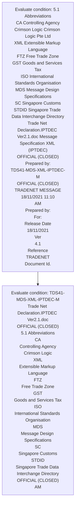
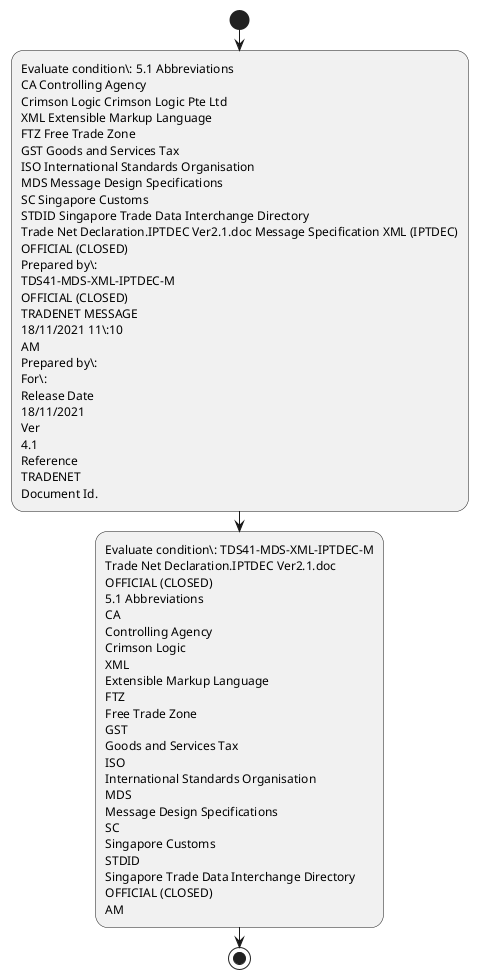

# Chapter  / Section 5.1: Abbreviations

**Chapter Title:** TradeNetDeclaration.IPTDEC Ver2.1 (2)

**Pages:** 5, 6

**Purpose:** 5.1 Abbreviations
CA Controlling Agency
Crimson Logic Crimson Logic Pte Ltd
XML Extensible Markup Language
FTZ Free Trade Zone
GST Goods and Services Tax
ISO International Standards Organisation
MDS Message Design Specifications
SC Singapore Customs
STDID Singapore Trade Data Interchange Directory
Trade Net Declaration.IPTDEC Ver2.1.doc Message Specification XML (IPTDEC)
OFFICIAL (CLOSED)
Prepared by:
TDS41-MDS-XML-IPTDEC-M
OFFICIAL (CLOSED)
TRADENET MESSAGE
18/11/2021 11:10
AM
Prepared by:
For:
Release Date
18/11/2021
Ver
4.1
Reference
TRADENET
Document Id.

**Purpose Thanglish:** Indha Abbreviations section-la, 5.1 Abbreviations
CA Controlling Agency
Crimson Logic Crimson Logic Pte Ltd
XML Extensible Markup Language
FTZ Free Trade Zone
GST Goods and Services Tax
ISO International Standards Organisation
MDS Message Design Specifications
SC Singapore Customs
STDID Singapore Trade Data Interchange Directory
Trade Net Declaration.IPTDEC Ver2.1.doc Message Specification XML (IPTDEC)
OFFICIAL (CLOSED)
Prepared by:
TDS41-MDS-XML-IPTDEC-M
OFFICIAL (CLOSED)
TRADENET MESSAGE
18/11/2021 11:10
AM
Prepared by:
For:
Release Date
18/11/2021
Ver
4.1
Reference
TRADENET
Document Id.

**Summary:** 5.1 Abbreviations
CA Controlling Agency
Crimson Logic Crimson Logic Pte Ltd
XML Extensible Markup Language
FTZ Free Trade Zone
GST Goods and Services Tax
ISO International Standards Organisation
MDS Message Design Specifications
SC Singapore Customs
STDID Singapore Trade Data Interchange Directory
Trade Net Declaration.IPTDEC Ver2.1.doc Message Specification XML (IPTDEC)
OFFICIAL (CLOSED)
Prepared by:
TDS41-MDS-XML-IPTDEC-M
OFFICIAL (CLOSED)
TRADENET MESSAGE
18/11/2021 11:10
AM
Prepared by:
For:
Release Date
18/11/2021
Ver
4.1
Reference
TRADENET
Document Id. TDS41-MDS-XML-IPTDEC-M
Trade Net Declaration.IPTDEC Ver2.1.doc
OFFICIAL (CLOSED)
5.1 Abbreviations
CA
Controlling Agency
Crimson Logic
XML
Extensible Markup Language
FTZ
Free Trade Zone
GST
Goods and Services Tax
ISO
International Standards Organisation
MDS
Message Design Specifications
SC
Singapore Customs
STDID
Singapore Trade Data Interchange Directory
OFFICIAL (CLOSED)
AM

**Business Meaning:** 5.1 Abbreviations
CA Controlling Agency
Crimson Logic Crimson Logic Pte Ltd
XML Extensible Markup Language
FTZ Free Trade Zone
GST Goods and Services Tax
ISO International Standards Organisation
MDS Message Design Specifications
SC Singapore Customs
STDID Singapore Trade Data Interchange Directory
Trade Net Declaration.IPTDEC Ver2.1.doc Message Specification XML (IPTDEC)
OFFICIAL (CLOSED)
Prepared by:
TDS41-MDS-XML-IPTDEC-M
OFFICIAL (CLOSED)
TRADENET MESSAGE
18/11/2021 11:10
AM
Prepared by:
For:
Release Date
18/11/2021
Ver
4.1
Reference
TRADENET
Document Id.

**Business Explanation:** 5.1 Abbreviations
CA Controlling Agency
Crimson Logic Crimson Logic Pte Ltd
XML Extensible Markup Language
FTZ Free Trade Zone
GST Goods and Services Tax
ISO International Standards Organisation
MDS Message Design Specifications
SC Singapore Customs
STDID Singapore Trade Data Interchange Directory
Trade Net Declaration.IPTDEC Ver2.1.doc Message Specification XML (IPTDEC)
OFFICIAL (CLOSED)
Prepared by:
TDS41-MDS-XML-IPTDEC-M
OFFICIAL (CLOSED)
TRADENET MESSAGE
18/11/2021 11:10
AM
Prepared by:
For:
Release Date
18/11/2021
Ver
4.1
Reference
TRADENET
Document Id. TDS41-MDS-XML-IPTDEC-M
Trade Net Declaration.IPTDEC Ver2.1.doc
OFFICIAL (CLOSED)
5.1 Abbreviations
CA
Controlling Agency
Crimson Logic
XML
Extensible Markup Language
FTZ
Free Trade Zone
GST
Goods and Services Tax
ISO
International Standards Organisation
MDS
Message Design Specifications
SC
Singapore Customs
STDID
Singapore Trade Data Interchange Directory
OFFICIAL (CLOSED)
AM

**Business Explanation Thanglish:** Indha Abbreviations section-la, 5.1 Abbreviations
CA Controlling Agency
Crimson Logic Crimson Logic Pte Ltd
XML Extensible Markup Language
FTZ Free Trade Zone
GST Goods and Services Tax
ISO International Standards Organisation
MDS Message Design Specifications
SC Singapore Customs
STDID Singapore Trade Data Interchange Directory
Trade Net Declaration.IPTDEC Ver2.1.doc Message Specification XML (IPTDEC)
OFFICIAL (CLOSED)
Prepared by:
TDS41-MDS-XML-IPTDEC-M
OFFICIAL (CLOSED)
TRADENET MESSAGE
18/11/2021 11:10
AM
Prepared by:
For:
Release Date
18/11/2021
Ver
4.1
Reference
TRADENET
Document Id. TDS41-MDS-XML-IPTDEC-M
Trade Net Declaration.IPTDEC Ver2.1.doc
OFFICIAL (CLOSED)
5.1 Abbreviations
CA
Controlling Agency
Crimson Logic
XML
Extensible Markup Language
FTZ
Free Trade Zone
GST
Goods and Services Tax
ISO
International Standards Organisation
MDS
Message Design Specifications
SC
Singapore Customs
STDID
Singapore Trade Data Interchange Directory
OFFICIAL (CLOSED)
AM

## Business Logic
- None identified

## Business Rules
- rule_id=CH-SEC5_1-R001, rule_description=5.1 Abbreviations
CA Controlling Agency
Crimson Logic Crimson Logic Pte Ltd
XML Extensible Markup Language
FTZ Free Trade Zone
GST Goods and Services Tax
ISO International Standards Organisation
MDS Message Design Specifications
SC Singapore Customs
STDID Singapore Trade Data Interchange Directory
Trade Net Declaration.IPTDEC Ver2.1.doc Message Specification XML (IPTDEC)
OFFICIAL (CLOSED)
Prepared by:
TDS41-MDS-XML-IPTDEC-M
OFFICIAL (CLOSED)
TRADENET MESSAGE
18/11/2021 11:10
AM
Prepared by:
For:
Release Date
18/11/2021
Ver
4.1
Reference
TRADENET
Document Id. TDS41-MDS-XML-IPTDEC-M
Trade Net Declaration.IPTDEC Ver2.1.doc
OFFICIAL (CLOSED)
5.1 Abbreviations
CA
Controlling Agency
Crimson Logic
XML
Extensible Markup Language
FTZ
Free Trade Zone
GST
Goods and Services Tax
ISO
International Standards Organisation
MDS
Message Design Specifications
SC
Singapore Customs
STDID
Singapore Trade Data Interchange Directory
OFFICIAL (CLOSED)
AM, trigger=Abbreviations, condition=5.1 Abbreviations
CA Controlling Agency
Crimson Logic Crimson Logic Pte Ltd
XML Extensible Markup Language
FTZ Free Trade Zone
GST Goods and Services Tax
ISO International Standards Organisation
MDS Message Design Specifications
SC Singapore Customs
STDID Singapore Trade Data Interchange Directory
Trade Net Declaration.IPTDEC Ver2.1.doc Message Specification XML (IPTDEC)
OFFICIAL (CLOSED)
Prepared by:
TDS41-MDS-XML-IPTDEC-M
OFFICIAL (CLOSED)
TRADENET MESSAGE
18/11/2021 11:10
AM
Prepared by:
For:
Release Date
18/11/2021
Ver
4.1
Reference
TRADENET
Document Id., validation=Not explicitly covered in uploaded documents., action=Manual review required., exception=No explicit exception found in uploaded documents., output=DEKAI should produce a compliance decision for 5.1 - Abbreviations.

## Conditions
- 5.1 Abbreviations
CA Controlling Agency
Crimson Logic Crimson Logic Pte Ltd
XML Extensible Markup Language
FTZ Free Trade Zone
GST Goods and Services Tax
ISO International Standards Organisation
MDS Message Design Specifications
SC Singapore Customs
STDID Singapore Trade Data Interchange Directory
Trade Net Declaration.IPTDEC Ver2.1.doc Message Specification XML (IPTDEC)
OFFICIAL (CLOSED)
Prepared by:
TDS41-MDS-XML-IPTDEC-M
OFFICIAL (CLOSED)
TRADENET MESSAGE
18/11/2021 11:10
AM
Prepared by:
For:
Release Date
18/11/2021
Ver
4.1
Reference
TRADENET
Document Id.
- TDS41-MDS-XML-IPTDEC-M
Trade Net Declaration.IPTDEC Ver2.1.doc
OFFICIAL (CLOSED)
5.1 Abbreviations
CA
Controlling Agency
Crimson Logic
XML
Extensible Markup Language
FTZ
Free Trade Zone
GST
Goods and Services Tax
ISO
International Standards Organisation
MDS
Message Design Specifications
SC
Singapore Customs
STDID
Singapore Trade Data Interchange Directory
OFFICIAL (CLOSED)
AM

## Condition Logic
- id=.5.1.1, if=5.1 Abbreviations
CA Controlling Agency
Crimson Logic Crimson Logic Pte Ltd
XML Extensible Markup Language
FTZ Free Trade Zone
GST Goods and Services Tax
ISO International Standards Organisation
MDS Message Design Specifications
SC Singapore Customs
STDID Singapore Trade Data Interchange Directory
Trade Net Declaration.IPTDEC Ver2.1.doc Message Specification XML (IPTDEC)
OFFICIAL (CLOSED)
Prepared by:
TDS41-MDS-XML-IPTDEC-M
OFFICIAL (CLOSED)
TRADENET MESSAGE
18/11/2021 11:10
AM
Prepared by:
For:
Release Date
18/11/2021
Ver
4.1
Reference
TRADENET
Document Id., then=Route for review, source=5.1 Abbreviations
CA Controlling Agency
Crimson Logic Crimson Logic Pte Ltd
XML Extensible Markup Language
FTZ Free Trade Zone
GST Goods and Services Tax
ISO International Standards Organisation
MDS Message Design Specifications
SC Singapore Customs
STDID Singapore Trade Data Interchange Directory
Trade Net Declaration.IPTDEC Ver2.1.doc Message Specification XML (IPTDEC)
OFFICIAL (CLOSED)
Prepared by:
TDS41-MDS-XML-IPTDEC-M
OFFICIAL (CLOSED)
TRADENET MESSAGE
18/11/2021 11:10
AM
Prepared by:
For:
Release Date
18/11/2021
Ver
4.1
Reference
TRADENET
Document Id.
- id=.5.1.2, if=TDS41-MDS-XML-IPTDEC-M
Trade Net Declaration.IPTDEC Ver2.1.doc
OFFICIAL (CLOSED)
5.1 Abbreviations
CA
Controlling Agency
Crimson Logic
XML
Extensible Markup Language
FTZ
Free Trade Zone
GST
Goods and Services Tax
ISO
International Standards Organisation
MDS
Message Design Specifications
SC
Singapore Customs
STDID
Singapore Trade Data Interchange Directory
OFFICIAL (CLOSED)
AM, then=Route for review, source=TDS41-MDS-XML-IPTDEC-M
Trade Net Declaration.IPTDEC Ver2.1.doc
OFFICIAL (CLOSED)
5.1 Abbreviations
CA
Controlling Agency
Crimson Logic
XML
Extensible Markup Language
FTZ
Free Trade Zone
GST
Goods and Services Tax
ISO
International Standards Organisation
MDS
Message Design Specifications
SC
Singapore Customs
STDID
Singapore Trade Data Interchange Directory
OFFICIAL (CLOSED)
AM

## Validations
- None identified

## Exceptions
- None identified

## Dependencies
- 1
- 2
- 4
- 5
- 8

## Authorities
- Customs
- SC Singapore Customs
- Singapore Customs

## Required Documents
- Trade Net Declaration

## Timelines
- None identified

## Actions
- None identified

## Workflow
- Evaluate condition: 5.1 Abbreviations
CA Controlling Agency
Crimson Logic Crimson Logic Pte Ltd
XML Extensible Markup Language
FTZ Free Trade Zone
GST Goods and Services Tax
ISO International Standards Organisation
MDS Message Design Specifications
SC Singapore Customs
STDID Singapore Trade Data Interchange Directory
Trade Net Declaration.IPTDEC Ver2.1.doc Message Specification XML (IPTDEC)
OFFICIAL (CLOSED)
Prepared by:
TDS41-MDS-XML-IPTDEC-M
OFFICIAL (CLOSED)
TRADENET MESSAGE
18/11/2021 11:10
AM
Prepared by:
For:
Release Date
18/11/2021
Ver
4.1
Reference
TRADENET
Document Id.
- Evaluate condition: TDS41-MDS-XML-IPTDEC-M
Trade Net Declaration.IPTDEC Ver2.1.doc
OFFICIAL (CLOSED)
5.1 Abbreviations
CA
Controlling Agency
Crimson Logic
XML
Extensible Markup Language
FTZ
Free Trade Zone
GST
Goods and Services Tax
ISO
International Standards Organisation
MDS
Message Design Specifications
SC
Singapore Customs
STDID
Singapore Trade Data Interchange Directory
OFFICIAL (CLOSED)
AM

## Workflow ASCII
```text
Abbreviations
Evaluate condition: 5.1 Abbreviations
CA Controlling Agency
Crimson Logic Crimson Logic Pte Ltd
XML Extensible Markup Language
FTZ Free Trade Zone
GST Goods and Services Tax
ISO International Standards Organisation
MDS Message Design Specifications
SC Singapore Customs
STDID Singapore Trade Data Interchange Directory
Trade Net Declaration.IPTDEC Ver2.1.doc Message Specification XML (IPTDEC)
OFFICIAL (CLOSED)
Prepared by:
TDS41-MDS-XML-IPTDEC-M
OFFICIAL (CLOSED)
TRADENET MESSAGE
18/11/2021 11:10
AM
Prepared by:
For:
Release Date
18/11/2021
Ver
4.1
Reference
TRADENET
Document Id.
   |
   v
Evaluate condition: TDS41-MDS-XML-IPTDEC-M
Trade Net Declaration.IPTDEC Ver2.1.doc
OFFICIAL (CLOSED)
5.1 Abbreviations
CA
Controlling Agency
Crimson Logic
XML
Extensible Markup Language
FTZ
Free Trade Zone
GST
Goods and Services Tax
ISO
International Standards Organisation
MDS
Message Design Specifications
SC
Singapore Customs
STDID
Singapore Trade Data Interchange Directory
OFFICIAL (CLOSED)
AM
```

## Decision Tree
- IF section 5.1 applies THEN proceed with standard DGFT workflow

## Decision Tree ASCII
```text
Abbreviations Decision
IF section 5.1 applies THEN proceed with standard DGFT workflow
```

## Examples
- User asks to process Abbreviations; the platform checks conditions, validations, and documents before action.

**Real-world Example:** Example: an importer or exporter invokes Abbreviations, submits Trade Net Declaration, and DEKAI uses the extracted rules to follow the abbreviations process.

**Real-world Example Thanglish:** Indha Abbreviations section-la, Example: an importer or exporter invokes Abbreviations, submits Trade Net Declaration, and DEKAI uses the extracted rules to follow the abbreviations process.

## AI Rules
- None identified

## Database Fields
- name=section_code, type=string, required=True, source=parsed_section_heading
- name=section_title, type=string, required=True, source=parsed_section_heading
- name=pte_flag, type=boolean, required=False, source=keyword:Pte
- name=ltd_flag, type=boolean, required=False, source=keyword:Ltd
- name=xml_flag, type=boolean, required=False, source=keyword:XML
- name=ftz_flag, type=boolean, required=False, source=keyword:FTZ
- name=gst_flag, type=boolean, required=False, source=keyword:GST
- name=and_flag, type=boolean, required=False, source=keyword:and
- name=tax_flag, type=boolean, required=False, source=keyword:Tax
- name=iso_flag, type=boolean, required=False, source=keyword:ISO
- name=document_1_submitted, type=boolean, required=True, source=Trade Net Declaration

## API Requirements
- method=GET, path=/api/dgft/sections/5.1, purpose=Retrieve knowledge payload for section 5.1, query_params=['include=workflow,decision_tree,validations'], response_fields=['section', 'title', 'summary', 'conditions', 'validations', 'exceptions', 'workflow', 'decision_tree']
- method=POST, path=/api/dgft/Abbreviations/validate, purpose=Validate inputs and documents for Abbreviations, request_fields=['section_code', 'section_title', 'document_1_submitted'], response_fields=['status', 'errors', 'warnings', 'next_actions']

## UI Screens
- screen_id=Abbreviations_overview, name=Abbreviations Overview, purpose=Show section summary, authority, timeline, and eligibility cues., widgets=['summary_card', 'conditions_table', 'authority_badges', 'timeline_panel']
- screen_id=Abbreviations_submission, name=Abbreviations Submission, purpose=Capture applicant data and supporting documents., widgets=['dynamic_form', 'document_uploader', 'validation_panel', 'next_action_footer'], fields=['section_code', 'section_title', 'pte_flag', 'ltd_flag', 'xml_flag', 'ftz_flag', 'gst_flag', 'and_flag']

## Error Messages
- Validation failed because the section requirements were not fully met.

## FAQ
- question_en=What is the purpose of section 5.1?, answer_en=5.1 Abbreviations
CA Controlling Agency
Crimson Logic Crimson Logic Pte Ltd
XML Extensible Markup Language
FTZ Free Trade Zone
GST Goods and Services Tax
ISO International Standards Organisation
MDS Message Design Specifications
SC Singapore Customs
STDID Singapore Trade Data Interchange Directory
Trade Net Declaration.IPTDEC Ver2.1.doc Message Specification XML (IPTDEC)
OFFICIAL (CLOSED)
Prepared by:
TDS41-MDS-XML-IPTDEC-M
OFFICIAL (CLOSED)
TRADENET MESSAGE
18/11/2021 11:10
AM
Prepared by:
For:
Release Date
18/11/2021
Ver
4.1
Reference
TRADENET
Document Id. TDS41-MDS-XML-IPTDEC-M
Trade Net Declaration.IPTDEC Ver2.1.doc
OFFICIAL (CLOSED)
5.1 Abbreviations
CA
Controlling Agency
Crimson Logic
XML
Extensible Markup Language
FTZ
Free Trade Zone
GST
Goods and Services Tax
ISO
International Standards Organisation
MDS
Message Design Specifications
SC
Singapore Customs
STDID
Singapore Trade Data Interchange Directory
OFFICIAL (CLOSED)
AM, question_thanglish=Indha Abbreviations section-la, What is the purpose of section 5.1?, answer_thanglish=Indha Abbreviations section-la, 5.1 Abbreviations
CA Controlling Agency
Crimson Logic Crimson Logic Pte Ltd
XML Extensible Markup Language
FTZ Free Trade Zone
GST Goods and Services Tax
ISO International Standards Organisation
MDS Message Design Specifications
SC Singapore Customs
STDID Singapore Trade Data Interchange Directory
Trade Net Declaration.IPTDEC Ver2.1.doc Message Specification XML (IPTDEC)
OFFICIAL (CLOSED)
Prepared by:
TDS41-MDS-XML-IPTDEC-M
OFFICIAL (CLOSED)
TRADENET MESSAGE
18/11/2021 11:10
AM
Prepared by:
For:
Release Date
18/11/2021
Ver
4.1
Reference
TRADENET
Document Id. TDS41-MDS-XML-IPTDEC-M
Trade Net Declaration.IPTDEC Ver2.1.doc
OFFICIAL (CLOSED)
5.1 Abbreviations
CA
Controlling Agency
Crimson Logic
XML
Extensible Markup Language
FTZ
Free Trade Zone
GST
Goods and Services Tax
ISO
International Standards Organisation
MDS
Message Design Specifications
SC
Singapore Customs
STDID
Singapore Trade Data Interchange Directory
OFFICIAL (CLOSED)
AM
- question_en=What documents are required under Abbreviations?, answer_en=Trade Net Declaration, question_thanglish=Indha Abbreviations section-la, What documents are required under Abbreviations?, answer_thanglish=Indha Abbreviations section-la, Trade Net Declaration
- question_en=Which authority handles Abbreviations?, answer_en=Customs, SC Singapore Customs, Singapore Customs, question_thanglish=Indha Abbreviations section-la, Which authority handles Abbreviations?, answer_thanglish=Indha Abbreviations section-la, Customs, SC Singapore Customs, Singapore Customs

## Questions Users May Ask
- What does Abbreviations require?
- Which documents are needed for Abbreviations?
- How does DEKAI validate Abbreviations requests?

## Expected AI Answers
- Abbreviations requires the platform to interpret the section text, apply the extracted business rules, and present the correct next action.
- Required documents are inferred from the section text: Trade Net Declaration
- DEKAI validates Abbreviations by checking conditions, required documents, authority references, and exception clauses before recommending an outcome.

## AI Q&A Examples
- question_en=User asks: How do I comply with Abbreviations?, answer_en=AI answers: DEKAI should evaluate section 5.1, apply the extracted rules, and guide the user through Evaluate condition: 5.1 Abbreviations
CA Controlling Agency
Crimson Logic Crimson Logic Pte Ltd
XML Extensible Markup Language
FTZ Free Trade Zone
GST Goods and Services Tax
ISO International Standards Organisation
MDS Message Design Specifications
SC Singapore Customs
STDID Singapore Trade Data Interchange Directory
Trade Net Declaration.IPTDEC Ver2.1.doc Message Specification XML (IPTDEC)
OFFICIAL (CLOSED)
Prepared by:
TDS41-MDS-XML-IPTDEC-M
OFFICIAL (CLOSED)
TRADENET MESSAGE
18/11/2021 11:10
AM
Prepared by:
For:
Release Date
18/11/2021
Ver
4.1
Reference
TRADENET
Document Id.., question_thanglish=Indha Abbreviations section-la, User asks: How do I comply with Abbreviations?, answer_thanglish=Indha Abbreviations section-la, AI answers: DEKAI should evaluate section 5.1, apply the extracted rules, and guide the user through Evaluate condition: 5.1 Abbreviations
CA Controlling Agency
Crimson Logic Crimson Logic Pte Ltd
XML Extensible Markup Language
FTZ Free Trade Zone
GST Goods and Services Tax
ISO International Standards Organisation
MDS Message Design Specifications
SC Singapore Customs
STDID Singapore Trade Data Interchange Directory
Trade Net Declaration.IPTDEC Ver2.1.doc Message Specification XML (IPTDEC)
OFFICIAL (CLOSED)
Prepared by:
TDS41-MDS-XML-IPTDEC-M
OFFICIAL (CLOSED)
TRADENET MESSAGE
18/11/2021 11:10
AM
Prepared by:
For:
Release Date
18/11/2021
Ver
4.1
Reference
TRADENET
Document Id..
- question_en=User asks: Which validations apply to Abbreviations?, answer_en=AI answers: Applicable validations are not explicitly covered in the uploaded documents., question_thanglish=Indha Abbreviations section-la, User asks: Which validations apply to Abbreviations?, answer_thanglish=Indha Abbreviations section-la, AI answers: Applicable validations are not explicitly covered in the uploaded documents.

## DEKAI AI Implementation Notes
- Capture chapter , section 5.1, title, and page references as immutable knowledge metadata.
- Bind validations for Abbreviations into a rule engine keyed by the rule IDs extracted for this section.
- Expose document upload controls for: Trade Net Declaration.
- Route escalations or approvals to: Customs, SC Singapore Customs, Singapore Customs.
- Show contextual links to related sections: 1, 2, 4, 5, 8.

## DEKAI AI Implementation Notes Thanglish
- Indha Abbreviations section-la, Capture chapter , section 5.1, title, and page references as immutable knowledge metadata.
- Indha Abbreviations section-la, Bind validations for Abbreviations into a rule engine keyed by the rule IDs extracted for this section.
- Indha Abbreviations section-la, Expose document upload controls for: Trade Net Declaration.
- Indha Abbreviations section-la, Route escalations or approvals to: Customs, SC Singapore Customs, Singapore Customs.
- Indha Abbreviations section-la, Show contextual links to related sections: 1, 2, 4, 5, 8.

## AI Metadata
- Keywords: Pte, Ltd, XML, FTZ, GST, and, Tax, ISO, MDS, Net, doc, For, Ver, Free, Zone, Data, Date, Logic, Trade, Goods
- Search Keywords: Pte, Ltd, XML, FTZ, GST, and, Tax, ISO, MDS, Net, doc, For, Ver, Free, Zone, Data, Date, Logic, Trade, Goods
- Intent: Provide knowledge guidance for Abbreviations.
- Tags: 5.1, Abbreviations, document-driven, dgft
- Related Sections: 1, 2, 4, 5, 8
- Related Chapters: 
- Related Rules: 

## Mermaid


## PlantUML

